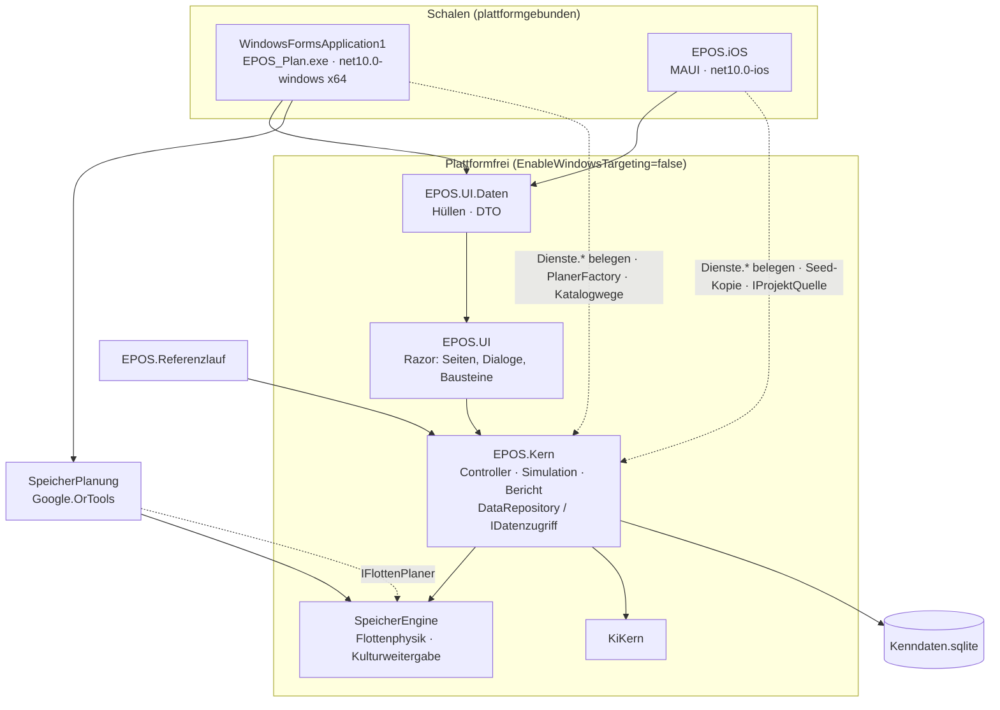
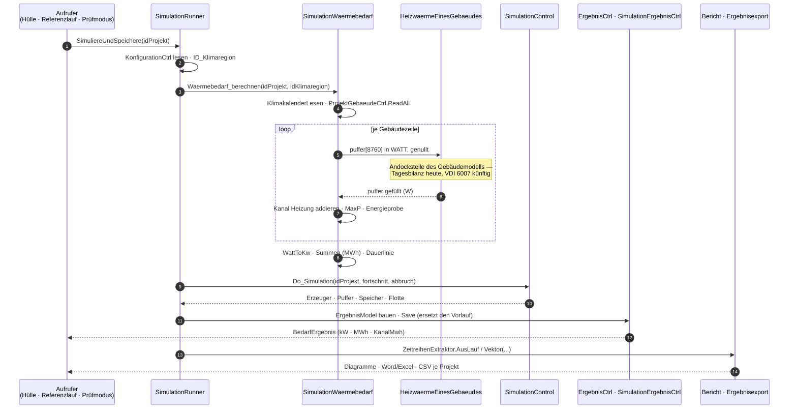
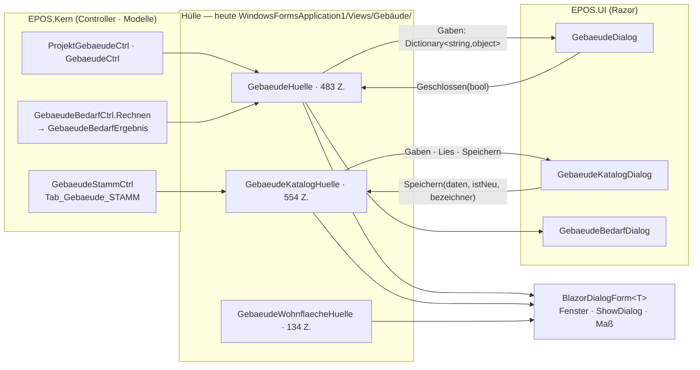
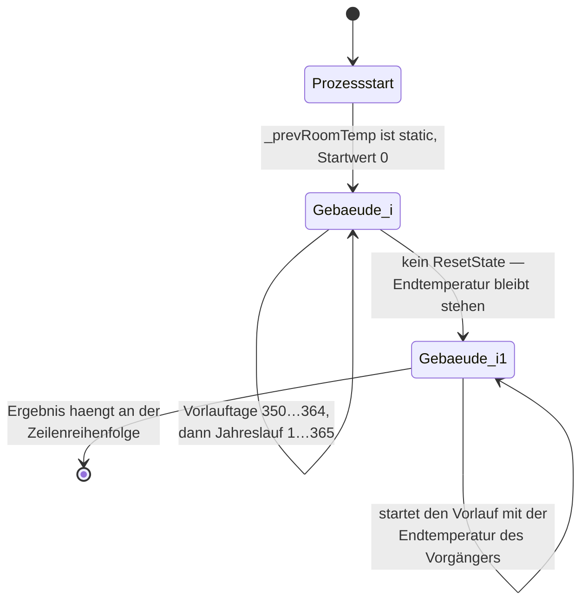

# Befund T — Softwarearchitektur des Bestands, soweit die Gebäudesimulation sie berührt (15.09.2026)

**Zweck.** Bestandsgrundlage für den beauftragten Systementwurf und die Architektur der
VDI-6007-Gebäudesimulation (Softwarearchitektur, Datenmodell-Architektur,
Dialogführungs-Architektur, Integration). Dieser Befund sagt nicht, was zu bauen ist, sondern
beschreibt das Gerüst, in das es gebaut wird: Schichten und die Richtung ihrer Kanten, die
benannten Nähte zwischen Kern und Schalen, den Ablauf eines Laufs vom Start bis zum Bericht mit
der Stelle, an der ein Gebäudemodell andockt, die Zustands- und Fadenlage, und das
Leistungsbudget, in das eine Stundenrechnung passen muss.

**Quellen.** Eigene Lesung am Stand des Zweigs `ios_migration_september` vom 15.09.2026: die vier
`CLAUDE.md` (Wurzel, [`EPOS.Kern`](../../../EPOS.Kern/CLAUDE.md), [`EPOS.UI`](../../../EPOS.UI/CLAUDE.md),
[`EPOS.iOS`](../../../EPOS.iOS/CLAUDE.md)), die sieben Projektdateien, `EPOS.Kern/Allgemein/Dienste/`,
`EPOS.Kern/Allgemein/IDatenzugriff.cs`, `DataRepository.cs`, `Allgemein/Simulation/`,
`Allgemein/Bericht/`, `Allgemein/Export/`, `SpeicherEngine/FlottenModel.cs`,
`EPOS.Kern/Controller/FlottenPlanerLage.cs`, `EPOS.UI.Daten/Katalogwege.cs` und
`EPOS.UI.Daten/Simulation/SimulationPlattformwege.cs`, die Wächtertests in `EPOS.Kern.Tests`
und `EPOS.UI.Tests`, `WindowsFormsApplication1/Program.cs`, `EPOS.iOS/Datenbankbereitstellung.cs`,
[`.github/workflows/kern.yml`](../../../.github/workflows/kern.yml) und
`Referenzlaeufe/2026-09-11_R7_Speicherflotte/protokoll.txt`. Dazu die Gliederung von
[`Konzept_Simulationsablauf_EPOS-Plan.md`](../Konzept_Simulationsablauf_EPOS-Plan.md) mit den
Abschnitten 1.2–1.4 und 9.3–9.4.

**Abgrenzung.** Was die Befunde [L](2026-09-15_Befund_L_Einbindung_Kern.md) (Einbindung Kern),
[M](2026-09-15_Befund_M_Gebaeudedialog.md) (Gebäudedialog),
[N](2026-09-15_Befund_N_IFC-Import_Entwurf.md) (IFC-Import) und
[Q](2026-09-15_Befund_Q_Muster_Datenmodell_Dialoge.md) (Muster Datenmodell/Dialoge) bereits
belegen, wird hier **nicht wiederholt**, sondern verwiesen. Ergänzt ist, was diese vier nicht
führen: die Schichtung als Ganzes, die Abhängigkeitsregeln und ihre Wächter, der Lauf als
Sequenz, die Fadenlage und das Leistungsbudget.

---

## 0. Das Ergebnis in acht Sätzen

1. **Sieben Projekte, eine Richtung.** Der Kern kennt keine Oberfläche, die Oberfläche keine
   Datenbank, die Hüllen kennen beide, und die zwei Schalen kennen alles — jede Kante zeigt nach
   innen, und `EnableWindowsTargeting=false` in fünf Projektdateien macht einen Rückwärtsbezug zum
   Übersetzungsfehler statt zum Laufzeitfehler auf dem iPad.
2. **Die Umgebung erreicht der Kern über genau neun statische Dienste** (`Dienste.cs:39-67`), jeder
   mit einer folgenlosen Standardfassung; belegt wird an **einer** Stelle — `Program.Main` unter
   Windows, `MauiProgram` auf iOS. Ein Gebäudemodell, das eine Datei, einen Pfad oder eine Meldung
   braucht, hat dort seinen Weg und sonst nirgends.
3. **Wo eine Schale mehr kann als die andere, steht eine benannte Naht, kein stiller Ausfall.**
   `IFlottenPlaner` (`SpeicherEngine/FlottenModel.cs:493`) mit `FlottenPlanerLage.Verfuegbar` /
   `.Grund` / `.ZielMoeglich` (`FlottenPlanerLage.cs:55`, `:75`, `:80`) ist das ausgereifteste
   Muster im Haus; `Katalogwege` und `SimulationPlattformwege` sind seine kleineren Geschwister.
4. **Der Lauf hat eine feste Reihenfolge und genau zwei Umrechnungskanten.**
   `SimulationRunner.Simuliere` liest die Konfiguration (`:144`), rechnet Wärme- und Strombedarf
   (`:184`), führt `Do_Simulation` (`:217`) und baut daraus das `ErgebnisModel` (`:341-370`) —
   Watt→kW und kWh→MWh geschehen dabei je einmal, und der Einheitenwächter hält das fest.
5. **Das Gebäudemodell dockt an genau einer Stelle an** —
   `SimulationWaermebedarf.HeizwaermeEinesGebaeudes` (Befund L 1.2); davor und dahinter ändert sich
   nichts, weder der Puffer noch der Kanal, noch die Dauerlinie, noch die Energieprobe.
6. **Das Muster der Oberfläche ist dreistufig: Kern-Controller → Hülle → Razor-Komponente**, und
   die Komponente sieht nie einen Typ, der schreiben könnte. Für die Gebäude liegt die Hülle noch
   **vollständig in der Windows-Schale** (`Views/Gebäude/`, drei Dateien, 1 171 Zeilen) — auf iOS
   ist der Gebäudeeditor damit heute nicht erreichbar (Befund M 1.8, 5.9).
7. **Dreizehn Wächter- und Strukturtests halten diese Architektur**, vom Fadenstart über die
   Einheiten und den Zahlentyp bis zum Parametersatz und der Dokumentationsordnung; neue Klassen
   und Tabellen fallen unter sie, ohne dass jemand sie anmelden müsste — mit **einer** Lücke, die
   Befund L 5.3 benennt (der Einheitenwächter führt eine Namensliste).
8. **Das Leistungsbudget ist üppig.** Dreizehn Referenzprojekte mit 15 Gebäudezeilen rechnen heute
   in **4 Sekunden** (`Referenzlaeufe/2026-09-11_R7_Speicherflotte/protokoll.txt:8`); ein
   VDI-6007-Gebäudejahr kostet rund 5 ms (Befund H 2). Der volle Basislauf wüchse also um rund
   0,08 s, der CI-Lauf um rund 0,02 s; erst ein Projekt mit 100 Gebäuden erreicht rund 0,5–1 s.

---

## 1. Schichten und Abhängigkeitsregeln

### 1.1 Die Projekte und die Richtung ihrer Kanten

| Projekt | Ziel-Framework | Fenster | Kanten nach | Beleg |
|---|---|---|---|---|
| `EPOS.Kern` | `net10.0`, `EnableWindowsTargeting=false` | — | `SpeicherEngine`, `KiKern` | `EPOS.Kern.csproj:35-36`, `:49-53` |
| `SpeicherEngine` | `net10.0`, AnyCPU | — | — | `SpeicherEngine.csproj:16` |
| `KiKern` | `net10.0` | — | — | Kern-Referenz `EPOS.Kern.csproj:53` |
| `EPOS.UI` | `net10.0`, `EWT=false`, SDK `…Razor` | — | `EPOS.Kern` | `EPOS.UI.csproj:24-25`, `:44` |
| `EPOS.UI.Daten` | `net10.0`, `EWT=false` | — | `EPOS.UI` (und darüber den Kern) | `EPOS.UI.Daten.csproj:37-38`, `:52` |
| `SpeicherPlanung` | `net10.0`, `Google.OrTools` | — | `SpeicherEngine` | `SpeicherPlanung.csproj:4`, `:13`, `:17` |
| `WindowsFormsApplication1` | `net10.0-windows`, **x64**, SDK `…Razor`, Assembly `EPOS_Plan` | WinForms + `BlazorWebView` | Kern, UI, UI.Daten, SpeicherEngine, **SpeicherPlanung**, KiKern | `…csproj:23`, `:50`, `:66-67`, `:103-136` |
| `EPOS.iOS` | `net10.0-ios`, MAUI, SDK `…Razor` | eine `ContentPage`, `BlazorWebView` | Kern, UI, UI.Daten — **nicht** SpeicherPlanung | `EPOS.iOS.csproj:35`, `:81-87` |
| `EPOS.Referenzlauf` | `net10.0`, `EWT=false` | — | `EPOS.Kern` | `EPOS.Referenzlauf.csproj:23-24`, `:36` |

**Zwei Dinge fallen für die Architektur ins Gewicht.**

- **`EPOS.UI.Daten` hängt an `EPOS.UI`, nicht umgekehrt** (`EPOS.UI.Daten.csproj:52`). Die Hülle
  baut die DTO der Komponente, also muss sie deren Typen sehen; die Komponente sieht die Hülle nie.
  Das ist die Richtung, in der auch eine künftige Gebäudehülle in `EPOS.UI.Daten` liegen muss.
- **`Google.OrTools` hängt allein an `SpeicherPlanung`, und nur die Windows-Schale referenziert es**
  (`WindowsFormsApplication1.csproj:110`; in `EPOS.iOS.csproj:81-87` fehlt die Zeile). Wer für die
  Gebäudesimulation ein Paket braucht, das iOS nicht trägt — Befund N 2.1/2.3 prüft genau das für
  xBIM —, findet hier das eingeübte Muster: eigenes Projekt, Schnittstelle im Kern, Registrierung
  in der Schale.

**Sichtbarkeit statt `public`.** Der Kern hebt keinen Typ an, nur weil eine Schale ihn sieht; er
gibt `InternalsVisibleTo` frei — für `EPOS_Plan`, `EPOS.Kern.Tests`, `EPOS.iOS`, `EPOS.UI.Daten`,
`Testdatenbankschema`, `Auslieferungsvorlage` (`EPOS.Kern.csproj:66-97`). `GebaeudeBedarfCtrl` ist
genau deshalb `internal static` (`EPOS.Kern/Controller/GebaeudeBedarfCtrl.cs:78`) und trotzdem aus
der Hülle und aus den Tests erreichbar.

### 1.2 Was die vier `CLAUDE.md` als Regel setzen

| Quelle | Regel, die für neue Gebäudeklassen gilt |
|---|---|
| Wurzel | Jede Fachänderung wird **einmal** gemacht — im Kern. Keine Datenbank in der Oberfläche; jeder neue Dialog ist eine Razor-Komponente; Texte in `MyResource.Resource.*`, beide Sprachen. Feste Raster 8760/168/365/12, kein Schaltjahr. Neue Beziehungen über **IDs**, nicht über Textfelder; Schemaänderungen als nummerierte Schritte über `SchemaMigration` (ADR-001) |
| `EPOS.Kern/CLAUDE.md:41-71` | Kein WinForms, kein `OleDb`, CA1416 bei 0 ohne `NoWarn`. Datenzugriff **nur** über `DataRepository` mit `new DbParam(…)`, kein zusammengesetzter SQL-Text. Umgebung **nur** über `Dienste.*`, nie über `Program.*`. Maskennamen sind sprachneutrale ASCII-Schlüssel. Oberflächenaufgaben über Haken (`static Action<…>` mit folgenloser Vorbelegung), **nie** über `[ModuleInitializer]`. Feldgrößen fest verdrahtet, Arrays in-place. Parallelität nur über `SpeicherEngine/Kulturweitergabe` |
| `EPOS.Kern/CLAUDE.md:203-206` | **Zwei `git grep`-Wächter müssen leer bleiben:** `\bProgram\.` über `EPOS.Kern/*.cs`; sowie `System.Windows.Forms`, `System.Drawing`, `MessageBox.`, `\bRegistry\.`, `ProtectedData`, `OleDb` |
| `EPOS.UI/CLAUDE.md:11-31` | Kein WinForms, **keine Datenbank** (kein `DataRepository`, `RecordSet`, `DbParam`, kein SQL); auch die **Fachklassen** des Kerns kennt die Komponente nicht — sie gibt einen Ergebnis-Record zurück. Texte über Ressourcen mit deutschem Rückfall; ab rund zehn Anzeigetexten ein `*Texte`-Bündel. Energiemengen **nur** über `Energieeinheit`, nie mit nacktem Faktor 1000 |
| `EPOS.iOS/CLAUDE.md:8` | **Hier steht nichts Fachliches.** Kein Rechenweg, keine Maske, kein SQL — nur Einstiegspunkt, die neun Adapter, der Weg zur Datenbank in der Sandbox und der Prüfmodus |

**Eine Asymmetrie, die der Entwurf kennen muss.** `SchemaMigration` liegt **in der Windows-Schale**
(`WindowsFormsApplication1/Allgemein/Update/SchemaMigration.cs`, gerufen aus
`WindowsFormsApplication1/Program.cs:278`); im Kern liegen nur `SchemaKatalog` und `SchemaStand`
(`EPOS.Kern/Allgemein/Update/`). iOS migriert **nicht** — es kopiert beim Erststart eine
Seed-Datenbank, die den Zielstand schon trägt, und prüft sie über die Zahl der `STRICT`-Tabellen
(`EPOS.iOS/Datenbankbereitstellung.cs:93`, `:157`). Folge: Eine neue Tabelle der
Gebäudesimulation braucht **drei** Eintragungen, nicht eine — den nummerierten Migrationsschritt
(für Bestandsdatenbanken unter Windows), die Auslieferungsvorlage (Neuinstallation und iOS-Seed)
und die Schemapflege der Testdatenbank-Arbeitskopie (Befund L 5.2).

### 1.3 Die neun Umgebungsdienste

`Dienste` ist ein **statischer Halter**, kein DI-Verzeichnis (`EPOS.Kern/Allgemein/Dienste/Dienste.cs:39`),
mit der Begründung im Kopf der Datei: acht austauschbare Haken tragen den Bestand bereits, und
viele Aufrufer sind rein statische Klassen. Jede der neun Eigenschaften hat eine folgenlose
Standardfassung — `StilleDialoge` (`:42`), `KeineDateiwahl` (`:45`), `StandardPfade` (`:48`),
`FluechtigeEinstellungen`, `KeineAblage`, `KeineGeraeteId`, `StandardSprache`, `KeineNavigation`
(`:64`), `LeererProjektKontext` (`:67`). **Ein vergessener Adapter fällt damit als fehlende Wirkung
auf, nicht als Absturz** — genau das macht Referenzlauf, Prüfstand und Konsolenwerkzeug möglich.

Der Datenzugriff hat seine eigene Naht: `IDatenzugriff` (`EPOS.Kern/Allgemein/IDatenzugriff.cs:47`)
beschreibt, was der Kern von einer Datenhaltung braucht; `DataRepository` bleibt die Fassade davor
und hält die eine Umsetzung in einem Feld (`DataRepository.cs:59`,
`internal static IDatenzugriff Zugriff = new SqliteDatenzugriff();`). Der Kopfkommentar sagt
ausdrücklich, was **nicht** hineingehört: der Meldeentscheid (`FehlerMelden`, `EngineModus`), die
vier SQL-Bequemlichkeiten, die Pfadauflösung und alles mit SQLite-Typen in der Signatur
(`IDatenzugriff.cs:19-33`). `DatenzugriffTests` prüft, dass die Naht nicht wieder zuwächst
(`EPOS.Kern.Tests/DatenzugriffTests.cs:101-104`).

### 1.4 Die benannte Naht — drei Ausprägungen, ein Muster

| Naht | Ort | Wie die Schale sie belegt | Was ohne sie geschieht |
|---|---|---|---|
| `IFlottenPlaner` | Vertrag `SpeicherEngine/FlottenModel.cs:493`; Fabrik `SpeicherFlottenProjektCtrl.PlanerFactory` (`:71`); Lage `EPOS.Kern/Controller/FlottenPlanerLage.cs:26` | `WindowsFormsApplication1/Program.cs:109` — **erste Zeile in `Main`**, vor den Diensten | `Verfuegbar` ist falsch (`:55`), `Grund` nennt den Ressourcentext (`:75`), `ZielMoeglich` sperrt die planenden Ziele (`:80`), die reaktiven rechnen überall |
| `Katalogwege` | `EPOS.UI.Daten/Katalogwege.cs:23`, ein `static Func<…>`-Haken (`:30`) | Windows in `Program.Main`; iOS lässt ihn leer | „**Kein Delegat ist kein Knopf**" (`:18-21`) — der Dialog zeigt den Knopf gar nicht erst, die Kernfunktion bleibt vollständig |
| `SimulationPlattformwege` | `EPOS.UI.Daten/Simulation/SimulationPlattformwege.cs:26`, mit `WaermepumpeSperrgrund` (`:51`) und `Ohne(sperrgrund)` (`:54`) | Windows reicht die WinForms-Gaben; iOS ruft `Ohne(...)` | **Benannte Ablehnung**: der Weg fällt nicht still aus, die Hülle meldet den Sperrgrund über `Dienste.Dialog` (`:19-24`) |

**Die Regel, die daraus folgt und die der Entwurf übernehmen sollte:** Ein Weg, den eine Plattform
nicht anbietet, ist entweder **kein Knopf** (die Funktion bleibt ohne ihn vollständig) oder eine
**benannte Ablehnung** (die Funktion ist ohne ihn unvollständig, und der Anwender erfährt warum).
Ein dritter Fall — der Knopf ist da und tut nichts — kommt im Bestand nicht vor.

### 1.5 Die Wächter, die die Architektur durchsetzen

| Wächter | Umfang | Was er prüft |
|---|---|---|
| `ParallelitaetWacheTests` | `EPOS.Kern`, `SpeicherEngine`, `KiKern`, `EPOS.UI.Daten`, `EPOS.UI`; `.cs` **und** `.razor` (`:50-61`) | Sieben Wege, auf denen ein Faden entsteht — `Parallel.For/ForEach/Invoke`, `Task.Run`, `new Thread`, `ThreadPool.QueueUserWorkItem`, `AsParallel()` (`:75-84`). Einzige Ausnahme: `Kulturweitergabe.cs` (`:69`). Trefferliste heute leer |
| `KulturwaechterTests` | `EPOS.Kern.Tests` **und** `EPOS.UI.Tests` | Wer `DefaultThreadCurrent(UI)Culture` setzt, stellt es in `Dispose`/`finally` zurück — oder nutzt `Kulturvorrichtung` bzw. `EposBunitContext` |
| `DiensteSammlungTests` | Quelltext von `EPOS.Kern.Tests` | Wer ein `Dienste.*` tauscht **oder** die Testdatenbank benutzt, trägt `[Collection("Testdatenbank")]` — die **eine** serielle Sammlung. Begründung im Kopf: `Dienste.Dialog` ist prozessweit, xunit trennt nur innerhalb einer Sammlung |
| `EinheitenWacheTests` | Anzeige und Hüllen (Wächter 1); eine **Namensliste** von Simulationsklassen (Wächter 2) | Kein Faktor 1000 auf einer Energiemenge in der Anzeige; Jahres- und Monatssummen tragen `Kwh`/`Mwh`/`Kw` im Namen. Vier Regeln im Kopf (`:14-24`), darunter: umgerechnet wird an genau **zwei** Nähten — `SimulationErgebnisCtrl` (Anzeige) und `SimulationRunner` (Datenbank) |
| `DoubleWacheTests` | alle `.cs` unter `EPOS.Kern/Allgemein/Simulation/` mit **Unterordnern**, plus `BhkwPlan.cs` | Kein `float`, kein `MathF.`, kein `f`-Suffix; Ausnahmeliste leer (Befund L 5.3) |
| `RechenrandTests` | `Rechenrand` selbst | Die Regel dahinter: jede Marke, auf die eine Rechnung **zusteuert**, vergleicht über `Rechenrand.SchwelleErreicht`, nicht über `>=` |
| `DatenzugriffTests` | Fassade und Vertrag, ohne Datenbank | `DataRepository` hält seine Umsetzung hinter `IDatenzugriff` (`:101-104`) |
| `SpaltentypTests` | `SqliteDatenzugriff.LadeTabelle` gegen die Testdatenbank, Projekt 1030 (`:44`) | Der Typ-Rückweg der Zugriffsschicht |
| `RepositoryOrdnungWacheTests` | `git ls-files`, nicht das Dateisystem | Keine `*.bak`/`*.orig`, keine `*.sqlite` außer der Testdatenbank, kein `.work/`, kein `DB-Backup/`. Ohne Git fällt er auf den Dateisystemlauf zurück und **besteht nie still** |
| `DokumentationLinkWacheTests` | `Dokumentation/**` und die fünf `CLAUDE.md` | Jeder relative Verweis hat ein Ziel; **jedes** Papier unter `aktuell/` steht im Index `Dokumentation/LIESMICH.md`; in der Wurzel nur `CLAUDE.md` und `README.md` |
| `WikiProduktdatenWacheTests` | Repo-Quellen der Wiki-Seiten gegen die Katalognamen der Testdatenbank | Keine Hersteller- und Produktdaten im Wiki |
| `ParametersatzTests` (`EPOS.UI.Tests`) | Quelltext der Hüllen, Gegenseite per Reflexion | **Jeder Schlüssel eines `Gaben`-Wörterbuchs trifft ein `[Parameter]`** der Komponente — sonst fällt es erst beim ersten Zeichnen auf, beim Anwender als Absturz |
| `HuellenwegTests` (`EPOS.UI.Tests`) | Hüllen und ihre Delegaten | **Kein modales Systemfenster im Blazor-Ereignis** — wer im `WebMessageReceived`-Rückruf ein modales Fenster hochfährt, startet eine verschachtelte Nachrichtenschleife, während Blazor zeichnet |
| `SchliesskreuzWacheTests` (`EPOS.UI.Tests`) | Dialogköpfe | „Das Kreuz steht beim Titel" — auf iOS gibt es keine Titelleiste, der Weg nach draußen muss im Kopf stehen |

`ProgrammsymbolWacheTests` betrifft allein das Windows-Symbol und ist für die Gebäudesimulation
ohne Gegenstand.

---

## 2. Der Simulationsablauf — vom Start des Laufs bis zum Bericht

### 2.1 Wer den Lauf anstößt

Es gibt **zwei Anstoßwege und eine Rechnung**. `SimulationRunner` ist der kopflose Lauf
(`SimulationRunner.cs:19`; Kopfkommentar `:8-17`: „Kapselt exakt die Nicht-UI-Logik aus
`Form_Simulation_Detail`"). Ihn rufen der Referenzlauf (`Referenzlauf/Ergebnisexport.cs:42`, Befund
L 4.2) und die Oberfläche. In der Oberfläche beantworten **zwei Wirte dieselben drei Fragen** —
warum ist der Lauf gesperrt, darf er starten, wie startet er —, und die Antwort steht **einmal** in
`EPOS.UI/Seiten/Simulation/SimulationLaufsteuerung.cs` (Konzept Simulationsablauf 9.3). Die Sperre
„ein Lauf zur Zeit" (`SimulationLaufsperre`) lebt in der **Quelle** (`SimulationAnsichtQuelle` in
`EPOS.UI.Daten`, eine je Projekt) und geht über `SimulationAnsichtDienste.Laufsperre` in jeden
Parametersatz; Ansicht und Reiter sperren sich damit gegenseitig, ohne voneinander zu wissen
(Konzept 9.3). **Auf iOS ist es derselbe Weg**: dort fehlt der Hüllen-Delegat, und
`IosProjektQuelle.SimulationGaben` liefert denselben Satz aus derselben Quelle (Konzept 9.4).

### 2.2 Die Reihenfolge im Lauf

| Schritt | Fundstelle | Was geschieht |
|---|---|---|
| Konfiguration | `SimulationRunner.cs:144` | `KonfigurationCtrl` liest `Tab_Einstellungen` |
| Klimaregion | `:165` | `projektCtrl.m_ID_Klimaregion` |
| **Wärmebedarf** | `:184` | `simulation_Waermebedarf.Waermebedarf_berechnen(idProjekt, nKlimaregion)` — darin die Gebäudeschleife (Befund L 1.1) |
| Strombedarf | im selben Block | `SimulationStrombedarf` |
| **Erzeuger** | `:217` | `sim.Do_Simulation(idProjekt, fortschritt, abbruch)` — `SimulationControl` (`SimulationControl.cs:358`) mit WP, SPK, Solarthermie, PV, BHKW, Puffer, Stromspeicher, Flotte |
| Ergebnismodell | `:341-370` | `m.ID_Klimaregion`, `m.Energiebedarf.Waermebedarf_Kanal = BedarfJeKanal(simulation_Waermebedarf)` (`:1041`) |
| Speichern | `:1133`, `:1144` | `SimuliereUndSpeichere` ruft `new ErgebnisCtrl().Save(m)` — **letztes Ergebnis je Projekt, es ersetzt das bisherige** |
| Anzeige | `SimulationErgebnisCtrl.Bedarf` (`:813`, Befund L 4.1) | `WaermelastMaxKw`, `WaermebedarfGesamtMwh`, `KanalMwh` |
| Bericht | `ZeitreihenExtraktor.AusLauf(runner)` (`Bericht/ZeitreihenExtraktor.cs:20`) | Stundenreihen für Ganglinien — **auch aus einem gerechneten, aber nicht gespeicherten Lauf** (`SimulationRunner.LaufOk`, `:71`) |
| Kennzahlen | `Bericht/KennzahlenKatalog.cs:34` | `Kennzahl` mit stabilem `Schluessel`, `LabelDe`/`LabelEn`, `Einheit`, `Gruppe`, `Format`, `DeltaAnzeigen` und einem `Func<VariantenDaten, double?> Wert` — **`null` bedeutet „für dieses Projekt nicht verfügbar", Anzeige „—"** (`:21-22`) |
| Abweichungen | `Bericht/AbweichungsErmittler.cs:15` | `Merkmal(Gewerk, Tabelle, Spalte, Label, Einheit, Dez)`; die Spalte ist **tolerant** — fehlt sie, wird übersprungen (`:22`). Die Gebäudefelder stehen dort bereits (Befund D, Beleg `AbweichungsErmittler.cs:128`) |
| Diagramme | `Bericht/ChartRenderer.cs` | SkiaSharp, ohne Windows-API; `Proben/ChartProben` hält jedes Bild auf Maß, Farbe und Determinismus |
| Ausgabe | `Bericht/WordBerichtGenerator.cs`, `ExcelBerichtGenerator.cs` | DocumentFormat.OpenXml bzw. ClosedXML — Dateiformate, keine Windows-APIs |

**Vier Kanäle gibt es nicht.** `Kanal.HEIZUNG = 0`, `BRAUCHWASSER = 1`, `PROZESS = 2`,
`ANZAHL = 3` (Befund L 4.1, Beleg `SimulationKanaele.cs:429-438`). Ein Kühlbedarf aus dem
Stundenmodell kann daher **nur informative Reihe** sein, nicht Kanal — das ist eine
Architekturvorgabe, keine Bequemlichkeit.

### 2.3 Der Referenzlauf-Export

`Referenzlauf/Ergebnisexport.cs` schreibt je Projekt einen Ordner mit `aggregate.csv` und rund 20
Vektordateien im Format `Index;Wert`, UTF-8 mit BOM; die Summe je Datei landet als
`Vektor.<dateiname>.Summe` in `aggregate.csv` (Befund L 4.2). Der Bestand des Projekts 1030 zeigt
die Liste: `waermebedarf.csv`, `waermebedarf_gebaeude.csv`, `waermebedarf_brauchwasser.csv`,
`waermebedarf_prozess.csv`, `waermebedarf_extern.csv`, `waermebedarf_dauerlinie.csv`,
`stundentemperatur.csv`, `restwaerme.csv`, `strombedarf_viertelstunde.csv`,
`reststrom_viertelstunde.csv` und die Modulblöcke (`bhkw_*`, `kessel_*`, `puffer_*`).
**Toleranz: Betrag ≥ 1 relativ 1e-4, sonst absolut 0,01** (`Vergleich.cs:43-44`, Befund L 4.3); der
Byte-Vergleich ist nur Information. **Eine Datei, die nur im neuen Lauf liegt, ist
`Schwere = double.MaxValue` und damit FAIL, ohne Schalter** (`Vergleich.cs:183-190`) — Befund L 4.3
nennt das den harten Punkt, und daraus folgt die Bedingung, dass neue Reihen für
Tagesbilanz-Gebäude **gar nicht** geschrieben werden dürfen.
`EPOS.Referenzlauf` und das Windows-Werkzeug teilen **eine** Fassung dieser Dateien
(`EPOS.Referenzlauf.csproj:42-51`, `<Compile Include="..\Referenzlauf\…" Link="…" />`).

### 2.4 Das Sequenzbild

**Die Stelle, an der das Gebäudemodell andockt, ist Schritt 5–7** — und sie ist die **einzige**.
Alles davor (Klima, Gebäudeliste) und alles danach (Kanal, Summen, Dauerlinie, Energieprobe,
Erzeugerlauf, Ergebnis, Bericht) bleibt unberührt; Befund L 1.2 belegt das im Einzelnen. Die
zweite Andockstelle liegt **daneben, nicht darin**: die Auskunft `GebaeudeBedarfCtrl.Rechnen`
(`EPOS.Kern/Controller/GebaeudeBedarfCtrl.cs:94`) ruft denselben Rechenweg für ein einzelnes
Gebäude und liefert `GebaeudeBedarfErgebnis` mit `Stundenwerte[8760]`, `HeizwaermeMwh`,
`MaxLastKw`, `MonatswerteMwh[12]` und `VollbenutzungsstundenH` (`:21-45`) — die Hausregel des
Kerns dazu steht in `EPOS.Kern/CLAUDE.md:186`: **„Eine Auskunft ruft den Rechenweg des Laufs — sie
schreibt ihn nicht ab."**

---

## 3. Das Muster Controller → Hülle → Razor am Beispiel Gebäude/Bedarf

### 3.1 Die drei Stufen und wer was tut

**Wer erzeugt das DTO.** Die **Hülle**, nicht die Komponente und nicht der Controller. Das Vorbild
steht in `EPOS.UI.Daten/Bedarf/BedarfErgebnisHuelle.cs`: „Hier friert das Rechenobjekt ein" — die
drei Vorläufermasken bekamen das **lebende** `SimulationWaermebedarf` und lasen bei jedem
Optionswechsel neu daraus; die Hülle baut stattdessen **einmal** ein `BedarfErgebnisDaten`, rendert
die Bilder vorab und reicht beides hinein, „die Komponente kennt die Simulationsklassen nicht"
(`:16-21`). Und: „**Die Zahlen entstehen HIER, nicht in der Komponente**" — die Hülle nennt je
Kennzahl die Einheit, in der ihr Wert vorliegt, die Komponente rechnet nur auf die gewählte
Anzeigeeinheit um (`:22-27`).

**Wer schreibt.** Der **Kern-Controller**, gerufen aus der Hülle. Befund M 1.8 belegt den Weg
dreistufig: `GebaeudeKatalogDialog.razor:398` ruft den Delegaten `Speichern(...)`, die Hülle hängt
ihn ein und führt ihn in `Schreiben(...)` aus, und erst dort läuft `GebaeudeStammCtrl.Insert` bzw.
`Overwrite`. **Die ReadOnly-Sperre steht in der Hülle, nicht im Controller** — das ist eine
Bestandseigenheit, keine Regel, und Befund M nennt sie ausdrücklich.

**Wo die Plattformnaht liegt.** Zwischen Hülle und Fenster. Was die Schale wirklich beisteuert, ist
schmal: `BlazorDialogForm<T>`, `ShowDialog`, das Maß (`GebaeudeHuelle.cs:35`,
`private static readonly Size MASS = new Size(1060, 720);`) und der `Geschlossen`-Rückruf, der das
Formular schließt (`:57-71`). Befund M 5.9 zeichnet den Schnitt: die Datenhälfte nach
`EPOS.UI.Daten/Bedarf/`, das Fenster bleibt als `GebaeudeFenster.cs` in der Schale.

**Was auf iOS heute fehlt.** `EPOS.UI.Daten/Bedarf/` enthält **allein** `BedarfErgebnisHuelle.cs` —
die drei Gebäudehüllen liegen sämtlich in der Windows-Schale (Befund M 1.8; eigene Nachzählung:
`ls EPOS.UI.Daten/Bedarf/` gegen `ls WindowsFormsApplication1/Views/Gebäude/`). Damit ist der
Gebäudeeditor auf iOS **gar nicht erreichbar**; der Schreibweg existiert nur in der Windows-Schale.
Die Sperre dahinter ist nicht der Dialog, sondern eine Kette: `GebaeudeKatalogHuelle.Gaben` trägt
einen `IWin32Window` und reicht ihn an `BedarfsProfileHuelle` und `GebaeudetypHuelle` durch, die
beide in der Schale liegen (Befund M 5.9). **Ohne benannte Naht wandert die Gebäudehülle nicht** —
und die Bauform dafür steht bereit (`Katalogwege.cs:23-30`, Abschnitt 1.4).

### 3.2 Der Parametersatz ist ein typloses Wörterbuch — und deshalb bewacht

Eine Hülle reicht ihre Gaben als `Dictionary<string, object>` (`GebaeudeHuelle.cs:57-64`,
`Gaben(...)` plus der Schlüssel `"Geschlossen"` als `EventCallback`). Das Wörterbuch kennt keine
Typen: Ein Schlüssel, den die Komponente nicht als `[Parameter]` führt, fällt beim **Übersetzen
nicht auf** und erst beim ersten Zeichnen — beim Anwender als Absturz an `Application.Run`
(`EPOS.UI.Tests/ParametersatzTests.cs:12-24`). Deshalb der Wächter, der den Quelltext der Hüllen
liest und die Gegenseite per Reflexion auflöst, plus die Gegenwache am Gerät
(`WindowsFormsApplication1/Allgemein/Blazor/Parametersatzwache.cs`). **Jeder neue Schlüssel eines
Gebäudedialogs muss einem `[Parameter]` entsprechen** — das ist eine harte Vorgabe für den
Dialogführungsentwurf, keine Empfehlung.

---

## 4. Import- und Export-Architektur

### 4.1 Import: das Dreigespann Ablauf / Profil / Satz

Belegt in **Befund N 1.1** (`KatalogImportAblauf`, `KatalogImportProfil`, `KatalogImportSatz`,
`KlimaImportAblauf`, `GanglinienImportAblauf`) samt den drei verbindlichen Regeln: **der Ablauf
zeigt nichts an** („Der Konfliktdialog ist kein Rückruf, sondern eine Zäsur"), **ein fehlerhafter
Eintrag bricht den Lauf nicht ab** (nur `OperationCanceledException` beendet ihn), **der Zustand
lebt im Ablauf, nicht in der Komponente**. Ebenso das Meldemuster (Befund N 1.2): keine benannten
Ausnahmeklassen, sondern `PruefStufe` (`Info`/`Warnung`/`Fehler`) und `PruefMeldung` als
**Schlüssel plus invariant formatierte Werte** — den Text holt erst die Oberfläche aus
`MyResource.Resource`. Und der Fadenwechsel (Befund N 1.3): er gehört in die **Hülle**, und eine
**plattformfreie** Hülle nimmt dafür `Kulturweitergabe.Starten`, nicht `Task.Run`.

Für die Architektur ist daran das Wesentliche: **Import ist im Bestand keine Klassenhierarchie,
sondern eine Dreiteilung aus Ablauf (Verb), Profil (Daten) und Satz (Ziel).** Was einen Importlauf
vom anderen unterscheidet, steht als **Daten** im Profil — Dateifilter, Unterordner, Detailfelder,
Listenspalten, Katalogschlüssel. Ein gbXML- und ein IFC-Import sind in dieser Bauform zwei Profile
und zwei Sätze über einem Ablauf, nicht zwei Programme.

### 4.2 Export: schmal, und an einer Naht

Unter `EPOS.Kern/Allgemein/Export/` liegt **eine einzige Datei**: `CsvExportClass.cs` (233 Zeilen,
`public static class CsvExportClass` `:41`). Sie schreibt Simulations-Ganglinien als
`Zeitstempel;Außentemperatur [°C];Spalte1;…`, Semikolon getrennt, Dezimalkomma (de-DE), wahlweise
8 760 oder 35 040 Zeilen, und rechnet eine Spalte im jeweils anderen Raster automatisch um
(`:26-40`). Der Zeitstempel läuft vom 01.01. 00:00 bis 31.12. 23:00 eines **Nicht-Schaltjahres**.
Die übrigen Ausgabewege liegen unter `Allgemein/Bericht/` (Word über DocumentFormat.OpenXml, Excel
über ClosedXML) — Dateiformate, keine Windows-APIs, und deshalb auf beiden Plattformen derselbe Weg.

**Die Naht liegt an genau einer Stelle:** `Dienste.Datei.DateiSpeichern(...)`
(`CsvExportClass.cs:91`) — der Vertrag steht in `EPOS.Kern/Allgemein/Dienste/IDateiDienst.cs:12`,
`DateiSpeichern` auf `:25`. **Alle Wahlmethoden liefern `""`, wenn der Anwender abbricht oder wenn
es keine Oberfläche gibt**; der Bestand prüft an jeder Stelle auf leer (`:9-11`). Zwei
Erweiterungen sind mit **Standardumsetzung** eingezogen, damit vorhandene Fassungen nicht brechen:
`AdresseOeffnen` liefert `false` (`:51`), `DateienOeffnen` fällt auf die Einzelwahl zurück
(`:63-68`). Das ist das Muster, in dem eine neue Methode dieser Schnittstelle entstehen darf.

**Die iOS-Fassung.** `EPOS.iOS/Dienste/IosDateiDienst.cs`: `DateiSpeichern` (`:62`) hat auf iOS
**kein Ziel zur Wahl** und liefert einen Pfad unter `Documents` (`:17-22`); `OrdnerWaehlen` liefert
schlicht `""` (`:87`); die Wahl läuft über `FilePicker` (`:43-51`), die Weitergabe über `Share`.
Dazu die wartbaren Zwillinge für den Blazor-Fall: ein Dateiwähler ist ein **modales Systemfenster**,
und beide Plattformen vertragen es nicht im Blazor-Ereignis — Windows öffnet eine verschachtelte
Nachrichtenschleife im `WebMessageReceived`-Rückruf, iOS liefert vom Hauptfaden `default`, um einen
Selbstblock zu vermeiden (`IDateiDienst.cs:74-90`). Wer für die Gebäudesimulation einen gbXML- oder
IFC-Export baut, hat damit die Regel: **Dateiwahl über `Dienste.Datei`, aus der Hülle, auf dem
wartbaren Weg — nie aus der Razor-Komponente.**

---

## 5. Nebenläufigkeit und Zustand

### 5.1 Der Lauf ist einfädig, und das ist verabredet

Der Bestand kennt **eine** erlaubte Art, einen Faden zu starten:
`SpeicherEngine/Kulturweitergabe` (`:71`) mit `For` (`:103`), `ForEach` (`:126`), `Starten`
(`:152`, `:170`) und `StartenAsync` (`:193`). Die Begründung steht im Kopf von
`ParallelitaetWacheTests`: Ein Faden ohne eigene Kultur liest bei **jedem** Zugriff den
prozessweiten `CultureInfo.DefaultThreadCurrentCulture` — und der ist veränderlich; im Produkt
schaltet ihn der Sprachwechsel um, im Testprozess über 50 Testklassen bei jedem Konstruktor- und
`Dispose`-Aufruf. Fällt eine solche Umschaltung mitten in eine laufende Rechnung, „wechselt ein
Arbeitsfaden mitten im Lauf die Sprache — Etikett und Zahlenbild passen dann nicht mehr zusammen".
Die Vorrichtung erfasst die Kultur des Aufrufers **einmal** am Einstieg (`Kulturweitergabe.Erfassen`,
`:78`) und legt sie je Arbeitspaket auf den Arbeitsfaden. Der Wächter deckt `.cs` **und** `.razor`
ab, seine Trefferliste ist heute leer.

**Für das Stundenmodell heißt das:** Ein `Parallel.For` über die Gebäude wäre technisch über
`Kulturweitergabe` erlaubt — aber es widerspräche dem Determinismusversprechen, und Befund L 5.3
rät ausdrücklich davon ab. Bei rund 5 ms je Gebäudejahr (Abschnitt 6) gibt es dafür auch keinen
Anlass.

### 5.2 Der statische Zustand — die Falle, die nicht kopiert werden darf

`BhkwPlan._prevRoomTemp` ist ein **statisches** Feld (`BhkwPlan.cs:51`), wird nur bei `day == 1` auf
die Nachtabsenkung zurückgesetzt (`:398`) und sonst über alle Aufrufe fortgeschrieben (`:433`);
`ResetState()` (`:54`) wird **im gesamten Produktionsweg nirgends** gerufen, nur in
`EPOS.Kern.Tests/BhkwPlanRueckgabeTests.cs` (Befund G L2, Befund L 1.3). Folge: Gebäude *i+1*
startet seine 15 Vorlauftage mit der Endraumtemperatur von Gebäude *i*, und **das Ergebnis eines
Projekts hängt an der Zeilenreihenfolge** sowie an dem, was vorher im selben Prozess gerechnet
wurde. Der Referenzlauf ist heute nur deshalb reproduzierbar, weil die Reihenfolge stabil ist
(nachgewiesen: zwei Läufe desselben Standes sind **13 von 13 byte-gleich**,
`Referenzlaeufe/2026-09-11_R7_Speicherflotte/protokoll.txt:359-366`).

**Was ein Stundenmodell mit Vorlauf daraus folgen muss.** Ein VDI-6007-Löser trägt je Gebäude
Zustandsgrößen über 8 760 Stunden plus Vorlauf. Damit gilt:

- **Der Zustand gehört an die Instanz, nicht an die Klasse.** Ein Gebäudelöser wird je Gebäude
  angelegt und je Gebäude verworfen; ein `static`-Feld mit Zustand ist an dieser Stelle ein
  Reihenfolgefehler, kein Zwischenspeicher. Befund L 6.2 führt die Umstellung von
  `_prevRoomTemp` auf Instanzzustand deshalb als eigene Etappe **vor** der ersten Zeile
  Stundenmodell — mit eigenem Einfrierschritt, weil sich die Ergebnisse zweier Referenzprojekte
  dadurch ändern.
- **Der Vorlauf ist Teil der Rechnung, nicht ihres Aufrufers.** Der Bestand führt 15 Vorlauftage im
  Tagesmodell (`SimulationWaermebedarf.cs:748-814`, Befund B); der Prototyp misst 9 480 Schritte,
  also 8 760 Stunden plus 720 h Vorlauf (Befund H 2). Wer den Vorlauf außen anhängt, hat wieder
  einen Zustand, der zwischen Gebäuden reisen kann.
- **Die Kulturpinnung betrifft auch die Proben des Lösers.** `Kulturvorrichtung.cs` pinnt in den
  Tests **alle vier** Kulturwerte auf `de-DE`; jede Testklasse mit deutschen Ressourcentexten führt
  sie (`EPOS.Kern/CLAUDE.md`, Abschnitt Nachweis). Für reine Rechenproben ohne Text ist das ohne
  Gegenstand — aber jede Probe, die eine Meldung oder einen Katalogtext prüft oder ein `Dienste.*`
  tauscht, gehört in `[Collection("Testdatenbank")]` (`DiensteSammlungTests`).

### 5.3 Der Meldekanal

Der Lauf trägt seinen eigenen Protokollkanal: `SimulationProtokoll.Aktuell` steht sowohl in
`SimulationRunner.Protokoll` (`:59`) als auch in `SimulationControl.Protokoll`
(`SimulationControl.cs:317`); er überlebt den Aufruf, damit der Aufrufer die **Hinweise** abholen
kann, ohne dass eine Signatur wachsen musste (`SimulationRunner.cs:44-58`). `LaufOk` (`:71`)
unterscheidet „gerechnet, aber nicht gespeichert" von „gar nicht gerechnet" — der Berichtssammler
braucht die Unterscheidung. Ein Gebäudemodell, das eine Warnung absetzen will (fehlende
Tagesverteilung, unplausible Bauweise, nicht konvergierter Vorlauf), hat hier seinen Weg und
braucht keine Ausnahme.

---

## 6. Leistungsbudget

### 6.1 Was heute gerechnet wird

| Größe | Wert | Beleg |
|---|---|---|
| Voller Basislauf: **13 Projekte** | **00:00:04** | `Referenzlaeufe/2026-09-11_R7_Speicherflotte/protokoll.txt:8`, bestätigt `:388-391` („Gesamtdauer 00:00:04 fuer dreizehn Projekte — wie der R6-Stand auf demselben Laeufer; das Projekt 1046 rechnet in unter einer Sekunde") |
| Gebäudezeilen in diesen 13 Projekten | **15** (1007=1, 1008=2, 1017=1, 1018=1, 1023=1, 1024=1, **1030=0**, 1039=3, 1040/1041/1042/1045=1, 1046=1) | Befund D, Abschnitt A |
| CI-Lauf: **5 Projekte** (1030, 1007, 1017, 1045, 1046) | darin **4 Gebäudezeilen** | `.github/workflows/kern.yml:233-238`; Zählung aus Befund D |
| Erzeugte Dateien im Basislauf | 345 CSV, 3 777 497 Werte, zwei Läufe byte-gleich | `protokoll.txt:359-366` |
| Ein VDI-6007-Gebäudejahr (Prototyp, warm) | **Median 5,09 ms**, Spanne 4,5–9,1 ms über 15 Gebäude, 9 480 Schritte einschließlich 720 h Vorlauf | Befund H 2 |
| Planungsgröße laut Befund H | **10 ms je Gebäude und Jahr**, dazu einmalig rund 0,25 s JIT-Anlauf je Prozess | Befund H 2 |

### 6.2 Hochrechnung

| Fall | Gebäudejahre | Zuwachs bei 5 ms | bei 10 ms (Planungsgröße) | relativ zu heute |
|---|---|---|---|---|
| CI-Lauf, 5 Projekte, 4 Gebäude | 4 | **0,02 s** | 0,04 s | unter 1 % eines 4-s-Laufs; nicht messbar |
| Basislauf, 13 Projekte, 15 Gebäude | 15 | **0,08 s** | 0,15 s | rund 2–4 % der heutigen 4 s |
| Ein Projekt mit **100 Gebäuden** | 100 | **0,5 s** | **1,0 s** | dominiert diesen einen Projektlauf, bleibt aber im Sekundenbereich |
| Alle 13 Projekte, wenn jedes 100 Gebäude führte | 1 300 | 6,5 s | 13 s | der Lauf verdreifachte bis vervierfachte sich |

**Drei Randbedingungen, die die Zahlen begrenzen.**

1. **Der JIT-Anlauf ist einmalig je Prozess und kostet mehr als alle vier CI-Gebäude zusammen**
   (rund 0,25 s gegen 0,02 s). Eine Messung, die den ersten Lauf mitzählt, misst den Compiler,
   nicht das Modell — Befund H 2 zeigt genau diesen Effekt (erster `Rechne`-Aufruf 237 ms,
   eingeschwungen 5 ms).
2. **Zwei feste Grenzen von 100 stehen im Weg.** `HeizwaermebedarfGeb` und `MaxP` sind
   `double[100]`; ein Projekt mit mehr als 100 Gebäuden wirft heute eine
   `IndexOutOfRangeException` (Befund L 1.1). Der Fall „100 Gebäude" ist damit nicht zuerst eine
   Laufzeitfrage, sondern eine Strukturfrage — und `MaxP` wird geschrieben und **nirgends gelesen**,
   ist also toter Bestand, in den nichts Neues gehört.
3. **Die Rechenzeit ist nicht die knappe Größe — die CI-Minuten sind es.** `kern.yml` läuft bei
   jedem Push auf ubuntu und bricht den überholten Lauf desselben Zweigs ab
   (`concurrency: kern-${{ github.ref }}`, `cancel-in-progress: true`, `:26-28`); der macOS-Läufer
   zählt zehnfach und läuft nur auf Zuruf (`:18-21`). Ein Gebäudemodell, das den Referenzlauf um
   0,08 s verlängert, liegt im Rauschen; ein Gebäudemodell, das **neue CSV-Dateien** erzeugt und
   damit einen Neueinfrierschritt erzwingt (Befund L 4.3), kostet ein Vielfaches davon an Läufen
   und Nacharbeit.

---

## 7. Was die Architektur der Gebäudesimulation daraus übernehmen muss

### 7.1 Zehn Regeln, die für jede neue Klasse und jede neue Tabelle gelten

1. **Die Physik liegt im Kern, einmal.** Der Löser, die Ersatzparameter, die Zonenkopplung und die
   Randbedingungen gehören unter `EPOS.Kern/Allgemein/Simulation/Gebaeude/` — nicht in eine Hülle,
   nicht in eine Komponente, nicht in ein Werkzeug. Der Kern kennt weder Fenster noch Datei noch
   Registry; was er von der Umgebung braucht, holt er über `Dienste.*`.
2. **Eine Verzweigungsstelle, kein zweiter Rechenweg.** Das Modell hängt sich in
   `HeizwaermeEinesGebaeudes` ein (Befund L 1.2) und füllt denselben Puffer in **Watt**. Vorschau
   und Lauf lesen dieselben Tabellen und rufen denselben Rechenweg — „eine Auskunft ruft den
   Rechenweg des Laufs, sie schreibt ihn nicht ab" (`EPOS.Kern/CLAUDE.md:186`).
3. **`double` durchgehend, Schwellen über `Rechenrand`.** `DoubleWacheTests` greift über
   Unterordner; jede Marke, auf die die Rechnung zusteuert — Maximalraumtemperatur,
   Leistungsgrenze, Umschaltzeitpunkt —, vergleicht über `Rechenrand.SchwelleErreicht`.
4. **Die Einheit steht im Namen.** Stundenreihen kWh, Jahres- und Monatssummen MWh, Leistungen kW,
   Suffixe `Kwh`/`Mwh`/`Kw`. Umgerechnet wird an den zwei bekannten Nähten. **Der Einheitenwächter
   führt eine Namensliste von Simulationsklassen — eine neue Ergebnisklasse muss dort eingetragen
   werden**, sonst entsteht eine stille Lücke (Befund L 5.3).
5. **Der Zustand gehört an die Instanz.** Kein `static`-Feld, das über Gebäude hinweg fortschreibt;
   der Vorlauf gehört in den Löser, nicht in den Aufrufer. Das Ergebnis darf nicht an der
   Zeilenreihenfolge hängen (Abschnitt 5.2).
6. **Einfädig, es sei denn `Kulturweitergabe`.** Kein `Parallel.*`, kein `Task.Run`, kein
   `new Thread` in Kern, Engine, KiKern, UI.Daten und UI — auch nicht im `@code`-Block einer
   `.razor`. Das Budget aus Abschnitt 6 gibt dafür keinen Anlass.
7. **Neue Beziehungen über IDs, Schema über nummerierte Schritte.** `Tab_*` Projektdaten,
   `Tab_*_STAMM` Katalog, `Z_*` Zuordnung; Fachtabellen `STRICT`, Boolean-Spalten als 0/1 mit
   `CHECK (spalte IN (0,1))`. Jede Schemaänderung ist ein Schritt über `SchemaMigration` (ADR-001),
   **und dazu ein Eintrag in der Auslieferungsvorlage und in der Schemapflege der
   Testdatenbank-Arbeitskopie** (Abschnitt 1.2, Befund L 5.2). Nach jeder neuen SQL-Anweisung den
   `SqlDialektPruefer` ziehen.
8. **Zugriff nur über `DataRepository` mit `?`-Parametern**, nie über zusammengesetzte SQL-Texte —
   und niemals aus einer Razor-Komponente.
9. **Jeder Dialog ist Komponente + Hülle + Controller.** Die Hülle baut das DTO und rendert Bilder
   vorab; die Komponente kennt weder Datenbank noch Fachklassen und gibt einen Ergebnis-Record
   zurück; der Controller schreibt. **Jeder `Gaben`-Schlüssel trifft ein `[Parameter]`**
   (`ParametersatzTests`), **kein modales Systemfenster im Blazor-Ereignis** (`HuellenwegTests`),
   **das Schließkreuz steht im Kopf** (`SchliesskreuzWacheTests`).
10. **Jedes neue Papier unter `Dokumentation/aktuell/` bekommt seine Indexzeile** in
    `Dokumentation/LIESMICH.md`, und jeder relative Verweis ein Ziel
    (`DokumentationLinkWacheTests`); nichts Halbfertiges bleibt im Arbeitsbaum liegen
    (`RepositoryOrdnungWacheTests`).

### 7.2 Die Nähte, die der Entwurf neu ziehen oder benutzen muss

| Naht | Warum sie gebraucht wird | Bauform aus dem Bestand |
|---|---|---|
| **`Gebaeudewege`** in `EPOS.UI.Daten` | Die Gebäudehülle wandert nur mit, wenn `BrauchwasserGaben` und `GebaeudetypGaben` als Haken herausgezogen sind — ohne sie zieht der `IWin32Window` die halbe Schale hinter sich her (Befund M 5.9) | `Katalogwege.cs:23-30`, „kein Delegat ist kein Knopf" |
| **IFC-/gbXML-Leser** | Ein Paket, das iOS nicht trägt (Trimming, Größe), gehört nicht an den Kern gebunden, sondern hinter eine Schnittstelle mit Fabrik in der Schale — Befund N 2.1/2.3 prüft die Lage für xBIM | `IFlottenPlaner` + `PlanerFactory` + `FlottenPlanerLage.Verfuegbar`/`.Grund`/`.ZielMoeglich`; Registrierung in `Program.cs:109` |
| **Dateiwahl für Import und Export** | gbXML- und IFC-Datei wählen, Ergebnis ablegen — auf iOS ohne Zielwahl, ohne Ordnerwähler, vom Hauptfaden aus gesperrt | `Dienste.Datei` (`IDateiDienst.cs:12`), Aufruf aus der **Hülle** auf dem wartbaren Weg (`:74-90`), Muster `CsvExportClass.cs:91` |
| **Fortschritt und Abbruch** eines langen Laufs | Ein IFC-Import und ein Mehrzonenlauf dauern länger als ein Zeichenlauf | `ImportFortschritt`/`ImportBilanz` (Befund N 1.3); der Fadenwechsel in der Hülle, plattformfrei über `Kulturweitergabe.Starten` |
| **Ergebniskante des Gebäudemodells** | Die Kennzahlen je Gebäude passen nicht in `Tab_ErgebnisEnergiebedarf` (einzeilig je Lauf) und nicht in `MaxP` (totes `double[100]`) | Skalare mit Präfix `Geb[i].` in `aggregate.csv`, bedingte Vektordateien — und **nur** für Gebäude im neuen Modell, sonst bricht der Vergleich (Befund L 4.1–4.3) |

### 7.3 Die drei Stellen, an denen es am ehesten schiefgeht

1. **Eine neue CSV-Datei im Referenzlauf ohne Bedingung.** `Vergleich` kennt keinen Schalter für
   eine Datei, die nur im neuen Lauf liegt — `Schwere = double.MaxValue`, FAIL (Befund L 4.3). Der
   bedingte Block ist Bedingung, nicht Bequemlichkeit.
2. **Ein neuer Schlüssel im Parametersatz ohne `[Parameter]`.** Übersetzt sauber, fällt beim ersten
   Zeichnen beim Anwender aus (`ParametersatzTests`, Vorgeschichte W16c-B12).
3. **Eine neue Spalte, die über `CopyFromStamm` mitläuft.** `DBNull` wird dort auf `0.0` bzw. `""`
   abgebildet; „NULL = Vorgabe" geht dabei verloren, und 0 ist bei `Rahmenanteil`,
   `Verschattungsfaktor` und `Innenflaechenfaktor` kein Vorgabewert, sondern ein anderes Gebäude
   (Befund L 0.8).

---

**Was dieser Befund nicht beantwortet.** Die Gestalt des neuen Datenmodells (Befund Q 5 macht dazu
einen Vorschlag), die Feldliste des Gebäudeeditors (Befund M 5.2–5.6), die Abbildungsregeln des
IFC-Imports (Befund N 4.3) und die Physik (Konzept und Befunde A, B, E, F, I, J, K, O). Er
beantwortet, in welchem Gerüst das alles stehen muss.
