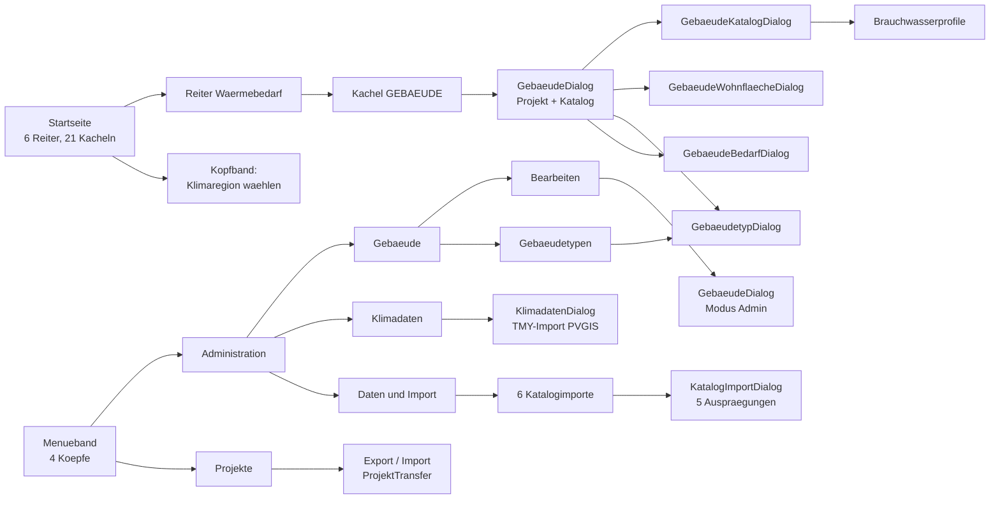
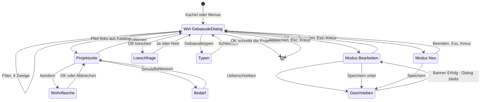
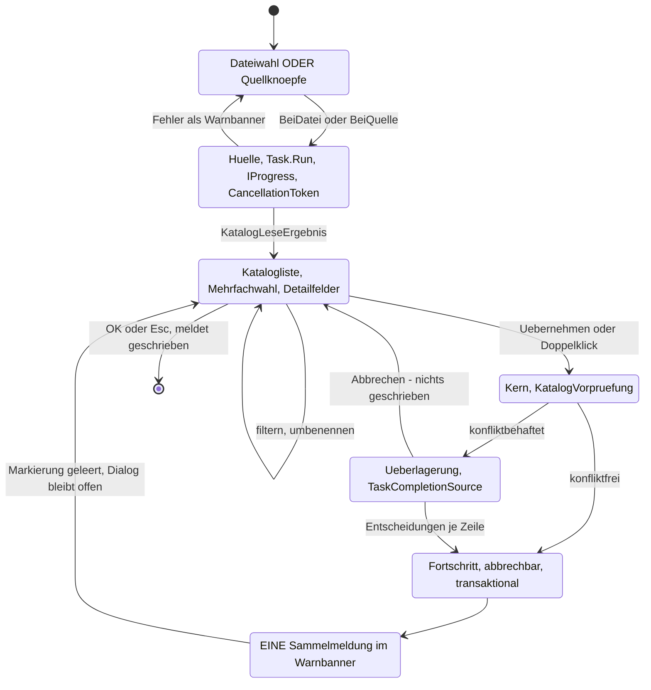
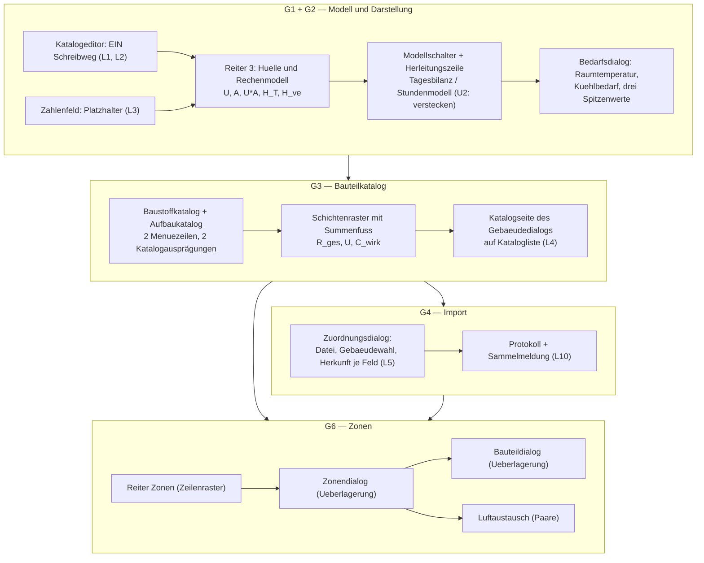

# Befund U — Dialogführung des Bestands als Grundlage der Dialogführungs-Architektur (15.09.2026)

**Zweck.** Der Anwender hat Systementwurf und Architektur der Gebäudesimulation beauftragt
(Softwarearchitektur, Datenmodell-Architektur, **Dialogführungs-Architektur**, Integration).
Dieser Befund erhebt die **Bestandsgrundlage der Dialogführung**: wie ein Anwender heute zu
Gebäude, Katalog, Bedarf, Klima und Importen kommt, welche Bausteine und Schreibwege das Haus
führt, wie Zustände und Prüfungen der fünf Gebäudemasken laufen, was die Importdialoge einem
Zuordnungsdialog vorgeben, wie Ergebnisse dargestellt werden, was ein Dialog an Tests mitbringen
muss und was ein iPad anders braucht. Kapitel 8 leitet daraus die Anforderungen an die
Dialogführungs-Architektur ab.

**Abgrenzung.** Dieser Befund **wiederholt nicht**, was schon belegt ist, sondern verweist:

| Befund | Deckt ab | Hier nicht noch einmal |
|---|---|---|
| [`Befund L`](2026-09-15_Befund_L_Einbindung_Kern.md) | Rechenweg, Persistenz, Migration, Ergebniskante, Referenzlauf | Kern- und Schemafragen |
| [`Befund M`](2026-09-15_Befund_M_Gebaeudedialog.md) | Ist-Inventar der fünf Gebäudemasken, ihre DTO, Feldbestand, Ressourcenschlüssel, Soll-Entwurf des Editors, bunit-Testfälle | Feldlisten, Soll-Felder, Textschlüssel |
| [`Befund N`](2026-09-15_Befund_N_IFC-Import_Entwurf.md) | IFC-Leser, xBIM-Paket, Abbildungsregeln, Ablauf in Schritten, Fehlerbilder | IFC-Fachseite |
| [`Befund Q`](2026-09-15_Befund_Q_Muster_Datenmodell_Dialoge.md) | Eltern-Kind-Datenmodell, Katalogregister, Listen-/Detaildialoge, Bausteine einer Bauteilliste, Bericht je Teilobjekt | Katalogbauformen, Kindlisten-Vorbilder |

**Quellen** (alle selbst gelesen, Stand Zweig `ios_migration_september`, Arbeitsbaum 15.09.2026):
`EPOS.UI/Seiten/AppWurzel.razor`, `Hauptfenster.razor`, `Start/Startseite.razor`,
`Start/WaermebedarfReiter.razor`, `Start/Kachelschluessel.cs`, `Seitenschluessel.cs`;
`EPOS.UI/Bausteine/*` (Menuetabelle, SpeichernLeiste, Herleitungszeile, Kohaerenzzeile,
Warnbanner, WarnStufe, Ueberlagerung, Zeilenraster, Reiterblatt, Kennzahlkachel, Assistent,
GanglinienImportLauf); `EPOS.UI/Standards/*` (Zahlenfeld, Dateiwahl, ChartBild);
`EPOS.UI/Dialoge/Bedarf/*` (GebaeudeDialog, GebaeudeKatalogDialog, GebaeudeKatalogModus,
GebaeudeBedarfDialog, BedarfErgebnisDialog); `EPOS.UI/Dialoge/Import/*`;
`EPOS.UI/Dialoge/Strom/GanglinieImportOptionenDialog.razor`, `GanglinieProtokollDialog.razor`;
`EPOS.UI/Dialoge/Klimadaten/KlimadatenDialog.razor`; `EPOS.UI/wwwroot/epos-ui.css`;
`EPOS.UI/CLAUDE.md`; `EPOS.UI.Daten/Katalogwege.cs`;
`WindowsFormsApplication1/Views/Hauptformular/HauptfensterHuelle.cs`, `StartseiteHuelle.cs`,
`WindowsFormsApplication1/Dienste/WinFormsNavigation.cs`, `EPOS.Kern/Allgemein/Dienste/Masken.cs`;
`EPOS.Kern/Allgemein/Bericht/ChartRenderer.cs`; `SpeicherEngine/GanglinienPruefung.cs`;
`EPOS.UI.Tests/*` (StilblattTests, SchliesskreuzWacheTests, UeberlagerungstitelTests,
FenstermassTests, Dialoge/GebaeudeKatalogDialogTests.cs); `Proben/Rasterprobe/LIESMICH.md`;
`EPOS.iOS/Dienste/*`, `EPOS.iOS/CLAUDE.md`; Commit `0e377437` („Pufferverwaltung: OK und
Abbrechen, geschrieben wird im OK-Weg", Merge `5e01bed7` = #282).

---

## 0. Das Ergebnis in acht Sätzen

1. Die Navigation ist **zweigeteilt und asymmetrisch**: Die `AppWurzel` kennt dreizehn *freie
   Ansichten* selbst (`AppWurzel.razor:1352-1368`), alle übrigen 25 Maskenschlüssel beantwortet
   die **Plattformhülle** — unter Windows mit einem modalen Fenster
   (`HauptfensterHuelle.cs:226-304`, `WinFormsNavigation.cs:37-241`), auf iOS mit `false`
   (`IosNavigation.cs:64-78`), weshalb Gebäude, Klima und alle Importe auf dem iPad heute
   **unerreichbar** sind.
2. Zum Gebäude führen genau zwei Klickwege — die Kachel „Gebäude" im Startseiten-Reiter
   *Wärmebedarf* (`Kachelschluessel.cs:43`, `StartseiteHuelle.cs:525`, `:613`, `:720-736`) und
   *Administration → Gebäude → Bearbeiten* (`Menuetabelle.cs:274-278`); beide öffnen **dieselbe**
   Komponente `GebaeudeDialog`, der zweite in der Betriebsart `Admin` ohne Projektliste.
3. Das Haus führt für Dialoge einen **vollständigen Baustein-Satz** — `Zahlenfeld` mit Färbung,
   `Feldname`/`FehlerZustand` und `Aktiv`-Sperre, `Herleitungszeile` („woher"), `Kohaerenzzeile`
   („passt es"), `Formularraster`, `Reiter`/`Reiterblatt` mit weicher Sperre samt Grund,
   `Warnbanner` in vier Stufen, `Ueberlagerung` als einziger Weg für Unterdialoge,
   `SpeichernLeiste` mit OK/Abbrechen/Speichern und `Schliesskreuz` im Kopf —, und die Regel für
   ihre Anordnung steht als Hausregel in `EPOS.UI/CLAUDE.md:93-123`.
4. Der **eine Schreibweg** ist seit Merge #282 (`0e377437`) verbindlich: Ein Dialog sammelt einen
   Arbeitsstand (vorläufige Zeilen mit **negativer** Id), „Anlegen"/„Übernehmen" prüft und
   übernimmt in die Liste, **geschrieben wird erst im OK-Weg**, Abbrechen/Esc/✕ liefern nichts —
   und genau dort entsteht die Id, die der Wirt danach liest.
5. Der **Gebäude-Katalogeditor verletzt diese Regel als einziger im Bedarfsbereich**: Er hat vier
   Schreib- bzw. Ausgänge („Werte übernehmen" `:337-340`, „Überschreiben" und
   „Speichern"/„Speichern unter" `:360-369`, „Beenden"), keine `SpeichernLeiste`, und seine
   Pflichtprüfung über siebzehn Zahlen (`:858-891`) hängt an zwei der drei Schreibstellen —
   Frage **U1** des Umsetzungskonzepts adressiert genau das.
6. Die Importkette des Hauses ist **fertig als Muster**: Datei/Quelle wählen → Lesen mit
   `Fortschritt` und Abbruch → Vorprüfen im Kern → **Konfliktdialog als Überlagerung mit
   `TaskCompletionSource`** → Ausführen → **eine** Sammelmeldung im `Warnbanner`
   (`KatalogImportDialog.razor:820-910`); was einem IFC-/gbXML-Zuordnungsdialog fehlt, ist die
   **Herkunft je Feld**, eine **Zonen-** und eine **Bauteilliste** — der Konfliktdialog kennt nur
   die drei Spalten Name/Befund/Aktion (`ImportKonflikteDialog.razor:44-70`).
7. Die Ergebnisdarstellung ist **fertig gebaut und stufbar**: `Kennzahlkachel` („—" statt 0),
   `ChartBild` als einziger Weg zum Renderer-Bild mit Zoom, 26 Renderer im Kern — darunter
   `Temperaturverlauf` (`ChartRenderer.cs:2365`), `Jahresverlauf` (`:1495`), `DauerlinieWaerme`
   (`:215`) und `MonatsStapel` (`:2250`) —, und der `GebaeudeBedarfDialog` ist die vorhandene
   Auskunftsmaske je Gebäude, in die Raumtemperatur, Kühlbedarf und Spitzenkennzahlen gehören.
8. Eine neue Maske bringt **vier Nachweise** mit: bunit-Fälle nach Hausmaß (Feldbestand, Rückweg
   mit `null` bei Abbruch, Zustandsklassen, Fall ohne Gaben, Kulturpinnung), die drei
   Strukturwachen `StilblattTests`/`SchliesskreuzWacheTests`/`UeberlagerungstitelTests`, bei
   Rasteränderungen die `Proben/Rasterprobe` — und auf iOS zusätzlich eine Hülle außerhalb von
   `WindowsFormsApplication1`, denn alle drei Gebäudehüllen liegen heute dort
   (`WindowsFormsApplication1/Views/Gebäude/`).

---

## 1. Navigation: wie der Anwender heute hinkommt

### 1.1 Die drei Ebenen

| Ebene | Datei | Rolle |
|---|---|---|
| **Menü als Daten** | `EPOS.UI/Bausteine/Menuetabelle.cs:150-324` | 60 Punkte in vier Köpfen (Projekte, Administration, Hilfe, Sprache); jede Zeile trägt **Name, Textschlüssel, Seitenschlüssel, Bild** — kein Handler |
| **Ein Handler** | `EPOS.UI/Seiten/Hauptfenster.razor:258-267` | `Springe(punkt)` schließt das Band, fragt **zuerst** den `Weg`-Delegaten der Hülle (`:122`) und lässt **erst dann** die Wurzel die Ansicht wechseln |
| **Die Wurzel** | `EPOS.UI/Seiten/AppWurzel.razor:1352-1368` | kennt dreizehn Schlüssel selbst (Startseite, Projektliste, Simulation samt zwei Unterschlüsseln, Assistent/ProjektNeu/ProjektBearbeiten, Berichte&Kosten, Energieträger, BHKW-Wirtschaftlichkeit, Stromspeicher-Auslegung, KI-Assistent); alles andere gibt sie zurück |

Unter Windows beantwortet `HauptfensterHuelle.Weg` die übrigen Schlüssel mit einem modalen
Fenster (`HauptfensterHuelle.cs:226-304`, verzögert über `Blazorsprung.Verzoegert`, `:185`);
`WinFormsNavigation` tut dasselbe für die Maskenschlüssel des Kerns (`Masken.*`,
`WinFormsNavigation.cs:37-241`). Auf iOS reicht `IosNavigation` an `Navigationsziel.Aktuell`
durch und übersetzt genau **einen** Schlüssel (`ProjektAuswahl` → `Projektliste`,
`IosNavigation.cs:64-78`).

### 1.2 Die Klickwege zu Gebäude, Katalog, Bedarf, Klima, Import

**Belege:** Kachelschlüssel `GEBAEUDE` in `Kachelschluessel.cs:43`, Zuordnung zum Reiter in
`StartseiteHuelle.cs:525`, Verteiler `:613`, Handler `:720-736` (er ruft `GebaeudeHuelle.Oeffnen`
und schreibt danach die Projektzuordnung neu). Der Reiter selbst ist
`Start/WaermebedarfReiter.razor:26-39` (ein `Kachelraster` mit vier `Kachel`n und **einem**
`Geklickt`-Rückruf). Die Klimaregion des Projekts hängt **nicht** am Menü, sondern am Kopfband
der Startseite (`Startseite.razor:82-100`, Parameter `Klimaregionen`/`Klimaregion`/
`KlimaSpeichern` `:326-337`); die **weltweite** TMY-Beschaffung steht als eigener Menüpunkt
(`Menuetabelle.cs:234`). Die sechs Katalogimporte stehen unter *Administration → Daten & Import*
(`Menuetabelle.cs:235-261`), der Projekt-Export/Import unter *Projekte* (`:162`).

### 1.3 Was daraus für die Gebäudesimulation folgt

- **Ein neuer Menüpunkt ist eine Zeile**, kein Code: Baustoff- und Aufbaukatalog (G3) sowie der
  IFC-/gbXML-Import (G4) sind je eine `new Menuepunkt(...)`-Zeile mit Seitenschlüssel — die Regel
  „kein Untermenü mit nur einem Punkt" (`CLAUDE.md`, Wächter
  `Ein_neues_Untermenue_fuehrt_nie_nur_einen_einzigen_Punkt`) zwingt dazu, die **zwei** Kataloge
  gemeinsam einzuhängen und den einen Importpunkt **flach** unter „Daten & Import" zu stellen.
- **Jeder neue Schlüssel braucht drei Stellen**: `Seitenschluessel.cs` (bzw. `Masken.cs`, wenn der
  Kern ihn ruft), den Fall in der Hülle (`HauptfensterHuelle`/`WinFormsNavigation`) und — sobald
  iOS ihn können soll — die Übersetzung in `IosNavigation.Uebersetze`.
- **Die Startseitenkachel ist der Weg des Anwenders**, das Menü der des Fachmanns. Wenn die
  Gebäudesimulation einen eigenen Einstieg braucht (z. B. „Gebäudemodell rechnen"), gehört er als
  Knopf **in** den Gebäudedialog, nicht als 22. Kachel: Das Kachelregister ist gedeckelt und je
  Kachel an `StartKachel`-Zustände gebunden.

---

## 2. Dialogmuster des Hauses

### 2.1 Bausteine und Standardfelder, die ein Gebäudedialog braucht

| Baustein | Datei | Was er leistet — und was daran für G1–G6 zählt |
|---|---|---|
| `Zahlenfeld` | `Standards/Zahlenfeld.razor:24-38`, `:41-131` | Komma **oder** Punkt, invariant, kein Tausendertrennzeichen; eine Fehleingabe **färbt** (`epos-fehleingabe`), sie meldet nicht; `Min`/`Max` wie Fehleingabe; `Aktiv=false` sperrt **ohne auszublenden** (`:73`); `Feldname` + `FehlerZustand` melden dem Dialog, **an welchem Feld** eine Prüfung hängt (`:86`, `:93`); `_geleert` (`:116-131`) hält ein geleertes Feld leer, bis wieder getippt wird. **Es gibt heute kein `Platzhalter`** — Frage U3 |
| `Ganzzahlfeld`, `Auswahlfeld`, `Schalter`, `Textfeld`, `Datumsfeld`, `Dateiwahl` | `Standards/` | `Dateiwahl` (`:20-34`) öffnet **nichts** selbst: Der Wähler kommt als Delegat; **kein Delegat, kein Knopf** |
| `Herleitungszeile` | `Bausteine/Herleitungszeile.razor:9-25` | leise Zeile „woher der Wert kommt", optional mit fertig formatierter `Formel`; rechnet nicht |
| `Kohaerenzzeile` | `Bausteine/Kohaerenzzeile.razor:8-21` | Gegenstück: „passt der Wert zu seiner Herleitung" — ✓ / ≠, amber bei Abweichung, **sperrt den Dialog nicht** |
| `Formularraster`, `Gruppenkopf` | `Bausteine/` | Beschriftung **neben** dem Feld; ein Feld sagt selbst, wie lang es ist (`epos-feld--kurz`) |
| `Reiter` / `Reiterblatt` | `Bausteine/Reiterblatt.razor:16-24`, `:41-48` | ein nicht gewähltes Blatt **existiert nicht** (kein Tabulatorzyklus, keine Rückrufe); verzögerter Aufbau beim ersten Betreten; `Bedienbar=false` + `Sperrgrund` ergibt die **weiche** Sperre (`aria-disabled` + `title` + meldender Handler) |
| `Warnbanner` / `WarnStufe` | `Bausteine/Warnbanner.razor`, `WarnStufe.cs` | vier Stufen Hinweis/Warnung/Fehler/**Erfolg**, `role="alert"`, optional `Verfaellt`; ersetzt jede `MessageBox` |
| `Rueckfrage` | `Bausteine/Rueckfrage.razor` | Ja/Nein mit `VorgabeNein` — der Ersatz für die Löschabfrage |
| `Ueberlagerung` | `Bausteine/Ueberlagerung.razor:1-45` | **der** Weg für Unterdialoge: modal im selben Fenster, `role="dialog"`/`aria-modal`, Fokusfalle **ohne JS**, Hintergrundklick schließt **nicht**, Esc schließt die oberste Ebene, Titel **und** Kreuz an einer Stelle |
| `Schliesskreuz` | `Bausteine/Schliesskreuz.razor` | ✕ = Esc = Abbrechen, rechts außen im Kopf; Wache `SchliesskreuzWacheTests` |
| `SpeichernLeiste` | `Bausteine/SpeichernLeiste.razor:16-33`, `:82`, `:91-115` | Statuszeile links, optional nicht schließendes „Speichern", dann Abbrechen und OK; `SpeichernErlaubt = SatzMarkiert && Geaendert`; der **gesperrte** Knopf nennt seinen Grund im `title` (drei Texte); Erfolg als Statuszeile mit Uhrzeit, nie als Meldungskette |
| `Zeilenraster` | `Bausteine/Zeilenraster.razor:1-32` | „die Zeile IST eine kleine Maske": Spaltenkopf, Rollbereich, Abschlusszeile „+ Neue Position…", **Summenfuß**; CSS-Spuren statt Pixeln (`display:contents`) |
| `Raster<TZeile>` / `Katalogliste` | `Standards/Raster.razor`, `Bausteine/Katalogliste.razor` | QuickGrid mit `Virtualisiert`/`Zeilenhoehe`; **gefiltert wird VOR dem Raster**, nie im Raster |
| `Kennzahlkachel`, `ChartBild`, `Diagramm`, `Fortschritt`, `Assistent` | `Bausteine/`, `Standards/` | siehe Kapitel 5 bzw. 4 |

### 2.2 Schreibwege — der eine Weg und seine Ausnahmen

Die Hausregel steht wörtlich in `EPOS.UI/CLAUDE.md:48-56`: *Jeder Dialog trägt OK und Abbrechen —
als `SpeichernLeiste`, nie als eigene Knopfzeile. OK prüft, speichert und schließt; eine verletzte
Regel meldet und hält den Dialog offen. Abbrechen schließt ohne zu speichern und ohne Prüfung, und
✕ sowie Esc wirken wie Abbrechen. Die Prüfregeln stehen genau **einmal**, im Rückruf der Leiste.*

**Das jüngste Muster ist die Pufferverwaltung** (Commit `0e377437`, Merge `5e01bed7` = #282). Seine
sechs Sätze gelten für jede Liste-im-Dialog der Gebäudesimulation:

1. Der Dialog führt einen **Arbeitsstand**. „Anlegen"/„Übernehmen" prüft die Felder (dieselbe
   Prüfkette, dieselbe Reihenfolge, derselbe Wortlaut) und legt sie als Zeile in die Liste;
   „Entfernen" nimmt eine Zeile heraus. Der Knopf **speichert nicht**, er übernimmt.
2. Eine vorläufige Zeile trägt eine **negative** Nummer; nur eine positive Id hat eine Entsprechung
   in der Datenbank.
3. **Erst OK schreibt**, in der Reihenfolge *Entfernen → Ändern → Anlegen* (so wird ein Bezeichner
   wieder frei, den eine neue Zeile tragen soll). Scheitert ein Schritt, wird er bei einem zweiten
   OK nicht wiederholt.
4. **Die neue Id entsteht im OK-Weg**; der Wirt liest sie danach — die einzige Abhängigkeit, die
   früheres Schreiben rechtfertigen könnte, ist damit aufgelöst.
5. OK prüft eine offene Zeile **nur, wenn an ihr etwas geändert wurde** — sonst verriegelt ein
   Altbestand, der heutige Regeln verletzt, den Dialog, und der Anwender käme nur über Abbrechen
   hinaus.
6. Eine Rückfrage im OK-Weg **führt ihn zu Ende**: Ja übernimmt, schreibt und schließt; Nein hält
   den Dialog offen.

Ausnahme mit Grund: Ein Dialog, der beim Speichern schreibt, hat **kein** Abbrechen, sondern
„Speichern" und „Schließen" (`SpeichernLeiste.razor:51-61`, heute nur die
BHKW-Wirtschaftlichkeit) — ein zweiter Knopf, der dasselbe täte wie der erste, wäre „eine
Behauptung, die nicht stimmt".

### 2.3 Meldungen, gesperrte Felder, Vorgabewerte

- **Sprachneutral im Kern, Text in der Oberfläche.** `PruefMeldung`
  (`SpeicherEngine/GanglinienPruefung.cs:74-110`) trägt `PruefStufe` (Info/Warnung/Fehler), einen
  **Schlüssel** (zugleich der Name des Ressourcenschlüssels) und bereits invariant formatierte
  `Werte`; `ToString()` liefert `SCHLUESSEL: wert1; wert2` für Protokolle und Testvergleiche. Den
  Text holt erst die Oberfläche aus `MyResource.Resource` — im Dialog als Delegat `Meldungstext`
  (`KatalogImportDialog.razor`, Parameter `Meldungstext`).
- **Zwei Sprachen, deutscher Rückfall.** Jeder Text kommt aus `Resource.*`, gepflegt in
  `Resource.resx` **und** `Resource.en-US.resx`; fehlt ein Schlüssel, steht der deutsche
  Literaltext als Vorgabewert eines `[Parameter] string` (`EPOS.UI/CLAUDE.md:18-21`). Ab etwa zehn
  Anzeigetexten ein **Bündel** (`*Texte`-Klasse, ein `[Parameter]`). Nach jedem neuen Schlüssel
  läuft `Werkzeuge/ResourceDesigner`.
- **Gestaffelte Meldung** (`CLAUDE.md:77-79`): dauerhaftes Banner **nur** für einen Zustand, den
  der Anwender beheben muss und sonst nicht sieht; sonst eine **leise Zeile** dort, wo er hinsieht,
  der **Grund am Bedienelement** (`title` + `aria-disabled`) und das Banner erst **nach** dem
  Versuch, mit `Verfaellt`.
- **Gesperrt heißt sichtbar.** `Aktiv="false"` sperrt ein Feld, ohne es auszublenden — das Vorbild
  ist der Tarifdialog, der den Block des nicht gewählten Rechenmodells sperrt statt ihn zu
  verstecken (`Zahlenfeld.razor:65-73`). Soll die Sperre ihren Grund **erklären**, darf sie nicht
  `disabled` sein (der Tooltip erschiene nie): dann `aria-disabled="true"` plus meldender Handler
  (`Reiter.razor:36`, `:61`; `Reiterblatt.razor:41-48`; `Startseite.razor:272`;
  `Seiten/Strom/Ablaufleiste.razor:195`).
- **Platzhalter** gibt es heute am `Textfeld` (`Platzhalter`, im Gebäudedialog als
  `PlatzhalterSuche`, `GebaeudeDialog.razor:106`) und an der `Dateiwahl` — **nicht** am
  `Zahlenfeld`. Die Anzeige „NULL = Vorgabe" läuft deshalb heute über `PvModellFelder`
  (Befund M 2.2) als leises Beiwerk, nicht im Feld.

---

## 3. Die fünf Gebäudemasken: Zustände, Übergänge, Prüfungen

> Feldbestand, DTO und Soll-Entwurf stehen in **Befund M** (1.1–1.9, 5.2–5.8). Hier nur das, was
> die Dialogführungs-Architektur braucht: **Zustände, Übergänge, Prüfstellen, Fehlerbilder.**

### 3.1 Wirt und Betriebsarten

`GebaeudeDialog` ist der Wirt von **vier** Überlagerungen und einer Rückfrage
(`GebaeudeDialog.razor:203-253`). Er kennt drei Betriebsarten (`:5-12` und Parameter `Admin`,
`Wizard`): **Projekt** (beide Listen, `SpeichernLeiste` mit OK/Abbrechen, `:199`), **Assistent**
(beide Listen, **keine** Schlussleiste — der Rahmen trägt sie) und **Verwaltung** (`NurRechts`:
nur der Katalog, `:63`). Die zwei Listen und die Pfeilspalte stehen im Baustein
`Zweispaltenauswahl` (`:62-151`, Anwenderentscheid #76).

Der Katalogeditor führt seine eigenen drei Betriebsarten als Aufzählungstyp
(`GebaeudeKatalogModus.cs`): **Bearbeiten** (beide Schreibwege frei), **Neu** (nur „Speichern",
„Überschreiben" gesperrt), **Admin** (Name wird Klappliste aller Katalogsätze, „Überschreiben"
frei, „Speichern" gesperrt).

### 3.2 Zustände und Übergänge

**Der Bruch ist sichtbar**: Vom Editor führen **drei** Kanten nach „Geschrieben" und **eine**
zurück in die Liste, die nichts verwirft — der Editor kennt kein Abbrechen. Der Wirt dagegen
schreibt seine Projektliste erst im OK-Weg (`:199`, Rückruf `BeiErgebnis`, Abbrechen `:818`).

### 3.3 Wo die Prüfregeln laufen

| Stelle | Datei:Zeile | Was geprüft wird | Wie gemeldet |
|---|---|---|---|
| während der Eingabe | `Standards/Zahlenfeld.razor:149-173` | gültige Zahl, `Min`/`Max` | Feld **färbt** (`epos-fehleingabe`, `aria-invalid`), kein Text |
| „Werte übernehmen" (Reiter 2) | `GebaeudeKatalogDialog.razor:788-830` | Ferienzeitraum über `Ferienzeit.Pruefen` (Kern), Maximaltemperatur < 1 → 24, Flags aus Absenkungen | `Warnbanner` Warnung bzw. Hinweis (`:80`, `Melden` `:937-941`) |
| „Überschreiben" | `:894-898` | `PflichtzahlenStehen()` | s. u. |
| „Speichern"/„Speichern unter" | `:905-916` | Name nicht leer **und** `PflichtzahlenStehen()` | `Warnbanner` Warnung |
| Pflichtzahlen | `:858-891` | **siebzehn** Felder auf `!= null`, in fester Reihenfolge | Banner nennt den **Feldnamen** (eigene Texte `:960-980`, nicht die Beschriftungen) und **springt auf Reiter „FLÄCHEN"** (`:886`) |
| Schreibversuch | `:918-935` | `GebaeudeKatalogErgebnis(Erfolg, Meldung)` aus der Hülle — z. B. die `ReadOnly`-Sperre des Auslieferungskatalogs | abgelehnte Schreibung bleibt als `Warnbanner` stehen |
| Löschen | `GebaeudeDialog.razor:251-253` | `Rueckfrage` vor `KatalogLoeschen`; `false` = abgelehnt | Banner |

**Zwei Befunde für die Architektur.** (a) Die Prüfung steht an **drei** Stellen statt einer — Regel
5 aus #282 („OK prüft eine offene Zeile nur, wenn an ihr etwas geändert wurde") ist damit nicht
formulierbar. (b) Reiter 2 führt einen **eigenen Stand**, der erst mit „Übernehmen" in `Daten`
wandert (`:548-551`, `:755-762`); wer ihn vergisst, schreibt Reiter-1-Werte mit altem Reiter-2-Stand —
und sobald U·A-Summen über beide Reiter laufen (G1/G2), ist die Summe zeitweise falsch.

### 3.4 Katalog und Projekt

Beide Listen des Wirts sind **handgebaute** `<table class="epos-raster">` in einer
`.epos-raster-huelle` (`GebaeudeDialog.razor:70-92`, `:110-133`) — **keine** `Katalogliste`, **kein**
`Raster`, damit auch keine Virtualisierung, kein Spaltenfilter, kein Trichter. Der Gebäudekatalog
ist zugleich die **einzige** Katalogart ohne Ausprägung im `KatalogBrowserDialog` (dort heute
Heizkessel, BHKW, PV, Pufferspeicher, Solarkollektoren — erreichbar über den Knopf
„Administration…" **in** den Erzeugerdialogen, nicht über das Menü). Der Filter hat vier Zweige
(Verwendung, Gebäudeart, Baualtersklasse, Suche), von denen einer zweideutig ist (Befund W9-B1,
`GebaeudeDialog.razor:19-22`): Die Komponente sagt dem Kern über `ausBaujahrwahl`, **welches Feld**
die Auswahl ausgelöst hat.

---

## 4. Import-Dialoge als Vorlage für Zuordnungsdialoge

### 4.1 Der Ablauf, wie ihn das Haus fährt

**Belege im Einzelnen** (`EPOS.UI/Dialoge/Import/KatalogImportDialog.razor`):
Quelle `:108-118` (Dateiwähler **oder** Quellknöpfe aus dem Profil), Fortschritt mit Abbruch
`:120-122`, Kandidatenliste als **`Katalogliste`** mit Mehrfachwahl und Virtualisierung ab 120
gefilterten Zeilen `:136-144`, Detailfelder aus dem Profil `:149-159`, Hinweiszeile „was die Quelle
NICHT liefert" `:166-169`, Fußleiste `:172-177`, Konfliktdialog als `Ueberlagerung` `:179-188`; der
Schreibgang `:820-892` mit `Vorpruefen → KonflikteFragen → Ausfuehren → Sammelmeldung`, die
`TaskCompletionSource`-Klammer `:895-910`. Der **Ablauf selbst liegt im Kern**
(`KatalogImportAblauf`), die Komponente „zeigt an und entscheidet, wann" (`:16-19`).

Der **Konfliktdialog** (`ImportKonflikteDialog.razor`) ist ein `Raster` mit drei Spalten — Name
(bei „Umbenennen" editierbar), **Befund** (mehrzeilig) und **Aktion** als `Auswahlfeld` `:44-70` —,
dazu „Alle auslassen", Abbrechen (`null` = nichts importieren) und OK `:72-78`. Die Aktion ist ein
**Wert**, kein Anzeigetext (`:10-13`), und alle Regeln — welche Aktionen erlaubt sind, welcher
Befundtext gilt, welcher Name vorgeschlagen wird — liegen im Kern (`ImportKonfliktModell`,
`:15-17`). Die Rückgabe enthält **alle** Zeilen, auch die konfliktfreien (`:19-21`).

Die **Ganglinienkette** zeigt die zweite Bauform: `GanglinienImportLauf` ist ein **Baustein ohne
eigene Anzeige** (`:17-21`) mit drei Überlagerungen, je einer `TaskCompletionSource`; der Wirt
setzt den Knopf und ruft `Starten(pfad, raster)`. `GanglinieImportOptionenDialog` zeigt das
**erkannte Format** und lässt jede Vorbelegung übersteuern (acht `Auswahlfeld` im
`Formularraster`, `:57-77`), dazu eine **nicht reaktive Vorschau** der ersten zehn Zeilen
(`:14-20`, `:84-90`). `GanglinieProtokollDialog` ist die **Bestätigung eines Eingriffs**: Stufe und
Meldung je Zeile mit Farbklasse `epos-stufe--fehler|--warnung|--info` (`:48-58`), OK gesperrt bei
`!ImportMoeglich`, der zweite Knopf heißt „Abbrechen" solange ein Import möglich ist und sonst
„Schließen" (`:60-66`) — **und ein sauberer Lauf zeigt gar nichts**: Der Wirt fragt `Noetig()`,
bevor er die Überlagerung aufmacht (`:11-17`).

Der **Klimaimport** (`KlimadatenDialog.razor`) ist die dritte Bauform: kein Dateiweg, sondern
Ortsname **oder** Koordinaten (`:126-159`), Import über `Task.Run` der Hülle mit `IProgress` und
Abbruch (`:162-173`, `:385-425`), Liste links / Bilder rechts im `Katalograhmen` (`:83-160`),
Löschen mit `Rueckfrage` (`:175-177`). Während eines Laufs steht **kein Kreuz** und Esc schließt
nicht (`:62-67`) — dieselbe Regel wie im Katalogimport (`:88-96`).

### 4.2 Was ein IFC-/gbXML-Zuordnungsdialog übernehmen kann — und was fehlt

| Vorhanden, übernehmbar | Fundstelle |
|---|---|
| Dateiwahl als Delegat, iOS-tauglich | `Standards/Dateiwahl.razor:20-34` |
| Lesen im `Task.Run` der Hülle, `IProgress<ImportFortschritt>`, `CancellationToken`, Abbruchknopf | `KatalogImportDialog.razor:120-122`, `:824-828`, `:845-851` |
| Vorprüfung im Kern, Entscheidungen als Werte, Rückgabe **aller** Zeilen | `ImportKonflikteDialog.razor:19-21`, `:44-70` |
| Konflikt-/Zuordnungsschritt als **Überlagerung mit `TaskCompletionSource`** statt zweitem Fenster | `KatalogImportDialog.razor:895-910` |
| Protokoll mit Stufen, gesperrtem OK und zweitem Knopf mit wechselndem Wortlaut; „sauberer Lauf zeigt nichts" | `GanglinieProtokollDialog.razor:11-17`, `:60-66` |
| **Eine** Sammelmeldung statt einer Meldung je Satz; Dialog bleibt nach dem Schreiben offen | `KatalogImportDialog.razor:855-882` |
| Sprachneutrale `PruefMeldung` samt Schlüssel und Werten | `SpeicherEngine/GanglinienPruefung.cs:74-110` |

| **Fehlt** | Warum es fehlt | Was daraus folgt |
|---|---|---|
| **Herkunft je Feld** („aus IFC", „Vorgabe der Baualtersklasse", „leer", „vom Anwender geändert") | Der Konfliktdialog kennt drei Spalten und **eine** Aktion je Zeile; eine Herkunft je *Feld* hat er nie gebraucht | Neue Spalte bzw. neues Zeichen je Feld im Zuordnungsraster **und** ein Herkunftsfeld im DTO; die Anzeige ist eine `Herleitungszeile` bzw. ein Kürzel in der Zelle, nicht eine zweite Meldungsart |
| **Zonenliste** (mehrere `IfcSpace`/`Space` je Gebäude, mit Übernahme-Häkchen und Zusammenfassen) | Kein Import des Hauses liefert eine **Hierarchie**; alle sechs liefern eine flache Satzliste | `Zeilenraster` (Zeile = kleine Maske, Summenfuß) statt `Katalogliste`; Auswahl **und** Bearbeitung in derselben Zeile |
| **Bauteilliste je Zone** samt Randbedingung, Nachbarzone, Azimut | dito — zweite Ebene | zweite `Ueberlagerung` unter der Zonenzeile (vier Ebenen tief, jede mit eigener Esc-Prüfung) |
| **Mehrere Gebäude in einer Datei** (Klappliste, eines je Lauf, U13) | ein Katalogimport schreibt *n* gleichartige Sätze, nie *ein* Objekt mit Unterobjekten | Auswahlfeld **vor** der Zuordnung, nicht danach |
| **Vorprüfung ohne Schreiben** („was würde entstehen") | die Vorprüfung des Hauses prüft nur **Dubletten** gegen den Bestand | eigener Prüfschritt im Kern, Ergebnis als Protokollliste (Muster `GanglinieProtokollDialog`) |
| **Größenablehnung mit Grund** (U11: 50 MB Windows / 20 MB iOS) | „Größenlimits: es gibt keine" (Befund N 1.7) | benannte Ablehnung als `Warnbanner` Stufe Fehler **vor** dem Lesen |

---

## 5. Ergebnisdarstellung

### 5.1 Was es gibt

- **`BedarfErgebnisDialog`** (`:1-50`) — „Simulation Ergebnisse" für Strom- und Wärmebedarf, drei
  Reiter **Kennzahlen / Monatswerte / Grafik**, reine Anzeige auf einem **eingefrorenen**
  Datenobjekt (die Hülle baut `BedarfErgebnisDaten` und rendert die Bilder vorab, `:11-15`), zwei
  unabhängige Optionsgruppen für Tabelle und Bild (`:16-20`), **eine** Einheit für alle drei Reiter
  (MWh Vorgabe, kWh wählbar, `:26-33`), **drei Kennzahlkategorien** mit Zwischenüberschrift und
  abgesetzter Summe im `tfoot` (`:38-44`), Grafikreiter mit den drei Zeitstufen Jahr/Woche/Tag
  (`BedarfGangGrafik`, `:45-49`).
- **`GebaeudeBedarfDialog`** (`:1-32`) — der Wärmebedarf **eines** Gebäudes als Überlagerung im
  Gebäudedialog: Kennzahlen, Schalter „sortiert", Jahresganglinie als Renderer-Bild
  (`ChartRenderer.GanglinieNormiert`) im Baustein `Diagramm` mit Bild- und Datenzoom; gerechnet
  wird über `GebaeudeBedarfCtrl`, der dieselben zwei Methoden von `SimulationWaermebedarf` ruft wie
  der Lauf.
- **`Kennzahlkachel`** (`:20-27`) — Überschrift, großer Wert, leise Herkunftszeile; ein leerer Wert
  erscheint als **„—"**, nie als 0 („eine 0 wäre eine Aussage, die niemand getroffen hat").
- **`ChartBild`** (`:31-44`) — **der einzige** Weg zu einem Renderer-Bild: PNG als `data:`-URL im
  Baustein `Diagramm`, damit Rad, Kneifgeste, Ziehen, Doppelklick und `+ - 0`; `Rund="true"` reicht
  `OhneZoom` durch; ohne Bild ein Platzhaltertext. Gezeichnet wird im Kern (Skia), nicht in der
  Oberfläche.
- **Der Renderer** (`EPOS.Kern/Allgemein/Bericht/ChartRenderer.cs`) führt 26 Bildarten, darunter
  `Jahresverlauf` (`:1495`), `Jahresgang` (`:868`), `DauerlinieWaerme` (`:215`), `MonatsSaeulen`
  (`:1307`), `MonatsStapel` (`:2250`), `Temperaturverlauf` (`:2365`), `Stundenprofil` (`:1379`),
  `GanglinieNormiert` (`:1662`), `Streuwolke` (`:2039`). **Jede Änderung daran läuft durch
  `Proben/ChartProben`.**

### 5.2 Wo die neuen Größen hingehören

| Neue Größe (G1/G2 bzw. G6) | Ort | Bauform |
|---|---|---|
| **Raumtemperatur** ϑ_i stündlich | `GebaeudeBedarfDialog`, neuer Reiter oder zweites Bild | `ChartRenderer.Temperaturverlauf` (`:2365`) über `ChartBild`; Ganglinie und Dauerlinie desselben Vektors |
| **Kühlbedarf** (Jahressumme, Monatswerte) | `GebaeudeBedarfDialog` als zweite Kennzahlgruppe; `BedarfErgebnisDialog` als zweite Reihe im Monatsblatt | `Kennzahlkachel` je Kategorie; `MonatsStapel` (`:2250`) für Heiz-/Kühlanteil |
| **Spitzenkennzahlen** (Heizlastspitze, Kühllastspitze, Stunde des Auftretens, Übertemperaturstunden) | Kennzahlblock, **eigene Kategorie** „Spitzen" | `Kennzahlkachel` mit `Quelle` = Stunde/Datum als Herkunftszeile |
| **Vergleich Tagesbilanz ↔ Stundenmodell** | `GebaeudeBedarfDialog`, zweite Reihe im selben Bild | `Jahresgang` mit zwei `Reihe`n; die Abweichung als `Kohaerenzzeile` |
| **Zonenzeilen** (G6) | Reiter „Zonen" des Katalogeditors; im Ergebnis eine Tabelle je Zone | `Zeilenraster` mit Summenfuß (Σ Fläche, Σ H_T) — **kein** `Raster`, weil die Zeile Bedienelemente trägt |
| **Bericht** | Tabellen je Teilobjekt | siehe **Befund Q 4** |

**Zwei Hausregeln, die dabei greifen.** (1) *Ein Reiter zeichnet nie ein vorbelegtes DTO als
Ergebnis* (`CLAUDE.md:82-84`): Ein Feld, das es ohne Ergebnis nicht gibt — Kühlbedarf im
Tagesbilanz-Weg —, ist **nullbar**, der Stand trägt einen benannten `ErgebnisZustand` samt Anlass,
und an seiner Stelle steht eine Karte mit Grund. (2) Energiemengen nur über `Energieeinheit`, nie
mit nacktem Faktor 1000 (Wächter `EinheitenWacheTests`).

---

## 6. Tests: was eine neue Maske mitbringen muss

### 6.1 Der bunit-Fall

Ein Dialogtest ist immer gleich gebaut (Muster:
`EPOS.UI.Tests/Dialoge/GebaeudeKatalogDialogTests.cs`, 633 Zeilen, 30 Fälle):

1. **Klasse erbt `EposBunitContext`** (`:21`) — die Hausvorrichtung pinnt die Kultur auf `de-DE`;
   der CI-Läufer läuft unter `en-US`, und `Resource.*` löst über `CultureInfo.CurrentUICulture`
   auf. Ohne Pinnung ist jeder deutsche Assert zufällig. Sammlungen laufen **nicht** parallel.
2. **Konstruktor** setzt `JSInterop.Mode = JSRuntimeMode.Loose` und registriert die Dienste-Attrappen
   (`Services.AddSingleton<IHilfeDienst>(new KeineHilfe())`, `:34-37`).
3. **Ein `Aufbauen(...)`-Helfer** (`:73-104`) baut die Komponente mit allen Delegaten als
   benannte Parameter — jeder Delegat hat eine Vorgabe, damit ein Fall nur das setzt, was er meint.
4. **Die Fälle** decken (Beispiele aus derselben Datei): Feldbestand je Reiter gegen die Feldkarte
   (`:106`, `:138`), verzögerter Reiteraufbau (`:160`), **jede Betriebsart** und ihre
   Knopfsperren (`:174`, `:183`, `:192`), Listenlängen (`:219`), Steuerwert ≠ Anzeigetext
   (`:233`), abgeleitete Werte (`:267`, `:305`, `:329`), **jede Prüfregel mit ihrer Meldung**
   (`:350`, `:369`, `:463`), der Schreibweg mit Ursprungsnamen (`:388`), die **abgelehnte**
   Schreibung als stehendes Banner (`:406`), „ohne Delegat kein Knopf" (`:502`), Esc/Beenden/Kreuz
   (`:528`, `:539`, `:551`) und das Kreuz der Überlagerung (`:566`).
5. **Hausmaß** (`EPOS.UI/CLAUDE.md:232-242`): Feldbestand, Rückweg (**Ergebnis und `null` bei
   Abbruch**), Zustandsklassen, der Fall **ohne Gaben**; bei Familien je **Ausprägung**, nicht je
   Komponente. `RenderCount` taugt nicht als Zähler; nach jeder Eingabe auf den gezeichneten
   Zustand warten (`WaitForAssertion`/`WaitForState`), Entprellung im Prüfstand ausdrücklich
   setzen.

### 6.2 Die Strukturwachen

| Wache | Datei | Prüft |
|---|---|---|
| `StilblattTests` | `EPOS.UI.Tests/StilblattTests.cs:39-70` | je `.css` unter `EPOS.UI/wwwroot`: (a) jede öffnende Klammer wird geschlossen, (b) **keine Stilregel in einer Stilregel**, (c) kein `&`-Selektor. Anlass: eine fehlende Klammer schaltete 414 von 569 Blöcken ab |
| `SchliesskreuzWacheTests` | `:10-40` | jede `Dialoge/**/*Dialog.razor` mit Dialogkopf trägt ein `<Schliesskreuz`; keine betitelte `Ueberlagerung` mit `Schliessbar="false"`; Gegenprobe: nie zwei Kreuze |
| `UeberlagerungstitelTests` | `:10-30` | „Ein Titel, eine Stelle" — Überlagerung und Kind tragen nie denselben Titel; Bauart (b) über `TitelAnzeigen` |
| `FenstermassTests` | `:24-45` | das **Vorgabemaß** eines Fensters wächst auf den Anteil des Arbeitsbereichs (plattformfreie Rechnung in `EPOS.UI/Dienste/Fenstermass`) |
| `HuellenwegTests`, `ParametersatzTests`, `KatalogdialogTests`, `ListenrahmenTests` | `EPOS.UI.Tests/` | Hüllenwege, Parametersätze (ein unbekannter Schlüssel bricht im Blazor-Verteiler), Katalogdialog-Bauform, Listenrahmen |

### 6.3 Die Rasterprobe

`Proben/Rasterprobe` (Playwright, Chromium headless, **in keiner CI**) misst, was bunit nicht
kann — Zeilenhöhe gegen `ItemSize`, Abstandshalter, Rollbehälter, **Rückmeldungen der
Sichtbarkeitsmelder** (≤ 12 in 3 s nach dem Rollen) — in neun Fällen von 119 bis 20 746 Zeilen,
inklusive Gegenprobe H (`Proben/Rasterprobe/LIESMICH.md:58-90`). **Regel:** Vor jeder Änderung an
`Raster`, `Katalogliste` oder den `.epos-raster*`-Regeln ziehen. Für die Gebäudesimulation trifft
das die Baustoff- und Aufbaukataloge (G3) und die Bauteil-/Schichtenraster (G6).

---

## 7. iOS: was ein Dialog auf dem iPad anders braucht

| Thema | Bestand | Folge für die Gebäudesimulation |
|---|---|---|
| **Erreichbarkeit** | `IosNavigation.Uebersetze` kennt **einen** Schlüssel (`ProjektAuswahl` → `Projektliste`, `:64-78`); alles andere liefert `false` und wird „wie Abbrechen" gewertet | Gebäude, Katalog, Klima und alle Importe sind auf iOS heute **nicht erreichbar** — nicht weil die Komponenten fehlen, sondern weil ihre Hüllen in `WindowsFormsApplication1/Views/Gebäude/` liegen (`GebaeudeHuelle.cs`, `GebaeudeKatalogHuelle.cs`, `GebaeudeWohnflaecheHuelle.cs`) |
| **Kein zweites Fenster** | `Ueberlagerung` ist auf iOS „ohnehin der einzige Weg" (`Ueberlagerung.razor:12-16`) | Zonendialog und Bauteildialog **müssen** Überlagerungen sein — vier Ebenen tief, jede mit eigener Esc-Prüfung |
| **Dateiwähler** | `IosDateiDienst.DateiOeffnen` über `FilePicker` mit **UTI** statt Windows-Filter; `Dateifilter.Kennungen_Zu` übersetzt (`Dateifilter.cs:25-63`), Unbekanntes wird `public.data` („lieber zu viel anbieten als die gesuchte Datei ausgrauen") | `.ifc`, `.ifcxml`, `.ifczip`, `.xml`/`.gbxml` brauchen je einen Eintrag; `.ifc` hat **keine** registrierte UTI → `public.data`, wie `.lic` (Befund W15c-B14). Ein Eintrag je neuer Endung, sonst greift der Rückfall |
| **Kein „Speichern unter"** | `DateiSpeichern` liefert einen Pfad unter `Documents` (in der App „Dateien" sichtbar via `UIFileSharingEnabled`), **kein Dialog** (`IosDateiDienst.cs:62-83`) | Der gbXML-/IFC-**Export** (G7) bekommt keinen Zielpfad vom Anwender: Er schreibt in `Documents` und reicht die fertige Datei über das **Teilen-Blatt** weiter |
| **Teilen-Blatt** | `MitSystemOeffnen` = `Share.Default.RequestAsync(ShareFileRequest)` (`:91-114`) — das iOS-Gegenstück zu „mit der Standardanwendung öffnen" | Protokolldatei und Exportdatei werden **geteilt**, nicht „gespeichert"; der Knopf heißt entsprechend anders, und ohne Delegat gibt es ihn nicht |
| **Kein Ordnerdialog** | `OrdnerWaehlen` liefert `""` = „abgebrochen" (`:85`) | Ein Zielordner darf keine Voraussetzung eines Ablaufs sein |
| **Hauptfaden** | Alle Wähler laufen über `InvokeOnMainThreadAsync(...).GetAwaiter().GetResult()`; kommt der Aufruf **vom** Hauptfaden, wäre das ein Deadlock — die Wurzel fährt ihn dann in `Task.Run` (iR-f, `:29-34`) | Hausregel `CLAUDE.md:167-168`: *Ein Delegat, der Oberfläche der Plattform öffnet, wird `await`et und nie synchron ausgewertet* — synchron stürzt die WebView2 ab |
| **Fragen vom Hauptfaden** | `IosDialogDienst` antwortet vom Hauptfaden aus **nicht**, sondern mit „nein"/„Abbruch" (`EPOS.iOS/CLAUDE.md:52`) | Eine Rückfrage im OK-Weg (Muster #282, Regel 6) muss als `Rueckfrage`-**Komponente** laufen, nie über `IDialogDienst` |
| **Keine Kopfleiste, kein Fenstertitel** | Auf iOS ist die `Kopfleiste` der `AppWurzel` leer (`Hauptfenster.razor:49-52`), es gibt kein Menüband und keine Titelleiste | Der Weg nach draußen ist **das Kreuz im Dialogkopf** — genau der Anwenderentscheid vom 15.09.2026; ohne es stünde er nur unten in der `SpeichernLeiste`, nach dem Rollen |
| **Berührung und Fläche** | `--epos-touchziel: 44px` (`epos-ui.css:110`), an fünfzehn Stellen als `min-height`/`min-width` durchgesetzt; **Aktionsknöpfe einer Tabellenzeile sind immer sichtbar**, nie bei `:hover`; kein `focusout` zum Schließen (Berührung setzt keinen Fokus) | Die Bauteilzeile braucht ihre Knöpfe sichtbar und 44 px hoch; das drückt auf die Spaltenzahl |
| **Breite** | Das Hausblatt führt **zwölf** Breiten-Haltepunkte (`max-width` 1150/900/720/700/620/…, u. a. `:2472`, `:3498`, `:4309`, `:8730`), dazu 23 `forced-colors`-Blöcke; der Katalogdialog bricht bei **900 CSS-Pixeln** um | Ein vierstufiger Dialogstapel (Gebäude → Editor → Zone → Bauteil) muss bei 900 px **umbrechen**, nicht scrollen; Zonen- und Bauteilraster brauchen je einen Haltepunkt |
| **Naht statt Nachbau** | `EPOS.UI.Daten/Katalogwege.cs:23-31`: Was heute nur Windows kann, ist ein **Haken** — Windows hängt ihn in `Program.Main` ein, iOS lässt ihn leer, und **kein Delegat heißt kein Knopf** | Der IFC-Import (xBIM, Trimming, Speicher) gehört als benannte Naht hinein, nicht als stille Sonderbehandlung; **was eine Plattform nicht kann, wird benannt abgelehnt** |

---

## 8. Anforderungen an die Dialogführungs-Architektur der Gebäudesimulation

### 8.1 Muster, die einzuhalten sind (nicht verhandelbar)

| # | Muster | Beleg |
|---|---|---|
| **P1** | **Ein Schreibweg.** Arbeitsstand im Speicher, vorläufige Zeilen mit negativer Id, „Übernehmen" prüft und übernimmt, **geschrieben wird im OK-Weg** in der Reihenfolge Entfernen → Ändern → Anlegen; Abbrechen/Esc/✕ schreiben nichts. Prüfregeln stehen **einmal**, im Rückruf der `SpeichernLeiste` | `CLAUDE.md:48-56`, Commit `0e377437` |
| **P2** | **`Ueberlagerung` statt zweitem Fenster**, Esc kaskadiert von innen nach außen (jeder Wirt prüft **zuerst** seine offenen Überlagerungen), Hintergrundklick schließt nicht, Enter ist nicht belegt, wo ein Knopf schreibt | `Ueberlagerung.razor:17-31`, `GebaeudeDialog.razor:29-30`, `GebaeudeKatalogDialog.razor:943-947` |
| **P3** | **Ein Titel, eine Stelle; ein Kreuz, eine Stelle.** Trägt die Überlagerung den Titel, trägt sie auch das Kreuz; die eingebettete Komponente keins | Wachen `UeberlagerungstitelTests`, `SchliesskreuzWacheTests` |
| **P4** | **Kein Delegat, kein Knopf.** Was die Plattform nicht stellt, erscheint nicht — und wird, wo es gebraucht wird, **benannt abgelehnt**, nie still übergangen | `Dateiwahl.razor:9-14`, `Katalogwege.cs:18-21` |
| **P5** | **Drei Schichten.** Regeln, Wertelisten und Meldungsschlüssel im Kern; die Komponente kennt keine Fachklasse und keine Datenbank; Steuerwerte sind **Werte**, nie Anzeigetexte | `CLAUDE.md:14-17`, `ImportKonflikteDialog.razor:10-17` |
| **P6** | **Gestaffelte Meldung.** Leise Zeile → Grund am Bedienelement (`title` + `aria-disabled`) → Banner nach dem Versuch. Dauerhaftes Banner nur für das, was der Anwender beheben muss | `CLAUDE.md:77-79` |
| **P7** | **Gesperrt heißt sichtbar** (`Aktiv="false"`), und wer seinen Grund erklären soll, ist **nicht** `disabled`, sondern `aria-disabled` mit meldendem Handler | `Zahlenfeld.razor:65-73`, `Reiterblatt.razor:41-48` |
| **P8** | **Eine Liste ist kein Formularblock:** Bauteil- und Schichtlisten stehen **außerhalb** des `Formularraster`, im `Zeilenraster` mit Summenfuß; gefiltert wird **vor** dem Raster | `Zeilenraster.razor:13-19`, `CLAUDE.md:249-252` |
| **P9** | **Der Schlüssel der Zeile ist ihre Id**, nie ihr Name; `@key` nie auf ein Objekt, das je Änderung neu entsteht | `GebaeudeDialog.razor:15-18`, `CLAUDE.md:137-145` |
| **P10** | **Jedes Renderer-Bild über `ChartBild`**, Kennzahl über `Kennzahlkachel` („—" statt 0), Herleitung über `Herleitungszeile`, Stimmigkeit über `Kohaerenzzeile` | `ChartBild.razor:10-15`, `Kennzahlkachel.razor:12-16` |
| **P11** | **Eine Prüfung je Tastendruck fragt keine Datenbank;** die teure Stufe läuft entprellt (Vorgabe 400 ms, Parameter, `0` im Test) und **außerdem unverzüglich vor dem Lauf**; die Meldungsliste wird **ersetzt**, nicht ergänzt | `CLAUDE.md:153-166` |
| **P12** | **Jede Maske zeichnet auch ohne Gaben**, jeder Delegat `null`, jede Liste leer, jeder Text der Rückfall; der Parametersatz trifft nur `[Parameter]` | `CLAUDE.md:85-88` |
| **P13** | **Jeder Dialog bietet den Assistenten an** über `InfoKnopf Schluessel=… Dialogname=…`; meldet er seine Felder, dann als **Delegat** in `OnInitialized`, und **der Wirt meldet an, nicht das Blatt** | `CLAUDE.md:220-228` |

### 8.2 Lücken, die zu schließen sind

| # | Lücke | Wo sie heute klemmt | Vorschlag | Stufe |
|---|---|---|---|---|
| **L1** | Der Gebäude-Katalogeditor hat **vier** Ausgänge und **keinen** Abbrechen-Weg; die Pflichtprüfung hängt an zwei Schreibstellen | `GebaeudeKatalogDialog.razor:337-340`, `:360-369`, `:858-891` | `SpeichernLeiste` mit OK/Abbrechen; „Speichern unter…" bleibt als nicht schließender Zweitknopf (`MitSpeichern="true"`); Prüfkette **einmal** im OK-Rückruf (**U1 = ja**) | G1 |
| **L2** | Reiter 2 führt einen **eigenen Stand**, der erst „Übernehmen" in `Daten` schreibt | `:548-551`, `:755-762` | Mit L1 entfällt der Zwischenknopf: Der Reiter schreibt in den **Arbeitsstand**, OK prüft beide Reiter; die U·A-Summe (G1) liest dann immer denselben Stand | G1 |
| **L3** | Kein `Platzhalter` am `Zahlenfeld` — „NULL = Vorgabe" ist nicht **im Feld** anzeigbar | `Standards/Zahlenfeld.razor:24-38` | rein additiv: ein `[Parameter] string Platzhalter`, ein `placeholder`-Attribut, `StilblattTests` nachziehen (**U3 = ja**). Ohne ihn zehn `Herleitungszeile`n statt zehn Platzhaltern | G1 |
| **L4** | Beide Listen des Gebäudedialogs sind **handgebaute Tabellen** — keine Virtualisierung, kein Spaltenfilter, kein Trichter; der Gebäudekatalog ist die einzige Katalogart ohne `KatalogBrowser`-Ausprägung | `GebaeudeDialog.razor:70-92`, `:110-133` | Katalogseite auf `Katalogliste` + `Katalogfilterstand` umstellen (Muster Katalogimport `:136-144`); danach **Rasterprobe** ziehen. Nicht Voraussetzung von G1, aber Voraussetzung von G3/G6 (Baustoff- und Bauteillisten werden lang) | G3 |
| **L5** | Der Konfliktdialog kennt **eine** Aktion je Zeile, keine **Herkunft je Feld** | `ImportKonflikteDialog.razor:44-70` | Zuordnungsraster mit Herkunftsspalte je Feldgruppe (`Ifc` / `gbXML` / `Vorgabe` / `Leer` / `Geändert`); Herkunft als **Wert** im DTO, Anzeige als Kürzel + `Herleitungszeile`. **U15** (ψ als Vorgabe, Längen leer) hängt daran | G4 |
| **L6** | Kein Import des Hauses liefert eine **Hierarchie** (Gebäude → Zonen → Bauteile) | alle sechs Katalogimporte | Zuordnungsdialog mit `Zeilenraster` je Ebene und Überlagerung je Tiefe; Auswahl **und** Bearbeitung in der Zeile; Klappliste „welches `IfcBuilding`" **vor** der Zuordnung (**U13**: eines je Lauf) | G4/G6 |
| **L7** | Keine benannte **Größenablehnung** vor dem Lesen | Befund N 1.7 („Größenlimits: es gibt keine") | `Warnbanner` Stufe Fehler **vor** dem Lesen, Grenzen als Parameter der Hülle (**U11**; die iOS-Zahl wird in G4-8 gemessen, nicht geschätzt) | G4 |
| **L8** | Die drei Gebäudehüllen liegen in der **Windows-Schale** | `WindowsFormsApplication1/Views/Gebäude/` | Umzug nach `EPOS.UI.Daten/Bedarf/` (Muster `BedarfErgebnisHuelle.cs`), Plattformbedarf als benannte Naht; erst danach ist der Gebäudedialog auf iOS überhaupt erreichbar | mit G1 beginnen, spätestens G6 |
| **L9** | `IosNavigation.Uebersetze` kennt einen Schlüssel | `IosNavigation.cs:64-78` | Je neuer Maske eine Zeile — und für alles, was iOS **nicht** kann, eine benannte Absage statt eines stummen `false` | laufend |
| **L10** | Keine Vorprüfung „was würde entstehen", ohne zu schreiben | Vorprüfung prüft nur Dubletten | eigener Prüfschritt im Kern, Ergebnis als Protokollliste im Muster `GanglinieProtokollDialog` (**sauberer Lauf zeigt nichts**) | G4 |
| **L11** | Kein Muster für **Prüfungen zwischen Geschwistern** (Trennflächenbilanz, geschlossene Hülle, Flächensumme, Luftstrombilanz) | heute prüft jeder Dialog nur seine eigenen Felder | Prüfungen im Kern je **Gebäude**, Ergebnis als `PruefMeldung`-Liste; Anzeige gestaffelt: `Kohaerenzzeile` je Zeile (leise), Sammelbanner erst beim OK-Versuch | G6 |
| **L12** | Glossar kennt weder Wärmebrücke noch Verschattung, Rahmenanteil, Bodenplatte, Randbedingung, operative Temperatur | `Glossar_Lokalisierung.md` | Abschnitt „Gebäudehülle und Gebäudemodell" **bevor** die en-US-Werte geschrieben werden (**U4 = ja**), sonst zwei Übersetzungen desselben Begriffs | vor G1-Texten |

### 8.3 Reihenfolge der Masken je Stufe

**Die Reihenfolge im Klartext.**

- **G1 + G2** — zuerst **L1/L2** (ein Schreibweg), weil jede weitere Feldgruppe sonst an drei
  Schreibstellen hängt; dann **L3** (Platzhalter), weil Reiter 3 zehn Vorgabefelder bekommt; dann
  Reiter 3 „Hülle und Rechenmodell" mit U·A-Tabelle und Summen (Befund M 5.3–5.5); dann der
  Modellschalter samt Herleitungszeile in **beiden** Stellungen (U2: die sieben
  Modellparameterfelder **verstecken**, nicht grau zeigen); zuletzt der `GebaeudeBedarfDialog` mit
  Raumtemperatur, Kühlbedarf und den drei Spitzenwerten. **L8** (Hüllenumzug) beginnt hier, weil
  die Hülle in diesem Schritt ohnehin neu geschnitten wird.
- **G3** — die **zwei** Kataloge gemeinsam (die Regel „kein Untermenü mit nur einem Punkt" macht
  das zur Pflicht, nicht zur Kür), das Schichtenraster als `Zeilenraster` mit Summenfuß, danach
  **L4**: Sobald Bauteil- und Baustofflisten lang werden, muss die Katalogseite virtualisiert sein —
  und **vor** diesem Merge die `Rasterprobe`.
- **G4** — der Zuordnungsdialog ist **eine** Komponente mit zwei Ausprägungen (IFC, gbXML), wie der
  Katalogimport fünf Ausprägungen hat: derselbe Ablauf, unterschiedliche Profile. Er erbt Quelle,
  Fortschritt, Abbruch, Überlagerung mit `TaskCompletionSource` und Sammelmeldung; neu sind
  Herkunft je Feld (**L5**), Gebäudewahl (**U13**), Größenablehnung (**L7**) und die Vorprüfung
  ohne Schreiben (**L10**).
- **G6** — vier Ebenen tief (Gebäude → Editor → Zone → Bauteil), jede eine `Ueberlagerung` mit
  eigener Esc-Prüfung; der Zonenreiter steht **auch leer** da, mit dem Knopf „Gebäude als eine Zone
  übernehmen" — die Lehre aus `PvStraengeFelder`: „noch keine Zone" darf den Zonenweg nicht
  sperren, sonst liegt der einzige Weg zur ersten Zone innerhalb des gesperrten Weges. Die
  Prüfungen zwischen Zonen (**L11**) laufen im Kern und melden gestaffelt.

### 8.4 Was dieser Befund nicht beantwortet

- **Wie die Zonenzeile im Bericht erscheint** — das ist Befund Q 4 (Tabellen je Teilobjekt).
- **Welche Felder Reiter 3 genau trägt** — das ist Befund M 5.2–5.6.
- **Ob der Modellschalter am Gebäude oder am Projekt hängt** — Entscheid E2, Konzept.
- **Die Aufwände je Maske** — Umsetzungskonzept 2.11 (Oberfläche G1/G2: 8,0 PT) und
  Mehrzonenkonzept 5.6 (G6: 34–52 PT).
