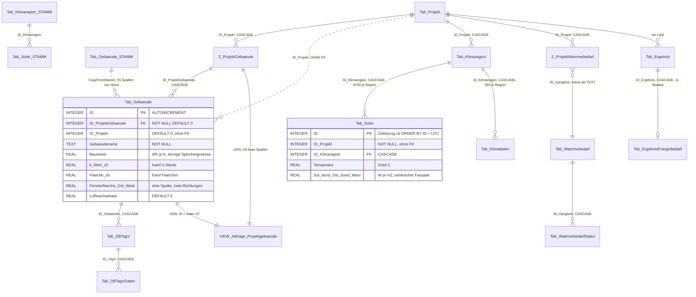
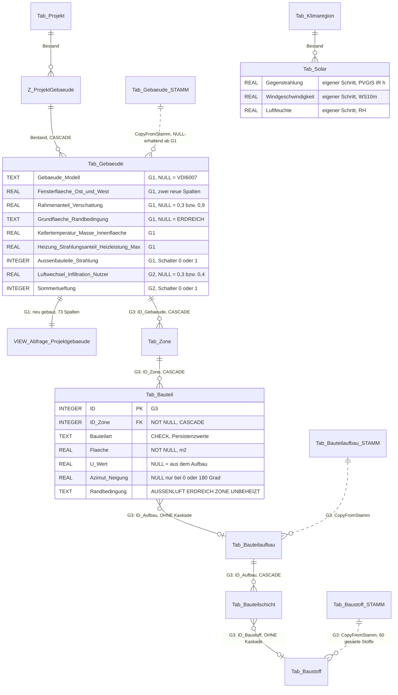
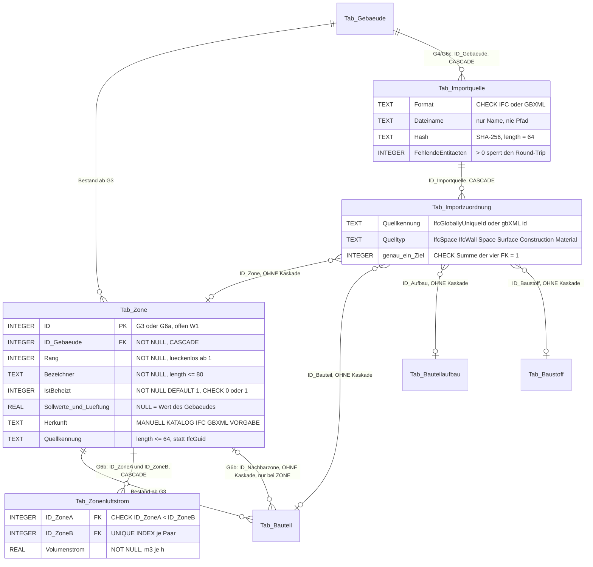
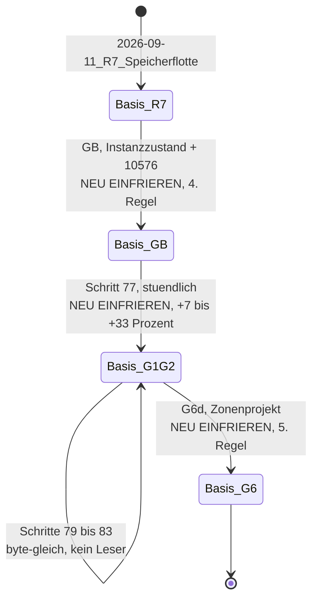

# Befund V — Datenmodell-Architektur: Bestand und konsolidiertes Zielmodell (15.09.2026)

**Zweck.** Bestandsgrundlage für den beauftragten Systementwurf und die Architektur der
Gebäudesimulation nach VDI 6007 Blatt 1 — genauer für den Teil **Datenmodell-Architektur**. Das
Papier erhebt, wie Schema, Gebäudedaten und Klimadaten heute gebaut sind, führt das über vier
Papiere verstreute Zielmodell zu **einem** Bild zusammen, benennt die Widersprüche zwischen ihnen
und legt Migrations-, Einfrier- und Mengenplan vor. Es entscheidet nichts; jede Empfehlung ist als
solche gekennzeichnet.

**Quellen.** Eigene Lesung von `sql/schema/001_grundschema.sql`, `sql/schema/002_views.sql`,
`EPOS.Kern/Allgemein/Update/` (`SchemaStand.cs`, `SchemaKatalog.cs`, `WechselrichterSchema.cs`,
`AnlageStrangSchema.cs`), `WindowsFormsApplication1/Allgemein/Update/SchemaMigration.cs`,
`EPOS.Kern/Allgemein/DataRepository.cs`, `EPOS.Kern/Allgemein/Datenbank/Erstbereitstellung.cs`,
`EPOS.Kern/Controller/` (`ProjektGebaeudeCtrl.cs`, `GebaeudeStammCtrl.cs`,
`ProjektDuplizierenCtrl.cs`, `GebaeudeBedarfCtrl.cs`, `WizardCtrl.cs`),
`Werkzeuge/Testdatenbankschema/Program.cs`, `Werkzeuge/SqlDialektPruefer/pruefer.py`.
Papiere: [`ADR-001_Schema-Ausrollung.md`](../ADR-001_Schema-Ausrollung.md),
[`BETRIEB_SQLITE.md`](../BETRIEB_SQLITE.md),
[`Konzept_Gebaeudesimulation_VDI6007_EPOS-Plan.md`](../Konzept_Gebaeudesimulation_VDI6007_EPOS-Plan.md)
(6.1–6.4, 11, 12, Nachtrag 1),
[`Umsetzungskonzept_Gebaeudesimulation_VDI6007_EPOS-Plan.md`](../Umsetzungskonzept_Gebaeudesimulation_VDI6007_EPOS-Plan.md)
(1.6–1.8, U1–U16),
[`Konzept_Mehrzonenmodell_IFC_EPOS-Plan.md`](../Konzept_Mehrzonenmodell_IFC_EPOS-Plan.md)
(3.5, 4.1–4.4, 7, 9, M1–M14),
[`Konzept_Datenaustausch_gbXML_IFC_EPOS-Plan.md`](../Konzept_Datenaustausch_gbXML_IFC_EPOS-Plan.md)
(7.1–7.5, D1–D15), [`Referenzlaeufe/LIESMICH.md`](../../../Referenzlaeufe/LIESMICH.md).

**Abgrenzung — was hier NICHT wiederholt wird.** Den Rechenweg des Bestands und die Naht
`HeizwaermeEinesGebaeudes` belegt [Befund L](2026-09-15_Befund_L_Einbindung_Kern.md); den
Gebäudedialog und seine Felder [Befund M](2026-09-15_Befund_M_Gebaeudedialog.md); den IFC-Leser
[Befund N](2026-09-15_Befund_N_IFC-Import_Entwurf.md); die Hausmuster für Eltern-Kind-Tabellen,
Kataloge, Listendialoge und Bericht [Befund Q](2026-09-15_Befund_Q_Muster_Datenmodell_Dialoge.md);
die Messwerte der Testdatenbank [Befund D](2026-09-15_Befund_D_Testdatenbank.md). Dieses Papier
verweist dorthin und ergänzt, was für eine Architektur fehlt: die **Schemaverwaltung als System**,
das **Gesamtbild beider Modelle**, die **Konsolidierung** der vier Vorschläge und die **Mengen**.

---

## 0. Das Ergebnis in acht Sätzen

1. Die Schemaverwaltung ist fertig und trägt: ADR-001 Option C, Zielstand **76**
   (`EPOS.Kern/Allgemein/Update/SchemaStand.cs:93`), SQLite-Schritte lückenlos ab 62, je Schritt
   **eine** Definitionsklasse im Kern als Quelle für Migration, Testdatenbankwerkzeug, Kopierweg
   und Nachweis — die Gebäudesimulation braucht kein neues Ausrollverfahren, nur Schrittnummern.
2. Das Gebäude von heute ist **eine** Tabelle mit 55 Spalten plus Katalogzwilling mit 54, über die
   Zuordnung `Z_ProjektGebaeude` am Projekt, und alles, was der Rechenkern davon sieht, geht durch
   die Sicht `Abfrage_Projektgebaeude` mit **fester** 58-Spalten-Liste, die **nach Index** gelesen
   wird (`EPOS.Kern/Controller/ProjektGebaeudeCtrl.cs:29`, `:99`).
3. Damit ist die Sicht der Engpass des ganzen Vorhabens: SQLite kennt kein `ALTER VIEW`, also ist
   **jeder** Gebäudespalten-Schritt zugleich ein Sichtneubau — Schritt 77 wäre der erste
   `DROP VIEW`/`CREATE VIEW` des SQLite-Zweigs überhaupt.
4. Das Zielmodell besteht aus drei Wellen: **15 Spalten** an `Tab_Gebaeude(_STAMM)` (G1+G2, Schritt
   77 nach U5 verschmolzen), **drei Spalten** an `Tab_Solar(_STAMM)` (eigener Schritt), und **neun
   neue Tabellen** für Bauteile, Zonen und Importherkunft (G3, G6a, Datenaustausch).
5. Die vier Papiere beschreiben dieselben neun Tabellen mit **abweichenden Spaltennamen,
   Fremdschlüsselzielen und Wertebereichen**; Kapitel 4 listet 18 solche Stellen mit Vorschlag —
   die härteste ist, dass G3 laut Mehrzonenkonzept 3.5 `Tab_Bauteil` und `Tab_Bauteilschicht`
   anlegt, deren Fremdschlüsselziele `Tab_Zone` und `Tab_Bauteilaufbau` aber erst G6a bringt.
6. Nur zwei Schritte berühren die Referenzbasis — **GB** (Instanzzustand, Ferienwarnungen,
   Korrektur 10576) und **G1+G2** (stündliche Rechnung, +7 bis +33 % Jahresheizwärme); alle
   Tabellen-, Saat- und Sichtschritte sind ergebnisneutral, **solange kein Rechenweg sie liest**,
   und genau dieser Nachweis gehört in jeden Schrittbericht.
7. Die Mengen sind unkritisch: ein Projekt mit Zonen bleibt unter **3 500 Zeilen** in den neun
   neuen Tabellen — drei Größenordnungen unter den 8 760 Zeilen, die `Tab_Solar` je Klimaregion
   schon heute führt.
8. Die **Ergebnisreihen gehören nicht in die Datenbank**: persistiert man vier Stundenreihen je
   Zone, kostet ein Projekt mit 150 Zonen rund **5,3 Millionen Zeilen und etwa 150 MB je Lauf** —
   mehr als die gesamte Testdatenbank (70,8 MB); der Bestand hält Ergebnisse ausnahmslos als
   Skalare je Lauf, und dabei bleibt es.

---

## 1. Bestand: die Schemaverwaltung als System

### 1.1 Der Ausrollweg — ADR-001, Option C

[`ADR-001`](../ADR-001_Schema-Ausrollung.md) (Entscheidung ab `:63`, Konsequenzen ab `:201`) legt
fest: **versionierte, im Programmcode gehaltene Migration mit Schemamarker, einmalig beim Start**;
nummerierte Schrittmethoden, die nur laufen, wenn der Marker kleiner ist, und den Marker **erst
nach nachgewiesenem Erfolg** anheben; Fehler gesammelt und einmal gemeldet, bei Fehlschlag bleibt
der Marker stehen und der Simulationsbereich verweigert den Start.

Die Zahlen heute:

| Größe | Wert | Beleg |
|---|---|---|
| Zielstand des SQLite-Zweigs | **76** | `EPOS.Kern/Allgemein/Update/SchemaStand.cs:93` |
| Weiterleitung aus der Migration | `ZIEL_VERSION = SchemaStand.Zielversion` | `WindowsFormsApplication1/Allgemein/Update/SchemaMigration.cs:108` |
| Eingefrorener Access-Stand | **61** (`FREEZE_VERSION`) | `…/SchemaMigration.cs:126` |
| Schrittliste des SQLite-Zweigs | `SCHRITTE_SQLITE`, Schritte 62 … 76 | `…/SchemaMigration.cs:3516` ff. |
| Letzter Schritt | 76 — eindeutiger Index über `energy_project_settings` | `…/SchemaMigration.cs:2816` |

**Eine Ortsteilung, die für die Architektur zentral ist.** `SchemaMigration` liegt in der
**Windows-Schale** (`WindowsFormsApplication1/Allgemein/Update/`), weil sie noch den Access-Zweig
mit `System.Data.OleDb` trägt. Die **Definitionen** liegen im **Kern**
(`EPOS.Kern/Allgemein/Update/`): `WechselrichterSchema`, `AnlageStrangSchema`,
`NutzungsdauerSchema`, `SpeicherAuslegungStrict`, `ProjektEnergietraegerEindeutig` und weitere. Der
Kern kennt nur die **Zahl** (`SchemaStand.Zielversion`) und die **Anweisungen**, nie die Migration.
Das ist die Naht, durch die iOS dieselben Tabellen bekommt.

### 1.2 Die Schema-Klasse als *eine* Quelle für vier Leser

Muster `EPOS.Kern/Allgemein/Update/WechselrichterSchema.cs`. Der Klassenkopf nennt die Begründung
wörtlich (`:12-17`): zwei Stellen legen dieselben Tabellen an — die Migration beim Programmstart
und `Werkzeuge/Testdatenbankschema` beim Nachziehen der Messlatte —, und „zwei abgeschriebene
`CREATE TABLE` wären zwei Schemata, die beim ersten Nachtrag auseinanderlaufen". Die Klasse führt
deshalb:

- die **Spaltennamen** als `public const string` (`:55` ff.) — sprachneutral und einmal;
- die **DDL** als `SQL_CREATE_STAMM` (`:173`) und `SQL_CREATE_PROJEKT` (`:222`);
- die **Anlegereihenfolge** als `Anweisungen` (`:264`), Paare aus Tabellenname und SQL;
- die **Fachspalten** in Schemareihenfolge (`:286`) — die eine Liste, an der `CopyFromStamm` und
  der Nachweis hängen.

Vier Hausregeln stehen im selben Kopf, alle vier belegt: **STRICT** und `IF NOT EXISTS` für
Idempotenz (`:38-42`); **kein DDL-DEFAULT auf Fachwerten** — „NULL ist der Vorgabewert, und der
Vorgabewert ist der, der nichts ändert" (`:33-38`); die **Boolean-Regel**
`INTEGER NOT NULL DEFAULT 0 CHECK ("…" IN (0,1))` als einzige Ausnahme (`:207`); und **kein
Fremdschlüssel wird stillschweigend nachgerüstet**, weil er den Löschweg eines Projekts ändert und
das eine Verhaltensänderung wäre (`:40-45`).

`AnlageStrangSchema.cs:154-170` ergänzt die Regeln für Kindtabellen: `CHECK (length(...) <= 50)`
statt einer Typlänge (`:159`), **Kaskade nur zum Eltern** (`:168` `ON DELETE CASCADE` auf
`Tab_Energieanlagen`) und **keine Kaskade am Katalogverweis** (`:169`
`REFERENCES "Tab_Wechselrichter" ("ID")` ohne Kaskadenklausel).

Die **vier Handgriffe in fester Reihenfolge**, die `Werkzeuge/Testdatenbankschema/Program.cs`
(Schritt-75-Block ab `:272`) und die Migration gleichermaßen abarbeiten: Tabelle samt Index — die
Verweisspalten — die Saat — die Saat-Zuordnung. Und die Reihenfolge der Quelltextpflege:
**erst** Schrittkonstante, Methode und `SCHRITTE_SQLITE`-Eintrag, **dann** die Zielversion.

### 1.3 Namen, Typen und Zugriff

| Regel | Ausprägung | Beleg |
|---|---|---|
| `Tab_*` | Stamm- und Projektdaten | durchgängig in `sql/schema/001_grundschema.sql` |
| `Tab_*_STAMM` | Auslieferungskatalog, `ReadOnly` = gehört zur Auslieferung | z. B. `…:1190` (`Tab_Gebaeude_STAMM`) |
| `Z_*` | Zuordnung Projekt ↔ Katalog bzw. Eltern ↔ Kind | z. B. `…:2873` (`Z_ProjektGebaeude`) |
| `STRICT` | jede Fachtabelle; erlaubt sind INT/INTEGER/REAL/TEXT/BLOB/ANY | `WechselrichterSchema.cs:38-40` |
| Boolean | `INTEGER NOT NULL DEFAULT 0 CHECK (x IN (0,1))` | `…:1188` (`ReadOnly`), `…:1364` (`WE`) |
| Beziehungen | über **IDs**, nicht über Textfelder | Wurzel-[`CLAUDE.md`](../../../CLAUDE.md), Abschnitt „Datenhaltung" |
| Zugriff | `DataRepository` mit **`?`**-Parametern, nie zusammengesetzter SQL-Text | `EPOS.Kern/Allgemein/DataRepository.cs:300`, `:306`, `:312`, `:318`, `:323`, Muster `:498-499` |
| Schemaauskunft | `DataRepository.SpaltenVonTabelle` reicht an `IDatenzugriff` durch | `…/DataRepository.cs:426-428` |

Der SQL-Dialekt ist in [`BETRIEB_SQLITE.md`](../BETRIEB_SQLITE.md) Abschnitt 6 (`:233` ff.)
geregelt: Umlautregel (`:241`), Verbotsliste der Access-Schreibweisen (`:258`), `= True`/`= False`
(`:294`), Prüfbefehl (`:307`). Der Prüfer `Werkzeuge/SqlDialektPruefer/pruefer.py` hält jeden
SQL-Text des Bestands mit `EXPLAIN` gegen die Testdatenbank und gegen die Musterliste (z. B.
`Nz(` an `:804`).

### 1.4 Sichten — der blinde Fleck

`sql/schema/002_views.sql` führt **14 Sichten** (Kopf `:1-24`). Drei davon sind bereits einmal
kuriert worden (doppelte `ID` → `ID_Daten`, `:10-17`), und der Kopf hält die Lehre daraus fest:
*„Jet löst das auf, SQLite nicht: eine Sicht hat nur ihre eigenen Ausgabespalten."*

Für die Architektur entscheidend: **Die Datei wird von der Anwendung nicht ausgeführt.** Sie baut
den eingefrorenen Stand 61 auf; danach läuft die Migration. Und im SQLite-Zweig der Migration gibt
es bis heute **kein** `DROP VIEW`/`CREATE VIEW`-Muster. Jede neue Gebäudespalte, die einen Leser
erreichen soll, erzwingt deshalb den **ersten Sichtneubau des SQLite-Zweigs**.

### 1.5 Die Werkzeugkette um das Schema herum

| Werkzeug | Was es mit dem Schema tut | Was eine neue Tabelle beachten muss |
|---|---|---|
| `Werkzeuge/Testdatenbankschema` | zieht `Referenzlaeufe/Kenndaten_Test.sqlite` auf den Zielstand nach, aus **derselben** Schema-Klasse wie die Migration (`Program.cs:272` ff.) | jede neue Tabelle braucht dort ihren Block, sonst ist die Messlatte älter als die Anwendung |
| `Werkzeuge/Auslieferungsvorlage` | erzeugt die Vorlagendatenbank; erkennt Kataloge **ordinal** über `EndsWith("_STAMM")`, behält bei `--kataloge readonly` nur `ReadOnly = 1`, und ein auf null Zeilen fallender Katalog löst den Wächter aus | Katalogname exakt `_STAMM`; Saat mit `ReadOnly = 1`; Kindtabellen ohne `ReadOnly` prüfen |
| `EPOS.Kern/Allgemein/Datenbank/Erstbereitstellung.cs:119` | kopiert die Vorlage beim ersten Start ans Ziel, „einmal je Rechner, nie überschreibend, nie halb" (`:87`); der Schemastand der Vorlage **darf älter sein** (`:113`) | nichts — die Migration holt den Rest nach |
| Sicherung | `VACUUM INTO` im laufenden Betrieb ([`BETRIEB_SQLITE.md`](../BETRIEB_SQLITE.md) `:149`), Dateikopie bei geschlossener Anwendung (`:138`) | nichts; wächst aber mit jeder persistierten Zeitreihe (Kapitel 6) |
| `Werkzeuge/SqlDialektPruefer` | hält jede Anweisung gegen Dialektregeln und Testdatenbank | nach **jeder** neuen oder geänderten SQL-Anweisung ziehen |
| Projekttransfer (`.wpx`) | schreibt `SchemaStand.Zielversion` ins Manifest und lehnt beim Import ein Paket mit abweichendem Stand ab (`SchemaStand.cs:30-40`) | jede neue Nummer entwertet ältere Pakete — gehört in den Schrittbericht |

```mermaid
flowchart LR
    K["Schema-Klasse im Kern<br/>EPOS.Kern/Allgemein/Update/*Schema.cs<br/>DDL + Spaltennamen + Saat"]
    M["SchemaMigration<br/>(Windows-Schale)<br/>Schritt N, Marker N"]
    T["Werkzeuge/<br/>Testdatenbankschema"]
    C["Controller /<br/>CopyFromStamm"]
    N["Tests und Wächter"]
    P["SqlDialektPruefer"]
    A["Auslieferungsvorlage"]
    D[("Kenndaten.sqlite<br/>beim Anwender")]
    L[("Kenndaten_Test.sqlite<br/>Messlatte, LFS")]
    V[("Vorlage/<br/>Kenndaten.sqlite")]

    K --> M --> D
    K --> T --> L
    K --> C
    K --> N
    M -.Nachweis.-> P
    D --> A --> V
    V -.Erstbereitstellung.-> D
```

---

## 2. Das Gebäude heute

### 2.1 `Tab_Gebaeude` — 55 Spalten (`sql/schema/001_grundschema.sql:1131-1188`)

| Gruppe | Spalten | Typ |
|---|---|---|
| Schlüssel und Bindung | `ID` | `INTEGER PRIMARY KEY AUTOINCREMENT` |
| | `ID_ProjektGebaeude` | `INTEGER NOT NULL DEFAULT 0` → FK auf `Z_ProjektGebaeude.ID`, `ON UPDATE CASCADE ON DELETE CASCADE` (`:1187`) |
| | `ID_Projekt` | `INTEGER DEFAULT 0` — **ohne Fremdschlüssel**, zweite Bindung (2.5) |
| Bezeichnung | `Gebaeudename` `TEXT NOT NULL`, `Typ` `TEXT NOT NULL`, `Beschreibung` `TEXT` | |
| Nutzung | `Wohnflaeche_gesamt`, `Bewohner`, `Flaeche_Nutzer`, `Interne_Waermegewinne`, `Bauweise` | `REAL` |
| Fenster | `Fensterflaeche_Sued`, `Fensterflaeche_Ost_West`, `Fensterflaeche_Nord`, `Fensterdurchlassgrad` | `REAL` |
| Sollwerte | `Raumsolltemperatur_Nachtabsenkung`, `_Tag`, `_Wochenende`, `_Ferien`, `Maximaleraumtemperatur` | `REAL` |
| U-Werte (5) | `k_Wert_Außenwand`, `k_Wert_Fenster`, `k_Wert_Dachflaeche`, `k_Wert_Grundflaeche`, `k_Wert_Sonstiges` | `REAL` |
| Flächen (5+2) | `Flaeche_Außenwand`, `gesamte_Fensterflaeche`, `Dachflaeche`, `Grundflaeche`, `Sonstige_Flaechen`, `Wohnflaeche`, `Raumhoehe` | `REAL` |
| Wärmebrücken (3+3) | `WBVK_Anschluß_Fenster_Wand`, `WBVK_Anschluß_Wand_Dach`, `WBVK_Anschluß_Außenwand_Kellerdecke`, `Abmessung_Anschluß_Fenster_Wand`, `Abmessung_Anschluß_Wand_Dach`, `Abmessung_Anschluß_Außenwand_Kellerdecke` | `REAL` |
| Lüftung | `Luftwechselrate` | `REAL DEFAULT 0` |
| Kalender | `Wochenende`, `Ferien`, `Ferienbeginn_1` … `Ferienende_4` (8) | `REAL` |
| Bedarf | `WW_Bedarf`, `spez_Waermeverbrauch`, `Waermebedarf` | `REAL` |
| Klassierung | `Baualtersklasse`, `Gebaeudeart`, `Wohngebaeude_Nicht_Wohngebaeude` | `TEXT` |

Die Tabelle ist `STRICT`. **Auffällig:** die fünf U-Wert-/Flächenpaare sind der gesamte
Hüllenbezug; es gibt weder Orientierung noch Neigung, weder Aufbau noch Masse — `Bauweise` in Wh/K
ist die einzige Speichergröße. `Fensterflaeche_Ost_West` ist **eine** Spalte für zwei
Himmelsrichtungen. `Baualtersklasse` ist ein Buchstabe, kein Baujahr.

### 2.2 `Tab_Gebaeude_STAMM` — 54 Spalten (`…:1190-1248`)

Spaltengleich zur Projekttabelle **ohne** `ID_ProjektGebaeude`, `ID_Projekt` und `Gebaeudename`,
**mit** `Bezeichner TEXT NOT NULL` als Namensspalte und
`ReadOnly INTEGER NOT NULL DEFAULT 0 CHECK ("ReadOnly" IN (0,1))` als letzter Spalte. Auch `STRICT`.

Der Kopierweg ist **handgeschrieben**: `EPOS.Kern/Controller/GebaeudeStammCtrl.cs:439`
(`CopyFromStamm`) vergibt den Schlüssel als `DataRepository.GetMaxID(TABLE_PROJ) + 1` (`:447`) und
schreibt einen `INSERT` mit **55 fest verdrahteten Spalten** (`:449`). Jeder REAL-Wert wird als
`r["X"] == DBNull.Value ? 0.0 : Convert.ToDouble(r["X"])` gebunden (`:458` ff.), jeder Text als
`== DBNull.Value ? "" : …` (`:455-457`). **Damit macht der Katalogweg aus jedem NULL eine 0 und
aus jedem NULL-Text ein `""`** — das ist der Sperrpunkt „Befund Q-1", auf den alle vier Papiere
verweisen, und er ist hier eigengelesen bestätigt.

### 2.3 Die Sicht `Abfrage_Projektgebaeude` (`sql/schema/002_views.sql:89-91`)

```sql
CREATE VIEW [Abfrage_Projektgebaeude] AS
SELECT Z_ProjektGebaeude.ID_Projekt, …, Tab_Gebaeude.ID
FROM Z_ProjektGebaeude INNER JOIN Tab_Gebaeude
     ON Z_ProjektGebaeude.ID = Tab_Gebaeude.ID_ProjektGebaeude;
```

**58 Ausgabespalten in fester Liste:** 5 aus `Z_ProjektGebaeude` (Index 0–4:
`ID_Projekt`, `Wohnflaeche_Waermebedarf`, `Einheit_Waermebedarf_Wohnflaeche`, `Jahresnutzungsgrad`,
`dezWarmwasserbereitung`), 52 aus `Tab_Gebaeude` (Index 5–56: `Gebaeudename` …
`Wohngebaeude_Nicht_Wohngebaeude`), zuletzt `Tab_Gebaeude.ID` (**Index 57**).
`Tab_Gebaeude.ID_ProjektGebaeude` und `Tab_Gebaeude.ID_Projekt` kommen **nicht** vor.

Gelesen wird sie in `EPOS.Kern/Controller/ProjektGebaeudeCtrl.cs:29`
(`SELECT * FROM Abfrage_Projektgebaeude WHERE ID_Projekt = ?`, parametriert) und **nach
Spaltenindex** abgebildet — `row[53]` … `row[57]` stehen in `:95-99`. Eine Spalte, die vor
`Tab_Gebaeude.ID` eingefügt würde, verschöbe die Zuordnung **still**.

### 2.4 Klima, Kanäle, Ergebnisse

- **`Tab_Klimadaten`** (`…:1355-1372`, `STRICT`): `ID`, `ID_Projekt`, `ID_Klimaregion` (FK auf
  `Tab_Klimaregion`, Kaskade), `Sol_Nord/Ost/Sued/West`, `Temperatur`, `WE`
  (`INTEGER NOT NULL DEFAULT 0 CHECK IN (0,1)`), `TagTyp_W`, `TagTyp_NW`, `Globalstrahlung`,
  `Direktstrahlung`, `Diffusstrahlung`, `Sonnenwinkel`. **365 Zeilen je Region**, Tagesmittel
  (Befund D, C).
- **`Tab_Solar`** (`…:2153-2167`, `STRICT`): `ID`, `ID_Projekt INTEGER NOT NULL` (**ohne FK**),
  `ID_Klimaregion` (FK, Kaskade), `Temperatur`, `Sol_Nord/Ost/Sued/West`, `Globalstrahlung`,
  `Direktstrahlung`, `Diffusstrahlung`, `Sonnenwinkel`. **8 760 Zeilen je Region**, keine
  Zeitspalte — der Zeitbezug ist `ORDER BY ID` = UTC (Befund D, C). Stammzwilling
  `Tab_Solar_STAMM` (`…:2169-2182`) ohne `ID_Projekt` und **ohne `ReadOnly`**.
- **Kanal:** `Z_ProjektWaermebedarf` (`…:2916-2924`) bindet Projekt und Ganglinie und trägt den
  Kanal als **Textspalte** `Kanal TEXT CHECK (length("Kanal") <= 50)` — die einzige Stelle im
  Gebäudeumfeld, die eine Beziehung über Text ausdrückt.
- **Ergebnisse:** `Tab_Ergebnis` (`…:790`) und `Tab_ErgebnisEnergiebedarf` (`…:850-863`) —
  letztere mit elf REAL-Spalten (`Waermebedarf_Gesamt`, `Waermelast_Max`, … `Waermebedarf_Prozess`)
  und `FOREIGN KEY ("ID_Ergebnis") … ON DELETE CASCADE`. **Einzeilig je Lauf, reine Skalare.** Es
  gibt im gesamten Ergebnisbereich (17 `Tab_Ergebnis*`-Tabellen) **keine Stundenreihe**.
- **Tagesverteilung:** `Tab_DBTagV` hängt über `ID_Gebaeude` an `Tab_Gebaeude`
  (`…:646`, Kaskade), `Tab_DBTagVDaten` an `Tab_DBTagV`. Das ist die **einzige** Kindtabelle des
  Gebäudes im Bestand — und damit das Vorbild, an dem sich Zonen und Bauteile messen lassen.

### 2.5 Zwei Bindungen ans Projekt — eine Altlast, die die Architektur erbt

`Tab_Gebaeude` führt **beide** Wege zum Projekt:

| Weg | Wer benutzt ihn | Beleg |
|---|---|---|
| `ID_ProjektGebaeude` → `Z_ProjektGebaeude.ID` → `Tab_Projekt` (FK, Kaskade) | Sicht, Leser, `GebaeudeBedarfCtrl` | `…:1187`; `EPOS.Kern/Controller/GebaeudeBedarfCtrl.cs:149`, Kommentar `:140` |
| `ID_Projekt` direkt (kein FK) | Löschweg und Kopierweg | `EPOS.Kern/Controller/WizardCtrl.cs:181-188`; `ProjektDuplizierenCtrl.cs:156-157` (`KINDER`-Filter über `Tab_Gebaeude.ID_Projekt`) |

`ProjektDuplizierenCtrl.FK_MAP` kennt beide Schlüssel (`:98-99`: `ID_ProjektGebaeude` →
`Z_ProjektGebaeude`, `ID_Gebaeude` → `Tab_Gebaeude`) und vergleicht **ohne**
Groß-/Kleinschreibung — ein zweiter Eintrag in anderer Schreibweise ist eine `ArgumentException`
beim Laden der Klasse, also „Programm startet nicht".

### 2.6 Bild 1 — Bestand



---

## 3. Das Zielmodell, konsolidiert

### 3.1 Welle 1 — Schemaschritt 77: `Tab_Gebaeude(_STAMM)`

Nach Umsetzungskonzept 1.6 trägt eine neue Kernklasse **`EPOS.Kern/Allgemein/Update/GebaeudeSchema.cs`**
die Spaltenliste, `SQL_VIEW_DROP` und `SQL_VIEW_NEU`. Zwölf Spalten je Tabelle aus G1, drei aus G2
— nach **U5 verschmolzen** zu **15 Spalten je Tabelle, 30 `SchemaSpalte`-Einträgen, einem
Sichtneubau**:

| Spalte | Typangabe | SQLite | NULL bedeutet | Stufe |
|---|---|---|---|---|
| `Gebaeude_Modell` | `TEXT(20)` | TEXT | **`VDI6007`** (E1 kehrt Konzept 6.1 um) | G1 |
| `Fensterflaeche_Ost` | `DOUBLE` | REAL | ½ `Fensterflaeche_Ost_West` | G1 |
| `Fensterflaeche_West` | `DOUBLE` | REAL | ½ `Fensterflaeche_Ost_West` | G1 |
| `Rahmenanteil` | `DOUBLE` | REAL | 0,3 | G1 |
| `Verschattungsfaktor` | `DOUBLE` | REAL | 0,9 | G1 |
| `Grundflaeche_Randbedingung` | `TEXT(20)` | TEXT | `ERDREICH` | G1 |
| `Kellertemperatur` | `DOUBLE` | REAL | 10 °C | G1 |
| `Masseanteil_Aussen` | `DOUBLE` | REAL | 0,3 | G1 |
| `Innenflaechenfaktor` | `DOUBLE` | REAL | 2,5 | G1 |
| `Heizung_Strahlungsanteil` | `DOUBLE` | REAL | 0,3 | G1 |
| `Heizleistung_Max` | `DOUBLE` | REAL (kW) | unbegrenzt | G1 |
| `Aussenbauteile_Strahlung` | `YESNO` | `INTEGER NOT NULL DEFAULT 0 CHECK (… IN (0,1))` | — (Schalter) | G1 |
| `Luftwechsel_Infiltration` | `DOUBLE` | REAL (1/h) | 0,3 | G2 |
| `Luftwechsel_Nutzer` | `DOUBLE` | REAL (1/h) | 0,4 | G2 |
| `Sommerlueftung` | `YESNO` | `INTEGER NOT NULL DEFAULT 0 CHECK (… IN (0,1))` | — (Schalter) | G2 |

Der Schritt tut **drei** Dinge, nicht eines: Spalten anlegen — Sicht `DROP`+`CREATE` mit den 15
neuen Spalten **hinter** `Tab_Gebaeude.ID` (damit Index 57 gültig bleibt) — und den Leser
`ProjektGebaeudeCtrl.ReadAll` auf **Namenszugriff** umstellen. Persistenzwerte (`TAGESBILANZ`,
`VDI6007`, `ERDREICH`, `KELLER`, `AUSSENLUFT`) kommen nach `DbWerte` als ASCII-Konstanten.

### 3.2 Welle 2 — der `Tab_Solar`-Schritt (eigener Schritt)

Drei `REAL`-Spalten in `Tab_Solar` **und** `Tab_Solar_STAMM`: `Gegenstrahlung` (PVGIS `IR(h)`,
W/m²), `Windgeschwindigkeit` (`WS10m`, m/s), `Luftfeuchte` (`RH`, %). Die Werte liegen in der
PVGIS-Antwort bereits vor und werden heute verworfen. **Eigener Schritt** wegen anderer Wirkung
(die Spalten bleiben in Bestandsregionen NULL, bis der Anwender neu importiert), anderen
Mitläufercodes und anderen Risikos als der Sichtneubau.

### 3.3 Welle 3 — Bauteile und Zonen (G3 und G6a)

Neun Tabellen, konsolidiert aus Mehrzonenkonzept 4.2 (maßgeblich), Befund Q 5.1 (älter) und
Konzept 6.3 (ältester Stand):

| Tabelle | Bauform | Eltern / Kaskade | Zweck |
|---|---|---|---|
| `Tab_Zone` | B (geordnete Kindliste) | `Tab_Gebaeude.ID`, **CASCADE** | eine thermische Zone; keine `_STAMM`-Entsprechung |
| `Tab_Bauteil` | B | `Tab_Zone.ID`, **CASCADE** | Fläche, Art, Orientierung, U/g, Randbedingung, `ID_Nachbarzone` (ohne Kaskade) |
| `Tab_Bauteilaufbau` / `_STAMM` | Kopf | Projekt bzw. `ReadOnly` | wiederverwendbarer Schichtaufbau |
| `Tab_Bauteilschicht` / `_STAMM` | A (Wertetabelle) | `Tab_Bauteilaufbau.ID`, **CASCADE** | `Reihenfolge` innen→außen, `Dicke`, **Kopie** von λ/ρ/c |
| `Tab_Baustoff` / `_STAMM` | Katalog + Projektkopie | — | rund 60 gesäte Stoffe nach DIN 4108-4 / ISO 10456 |
| `Tab_Zonenluftstrom` | Paartabelle | `Tab_Zone.ID` ×2, CASCADE | `CHECK (ID_ZoneA < ID_ZoneB)` + eindeutiger Index |

**Kein `Tab_Zonenkopplung`:** Die Kopplung steht als `ID_Nachbarzone` am Bauteil; eine zweite
Tabelle wäre eine zweite Wahrheit über dieselbe Fläche.

### 3.4 Welle 4 — Importherkunft (Datenaustausch 7.1/7.2, Schritt „S-F")

`Tab_Importquelle` (eine Zeile je Importlauf: `ID_Gebaeude` FK CASCADE, `Format`
`CHECK IN ('IFC','GBXML')`, `Dateiname` **ohne Pfad**, `Hash` SHA-256, `Groesse`, `Schemastand`,
`Zeitpunkt`, `Programmfassung`, `Zonenregel`, `FehlendeEntitaeten`) und `Tab_Importzuordnung` (eine
Zeile je Paarung: `ID_Importquelle` FK CASCADE, vier nullbare Fremdschlüssel auf Zone, Bauteil,
Aufbau, Baustoff mit
`CHECK ((ID_Zone IS NOT NULL) + (ID_Bauteil IS NOT NULL) + (ID_Aufbau IS NOT NULL) + (ID_Baustoff IS NOT NULL) = 1)`,
dazu `Quellkennung` und `Quelltyp`). Indizes auf `(ID_Importquelle)` und `(Quellkennung)`.

**Herkunftsspalten** an Zone, Bauteil und Aufbau: `Herkunft TEXT CHECK (IN
('MANUELL','KATALOG','IFC','GBXML','VORGABE'))` und `Quellkennung TEXT CHECK (length <= 64)`.

### 3.5 Ergebnisreihen und Kennzahlen — **nicht** in die Datenbank

Umsetzungskonzept 1.8 legt den Weg fest: **Skalare in `aggregate.csv`**, Stundenreihen als
CSV-Dateien des Referenzlaufs (`raumtemperatur_<n>.csv`, `operative_temperatur_<n>.csv`,
`kuehlbedarf_<n>.csv`), erzeugt **nur**, wenn das Projekt mindestens ein VDI-6007-Gebäude führt.
Mehrzonenkonzept 7 ergänzt vier Reihen je Zone, die in den Kanal nur als Gebäudesumme eingehen, und
eine Zonentabelle im Bericht. Kapitel 6 dieses Papiers beziffert, warum das so bleiben muss.

### 3.6 Bild 2 — Zielmodell Einzonen, G1 bis G3



> **Bestand unverändert:** `Tab_Projekt`, `Z_ProjektGebaeude`, `Tab_Klimaregion`,
> `Tab_Gebaeude_STAMM`-Grundbestand, `Tab_DBTagV(-Daten)`, alle `Tab_Ergebnis*`.
> **Neu je Stufe:** G1/G2 = 15 Spalten an `Tab_Gebaeude(_STAMM)` + Sichtneubau;
> eigener Schritt = 3 Spalten an `Tab_Solar(_STAMM)`; G3 = sechs bis acht Tabellen (4.1, Punkt W1).

### 3.7 Bild 3 — Zielmodell Mehrzonen und Import, G4 bis G6



---

## 4. Widersprüche und Lücken zwischen den Papieren

Kennung **W**n. Spalte „Vorschlag" ist eine Empfehlung dieses Befunds, kein Entscheid.

| Nr. | Gegenstand | Papier A | Papier B | Wirkung, wenn ungeklärt | Vorschlag |
|---|---|---|---|---|---|
| **W1** | **Wann entstehen `Tab_Zone` und `Tab_Bauteilaufbau`?** | Mehrzonen 3.5: `Tab_Bauteil`, `Tab_Bauteilschicht`, `Tab_Baustoff(_STAMM)` mit **G3**; `Tab_Zone`, `Tab_Bauteilaufbau(_STAMM)`, `Tab_Zonenluftstrom` mit **G6a** | Mehrzonen 4.2: `Tab_Bauteil.ID_Zone` FK auf `Tab_Zone`; `Tab_Bauteilschicht.ID_Aufbau` FK auf `Tab_Bauteilaufbau` | **G3 legt zwei Tabellen mit Fremdschlüsseln auf Tabellen an, die es noch nicht gibt** — die `CREATE TABLE` scheitert oder der FK bleibt tot | **G3 legt alle acht Tabellen an** (Zone, Bauteil, Aufbau(_STAMM), Schicht(_STAMM), Baustoff(_STAMM)) und erzeugt je VDI-Gebäude implizit **Zone 1**. G6a bringt dann nur `Tab_Zonenluftstrom`, `ID_Nachbarzone` und die Kopplung. Der Einzonenweg ist damit der Mehrzonenweg mit N = 1 |
| **W2** | Namensspalte des Bauteils | Befund Q 5.1: `Bezeichnung` | Mehrzonen 4.2: `Bezeichner` | zwei Namen für dieselbe Spalte | **`Bezeichner`** — durchgängige Hausregel aller Kataloge |
| **W3** | Namensspalte des Baustoffs | Konzept 6.3: `Name` | Mehrzonen 3.5/4.2: `Bezeichner` | Namensabgleich N3 zielt auf `Bezeichner` | **`Bezeichner`**; Konzept 6.3 im selben Schritt fortschreiben |
| **W4** | Eltern des Bauteils | Konzept 6.3: `ID_Gebaeude` | Q 5.1 / Mehrzonen 4.2: `ID_Zone` | Bauteile hingen am Gebäude, Zonen liefen leer | **`ID_Zone`**; Konzept 6.3 fortschreiben |
| **W5** | Eltern der Schicht | Konzept 6.3: `ID_Bauteil` | Q 5.1 / Mehrzonen 4.2: `ID_Aufbau` | Schichtaufbauten wären nicht wiederverwendbar | **`ID_Aufbau`**; Konzept 6.3 fortschreiben |
| **W6** | `IstAussen 0/1` am Bauteil | Konzept 6.3: ja | Q / Mehrzonen: nur `Randbedingung` | zwei Wahrheiten über dieselbe Aussage | **streichen**; `Randbedingung` genügt |
| **W7** | Wertebereich `Bauteilart` | Q 5.1: 8 Werte | Mehrzonen 4.2: 9 Werte (+`VORHANGFASSADE`) | `CHECK` weist gültige Importzeilen ab | **9 Werte**, `VORHANGFASSADE` trägt U und g wie ein Fenster |
| **W8** | `KELLER` als `Randbedingung` des Bauteils | Konzept 6.3 / Q 5.1: ja | Mehrzonen 4.2: nein (Keller = unbeheizte **Zone**) | dieselbe Lage zweimal darstellbar | **Bauteil ohne `KELLER`**; an `Tab_Gebaeude.Grundflaeche_Randbedingung` bleibt `KELLER` (Einzonenweg) |
| **W9** | Wertebereich `Herkunft` | Q 5.1: `MANUELL`/`IFC`/`VORGABE` | Mehrzonen 3.5: +`KATALOG`; Datenaustausch 7.3: +`GBXML` | `CHECK` läuft dem Importweg hinterher | **fünf Werte von Anfang an**, in `DbWerte` als ASCII-Konstanten |
| **W10** | Herkunftskennung | Q / Mehrzonen 4.2: `IfcGuid TEXT CHECK (length <= 22)` | Datenaustausch 7.3 (D9): `Quellkennung TEXT CHECK (length <= 64)` | eine gbXML-`id` in einer Spalte namens `IfcGuid`; 22 Zeichen reichen für `xsd:ID` nicht | **`Quellkennung`, 64 Zeichen** — die Spalten gibt es noch nicht, die Umbenennung kostet nichts |
| **W11** | Ziel von `Tab_Bauteilschicht.ID_Baustoff` | Q 5.1: FK auf die **Projektkopie**, auch im `_STAMM` | Mehrzonen 4.2: je Seite auf die **eigene** Ablage | `Tab_Bauteilschicht_STAMM` zeigte auf Projektdaten — die Auslieferungsvorlage bräche | **je Seite eigene Ablage**, Kopierweg setzt über die Id-Abbildung um |
| **W12** | Semantik `Gebaeude_Modell = NULL` | Konzept 6.1: NULL = Tagesbilanz | Nachtrag N1.1 (E1) / Umsetzungskonzept 1.6: **NULL = `VDI6007`** | Bestandsgebäude rechneten das falsche Modell | **E1 gilt**; Konzept 6.1 ist an dieser Stelle überholt, die XML-Doku in `DbWerte` muss es tragen |
| **W13** | Schemaschritt 78 | Konzept 6.1: eigener Schritt für die drei G2-Spalten | Umsetzungskonzept 1.7 (U5): mit 77 verschmelzen | zwei Sichtneubauten = zwei Gelegenheiten für auseinanderlaufende Definitionen | **verschmelzen** (U5 ist offen und liegt beim Anwender) |
| **W14** | „NULL = Vorgabe" gegen `CopyFromStamm` | Konzept 6.1: NULL ist der Vorgabewert | `GebaeudeStammCtrl.cs:458` ff.: jedes NULL wird 0,0, jeder NULL-Text `""` | ein aus dem Katalog übernommenes Gebäude bekäme Rahmenanteil 0 statt 0,3 | **Sperrpunkt, gehört zu G1** (nicht G6): Umbau auf die Spaltenlisten-Bauweise nach Muster `WechselrichterSchema.Fachspalten` + NULL-erhaltende Bindung |
| **W15** | Kaskade unter `Tab_Gebaeude` | Mehrzonen 4.1: `Tab_Zone` mit `ON DELETE CASCADE` an `Tab_Gebaeude` | `AnlageStrangSchema`-Lehre: „Kaskade an einem Eltern, dessen Speicherweg Löschen + Neuanlegen ist, räumt jede Kindliste ab" | ein Speichervorgang am Gebäude könnte alle Zonen löschen | **Kaskade behalten**, aber den Gebäude-Schreibweg **vorher messen** und, falls er löscht und neu anlegt, die Rettung dort einbauen, wo das Löschen steht — nicht im Zonencontroller. **Offen** |
| **W16** | Fehlender Fremdschlüssel `Tab_Gebaeude.ID_Projekt` | `…:1133`: `INTEGER DEFAULT 0`, kein FK | `WizardCtrl.cs:181-188`, `ProjektDuplizierenCtrl.cs:156-157` benutzen ihn als Löschsieb | zwei Bindungen ans Projekt, die auseinanderlaufen können | **nicht anfassen** (ein nachgerüsteter FK änderte den Löschweg, `WechselrichterSchema.cs:40-45`); aber **in `GebaeudeSchema` benennen** und jede neue Kindtabelle ausdrücklich über `ID_Gebaeude` hängen, nie über ein eigenes `ID_Projekt` |
| **W17** | Sichtneubau als wiederkehrender Fall | Umsetzungskonzept 1.6: Schritt 77 baut die Sicht neu | Konzept 6.1: `Baujahr` kommt erst mit dem IFC-Schritt (7.6) | ein dritter Sichtneubau ohne Muster | **`GebaeudeSchema.SQL_VIEW_NEU` ist ab 77 die einzige Quelle der Sichtdefinition**; `sql/schema/002_views.sql` bleibt der eingefrorene Stand 61 und wird **nicht** nachgezogen |
| **W18** | Einfrierregel je Schritt | Umsetzungskonzept 1.8: vierte Regel „gesäte Gebäudedaten" mit GB | Mehrzonen 8.3: fünfte Regel „gesäte Zonendaten" mit G6d | [`Referenzlaeufe/LIESMICH.md`](../../../Referenzlaeufe/LIESMICH.md) führt heute **drei** Regeln (dritte ab `:100`), die Wurzel-`CLAUDE.md` ebenfalls drei | **beide Regeln im jeweiligen Schritt eintragen**, an beiden Orten (LIESMICH und `CLAUDE.md`, Abschnitt „Regressionsnetz") |

**Zwei Lücken ohne Gegenpapier:**

- **L1 — `Tab_Bauteilschicht_STAMM` hat keine Spalte `ReadOnly`.** `Werkzeuge/Auslieferungsvorlage`
  behält bei `--kataloge readonly` in `*_STAMM` nur Zeilen mit `ReadOnly = 1`; eine Kindtabelle ohne
  die Spalte würde über die Kaskade ihres Aufbaus mitgerissen und der Katalog fiele auf null Zeilen
  — was den Wächter auslöst. Vorbild für den Ausweg ist `Tab_Solar_STAMM`, das ebenfalls kein
  `ReadOnly` führt und deshalb **vollständig** behalten wird (Umsetzungskonzept 1.6). **Vor G3 zu
  klären.**
- **L2 — `Kanal` ist Text.** `Z_ProjektWaermebedarf.Kanal TEXT CHECK (length <= 50)` ist der
  einzige Textverweis im Gebäudeumfeld und widerspricht der Hausregel „neue Beziehungen über IDs".
  Das Gebäudemodell schreibt in den Heizungskanal — es **erbt** damit den Textvergleich. Kein
  Umbauauftrag, aber ein benannter Bestand: **neue** Kanalbezüge über IDs, der alte bleibt.

---

## 5. Migrations- und Einfrierplan

### 5.1 Reihenfolge der Schemaschritte

Ausgangsstand **76**. Nummern unter dem Vorbehalt, dass 77 und 78 nach U5 verschmelzen; die
tatsächliche Vergabe folgt der Auslieferungsreihenfolge und geschieht bei Beauftragung der Stufe.

| Nr. | Stufe | Inhalt | Ergebnisneutral? | Testdatenbank-Saat | Auslieferungsvorlage |
|---|---|---|---|---|---|
| **—** | **GB** | kein DDL: Instanzzustand, Ferienwarnungen, Korrektur `Bauweise` von 10576, vierte Einfrierregel | **nein** — 1008 und 1039 ändern sich | Wert in `Kenndaten_Test.sqlite` korrigieren | unberührt |
| **77** | G1 + G2 | 15 Spalten × 2 Tabellen, Sicht `DROP`+`CREATE`, Leser auf Namen, `GebaeudeSchema.cs`, `DbWerte` | **nein** — G1/G2 rechnen stündlich | keine Saat; die Bestandszeilen bleiben NULL (= Vorgabe) | läuft ohne Handgriff mit (fragt `SpaltenVonTabelle` und `pragma_table_info`) |
| **78** | G1 | 3 Spalten × `Tab_Solar(_STAMM)` | **ja** | keine — Bestandsregionen bleiben NULL bis zum Neuimport; **Zusage gehört in den Schrittbericht** | `Tab_Solar_STAMM` bleibt vollständig (kein `ReadOnly`) |
| **79** | G3 | `Tab_Baustoff_STAMM` + `Tab_Baustoff`, Saat rund 60 Stoffe mit `ReadOnly = 1` | **ja** (legt an und sät) | Saat über `BaustoffSchema.SaatSchreiben()` mit `?`-Parametern, feste Ids, idempotent | **Pflicht:** Name exakt `_STAMM`, Saat `ReadOnly = 1`, sonst Katalog leer und Wächter rot |
| **80** | G3 | `Tab_Bauteilaufbau(_STAMM)` + `Tab_Bauteilschicht(_STAMM)`, Index `(ID_Aufbau, Reihenfolge)` | **ja** | keine | L1 klären (`ReadOnly` an der Schicht) |
| **81** | G3 (nach W1) | `Tab_Zone` + `Tab_Bauteil`, Indizes `(ID_Gebaeude, Rang)` und `(ID_Zone, Rang)` | **ja, solange kein Rechenweg liest** | keine | — |
| **—** | G3/G6a | **Registerpflege ohne DDL:** `KatalogRegistry` (`BAUSTOFF`, `AUFBAU`), `SchemaKatalog`-Konstanten, `ProjektDuplizierenCtrl.FK_MAP` (`ID_Zone`, `ID_Aufbau`, `ID_Baustoff`, `ID_Nachbarzone`) und `KINDER` **dreistufig**, `Seitenschluessel`, `Menuetabelle`, `.resx` + `ResourceDesigner`, `sql/tools/Reduziere-Testdatenbank.sql` | **ja** | — | — |
| **82** | G6a/G6b | `Tab_Zonenluftstrom` mit `CHECK (ID_ZoneA < ID_ZoneB)` und eindeutigem Index; `ID_Nachbarzone` am Bauteil | **ja** | keine | — |
| **83** | G4/G6c | `Tab_Importquelle` + `Tab_Importzuordnung`, zwei Indizes | **ja** — kein Rechenweg liest sie, Import läuft nur auf Zuruf | keine | — |
| **—** | G6d | kein DDL: Zonenprojekt in der Testdatenbank säen, fünfte Einfrierregel | **nein** (das Projekt ändert seine Zahlen) | Zonen-, Bauteil- und Schichtzeilen des umgestellten Referenzprojekts | — |

### 5.2 Welche Schritte die Referenzbasis ändern



**Nur GB und G1+G2 berühren die Basis** — und beide begründet: GB, weil `_prevRoomTemp` heute
statisch ist und das Ergebnis damit an der Zeilenreihenfolge hängt; G1+G2, weil dreizehn Projekte
stündlich rechnen. Alle Tabellenschritte sind ergebnisneutral, **und das ist nachzuweisen, nicht zu
behaupten**: der Wortlaut dafür steht in [`Referenzlaeufe/LIESMICH.md`](../../../Referenzlaeufe/LIESMICH.md)
(Muster: Nachtrag „Schemastand 75", `:232-247` — dort mit Zeilenzahl, Dateigröße, Tabellenzahl,
Projektzahl und dem Satz „Der Referenzlauf ist 5/5 byte-gleich gegen diese Basis").

**Die GB-Basis ist aufzuheben.** Sie ist die letzte reine Bestandsbasis, gegen die der ausdrücklich
gewählte Tagesbilanz-Weg später regressionsgeprüft wird — der Rückweg-Nachweis aus E1 funktioniert
nur, wenn die drei neuen CSV für Tagesbilanz-Gebäude **gar nicht entstehen**, weil `vergleich` eine
Datei, die nur im neuen Lauf liegt, ohne Schalter als FAIL wertet.

---

## 6. Mengen und Größen

### 6.1 Bestand (Testdatenbank, Stand Schemamigration 75/76)

| Größe | Wert | Quelle |
|---|---|---|
| Datei `Referenzlaeufe/Kenndaten_Test.sqlite` | **70 762 496 Byte** bei Schemastand 75; heute gemessen 70 766 592 Byte | LIESMICH `:240`; `ls -la` |
| Tabellen | **120, davon 119 STRICT** | LIESMICH `:241` |
| Projekte | **25** (13 davon Referenzprojekte) | LIESMICH `:241` |
| `Tab_Gebaeude` | **15 Zeilen** über 13 Projekte (1030 = 0; 1039 = 3; sonst 1–2) | Befund D, A |
| `Tab_Klimaregion` | **13 Zeilen**, nur **2 Orte** (Stuttgart 11×, München 2×) | Befund D, C |
| `Tab_Solar` | **8 760 je Region** ⇒ rund **113 880 Zeilen** | Befund D, C |
| `Tab_Klimadaten` | **365 je Region** ⇒ **4 745 Zeilen** | Befund D, C |
| `Tab_Solar_STAMM` | rund **280 000 Zeilen** | Umsetzungskonzept 1.7 |
| `Tab_DBTagV` je Gebäude | 120 bzw. 192 Datenzeilen, zu **allen 15** Gebäuden vorhanden | Befund D, F |

Die Datenbank ist also zu weit über 90 % **Klimareihen**. Alles andere ist dreistellig.

### 6.2 Zu erwartende Zeilen je Projekt im Zielmodell

| Tabelle | Zeilen je Projekt | Herleitung |
|---|---|---|
| `Tab_Zone` | 1 … **150** | 1–3 Gebäude × 1 (Einzonen) bis 50 Zonen (Obergrenze M12; aus einer gemessenen IFC-Datei entstünden ohne Mindestgrößenregel 78) |
| `Tab_Bauteil` | 6 … **3 000** | je Zone 6–20 (Wand je Orientierung, Dach, Boden, Fenster, Innenwände, Trennflächen) |
| `Tab_Bauteilaufbau` | 3 … **30** | wiederverwendet, nicht je Bauteil |
| `Tab_Bauteilschicht` | 9 … **240** | 3–8 Schichten je Aufbau |
| `Tab_Baustoff` (Projektkopie) | 0 … **60** | nur, was benutzt wird |
| `Tab_Zonenluftstrom` | 0 … **50** | Paare, nicht Kombinationen |
| `Tab_Importquelle` / `-zuordnung` | 0 … 3 / 0 … **3 200** | eine Zeile je importierter Zone, Bauteil, Aufbau, Baustoff |
| **Summe** | **< 3 500 Zeilen** im ungünstigen Fall | |

Zum Vergleich: **eine** Klimaregion trägt heute 8 760 Zeilen. Das gesamte Zonenmodell eines großen
Projekts ist **kleiner als ein Drittel einer Klimaregion**. Speicherbedarf: rund 3 500 Zeilen × 60
bis 120 Byte ≈ **0,2 bis 0,4 MB je Projekt**. Der Baustoffkatalog (60 Zeilen) und die
Aufbaukataloge liegen einmalig in der Auslieferung. **Das Datenmodell der Gebäudesimulation ist
mengenmäßig unkritisch.**

### 6.3 Ergebnisreihen — die einzige kritische Größe

| Fall | Reihen | Zeilen (8 760 je Reihe) | Speicher je Lauf¹ |
|---|---|---|---|
| G1/G2, 1 Gebäude | 3 | 26 280 | ≈ 0,7 MB |
| G1/G2, 3 Gebäude (Projekt 1039) | 9 | 78 840 | ≈ 2,2 MB |
| G6, 1 Gebäude × 10 Zonen | 40 | 350 400 | ≈ 10 MB |
| G6, 3 Gebäude × 50 Zonen | 600 | **5 256 000** | **≈ 147 MB** |

¹ Annahme: Zeile aus `ID`, Elternverweis, Stundenindex und `REAL`-Wert, rund 28 Byte einschließlich
Seiten- und Indexanteil.

**Ergebnis: Die Reihen gehören in den Lauf, nicht in die Datenbank.** Drei Gründe, jeder für sich
tragend:

1. **Bestandsmuster.** Von 17 `Tab_Ergebnis*`-Tabellen hält **keine** eine Stundenreihe;
   `Tab_ErgebnisEnergiebedarf` ist einzeilig je Lauf (`…:850-863`). Stundenreihen liegen im
   Bestand ausschließlich als **Eingaben** (`Tab_WaermebedarfDaten`, `Tab_Solar`).
2. **Größenordnung.** Ein einziger Mehrzonenlauf überschriebe die gesamte Testdatenbank an Umfang
   — und jede Variante und jeder Wiederholungslauf käme obendrauf. `VACUUM INTO` als
   Sicherungsweg im laufenden Betrieb wäre damit praktisch unbrauchbar.
3. **Der Nachweisweg braucht sie nicht.** Der Referenzlauf vergleicht **CSV**; die Kennzahlen gehen
   als Skalare nach `aggregate.csv`. Eine Datenbankspalte brächte dem Vergleich nichts und dem
   Bericht nichts, den derselbe Lauf erzeugt, der die Reihen hält.

**Was persistiert werden muss, sind die Eingaben** — 15 Spalten am Gebäude, drei an `Tab_Solar`,
neun Tabellen für Bauteile und Zonen. Das sind die 0,2 bis 0,4 MB aus 6.2.

---

## 7. Regeln für die Datenmodell-Architektur der Gebäudesimulation

Was **jede** neue Tabelle und **jede** neue Spalte des Vorhabens einzuhalten hat. Jede Regel ist im
Bestand belegt; die Belege stehen in den Kapiteln 1 bis 3.

**R1 — Eine Quelle, vier Leser.** Jede neue Tabelle und jede neue Spalte wird **einmal** in einer
`*Schema`-Klasse unter `EPOS.Kern/Allgemein/Update/` definiert (`GebaeudeSchema`, `BaustoffSchema`,
`BauteilSchema`, `ZonenSchema`, `ImportzuordnungSchema`). Aus ihr bedienen sich Migrationsschritt,
`Werkzeuge/Testdatenbankschema`, Kopierweg und Nachweis. Kein zweites `CREATE TABLE` irgendwo.
Muster: `WechselrichterSchema.cs:12-17`, `:173`, `:264`, `:286`.

**R2 — Die Reihenfolge der Handgriffe ist fest.** Erst Schrittkonstante, dann Methode, dann
`SCHRITTE_SQLITE`-Eintrag, **dann** `SchemaStand.Zielversion`. Innerhalb des Schritts: Tabelle samt
Index — Verweisspalten — Saat — Saat-Zuordnung.

**R3 — Nur die vier SQLite-Helfer.** Ein Schrittkörper ab Nummer 62 benutzt ausschließlich
`SqliteDdl`, `SqliteSpalteAnlegen`, `SqliteSpalteVorhanden`, `SqliteTabelleVorhanden` — nie
`Ddl`/`NonQuery`, die auf der Access-Verbindung arbeiten.

**R4 — `STRICT`, `AUTOINCREMENT`, `IF NOT EXISTS`.** Jede Fachtabelle ist `STRICT`; der Schlüssel
ist `INTEGER PRIMARY KEY AUTOINCREMENT`; die Idempotenz trägt `IF NOT EXISTS`, keine Fehlertextdeutung.

**R5 — Kein DDL-DEFAULT auf einem Fachwert.** NULL ist die Vorgabe, und die Vorgabe ist der Wert,
der nichts ändert. Was NULL bedeutet, steht in der XML-Doku der Spaltenkonstante — **nicht nur im
Konzept**.

**R6 — Boolean ist ein Schalter, kein Fachwert.** `INTEGER NOT NULL DEFAULT 0 CHECK (x IN (0,1))`.
`YESNO` in der Typangabe erzeugt das von selbst; kein handgeschriebenes `CHECK`.

**R7 — Kaskade nur zum Eltern.** `ON DELETE CASCADE` genau auf den Fremdschlüssel der
Eltern-Kind-Kette (`ID_Gebaeude`, `ID_Zone`, `ID_Aufbau`, `ID_Importquelle`). Katalogverweise
(`ID_Aufbau` am Bauteil, `ID_Baustoff` an der Schicht, `ID_Nachbarzone`) und die vier Zielverweise
der Importzuordnung **ohne** Kaskade. Bevor eine Kaskade an einem Eltern gesetzt wird, ist dessen
**Speicherweg** zu messen: Löschen + Neuanlegen unter einer Kaskade räumt jede Kindliste ab (W15).

**R8 — Beziehungen über IDs, Aufzählungen als Persistenzwerte.** Kein neuer Textverweis (L2).
`Bauteilart`, `Randbedingung`, `Herkunft`, `Format`, `Gebaeude_Modell`,
`Grundflaeche_Randbedingung` sind **Persistenzwerte** in `DbWerte`, ASCII, Großbuchstaben,
eingefroren — nie Anzeigetexte, nie übersetzt.

**R9 — Stamm und Projektkopie sind spaltengleich.** Eine Spalte nur auf einer Seite ist beim
`CopyFromStamm` sofort ein Datenverlust. Der Stamm führt `ReadOnly`, die Projektkopie `ID_Projekt`;
die Fachspalten stehen als **eine** Liste in der Schema-Klasse, und der Kopierweg bindet
**NULL-erhaltend** (W14).

**R10 — Neue Spalten an `Tab_Gebaeude` erreichen den Leser nur über die Sicht.** Jeder solche
Schritt tut **beides**: `DROP VIEW` + `CREATE VIEW` mit den neuen Spalten **hinter**
`Tab_Gebaeude.ID`, und den Leser auf Namenszugriff. Ab Schritt 77 ist `GebaeudeSchema.SQL_VIEW_NEU`
die einzige Quelle der Sichtdefinition; `sql/schema/002_views.sql` bleibt der eingefrorene Stand 61.

**R11 — Register pflegen, sonst startet das Programm nicht.** Zu jeder neuen Tabelle:
`SchemaKatalog`-Konstante, `KatalogRegistry`-Eintrag (nur für Kataloge),
`ProjektDuplizierenCtrl.FK_MAP` (**`OrdinalIgnoreCase`** — ein zweiter Eintrag in anderer
Schreibweise ist eine `ArgumentException` beim Klassenladen) und `KINDER` **von Hand, mehrstufig**
— auf die Auto-Erkennung ist bei zwei Fremdschlüsseln an einer Zeile kein Verlass. Dazu
`sql/tools/Reduziere-Testdatenbank.sql`.

**R12 — Auslieferung mitdenken.** Katalogname exakt `…_STAMM` (**ordinal** geprüft), Saat mit
`ReadOnly = 1`, Kindtabellen ohne `ReadOnly` vorher klären (L1). Ein auf null Zeilen fallender
Katalog bricht die Auslieferungsvorlage mit Abbruchcode 4 ab.

**R13 — Jeder Schritt sagt, was ohne ihn schiefginge.** Der `SCHRITTE_SQLITE`-Eintrag trägt vier
Stücke: Nummer, was der Schritt tut, **was ohne ihn schiefginge**, die Methode. Ergebnisneutralität
wird im Schrittbericht **behauptet und belegt**, nicht vorausgesetzt.

**R14 — Nach jeder SQL-Anweisung der Prüfer.** `python3 Werkzeuge/SqlDialektPruefer/pruefer.py
--db Referenzlaeufe/Kenndaten_Test.sqlite`. Danach `Werkzeuge/Testdatenbankschema`, damit die
Messlatte nicht älter ist als die Anwendung.

**R15 — Wächter, die mitlaufen.** `EPOS.Kern.Tests/DokumentationLinkWacheTests` (jeder relative
Verweis dieses Papiers), `RepositoryOrdnungWacheTests` (keine Arbeitsordner, keine Datenbankkopien),
`WikiProduktdatenWacheTests` — **`Tab_Baustoff(_STAMM)` gehört ausdrücklich NICHT in dessen
Gerätekatalogliste**, sonst fiele jede Wiki-Seite mit dem Wort „Stahlbeton". Dazu das STRICT-Gate
der iOS-CI, das die Tabellen zählt.

**R16 — Zeitreihen sind Eingaben, nicht Ergebnisse.** Neue Stundenreihen kommen nur als **Eingabe**
in die Datenbank (`Tab_Solar`). Ergebnisreihen bleiben im Lauf und gehen als CSV und Skalare hinaus
(Kapitel 6.3). Wer das ändern will, rechnet vorher die Zeilen aus.

**R17 — Jede neue Nummer entwertet ältere Projektpakete.** `SchemaStand.Zielversion` steht im
`.wpx`-Manifest; ein Paket mit abweichendem Stand wird beim Import abgelehnt. Das gehört in den
Schrittbericht und, bei mehreren Schritten in einer Auslieferung, in die Freigabemitteilung.

**R18 — Die Einfrierregel gehört in denselben Schritt wie die Saat.** Wer Gebäudedaten sät (GB/G1)
oder Zonendaten sät (G6d), trägt die zugehörige Einfrierregel im selben Schritt in
[`Referenzlaeufe/LIESMICH.md`](../../../Referenzlaeufe/LIESMICH.md) **und** im Abschnitt
„Regressionsnetz" der Wurzel-[`CLAUDE.md`](../../../CLAUDE.md) nach.
