# Befund W — Kühlung im Bestand: was die Aufnahme als vierter Kanal berührt (16.09.2026)

**Anlass.** Anwenderentscheid **E12** vom 16.09.2026: „Q8: Kühlung aufnehmen, Konzept dazu
erweitern." Damit fällt die bisherige Empfehlung zu Q8 („Kühlung als vierter Kanal? **Nein —
informativ**", [Konzept](../Konzept_Gebaeudesimulation_VDI6007_EPOS-Plan.md) Kapitel 13) und
die Abgrenzung in Kapitel 15 („Kühlung als Kanal und Kältemaschinen") ist in diesem Punkt
überholt. Dieser Befund erhebt den **Bestand**, bevor das Konzept fortgeschrieben wird: Was
gibt es an Kühlung schon, was hängt an der Zahl drei, und was kostet ein vierter Kanal von
der Gebäudestunde bis zum Wiki.

**Was dieser Befund tut.** Er liest Quelltext, Schema und die Papiere unter
`Dokumentation/aktuell/` und belegt jede Aussage mit `Datei:Zeile`. Er entscheidet nichts: Die
Stufung in Kapitel 6 ist ein **Vorschlag**, die Fragen K1–K12 sind offen und gehen an den
Anwender.

**Was dieser Befund nicht tut.** Er nennt keine Zahlen aus VDI 6007 und nichts aus
VDI 6020:2022 (Entscheid E6). Er öffnet die Testdatenbank nicht — Mengenangaben zur
Testdatenbank stammen aus [Befund D](2026-09-15_Befund_D_Testdatenbank.md). Er entwirft weder
Kältephysik noch Dialoge; das ist Sache des erweiterten Konzepts.

---

## 0. Das Ergebnis in acht Sätzen

1. **Kühlung existiert im Bestand ausschließlich als Katalog- und Anzeigegröße:** eine
   Kühlleistung und eine Kühlkennlinie je Wärmepumpe, importiert, gefiltert, im Stammdialog
   umschaltbar — und **in keiner einzigen Zeile der Simulation gelesen**
   (`EPOS.Kern/Allgemein/Simulation/` enthält weder `Pkuehl` noch `KenndatenKuehlung`).
2. **Der Rechenkern kennt drei Kanäle**, und der Kommentar bei
   `SimulationKanaele.cs:418` — „es wäre allein `ANZAHL` zu erhöhen" — gilt nur für die
   Vektorstruktur: an der Zahl drei hängen darüber hinaus **19 belegte Stellen** in Persistenz,
   Senkenzuordnung, Pufferverwendung, Wächtern, Ressourcen und Schema.
3. **Eine dieser Stellen bricht sofort:** `ErgebnisCtrl.KanalParameter` erzeugt
   `Kanal.ANZAHL` Parameter, die zugehörigen `INSERT` führen aber genau **drei**
   Platzhalter (`ErgebnisCtrl.cs:188-193`, `:1550-1558`) — `ANZAHL = 4` macht das Schreiben
   jedes Ergebnisses zur Laufzeit rot, ohne dass der Compiler etwas meldet.
4. **Ein vierter Kanal kostet einen Schemaschritt mit sechs neuen Spalten** über sechs
   Ergebnistabellen — die drei Kanalspalten von Schritt 52 sind je Tabelle namentlich
   aufgeführt (`SchemaKatalog.cs:2443-2465`) — und eine **Migration der gespeicherten
   Knappheitsreihenfolge**, weil jede Projekteinstellung mit drei Gliedern ungültig würde
   (`SimulationKanaele.cs:533`).
5. **Einen Kälteerzeuger gibt es nicht:** keine reversible Wärmepumpe im Rechenweg, keine
   Kältemaschine, keine Rückkühlung, keinen Kältespeicher, keinen EER — die Volltextsuche
   nach `Kältemaschine`, `Rückkühl`, `Freikühl` und `Kältespeicher` über Kern, Oberfläche und
   Schema ist **leer**.
6. **Das Gebäudemodell liefert die Kühllast bereits je Stunde** als Reihe `KuehlbedarfKwh`
   samt zwei Kennzahlen (`Umsetzungskonzept` 1.4, `:274-276`) — sie entsteht aus der Kappung
   an `Tab_Gebaeude.Maximaleraumtemperatur` (`sql/schema/001_grundschema.sql:1151`), ist also
   **ideale Kühlung ohne Leistungsgrenze, ohne eigenen Kühlsollwert und ohne Nachtlüftung**.
7. **Der Referenzlauf ist die teuerste Randbedingung:** eine Datei, die nur im neuen Lauf
   liegt, ist `Schwere = double.MaxValue` und damit FAIL ohne Schalter
   (`Referenzlauf/Vergleich.cs:181-190`) — jede neue Kühlreihe und jede neue Kanalspalte in
   `aggregate.csv` erzwingt ein **Neu-Einfrieren der Basis**.
8. **Empfehlung:** Kühlung in vier Stufen KU0–KU3 aufnehmen, den Kanal erst in KU1 öffnen und
   ihn im selben Einfrierschritt wie das Gebäudemodell G1 in die Basis nehmen — zwei getrennte
   Neu-Einfrierungen für dieselbe Sache wären der vermeidbare Teil der Kosten.

---

## 1. Die Kanäle — was an der Zahl drei wirklich hängt

### 1.1 Der Kommentar bei `:418` und was er offenlässt

`EPOS.Kern/Allgemein/Simulation/SimulationKanaele.cs:414-421` sagt es selbst:

> „Damit ist der Rechenkern auf MEHRERE HEIZKREISE vorbereitet — es wäre allein `ANZAHL` zu
> erhöhen; Persistenz und Oberfläche kanalbezogener Parameter blieben ein eigener
> Ausbauschritt."

Der Satz ist richtig und zugleich der **kleinere Teil der Wahrheit**. Richtig ist: Die
Vektorstruktur skaliert von selbst — `Waermekanaele` legt `Bedarf` als
`new double[Kanal.ANZAHL][]` an (`:614-615`), und jede Schleife über die Kanäle läuft bereits
gegen `Kanal.ANZAHL` (`:651`, `:694`, `:700`, `:725`). Offen lässt er zweierlei: erstens den
„eigenen Ausbauschritt", den er benennt, aber nicht bemisst; zweitens, dass ein
**Kühlkanal kein vierter Heizkreis** ist — er trägt ein anderes Vorzeichen, andere Erzeuger und
andere Senken. Der Kommentar ist für den Fall „vierter Wärmekanal" geschrieben, nicht für den
Fall „Kältekanal".

### 1.2 Die Stellenliste

Jede Zeile ist eine Stelle, die ein vierter Kanal `KUEHLUNG` berührt. „zieht sich selbst" heißt:
Die Stelle ist bereits über `Kanal.ANZAHL` geschrieben und braucht keine Änderung.

| # | Stelle | Beleg | Was ein vierter Kanal auslöst |
|---|---|---|---|
| 1 | Kanalindizes und `ANZAHL` | `SimulationKanaele.cs:429-438` | eine Konstante `KUEHLUNG = 3`, `ANZAHL = 4` |
| 2 | Kanalvektoren, Kurzformen | `SimulationKanaele.cs:614-615`, `:619-626` | zieht sich selbst; eine vierte Kurzform `Kuehlung` ist Komfort |
| 3 | Kanalschleifen des Abzugs | `SimulationKanaele.cs:651`, `:694`, `:700`, `:725` | zieht sich selbst |
| 4 | Text → Index, Index → Text | `SimulationKanaele.cs:456-463`, `:466-474` | je ein vierter Zweig; **Vorbelegung bleibt `HEIZUNG`** — ein unbekannter Wert darf niemals in den Kühlkanal fallen |
| 5 | Persistenzwerte der Kanalspalte | `EPOS.Kern/Allgemein/DbWerte.cs:1260-1271` | eine neue, eingefrorene deutsche Zeichenkette `KANAL_KUEHLUNG` |
| 6 | Spalte `Z_ProjektWaermebedarf.Kanal` | `sql/schema/001_grundschema.sql:2916`, `:2921` | kein Schemaschritt (TEXT), aber ein neuer gültiger Wert und die Frage, ob eine Wärmeganglinie überhaupt „Kühlung" heißen darf (**K3**) |
| 7 | Knappheitsreihenfolge, Vorbelegung | `SimulationKanaele.cs:493` (`KNAPPHEIT_STANDARD`) | vier Glieder statt drei; wo steht Kühlung in der Knappheit? (**K4**) |
| 8 | Knappheitsreihenfolge, Parser | `SimulationKanaele.cs:530-552` | **harte Bruchstelle:** `ok = teile.Length == ANZAHL` (`:533`) — jede gespeicherte Dreierfolge wird ungültig, fällt auf die Vorbelegung zurück und erzeugt eine Warnung je Lauf |
| 9 | Vorgabetext der Einstellung | `DbWerte.cs:1299-1316` (`KNAPPHEIT_DEFAULT = "BRAUCHWASSER;PROZESS;HEIZUNG"`) | neuer Vorgabetext **und** eine Datenmigration von `Tab_Einstellungen.Kanal_Knappheitsreihenfolge` |
| 10 | Anzeigetexte der Kanäle | `EPOS.Kern/MyResource/Resource.resx:9424-9430`, Schalter `Warnkriterien.cs:881-887` | ein vierter Schlüssel `KANAL_KUEHLUNG_ANZEIGE` in **beiden** Sprachen, danach `ResourceDesigner` ziehen |
| 11 | Senken-Enum | `SimulationKanaele.cs:1112-1148` | `Senke` kennt Heizkreis, drei Pufferziele und Prozesswärme — **eine Kältesenke ist ein neuer Wert**, kein vierter Fall eines bestehenden |
| 12 | Zielwerte der Senkenzuordnung | `DbWerte.cs:1169-1230` (`WS_ZIEL_*`), `WaermesenkeClass.cs:25-50` | neue Ziele „Kältekreis" und ggf. „Kältespeicher"; `IstPufferZiel` (`WaermesenkeClass.cs:75-78`) und `VerwendungZuZiel` (`:1497-1501`) bekommen Zweige |
| 13 | Aufräumregel unbekanntes Ziel | `WaermesenkeClass.cs:326-372`, `:720` | unbekanntes Ziel fällt heute auf `ZIEL_HEIZKREIS` — ein Kälteziel darf dort **nicht** landen |
| 14 | Pufferverwendung | `DbWerte.cs:1567-1588`, `SimulationPufferspeicher.cs:20-47` | ein Wert `VERWENDUNG_KAELTE`, wenn ein Kältespeicher kommen soll (**K7**) |
| 15 | Klassen-Set des Speichers | `Warnkriterien.cs:431-437`, `:841-843`, `:1001-1007`, `:528` | vierter Fall in Set, Anzeige und Prüfung „kein Kanal entlädt den Speicher" (`:230`) |
| 16 | Selbstprüfung des Moduls | `SimulationKanaele.cs:339-360` | neue Prüfzeilen für Ziel ↔ Senke der Kälteseite |
| 17 | **Ergebnispersistenz, Schreibweg** | `ErgebnisCtrl.cs:1550-1558` (`KanalParameter` über `Kanal.ANZAHL`), Aufrufe `:204`, `:235`, `:304`, `:429`, `:512` | **bricht zur Laufzeit:** die INSERT führen drei Platzhalter (`:188-193`, `VALUES (?,?,?,?,?,?,?,?, ?,?,?)`), `KanalParameter` liefert bei `ANZAHL = 4` vier Werte |
| 18 | **Ergebnispersistenz, Leseweg** | `ErgebnisCtrl.cs:1560-1581` (`KanalLesen`, `DeckungLesen`) | die drei Spalten stehen **namentlich** — ein vierter Kanal braucht vier Namen |
| 19 | **Schema der Ergebnistabellen** | `SchemaKatalog.cs:2443-2465` (Schritt 52, 18 Kanalspalten), `sql/schema/001_grundschema.sql:859-861`, `:829-831`, `:887-889`, `:963-965`, `:1050-1052`, `:944-946` | **sechs neue Spalten** in sechs Tabellen: `Waermebedarf_Kuehlung`, `Deckung_Kuehlung` (WP, Kessel, BHKW, Solarthermie), `Entladung_Kuehlung` — ein nummerierter Schemaschritt nach ADR-001 |
| 20 | Wächter mit `Kanal.ANZAHL` | `EPOS.Kern.Tests/SimulationErgebnisCtrlTests.cs:474`, `EPOS.Kern.Tests/BhkwLeistungsgrenzeTests.cs:177`, `:307` | ziehen sich selbst mit — sie prüfen gegen die Konstante, nicht gegen die Drei |

### 1.3 Was daraus folgt

- **Der Compiler schützt nicht.** Die zwei gefährlichsten Stellen (#8 Knappheitsparser, #17
  Parameterzahl) sind Laufzeitfehler bzw. stille Rückfälle. Wer `ANZAHL` erhöht und baut,
  bekommt einen grünen Build und einen roten Lauf.
- **Der Kanal ist nicht das Teure.** Die Kanalstruktur selbst ist sauber indiziert; teuer sind
  Persistenz (#17–#19), Senkenmodell (#11–#13) und alles, was hinter dem Kanal hängt (Kapitel 3
  und 5).
- **Kühlung ist begrifflich kein Wärmekanal.** `Waermekanaele`, `WaermesenkeClass`,
  `Waermebedarf_*`, `Deckung_*` — die Namen des Bestands tragen „Wärme". Ein Kühlkanal im
  selben Feld heißt, dass diese Namen für eine Kältemenge mitgelten. Die Alternative — eine
  eigene, parallele Struktur `Kaeltekanaele` — ist die zweite Bauform und gehört als Abwägung
  ins Konzept (**K1**).

---

## 2. Kälteerzeugung im Bestand

### 2.1 Was existiert

**Schema.** Zwei Kennlinientabellen und zwei Skalarspalten, alle `STRICT`:

| Gegenstand | Beleg |
|---|---|
| `Tab_Kenndaten_Kuehlung` (Projekt): `ID_WP`, `Vorlauf`, `Temperatur`, `COP`, `Pkuehl`, `Last` | `sql/schema/001_grundschema.sql:1321-1330` |
| `Tab_Kenndaten_Kuehlung_STAMM` (Katalog), gleiche Felder plus `ID_Projekt` | `:1332-1343` |
| `Tab_WP.Kuehlleistung` REAL | `:2791` |
| `Tab_WP_STAMM.Kuehlleistung` REAL DEFAULT 0 | `:2813` |

**Zugriff.** `EPOS.Kern/Controller/KenndatenKuehlungCtrl.cs` (190 Zeilen) liest, schreibt und
löscht die Projekttabelle (`:26`, `:147`, `:161-162`, `:177-182`) und baut aus der Stammtabelle
je Vorlauftemperatur eine `COP`- und eine `Pkuehl`-Reihe über der Außentemperatur
(`:115-124`) — **nur die höchste Laststufe** (`:92`). `WPStammCtrl.CURVE_K` ist der
Tabellenname (`EPOS.Kern/Controller/WPStammCtrl.cs:19`).

**Import VDI 3805.** Der Wärmepumpen-Import liest das Kühlkennzeichen und die Kühlleistung aus
dem Satz (`EPOS.Kern/Allgemein/Import/VDI 3805/WaermepumpenImport.cs:22-23`, `:146-147`,
`:205`) und trennt in `KennlinienZu` den Heiz- vom Kühlblock über die Satzkennungen
(`:238-283`): Der Kühlblock liefert Tupel `(Vorlauf, Temperatur, COP, Pkuehl, Last)`. Der
Katalogimport reicht beides durch (`KatalogImportSatz.cs:531-546`) und führt
`KUEHLLEISTUNG` als Detailfeld (`KatalogImportProfil.cs:483`, `KatalogImportSatz.cs:455`,
`:493`).

**Katalog.** `KatalogRegistry.cs:128-135` meldet `Tab_Kenndaten_Kuehlung_STAMM` als
Kennlinientabelle der Wärmepumpe mit den Wertspalten `Vorlauf, Temperatur, COP, Pkuehl, Last`
und `Kuehlleistung` als Kopfspalte. `Katalogfilterprofil.cs:340`, `:521` führt die
Ja/Nein-Spalte `KUEHLEN`. `ParameterVerwendung.cs:488-489` weist `Kuehlleistung` [kW] als
**Berichtsgröße** aus — mit dem einzigen Leser `AbweichungsErmittler.cs:81`.

**Oberfläche.** `EPOS.UI/Dialoge/Waermepumpe/WaermepumpeStammDialog.razor` zeigt die
Kühlleistung als **gesperrtes** Zahlenfeld (`:152-153`) und blendet einen Umschalter
Wärme/Kühlung ein, **wenn** zur gewählten Pumpe Kühlkenndaten vorliegen (`:215-218`,
`:612-616`); die Auswahl steuert allein, welche Kennlinienbilder gezeichnet werden (`:629`).
Der Katalogdialog leitet „Heizen/Kühlen" aus `Kuehlleistung > 0` ab und verzichtet deshalb auf
eine zweite Spalte (`WaermepumpenKatalogDialog.razor:26-28`). Texte:
`Resource.resx` `IMP_KAT_FELD_KUEHLLEISTUNG` (`:438`), `KFLT_SP_KUEHLEN` (`:861`),
`WPS_LBL_KUEHLLEISTUNG` (`:11926`), `WPS_OPT_KUEHLUNG` (`:11935`), `WPS_ACHSE_PKUEHL`
(`:11947`).

**Nebenwege.** `AnlagenEindeutigkeit.cs:103` und `KomponentenUebernahmeCtrl.cs:118` führen
`Tab_Kenndaten_Kuehlung` als Kindtabelle der Wärmepumpe mit — Kopieren und
Eindeutigkeitsprüfung nehmen die Kühlkennlinien also bereits mit.

### 2.2 Was nicht existiert

| Fehlt | Nachweis |
|---|---|
| **Kühlbetrieb der Wärmepumpe im Rechenweg** | `EPOS.Kern/Allgemein/Simulation/SimulationWaermepumpe.cs` (1 998 Zeilen) enthält kein `Kuehl`, kein `EER`, kein `reversib`, kein `Pkuehl` |
| **Nutzung der Kühlkennlinien überhaupt** | die Suche nach `Pkuehl` und `KenndatenKuehlung` über `EPOS.Kern/Allgemein/Simulation/` ist leer — Katalog, Import und Dialog führen Daten, die **kein Rechenweg liest** |
| **Kältemaschine als Erzeuger** | keine Klasse, keine Tabelle, kein Katalogeintrag (Volltextsuche `Kältemaschine`/`Kaeltemaschine` über `EPOS.Kern/`, `EPOS.UI/`, `sql/` leer) |
| **Rückkühlung, freie Kühlung** | ebenso leer (`rueckkuehl`, `rückkühl`, `freik`) |
| **Kältespeicher** | ebenso leer; `SimulationPufferspeicher` kennt Heizung, Brauchwasser, Kombi, Quelle (`:20-47`) |
| **Kältestrom in der Strombilanz** | `SimulationRunner.cs:379-380` führt `Stromverbrauch_WP` und `Stromverbrauch_Heizstab`; `EndenergieAufloeser.cs:24-25` rechnet „Wärmepumpe = Strom (`Stromverbrauch` + `Heizstab`) × Strombezugspreis" — ein Kälteanteil existiert nicht |
| **Kühlung in Bericht und Kennzahlen** | einziger Treffer über `EPOS.Kern/Allgemein/Bericht/` ist `AbweichungsErmittler.cs:81`, und das ist die **Katalog-Kühlleistung im Variantenvergleich**, keine gerechnete Größe |
| **Kühlung im Wiki** | keine der zehn Repo-Quellen unter `Projekte/Wiki/*.wiki` nennt Kühlung |
| **Kühlung in der Testdatenbank als Fachfall** | [Befund D](2026-09-15_Befund_D_Testdatenbank.md) nennt keine Kühlgröße; `Maximaleraumtemperatur` ist in **15 von 15** Gebäudezeilen gefüllt (Befund D, Abschnitt A, Zeile 33) — das ist die einzige kühlnahe Eingabe, die gepflegt vorliegt |

### 2.3 Die Lücke in einem Satz

Der Bestand kann eine Wärmepumpe **als kühlfähig ausweisen**, ihre Kühlkennlinie importieren,
filtern, kopieren und zeichnen — und rechnet mit alldem **nichts**; zwischen der gepflegten
Kennlinie und dem Rechenkern liegt kein einziger Aufruf.

---

## 3. Bericht, Wirtschaftlichkeit, Referenzlauf

### 3.1 Bericht und Kennzahlen

`KennzahlenKatalog.cs` führt Kanalgrößen **generisch**: `BedarfKanal` (`:62-68`) und
`DeckungKanal` (`:85-99`) nehmen einen Kanalindex und prüfen ihn gegen die Feldlänge
(`kanal >= e.Waermebedarf_Kanal.Length`). Das heißt: Die Rechnung selbst zieht mit; was **nicht**
mitzieht, sind die Kennzahleinträge — jeder Kanal hat heute seinen eigenen benannten Eintrag,
und ein vierter braucht einen vierten samt Text in beiden Sprachen. Dasselbe gilt für
`BausteineProjekt.cs:156-157`.

Für die **Gebäudekühlung** ist der Zielzustand schon beschrieben, aber noch nicht gebaut:
Konzept Kapitel 9 verlangt „Kühlenergie und Stunden mit Kühlbedarf als Kennzahlen"; die
Softwarearchitektur führt `gebaeude.kuehlbedarf` in MWh/a mit Aggregationsregel **Summe**
(`Softwarearchitektur_Gebaeudesimulation_EPOS-Plan.md:1738`) und benennt ausdrücklich, dass
zwei der sieben Größen **keinen** Katalogeintrag bekommen (`:1744`) — „Stunden mit Kühlbedarf"
ist eine davon, weil eine Summe über Gebäude sinnlos wäre
([Systementwurf](../Systementwurf_Gebaeudesimulation_EPOS-Plan.md) F7, `:94`).

`ChartRenderer.cs` kennt heute keine Kühlreihe; geplant ist ein Bild „Raumtemperatur"
(Konzept 9) und im Bedarfsdialog ein Monatsstapel mit Heiz- und Kühlanteil
(`Softwarearchitektur…:1490`) — dort steht ausdrücklich „**Informative Reihe, kein vierter
Kanal**". Diese Zeile widerspricht nach E12 dem Entscheid und ist im selben Zug
fortzuschreiben.

### 3.2 Wirtschaftlichkeit und Emissionen

Die Wirtschaftlichkeit hat **keinen** Kanalbegriff. Sie rechnet je **Komponente**:
`EndenergieAufloeser.cs:53` (`KOMPONENTE_WAERMEPUMPE = 1`), `:55` (PV, Solarthermie), `:59`
(Stromspeicher). Ein Kälteerzeuger wäre dort eine **neue Komponente** mit eigener Kennung,
eigener Endenergiezeile und eigenem Arbeitspreis. Emissionen laufen über
`Emissionsquelle.Fuer(idProjekt, carrierId, …)` (`:164`) mit dem Stromträger des Projekts und
dem Rückfall `NETZSTROM_RUECKFALL_G_JE_KWH` (`:129`) — **der Kältestrom bräuchte keinen neuen
Faktor**, nur eine neue Verbrauchsposition; das ist die gute Nachricht dieses Abschnitts.
Offen bleibt, ob Kältestrom denselben Tarif trägt wie der Wärmepumpenstrom (**K9**).

### 3.3 Der Referenzlauf — die harte Grenze

`Referenzlauf/Ergebnisexport.cs:58-64` schreibt je Projekt `aggregate.csv` und rund zwanzig
Vektordateien; darunter bereits drei kanalnahe Reihen: `waermebedarf_brauchwasser.csv`
(`:60`), `waermebedarf_prozess.csv` (`:61`), `waermebedarf_gebaeude.csv` (`:59`). Die Toleranz
steht in `Referenzlauf/Vergleich.cs:43-44` (`TOLERANZ_RELATIV = 1e-4`,
`TOLERANZ_ABSOLUT = 0.01`).

**Die Regel, die alles bestimmt:** `Vergleich.cs:181-190` — eine Datei, die nur im
Vergleichslauf liegt, bekommt `Schwere = double.MaxValue` und die Beschreibung „Datei nur im
Vergleichslauf vorhanden". Das ist FAIL, und es gibt keinen Schalter.
[Befund T](2026-09-15_Befund_T_Softwarearchitektur_Bestand.md) 2.3 nennt das den harten Punkt;
Befund T 6.2 zieht die Folgerung: „ein Gebäudemodell, das **neue CSV-Dateien** erzeugt und
damit einen Neueinfrierschritt erzwingt, kostet ein Vielfaches" der Rechenzeit „an Läufen und
Nacharbeit".

Für die Kühlung heißt das dreierlei:

1. Eine Reihe `waermebedarf_kuehlung.csv` (oder `kaeltebedarf.csv`) ist **je Projekt** eine
   neue Datei → Basis neu einfrieren.
2. Die sechs neuen Kanalspalten erscheinen als Skalare in `aggregate.csv` → ebenfalls neu
   einfrieren (neue Schlüssel, nicht nur geänderte Werte).
3. Für Projekte **ohne** Kühlung darf die Datei nicht geschrieben werden — dieselbe Bedingung,
   die Befund T 2.3 für die Gebäudereihen der Tagesbilanz-Gebäude formuliert. Ein leerer
   Nullvektor wäre die schlechtere Wahl: Er kostet 8 760 Zeilen je Projekt und sagt nichts.

Die aktuelle Basis ist `2026-09-11_R7_Speicherflotte`, dreizehn Projekte; die CI rechnet 1030,
1007, 1017, 1045, 1046.

---

## 4. Das Gebäudemodell VDI 6007 und die Kühlung

### 4.1 Was das Modell heute schon je Stunde liefert

| Größe | Beleg | Stand |
|---|---|---|
| Kühlbedarf je Stunde, `KuehlbedarfKwh[8760]` | `Umsetzungskonzept…:274`, `Softwarearchitektur…:285`, `Rechenschritte…:807` | **entworfen**, in G1 zu bauen |
| Kühlleistung als Blockmittel im Stundenvertrag, `Stundenergebnis.KuehlleistungW` | `Softwarearchitektur…:205`, `:253`, `Umsetzungskonzept…:224` | entworfen |
| Kennzahl `KuehlenergieMwh` | `Rechenschritte…:834`, `Umsetzungskonzept…:276` | entworfen |
| Kennzahl `StundenMitKuehlbedarf` | `Rechenschritte…:835` | entworfen, **ohne** Kennzahlkatalogeintrag (`Softwarearchitektur…:1744`) |
| Vektordatei `kuehlbedarf_<n>.csv` in kWh | `Umsetzungskonzept…:528`, `Softwarearchitektur…:1791-1792` | entworfen |
| Vorzeichenregel Heizen/Kühlen | `Rechenschritte…:420` | entworfen |
| Umschaltpunkt Heizen ↔ frei ↔ Kühlgrenze per Bisektion | `Rechenschritte…:59`, `:708-721`, Konzept 4.5 | entworfen |

### 4.2 Was dieser Kühlbedarf **ist** — und was er nicht ist

Er ist die **Kappung an `Maximaleraumtemperatur`**, gerechnet als ideale Kühlung: „die dafür
nötige Leistung wird als Reihe `Kuehlbedarf` geführt — informativ, kein vierter Kanal"
(Konzept 4.5, wörtlich ebenso `Rechenschritte…:765-766`). Die Eingangsgröße steht je Gebäude
in `Tab_Gebaeude.Maximaleraumtemperatur` (`sql/schema/001_grundschema.sql:1151`, Stammfassung
`:1208`) und ist in der Testdatenbank vollständig gepflegt (Befund D).

Er ist damit **kein Kältebedarf im Sinne einer Anlagenauslegung**:

- **Keine Leistungsgrenze.** Es gibt `Heizleistung_Max` (Konzept 4.5, Q7), aber kein
  Gegenstück `Kuehlleistung_Max`. Das Modell kühlt unbegrenzt.
- **Kein eigener Kühlsollwert.** `Maximaleraumtemperatur` ist eine Obergrenze des
  Komfortbands, kein Sollwert mit Zeitprofil — die vier Heizsollwerte haben Tag, Nacht,
  Wochenende und Ferien (`:1147-1150`), die Kühlseite hat **einen** Wert ohne Profil.
- **Keine Feuchte.** Latente Last bleibt ausgeschlossen (Konzept 15, Systementwurf `:959`) —
  und bleibt es nach E12 ausdrücklich weiter: Ein Kühlkanal ohne Entfeuchtung ist eine
  **sensible** Kältemenge, und das gehört im Konzept als Grenze benannt (**K5**).
- **Keine Nachtlüftung.** Die Sommerlüftungsregel und die Trennung Infiltration/Nutzerlüftung
  sind für G2 vorgesehen (Konzept Q19); bis dahin ist die Kühlkennzahl laut Risikoliste
  (Konzept 14) **überzeichnet** und als vorläufig zu kennzeichnen. Für einen Kanal, der
  Erzeuger auslegt, ist das die wichtigste Vorbedingung.

### 4.3 Mehrzonen und Normtestfälle

- **Mehrzonen.** `Konzept_Mehrzonenmodell_IFC_EPOS-Plan.md:1241` sagt, die drei Reihen
  (Raumtemperatur, operative Temperatur, Kühlbedarf) und die Kennzahlen entstehen **je Zone**;
  `:1430` schließt „Kühlung als vierter Kanal, Kältemaschinen" aus — auch diese Zeile ist nach
  E12 fortzuschreiben. Die Zusammenführung mehrerer Zonen auf **einen** Kanalwert je Stunde ist
  eine offene Frage (**K6**): Summe über Zonen ist die naheliegende, aber nicht
  notwendigerweise die richtige Antwort, wenn Zonen gleichzeitig heizen und kühlen.
- **Normtestfälle.** Kühlung tritt in den Prüffällen auf: **Testfall 6** (Vorzeichen der
  Leistungsreferenz, Konzept 5.3 und Nachtrag N1.3), **Testfall 7** (ideale Regelung,
  Konzept 5.13) und **Testfall 11** (Kühldecke — der einzige Fall, der noch nicht im Band liegt,
  Konzept 5.2, `Rechenschritte…:1173-1178`; vermutete Ursache ist der fehlende eigene Knoten
  der Kühldecke). Der Prüfmodus des Rechenwegs läuft heute ausdrücklich **ohne** Kühlung und
  ohne Leistungsgrenze (`Rechenschritte…:1102-1105`), weshalb `KuehlenergieMwh` und
  `StundenMitKuehlbedarf` dort als „nicht gerechnet" stehen (`:1099-1100`).
  **Folge:** Ein Kühlkanal erbt die offene Aufgabe aus Testfall 11.

---

## 5. Der Kühlkanal end-to-end

### 5.1 Der Fluss heute, mit dem neuen Kanal eingezeichnet

Durchgezogen = Bestand, gestrichelt = heutige informative Reihe, fett = neu mit E12.

```mermaid
flowchart TD
    GEB["Gebaeude<br/>Tagesbilanz oder VDI 6007"]
    BWP["Brauchwasserprofile"]
    PWP["Prozessprofile"]
    EXT["Externe Ganglinien<br/>Spalte Kanal"]

    KH["Kanal HEIZUNG = 0"]
    KB["Kanal BRAUCHWASSER = 1"]
    KP["Kanal PROZESS = 2"]
    KK["Kanal KUEHLUNG = 3 — neu"]

    KUR["Reihe KuehlbedarfKwh<br/>heute nur informativ"]

    VEK["Waermekanaele<br/>Bedarf ANZAHL x 8760"]
    KNA["Knappheitsreihenfolge"]
    SEN["Senken und Ziele<br/>Heizkreis, Puffer, Prozess"]
    ERZ["Waermeerzeuger<br/>WP, BHKW, Kessel, Solarthermie"]
    PUF["Pufferspeicher<br/>Verwendung und Klassen-Set"]

    KAE["Kaelteerzeuger — neu<br/>reversible WP, Kaeltemaschine, freie Kuehlung"]
    KSP["Kaeltespeicher — neu, offen"]

    STR["Strombilanz"]
    WIR["Wirtschaftlichkeit und Emissionen"]
    ERGT["Tab_Ergebnis-Tabellen je Kanal"]
    BER["Bericht und Kennzahlen"]
    REF["Referenzlauf-Export"]

    GEB --> KH
    BWP --> KB
    PWP --> KP
    EXT --> KH
    EXT --> KB
    EXT --> KP

    GEB -.-> KUR
    KUR -.-> BER
    GEB ==> KK

    KH --> VEK
    KB --> VEK
    KP --> VEK
    KK ==> VEK

    VEK --> KNA
    KNA --> SEN
    SEN --> ERZ
    SEN --> PUF
    PUF --> ERZ
    ERZ --> STR

    KK ==> KAE
    KAE ==> KSP
    KAE ==> STR
    KAE ==> ERGT

    STR --> WIR
    ERZ --> ERGT
    ERGT --> BER
    ERGT --> REF
    WIR --> BER

    classDef neu stroke-width:3px
    class KK,KAE,KSP neu
```

### 5.2 Glied für Glied

Die Größenordnungen sind **grob** und im Maßstab des Umsetzungskonzepts (Personentage);
sie ersetzen keine Schätzung im Konzept.

| # | Glied | Vorhanden | Anzupassen | Neu | Stelle | Größe |
|---|---|---|---|---|---|---|
| 1 | Gebäude → Kühllast je Stunde | Reihe `KuehlbedarfKwh` entworfen (4.1) | Kühlsollwert mit Profil, `Kuehlleistung_Max`, Nachtlüftung als Vorbedingung | zwei bis drei Gebäudefelder + Schemaschritt | `Tab_Gebaeude`, `GebaeudeModellEingang` | 2–3 PT |
| 2 | Kanalstruktur | Vektoren, Schleifen (1.2 #1–#3) | `ANZAHL`, Text↔Index, Knappheit samt Migration, Anzeigetexte | `KANAL_KUEHLUNG`, vierter Ressourcenschlüssel | 1.2 #1–#10 | 2–3 PT |
| 3 | Senke und Ziel | `Senke`-Enum, `WaermesenkeClass` | `IstPufferZiel`, `VerwendungZuZiel`, Aufräumregel | Ziel „Kältekreis", ggf. „Kältespeicher" | 1.2 #11–#16 | 3–4 PT |
| 4 | Kälteerzeuger | **nichts** (2.2) | — | Rechenklasse, Anlagenart, Katalogzugriff auf die vorhandene Kühlkennlinie (`KenndatenKuehlungCtrl.cs:115-124`), Teillast, Quellen-/Rückkühltemperatur | neu unter `EPOS.Kern/Allgemein/Simulation/` | **8–14 PT** |
| 5 | Reversibler Betrieb der Wärmepumpe | Kennlinie und Kennzeichen liegen vor | Umschaltlogik Heiz-/Kühlbetrieb, Sperrzeiten, Gleichzeitigkeit | Betriebsartenmodell je Stunde | `SimulationWaermepumpe.cs` | **5–8 PT** |
| 6 | Kältespeicher | `SimulationPufferspeicher` als Muster | Verwendung, Klassen-Set, Warnkriterien | ggf. eigener Speichertyp | 1.2 #14–#15 | 3–5 PT, **oder 0 bei Verzicht (K7)** |
| 7 | Strombedarf der Kälte | Strombilanz vorhanden | neue Verbrauchsposition | Zuordnung zum Stromträger | `SimulationRunner.cs:379-380` | 1–2 PT |
| 8 | Wirtschaftlichkeit | Komponentenrechnung vorhanden | neue Komponentenkennung, Endenergiezeile, Investition und Nutzungsdauer | Kostenfelder des Kälteerzeugers | `EndenergieAufloeser.cs:47-59` | 3–5 PT |
| 9 | Emissionen | Faktorlogik trägt (3.2) | nur die neue Verbrauchsposition | — | `Emissionsquelle.cs:164` | < 1 PT |
| 10 | Ergebnispersistenz | Schreib-/Leseweg vorhanden | vier Namen statt drei, Parameterzahl | sechs Spalten, ein Schemaschritt | 1.2 #17–#19 | 2–3 PT |
| 11 | Bericht und Kennzahlen | generische Kanalrechnung (3.1) | vierter Kennzahleintrag je Kanalkennzahl, Texte beidsprachig | Kühlbild bzw. Monatsstapel | `KennzahlenKatalog.cs:62-99`, `ChartRenderer.cs` | 3–5 PT |
| 12 | Oberfläche | WP-Stammdialog zeigt Kühldaten (2.1) | Bedarfs-, Senken- und Ergebnisdialoge um den vierten Kanal | Erzeugerdialog des Kälteerzeugers, KI-Dialogkatalogeintrag (`Softwarearchitektur…:546`) | `EPOS.UI/Dialoge/` | **6–10 PT** |
| 13 | Referenzlauf | Export und Vergleich (3.3) | Reihe nur bei Kühlung schreiben | eine Vektordatei + sechs Skalare | `Ergebnisexport.cs:58-64` | 1–2 PT **+ ein Neu-Einfrieren** |
| 14 | Testdatenbank | 15 Gebäudezeilen mit `Maximaleraumtemperatur` | ein Referenzprojekt mit Kälteerzeuger säen | neue Einfrierregel „gesäte Kältedaten" | `Referenzlaeufe/Kenndaten_Test.sqlite`, `LIESMICH.md` | 2–3 PT |
| 15 | Wiki | zehn Seiten, keine mit Kühlung | Seite „Simulation" und „Simulationsergebnisse" | Seite „Kühlung", Logbuch-Eintrag mit Version | `Projekte/Wiki/` | 2–3 PT |

**Summe der Größenordnung: rund 45–70 PT** — dieselbe Klasse wie das Gebäudemodell G1 + G2
(15–21 PT je Stufe). Das ist die eigentliche Aussage der Tabelle: Kühlung ist **ein Vorhaben,
kein Nebenprodukt** — genau, was die Abwägung 10 des Systementwurfs (`:922`) vorwegnimmt.

---

## 6. Empfehlung für das Kühlkonzept

### 6.1 Stufung

| Stufe | Inhalt | Abnahme | Basis berührt |
|---|---|---|---|
| **KU0** | **Konzept fortschreiben, nichts bauen.** Q8 und Kapitel 15 des Konzepts, B9 und Abwägung 10 des Systementwurfs, `Softwarearchitektur…:1490`, `Mehrzonen…:1430` und `Umsetzungskonzept…:1528` auf E12 stellen; die Fragen K1–K12 entscheiden | Papiere widerspruchsfrei, `DokumentationLinkWacheTests` grün | nein |
| **KU1** | **Der Kanal.** `ANZAHL = 4`, Text↔Index, Knappheit samt Migration, Ressourcen, Senken- und Zielwerte, Ergebnispersistenz samt Schemaschritt, Wächter. **Gefüllt wird der Kanal nur vom Gebäudemodell** (Kappung an `Maximaleraumtemperatur`), gedeckt wird er von niemandem — der Kühlbedarf erscheint als **ungedeckter Rest** | Kern-Gate grün, Referenzlauf gegen die **neue** Basis | **ja — neu einfrieren** |
| **KU2** | **Der Erzeuger.** Reversible Wärmepumpe über die vorhandene Kühlkennlinie, danach die Kältemaschine als eigene Anlagenart; Strombedarf, Wirtschaftlichkeit, Emissionen, Bericht, Oberfläche | Referenzprojekt mit Kälteerzeuger, Rechenprobe gegen Handrechnung | **ja** |
| **KU3** | **Das Umfeld.** Freie Kühlung, Rückkühlung, Kältespeicher, Kühlung je Zone im Mehrzonenmodell — je nach Entscheid zu K6/K7/K8 | wie KU2 | ja |

**Die eine Regel, die Läufe spart:** KU1 gehört in **denselben** Einfrierschritt wie das
Gebäudemodell G1. Beide erzeugen neue CSV-Dateien und neue `aggregate.csv`-Schlüssel; getrennt
gefahren kostet dasselbe Ergebnis zwei Neu-Einfrierungen, zwei Begründungen in
`Referenzlaeufe/LIESMICH.md` und zwei Runden CI.

### 6.2 Vorbedingungen

1. **G1 muss stehen.** Ohne das Stundenmodell gibt es keine Kühllast je Stunde — der
   Tagesbilanz-Weg liefert keine (`Rechenschritte…:1105`). KU1 ohne G1 hätte einen Kanal ohne
   Inhalt.
2. **Die Sommerlüftung aus G2 sollte vor KU2 stehen.** Die Risikoliste des Konzepts
   (Kapitel 14) sagt, die Kühlkennzahl sei ohne Nutzerlüftung überzeichnet. Einen Erzeuger auf
   eine überzeichnete Last auszulegen, ist der teuerste denkbare Fehler dieses Vorhabens.
3. **Testfall 11 (Kühldecke) sollte in G0 gelöst sein**, bevor Kühlung Auslegungsgröße wird —
   es ist der einzige Prüffall, der die Kühlseite belastet, und der einzige, der noch nicht im
   Band liegt.
4. **Ein Referenzprojekt mit Kühlung** muss in die Testdatenbank, sonst ist die Kühlung im
   Regressionsnetz unsichtbar — dieselbe Begründung wie bei Q14 für das Gebäudemodell.

### 6.3 Einfrierfolgen

- **KU1** erzeugt je Projekt mit Kühlung eine Vektordatei und je Projekt sechs neue Skalare in
  `aggregate.csv` → **Neu-Einfrieren, unvermeidbar** (`Vergleich.cs:181-190`).
- **KU2** ändert Deckung und Restbedarf **aller** Projekte mit kühlfähiger Wärmepumpe → erneut
  Neu-Einfrieren, es sei denn, der Kühlbetrieb bleibt bis zu einer ausdrücklichen
  Projekteinstellung aus (**K10** — das wäre der Weg, der KU2 ohne Einfrieren möglich macht).
- **Eine fünfte Einfrierregel** ist anzulegen, sobald ein Referenzprojekt Kältedaten führt —
  nach dem Muster der vierten Regel „gesäte Gebäudedaten" (Konzept Q22): gesäte Kühlleistung,
  gesäte Kühlkennlinie, `Maximaleraumtemperatur` eines Referenzprojekts.
- **Die Migration der Knappheitsreihenfolge** ist ein Datenschritt, kein Rechenschritt — sie
  ändert nichts, solange die Vorbelegung gilt, aber sie muss vor dem ersten Lauf mit
  `ANZAHL = 4` laufen, sonst warnt jeder Lauf einmal.

### 6.4 Offene Fragen

| Nr. | Frage | Warum sie jetzt beantwortet werden muss |
|---|---|---|
| **K1** | Vierter Kanal in `Waermekanaele` — oder eine eigene, parallele Struktur `Kaeltekanaele`? | Entscheidet den gesamten Zuschnitt; die Bestandsnamen tragen „Wärme" (1.3) |
| **K2** | Vorzeichen: Kältemenge **positiv** in einem eigenen Kanal, oder negativ im Heizkanal? | `Rechenschritte…:420` führt im Gebäudemodell Φ_h < 0 für Kühlen; ein Kanal mit negativen Werten bräche jede Summen- und Deckungsrechnung |
| **K3** | Darf eine externe Ganglinie (`Z_ProjektWaermebedarf.Kanal`) „Kühlung" tragen — also Kältebedarf ohne Gebäudemodell? | Entscheidet, ob Kühlung auch ohne G1 nutzbar ist; betrifft Import und Bedarfsdialog |
| **K4** | Wo steht Kühlung in der Knappheitsreihenfolge? | `KNAPPHEIT_DEFAULT` braucht ein viertes Glied (1.2 #9); „Kühlung zuletzt" ist die naheliegende, aber nicht die einzige Antwort |
| **K5** | Bleibt die Feuchte ausgeschlossen — also sensible Kälte ohne Entfeuchtung? | Bestimmt, welche Aussage das Ergebnis trägt; muss im Bericht und im Wiki als Grenze stehen |
| **K6** | Wie werden mehrere Zonen auf **einen** Kanalwert je Stunde geführt, wenn Zonen gleichzeitig heizen und kühlen? | `Mehrzonen…:1241`; eine Summe verdeckt den Gleichzeitigkeitsfall |
| **K7** | Kältespeicher ja oder nein? | Entscheidet 3–5 PT und einen Pufferverwendungswert (1.2 #14) |
| **K8** | Freie Kühlung und Rückkühlung in KU3 — oder benannt abgelehnt? | Ohne Rückkühlung ist die Kältemaschine energetisch unvollständig |
| **K9** | Trägt Kältestrom denselben Tarif und Stromträger wie der Wärmepumpenstrom? | `EndenergieAufloeser.cs:24-25`; entscheidet, ob eine zweite Tarifzeile nötig ist |
| **K10** | Bleibt der Kühlbetrieb bis zu einer ausdrücklichen Projekteinstellung **aus**? | Das ist der einzige Weg, KU2 ohne zweites Neu-Einfrieren zu fahren (6.3) |
| **K11** | Bekommt `Tab_Gebaeude` einen eigenen Kühlsollwert mit Zeitprofil und ein `Kuehlleistung_Max`, oder bleibt `Maximaleraumtemperatur` die einzige Kühleingabe? | 4.2; entscheidet Schemaschritt und Dialogumfang |
| **K12** | Gilt Kühlung auf iOS? | Der Kern ist plattformfrei, aber ein neuer Dialog und ein neuer Katalogweg wollen geprüft sein — und ein iOS-Lauf ist nur nach Rückfrage zulässig |

### 6.5 Was auch mit E12 ausgeschlossen bleibt — Vorschlag

E12 hebt **eine** Zeile der Abgrenzung auf. Die übrigen Ausschlüsse aus Konzept Kapitel 15
sollten stehen bleiben und im fortgeschriebenen Konzept ausdrücklich bestätigt werden:
Feuchtebilanz, Bauteilaktivierung als Funktion, sommerlicher Wärmeschutz als Nachweis,
Nachweise nach GEG oder DIN V 18599, Kopplung von Vorlauftemperatur und Erzeugerfahrplan an die
Raumtemperatur. Sonst wird aus einem Kühlkanal ein Kältetechnikpaket.

---

## Quellen

Quelltext: `EPOS.Kern/Allgemein/Simulation/SimulationKanaele.cs`,
`SimulationWaermepumpe.cs`, `SimulationPufferspeicher.cs`, `WaermesenkeClass.cs`,
`Warnkriterien.cs`, `SimulationRunner.cs`; `EPOS.Kern/Allgemein/DbWerte.cs`;
`EPOS.Kern/Allgemein/Update/SchemaKatalog.cs`, `AnlagenEindeutigkeit.cs`;
`EPOS.Kern/Allgemein/Katalog/KatalogRegistry.cs`, `Katalogfilterprofil.cs`,
`ParameterVerwendung.cs`; `EPOS.Kern/Allgemein/Import/VDI 3805/WaermepumpenImport.cs`,
`KatalogImportSatz.cs`, `KatalogImportProfil.cs`;
`EPOS.Kern/Allgemein/Bericht/KennzahlenKatalog.cs`, `AbweichungsErmittler.cs`,
`Bausteine/BausteineProjekt.cs`;
`EPOS.Kern/Allgemein/Wirtschaftlichkeit/EndenergieAufloeser.cs`, `Emissionsquelle.cs`;
`EPOS.Kern/Controller/ErgebnisCtrl.cs`, `KenndatenKuehlungCtrl.cs`, `WPStammCtrl.cs`,
`KomponentenUebernahmeCtrl.cs`; `EPOS.Kern/MyResource/Resource.resx`;
`EPOS.UI/Dialoge/Waermepumpe/WaermepumpeStammDialog.razor`, `WaermepumpenKatalogDialog.razor`;
`Referenzlauf/Ergebnisexport.cs`, `Vergleich.cs`; `sql/schema/001_grundschema.sql`;
`EPOS.Kern.Tests/SimulationErgebnisCtrlTests.cs`, `BhkwLeistungsgrenzeTests.cs`.

Papiere: [Konzept](../Konzept_Gebaeudesimulation_VDI6007_EPOS-Plan.md) (4.5, 4.6, 9, 13, 14, 15),
[Umsetzungskonzept](../Umsetzungskonzept_Gebaeudesimulation_VDI6007_EPOS-Plan.md) (1.4),
[Systementwurf](../Systementwurf_Gebaeudesimulation_EPOS-Plan.md) (F6, F7, B9, Abwägung 10),
[Softwarearchitektur](../Softwarearchitektur_Gebaeudesimulation_EPOS-Plan.md),
[Rechenschritte](../Rechenschritte_Gebaeudesimulation_VDI6007_EPOS-Plan.md),
[Mehrzonenmodell](../Konzept_Mehrzonenmodell_IFC_EPOS-Plan.md),
[Befund D](2026-09-15_Befund_D_Testdatenbank.md),
[Befund T](2026-09-15_Befund_T_Softwarearchitektur_Bestand.md).

---

## Nachtrag (16.09.2026) — Zählung der kühlfähigen Wärmepumpen im Katalog

Der Befund nannte in 2.1 die Kühlkenndaten als vorhanden, ohne sie zu zählen. Für **Entscheid
E15** (Katalogauswahl „nur mit Kühlfunktion") ist die Zahl die Grundlage; sie ist am 16.09.2026
**nur lesend** auf `Referenzlaeufe/Kenndaten_Test.sqlite` gemessen worden (Werkzeug außerhalb des
Repositoriums, `Mode=ReadOnly`; die Datenbank ist unverändert).

| Größe | Abfrage | Zahl |
|---|---|---|
| Katalogsätze insgesamt | `SELECT COUNT(*) FROM Tab_WP_STAMM` | **51** |
| **kühlfähig im Katalog** | `… WHERE Kuehlleistung > 0` | **15** |
| Sätze mit Kühlkennlinie | `SELECT COUNT(DISTINCT ID_WP) FROM Tab_Kenndaten_Kuehlung_STAMM` | **7** |
| **rechenbar kühlfähig** (beides) | Schnittmenge | **6** |
| Nennkühlleistung **ohne** Kennlinie | Differenz | **9** |
| Kennlinie **ohne** Nennkühlleistung | Differenz | **1** |
| Kühlkennlinienzeilen | `SELECT COUNT(*) FROM Tab_Kenndaten_Kuehlung_STAMM` | **174** |
| davon Vorlauf-Stützstellen | `COUNT(DISTINCT Vorlauf)` | **2** (7 °C und 18 °C) |
| davon Laststufen | `COUNT(DISTINCT Last)` | **10** |
| Projektseite: Wärmepumpen | `SELECT COUNT(*) FROM Tab_WP` | **29** |
| davon mit Nennkühlleistung | `… WHERE Kuehlleistung > 0` | **7** |
| davon mit Kühlkennlinie | `SELECT COUNT(DISTINCT ID_WP) FROM Tab_Kenndaten_Kuehlung` | **0** |

**Drei Feststellungen ergeben sich daraus:**

1. **Die beiden Kühlkennzeichen decken sich nicht.** Von fünfzehn Sätzen mit Nennkühlleistung
   tragen nur sechs eine Kühlkennlinie. Ein Kühlbetrieb, der an der Nennleistung freigegeben
   würde, wäre neunmal eine Zusage ohne Rechenweg — der Sperrgrund gehört an
   `KenndatenKuehlungCtrl.HatKenndaten`, nicht an `Tab_WP.Kuehlleistung`.
2. **Ein Katalogfilter lohnt sich.** Fünfzehn von einundfünfzig Sätzen: ohne Filter sucht der
   Anwender sie in einer Liste, die zu zwei Dritteln aus Maschinen besteht, die nicht kühlen.
3. **Die Projektseite trägt heute keine einzige Kühlkennlinie**, obwohl sieben Projektgeräte
   eine Nennkühlleistung führen. Ein Referenzprojekt mit Kältedeckung entsteht deshalb nicht
   durch Auswahl, sondern durch **Saat** — und gehört damit unter eine Einfrierregel „gesäte
   Kältedaten".

Die Zahlen sind im [Kühlkonzept](../Konzept_Kuehlung_Gebaeudesimulation_EPOS-Plan.md) 5.0.2
zitiert und dort ausgewertet; das Protokoll der Messung steht im
[Gegenlesen des Kühlkonzepts](2026-09-16_Gegenlesen_Kuehlkonzept.md).
