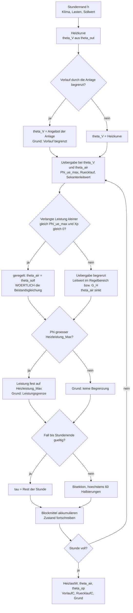
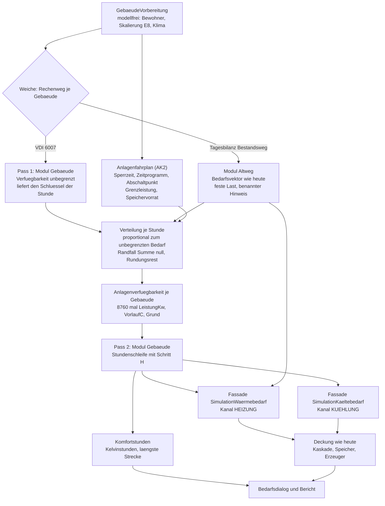
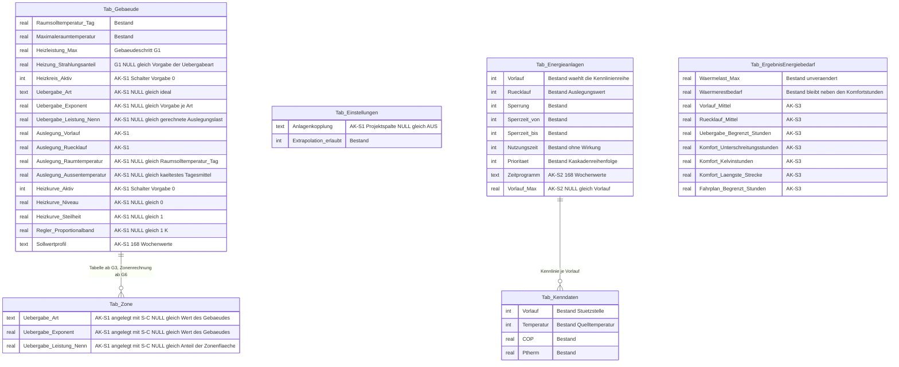
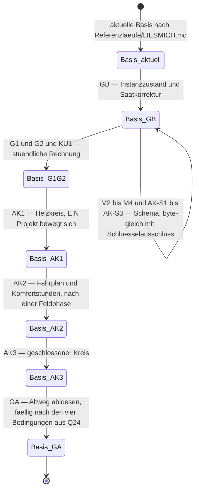

# Konzept: Kopplung von Vorlauftemperatur und Erzeugerfahrplan an die Raumtemperatur (Anlagenkopplung)

> **Rev. 2 — Prüfung 17.09.2026, E26 eingearbeitet.** Was diese Fassung ändert: Der Altweg ist
> **Übergang bis zur Stufe GA** (Zeitpunkt damals offen, Q24; seit E27 entschieden) statt dauerhafter Bestandsweg, und seine
> Sonderfälle stehen in der Löschliste dieser Stufe; die Verteilung in AK2 ist als **Zweipass**
> samt Randfällen, zweiter Stufe auf die Zonen und benannter Pfadabhängigkeit ausgeschrieben; AK3
> bekommt eine **Iterationsschranke**; Verfügbarkeits- und Begrenzungsgrund sind zwei benannte
> Aufzählungen; die Kennlinienwahl der Erzeugerseite ist die benannte Ausnahme von AK1 (6.1);
> `AK-S1` führt die Projektspalte und in `Tab_Zone` allein die Übergabespalten; der
> Auslegungspunkt der Kühlübergabe ist die vierte benannte Abweichung (7.4); Schritt H rechnet in
> W und W/K und berichtigt Leitwert im Regelbereich, Rücklauf nach der Begrenzung und
> Verletzungsmaß; der Schemastand steht als Regel statt als Zahl.
> **Rev. 1** hatte E22 (16.09.2026) ausgeführt sowie E23, E24 (die Fragen H1–H12 sind nach
> Empfehlung entschieden) und E25 (das Proportionalband des Raumreglers ist wählbar: 0,5 K, 1 K,
> 2 K oder frei) eingearbeitet. Grundlagen:
> [Konzept Gebäudesimulation](Konzept_Gebaeudesimulation_VDI6007_EPOS-Plan.md) Nachträge **N1.27**
> und **N1.31**,
> [ADR-005](ADR-005_Zonenkopplung_Mehrzonenmodell.md) (Iterationsmuster),
> [ADR-006](ADR-006_Trennung_Altweg_VDI6007.md) (Trennung der Rechenwege, E20 und E23),
> [Kühlkonzept](Konzept_Kuehlung_Gebaeudesimulation_EPOS-Plan.md) (E12, E21),
> [Softwarearchitektur](Softwarearchitektur_Gebaeudesimulation_EPOS-Plan.md).**
>
> **Nachzug 22.09.2026 — E27 (22.09.2026, [Konzept](Konzept_Gebaeudesimulation_VDI6007_EPOS-Plan.md) N1.32):** Der Anwender hat den
> **Stufenplan entschieden (Q26, Option (a), nach Empfehlung):** **AK1 nach G2**; **AK2 nach
> abgenommenem AK1 und einer Feldphase**; **AK3 danach** — nach H6 (E24) weiterhin erst nach der
> Feldphase von AK1 und AK2 zugesagt. Aufwand AK0 1–2, AK1 10–15, AK2 11–15, AK3 23–38 PT, zusammen
> 45–70 PT. **H6** war bereits mit E24 entschieden und ist mit E27 zur Kenntnis genommen. Mit E27
> ist auch **Q24** entschieden: Die Stufe GA wird fällig, sobald ihre vier Bedingungen erfüllt
> sind — eine davon ist die Abnahme von KU1 und, falls beauftragt, von AK1 (11.4). Kapitel 0, 1.2,
> 12 und 13 tragen den entschiedenen Stand.
>
> **Nachzug 24.09.2026 — AK0 abgeschlossen:** 8.1 und 8.5 nennen den Ort der Zonenspalten aus
> `AK-S1` nach dem [Mehrzonenkonzept](Konzept_Mehrzonenmodell_IFC_EPOS-Plan.md) Rev. 3: `Tab_Zone`
> entsteht mit dem Schritt S-C der Stufe G3, der die drei Übergabespalten gleich mit anlegt;
> gerechnet wird die Übergabe je Zone weiter ab G6.
>
> **Nachzug 24.09.2026 — AK1 Welle 3 und E36:** Die Rechnung der zweiten Welle von AK1 berichtigt
> zwei Aussagen dieses Papiers: Die Aufheizspitze wird gekappt, und die Tagesenergie **sinkt** — der
> Raum bleibt länger kühler und verliert weniger (3.5, F-A6 und die Probe „Aufheizspitze" in 11.1
> trugen „größer"); Fall 3 in 10.3 ergibt **8,844 kW** statt der gedruckten 8,85. **N-A4** (2.2)
> folgt dem Entscheid **E36** (24.09.2026, [Konzept](Konzept_Gebaeudesimulation_VDI6007_EPOS-Plan.md)
> N1.41): Mit wirksamer Kopplung gilt höchstens **100 ms je Gebäude und Jahr** (gemessen 21 bis
> 31 ms), ungekoppelte Gebäude bleiben beim Bestand.
>
> **Nachzug 25.09.2026 — AK1 Welle 4 und E37:** Die Kälteseite (H9) bekommt nach **E37** (24.09.2026,
> [Konzept](Konzept_Gebaeudesimulation_VDI6007_EPOS-Plan.md) N1.42) **eigene Spalten der Kühlübergabe
> am Gebäude** (`KAK-S1`, 8.1) samt Schalter `Kuehluebergabe_Aktiv`; der Auslegungspunkt steht damit am
> Gebäude, nicht mehr an der Anlage (7.1, 7.4). Die Rechnung ist **Schritt K** (10.5), der Spiegel von
> Schritt H mit festem Kaltwasser-Vorlauf und einer Vorlaufgrenze als Vorgabe (7.2); die Nennleistung
> kommt bei leerem Feld aus einem Auslegungstag (8.4). Die Ergebnisspalten der Kälteseite (`KAK-S3`,
> 8.3) sind ein eigener Schritt. N-A4 (2.2) gilt wörtlich weiter; wirksame Kopplung heißt „Heizseite oder
> Kälteseite wirksam". Gebaut mit der vierten Welle von AK1 (Schemaschritte 135 bis 137, 8).
>
> **Nachzug 25.09.2026 — AK1 Welle 5, die Stufe AK1 ist abgenommen:** Das Referenzprojekt mit Kopplung
> steht — **1047**, eine Kopie von 1017 mit Heizkreis (Radiator, gefahrene Heizkurve) und Kühlübergabe
> (Kühldecke), alle Auslegungswerte als Vorgaben der Art, die Wärmepumpe vor dem Elektrokessel; die Einfrierregel **„gesäte Auslegungsdaten der
> Übergabe"** ist umgesetzt und umfasst neben `AK-S1` auch die Spalten aus `KAK-S1` (11.4); die Basis ist
> `2026-09-25_R15_Anlagenkopplung` mit vierzehn Projekten, und die CI rechnet 1047 als sechstes Projekt mit
> (11.5).

**Frage des Anwenders (16.09.2026):** „kann das Gebäudesimulationskonzept erweitert werden um die
Kopplung von Vorlauftemperatur und Erzeugerfahrplan an die Raumtemperatur?"

**Auftrag, im Wortlaut (Entscheid E22):** „trage es als Nachtrag mit einer neuen Frage Q26 zum
Stufenplan ein und schreibe ein eigenes Konzeptpapier dazu".

**Stand:** 25.09.2026 (Nachzug AK1 Welle 5: Referenzprojekt 1047, Einfrierregel, Basis R15; AK1 abgenommen). **Fassung:** Rev. 2 — mit **E23**, **E24**,
**E25** und **E26** fortgeschrieben, **E27**, **E36** und **E37** nachgezogen.

**Zweck.** Dieses Papier ist das in N1.27 angekündigte eigene Konzept. Es beschreibt, was die
Anlagenkopplung vom Heizkörper bis zum Wiki bedeutet: die Physik der Übergabe, Heizkurve und
Regelung, den Erzeugerfahrplan als Verfügbarkeit je Stunde, die drei Kopplungsschemata, das
Datenmodell, die Dialogführung, einen neuen Rechenschritt **H**, den Nachweis, eine Stufung
**AK0–AK3** und die Fragen **H1–H12**, die am 16.09.2026 mit **E24** sämtlich nach Empfehlung des
Papiers entschieden worden sind (Konzept N1.29). **Es entscheidet nichts, was der Anwender zu
entscheiden hat.** Auch der **Stufenplan** — welche Stufe wann beauftragt wird — ist entschieden:
**Q26**, mit E27 (22.09.2026, [Konzept](Konzept_Gebaeudesimulation_VDI6007_EPOS-Plan.md) N1.32) nach Empfehlung (a): AK1 nach G2, AK2 nach
abgenommenem AK1 und einer Feldphase, AK3 danach (12.1, 12.3). Geführt wird die Frage im
[Gebäudekonzept](Konzept_Gebaeudesimulation_VDI6007_EPOS-Plan.md), Kapitel 13, nicht hier.

**Es steht neben, nicht über den Schwesterpapieren:**

| Papier | Was dort steht, worauf dieses Papier aufsetzt |
|---|---|
| [Konzept Gebäudesimulation](Konzept_Gebaeudesimulation_VDI6007_EPOS-Plan.md) | Rechenweg (4), ideale Regelung und `Heizleistung_Max` (4.5), Zeitraster und Ergebnisreihen (4.6), Skalierung E8 (4.7), Gebäudespalten (6.1), Stufen (11), Fragen samt **Q26** (13), Abgrenzung (15), Nachträge **N1.25**, **N1.26**, **N1.27** |
| [ADR-006](ADR-006_Trennung_Altweg_VDI6007.md) | die Trennung der Rechenwege (E20): Fassade `SimulationWaermebedarf` als **eine Weiche am Eingang**, modellfreier Vorbereitungsschritt `GebaeudeVorbereitung`, Module `Gebaeude/` und `Altweg/`; mit **E23** und **E26** bleibt `Altweg/` als eingefrorener Bestandsweg **für die Dauer des Übergangs** — die Stufe **GA** löst ihn ab, ihr Zeitpunkt ist offen (Q24) |
| [ADR-005](ADR-005_Zonenkopplung_Mehrzonenmodell.md) | das Iterationsmuster: Gauß-Seidel je Stunde, feste Reihenfolge, Abbruchmaße (0,01 K bzw. 0,1 W), Höchstzahl, benannter Fehler — **AK3 erbt es** |
| [Softwarearchitektur](Softwarearchitektur_Gebaeudesimulation_EPOS-Plan.md) | Klassen und Fassaden (1.2, 1.3), Abhängigkeitsregeln und `Modultrennungswache` (1.7), Integration des Laufs (4.1), Stufentabelle (5) |
| [Rechenschritte](Rechenschritte_Gebaeudesimulation_VDI6007_EPOS-Plan.md) | Systemmatrix und die drei Betriebsfälle (4.2–4.4), exakte Diskretisierung (5), **Stundenschleife Schritt F** (7) — dort wird Schritt **H** eingesetzt |
| [Kühlkonzept](Konzept_Kuehlung_Gebaeudesimulation_EPOS-Plan.md) | Aufbau und Stil dieses Papiers; Wärmepumpen-Kennlinien über dem Vorlauf (5.1), Umschaltung Heizen ↔ Kühlen (5.2), Datenmodell (7), Dialogführung (8), Einfrierschritte (10.5), Stufen KU0–KU3 (11) |
| [Mehrzonenmodell](Konzept_Mehrzonenmodell_IFC_EPOS-Plan.md) | Zonen, Rechenzeit je Zone, Kennzahlen je Zone — die Übergabe je Zone folgt ihm |
| [Systementwurf](Systementwurf_Gebaeudesimulation_EPOS-Plan.md) | Anforderungsform, Speicherung, Einfrierkette |

**Was dieses Papier nicht tut.** Es nennt **keine Ergebniswerte der VDI-6007-Testbeispiele** und
nichts aus **VDI 6020:2022** (E6). Es öffnet die Testdatenbank nicht. Es nennt **keine Hersteller-
und Produktdaten** — alle Beispiele tragen neutrale Namen mit runden Werten. Es entwirft keine
Regelungstechnik über das hinaus, was ein Energiekonzept braucht; die Grenze steht in Kapitel 15.
Alle Zahlenwerte für Exponenten, Auslegungspunkte und Bänder sind als **EPOS-Vorgabewerte**
gekennzeichnet, nicht als Normwerte. Einheiten stehen im Namen (`…Kwh`, `…Kw`, `…C`);
Quelltextbelege tragen `Datei:Zeile` und sind für dieses Papier **selbst nachgezählt**.

---

## 0. Das Ergebnis in sechs Punkten

1. **Die Kopplung ist eine benannte EPOS-Erweiterung, kein Stück der Richtlinie — und sie ändert
   das Raummodell nicht.** Das 7R2C-Netz der VDI 6007 Blatt 1 bleibt Zeichen für Zeichen, was es
   ist. Was sich ändert, ist **eine Randbedingung**: Statt „die Anlage hält den Sollwert" gilt
   „die Anlage liefert, was ihre Übergabe bei diesem Vorlauf und dieser Raumtemperatur hergibt".
   Der Löser kennt diesen Fall bereits — es ist **Fall 3 der Rechenschritte** (Leistung fest,
   freier Lauf; [Rechenschritte](Rechenschritte_Gebaeudesimulation_VDI6007_EPOS-Plan.md) 4.4), mit
   dem die Normtestbeispiele mit vorgegebener Last ohnehin gerechnet werden. Die Normtestbeispiele
   rechnen weiter mit idealer Regelung, der Produktausweis nach **E10** bleibt Wort für Wort.
2. **Drei Stufen, und die Grenze zwischen ihnen ist nicht Physik, sondern Architektur.** **AK1**
   ist eine **Einbahnstraße** Anlage → Gebäude und liegt im Modul `Gebaeude/` — bis auf die
   Kennlinienwahl der Erzeugerseite (6.1): Heizkurve hinein, Übergabeleistung und Rücklauf
   heraus. **AK2** dreht die erste Halbschleife um — der
   Erzeugerfahrplan begrenzt, was ankommt — und braucht dafür **eine neue Naht**
   (`Anlagenverfuegbarkeit`) zwischen Anlagenseite und Gebäudemodul. **AK3** schließt den Kreis und
   **kippt den Grundsatz „erst Bedarf, dann Deckung"**: Der Bedarf wird Ergebnis der Deckung. Das
   ist der teuerste Satz dieses Papiers, und er steht in Kapitel 6. **Alle drei wirken auf
   Gebäude des VDI-Wegs**; ein Gebäude auf dem Altweg — dem Bestandsweg, der nach **E23** und
   **E26** bis zu seiner Ablösung durch die Stufe **GA** weiterläuft (ohne Datum; fällig nach den vier Bedingungen aus Q24, entschieden mit E27) —
   geht in Deckung, Verfügbarkeit und Kopplung als **feste Last** ein: sein Bedarfsvektor wie
   heute, ohne Rückwirkung und ohne Komfortstunden, im Bericht benannt (6.2, 6.4, 9.4).
3. **Der größte sichtbare Gewinn kommt aus der billigsten Stufe.** AK1 kappt die **Aufheizspitze**,
   die das Stundenmodell heute erzeugt: Sie fällt in elf von zwölf Referenzprojekten auf dieselbe
   Stunde (Index 1 398, die erste nach Ende der Nachtabsenkung am kältesten Tag) und liegt über
   alle Projekte zusammen **+29 %** über der Spitze des Tagesmodells
   ([Konzept](Konzept_Gebaeudesimulation_VDI6007_EPOS-Plan.md) 4.5, 5.6). Diese Spitze ist Physik,
   aber kein Auslegungswert — ein realer Heizkörper kann sie nicht liefern. AK1 ist der
   physikalische Grund, aus dem sie nicht auftritt, und macht `Heizleistung_Max` von einer
   Notbremse zu einer hergeleiteten Größe. **Dazu liefert AK1 den Vorlauf**, den die
   Wärmepumpen-Kennlinie heute als projektierten Festwert bekommt
   (`EPOS.Kern/Allgemein/Simulation/SimulationWaermepumpe.cs:600`, `:604`, `:654`).
4. **Der Fahrplan ist zur Hälfte schon da — und wird nur zur Hälfte gelesen.** Jede Anlage führt
   `Sperrung`, `Sperrzeit_von`, `Sperrzeit_bis`, `Vorlauf`, `Rücklauf`, `Abschaltpunkt`,
   `Nutzungszeit`, `Grenzleistung` und `Prioritaet`
   (`sql/schema/001_grundschema.sql:710-714`, `:716-717`, `:727`, `:733`); der Pufferspeicher führt
   `Vorlauf`, `Ruecklauf`, `Schwelle_Ein`, `Schwelle_Aus`, `Ladeleistung_Max` und
   `Entladeleistung_Max` (`:2061-2064`, `:2078-2079`). **Ausgewertet wird davon je Stunde genau
   eines:** die Sperrzeit, und zwar als ersatzloser Ausfall des Moduls
   (`SimulationWaermepumpe.cs:1049`, `:1051-1052`). `Nutzungszeit` wird geschrieben und gelesen,
   aber **von keiner Zeile unter `EPOS.Kern/Allgemein/Simulation/`** — ein Feld ohne Wirkung
   (`EPOS.Kern/Model/WErzeugerModel.cs:18`). Was fehlt, ist ein **Zeitprogramm im Wochenraster**
   und ein einheitlicher Begriff **„Verfügbarkeit je Stunde"**. Für das Wochenraster gibt es das
   Muster bereits: `Tab_Energieanlagen.WQ_Wochenwerte` führt 168 Werte als Text
   (`sql/schema/001_grundschema.sql:738`). Eine eigene Profiltabelle ist nicht nötig.
5. **Unterdeckung wird zur Komfortstunde.** Heute ist ein nicht gedeckter Bedarf eine
   Kilowattstunde, die niemand liefert. Mit AK2 ist er eine **Raumtemperatur, die unter den
   Sollwert fällt** — und damit die Zahl, nach der ein Planer tatsächlich gefragt wird:
   Unterschreitungsstunden, Kelvinstunden und die längste zusammenhängende Unterschreitung. Das ist
   die eine neue **Aussage**, die dieses Vorhaben dem Produkt hinzufügt; alles andere ist
   Genauigkeit.
6. **Vier Stufen, rund 45–70 PT, jede einzeln wählbar und einzeln eingefroren.** AK0 schreibt die
   Papiere fort (1–2 PT), AK1 bringt Heizkreis und Übergabe (**10–15 PT**), AK2 den Fahrplan und die
   Komfortstunden (**11–15 PT**), AK3 den geschlossenen Kreis (**23–38 PT**); je Stufe rund 0,5 PT
   für das Neu-Einfrieren. **Vorgabe ist überall „aus"**, und ein Bestandsprojekt rechnet
   unverändert, solange sie aus ist (Kapitel 12). **Die Fragen H1–H12 sind mit E24 entschieden**
(Konzept N1.29), **und der Stufenplan ist es mit E27 (Q26, (a))**: AK1 nach G2, AK2 nach
abgenommenem AK1 und einer Feldphase, AK3 danach und — nach H6 — erst nach der Feldphase von AK1
und AK2 zugesagt (E23; 12.1, 12.3).

---

## 1. Auftrag und Einordnung

### 1.1 Was bisher galt

Die Kopplung war in allen Papieren der Gebäudesimulation **ausgeschlossen**, und zwar an drei
Stellen mit demselben Wortlaut:

- [Konzept](Konzept_Gebaeudesimulation_VDI6007_EPOS-Plan.md) **15** (Abgrenzung): „die Kopplung von
  Vorlauftemperatur und Wärmepumpen-Fahrplan an die Raumtemperatur";
- [Kühlkonzept](Konzept_Kuehlung_Gebaeudesimulation_EPOS-Plan.md) **1.3** und **14**, als einer der
  Ausschlüsse, die E12 ausdrücklich **nicht** aufhebt;
- [Systementwurf](Systementwurf_Gebaeudesimulation_EPOS-Plan.md) 12, in derselben Zeile.

Der Grund war nie physikalischer Zweifel, sondern Reihenfolge. Das Tagesmodell **kann** die
Kopplung nicht tragen: Es kennt keine Stundenauflösung der Raumtemperatur, keine Aufheizspitze nach
Absenkung und keine Oberflächenknoten ([Konzept](Konzept_Gebaeudesimulation_VDI6007_EPOS-Plan.md)
2.6). Dieselbe Stelle benennt den Weg dahin schon: „für Spitzenlast, Absenkverhalten … und die
Kopplung an Vorlauftemperaturen und Wärmepumpenfahrpläne braucht es ein stündliches, physikalisch
geschlossenes Modell."

**Und der Bestand sagt es selbst.** Die Hilfeseite der Wärmepumpenrechnung führt die Grenze im
Wortlaut: „Keine Vorlauftemperatur-Regelung im Lauf" — das Kennfeld wird zu der Vorlauftemperatur
ausgewertet, die an der Anlage steht, „eine witterungsgeführte Heizkurve gibt es nicht"
(`EPOS.Kern/Allgemein/Hilfe/Berechnung/Wärmepumpe.wiki:391-393`). Dasselbe auf der Hydraulikseite:
„Eine Begrenzung nach Massenstrom und Wärmeübertrager kennt das Modell an keiner Stelle"
(`EPOS.Kern/Allgemein/Simulation/SimulationSPK.cs:403-404`). Beide Sätze sind heute richtig; dieses
Papier beschreibt, was es kostet, sie zu ändern.

### 1.2 Was E22 ändert

E22 hebt **eine** Zeile der Abgrenzung auf und **grenzt sie zugleich ein**. Die Kopplung ist
künftig Gegenstand der Gebäudesimulation — als **benannte EPOS-Erweiterung** wie das
Kusuda-Erdreich (Konzept 4.4) oder die Zonenkopplung
([ADR-005](ADR-005_Zonenkopplung_Mehrzonenmodell.md)), nicht als Bestandteil der Richtlinie. Der
Ausschluss in Konzept 15 lautet neu: **kein Bestandteil der Stufen G0 bis G7**, sondern Gegenstand
dieses Papiers.

| Ebene | Vorher | Nach E22 |
|---|---|---|
| Raumtemperatur | Ergebnis einer idealen Regelung, die den Sollwert immer hält (außer an `Heizleistung_Max`) | **Ergebnis der gelieferten Leistung**; sie fällt, wenn die Übergabe oder der Erzeuger nicht reicht |
| Vorlauftemperatur | projektierter Festwert je Anlage und Eingang der Kennlinienwahl (`Tab_Energieanlagen.Vorlauf`, `sql/schema/001_grundschema.sql:713`; gelesen in `SimulationWaermepumpe.cs:600`, `:604`, `:654`) | **gerechnete Größe je Stunde** aus Heizkurve und Übergabe; sie geht in die Kennlinienwahl ein |
| Rücklauftemperatur | projektierter Festwert je Anlage (`:714`) und je Speicher (`:2062`) | **Ergebnis** der Übergabe, nicht Eingabe |
| Erzeugerfahrplan | die Sperrzeit wirkt auf die **Deckung** (das Modul liefert 0), die Priorität auf die Reihenfolge — nie auf den **Bedarf** | begrenzt je Stunde, **was im Raum ankommt** (AK2) |
| Unterdeckung | ungedeckte Kilowattstunden | **Komfortstunden** — Unterschreitung, Kelvinstunden, längste Strecke |
| Laufordnung | erst Bedarf, dann Deckung | unverändert in AK1 und AK2; **AK3 kehrt sie um** |
| Normstatus | Rechenkern nach VDI 6007 Blatt 1 (E10) | **unverändert** — das Raummodell ist dasselbe, die Erweiterung ist benannt |

**Und was E23 und E26 daran ändern (16./17.09.2026).** Der Altweg läuft als eingefrorener
Bestandsweg neben dem VDI-Weg weiter — **als Übergang**, den die Stufe **GA** ablöst, sobald der
VDI-Weg bewährt genug ist; wann das ist, sagt **Q24**, mit E27 entschieden: sobald die vier
Bedingungen erfüllt sind, darunter die Abnahme von KU1 und, falls beauftragt, von AK1 (11.4). Für
die Anlagenkopplung heißt das:
Über die ganze Laufzeit dieses Vorhabens stehen **zwei Bedarfsbegriffe je Gebäude nebeneinander**
— der Kanal führt beide, die Deckung unterscheidet sie nicht; **nur der VDI-Weg hat eine
Rückwirkung**. Ein Gebäude auf dem Altweg geht als **feste Last** ein (6.2, 6.4). AK2 und AK3
warten deshalb **nicht** auf die Stufe GA: Ihre Vorbedingung ist **AK1 und eine Feldphase**
(12.1, 12.3); mit GA fällt der Sonderfall „feste Last" ersatzlos weg.

### 1.3 Was ausdrücklich **nicht** aufgehoben wird

E22 nennt eine Zeile. Die übrigen Ausschlüsse aus Konzept 15 und Kühlkonzept 14 bleiben und werden
hier **bestätigt** (Kapitel 15 führt sie vollständig):

- **Bauteilaktivierung** als Funktion — Kühldecke, Betonkernaktivierung, Fußbodenheizung **als
  Bauteil mit eigener Masse**. Eine Flächenheizung ist in diesem Papier eine **Übergabeart mit
  eigenem Exponenten**, kein zusätzlicher Knoten im Netz. Wer die Masse des Estrichs rechnen will,
  braucht einen eigenen Bauteilknoten — das ist G3 und darüber hinaus (3.6).
- **Feuchte und Entfeuchtung.** Auf der Kälteseite bleibt die Rechnung sensibel (K5 des
  Kühlkonzepts). Der **Taupunkt** kommt in diesem Papier ausschließlich als **benannte Grenze** der
  Kaltwasser-Vorlauftemperatur vor, nie als Bilanz (Kapitel 7).
- **Sommerlicher Wärmeschutz nach DIN 4108-2**, Nachweise nach **GEG** oder **DIN V 18599**,
  Nutzungsprofile für Nichtwohngebäude.
- **Hydraulik als Gewerk** — Rohrnetz, Druckverluste, Pumpenkennlinien, hydraulischer Abgleich,
  Einrohrsysteme. Ein Massenstrom ist in diesem Papier eine **Auslegungsgröße**, keine Rechnung.
- **Regelungstechnik als Gegenstand** — Reglerparametrierung, Totzeiten, Selbstoptimierung,
  prädiktive Regelung, Taktverhalten unterhalb der Stunde.
- **Normzahlen.** Dieses Papier nennt keine Ergebniswerte der VDI-6007-Testbeispiele.

### 1.4 Fünf Begriffe, die in diesem Papier auseinandergehalten werden

Die Umgangssprache nennt sie alle „Heizung". Die Rechnung darf das nicht.

| Begriff | Was gemeint ist | Wo er entsteht | Einheit |
|---|---|---|---|
| **Heizkurve** | die Vorschrift, welche **Vorlauftemperatur** bei welcher Außentemperatur gefahren wird — eine Vorgabe der Anlage, keine Rechnung des Gebäudes | Anlagenseite, 3.4 | °C |
| **Übergabe** | die Leistung, die Heizkörper oder Fläche bei gegebener Heizmittel- und Raumtemperatur an den Raum abgibt — **die eigentliche Kopplung** | Gebäudeseite, 3.1 bis 3.3 | kW |
| **Verfügbarkeit** | die obere Schranke dessen, was die **Erzeugerseite** in dieser Stunde überhaupt bereitstellen kann — Sperrzeit, Zeitprogramm, Leistungsgrenze, Speicherstand | Anlagenseite, Kapitel 5 | kW je Stunde |
| **Fahrplan** | die Folge der Verfügbarkeiten über 8 760 Stunden, samt dem **Grund** je Stunde | Anlagenseite, 5.3 | Reihe |
| **Komfortstunde** | eine Stunde der Nutzungszeit, in der die Raumtemperatur den Sollwert um mehr als eine benannte Schwelle **unterschreitet** | Ergebnisseite, 5.5 | h; Kh |

**Die drei Leistungsgrößen sind nie gleich:** Bedarf ≥ Übergabe ≥ Ankunft. Wo eine Kennzahl nach
AK1 nur „Heizlast" heißt, ist sie falsch benannt.

---

## 2. Anforderungen

Zählung **F-A…** (funktional), **N-A…** (nichtfunktional), **B-A…** (Randbedingung) — in der Form
des [Systementwurfs](Systementwurf_Gebaeudesimulation_EPOS-Plan.md) 1 und des
[Kühlkonzepts](Konzept_Kuehlung_Gebaeudesimulation_EPOS-Plan.md) 2, damit die Papiere später
zusammenwachsen können, ohne dass Nummern kollidieren.

### 2.1 Funktionale Anforderungen

| # | Anforderung | Quelle | Nachweis | Stufe |
|---|---|---|---|---|
| **F-A1** | Je Gebäude ist eine **Übergabeart** wählbar (Radiator, Flächenheizung, Konvektor, ideal); NULL bedeutet **ideal**, also Kopplung aus — und der Rückfall ist **ausdrücklich**, nicht still | E22 | Datenbankfall: NULL ergibt den Bestandsweg | AK1 |
| **F-A2** | Der **Heizkörperexponent** ist je Gebäude eingebbar; NULL bedeutet die **EPOS-Vorgabe der Übergabeart** (3.1) | E22 | Rechenprobe gegen Handrechnung je Art | AK1 |
| **F-A3** | Der **Auslegungspunkt** (Vorlauf, Rücklauf, Raumtemperatur, Außentemperatur, Nennleistung) ist je Gebäude eingebbar; fehlende Werte werden **benannt hergeleitet**, nie geraten (8.1) | E22 | Rechenprobe „Heizkurve trifft am Auslegungspunkt den Auslegungsvorlauf" | AK1 |
| **F-A4** | Die **Vorlauftemperatur je Stunde** folgt einer außentemperaturgeführten **Heizkurve** mit Niveau und Steilheit — oder ist fest je Anlage (`Tab_Energieanlagen.Vorlauf`, `:713`) | E22 | Rechenprobe gegen Handrechnung an drei Stützpunkten | AK1 |
| **F-A5** | Die **Übergabeleistung** ist eine Funktion von mittlerer Heizmitteltemperatur und Raumtemperatur; der **Rücklauf** ist ihr **Ergebnis**, keine Eingabe | E22 | Rechenprobe: Energiebilanz des Heizkreises schließt auf 1e‑9 kW | AK1 |
| **F-A6** | Reicht die Übergabe nicht, **sinkt die Raumtemperatur** — Leistungsvorgabe statt idealer Regelung; die **Aufheizspitze nach Absenkung** wird dadurch gekappt und zeitlich verteilt | E22; Konzept 4.5 | Rechenprobe „Aufheizspitze": Spitze mit Übergabe kleiner als ohne, Tagesenergie kleiner | AK1 |
| **F-A7** | **Grenzfall:** Mit **unbegrenzter Übergabe** und Proportionalband null rechnet der gekoppelte Weg **bitgleich** wie die ideale Regelung — weil er in diesem Fall **wörtlich dieselbe Leistungsgleichung** benutzt (6.1, 11.1) | E22 | Rechenprobe „Grenzfall bitgleich"; dazu Referenzlauf byte-gleich bei ausgeschalteter Kopplung | AK1 |
| **F-A8** | Der **gerechnete Vorlauf** geht in die Kennlinienwahl der Wärmepumpe ein, wie es der projektierte Festwert heute tut (`SimulationWaermepumpe.cs:600`, `:604`, `:654`); liegt er außerhalb der Stützstellen, gilt die **Extrapolationsregel des Bestands** (`:1859-1904`, Meldung `:1900-1903`, Schalter `Tab_Einstellungen.Extrapolation_erlaubt`, `sql/schema/001_grundschema.sql:696`) | E22 | Rechenprobe je Vorlauf-Stützstelle; Hinweis einmal je Gerät und Vorlauf | AK1 |
| **F-A9** | Je Gebäude ist ein **Raumsollwert-Zeitprogramm** im Wochenraster hinterlegbar (168 Werte, Muster `WQ_Wochenwerte`, `:738`); NULL bedeutet die vier Bestandssollwerte (`:1147-1150`) | E22 | Datenbankfall: NULL ergibt die Bestandsreihe byte-gleich | AK1 |
| **F-A10** | Die **Raumregelung** ist ein **P-Regler mit Proportionalband**; das Band ist wählbar — 0,5 K, 1 K oder 2 K als Schnellwahl oder ein freier Wert bis 5 K, Vorgabe 1 K (E25); Band null ergibt die ideale Regelung, begrenzt durch Übergabe und `Heizleistung_Max` | H1, E25 | Rechenprobe: Band null gleich Bestandsverhalten; Band größer null senkt die mittlere Raumtemperatur benannt | AK1 |
| **F-A11** | Je Erzeuger ist ein **Zeitprogramm** im Wochenraster hinterlegbar; die Bestandsfelder `Sperrung`/`Sperrzeit_von`/`Sperrzeit_bis` (`:710-712`) bleiben gültig und gehen **vor** | H8 | Datenbankfall: beide Quellen gesetzt, Sperrzeit gewinnt, Meldung nennt den Grund | AK2 |
| **F-A12** | Es entsteht **eine** Naht **`Anlagenverfuegbarkeit`** zwischen Anlagenseite und Gebäudemodul: je Stunde eine obere Leistungsschranke, eine erreichbare Vorlauftemperatur und ein **Grund** | E22 | Selbsttest: jede begrenzte Stunde trägt einen Grund; kein stiller Rückfall | AK2 |
| **F-A13** | **Unterdeckung wird zu Komfortstunden**: Unterschreitungsstunden, Kelvinstunden, längste zusammenhängende Unterschreitung — je Gebäude und je Projekt | E22 | Berichtsprobe; Katalogeintrag je Kennzahl in beiden Sprachen | AK2 |
| **F-A14** | Gebäude, Erzeugerkaskade und Speicher rechnen je Stunde **zusammen**; der Vorlauf wirkt auf den Wirkungsgrad zurück, die Regelung auf den Vorlauf | E22 | Konvergenzprobe gegen ein exaktes Prüforakel für einen Erzeuger (11.2) | AK3 |
| **F-A15** | Die **Iteration** hat Abbruchmaße, eine Höchstzahl und einen **benannten Fehler** bei Nichtkonvergenz (Gebäude, Stunde, Beteiligte) — nie eine stille Näherung | ADR-005 | Rechenprobe: erzwungene Nichtkonvergenz erzeugt den benannten Fehler | AK3 |
| **F-A16** | Die **Kälteseite** trägt zu jeder Größe der Wärmeseite ein Gegenstück — Kaltwasser-Vorlauf, Kühlkennlinie, Kühlflächenexponent, Überschreitungsstunden — **oder** die Abweichung steht benannt in der Abweichungsliste (7.4). Die Ergebniszahlen der Kälteseite in AK1 sind `Kuehl_Vorlauf_Mittel`, `Kuehl_Ruecklauf_Mittel` und `Kuehl_Uebergabe_Begrenzt_Stunden` (8.3, E37); die Komfortzahlen kommen mit AK2 | E21, E22, E37 | Probe „Symmetrie der Anlagenkopplung" gegen die Liste in 7.4 | AK1/AK2 |
| **F-A17** | Jede Stufe ist **je Projekt wählbar** und **je Gebäude schaltbar**, Vorgabe **aus**; ein Gebäude mit eingeschaltetem Heizkreis in einem Projekt ohne Kopplung trägt einen **benannten Hinweis**, keine stille Null | E22 | bunit-Fall am Gebäudedialog; Meldung in beiden Sprachen (9.5) | AK1 |
| **F-A18** | Ein Gebäude auf dem **Altweg** (Tagesbilanz, Bestandsweg) bekommt **keine Anlagenkopplung, solange es dort rechnet** — benannter Hinweis, nie eine stille Null; der Altweg wird nicht angefasst und geht als **feste Last** in Verteilung und Deckung ein. Hinweis und Sonderfall gelten bis zur Ablösung (Stufe **GA**, Zeitpunkt offen) und stehen in deren Löschliste | E20, E23, E26 | Rechenprobe „Altweg-Gebäude ohne Kopplung mit Hinweis"; `Modultrennungswache` grün | AK1 |
| **F-A19** | **Vorlauf- und Rücklaufmittel** je Gebäude sowie die **Heizkreisreihen** stehen im Referenzlauf-Export — **bedingt** geschrieben, damit die Bestandsordner byte-gleich bleiben | 8.3 | Referenzlauf: Projekte ohne Kopplung byte-gleich | AK1 |

### 2.2 Nichtfunktionale Anforderungen

| # | Anforderung | Maß | Nachweis |
|---|---|---|---|
| **N-A1** | **Referenzbasis** — jede Stufe rechnet gegen die aktuelle Basis; eine neue **Datei** ohne Bedingung ist FAIL (`Referenzlauf/Vergleich.cs:183-190`) | `GESAMT: PASS` | Referenzlauf je Merge |
| **N-A2** | **Determinismus** — zwei Läufe byte-gleich, auch mit Kopplung; die Iteration in AK3 ist deterministisch (feste Reihenfolge, feste Höchstzahl) | 13 von 13 | Protokollzeile des Referenzlaufs |
| **N-A3** | **Rückwärtsverträglichkeit** — ein Projekt **ohne** Kopplung rechnet nach AK1, AK2 und AK3 **byte-gleich** wie vorher | 12 von 13 Projekten unberührt | Vergleich je Projekt |
| **N-A4** | **Rechenzeit** — ohne wirksame Kopplung bleibt jedes Gebäude beim Bestand (rund 5 ms je Zone und Jahr, Konzept 4.8). Mit wirksamer Kopplung kostet das Fallsystem je Abschnitt (Schritt H) mehr: gemessen **7 ms ohne und 21 bis 31 ms mit Kopplung** je Gebäude und Jahr; dafür gilt nach **E36** eine eigene Grenze. AK3 zahlt die Durchläufe, beschränkt ihr Produkt je Stunde auf **120** (6.3) und **wird gemessen**, nicht geschätzt | AK1: höchstens **100 ms je gekoppeltem Gebäude und Jahr** (E36), ungekoppelt unverändert; gekoppelt heißt nach **E37** „Heizseite oder Kälteseite wirksam" (8.1), die Grenze gilt auch mit beiden Seiten und dem Auslegungstag der Kälteseite (8.4); AK3 gemessen und im Papier fortgeschrieben | Messprobe des gekoppelten Jahreslaufs (`AnlagenkopplungEingangTests`): gibt die Zeit aus und scheitert erst beim Fünffachen der Grenze — die Läufer der CI sind verschieden schnell; Laufzeitzeile des Referenzlaufs |
| **N-A5** | **Plattformgleichheit** — alle Kopplungsfelder sind auf iOS erreichbar oder **benannt** abgelehnt | keine stumme Absage | iOS-Zeile je Maske |
| **N-A6** | **Zweisprachigkeit** — jeder neue Anzeigetext und jede Meldung in beiden `.resx`, danach `Werkzeuge/ResourceDesigner` | vollständig | Wächter und Designerlauf |
| **N-A7** | **Einheitenwächter** — Zeitreihen in kWh mit Einheit im Namen, Temperaturen in °C, Leistungen in kW; keine nackten Faktoren 1 000 in Hülle oder Anzeige | grün | `EinheitenWacheTests`, `DoubleWacheTests` |
| **N-A8** | **Keine zweite Wahrheit** — Vorlauf, Rücklauf und Massenstrom haben je **eine** Quelle; wo Anlage und Gebäude beide einen Vorlauf führen, sagt eine benannte Regel, welcher gilt (5.2) | eine Quelle je Größe | Selbsttest der Naht |
| **N-A9** | **Kein `float`, keine Parallelität, keine Windows-API** im Kopplungsweg — er liegt unter `Allgemein/Simulation/**` | grün | `DoubleWacheTests`, `ParallelitaetWacheTests`, die zwei `git grep`-Wächter |

### 2.3 Randbedingungen

| # | Randbedingung | Wirkung |
|---|---|---|
| **B-A1** | **Wählbarkeit und Vorgabe „aus"** — die Stufe steht je Projekt, der Heizkreis je Gebäude; Vorgabe ist überall aus | Bestandsprojekte rechnen unverändert (N-A3) |
| **B-A2** | **Ein Einfrierschritt je aktivierter Stufe**, einzeln begründet in [`Referenzlaeufe/LIESMICH.md`](../../Referenzlaeufe/LIESMICH.md); die Stufe **GA** ist ein eigener, weiterer Anlass (E26) | drei zusätzliche Einfrierschritte über die Laufzeit des Vorhabens, nicht einer |
| **B-A3** | **Normstatus** — das Raummodell bleibt VDI 6007 Blatt 1; Übergabe, Heizkurve und Fahrplan sind **EPOS-Erweiterungen**; die Normtestbeispiele rechnen weiter mit idealer Regelung; **E10** bleibt Wort für Wort | keine neue Normbeschaffung, keine Änderung am Produktausweis |
| **B-A4** | **Kälteseite spiegelbildlich (E21)** — jede Größe bekommt ein Gegenstück oder eine benannte Abweichung | Kapitel 7 führt die Liste |
| **B-A5** | **Modultrennung (E20)** — AK1 liegt in `Gebaeude/`, bis auf die Kennlinienwahl der Erzeugerseite (6.1); `Altweg/` wird nicht angefasst; der Wächter `Modultrennungswache` gilt unverändert | der Altweg bekommt keine Kopplung — er läuft bis zu seiner Ablösung unverändert weiter |
| **B-A6** | **Zwei Bedarfsbegriffe nebeneinander (E23, E26)** — AK2 setzt **AK1 abgenommen und eine Feldphase** voraus, AK3 folgt auf AK2 und eine Feldphase; der Altweg läuft für die Dauer des Übergangs weiter, seine Gebäude gehen als **feste Last** ein | der Kanal führt beide Begriffe, die Deckung unterscheidet sie nicht; **nur der VDI-Weg hat eine Rückwirkung** (6.2, 6.4); mit der Stufe **GA** bleibt ein Bedarfsbegriff übrig |
| **B-A7** | **E1 und E8** gelten unverändert: Stundenmodell als Vorgabe, Skalierung als Verhältnisrechnung innerhalb des Moduls | AK1 setzt **G2** voraus; die Skalierung ist mit begrenzter Übergabe nicht mehr proportional (**H7**) |
| **B-A8** | [**ADR-001**](ADR-001_Schema-Ausrollung.md) — jede Schemaänderung ist ein nummerierter Schritt über `SchemaMigration`; **die Nummer vergibt der Schritt bei seiner Beauftragung** (A11) | dieses Papier führt `AK-S1` bis `AK-S3`, keine Zahlen |
| **B-A9** | [**ADR-005**](ADR-005_Zonenkopplung_Mehrzonenmodell.md) — Gauß-Seidel je Stunde, feste Reihenfolge, Abbruchmaße, Höchstzahl, benannter Fehler | AK3 erbt das Muster; es wird nicht neu erfunden (6.3) |
| **B-A10** | **SQLite**, `STRICT`, Beziehungen über IDs, Boolean als 0/1 mit `CHECK (spalte IN (0,1))`, Zugriff über `DataRepository` mit `?`-Parametern; nach jeder Anweisung der `SqlDialektPruefer` ([`BETRIEB_SQLITE.md`](BETRIEB_SQLITE.md) § 6) | keine neuen Textverweise |
| **B-A11** | **Feste Raster** — 8 760 Stunden, 365 Tage, 12 Monate, kein Schaltjahr; **168 Wochenstunden** für Zeitprogramme | Sollwert- und Erzeugerprofil folgen demselben Raster wie `WQ_Wochenwerte` (`:738`) |
| **B-A12** | **Hausregeln der vier `CLAUDE.md`** — Fachänderung einmal im Kern, keine Datenbank in der Oberfläche, Umgebung nur über `Dienste.*`, nichts Fachliches in `EPOS.iOS` | der Kopplungskern ist plattformfrei |
| **B-A13** | **CI-Kontingent und Rückfragepflicht** vor jedem macOS-, iOS- und Setup-Lauf | der Nachweis der AK-Stufen liegt auf `kern.yml` (ubuntu) |

---
## 3. Physik der Übergabe

### 3.1 Die Übergabegleichung und der Exponent

Ein Heizkörper gibt seine Leistung nicht linear mit der Übertemperatur ab. Die gebräuchliche
Beschreibung ist eine Potenzfunktion der **Übertemperatur** — der Differenz zwischen mittlerer
Heizmitteltemperatur und Raumtemperatur:

```
Phi_ue = Phi_N * ( (theta_m - theta_i) / (theta_m,N - theta_i,N) ) ^ n          [kW]

Phi_N        Nennleistung der Übergabe im Auslegungspunkt      [kW]
theta_m      mittlere Heizmitteltemperatur der Stunde          [°C]
theta_i      Raumlufttemperatur der Stunde                     [°C]
theta_m,N    mittlere Heizmitteltemperatur im Auslegungspunkt  [°C]
theta_i,N    Raumtemperatur im Auslegungspunkt                 [°C]
n            Exponent der Übergabeart                          [-]
```

Der Exponent trägt die ganze Bauart. **Er ist in EPOS-Plan ein Vorgabewert je Übergabeart, kein
Normwert** — er ist einstellbar, und die Vorgabe steht im Dialog als Herleitungszeile:

| Übergabeart | Persistenzwert | Exponent n (EPOS-Vorgabe) | Auslegung Vor-/Rücklauf (EPOS-Vorgabe) | Strahlungsanteil (EPOS-Vorgabe) |
|---|---|---|---|---|
| Radiator (Gliederheizkörper, Plattenheizkörper) | `RADIATOR` | **1,3** | 55 / 45 °C | 0,3 |
| Flächenheizung (Fußboden, Wand) | `FLAECHE` | **1,1** | 35 / 28 °C | 0,5 |
| Konvektor (Gebläse, Unterflur) | `KONVEKTOR` | **1,4** | 55 / 45 °C | 0,1 |
| ideal (Kopplung aus) | `IDEAL` bzw. NULL | — | — | `Heizung_Strahlungsanteil` wie bisher |

**Warum überhaupt ein Exponent und nicht ein Leitwert.** Mit n = 1 wäre die Übergabe ein
gewöhnlicher Leitwert, und das Modell würde bei halber Übertemperatur genau die halbe Leistung
abgeben. Reale Heizflächen tun das nicht: Sie fallen überproportional ab, und **genau dieser
Abfall ist der Grund, weshalb ein Gebäude nach einer Absenkung nicht beliebig schnell aufheizt**.
Ein Exponent von 1 wäre also kein vereinfachtes Modell, sondern ein Modell ohne die Aussage, um
derentwillen dieses Papier geschrieben ist.

**Mittelwertbildung.** `theta_m` ist im Grundfall das **arithmetische** Mittel aus Vor- und
Rücklauf. Bei großen Spreizungen ist das logarithmische Mittel genauer; es ist aber an der Stelle
`theta_V = theta_R` unstetig zu programmieren und bringt bei den hier gefahrenen Spreizungen
(5 bis 10 K) weniger als die Unsicherheit des Exponenten. **Festlegung: arithmetisches Mittel**,
benannt im Glossar; ein logarithmisches Mittel kommt, wenn ein Fall es verlangt, nicht vorher.

### 3.2 Vorlauf, Rücklauf, Massenstrom — drei Größen, zwei Gleichungen

Die zweite Gleichung ist die Bilanz des Heizkreises:

```
Phi_ue = m_punkt * c_p * (theta_V - theta_R)                        [kW]
       = W_H * (theta_V - theta_R)      mit  W_H = m_punkt * c_p    [kW/K]
```

Damit stehen zwei Gleichungen für drei Unbekannte (`Phi_ue`, `theta_R`, `W_H`) bei gegebenem
`theta_V` und `theta_i`. Eine davon muss vorgegeben werden, und es gibt zwei ehrliche Wege:

| Weg | Was fest ist | Was folgt | Praxisbild |
|---|---|---|---|
| **konstanter Massenstrom** *(empfohlen)* | `W_H` aus dem Auslegungspunkt: `W_H = Phi_N / (theta_V,N - theta_R,N)` | `theta_R` und damit die Spreizung folgen der Last; bei kleiner Last wird die Spreizung klein | ungeregelte oder konstant fahrende Umwälzpumpe, Thermostatventile |
| **konstante Spreizung** | `theta_V - theta_R` fest | `W_H` folgt der Last | geregelte Pumpe mit Spreizungsregelung |

**Empfehlung: konstanter Massenstrom in AK1.** Er braucht **keine** zusätzliche Eingabe —
`W_H` ergibt sich aus dem Auslegungspunkt, den der Anwender ohnehin eingibt — und er erzeugt
genau das Verhalten, das man einer Anlage mit Thermostatventilen ansieht: sinkender Rücklauf bei
steigender Last, kleine Spreizung in der Übergangszeit. Die konstante Spreizung kommt, wenn ein
Erzeugertyp sie braucht; bis dahin wird sie **benannt abgelehnt**, nicht still unterstellt.

**Die Lösung je Stunde ist ein skalares Nullstellenproblem.** Mit konstantem Massenstrom gilt
`theta_R = theta_V - Phi_ue / W_H` und damit `theta_m = theta_V - Phi_ue / (2 * W_H)`. Eingesetzt:

```
f(Phi) = Phi_N * ( (theta_V - Phi/(2*W_H) - theta_i) / (theta_m,N - theta_i,N) ) ^ n  -  Phi = 0
```

`f` ist über dem zulässigen Bereich **streng monoton fallend** (die linke Seite fällt mit `Phi`,
die rechte steigt), also hat sie genau eine Nullstelle, und eine Newton-Iteration mit dem
Startwert aus der linearisierten Form konvergiert in zwei bis drei Schritten auf 1e‑9 kW.
**Determinismus:** feste Schrittzahl als Obergrenze, feste Abbruchschwelle, kein Zufall — dieselbe
Bauform wie die Bisektion des Umschaltzeitpunkts in Schritt F
([Rechenschritte](Rechenschritte_Gebaeudesimulation_VDI6007_EPOS-Plan.md) 7.2).

**Der Bestand kennt nichts davon.** `Rücklauf` ist heute an jeder Stelle eine **Eingabe**: je
Anlage (`sql/schema/001_grundschema.sql:714`, Modell `EPOS.Kern/Model/WErzeugerModel.cs:15`), je
BHKW (`BHKWModel.cs:32`), je Kessel (`HeizkesselModel.cs:42`) und je Pufferspeicher
(`sql/schema/001_grundschema.sql:2062`, wirksam als `RL_eff` in
`EPOS.Kern/Allgemein/Simulation/SimulationPufferspeicher.cs:1256`). Ein Massenstrom kommt im Kern
überhaupt nicht vor; die einzige Stelle, die ihn erwähnt, sagt ausdrücklich, dass es ihn nicht
gibt (`SimulationSPK.cs:403-404`). **AK1 macht aus der Eingabe `Rücklauf` an genau einer Stelle —
dem Gebäude — ein Ergebnis; die Anlagenfelder bleiben, was sie sind** (5.2).

### 3.3 Wie die Leistungsvorgabe in das 7R2C-Netz eingeht

Die entscheidende Nachricht dieses Kapitels: **Der Löser muss dafür nicht geändert werden.**

Die Stundenschleife kennt drei Betriebsfälle
([Rechenschritte](Rechenschritte_Gebaeudesimulation_VDI6007_EPOS-Plan.md) 4.2 bis 4.4): freier Lauf,
ideale Regelung am Luftknoten, und **Leistungsgrenze erreicht** — dort wird die Leistung
festgehalten und „als konvektive Last (bzw. nach a_str,H aufgeteilt) in den freien Lauf
eingespeist". Genau das ist die Anlagenkopplung: eine **vorgegebene Leistung** statt eines
vorgegebenen Sollwerts. Die Normtestbeispiele mit vorgegebener Last rechnen diesen Fall seit G0.

Zwei Feinheiten kommen hinzu, und beide sind klein:

**(a) Die Übergabe hängt von der Raumtemperatur ab, die sich innerhalb der Stunde ändert.** Die
Leistung ist also nicht konstant über den Abschnitt. Zwei Wege:

| Weg | Wie | Dafür | Dagegen |
|---|---|---|---|
| **Sekantenleitwert** *(empfohlen)* | Die Übergabe wird je Abschnitt um die aktuelle Raumtemperatur linearisiert und als **Leitwert gegen eine Ersatztemperatur** geführt: `Phi_ue = G_H * (theta_H - theta_i)` | Das System bleibt affin — genau wie der Lüftungsleitwert `G_ext * (theta_out - theta_i)`; Endwert und Stundenmittel bleiben **exakt** über Φ, Γ, Ψ; kein zusätzlicher Iterationsrahmen | `G_H` und `theta_H` ändern sich je Abschnitt, also ist je Abschnitt eine Matrixfunktion zu bilden — dieselbe Last wie ein Lüftungszustandswechsel (Rechenschritte 4.5) |
| **Leistung fest je Abschnitt** | `Phi_ue` wird am Abschnittsanfang gerechnet und über den Abschnitt festgehalten | Fall 3 unverändert, null Aufwand | Bei großen Temperaturhüben innerhalb der Stunde (genau der Aufheizfall) ist es ungenau, und der Fehler geht **in die Richtung, um die es geht** |

**Empfehlung: Sekantenleitwert.** Er kostet die Bildung von Φ, Γ, Ψ je Abschnitt — dieselbe
Rechnung, die die Bisektion ohnehin auf Abruf macht (Rechenschritte 5, „Wann gerechnet wird") —
und hält die Aussage „Endwert und Stundenmittel exakt" aufrecht, die das ganze Verfahren trägt.
Der Leitwert folgt aus der Ableitung der Übergabegleichung bei konstantem Massenstrom:

```
G_H     = -dPhi_ue/dtheta_i
        = ( n * Phi_ue / (theta_m - theta_i) )  /  ( 1 + n * Phi_ue / ((theta_m - theta_i) * 2 * W_H) )
theta_H = theta_i + Phi_ue / G_H
```

`G_H` ist positiv, solange `theta_m > theta_i` ist — die Kopplung wirkt also **stabilisierend**
(negative Rückkopplung) und verschlechtert die Kondition der Systemmatrix nicht. Wo
`theta_m <= theta_i` ist, ist die Übergabe null und der Fall ist der freie Lauf.

**`G_H` ist die Steigung der voll geöffneten Übergabe — nicht die der gefahrenen Kennlinie.** Im
Regelbereich des P-Reglers (`0 < y < 1`, 4.4) liefert die Anlage `y · Phi_ue,max` mit
`y = (theta_soll − theta_i)/Xp`; die Ableitung nach `theta_i` ist dann
`G = Phi_ue,max/Xp + y · G_H`, und der Reglerbeitrag `Phi_ue,max/Xp` ist bei einem Band von 1 K um
ein Vielfaches größer als `G_H`. Nur im gesättigten Fall (`y = 1`) gilt `G = G_H`. Schritt H führt
deshalb den Leitwert je Sättigungszustand (10.2, H5); die Probe „Leitwert je Sättigungszustand"
(11.1) hält beide Zweige auseinander.

**Einheiten: der Rechenweg führt W und W/K, nicht kW.** Die Gleichungen dieses Kapitels stehen in
kW, weil Auslegungspunkt und Nennleistung so eingegeben und angezeigt werden. Der Löser rechnet
dagegen in W und W/K ([Rechenschritte](Rechenschritte_Gebaeudesimulation_VDI6007_EPOS-Plan.md) 1.3
und 7.1), und `G_H` tritt dort unmittelbar neben den Lüftungsleitwert `G_ext`. **Festlegung: Die
Umrechnung geschieht einmal im Eingangsbauer** (`GebaeudeModellEingang`, 6.1); ab dort — also in
ganz Schritt H — sind `Phi_N`, `Phi_ue`, `Phi_verlangt`, `Heizleistung_Max` und die Verfügbarkeit
in **W**, `W_H` und `G_H` in **W/K**, und die Abbruchschwelle der Newton-Iteration ist in **W**
gemessen (10.2). Zwei Umrechnungen an zwei Stellen wären die zweite Wahrheit, die N-A8 ausschließt.

**(b) Der Strahlungsanteil.** Die Übergabe wird nach `Heizung_Strahlungsanteil` auf Luftknoten und
Oberflächen aufgeteilt — dieselbe Aufteilung, die der Bestand für Φ_h vorsieht
([Konzept](Konzept_Gebaeudesimulation_VDI6007_EPOS-Plan.md) 4.5, Rechenschritte 7.2). Neu ist nur,
dass der Anteil künftig eine **Vorgabe je Übergabeart** hat (3.1, **H12**): Eine Flächenheizung
strahlt mehr als ein Konvektor, und wer die Übergabeart wählt, hat den Strahlungsanteil damit
implizit schon gewählt. `Heizung_Strahlungsanteil` bleibt als Feld bestehen und überschreibt die
Vorgabe; NULL heißt künftig „Vorgabe der Übergabeart" statt „0,3".

### 3.4 Die Heizkurve

Die Heizkurve ist **Anlagenvorgabe, nicht Gebäudephysik** — sie sagt, welchen Vorlauf der Erzeuger
bei welcher Außentemperatur anbietet. Die gebräuchliche Form leitet sie aus dem **Auslegungspunkt**
ab, und das ist zugleich die Form, die einem Planer geläufig ist:

```
Auslegungspunkt:  theta_V,N / theta_R,N  bei  theta_out,N  und  theta_i,N
relative Last:    phi   = (theta_i,soll - theta_out) / (theta_i,N - theta_out,N),  begrenzt auf [0, 1]
Übertemperatur:   dtheta_m,N = (theta_V,N + theta_R,N)/2 - theta_i,N
Spreizung:        dtheta_N   =  theta_V,N - theta_R,N

theta_V(h) = theta_i,soll + Niveau + Steilheit * ( phi^(1/n) * dtheta_m,N  +  phi * dtheta_N / 2 )
theta_R(h) = theta_i,soll + Niveau + Steilheit * ( phi^(1/n) * dtheta_m,N  -  phi * dtheta_N / 2 )
```

`theta_R` aus dieser Formel ist die **Sollkurve des Rücklaufs**, nicht der gerechnete Rücklauf —
der entsteht in 3.2 aus der tatsächlichen Übergabe. Beide fallen am Auslegungspunkt zusammen; das
ist die Probe in 11.1.

**Vier Festlegungen:**

1. **Der Auslegungspunkt ist die Eingabe, Steilheit und Niveau sind der Feinschliff.** Ein Planer
   kennt „55/45 bei −12 °C und 20 °C Raumtemperatur"; er kennt selten eine Steilheit. `Steilheit`
   hat deshalb die Vorgabe 1,0, `Niveau` die Vorgabe 0 K — beides NULL, beides im Dialog mit
   Herleitungszeile. Wer an einer Bestandsanlage eine Kurve nachfahren will, stellt sie nach.
2. **Die Auslegungs-Außentemperatur wird hergeleitet, wenn sie fehlt** — als kältestes Tagesmittel
   der Klimareihe des Projekts, auf ganze Grad abgerundet. Das ist eine Zahl aus den eigenen
   Klimadaten, keine Normzahl und keine geratene Konstante, und der Dialog nennt sie in der
   Herleitungszeile (**H10**).
3. **Die Kurve wird oben und unten gekappt.** Oben an `theta_V,N` (die Anlage kann nicht mehr), unten
   an der **Heizgrenze**: Ist `phi <= 0`, ist die Heizkurve aus, der Vorlauf ist undefiniert und die
   Übergabe null. Eine Kappung nach unten auf eine feste Mindest-Vorlauftemperatur wäre eine
   fünfte Eingabe ohne Datengrundlage und kommt nicht.
4. **Fest je Anlage bleibt möglich.** Wer keine Heizkurve fahren will, setzt `Heizkurve_Aktiv = 0`;
   dann gilt der projektierte Vorlauf `Tab_Energieanlagen.Vorlauf`
   (`sql/schema/001_grundschema.sql:713`) unverändert für alle 8 760 Stunden. Das ist
   **der Bestandsfall**, jetzt mit Übergabe davor — und die kleinste sinnvolle Ausbaustufe von AK1.

**Was die Heizkurve für die Wärmepumpe bedeutet.** Die Kennlinienwahl liest heute einen festen
`Vorlauf` je Anlage und wählt damit **eine** Reihe aus `Tab_Kenndaten`
(`SimulationWaermepumpe.cs:600`, Zählung der Stützstellen `:604`, Lesen der Reihe `:654`). Ein
gerechneter Vorlauf trifft die Stützstellen nicht. **Festlegung:** Die Wahl bleibt eine **Wahl der
Stützstelle** — die nächstgelegene, bei Gleichstand die höhere, weil sie den ungünstigeren COP
liefert. Eine Interpolation **über den Vorlauf** führt dieses Papier nicht ein; sie hat die
Heizseite heute nicht, die Kälteseite nach K21 ebenfalls nicht, und **eine** Regel für beide Seiten
ist mehr wert als ein Sonderweg. Liegt der gerechnete Vorlauf außerhalb der Stützstellen, gilt die
Extrapolationsregel des Bestands samt ihrer Meldung (`:1859-1904`, `:1900-1903`) und dem
Projektschalter `Tab_Einstellungen.Extrapolation_erlaubt` (`sql/schema/001_grundschema.sql:696`).

### 3.5 Aufheizspitze, Abkühlung, Absenkung — was sichtbar wird

Drei Erscheinungen, die das Stundenmodell heute zeigt oder verdeckt, bekommen mit AK1 ihre Physik:

| Erscheinung | Heute (ideale Regelung) | Mit AK1 |
|---|---|---|
| **Aufheizspitze nach Absenkung** | Die Jahresspitze fällt in elf von zwölf Referenzprojekten auf Stundenindex 1 398, die erste Stunde nach Ende der Nachtabsenkung am kältesten Tag, und liegt über alle Projekte zusammen +29 % über der Tagesmodell-Spitze (Konzept 4.5, 5.6). Sie ist rechnerisch richtig und technisch unmöglich | Die Übergabe kann sie nicht liefern. Die Spitze wird **gekappt und über mehrere Stunden verteilt**; die Tagesenergie sinkt leicht (der Raum ist länger kühler und verliert weniger), die Spitze sinkt deutlich. Das ist die Zahl, die ein Erzeuger tragen muss |
| **Wiederaufheizzeit** | null — der Sollwert ist in der ersten Stunde wieder erreicht | eine **Größe**: die Zahl der Stunden, bis der Sollwert wieder steht. Sie hängt an Exponent, Auslegungsvorlauf und Masse und ist die eigentliche Antwort auf „lohnt sich die Nachtabsenkung?" |
| **Auskühlung bei Ausfall** | tritt nicht auf, weil die Regelung ideal ist | tritt auf, sobald die Übergabe oder (mit AK2) der Erzeuger nicht liefert — und wird als **Komfortstunde** gezählt (5.5) |

**`Heizleistung_Max` bekommt dadurch eine andere Rolle.** Heute ist es die einzige Möglichkeit,
die Aufheizspitze zu bändigen, und es ist eine **Behauptung** des Anwenders (Konzept 4.5, Q7). Mit
AK1 ist die Begrenzung **hergeleitet** — aus Auslegungspunkt, Exponent und gefahrenem Vorlauf. Die
beiden Grenzen stehen dann übereinander, und die Reihenfolge ist benannt (4.5): erst die Übergabe,
dann `Heizleistung_Max`. Wer beide setzt, bekommt die kleinere; der Dialog sagt es.

### 3.6 Was auch in der Physik ausgeschlossen bleibt

- **Die Masse der Heizfläche.** Ein Estrich einer Fußbodenheizung hat eine erhebliche Kapazität und
  eine eigene Zeitkonstante. Sie wird **nicht** gerechnet — die Übergabe ist in diesem Papier
  masselos. Wer sie braucht, braucht einen eigenen Bauteilknoten, also die Bauteilaktivierung, und
  die bleibt ausgeschlossen (1.3). **Folge, benannt:** Bei Flächenheizungen ist die gerechnete
  Aufheizzeit **zu kurz**; der Bericht weist es aus.
- **Die Ventildynamik.** Kein Hub, keine Autorität, keine Hysterese des Thermostatventils. Der
  Regler ist ein P-Glied (4.4).
- **Die Verteilung im Gebäude.** Ein Vorlauf je Gebäude, kein Strangmodell, keine
  Rohrleitungsverluste innerhalb des Gebäudes. Die Wärmenetzverluste **zwischen** Gebäuden bleiben,
  wo sie sind: bei `Kanalsatz.NetzverlusteVerteilen`
  (`EPOS.Kern/Allgemein/Simulation/SimulationKanaele.cs:686-715`).
- **Einrohrsysteme.** Bei ihnen sinkt die Heizmitteltemperatur von Heizkörper zu Heizkörper; das
  ist ein eigenes Modell mit eigener Datenlage und wird **benannt abgelehnt**.

### 3.7 Der Grenzfall, auf dem alles ruht

**Mit unbegrenzter Übergabe und Proportionalband null muss der gekoppelte Weg bitgleich wie die
ideale Regelung rechnen.** Das ist keine Hoffnung, sondern eine **Bauvorschrift**: Der gekoppelte
Zweig prüft zuerst, ob die verlangte Leistung innerhalb der Übergabe liegt **und ob das
Proportionalband null ist** (`Xp = 0`); trifft beides zu, rechnet er die Leistung **mit der
Leistungsgleichung des idealen Falls**, ohne zusätzlichen Rechenschritt (Rechenschritte 4.3). Ist
die Übergabe unbegrenzt und das Band null, ist die Antwort auf die Frage immer „ja", und die
Ergebnisse sind Bit für Bit dieselben.

**Beide Bedingungen gehören zusammen.** Ein Proportionalband größer null erzeugt schon im
Teillastbetrieb eine Leistung `y · Phi_ue,max` unterhalb dessen, was die ideale Regelung
verlangte — der Raum liegt dann bewusst etwas unter dem Sollwert (4.4). Die Verzweigung allein
nach „verlangte Leistung ≤ `Phi_ue,max`" würde dieses gewollte Verhalten überspringen; deshalb
steht `Xp = 0` an jeder Stelle dieses Papiers neben ihr (Bild in 6.1, Schritt H5 in 10.2).

Daraus folgen **zwei** Proben, nicht eine (11.1):

- **Probe A — Schalter aus.** `Uebergabe_Art` NULL: Der Löser nimmt wörtlich den Bestandszweig.
  Nachweis ist der **byte-gleiche Referenzlauf**, und das ist die Regressionszusage an alle
  Bestandsprojekte (N-A3).
- **Probe B — unbegrenzte Übergabe.** `Uebergabe_Art` gesetzt, `Uebergabe_Leistung_Nenn` unendlich,
  `Regler_Proportionalband` null: Der gekoppelte Zweig liefert **dieselben Zahlen**, weil er
  dieselbe Gleichung benutzt. Die Probe fällt, sobald jemand im gekoppelten Zweig eine zusätzliche
  Rechenoperation einführt — und genau dafür ist sie da.

---

## 4. Regelung und Zeitprogramm

### 4.1 Der Sollwert des Bestands — vier Skalare und eine Ferienmaske

Ein Gebäude führt heute **vier** Raumsollwerte und zwei Schalter:
`Raumsolltemperatur_Nachtabsenkung`, `Raumsolltemperatur_Tag`, `Raumsolltemperatur_Wochenende`,
`Raumsolltemperatur_Ferien` (`sql/schema/001_grundschema.sql:1147-1150`), dazu
`Maximaleraumtemperatur` (`:1151`), die Schalter `Wochenende` und `Ferien` (`:1171-1172`) und vier
Ferienzeiträume als Tagesindizes (`:1173-1180`). Der VDI-Weg übernimmt diesen Fahrplan unverändert:
Stunden 7 bis 22 der Tagwert (die Nachtzeit ist je Gebäude einstellbar, leer = diese Stunden; E43 der
Gebäudesimulation), sonst die Nachtabsenkung, an Wochenendtagen der Wochenendwert (wenn
der Schalter gesetzt und der Wert größer 5 ist), in Ferienzeiträumen der Ferienwert
([Konzept](Konzept_Gebaeudesimulation_VDI6007_EPOS-Plan.md) 4.4).

Das ist ein Wochenprofil — aber eines mit **vier Stufen und einer festen Uhrzeitgrenze**. Es kennt
keinen Vorlauf-Vorhaltezeitraum, keinen unterschiedlichen Wochentag, keine Betriebszeiten eines
Nichtwohngebäudes und keine Teilbelegung. Für die ideale Regelung ist das gleichgültig; für die
Anlagenkopplung ist es der Kern der Sache, denn **die Sprungstelle des Sollwerts ist genau die
Stunde, in der die Übergabe an ihre Grenze kommt**.

### 4.2 Was der Altweg tut — und warum er kein Vorbild ist

Der Tagesbilanz-Weg führt zwei Marken, `WE_Absenkung` und `Ferien_Absenkung`
(`EPOS.Kern/Allgemein/Simulation/SimulationWaermebedarf.cs:686-687`). Die Ferienzeiträume werden in
eine Tagesmaske geschrieben (`:694-733`), das Wochenendkennzeichen gesetzt (`:776-781`, `:845-849`),
und beide Marken reisen als Parameter in die Tagesrechnung (`:799-813` für die Einschwingtage 350
bis 364, `:869-883` für den Jahreslauf).

**Wichtig für das Verständnis:** Beide sind **keine** Faktoren auf den Tagesbedarf, sondern eine
**Sollwert-Substitution** in einem eigenen stündlichen Ein-Zonen-Modell mit 24 Teilschritten je Tag
(`EPOS.Kern/Allgemein/BhkwPlan.cs:388-436`): Bei Wochenende gilt der Wochenendsollwert, bei Ferien
der Ferienwert, sonst der Tag- oder Nachtwert nach Uhrzeit (`:405-408`); die stündliche Leistung
(`:410-423`) und die fortgeschriebene Raumtemperatur samt Kappung an `maxRaumtemp` (`:425-430`)
ergeben aufsummiert die **Tagesenergie** (`:435`), die anschließend über ein Tagesverteilungsprofil
auf 24 Stunden verteilt wird. **Das stündliche Zwischenergebnis wird verworfen.**

Das ist die genaue Stelle, an der der Altweg für dieses Vorhaben unbrauchbar ist: Er rechnet eine
Raumtemperatur — und wirft sie weg. **Der Altweg bekommt daher keine Anlagenkopplung, weder jetzt
noch später** (E20, B-A5); ein Gebäude auf dem Altweg trägt den benannten Hinweis aus F-A18. Und
weil der Altweg mit **E23** und **E26** bis zu seiner Ablösung (Stufe GA, ohne Datum; fällig nach den vier Bedingungen aus Q24, entschieden mit E27)
unverändert weiterläuft, bleiben `WE_Absenkung`, `Ferien_Absenkung` und der ganze Zweig so lange
bei ihm: Das Zeitprogramm aus 4.3 ist **nicht** ihr Nachfolger, sondern ihr Gegenstück auf dem
VDI-Weg — beide Wege führen ihre eigene Absenkung, und keiner erbt die des anderen.

### 4.3 Das Zeitprogramm im Wochenraster

**Festlegung: 168 Wochenwerte als Text, nach dem Muster, das der Bestand schon hat.**
`Tab_Energieanlagen.WQ_Wochenwerte` führt bereits 168 Werte als Zeichenkette
(`sql/schema/001_grundschema.sql:738`), und `Tab_Quellprofil`/`Tab_QuellprofilDaten` (`:2136-2151`)
zeigen, wie eine Indexwert-Reihe aussieht, wenn sie eine eigene Tabelle bekommt. Für **einen**
Wochenvektor je Gebäude ist die Textform die kleinere Lösung — keine neue Tabelle, kein neuer
Kopierweg, kein neuer Registereintrag (**H8**).

| Feld | Inhalt | NULL bedeutet |
|---|---|---|
| `Sollwertprofil` (Gebäude) | 168 Raumsollwerte in °C, Montag 00:00 bis Sonntag 23:00, Trennzeichen `;` | die vier Bestandssollwerte und die Ferienmaske, **unverändert** |
| `Zeitprogramm` (Erzeuger, AK2) | 168 Verfügbarkeitsfaktoren 0…1, gleiche Ordnung | immer verfügbar |

**Drei Regeln dazu:**

- **Die Ferienzeiträume bleiben, wo sie sind.** Ein Wochenprofil kann keine Ferien abbilden; die
  vier Zeiträume (`:1173-1180`) wirken **über** dem Wochenprofil und setzen den Ferienwert. Wer
  beides pflegt, bekommt in den Ferien den Ferienwert; die Herleitungszeile sagt es.
- **Der Parser ist streng, nicht tolerant.** 168 Werte oder benannter Fehler — anders als beim
  Knappheitsparser (K14 des Kühlkonzepts) gibt es hier keinen sinnvollen Rückfall: Ein Profil mit
  167 Werten ist ein Datenfehler, und ein stillschweigend ergänzter Wert wäre eine erfundene
  Betriebszeit. Jeder Wert ist eine endliche Zahl mit **Punkt** als Dezimaltrennzeichen (Leerraum
  um einen Wert ist erlaubt); geschrieben wird mit höchstens zwei Nachkommastellen, damit 168 Werte
  sicher in `TEXT(1400)` passen. Leser und Schreiber stehen einmal, bei `AnlagenkopplungSchema`,
  und dienen in AK2 auch dem Zeitprogramm des Erzeugers.
- **Das Profil ist eine Eingabe, kein Ergebnis.** Es wird nicht aus dem Gebäudetyp hergeleitet;
  Nutzungsprofile für Nichtwohngebäude bleiben ausgeschlossen (1.3).

### 4.4 Der Raumthermostat

Drei Reglerformen stehen zur Wahl (**H1**):

| Form | Wie | Dafür | Dagegen |
|---|---|---|---|
| **ideal mit Grenze** | Sollwert wird gehalten, solange die Übergabe reicht | null neue Eingaben; nächster am Bestand | Der Raum steht exakt auf dem Sollwert, sobald die Übergabe reicht — reale Thermostatventile tun das nicht, und die mittlere Raumtemperatur wird dadurch leicht überschätzt |
| **P-Regler mit Proportionalband** *(empfohlen)* | Ventilstellung `y = clamp((theta_soll - theta_i) / Xp, 0, 1)`, Leistung `Phi = y * Phi_ue,max`; Vorgabe `Xp = 1 K` (EPOS-Wert), wählbar 0,5 K, 1 K, 2 K oder frei (E25) | Eine Eingabe, ein Verhalten, das man an jedem Thermostatventil wiederfindet: Der Raum liegt im Teillastbetrieb etwas unter dem Sollwert; mit `Xp = 0` fällt der Fall **bitgleich** auf „ideal mit Grenze" zurück (3.7) | eine Eingabe mehr |
| **Zweipunkt mit Hysterese** | Ventil auf/zu an zwei Schwellen | am nächsten an einem einfachen Raumthermostat | erzwingt eine Zeitauflösung unterhalb der Stunde und vervielfacht die Bisektionen von Schritt F; das Taktverhalten ist ausdrücklich ausgeschlossen (1.3) |

**Empfehlung: P-Regler.** Er ist der einzige der drei, der den Grenzfall aus 3.7 sauber enthält,
und er kostet eine nullbare Spalte. Die Vorgabe `Xp = 1 K` ist ein **EPOS-Wert**, keine Normzahl;
sie steht als Herleitungszeile im Dialog. Mit **E25** ist das Band wählbar: **0,5 K, 1 K oder 2 K** als
Schnellwahl oder ein **freier Wert** (0 bis 5 K; 0 = ideale Regelung mit Grenze). Gespeichert wird
allein der Wert in `Regler_Proportionalband`; die Schnellwahl ist Dialogführung, keine zweite Spalte.

**Nachtabsenkung und Vorhaltezeit.** Der P-Regler öffnet erst, wenn die Raumtemperatur unter den
Sollwert fällt — eine vorausschauende Aufheizung („Optimierung der Einschaltzeit") gibt es nicht
und ist ausgeschlossen (1.3). Wer die Aufheizzeit verkürzen will, erhöht den Vorlauf; genau das
zeigt die Rechnung dann auch.

### 4.5 Zwei Grenzen übereinander

Nach AK1 begrenzen **zwei** Größen die Heizleistung, und die Reihenfolge ist benannt:

```
1.  Phi_ue,max  =  Übergabe bei theta_V(h) und theta_i     -> Physik der Heizfläche   (AK1)
2.  Heizleistung_Max                                        -> Behauptung des Anwenders (Bestand)
3.  Verfügbarkeit der Anlage in dieser Stunde               -> Fahrplan                 (AK2)

Phi_h(h) = min( Phi_verlangt , Phi_ue,max , Heizleistung_Max , Verfuegbarkeit )
```

**Und jede greifende Grenze trägt einen Grund.** Die Ergebnisreihe führt je Stunde den
**`Begrenzungsgrund`** — eine der benannten Ausprägungen aus 5.3 —, und daraus entstehen die
Meldung im Bedarfsdialog und die Zeile im Bericht. Eine Leistung, die aus einem unbenannten Grund
kleiner ist als der Bedarf, ist der Fehler, den dieses Papier an jeder Stelle ausschließt.

---

## 5. Fahrplan und Verfügbarkeit (AK2)

### 5.1 Was heute existiert — und was davon je Stunde gelesen wird

Die Bestandsaufnahme ist ernüchternd und zugleich ermutigend: Die **Felder** sind fast vollständig
da, die **Auswertung** fast vollständig nicht.

| Größe | Wo sie steht | Wird sie je Stunde gelesen? |
|---|---|---|
| **Sperrzeit** | `Tab_Energieanlagen.Sperrung`, `Sperrzeit_von`, `Sperrzeit_bis` (`sql/schema/001_grundschema.sql:710-712`), Modell `EPOS.Kern/Model/WErzeugerModel.cs:11-13` | **Ja** — `SimulationWaermepumpe.cs:1049`: `std = stunde % 24`, und in der Sperrstunde werden Wärme- und Stromleistung des Moduls auf null gesetzt (`:1051-1052`). **Der Bedarf fällt ersatzlos aus**; ob ein nachrangiger Erzeuger einspringt, entscheidet die Kaskade |
| **Vorlauf je Anlage** | `Tab_Energieanlagen.Vorlauf` (`:713`), `WErzeugerModel.cs:14` | **Ja**, aber als **Festwert**: er wählt die Kennlinienreihe (`SimulationWaermepumpe.cs:600`, `:604`, `:654`) und ändert sich über das Jahr nicht |
| **Rücklauf je Anlage** | `:714`, `WErzeugerModel.cs:15` | als Auslegungswert, nicht je Stunde |
| **Abschaltpunkt (bivalent)** | `:716` | ja, als Außentemperaturgrenze |
| **Nutzungszeit** | `:717`, `WErzeugerModel.cs:18`; geschrieben und gelesen in `EPOS.Kern/Controller/AnlagenSql.cs:83`, `:137` und `EPOS.Kern/Controller/WErzeugerCtrl.cs:40`, `:56`, `:482` | **Nein** — **keine Zeile unter `EPOS.Kern/Allgemein/Simulation/` liest das Feld.** Es wird gepflegt und wirkt nicht |
| **Grenzleistung** | `:727`, `WErzeugerModel.cs:28`; BHKW `BHKWModel.cs:25` | ja, in der Erzeugerrechnung |
| **Priorität (Kaskade)** | `:733`; Reihenfolge gebildet in `SimulationControl.cs:722`, Ladeaufträge sortiert in `EPOS.Kern/Allgemein/Simulation/Kaskadenschleife.cs:1159-1162`, Entladeordnung `SimulationControl.cs:1758-1769` | ja — sie ordnet die **Deckung**, nicht den Bedarf |
| **Pufferspeicher: Temperaturen und Schwellen** | `Tab_Pufferspeicher.Vorlauf`, `Ruecklauf`, `Schwelle_Ein`, `Schwelle_Aus` (`:2061-2064`), `Ladeleistung_Max`, `Entladeleistung_Max` (`:2078-2079`), Modell `EPOS.Kern/Model/PufferSpModel.cs:110`, `:113` | ja — die Temperaturen aber **ausdrücklich als Auslegungswerte**: `SimulationControl.cs:2834-2841` hält im Kommentar fest, dass die Betriebstemperaturen ausschließlich aus der Projektkopie stammen; der Aufbau geschieht in `sp.Init(...)` (`:1734` für den Ersatz-Pendelspeicher, `:2841` für den regulären Speicher; Signatur `SimulationPufferspeicher.cs:400`), wirksam als `VL_eff`/`RL_eff` (`SimulationPufferspeicher.cs:1253`, `:1256`) |
| **Quelltemperatur** | `WaermequelleClass.Quelltemperatur(...)` (`EPOS.Kern/Allgemein/Simulation/WaermequelleClass.cs:593`) | **ja, stündlich** — die einzige Temperaturgröße des Bestands, die über das Jahr variiert. Sie ist die **Verdampferseite**, nicht der Vorlauf |
| **Speicher als Quelle** | `SimulationWaermepumpe.cs:1055-1067` | ja — dort wird die Leistung nach dem Ladezustand des Quellspeichers anteilig gekürzt. **Das ist heute die einzige Stelle, an der ein Speicherstand eine Leistung je Stunde begrenzt** |
| **Wirkungsgrad über der Temperatur** | BHKW: fester Katalogwert (`SimulationBHKW.cs:158`, `:332`); Kessel: kein Temperaturbezug | **nein** — eine Rückwirkung des Vorlaufs auf den Wirkungsgrad gibt es an keiner Stelle. Am nächsten kommt `SimulationControl.cs:3828-3896` (`KesselKopplungSetzen`), das über `Anteil(h) = (T_Quelle(h) − RL) / (VL − RL)` eine **Mengenaufteilung** rechnet — keinen Wirkungsgrad |
| **Zeitprogramm je Erzeuger** | — | **existiert nicht.** Volltextsuche nach `Zeitprogramm` und `Betriebszeit` in `EPOS.Kern/`: kein Treffer |

### 5.2 Was fehlt — drei Lücken, eine davon groß

1. **Ein Zeitprogramm im Wochenraster.** Die Sperrzeit kennt genau **ein** Intervall, in Stunden
   des Tages (`std = stunde % 24`, `SimulationWaermepumpe.cs:1049`), gleich an jedem Tag des Jahres
   und nur für die Wärmepumpe. Ein Nachtstromtarif, eine Betriebszeit eines Gewerbebetriebs oder
   ein Wochenendbetrieb lassen sich damit nicht abbilden. Das Muster für den Ersatz steht bereits
   im Schema (4.3).
2. **Ein einheitlicher Begriff „Verfügbarkeit".** Heute wirkt jede Begrenzung an ihrer eigenen
   Stelle und in ihrer eigenen Form: die Sperrzeit als Nullsetzung im Modul, die Grenzleistung in
   der Erzeugerrechnung, der Speicherstand in der Quellenbilanz, die Priorität in der Kaskade.
   Solange der Bedarf feststeht, genügt das. Sobald der Bedarf davon abhängt, braucht es **eine**
   Stelle, die sagt, was ankommt — und einen **Grund** dazu.
3. **Der Weg vom Erzeuger zum Raum.** Das ist die große Lücke, und sie ist keine Datenlücke,
   sondern eine der Reihenfolge: Die Deckung läuft heute **nach** dem Bedarf. Wer die Deckung auf
   den Bedarf wirken lassen will, muss entweder die Verfügbarkeit **vorab** kennen (5.4, Profilweg)
   oder die Reihenfolge aufgeben (Kapitel 6, AK3).

**Die Regel gegen die zweite Wahrheit (N-A8).** Nach AK1 führen Anlage **und** Gebäude einen
Vorlauf. Es gilt: **Die Anlage bietet an, das Gebäude verlangt, und die kleinere Zahl gewinnt.**
Verlangt die Heizkurve des Gebäudes 52 °C und bietet die Anlage 50 °C (Kennlinienstützstelle,
Höchstvorlauf), rechnet die Übergabe mit 50 °C, und die Stunde trägt den Grund „Vorlauf durch
Anlage begrenzt". Das ist derselbe Satz wie bei den Leistungsgrenzen (4.5), und er ist die einzige
Stelle, an der die beiden Vorlaufbegriffe aufeinandertreffen.

### 5.3 Die Naht: `Anlagenverfuegbarkeit`

**Ein Datensatz, 8 760 Zeilen, drei Größen und ein Grund.**

```
readonly struct Anlagenverfuegbarkeit          // je Gebäude und Stunde
    LeistungKw        obere Schranke dessen, was in dieser Stunde ankommen kann
    VorlaufC          höchste Vorlauftemperatur, die die Anlagenseite in dieser Stunde stellt
    Grund             Verfuegbarkeitsgrund (siehe unten)
```

**Zwei Aufzählungen, nicht eine — und sie werden im ganzen Papier gleich benutzt.** Die eine
gehört der Anlagenseite und sagt, **warum die Anlage nicht mehr anbieten kann**; die andere gehört
der Gebäudeseite und sagt, **welche Grenze die Leistung im Raum gekappt hat** (4.5, Schritt H in
10.2). Sie zu vermengen wäre die zweite Wahrheit, die N-A8 ausschließt: Dieselbe Stunde kann eine
leere Anlage **und** eine zu kleine Heizfläche haben.

```
enum Verfuegbarkeitsgrund      // Anlagenseite, entsteht im Anlagenfahrplan (AK2)
    KEINE_BEGRENZUNG | SPERRZEIT | ZEITPROGRAMM | LEISTUNGSGRENZE | SPEICHER_LEER
    | ABSCHALTPUNKT | UMSCHALTUNG | KEIN_ERZEUGER

enum Begrenzungsgrund          // Gebaeudeseite, entsteht in Schritt H (AK1, AK2)
    KEINE_BEGRENZUNG | VORLAUF_ANLAGE | VORLAUFGRENZE_KUEHLUNG | HEIZGRENZE
    | UEBERGABE | HEIZLEISTUNG_MAX | VERFUEGBARKEIT | UMSCHALTUNG
```

**Die Paarungsregel.** Greift die Verfügbarkeit, trägt die Stunde gebäudeseitig `VERFUEGBARKEIT`,
und der `Verfuegbarkeitsgrund` der Anlagenseite reist **daneben** mit — nicht an seiner Stelle.
`UMSCHALTUNG` steht in beiden Aufzählungen, weil eine reversible Maschine an einem Kühltag für die
Heizseite gar nicht erst zur Verfügung steht und die Übergabe dieser Seite dann nichts liefert
(7.3). `VORLAUFGRENZE_KUEHLUNG` ist das Gegenstück zu `VORLAUF_ANLAGE` auf der Kälteseite (7.2).
`HEIZLEISTUNG_MAX` heißt gebäudeseitig so und nicht `LEISTUNGSGRENZE`, damit es nicht mit der
Grenzleistung des Erzeugers verwechselt wird.

**Wo sie lebt.** Die Naht entsteht in einer neuen Klasse **`Anlagenfahrplan`** unter
`EPOS.Kern/Allgemein/Simulation/` — **neben** den Fassaden, **nicht** im Modul `Gebaeude/`: Sie
liest Anlagendaten, und `Gebaeude/` darf keine Anlagendaten lesen, so wie es keine Altweg-Daten
liest ([Softwarearchitektur](Softwarearchitektur_Gebaeudesimulation_EPOS-Plan.md) 1.2). Das Modul
`Gebaeude/` bekommt die fertige Reihe als Teil des `Stundenrand`-Vertrags — genau wie Klima und
Sollwert. **Die `Modultrennungswache` bleibt unberührt**, und es entsteht **kein** zweiter
Verzweigungspunkt.

**Was sie nicht ist.** Sie ist **keine** Deckungsrechnung. Sie sagt nicht, welcher Erzeuger deckt,
mit welchem Wirkungsgrad, zu welchem Preis — das bleibt Sache von `SimulationControl` und der
Kaskade. Sie sagt nur, **wie viel höchstens ankommen kann**. Die Deckung rechnet danach wie heute,
gegen den nun kleineren Bedarf.

### 5.4 Profilweg oder echte Kopplung (H4)

| Weg | Wie | Dafür | Dagegen |
|---|---|---|---|
| **Profilweg** *(empfohlen für AK2)* | Der `Anlagenfahrplan` rechnet die 8 760 Verfügbarkeiten **vorab**, aus Sperrzeiten, Zeitprogrammen, Abschaltpunkten und Nennleistungen — **ohne** Speicherstand und ohne Kaskadenergebnis | Keine Iteration, keine Umkehr der Laufordnung, deterministisch, billig; die Aussage „Sperrzeit erzeugt Komfortstunden" steht sofort | Der Speicherstand fehlt: Ein Speicher, der die Sperrzeit überbrückt, wird nicht gesehen — die Komfortstunden sind **zu pessimistisch**, und das ist im Bericht zu sagen |
| **echte Kopplung** | Die Verfügbarkeit entsteht je Stunde aus dem laufenden Deckungsstand samt Speicher | richtig | Das **ist** AK3 — es kehrt die Laufordnung um (6.3) |

**Empfehlung: Profilweg in AK2, echte Kopplung erst mit AK3.** Und die Pessimismus-Grenze wird
nicht versteckt, sondern **gerechnet**: Der Profilweg darf den Speicher mit seiner **nutzbaren
Kapazität** berücksichtigen (`Q_max` steht bereits als berechnete Größe bereit,
`EPOS.Kern/Allgemein/Simulation/WaermesenkeClass.cs:249-256`), aber nur als **Vorrat über die
Sperrdauer**, nicht als Ladezustand je Stunde. Damit ist die Aussage „eine zweistündige Sperrzeit
ist durch den Speicher gedeckt, eine achtstündige nicht" möglich, ohne den Kreis zu schließen —
und der Bericht nennt die Näherung.

### 5.5 Komfortstunden — die eine neue Aussage

**Definition, benannt und einstellbar (H5):**

```
Unterschreitung in Stunde h  :=  theta_soll(h) - theta_air(h)  >  Schwelle     [K]
                                 und h liegt in der Nutzungszeit

Komfort_Unterschreitungsstunden  =  Zahl dieser Stunden                        [h]
Komfort_Kelvinstunden            =  Summe der Unterschreitungen ueber diese Stunden  [Kh]
Komfort_Laengste_Strecke         =  laengste zusammenhaengende Folge dieser Stunden  [h]
```

**Drei Festlegungen:**

1. **Die Schwelle ist eine Eingabe mit EPOS-Vorgabe 1,0 K**, nicht null. Ohne Schwelle zählte jede
   numerische Kleinigkeit als Komfortverlust, und die Kennzahl wäre unbrauchbar.
2. **Nur in der Nutzungszeit.** Eine Unterschreitung in der Nachtabsenkung ist keine
   Unterschreitung — der Sollwert ist dort ja abgesenkt. Die Nutzungszeit ist die Stunde, in der
   der Tagsollwert gilt (bzw. der Wert des Zeitprogramms über dem Nachtwert).
3. **Drei Zahlen, nicht eine.** Die Stundenzahl allein verschweigt die Schwere (18 °C oder 19,5 °C),
   die Kelvinstunden allein verschweigen die Verteilung (eine lange Strecke oder zwanzig einzelne
   Stunden). Beide zusammen mit der längsten Strecke sind die Auskunft, die ein Planer braucht.

**Was aus der Unterdeckung wird.** Sie verschwindet nicht — `Waermerestbedarf`
(`sql/schema/001_grundschema.sql:857`) bleibt, was es ist. Aber **mit aktiver Kopplung ist ein Teil
der heutigen Unterdeckung keine Unterdeckung mehr, sondern eine gesunkene Raumtemperatur**: Der
Bedarf ist gar nicht erst entstanden. Das ist eine **Verschiebung zwischen zwei Kennzahlen**, und
sie muss im Bericht nebeneinander stehen, sonst sieht ein Vergleich zweier Varianten so aus, als
wäre ein Problem verschwunden. **Regel:** Wo Komfortstunden ausgewiesen werden, steht der
Restbedarf daneben — und umgekehrt.

---
## 6. Kopplungsschema je Stufe

### 6.1 AK1 — die Einbahnstraße, vollständig in `Gebaeude/` bis auf die Kennlinienwahl der Erzeugerseite

**Die Bedarfsrechnung liegt vollständig im Modul `Gebaeude/` — die Erzeugerseite ändert sich an
genau einer Stelle.** Die Fassade `SimulationWaermebedarf` ruft weiterhin den modellfreien
Vorbereitungsschritt, liest den Rechenweg und ruft genau ein Modul (E20,
[ADR-006](ADR-006_Trennung_Altweg_VDI6007.md)); die Kaskade, die Deckung, die Kanäle, der Bericht
bleiben, wo sie sind. Die **eine** Stelle außerhalb ist die **Kennlinienwahl der Wärmepumpe**: Sie
liest heute den projektierten Festwert `Tab_Energieanlagen.Vorlauf`
(`SimulationWaermepumpe.cs:600`, Stützstellenzahl `:604`) und bekommt mit AK1 den **gerechneten**
Vorlauf (F-A8). Was im Modul hinzukommt, liegt zwischen `GebaeudeModellEingang` und
`Zonenmodell2K`:

| Wer | Was er neu tut | Datei (geplant) |
|---|---|---|
| `GebaeudeModellEingang.Bauen(...)` | bildet zusätzlich die **Vorlaufreihe** aus der Heizkurve (3.4), den **Sollwertvektor** aus dem Zeitprogramm (4.3) und die **Übergabekennwerte** (`Phi_N`, `n`, `W_H`, `theta_m,N`) aus dem Auslegungspunkt | `Gebaeude/GebaeudeModellEingang.cs` |
| `Stundenrand` | trägt drei Felder mehr: `VorlaufC`, `UebergabeKennwerte`, `ReglerbandK` | `Gebaeude/Zonenmodell2K.cs` |
| **`Waermeuebergabe`** (neu) | die Übergabegleichung, die Newton-Lösung des Rücklaufs und der **Sekantenleitwert** `(G_H, theta_H)` (3.3) — eine reine Rechenklasse ohne Zustand | `Gebaeude/Waermeuebergabe.cs` |
| `Zonenmodell2K.Schritt(...)` | ein **vierter Betriebsfall** „Übergabe begrenzt" neben den drei vorhandenen; der geregelte Fall bleibt wörtlich, solange die Übergabe reicht (3.7) | `Gebaeude/Zonenmodell2K.cs` |
| `Stundenergebnis` | trägt `VorlaufC`, `RuecklaufC` und den **Begrenzungsgrund** mit heraus | `Gebaeude/Zonenmodell2K.cs` |
| `GebaeudeModellErgebnis` | führt `VorlaufMittelC`, `RuecklaufMittelC` und die drei Komfortgrößen (5.5) — mit Einheit im Namen (N-A7) | `Gebaeude/GebaeudeModellErgebnis.cs` |

**Und die eine Zeile auf der Anlagenseite — außerhalb des Moduls:**

| Wer | Was er neu tut | Datei (Bestand) |
|---|---|---|
| Kennlinienwahl der Wärmepumpe | nimmt statt `Tab_Energieanlagen.Vorlauf` den **gerechneten** Vorlauf des versorgten Gebäudes. **In AK1 je Stunde** zu der Stützstelle, die der gerechnete Vorlauf dieser Stunde trifft (nächstgelegene, bei Gleichstand die höhere, 3.4); versorgt eine Anlage **mehrere** Gebäude, gilt je Stunde das **bedarfsgewichtete Mittel** ihrer gerechneten Vorläufe. Liegt der Wert außerhalb der Stützstellen, gilt die Extrapolationsregel des Bestands samt Meldung (F-A8) | `EPOS.Kern/Allgemein/Simulation/SimulationWaermepumpe.cs:600`, `:604`, `:654` |

Diese Zeile ist die Ausnahme von „alles in `Gebaeude/`", und sie ist **benannt**, nicht still: Sie
liest keine Gebäudedaten und keine Altwegdaten, sondern nimmt eine fertige Ergebnisgröße des
Moduls entgegen. Die `Modultrennungswache` bleibt unberührt (6.4), und der Aufwand steht als
eigene Position in 12.2.

**Die Reihenfolge innerhalb einer Stunde** (Einzelheiten und Formeln in Kapitel 10, Schritt H):



**Warum das eine Einbahnstraße ist.** Die Vorlaufreihe kommt aus einer **Vorschrift** (Heizkurve
oder Festwert), nicht aus dem Erzeugerlauf. Das Gebäude erfährt nichts über den Zustand der
Anlage, und die Anlage erfährt vom Gebäude nur das, was sie heute auch erfährt: den Bedarfsvektor
— nun einen kleineren und einen mit einem gerechneten Vorlauf daneben. Dass dieser Vorlauf die
Kennlinienreihe wählt, schließt den Kreis **nicht**: Die Wahl wirkt auf den Wirkungsgrad der
Deckung, nicht auf den Bedarf. Der Kreis schließt sich erst mit AK3 (6.3).

### 6.2 AK2 — die neue Naht, und wo sie sitzt

AK2 fügt genau **einen** Schritt vor der Weiche ein: den `Anlagenfahrplan` (5.3). Er liest die
Anlagen des Projekts, bildet die 8 760 Verfügbarkeiten samt Grund und legt sie neben die
Klimareihen. Danach läuft alles wie in AK1 — mit einer vierten Grenze in der Kette aus 4.5.



**Was die Fassaden dabei tun — und was nicht.** Sie verteilen wie bisher; keine von beiden rechnet
das Gebäude für ihren eigenen Kanal ein zweites Mal (E21). Der `Anlagenfahrplan` läuft **einmal je
Projekt**, nicht je Gebäude; er ist eine Projekteigenschaft, weil die Erzeuger dem Projekt gehören.

**Die Verteilung ist ein Zweipass — anders geht sie nicht.** Gibt es mehrere Gebäude, teilen sie
sich die Verfügbarkeit, und der Schlüssel dafür ist ihr **unbegrenzter** Bedarf derselben Stunde.
Der steht erst fest, wenn die Gebäude gerechnet haben — die Naht entsteht aber vor der Weiche. Der
Kreis wird deshalb nicht geschlossen, sondern **aufgeschnitten**:

| Pass | Was gerechnet wird | Was daraus entsteht |
|---|---|---|
| **Pass 1** | jedes Gebäude des VDI-Wegs einmal mit **unbegrenzter Verfügbarkeit** — die drei übrigen Grenzen aus 4.5 wirken; Altweg-Gebäude liefern ihren Bedarfsvektor wie heute | je Stunde ein unbegrenzter Bedarf je Gebäude: der **Verteilungsschlüssel** |
| **Verteilung** | die Schranke des `Anlagenfahrplans` wird je Stunde nach diesem Schlüssel auf die Gebäude aufgeteilt | `Anlagenverfuegbarkeit` je Gebäude und Stunde |
| **Pass 2** | jedes Gebäude des VDI-Wegs noch einmal, nun mit seiner Schranke | Bedarf, Raumtemperatur, Komfortstunden, gerechneter Vorlauf |

**Festlegung: proportional zum unbegrenzten Bedarf der Stunde**, wie es
`Kanalsatz.NetzverlusteVerteilen` für die Netzverluste tut
(`EPOS.Kern/Allgemein/Simulation/SimulationKanaele.cs:686-715`). Eine Reihenfolge nach Gebäude wäre
willkürlich und nicht determinierbar, sobald jemand die Zeilenreihenfolge ändert. **Das Vorbild
führt zwei weitere benannte Regeln, und beide gelten hier mit:**

- **Randfall „Summe ≤ 0".** Ist der unbegrenzte Bedarf aller Gebäude in einer Stunde null — außerhalb
  der Heizzeit —, ist die Verteilung gegenstandslos: **Jedes Gebäude bekommt die volle Schranke.**
  Das Vorbild legt in diesem Fall den ganzen Betrag auf den Heizkanal (`:711`); hier ist nichts zu
  verteilen, weil niemand etwas verlangt, und eine Division durch null darf nicht entstehen.
- **Der Rundungsrest.** Die Summe der zugeteilten Anteile trifft die Schranke wegen der
  Gleitkommarechnung nicht genau. Das Vorbild schlägt den Rest dem Heizkanal zu — einem **benannten**
  Ort, nicht dem zuletzt bedienten Kanal (`:707`). Einen solchen Ort gibt es hier nicht.
  **Festlegung: Der Rest wird nicht dem letzten Gebäude zugeschlagen**, sondern dem Gebäude mit dem
  **größten Anteil** dieser Stunde, bei Gleichstand dem mit der kleineren Id. Damit hängt das
  Ergebnis nicht an der Zeilenreihenfolge, und die Probe „zwei Gebäude in umgekehrter
  Zeilenreihenfolge" (11.1) hält.

**Und eine zweite Verteilungsstufe: vom Gebäude auf die Zonen.** Ab G6 hat ein Gebäude Zonen, und
Schritt H vergleicht die verlangte Leistung einer **Zone** mit der Schranke (10.2, H4). Die
Gebäudeschranke wird deshalb innerhalb des Gebäudes nach **demselben Schlüssel** weiterverteilt —
unbegrenzter Bedarf der Stunde je Zone —, mit denselben beiden Regeln für Randfall und
Rundungsrest. Bei **einer** Zone ist die zweite Stufe gegenstandslos: Die Zone bekommt die ganze
Gebäudeschranke, und das Ergebnis ist bitgleich zum Einzonenfall ohne zweite Stufe.

**Was der Zweipass kostet.** Pass 1 rechnet dieselbe Stundenschleife wie Pass 2; die Gebäudeseite
von AK2 verdoppelt sich damit — rund 5 ms je Zone und Jahr werden rund 10 ms
([Konzept](Konzept_Gebaeudesimulation_VDI6007_EPOS-Plan.md) 4.8) und bleiben gegenüber dem
Gesamtlauf von rund 4 s unerheblich. Pass 1 **entfällt**, wenn genau ein Gebäude an der
Verfügbarkeit zehrt: Dann ist der Schlüssel trivial und die ganze Schranke gehört diesem Gebäude.

**Gebäude auf dem Altweg gehen als feste Last ein (E23, E26).** Ihr Bedarfsvektor entsteht wie
heute im Modul `Altweg/` und wird von der Verteilung **wie ein unbegrenzter Bedarf** behandelt: Er
zehrt an der Verfügbarkeit derselben Stunde, bekommt aber **keine Rückwirkung** — keine gesunkene
Raumtemperatur, keine Komfortstunden, keinen gerechneten Vorlauf. **Das ist der Kern von E23 für
dieses Papier: zwei Bedarfsbegriffe je Projekt nebeneinander — der Kanal führt beide, die Deckung
unterscheidet sie nicht; nur der VDI-Weg hat eine Rückwirkung.** Der Bericht nennt je Gebäude,
welcher der beiden Begriffe gilt — sonst liest sich eine fehlende Komfortstunde wie ein gutes
Ergebnis (9.4, 11.1).

**Weil der Altweg ein Übergang ist, ist die Verteilung pfadabhängig — und das gehört gesagt.**
Stellt der Anwender ein Altweg-Gebäude auf den VDI-Weg um, ändert sich sein Bedarfsvektor und
damit der Verteilungsschlüssel jeder Stunde; die Verfügbarkeitsanteile **der übrigen Gebäude**
verschieben sich, und ihre Komfortkennzahlen ändern sich, obwohl an ihnen nichts geändert wurde.
Dasselbe geschieht in einem Zug mit der Stufe **GA**, die alle verbliebenen Altweg-Gebäude umstellt
(ohne Datum; fällig nach den vier Bedingungen aus Q24, entschieden mit E27). **Festlegung: Der Bericht nennt je Projekt, wie viele Gebäude als feste
Last eingehen** — eine Komfortkennzahl aus einem gemischten Projekt ist ohne diese Zahl nicht
vergleichbar. Die Umstellung ist kein Fehler, sondern das gewollte Ergebnis eines genaueren
Modells; unbenannt wäre sie ein stiller Ergebnissprung.

**Die Rückwirkung ist begrenzt und benannt.** In AK2 begrenzt die Anlagenseite die Ankunft, aber
der Deckungslauf sieht den kleineren Bedarf **erst danach**. Ein Erzeuger, der wegen der
Begrenzung weniger liefert, wird also nicht doppelt gezählt — aber der Speicher füllt sich in der
Rechnung so, als hätte er den ursprünglichen Bedarf gedeckt. **Das ist der Preis des Profilwegs**,
und er steht im Bericht (5.4).

### 6.3 AK3 — der geschlossene Kreis

AK3 ist die einzige Stufe, die den Bestandsrumpf berührt, und sie berührt ihn an der teuersten
Stelle: **„erst Bedarf, dann Deckung" gilt nicht mehr.** Heute rechnet `SimulationWaermebedarf`
den vollständigen Jahresvektor, `SimulationControl` fährt danach die Kaskade darüber. Mit AK3
rechnen beide **je Stunde**, und zwar mehrfach.

**Das Muster ist nicht neu — es steht in [ADR-005](ADR-005_Zonenkopplung_Mehrzonenmodell.md)** und
wird Zeichen für Zeichen übernommen:

| Element | Zonenkopplung (ADR-005) | Anlagenkopplung (AK3) |
|---|---|---|
| Beteiligte | die Zonen eines Gebäudes | **Gebäude**, **Erzeugerkaskade**, **Speicher** — in dieser festen Reihenfolge |
| Kopplungsgröße | Nachbarraumtemperatur θ_NR,eq | **Vorlauftemperatur** und **verfügbare Leistung** |
| Verfahren | Gauß-Seidel innerhalb der Stunde, feste Reihenfolge | dasselbe |
| Abbruchmaße | Zonenlufttemperatur ≤ 0,01 K **und** Zonenheizlast ≤ 0,1 W | Raumlufttemperatur ≤ 0,01 K, Heizlast ≤ 0,1 W, **zusätzlich Vorlauf ≤ 0,05 K** |
| Höchstzahl | 50 Durchläufe, dann benannter Fehler | **20** Durchläufe, dann benannter Fehler mit Gebäude, Stunde und Beteiligten; im Mehrzonenfall zusätzlich **Produkt Zonen- × Anlagendurchläufe ≤ 120** (Grenzfallrechnung unten) |
| Fallwechsel | Muster des ersten Durchlaufs wird festgehalten, Wechsel gezählt | ebenso, für Betriebsfall **und** Kaskadenreihenfolge |
| Prüforakel | 4×4-Gesamtsystem für zwei Zonen | **ein Erzeuger ohne Speicher**: die gekoppelte Lösung ist dann eine skalare Fixpunktgleichung und geschlossen lösbar (11.2) |

**Warum 20 und nicht 50.** Die Zonenkopplung iteriert über **Temperaturen**, die Anlagenkopplung
über **Temperatur und Leistung** — und die Leistungsseite enthält Sprünge (ein Erzeuger springt an
oder nicht). Eine hohe Höchstzahl würde bei einem Sprungfall lange rechnen, um dann doch zu
scheitern. **Regel: früh scheitern und benennen**, statt spät zu scheitern.

**Was in den Kreis wirkt:**

- **Vorlauf → Wirkungsgrad.** Die Wärmepumpe liest die Kennlinie **je Stunde** zu dem Vorlauf, den
  das Gebäude verlangt, statt zu einem Festwert (3.4). Für Kessel und BHKW gibt es heute **keinen**
  Temperaturbezug des Wirkungsgrads (`SimulationBHKW.cs:158`, `:332`) — er müsste als Kennlinie
  hinzukommen, und **das ist ein eigener Gegenstand, kein Nebenprodukt**: AK3 führt ihn für die
  Wärmepumpe (die Daten liegen vor) und weist ihn für Kessel und BHKW **benannt** als nicht
  gerechnet aus.
- **Regelung → Vorlauf.** Eine raumgeführte Korrektur der Heizkurve (Absenkung, wenn alle Räume
  zufrieden sind) ist erst hier sinnvoll — in AK1 wäre sie ein Kreis ohne Iteration (**H2**).
- **Speicher → Verfügbarkeit.** Der Ladezustand je Stunde ersetzt den Vorrats-Näherungswert des
  Profilwegs (5.4).

**Rechenzeit.** Die Gebäudeseite kostet rund 5 ms je Zone und Jahr
([Konzept](Konzept_Gebaeudesimulation_VDI6007_EPOS-Plan.md) 4.8); bei drei bis sechs Durchläufen
je Stunde sind das **15 bis 30 ms je Einzonengebäude und Jahr** — gegenüber dem heutigen
Gesamtlauf von rund 4 s unerheblich. Kritisch wird erst die Verbindung mit dem Mehrzonenfall: 50
Zonen × 6 Zonendurchläufe × 6 Anlagendurchläufe sind 1 800 Zonenjahre, also rund **9 s** je Gebäude
und Jahr. **Festlegung: Bei mehr als einer Zone wird die Anlageniteration außen und die
Zonenkopplung innen geführt** — und dann multiplizieren sich die Höchstzahlen.

**Der Grenzfall gehört ausgerechnet, nicht nur benannt.** Die Höchstzahlen sind 50 Zonendurchläufe
([ADR-005](ADR-005_Zonenkopplung_Mehrzonenmodell.md)) und 20 Anlagendurchläufe (oben); bei 50 Zonen
ergibt das im schlechtesten Fall 50 × 50 × 20 = **50 000 Zonenjahre**, also rund **250 s** — gut
vier Minuten je Gebäude und Jahr, das Sechzigfache des heutigen Gesamtlaufs. Das ist keine
Laufzeit, die eine Abnahme trägt, und es ist auch keine, die jemand als Fehler erkennt: Der Lauf
bleibt „nur langsam".

**Festlegung: Das Produkt aus Zonendurchläufen und Anlagendurchläufen einer Stunde ist auf 120
beschränkt.** Wird es überschritten, gilt die Stunde als **nicht konvergiert**: Der Lauf endet mit
dem benannten Fehler aus F-A15 (Gebäude, Stunde, Beteiligte, größte verbleibende Abweichung) und
dem zuletzt erreichten Stand, nicht mit einer stillen Näherung. Die Schranke deckt den typischen
Fall mit großem Abstand (6 × 6 = 36) und hält den schlechtesten Fall bei 50 Zonen auf 50 × 120 =
6 000 Zonenjahre, also rund **30 s** je Gebäude und Jahr. **Die Laufzeit ist vor der Abnahme von
AK3 an einem echten Mehrzonengebäude zu messen, nicht zu schätzen** (N-A4).

### 6.4 Was nichts davon berührt

- **Den Altweg.** `Altweg/` bekommt keine Zeile — nicht in AK1, nicht in AK2, nicht in AK3 und auch
  nicht später; der Bestandsweg läuft bis zu seiner Ablösung unverändert weiter (E23, E26). Seine
  Gebäude reisen als **feste Last** durch Verteilung und Deckung (6.2). Die `Modultrennungswache`
  ([Softwarearchitektur](Softwarearchitektur_Gebaeudesimulation_EPOS-Plan.md) 1.7, AR16) gilt
  unverändert: `Gebaeude/` nennt nichts aus `Altweg/` und umgekehrt. Die neue Klasse
  `Anlagenfahrplan` liegt **außerhalb** beider Ordner und darf deshalb keinen von beiden nennen —
  sie wird von der Fassade gerufen, nicht vom Modul. **Das ist eine Zeile mehr für die Wache**, und
  sie gehört in denselben Merge wie AK2.
- **Die Kanalarchitektur.** Es entsteht kein fünfter Kanal, keine neue Kanalliste, keine Änderung
  an `Kanalsatz.Summe()` (`SimulationKanaele.cs:645-656`) oder an `Kanal.ANZAHL` (`:438`). Die
  Anlagenkopplung verändert **Werte** in bestehenden Kanälen, keine Struktur — der teuerste Fehler
  des Kühlvorhabens (Kühlkonzept 4.2) kann sich hier nicht wiederholen.
- **Die Deckungsrechnung** in AK1 und AK2: `SimulationControl` und `Kaskadenschleife` bleiben
  wörtlich. Erst AK3 fasst sie an. Die **eine** Zeile, die AK1 auf der Erzeugerseite ändert, ist die
  Kennlinienwahl der Wärmepumpe (6.1) — sie wählt eine andere Stützstelle, sie ändert die
  Reihenfolge der Deckung nicht.
- **Brauchwasser und Prozesswärme.** Sie haben keine Raumtemperatur und keine Übergabe; ihr Bedarf
  bleibt, was er ist. Eine Vorlaufabhängigkeit der Brauchwasserbereitung wäre ein eigener
  Gegenstand und wird **benannt abgelehnt**.

### 6.5 Der Mehrzonenfall

Ab G6 hat ein Gebäude Zonen, und jede Zone hat ihre eigene Heizfläche. **Festlegung: Die Übergabe
ist eine Eigenschaft der Zone, der Vorlauf eine Eigenschaft des Gebäudes** (**H3**) — ein Heizkreis
versorgt alle Zonen mit demselben Vorlauf, und jede Zone entnimmt ihm, was ihre Fläche bei ihrer
Raumtemperatur hergibt. Das ist die übliche Anlage, es kostet keine zusätzliche Eingabe am Gebäude,
und es erzeugt genau den Effekt, den man kennt: Eine Zone mit zu kleiner Heizfläche bleibt kalt,
während die Nachbarzone den Sollwert hält.

**Daraus folgt die Rollenteilung Spalte für Spalte.** `Tab_Zone` bekommt **allein die drei
Übergabespalten** `Uebergabe_Art`, `Uebergabe_Exponent` und `Uebergabe_Leistung_Nenn`; NULL heißt
dort „Wert des Gebäudes" bzw. beim Nennwert „Anteil der Zonenfläche". Heizkurve, Auslegungspunkt,
Proportionalband und Sollwertprofil bleiben **beim Gebäude** — sie beschreiben den einen Heizkreis
und den einen Nutzungsfahrplan, und je Zone geführt wären sie vier Wege zu derselben Aussage
(8.1, 8.5).

**Und die Verfügbarkeit erreicht die Zone über eine zweite Verteilungsstufe** — die Gebäudeschranke
der Stunde wird nach demselben Schlüssel auf die Zonen weiterverteilt (6.2). Ohne sie verglich
Schritt H eine Zonenleistung mit einer Gebäudeschranke, und jede Zone hätte für sich die ganze
Anlage zur Verfügung.

Mehrere Heizkreise mit getrennten Heizkurven sind ein eigener Gegenstand und werden **benannt
abgelehnt**; wer sie braucht, legt zwei Gebäude an.

**Bis AK2 geht ein Gebäude mit mehreren Zonen als feste Last ein (E49/A4, Stufe G6b).** Heizung und
Kühlung rechnen je Zone ideal an den Sollwerten der Zone; die Summe der Zonen geht in den Kanal. Ist
die Kopplung für dieses Gebäude eingeschaltet, rechnet es trotzdem ideal, und das Protokoll nennt das
als Warnung — die Übergabe je Zone und die Iteration Anlage × Zonen kommen mit AK2 und AK3. Die
Übergabe- und Kühlauskunft des Gebäudedialogs gilt nur für ein Gebäude mit höchstens einer Zone und
nennt das.

---

## 7. Die Kälteseite, spiegelbildlich (E21)

Nach **E21** ist die Symmetrie Bauvorschrift: Jede Größe der Wärmeseite hat ein benanntes
Gegenstück auf der Kälteseite — **oder** die Abweichung steht in der Liste (7.4).

### 7.1 Die Gegenstücke

| Wärmeseite | Kälteseite | Bemerkung |
|---|---|---|
| Heizkurve `theta_V(theta_out)` | **Kühlkurve** `theta_V,k(theta_out)` — steigende Außentemperatur, **sinkender** Kaltwasser-Vorlauf | **vertagt (E37, A3)** — in AK1 fährt die Kälteseite einen festen Vorlauf; benannte Abweichung in 7.4 |
| `Heizkreis_Aktiv`, `Uebergabe_Art` | `Kuehluebergabe_Aktiv`, `Kuehl_Uebergabe_Art` (Kühldecke, Flächenkühlung, Gebläsekonvektor; NULL = ideal) | eigene Spalten am Gebäude nach **E37** (`KAK-S1`, 8.1) |
| `Auslegung_Vorlauf` / `_Ruecklauf` / `_Raumtemperatur` (Gebäude) | `Kuehl_Auslegung_Vorlauf` / `_Ruecklauf` / `_Raumtemperatur` (Gebäude) | **Auslegung am Gebäude** (E37); leer heißt Vorgabe der Art bzw. `Kuehl_Sollwert`. Der Kaltwasser-Vorlauf der Stunde kommt fest aus der Anlage (`Tab_WP.Kuehl_Vorlauf`, 7.2) |
| `Uebergabe_Leistung_Nenn` — hergeleitet aus der stationären Heizlast | `Kuehl_Uebergabe_Leistung_Nenn` — hergeleitet aus der Kühllast eines Auslegungstags (8.4) | benannte Abweichung in 7.4 (A2) |
| Heizkörperexponent `n` | **Kühlflächenexponent** `n_k` (`Kuehl_Uebergabe_Exponent`) — EPOS-Vorgaben: Kühldecke 1,1; Gebläsekonvektor 1,0; Kaltwasser-Flächenkühlung 1,1 | Werte als EPOS-Vorgaben gekennzeichnet, wie in 3.1 |
| `Heizung_Strahlungsanteil` | Strahlungsanteil der Kühlung | **Vorgabe je Kühlübergabeart ohne eigene Spalte** (Kühldecke und Flächenkühlung 0,5, Gebläsekonvektor 0); benannte Abweichung in 7.4 |
| `Regler_Proportionalband` | dasselbe Feld | **ein** Raumregler mit zwei Sequenzen; benannte Abweichung in 7.4 |
| `Heizleistung_Max` | `Kuehlleistung_Max` (`KU-S1` des Kühlkonzepts, 7.1) | vorhanden, unverändert |
| Unterschreitungsstunden | **Überschreitungsstunden** und Kelvinstunden über dem Kühlsollwert | dieselben drei Zahlen, dasselbe Schwellenprinzip (5.5) |
| Wärmepumpen-Heizkennlinie über dem Vorlauf | Kühlkennlinie über dem Kühl-Vorlauf (`Tab_Kenndaten_Kuehlung`, `sql/schema/001_grundschema.sql:1321-1330`) | derselbe Kennlinienleser, dieselbe Stützstellenwahl (3.4) |
| Sperrzeit und Zeitprogramm | dieselben Felder derselben Anlage | eine reversible Maschine hat **einen** Fahrplan, nicht zwei |

### 7.2 Der Taupunkt — eine Grenze, keine Bilanz

Eine Kühlfläche darf nicht unter den Taupunkt der Raumluft gefahren werden, sonst fällt Kondensat
aus. EPOS-Plan rechnet **keine Feuchtebilanz** (K5 des Kühlkonzepts), kann den Taupunkt also nicht
bestimmen. **Festlegung: eine feste untere Grenze des Kaltwasser-Vorlaufs je Kühlübergabeart, als
EPOS-Vorgabe (Kühldecke und Flächenkühlung 16 °C, Gebläsekonvektor keine Grenze), einstellbar, benannt
— die Spalte `Kuehl_Vorlaufgrenze` (E37, 8.1).** Der Vorlauf ist in AK1 fest (E37, A3): Die Mischgruppe
am Gebäude mischt das Kaltwasser der Anlage auf die Grenze hoch, **fester Vorlauf = max(Anlage,
Grenze)**; kälter als die Anlage wird er nie. Liegt die Grenze über dem Auslegungsvorlauf, sagt der
Eingang es als Hinweis — die Nennleistung wird dann nie erreicht. Die Stunde trägt den
`Begrenzungsgrund` **`VORLAUFGRENZE_KUEHLUNG`** (5.3) — das Gegenstück zu `VORLAUF_ANLAGE` auf der
Wärmeseite — **nur, wenn die Übergabe in dieser Stunde gesättigt ist und der Vorlauf an der Grenze
steht**; im Regelbereich hat die Grenze nichts begrenzt. Der Bericht sagt in einem Satz, dass die
Grenze eine **Vorgabe** ist und keine gerechnete Taupunktgrenze. Eine Feuchtebilanz bleibt
ausgeschlossen (1.3).

### 7.3 Die Umschaltung greift nicht in die Kopplung ein

Eine reversible Maschine ist nach K8a des Kühlkonzepts **je Tag** entweder Heiz- oder
Kältemaschine. Die Anlagenkopplung ändert daran nichts: Der Fahrplan trägt für den jeweils anderen
Betrieb die Verfügbarkeit **null** mit dem `Verfuegbarkeitsgrund` **`UMSCHALTUNG`** (5.3), die
Stunde bekommt gebäudeseitig denselben `Begrenzungsgrund`, und die Übergabe der anderen Seite
liefert entsprechend nichts. Das ist genau der Fall, der ohne AK2 als ungedeckte Kilowattstunde
erscheint und mit AK2 als Komfortstunde — und es ist der Fall, den K8a als „Planungsbefund, kein
Modellfehler" bezeichnet.

### 7.4 Die benannten Abweichungen von der Symmetrie

Die ersten drei haben denselben Grund: Die Kälteseite ist jünger. Der vierte Punkt ist mit **E37**
aufgehoben und durch die Punkte 5 bis 9 ersetzt — die benannten Abweichungen der Kälteseite, wie sie
die vierte Welle von AK1 gebaut hat.

1. **Keine Kühlkurve im Bestand, auch nicht als Festwert-Ersatz.** Der Heizseite steht
   `Tab_Energieanlagen.Vorlauf` (`:713`) als Bestands-Festwert zur Verfügung; die Kälteseite bekommt
   `Kuehl_Vorlauf` erst mit `KU-S3`. **Folge: Die Kälteseite der Anlagenkopplung setzt KU1 und KU2
   voraus**, die Wärmeseite setzt nur G1 und G2 voraus (**H9**).
2. **Kein Altweg — und damit kein Bestandsweghinweis.** Die Kälteseite hat keinen
   Tagesbilanz-Weg (E20, E21, E23); der Hinweis aus F-A18 hat auf der Kälteseite kein Gegenstück,
   weil es dort nichts gibt, worauf er zeigen könnte. Ein Altweg-Gebäude liefert Kältebedarf 0 mit
   benanntem Hinweis (Kühlkonzept F-K18), und das bleibt so, bis die Stufe **GA** den Altweg ablöst
   (ohne Datum; fällig nach den vier Bedingungen aus Q24, entschieden mit E27).
3. **Keine Kältenetzverluste** — das ist bereits eine benannte Abweichung des Kühlkonzepts (14) und
   bleibt eine; die Anlagenkopplung ändert daran nichts.
4. **Aufgehoben mit E37.** Der Auslegungspunkt der Kühlübergabe kam hier aus der Anlage
   (`Tab_WP.Kuehl_Vorlauf` mit fester Spreizung); nach **E37** steht er wie auf der Wärmeseite am
   **Gebäude** (`Kuehl_Auslegung_Vorlauf`/`_Ruecklauf`/`_Raumtemperatur`, `KAK-S1`, 8.1). Die Anlage
   liefert nur noch den Kaltwasser-Vorlauf der Stunde (7.2).
5. **Keine Kühlkurve und keine Kennlinienwahl je Stunde (E37, A3).** Die Kälteseite fährt einen
   **festen** Vorlauf: den kältesten wirksamen `Kuehl_Vorlauf` der Wärmepumpen im Kühlbetrieb, am
   Gebäude auf die Vorlaufgrenze hochgemischt (7.2). Die Wärmepumpe bleibt wie in KU2 am
   `Kuehl_Vorlauf`, weil die Mischgruppe am Gebäude sitzt; `Kaeltekaskade` und Kennlinienwahl der
   Kälteseite bleiben unberührt. Die gespiegelte Heizkurve taugt nicht: Sie schaltete bei
   θ_out ≤ θ_kühl ab, obwohl Sonne und innere Lasten Kühllast erzeugen, und das gespiegelte H10 gäbe
   einen entarteten Nenner von 0 bis 3 K. Die belastbare Führung ist die raumgeführte Kurve in AK3.
6. **Ein gemeinsames `Regler_Proportionalband`** — ein Raumregler, zwei Sequenzen. Das Kühlband
   liegt auf [θ_kühl, θ_kühl + Xp] und überlappt das Heizband nicht, weil der Kühlsollwert mindestens
   1 K über dem höchsten Heizsollwert liegt (Kühlkonzept, Eingangsregel zu E32).
7. **Kein Sollwertprofil der Kühlung.** Die Kälteseite hält `Kuehl_Sollwert` bzw.
   `Kuehl_Sollwert_Nacht`; ein Wochenprofil kommt mit KU3.
8. **Der Strahlungsanteil der Kühlübergabe ist eine Vorgabe je Art ohne eigene Spalte**
   (Kühlkonzept 3.2): Kühldecke und Flächenkühlung 0,5, Gebläsekonvektor 0.
9. **Die Nennleistung kommt aus einem Auslegungstag, nicht aus einer stationären Rechnung (E37,
   A2).** Eine stationäre Kühllast ohne Sonne und innere Lasten wäre keine; der periodisch
   eingeschwungene Tag mit dem höchsten Tagesmittel der Außentemperatur ist das Gegenstück zur
   stationären Heizlast (8.4). Er trifft bei südlastigen Gebäuden nicht immer die Spitzenlast — eine
   eingetragene Nennleistung überschreibt ihn.

Einen eigenen Schalter hat die Kälteseite **wie** die Wärmeseite (`Kuehluebergabe_Aktiv`, E37 A1);
das ist keine Abweichung.

---

## 8. Datenmodell

Die Schemaschritte tragen in diesem Papier **Papiernamen** (`AK-S1` …). **Die Nummer vergibt der
Schritt bei seiner Beauftragung** — lückenlos aufsteigend nach `SchemaMigration`, wie ADR-001 und
die [Softwarearchitektur](Softwarearchitektur_Gebaeudesimulation_EPOS-Plan.md) 2.4 es verlangen
(**A11**, mit E27 entschieden). **Eine Nummer steht in diesem Papier erst, wenn der Schritt
beauftragt und vergeben ist**, denn die Gebäude-, Zonen- und Kühlschritte entstehen parallel und
würden kollidieren; sie wird **bei der Beauftragung** an `SchemaStand.Zielversion` abgelesen.

**Vergeben mit der ersten Welle von AK1 (24.09.2026):** `AK-S1` ist Schemaschritt **122**, der
Wärmeteil von `AK-S3` Schemaschritt **123** — zwei Schritte, nicht verschmolzen, wie bei der
Kühlung. Die Definitionen stehen bei `GebaeudeSchema` (die dreizehn Gebäudespalten samt drittem
Sichtneubau) und `AnlagenkopplungSchema` (Projektspalte, Ergebnisspalten, Format und strenger Leser
des Wochenprofils). `AK-S2` und der Komfortteil von `AK-S3` bekommen ihre Nummern mit AK2. Der
Kälteteil von `AK-S3` (F-A16) steht **nicht** in Schritt 123, obwohl KU1 steht (8.3): Er kommt in
einem eigenen Schritt, sobald die Kälteseite von AK1 beauftragt ist (**H9**); keines seiner drei
Gegenstücke steht bisher in einem Kühlschritt.

**Vergeben mit der dritten Welle von AK1 (24.09.2026):** Schemaschritt **128** legt die Kennzahlen des
Heizkreises **je Gebäude** nach dem Muster E30 in `Tab_ErgebnisGebaeude` — `Uebergabe_Art` (NULL = nicht
gekoppelt gerechnet), `VorlaufMittel_C`, `RuecklaufMittel_C`, `UebergabeBegrenzt_H`, alle nullbar; der
Bericht liest sie (9.4) und rechnet nichts nach. Die Definition und die Nummer stehen allein bei
`ErgebnisGebaeudeSchema` (`SpaltenHeizkreis`, `SCHRITT_HEIZKREIS`); die Nummern 125 bis 127 waren beim
Merge von anderen Vorhaben belegt.

**Vergeben mit der vierten Welle von AK1 (E37, 24.09.2026):** Die Kälteseite bekommt drei eigene
Schritte — Schemaschritt **135** `KAK-S1` (die acht Spalten der Kühlübergabe an den Gebäudetabellen
samt viertem Sichtneubau, 8.1), Schemaschritt **136** `KAK-S3` (die Ergebnisspalten der Kälteseite in
`Tab_ErgebnisEnergiebedarf` und `Tab_ErgebnisGebaeude`, 8.3) und Schemaschritt **137** für die drei
Zonenspalten der Kühlübergabe an `Tab_Zone` (nach S-C, das mit Schritt 134 steht). **Der Kälteteil von
`AK-S3` ist damit ein eigener Schritt und nicht Teil von Schritt 123** — der Satz in 8.3, er komme „in
demselben Schemaschritt, wenn KU1 steht", ist damit erledigt. Definitionen und Nummern stehen allein
bei `KuehluebergabeSchema` (`SCHRITT`, `SCHRITT_ERGEBNIS`, `SCHRITT_ZONE`); vergeben unmittelbar vor
dem Schemacommit gegen `origin` (Regel „lückenlos").

Für alle Spalten gilt ohne Ausnahme: **`STRICT`**, Beziehungen über IDs, Boolean als
`INTEGER NOT NULL DEFAULT 0 CHECK (spalte IN (0,1))`, Textlänge als `CHECK (length(...))`,
**kein DDL-DEFAULT auf einem Fachwert** — **NULL ist die Vorgabe**. Jede Gebäudespalte entsteht in
`Tab_Gebaeude` **und** `Tab_Gebaeude_STAMM`, sonst verliert die Katalogübernahme die Einstellung.

### 8.1 `AK-S1` — Gebäude und Zone: der Heizkreis

Dreizehn Spalten je Gebäudetabelle — `Tab_Gebaeude` und `Tab_Gebaeude_STAMM`, also **26
`SchemaSpalte`-Einträge** — und **eine Projektspalte** in `Tab_Einstellungen`, zusammen **27
Einträge**. Dazu kommen in `Tab_Zone`, sobald es sie gibt, **allein die drei Übergabespalten**
`Uebergabe_Art`, `Uebergabe_Exponent` und `Uebergabe_Leistung_Nenn` nach der Rollenteilung aus 6.5;
Heizkurve, Auslegungspunkt, Proportionalband und Sollwertprofil bleiben beim Gebäude. **`Tab_Zone`
entsteht mit dem Schritt S-C der Stufe G3**, und weil `AK-S1` dann steht, legt S-C die drei Spalten
gleich mit an ([Mehrzonenkonzept](Konzept_Mehrzonenmodell_IFC_EPOS-Plan.md) 4.2 und 4.4,
[Softwarearchitektur](Softwarearchitektur_Gebaeudesimulation_EPOS-Plan.md) 2.4); **gerechnet** wird
die Übergabe je Zone erst ab G6 (6.5, **H3**).

| Spalte | Typangabe | SQLite | NULL bedeutet | Stufe |
|---|---|---|---|---|
| `Heizkreis_Aktiv` | `YESNO` | INTEGER, `CHECK IN (0,1)` | — (Schalter, Vorgabe 0) | AK1 |
| `Uebergabe_Art` | `TEXT(20)` | TEXT | **ideal** — Kopplung aus, Bestandsweg | AK1 |
| `Uebergabe_Exponent` | `DOUBLE` | REAL | Vorgabe der Übergabeart (3.1) | AK1 |
| `Uebergabe_Leistung_Nenn` | `DOUBLE` | REAL (kW) | aus Auslegungspunkt und **gerechneter** Auslegungsheizlast des Gebäudes (8.4) | AK1 |
| `Auslegung_Vorlauf` | `DOUBLE` | REAL (°C) | Vorgabe der Übergabeart (3.1) | AK1 |
| `Auslegung_Ruecklauf` | `DOUBLE` | REAL (°C) | Vorgabe der Übergabeart (3.1) | AK1 |
| `Auslegung_Raumtemperatur` | `DOUBLE` | REAL (°C) | `Raumsolltemperatur_Tag` (`:1148`) | AK1 |
| `Auslegung_Aussentemperatur` | `DOUBLE` | REAL (°C) | kältestes Tagesmittel der Klimareihe des Projekts, abgerundet (**H10**) | AK1 |
| `Heizkurve_Aktiv` | `YESNO` | INTEGER, `CHECK IN (0,1)` | — (Schalter, Vorgabe 0: fester Vorlauf, 3.4) | AK1 |
| `Heizkurve_Niveau` | `DOUBLE` | REAL (K) | 0 | AK1 |
| `Heizkurve_Steilheit` | `DOUBLE` | REAL | 1,0 — die Kurve durch den Auslegungspunkt | AK1 |
| `Regler_Proportionalband` | `DOUBLE` | REAL (K) | 1,0 (EPOS-Vorgabe, **H1**); der Wert aus Schnellwahl 0,5 / 1 / 2 K oder freier Eingabe (**E25**) | AK1 |
| `Sollwertprofil` | `TEXT(1400)` | TEXT | die vier Bestandssollwerte und die Ferienmaske (4.3) | AK1 |

**Und die eine Projektspalte — `AK-S1`, Projektebene:**

| Tabelle | Spalte | Typangabe | SQLite | NULL bedeutet | Stufe |
|---|---|---|---|---|---|
| `Tab_Einstellungen` (`sql/schema/001_grundschema.sql:672-701`) | `Anlagenkopplung` | `TEXT(4)` | TEXT, `CHECK (Anlagenkopplung IN ('AUS','AK1','AK2','AK3'))` | **AUS** — kein DDL-DEFAULT auf einem Fachwert | AK1 |

Die Tabelle ist eine reine Projekttabelle ohne Stammfassung, also **ein** `SchemaSpalte`-Eintrag,
nicht zwei. Der Schalter entsteht **mit AK1**, obwohl er auch die Werte `AK2` und `AK3` zulässt:
Ein Persistenzwert ohne Rechenweg wird im Dialog nicht angeboten (9.4, Kühlkonzept K7), aber die
Spalte zweimal zu ändern wäre ein zweiter Schemaschritt für dieselbe Sache. Die Projektkopie und
die Komponentenübernahme tragen ihn mit (11.3).

**Warum `Heizkreis_Aktiv` **und** ein nullbares `Uebergabe_Art`.** Derselbe Grund wie bei
`Kuehlung_Aktiv` im Kühlkonzept (7.1): Der Schalter trägt die Absicht, die Felder tragen die Werte.
Wer den Heizkreis abschaltet, soll seine Auslegungsdaten nicht verlieren.

**`Heizkurve_Aktiv` ist der zweite Schalter, und er hat eine eigene Aufgabe.** Er sagt, ob der
Vorlauf aus der Heizkurve kommt oder fest aus `Tab_Energieanlagen.Vorlauf` (`:713`) — der
Bestandsfall aus 3.4. Wie jeder Schalter ist er `INTEGER NOT NULL DEFAULT 0 CHECK (… IN (0,1))`
und kennt **kein NULL**: Eine migrierte Zeile fährt den festen Vorlauf; die Heizkurve schlägt erst
der Dialog vor, sobald jemand den Heizkreis einschaltet (9.1).

**`Heizleistung_Max` und `Heizung_Strahlungsanteil` bleiben, wo sie sind** — sie entstehen mit dem
Gebäudespalten-Schritt der Stufe G1 (Papiername **M3**,
[Konzept](Konzept_Gebaeudesimulation_VDI6007_EPOS-Plan.md) 6.1) und werden von `AK-S1` **nicht
angefasst**. Was sich ändert, ist nur die Bedeutung ihres
NULL-Werts: `Heizung_Strahlungsanteil` NULL heißt künftig „Vorgabe der Übergabeart" statt „0,3"
(**H12**) — eine Bedeutungsänderung ohne Schemaänderung, die deshalb im Glossar und in der
Herleitungszeile stehen muss, nicht nur im Code.

**`KAK-S1` — die Kühlübergabe am Gebäude (E37).** Acht Spalten je Gebäudetabelle, also **sechzehn
`SchemaSpalte`-Einträge**, hinter den dreizehn Übergabespalten; die Sicht `Abfrage_Projektgebaeude`
wird zum **vierten** Mal neu gebaut (90 → 98 Spalten), und dieser Durchgang läuft in Migration,
Werkzeug und Testdatenbank **zuletzt**, damit ein älterer Durchgang die Spalten nicht wieder aus der
Sicht schneidet. Typen und Regeln wie oben; die Bereiche prüft der Eingang (Konzept N1.42).

| Spalte | Typangabe | SQLite | NULL bedeutet | Prüfung im Eingang |
|---|---|---|---|---|
| `Kuehluebergabe_Aktiv` | `YESNO` | INTEGER, `CHECK IN (0,1)` | — (Schalter, Vorgabe 0 = aus) | — |
| `Kuehl_Uebergabe_Art` | `TEXT(20)` | TEXT | **ideal** — Kälteseite nicht gekoppelt, Bestandsweg | `IDEAL`, `KUEHLDECKE`, `FLAECHENKUEHLUNG`, `GEBLAESEKONVEKTOR` |
| `Kuehl_Uebergabe_Exponent` | `DOUBLE` | REAL | Vorgabe der Art | 1,0 ≤ n ≤ 1,6 |
| `Kuehl_Uebergabe_Leistung_Nenn` | `DOUBLE` | REAL (kW, sensibel) | Kühllast des Auslegungstags (8.4) | > 0 |
| `Kuehl_Auslegung_Vorlauf` | `DOUBLE` | REAL (°C) | Vorgabe der Art | 4 ≤ V ≤ 22 |
| `Kuehl_Auslegung_Ruecklauf` | `DOUBLE` | REAL (°C) | Vorgabe der Art | V < R < θ_i,N |
| `Kuehl_Auslegung_Raumtemperatur` | `DOUBLE` | REAL (°C) | `Kuehl_Sollwert` | 20 ≤ θ_i,N ≤ 30 |
| `Kuehl_Vorlaufgrenze` | `DOUBLE` | REAL (°C) | Vorgabe der Art; Gebläsekonvektor: keine | 4 ≤ x ≤ 22; über dem Auslegungsvorlauf ein Hinweis |

**EPOS-Vorgaben je Kühlübergabeart** (E37, A4), als Vorgaben gekennzeichnet wie in 3.1:

| Art | n | Auslegung V/R | Strahlungsanteil | Vorlaufgrenze |
|---|---|---|---|---|
| Kühldecke (`KUEHLDECKE`) | 1,1 | 16/19 °C | 0,5 | 16 °C |
| Flächenkühlung (`FLAECHENKUEHLUNG`) | 1,1 | 16/19 °C | 0,5 | 16 °C; Estrich masselos wie auf der Heizseite (3.6) |
| Gebläsekonvektor (`GEBLAESEKONVEKTOR`) | 1,0 | 7/12 °C | 0 | keine; die Leistung ist sensibel, die Entfeuchtung fehlt (K5) |

**`Kuehluebergabe_Aktiv` wie `Heizkreis_Aktiv`.** Der Schalter trägt die Absicht, die Felder die
Werte; wer die Kühlübergabe abschaltet, behält die gewählte Art. Die Kälteseite ist **wirksam**, wenn
die Projektstufe AK1 oder höher gesetzt ist, die Kühlung nach E32 wirksam ist (Projektschalter
Kühlbetrieb, `Kuehlung_Aktiv`, Kühlsollwert), der Schalter steht und eine Art ungleich ideal gewählt ist
— **unabhängig von `Heizkreis_Aktiv`**. Der Datenbankwert der Flächenkühlung ist `FLAECHENKUEHLUNG`,
nicht der Wert `FLAECHE` der Heizseite, sonst zeigten Anzeigename und Variantenvergleich
„Flächenheizung". **`Tab_Zone`** bekommt die drei Spalten `Kuehl_Uebergabe_Art`,
`Kuehl_Uebergabe_Exponent` und `Kuehl_Uebergabe_Leistung_Nenn` in einem eigenen Schritt nach S-C
(Schemaschritt 137), ohne Schalter (Mehrzonenkonzept 4.2); die Wertliste der Art nimmt an der Zone
`IDEAL` mit auf, weil NULL dort „Wert des Gebäudes" heißt. Das Aggregat je Gebäude
(`GebaeudeZonenCtrl`), Projektduplikat und Projekttransfer tragen die drei Spalten NULL-erhaltend;
gerechnet ab G6.

### 8.2 `AK-S2` — der Erzeuger: Zeitprogramm und Vorlaufangebot

Zwei Spalten in `Tab_Energieanlagen` (`sql/schema/001_grundschema.sql:703-788`). Die Tabelle ist
eine reine Projekttabelle ohne Stammfassung, also **zwei `SchemaSpalte`-Einträge**, nicht vier.

| Spalte | Typangabe | SQLite | NULL bedeutet | Stufe |
|---|---|---|---|---|
| `Zeitprogramm` | `TEXT(1000)` | TEXT | immer verfügbar — 168 Faktoren 0…1, Montag 00:00 bis Sonntag 23:00 (4.3) | AK2 |
| `Vorlauf_Max` | `DOUBLE` | REAL (°C) | `Vorlauf` (`:713`) — die Anlage bietet ihren projektierten Vorlauf und nicht mehr | AK2 |

**Was `AK-S2` ausdrücklich nicht tut:**

- **Es fasst `Sperrung`, `Sperrzeit_von`, `Sperrzeit_bis` nicht an** (`:710-712`). Sie bleiben
  gültig und gehen **vor** dem Zeitprogramm (F-A11); sie wörtlich zu lassen hält den byte-gleichen
  Nachweis der Bestandsprojekte einfach.
- **Es belebt `Nutzungszeit` nicht** (`:717`). Das Feld wird heute gepflegt und von keiner Zeile
  der Simulation gelesen (5.1). Es **nachträglich** wirksam zu machen wäre eine stille Änderung an
  jedem Bestandsprojekt, das einen Wert darin stehen hat. **Festlegung: `Nutzungszeit` bleibt
  wirkungslos**; wer eine Betriebszeit will, pflegt das Zeitprogramm. Ob das Feld später entfällt,
  gehört in einen Aufräumentscheid, nicht hierher.
- **Es legt keine Profiltabelle an.** Ein Wochenvektor je Anlage in Textform folgt dem Muster
  `WQ_Wochenwerte` (`:738`); eine eigene Tabelle nach dem Muster `Tab_Quellprofil`/
  `Tab_QuellprofilDaten` (`:2136-2151`) käme erst in Frage, wenn Profile wiederverwendbar werden
  sollen (**H8**).

### 8.3 `AK-S3` — die Ergebnisspalten und die Reihen

Nach dem Muster des Kanalschritts, der die Spalten je Tabelle **namentlich** führt
(`EPOS.Kern/Allgemein/Update/SchemaKatalog.cs`, Schritt 52; Kühlkonzept 7.4).

Sieben Spalten in `Tab_ErgebnisEnergiebedarf`. Die Tabelle ist eine reine Projekttabelle ohne
Stammfassung, also **sieben `SchemaSpalte`-Einträge**, nicht vierzehn: **drei** davon gehören zum
Wärmeteil (AK1), **vier** zum Komfortteil (AK2).

| Tabelle | Spalte | Wofür | Stufe |
|---|---|---|---|
| `Tab_ErgebnisEnergiebedarf` (`sql/schema/001_grundschema.sql:850-863`) | `Vorlauf_Mittel` | heizzeitgewichtetes Mittel des gefahrenen Vorlaufs [°C] | AK1 |
| | `Ruecklauf_Mittel` | dasselbe für den Rücklauf [°C] | AK1 |
| | `Uebergabe_Begrenzt_Stunden` | Stunden, in denen die Übergabe die Grenze war [h] | AK1 |
| | `Komfort_Unterschreitungsstunden` | Stunden der Nutzungszeit unter dem Sollwert (5.5) [h] | AK2 |
| | `Komfort_Kelvinstunden` | Summe der Unterschreitungen [Kh] | AK2 |
| | `Komfort_Laengste_Strecke` | längste zusammenhängende Unterschreitung [h] | AK2 |
| | `Fahrplan_Begrenzt_Stunden` | Stunden, in denen der Fahrplan die Grenze war [h] | AK2 |

**Die Kälteseite (`KAK-S3`, E37)** bekommt mit **F-A16** die drei Gegenstücke des Wärmeteils in
einem **eigenen** Schemaschritt (8): `Kuehl_Vorlauf_Mittel` und `Kuehl_Ruecklauf_Mittel`
(kältebedarfsgewichtetes Mittel [°C]) und `Kuehl_Uebergabe_Begrenzt_Stunden` [h] in
`Tab_ErgebnisEnergiebedarf`, dazu je Gebäude nach dem Muster von Schritt 128 in
`Tab_ErgebnisGebaeude` `Kuehl_Uebergabe_Art` (Wertliste der drei Arten), `KuehlVorlaufMittel_C`,
`KuehlRuecklaufMittel_C`, `KuehlUebergabeBegrenzt_H` (einschließlich der Stunden an der Vorlaufgrenze)
und `KuehlVorlaufgrenze_H` (der Anteil davon an der Vorlaufgrenze, 7.2). Alle nullbar, NULL heißt
„nicht kühlgekoppelt gerechnet", die Anzeige zeigt „—". Die drei Energiebedarf-Spalten stehen im
selben Schritt in `SpaltenNurMitWert` des Referenzlauf-Exports, sonst wäre ein neuer NULL-Schlüssel in
`aggregate.csv` FAIL. Die Komfortgegenstücke `Komfort_Ueberschreitungsstunden` und
`Komfort_Kelvinstunden_Kuehlung` kommen mit AK2.

**Die Reihen bleiben draußen.** Die 8 760 Werte je Reihe gehören nicht in die Datenbank (dieselbe
Regel wie für alle Ergebnisreihen); sie reisen über den Referenzlauf-Export als
`vorlauf_<n>.csv`, `ruecklauf_<n>.csv` und `uebergabe_<n>.csv` — **bedingt** geschrieben, nur für
Gebäude mit aktivem Heizkreis —, auf der Kälteseite als `kuehlvorlauf_<n>.csv`,
`kuehlruecklauf_<n>.csv` und `kuehluebergabe_<n>.csv`, nur für kühlgekoppelte Gebäude. Der Grund steht in `Referenzlauf/Vergleich.cs:183-190`: Eine
**Datei**, die nur im neuen Lauf liegt, hat die höchste Schwere und ist FAIL, und **dagegen gibt es
keinen Schalter**; ein neuer **Schlüssel** in `aggregate.csv` lässt sich dagegen mit `--ohne`
benannt ausnehmen (`:47-59`, `:61-62`, `:74-79`, `:225`, `:250`). Daraus folgt die Reihenfolgeregel
in 11.4.

### 8.4 Die hergeleiteten Vorgaben — und warum sie hergeleitet und nicht geraten sind

Vier Werte fehlen einem Bestandsgebäude, und alle vier lassen sich aus vorhandenen Daten bilden.
**Jede Herleitung steht im Dialog als Herleitungszeile; keine davon ist still.**

| Größe | Herleitung, wenn NULL | Warum nicht geraten |
|---|---|---|
| `Auslegung_Aussentemperatur` | kältestes Tagesmittel der Klimareihe des Projekts, auf ganze Grad abgerundet | eine Zahl aus den eigenen Klimadaten statt einer Konstanten, die für Stuttgart und Hamburg dieselbe wäre |
| `Uebergabe_Leistung_Nenn` | die **gerechnete** Heizlast des Gebäudes bei `Auslegung_Aussentemperatur` und `Auslegung_Raumtemperatur`, im stationären Zustand — ein Aufruf des vorhandenen Lösers mit fester Randbedingung | Das Gebäudemodell kann die Auslegungsheizlast; sie zu raten wäre absurd, wenn der Löser danebensteht |
| `Auslegung_Vorlauf` / `_Ruecklauf` | Vorgabe der Übergabeart (3.1) | hier **ist** es eine Vorgabe, und sie wird als solche benannt — es gibt keine Bestandsdaten, aus denen sie folgen könnte |
| `Uebergabe_Exponent` | Vorgabe der Übergabeart (3.1) | ebenso |

**Die Auslegungsheizlast ist ausdrücklich kein Normnachweis.** Sie ist **nicht** die Heizlast nach
DIN EN 12831 — keine Aufheizleistung, keine Zuschläge, keine raumweise Rechnung. Sie ist die
stationäre Last des vorhandenen Modells unter den eingegebenen Auslegungsbedingungen, und der
Dialog sagt das in der Herleitungszeile. Eine Heizlastberechnung als Nachweis bleibt ausgeschlossen
(Kapitel 15).

**Die Nennleistung der Kälteseite (E37, A2).** Ist `Kuehl_Uebergabe_Leistung_Nenn` leer, gilt die
**Kühllast eines periodisch eingeschwungenen Auslegungstags**: der Tag mit dem höchsten Tagesmittel der
Außentemperatur, seine 24 Stundenränder aus den Eingangsreihen (Außen- und Äquivalenttemperatur, solare
und innere Lasten), Heizung aus, ideale Kühlung auf `Kuehl_Sollwert` mit der Verteilung der
Kühlübergabe, ohne Kühlleistungsgrenze und ohne Sommerlüftung. Ein eigenes Zonenmodell rechnet den Tag
so oft, bis die Tagesspitze um weniger als 1e‑6 relativ schwankt (höchstens 30-mal); der Zustand des
Laufs bleibt unberührt, und es entsteht **kein** zusätzlicher Jahreslauf (E21, „ein Lauf, zwei Reihen").
Die Spitze des letzten Tags ist Φ_N; ist sie nicht größer null, bricht der Eingang mit dem benannten Rat
ab, Φ_N einzutragen. Wie die Auslegungsheizlast ist das **kein Normnachweis** (H-F12), und die
Herleitungszeile nennt den Tag. Eine eingetragene Nennleistung skaliert wie auf der Heizseite nicht mit
dem Gebäude (H7); die Verbrauchsangabe rechnet dann zwei Läufe.

### 8.5 Das Bild



### 8.6 Sichtneubau und Kopierwege — die zwei Fallen

1. **Die Sicht.** `Abfrage_Projektgebaeude` hat eine feste Spaltenliste
   (`sql/schema/002_views.sql:89-91`); neue Spalten von `Tab_Gebaeude` erreichen den Leser nur über
   einen **Sichtneubau** (`DROP VIEW` + `CREATE VIEW`, SQLite kennt kein `ALTER VIEW`). Der
   Gebäudeschritt der Stufe G1 stellt `ProjektGebaeudeCtrl.ReadAll` zugleich von Index- auf
   Namenszugriff um ([Konzept](Konzept_Gebaeudesimulation_VDI6007_EPOS-Plan.md) 6.2). **AK-S1 setzt
   beides voraus** und baut die Sicht erneut auf — nach derselben, einen Ort führenden Definition
   (`SichtQuelleWache`, Softwarearchitektur 1.7).
2. **Die Katalogkopie.** `GebaeudeStammCtrl.CopyFromStamm` bildet Werte heute als
   `DBNull -> 0.0` ab; die dreizehn neuen Spalten laufen deshalb in **allen** fest verdrahteten
   Spaltenlisten mit und werden **NULL-erhaltend** gebunden — sonst wird aus „NULL = Vorgabe der
   Übergabeart" ein Exponent 0,0, und der ist nicht falsch, sondern sinnlos. Ein Datenbankfall
   „Katalogkopie hält NULL" gehört in denselben Merge (Kühlkonzept 8.1, Falle W14).

---

## 9. Dialogführung

Alle neuen Eingaben sind **Razor-Komponenten in `EPOS.UI`**, die Datenbankseite liegt in
Kern-Controllern, die Texte in `MyResource.Resource.*` in **beiden** Sprachen — Hausregel
[`EPOS.UI/CLAUDE.md`](../../EPOS.UI/CLAUDE.md). **Es entsteht kein neuer Maskenschlüssel:** Alle
Felder sind Gruppen in vorhandenen Dialogen.

### 9.1 Gebäudedialog — die Gruppe „Wärmeübergabe"

Die Gruppe steht im Reiter „Gebäude und Hülle", **unter** der Gruppe „Rechenmodell" und **über**
der Gruppe „Kühlung" (Kühlkonzept 8.1) — sie gehört zur Modellparametrierung, nicht zur Hülle.
**Sie ist Teil der VDI-Struktur** (E20) und damit immer sichtbar und bearbeitbar; bei einem Gebäude
auf dem Altweg trägt sie die Herleitungszeile aus F-A18.

**Sie heißt „Wärmeübergabe", nicht „Heizkreis" — und das ist eine bewusste Entscheidung.** Der
Ressourcenschlüssel `SIM_HEIZKREIS` („Heizkreis") ist im Bestand bereits vergeben und bezeichnet
die **Wärmesenke** des Anlagenschemas (`EPOS.Kern/Allgemein/Simulation/WaermesenkeClass.cs:108`,
`EPOS.Kern/Allgemein/Simulation/SchemaModell.cs:516`, `:973`, `:1010`, dazu
`SIM_HEIZKREIS_BEIDES`, `SIM_HEIZKREIS_NUR_HEIZWAERME`, `SIM_HEIZKREIS_NUR_WARMWASSER`). Zwei
Dinge in einem Produkt „Heizkreis" zu nennen wäre der billigste vermeidbare Fehler dieses
Vorhabens (**H11**).

```
+-------------------------------------------------------------------------------------------+
|  Wärmeübergabe                                                                             |
|    [x] Übergabe rechnen (statt idealer Regelung)                                           |
|    Übergabeart        [ Radiator      v ]     Exponent  [ 1,30 ] (Vorgabe der Art)         |
|    Auslegung          Vorlauf [ 55,0 ] °C   Rücklauf [ 45,0 ] °C   Raum [ 20,0 ] °C        |
|    Auslegungs-Außentemperatur  [ -12 ] °C   (Vorgabe: kältestes Tagesmittel der Klimareihe)|
|    Nennleistung der Übergabe   [ hergeleitet ] kW  (10,0 kW aus der Auslegungsrechnung)    |
|    [x] Heizkurve fahren       Niveau [ 0,0 ] K      Steilheit [ 1,00 ]                     |
|    Proportionalband des Raumreglers  ( ) 0,5 K  (o) 1,0 K  ( ) 2,0 K  ( ) frei [ 1,0 ] K   |
|    Ohne Haken rechnet das Gebäude wie bisher mit idealer Regelung.                         |
+-------------------------------------------------------------------------------------------+
```

| Feld | Einheit | Bindung | Vorgabe-Anzeige | Prüfregel | Sichtbar |
|---|---|---|---|---|---|
| Übergabe rechnen | — | `HeizkreisAktiv` (0/1) | aus | — | **immer** |
| Übergabeart | — | `UebergabeArt` (`string?`) | „ideal" | — | bei gesetztem Haken |
| Exponent | — | `UebergabeExponent` (`double?`) | Vorgabe der Art | 1,0 ≤ n ≤ 1,6 | bei gesetztem Haken |
| Auslegung Vorlauf | °C | `AuslegungVorlauf` (`double?`) | Vorgabe der Art | > Rücklauf; 25 ≤ x ≤ 90 | bei gesetztem Haken |
| Auslegung Rücklauf | °C | `AuslegungRuecklauf` (`double?`) | Vorgabe der Art | > Raumtemperatur | bei gesetztem Haken |
| Auslegung Raum | °C | `AuslegungRaumtemperatur` (`double?`) | `Raumsolltemperatur_Tag` | 15 ≤ x ≤ 26 | bei gesetztem Haken |
| Auslegungs-Außentemperatur | °C | `AuslegungAussentemperatur` (`double?`) | hergeleitet, mit Zahl | −30 ≤ x ≤ 5 | bei gesetztem Haken |
| Nennleistung der Übergabe | kW | `UebergabeLeistungNennKw` (`double?`) | „hergeleitet", mit Zahl | > 0 | bei gesetztem Haken |
| Heizkurve fahren | — | `HeizkurveAktiv` (0/1) | ein | — | bei gesetztem Haken |
| Niveau / Steilheit | K / — | `HeizkurveNiveau`, `HeizkurveSteilheit` | 0,0 / 1,00 | −10 ≤ N ≤ 10; 0,2 ≤ S ≤ 3 | bei gefahrener Heizkurve |
| Proportionalband | K | `ReglerProportionalbandK` (`double?`); Schnellwahl 0,5 / 1 / 2 K oder „frei" setzt den Wert, ein Wert ohne Schnellwahl zeigt „frei" (E25) | 1,0 | 0 ≤ x ≤ 5 | bei gesetztem Haken |

**Drei Regeln, die dabei greifen** (Vorbild `PvModellFelder.razor` und Kühlkonzept 8.1):

- **Der Dialog schreibt `null`, nicht die Vorgabe.** Alle Zahlen des DTO sind `double?`, „weil leer
  etwas anderes ist als 0".
- **Jede Vorgabe steht als Zahl in der Herleitungszeile**, nicht nur als Wort. „Vorgabe der Art"
  ohne die 1,30 daneben ist keine Auskunft.
- **Hilfe und KI-Anmeldung gehören dazu:** die Gruppe trägt
  `<InfoKnopf Schluessel=… Dialogname=… />`, und der Wirt meldet die Feldliste über
  `KiMaskenanmeldung` an.

**Die Kälteseite: Unterabschnitt „Kühlübergabe" in der Gruppe „Kühlung" (E37).** Ein eigener Baustein
in beiden Wirten (Gebäudedialog und Stammblatt), sichtbar nur mit eingeschalteter Kühlung; die Werte
reisen unsichtbar mit. Er heißt „Kühlübergabe", weil „Kältekreis" im Kühlkonzept schon die Senke
bezeichnet. Felder: Schalter „Kühlübergabe rechnen" (`Kuehluebergabe_Aktiv`), Art (ideal, Kühldecke,
Flächenkühlung, Gebläsekonvektor), Exponent, Nennleistung (der hergeleitete Wert als Zahl im
Platzhalter), Auslegung Vorlauf/Rücklauf/Raum, Vorlaufgrenze — dieselben drei Regeln wie oben.
Herleitungszeilen: die Wirksamkeit samt Grund (Stufe, Kühlung, Schalter, Art), die Quelle des Vorlaufs
(Anlage oder Auslegung, gekappt an der Grenze), der Auslegungstag der Nennleistung, „die Grenze ist eine
Vorgabe, keine gerechnete Taupunktgrenze" und „sensibel, ohne Entfeuchtung" (K5) an jeder Zahl.

### 9.2 Sollwert-Zeitprogramm — ein Wochenraster, kein Zahlenfeld

Ein Textfeld mit 168 Werten ist keine Bedienung. Das Zeitprogramm bekommt einen **eigenen
Bearbeitungsbaustein** — ein Raster 7 × 24 mit Zeilenwerten, Kopieren einer Zeile auf andere
Wochentage und einem Vorschaubild der Woche. Derselbe Baustein dient in 9.3 dem Erzeugerfahrplan;
**er entsteht einmal und wird zweimal gebraucht**, und das ist der Grund, warum er nicht zweimal
gebaut werden darf.

Ist kein Profil gepflegt, zeigt der Baustein die **vier Bestandssollwerte als Raster** (Tag, Nacht,
Wochenende, Ferien) — nicht leer. Wer daraus ein Profil macht, sieht, was er bekommt.

### 9.3 Erzeugerdialog — Gruppe „Betriebszeiten" (AK2)

Im Anlagendialog der Simulation, neben Sperrzeit und Priorität:

```
+-------------------------------------------------------------------------------------------+
|  Betriebszeiten                                                                            |
|    Sperrzeit (Bestand)   [x] aktiv   von [ 11 ] bis [ 14 ] Uhr, täglich                    |
|    Zeitprogramm          [ Wochenraster bearbeiten ]   (nicht gepflegt = immer verfügbar)  |
|    Höchster Vorlauf      [ 55 ] °C   (Vorgabe: projektierter Vorlauf 55 °C)                |
|    Sperrzeit und Zeitprogramm gelten zusammen; die Sperrzeit geht vor.                     |
+-------------------------------------------------------------------------------------------+
```

Das Feld **`Nutzungszeit`** erscheint hier **nicht** — es wirkt nicht (8.2), und ein Feld, das
nichts tut, gehört in keine Maske, die von Betriebszeiten handelt.

### 9.4 Projekteinstellung, Bedarfsdialog, Bericht

- **Projekteinstellung „Anlagenkopplung"** — ein Auswahlfeld mit den Werten „aus" (Vorgabe),
  „Heizkreis (AK1)", „Fahrplan (AK2)", „geschlossener Kreis (AK3)", neben dem Kühlbetrieb-Schalter
  (Kühlkonzept 7.2). Werte, deren Stufe nicht gebaut ist, erscheinen **nicht** — kein
  Persistenzwert ohne Rechenweg (Kühlkonzept K7).
- **Bedarfsdialog** — der Abschnitt „Wärmebedarf" bekommt drei Kacheln (Vorlauf-Mittel,
  Rücklauf-Mittel, Stunden mit begrenzter Übergabe) und ab AK2 die drei Komfortkacheln; dazu ein
  **Bild „Vorlauf und Rücklauf"** (Jahresganglinie mit dem Sollband) und ab AK2 ein **Bild
  „Raumtemperatur und Sollwert"** mit markierten Unterschreitungen. Beide Bilder bekommen ihre
  Gegenprobe in `Proben/ChartProben` (Maße, Farben, Determinismus).
- **Der Restbedarf steht neben den Komfortstunden**, nie ohne sie (5.5).
- **Der Bericht nennt je Gebäude den Rechenweg** (E23, E26): Ein Gebäude auf dem Altweg trägt den
  Ausweis „Tagesbilanz (Bestandsweg)" und führt weder Komfortstunden noch Temperaturmittel — es
  geht als **feste Last** in Verteilung und Deckung ein (6.2, F-A18). Dazu nennt der Bericht je
  Projekt **die Zahl der Gebäude, die als feste Last eingehen**, weil die Verteilung von ihnen
  abhängt (6.2). Ohne diesen Ausweis liest sich eine fehlende Komfortstunde wie ein gutes Ergebnis.
  Ausweis und Zahl entfallen mit der Stufe **GA** und stehen in deren Löschliste.
- **Bericht** — ein Abschnitt „Heizkreis und Übergabe" mit den Auslegungsdaten, den beiden
  Temperaturmitteln und den Begrenzungsgründen als Stundenzahlen; ab AK2 die Komfortzeile. Der
  Ausweis nach E10 bleibt unverändert und bekommt **einen** Satz dazu: dass Übergabe, Heizkurve und
  Fahrplan EPOS-Erweiterungen sind (B-A3).
- **`AbweichungsErmittler`** führt Übergabeart und Kopplungsstufe im Variantenvergleich — sonst
  sieht ein Vergleich zweier Varianten mit verschiedener Kopplung wie ein Modellwechsel aus.

### 9.5 Meldungen und Ressourcen

Sprachneutral im Kern, Text in der Oberfläche; je Meldung beide `.resx` und danach
`python3 Werkzeuge/ResourceDesigner/designer_neu.py schreiben`.

| Anlass | Stufe | Inhalt |
|---|---|---|
| Übergabe reicht nicht, Raumtemperatur fällt | **Info**, einmal je Gebäude und Lauf | Zahl der Stunden und größte Unterschreitung |
| Gebäude auf dem Altweg mit aktivem Heizkreis | **Hinweis**, einmal je Gebäude und Lauf | „Tagesbilanz (Bestandsweg) rechnet keine Anlagenkopplung — die Eingaben gelten, sobald das Gebäude auf VDI 6007 rechnet" (F-A18); der Schlüssel gilt **für die Dauer des Übergangs** und steht als Eintrag **„Meldung ‚Altweg-Gebäude ohne Anlagenkopplung' samt Ressourcenschlüssel"** in der **Löschliste der Stufe GA** (E26, ADR-006) |
| Heizkreis aktiv, Projektstufe „aus" | **Hinweis**, einmal je Gebäude | die Eingaben gelten, sobald die Stufe gesetzt ist (F-A17) |
| Auslegungsvorlauf unter der Auslegungs-Raumtemperatur | **Fehler** | benannt, mit beiden Werten; der Lauf bricht für dieses Gebäude ab (Q18-Regel des Stundenwegs) |
| Gerechneter Vorlauf außerhalb der Kennlinien-Stützstellen | **Hinweis**, einmal je Gerät und Vorlauf | wie auf der Heizseite heute (`SimulationWaermepumpe.cs:1900-1903`) |
| Zeitprogramm mit falscher Wertzahl | **Fehler** | erwartete und gefundene Zahl; kein Auffüllen (4.3) |
| Sperrzeit und Zeitprogramm widersprechen sich | **Info** | die Sperrzeit gilt; Zahl der betroffenen Stunden |
| Iteration nicht konvergiert (AK3) | **Fehler** | Gebäude, Stunde, Beteiligte, größte verbleibende Abweichung (F-A15) |
| Flächenheizung: Aufheizzeit ohne Estrichmasse | **Info**, einmal je Lauf | die gerechnete Aufheizzeit ist zu kurz (3.6) |
| Kühlübergabe gewählt, Projektstufe „aus" oder Kühlung nicht wirksam (E32) | **Hinweis**, einmal je Gebäude | „Eingaben der Kühlübergabe ruhen", mit dem Grund (F-A17) |
| Kühlübergabe reicht nicht, Raumtemperatur steigt | **Info**, einmal je Gebäude und Lauf | Zahl der begrenzten Stunden und größte Überschreitung des Kühlsollwerts |
| Kaltwasser-Vorlauf aus der Auslegung (kein Kälteerzeuger mit Vorlauf) | **Hinweis**, einmal je Gebäude | der Auslegungsvorlauf gilt als fester Vorlauf |
| Kaltwasser kälter als die Vorlaufgrenze | **Hinweis**, einmal je Gebäude | „Die Wärmepumpe rechnet am `Kuehl_Vorlauf`, das Gebäude mischt hoch" (7.2) |
| Vorlaufgrenze über dem Auslegungsvorlauf | **Hinweis** im Eingang | die Nennleistung wird nie erreicht |
| Nennleistung der Kühlübergabe hergeleitet | **Info**, einmal je Gebäude | „aus dem Auslegungstag X", kein Normnachweis (8.4) |
| Flächenkühlung, Gebläsekonvektor | **Info** | Estrich masselos bzw. sensibel ohne Entfeuchtung (K5) |
| Heizseite gekoppelt, Kühlung wirksam, Kälteseite nicht gekoppelt | **Hinweis** | „Kühlung ideal — keine Kühlübergabe gewählt" |

**Jeder Altweg-Sonderfall dieses Papiers wird bei seiner Entstehung in die Löschliste der Stufe GA
eingetragen** — Regel aus [ADR-006](ADR-006_Trennung_Altweg_VDI6007.md), Wortlaut in E26. Für die
Anlagenkopplung sind das drei Einträge: die Meldung „Altweg-Gebäude ohne Anlagenkopplung" samt
Ressourcenschlüssel (oben), die Behandlung als **feste Last** in Verteilung und Deckung (6.2) und
der Ausweis des Rechenwegs samt der Zahl der festen Lasten im Bericht (9.4). Sie werden mit AK1
und AK2 angelegt und mit GA in einem Zug entfernt; die Liste selbst führt das Umsetzungskonzept.

### 9.6 Maskenreihenfolge und Tests je Maske

1. **Projekteinstellung** „Anlagenkopplung" — ohne sie ist alles Weitere wirkungslos.
2. **Gebäudedialog**, Gruppe „Wärmeübergabe" — hier entsteht die Kopplung.
3. **Sollwert-Zeitprogramm** (derselbe Baustein wie 4.).
4. **Erzeugerdialog**, Gruppe „Betriebszeiten" (AK2).
5. **Bedarfsdialog und Bericht**.

**Je Maske ein bunit-Fall** (Sichtbarkeitsregel, NULL-Verhalten, Prüfregel, Herleitungszeile mit
Zahl) und **je Maske eine iOS-Zeile** — erreichbar oder **benannt** abgelehnt, nie ein stummes
`false` (N-A5). Da kein neuer Maskenschlüssel entsteht, ist die iOS-Erreichbarkeit dieselbe wie die
des Gebäude- und Anlagendialogs; sie wird nicht besser und nicht schlechter. **Der Wochenraster-
Baustein braucht eine eigene iOS-Zeile**, weil er der einzige neue Bedienbaustein ist — ein Raster
7 × 24 auf einem Telefon ist eine Messung, keine Behauptung.

---
## 10. Rechenschritte — der neue Schritt H

### 10.1 Wo er sitzt

Die Rechenschritte der Gebäudesimulation kennen die Schritte **A** (Ersatzparameter), **B**
(Bauteilweg), **C** (Systemmatrix), **D** (Diskretisierung), **E** (Klimaweg), **F**
(Stundenschleife) und **G** (Ergebnisse)
([Rechenschritte](Rechenschritte_Gebaeudesimulation_VDI6007_EPOS-Plan.md)). Schritt **H** ist kein
achter Schritt am Ende, sondern ein **Einschub in Schritt F** — genau zwischen „Lasten und Sollwert
der Stunde h einsetzen" und „Betriebsfall wählen" (Rechenschritte 7.1).

Zwei Vorarbeiten gehören zu Schritt E (Klimaweg), weil sie **einmal je Gebäude** und nicht je
Stunde geschehen:

```
Schritt E, zusaetzlich:
    Sollwertvektor theta_soll[8760]   aus Sollwertprofil oder den vier Bestandswerten (4.3)
    Vorlaufreihe   theta_V[8760]      aus der Heizkurve (3.4) oder als Festwert je Anlage
    Uebergabekennwerte                Phi_N, n, W_H, dtheta_m_N aus dem Auslegungspunkt (8.4),
                                      umgerechnet in W bzw. W/K (3.3)
    ab AK2: Verfuegbarkeit[8760]      Schranke dieses Gebaeudes, aus Pass 1 und der
                                      Verteilung (6.2) — in Pass 1 selbst unendlich
```

**Ab AK2 läuft Schritt E deshalb zweimal je Gebäude, und nur der zweite Lauf trägt eine Schranke.**
Die Reihe `Verfuegbarkeit[8760]` ist **nicht** unmittelbar die Reihe des `Anlagenfahrplans`: Dessen
projektweite Schranke wird erst durch die Verteilung zu einer Schranke **je Gebäude**, und dafür
braucht die Verteilung den unbegrenzten Bedarf aus Pass 1 (6.2). Die Vorarbeiten oben sind davon
unberührt — sie hängen nicht von der Schranke ab und werden **einmal** gebildet und für beide
Pässe gehalten:

```
Pass 1 je Gebaeude des VDI-Wegs:  Verfuegbarkeit[h] = unendlich   -> unbegrenzter Bedarf
Verteilung je Stunde:             Schranke des Anlagenfahrplans proportional auf die Gebaeude
Pass 2 je Gebaeude des VDI-Wegs:  Verfuegbarkeit[h] = Anteil dieses Gebaeudes -> Ergebnis
```

### 10.2 Schritt H je Abschnitt einer Stunde

```
Schritt H (Uebergabe und Heizkreis), je Abschnitt der Stunde h:

Einheiten (Muster Rechenschritte 7.1; Umrechnung einmal im Eingangsbauer, 3.3):
          Leistungen Phi_N, Phi_ue_max, Phi_verlangt, Phi, Heizleistung_Max,
          Verfuegbarkeit          [W]
          Leitwerte  W_H, G_H, G                                    [W/K]
          Temperaturen theta_V, theta_R, theta_m, theta_i, theta_soll, theta_H   [degC]
          Proportionalband Xp     [K]        Exponent n   [-]

Eingang:  theta_V[h], theta_soll[h], theta_i (aktuelle Raumlufttemperatur),
          Phi_N, n, W_H, dtheta_m_N, Xp (Proportionalband),
          Heizleistung_Max, ab AK2 Verfuegbarkeit[h] (Schranke dieses Gebaeudes, 10.1)

H1  Vorlauf festlegen
        theta_V = min( theta_V[h] , Vorlauf_Max der Anlage )
        wenn begrenzt:  Begrenzungsgrund = VORLAUF_ANLAGE
        wenn theta_V <= theta_i:  Phi_ue_max = 0 ,  Begrenzungsgrund = HEIZGRENZE ,
                                  weiter bei H5

H2  Uebergabe bei voll geoeffnetem Ventil
        loese  f(Phi) = Phi_N * ((theta_V - Phi/(2*W_H) - theta_i) / dtheta_m_N)^n - Phi = 0
        Newton, Startwert aus der linearisierten Form, hoechstens 8 Schritte,
        Abbruch bei |f| < 1e-6 W  (deterministisch, feste Obergrenze)
        Phi_ue_max = Phi
        theta_m_offen = theta_V - Phi_ue_max/(2*W_H)      // nur fuer den Leitwert in H5

H3  Regelung
        wenn Xp = 0:
            y = 1
            Phi_verlangt = Leistungsgleichung des geregelten Falls (Rechenschritte 4.3)
        sonst:
            y = clamp( (theta_soll - theta_i) / Xp , 0 , 1 )
            Phi_verlangt = y * Phi_ue_max

H4  Grenzen in fester Reihenfolge (4.5)
        Phi = Phi_verlangt ;  gekappt = nein
        wenn Phi > Phi_ue_max:        Phi = Phi_ue_max ,        Begrenzungsgrund = UEBERGABE
        wenn Phi > Heizleistung_Max:  Phi = Heizleistung_Max ,  Begrenzungsgrund = HEIZLEISTUNG_MAX ,
                                      gekappt = ja
        ab AK2:
        wenn Phi > Verfuegbarkeit[h]: Phi = Verfuegbarkeit[h] , Begrenzungsgrund = VERFUEGBARKEIT ,
                                      gekappt = ja
                                      (der Verfuegbarkeitsgrund der Stunde reist daneben mit, 5.3)
        wenn nichts gegriffen hat:    Begrenzungsgrund = KEINE_BEGRENZUNG

H5  Betriebsfall und Leitwert
        Begrenzungsgrund = KEINE_BEGRENZUNG und Xp = 0
                  ->  Fall "geregelt", WOERTLICH wie im Bestand (3.7)
        gekappt = ja  ->  Fall "Leistung fest" (Rechenschritte 4.4): Phi haengt in diesem
                          Abschnitt nicht mehr von theta_i ab, also G = 0 und kein Leitwert
        sonst     ->  Fall "Uebergabe begrenzt". Der Leitwert ist die Steigung DER
                      GEFAHRENEN Kennlinie, und die haengt vom Saettigungszustand ab:

            Steigung der voll geoeffneten Uebergabe (aus H2, 3.3):
                G_H = ( n*Phi_ue_max/(theta_m_offen-theta_i) )
                      / ( 1 + n*Phi_ue_max/((theta_m_offen-theta_i)*2*W_H) )

            gesaettigt      (y = 1):        G = G_H
            Regelbereich    (0 < y < 1):    G = Phi_ue_max/Xp + y * G_H

            theta_H = theta_i + Phi/G
            G und theta_H treten als zusaetzlicher Leitwert in den freien Lauf,
            aufgeteilt nach Heizung_Strahlungsanteil auf Luft und Oberflaechen

H6  Ruecklauf nach der Begrenzung, dann Rueckgabe an Schritt F
        theta_R und theta_m gehoerten in H2 dem voll geoeffneten Ventil. Geliefert wird
        aber Phi, nicht Phi_ue_max — also werden beide mit der gelieferten Leistung neu
        gebildet, im Bild des konstanten Massenstroms (H-F2):
                theta_R = theta_V - Phi/W_H
                theta_m = theta_V - Phi/(2*W_H)
        Rueckgabe:  Phi , theta_V , theta_R , Begrenzungsgrund , (G , theta_H)
        Schritt F bildet die Matrizen des Falls, prueft die Gueltigkeit bis zum
        Abschnittsende und setzt bei Verletzung die Bisektion an — unveraendert
```

**Warum der Leitwert im Regelbereich nicht `G_H` ist.** `G_H` ist die Ableitung der **voll
geöffneten** Übergabe nach der Raumtemperatur. Im Proportionalband fährt die Anlage aber
`Phi = y · Phi_ue,max` mit `y = (theta_soll − theta_i)/Xp`; leitet man das nach `theta_i` ab,
kommt zum Anteil `y · G_H` der Beitrag des Reglers **`Phi_ue,max/Xp`** hinzu — und der ist bei
einem Band von 1 K um ein Vielfaches größer. Nur wo der Regler voll offen steht (`y = 1`, also
`theta_i ≤ theta_soll − Xp`), sind beide Steigungen gleich, und nur dort gilt `G = G_H`. Wird die
Leistung hart gekappt (`Heizleistung_Max`, Verfügbarkeit), ist sie über dem Abschnitt konstant und
es gibt gar keine Steigung — das ist Fall 3 des Bestands, den der Löser seit G0 rechnet.

**Warum Rücklauf und Heizmitteltemperatur erst in H6 entstehen.** Ein Rücklauf, der zu einer
Leistung gehört, die gar nicht geliefert wurde, wäre eine zweite Wahrheit (N-A8) — und er ginge
über `Ruecklauf_Mittel` (8.3) und die Reihe `ruecklauf_<n>.csv` unmittelbar in Bericht und
Wärmepumpenbewertung ein. Bei konstantem Massenstrom **steigt** der Rücklauf, wenn die Leistung
gedrosselt wird; genau das ist die Aussage, die eine Brennwert- oder Wärmepumpenrechnung braucht.
`Vorlauf_Mittel` und `Ruecklauf_Mittel` werden aus den Werten **nach** H6 gebildet.

**Das Verletzungsmaß des neuen Falls ist zweiseitig.** Die Kennlinie des P-Reglers hat **zwei**
Knicke: bei `y = 0` (der Raum erreicht den Sollwert) und bei `y = 1` (das Ventil steht voll offen,
`theta_i = theta_soll − Xp`). Das Maß fügt sich je Sättigungszustand in die Tabelle aus
Rechenschritte 7.1 ein:

```
Uebergabe begrenzt, gesaettigt (y = 1):
    gueltig, solange  theta_air(x) <= theta_soll - Xp
    (steigt die Raumtemperatur darueber, beginnt der Regler zu drosseln —
     der Fall wechselt in den Regelbereich)

Uebergabe begrenzt, Regelbereich (0 < y < 1):
    gueltig, solange  theta_soll - Xp <= theta_air(x) <= theta_soll
    (unten wechselt der Fall in den gesaettigten Zweig, oben nach "geregelt")
```

Mit `Xp = 0` fallen beide Knicke zusammen: Der gesättigte Zweig behält `theta_air(x) <= theta_soll`,
der Regelbereich verschwindet, und das Maß ist wörtlich das der idealen Regelung — der Grenzfall
aus 3.7. Die Bisektion von Schritt F findet damit **beide** Umschaltzeitpunkte und nicht nur den
oberen; ohne den unteren liefe der gesättigte Fall über den Knick hinaus weiter und rechnete im
Proportionalband mit voller Leistung.

### 10.3 Ein Zahlenbeispiel mit runden Werten

**Gebäude „Beispiel A"** — ein neutrales Beispiel, keine Produktdaten. **Das Beispiel rechnet in
kW und kW/K**, weil es von Hand nachvollziehbar sein soll; der Rechenweg führt W und W/K (3.3,
10.2), und die Zahlen sind das Tausendfache.

| Größe | Wert |
|---|---|
| Nennleistung der Übergabe `Phi_N` | 10,0 kW |
| Auslegung Vorlauf / Rücklauf | 55,0 / 45,0 °C |
| Auslegung Raumtemperatur `theta_i,N` | 20,0 °C |
| Auslegungs-Außentemperatur `theta_out,N` | −12,0 °C |
| Übergabeart / Exponent | Radiator / 1,30 |
| abgeleitet: `dtheta_m_N` | 50,0 − 20,0 = **30,0 K** |
| abgeleitet: `W_H` | 10,0 / (55,0 − 45,0) = **1,00 kW/K** |
| abgeleitet: Gesamtleitwert des Gebäudes | 10,0 kW / 32 K = **0,313 kW/K** |

**Fall 1 — der Auslegungspunkt (Probe).** `theta_out = −12,0`, `theta_soll = 20,0`,
eingeschwungen `theta_i = 20,0`:

```
phi = (20,0 - (-12,0)) / (20,0 - (-12,0)) = 1,000
theta_V = 20,0 + 1,000^(1/1,3) * 30,0 + 1,000 * 10,0/2 = 20,0 + 30,0 + 5,0 = 55,0 °C
theta_R = 20,0 + 30,0 - 5,0 = 45,0 °C
Phi_ue = 10,0 * (30,0/30,0)^1,3 = 10,00 kW
```

Die Heizkurve trifft den Auslegungspunkt, und die Übergabe liefert die Nennleistung. **Das ist die
Probe „Heizkurve am Auslegungspunkt" aus 11.1** — sie ist trivial und genau deshalb wertvoll: Sie
fällt bei jedem Vorzeichenfehler in der Kurve.

**Fall 2 — Teillast, eingeschwungen.** `theta_out = 0,0 °C`, `theta_soll = theta_i = 20,0 °C`:

```
phi            = 20,0/32,0 = 0,6250
phi^(1/1,3)    = 0,6250^0,76923 = 0,6966
theta_m,soll   = 20,0 + 0,6966 * 30,0            = 40,90 °C
Spreizung      = 0,6250 * 10,0                   =  6,25 K
theta_V        = 40,90 + 3,13                    = 44,03 °C
theta_R        = 40,90 - 3,13                    = 37,78 °C
Phi_ue         = 10,0 * (20,90/30,0)^1,3         =  6,25 kW
```

Die Übergabe liefert genau die Teillast — wie es sein muss, denn die Heizkurve ist so gebaut. **Der
gefahrene Vorlauf von 44,0 °C statt der projektierten 55 °C ist die Zahl, die in die
Wärmepumpen-Kennlinie geht** (3.4): Sie liegt zwischen den Stützstellen, und die Wahl der
nächstgelegenen ändert den COP dieser Stunde spürbar. Genau dafür ist AK1 gebaut.

**Fall 3 — Aufheizen nach der Nachtabsenkung.** `theta_out = −5,0 °C`, `theta_soll = 20,0 °C`, der
Raum kommt mit `theta_i = 17,0 °C` aus der Absenkung. **Das ist der gesättigte Fall:**
`theta_soll − theta_i = 3,0 K` liegt über dem Proportionalband `Xp = 1,0 K`, also ist `y = 1`, das
Ventil steht voll offen, und der Leitwert ist `G = G_H` (10.2, H5). Im Regelbereich — etwa bei
`theta_i = 19,5 °C` — käme `Phi_ue,max/Xp` hinzu, und der Leitwert wäre um ein Vielfaches größer.

```
Heizkurve:
phi            = 25,0/32,0 = 0,78125
phi^(1/1,3)    = 0,8270
theta_m,soll   = 20,0 + 24,81 = 44,81 °C      Spreizung = 7,81 K
theta_V        = 48,72 °C                     (theta_R,soll = 40,91 °C)

Uebergabe bei theta_i = 17,0 (Newton, drei Schritte):
loese  Phi = 10,0 * ((48,72 - Phi/2 - 17,0)/30,0)^1,3
       Phi = 8,844 kW
theta_R        = 48,72 - 8,844      = 39,87 °C
theta_m        = 48,72 - 4,42       = 44,30 °C
Uebertemperatur theta_m - theta_i   = 27,30 K

Sekantenleitwert:
G_H     = (1,3 * 8,844 / 27,30) / (1 + 1,3 * 8,844 / (27,30 * 2 * 1,00))
        = 0,4212 / 1,2106 = 0,348 kW/K
theta_H = 17,0 + 8,844/0,348 = 42,4 °C
Probe:  G_H * (theta_H - theta_i) = 0,348 * 25,4 = 8,84 kW
```

**Drei Ablesungen aus diesem einen Fall:**

1. **Die Übergabe liefert 8,844 kW, nicht das, was die ideale Regelung verlangt** (die Probe
   `WaermeuebergabeTests` hält die Zahl auf 0,1 W). Die stationäre
   Last bei −5 °C beträgt 7,8 kW; die ideale Regelung verlangt in der ersten Stunde nach der
   Absenkung ein Vielfaches davon, weil sie die Raumluft **sofort** auf 20 °C heben will — das ist
   die Aufheizspitze, die heute +29 % über der Tagesmodell-Spitze liegt (Konzept 5.6). Mit AK1 ist
   sie auf 8,844 kW gedeckelt, der Sollwert wird erst nach mehreren Stunden erreicht, und die
   Auslegung eines Erzeugers auf diese Stunde wird gegenstandslos.
2. **Der Rücklauf sinkt auf 39,9 °C** — deutlich unter den projektierten 45 °C. Für eine
   Wärmepumpe ist das die günstige Nachricht; für einen Brennwertkessel ebenso. Beides ist heute
   nicht sichtbar, weil der Rücklauf eine Eingabe ist (3.2).
3. **`G_H` = 0,348 kW/K liegt in derselben Größenordnung wie der Gesamtleitwert des Gebäudes**
   (0,313 kW/K). Die Kopplung ist also **kein Korrekturglied, sondern ein Hauptglied** — sie
   halbiert die wirksame Ankopplung des Raums an den Sollwert. Das ist der zahlenmäßige Grund,
   weshalb die Linearisierung je Abschnitt (3.3) und nicht die Festhaltung der Leistung gewählt
   wird.

### 10.4 Was Schritt G zusätzlich liefert

| Reihe / Kennzahl | Einheit | Weg |
|---|---|---|
| `VorlaufC[8760]`, `RuecklaufC[8760]` | °C | neue Dateien `vorlauf_<n>.csv`, `ruecklauf_<n>.csv`, **bedingt** (8.3) |
| `UebergabeKwh[8760]` | kWh | neue Datei `uebergabe_<n>.csv`, **bedingt** — sie ist **nicht** gleich `HeizlastW`, sobald eine Grenze greift |
| `BegrenzungsgrundJeStunde[8760]` | Kennung | **keine eigene Datei** — verdichtet zu den drei Stundenzahlen in `AK-S3` (8.3) |
| `VorlaufMittelC`, `RuecklaufMittelC` | °C | heizzeitgewichtetes Mittel, Ergebnisspalte |
| `KomfortUnterschreitungsstundenH`, `KomfortKelvinstundenKh`, `KomfortLaengsteStreckeH` | h, Kh, h | ab AK2, Ergebnisspalten (5.5) |

### 10.5 Schritt K — die Kälteseite (E37)

Schritt K ist **Schritt H im gespiegelten Raum**, keine zweite Rechnung. Trägt die Stunde eine
Kühlübergabe und verlangt das Gebäude Kälte (die Kühlleistung q_c,0 im geregelten System auf θ_kühl
ist größer null), rechnet dieselbe Routine mit allen Temperaturen negiert: Raumluft, freier Lauf θ₀,
Sollwert und Vorlauf werden gespiegelt (x ↦ −x, ohne Multiplikation, damit die Heizseite bitgleich
bleibt), die Kennwerte der Übergabe mit (−V, −R, −θ_i,N) — Spreizung R − V, Übertemperatur
Δθ_m,N = θ_i,N − (V + R)/2 —, die Empfindlichkeit s der Raumluft bleibt. Die Ergebnisse werden
zurückgespiegelt: θ_K = −θ′_H, Grenzen [unten, oben] = [−oben′, −unten′]; der Abschnitt hängt die
Übergabe als Leitwert G·(θ_K − θ_air) mit der Verteilung a·w_AW, a·w_IW, 1 − a in den freien Lauf.

| Schritt | Wärmeseite (H) | Kälteseite (K) |
|---|---|---|
| 1 | Vorlauf nicht über θ₀ → Heizgrenze | Vorlauf nicht unter θ₀ → Totband mit Grund `KEINE_KAELTE` |
| Grenzfall 3.7 | Xp = 0 und q₀ ≤ Φ_offen(θ_soll) → geregelter Fall des Bestands | Xp = 0 und q_c,0 ≤ Φ_offen(θ_kühl) → `KuehlenGeregelt`; über `Kuehlleistung_Max` → `Kuehlgrenze` |
| 4 | `Heizleistung_Max` kappt → Heizgrenze | `Kuehlleistung_Max` kappt → Kühlgrenze, Grund `KUEHLLEISTUNG_MAX` |
| 5 | gesättigt (Grund `UEBERGABE`) oder Regelbereich | gesättigt (Grund `KUEHL_UEBERGABE`, bei Vorlauf an der Grenze `VORLAUFGRENZE_KUEHLUNG`) oder Regelbereich |

**Die Verteilung ist Pflicht.** Mit Kühlübergabe verteilen auch der geregelte Kühlfall und die
Kühlgrenze die Kälte wie die Übergabe (a·w_AW, a·w_IW, 1 − a); nur so bleiben Grenzfall, Schritt 4 und
Leitwertfall stetig, und die Kühlung rechnet nach Kühlkonzept 3.2 „mit denselben Gleichungen". Ohne
Kühlübergabe bleibt die Verteilung des Bestands wörtlich. Der Raumregler ist derselbe (7.4, Punkt 6):
y = clamp((θ_i − θ_kühl)/Xp, 0, 1). Rücklauf der Stunde: θ_R = θ_V + Φ̄_c/W_K. Gründe und Zeitanteile
werden je Seite geführt; in einer Umschaltstunde tragen Heiz- und Kälteseite je ihren Grund.

| Reihe / Kennzahl | Einheit | Weg |
|---|---|---|
| `KuehlVorlaufC[8760]`, `KuehlRuecklaufC[8760]` | °C | `kuehlvorlauf_<n>.csv`, `kuehlruecklauf_<n>.csv`, **bedingt** (8.3) |
| `KuehlUebergabeKwh[8760]` | kWh | `kuehluebergabe_<n>.csv`, **bedingt** |
| `KuehlVorlaufMittelC`, `KuehlRuecklaufMittelC` | °C | kältebedarfsgewichtetes Mittel, Ergebnisspalte (`KAK-S3`) |
| `KuehlUebergabeBegrenztH`, `KuehlVorlaufgrenzeH` | h | Ergebnisspalten (`KAK-S3`) |

---

## 11. Tests, Nachweis, Referenzbasis

### 11.1 Reine Rechenproben (ohne Datenbank)

| Probe | Was sie hält | Stufe |
|---|---|---|
| **Grenzfall A — Schalter aus** | `Uebergabe_Art` NULL: Der Löser nimmt wörtlich den Bestandszweig; zwei Läufe byte-gleich (3.7) | AK1 |
| **Grenzfall B — unbegrenzte Übergabe** | `Uebergabe_Leistung_Nenn` unendlich, `Xp = 0`: **bitgleich** zur idealen Regelung, weil dieselbe Leistungsgleichung läuft (3.7) | AK1 |
| **Heizkurve am Auslegungspunkt** | `theta_V = Auslegung_Vorlauf`, `theta_R,soll = Auslegung_Ruecklauf`, `Phi_ue = Phi_N` auf 1e‑9 (10.3, Fall 1) | AK1 |
| **Heizkurve monoton** | `theta_V` fällt streng monoton mit steigender Außentemperatur, für jeden zulässigen Exponenten und jede Steilheit | AK1 |
| **Heizkreisbilanz** | `Phi_ue = W_H * (theta_V - theta_R)` auf 1e‑9 kW, für 10 000 zufällige zulässige Parametersätze | AK1 |
| **Newton konvergiert** | höchstens 8 Schritte für jeden zulässigen Parametersatz; feste Schrittzahl als Obergrenze, keine Endlosschleife | AK1 |
| **Sekantenleitwert** | `G * (theta_H - theta_i) = Phi` auf 1e‑6 W; `G > 0`, solange `theta_m > theta_i` (3.3) | AK1 |
| **Leitwert je Sättigungszustand** | numerische Ableitung von `Phi(theta_i)` trifft `G` auf 1e‑6 W/K — **getrennt** im gesättigten Zweig (`G = G_H`) und im Regelbereich (`G = Phi_ue,max/Xp + y·G_H`); die Probe fällt, sobald beide Bereiche denselben Leitwert benutzen (10.2, H5) | AK1 |
| **Rücklauf nach der Begrenzung** | Wird die Leistung gedrosselt, **steigt** der Rücklauf gegenüber dem voll geöffneten Ventil, und die Bilanz `Phi = W_H * (theta_V - theta_R)` hält auf 1e‑6 W (10.2, H6) | AK1 |
| **Zwei Knicke, zwei Umschaltzeitpunkte** | Ein Abschnitt, der `theta_soll - Xp` **und** `theta_soll` überstreicht, erzeugt in der Bisektion zwei Fallwechsel; mit `Xp = 0` genau einen (10.2) | AK1 |
| **Einheiten in Schritt H** | Alle Leistungen, die Schritt H führt, sind in W; ein Parametersatz in kW und derselbe in W ergeben dasselbe Ergebnis auf 1e‑9 relativ (3.3) | AK1 |
| **Aufheizspitze** | Gegenüberstellung derselben Stunde mit und ohne Übergabe: **Spitze kleiner, Tagesenergie kleiner, Sollwert später erreicht** — alle drei zugleich, sonst ist ein Vorzeichen falsch. Die Tagesenergie sinkt, weil der Raum länger kühler bleibt und weniger verliert; mehr Energie ließe die Bilanz nicht zu | AK1 |
| **Exponent wirkt in der richtigen Richtung** | größerer Exponent bei gleicher Übertemperatur unter dem Auslegungspunkt: kleinere Leistung | AK1 |
| **Reglerband** | `Xp = 0` gleich Bestandsverhalten; `Xp > 0` senkt die mittlere Raumtemperatur in der Heizzeit, monoton mit `Xp` | AK1 |
| **Sollwertprofil** | 168 Werte gleich der Bestandsbelegung ergeben **byte-gleiche** Reihen; 167 Werte ergeben einen **benannten Fehler** (4.3) | AK1 |
| **Spiegelprobe (Kälteseite, E37)** | Heizgekoppelte Stunden mit dem Rand X gegen kühlgekoppelte mit −X (Temperaturen, Lasten und Anfangszustand negiert, Gegenseite jeweils aus, gleicher Strahlungsanteil a > 0, Heiz- und Kühlleistungsgrenze vertauscht, fester Vorlauf): Leistungen vertauscht, Temperaturen genau negiert, Fallfolge gespiegelt, Gründe je Seite, Zeitanteile gleich — **Toleranz 0** (10.5) | AK1 |
| **Grenzfall B Kälte** | Φ_N unendlich, Xp = 0, a = 0: **bitgleich** zu `KuehlenGeregelt` bzw. `Kuehlgrenze` des Bestands, auch mit `Kuehlleistung_Max` | AK1 |
| **Handrechnung Kühldecke** | Φ_N = 2 000 W, 16/19/26 °C, n = 1,1: W_K = 666,7 W/K, Δθ_m,N = 8,5 K; bei θ_i = 27 °C und V = 16 °C Φ ≈ 2 218 W, R ≈ 19,33 °C; mit Grenze 18 °C Φ ≈ 1 784 W und Grund `VORLAUFGRENZE_KUEHLUNG` (10.5) | AK1 |
| **Umschaltstunde** | Heizen und Kühlen gekoppelt in einer Stunde: Gründe je Seite getrennt, höchstens 60 Abschnitte | AK1 |
| **Symmetrie** | Jede Wärmespalte und jede Kennzahl von AK1 hat ein Kälte-Gegenstück oder einen Eintrag in 7.4 (F-A16) | AK1 |
| **Sperrzeit erzeugt Unterschreitung** | Ein Gebäude ohne Speicher mit achtstündiger Sperrzeit im Winter hat Komfortstunden; dasselbe Gebäude ohne Sperrzeit hat keine | AK2 |
| **Verfügbarkeit trägt immer einen Grund** | jede Stunde mit `LeistungKw` kleiner als der Bedarf hat einen Grund ungleich `KEINE_BEGRENZUNG` (F-A12) | AK2 |
| **Komfortkennzahlen** | Schwelle 0 zählt mehr Stunden als Schwelle 1 K; Kelvinstunden ≥ Stundenzahl × Schwelle; längste Strecke ≤ Stundenzahl | AK2 |
| **Verteilung auf mehrere Gebäude** | zwei Gebäude in umgekehrter Zeilenreihenfolge ergeben dasselbe Ergebnis (6.2, Proportionalregel) | AK2 |
| **Zweipass trifft den Schlüssel** | Pass 1 liefert je Stunde denselben unbegrenzten Bedarf, den ein Lauf ohne Fahrplan liefert; ein Projekt, dessen Schranke nie greift, ergibt nach Pass 2 **byte-gleiche** Reihen (6.2) | AK2 |
| **Verteilung: Randfall und Rundungsrest** | Summe der Anteile gleich der Schranke auf 1e‑9 relativ; in einer Stunde ohne Bedarf bekommt **jedes** Gebäude die volle Schranke; der Rest geht an das Gebäude mit dem größten Anteil, nicht an das letzte (6.2) | AK2 |
| **Zweite Verteilungsstufe** | Ein Gebäude mit **einer** Zone rechnet mit zweiter Stufe **bitgleich** wie ohne; bei zwei Zonen ist die Summe der Zonenschranken gleich der Gebäudeschranke (6.2, 6.5) | AK2 (wirksam ab G6) |
| **Altweg-Gebäude als feste Last** | Ein Projekt aus einem VDI-Gebäude und einem Altweg-Gebäude: Das Altweg-Gebäude zehrt an der Verfügbarkeit derselben Stunde, trägt aber **keine** Komfortstunden und **keinen** gerechneten Vorlauf. **Gegenprobe:** dasselbe Gebäude auf VDI 6007 trägt beides (E23, F-A18) | AK2 |
| **Iteration konvergiert** | typischer Fall in ≤ 6 Durchläufen; erzwungene Nichtkonvergenz erzeugt den **benannten Fehler** mit Gebäude, Stunde und Beteiligten (F-A15) | AK3 |
| **Iterationsschranke greift** | Ein erzwungener Fall, dessen Produkt aus Zonen- und Anlagendurchläufen 120 überschreitet, endet mit dem benannten Fehler und dem zuletzt erreichten Stand — nicht mit einer stillen Näherung (6.3) | AK3 |
| **Determinismus** | zwei Läufe byte-gleich, auch mit Iteration; Fallwechsel werden gezählt, nicht verschwiegen (6.3) | AK1–AK3 |

### 11.2 Das Prüforakel für AK3

Es gibt für die Anlagenkopplung **keinen Normtestfall** — genauso wenig wie für die Zonenkopplung
([ADR-005](ADR-005_Zonenkopplung_Mehrzonenmodell.md), „Nachweisbarkeit"). Der Nachweis muss aus
einem **exakt lösbaren Sonderfall** kommen, und es gibt einen:

> **Ein Gebäude, ein Erzeuger, kein Speicher, keine Sperrzeit, Wärmepumpe mit linear über dem
> Vorlauf interpolierter Leistung.** Dann ist die gekoppelte Lösung einer Stunde eine **skalare
> Fixpunktgleichung** in `theta_V` und geschlossen lösbar — ohne Iteration. Die iterative Lösung
> muss sie auf die Abbruchschwelle treffen.

Dazu, wie in ADR-005, die **Vergleichsrechnung** mit dem einfacheren Weg: AK2 (Profilweg) neben
AK3 (echte Kopplung) am selben Projekt, damit der Gewinn eine Zahl ist und keine Behauptung. Und
die Probe **„ein Erzeuger ohne Grenzen ist bitgleich zu AK1"** als Gate — dasselbe Muster wie
„eine Zone bitgleich zum Einzonenmodell".

### 11.3 Datenbankfälle

`[Collection("Testdatenbank")]` mit `Kulturvorrichtung`:

- **`AK-S1` auf der Testdatenbank** — Migration, Sichtneubau, Namensleser hält alle Felder.
- **Katalogkopie hält NULL** über alle vier fest verdrahteten Spaltenlisten (8.6) — der Fall, der
  aus „NULL = Vorgabe der Übergabeart" sonst einen Exponenten 0,0 macht.
- **`GebaeudeBedarfCtrl` liefert dieselbe Reihe wie der Lauf** für ein Gebäude mit aktivem
  Heizkreis (Muster `GebaeudeBedarfCtrlTests`) — die Auskunft ruft dieselbe Fassade
  ([Softwarearchitektur](Softwarearchitektur_Gebaeudesimulation_EPOS-Plan.md) 4.2).
- **Projektschalter aus, Gebäudeschalter ein** ergibt den Hinweis aus F-A17 und **keine** Änderung
  der Zahlen.
- **Altweg-Gebäude mit aktivem Heizkreis** ergibt den Hinweis aus F-A18 und den Bestandsweg;
  Gegenprobe auf VDI 6007.
- **Projektduplizierung und Komponentenübernahme** tragen die neuen Spalten mit — der Fall, der
  bei jeder neuen Spalte vergessen wird.
- **`AK-S2` mit gesetztem Zeitprogramm und gesetzter Sperrzeit**: die Sperrzeit gewinnt, die
  Meldung nennt die Zahl der betroffenen Stunden (F-A11).

### 11.4 Referenzprojekt, Einfrierschritte und die Reihenfolge, die Läufe spart

**Die Einfrierkette der Gebäudesimulation** kennt GB, G1 + G2 (mit KU1) und G6d; KU2 kommt hinzu,
und die Stufe **GA** schließt sie ab — sie ist mit **E26** ein eigener Einfrieranlass und wird
nach **Q24** (entschieden mit E27) fällig, sobald ihre vier Bedingungen erfüllt sind
([Kühlkonzept](Konzept_Kuehlung_Gebaeudesimulation_EPOS-Plan.md) 10.5,
[Referenzlaeufe/LIESMICH.md](../../Referenzlaeufe/LIESMICH.md)). Die Anlagenkopplung fügt **je
aktivierter Stufe einen** hinzu — und **jede Stufe erzeugt eine neue Datei**, also gibt es keinen
Weg an einem Einfrierschritt vorbei:

| Was entsteht | Lässt sich ausnehmen? | Fundstelle |
|---|---|---|
| die **Dateien** `vorlauf_<n>.csv`, `ruecklauf_<n>.csv`, `uebergabe_<n>.csv` | **nein** — „Datei nur im Vergleichslauf vorhanden", Schwere `double.MaxValue`, FAIL ohne Schalter dagegen | `Referenzlauf/Vergleich.cs:183-190` |
| die neuen **Schlüssel** in `aggregate.csv` (`AK-S3`) | **ja** — `--ohne <Schlüssel>` nimmt benannte Schlüssel aus und **nennt sie in der Ausgabe** | `Referenzlauf/Vergleich.cs:47-59`, `:61-62`, `:74-79`, `:225`, `:250` |

**Daraus folgt die Reihenfolge innerhalb jeder Stufe**, und sie ist dieselbe Regel, die das
Kühlkonzept teuer gelernt hat:

1. **Schema zuerst, ohne Leser.** `AK-S1` und `AK-S3` laufen als eigener Merge, byte-gleich gegen
   die geltende Basis **in allen alten Schlüsseln**, die neuen mit `--ohne` benannt ausgenommen.
   **Der Nachweis ist zu führen, nicht zu behaupten.**
2. **Dann die Rechnung**, mit dem Referenzprojekt, das die Kopplung einschaltet — **ein** Projekt
   bewegt sich, die übrigen zwölf sind der Beweis, dass nichts anderes sich bewegt hat (N-A3).
3. **Die bedingten Reihen erst mit der Rechnung.** Eine Datei, die schon im Schemamerge entstünde,
   erzwänge zwei Einfrierungen für dieselbe Sache.



Die Stufe **GA** steht hier am Ende, weil sie die letzte des Stufenplans ist; sie ist **keine**
Vorbedingung der AK-Stufen. Umgekehrt gilt seit **Q24** (entschieden mit E27): Die Abnahme von
**AK1** ist — sofern AK1 beauftragt ist — eine der vier Bedingungen, unter denen GA fällig wird;
AK2 und AK3 sind es nicht, und GA kann sie überholen (E26). Für dieses Papier hat sie genau eine Wirkung: Der Sonderfall „feste Last" und die drei
Einträge aus 9.5 entfallen, und die Verteilung aus 6.2 kennt nur noch einen Bedarfsbegriff.

**Das Referenzprojekt.** Ein Projekt der Testdatenbank (Kopie eines Einzelgebäude-Projekts)
bekommt `Heizkreis_Aktiv = 1`, Übergabeart Radiator und eine gefahrene Heizkurve; mit AK2 zusätzlich
eine Sperrzeit, die Komfortstunden erzeugt. **Eine weitere Einfrierregel** gehört dazu — sie heißt
**„gesäte Auslegungsdaten der Übergabe"** (Auslegungspunkt, Exponent, Zeitprogramm) und folgt dem
Muster der vorhandenen Regeln in [`Referenzlaeufe/LIESMICH.md`](../../Referenzlaeufe/LIESMICH.md)
sowie der Regel „gesäte Gebäudedaten", die mit G1 entsteht. **Einfrierregeln werden nach ihrem
Gegenstand benannt, nicht durchgezählt** — eine Ordnungszahl wäre in jedem zweiten Papier eine
andere ([Softwarearchitektur](Softwarearchitektur_Gebaeudesimulation_EPOS-Plan.md) 2.8). Ohne die
Regel ändert die erste Saatkorrektur die Ergebnisse still.

**Umgesetzt mit der fünften Welle von AK1 (25.09.2026).** Das Referenzprojekt ist **1047 „Referenz
Anlagenkopplung AK1"**, eine Kopie des Kühlreferenzprojekts 1017 (Einzelgebäude, reversible
Wärmepumpe) auf dem Kopierweg des Programms — so trägt es beide Seiten: Projektstufe AK1, am Gebäude
der Heizkreis (Radiator, gefahrene Heizkurve) und die Kühlübergabe (Kühldecke, E37), alle übrigen
Übergabespalten leer, also die Vorgaben der Art (8.4); die Wärmepumpe steht vor dem Elektrokessel, damit
die Kennlinienwahl am gerechneten Vorlauf (6.1) auf ein Ergebnis der Basis wirkt (Jahresarbeitszahl im
Heizbetrieb 3,84, in der Gegenprobe ohne Kopplung an der Kennlinie des Anlagenvorlaufs 3,05); 1017 bleibt
ungekoppelt und ist der Vergleichsfall „ideal". Die Einfrierregel **„gesäte Auslegungsdaten der Übergabe"** steht in der
Wurzel-`CLAUDE.md` und in [`Referenzlaeufe/LIESMICH.md`](../../Referenzlaeufe/LIESMICH.md): die
Kopplungsstufe `Tab_Einstellungen.Anlagenkopplung` eines Referenzprojekts, am Gebäude
`Heizkreis_Aktiv` und alle Übergabespalten aus `AK-S1` (Art, Exponent, Nennleistung, Auslegungspunkt,
Heizkurve, `Regler_Proportionalband`, `Sollwertprofil`), alle Spalten aus `KAK-S1`
(`Kuehluebergabe_Aktiv`, `Kuehl_Uebergabe_*`, `Kuehl_Auslegung_*`, `Kuehl_Vorlaufgrenze`), die Kaskade
eines gekoppelten Referenzprojekts und das Anlegen oder Entfernen eines gekoppelten Referenzprojekts; das
Zeitprogramm ist das `Sollwertprofil`. Eingefroren als `2026-09-25_R15_Anlagenkopplung` (vierzehn Projekte, die dreizehn
alten byte-gleich); gegen 1017 sinken Heizwärme um 8,3 % und Kältebedarf um 7,5 %, 1 108 Stunden mit
begrenzter Wärmeübergabe, Überhitzungsstunden 306 → 327 — die Zahlen und ihre Erklärung stehen im
Abschnitt „Aktuelle Basis" von [`Referenzlaeufe/LIESMICH.md`](../../Referenzlaeufe/LIESMICH.md). Mit AK2
kommt die Sperrzeit dazu, die Komfortstunden erzeugt; sie fällt dann unter dieselbe Regel.

### 11.5 CI, iOS und ChartProben

- **Der Nachweis liegt auf `kern.yml` (ubuntu):** Bau und Tests des Filters, SQL-Dialekt-Prüfer,
  ChartProben, Referenzlauf der sechs Projekte gegen die Basis — darunter das Referenzprojekt
  1047 mit Kopplung. Ein grüner Kern-Lauf ist der Nachweis für AK0 bis AK3.
- **Ein iOS-Lauf ist nicht begründet**, solange keine `Dienste.*`-Schnittstelle, kein Prüfmodus und
  keine Seed-Kopie betroffen ist — bei AK1 bis AK3 ist das nicht der Fall. **Der
  Wochenraster-Baustein** (9.2) ist eine Oberflächenfrage und wird am Gerät angesehen, wenn die
  Gelegenheit ohnehin besteht. **Vor jedem macOS-, iOS- und Setup-Lauf wird beim Anwender
  nachgefragt, jedes Mal** (B-A13).
- **`Proben/ChartProben`** bekommt die Gegenprobe für die zwei neuen Bilder (9.4); ein neuer
  Renderer-Parameter bekommt eine Vorgabe, die die Bestandsbilder **byte-gleich** lässt.

### 11.6 Die Normfälle bleiben unberührt

`GebaeudeModellNormfallTests` rechnet die zwölf Testbeispiele **unverändert mit idealer Regelung**;
die Anlagenkopplung ist dort ausgeschaltet und wird es bleiben (B-A3). Das Prüfband nach **E10**
(± 0,15 K bzw. ± 1,5 W) und der Produktausweis ändern sich nicht. **Wer die Normfälle mit
eingeschalteter Kopplung rechnen wollte, würde die Referenz verlassen** — die Probe „Grenzfall B"
(11.1) ist das einzige, was die beiden Welten verbindet, und mehr soll es nicht sein.

---

## 12. Die Stufen AK0 bis AK3

### 12.1 Die Stufen

| Stufe | Inhalt | Vorbedingung | Abnahme | Basis | PT |
|---|---|---|---|---|---|
| **AK0** | **Papiere, nichts bauen.** Dieses Konzept; die Fortschreibung von Konzept 15, Kühlkonzept 1.3/14, Systementwurf 12 und Umsetzungskonzept auf E22, E23 und **E26**; die Fragen **H1–H12** sind mit **E24** entschieden (13.1), der Stufenplan **Q26** mit **E27** (12.3) | — | Papiere widerspruchsfrei, `DokumentationLinkWacheTests` grün, Indexzeile gesetzt | nein | **1–2** |
| **AK1** | **Heizkreis als Randbedingung.** Schemaschritte `AK-S1` und `AK-S3` (Wärmeteil) samt Sichtneubau und NULL-erhaltender Katalogkopie; Klasse `Waermeuebergabe`; Heizkurve und Sollwertvektor in `GebaeudeModellEingang`; vierter Betriebsfall in `Zonenmodell2K` samt Sekantenleitwert; `Stundenrand`/`Stundenergebnis` erweitert; Gruppe „Wärmeübergabe" im Gebäudedialog samt Wochenraster-Baustein; Hülle nach `EPOS.UI.Daten`; zwei Kennzahlkacheln, Bild „Vorlauf und Rücklauf", Berichtsabschnitt; drei bedingte Reihen im Export; **Kennlinienwahl der Wärmepumpe am gerechneten Vorlauf** (6.1, Erzeugerseite); Texte, Meldungen, Wiki-Abschnitt | **G1 und G2 stehen** — AK1 kommt nach G2 (Q26, E27); ohne Stundenmodell im Produkt keine stündliche Raumtemperatur; das Gebäudeschema mit `Heizleistung_Max` und `Heizung_Strahlungsanteil` ist ausgerollt | Kern-Gate grün; Referenzlauf gegen die **neue** Basis; zwölf Projekte ohne Kopplung byte-gleich; die beiden Grenzfallproben aus 11.1; `ChartProben` grün | **ja** | **10–15** |
| **AK2** | **Erzeugerfahrplan als Verfügbarkeit.** Schemaschritt `AK-S2` (Zeitprogramm, `Vorlauf_Max`) und der Komfortteil von `AK-S3`; Klasse `Anlagenfahrplan` samt Naht `Anlagenverfuegbarkeit` (Profilweg, mit Speichervorrat über die Sperrdauer); **Zweipass der Verteilung** samt Randfall, Rundungsrest und zweiter Stufe auf die Zonen (6.2); Wochenraster im Erzeugerdialog; vierte Grenze in der Kette (4.5); Komfortkennzahlen, Bild „Raumtemperatur und Sollwert", Berichtszeile; Meldungen; Eintrag der neuen Klasse in die `Modultrennungswache` | **AK1 abgenommen und eine Feldphase** (B-A6; Q26, E27); Gebäude auf dem Altweg gehen als feste Last ein (E23, E26, 6.2) | Kern-Gate grün; Referenzlauf gegen die neue Basis; die AK2-Proben aus 11.1; Restbedarf und Komfortstunden stehen im Bericht nebeneinander (5.5) | **ja** | **11–15** |
| **AK3** | **Der geschlossene Kreis.** Iterationsrahmen `Anlagenkopplung` nach dem Muster von ADR-005 (feste Reihenfolge, drei Abbruchmaße, Höchstzahl 20, im Mehrzonenfall Produktschranke 120, benannter Fehler); Umkehr der Laufordnung in `SimulationWaermebedarf`/`SimulationControl`; Vorlaufabhängige Kennlinienauswertung je Stunde für die Wärmepumpe; Ladezustand des Speichers in der Verfügbarkeit; raumgeführte Korrektur der Heizkurve (H2); Prüforakel, Vergleichsrechnung gegen AK2, **gemessene** Laufzeit | **AK2 abgenommen und eine Feldphase**; AK3 folgt nach dem Stufenplan (Q26, E27) danach, zugesagt wird es aber erst nach der Feldphase von AK1 und AK2 (**H6**, mit E24 so festgelegt, mit E27 zur Kenntnis genommen) | Prüforakel getroffen; „ein Erzeuger ohne Grenzen bitgleich zu AK1" als Gate; Laufzeit an einem Mehrzonengebäude gemessen (N-A4); Referenzlauf gegen die neue Basis | **ja** | **23–38** |

**Summen:** AK0 + AK1 = 11–17 PT; AK0–AK2 = 22–32 PT; AK0–AK3 = **45–70 PT**, jeweils zuzüglich
rund 0,5 PT je Einfrierschritt — so mit dem Stufenplan (Q26) am 22.09.2026 entschieden (E27). Aufwände sind Größenordnungen für Entwicklung **und** Nachweis;
Agentenarbeit verkürzt die Kalenderzeit, nicht die Prüfzeit.

### 12.2 Der Aufwand, hergeleitet

**Der Auftrag nannte als grobe Vorgabe 8–12 / 10–15 / 20–35 PT. Dieses Papier kommt nach der
Bestandsaufnahme auf 10–15 / 11–15 / 23–38 PT und begründet die drei Abweichungen.**

| Stufe | Position | PT | Begründung |
|---|---|---|---|
| **AK1** | Schema `AK-S1` + `AK-S3` (Wärmeteil): 27 + 3 `SchemaSpalte`-Einträge (8.1), Sichtneubau, Namensleser, **vier** Kopierwege NULL-erhaltend | 1,5–2,0 | Sichtneubau und Namensleser bringt bereits der Gebäudeschritt der Stufe G1 mit; **teuer sind die vier fest verdrahteten Spaltenlisten** (8.6), an denen der Bestand schon einmal NULL zu 0 gemacht hat |
| | Löser: `Waermeuebergabe`, Newton, Sekantenleitwert, vierter Betriebsfall, Verletzungsmaß, Heizkurve, Sollwertvektor | 2,5–4,0 | die einzige echte Physikarbeit; sie ist klein, weil Fall 3 der Rechenschritte den Rahmen schon stellt (3.3) |
| | Dialog: Gruppe „Wärmeübergabe" + **Wochenraster-Baustein** + Hülle + Texte + bunit | 2,0–2,5 | **der Wochenraster-Baustein ist der Posten, den die Vorgabe nicht enthielt** — ein Raster 7 × 24 mit Zeilenkopie ist kein Zahlenfeld (9.2), und er wird in AK2 wiederverwendet |
| | Ergebnis: Spalten, drei bedingte Reihen, zwei Kacheln, ein Bild samt ChartProbe, Berichtsabschnitt, `AbweichungsErmittler` | 1,5–2,0 | Bestandsmuster, wenig Überraschung |
| | Proben und Datenbankfälle (11.1, 11.3) | 1,0–1,5 | die beiden Grenzfallproben sind billig, der Aufheizspitzenfall braucht ein sauber gesetztes Gebäude |
| | Referenzprojekt, Einfrierregel „gesäte Auslegungsdaten der Übergabe" (11.4), Papiere und Wiki | 0,5–1,0 | |
| | **Erzeugerseite:** Kennlinienwahl der Wärmepumpe am gerechneten Vorlauf je Stunde, bedarfsgewichtetes Mittel bei mehreren Gebäuden, Extrapolationsregel samt Meldung (6.1, F-A8) | 1,0–2,0 | **die eine Stelle außerhalb von `Gebaeude/`** — benannt (B-A5), sie liest eine fertige Ergebnisgröße des Moduls; der Bestandsleser (`SimulationWaermepumpe.cs:600`, `:604`, `:654`) bekommt eine zweite Quelle und behält den Festwert als Rückfall |
| | **AK1 zusammen** | **10–15** | |
| **AK2** | `Anlagenfahrplan` + Naht + Verteilung auf mehrere Gebäude + Speichervorrat | 3,0–4,0 | |
| | Schema `AK-S2` + Komfortteil `AK-S3` + Wochenraster im Erzeugerdialog (Baustein aus AK1) | 2,0–3,0 | **billiger als vermutet**, weil der Baustein schon steht |
| | Komfortkennzahlen, Bild, Bericht, Meldungen | 1,5–2,0 | |
| | **Umstellung des Unterdeckungsbegriffs** — Kennzahlen, Meldungen, Bericht, Wiki, und die Regel „Restbedarf neben Komfortstunden" | 2,5–3,5 | **die Position, die man übersieht:** Eine Zahl, die es vorher nicht gab, macht eine Zahl, die es gab, erklärungsbedürftig (5.5) |
| | Proben, Datenbankfälle, Referenzprojekt, Einfrierschritt, Papiere | 2,0–2,5 | |
| | **AK2 zusammen** | **11–15** | |
| **AK3** | Iterationsrahmen `Anlagenkopplung` (Reihenfolge, drei Abbruchmaße, Höchstzahl, Fallwechselzählung, benannter Fehler) | 5,0–8,0 | ADR-005 gibt das Muster; die Beteiligten sind heterogener als Zonen |
| | **Umkehr der Laufordnung** in `SimulationWaermebedarf` und `SimulationControl` | 8,0–14,0 | **hier liegt die Abweichung nach oben.** Die Kaskade fährt heute über den **fertigen** Bedarfsvektor: Reihenfolge in `SimulationControl.cs:722`, Ladeaufträge in `Kaskadenschleife.cs:1159-1162`, Entladeordnung `SimulationControl.cs:1758-1769`. Eine Stundenschleife daraus zu machen ist kein Zuschnitt, sondern ein Umbau des ältesten Rumpfs im Kern |
| | Vorlaufabhängige Kennlinie je Stunde (Wärmepumpe) samt benannter Ablehnung für Kessel und BHKW | 3,0–5,0 | die Daten liegen vor (`Tab_Kenndaten`); Kessel und BHKW haben **keinen** Temperaturbezug (`SimulationBHKW.cs:158`, `:332`) |
| | Speicherstand in den Kreis (Schichtung, Schwellen, Lade- und Entladegrenzen) | 2,0–4,0 | |
| | Prüforakel, Vergleichsrechnung gegen AK2, Laufzeitmessung am Mehrzonengebäude | 3,0–5,0 | |
| | Referenzprojekt, Einfrierschritt, Papiere und Wiki | 2,0–2,0 | |
| | **AK3 zusammen** | **23–38** | |

**Die drei Abweichungen von der Vorgabe in einem Satz:** AK1 kostet zwei bis drei PT mehr — einen
halben bis einen ganzen wegen des **Wochenraster-Bausteins**, ein bis zwei für die
**Kennlinienwahl der Erzeugerseite** (6.1); AK2 bleibt im Rahmen, verschiebt aber Aufwand vom
Dialog zur **Umstellung des Unterdeckungsbegriffs**; AK3 kostet drei PT mehr an der oberen Grenze,
weil die **Umkehr der Laufordnung** den Bestandsrumpf trifft und nicht nur einen neuen Rahmen
braucht.

### 12.3 Einordnung in die G- und KU-Stufen

| Reihenfolge | Stufe | Anlagenkopplung |
|---|---|---|
| 1 | **G0** — Löser und Normtests | — (die Normfälle bleiben unberührt, 11.6) |
| 2 | **GB** — Bestandsbefunde, Einfrierregel „gesäte Gebäudedaten" | — |
| 3 | **M2–M4** — Umbenennung, Gebäudespalten, Klimaspalten | **`AK-S1` und `AK-S3` können hier mitlaufen** — byte-gleich, kein Leser; sie gehören zu den Schemaschritten, nicht zur Rechnung |
| 4 | **G1, erster Schritt** — Altweg nach `Altweg/`, Weiche, Vorbereitungsschritt, byte-gleich (E20) | **Vorbedingung, kein AK-Schritt** — die Kopplung baut hier nichts |
| 5 | **G1 + G2 + KU1** — Modell, Darstellung, Kühlkanal | **Vorbedingung von AK1 (Wärmeseite: G1 + G2)**; KU1 steht hier nur, weil es mit G1 + G2 ausgeliefert wird — die **Kälteseite** von AK1 setzt KU1 **und KU2** voraus (7.4, H9, Zeile 6) |
| 6 | **KU2** — Kältedeckung | Vorbedingung der **Kälteseite** von AK1 (7.4, **H9**) |
| 7 | **AK1** — Heizkreis als Randbedingung | **hier**, nach G2 (Q26, E27) — eigener, kleiner Einfrierschritt |
| 8 | G3, G4, G6 … | — (die Übergabe je Zone kommt mit G6, 6.5) |
| 9 | **AK2** — Fahrplan und Komfortstunden | nach **abgenommenem AK1 und einer Feldphase** (B-A6; Q26, E27); Altweg-Gebäude gehen als feste Last ein (E23) |
| 10 | **AK3** — geschlossener Kreis | danach (Q26, E27): nach AK2 **und einer Feldphase**; zugesagt erst nach der Feldphase von AK1 und AK2 (**H6**, E24) |

**Die Regel, die Läufe spart:** `AK-S1` und `AK-S3` gehören in **denselben** Schemamerge wie die
Gebäude- und Kühlspalten — drei Schemaschritte mit drei Einfriernachweisen für dieselbe Sache wären
der einzige vermeidbare Posten der Rechnung. **Die Regel, die Fehler spart:** AK1 kommt **nach**
G2, nie davor; eine Übergaberechnung auf einem Modell, das noch wandert, macht jeden Nachweis
unlesbar. **Die Regel, die mit E23 und E26 hinzukommt:** AK2 wartet nicht auf die Stufe GA
(ohne Datum; fällig nach den vier Bedingungen aus Q24, entschieden mit E27), sondern hängt an **AK1 und einer Feldphase** — der Altweg läuft bis zu
seiner Ablösung weiter, und seine Gebäude gehen so lange als feste Last ein (6.2, 12.1).

**Der Stufenplan ist entschieden** (E27 (22.09.2026, [Konzept](Konzept_Gebaeudesimulation_VDI6007_EPOS-Plan.md) N1.32), Q26, Option (a)
nach Empfehlung): **AK1 nach G2; AK2 nach abgenommenem AK1 und einer Feldphase; AK3 danach**, nach
H6 (E24) weiterhin erst nach der Feldphase von AK1 und AK2 zugesagt. Beauftragt wird damit ein
**Plan**, nicht ein Termin: Jede Stufe wird beauftragbar, sobald ihre Vorbedingung aus 12.1 erfüllt
ist. Die verworfenen Möglichkeiten — nur AK1, alles in einem Auftrag nach G3, gar nicht — bleiben
im Gebäudekonzept Kapitel 13 und im Register als Begründung stehen.

### 12.4 Wiki und Logbuch

- **Eine neue Wiki-Seite „Heizkreis und Wärmeübergabe"** (Funktion, Eingaben, Vorgaben, Grenzen)
  und Ergänzungen an den Seiten „Gebäude", „Simulation" und „Simulationsergebnisse". Keine der
  zehn Repo-Quellen unter `Projekte/Wiki/*.wiki` nennt heute eine Heizkurve; „Vorlauf" und
  „Rücklauf" kommen allein als **Eingaben der Pufferspeicher-Zuordnung** vor
  (`Projekte/Wiki/Programm Dokumentation - Simulation.wiki:69`, `:72`,
  `Projekte/Wiki/Programm Dokumentation - Pufferspeicher.wiki:22`). Diese Stellen sind
  fortzuschreiben, sobald der Vorlauf eine gerechnete Größe ist.
- **Keine Hersteller- und Produktdaten**: kein Herstellername, keine Typbezeichnung, keine
  Kennwerte eines konkreten Geräts. Beispiele tragen neutrale Namen mit runden Werten („Gebäude A,
  10 kW, 55/45"). Der Wächter `WikiProduktdatenWacheTests` hält die Repo-Quellen gegen die
  Katalognamen der Testdatenbank.
- **Die Exponenten und Vorgabewerte gehören auf die Seite** — mit dem Satz, dass es **Vorgaben von
  EPOS-Plan** sind und keine Normwerte, und dass sie einstellbar sind. Eine Vorgabe, die im
  Programm steht und im Wiki nicht, ist eine versteckte Annahme.
- **Kein „seit …" auf Fachseiten.** Änderungskommentare gehören ausschließlich in die Seite
  „Update-Logbuch", dort mit Datum und Version. Zu jeder veröffentlichten Funktionsänderung wird
  ein Logbuch-Eintrag **entworfen** und die **Versionsnummer beim Anwender erfragt**.
- **Veröffentlichung gebündelt**, höchstens einmal je Woche; ausstehende Uploads stehen in der
  Statusdatei. Entwürfe werden vor dem Hochladen gegen das Verbotsmuster gegengelesen
  ([Konzept Hilfesystem](Konzept_Hilfesystem_Wikidokumentation.md) 13.3).
- **Die Grenzen stehen auf der Seite**, nicht im Kleingedruckten: keine Estrichmasse bei
  Flächenheizungen, ein Heizkreis je Gebäude, keine Heizlastberechnung nach Norm, in AK2 ein
  Fahrplan ohne Ladezustand.

---

## 13. Fragen mit Empfehlung

**Bereich H1 bis H12.** Sie betreffen **Zuschnitt und Technik dieses Papiers** und sind am
16.09.2026 mit **E24** sämtlich nach Empfehlung entschieden (Konzept N1.29). Die Frage, **welche
Stufe wann beauftragt wird**, ist **Q26** und wird im
[Gebäudekonzept](Konzept_Gebaeudesimulation_VDI6007_EPOS-Plan.md) Kapitel 13 geführt — nicht hier;
das [Register der offenen Entscheide](Offene_Entscheide_Gebaeudesimulation_EPOS-Plan.md) führt sie
ebenfalls. **Sie ist mit E27 (22.09.2026, [Konzept](Konzept_Gebaeudesimulation_VDI6007_EPOS-Plan.md) N1.32) entschieden** — Option (a) nach
Empfehlung: AK1 nach G2; AK2 nach abgenommenem AK1 und einer Feldphase; AK3 danach (12.3). Damit
hat dieses Papier keine offene Frage mehr; **H6** ist mit E27 zur Kenntnis genommen.

### 13.1 Jetzt zu entscheiden

**Alle zwölf Fragen sind am 16.09.2026 mit E24 sämtlich nach Empfehlung entschieden
(Konzept N1.29); H1 ist mit E25 um die Wahl des Bandes ergänzt (N1.30).** Die Spalte „Empfehlung"
führt den Wortlaut unverändert weiter; sie ist jetzt der Entscheid. **E27 (22.09.2026) nimmt H6
zur Kenntnis** und setzt es in den Stufenplan Q26 ein: AK3 steht dort nach AK2, zugesagt wird es
erst nach der Feldphase von AK1 und AK2.

| Nr. | Frage | Empfehlung | Was daran hängt |
|---|---|---|---|
| **H1** | **Reglertyp:** ideale Regelung mit Grenze, **P-Regler mit Proportionalband** oder Zweipunkt mit Hysterese? | **entschieden (E24)** — **P-Regler**, Vorgabe `Xp = 1 K` (EPOS-Wert, 4.4); **mit E25 ist das Band wählbar: 0,5 K, 1 K, 2 K oder frei (0 bis 5 K)**. Er ist der einzige der drei, der den Grenzfall aus 3.7 sauber enthält; Zweipunkt erzwingt eine Zeitauflösung unter der Stunde und ist mit dem Taktausschluss (1.3) unvereinbar | eine nullbare Spalte; und ob die mittlere Raumtemperatur systematisch etwas zu hoch gerechnet wird |
| **H2** | **Heizkurve außentemperatur- oder raumgeführt?** Soll die gerechnete Raumtemperatur auf den Vorlauf zurückwirken? | **entschieden (E24)** — **Außentemperaturgeführt in AK1** — sonst ist AK1 keine Einbahnstraße mehr und braucht eine Iteration, die es dort nicht geben soll (6.1). Die raumgeführte Korrektur gehört in **AK3**, wo die Iteration ohnehin steht | ob AK1 klein bleibt; eine raumgeführte Kurve in AK1 wäre AK3 unter falschem Namen |
| **H3** | **Übergabe je Gebäude oder je Zone?** | **entschieden (E24)** — **Je Zone ab G6, je Gebäude davor; ein Vorlauf je Gebäude** (6.5). Mehrere Heizkreise mit getrennten Kurven werden benannt abgelehnt | Spaltenzahl in `Tab_Zone`; und die Aussage „eine Zone bleibt kalt", die es sonst nicht gibt |
| **H4** | **Profilweg oder echte Kopplung in AK2?** | **entschieden (E24)** — **Profilweg**, mit dem Speicher als **Vorrat über die Sperrdauer**, nicht als Ladezustand je Stunde (5.4). Die Näherung steht im Bericht | ob AK2 ohne die Umkehr der Laufordnung auskommt — und damit die ganze Stufung |
| **H5** | **Komfortstunden-Schwelle** und was gezählt wird | **entschieden (E24)** — **1,0 K Unterschreitung in der Nutzungszeit**, dazu **Kelvinstunden** und die **längste zusammenhängende Strecke** — drei Zahlen, nicht eine (5.5) | die Aussagekraft der einzigen neuen Kennzahl dieses Vorhabens |
| **H6** | **Wird AK3 überhaupt gebaut?** | **entschieden (E24)** — **AK3 jetzt nicht zusagen; der Entscheid fällt nach einer Feldphase von AK1 und AK2.** AK3 ist 23–38 PT und kehrt die Laufordnung um; die Frage gehört **nach einer Feldphase von AK1 und AK2** gestellt, wenn man weiß, wie oft die Vorlaufrückwirkung in der Praxis den Ausschlag gibt. Dieses Papier beschreibt sie vollständig, damit die Entscheidung dann eine Grundlage hat | der größte Einzelposten; und der einzige, der den Bestandsrumpf berührt |
| **H7** | **Verhältnis zur Skalierung E8:** Die Verbrauchs-Rückrechnung ist eine Verhältnisrechnung mit einem Kataloglauf. Mit begrenzter Übergabe ist das Modell **nicht mehr proportional** | **entschieden (E24)** — **Die Kopplung wirkt in beiden Läufen der Verhältnisrechnung**, und `Uebergabe_Leistung_Nenn` wird bei NULL aus der **skalierten** Auslegungslast gebildet (8.4). Damit skaliert die Heizfläche mit dem Gebäude, und das Verhältnis bleibt belastbar. Wo der Anwender eine feste Nennleistung einträgt, ist es das **nicht** — und der Bericht sagt es | die Belastbarkeit jeder Verbrauchs-Rückrechnung mit aktiver Kopplung |
| **H8** | **Zeitprogramm-Quelle:** Spalte je Gebäude bzw. Anlage (168 Werte als Text), eigene Profiltabelle, oder Ausbau der Sperrzeitfelder? | **entschieden (E24)** — **Spalte je Gebäude bzw. Anlage**, nach dem Muster `WQ_Wochenwerte` (`sql/schema/001_grundschema.sql:738`). Eine eigene Tabelle nach dem Muster `Tab_Quellprofil` (`:2136-2151`) käme erst in Frage, wenn Profile **wiederverwendbar** werden sollen — das ist heute nicht verlangt | zwei Spalten gegen zwei Tabellen mit Kopierwegen, Katalogpflege und Registereinträgen |
| **H9** | **Kälteseite in AK1 oder erst in AK2?** | **entschieden (E24)** — **In AK1 — aber nur, wenn KU2 steht** (7.4). Der Löser ist derselbe, der Zusatz klein; ohne `Kuehl_Vorlauf` aus `KU-S3` fehlt ihr jedoch der Auslegungspunkt. Steht KU2 nicht, wird die Kälteseite **benannt vertagt**, nicht still weggelassen. **Umgesetzt mit E37** (24.09.2026, Konzept N1.42): eigene Spalten der Kühlübergabe am Gebäude (8.1), Schritt K (10.5), gebaut mit der vierten Welle von AK1 | die Symmetriezusage aus E21 — und ob sie beim ersten Anlauf eingehalten wird |
| **H10** | **Auslegungs-Außentemperatur:** Eingabefeld oder aus der Klimareihe hergeleitet? | **entschieden (E24)** — **Beides: hergeleitet als Vorgabe, Feld überschreibt** (8.4). Das kälteste Tagesmittel der Projekt-Klimareihe ist eine Zahl aus den eigenen Daten; eine feste Konstante wäre für jede Region dieselbe und damit falsch | ob ein Bestandsgebäude ohne eine einzige neue Eingabe rechnen kann |
| **H11** | **Namenskollision „Heizkreis":** Der Ressourcenschlüssel `SIM_HEIZKREIS` bezeichnet bereits die **Wärmesenke** des Anlagenschemas (`WaermesenkeClass.cs:108`, `SchemaModell.cs:516`, `:973`, `:1010`) | **entschieden (E24)** — **Die neue Dialoggruppe heißt „Wärmeübergabe"**, die Senke behält „Heizkreis" (9.1). Zwei Dinge in einem Produkt gleich zu nennen ist der billigste vermeidbare Fehler | Verständlichkeit jeder Meldung, jeder Wiki-Zeile und jeder Hilfeanfrage an den Assistenten |
| **H12** | **`Heizung_Strahlungsanteil`:** Bleibt NULL = 0,3, oder heißt NULL künftig „Vorgabe der Übergabeart"? | **entschieden (E24)** — **Vorgabe der Übergabeart** (3.3, 8.1). Wer „Flächenheizung" wählt, hat den Strahlungsanteil damit gewählt; 0,3 für eine Fußbodenheizung wäre eine Zahl, die niemand gemeint hat. **Eine Bedeutungsänderung ohne Schemaänderung** — sie gehört ins Glossar und in die Herleitungszeile, nicht nur in den Code | eine stille Ergebnisänderung für jedes Gebäude, das die Übergabeart setzt und den Strahlungsanteil leer lässt |

### 13.2 Technische Festlegungen — zur Kenntnis, Widerspruch möglich

**Mit E24 (16.09.2026) zur Kenntnis genommen.** Die zwölf Festlegungen stehen unverändert;
Widerspruch bleibt möglich, solange die zugehörige Stufe nicht beauftragt ist.

| Nr. | Festlegung | Begründung |
|---|---|---|
| **H-F1** | **Arithmetisches Mittel** der Heizmitteltemperatur, nicht logarithmisch | an `theta_V = theta_R` unstetig zu programmieren; der Unterschied ist bei 5 bis 10 K Spreizung kleiner als die Unsicherheit des Exponenten (3.1) |
| **H-F2** | **Konstanter Massenstrom**, Spreizung folgt der Last | braucht keine zusätzliche Eingabe und bildet Thermostatventile ab (3.2); konstante Spreizung wird benannt abgelehnt |
| **H-F3** | **Sekantenleitwert** statt fester Leistung je Abschnitt | hält „Endwert und Stundenmittel exakt" aufrecht; die Kopplung ist mit 0,348 gegen 0,313 kW/K ein Hauptglied, kein Korrekturglied (10.3) |
| **H-F4** | **Stützstellenwahl statt Interpolation über den Vorlauf** — nächstgelegene, bei Gleichstand die höhere | dieselbe Regel wie auf der Heizseite heute und auf der Kälteseite nach K21; **eine** Regel für beide Seiten (3.4) |
| **H-F5** | **Reihenfolge der Grenzen:** Übergabe, dann `Heizleistung_Max`, dann Verfügbarkeit; jede greifende Grenze trägt einen **Grund** | eine Leistung, die aus unbenanntem Grund kleiner ist als der Bedarf, ist der Fehler, den dieses Papier überall ausschließt (4.5) |
| **H-F6** | **Verteilung auf mehrere Gebäude proportional zum unbegrenzten Bedarf** der Stunde | Muster `Kanalsatz.NetzverlusteVerteilen` (`SimulationKanaele.cs:686-715`); eine Reihenfolge nach Gebäude wäre nicht determinierbar (6.2) |
| **H-F7** | **`Nutzungszeit` bleibt wirkungslos** und erscheint nicht im Dialog „Betriebszeiten" | Das Feld wird gepflegt und von keiner Zeile der Simulation gelesen (5.1); es nachträglich wirksam zu machen wäre eine stille Änderung an jedem Bestandsprojekt (8.2) |
| **H-F8** | **Die Sperrzeit geht dem Zeitprogramm vor**, und der Widerspruch wird gemeldet | die Sperrzeitfelder bleiben wörtlich, was den byte-gleichen Nachweis der Bestandsprojekte einfach hält (8.2) |
| **H-F9** | **Höchstzahl 20 Durchläufe** in AK3, nicht 50 wie bei der Zonenkopplung | die Leistungsseite enthält Sprünge; früh scheitern und benennen ist besser als spät scheitern; im Mehrzonenfall ist das Produkt aus Zonen- und Anlagendurchläufen je Stunde auf 120 beschränkt (6.3) |
| **H-F10** | **Strenger Profilparser** — 168 Werte oder benannter Fehler, kein Auffüllen | ein ergänzter Wert wäre eine erfundene Betriebszeit (4.3) |
| **H-F11** | **Taupunkt als feste Vorlaufgrenze je Kühlübergabeart**, nicht als Bilanz | EPOS-Plan rechnet keine Feuchte (K5); die Grenze wird als Vorgabe benannt (7.2) |
| **H-F12** | **Keine Heizlastberechnung nach Norm** — die hergeleitete Auslegungslast ist die stationäre Last des vorhandenen Modells | ein Nachweis nach DIN EN 12831 ist ein eigenes Vorhaben (8.4, Kapitel 15) |

---

## 14. Risiken

| Risiko | Wirkung | Gegenmaßnahme |
|---|---|---|
| **Die Kopplung läuft still mit** — jemand setzt eine Vorgabe statt NULL, und alle Bestandsprojekte ändern sich | Alle dreizehn Referenzprojekte bewegen sich auf einmal, und niemand kann sagen, welche Änderung woher kam | **Vorgabe überall aus** (B-A1), Projektschalter **und** Gebäudeschalter; die Probe „Schalter aus ist byte-gleich" (11.1, Grenzfall A) ist Gate, nicht Kür |
| **Der Grenzfall ist nur fast bitgleich** | Die Regressionszusage an den Bestand ist nicht haltbar, und jede Abnahme wird zur Toleranzdiskussion | **Bauvorschrift statt Hoffnung:** Der gekoppelte Zweig benutzt im ungebremsten Fall **wörtlich** die Leistungsgleichung des idealen Falls (3.7); die Probe fällt, sobald jemand eine Rechenoperation einfügt |
| **`Heizung_Strahlungsanteil` ändert still seine Bedeutung** (H12) | Jedes Gebäude, das die Übergabeart setzt und den Strahlungsanteil leer lässt, rechnet anders als vorher — ohne Meldung | Die Bedeutungsänderung steht in Glossar, Herleitungszeile und Wiki; ein Datenbankfall hält beide Belegungen auseinander |
| **Newton konvergiert nicht** bei einem exotischen Parametersatz | Endlosschleife oder stille Näherung im Lauf | **Feste Schrittobergrenze (8), feste Abbruchschwelle, benannter Fehler** bei Nichterreichen; die Probe über 10 000 zufällige zulässige Sätze (11.1) |
| **Der Exponent wird als Normwert gelesen** | Ein Anwender hält 1,3 für eine Vorschrift und ändert ihn nie, obwohl seine Anlage anders ist | Jede Vorgabe steht **als Zahl** in der Herleitungszeile und auf der Wiki-Seite, mit dem Satz „Vorgabe von EPOS-Plan, einstellbar" (12.4) |
| **Flächenheizung ohne Estrichmasse** (3.6) | Die gerechnete Aufheizzeit ist zu kurz; wer eine Nachtabsenkung bewertet, bekommt ein zu günstiges Ergebnis | Die Grenze steht an jeder Zahl — Dialog, Bericht, Wiki —, und eine Info-Meldung nennt sie je Lauf (9.5) |
| **Komfortstunden verdecken den Restbedarf** (5.5) | Ein Variantenvergleich sieht aus, als wäre ein Deckungsproblem verschwunden, obwohl es nur die Kennzahl gewechselt hat | **Regel: Wo Komfortstunden stehen, steht der Restbedarf daneben** — und umgekehrt; die Berichtsprobe prüft beides |
| **Zwei Bedarfsbegriffe nebeneinander** (E23, E26 — bis zur Stufe GA) | In einem Projekt mit beiden Rechenwegen stammt ein Teil des Bedarfs aus der Tagesbilanz ohne Rückwirkung und ein Teil aus dem VDI-Weg mit Rückwirkung; eine fehlende Komfortstunde liest sich dann wie ein gutes Ergebnis | **Der Bericht nennt je Gebäude den Rechenweg** (9.4), und die Komfortkennzahlen weisen aus, für wie viele Gebäude sie gar nicht entstehen können; die Probe „Altweg-Gebäude als feste Last" hält beide Seiten fest (11.1) |
| **Der Profilweg ist zu pessimistisch** (5.4) | Ein Speicher, der die Sperrzeit überbrückt, erzeugt in der Rechnung Komfortstunden, die es nicht gibt | Speichervorrat über die Sperrdauer wird berücksichtigt; die Näherung steht **im Bericht**, nicht im Kleingedruckten |
| **AK3 wächst zum Anlagensimulator** | Ein Vorhaben, das nicht endet: Rohrnetz, Pumpen, Regelkreise, Taktverhalten | Kapitel 15 ist die Grenze, und sie wird nicht stillschweigend verschoben; **H6** stellt AK3 ausdrücklich unter Vorbehalt |
| **Die Umkehr der Laufordnung bricht Bestandsverhalten** (AK3) | `SimulationControl` ist der älteste Rumpf im Kern; eine Stundenschleife daraus zu machen berührt Kaskade, Speicher, Strombilanz und Wirtschaftlichkeit auf einmal | AK3 **erst nach AK2 und nach einer Feldphase** (E23); „ein Erzeuger ohne Grenzen bitgleich zu AK1" als Gate; das Prüforakel aus 11.2 |
| **Iteration in Iteration** (AK3 mit Mehrzonen) | 50 Zonen × 6 × 6 Durchläufe sind rund 9 s je Gebäude und Jahr; im Grenzfall der Höchstzahlen (50 × 50 × 20) wären es rund 250 s — ein Lauf, der „nur langsam" ist und den niemand als Fehler erkennt | Höchstzahlen benannt, Reihenfolge festgelegt (Anlage außen, Zonen innen); **Iterationsschranke:** Produkt der Durchläufe je Stunde ≤ 120, darüber benannter Fehler mit dem letzten Stand statt stiller Näherung (6.3); **Laufzeit gemessen** vor der Abnahme (N-A4) |
| **Zwei Vorlaufbegriffe** (N-A8) | Anlage und Gebäude führen beide einen Vorlauf; ohne Regel entsteht eine zweite Wahrheit, und zwar still | **Die kleinere Zahl gewinnt, und die Stunde trägt den Grund** (5.2); der Selbsttest der Naht prüft es |
| **Kessel- und BHKW-Wirkungsgrad ohne Temperaturbezug** (AK3) | Der Vorlauf wirkt auf die Wärmepumpe zurück, auf Kessel und BHKW nicht — ein Vergleich zweier Erzeuger wird schief | **Benannte Ablehnung statt stiller Gleichbehandlung:** Der Bericht sagt, für welche Erzeuger die Rückwirkung gerechnet wird und für welche nicht |
| **Drei zusätzliche Einfrierschritte** | Das Regressionsnetz steht zeitweise ohne belastbare Basis | Jeder Schritt einzeln begründet in [`Referenzlaeufe/LIESMICH.md`](../../Referenzlaeufe/LIESMICH.md); Schema und Rechnung getrennt, mit `--ohne` für die neuen Schlüssel (11.4) |
| **Der Wochenraster-Baustein wird zweimal gebaut** | derselbe Baustein im Gebäude- und im Erzeugerdialog, mit zwei Verhaltensweisen | Er entsteht **einmal** in AK1 und wird in AK2 wiederverwendet (9.2); die Aufwandsrechnung in 12.2 setzt es voraus |

---

## 15. Abgrenzung — was dieses Papier nicht behandelt

**Ausgeschlossen und nach E22 ausdrücklich bestätigt** (Konzept 15, Kühlkonzept 14, Systementwurf 12):

- **Bauteilaktivierung als Funktion** — Kühldecke, Betonkernaktivierung, Fußbodenheizung als
  Bauteil mit eigener Masse. Die Übergabe ist in diesem Papier masselos (3.6).
- **Feuchtebilanz, Entfeuchtung, latente Last.** Der Taupunkt erscheint nur als benannte
  Vorlaufgrenze (7.2).
- **Hydraulik als Gewerk** — Rohrnetz, Druckverluste, Pumpenkennlinien, hydraulischer Abgleich,
  Einrohrsysteme, mehrere Heizkreise je Gebäude (6.5).
- **Regelungstechnik als Gegenstand** — Reglerparametrierung, Totzeiten, Selbstoptimierung,
  vorausschauende Aufheizung, prädiktive Regelung, Taktverhalten unterhalb der Stunde (4.4).
- **Heizlastberechnung nach DIN EN 12831** als Nachweis. Die hergeleitete Auslegungslast (8.4) ist
  die stationäre Last des vorhandenen Modells, kein Normnachweis — keine Aufheizleistung, keine
  Zuschläge, keine raumweise Rechnung.
- **Sommerlicher Wärmeschutz nach DIN 4108-2**, Nachweise nach **GEG** oder **DIN V 18599**,
  Nutzungsprofile für Nichtwohngebäude.
- **Anlagenkopplung auf dem Tagesbilanz-Weg.** Der Altweg ist der eingefrorene Bestandsweg ohne
  neue Funktion, der als Übergang bis zu seiner Ablösung durch die Stufe **GA** weiterläuft
  (ohne Datum; fällig nach den vier Bedingungen aus Q24, entschieden mit E27); er bekommt keine Kopplung, weder jetzt noch später (E20, E23, E26,
  [ADR-006](ADR-006_Trennung_Altweg_VDI6007.md)). Das ist eine **Festlegung**, kein Vorbehalt — ein
  Altweg-Gebäude trägt den Hinweis aus F-A18 und geht als **feste Last** ein (6.2), bis GA den
  Sonderfall mit dem Modul entfernt.
- **Vorlaufabhängigkeit von Brauchwasser und Prozesswärme.** Sie haben keine Raumtemperatur und
  keine Übergabe (6.4).
- **Temperaturabhängiger Wirkungsgrad von Kessel und BHKW.** AK3 führt die Rückwirkung für die
  Wärmepumpe, weil die Kennfelder vorliegen; für Kessel und BHKW gibt es heute keinen
  Temperaturbezug (`SimulationBHKW.cs:158`, `:332`), und ein neues Kennfeld wäre ein eigener
  Gegenstand mit eigener Datenbeschaffung (6.3).
- **Normzahlen.** Dieses Papier nennt keine Ergebniswerte der VDI-6007-Testbeispiele und nichts aus
  VDI 6020:2022 (E6).

**Nicht hier, sondern in den Schwesterpapieren:**

- **Die Physik des Raummodells** — Knotenbilanzen, Diskretisierung, Randbedingungen, Validierung:
  [Konzept](Konzept_Gebaeudesimulation_VDI6007_EPOS-Plan.md) 4, 5, 10 und
  [Rechenschritte](Rechenschritte_Gebaeudesimulation_VDI6007_EPOS-Plan.md). Dieses Papier beschreibt
  allein die **Randbedingung**, die hinzukommt.
- **Die Trennung der Rechenwege** — Weiche, Vorbereitungsschritt, Modul `Altweg/`, Schalter
  „Rechenweg" und der eingeklappte Abschnitt „Tagesbilanz (Bestandsweg)":
  [ADR-006](ADR-006_Trennung_Altweg_VDI6007.md)
  und [Konzept](Konzept_Gebaeudesimulation_VDI6007_EPOS-Plan.md) N1.25.
- **Die Kühlung als Kanal, die Kälteerzeuger und ihre Deckung:**
  [Kühlkonzept](Konzept_Kuehlung_Gebaeudesimulation_EPOS-Plan.md). Hier steht allein, was die
  Anlagenkopplung auf der Kälteseite **hinzufügt** (Kapitel 7).
- **Das Mehrzonenmodell** — Zonenkopplung, Datenmodell Zone → Bauteil → Schicht:
  [Mehrzonenkonzept](Konzept_Mehrzonenmodell_IFC_EPOS-Plan.md) und
  [ADR-005](ADR-005_Zonenkopplung_Mehrzonenmodell.md). Die Übergabe je Zone (6.5) folgt ihm, sie
  setzt ihn nicht.
- **Die Speicherrechnung** — Schichtung, Schwellen, Flottenlogik:
  [Mehrspeicherkonzept](Doku_Mehrspeicher_Konzept_und_Umsetzung.md). AK2 liest den Vorrat, AK3 den
  Ladezustand; beide rechnen den Speicher nicht neu.
- **Die Entscheidung, ob und wann AK1 bis AK3 beauftragt werden** — **Q26**, geführt im
  [Gebäudekonzept](Konzept_Gebaeudesimulation_VDI6007_EPOS-Plan.md) 13 und im
  [Register](Offene_Entscheide_Gebaeudesimulation_EPOS-Plan.md), mit E27 (22.09.2026) entschieden
  (12.3). Dieses Papier legt vor; der Stufenplan steht in 12.1 und 12.3.

---

## 16. Verweise

**Papiere.**
[Konzept Gebäudesimulation](Konzept_Gebaeudesimulation_VDI6007_EPOS-Plan.md) (2.6, 4.4, 4.5, 4.6,
4.7, 4.8, 6.1, 6.2, 9, 11, 13 mit **Q26**, 15, Nachträge **N1.15**, **N1.25**, **N1.26**,
**N1.27**, **N1.29**, **N1.31**),
[Kühlkonzept](Konzept_Kuehlung_Gebaeudesimulation_EPOS-Plan.md) (1.3, 3.3, 4.2, 5.1, 5.2, 7, 8, 10.5,
11, 12, 14),
[Rechenschritte](Rechenschritte_Gebaeudesimulation_VDI6007_EPOS-Plan.md) (4.2–4.5, 5, 7, 8, 10),
[Softwarearchitektur](Softwarearchitektur_Gebaeudesimulation_EPOS-Plan.md) (1.2, 1.3, 1.7, 2.4, 3,
4.1, 4.2, 5),
[Umsetzungskonzept](Umsetzungskonzept_Gebaeudesimulation_VDI6007_EPOS-Plan.md) (1, 2, 4),
[Systementwurf](Systementwurf_Gebaeudesimulation_EPOS-Plan.md) (1, 5, 8.3, 12),
[Mehrzonenmodell](Konzept_Mehrzonenmodell_IFC_EPOS-Plan.md) (7, 9, 12),
[Mehrspeicherkonzept](Doku_Mehrspeicher_Konzept_und_Umsetzung.md),
[Simulationsablauf](Konzept_Simulationsablauf_EPOS-Plan.md),
[ADR-001](ADR-001_Schema-Ausrollung.md), [ADR-002](ADR-002_Stundenmodell_VDI6007_Einbindung.md),
[**ADR-005 — Zonenkopplung**](ADR-005_Zonenkopplung_Mehrzonenmodell.md) (das Iterationsmuster),
[**ADR-006 — Trennung des Altwegs**](ADR-006_Trennung_Altweg_VDI6007.md) (E20, E23 und E26),
[Register der offenen Entscheide](Offene_Entscheide_Gebaeudesimulation_EPOS-Plan.md) (Q26),
[Status Gebäudesimulation](Status_Gebaeudesimulation_VDI6007.md),
[Konzept Hilfesystem](Konzept_Hilfesystem_Wikidokumentation.md) (13.3),
[Konzept Einheiten](Konzept_Einheiten_EPOS-Plan.md),
[Glossar Lokalisierung](Glossar_Lokalisierung.md),
[BETRIEB_SQLITE.md](BETRIEB_SQLITE.md) (§ 6).

**Befunde.**
[Befund B — Rechenweg im Bestand](Gebaeudesimulation/2026-09-15_Befund_B_Rechenweg_Kern.md),
[Befund L — Einbindung in den Kern](Gebaeudesimulation/2026-09-15_Befund_L_Einbindung_Kern.md),
[Befund W — Kühlung im Bestand](Gebaeudesimulation/2026-09-16_Befund_W_Kuehlung_Bestand.md),
[Befund X — Feldzuordnung Altweg/VDI 6007](Gebaeudesimulation/2026-09-16_Befund_X_Feldzuordnung_Altweg_VDI6007.md),
[Befund D — Testdatenbank](Gebaeudesimulation/2026-09-15_Befund_D_Testdatenbank.md).

**Quelltext** (für dieses Papier selbst nachgezählt; Belege im Text mit `Datei:Zeile`).

`EPOS.Kern/Allgemein/Simulation/SimulationWaermepumpe.cs` — Vorlauf in den Kenndatensatz `:600`,
Stützstellenzahl `:604`, Kennlinie gelesen `:654`; **Sperrzeit** `:1049` mit `std = stunde % 24`
und der Nullsetzung `:1051-1052`; Quellspeicher-Kürzung `:1055-1067`; Kappung oben `:1800-1814`;
Extrapolationsblock `:1859-1904` mit der Meldung `:1900-1903`; Interpolation `:1922-1943`,
`Interp` `:1955-1957`.

`EPOS.Kern/Allgemein/Simulation/SimulationControl.cs` — Kaskadenreihenfolge `:722`,
Entladeordnung `:1758-1769`, Pufferaufbau `:1734` und `:2841` mit dem Kommentar zu den
Betriebstemperaturen `:2834-2841`, Kesselkopplung `:3828-3896`.
`EPOS.Kern/Allgemein/Simulation/Kaskadenschleife.cs` — Sortierung nach `Rang` `:1159-1162`.
`EPOS.Kern/Allgemein/Simulation/SimulationPufferspeicher.cs` — `Init`-Signatur `:400`,
`VL_eff` `:1253`, `RL_eff` `:1256`.
`EPOS.Kern/Allgemein/Simulation/SimulationBHKW.cs` — fester Wirkungsgrad `:158`, `:332`.
`EPOS.Kern/Allgemein/Simulation/SimulationSPK.cs` — „Eine Begrenzung nach Massenstrom und
Wärmeübertrager kennt das Modell an keiner Stelle" `:403-404`.
`EPOS.Kern/Allgemein/Simulation/WaermequelleClass.cs` — Quelltemperatur je Stunde `:593`.
`EPOS.Kern/Allgemein/Simulation/WaermesenkeClass.cs` — `PufferInfo` `:222-264`, Vorlauf und
Rücklauf `:230-231`, `Q_max` `:249-256`, Senkenname „Heizkreis" `:108`.
`EPOS.Kern/Allgemein/Simulation/SchemaModell.cs` — „Heizkreis" als Senkentext `:516`, `:973`,
`:1010`.
`EPOS.Kern/Allgemein/Simulation/SimulationKanaele.cs` — `Kanal`-Konstanten `:426-438` (`ANZAHL`
`:438`), `Kanalsatz` `:598-970`, `Summe()` `:645-656`, `NetzverlusteVerteilen` `:686-715`.
`EPOS.Kern/Allgemein/Simulation/SimulationWaermebedarf.cs` — `Waermebedarf_Max` `:401`,
`SummenvektorAusKanaelen` `:439-443`, `WE_Absenkung`/`Ferien_Absenkung` `:686-687`, Ferienmaske
`:694-733`, Wochenendkennzeichen `:776-781` und `:845-849`, Aufrufe der Tagesrechnung `:799-813`
und `:869-883`.
`EPOS.Kern/Allgemein/BhkwPlan.cs` — `TaeglHeizlastWG` `:388-436` mit der Sollwert-Substitution
`:405-408`, der Stundenleistung `:410-423`, der Raumtemperatur samt Kappung `:425-430` und der
Tagessumme `:435`.

`EPOS.Kern/Model/WErzeugerModel.cs` — `Sperrung` `:11`, `Sperrzeit_von` `:12`, `Sperrzeit_bis`
`:13`, `Vorlauf` `:14`, `Ruecklauf` `:15`, `Nutzungszeit` `:18`, `Grenzleistung` `:28`;
`WPModel.cs` — `Nennleistung` `:15`, `maxPTherm` `:16`, `MaxVorlauf` `:22`, `MinVorlauf` `:23`;
`BHKWModel.cs` — `m_Grenzleistung` `:25`, `m_Vorlauf` `:31`, `m_Ruecklauf` `:32`;
`HeizkesselModel.cs` — `Vorlauf` `:41`, `Ruecklauf` `:42`;
`PufferSpModel.cs` — `Ladeleistung_Max` `:110`, `Entladeleistung_Max` `:113`.
`EPOS.Kern/Controller/AnlagenSql.cs` — `Nutzungszeit` geschrieben und gelesen `:83`, `:137`;
`EPOS.Kern/Controller/WErzeugerCtrl.cs` — dasselbe `:40`, `:56`, `:482`.

`EPOS.Kern/Allgemein/Update/SchemaStand.cs` — `Zielversion` `:341` (Stand 22.09.2026).
`EPOS.Kern/Allgemein/Hilfe/Berechnung/Wärmepumpe.wiki` — „Keine Vorlauftemperatur-Regelung im
Lauf" `:391-393`.

`sql/schema/001_grundschema.sql` — `Tab_Einstellungen` `:672-701` (`Extrapolation_erlaubt` `:696`,
`Kaskade_Zweikanalig` `:697`, `Kanal_Knappheitsreihenfolge` `:698`); `Tab_Energieanlagen`
`:703-788` (`Sperrung` `:710`, `Sperrzeit_von` `:711`, `Sperrzeit_bis` `:712`, `Vorlauf` `:713`,
`Rücklauf` `:714`, `Abschaltpunkt` `:716`, `Nutzungszeit` `:717`, `Grenzleistung` `:727`,
`Prioritaet` `:733`, `WQ_Monatswerte` `:736`, `WQ_Wochenwerte` `:738`);
`Tab_ErgebnisEnergiebedarf` `:850-863` (`Waermelast_Max` `:854`, `Waermerestbedarf` `:857`);
`Tab_Gebaeude` `:1131-1188` (Sollwerte `:1147-1150`, `Maximaleraumtemperatur` `:1151`,
Ferienzeiträume `:1173-1180`), `Tab_Gebaeude_STAMM` `:1190-1245`;
`Tab_Kenndaten` `:1310-1319` (`Vorlauf` `:1314`), `Tab_Kenndaten_Kuehlung` `:1321-1330`;
`Tab_Heizkessel` `:1258-1282` (`Vorlauf` `:1279`, `Ruecklauf` `:1280`);
`Tab_Pufferspeicher` `:2051-2081` (`Vorlauf` `:2061`, `Ruecklauf` `:2062`, `Schwelle_Ein` `:2063`,
`Schwelle_Aus` `:2064`, `Ladeleistung_Max` `:2078`, `Entladeleistung_Max` `:2079`);
`Tab_Quellprofil` `:2136-2143`, `Tab_QuellprofilDaten` `:2145-2151`.
`sql/schema/002_views.sql` — Spaltenliste der Sicht `Abfrage_Projektgebaeude` `:89-91`.

`Referenzlauf/Vergleich.cs` — Schlüsselausschluss `:47-59`, `:61-62`, `:74-79`, `:225`, `:250`;
**Datei nur im Vergleichslauf** `:183-190`.

`Projekte/Wiki/Programm Dokumentation - Simulation.wiki` `:69`, `:72`;
`Projekte/Wiki/Programm Dokumentation - Pufferspeicher.wiki` `:22`.

**Regeln des Hauses.**
[`CLAUDE.md`](../../CLAUDE.md) (Regressionsnetz, Datenhaltung, Dokumentation, Wiki),
[`EPOS.Kern/CLAUDE.md`](../../EPOS.Kern/CLAUDE.md) (Einheitenregeln, Auskunftsregel),
[`EPOS.UI/CLAUDE.md`](../../EPOS.UI/CLAUDE.md) (Dialoge, Texte, Menü),
[`Referenzlaeufe/LIESMICH.md`](../../Referenzlaeufe/LIESMICH.md) (Basis, Einfrierregeln).
