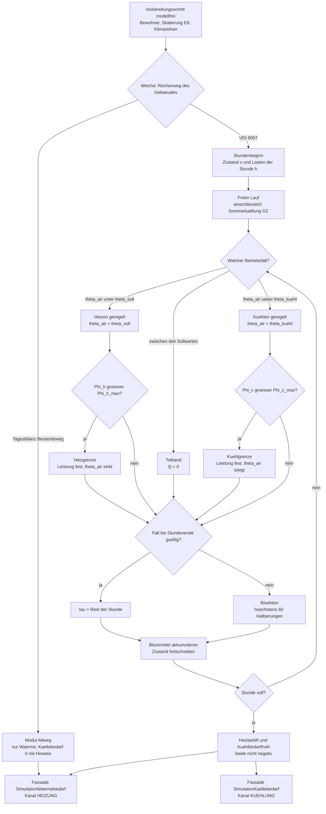
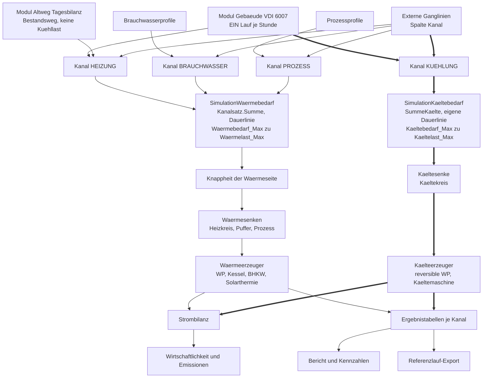
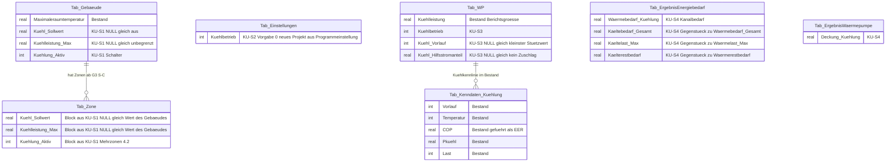
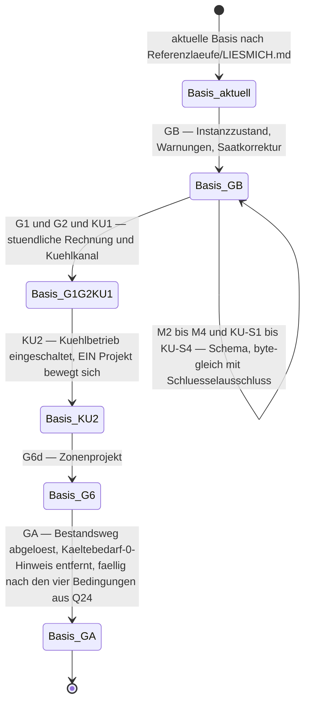

# Konzept: Kühlung in der Gebäudesimulation und in der Simulation von EPOS-Plan

> **Rev. 4 — Prüfung 17.09.2026, E26 eingearbeitet.** Was diese Fassung ändert: Der Bestandsweg ist der
> **Bestandsweg als Übergang**, und die Stufe **GA — Altweg ablösen** kehrt als letzte Stufe ohne
> Termin zurück (Q24 damals wieder offen, seit E27 entschieden); **K20 ist durch die Umsetzung erledigt**, und die Belege des
> Kapitels 5.0 und des Anhangs sind am Arbeitsbaum nachgemessen (Stand 22.09.2026,
> `SchemaStand.Zielversion = 100`); die Stellenliste des vierten Kanals ist um Anzeige-, Schema-
> und Berichtsstellen ergänzt; Bedarfs- und Deckungsprobe der
> Kälte stehen getrennt, je mit Ort und ausdrücklicher Schärfe; die Festlegungen zur reversiblen
> Maschine, zum Kältestrom und zum Datenmodell sind geschärft. Rev. 3 (E20, E21, E23) und Rev. 2
> (Gegenlesen vom 16.09.2026, E15) sind darin enthalten. Grundlagen:
> [ADR-006](ADR-006_Trennung_Altweg_VDI6007.md),
> [Konzept Gebäudesimulation](Konzept_Gebaeudesimulation_VDI6007_EPOS-Plan.md) N1.25 und N1.31,
> Protokolle: [Gegenlesen](Gebaeudesimulation/2026-09-16_Gegenlesen_Kuehlkonzept.md),
> [Prüfung 17.09.2026](Gebaeudesimulation/2026-09-17_Pruefung_Konsistenz_Umsetzbarkeit.md).**
>
> **Nachzug 22.09.2026:** Die Zusicherung zu Heizen und Kühlen gilt **je Abschnitt** der
> Stundenschleife, nicht je Stunde; eine Stunde mit Fallwechsel trägt beides und wird als Hinweis
> gezählt (F-K3, 3.3, 3.5, 6.4, 8.5, 10.2).
>
> **Nachzug 22.09.2026 — E27 (22.09.2026, [Konzept](Konzept_Gebaeudesimulation_VDI6007_EPOS-Plan.md) N1.32):** Der Anwender hat die Kühlfragen
> des Registers entschieden. **K2** (Kältekanal positiv), **K11** (eigener Sollwert und eigene
> Grenze in KU1, Zeitprofil in KU3) und **K19** (eigener Einfrierschritt für KU2) nach Empfehlung;
> der Kältestrom bleibt **Skalar** (Projektsumme in der Kennzahlendatei), bis der Bericht die Spalte
> je Anlage verlangt — dann im selben Schemaschritt wie `KU-S4`, nicht nachträglich (im Register
> K24, hier K18a; nach Empfehlung, Korrektur des Anwenders vom 22.09.2026; 7.4, 7.6). **K22** bleibt Prüfaufgabe vor KU2. **K10 ist abweichend von
> der Empfehlung entschieden:** Eine **Programmeinstellung** legt fest, ob neue Projekte mit
> eingeschalteter Kühlung angelegt werden, Vorgabe aus; Bestands- und Referenzprojekte bleiben aus,
> bis ihre Projekteinstellung ausdrücklich eingeschaltet wird; die Projekteinstellung bleibt je
> Projekt schaltbar (F-K20, 7.2, 8.3, 10.3, 10.5, 11.1, 12.1). Mit E27 ist auch **Q24** entschieden:
> Die Stufe GA wird fällig, sobald ihre vier Bedingungen erfüllt sind — eine davon ist die Abnahme
> von KU1 (10.5, 11.2).
>
> **Nachzug 23.09.2026 — E31 (23.09.2026, [Konzept](Konzept_Gebaeudesimulation_VDI6007_EPOS-Plan.md) N1.36):** Der Anwender hat die fünf vor
> KU1 fälligen Kühlfragen nach Empfehlung entschieden: **K4** (Kühlung zuletzt in der
> Knappheitsreihenfolge, ihr Rang ohne Bedienelement), **K5** (sensible Kälte ohne Entfeuchtung, die
> Grenze an jeder Kältezahl), **K6** (gleichzeitiges Heizen und Kühlen wird nicht saldiert), **K7**
> (Kältespeicher nach KU3 vertagt, bis dahin kein Persistenzwert ohne Rechenweg) und **K12** (Kühlung
> auch auf iOS, ohne eigenen iOS-Lauf für KU1 und KU2). Vor KU1 ist damit keine Frage mehr offen
> (3.5, 4.5, 4.6, 8.6, 10.6, 11.1, 12).
>
> **Nachzug 23.09.2026 — E32 (23.09.2026, [Konzept](Konzept_Gebaeudesimulation_VDI6007_EPOS-Plan.md) N1.37):** Ein Gebäude
> **ohne wirksame Kühlung** (Projektschalter aus, `Kuehlung_Aktiv` = 0 oder kein Kühlsollwert) wird
> nicht mehr an `Maximaleraumtemperatur` gekappt — es **läuft frei**, die Raumtemperatur darf
> darüber steigen, und die Überhitzungsstunden zählen die Stunden darüber im freien Lauf. Eine
> Kühlreihe und Kühlkennzahlen gibt es nur bei wirksamer Kühlung; ohne sie steht „—" (K18). Der
> „informative" Kühlbedarf ist entfallen (3.1, 3.2, 3.4, 3.7, 4.7, 6.4, 7.1, 8.1, 8.4).
>
> **Nachzug 23.09.2026 — E33 (23.09.2026, [Konzept](Konzept_Gebaeudesimulation_VDI6007_EPOS-Plan.md) N1.38):** Der Anwender hat die vier
> vor KU2 fälligen Kühlfragen entschieden: **K8** (freie Kühlung und Rückkühlung bauen, keine als
> eigener Erzeuger), **K21** (Kühl-Vorlauf als Auswahl aus den Stützstellen) und **K23**
> (Hilfsstromanteil je Anlage) nach Empfehlung; **K9 abweichend von der Empfehlung:** Der
> Kältestrom läuft per Vorgabe über denselben Stromträger und Tarif wie die Wärmepumpe im
> Heizbetrieb, wahlweise je Anlage über einen anderen Stromträger des Projekts — gewählt an der
> Anlagenzeile neben dem Stromträger des Heizbetriebs (`Tab_Energieanlagen.Kuehl_ID_Carrier`,
> NULL = wie Heizbetrieb). Vor KU2 ist damit keine Frage mehr offen (5.0.5, 5.1, 5.4, 6.1–6.3,
> 7.3, 8.2, 11.1, 12).
>
> **Nachzug 23.09.2026 — Prüfaufgabe K22 erledigt:** Die Spalte `COP` der Kühlkennlinie führt das
> Kälteverhältnis (EER), nie das Wärmeverhältnis; am Importweg liegen aber Kühlblöcke in Heizlage
> vor, die der Import in KU2 benannt ablehnt (5.1, Festlegung 4; 11.1; 12;
> [Glossar](Glossar_Lokalisierung.md) Abschnitt 6).
>
> **Nachzug 23.09.2026 — KU2 Welle 1:** `KU-S3` ist **Schemaschritt 114** — `Kuehlbetrieb`,
> `Kuehl_Vorlauf` und `Kuehl_Hilfsstromanteil` an `Tab_WP` und `Tab_WP_STAMM`, dazu die
> Stromträgerwahl `Tab_Energieanlagen.Kuehl_ID_Carrier` (K9, E33); `Last` steht in Modell, Leser
> und Schreiber der Kühlkennlinie. Ergebnisneutral: Kein Rechenweg liest die Spalten (5.1, 7,
> 7.3, 11.1).
>
> **Nachzug 23.09.2026 — E34 (23.09.2026, [Konzept](Konzept_Gebaeudesimulation_VDI6007_EPOS-Plan.md) N1.39):** Ergänzung zu
> K9 — wählt eine Wärmepumpe für den Kühlbetrieb einen anderen Stromträger als das Projekt, ist je
> Anlage wählbar, wie ihr Kältestrom in Kosten und Emissionen eingeht: **anteilig am Netzbezug**
> (Vorgabe; PV-Eigenverbrauch gemeinsam, Leistungspreis beim Projektträger) oder über einen **eigenen
> Zähler** (ganz mit dem Kühlträger, ohne PV-Eigenstrom). Umgesetzt mit der dritten Welle von KU2;
> bis dahin trägt der Kältestrom Tarif und Faktor des Projekts (6.1, 6.3, 12.1).
>
> **Nachzug 24.09.2026 — KU2 Welle 2:** Die reversible Wärmepumpe rechnet im Kern — projektseitiger
> Kennlinienleser mit Laststufe `MAX(Last)` je Vorlauf, Vorlaufwahl aus den Stützstellen (K21),
> Dubletten zusammengefasst und benannt, Heizlage und vertauschte Achsen benannt abgelehnt (K22);
> `HatKenndatenStamm`/`HatKenndatenProjekt` und die Sperrgründe im Schreibweg und im Lauf; die
> Umschaltregel je Tag, die `Kaeltekaskade` nach der Wärmekaskade, die Senke „Kältekreis",
> `DeckungKanalKaelte` und die Deckungsprobe Kälte; der Kältestrom als eigene Reihe in der
> Stufenrechnung und als Skalar im Export; die Importregel für Kühlblöcke. Kein Referenzprojekt
> kühlt — die Basis bleibt byte-gleich (4.3, 5.0.1, 5.1, 5.2, 5.5, 6.1, 6.4, 7.3, 7.4, 10.2, 10.3,
> 11.1).
>
> **Nachzug 24.09.2026 — KU2 Welle 3:** E34 ist gebaut. **Schemaschritt 119** (nach 115 Zapfprofil und
> 116–118 Szenarioabdeckung) bringt die
> Abrechnungsart an der Anlagenzeile (`Tab_Energieanlagen.Kuehl_EigenerZaehler`, nullbar, ohne
> Vorgabe; NULL = anteilig am Netzbezug) und sieben nullbare Ergebnisspalten der Kälteseite je
> Wärmepumpe und je Modul — abweichend von K18a (E27) in einem eigenen Schritt, benannt in 7.4. Der
> Lauf teilt den Netzbezug je Viertelstunde, `KostenEmissionRechner` bepreist und bewertet den
> Kältestrom genau einmal (`Kaeltestromabrechnung`), die Gruppe `GR_KAELTE` führt die Kennzahlen der
> Kälteseite samt `kaelte.deckungsgrad`, der Erzeugerdialog die Gruppe „Kühlbetrieb", Übersicht und
> Bericht die Kältedeckung („Kältebedarf und -deckung"); die Wiki-Quellen sind fortgeschrieben. Der
> Import der Kühlsollwerte wartet auf die Importe selbst (G4, 9.1). Kein Referenzprojekt kühlt — die
> Basis bleibt byte-gleich (6.1–6.4, 7.3, 7.4, 8.2, 8.4, 9.1, 9.2, 11.1, 11.3).
>
> **Nachzug 24.09.2026 — E35 ([Konzept](Konzept_Gebaeudesimulation_VDI6007_EPOS-Plan.md) N1.40) und
> KU2 Welle 4:** Ein eigener Zähler trägt zusätzlich Grund- und Leistungspreis seines Kühlträgers — je
> Zähler (je Anlage) einen Grundpreis und den Leistungspreis auf die eigene Spitze des Kältestroms der
> Anlage, nach der Leistungspreisregel des Trägers; anteilig bleibt es bei E34. Die Reste von E34 sind
> nachgezogen: der Preis des vermiedenen Bezugs (Projektträger statt irgendeines Stromträgers), die
> Bemessungsmenge nach § 9b StromStG (eigener Zähler genau einmal) und das Mengenszenario (Kälteseite
> samt Kühlträger). Geprüft und benannt: die Wahl des Projektträgers bei mehreren Stromträgern ohne
> Anlagenwahl (6.1–6.3). Das Referenzprojekt 1017 kühlt mit seiner Wärmepumpe, die Basis ist
> `2026-09-24_R14_Kaelteerzeuger`, und KU2 ist abgeschlossen (10.4, 10.5, 11.1).

**Auftrag (Anwender, 16.09.2026):** „Q8: Kühlung aufnehmen, konzept dazu erweitern."
Daraus ist **Entscheid E12** geworden: Kühlung wird als vierter Kanal aufgenommen, und ihr
Bedarf wird durch Kälteerzeuger gedeckt
([Konzept](Konzept_Gebaeudesimulation_VDI6007_EPOS-Plan.md), Nachtrag N1.18).

**Drei Entscheide vom 16.09.2026 prägen diese Fassung; ein vierter vom 17.09.2026 schärft sie:**

- **E20 (16.09.2026)** trennt die beiden Rechenwege vollständig: VDI 6007 ist die Vorgabe, der
  Bestandsweg lebt als abgeschlossenes Modul `Altweg/` ohne neue Funktion weiter; eine **Weiche am
  Eingang** der Fassade `SimulationWaermebedarf` ruft genau ein
  Modul, davor steht ein modellfreier Vorbereitungsschritt. **Für die Kühlung heißt das: Ein
  Gebäude auf dem Bestandsweg hat keine Kühllast** — sein Kältebedarf ist 0 **mit benanntem Hinweis**,
  nicht mit stiller Null ([ADR-006](ADR-006_Trennung_Altweg_VDI6007.md),
  [Konzept](Konzept_Gebaeudesimulation_VDI6007_EPOS-Plan.md) N1.25).
- **E21 (16.09.2026)** verlangt, die **Simulation Kältebedarf analog zur Simulation Wärmebedarf**
  zu bauen: eine eigene Fassade `SimulationKaeltebedarf` neben `SimulationWaermebedarf`, dieselben
  Kennzahlmuster, dieselben Dialog- und Berichtsbausteine, dieselbe Deckungsform. **Die Symmetrie
  ist damit Bauvorschrift, nicht Geschmack** — jede Abweichung wird benannt und begründet. Damit
  ist **K1** in der Sache entschieden (12.1).
- **E23 (16.09.2026)** hält den Bestandsweg im Produkt: Er ist **eingefroren**,
  ausdrücklich wählbar neben dem VDI-Weg. **Für die Kühlung heißt das:** Der Ausweis lautet
  „Tagesbilanz (Bestandsweg)", und der Kältebedarf 0 mit benanntem Hinweis ist die Eigenschaft
  dieses Wegs, nicht eine stille Null bis zu einem Stichtag (1.3, 8.1, 10.5).
- **E26 (17.09.2026)** sagt, wie E23 zu lesen ist: Der Bestandsweg bleibt **jetzt** — als
  funktionierender **Übergang**, nicht auf Dauer; das VDI-Modell löst ihn später vollständig ab
  und muss eigenständig arbeiten. Die Stufe **GA — Altweg ablösen** ist damit wieder die letzte
  Stufe des Plans, **ohne Datum** und in keiner Summe; wann sie fällig wird, sagt **Q24**, mit
  **E27** entschieden: sobald ihre vier Bedingungen erfüllt sind. **Für die
  Kühlung heißt das:** Der Hinweis „Tagesbilanz (Bestandsweg) liefert keine Kühllast" samt
  Ressourcenschlüssel und Proben gilt **bis zur Ablösung** und ist im selben Auftrag, der ihn
  anlegt, in die Löschliste der Stufe GA einzutragen (10.5, 11.2;
  [Konzept](Konzept_Gebaeudesimulation_VDI6007_EPOS-Plan.md) N1.31).

**Stand:** 24.09.2026 (Stufe KU2 abgeschlossen — E35, Referenzprojekt 1017 mit Kälteerzeuger, Basis `2026-09-24_R14_Kaelteerzeuger`; Stufe KU1 abgeschlossen). **Fassung:** Rev. 4 — die Prüfung vom 17.09.2026 und E26 eingearbeitet;
Rev. 3 trug E20, E21 und E23, Rev. 2 war aus drei Blickwinkeln gegengelesen (Bestand, Konsistenz,
Entscheid E15).

**Zweck.** Dieses Papier ist das in N1.18 angekündigte eigene Konzept. Es beschreibt, was der
Kühlkanal vom Gebäudemodell bis zum Wiki bedeutet: Rechenweg, Kanalarchitektur, Kälteerzeuger,
Strom und Wirtschaftlichkeit, Datenmodell, Dialogführung, Import und Export, Nachweis und
Regressionsnetz, eine Stufung KU0–KU3 und die Fragen K1–K23 mit Empfehlung. **Es entscheidet
nichts, was der Anwender zu entscheiden hat** — Kapitel 12 trennt „jetzt zu entscheiden" von
„technische Festlegung zur Kenntnis"; was E20, E21, E23, E26, E27, E31 und E33 bereits entschieden haben,
trägt dort den Vermerk und wird nicht erneut vorgelegt; E34 ergänzt K9 (6.1), E35 ergänzt E34 (6.2).

**Es steht neben, nicht über den Schwesterpapieren:**

| Papier | Was dort steht, worauf dieses Papier aufsetzt |
|---|---|
| [Konzept Gebäudesimulation](Konzept_Gebaeudesimulation_VDI6007_EPOS-Plan.md) | Physik und Regelung (4.5), Ergebnisreihen (4.6), Bericht (9), Abgrenzung (15), Entscheide E1–E26 (Nachtrag 1; E12 in N1.18, **E15 in N1.20**, **E20 in N1.25**, **E26 in N1.31**) |
| [ADR-006](ADR-006_Trennung_Altweg_VDI6007.md) | die Trennung der Rechenwege (E20): Weiche am Eingang, Modul `Altweg/` ohne neue Funktion, Dialoge in VDI-Struktur, eingeklappter Abschnitt „Tagesbilanz (Bestandsweg)"; mit E23 bleibt der Bestandsweg im Produkt, mit E26 als **Übergang** bis zur Stufe GA (ohne Datum; fällig nach den vier Bedingungen aus Q24, entschieden mit E27); dazu die Regel, dass jede Stufe ihren Bestandsweg-Sonderfall in die Löschliste von GA einträgt |
| [Umsetzungskonzept](Umsetzungskonzept_Gebaeudesimulation_VDI6007_EPOS-Plan.md) | Einbindung in den Kern (1.4–1.8), der Gebäude-Schemaschritt (1.6), Gebäudedialog (2), Reihenfolge und Abnahme (4) |
| [Systementwurf](Systementwurf_Gebaeudesimulation_EPOS-Plan.md) | Anforderungen F1–F17 / N1–N10 / B1–B14, Datenfluss (3), Speicherung (5), Einfrierkette (8.3), Abwägung 10 |
| [Softwarearchitektur](Softwarearchitektur_Gebaeudesimulation_EPOS-Plan.md) | Datenmodell (2.2), Dialogführung (3), Bericht und Kennzahlen (4.3), Referenzlauf-Export (4.4) |
| [Rechenschritte](Rechenschritte_Gebaeudesimulation_VDI6007_EPOS-Plan.md) | Schritt F (Stundenschleife, Umschaltung, Bisektion) und Schritt G (Reihen, Kennzahlen) |
| [Simulationsablauf](Konzept_Simulationsablauf_EPOS-Plan.md) | das Ergebnis-Dashboard mit **zwei Spalten „Wärme \| Strom"** (8.2) — die Zielform, in die sich die Kältedeckung einfügt (8.4) |
| [Mehrzonenmodell](Konzept_Mehrzonenmodell_IFC_EPOS-Plan.md) | Reihen und Kennzahlen je Zone (7), Zonenspaltentabelle (4.2), Abgrenzung (12) |
| [Datenaustauschkonzept](Konzept_Datenaustausch_gbXML_IFC_EPOS-Plan.md) | Kühlsollwerte aus gbXML und IFC, `EPOS_Ergebnis`, `Results` |
| [Befund W](Gebaeudesimulation/2026-09-16_Befund_W_Kuehlung_Bestand.md) | der Bestand: 19 belegte Stellen, Kühlkenndaten der Wärmepumpen, Referenzlauf-Grenze, Größenordnung |

**Was dieses Papier nicht tut.** Es nennt keine Ergebniswerte der VDI-6007-Testbeispiele und
nichts aus VDI 6020:2022 (E6). Es setzt keine Beschaffung von Datenträgern oder
Testreferenzjahren voraus (E5). Es öffnet die Testdatenbank nicht. Es entwirft keine
Kältetechnik über das hinaus, was ein Energiekonzept braucht — die Grenze steht in Kapitel 14.

---

## 0. Das Ergebnis in sechs Punkten

1. **Kühlung ist ein Kanal, aber keine Wärme — und ihre Rechnung ist das Spiegelbild der
   Wärmerechnung.** Der vierte Kanal `KUEHLUNG` tritt in `SimulationKanaele` neben `HEIZUNG`,
   `BRAUCHWASSER` und `PROZESS` — er teilt Vektorstruktur, Persistenz und Kennzahlenrechnung mit
   ihnen, **aber nicht die Erzeugerkaskade**. Ein Heizkessel deckt keinen Kältebedarf. Die
   Architektur ist deshalb: **ein Kanalfeld, zwei Deckungswelten** (Kapitel 4). **E21
   (16.09.2026) macht die Symmetrie zur Bauvorschrift:** Neben die Fassade
   `SimulationWaermebedarf` tritt **`SimulationKaeltebedarf`**; beide lesen denselben
   Vorbereitungsschritt und **ein** Ergebnis des VDI-Moduls `Gebaeude/`, das je Stunde Heiz- und
   Kühllast in **einem** Lauf liefert — die Fassaden verteilen, sie rechnen das Gebäude nicht
   zweimal. Gleiche Klassenmuster, gleiche Kennzahlen, gleiche Dialog- und Berichtsbausteine;
   jede Abweichung steht benannt in einer Liste (3.7, 4.2, 5.5, 6.4, 8.4).
2. **Zwei Stellen ziehen sich gerade *nicht* selbst mit, obwohl sie über `Kanal.ANZAHL`
   geschrieben sind** — und beide sind still. Beide gehören zu **`Kanalsatz`**, der produktiven
   Mehrkanalklasse (`EPOS.Kern/Allgemein/Simulation/SimulationKanaele.cs:598-996`):
   `Kanalsatz.Summe()` (`:645-656`), die Quelle von Dauerlinie, Monatswerten und
   **`Waermebedarf_Max`** (`SimulationWaermebedarf.cs:401`), und `Kanalsatz.NetzverlusteVerteilen`
   (`:686-716`), die die Wärmenetzverluste proportional auf alle Kanäle verteilt. Ohne
   Ausnahmeregel legt ein Kühlkanal jeden Wärmeerzeuger jedes Projekts neu aus und schiebt ihm
   Netzverluste zu, die es nicht gibt. Das ist **der teuerste Fehler dieses Vorhabens**, und er
   erzeugt keine einzige Compilermeldung (4.2). **Nicht zu verwechseln** mit der zweikanaligen
   Altklasse `Waermekanaele` (`:28-409`) und ihrem eigenen `Summe()` (`:48-54`): Sie hat keinen
   produktiven Aufrufer mehr und ist von der Kühlung nicht betroffen. Daneben stehen **fünf
   Stellen, die ihren Stundenzustand selbst über `Kanal.ANZAHL` aufbauen**, und der
   **Bivalenzpunkt**, der den offenen Gesamtbedarf auswertet — sie sind kein Umbau, aber auch
   keine Zeile, und sie stehen in 4.2 namentlich.
3. **Der Kühlbedarf des Gebäudemodells ist heute keine Auslegungsgröße.** Er ist die Kappung an
   `Tab_Gebaeude.Maximaleraumtemperatur`: ideale Kühlung ohne Leistungsgrenze, ohne eigenen
   Sollwert, ohne Nachtlüftung (Konzept 4.5). Damit er einen Erzeuger tragen kann, braucht er
   **einen eigenen Kühlsollwert, eine Kühlleistungsgrenze und die Sommerlüftung aus G2** — sonst
   wird ein Kälteerzeuger auf eine nachweislich überzeichnete Last ausgelegt (Kapitel 3). **Und er
   entsteht allein auf dem VDI-Weg:** Ein Gebäude auf dem Bestandsweg (Tagesbilanz)
   liefert **keine** Kühllast; sein Kältebedarf ist 0 **mit dem Hinweis** „Tagesbilanz
   (Bestandsweg) liefert keine Kühllast" — kein stiller Nullwert. Das gilt, solange es den
   Bestandsweg gibt: **bis zur Stufe GA**, deren Zeitpunkt offen ist (E20, E23 und E26; 3.1, 8.1,
   10.2, 10.5).
4. **Der Kälteerzeuger steht zur Hälfte schon da und wird nicht gerechnet.** Jede Wärmepumpe kann
   eine Kühlleistung und eine Kühlkennlinie führen — importiert, gefiltert, gezeichnet — und
   **keine Zeile der Simulation liest sie** (Befund W 2.2, 2.3). KU2 macht aus vorhandenen Daten
   einen Rechenweg; das ist der billigste Teil des Vorhabens und zugleich der mit dem größten
   sichtbaren Gewinn. **Entscheid E15** setzt den Rahmen davor: Der Anwender soll die kühlfähigen
   Maschinen im Katalog **finden** und ihren Kühlbetrieb **einstellen** können — Abschnitt 5.0
   führt beides zusammen und zeigt, dass „kühlfähig" zwei verschiedene Dinge heißt. **Das Finden
   ist gebaut:** Die Katalogliste der Wärmepumpe führt die Zahlenspalte „Kühlleistung [kW]" mit
   Trichter, und der Schalter „nur mit Kühlfunktion" legt in sie den Ausdruck `>0` — **K20 ist
   damit durch die Umsetzung erledigt** (5.0.3). Was fehlt, ist der Rechenweg.
5. **Der Referenzlauf setzt die Reihenfolge, nicht die Bequemlichkeit.** Der Vergleich kennt
   **zwei verschiedene Lagen**: Eine **Datei**, die nur im neuen Lauf liegt, bekommt die höchste
   Schwere und ist FAIL — **dagegen gibt es keinen Schalter**
   (`Referenzlauf/Vergleich.cs:183-190`). Ein neuer **Schlüssel** in `aggregate.csv` lässt sich
   dagegen mit `--ohne` ausdrücklich benennen und ausnehmen (`:47-59`, `:61-62`, `:74-79`,
   `:225`, `:250`) — ein Werkzeug für einen **erklärten** Unterschied, kein Weg,
   Abweichungen wegzuschalten. Deshalb gehört **KU1 aus einem anderen Grund** in denselben
   Einfrierschritt wie G1 + G2: wegen der neuen **Datei**, nicht wegen der Schlüssel — zwei
   Neu-Einfrierungen für dieselbe Sache sind der einzige vermeidbare Posten der Rechnung
   (Kapitel 10).
6. **Vier Stufen, rund 47–74 PT, davon KU1 in der laufenden G-Kette.** KU0 schreibt die Papiere
   fort, KU1 öffnet den Kanal (ungedeckt), KU2 bringt die reversible Wärmepumpe samt
   Katalogauswahl (E15), KU3 das Umfeld — Kältemaschine samt Rückkühlung, freie Kühlung,
   Kältespeicher, Zonen (Kapitel 11).

---

## 1. Auftrag und Einordnung

### 1.1 Was bisher galt

Die erste Fassung des Gebäudekonzepts hat Kühlung ausdrücklich **nicht** als Kanal geführt.
Drei Stellen sagten dasselbe:

- **Konzept 13, Q8:** „Kühlung als vierter Kanal? **Nein — informativ** (Kühlenergie, Stunden);
  ein Kanal ist ein eigenes Konzept."
- **Konzept 4.5:** die Kappung an `Maximaleraumtemperatur` als ideale Kühlung, „die dafür nötige
  Leistung wird als Reihe `Kuehlbedarf` geführt — **informativ**, kein vierter Kanal".
- **Konzept 15:** „Kühlung als Kanal und Kältemaschinen" in der Abgrenzung; dazu
  [Systementwurf](Systementwurf_Gebaeudesimulation_EPOS-Plan.md) **B9** („Drei Kanäle — und
  Kühlung ist keiner") und **Abwägung 10**, sowie
  [Softwarearchitektur](Softwarearchitektur_Gebaeudesimulation_EPOS-Plan.md) 3.5 („Informative
  Reihe, kein vierter Kanal") und [Mehrzonenkonzept](Konzept_Mehrzonenmodell_IFC_EPOS-Plan.md) 12.

### 1.2 Was E12 ändert

E12 hebt **eine** Zeile auf, und zwar die entscheidende: der Kühlbedarf wird gedeckt. Daraus
folgt alles Weitere — ein Kanal, der gedeckt wird, braucht Erzeuger, Strom, Kosten, Emissionen,
Kennzahlen, Bericht, Dialoge und einen Platz im Regressionsnetz.

| Ebene | Vorher | Nach E12 |
|---|---|---|
| Gebäudemodell | Reihe `KuehlbedarfKwh`, informativ | **Bedarfsgröße** mit eigenem Sollwert und eigener Leistungsgrenze |
| Rechenkern | drei Kanäle | **vier** Kanäle, zwei Deckungswelten |
| Erzeuger | keiner kennt Kälte | reversible Wärmepumpe (KU2), Kältemaschine (KU3) |
| Wirtschaftlichkeit | kein Kältestrom | eigene Verbrauchsposition, eigene Komponente |
| Bericht | zwei informative Kennzahlen | Kanalzeile, Deckungsbild, Kältekennzahlen |
| Regressionsnetz | dreizehn Projekte ohne Kühlung | ein Referenzprojekt mit Kühlung, neue Einfrierregel |

**Was E20, E21, E23 und E26 daran schärfen.** E12 sagt, **dass** gekühlt und gedeckt wird; die
drei Entscheide vom 16.09.2026 sagen, **wie** es gebaut wird, und E26 (17.09.2026) sagt, **wie
lange** der zweite Rechenweg daneben steht:

| Ebene | Nach E12 allein | Nach E20, E21, E23 und E26 |
|---|---|---|
| Woher der Bedarf kommt | „aus dem Gebäudemodell" | **allein aus dem VDI-Weg**; ein Bestandsweg-Gebäude liefert 0 mit benanntem Hinweis (E20) |
| Wie oft das Gebäude gerechnet wird | offen | **einmal** — das Modul `Gebaeude/` liefert Heiz- und Kühllast in einem Lauf (E21) |
| Wer den Bedarf verteilt | `SimulationWaermebedarf` | zwei Fassaden: `SimulationWaermebedarf` und **`SimulationKaeltebedarf`** (E21) |
| Wie Kennzahlen, Dialoge und Bericht aussehen | „analog, im Einzelnen offen" | **dieselben Muster und Bausteine wie die Wärmeseite**, Abweichungen benannt (E21) |
| Wo die Kühleingaben stehen | Gruppe „Kühlung", nur bei VDI 6007 sichtbar (U2) | Gruppe „Kühlung" als **Teil der VDI-Struktur** — immer sichtbar und bearbeitbar, bei einem Bestandsweg-Gebäude mit dem Hinweis, dass sie gelten, sobald das Gebäude auf VDI 6007 rechnet (E20; **U2 ist überholt**) |
| Wie lange es den Bestandsweg gibt | offen — ein Weg auf Zeit, bis zu einer Stufe GA | **Übergang ohne festes Ende**: der Bestandsweg ist eingefroren und bleibt ausdrücklich wählbar, bis die Stufe **GA** ihn ablöst; ihr Zeitpunkt ist offen (E23, geschärft durch **E26** — Q24) |

### 1.3 Was ausdrücklich **nicht** aufgehoben wird

E12 nennt eine Zeile der Abgrenzung. Die übrigen Ausschlüsse aus Konzept 15 bleiben und werden
hier **bestätigt** (Kapitel 14 führt sie vollständig):

- **Feuchte und Entfeuchtung.** Die latente Last ist nicht Gegenstand der VDI 6007 Blatt 1; das
  Modell rechnet **sensible** Kälte. Ein Kühlkanal ohne Entfeuchtung ist eine Teilmenge des
  anlagentechnischen Kältebedarfs, und das gehört im Bericht und im Wiki als Grenze benannt
  (**K5**, entschieden mit E31: die Grenze steht an jeder Kältezahl).
- **Bauteilaktivierung** (Kühldecke, Flächenkühlung) als Funktion. Testbeispiel 11 ist ein
  **Prüffall**, kein Produktmerkmal (Ausblick in 3.6).
- Sommerlicher Wärmeschutz als Nachweis nach DIN 4108-2, Nachweise nach GEG oder DIN V 18599.
- Kopplung von Vorlauftemperatur und Erzeugerfahrplan an die Raumtemperatur — seit E22 (16.09.2026)
  eine benannte Erweiterung mit eigenem Papier ([Anlagenkopplung](Konzept_Anlagenkopplung_Gebaeudesimulation_EPOS-Plan.md)); die Kälteseite folgt dort
  spiegelbildlich, dieses Papier liefert Bedarf und Kälteerzeuger.

**Hinzu kommt eine Festlegung, kein Ausschluss:** Die Kühlung hat **keinen Bestandsweg**. Sie entsteht
allein im VDI-Modul, und der Tagesbilanz-Weg bekommt sie auch nicht nachträglich — er ist der
eingefrorene Bestandsweg ohne neue Funktion (E20 und E23,
[ADR-006](ADR-006_Trennung_Altweg_VDI6007.md)). Das ist kein Mangel dieses Konzepts, sondern die
Bedingung dafür, dass es nur **einen** Kälterechenweg gibt: Der Bestandsweg trägt Kältebedarf 0
mit benanntem Hinweis.

**Wie lange, sagt E26 (17.09.2026):** Der Bestandsweg ist ein **Übergang**. Er bleibt, solange das
VDI-Modell ihn nicht abgelöst hat, und die Stufe **GA — Altweg ablösen** steht ohne Datum am Ende
des Plans; nach **Q24** — entschieden mit E27 (22.09.2026, [Konzept](Konzept_Gebaeudesimulation_VDI6007_EPOS-Plan.md) N1.32) — wird sie fällig,
sobald ihre vier Bedingungen erfüllt sind, darunter die Abnahme von KU1. Für die Kühlung folgt daraus zweierlei: Der Sonderfall „Kältebedarf 0 mit
Hinweis" ist für die Dauer des Übergangs zu bauen und zu prüfen — und er ist im selben Auftrag in
die **Löschliste der Stufe GA** einzutragen, damit er mit dem Bestandsweg verschwindet und nicht als
toter Zweig zurückbleibt ([Konzept](Konzept_Gebaeudesimulation_VDI6007_EPOS-Plan.md) N1.31,
8.5, 10.5).

### 1.4 Drei Begriffe, die in diesem Papier auseinandergehalten werden

Die Umgangssprache nennt alles drei „Kühlung". Die Rechnung darf das nicht.

| Begriff | Was gemeint ist | Wo er entsteht | Einheit |
|---|---|---|---|
| **Kühlbedarf des Gebäudes** (Kältebedarf) | die Wärme, die dem Raum entzogen werden muss, damit er den Kühlsollwert hält — die Last, **bevor** eine Anlage sie deckt | Gebäudemodell, Schritt F; oder externe Ganglinie | kWh je Stunde, **positiv** |
| **Kälteerzeugung** | die Kältemenge, die ein Erzeuger in dieser Stunde tatsächlich bereitstellt — begrenzt durch Leistung, Temperaturlage und Betriebsart | Kälteerzeugerrechnung, KU2/KU3 | kWh je Stunde |
| **Kältestrom** | die elektrische Arbeit, die die Kälteerzeugung kostet — Kältemenge geteilt durch EER, zuzüglich Hilfsantriebe | Strombilanz | kWh je Stunde |

Die drei Größen sind **nie** gleich: Kühlbedarf ≥ Kälteerzeugung (Unterdeckung ist zulässig und
wird benannt), und Kältestrom ist eine andere Energieform. Wo eine Kennzahl nur „Kühlung" heißt,
ist sie falsch benannt.

---

## 2. Anforderungen

Zählung **F-K…** (funktional), **N-K…** (nichtfunktional), **B-K…** (Randbedingung) — in der
Form des [Systementwurfs](Systementwurf_Gebaeudesimulation_EPOS-Plan.md) 1, damit beide Papiere
später zusammenwachsen können, ohne dass Nummern kollidieren.

### 2.1 Funktionale Anforderungen

| # | Anforderung | Quelle | Nachweis | Stufe |
|---|---|---|---|---|
| **F-K1** | Je Gebäude ist ein **Kühlsollwert** eingebbar; NULL bedeutet „Kühlung aus", und der Rückfall auf `Maximaleraumtemperatur` ist **ausdrücklich**, nicht still | E12; Konzept 4.5 | Datenbankfall: NULL ergibt keinen Kühlbedarf im Kanal | KU1 |
| **F-K2** | Je Gebäude ist eine **Kühlleistungsgrenze** eingebbar (NULL = unbegrenzt) — das Gegenstück zu `Heizleistung_Max` (Q7, E-Tabelle N1.17) | Befund W 4.2 | Rechenprobe: mit Grenze steigt θ_air über den Sollwert, Kühlbedarf gekappt | KU1 |
| **F-K3** | Der **Kühlbedarf je Stunde** steht als eigener Kanal `KUEHLUNG` im Kanalsatz, positiv geführt. Dazu gilt je Gebäude bzw. Zone: in einem **Abschnitt** der Stundenschleife nie Heiz- und Kühlanteil zugleich; in einer **Stunde** ist beides möglich, wenn der Betriebsfall innerhalb der Stunde wechselt (3.3) | E12 | Kanalsummenprobe; Wächter „Kühlkanal nie negativ"; Abschnittsprobe scharf, Stunden mit beidem als Hinweis gezählt, nicht als Fehler (10.2) | KU1 |
| **F-K4** | Der Kühlkanal geht **nicht** in `Kanalsatz.Summe()`, nicht in `Waermebedarf_Max`, nicht in die Dauerlinie und nicht in `Kanalsatz.NetzverlusteVerteilen` ein | 4.2 | Referenzlauf: Projekte ohne Kühlung byte-gleich; Projekt mit Kühlung hat unveränderte `Waermelast_Max` | KU1 |
| **F-K5** | Eine **externe Ganglinie** darf den Kanal `Kühlung` tragen — Kältebedarf ohne Gebäudemodell | K3 | Datenbankfall über `Z_ProjektWaermebedarf.Kanal` | KU1 |
| **F-K6** | Der Kühlbedarf wird von **Kälteerzeugern gedeckt**; Wärmeerzeuger können ihn nicht decken, und das ist erzwungen, nicht verabredet | E12 | **zwei** Laufproben (4.4): die **Bedarfsprobe Kälte** in `SimulationKaeltebedarf` (Muster `SimulationWaermebedarf.Energieprobe`, `:390`, `:458`) und die **Deckungsprobe Kälte** in `SimulationControl.KanalganglinienProbe()` — kein Wärmeerzeuger schreibt in `Deckung_Kuehlung`. Beide melden einmal je Lauf mit der Stufe Fehler und setzen das Gesamtergebnis auf fehlgeschlagen. Die **statischen** Zusicherungen (Kanallisten disjunkt und vollständig, Ziel ↔ Senke der Kälteseite) stehen daneben im Selbsttest | KU1/KU2 |
| **F-K7** | Eine **reversible Wärmepumpe** deckt Kälte über die vorhandene Kühlkennlinie (`Tab_Kenndaten_Kuehlung(_STAMM)`: `Vorlauf`, `Temperatur`, `COP`, `Pkuehl`, `Last`), und der **Kühl-Vorlauf** wählt die Kennlinie so, wie der Heizvorlauf es auf der Wärmeseite tut | Befund W 2.1 | Rechenprobe gegen Handrechnung an einer Stützstelle, **je Vorlauf** | KU2 |
| **F-K8** | Eine Stunde ist **entweder** Heiz- **oder** Kühlbetrieb je Erzeuger; die Umschaltregel ist benannt und deterministisch | K-Frage K8a | Probe: Stunde mit Heiz- und Kühlbedarf, Erzeuger deckt genau eines | KU2 |
| **F-K9** | Der **Kältestrom** ist eine eigene Verbrauchsposition je Komponente, getrennt vom Wärmepumpenstrom | Befund W 3.2 | `aggregate.csv` führt den Posten; Strombilanz schließt | KU2 |
| **F-K10** | Kältestrom geht in **Wirtschaftlichkeit und Emissionen** ein, über denselben Stromträger wie der Wärmepumpenstrom | K9 | Rechenprobe: Betriebskosten steigen um Strommenge × Arbeitspreis | KU2 |
| **F-K11** | **Kennzahlen, mit einem Gegenstück je Wärmekennzahl**: Jahreskälte, Kältespitze, Vollbenutzungsstunden Kälte, Stunden mit Kühlbedarf, Überhitzungsstunden, Jahresarbeitszahl Kälte (EER-Jahreswert), Deckungsgrad des Kühlkanals, ungedeckte Kälte | Konzept 9; Befund W 3.1; **E21** | Berichtsprobe; Katalogeintrag je Kennzahl in beiden Sprachen; Probe „Symmetrie der Kennzahlen" (10.2) | KU1/KU2 |
| **F-K12** | **Unterdeckung** des Kühlkanals ist eine **benannte** Meldung, kein stiller Rest | Hausregel `EPOS.Kern/CLAUDE.md` | Probe: Bedarf ohne Erzeuger ergibt Warnung, nicht 0 | KU1 |
| **F-K13** | **Import**: Kühlsollwerte aus gbXML (`Zone/DesignCoolT`) und IFC (`Pset_SpaceThermalRequirements.SpaceTemperatureSummerMax`) landen im Kühlsollwertfeld, mit Herkunftsmarke | Datenaustausch 3, 6.3 | Importprobe; Herkunftsspalte gefüllt | KU2 |
| **F-K14** | **Export**: Kühlenergie steht in `EPOS_Ergebnis` (IFC) und — sofern G7b gebaut wird — als `resultsType CoolingLoad` in gbXML | Datenaustausch 5.6, 6.4 | Rundlaufprobe | KU3 |
| **F-K15** | **Mehrzonen**: Kühlbedarf entsteht je Zone; in den Kanal geht die Gebäudesumme, und gleichzeitiges Heizen und Kühlen wird **ausgewiesen, nicht saldiert** | Mehrzonen 7; K6 | Probe: zwei Zonen, eine heizt, eine kühlt — beide Kanäle tragen ihren Betrag | KU3 |
| **F-K16** | **Bericht**: eine Kanalzeile Kühlung, ein Kühlbild (Monatsstapel bzw. Jahresganglinie), der Deckungsanteil je Kälteerzeuger | Konzept 9; N1.18 | Berichtsprobe; `Proben/ChartProben` grün | KU2 |
| **F-K17** | Der Anwender kann im **Katalog gezielt Wärmepumpen mit Kühlfunktion auswählen** und ihren Kühlbetrieb je Anlage konfigurieren; die Übernahme in das Projekt bringt die Kühlkennlinie mit | **E15** | Katalogprobe (Filter findet genau die kühlfähigen Sätze); Datenbankfall „Katalogübernahme kopiert die Kühlkennlinie vollständig" (10.3) | KU2 |
| **F-K18** | Ein Gebäude auf dem **Bestandsweg** (Tagesbilanz) liefert **Kältebedarf 0 mit benanntem Hinweis** — „Tagesbilanz (Bestandsweg) liefert keine Kühllast" —, nie eine stille Null; seine Kühleingaben bleiben erhalten und gelten, sobald das Gebäude auf VDI 6007 rechnet. Die Anforderung gilt **für die Dauer des Übergangs**, also bis zur Stufe GA (ohne Datum; fällig nach den vier Bedingungen aus Q24, entschieden mit E27); Hinweistext, Ressourcenschlüssel und die beiden Proben werden im selben Auftrag in die **Löschliste der Stufe GA** eingetragen | **E20**, **E23**, **E26** | Rechenprobe „Bestandsweg-Gebäude liefert Kältebedarf 0 mit Hinweis" (10.2); Meldung in beiden Sprachen (8.5); bunit-Fall am Gebäude- und Bedarfsdialog (8.6); Eintrag in der Löschliste (10.5) | KU1 |
| **F-K19** | Die Kälteseite trägt zu **jeder** Größe der Wärmeseite ein benanntes Gegenstück — Fassade, Jahressumme, Spitze, Dauerlinie, Deckungsgrad, Restgröße, Bedarfsdialogabschnitt, Berichtsabschnitt — **oder** die Abweichung steht benannt in der Abweichungsliste | **E21** | Probe „Symmetrie der Kennzahlen" (10.2) gegen die Gegenüberstellungen in 4.2, 5.5, 6.4 und 8.4 | KU1/KU2 |
| **F-K20** | Eine **Programmeinstellung** „Neue Projekte mit Kühlung anlegen" (Vorgabe **aus**, abgelegt über `Dienste.Einstellungen`) bestimmt den **Anfangswert** von `Tab_Einstellungen.Kuehlbetrieb` eines **neu angelegten** Projekts; Bestands- und Referenzprojekte tragen 0, bis ihre Projekteinstellung ausdrücklich eingeschaltet wird, und die Projekteinstellung bleibt je Projekt schaltbar | **E27** (K10) | Datenbankfälle „neues Projekt übernimmt die Programmeinstellung", „Bestandsprojekt bleibt aus", „Speichern der Kaskade erhält `Kuehlbetrieb`", „Projektduplikat übernimmt den Wert der Quelle" (10.3); bunit-Fall am Einstellungsdialog (8.6) | KU1 |

### 2.2 Nichtfunktionale Anforderungen

| # | Anforderung | Maß | Nachweis |
|---|---|---|---|
| **N-K1** | **Referenzbasis** — jede Stufe rechnet gegen die aktuelle Basis; eine neue Datei ohne Bedingung ist FAIL | `GESAMT: PASS` | Referenzlauf je Merge |
| **N-K2** | **Determinismus** — zwei Läufe byte-gleich, auch mit Kühlung | 13 von 13 | Protokollzeile des Referenzlaufs |
| **N-K3** | **Rückwärtsverträglichkeit** — ein Projekt **ohne** Kühlung rechnet nach KU1 und KU2 **byte-gleich** wie vorher | 12 von 13 Projekten unberührt | Vergleich je Projekt |
| **N-K4** | **Plattformgleichheit** — alle Kühlfelder sind auf iOS erreichbar oder **benannt** abgelehnt | keine stumme Absage | iOS-Navigationszeile je Maske |
| **N-K5** | **Zweisprachigkeit** — jeder neue Anzeigetext und jede Meldung in beiden `.resx`, danach `Werkzeuge/ResourceDesigner` | vollständig | Wächter und Designerlauf |
| **N-K6** | **Einheitenwächter** — Zeitreihen in kWh mit Einheit im Namen, Jahressummen in MWh; keine nackten Faktoren 1 000 in Hülle oder Anzeige | grün | `EinheitenWacheTests`, `DoubleWacheTests` |
| **N-K7** | **Rechenzeit** — die Kälterechnung bleibt im Budget des Laufs; sie ist eine Stundenschleife ohne Iteration | Zuwachs ≤ 0,05 s im CI-Lauf | Laufzeitzeile des Referenzlaufs |
| **N-K8** | **Keine zweite Wahrheit** — Kältepreis, Emissionsfaktor und Stromträger kommen aus denselben Quellen wie die Wärmeseite | eine Quelle je Größe | Prüfung im Auflöser |

### 2.3 Randbedingungen

| # | Randbedingung | Wirkung |
|---|---|---|
| **B-K1** | **E12** ist verbindlich; **E5** (keine Datenträger), **E6** (nichts aus VDI 6020:2022 in Code, Tests, Wiki, Bericht, Auslieferung), **E10** (Produktausweis im Wortlaut) gelten unverändert | keine neuen Normbeschaffungen; keine Normzahlen in diesem Papier |
| **B-K2** | **E1** — das Stundenmodell ist Vorgabe; nur es liefert Kühllast je Stunde. **E20** und **E23** schärfen: Der Bestandsweg ist eingefroren, **ohne** Kühllast; **E26** setzt die Frist: Er ist ein Übergang und wird mit der Stufe GA abgelöst (ohne Datum; fällig nach den vier Bedingungen aus Q24, entschieden mit E27) | KU1 setzt G1 voraus; ein Bestandsweg-Gebäude trägt Kältebedarf 0 mit Hinweis (F-K18), und dieser Sonderfall steht auf der Löschliste der Stufe GA |
| **B-K3** | **E7** — Einzonen zuerst; Mehrzonen sind Stufe G6 | Kühlung je Zone ist KU3, nicht KU1 |
| **B-K4** | [**ADR-001**](ADR-001_Schema-Ausrollung.md) — jede Schemaänderung ist ein nummerierter Schritt über `SchemaMigration`; drei Eintragungen je neuer Tabelle (Schritt, Auslieferungsvorlage, Schemapflege der Testdatenbank) | die Kühlschritte sind nummerierte Schritte, keine tolerante Migration |
| **B-K5** | [**ADR-002**](ADR-002_Stundenmodell_VDI6007_Einbindung.md) — eine Naht, kein zweiter Rechenweg — in der Form, die ihr [**ADR-006**](ADR-006_Trennung_Altweg_VDI6007.md) gibt: **eine Weiche am Eingang**, zwei getrennte Module (`Gebaeude/`, `Altweg/`), ein modellfreier Vorbereitungsschritt davor (E20) | die Kälterechnung hängt an **derselben** Weiche und liegt allein im VDI-Modul; sie erzeugt keinen zweiten Verzweigungspunkt |
| **B-K6** | [**ADR-005**](ADR-005_Zonenkopplung_Mehrzonenmodell.md) — Zonenkopplung über die Nachbarraum-Randbedingung | die Zonenkühlung folgt demselben Lösungsschema |
| **B-K7** | **Hausregeln der vier `CLAUDE.md`** — Fachänderung einmal im Kern, keine Datenbank in der Oberfläche, Umgebung nur über `Dienste.*`, nichts Fachliches in `EPOS.iOS` | der Kältekern ist plattformfrei |
| **B-K8** | **SQLite**, `STRICT`, Beziehungen über IDs, Boolean als 0/1 mit `CHECK (spalte IN (0,1))`, Zugriff über `DataRepository` mit `?`-Parametern; nach jeder Anweisung der `SqlDialektPruefer` ([`BETRIEB_SQLITE.md`](BETRIEB_SQLITE.md) § 6) | keine neuen Textverweise |
| **B-K9** | **Drei feste Raster** — 8 760 Stunden, 365 Tage, 12 Monate, kein Schaltjahr; dazu 168 Wochenstunden für Profile | der Kühlsollwert folgt demselben Raster wie die Heizsollwerte |
| **B-K10** | **CI-Kontingent und Rückfragepflicht** vor jedem macOS-, iOS- und Setup-Lauf | der Nachweis der Kühlstufen liegt auf `kern.yml` (ubuntu) |
| **B-K11** | **Persistenzwerte sind eingefroren und ASCII** — wie `KANAL_PROZESS = "Prozesswaerme"` (`EPOS.Kern/Allgemein/DbWerte.cs:1313`), bewusst ohne Umlaut, weil in SQL verglichen | der neue Wert heißt `"Kuehlung"`, nicht `"Kühlung"` |
| **B-K12** | **E21** — die Kälteseite wird **analog zur Wärmeseite** gebaut: Fassade, Kennzahlen, Deckung, Dialog- und Berichtsbausteine folgen denselben Mustern | jede Abweichung von der Wärmeseite wird benannt und begründet (0, 4.2, 5.5, 6.4, 8.4, 11.1); eine unbenannte Lücke ist ein Fehler, kein Zuschnitt |

---

## 3. Rechenweg im Gebäudemodell

### 3.1 Der Bestand des Entwurfs — und was ihm fehlt

Schritt F der [Rechenschritte](Rechenschritte_Gebaeudesimulation_VDI6007_EPOS-Plan.md) kennt die
Kühlung bereits als **vierten Betriebsfall** der Stundenschleife. Der Betriebsfall wird je
Abschnitt gewählt, seine Gültigkeit über ein Verletzungsmaß geprüft, und der Umschaltzeitpunkt
per Bisektion gesucht (höchstens 60 Halbierungen, deterministisch — die **einzige** Iteration des
Modells). Vier Fälle stehen dort:

| Fall | Bedingung | Regel | Gültig solange |
|---|---|---|---|
| geregelt | 0 ≤ Φ_h ≤ Φ_h,max | θ_air = θ_soll | 0 ≤ Φ_h(x) ≤ Φ_h,max |
| Grenze oben | Φ_h > Φ_h,max | Leistung fest | θ_air(x) ≤ θ_soll |
| frei | Φ_h < 0 und θ_air im freien Lauf ≤ θ_max | Q = 0 | θ_air(x) ≥ θ_soll |
| **Kühlung** | Φ_h < 0 und θ_air im freien Lauf > θ_max | θ_air = θ_max | θ_air(x) ≤ θ_max |

Was dem Bestand des Entwurfs fehlt, ist **nicht die Physik**, sondern die Parametrierung: Der
Kühlfall regelt auf `Maximaleraumtemperatur` — eine Obergrenze des Komfortbands ohne Zeitprofil —,
und er kennt **keine** Leistungsgrenze. Die Heizseite hat vier Sollwerte (Tag, Nacht,
Wochenende, Ferien, `sql/schema/001_grundschema.sql:1147-1150`) und mit E12/Q7 eine
Leistungsgrenze; die Kühlseite hat einen Wert und keine Grenze
(`sql/schema/001_grundschema.sql:1151`).

**Und der Betriebsfall existiert nur im VDI-Modul.** Der Tagesbilanz-Weg kennt keine
Stundenschleife und damit keinen Kühlfall; er ist nach **E20 und E23** der abgeschlossene
Bestandsweg im Modul `Altweg/` und bekommt ihn auch nicht nachträglich — „keine Änderung außer
Fehlerbehebung" ([ADR-006](ADR-006_Trennung_Altweg_VDI6007.md)). Ein Gebäude auf dem Bestandsweg trägt
deshalb **Kältebedarf 0 mit dem Hinweis** „Tagesbilanz (Bestandsweg) liefert keine Kühllast"
(F-K18); seine Kühleingaben bleiben erhalten und gelten, sobald das Gebäude auf VDI 6007 rechnet
(8.1). Nach **E26** ist das der Zustand des Übergangs: Mit der Stufe GA fällt der Bestandsweg weg, und
mit ihm dieser Sonderfall (10.5).

**Die Kappung an `Maximaleraumtemperatur` ist entfallen (E32).** Die Tabelle oben zeigt den Entwurf
vor KU1, in dem der Kühlfall jedes Gebäude an θ_max hielt und die dafür nötige Leistung als
informative Reihe führte. Gebaut ist mit KU1: Den Kühlfall gibt es nur bei **wirksamer** Kühlung
(Projektschalter, `Kuehlung_Aktiv`, Kühlsollwert), er regelt auf θ_kuehl (3.2). Ohne wirksame
Kühlung hat der Löser keine obere Grenze — das Gebäude läuft frei, und θ_max ist allein die Grenze
der Überhitzungskennzahl (6.4, 7.1).

### 3.2 Zwei Sollwerte, zwei Grenzen — das Zielbild

Die Regelung bekommt ein **zweites Sollwertpaar**. Sie bleibt ideal und kontinuierlich, und sie
bleibt die Regelung der Richtlinie — nur ihre Grenzen werden eingebbar:

```
Heizen:  theta_soll aus Tag / Nacht / Wochenende / Ferien     Phi_h in [0 , Phi_h_max]
Kuehlen: theta_kuehl (nur bei wirksamer Kuehlung)             Phi_c in [0 , Phi_c_max]
         ohne wirksame Kuehlung: keine obere Grenze (E32)
Totband: theta_soll < theta_air < theta_kuehl  ->  freier Lauf, Q = 0
```

Damit entstehen **fünf** Betriebsfälle statt vier: der Kühlfall spaltet sich in „Kühlung
geregelt" und „Kühlgrenze erreicht". Die Gültigkeitsregel des neuen Falls ist das Spiegelbild der
Heizgrenze:

| Fall | Regel | Verletzungsmaß v (gültig, solange v ≤ 0) |
|---|---|---|
| Kühlung geregelt | θ_air = θ_kuehl | max( Φ_c(x) − Φ_c,max , 0 − Φ_c(x) ) |
| Kühlgrenze oben | Φ_c fest auf Φ_c,max | θ_kuehl − θ_air(x) |

**Das Totband ist neu und wichtig.** Vor KU1 fielen Heizgrenze und Kühlgrenze in einer Größe
zusammen, weil `Maximaleraumtemperatur` nur kappte. Mit zwei Sollwerten entsteht ein Bereich, in
dem weder geheizt noch gekühlt wird — physikalisch richtig und der Normalfall in der
Übergangszeit. Ohne wirksame Kühlung ist das Totband nach oben offen: Das Gebäude läuft frei
(E32). **Dieses Totband ist kein Reglertotband** (das bleibt ausgeschlossen, Konzept 4.5):
es ist der Abstand zweier Sollwerte, nicht die Hysterese eines Reglers.

**Prüfregel.** `theta_kuehl ≥ theta_soll,max + 1 K` ist eine **harte** Plausibilitätsprüfung mit
benanntem Fehler (Q18-Regel für den Stundenweg). Ein Kühlsollwert unter dem höchsten
Heizsollwert lässt Heizung und Kühlung gegeneinander arbeiten — das ist keine Auslegung, das ist
ein Eingabefehler.

**Die Kühlleistung wirkt in KU1 rein konvektiv, am Luftknoten.** Die Heizseite kann ihre Leistung
über `Heizung_Strahlungsanteil` auf Luft- und Oberflächenknoten aufteilen
([Rechenschritte](Rechenschritte_Gebaeudesimulation_VDI6007_EPOS-Plan.md) 7.2); die Kühlseite
bekommt dieses Gegenstück in KU1 **nicht**. `KU-S1` führt deshalb **keine** Spalte
`Kuehlung_Strahlungsanteil` (7.1), und Φ_c geht vollständig in den konvektiven Term. Das ist eine
**benannte Vereinfachung, keine Lücke**: Ein Strahlungsanteil der Kühlübergabe setzt eine
Übergabeart voraus, und die entsteht erst mit der
[Anlagenkopplung](Konzept_Anlagenkopplung_Gebaeudesimulation_EPOS-Plan.md) (AK1). Bis dahin gilt:
Wer eine Kühldecke rechnen will, rechnet sie nicht — das ist auch die Grenze aus 3.6 und
Kapitel 14. Mit AK1 kommt der Anteil aus der Übergabeart, und die Kältedeckung teilt Φ_c nach
denselben Gleichungen auf wie die Wärmeseite. **Nach E37** (Konzept N1.42) hat die Kühlübergabe
**eigene Spalten** am Gebäude — Schalter, Art, Exponent, Nennleistung, Auslegungspunkt und
Vorlaufgrenze ([Anlagenkopplung](Konzept_Anlagenkopplung_Gebaeudesimulation_EPOS-Plan.md) 8.1); der
**Strahlungsanteil bleibt ohne Spalte**, er ist eine Vorgabe je Art (Kühldecke und Flächenkühlung 0,5,
Gebläsekonvektor 0). Ohne gewählte Kühlübergabe gilt diese Vereinfachung unverändert.

### 3.3 Vorzeichen: die Norm innen, der Betrag außen

Die Richtlinie führt **Φ_h > 0 = Heizen, Φ_h < 0 = Kühlen** (Rechenschritte 4.3). Ein Kanal mit
negativen Werten bräche jede Summen-, Deckungs- und Dauerlinienrechnung des Bestands — und zwar
still, weil `double` kein Vorzeichen prüft.

**Festlegung (K2).** Die Vorzeichenkonvention der Norm gilt **im Löser** und nirgends sonst. An
der Grenze des Gebäudemodells — beim Ablegen in `GebaeudeModellErgebnis` — wird der Betrag
genommen, **einmal, aus einem Lauf, für beide Fassaden** (E21; 3.7):

**Der Betrag wird je Abschnitt genommen, nicht je Stunde.** Die Stundenschleife zerlegt eine
Stunde in Abschnitte (3.7), und Φ_h(h) ist das **vorzeichenbehaftete Blockmittel** über alle
Abschnitte. Enthält eine Stunde einen Heiz- und einen Kühlabschnitt — der Normalfall einer
Umschaltstunde in der Übergangszeit —, so hebt das Blockmittel beide gegeneinander auf, und ein
Betrag aus diesem Mittel liefert **nur eine** der beiden Reihen. Deshalb wird je Abschnitt in zwei
Akkumulatoren gebucht, und erst am Stundenende geteilt:

```
je Abschnitt (Dauer tau in s, Leistung Q in W):
    akkQ_heiz  += max(  Q , 0 ) * tau            [Ws]
    akkQ_kuehl += max( -Q , 0 ) * tau            [Ws]

am Stundenende:
    HeizlastW[h]       = akkQ_heiz  / 3600            [W]   -> Kanal HEIZUNG  (ueber WattToKw)
    KuehlbedarfKwh[h]  = akkQ_kuehl / 3600 / 1000     [kWh] -> Kanal KUEHLUNG
```

Daraus folgen zwei Zusicherungen, die als Wächter zu bauen sind (Festlegung F-K3):

- **Beide Reihen sind nie negativ** — auf jeder Ebene, bis in die Projektkanäle.
- **Je Abschnitt nie beides.** Ein Abschnitt hat genau einen Betriebsfall (3.2): „Heizen geregelt"
  und „Heizgrenze" buchen nur in `akkQ_heiz`, „Kühlen geregelt" und „Kühlgrenze" nur in
  `akkQ_kuehl`, das Totband in keinen. Das ist die **scharfe** Zusicherung; ein Verstoß ist ein
  Fehler. Sie fällt, sobald ein Betriebsfall eine Leistung mit falschem Vorzeichen bucht oder
  Heiz- und Kühlsollwert falsch parametriert sind, und sie fällt laut.

**Je Stunde ist beides möglich.** Wechselt der Betriebsfall innerhalb einer Stunde vom Heizen über
das Totband ins Kühlen oder umgekehrt — die Umschaltstunde von oben —, sind `HeizlastW[h]` und
`KuehlbedarfKwh[h]` beide größer null. Das ist kein Fehler: Die Probe zählt solche Stunden und
meldet die Zahl als **Hinweis** (10.2). **Erst mit den getrennten Akkumulatoren ist beides
prüfbar:** Aus einem einzigen vorzeichenbehafteten Stundenmittel können `max(Φ,0)` und `max(−Φ,0)`
nie beide positiv sein — die Umschaltstunde wäre unsichtbar, und eine Zusage über sie wäre wahr,
ohne etwas zu prüfen.

**Auf welcher Ebene die Abschnittsregel gilt.** Sie prüft die Buchungen **eines Gebäudes bzw. einer
Zone** in der Stundenschleife des Moduls `Gebaeude/`; die Zählung der Stunden mit beidem läuft an
den beiden Reihen aus `GebaeudeModellErgebnis` (`HeizlastW` gegen `KuehlbedarfKwh`) — beides nicht
an den Projektkanälen. Die Kanalreihen summieren über alle Gebäude und tragen zusätzlich externe
Ganglinien (K3); dort können Heizung und Kühlung in derselben Stunde rechtmäßig beide tragen,
sobald ein Gebäude heizt, während ein anderes kühlt. Auf Kanalebene gilt deshalb allein die
Zusicherung „nie negativ", und der gleichzeitige Fall wird **ausgewiesen**, nicht verboten
(3.5, 10.2).

### 3.4 Sommerlüftung und Nachtlüftung stehen **vor** der Kühlung

Das ist die wichtigste Reihenfolgeregel dieses Papiers, und sie ist keine Modellierungsfrage,
sondern eine Frage der Auslegungsgröße.

Konzept 14 führt als Risiko: „Überhitzungsstunden ohne Nutzerlüftung … **Kühlkennzahl in G1
überzeichnet**", Gegenmaßnahme: „Sommerlüftungsregel in G2; Kennzahl bis dahin als vorläufig
gekennzeichnet". Solange die Kühlkennzahl informativ war, war „vorläufig" eine
Kennzeichnungsfrage. **Für einen Erzeuger ist sie eine Auslegungsfrage.** Wer eine Kältemaschine
auf eine Last legt, die entsteht, weil niemand nachts ein Fenster öffnet, kauft eine Maschine, die
es nicht braucht.

Deshalb gilt:

1. Die **Reihenfolge je Stunde** ist: freier Lauf → Sommer-/Nachtlüftung (erhöhter Luftwechsel,
   wenn die Regel greift) → **erst dann** Kühlbedarf. Die Lüftung ist Teil des freien Laufs, nicht
   eine Deckung des Kühlbedarfs.
2. Die Regel selbst steht in **G2** (`Luftwechsel_Infiltration`, `Luftwechsel_Nutzer`,
   `Sommerlueftung` — die drei G2-Spalten, Umsetzungskonzept 1.7). **KU2 setzt G2 voraus** —
   nicht KU1: KU1 zeigt den Kanal, KU2 legt den Erzeuger aus.
3. Die **freie Kühlung** über erhöhten Luftwechsel ist damit eine **Gebäudemaßnahme, kein
   Erzeuger** (5.4). Sie erscheint nirgends als Deckung, sondern als geringerer Bedarf.

**Wann die Regel ausgewertet wird, und mit welchen Werten.** Die Lüftungsregel schaltet nach der
Raumlufttemperatur — einer Größe, die erst aus der Rechnung mit dem gewählten Luftwechsel folgt.
Damit daraus keine Rückkopplung innerhalb der Stunde wird, gilt:

- **Ausgewertet wird einmal je Stunde, am Stundenbeginn**, mit θ_air und θ_out der **Vorstunde**.
  Der so gewählte Lüftungszustand gilt über die **ganze** Stunde; er wechselt nicht zwischen zwei
  Abschnitten. Der Lüftungszustand gehört damit zum Stundenrand, nicht zum Abschnitt — und das
  Verletzungsmaß der Betriebsfälle (3.2) braucht **keinen** weiteren Fall.
- **Hysterese 1 K** und **Mindestverweildauer eine Stunde**: Ein eingeschalteter erhöhter
  Luftwechsel bleibt mindestens eine Stunde stehen und wird erst 1 K unterhalb der
  Einschaltschwelle wieder abgeschaltet. Ohne beides flattert der Zustand im Stundentakt, und das
  Ergebnis hinge an der Rundung der Vorstunde.
- **Die Schwelle** ist der Festwert des Rechenwegs (23 °C), solange die Kühlung des Gebäudes
  nicht wirksam ist — auch im freien Lauf nach E32; **mit wirksamer Kühlung ist sie
  `θ_kuehl − 3 K`** und folgt damit dem Gebäude, das gekühlt wird. Das ist die einzige
  Verzahnung von Lüftungsregel und Kühlsollwert, und sie ist notwendig: Eine feste Schwelle über
  dem Kühlsollwert ließe die Lüftung nie greifen, eine weit darunter liegende lüftete gegen die
  Kühlung an.

Die Regel selbst, ihre Spalten und ihre Rechenproben stehen in den
[Rechenschritten](Rechenschritte_Gebaeudesimulation_VDI6007_EPOS-Plan.md); dieses Papier legt
allein die Kopplung an `Kuehl_Sollwert` fest.

### 3.5 Zonen, die gleichzeitig heizen und kühlen (K6)

Das Mehrzonenmodell rechnet Kühlbedarf **je Zone**
([Mehrzonenkonzept](Konzept_Mehrzonenmodell_IFC_EPOS-Plan.md) 7); in den Kanal geht die
Gebäudesumme. Für die Kühlung ist „Summe" aber zweideutig, sobald eine Südzone kühlt, während
eine Nordzone heizt.

**Empfehlung: nicht saldieren, beides führen, den Fall ausweisen** — so entschieden mit **E31**
(23.09.2026, [Konzept](Konzept_Gebaeudesimulation_VDI6007_EPOS-Plan.md) N1.36; K6).

```
Kanal HEIZUNG [h]   = Summe ueber Zonen von max( Phi_h,z(h) , 0 )
Kanal KUEHLUNG [h]  = Summe ueber Zonen von max( -Phi_h,z(h) , 0 )
```

Eine Saldierung (Heizlast minus Kühllast) wäre physikalisch falsch: Die Wärme der Nordzone
erreicht die Südzone nicht, und wer sie verrechnet, erfindet eine Wärmerückgewinnung, die es
nicht gibt. Der Preis ist, dass Heiz- und Kühlkanal in derselben Stunde tragen können — nicht nur
in einer Umschaltstunde (3.3), sondern auch ohne jeden Fallwechsel, allein weil zwei Zonen
Verschiedenes tun. Deshalb:

- Die scharfe Zusicherung „je Abschnitt nie beides" gilt **je Zone** — sie ist die Abschnittsregel
  aus 3.3, auf die Rechenzelle Zone bezogen. Auf Gebäude- und erst recht auf Kanalebene gilt sie
  nicht, denn dort summieren sich Zonen in verschiedenen Betriebsfällen.
- Eine **Kennzahl „Stunden mit gleichzeitigem Heizen und Kühlen"** weist den Fall aus. Sie ist
  keine Nebensache: Ein hoher Wert heißt falsche Zonierung, auffällig viele Umschaltstunden oder
  ein Gebäude, das wirklich beides braucht — und das muss der Planer sehen.
- Im **Einzonenfall** zählt die Kennzahl allein die Umschaltstunden aus 3.3; die Abschnittsregel
  bleibt scharf.

### 3.6 Was auch im Rechenweg ausgeschlossen bleibt

- **Feuchte, Entfeuchtung, latente Last** (K5). Die gerechnete Kältemenge ist sensibel. Der
  wirkliche Kältebedarf einer Anlage mit Entfeuchtung liegt darüber, in Mitteleuropa je nach
  Nutzung deutlich. **Das gehört in den Bericht, ins Wiki und an die Kennzahl** — nicht als
  Fußnote, sondern als Satz neben der Zahl.
- **Bauteilaktivierung** als Funktion (Kühldecke, Betonkernaktivierung). Das Zwei-Knoten-Netz der
  Richtlinie kennt einen Innenbauteilknoten; eine Kühldecke mit eigenem konvektivem Übergang
  bräuchte einen eigenen Knoten. Genau daran hängt der **einzige noch offene Prüffall**:
  Testbeispiel 11 (Kühldecke) liegt in zwei Umschaltstunden neben dem Band, und die vermutete —
  diagnostisch belegte, nicht bewiesene — Ursache ist der fehlende eigene Deckenknoten
  (Konzept N1.15, Rechenschritte 10.3). **Geprüft und verworfen (KU1, vierte Welle,
  23.09.2026):** Ein eigener Deckenknoten verschlechtert den Fall, statt ihn zu lösen — die
  Umschaltstunden rücken weiter vom Band ab, weitere Stunden fallen heraus; die Kühldecke ist als
  Ursache widerlegt, und Fall 11 bleibt dokumentierte Abweichung (Rechenschritte 10.3). Die
  Bauteilaktivierung als Funktion bleibt außerhalb dieses Papiers (Kapitel 14).
- **Kopplung an den Erzeugerfahrplan.** Das Modell liefert den Bedarf; die Deckung rechnet der
  Simulationskern, wie auf der Wärmeseite. Keine Rückwirkung der Vorlauftemperatur auf die
  Raumtemperatur in den Stufen KU1 bis KU3; die Rückwirkung ist Gegenstand der
  [Anlagenkopplung](Konzept_Anlagenkopplung_Gebaeudesimulation_EPOS-Plan.md) (E22, Stufen AK1 bis AK3).

### 3.7 Der Weg einer Stunde, mit Kühlung

**Ein Lauf, zwei Reihen, zwei Fassaden (E21, 16.09.2026).** Die Stundenschleife des Moduls
`Gebaeude/` liefert je Stunde **beides**: `HeizlastW` und `KuehlbedarfKwh`. Es gibt **keine
zweite Gebäuderechnung** für die Kälte — eine zweite wäre nicht nur doppelt teuer (N-K7), sie
könnte auch ein anderes Ergebnis liefern als die erste, und niemand sähe es, weil beide plausibel
wären. Was danach geschieht, ist **Verteilung, nicht Rechnung**:

| Schritt | Wer | Was |
|---|---|---|
| **Vorbereitung** | modellfreier Vorbereitungsschritt vor der Weiche (E20) | Bewohnerzahl aus der Nutzfläche, Skalierungsfaktor nach E8, Klimareihen — **einmal**, für beide Wege und beide Fassaden |
| **Weiche** | Fassade `SimulationWaermebedarf` (E20) | liest den Rechenweg des Gebäudes und ruft **genau ein** Modul: `Gebaeude/` (VDI 6007) oder `Altweg/` (Tagesbilanz) |
| **Gebäuderechnung** | Modul `Gebaeude/`, Schritt F | Stundenschleife mit fünf Betriebsfällen (3.2); Ergebnis sind **beide** Reihen, beide nicht negativ (3.3) — ohne wirksame Kühlung nur Heizen und Totband, das Gebäude läuft frei und hat **keine** Kühlreihe (E32) |
| **Verteilung Wärme** | `SimulationWaermebedarf` | `HeizlastW` → Kanal `HEIZUNG`; `Kanalsatz.Summe()`, Dauerlinie, `Waermebedarf_Max` (4.2) |
| **Verteilung Kälte** | **`SimulationKaeltebedarf`** (E21) | `KuehlbedarfKwh` der gekühlten Gebäude → Kanal `KUEHLUNG`; `SummeKaelte()`, eigene Dauerlinie, `Kaeltebedarf_Max` (4.2, 6.4) |
| **Bestandsweg** | Modul `Altweg/` | liefert **nur Wärme**; die Kältefassade erhält für dieses Gebäude keinen Beitrag und trägt 0 **mit Hinweis** (F-K18) |



---

## 4. Kanalarchitektur

### 4.1 Die Grundentscheidung (K1): ein Kanalfeld, zwei Deckungswelten

Befund W 1.3 stellt die Frage scharf: vierter Kanal im vorhandenen Kanalfeld — oder eine eigene,
parallele Struktur `Kaeltekanaele`? Beide Wege haben ein wahres Argument.

**Welches Kanalfeld gemeint ist.** Die Datei `SimulationKanaele.cs` trägt **zwei** Klassen mit
Kanälen, und nur eine davon ist der Gegenstand dieses Papiers:

- **`Kanalsatz`** (`EPOS.Kern/Allgemein/Simulation/SimulationKanaele.cs:598-996`) — das
  produktive Feld `Bedarf[Kanal.ANZAHL][8760]` mit `Summe()` (`:645-656`) und
  `NetzverlusteVerteilen` (`:686-716`). **Hier entsteht der vierte Kanal.**
- **`Waermekanaele`** (`:28-409`) — die zweikanalige Altklasse (`Heiz`, `WW`) samt eigenem
  `Summe()` (`:48-54`) und ihrem Selbsttest (`:199-406`). Ihr Klassenkopf hält fest, dass
  `Uebernehmen` seit Paket 6 **keinen produktiven Aufrufer** mehr hat; sie bleibt allein als die
  spezifizierte Kanalarithmetik stehen. **Von der Kühlung ist sie nicht berührt.**

| | Vierter Kanal in `Kanalsatz` | Parallele Struktur `Kaeltekanaele` |
|---|---|---|
| **Dafür** | Vektorstruktur, Persistenz, Knappheitsparser, Bedarfskennzahl (`KennzahlenKatalog.BedarfKanal`, `:62-68`) und Ergebnisspalten entstehen **einmal**, nicht zweimal — allein der **Deckungsgrad** braucht einen eigenen Zweig (`DeckungKanal`, `:85-101`; 6.4) | die Bestandsnamen tragen „Wärme" (`WaermesenkeClass`, `Waermebedarf_*`, `Deckung_*`); eine Kältemenge in einer Spalte namens `Waermebedarf_Kuehlung` ist begrifflich schief |
| **Dagegen** | die Summen-, Dauerlinien- und Netzverlustwege des Bestands rechnen **über alle Kanäle** und müssten Ausnahmen bekommen (4.2) | ein zweites Kanalfeld heißt: zweite Persistenz, zweite Knappheit, zweite Kennzahlrechnung, zweiter Export, zweiter Wächtersatz — die doppelte Fläche für dieselbe Aussage |

**Entschieden mit E21 (16.09.2026): vierter Kanal in `Kanalsatz`** — mit drei Auflagen, die das
begriffliche Argument der Gegenseite auffangen. Was E21 dem hinzufügt, steht in 4.2: Die
Kälteseite bekommt **ihre eigene Fassade** `SimulationKaeltebedarf`, damit die getrennte
Deckungswelt auch einen Besitzer hat und nicht als Sonderfall in der Wärmefassade lebt.

1. **Die Deckungsseite wird getrennt, nicht der Bedarf.** Der Kanalsatz ist ein Bedarfsfeld; die
   Kaskade der Wärmeerzeuger läuft über eine Kanalliste, die den Kühlkanal **nicht** enthält, und
   die Kaskade der Kälteerzeuger über eine Liste, die **nur** ihn enthält. Das ist eine Zeile, kein
   Umbau — und sie ist erzwingbar (4.4).
2. **Die Bestandsnamen bleiben, die Dokumentation wird genau.** `Waermebedarf_Kuehlung` als
   Spaltenname ist das Bestandsmuster von Schritt 52 (`SchemaKatalog.cs:2417-2502`, Feld
   `Schritt52_ErgebnisJeKanal` `:2599`) und kostet keine Sonderbehandlung in `KanalLesen`
   (`ErgebnisCtrl.cs:1568-1576`). In Dialogen, Bericht und
   Wiki heißt die Größe **„Kühlbedarf"** bzw. **„Kältebedarf"** — dort zählt der Anwenderbegriff,
   im Schema die Gleichförmigkeit (**K13**).
3. **Der Kanalbegriff wird im Kern umbenannt — im Text, nicht im Bezeichner.** Der
   XML-Dokumentationskopf von `Kanalsatz` spricht künftig vom **Bedarfskanal**; die
   Konstanten und Persistenzwerte bleiben eingefroren.

### 4.2 Die Stellen, die sich **nicht** selbst mitziehen

Befund W 1.2 führt die Kanalschleifen als „zieht sich selbst" (Zeile 3 seiner Stellenliste). Das
stimmt **technisch** und ist **fachlich die gefährlichste Zeile des Befunds**. Zwei Stellen laufen
über `Kanal.ANZAHL` und verändern mit einem vierten Kanal ihr Ergebnis, ohne dass jemand sie
anfasst:

**(a) `Kanalsatz.Summe()` — `SimulationKanaele.cs:645-656`.** Ihr eigener Dokumentationskopf
(`:628-644`) sagt, was an ihr hängt: „die Sicht, mit der die (noch) einkanaligen Rechenwege und
**alle Altleser des Gesamtbedarfs** arbeiten (**Dauerlinie, Maximum, Monatswerte**)". Der
Summenvektor geht in `SimulationWaermebedarf` in die Dauerlinie und in
`Waermebedarf_Max = Maximaler_Waermebedarf(Waermebedarf)` (`SimulationWaermebedarf.cs:401`) — und
`Waermelast_Max` ist nach Q7/E-Tabelle N1.17 ausdrücklich „unverändert das Maximum des
Kanalsummenvektors, damit Dauerlinie, Deckung und Anzeige eine Basis behalten".

Läuft der Kühlkanal in diese Summe ein, dann gilt für **jedes** Projekt mit Kühlung: Die
Jahreshöchstlast steigt um den Kältebedarf der betreffenden Stunde, die Dauerlinie wird auf einen
falschen Wert normiert, und **jeder Wärmeerzeuger wird gegen eine Last ausgelegt, die er nicht zu
decken hat**. Kein Test des Bestands schlägt an; der Referenzlauf schlägt an, aber erst, nachdem
die Basis neu eingefroren wurde — und dann sieht es aus wie „das neue Modell rechnet eben
anders".

**(b) `Kanalsatz.NetzverlusteVerteilen` — `SimulationKanaele.cs:686-716`.** Sie verteilt einen konstanten
Stundenbetrag (die Netzverluste des **Wärme**netzes) proportional zu den Kanalbedarfen dieser
Stunde. Mit vier Kanälen bekäme der Kühlkanal einen Anteil der Wärmenetzverluste — eine Größe, die
in einem Kältekreis nichts zu suchen hat, und die den Kältebedarf um genau den Betrag erhöht, um
den sie den Wärmekanälen fehlt.

**(c) Der Bivalenzpunkt — `Kaskadenschleife.cs:978`, ausgewertet in
`SimulationWaermepumpe.cs:1237`.** Die Kaskade sammelt je Stunde die Außentemperatur, solange noch
Bedarf offen ist (`if (MitWP && RestSumme(rest) > 0) biv.Add(WP.Temperatur[stunde]);`), und bildet
daraus am Jahresende `Bivalenzpunkt = biv.Max()`. Der Kommentar über der Zeile sagt ausdrücklich,
dass der **Gesamt**bedarf maßgeblich ist und der Kanal keine Rolle spielt — für drei Wärmekanäle
ist das richtig. Mit einem vierten Kanal zählt ein offener **Kälte**bedarf mit, und der
Bivalenzpunkt einer Wärmepumpe verschiebt sich auf die höchste Außentemperatur des Sommers. Auch
das ist eine Zahl ohne Fehlermeldung, und sie steht im Bericht.

**Fünf Stellen bauen den Stundenzustand selbst auf.** Die Trennung der Deckungswelten ist keine
einzige Zeile. Jedes Modul, das eine Stundenkette rechnet, legt sein eigenes Restbedarfsfeld über
`Kanal.ANZAHL` an und füllt es aus **allen** Kanälen:

| Stelle | Fundstelle | Was dort steht |
|---|---|---|
| Kaskade der Wärmeerzeuger | `Kaskadenschleife.cs:812`, gefüllt `:816` | `double[] rest = new double[Kanal.ANZAHL];` / `for (int k = 0; k < Kanal.ANZAHL; k++) rest[k] = kanaele.Bedarf[k][stunde];` |
| BHKW | `SimulationBHKW.cs:1907`, gefüllt `:1911` | dieselben zwei Zeilen |
| Stromspeicher-/PV-Kette | `SimulationSPK.cs:1339`, gefüllt `:1343` | dieselben zwei Zeilen |
| Solarthermie | `SimulationSolarthermie.cs:643`, gefüllt `:647` | dieselben zwei Zeilen |
| Wärmepumpe, Kanalsplit der Moduliteration | `SimulationWaermepumpe.cs:883` (`_deckungIteration`), gebucht `:1192-1196` | `new double[Kanal.ANZAHL]`, Buchung je Kanal in `Direktdeckung_Kanal` und die Ganglinie |

**Festlegung (F-K4).** Es gibt **zwei** Kanallisten, und sie stehen an einer Stelle:

```csharp
// Die Kanäle der WÄRMEseite - Summe, Dauerlinie, Maximum, Netzverluste, Wärmeerzeugerkaskade.
public static readonly int[] KANAELE_WAERME = { HEIZUNG, BRAUCHWASSER, PROZESS };

// Die Kanäle der KÄLTEseite - eigene Summe, eigenes Maximum, eigene Erzeugerkaskade.
public static readonly int[] KANAELE_KAELTE = { KUEHLUNG };
```

**Warum `KANAELE_WAERME` und nicht `WAERMEKANAELE`.** Der Bezeichner `Waermekanaele` ist im
Rechenkern bereits vergeben — er ist die zweikanalige Altklasse (4.1). Eine Konstante
`WAERMEKANAELE` daneben läse sich wie ihre Kanalliste und ist es nicht. Der Vorsatz `KANAELE_`
stellt beide Listen nebeneinander und hält sie von der Klasse getrennt.

`Kanalsatz.Summe()` und `Kanalsatz.NetzverlusteVerteilen` laufen über `KANAELE_WAERME`, nicht über
`ANZAHL`. Dazu kommt eine `SummeKaelte()` mit eigenem Maximum `Kaeltebedarf_Max` (**K16**) — die
Auslegungsgröße der Kälteseite, die als `Kaeltelast_Max` ausgewiesen wird, neben `Waermelast_Max`
steht und sie nicht berührt. Der
Selbsttest von `Kanalsatz` (`SimulationKanaele.cs:795` ff.) bekommt die **statische** Zusicherung
`KANAELE_WAERME ∪ KANAELE_KAELTE = alle Kanäle, Schnitt leer` — damit ein fünfter Kanal später
nicht still in keine der beiden Listen fällt. Was ein Selbsttest **nicht** kann, ist eine
Laufaussage über die Deckung; sie gehört in die Probe je Stunde (4.4).

**Die fünf Restbedarfsfelder und der Bivalenzpunkt laufen über `KANAELE_WAERME`.** Jede der fünf
Stellen oben füllt `rest` bzw. den Kanalsplit künftig über `KANAELE_WAERME`, nicht über `ANZAHL`;
der Kühlkanal bleibt dort leer. Damit trägt auch `RestSumme(rest)` nur noch offenen Wärmebedarf,
und der Bivalenzpunkt (c) bleibt die Größe, die er heute ist — **ohne** eine Sonderbehandlung in
`Kaskadenschleife.cs:978` selbst. Das ist die billigste Form der Trennung: eine Liste statt einer
Zählung, an fünf Stellen, und die daran hängende Auswertung bleibt wörtlich stehen.

**Und die Energieprobe bekommt einen zweiten Akkumulator.** `SimulationWaermebedarf` führt neben
dem Kanalsatz eine unabhängige Referenzsumme und hält beide gegeneinander
(`probe` angelegt `:172`, gerufen `:390`, gerechnet `:458`). Sie wird **kanalneutral** gefüllt —
ihr Kopf sagt es wörtlich: „Energieprobe: kanalneutral - die Ganglinie zählt einmal, egal wohin."
(`:304-305`). Ein Kältebeitrag, der dort einliefe, stünde gegen einen Kanalsummenvektor, der ihn
nach F-K4 gerade **nicht** enthält, und die Probe schlüge in jeder Stunde mit Kühlbedarf an.
**Festlegung:** Kältebeiträge — die Kühlreihe des Gebäudemodells und jede externe Ganglinie mit
dem Kanal „Kuehlung" — werden **nicht** in diesen Referenzakkumulator gebucht, sondern in einen
eigenen **`probeKaelte`**, den `SimulationKaeltebedarf` gegen `SummeKaelte()` hält (4.4).

**Die zweite Fassade: `SimulationKaeltebedarf` (E21, 16.09.2026).** Wer die Kanäle trennt, muss
auch sagen, **wer** die Kälteseite bedient. Die Wärmeseite hat dafür eine Klasse —
`SimulationWaermebedarf` —, die den Kanalsatz füllt, summiert, die Dauerlinie normiert und das
Maximum bildet. E21 verlangt dasselbe für die Kälte, mit denselben Mustern und denselben
Namensbildungen, nur auf der anderen Seite:

| Wärmeseite (Bestand) | Kälteseite (neu, E21) | Anmerkung |
|---|---|---|
| Fassade `SimulationWaermebedarf` | Fassade **`SimulationKaeltebedarf`** | beide lesen **denselben** Vorbereitungsschritt (E20) und **ein** Gebäudeergebnis (3.7) |
| `Kanalsatz.Summe()` über `KANAELE_WAERME` | **`SummeKaelte()`** über `KANAELE_KAELTE` | dieselbe Methode am selben Objekt, andere Kanalliste |
| Rohfeld `Waermebedarf_Max` (`SimulationWaermebedarf.cs:33`, gebildet `:401`) | Rohfeld **`Kaeltebedarf_Max`** | das Maximum, das die Fassade bildet — der wörtliche Namenszwilling |
| Ergebnisfeld `Waermelast_Max` (`ErgebnisModel.cs:60`, Spalte in `Tab_ErgebnisEnergiebedarf`) | Ergebnisfeld **`Kaeltelast_Max`** | die persistierte, ausgewiesene und im Kennzahlenkatalog gelesene Größe (7.4) |
| `Waermebedarf_Gesamt` | **`Kaeltebedarf_Gesamt`** | Nenner des Deckungsgrads (6.4) |
| `Waermerestbedarf` | **`Kaelterestbedarf`** | die ungedeckte Menge als eigene Größe (5.5, 7.4) |
| Dauerlinie der Wärmeseite | **eigene** Dauerlinie der Kälteseite | **nicht** im Wärmebild (8.4) |
| `Kanalsatz.NetzverlusteVerteilen` | **keine Entsprechung** | **benannte Abweichung**: Wärmenetzverluste gehören nicht in einen Kältekreis (oben, b); Kältenetzverluste werden nicht gerechnet (Kapitel 14) |
| Knappheitsreihenfolge über drei Kanäle | **keine Entsprechung** | **benannte Abweichung**: ein Kanal braucht keine Rangfolge (4.5) |

### 4.3 Die Stellenliste aus Befund W, nach Stufen geordnet

**Stellenliste aus Befund W 1.2, neu durchgezählt und um elf ergänzt; die Spalte „Beleg" nennt
die W-Nummer und die Fundstelle.** Hier stehen die Stellen mit der Stufe, in der sie fällig
werden, und mit dem, was dieses Papier daran festlegt. „zieht sich selbst" heißt: über
`Kanal.ANZAHL` geschrieben und ohne Änderung richtig. Alle Zeilenangaben ohne Dateinamen
beziehen sich auf `EPOS.Kern/Allgemein/Simulation/SimulationKanaele.cs`.

| # | Stelle | Beleg (Befund W) | Änderung | Stufe |
|---|---|---|---|---|
| 1 | Kanalindizes und `ANZAHL` | W1 — `SimulationKanaele.cs:429-438` | `KUEHLUNG = 3`, `ANZAHL = 4`, dazu die zwei Kanallisten aus 4.2 | KU1 |
| 2 | Kanalvektoren, Kurzformen (`Kanalsatz`) | W2 — `:614-615`, `:619-626` | zieht sich selbst; Kurzform `Kuehlung` als Komfort | KU1 |
| 3 | **`Kanalsatz.Summe()`** | W3 (herausgelöst) — `:645-656` | **Ausnahme — nur `KANAELE_WAERME`** (4.2) | KU1 |
| 4 | **`Kanalsatz.NetzverlusteVerteilen`** | W3 (herausgelöst) — `:686-716` | **Ausnahme — nur `KANAELE_WAERME`** (4.2) | KU1 |
| 5 | `Clone()`, Abzugsschleifen | W3 — `:651`, `:694`, `:700`, `:725` | zieht sich selbst | KU1 |
| 6 | Text → Index (`Kanal.AusText`) | W4 — `:454-464` | vierter Zweig; **die Vorbelegung bleibt `HEIZUNG`** — ein unbekannter Wert darf nie in den Kühlkanal fallen | KU1 |
| 7 | Index → Text (`Kanal.Name`) | W4 — `:467-475` | vierter Zweig | KU1 |
| 8 | Persistenzwert | W5 — `DbWerte.cs:1302-1313` | `KANAL_KUEHLUNG = "Kuehlung"` — ASCII, eingefroren (B-K11) | KU1 |
| 9 | Spalte `Z_ProjektWaermebedarf.Kanal` | W6 — `sql/schema/001_grundschema.sql:2916`, `:2921` | kein Schemaschritt (TEXT), ein neuer gültiger Wert (**K3**) | KU1 |
| 10 | Knappheit, Vorbelegung | W7 — `:493` | viertes Glied, **Kühlung zuletzt** (**K4**) | KU1 |
| 11 | **Knappheit, Parser** | W8 — `:530-552` (`ok = teile.Length == ANZAHL`, `:533`), Warnblock `:544-554` | **tolerant machen** statt Daten migrieren (**K14**, 4.5) | KU1 |
| 12 | Vorgabetext | W9 — `DbWerte.cs:1358` | `"BRAUCHWASSER;PROZESS;HEIZUNG;KUEHLUNG"` | KU1 |
| 13 | Anzeigetexte | W10 — `Resource.resx:9339-9347` | Schlüssel `KANAL_KUEHLUNG_ANZEIGE` in **beiden** Sprachen, danach `ResourceDesigner` | KU1 |
| 14 | Senken-Enum | W11 — `:1112-1148` | neuer Wert **Kältekreis** — kein vierter Fall eines bestehenden | KU2 |
| 15 | Zielwerte der Senkenzuordnung | W12 — `DbWerte.cs:1211-1272`, `WaermesenkeClass.cs:25-50` | Ziel „Kältekreis"; `IstPufferZiel` und `VerwendungZuZiel` bekommen Zweige | KU2 |
| 16 | Aufräumregel unbekanntes Ziel | W13 — `WaermesenkeClass.cs:326-372`, `:720` | ein Kälteziel darf **nicht** auf `ZIEL_HEIZKREIS` zurückfallen — eigener Zweig mit benannter Meldung | KU2 |
| 17 | Pufferverwendung | W14 — `DbWerte.cs:1609-1630`, `SimulationPufferspeicher.cs:19-47` | **entfällt in KU1/KU2** — kein `VERWENDUNG_KAELTE`, solange kein Kältespeicher gebaut wird (**K7**) | KU3 |
| 18 | Klassen-Set des Speichers, Anzeige und Prüfung | W15 — `Warnkriterien.cs:431-437`, `:841-843`, `:528` | mit dem Kältespeicher | KU3 |
| 19 | Selbsttest von `Kanalsatz` | W16 — `:795` ff. | **statische** Zusicherungen: Kanallisten disjunkt und vollständig, Ziel ↔ Senke der Kälteseite (4.4) | KU1/KU2 |
| 20 | **Ergebnispersistenz, Schreibweg** | W17 — `ErgebnisCtrl.cs:187-193` (`VALUES (?,?,?,?,?,?,?,?, ?,?,?)`), `:1558-1565` (`KanalParameter` über `ANZAHL`) | **bricht zur Laufzeit** — vierter Platzhalter je INSERT, Spaltenliste um den vierten Namen erweitert | KU1 |
| 21 | Ergebnispersistenz, Leseweg | W18 — `ErgebnisCtrl.cs:1568-1588` (`KanalLesen`, `DeckungLesen`) | vierter Spaltenname je Aufruf | KU1 |
| 22 | Schema der Ergebnistabellen | W19 — `SchemaKatalog.cs:2417-2502` (Schritt 52, Feld `Schritt52_ErgebnisJeKanal` `:2599`) | **neun neue Spalten** in sechs Tabellen, ein nummerierter Schritt nach ADR-001 (7.4) | KU1 |
| 23 | Wächter mit `Kanal.ANZAHL` | W20 — `SimulationErgebnisCtrlTests.cs:474`, `BhkwLeistungsgrenzeTests.cs:177`, `:307` | ziehen sich selbst — sie prüfen gegen die Konstante | KU1 |
| **24** | **`Warnkriterien.KanalAnzeige`** | **neu** (W10 nennt die Stelle, nicht den Rückfall) — `Warnkriterien.cs:882-890` | `switch` mit `default:` → Heizung. Ohne vierten Zweig trägt eine Kühlmeldung den **Heizungstext** | KU1 |
| **25** | **`Warnkriterien.Set_BedientKanal`** | **neu** — `Warnkriterien.cs:1001-1010` | `switch` mit `default:` → `Set.Heizung`. Ein unbehandelter Kanal meldet „der Speicher bedient ihn" | KU3 |
| **26** | **`SchemaModell.PufferBedient` und `SchemaModell.DirektsenkeBedient`** | **neu** — `SchemaModell.cs:225-236`, `:245-260` | `PufferBedient` fällt über `default:` auf `set.Heizung`; `DirektsenkeBedient` liefert für „Beides" am Ende `return true` — **jeder unbehandelte Kanal gilt damit als bedient** | KU2 |
| **27** | **`PufferSpCtrl.KlassenSet`** | **neu** — `PufferSpCtrl.cs:685-696` | drei `bool`-Felder (`Heizung`, `Brauchwasser`, `Prozess`); ein vierter Kanal braucht ein viertes Feld oder eine benannte Ausnahme | KU3 |
| **28** | **Weiche und Vorbereitungsschritt der Fassade `SimulationWaermebedarf`** | **neu** — E20, [ADR-006](ADR-006_Trennung_Altweg_VDI6007.md) | die Weiche ruft `Gebaeude/` **oder** `Altweg/`; der Bestandsweg liefert keine Kühllast, die Kältefassade trägt für dieses Gebäude 0 **mit Hinweis** (F-K18). **Die Kühlung baut die Weiche nicht** — sie setzt sie voraus (11.2) | Vorbedingung aus G1 |
| **29** | **Fassade `SimulationKaeltebedarf`** | **neu** — E21 | Gegenstück zu `SimulationWaermebedarf`: `SummeKaelte()`, `Kaeltebedarf_Max`, eigene Dauerlinie, `Kaeltebedarf_Gesamt`, `Kaelterestbedarf`. Sie **rechnet das Gebäude nicht**, sie verteilt (3.7, 4.2) | KU1 |
| **30** | **Bedarfsprobe Kälte** | **neu** — E21, Muster `SimulationWaermebedarf.Energieprobe` (angelegt `:172`, gerufen `:390`, gerechnet `:458`) | in `SimulationKaeltebedarf`: `probeKaelte` gegen `SummeKaelte()`; zählt Verletzungen und die größte Abweichung, meldet **einmal je Lauf** mit der Stufe **Fehler** und setzt das Gesamtergebnis auf **fehlgeschlagen** (4.4) | KU1 |
| **31** | **Deckungsprobe Kälte** | **neu** — E21; Ort im Bestand: `SimulationControl.KanalganglinienProbe()` (`EPOS.Kern/Allgemein/Simulation/SimulationControl.cs:2543`, Kopf ab `:2527`) | dort werden die Kanalganglinien der Erzeuger gegen ihre Bestandsskalare gehalten; die Kälteregel tritt daneben: **kein Wärmeerzeuger hat in `Deckung_Kuehlung` gebucht**, kein Kälteerzeuger in einen Wärmekanal. Schärfe wie #30 (4.4, F-K6) | KU2 |
| **32** | **`SimulationErgebnisHuelle.Anzeige.cs`** | **neu** — `EPOS.UI.Daten/Simulation/SimulationErgebnisHuelle.Anzeige.cs:30-31` (Kanalkacheln über `Kanal.ANZAHL`), `:46-50` (`KANALNAMEN`), `:186` (Spaltenköpfe der Erzeugertabelle), `:190-232` (Summen- und Restzeile über `1 + Kanal.ANZAHL`), `:859-863` (Kanalauswahl der Ganglinien) | `KANALNAMEN` ist **kein** Feld über `ANZAHL`, sondern fest dreielementig. Mit `ANZAHL = 4` wachsen `summe` und `rest` um ein Feld, die Spaltenköpfe aber nicht — Kopf und Wert stünden versetzt. **Festlegung:** Die Wärmeerzeugertabelle bleibt bei drei Kanälen, ihre Summen- und Restzeilen laufen über `KANAELE_WAERME`; die Kälte bekommt eine **eigene** Tabelle (8.4) | KU1 |
| **33** | **`SchemaModell` — Badges und Kanten** | **neu** — `SchemaModell.cs:496-501` (Puffer-Badges), `:739-745` (Versorgungskanten), `:775-782` (Direktkanten) | drei Stellen zählen die Kanäle **namentlich** auf (`Kanal.HEIZUNG`, `BRAUCHWASSER`, `PROZESS`); ohne vierten Zweig fehlt der Kältekreis im Anlagenschema — kein Fehler, nur ein unvollständiges Bild | KU2 |
| **34** | **`BerichtsDaten.KANAL_SCHLUESSEL`** | **neu** — `EPOS.Kern/Allgemein/Bericht/BerichtsDaten.cs:446-447`, Bereichsprüfungen `BedarfSchluessel` `:450-453` und `DeckungSchluessel` `:462-465` | fest dreielementiges Feld — „die eine Stelle, an der aus dem Kanalindex ein Schlüsselbestandteil wird". Ohne den vierten Eintrag `"KUEHLUNG"` liefern beide Methoden für den Kühlkanal die **leere Zeichenkette**: Die Reihe bekommt keinen Schlüssel und fehlt **still** in Bericht und Diagramm. Die beiden Bereichsprüfungen bleiben wörtlich — sie hängen an `KANAL_SCHLUESSEL.Length` und ziehen mit | KU1 |

**Die Lehre aus #20.** `KanalParameter` erzeugt `Kanal.ANZAHL` Parameter, die INSERT führen drei
Platzhalter. `ANZAHL = 4` liefert einen **grünen Build und einen roten Lauf**. Deshalb ist die
Reihenfolge innerhalb von KU1 nicht frei: **erst Schema und Persistenz, dann `ANZAHL`.**

**Die Lehre aus #24 bis #27: der stille Rückfall auf Heizung.** Vier Stellen des Bestands
entscheiden über einen Kanal per `switch` mit `default:` bzw. mit einem abschließenden
`return true` — und dieser Ausgang ist überall die **Heizung** bzw. „bedient". Das ist für drei
Kanäle richtig und sparsam; mit einem vierten wird es zu einer falschen Antwort **ohne
Fehlermeldung**: eine Kühlmeldung im Heizungstext, ein Pufferspeicher, der angeblich den
Kühlkanal entlädt. Jede der vier Stellen bekommt deshalb einen **ausdrücklichen** Kühlzweig, und
wo die Kühlung dort (noch) nicht gilt, eine benannte Ablehnung statt eines Rückfalls
(Kapitel 13).

**So umgesetzt — KU1, zweite Welle (23.09.2026).** Die KU1-Stellen #1 bis #13, #19 bis #24, #29,
#30, #32 und #34 stehen; #22 kam mit der ersten Welle (Schritt 110), #19 steht als statische
Zusicherung samt Probe (`KuehlkanalTests`), #28 war die Vorbedingung aus G1. #25 ist vorgezogen:
`Warnkriterien.Set_BedientKanal` lehnt den Kühlkanal ausdrücklich ab, statt auf Heizung zu fallen,
und die Versorgerprüfung der Warnkriterien sieht nur die Wärmekanäle. Bei ihrer Stufe bleiben #14
bis #18, #26, #27, #31 und #33: In KU1 bucht kein Erzeuger, keine Senke und kein Speicher in den
Kühlkanal — der Kältebedarf bleibt ungedeckt und wird benannt (5.5).

**So umgesetzt — KU2, zweite Welle (24.09.2026).** #14 bis #16: der Senkenwert `Senke.Kaeltekreis`
mit dem Persistenzwert `Kaeltekreis` (`DbWerte.WS_ZIEL_KAELTEKREIS`); das Kälteziel bildet hin und
zurück, ist weder Puffer- noch Wärmedirektsenke (`Senkenzeile.IstDirektsenke` falsch,
`IstKaeltesenke` wahr) und trägt in der Wärmekaskade eine leere Kanalmaske; `IstPufferZiel` und
`VerwendungZuZiel` führen es ausdrücklich, und die Normalisierung der Altspalten vermerkt es
(`KaeltezielVerworfen`, Warnung beim Lesen), statt es still auf den Heizkreis fallen zu lassen. #26:
`SchemaModell.PufferBedient` und `DirektsenkeBedient` lehnen den Kühlkanal ausdrücklich ab; allein der
Kältekreis bedient ihn. #31: die Deckungsprobe Kälte (`Kaeltekaskade.Deckungsprobe`) in jedem Lauf mit
erhobener Kälte, Stufe Fehler, Lauf fehlgeschlagen — dazu ihre Zeile in `KanalganglinienProbe`. #33:
der Abnehmerknoten „Kältekreis" mit einer Versorgungskante je Wärmepumpe im Kühlbetrieb, ohne sie bei
Kältebedarf mit Warnzeichen. #19: Punkt 8 des Selbsttests (Ziel ↔ Senke der Kälteseite). Bei ihrer
Stufe bleiben #17, #18 und #27 — sie hängen am Kältespeicher (KU3, K7).

### 4.4 Wie die Trennung der Deckungswelten erzwungen wird

Eine Verabredung, die nur im Papier steht, hält einen Rechenkern nicht. Vier Vorrichtungen machen
sie prüfbar — und **zwei davon sind verschiedener Art**, was in Rev. 1 vermengt war:

1. **Zwei Kanallisten** statt einer Zählung (4.2) — jede Kaskade nennt ihre Liste.
2. **Statische Zusicherungen im Selbsttest.** Der Selbsttest ist ein
   **Invariantentest ohne Laufdaten**: Er läuft nur im Debug-Build, wird **nicht automatisch
   aufgerufen**, und sein Ergebnis steht im Umsetzungsprotokoll — so hält es der Klassenkopf von
   `Waermekanaele.Selbsttest` (`SimulationKanaele.cs:172-199`) ausdrücklich fest, und für
   `Kanalsatz.Selbsttest` (`:795` ff.) gilt dasselbe Muster. Prüfbar ist dort deshalb nur, was
   **ohne** einen Lauf wahr ist: `KANAELE_WAERME ∪ KANAELE_KAELTE` vollständig und disjunkt,
   `Summe()` ohne Kühlanteil, die Abbildung Ziel ↔ Senke der Kälteseite hin und zurück.
3. **Zwei Laufprüfungen an zwei Orten — Bedarf und Deckung sind nicht dieselbe Aussage.** Die
   Energieprobe des Bestands ist eine **Bedarfs**bilanz: Sie läuft in `SimulationWaermebedarf`
   (`probe` angelegt `:172`, gerufen `:390`, gerechnet `:458`) und damit, **bevor** ein Erzeuger
   gerechnet hat. Die Aussage „kein Wärmeerzeuger hat in `Deckung_Kuehlung` geschrieben" ist
   dagegen eine Aussage über die **Deckung**, die erst in der Stundenkette der Kaskade entsteht.
   Eine einzige Probe „nach demselben Muster" kann beides nicht tragen. Deshalb zwei:

   | Probe | Ort | Was sie zusichert |
   |---|---|---|
   | **Bedarfsprobe Kälte** (KU1) | `SimulationKaeltebedarf`, Muster `Energieprobe` | `SummeKaelte()` stimmt mit dem eigenen Referenzakkumulator `probeKaelte` überein — der Kühlkanal trägt genau die Beiträge, die gebucht wurden, und kein Wärmebeitrag ist hineingeraten (4.2) |
   | **Deckungsprobe Kälte** (KU2) | `SimulationControl.KanalganglinienProbe()` (`EPOS.Kern/Allgemein/Simulation/SimulationControl.cs:2543`, Kopf ab `:2527`) — die Stelle, an der der Bestand die Deckungsganglinien je Kanal gegen ihre Jahresskalare hält | **kein** Wärmeerzeuger hat in `Deckung_Kuehlung` gebucht, **kein** Kälteerzeuger in einen Wärmekanal |

   **Die Schärfe wird hier ausdrücklich festgelegt, nicht aus dem Bestand geerbt.** Die
   Energieprobe des Bestands zählt Verletzungen und größte Abweichung und meldet sie **einmal je
   Lauf** — aber als **Warnung** (`SimulationProtokoll.Aktuell.WarnungEinmal("ENERGIEPROBE_KANAELE", …)`);
   sie setzt das Gesamtergebnis **nicht** auf fehlgeschlagen. Beide Kälteproben sollen schärfer
   sein: Sie zählen Verletzungen und größte Abweichung, melden **einmal je Lauf** mit der Stufe
   **Fehler** und setzen das Gesamtergebnis auf **fehlgeschlagen**. Begründung: Eine verletzte
   Energieprobe ist im Bestand eine Rundungsaussage über eine Bilanz, die ohnehin stimmt; eine
   verletzte Kälteprobe heißt, dass die Trennung der Deckungswelten nicht hält — und dann ist
   jede Zahl des Laufs unbrauchbar. **Nachweis zu F-K6** sind damit die beiden Kälteproben, nicht
   der Selbsttest.
4. **Die Senke.** `Senke` bekommt den Wert **Kältekreis**; die Aufräumregel für unbekannte Ziele
   (`WaermesenkeClass.cs:326-372`) darf ein Kälteziel **nicht** auf `ZIEL_HEIZKREIS` ziehen —
   heute ist das der stille Rückfall, und er wäre hier ein Fachfehler.

**Die Namenskette, einmal ausgeschrieben.** Die Kältespitze trägt — wie die Wärmespitze — zwei
Namen auf zwei Ebenen, und beide bleiben: **`Kaeltebedarf_Max`** ist das Rohfeld der Fassade
`SimulationKaeltebedarf` (Gegenstück zu `Waermebedarf_Max`, `SimulationWaermebedarf.cs:33`),
**`Kaeltelast_Max`** das daraus gesetzte Ergebnisfeld (Gegenstück zu `Waermelast_Max` im
Energiebedarfsmodell, gesetzt wie `SimulationRunner.cs:358`) — also
`Kaeltebedarf_Max` (Fassade) → `Kaeltelast_Max` (Ergebnisfeld), genau wie `Waermebedarf_Max` →
`Waermelast_Max`. Wer nur einen der beiden führte, bräche die Symmetrie an der Stelle, an der sie
geprüft wird (6.4, 10.2).



### 4.5 Die Knappheitsreihenfolge (K4 und K14)

Der Parser bricht hart: `ok = teile.Length == ANZAHL` (`SimulationKanaele.cs:533`). Jede
gespeicherte Dreierfolge würde mit `ANZAHL = 4` ungültig, auf die Vorbelegung zurückfallen und
**je Lauf eine Warnung** erzeugen (Warnblock `:544-554`).

Zwei Wege stehen offen:

| Weg | Was zu tun ist | Kosten | Risiko |
|---|---|---|---|
| **(a) Datenmigration** | ein Schemaschritt hängt `;KUEHLUNG` an jede gespeicherte `Tab_Einstellungen.Kanal_Knappheitsreihenfolge` an | ein Schritt, eine Prüfung | ein Anwender mit eigener Reihenfolge bekommt sie still geändert; und derselbe Schritt fällt beim fünften Kanal wieder an |
| **(b) Parser tolerant** | eine gespeicherte **Teilfolge** gültiger, eindeutiger Glieder wird angenommen und in kanonischer Reihenfolge um die fehlenden ergänzt — **ohne Warnung**; eine ungültige oder doppelte Angabe warnt wie bisher | eine Methode, ein Test | die Ergänzungsregel muss deterministisch sein |

**Empfehlung: (b), und (a) entfällt.** Der tolerante Parser ist ergebnisneutral für jede heute
gespeicherte Reihenfolge, spart die Datenmigration und macht jeden weiteren Kanal billig. Der
Vorgabetext wird gleichwohl auf vier Glieder gestellt
(`KNAPPHEIT_DEFAULT = "BRAUCHWASSER;PROZESS;HEIZUNG;KUEHLUNG"`), damit eine neue Datenbank die
vollständige Folge führt.

**Wo Kühlung steht (K4, entschieden mit E31 nach Empfehlung): zuletzt.** Die Begründung ist nicht Rangfolge, sondern Bedeutungslosigkeit
— die Knappheitsreihenfolge regelt, welcher Kanal bei knapper **Wärme**erzeugung zuerst bedient
wird, und daran ist die Kälteseite unbeteiligt. Das vierte Glied ist ein Platzhalter, damit die
Folge vollständig ist. Es steht hinten, weil es dort am wenigsten stört, und sein Rang wird in der
Oberfläche **nicht** zur Bearbeitung angeboten (8.4).

### 4.6 Senken, Ziele und der Kältespeicher (K7)

Der Bestand kennt `Senke` mit Heizkreis, drei Pufferzielen und Prozesswärme
(`SimulationKanaele.cs:1112-1148`). Die Kälteseite braucht **einen** neuen Wert:

- **Ziel „Kältekreis"** (`WS_ZIEL_KAELTEKREIS`) — die direkte Übergabe an den gekühlten Raum.
  Damit ist die Kälteseite in KU2 vollständig: Erzeuger → Kältekreis → Kanal.
- **Ziel „Kältespeicher"** — **entfällt in KU1 und KU2.** `SimulationPufferspeicher` kennt
  Heizung, Brauchwasser, Kombi und Quelle (`SimulationPufferspeicher.cs:19-47`); ein
  `VERWENDUNG_KAELTE` wäre ein
  Persistenzwert ohne Rechenweg, und ein Persistenzwert ohne Rechenweg ist eine Zusage, die die
  Oberfläche nicht halten kann.

**K7 ist entschieden (E31, 23.09.2026), nach Empfehlung: Kältespeicher benannt vertagen, nicht
benannt ablehnen.** Er spart bei
Lastspitzen und bei Nachtstromnutzung real Geld, aber er kostet 3–5 PT, einen
Pufferverwendungswert, einen Klassen-Set-Eintrag und eine Warnkriterienprüfung — und er ist ohne
Kältemaschine (KU3) selten sinnvoll. Er gehört deshalb **mit** der Kältemaschine in KU3 oder gar
nicht. Bis dahin sagt der Dialog es: „Ein Kältespeicher wird nicht gerechnet."

### 4.7 Referenzlauf-Export des Kanals

| Was | Wie |
|---|---|
| **Vektordatei** | `waermebedarf_kuehlung.csv` je Projekt, in **kWh**, Format `Index;Wert` wie alle Vektordateien — der Name folgt dem Bestandsmuster `waermebedarf_brauchwasser.csv` / `waermebedarf_prozess.csv` (`Referenzlauf/Ergebnisexport.cs:60-61`) (**K17**) |
| **Bedingung** | Die Datei entsteht **nur**, wenn das Projekt einen Kühlbedarf > 0 führt — nicht „mit Nullen gefüllt". Muster ist der Erdreichblock, der ohne Erdreich keinen einzigen Eintrag erzeugt. **Das ist eine Abweichung vom Bestandsmuster, und sie ist gewollt:** Die beiden Kanaldateien `waermebedarf_brauchwasser.csv` und `waermebedarf_prozess.csv` stehen im unbedingten Block „Bedarf und Restgrößen (immer vorhanden)" (`Ergebnisexport.cs:57-63`) und entstehen auch für Projekte ohne Brauchwasser oder Prozesswärme. Eine unbedingte Kühldatei wäre folgenlos, **sobald** sie in der Basis steht — bis dahin ist sie für jedes eingefrorene Projekt eine neue Datei und damit FAIL ohne Schalter. Wer sie unbedingt schreiben will, muss sie **mit** dem Einfrierschritt aus 10.5 einführen; dieses Papier empfiehlt die bedingte Fassung, weil sie eine Kühlreihe voller Nullen in zwölf Projekten erspart |
| **Skalare** | die neun neuen Ergebnisspalten als Schlüssel in `aggregate.csv` (7.4) — darunter `Kaeltebedarf_Gesamt`, `Kaeltelast_Max` und `Kaelterestbedarf` als wörtliche Gegenstücke zu `Waermebedarf_Gesamt`, `Waermelast_Max` und `Waermerestbedarf` (E21) —, dazu Jahreskälte, Deckungsgrad, Kältestrom und die Jahresarbeitszahl Kälte; Einheit im Namen, Jahressummen in MWh |
| **Folge** | Die neue **Datei** erzwingt ein Neu-Einfrieren, **ohne Schalter dagegen** (`Vergleich.cs:183-190`: „Datei nur im Vergleichslauf vorhanden", `Schwere = double.MaxValue`). Die neuen **Schlüssel** sind dagegen mit `--ohne` ausnehmbar (`:47-59`, `:74-79`) — der Vergleich kennt einen Schlüssel-, aber keinen Dateiausschluss (**K17**, 10.5) |
| **Verhältnis zur Gebäudereihe** | Die [Softwarearchitektur](Softwarearchitektur_Gebaeudesimulation_EPOS-Plan.md) 4.4 (`:2021-2023`) legt mit G1 die Reihe `gebaeude_<n>_kuehlbedarf.csv` **je Gebäude** fest (kWh, `<n>` = `ID_ProjektGebaeude`) und dazu die Skalare „Kühlenergie" und „Stunden mit Kühlbedarf" je Gebäude. **Das bleibt**, mit einer Einschränkung aus E32: Die Gebäudereihe (gebaut als `kuehlbedarf_<n>.csv`) und die beiden Skalare entstehen nur für ein Gebäude **mit wirksamer Kühlung** — ein ungekühltes Gebäude läuft frei und hat keine Kühlreihe, nicht einmal eine aus Nullen. Die Kanalreihe dieses Papiers ist eine **andere** Größe: Gebäudereihe = **Rohbedarf eines Gebäudes** aus dem Stundenmodell; Kanalreihe = **Summe über alle Gebäude des Projekts, zuzüglich externer Ganglinien** mit dem Kanal „Kühlung" (K3). Beide stehen nebeneinander, keine ersetzt die andere |
| **Wer „Jahreskälte" führt** | **der Kanal**, nicht das Gebäude. Die Jahreskälte ist die Projektgröße (6.4); die Gebäudeskalare heißen weiter „Kühlenergie" und „Stunden mit Kühlbedarf" und bleiben je Gebäude. Ein Projekt mit einem Gebäude und ohne externe Kältegangline zeigt beide Wege gleich — das ist die Probe, nicht die Definition |
| **Eine Fassung, zwei Werkzeuge** | `EPOS.Referenzlauf` und das Windows-Werkzeug teilen sich eine Fassung von `Ergebnisexport.cs` und `Vergleich.cs`; eine Änderung wirkt auf beiden Wegen |

---

## 5. Kälteerzeuger und Deckung

### 5.0 Wärmepumpen mit Kühlfunktion: Auswahl und Konfiguration

**Entscheid E15 (Anwender, 16.09.2026), im Wortlaut:**

> „Konzept: es gibt Wärmepumpen mit Kühlfunktion. Diese sind auch im Katalog. Es sollte eine
> Auswahl mit Wärmepumpen mit Kühlfunktion geben und entsprechender Konfiguration, so dass die
> Anforderungen an einen Erzeuger erfüllt sind und insbes. die Gebäudesimulation nach VDI 6007
> dann möglich wird."

Der Entscheid betrifft den **Weg des Anwenders** zum Kälteerzeuger: finden, übernehmen,
einstellen. Er setzt den Rechenweg aus 5.1 und 5.2 voraus und geht ihm in der Bedienung voraus.

#### 5.0.1 „Kühlfähig" heißt zweierlei — und nur eines davon rechnet

Der Bestand kennt **zwei verschiedene Kennzeichen**, und sie decken sich nicht:

| Begriff | Woran er hängt | Wofür er heute schon dient |
|---|---|---|
| **kühlfähig im Katalog** | `Tab_WP_STAMM.Kuehlleistung > 0` | Katalogspalte **„Kühlleistung [kW]"** als Zahl mit Trichter (`WPStammCtrl.cs:215-246`, Bindung `:245`: `.MitZahl(Katalogfilterprofil.SpKuehlleistung, kuehl, 1)`), Spalte „Auslegung" = „Heizen/Kühlen" (`WPStammCtrl.cs:137-139`, `WaermepumpenKatalogZeile.cs:22`, `:56`, `:59`), Abweichungsbericht (`ParameterVerwendung.cs:498` → `AbweichungsErmittler.cs:120`), Katalogimport (`KatalogImportSatz.cs:455`, `:493`, `:521`), Projektkopie (`WPCtrl.cs:559`, `:582`), Gerätesatz (`WPModel.cs:21`, `:44`) |
| **rechenbar kühlfähig** | Kühlkennlinie vorhanden — heute `KenndatenKuehlungCtrl.HatKenndaten(ID_WP)` (`:132-138`, `COUNT(*)` auf `WPStammCtrl.CURVE_K`, also `Tab_Kenndaten_Kuehlung_STAMM`, `WPStammCtrl.cs:19`) | Umschalter „Wärme / Kühlung" im Stammdialog (`WaermepumpeStammDialog.razor:156-159`) — er zeigt allein, **welche Kennlinienbilder** gezeichnet werden |

**Eine Prüfung reicht nicht — es sind zwei.** `HatKenndaten` fragt die **Stamm**tabelle
(`CURVE_K = "Tab_Kenndaten_Kuehlung_STAMM"`). Für Katalogliste und Stammdialog ist das richtig;
für den **Projekt**dialog ist es falsch: Dort entscheidet, ob die Kopie im Projekt
(`Tab_Kenndaten_Kuehlung`, Fremdschlüssel auf die **Projekt**-`ID_WP`) Zeilen trägt. Ein Gerät
kann im Katalog eine Kennlinie haben und im Projekt keine — der umgekehrte Fall entsteht, sobald
ein Katalogsatz nach der Übernahme gelöscht oder umgebaut wird. **Festlegung (KU2):** zwei
benannte Prüfungen nebeneinander, beide im Kern:

- **`HatKenndatenStamm(idStammWp)`** auf `Tab_Kenndaten_Kuehlung_STAMM` — der heutige Aufrufer
  (Stammdialog, Katalogliste) bleibt unverändert, nur der Name wird eindeutig.
- **`HatKenndatenProjekt(idProjektWp)`** auf `Tab_Kenndaten_Kuehlung` — daran hängt der
  Sperrgrund des Kühlbetriebs im Projektdialog (8.2, Schritt 3) und die Ablehnung im Lauf.

**Die Nennkühlleistung ist eine Berichtsgröße, keine Rechengröße** (5.1, Festlegung 2). Was die
Simulation braucht, ist die **Kennlinie**. Deshalb gilt in KU2:

- Der **Katalogfilter** und die Spalte „Kühlleistung [kW]" bleiben an `Tab_WP_STAMM.Kuehlleistung`
  — das ist die Angabe, die ein Datenblatt führt und die der Anwender sucht.
- Der **Sperrgrund** des Kühlbetriebs hängt an `HatKenndatenProjekt` — nicht an der Nennleistung
  (8.2).
- Ein Satz mit **Nennkühlleistung ohne Kühlkennlinie** bekommt eine benannte **Warnung**, keine
  stille Ablehnung: „Nennkühlleistung ohne Kühlkennlinie — diese Maschine rechnet nur Wärme."

**Gebaut mit KU2 Welle 2:** beide Prüfungen (`KenndatenKuehlungCtrl.HatKenndatenStamm` — der
Stammdialog ruft sie unter dem neuen Namen — und `…HatKenndatenProjekt`); der Schreibweg
`WPCtrl.KuehlkonfigurationSchreiben` lehnt den Kühlbetrieb ohne Kennlinie im Projekt und an einer
Anlage mit Quellspeicher benannt ab (`WPCtrl.KuehlbetriebSperrgrund`), der Lauf ebenso; die Warnung
zur Nennkühlleistung ohne Kennlinie steht im Lauf, sobald das Projekt Kälte rechnet.

#### 5.0.2 Wie viele Sätze das betrifft (Messung, 16.09.2026)

Gemessen auf `Referenzlaeufe/Kenndaten_Test.sqlite`, **nur lesend**, mit einem Prüfwerkzeug
außerhalb des Repositoriums (Nachtrag zu
[Befund W](Gebaeudesimulation/2026-09-16_Befund_W_Kuehlung_Bestand.md)):

| Größe | Zahl |
|---|---|
| Sätze in `Tab_WP_STAMM` | 51 |
| davon **kühlfähig im Katalog** (`Kuehlleistung > 0`) | **15** |
| Sätze mit Kühlkennlinie (`Tab_Kenndaten_Kuehlung_STAMM`, verschiedene `ID_WP`) | 7 |
| davon **rechenbar kühlfähig** (beides) | **6** |
| Nennkühlleistung **ohne** Kennlinie | 9 |
| Kennlinie **ohne** Nennkühlleistung | 1 |
| Kühlkennlinienzeilen insgesamt / Vorlauf-Stützstellen / Laststufen | 174 / **2** / 10 |
| Projektseite: `Tab_WP` / davon `Kuehlleistung > 0` / mit Kühlkennlinie | 29 / 7 / **0** |

**Drei Folgerungen stehen in diesen Zahlen:**

1. **Ein Filter lohnt sich.** 15 von 51 Sätzen — ohne Filter sucht der Anwender sie in einer
   Liste, die zu zwei Dritteln aus Maschinen besteht, die nicht kühlen.
2. **Die Lücke zwischen beiden Begriffen ist groß**, nicht eine Randerscheinung: Von den 15
   kühlfähigen Sätzen tragen nur 6 eine Kennlinie. Wer den Kühlbetrieb an der Nennleistung
   freigäbe, versprächt ihn neunmal ohne Deckung — genau der Fall, für den die Warnung aus
   5.0.1 gedacht ist.
3. **Das Referenzprojekt braucht gesäte Kältedaten.** Auf der **Projektseite** trägt heute
   **keine** Wärmepumpe eine Kühlkennlinie, obwohl sieben eine Nennkühlleistung führen. Ein
   Referenzprojekt mit Kältedeckung (10.4) entsteht also nicht durch Auswahl, sondern durch
   Saat — und genau deshalb gehört sie unter die Einfrierregeln.

#### 5.0.3 Die Auswahl im Katalog — gebaut, K20 erledigt

Die Katalogliste der Wärmepumpe führt die Kühlfähigkeit als **Zahlenspalte „Kühlleistung [kW]"**
mit Trichter:

```csharp
// EPOS.Kern/Allgemein/Katalog/Katalogfilterprofil.cs:353 und :360
public const string SpKuehlleistung = "KUEHLLEISTUNG";
public const string AUSDRUCK_MIT_KUEHLUNG = ">0";

// :593 - die Spalte im Profil der Waermepumpe
new Katalogspalte(SpKuehlleistung, t("KFLT_SP_KUEHLLEISTUNG"), "kW", Katalogspaltenart.Zahl),
```

Das schnelle „nur mit Kühlfunktion" trägt ein **Schalter** des `WaermepumpenKatalogDialog`
(Schalter `:95-96`, Lesen `:224-226`, Setzen `:235-237`), der genau diese Spalte auf
`AUSDRUCK_MIT_KUEHLUNG` setzt — dieselbe
Zeichenkette, die ein Anwender von Hand in den Trichter schriebe.

**Damit ist K20 durch die Umsetzung erledigt, und zwar auf einem dritten Weg.** Rev. 2 hatte zwei
Wege zur Wahl gestellt: eine benannte Ausnahme von der Regel „Kennzeichenspalten sind nicht
filterbar" (`Katalogfilterprofil.cs:79`) oder eine eigene Filterart daneben. Gebaut wurde keiner
von beiden: Die Ja/Nein-Spalte **„Kühlen" ist durch die Zahlenspalte ersetzt** worden. Die Regel
in `:79` steht wörtlich und unverändert — sie gilt weiter für Kennzeichenspalten —, die Wärmepumpe
behält ihre neun Spalten, und die Zahl sagt mehr als das Kennzeichen: Wer kühlen will, will
wissen, wie viel. Der geschätzte Personentag aus 11.1 entfällt.

**Zwei Spalten für eine Aussage wären eine zu viel.** Deshalb ersetzt die Zahlenspalte das
Kennzeichen, statt neben es zu treten; die Spalte „Auslegung" („Heizen" / „Heizen/Kühlen") bleibt
aus demselben Grund weiterhin **keine** Katalogspalte — sie ist aus `Kuehlleistung > 0` gerechnet
und sagt dasselbe ([Katalogfilter](Konzept_Katalogfilter_EPOS-Plan.md) 9.2).

**Der Trichter bleibt, was er ist.** Die Auflage „der Unterschied gefüllt/nicht gefüllt muss
ohne Farbe tragen" ([Katalogfilter](Konzept_Katalogfilter_EPOS-Plan.md) 5.6.2) gilt unverändert;
es kommt keine neue Farbe und kein zweites Bedienmuster dazu. Der Schalter ist ein Schreibweg in
den vorhandenen Trichter, kein eigenes Filterwerk.

#### 5.0.4 Übernahme Katalog → Projekt: die Kennlinie reist bereits mit

Das ist die gute Nachricht dieses Abschnitts — **an der Übernahme ist nichts zu bauen.** Drei
Wege führen einen Katalogsatz in ein Projekt, und alle drei führen die Kühlkennlinie mit:

| Weg | Stelle | Was geschieht |
|---|---|---|
| **Katalogsatz übernehmen** | `WPCtrl.CopyFromStamm` (`:509` über den Namen, `:520` über die Stamm-ID), Kühlblock `:608-626` | kopiert `Tab_Kenndaten_Kuehlung_STAMM` → `Tab_Kenndaten_Kuehlung` und bildet `ID_WP` auf die neue Projekt-ID ab; der Nachzug für fehlende Kennlinien prüft Wärme **und** Kühlung getrennt (`:696`: `kuehlFehlt`, Kopierweg `:704-759`) |
| **Gewerkübernahme** | `KomponentenUebernahmeCtrl.cs:128` | der Plan „Wärmepumpe" führt `Tab_Kenndaten` **und** `Tab_Kenndaten_Kuehlung` als Kindtabellen über `ID_WP` |
| **Projekt duplizieren** | `ProjektDuplizierenCtrl.cs:165` | `Tab_Kenndaten_Kuehlung` steht in der Kinderliste mit demselben Elternfilter wie `Tab_Kenndaten` |

**Folge für KU2:** Die Kühlkennlinie ist im Projekt vorhanden, sobald die Maschine es ist. Was
fehlt, ist allein der **Leser** (5.1) und die **Einstellung** (5.0.5). Ein Datenbankfall hält
das fest (10.3), damit es so bleibt.

#### 5.0.5 Die Konfiguration je Anlage

Damit „die Anforderungen an einen Erzeuger erfüllt sind" (E15), braucht die Projektanlage **drei**
Angaben. Sie stehen als `KU-S3` im Schema (7.3) und im Erzeugerdialog (8.2):

| Feld | Was es beantwortet | Vorgabe |
|---|---|---|
| `Kuehlbetrieb` | Wird **diese** Maschine im Projekt auch zum Kühlen benutzt? | 0 — aus; einschaltbar nur mit Kühlkennlinie im Projekt (`HatKenndatenProjekt`) |
| `Kuehl_Vorlauf` | Mit welcher **Kaltwasser-Vorlauftemperatur** arbeitet der Kältekreis? Sie wählt die Kennlinie, wie der Heizvorlauf es auf der Wärmeseite tut (5.1) | NULL = kleinster Stützwert der Kennlinie; gewählt wird aus den Stützstellen (**K21**, E33) |
| `Kuehl_Hilfsstromanteil` | Welcher Anteil Hilfsstrom (Pumpen, Ventilatoren des Kältekreises) kommt zur Verdichterarbeit? | NULL = kein Hilfsstromzuschlag (**K23**, E33: je Anlage) |

**Eine vierte Angabe gibt es nicht.** Rev. 2 sah eine Spalte `Kuehl_Umschaltung` vor. Sie
entfällt: 5.2 baut **eine** Umschaltregel („je Tag"), die beiden anderen werden weder gerechnet
noch zugesagt, und ein Persistenzwert ohne Rechenweg ist eine Zusage ohne Deckung — dieselbe
Regel, mit der 7.6 `VERWENDUNG_KAELTE` ablehnt. „Je Tag" ist damit eine **Konstante des
Rechenwegs**; der Dialog nennt sie als feste Auskunft, nicht als Auswahl. Kommt eine zweite
Regel, kommt die Spalte mit ihr.

**Die Wahl des Stromträgers (K9, E33) ist keine Angabe des Geräts.** Sie steht an der Anlagenzeile
neben dem Stromträger des Heizbetriebs — `Tab_Energieanlagen.Kuehl_ID_Carrier`, NULL = wie
Heizbetrieb (6.3, 7.3) — und reist deshalb nicht mit dem Katalogsatz.

**Die Projekteinstellung steht darüber** (8.3): Solange `Tab_Einstellungen.Kuehlbetrieb = 0` ist,
rechnet keine dieser Angaben. Das ist gewollt — es schützt die zwölf Referenzprojekte (7.2,
10.5).

#### 5.0.6 Was E15 damit zusagt — und was nicht

**Zugesagt:** Eine Projektkonfiguration mit einer reversiblen Wärmepumpe — im Katalog gefunden,
ins Projekt übernommen, im Erzeugerdialog auf Kühlbetrieb gestellt — rechnet die Simulation mit
Kühlung **vollständig**: Bedarf aus dem Gebäudemodell, Deckung durch die Maschine, Kältestrom in
der Strombilanz, Kosten und Emissionen, Kennzahlen und Bericht.

**Nicht zugesagt ist ein Termin, der vor der Kette liegt.** Die Zusage gilt **frühestens nach
G1 + G2 + KU1 + KU2**: G1 liefert die Kühllast je Stunde — und beginnt nach **E20** mit der
byte-gleichen Verschiebung des Bestandswegs, der Weiche und dem Vorbereitungsschritt (11.2) —, G2 die
Sommerlüftung (ohne sie wird auf eine überzeichnete Last ausgelegt, 3.4), KU1 den Kanal samt der
Fassade `SimulationKaeltebedarf` (E21), KU2 den Erzeuger. Die
Katalogauswahl und die Konfiguration aus diesem Abschnitt gehören zu **KU2** und sind in seinem
Aufwand enthalten (11.1).

### 5.1 Die reversible Wärmepumpe — der vorhandene halbe Weg

Der Bestand führt je Wärmepumpe eine **Kühlleistung** (`Tab_WP.Kuehlleistung`,
`Tab_WP_STAMM.Kuehlleistung`) und eine **Kühlkennlinie**
(`Tab_Kenndaten_Kuehlung`, `Tab_Kenndaten_Kuehlung_STAMM` mit `ID_WP`, `Vorlauf`, `Temperatur`,
`COP`, `Pkuehl`, `Last`, beide `STRICT`, `sql/schema/001_grundschema.sql:1321-1330` und
`:1332-1343`). Der Zugriff
steht (`EPOS.Kern/Controller/KenndatenKuehlungCtrl.cs`), der VDI-3805-Import trennt Heiz- und
Kühlblock, der Katalog führt die Zahlenspalte „Kühlleistung [kW]" mit Trichter (5.0.3), der
Stammdialog zeigt die Kennlinien.
**Gerechnet wird damit nichts** (Befund W 2.2).

KU2 macht daraus einen Rechenweg. **Sechs** Festlegungen:

**(1) Die Kennlinie wird wie die Heizkennlinie gelesen — mit der höchsten Laststufe.**
`KenndatenKuehlungCtrl.Reihen` (`:98-125`) baut heute je Vorlauftemperatur eine `COP`- und eine
`Pkuehl`-Reihe über der Außentemperatur, **nur für die höchste Laststufe** (`SELECT MAX([Last])`,
`:100-102`), wörtlich vom Bestandsdialog übernommen. **Festlegung:** KU2 rechnet mit genau dieser
Kennlinie — der Laststufe `MAX(Last)`, im VDI-3805-Import die Stufe „MAX" = 100
(`EPOS.Kern/Allgemein/Import/VDI 3805/WaermepumpenImport.cs:282`) — und skaliert bei
Teilauslastung **linear mit konstantem EER**. Das ist **dieselbe** Vereinfachung, die die
Heizseite heute macht: `Tab_Kenndaten` führt (`ID`, `ID_Projekt`, `ID_WP`, `Vorlauf`,
`Temperatur`, `COP`, `Ptherm`) und **keine** Laststufe
(`sql/schema/001_grundschema.sql:1310-1319`); ein Teillastmodell, an dem man sich orientieren
könnte, gibt es dort nicht. Die Laststufen der Kühlkennlinie werden erst genutzt, wenn die
Heizseite ein Teillastmodell bekommt — **eine** Logik für beide Seiten, nicht zwei (**K8b**).

**Der Zugriff muss dafür erweitert werden — das Schema nicht.** `KenndatenKuehlungCtrl` bildet
heute in `ReadSingle` (`:35-54`) und `ExecuteRead` (`:70-86`) nur `row[0..5]` ab
(`ID`, `ID_WP`, `Vorlauf`, `Temperatur`, `COP`, `Pkuehl`); **`Last` fehlt in beiden**, und
`Update()` (`:173-186`) schreibt es ebenfalls nicht. Wer `MAX(Last)` rechnen will, braucht die
Spalte im Modell. **KU2-Umfang (11.1):** (a) `Last` in Modell, Leser und Schreiber ergänzen —
mit der ersten Welle umgesetzt, NULL-treu (7.3);
(b) ein **projektseitiger** Kennlinienleser nach dem Muster von
`SimulationWaermepumpe.ModuleAufbauen` — `WHERE ID_WP = … AND Vorlauf = …` auf
`Tab_Kenndaten_Kuehlung`, nicht auf die Stammtabelle; (c) die Extrapolationsmeldung je Gerät und
Vorlauf, wie auf der Heizseite (`SimulationWaermepumpe.cs:1900`).

**(b) und (c) gebaut mit der zweiten Welle:** `KenndatenKuehlungCtrl.ZeilenProjekt` liest
`Tab_Kenndaten_Kuehlung`, `Kuehlkennlinie.Bilden` wählt Vorlauf und Laststufe — `MAX(Last)` **je
Vorlauf**, gleich dem Gerätemaximum, solange jeder Vorlauf dieselbe höchste Stufe führt (so in allen
Sätzen der Testdatenbank) —, fasst **Dubletten** zusammen (es gilt die zuerst gespeicherte Zeile;
gleiche und abweichende Mehrfachzeilen werden getrennt gezählt und benannt — in der Testdatenbank steht
jede Stützstelle zweimal) und prüft die **Achsenlage** (Festlegung 4). Außerhalb der Stützstellen gilt
die Regel der Heizseite, gespiegelt: zur günstigen, kalten Seite wird auf die unterste Stützstelle
gekappt, zur ungünstigen, warmen Seite linear verlängert (Projekteinstellung `Extrapolation_erlaubt`,
sonst ebenfalls gekappt); fällt eine Verlängerung auf 0, liefert die Maschine in dieser Stunde keine
Kälte. Gemeldet wird einmal je Gerät und Vorlauf, mit den Stunden darunter und darüber; eine Kennlinie
mit einer einzigen Stützstelle gilt konstant und wird ebenso benannt.

**(2) Der Kühl-Vorlauf wählt die Kennlinie — er fehlte in Rev. 1.** Die Kühltabelle ist über
**drei** Größen aufgespannt: `Vorlauf` × `Temperatur` × `Last`
(`sql/schema/001_grundschema.sql:1321-1330`). `Temperatur` ist die Außen- bzw. Quellentemperatur
der Stunde, `Last` die Teillaststufe — und `Vorlauf` ist **keine gerechnete, sondern eine
projektierte** Größe. Die Heizseite macht das vor: `SimulationWaermepumpe` trägt den
projektseitigen Vorlauf in den Kenndatensatz (`:600`), zählt die Stützstellen dieses Vorlaufs
(`:604`), liest die Kennlinie mit `WHERE ID_WP = … AND Vorlauf = …` (`:654`) und meldet eine
**Extrapolation** einmal je Bezeichner **und Vorlauf** (`:1900`). Ohne ein Gegenstück wählte die
Kälterechnung die Kennlinie zufällig — oder gar nicht.

**Festlegung:** `KU-S3` bekommt die Spalte **`Kuehl_Vorlauf`** (°C Kaltwasser-Vorlauf des
Kältekreises, 7.3), als **`INTEGER`** — derselbe Typ wie `Tab_Kenndaten_Kuehlung.Vorlauf`
(`sql/schema/001_grundschema.sql:1324`, Stammfassung `:1335`) und `Tab_Energieanlagen.Vorlauf`
(`:713`); ein `REAL` wäre gegen die ganzzahligen Stützstellen nur mit einer Rundungsregel zu
halten, die die Heizseite nicht kennt. NULL bedeutet **kleinster Stützwert der Kennlinie** — die
kälteste
angebotene Kaltwassertemperatur ist die sichere Vorbelegung, weil sie den ungünstigsten EER und
die kleinste `Pkuehl` liefert und damit nie eine Leistung verspricht, die die Maschine nicht hat.
Der Dialog bietet die Stützstellen **zur Auswahl** an (8.2), die Warnung bei Extrapolation folgt
dem Muster der Heizseite. In der Testdatenbank stehen heute **zwei** Stützstellen (7 °C und
18 °C) — also genau die zwei Betriebslagen Kaltwasser und Flächenkühlung. Eine **freie Eingabe
mit Interpolation** gibt es nicht: **K21** ist mit E33 nach Empfehlung entschieden — Auswahl aus
den Stützstellen, keine Interpolation über den Vorlauf, eine Stützstellenprobe je Vorlauf (10.2).
**Gebaut mit der zweiten Welle:** Ein `Kuehl_Vorlauf`, der keine Stützstelle ist (etwa nach einem
Kennlinientausch), rechnet mit der nächsten Stützstelle — bei gleichem Abstand der kälteren — und wird
einmal je Gerät und Vorlauf als Hinweis benannt.

**Rücklauf und Spreizung werden nicht eingeführt.** Die Kennlinie ist über dem Vorlauf
aufgetragen; eine Spreizung wäre eine zweite, nicht gestützte Eingabe. Braucht ein späterer
Erzeugertyp sie, kommt sie mit ihm — bis dahin wird sie **benannt abgelehnt**, nicht still
unterstellt.

**(3) Die Größe, die begrenzt, ist `Pkuehl` bei der Stundentemperatur**, nicht die
Katalogkennzahl `Kuehlleistung`. Letztere ist eine **Nenn- und Berichtsgröße** und bleibt es. Sie
hat **mehrere** Leser, und keiner davon rechnet: der Abweichungsbericht
(`ParameterVerwendung.cs:498` → `AbweichungsErmittler.cs:120`), die Katalogspalte „Auslegung"
(`WPStammCtrl.cs:137-139`, `WaermepumpenKatalogZeile.cs:22`, `:56`), die Zahlenspalte
„Kühlleistung [kW]" (`WPStammCtrl.cs:245`, 5.0.3) und der Gerätesatz (`WPModel.cs:21`, `:44`).
Sie bleiben unverändert — mit ihnen findet der Anwender die Maschine (5.0), gerechnet wird mit
der Kennlinie.

**(4) Der EER ist die `COP`-Spalte der Kühltabelle.** Die Spalte heißt im Schema `COP`, führt aber
das Kälteverhältnis; sie wird **nicht umbenannt** (eingefrorene Spalte), aber in Kern, Dialog und
Bericht als **EER** geführt und beschriftet. Das ist der eine Fall, in dem Spaltenname und
Anzeigename bewusst auseinandergehen, und er gehört ins Glossar. Ob die Spalte **wirklich den EER
führt** und nicht den COP eines Heizbetriebs bei Kühlvorlauf, war die Prüfaufgabe **K22** (mit E27
vor KU2 festgelegt). **Geprüft am 23.09.2026, Ergebnis im [Glossar](Glossar_Lokalisierung.md)
Abschnitt 6:** Der VDI-3805-Import schreibt die Kennzahl der Kühlblöcke in die Spalte, und sie ist
in 99,1 % der Wertzeilen der Herstellerdateien die Kälteleistung durch die elektrische
Leistungsaufnahme — das Kälteverhältnis, nie das Wärmeverhältnis; die sieben Katalogsätze der
Testdatenbank liegen in Kaltwasserlage (7 und 18 °C) und führen den EER des Kühlbetriebs. **Der
Befund am Importweg:** 826 von 2 641 Kühlblöcken der Herstellerdateien liegen in **Heizlage**
(Vorlauf 35 bis 75 °C) und beschreiben die Kälteleistung am Verdampfer im Heizbetrieb — kein EER;
einzelne Datensätze vertauschen die Achsen. Der Import übernimmt sie heute ungeprüft. **KU2-Umfang
nach K22 (a):** Der Import lehnt einen Kühlblock in Heizlage **benannt** ab, statt ihn als EER zu
lesen, und prüft die Achsenlage.

**Gebaut mit der zweiten Welle (`KuehlblockPruefung`, `Kuehlkennlinie.BlockBefund`).** Ein Kühlblock
(Vorlauf × Laststufe) liegt in **Heizlage**, wenn sein Vorlauf 30 °C erreicht oder jede Stützstelle
kälter ist als der Vorlauf (eine Quelle, kälter als das gelieferte Wasser, ist Heizbetrieb); seine
Achsen sind **vertauscht**, wenn jede Zeile als Temperatur den Vorlauf trägt. Beides übernimmt der
Import nicht, und das Leseprotokoll nennt es je Satz (`IMP_KAT_PROT_KUEHLBLOCK_HEIZLAGE`,
`IMP_KAT_PROT_KUEHLBLOCK_ACHSE`); der Lauf lehnt dieselben Befunde an einer schon gespeicherten Kennlinie
benannt ab, und `Kuehlkennlinie.Befunde` kennzeichnet einen gespeicherten Satz, ohne ihn zu ändern.
**Nachgemessen am Importweg (24.09.2026, Nachbau des Lesewegs über die Herstellerdateien):** Von den
2 517 Kühlblöcken, die der Import erreicht (2 641 in den Dateien), bleiben 1 630; abgelehnt werden 854 in
Heizlage — 826 mit Vorlauf ab 35 °C, 28 mit Vorlauf 25 °C und durchweg kälteren Quellentemperaturen —
und 33 mit vertauschten Achsen. 138 der 549 Sätze mit Kühlblöcken behalten keinen. In der Testdatenbank
trägt ein Katalogsatz vertauschte Achsen; er bleibt gespeichert und rechnet nicht.

**(5) Die Rückkühlung der reversiblen Wärmepumpe ist ihre Quelle, rückwärts gelesen.** Eine
Sole-Wasser-Maschine gibt die Abwärme ins Erdreich, eine Luft-Wasser-Maschine an die Außenluft.
**In KU2 gilt:** die Kennlinie enthält die Rückkühlung bereits (sie ist über der
Außen- bzw. Quellentemperatur aufgetragen), und ein eigenes Rückkühlmodell entsteht **nicht**. Die
Rückwirkung auf das Erdreich (sommerliche Regeneration der Sonde) ist ein realer, oft günstiger
Effekt — und ein eigener Rechenweg. Er ist **benannt vertagt** nach KU3 (**K8c**). Dass die
Rückkühlung der reversiblen Maschine in Maschine und Kennlinie steckt und kein eigener Erzeuger
wird, ist mit **E33** entschieden (K8, 5.4).

**Zwei Sätze sichern das ab.** Erstens: Kälteerzeugung und Kältestrom werden in **eigenen**
Reihen geführt — `Kaelteproduktion_stuendlich` und `Stromverbrauch_Kuehlung_stuendlich` [kWh] —
und berühren `WP_Waermeproduktion_stuendlich` und `WP_Strombedarf_stuendlich` nicht. Der Grund
liegt im Erdreich: `ErdreichAuswertung` bildet die Entzugsganglinie als
`WP_Waermeproduktion_stuendlich − WP_Strombedarf_stuendlich` (`ErdreichAuswertung.cs:17`); ein
Kühlbetrieb in denselben Reihen verschöbe Jahresentzugsarbeit und Entzugsspitze der Sonde, ohne
dass jemand es sähe. Zweitens: Die Prüfung nach VDI 4640 Blatt 2 bleibt der Betriebsfall „nur
Heizen" (`VDI4640Pruefung.cs:12`, `:19`) — sie sieht die Rückkühlung nicht, und genau das ist der
Inhalt von K8c, kein Versehen.

**(6) Anlagen mit Quellspeicher kühlen in KU2 nicht — benannt abgelehnt.** Auf der Wärmeseite
begrenzt neben der Kennlinie die **Quellbilanz**: Dient ein Pufferspeicher als Wärmequelle
(`WQ_Typ = Pufferspeicher`), wird die Stundenproduktion am Speicherinhalt gekappt
(`SimulationWaermepumpe.cs:1059-1062`: `quellAnteil = Ptherm − Pel`, Faktor `SOC / quellAnteil`).
Die Kälteseite hätte das Spiegelbild: Die Kondensatorwärme müsste in den Quellspeicher
**eingeleitet** werden, und der Speicher müsste sie aufnehmen können. Diesen Rechenweg baut KU2
nicht. Deshalb gilt: Für Anlagen **ohne** Quellspeicher (Außenluft, Erdreich, konstante Quelle)
rechnet KU2 die Kälte allein über `Pkuehl` der Stunde; für Anlagen **mit** Quellspeicher wird der
Kühlbetrieb im Erzeugerdialog **benannt abgelehnt** — „Kühlbetrieb mit Quellspeicher wird nicht
gerechnet" (8.2, 8.5) —, nicht still übergangen. Die Kälteseite des Quellspeichers kommt, wenn
überhaupt, mit dem Kältespeicher in KU3 (K7). **Gebaut mit der zweiten Welle:** als Sperrgrund im
Schreibweg (`WPCtrl.KuehlbetriebSperrgrund`) und als benannte Warnung im Lauf.

### 5.2 Die Umschaltung Heizen ↔ Kühlen (K8a)

Eine reversible Maschine kann in einer Stunde nur eines. Drei Regeln stehen zur Wahl:

| Regel | Wie | Dafür | Dagegen |
|---|---|---|---|
| **je Stunde** | die Betriebsart folgt dem größeren Bedarf der Stunde | einfach, deterministisch, kein Zustand | eine Maschine, die zwölfmal am Tag umschaltet, gibt es nicht |
| **je Tag** | die Betriebsart wird am Tagesanfang aus den Tagessummen bestimmt und gilt 24 Stunden | realistisch, ein Zustand je Tag | ein warmer Nachmittag im März bleibt ungedeckt |
| **Saison mit Übergang** | Heizbetrieb bis zu einer Umschalt-Außentemperatur, darüber Kühlbetrieb, je Tag geprüft | am nächsten an der Praxis | eine weitere Eingabe, die geraten wird |

**Empfehlung: je Tag, mit einer Mindestverweildauer von einem Tag.** Sie ist deterministisch,
braucht keine neue Eingabe, bildet das Verhalten einer realen Anlage hinreichend ab und macht den
Restbedarf sichtbar, statt ihn wegzurechnen. Der ungedeckte Rest beider Seiten erscheint als
Unterdeckung (F-K12) — das ist die ehrliche Auskunft und zugleich das Argument für einen zweiten
Erzeuger.

**Die Tagesbetriebsart gilt für den Heizkanal, nicht für die Maschine als Ganzes.** Eine
Wärmepumpe bedient im Bestand regelmäßig Brauchwasser **und** Heizung zugleich (Maske der
Bedarfsart „Beides" = {BRAUCHWASSER, HEIZUNG}, `Kaskadenschleife.cs:226-231`). Eine reale
reversible Maschine schaltet auch am Kühltag für die Trinkwarmwasserbereitung um; eine Regel, die
den ganzen Tag „Kühlen" stellt, ließe das Brauchwasser ungedeckt und erzeugte eine Unterdeckung,
die es nicht gibt. Deshalb: Am **Kühltag** ist für diese Maschine der **Heizkanal** gesperrt, der
**Brauchwasserkanal bleibt bedienbar** — je Stunde geht die Leistung **zuerst** an das
Brauchwasser (in der Wärmekaskade, mit der Heizkennlinie), der **Rest** an die Kälte (in der
`Kaeltekaskade`, 5.5). Am **Heiztag** kühlt die Maschine nicht. Die Probe zu F-K8 prüft deshalb
drei Fälle: Kühltag mit Brauchwasser- und Kühlbedarf (beides gedeckt, Heizung nicht), Kühltag
mit Heizbedarf (Heizung ungedeckt, benannt), Heiztag mit Kühlbedarf (Kälte ungedeckt, benannt).

**Was aus der Regel folgt:** Ein Gebäude mit relevantem gleichzeitigem Heiz- und Kühlbedarf
(3.5) kann von **einer** reversiblen Maschine nicht vollständig versorgt werden. Das ist kein
Modellfehler, sondern ein Planungsbefund, und die Meldung sagt es so.

**Gebaut mit KU2 Welle 2.** `Kaeltekaskade.TagesbetriebsartBestimmen`: Ein Tag ist Kühltag, wenn die
Tagessumme des Kühlkanals die des Heizkanals übersteigt — gemessen am Projektbedarf vor jedem Erzeuger;
Gleichstand und Tage ohne Bedarf sind Heiztage. Am Kühltag ist für die Wärmepumpe im Kühlbetrieb der
Heizkanal gesperrt — in der Bedarfsphase, in der Ladephase (sie lädt keinen Speicher, der den
Heizkanal bedient) und beim Heizstab (er bedient dann nur Brauchwasser); Brauchwasser und
Prozesswärme bleiben bedienbar. Der **Zeitanteil des Heizbetriebs** je Stunde — Verdichterwärme durch
die Heizleistung der Stunde — steht der Kälte nicht zur Verfügung; in der Sperrzeit des
Energieversorgers kühlt die Maschine nicht. Der Lauf nennt die Kühltage, den Heizbedarf dieser Tage
und was davon nach allen Erzeugern offen blieb (Warnung, wenn etwas offen blieb).

### 5.3 Die Kältemaschine als eigener Erzeugertyp (KU3)

Es gibt sie im Bestand nicht: keine Klasse, keine Tabelle, kein Katalogeintrag, keine Rückkühlung,
kein Kältespeicher — die Volltextsuche ist leer (Befund W 2.2). Eine Kältemaschine ist damit ein
**vollständiger neuer Erzeugertyp** nach dem Muster der Wärmepumpe:

| Bestandteil | Umfang |
|---|---|
| Schema | `Tab_Kaeltemaschine` und `Tab_Kaeltemaschine_STAMM` (Nennkälteleistung, Nenn-EER, Kältemittel als Text, Rückkühlart, Mindestteillast), `Tab_Kenndaten_Kaeltemaschine(_STAMM)` als Kennlinie über Rückkühl- und Kaltwassertemperatur; dazu `Z_*`-Zuordnung Projekt ↔ Katalog |
| Kern | Rechenklasse unter `EPOS.Kern/Allgemein/Simulation/`, Anlagenart, Katalogzugriff, Teillastkennlinie, Rückkühlmodell (Trocken-/Nasskühler, Hilfsstrom) |
| Wirtschaftlichkeit | neue Komponentenkennung in `Tab_KostenKomponente`, Endenergiezeile, Investition und Nutzungsdauer |
| Oberfläche | Erzeugerdialog, Katalogdialog, Katalogfilterprofil, KI-Dialogkatalogeintrag |
| Bericht und Wiki | Erzeugerabschnitt, Kennzahlen, Wiki-Abschnitt |

**Größenordnung: 12–18 PT** — mehr als Befund W 5.2 für „Kälteerzeuger" insgesamt veranschlagt
(8–14 PT), weil dort die Rückkühlung noch nicht abgetrennt war. Das ist der Grund, warum dieses
Papier die Stufung gegenüber Befund W 6.1 **verschiebt**: KU2 bringt allein die reversible
Wärmepumpe (vorhandene Daten, kleiner Weg, großer sichtbarer Gewinn), die Kältemaschine kommt mit
ihrer Rückkühlung zusammen in KU3.

### 5.4 Freie Kühlung und Nachtlüftung: Gebäudemaßnahme, kein Erzeuger

Drei Dinge werden im Sprachgebrauch „freie Kühlung" genannt, und sie gehören an verschiedene
Stellen:

| Was | Wo es hingehört | Stufe |
|---|---|---|
| **Nacht- und Sommerlüftung** (erhöhter Luftwechsel bei günstiger Außentemperatur) | in den **freien Lauf** des Gebäudemodells — sie senkt den Bedarf, sie deckt ihn nicht (3.4) | G2, vor KU2 |
| **Freie Kühlung über die Wärmequelle** (Sole direkt in den Kältekreis, ohne Verdichter) | ein **Betriebsfall des Erzeugers** mit sehr hohem EER, begrenzt durch die Quellentemperatur | KU3 |
| **Rückkühlung** (Abfuhr der Kondensatorwärme) | **Bestandteil** der Kältemaschine, nicht eigenständig | KU3 |

**K8 ist mit E33 (23.09.2026) nach Empfehlung entschieden:** Alle drei werden gebaut, aber keine
als eigener „Erzeuger" im Sinne der Anlagenliste. Ein Eintrag „freie Kühlung" in der Erzeugerauswahl würde eine Anlage suggerieren,
die es nicht gibt.

### 5.5 Deckungsreihenfolge und Unterdeckung

Die Kälteseite bekommt **keine** eigene Knappheitsreihenfolge — sie hat nur einen Kanal. Sie
bekommt eine **Erzeugerreihenfolge**, und die folgt derselben Regel wie die Wärmeseite:

1. **Freie Kühlung** (wenn verfügbar, KU3) — der billigste Kilowattstunde-Preis zuerst.
2. **Reversible Wärmepumpe** im Kühlbetrieb, begrenzt durch `Pkuehl` der Stunde und die
   Betriebsart des Tages (5.2).
3. **Kältemaschine** (KU3), begrenzt durch Kennlinie und Mindestteillast.
4. **Kältespeicher** (KU3, nur wenn K7 dafür entschieden wird) — entlädt vor Schritt 2 und 3, lädt
   in Stunden ohne Bedarf.

**Wo die Kältedeckung läuft — und woher ihre Reihenfolge kommt.** Die Wärmeseite rechnet ihre
Erzeuger in **einer** gemeinsamen Stundenkette (`Kaskadenschleife`), und die Reihenfolge darin
ist die Kaskadenbelegung des Projekts mit genau vier Plätzen (`Kaskade.PLAETZE = 4`,
`Kaskade.cs:29`). Die Kälteseite bekommt **keine** zweite Belegung und keine eigene Ablage: Sie
läuft in einer **eigenen Stundenschleife `Kaeltekaskade`** in `SimulationKaeltebedarf`, **nach**
der Wärmekaskade — die reversible Maschine hat ihre Tagesbetriebsart dann bereits festgelegt und
ihr Brauchwasser bedient (5.2). Ihre Reihenfolge ist die der **Kaskadenplätze der Wärmeseite,
gefiltert auf die kühlfähigen Erzeuger** — in KU2 die Wärmepumpen mit `Kuehlbetrieb = 1`; in KU3
ordnet die Typfolge 1 bis 4 oben die Erzeugertypen, innerhalb eines Typs zählen die
Kaskadenplätze. Ein Kälteerzeuger ohne Kaskadenplatz rechnet nicht — dieselbe Regel wie auf der
Wärmeseite, und sie erspart einen zweiten Dialog für eine Reihenfolge, die es nur einmal gibt.

**Gebaut mit KU2 Welle 2:** `Kaeltekaskade` — eine eigene Stundenschleife ohne Datenbank und ohne
Kanalsatz —, gerufen von `SimulationControl` unmittelbar nach der Speicherstufe (an der Stelle, an der
der Wärmepumpenstrom in die Stufenrechnung geht, 6.1); ihr Ergebnis steht in
`SimulationKaeltebedarf.Kaskade`, und `Kaelterestbedarf` ist danach ihr Rest. Je Stunde und Erzeuger:
Kapazität = Zeitanteil · `Pkuehl` bei der Quellentemperatur, gedeckt bis zum offenen Bedarf, Teillast
linear mit konstantem EER. Die Unterdeckung meldet der Lauf mit Menge und Grund — an Heiztagen
(Betriebsart des Tages) und an Kühltagen (Leistung, Brauchwasser oder Sperrzeit); rechnet kein
Kälteerzeuger, bleibt es bei der Warnung „Kältebedarf ohne Kälteerzeuger".

**Die Deckungsseite ist das Spiegelbild der Wärmedeckung (E21, 16.09.2026).** Gleiche
Klassenmuster, gleiche Reihenfolgeregel, gleiche Prüfform — und die Abweichungen benannt:

| Wärmedeckung (Bestand) | Kältedeckung (KU2) | Anmerkung |
|---|---|---|
| Erzeugerreihenfolge nach Kilowattstundenpreis | dieselbe Regel (oben, 1 bis 4) | keine Abweichung |
| `KennzahlenKatalog.DeckungKanal` (`:85-101`) über `Waermebedarf_Gesamt` | **`DeckungKanalKaelte`** über `Kaeltebedarf_Gesamt` | **eigener Zweig**, kein vierter Fall — die Erzeugerliste der Bestandsmethode ist eine **Wärme**liste (6.4, K16) |
| Restgröße `Waermerestbedarf` als eigene Zeile | **`Kaelterestbedarf`** als eigene Zeile | Unterdeckung ist eine Zeile, kein Rest (F-K12, 7.4) |
| `Energieprobe` je Stunde (`SimulationWaermebedarf.cs:390`, `:458`) — eine **Bedarfs**bilanz | **Bedarfsprobe Kälte** in `SimulationKaeltebedarf` und **Deckungsprobe Kälte** in `SimulationControl.KanalganglinienProbe()` | zwei Proben an zwei Orten, weil Bedarf und Deckung an verschiedenen Stellen des Laufs entstehen; beide melden einmal je Lauf mit der Stufe **Fehler** und setzen das Gesamtergebnis auf fehlgeschlagen — ausdrücklich so festgelegt, nicht aus dem Bestand geerbt (4.4, F-K6) |
| Senken: Heizkreis, Puffer, Prozess | Senke **Kältekreis** (KU2); Kältespeicher erst KU3 | 4.6, K7 |
| Knappheitsreihenfolge über drei Kanäle | **keine** — ein Kanal braucht keine Rangfolge | **benannte Abweichung** (4.5) |
| Netzverluste des Wärmenetzes | **keine** Kältenetzverluste gerechnet | **benannte Abweichung** (4.2 b, Kapitel 14) |

**Unterdeckung ist eine benannte Meldung (F-K12), kein stiller Rest.** Der Bericht führt den
ungedeckten Kältebedarf als eigene Zeile, der Bedarfsdialog zeigt ihn, und die Meldung nennt den
Grund — kein Kälteerzeuger vorhanden, Leistung zu klein, oder Betriebsart des Tages belegt. Ein
Kühlkanal, dessen Rest kommentarlos verschwindet, erzeugt Konzepte, die im Sommer nicht
funktionieren.

**In KU1 ist die Unterdeckung der Normalfall:** Der Kanal wird gefüllt und von niemandem gedeckt.
Das ist beabsichtigt (Kapitel 11) — und es ist zugleich die Probe, dass die Trennung der
Deckungswelten hält: **kein** Wärmeerzeuger darf in KU1 auch nur ein Kilowatt Kälte liefern.

---

## 6. Strom, Wirtschaftlichkeit, Emissionen

### 6.1 Der Kältestrom in der Strombilanz

Die Strombilanz führt heute je Wärmepumpe `Stromverbrauch_WP` und `Stromverbrauch_Heizstab`
(`EPOS.Kern/Allgemein/Simulation/SimulationRunner.cs:379-380`). Der Kältestrom tritt daneben:

```
Stromverbrauch_Kuehlung [kWh je Stunde] = Kaelteerzeugung[h] / EER(h)  +  Hilfsstrom(h)
```

**Der Hilfsstrom ist eine Eingabe, keine Rechnung** (Kapitel 14: keine Ventilatorphysik). Er
kommt als Anteil der Verdichterarbeit über `Kuehl_Hilfsstromanteil` je Anlage (`KU-S3`, 7.3);
NULL bedeutet **kein Zuschlag**, damit niemand eine geratene Zahl für eine gemessene hält. Der
Anteil steht je Anlage, nicht pauschal je Projekt — **K23** ist mit E33 nach Empfehlung
entschieden. Welchen Stromträger der Kältestrom trägt, sagt 6.3 (K9).

**Warum eine eigene Position und nicht ein Aufschlag auf `Stromverbrauch_WP`** (F-K9): Ohne
Trennung ist keine Jahresarbeitszahl bildbar — weder für die Wärme (weil Kältestrom drin steckt)
noch für die Kälte (weil sie nicht sichtbar ist). Zwei Kennzahlen, die heute stimmen, würden
falsch, ohne dass eine Fehlermeldung entsteht. Die Trennung ist also nicht Komfort, sondern
Voraussetzung dafür, dass der Bestand richtig bleibt.

Die Position geht **in dieselbe Stufenrechnung** wie der übrige Strom: Eigenverbrauch aus
Photovoltaik zuerst, dann Stromspeicher, dann Netzbezug — die Kälte hat hier keinen Sonderweg. Das
ist inhaltlich der interessanteste Nebeneffekt des Vorhabens: **Kältebedarf und PV-Ertrag fallen
zeitlich zusammen.** Ein Projekt mit Photovoltaik und Kühlung zeigt einen deutlich höheren
Eigenverbrauchsanteil als dasselbe Projekt ohne Kühlung, und genau das ist die Aussage, die ein
Anwender sehen will.

**Wo der Kältestrom einläuft.** Der Bestand gibt den Wärmepumpenstrom an **einer** benannten
Stelle in die Stufenrechnung: `SimulationControl.cs:822-825` — `ReststromMwh +=
WpStrombedarfGesamtKwh / 1000.0` für die Jahressumme und
`Stundenwerte_zu_viertelstunden(WP_Strombedarf_stuendlich)` für den Viertelstundenrest, aus dem
Eigenverbrauch, Speicher und Netzbezug gerechnet werden. Genau dort tritt der Kältestrom daneben:
eine **eigene** Stundenreihe `Stromverbrauch_Kuehlung_stuendlich` [kWh] neben
`WP_Strombedarf_stuendlich`, ihre Jahressumme in `ReststromMwh`, ihr Viertelstundenverlauf über
dieselbe Umrechnung in den Rest — eine Zeile je Größe, kein zweiter Weg. Die Trennung der Reihen
(5.1, Festlegung 5) bleibt dabei erhalten: Addiert wird im Rest, nicht in der Reihe der
Wärmepumpe.

**Gebaut mit KU2 Welle 2:** Kältestrom je Stunde = Kälte / EER · (1 + Hilfsstromanteil)
(`Kaeltekaskade.Stromverbrauch_Kuehlung_stuendlich`, NULL als „kein Zuschlag" gelesen), die Jahressumme
in `ReststromMwh` und der Viertelstundenverlauf in den Rest — an der Stelle des Wärmepumpenstroms, vor
Photovoltaik und Stromspeicher; `WP_Strombedarf_stuendlich` bleibt ohne Kältestrom. In einer
Arbeitskopie von 1045 mit Photovoltaik steigt der Netzbezug bei 0,24 MWh/a Kältestrom um
0,08 MWh/a — Kältebedarf und PV-Ertrag fallen zeitlich zusammen.

**Ein abweichender Kühlträger — die Rechenregel aus E34** ([Konzept](Konzept_Gebaeudesimulation_VDI6007_EPOS-Plan.md)
N1.39, 23.09.2026). Trägt eine Anlage einen anderen Stromträger für die Kühlung als das Projekt
(`Kuehl_ID_Carrier`, 6.3, 7.3), ist je Anlage wählbar, wie ihr Kältestrom in die Stufenrechnung
eingeht:

| Wahl | Stufenrechnung | Kosten und Emissionen |
|---|---|---|
| **(1) anteilig am Netzbezug — Vorgabe** | der Kältestrom läuft wie oben durch den Rest: Eigenverbrauch aus Photovoltaik und Stromspeicher bleiben **gemeinsam** | der Netzbezug jedes Zeitschritts wird nach dem Anteil des Kältestroms am Stromverbrauch geteilt: `Netzbezug_Kaelte(t) = Netzbezug(t) · Kaeltestrom(t) / Stromverbrauch(t)` trägt Arbeitspreis und CO₂-Faktor des Kühlträgers, der Rest die des Projektträgers; der **Leistungspreis** bleibt beim Projektträger |
| **(2) eigener Zähler** | der Kältestrom läuft **neben** der Stufenrechnung — er wird nicht aus PV-Eigenstrom oder Stromspeicher gedeckt | der ganze Kältestrom mit Arbeitspreis und CO₂-Faktor des Kühlträgers; **dazu** (E35) je Zähler der Grundpreis des Kühlträgers und sein Leistungspreis auf die eigene Spitze des Kältestroms der Anlage |

Ohne abweichenden Kühlträger (NULL oder gleich dem Projektträger) gilt allein die Zeile „wie oben" —
die Wahl wirkt dann nicht. **Umgesetzt wird die Regel mit der dritten Welle von KU2**, zusammen mit
Wirtschaftlichkeit und Emissionen der Kälteseite (6.2, 6.3); die Wahl bekommt dort ihre Spalte an der
Anlagenzeile. **Bis dahin — Übergang, benannt:** Der Kältestrom läuft durch die Stufenrechnung, der
Netzbezug wird einmal mit dem Stromträger des Projekts bepreist, und ein gesetzter Kühlträger steht als
Hinweis im Protokoll des Laufs.

**Gebaut mit KU2 Welle 3 (Schemaschritt 119).** Die Wahl steht als
`Tab_Energieanlagen.Kuehl_EigenerZaehler` an der Anlagenzeile (NULL = anteilig, 1 = eigener Zähler;
7.3). Im Lauf gibt `SimulationControl.KaeltekaskadeRechnen` nur den Kältestrom der Anlagen **ohne**
eigenen Zähler in den Rest (`KaeltestromDerStufenrechnung` — ohne eigenen Zähler Zeichen für Zeichen
die Reihe der zweiten Welle); dieselbe Reihe nimmt die Lastreihe der Stromspeicher- und
Flottenrechnung (`StromspeicherSimCtrl.BaueLastreihe`). Nach der letzten Zuweisung von `ReststromMwh`
teilt `KaeltestromNetzbezugAufteilen` den Netzbezug: je Viertelstunde trägt der Kältestrom
`Netzbezug · min(1, Kältestrom / Stromverbrauch)` (`Kaeltekaskade.NetzbezugAnteilKwh`, der
Stromverbrauch ist die Lastreihe samt Kältestrom); ein eigener Zähler trägt seinen ganzen Kältestrom
als Bezug. Der Netzbezug des Kältestroms steht je Anlage in `Kaeltestrom_Netzbezug` (7.4), der Lauf
nennt Träger, Abrechnungsart und Menge im Protokoll. **Probe an 1045** (Arbeitskopie,
Phantasiepreise 0,30 bzw. 0,20 €/kWh, Faktoren 400 bzw. 100 g/kWh, 0,23 MWh/a Kältestrom): anteilig
bleibt die Stufenrechnung bitgleich (Netzbezug 28,84 MWh/a, PV-Eigenverbrauch 2,10 MWh/a), 0,11 MWh/a
Netzbezug des Kältestroms tragen den Kühlträger; mit eigenem Zähler sinkt der Netzbezug des Anschlusses
auf 28,70 MWh/a und der PV-Eigenverbrauch auf 1,91 MWh/a, die 0,23 MWh/a tragen ganz den Kühlträger.

**Ergänzt mit E35** ([Konzept](Konzept_Gebaeudesimulation_VDI6007_EPOS-Plan.md) N1.40, 24.09.2026),
**gebaut mit KU2 Welle 4:** Ein eigener Zähler ist ein Zähler mit eigenem Vertrag — er trägt zusätzlich
den **Grundpreis** seines Kühlträgers (je Zähler, also je Anlage mit eigenem Zähler) und, wenn der
Träger einen führt, dessen **Leistungspreis auf die eigene Spitze des Kältestroms** der Anlage. Die
Spitze bildet der Lauf aus der Stundenreihe der Anlage — sie geht mit derselben Leistung in jede
Viertelstunde der Stunde, die Viertelstundenspitze ist also die Stundenspitze — und gibt sie wie die
Bezugsspitze des Anschlusses über die Zeitreihen des frischen Laufs weiter
(`ZeitreihenSatz.Kaeltestromspitzen`, Schlüssel ist der Modulplatz der Wärmepumpe).

### 6.2 Wirtschaftlichkeit

Die Wirtschaftlichkeit hat **keinen** Kanalbegriff; sie rechnet je **Komponente**
(`EPOS.Kern/Allgemein/Wirtschaftlichkeit/EndenergieAufloeser.cs:66-73`: Wärmepumpe = 1,
Photovoltaik = 3, Solarthermie = 4, Stromspeicher = 5). Daraus folgen zwei verschiedene Wege:

| Fall | Weg | Stufe |
|---|---|---|
| **Reversible Wärmepumpe** | **keine** neue Komponente. Die Maschine ist dieselbe Anlage; ihr Kältestrom erhöht die Endenergiezeile der Komponente Wärmepumpe. Investition und Nutzungsdauer ändern sich nicht — die Kühlfunktion ist ein Merkmal des Geräts, keine zweite Anschaffung | KU2 |
| **Kältemaschine** | **neue Komponente** mit eigener Kennung in `Tab_KostenKomponente`, eigener Endenergiezeile, eigener Investition und Nutzungsdauer — nach dem Muster der bestehenden sieben | KU3 |

**Der Arbeitspreis kommt aus der einen Wahrheit.** `KostenEmissionRechner` liefert
`ArbeitspreisJeKwh` und `StromTraegerId`; eine zweite Preisverrechnung entsteht nicht (N-K8). Das
gilt auch für einen abweichenden Kühlträger (K9, E33): Sein Arbeitspreis kommt über
`ArbeitspreisJeKwh` desselben Rechners, nur mit seiner Kennung (6.3).

**Gebaut mit KU2 Welle 3.** Der Kältestrom gehört zur Endenergie der Wärmepumpe
(`EndenergieAufloeser`: Summe und Stromgröße der Komponente samt Kältestrom, ein abweichender
Kühlträger mit seinem Preis); die Stromkosten des Projekts teilen sich nach den Anteilen aus 6.1. Trägt
eine Anlage einen abweichenden Kühlträger, steht ihr Kältestrom als eigene Zeile „Kältestrom …" in den
Energiekosten je Anlage (mit „(eigener Zähler)", wenn so gewählt). Der Rollentarif nimmt den Netzbezug
des Kühlträgers aus dem Reststromtarif und nennt es (`WirtschaftlichkeitCtrl.RechneRollentarif`). Fehlt
dem Kühlträger der Arbeitspreis, bleiben die Energiekosten aus, mit benanntem Grund — kein Rückfall
auf den Projektträger.

**Entschieden mit E35** ([Konzept](Konzept_Gebaeudesimulation_VDI6007_EPOS-Plan.md) N1.40,
24.09.2026) — die Frage, ob ein eigener Zähler auch eigene Festkosten trägt: **ja.** **Gebaut mit KU2
Welle 4:** `KostenEmissionRechner` setzt je eigenem Zähler (`Kaeltestromabrechnung.EigeneZaehler`) den
Grundpreis des Kühlträgers an und, wenn er einen führt, dessen Leistungspreis auf die eigene Spitze
der Anlage — mit derselben Regel wie beim Projektträger (`LeistungsanteilStrom`: Staffel vor
Saisonreihe vor Satz je Monat oder Jahr), im Szenario mit den wirksamen Szenariopreisen des
Kühlträgers. Beide stehen je Zähler als eigene Zeile in den Energiekosten je Anlage („Grundpreis
Kältestromzähler …", „Leistungspreis Kältestromzähler …"), in den Kosten des Kältestroms und — der
Leistungspreis — im Leistungsanteil der Energiekosten; ein Rollentarif lässt sie stehen. Ob ein Lauf
Zeitreihen braucht, fragt `StromLeistungspreisGepflegt` auch für einen solchen Kühlträger; fehlen sie,
steht der Grundpreis, und der Leistungspreis wird benannt. Zwei Anlagen mit demselben Kühlträger und
eigenem Zähler sind zwei Zähler — ein gemeinsamer Zähler ist im Datenmodell nicht abbildbar. **Probe an
1045** (Arbeitskopie, Phantasiewerte: Kühlträger 0,20 €/kWh, Grundpreis 120 €/a, Leistungspreis
100 €/(kW·a)): 0,23 MWh/a Kältestrom über den eigenen Zähler mit einer eigenen Spitze von 2,71 kW
kosten 46 + 120 + 271 = 437 €/a (anteilig 22 €/a; ohne Zeitreihen 166 €/a mit benanntem
Leistungspreis; mit einer Staffel 1 kW zu 50 und darüber 200 €/(kW·a) 392 €/a).

**Die Reste von E34, nachgezogen mit KU2 Welle 4.** Drei Wege bewerteten den Strom noch an der
Kältestromabrechnung vorbei: (1) Der **Preis des vermiedenen Bezugs** der Photovoltaik und ihres
Mehrbezugs durch Degradation kam aus einer eigenen Abfrage, die irgendeinen Stromträger des Projekts
las (`LIMIT 1`) — in einem Projekt mit Kühlträger konnte das dessen Preis sein, obwohl die
Photovoltaik den Kältestrom eines eigenen Zählers nie deckt. Er ist jetzt der Arbeitspreis des
Projektträgers aus derselben Vorrangkette wie in den Energiekosten
(`WirtschaftlichkeitCtrl.StromArbeitspreisEurJeKwh` über `Kaeltestromabrechnung.Projekttraeger` und
`KostenEmissionRechner.ArbeitspreisJeKwh`). (2) Die **Bemessungsmenge der Entlastung nach § 9b
StromStG** (`NetzbezugFuerStromsteuer`) kannte den eigenen Zähler nicht: Sein Kältestrom ist
versteuerter Strom aus dem Netz neben dem Anschluss und zählt jetzt genau einmal hinzu — nicht als
Netzbezug des Projektträgers und nicht als vermiedener Bezug; der anteilige Kältestrom steht schon im
Netzbezug. (3) Ein **Mengenszenario** (E9a) verlor die Kälteseite der Wärmepumpe samt Kühlträger und
Abrechnungsart (`SzenarioMengen`), sodass ein Kühlträger im Szenario weder Menge noch Kosten trug; die
Kältespalten skalieren jetzt mit dem Faktor wie die Wärmespalten, die eigenen Spitzen ebenso.

### 6.3 Emissionen (K9)

Das ist der kurze Abschnitt. Emissionen laufen über `Emissionsquelle.Fuer(idProjekt, carrierId, …)`
mit dem Stromträger des Projekts; **ein Kälteemissionsfaktor wird nicht gebraucht**, nur eine neue
Verbrauchsposition. Die Rückfallgröße für Netzstrom bleibt unverändert.

**Die Empfehlung zu K9 lautete: derselbe Stromträger und derselbe Tarif wie der
Wärmepumpenstrom** — ein eigener Kältetarif wäre eine zweite Wahrheit für dieselbe Steckdose; wo
ein Anwender wirklich zwei Tarife hat (Wärmepumpentarif und Haushaltstarif), sei das über die
Trägerzuordnung des Projekts abbildbar.

**Entschieden mit E33 (23.09.2026), abweichend von der Empfehlung:** Der Kältestrom läuft **per
Vorgabe** über denselben Stromträger und Tarif wie die Wärmepumpe im Heizbetrieb; **wahlweise**
kann **je Anlage** ein anderer Stromträger des Projekts gewählt werden; NULL heißt „wie
Heizbetrieb". Geprüft am Code, sitzt die Wahl an der Anlagenzeile neben dem Stromträger des
Heizbetriebs — **`Tab_Energieanlagen.Kuehl_ID_Carrier`**, ein Verweis auf `energy_carrier.id`
(7.3): Dort wählt die Wärmepumpe ihren Stromträger im Bestand (`ID_Carrier`, ET-5), und von dort
liest ihn die anlagenscharfe Bewertung (`ProjektEnergietraegerCtrl.EigeneStromTraeger`,
`EndenergieAufloeser`). Den **Netzbezug** bepreist `KostenEmissionRechner` heute **einmal**, mit
dem Stromträger des Projekts, und `Emissionsquelle.Netzstrom` bewertet ihn mit dessen Faktor. Für
den Vorgabefall ändert das nichts; trägt eine Anlage einen anderen Kühlträger, braucht ihr
Kältestrom eine eigene Bepreisung und Emissionszuordnung für seinen Anteil am Netzbezug. Die Regel
dafür ist mit **E34** festgelegt ([Konzept](Konzept_Gebaeudesimulation_VDI6007_EPOS-Plan.md) N1.39):
je Anlage wählbar **anteilig am Netzbezug** (Vorgabe) oder über einen **eigenen Zähler** — die
Rechenregel steht in 6.1; umgesetzt mit der dritten Welle von KU2.

**Kältemittel-Emissionen (F-Gase) sind ausgeschlossen.** Die direkte Treibhauswirkung eines
Kältemittelverlusts ist ein eigenes Thema mit eigener Datenlage; EPOS-Plan rechnet die
**betriebsbedingten** Emissionen des Stroms. Das gehört als Grenze in den Bericht (Kapitel 14).

**Gebaut mit KU2 Welle 3 — die Regel steht genau einmal.** `Kaeltestromabrechnung` bestimmt den
Projektträger (`Emissionsquelle.StromTraeger`, sonst der Stromträger des Katalogs), erkennt einen
abweichenden Kühlträger (NULL, 0 oder der Projektträger wirken nicht) und fasst die Anteile des
gespeicherten Ergebnisses je Träger und Abrechnungsart zusammen. `KostenEmissionRechner` bepreist
danach den Netzbezug des Projektträgers ohne den anteiligen Kältestrom, den Anteil des Kühlträgers mit
dessen Arbeitspreis (`LadeTraeger`, derselbe Leseweg wie für den Projektträger) und bewertet ihn mit
`Emissionsquelle.Netzstrom` für diesen Träger — mit dem Rückfallkennzeichen, wenn kein Faktor gepflegt
ist; ein eigener Zähler kommt zum Netzbezug des Anschlusses hinzu. Ausgewiesen werden Netzbezug,
Kosten und CO₂ des Kältestroms (`VariantenDaten.KaeltestromNetzbezugMWh`, `…Kosten`, `…CO2t`); die
Autarkie zählt einen eigenen Zähler als Bezug. Der Bericht trägt den Satz zu den Kältemittelverlusten
(8.4). **Mit E35 (KU2 Welle 4)** trägt ein eigener Zähler dazu Grund- und Leistungspreis seines
Kühlträgers (6.1, 6.2) — die Emissionen ändert das nicht. Dieselbe Abrechnung liefert jetzt auch den
Projektträger für den Preis des vermiedenen Bezugs und den eigenen Zähler für die Bemessungsmenge
nach § 9b StromStG (6.2).

**Geprüft mit KU2 Welle 4 — der Projektträger bei mehreren Stromträgern.** Wählt keine Anlage ihren
Stromträger (`ID_Carrier`), nimmt `Emissionsquelle.StromTraeger` in Stufe 2 per `LIMIT 1` einen der
dem Projekt zugeordneten Stromträger — über den Index auf (`ID_Projekt`, `ID_Energieträger`) den mit
der kleinsten Kennung, ohne dass die Abfrage eine Reihenfolge verlangt. **Die Kühlseite ist davon
betroffen**, sobald ein Projekt einen Kühlträger führt, denn der muss dem Projekt zugeordnet sein (E33):
Ist er der Träger, den Stufe 2 greift, wird er zum Stromträger des Projekts — der ganze Netzbezug trägt
seinen Preis und Faktor, und die Kühlwahl wirkt nicht, weil Kühl- und Projektträger gleich sind. Der
Anwender behebt das, indem er an der Wärmepumpe den Stromträger des Heizbetriebs wählt (Stufe 1). Die
Regel selbst gehört nicht zur Kühlung und ist unverändert; benannt ist der Fall hier, bis die
Trägerwahl eine feste Reihenfolge bekommt. Referenzprojekt 1017 führt zwei Stromträger ohne
Anlagenwahl; sein Kältestrom trägt keinen Kühlträger (10.4) und rechnet mit dem Träger aus Stufe 2.

### 6.4 Kennzahlen (F-K11)

| Kennzahl | Katalogschlüssel | Einheit | Bildung | Aggregation über Gebäude |
|---|---|---|---|---|
| **Jahreskälte** (Kältebedarf) | `kaelte.jahresbedarf` | MWh/a | Summe des Kühlkanals | Summe |
| **Kältespitze** (Fassadenfeld `Kaeltebedarf_Max`, ausgewiesen als `Kaeltelast_Max`) | `kaelte.spitze` | kW | Maximum des Kühlkanals aus `SummeKaelte()` — **nicht** in `Waermelast_Max` (4.2) | über den Kanalvektor |
| **Stunden mit Kühlbedarf** | `kaelte.stunden` | h/a | Zählung der Stunden mit Kühlkanal > 0 | Zählung über den Kanalvektor, nicht Summe der Gebäudewerte |
| **Deckungsgrad Kühlkanal** | `kaelte.deckungsgrad` | % | **eigener Zweig** `DeckungKanalKaelte` neben `DeckungKanal`, mit `Kaeltebedarf_Gesamt` als Bezug (siehe unten) | wie die drei Bestandskanäle |
| **Vollbenutzungsstunden Kälte** | (aus beiden gebildet) | h/a | Jahreskälte / Kältespitze | aus den beiden Größen, nicht gemittelt |
| **Überhitzungsstunden** | (Gebäudeskalar) | h/a | Zählung der Stunden der Nutzungszeit mit θ_op über `Maximaleraumtemperatur` (7.1) — ohne wirksame Kühlung im freien Lauf (E32), mit wirksamer Kühlung gegen dieselbe Grenze | Maximum, mit dem führenden Gebäude als Herkunftszeile |
| **Jahresarbeitszahl Kälte** (EER-Jahreswert) | Gruppe `GR_KAELTE` (K15) | — | Kälteerzeugung / Kältestrom | aus den beiden Summen |
| **Ungedeckte Kälte** (`Kaelterestbedarf`) | Gruppe `GR_KAELTE` (K15) | MWh/a | Kanal minus Deckung | Summe |
| **Stunden mit gleichzeitigem Heizen und Kühlen** | (Projektskalar) | h/a | Zählung der Stunden mit Heiz- und Kühlanteil > 0 je Gebäude (3.3, 3.5) | Maximum, mit dem führenden Gebäude als Herkunftszeile |

**Die Schlüsselnamen sind übernommen, nicht erfunden.** `kaelte.jahresbedarf`, `kaelte.spitze`,
`kaelte.stunden` und `kaelte.deckungsgrad` sind die Schlüssel, die die
[Softwarearchitektur](Softwarearchitektur_Gebaeudesimulation_EPOS-Plan.md) 4.3 führt; dieses
Papier benennt sie gleich und führt keine zweiten daneben. Die übrigen Größen sind entweder aus
zweien gebildet (Vollbenutzungsstunden) oder Skalare je Gebäude bzw. je Projekt ohne
Katalogeintrag — dieselbe Unterscheidung, die die Wärmeseite schon kennt.

**Die Bedarfsrechnung zieht mit — die Deckungsrechnung nicht.** Das ist der Unterschied, den
Rev. 1 übersehen hatte:

- **`BedarfKanal`** (`KennzahlenKatalog.cs:62-68`) nimmt einen Kanalindex, prüft ihn gegen die
  Feldlänge von `Waermebedarf_Kanal` und liefert den Wert. Ein vierter Kanal rechnet dort **ohne
  Änderung**.
- **`DeckungKanal`** (`:85-101`) tut das **nicht**. Sie summiert die Deckungsanteile über eine
  **namentlich verdrahtete** Erzeugerliste — Wärmepumpe, BHKW, Heizkessel, Solarthermie
  (`:95-98`) — und rechnet sie über `e.Waermebedarf_Gesamt` (`:100`) auf den Kanalbedarf um.
  `Waermebedarf_Gesamt` ist die Summe des **Wärme**kanalsatzes (`Kanalsatz.Summe()`, 4.2) und
  enthält den Kältebedarf ausdrücklich nicht. Ein Aufruf `DeckungKanal(v, Kanal.KUEHLUNG)` liefert
  deshalb einen Deckungsgrad, der mit dem falschen Nenner gebildet ist — **eine Zahl ohne
  Fehlermeldung**.

**Festlegung (KU2).** Der Kühlkanal bekommt einen **eigenen Zweig** `DeckungKanalKaelte`, der
über die **Kälte**erzeuger summiert und mit **`Kaeltebedarf_Gesamt`** umrechnet — der Größe, die
`SummeKaelte()` liefert (4.2). Die Bestandsmethode bleibt wörtlich, wie sie ist; sie wird nicht
um einen Kältefall erweitert, weil ihre Erzeugerliste eine **Wärme**liste ist. Eine Rechenprobe
hält beides auseinander (10.2). **Gebaut mit KU2 Welle 2:** `KennzahlenKatalog.DeckungKanalKaelte`
über die Spalte `Deckung_Kuehlung` der Wärmepumpe — ihr Anteil am Kältebedarf
(`SimulationRunner.DeckungKuehlkanalProzent`) — mit `Kaeltebedarf_Gesamt`; die Katalogzeile
`kaelte.deckungsgrad` und die Jahresarbeitszahl Kälte im Bericht kommen mit der dritten Welle.

**Gebaut mit KU2 Welle 3:** `kaelte.deckungsgrad` steht bei den Kanalkennzahlen (`GR_ENERGIE`), die
Gruppe `GR_KAELTE` führt Kälteerzeugung, ungedeckte Kälte, Jahresarbeitszahl Kälte, Kältestrom und
Netzbezug, Kosten und CO₂ des Kältestroms — jede Beschriftung mit „(sensibel)" (K5; Wächter
`Waechter_jede_Kaeltekennzahl_traegt_die_Grenze`), ohne gerechneten Kälteerzeuger keine Zahl der
Gruppe (K18). Variantenvergleich und Excel führen die Gruppe über `KennzahlenKatalog.GRUPPEN`.

Was **ebenfalls nicht** mitzieht, ist der **benannte Kennzahleintrag** je Kanal — jeder braucht
seinen eigenen, samt Text in beiden Sprachen (Befund W 3.1). Dasselbe gilt für
`BausteineProjekt.cs:156-157`.

**Zwei Ebenen, zwei Kennzahlensätze — und keine ersetzt die andere.** Die
[Softwarearchitektur](Softwarearchitektur_Gebaeudesimulation_EPOS-Plan.md) 4.3 legt mit G1 fünf
**Gebäude**kennzahlen fest, darunter `gebaeude.kuehlbedarf` (`:1951`), und führt daneben die vier
Kanalschlüssel `kaelte.*` (`:1955-1958`); „Stunden mit Kühlbedarf" ist dort `kaelte.stunden`
über den Kanalvektor, kein Skalar je Gebäude (`:1964-1966`). **Das bleibt.**
Die Kennzahlen dieses Abschnitts sind **Projekt- und Kanalgrößen**: Die Jahreskälte ist die Summe
des Kühlkanals über alle Gebäude **und** die externen Kältegangllinien (K3), die Kältespitze das
Maximum des Kanalvektors. Ein Gebäudewert ist kein kleiner Projektwert, und eine Summe über
Gebäudewerte ist nicht die Kanalsumme, sobald eine externe Ganglinie dazukommt.

**Eine Umbenennung folgt aus E12 (K3).** Der Bestandseintrag `gebaeude.kuehlbedarf` heißt heute
**„Kühlbedarf (informativ)" / „cooling demand (informative)"** — der Zusatz war richtig, solange
die Größe niemanden deckte. Mit E12 ist sie es nicht mehr: Der Zusatz **entfällt** in **beiden**
`.resx`, danach wird `Werkzeuge/ResourceDesigner` gezogen. Die Kennzahl selbst, ihr Schlüssel,
ihre Einheit und ihre Aggregation bleiben unverändert — es ist eine Textänderung, kein
Rechenwechsel, und sie gehört in **KU1**, weil dort der Kanal entsteht.

**Gruppenfrage (K15).** Der Katalog führt heute vier Gruppen, und mit G1 kommt `GR_GEBAEUDE` als
fünfte hinzu (Softwarearchitektur 4.3). **Empfehlung:** Die **Kanalkennzahlen** der Kühlung gehen
in dieselbe Gruppe wie die drei Bestandskanäle — sie sind Kanalgrößen. Die **Erzeugerkennzahlen**
(Jahresarbeitszahl Kälte, Deckungsanteile) gehen in eine Gruppe `GR_KAELTE`. Eine Gruppe entsteht
also, nicht zwei.

**Die Gegenüberstellung, die E21 verlangt (16.09.2026).** Jede Kennzahl der Wärmeseite hat auf
der Kälteseite ein Gegenstück — oder eine benannte Begründung, warum nicht. In dieser Form wird
die Symmetrie prüfbar (Probe „Symmetrie der Kennzahlen", 10.2; F-K19):

| Wärmeseite | Kälteseite | Stufe |
|---|---|---|
| Jahreswärme (Summe des Wärmekanalsatzes) | **Jahreskälte** (`kaelte.jahresbedarf`) | KU1 |
| `Waermelast_Max` (Fassadenfeld `Waermebedarf_Max`) | **`Kaeltelast_Max`** (Fassadenfeld `Kaeltebedarf_Max`) | KU1 |
| Stunden mit Wärmebedarf | **Stunden mit Kühlbedarf** (`kaelte.stunden`) | KU1 |
| Vollbenutzungsstunden Wärme | **Vollbenutzungsstunden Kälte** | KU1 |
| Dauerlinie der Wärmeseite | **eigene** Dauerlinie der Kälteseite | KU1 |
| Monatswerte der Wärmeseite | Monatswerte der Kälteseite | KU1 |
| Deckungsgrad je Wärmekanal (`DeckungKanal`) | **Deckungsgrad Kühlkanal** (`DeckungKanalKaelte`, `kaelte.deckungsgrad`) | KU2 |
| `Waermerestbedarf` | **`Kaelterestbedarf`** (ungedeckte Kälte) | KU2 |
| Jahresarbeitszahl der Wärmepumpe | **Jahresarbeitszahl Kälte** (EER-Jahreswert) | KU2 |
| Netzverluste je Kanal | **keine** — benannte Abweichung (4.2 b) | — |

**Zwei Kennzahlen hat die Kälteseite, die die Wärmeseite nicht kennt** — und das ist keine
Unsymmetrie, sondern Gegenstand: Die **Überhitzungsstunden** messen, was **ohne** Anlage geschieht
(Stunden über `Maximaleraumtemperatur`, 7.1) — mit E32 wörtlich, denn ein Gebäude ohne wirksame
Kühlung läuft frei und wird nicht mehr an θ_max gekappt —, die **Stunden mit gleichzeitigem Heizen und Kühlen**
messen Zonierung und Umschaltstunden (3.3, 3.5). Beide hängen an der Kühlung, nicht an der Wärme, und beide stehen
deshalb in der Abweichungsliste als **Zugewinn**, nicht als Lücke.

---

## 7. Datenmodell

Die Schemaschritte tragen in diesem Papier **Papiernamen** (`KU-S1` …). **Die Nummer vergibt der
Schritt bei seiner Beauftragung** — lückenlos aufsteigend nach `SchemaMigration`, wie es ADR-001
und das Umsetzungskonzept 1.6 verlangen. Wer hier eine Nummer einträgt, erzeugt eine Kollision mit
den Gebäude- und Zonenschritten, die parallel entstehen.

**Vergeben mit der ersten Welle von KU1 (23.09.2026):** `KU-S1` ist Schemaschritt **108**, `KU-S2`
**109**, `KU-S4` **110** — drei Schritte, nicht verschmolzen: Jeder trägt seinen Papiernamen und
seine Nummer, und die drei treffen verschiedene Tabellenfamilien mit verschiedenem Risiko (Gebäude
samt Sichtneubau, Projekteinstellung, Ergebnistabellen). Die Definitionen stehen bei
`GebaeudeSchema` (`KU-S1`) und `KuehlungSchema` (`KU-S2`, `KU-S4`). **`KU-S3` ist Schemaschritt
114**, vergeben mit der ersten Welle von KU2 (23.09.2026); seine Definitionen stehen ebenfalls bei
`KuehlungSchema`.

Für alle neuen Tabellen gilt ohne Ausnahme: **`STRICT`**, Schlüssel
`INTEGER PRIMARY KEY AUTOINCREMENT`, `CREATE TABLE`/`CREATE INDEX` mit **`IF NOT EXISTS`**
(wiederholbar), Textlänge als `CHECK (length(...) ≤ n)`, Boolean als `INTEGER NOT NULL DEFAULT 0
CHECK (spalte IN (0,1))`, **Beziehungen über IDs**, **kein DDL-DEFAULT auf einem Fachwert** — NULL
ist die Vorgabe.

### 7.1 `KU-S1` — Gebäude und Zone: die Kühleingaben

Vier Spalten je Tabelle, in `Tab_Gebaeude` und `Tab_Gebaeude_STAMM` (also acht
`SchemaSpalte`-Einträge). Dieselben Spalten trägt `Tab_Zone` als Block „Spalten aus KU-S1" der
Zonenspaltentabelle im [Mehrzonenkonzept](Konzept_Mehrzonenmodell_IFC_EPOS-Plan.md) 4.2 — mit
NULL = Wert des Gebäudes. Wer sie anlegt, hängt an der Reihenfolge der Stufen: Steht KU-S1, wenn
`Tab_Zone` entsteht (Schritt S-C mit G3, Mehrzonen 4.4), legt S-C sie gleich mit an; steht KU-S1
noch nicht, bringt dieser Schritt sie an alle drei Tabellen. Einen Nachtragsschritt „sobald es
die Zone gibt" gibt es nicht — mit **einer** Ausnahme nach **E37** (Konzept N1.42): Die drei
Zonenspalten der Kühlübergabe (`Kuehl_Uebergabe_Art`, `_Exponent`, `_Leistung_Nenn`) kommen in einem
eigenen Schritt nach S-C (Schemaschritt 137), weil `KAK-S1` (Schemaschritt 135) nach S-C entsteht. Die Typangaben stehen in Access-Schreibweise und werden beim
Anlegen übersetzt — `YESNO` erzeugt die
`CHECK`-Klausel von selbst.

| Spalte | Typangabe | SQLite | NULL bedeutet | Stufe |
|---|---|---|---|---|
| `Kuehl_Sollwert` | `DOUBLE` | REAL (°C) | **Kühlung aus** — der Rückfall auf `Maximaleraumtemperatur` ist eine ausdrückliche Einstellung, kein stiller Wert (F-K1) | KU1 |
| `Kuehlleistung_Max` | `DOUBLE` | REAL (kW) | unbegrenzt — Gegenstück zu `Heizleistung_Max` | KU1 |
| `Kuehlung_Aktiv` | `YESNO` | INTEGER, `CHECK IN (0,1)` | — (Schalter, Vorgabe 0) | KU1 |
| `Kuehl_Sollwert_Nacht` | `DOUBLE` | REAL (°C) | wie `Kuehl_Sollwert` (keine Nachtanhebung) | KU3 |

**Warum `Kuehlung_Aktiv` **und** ein nullbarer Sollwert.** Der Schalter trägt die Absicht („dieses
Gebäude wird gekühlt"), der Sollwert den Wert. Ohne Schalter müsste ein Anwender den Sollwert
löschen, um die Kühlung abzuschalten — und bekäme ihn beim Wiedereinschalten nicht zurück. Das ist
dieselbe Trennung, die `Aussenbauteile_Strahlung` von seinen Parametern trennt.

**Kein Zeitprofil in KU1 — K11 ist entschieden** (E27 (22.09.2026, [Konzept](Konzept_Gebaeudesimulation_VDI6007_EPOS-Plan.md) N1.32), nach
Empfehlung): eigener Sollwert und eigene Leistungsgrenze in KU1, der Nachtwert in KU3. Die Heizseite führt vier Sollwerte (Tag, Nacht, Wochenende,
Ferien). Die Kühlseite bekommt sie **nicht** in KU1: Vier Kühlsollwerte ohne ein Nutzungsprofil,
das sie füllt, sind vier leere Felder, und die Ferien- und Wochenendlogik des Bestands ist auf der
Heizseite bereits als fehlerhaft belegt (Ferienmaske, Umsetzungskonzept 1.8/GB). Der
**Nachtwert** kommt in KU3 dazu, wenn Nichtwohngebäude-Profile kommen; die drei übrigen erst,
wenn ein Fall sie verlangt.

**Die Bestandsspalte `Maximaleraumtemperatur` bleibt** (`sql/schema/001_grundschema.sql:1151`,
Stammfassung `:1208`). Sie ist der Wert des Tagesbilanz-Wegs und die Überhitzungsgrenze des
Stundenmodells; der neue Kühlsollwert ist die **Regelgröße einer Anlage**, nicht dieselbe Sache.
Wo beide gesetzt sind, gilt: `Maximaleraumtemperatur` begrenzt die Überhitzungskennzahl,
`Kuehl_Sollwert` regelt die Kühlung — und der Dialog sagt es in einer Herleitungszeile. **Der Löser
regelt nie auf `Maximaleraumtemperatur` (E32):** Ohne wirksame Kühlung läuft das Gebäude frei, die
Raumtemperatur darf über θ_max steigen, und die Überhitzungsstunden zählen genau diese Stunden.

### 7.2 `KU-S2` — die Projekteinstellung (K10)

Eine Spalte in `Tab_Einstellungen`:

| Spalte | Typangabe | SQLite | Vorgabe |
|---|---|---|---|
| `Kuehlbetrieb` | `YESNO` | INTEGER, `CHECK IN (0,1)` | **0 — aus** |

**Das ist der Schalter, der KU2 beherrschbar macht.** Solange er aus ist, rechnet kein
Kälteerzeuger, und jedes Bestandsprojekt bleibt byte-gleich (N-K3). Er ist keine Bequemlichkeit,
sondern die Antwort auf die Einfrierfrage: Ein Erzeuger, der in jedem Projekt mit kühlfähiger
Wärmepumpe von selbst anspringt, bewegt **alle** Referenzprojekte auf einmal — und niemand könnte
danach sagen, welche Änderung woher kam.

**K10 ist entschieden — abweichend von der Empfehlung** (E27 (22.09.2026, [Konzept](Konzept_Gebaeudesimulation_VDI6007_EPOS-Plan.md) N1.32)). Die
Empfehlung war der Schalter je Projekt mit Vorgabe 0 und sonst nichts. Der Anwender hat eine
Programmebene davorgesetzt:

- **Programmeinstellung „Neue Projekte mit Kühlung anlegen"** — sie gilt für die Installation,
  nicht für ein Projekt; **Vorgabe aus**. Sie bestimmt allein den **Anfangswert** von
  `Kuehlbetrieb`, den ein **neu angelegtes** Projekt erhält, und schaltet sonst nichts.
- **Bestands- und Referenzprojekte bleiben aus.** `KU-S2` legt die Spalte mit 0 an; kein
  Schemaschritt, keine Migration und kein Lauf liest die Programmeinstellung für ein vorhandenes
  Projekt. Ein Bestands- oder Referenzprojekt rechnet Kälte erst, wenn seine Projekteinstellung
  ausdrücklich eingeschaltet wird — der Schutz der Referenzprojekte (10.5) bleibt, wie er war.
- **Die Projekteinstellung bleibt je Projekt schaltbar** (8.3), in beide Richtungen, gleich, mit
  welchem Anfangswert das Projekt angelegt wurde.

**Die Ablage der Programmeinstellung: `Dienste.Einstellungen`.** Nachgemessen am Arbeitsbaum
(22.09.2026):

- `Dienste.Einstellungen` (`EPOS.Kern/Allgemein/Dienste/Dienste.cs:52`) ist die
  Schlüssel-Wert-Ablage `IEinstellungen` mit `LiesZahl(schluessel, vorgabe)` und
  `SchreibZahl(schluessel, wert)` (`IEinstellungen.cs:24`, `:30`). Die Windows-Fassung
  `SettingsEinstellungen` (belegt in `WindowsFormsApplication1/Program.cs:137`) liest zuerst
  `Properties.Settings`, dann die Registry unter `HKCU\Software\wp-plan`, und **schreibt
  ausschließlich in die Registry**; die iOS-Fassung `IosEinstellungen` (belegt in
  `EPOS.iOS/MauiProgram.cs:98`) legt dieselben Schlüssel mit dem Präfix `wp-plan.` in den
  MAUI-`Preferences` ab (`EPOS.iOS/Dienste/IosEinstellungen.cs:29`).
- Ohne Oberfläche — Referenzlauf, Prüfstand, Konsolenwerkzeug — bleibt die Vorbelegung
  `FluechtigeEinstellungen` stehen (`Dienste.cs:52`): eine Ablage im Arbeitsspeicher, die für einen
  nie gesetzten Schlüssel die Vorgabe liefert. **Ein Prüfstand sieht also „aus"**, gleich, was
  auf der Maschine eingestellt ist, und kann den Wert setzen, ohne Registry oder Datei anzufassen.
- Das Muster eines Zahlenschalters über diese Ablage steht im Bestand:
  `EPOS.UI.Daten/Bericht/UebersichtSeiteGaben.cs:631` und `:637` (`SchreibZahl` und `LiesZahl` mit
  Vorgabe) sowie `EPOS.iOS/Dienste/IosSprache.cs:62`.
- **Nicht** über diese Ablage läuft heute der Einstellungsdialog: `EinstellungenCtrl`
  (`EPOS.Kern/Controller/EinstellungenCtrl.cs:85`) liest und schreibt seine zwölf Werte
  (`Einstellungensatz`, `:24`) unmittelbar in `Properties.Settings` (`Lesen` `:111`, `Speichern`
  `:160`). Der neue Schalter wird deshalb **nicht** der dreizehnte `Properties.Settings`-Schlüssel,
  sondern ein Feld des Einstellungssatzes, das `Lesen` und `Speichern` über
  `Dienste.Einstellungen.LiesZahl` und `SchreibZahl` führen — so, wie E27 es verlangt, und so,
  dass der Kern den Wert ohne Windows-Ablage lesen kann. Der Schlüssel ist ASCII und eingefroren
  wie jeder Persistenzwert (B-K11); sein Name wird mit KU1 vergeben.

**Wo der Anfangswert geschrieben wird — nachgemessen, mit einer Lücke.** Die beiden Anlagewege
eines Projekts (`EPOS.Kern/Controller/ProjektCtrl.cs:242`, `EPOS.Kern/Controller/WizardCtrl.cs:2495`)
schreiben `Tab_Projekt`, aber **keinen** Satz in `Tab_Einstellungen`. Der einzige Einfügeweg ist
`KonfigurationCtrl.Insert` (`EPOS.Kern/Controller/KonfigurationCtrl.cs:731`), und er wird beim
Speichern der Kaskade als **Löschen und Neuanlegen** der ganzen Zeile gerufen
(`EPOS.UI.Daten/Simulation/SimulationKonfigHuelle.cs:1864-1865`). Daraus folgen zwei
Bauvorschriften für KU1:

1. **Die Projektanlage schreibt den Anfangswert** aus der Programmeinstellung — für beide
   Anlagewege an einer Stelle im Kern. Ob sie dazu den Einstellungssatz anlegt oder den Wert
   anders vormerkt, legt die Beauftragung von KU1 fest. **Ausgeschlossen ist, die
   Programmeinstellung zur Laufzeit als Rückfall zu lesen**, wenn ein Projekt keinen
   Einstellungssatz hat: Das schaltete Bestandsprojekte ohne Satz mit.
2. **`Kuehlbetrieb` reist beim Speichern der Kaskade mit** — wie `Extrapolation_erlaubt` und die
   Merkspalte der gepflegten Kaskade (Schemaschritt 82), die dieselbe Hülle nach Löschen und
   Neuanlegen nachreicht (`SimulationKonfigHuelle.cs:1866-1877`). Sonst schaltet das Speichern
   der Kaskade die Kühlung eines Projekts still ab.

Ein **Projektduplikat** übernimmt den Wert seiner Quelle, nicht die Programmeinstellung: Es ist
ein kopiertes, kein neu angelegtes Projekt (Festlegung dieses Papiers; Datenbankfall 10.3).

**So umgesetzt — der Vormerksatz (KU1, 23.09.2026).** Bei eingeschalteter Programmeinstellung legt
die Projektanlage einen **Vormerksatz** an: dieselben Vorbelegungen wie beim ersten Speichern der
Kaskade und `Kuehlbetrieb = 1`, aber **ohne Kaskade** — die sechs Plätze `Tool_1..6` bleiben NULL
(`KonfigurationCtrl.KuehlbetriebAnfangswertSetzen`, `KonfigurationCtrl.IstVormerksatz`). Für jeden
Leser der Konfiguration ist er „kein Satz": Der Lauf meldet „keine Konfiguration" wie ohne Satz, die
Konfigurationsseite wählt die verbauten Anlagen in derselben Reihenfolge vor, und das Nachziehen des
Heizkessels greift nicht vor der Vorwahl ein; allein `KuehlbetriebLesen` sieht den Schalter. Beim
ersten Speichern der Kaskade wird er zum Einstellungssatz — jeder Speicherweg schreibt die Plätze als
Text. Ein früher Satz mit leerer Kaskade hätte beides verschoben, Meldung und Vorwahl. Probe:
`KuehlbetriebProgrammeinstellungTests` — ein neues Projekt mit und ohne Programmeinstellung ergibt
dieselbe Meldung, dieselbe Vorwahl und nach dem Speichern denselben Satz bis auf den Schalter.

### 7.3 `KU-S3` — Kühlbetrieb am Erzeuger

| Tabelle | Spalte | Typangabe | Bedeutung |
|---|---|---|---|
| `Tab_WP`, `Tab_WP_STAMM` | `Kuehlbetrieb` | `YESNO` | „diese Maschine wird im Projekt auch zum Kühlen benutzt" — Vorgabe 0, einschaltbar nur, wenn Kühlkenndaten vorliegen |
| `Tab_WP`, `Tab_WP_STAMM` | `Kuehl_Vorlauf` | `INTEGER` | **Kaltwasser-Vorlauf des Kältekreises [°C]** — er wählt die Kennlinie, wie der Heizvorlauf es auf der Wärmeseite tut (5.1, Festlegung 2); derselbe Typ wie `Tab_Kenndaten_Kuehlung.Vorlauf`, gegen dessen Stützstellen er gehalten wird. NULL = **kleinster Stützwert** der Kühlkennlinie dieses Geräts; gewählt wird aus den Stützstellen (**K21**, E33) |
| `Tab_WP`, `Tab_WP_STAMM` | `Kuehl_Hilfsstromanteil` | `DOUBLE` | Anteil Hilfsstrom an der Verdichterarbeit des Kühlbetriebs [—] (6.1). NULL = **kein Zuschlag** (**K23**, E33) |
| `Tab_Energieanlagen` | `Kuehl_ID_Carrier` | `INTEGER`, Verweis auf `energy_carrier.id` (`ON DELETE SET NULL`) | **Stromträger des Kältestroms** (**K9**, E33) — wahlweise ein anderer Stromträger des Projekts; NULL = **wie Heizbetrieb** (der Träger der Anlage, sonst der des Projekts). An der Anlagenzeile neben `ID_Carrier` — nicht am Gerät und nicht im Katalog (6.3) |

**Schemaschritt 119 (KU2 Welle 3, E34)** ergänzt die Anlagenzeile um die Abrechnungsart:
`Tab_Energieanlagen.Kuehl_EigenerZaehler` — `INTEGER CHECK ("Kuehl_EigenerZaehler" IN (0,1))`,
**nullbar, ohne Vorgabe**; NULL = anteilig am Netzbezug (Vorgabe von E34), 1 = eigener Zähler. Sie ist
eine Modellspalte wie `Kuehl_ID_Carrier` (`WErzeugerModel.Kuehl_EigenerZaehler`, `AnlagenSql`,
Leser und Konfigurationsschreibweg in `WErzeugerCtrl`, NULL-erhaltend) und wirkt nur neben einem
abweichenden Kühlträger. Weil sie keinen NOT-NULL-Vorgabewert trägt, übersteht sie Löschen und
Neuanlegen des Assistenten und das Duplizieren ohne Sonderweg (Tests in `KaeltestromAbrechnungTests`).

**Warum sechs `SchemaSpalte`-Einträge und nicht drei.** Jede der drei Spalten entsteht in
`Tab_WP` **und** in `Tab_WP_STAMM` — sonst verliert die Katalogübernahme (5.0.4) die Einstellung
oder die Katalogpflege kann sie nicht setzen. Dieselbe Regel gilt in `KU-S1` für Gebäude und
Gebäudestamm (7.1). Eine vierte Spalte `Kuehl_Umschaltung` gibt es nicht: 5.2 baut **eine**
Regel, und ein Persistenzwert ohne Rechenweg ist eine Zusage ohne Deckung (5.0.5, 7.6) — kommt
eine zweite Regel, kommt die Spalte mit ihr.

**Warum die siebte Spalte an der Anlagenzeile steht (K9, E33).** Der Stromträger des Heizbetriebs
ist eine Wahl der Anlage (`Tab_Energieanlagen.ID_Carrier`, ET-5), keine Eigenschaft des Geräts, und
ein Katalogsatz kennt keine Träger eines Projekts. Die Kühlwahl steht deshalb daneben, als
ganzzahliger Verweis mit Fremdschlüssel auf `energy_carrier.id` — `ON DELETE SET NULL`: Ein
gelöschter Träger fällt auf „wie Heizbetrieb" zurück. Sie gehört wie `ID_Carrier` zum Modell der
Anlagenzeile (`WErzeugerModel`, Einfügeanweisung `AnlagenSql`); eine Stammspalte gibt es nicht.

**Kein neues Kennlinienschema — aber ein erweiterter Zugriff.** `Tab_Kenndaten_Kuehlung(_STAMM)`
steht bereits, wird bereits importiert, gefiltert, kopiert und in der Eindeutigkeitsprüfung
mitgeführt (Befund W 2.1; Eindeutigkeit `AnlagenEindeutigkeit.cs:103`, Kopierwege 5.0.4). Das
**Schema** bleibt unverändert; der **Zugriff** nicht: `KenndatenKuehlungCtrl` führt `Last` seit der
ersten Welle von KU2 in Modell, Leser und Schreiber, NULL-treu; den projektseitigen Leser auf
`Tab_Kenndaten_Kuehlung` hat die zweite Welle gebaut (`ZeilenProjekt`, `KennlinieProjekt`; 5.1,
Festlegung 1).

### 7.4 `KU-S4` — die Ergebnisspalten

Nach dem Muster von Schritt 52 (`EPOS.Kern/Allgemein/Update/SchemaKatalog.cs:2417-2502`, Feld
`Schritt52_ErgebnisJeKanal` `:2599`), der die drei Kanalspalten je Tabelle **namentlich** führt:

| Tabelle | Spalte | Wofür |
|---|---|---|
| `Tab_ErgebnisEnergiebedarf` | `Waermebedarf_Kuehlung` | der Kanalbedarf, Muster der drei Bestandskanäle |
| `Tab_ErgebnisWaermepumpe` | `Deckung_Kuehlung` | Deckung der reversiblen Maschine (KU2) |
| `Tab_ErgebnisHeizkessel` | `Deckung_Kuehlung` | bleibt dauerhaft 0 |
| `Tab_ErgebnisBHKW` | `Deckung_Kuehlung` | bleibt dauerhaft 0 |
| `Tab_ErgebnisSolarthermie` | `Deckung_Kuehlung` | bleibt dauerhaft 0 |
| `Tab_ErgebnisPufferspeicher` | `Entladung_Kuehlung` | erst mit dem Kältespeicher (KU3, K7) |
| `Tab_ErgebnisEnergiebedarf` | **`Kaeltebedarf_Gesamt`** | Gegenstück zu `Waermebedarf_Gesamt` (`:853`) — Nenner des Deckungsgrads (E21, 6.4) |
| `Tab_ErgebnisEnergiebedarf` | **`Kaeltelast_Max`** | Gegenstück zu `Waermelast_Max` (`:854`) — die Kältespitze (E21, 6.4) |
| `Tab_ErgebnisEnergiebedarf` | **`Kaelterestbedarf`** | Gegenstück zu `Waermerestbedarf` (`:857`) — die ungedeckte Kälte (E21, F-K12) |

**Die Prüfung, die E21 erzwungen hat: sechs Spalten tragen die Symmetrie nicht.** Rev. 2 führte
sechs Spalten — den Kanalbedarf und die fünf Deckungsspalten. Damit wäre die Kältespitze eine
Zahl, die **nur im Lauf** existiert: `Waermelast_Max` ist eine **persistierte** Spalte in
`Tab_ErgebnisEnergiebedarf` (`sql/schema/001_grundschema.sql:854`); sie wird geschrieben
(`ErgebnisCtrl.cs:188`, `:199`), zurückgelesen (`:775`) und von dort als Kennzahl gezogen
(`KennzahlenKatalog.cs:217`). Eine Kältespitze ohne eigene Spalte könnte denselben Weg nicht
gehen — sie stünde im Bericht nur, solange der Lauf im Speicher liegt, und wäre nach dem Öffnen
eines gespeicherten Ergebnisses verschwunden. Dasselbe gilt für `Waermebedarf_Gesamt` (`:853`) als
Nenner des Deckungsgrads und für `Waermerestbedarf` (`:857`) als Restgröße. **Deshalb wächst
`KU-S4` von sechs auf neun Spalten**; Schrittname und Papiernummer bleiben (7.1 ff.), der Schritt
wird **nicht** geteilt.

**Der Kältestrom je Anlage ist keine Spalte von `KU-S4` — entschieden mit E27 (22.09.2026, [Konzept](Konzept_Gebaeudesimulation_VDI6007_EPOS-Plan.md) N1.32),
nach Empfehlung (K18a, im Register K24).** Der Kältestrom bleibt **Skalar**: die Projektsumme in
der Kennzahlendatei `aggregate.csv`, gebildet aus der Reihe `Stromverbrauch_Kuehlung_stuendlich`
(6.1). Verlangt der Bericht den Kältestrom **je Anlage**, kommt eine Ergebnisspalte in
`Tab_ErgebnisWaermepumpe` hinzu — dann **im selben Schemaschritt wie `KU-S4`**, nicht nachträglich
als eigener Schritt mit eigenem Einfrieranlass. **Die Skalare stehen seit der zweiten Welle von KU2**
(`KaelteErgebnisexport.Skalare`): `Kaelte.ErzeugungMwh`, `Kaelte.StromMwh`, `Kaelte.HilfsstromMwh`,
`Kaelte.EerJahreswert`, `Kaelte.DeckungsgradProzent`, `Kaelte.Kuehltage` und je Erzeuger
`Kaelte[i].ID_Anlage`, `.Vorlauf`, `.ErzeugungMwh`, `.StromMwh` — nur mit gerechnetem Kälteerzeuger,
sonst kein Schlüssel.

**Abweichung von K18a, benannt (KU2 Welle 3).** Mit E34 verlangen Bericht und Ergebnisseite den
Kältestrom **je Anlage** — samt seinem Netzbezug und dem Stromträger, der ihn trägt; aus den Skalaren
lässt sich das nach dem Öffnen eines gespeicherten Ergebnisses nicht zurückgewinnen. Weil `KU-S4` mit
KU1 längst ausgerollt ist, kommen die Spalten nicht „im selben Schritt wie `KU-S4`", sondern mit der
Abrechnungsspalte in **Schemaschritt 119**: `Tab_ErgebnisWaermepumpe.Kaelteproduktion_WP` und
`.Stromverbrauch_Kuehlung`, `Tab_ErgebnisWaermepumpeModul.Kaelteproduktion`, `.Stromverbrauch_Kuehlung`,
`.Kaeltestrom_Netzbezug`, `.Kuehl_carrier_id` und `.Kuehl_EigenerZaehler` — alle nullbar, geschrieben
nur mit gerechneter Kältekaskade (die Modulzeile Träger und Abrechnungsart nur mit abweichendem
Träger). Einen eigenen Einfrieranlass schafft der Schritt nicht: Kein Referenzprojekt kühlt, der
Ergebnisexport des Referenzlaufs führt diese Spalten nur mit Wert (`Ergebnisexport.SpaltenNurMitWert`),
und der Lauf der dreizehn Projekte bleibt byte-gleich. Die Skalare der Kennzahlendatei bleiben daneben.

**`Kaeltebedarf_Gesamt` ist heute wertgleich mit `Waermebedarf_Kuehlung` — und wird trotzdem
geführt.** Mit `KANAELE_KAELTE = { KUEHLUNG }` (4.2) ist `SummeKaelte()` der Kanalbedarf selbst;
die beiden Spalten tragen in KU1 und KU2 dieselbe Zahl. Die Spalte bleibt aus drei Gründen: Sie
ist das persistierte Gegenstück zu `Waermebedarf_Gesamt` und damit der Nenner, den
`DeckungKanalKaelte` liest, ohne den Kanal zu kennen (6.4); sie hält die Symmetrieprobe (10.2)
ohne Sonderfall; und sie trennt sich von `Waermebedarf_Kuehlung`, sobald ein zweiter Kältekanal
in `KANAELE_KAELTE` tritt. Eine Probe hält die Wertgleichheit fest, solange sie gilt — fällt
sie, ist das der Nachweis eines zweiten Kanals, kein Fehler.

**Drei davon bleiben dauerhaft 0** — Heizkessel, BHKW und Solarthermie decken keine Kälte, und die
Selbstprüfung erzwingt es (4.4). Sie werden trotzdem angelegt: `KanalParameter`
(`ErgebnisCtrl.cs:1558-1565`) schreibt **alle** Kanäle je Erzeugerzeile, und eine Tabelle mit drei
statt vier Spalten bräuchte eine Sonderbehandlung genau dort, wo der Bestand keine hat. Der Preis
sind drei Spalten mit Nullen; der Gegenwert ist ein Schreibweg ohne Ausnahme.

**Der Schritt ändert kein Rechenergebnis** — das gehört als Notiz in den Schrittbericht, wie es
das Muster verlangt. Dazu die drei Eintragungen nach ADR-001: Migrationsschritt, Auslieferungsvorlage
(zieht ohne Handgriff mit, sie fragt `pragma_table_info`), Schemapflege der Testdatenbank.

**Reihenfolge innerhalb von KU1:** `KU-S4` **vor** der Erhöhung von `Kanal.ANZAHL` — sonst ist der
Lauf rot, bevor eine Zeile Fachlogik existiert (4.3, #20).

### 7.5 Das Bild



### 7.6 Was **nicht** ins Schema kommt

- **Keine Ergebnisreihe in der Datenbank.** Die 8 760 Kühlwerte bleiben draußen — dieselbe Regel
  wie für alle Ergebnisreihen (Systementwurf 5.2). Sie reisen über den Referenzlauf-Export.
- **Kein `VERWENDUNG_KAELTE`** in der Pufferverwendung, solange kein Kältespeicher gerechnet wird
  (4.6, K7). Ein Persistenzwert ohne Rechenweg ist eine Zusage ohne Deckung.
- **Keine Spalte für den Kältestrom** in `Tab_ErgebnisWaermepumpe`, solange die Größe als
  Skalar in `aggregate.csv` reist — so mit **E27** entschieden, nach Empfehlung (K18a, im Register
  K24): Wird der Kältestrom im Bericht je Anlage gebraucht, ist eine weitere Ergebnisspalte fällig,
  und dann gehört sie in denselben Schritt wie `KU-S4`, nicht in einen eigenen.

---

## 8. Dialogführung

Alle neuen Eingaben sind **Razor-Komponenten in `EPOS.UI`**, die Datenbankseite liegt in
Kern-Controllern, die Texte in `MyResource.Resource.*` in **beiden** Sprachen — Hausregel
[`EPOS.UI/CLAUDE.md`](../../EPOS.UI/CLAUDE.md). **Es entsteht kein neuer Maskenschlüssel**: Die
Kühlfelder sind Gruppen in vorhandenen Dialogen, kein zweites Fenster
(Softwarearchitektur 3.1).

### 8.1 Gebäudedialog — Gruppe „Kühlung"

Die Gruppe steht im Reiter „Gebäude und Hülle", **unter** der Gruppe „Rechenmodell" — sie gehört
zur Modellparametrierung, nicht zur Hülle.

**Sie ist Teil der VDI-Struktur und bleibt immer sichtbar und bearbeitbar (E20, 16.09.2026).**
Rev. 2 wollte sie bei einem Gebäude auf dem Tagesbilanz-Weg ausblenden und berief sich dabei auf
die Regel „verstecken statt sperren" (U2). **Diese Regel ist mit E20 überholt**, und mit ihr die
Ausblendung: Der Gebäudedialog folgt künftig allein der VDI-6007-Struktur, die Modellparameter —
und damit auch die Kühleingaben — sind **immer** sichtbar und bearbeitbar, weil sie gelten,
sobald das Gebäude auf VDI 6007 rechnet. Umgekehrt steht das, was **nur der Bestandsweg** liest, in
einem eingeklappten Abschnitt **„Tagesbilanz (Bestandsweg)"**, der allein bei einem
Bestandsweg-Gebäude erscheint und mit dem Bestandsweg **bis zu dessen Ablösung** bleibt — Stufe GA,
Zeitpunkt offen (E23, E26, [ADR-006](ADR-006_Trennung_Altweg_VDI6007.md)). Die Kühleingaben gehören
**nicht** in diesen Abschnitt — sie sind VDI-Eingaben.

**Bei einem Bestandsweg-Gebäude sagt die Gruppe, was sie ist: eine Vorbereitung.** Sie trägt dann die
Herleitungszeile „Tagesbilanz (Bestandsweg) liefert keine Kühllast — diese Eingaben gelten,
sobald das Gebäude auf VDI 6007 rechnet", und der Bedarfsdialog zeigt für dieses Gebäude
Kältebedarf **0 mit demselben Hinweis** (F-K18, 8.4). **Kein gesperrtes Feld, keine stille Null,
kein verstecktes Eingabefeld** — die drei Auswege, die E20 ausdrücklich verschlossen hat.

```
+-------------------------------------------------------------------------------------------+
|  Kühlung                                                                                   |
|    [x] Gebäude wird gekühlt                                                                |
|    Kühlsollwert        [ 26,0 ] °C      Kühlleistungsgrenze  [ unbegrenzt ] kW             |
|    Kühlsollwert muss mindestens 1 K über dem höchsten Heizsollwert liegen (21,0 °C).       |
|    Ohne Haken läuft das Gebäude frei: Überhitzung über Maximaleraumtemperatur 27,0 °C.     |
+-------------------------------------------------------------------------------------------+
```

| Feld | Einheit | Bindung | Vorgabe-Anzeige | Prüfregel | Sichtbar |
|---|---|---|---|---|---|
| Gebäude wird gekühlt | — | `KuehlungAktiv` (0/1) | aus | — | **immer** (E20) |
| Kühlsollwert | °C | `KuehlSollwert` (`double?`) | „Kühlung aus" | ≥ höchster Heizsollwert + 1 K; 15 ≤ x ≤ 35 | bei gesetztem Haken |
| Kühlleistungsgrenze | kW | `KuehlleistungMax` (`double?`) | „unbegrenzt" | > 0 | bei gesetztem Haken |

**Drei Regeln, die dabei greifen:**

- **Der Dialog schreibt `null`, nicht die Vorgabe** — Vorbild `PvModellFelder.razor`. Alle Zahlen
  des DTO sind `double?`, „weil leer etwas anderes ist als 0".
- **Der Rechenweg des Gebäudes steuert nicht die Sichtbarkeit, sondern die Herleitungszeile**
  (E20). Der Schalter „Rechenweg" selbst steht in der Gruppe „Rechenmodell" darüber und gehört
  dem Gebäudekonzept, nicht diesem Papier (11.2, Kapitel 14).
- **Die Herleitungszeile nennt den Rückfall**, in beiden Stellungen des Hakens. Still
  überschrieben wird nichts.
- **Hilfe und KI-Anmeldung gehören dazu:** die Gruppe trägt `<InfoKnopf Schluessel=… Dialogname=… />`
  („Jeder Dialog bietet den Hilfe-Assistenten an"), und der Wirt meldet die Feldliste über
  `KiMaskenanmeldung` an.

**Die Katalogkopie ist NULL-erhaltend.** `GebaeudeStammCtrl.CopyFromStamm` bildet heute jeden Wert
als `r["X"] == DBNull.Value ? 0.0 : Convert.ToDouble(r["X"])` ab — **das machte aus „NULL =
Kühlung aus" ein hartes 0, also genau denselben Zustand**, aber aus `Kuehl_Sollwert = NULL` eine
0 °C-Regelung. Die drei neuen Spalten laufen deshalb in allen vier fest verdrahteten
Spaltenlisten (`BuildValueParams`, `Insert`, `Overwrite`, `CopyFromStamm`) mit, und die beiden
nullbaren werden **NULL-erhaltend** gebunden. Ein Datenbankfall „Katalogkopie hält NULL" gehört
dazu.

### 8.2 Katalogauswahl und Erzeugerdialog Wärmepumpe — „Kühlbetrieb" (E15)

Dieser Abschnitt setzt **E15** in Bedienung um; die Begründung und die Messzahlen stehen in 5.0.

**Schritt 1 — im Katalog finden: gebaut.** Die Katalogliste der Wärmepumpe führt die Zahlenspalte
**„Kühlleistung [kW]"** mit Trichter (`Katalogfilterprofil.cs:353`, Spaltendefinition `:593`;
Bindung `WPStammCtrl.cs:245`) und darüber den Schalter **„nur mit Kühlfunktion"**
(`WaermepumpenKatalogDialog.razor:95-96`), der in genau diese Spalte den Ausdruck
`AUSDRUCK_MIT_KUEHLUNG` (`>0`, `:360`) schreibt (`:224-226`, `:235-237`). Die Regel
„Kennzeichenspalten sind nicht filterbar" (`Katalogfilterprofil.cs:79`) steht unverändert — sie
ist hier nicht berührt, weil die Ja/Nein-Spalte „Kühlen" durch die Zahl ersetzt ist. **K20 ist
damit durch die Umsetzung erledigt** (5.0.3, 12.1); an diesem Schritt ist für KU2 nichts zu bauen.

**Schritt 2 — der Stammdialog bleibt Anzeige.** Er zeigt die Kühlleistung als **gesperrtes**
Zahlenfeld und blendet den Umschalter Wärme/Kühlung ein, **wenn** Kühlkenndaten vorliegen
(`WaermepumpeStammDialog.razor:156-159`); die Auswahl steuert allein, welche Kennlinienbilder
gezeichnet werden (Befund W 2.1). Der Umschalter bleibt, was er ist — eine Anzeigeumschaltung.

**Schritt 3 — im Projektdialog der Wärmepumpe einstellen** (nicht im Katalogdialog — es ist eine
Projektentscheidung):

| Feld | Bindung | Sichtbar | Sperrgrund bzw. Warnung |
|---|---|---|---|
| „Maschine auch zum Kühlen benutzen" | `Kuehlbetrieb` (0/1) | immer | **gesperrt**, wenn `KenndatenKuehlungCtrl.HatKenndatenProjekt(ID_WP)` falsch ist — die Prüfung auf `Tab_Kenndaten_Kuehlung`, nicht die heutige `HatKenndaten` auf der Stammtabelle (`:132-138`; 5.0.1): „Zu diesem Gerät liegen keine Kühlkenndaten vor."; **gesperrt** ebenso bei `WQ_Typ = Pufferspeicher`: „Kühlbetrieb mit Quellspeicher wird nicht gerechnet" (5.1, Festlegung 6) |
| Kühl-Vorlauf | `KuehlVorlauf` (`int?`) | bei gesetztem Haken | **Auswahlfeld aus den Stützstellen** der Kennlinie dieses Geräts; Vorgabe-Anzeige „kleinster Stützwert". Ein Wert außerhalb der Stützstellen erzeugt dieselbe Extrapolationswarnung wie auf der Heizseite (`SimulationWaermepumpe.cs:1900`). Eine freie Eingabe mit Interpolation gibt es nicht (**K21**, E33) |
| Umschaltregel | — (keine Bindung, keine Spalte) | bei gesetztem Haken | feste Auskunft „je Tag; Brauchwasser bleibt am Kühltag bedienbar" (5.2) — eine Konstante des Rechenwegs, keine Auswahl (5.0.5) |
| Hilfsstromanteil | `KuehlHilfsstromanteil` (`double?`) | bei gesetztem Haken | Vorgabe-Anzeige „kein Zuschlag"; 0 ≤ x < 1 (**K23**, E33) |
| Stromträger des Kältestroms | `Kuehl_ID_Carrier` (`int?`) an der Anlagenzeile | bei gesetztem Haken | Auswahl aus den Stromträgern des Projekts; Vorgabe-Anzeige „wie Heizbetrieb" (NULL) (**K9**, E33; 6.3) |

**Zwei Regeln, die dabei greifen:**

- **Der Sperrgrund hängt an der Kennlinie, nicht an der Nennleistung.** Das ist der
  Unterschied aus 5.0.1 — und er ist nicht theoretisch: In der Testdatenbank tragen neun von
  fünfzehn kühlfähigen Katalogsätzen **keine** Kühlkennlinie (5.0.2).
- **Nennkühlleistung ohne Kühlkennlinie ist eine Warnung, kein stilles Nichts.** Sie steht am
  Feld und im Protokoll: „Nennkühlleistung ohne Kühlkennlinie — diese Maschine rechnet nur
  Wärme." **Ein gesperrtes Bedienelement nennt seinen Grund** — Nachbarregel des Hauses. Ein
  Haken, der sich ohne Erklärung nicht setzen lässt, liest sich als Fehler.

**Gebaut mit KU2 Welle 3.** Die Gruppe „Kühlbetrieb" steht im Baustein `WaermepumpeKonfiguration` und
damit in beiden Wirten — dem Anlagendialog der Wärmepumpe und „Konfiguration…" an der Karte der
Simulationskonfiguration. Der Schalter ist **weich** gesperrt (`aria-disabled`, Grund im `title`, der
Versuch meldet ihn); der Kühl-Vorlauf ist eine Auswahl aus den Stützstellen, ein Vorlauf in Heizlage
oder mit vertauschten Achsen steht gesperrt mit seinem Grund darin; die Umschaltregel steht als feste
Zeile; der Hilfsstromanteil wird in Prozent gezeigt und als Anteil gespeichert; der Stromträger des
Kältestroms trägt den Platzhalter „wie Heizbetrieb"; die **Abrechnungsart (E34)** ist eine
`Optionsgruppe` und erscheint nur, wenn der gewählte Träger nicht der des Projekts ist. Die Gaben baut
die Hülle plattformfrei (`EPOS.UI.Daten`, `WaermepumpeKuehlGabenBau`), die Prüfregel steht einmal
(`WaermepumpeKonfiguration.KuehlFehler`, im OK-Weg beider Wirte), geschrieben wird im OK-Weg
(`WErzeugerCtrl.KonfigurationSchreiben`, `WaermepumpeGeraeteCtrl.KuehlkonfigurationNachziehen` →
`WPCtrl.KuehlkonfigurationSchreiben`, nur bei Änderung). Der Hilfe-Assistent führt die fünf Felder in
beiden Masken (`Form_WP_Anlage` und die Konfiguration der Simulation) über dieselben Wege
(`WaermepumpeKuehlKiWege`): Was die Maske weich sperrt, lehnt er benannt ab. Tests:
`WaermepumpeKuehlbetriebTests`, `WaermepumpeAnlageDialogTests`, `KomponentenKonfigurationDialogTests`.

### 8.3 Projekteinstellung

Ein Schalter „Kühlung rechnen" in den Projekteinstellungen, gebunden an
`Tab_Einstellungen.Kuehlbetrieb` (7.2). Er steht **über** allem: Ist er aus, bleibt die Gruppe
„Kühlung" im Gebäudedialog sichtbar, aber der Lauf rechnet keinen Kühlkanal, und der Bedarfsdialog
sagt, warum. Das ist die einzige Stelle, an der ein Anwender die Kühlung projektweit an- und
abschaltet — und sie ist bewusst nicht im Gebäudedialog, weil sie das ganze Projekt betrifft.

**Davor steht die Programmeinstellung (E27, K10).** Im Einstellungsdialog des Programms steht der
Schalter „Neue Projekte mit Kühlung anlegen", **Vorgabe aus**, gelesen und geschrieben über
`Dienste.Einstellungen` (7.2). Er schaltet **kein** vorhandenes Projekt und keinen Lauf; er setzt
nur den Anfangswert des Projektschalters, wenn ein Projekt neu angelegt wird. Danach ist der
Projektschalter frei — ein Projekt, das mit Kühlung angelegt wurde, lässt sich ausschalten, ein
Bestands- oder Referenzprojekt nur ausdrücklich einschalten.

**Er ist vom Schalter „Rechenweg" unabhängig** (E20), und beide sagen Verschiedenes: Der
Rechenweg sagt, **womit** ein Gebäude gerechnet wird; die Projekteinstellung sagt, **ob** Kälte
gerechnet wird. Beides zugleich — Rechenweg „Tagesbilanz" und Kühlung rechnen „ein" —
ist kein Fehler, sondern der Fall aus F-K18: Der Lauf trägt für dieses Gebäude 0 und nennt den
Grund.

### 8.4 Bedarfsdialog, Ergebnis und Bericht

**Der Abschnitt „Kältebedarf" steht neben dem Abschnitt „Wärmebedarf" — mit denselben Bausteinen
(E21, 16.09.2026).** Es entsteht kein eigenes Kältefenster und kein neues Bedienmuster: dieselbe
`Kennzahlkachel`, dieselbe Kanalzeile, derselbe Monatsstapel, dieselbe Dauerlinienkomponente, nur
mit der Kältereihe gefüllt. Wer den Wärmebedarf lesen kann, kann den Kältebedarf lesen.

| Baustein der Wärmeseite | derselbe Baustein auf der Kälteseite | Abweichung |
|---|---|---|
| Kennzahlkacheln „Wärmebedarf" | Kacheln „Kältebedarf": Jahreskälte, Kältespitze, Stunden mit Kühlbedarf, Überhitzungsstunden | keine |
| Kanalzeile je Wärmekanal | **vierte** Kanalzeile „Kühlung" | keine |
| Monatsstapel Wärme | Monatsstapel mit Heiz- und Kühlanteil | ein Bild, zwei Richtungen |
| Dauerlinie der Wärmeseite | Dauerlinie der Kälteseite als **eigenes** Bild | **nicht** im Wärmebild — sonst normiert der Kältewert die Wärmedauerlinie (4.2) |
| Deckungsbild je Wärmeerzeuger | Deckungsbild je Kälteerzeuger, ungedeckte Kälte | eigene Erzeugerliste (5.5) |

| Ort | Was dazukommt |
|---|---|
| **Bedarfsdialog Gebäude** | ein Abschnitt **„Kältebedarf"** neben „Wärmebedarf" (`Kennzahlkachel`): Jahreskälte, Kältespitze, Stunden mit Kühlbedarf, Überhitzungsstunden; ein Monatsstapel mit Heiz- und Kühlanteil. Bei einem **Bestandsweg-Gebäude** zeigt er **0 mit dem Hinweis** „Tagesbilanz (Bestandsweg) liefert keine Kühllast" (F-K18, E20). Bei einem Gebäude **ohne wirksame Kühlung** stehen die Kältezahlen als „—" (K18), ohne Kältebild und ohne Kühlspalte, dazu die Überhitzungsstunden des freien Laufs und der Satz, dass das Gebäude frei läuft (E32) |
| **Bedarfsdialog Projekt** | ein Abschnitt **„Kältebedarf"** mit derselben Gliederung wie „Wärmebedarf": vierte Kanalzeile „Kühlung" in der Kanalübersicht, Monatsstapel und die Dauerlinie der Kälteseite als **eigenes** Bild, nicht im Wärmebild (4.2) |
| **Ergebnisdialog** | Das Dashboard des [Simulationsablaufs](Konzept_Simulationsablauf_EPOS-Plan.md) 8.2 hat **zwei Spalten „Wärme \| Strom"**, jede mit fünf Bändern (Kopf, Ring, Erzeugertabelle, Hinweisband, Ganglinie). Die Kälte wird **kein drittes Spaltenpaar**, sondern ein **dritter Block unter den beiden Spalten** mit denselben Bändern: Kopf „Kältedeckung", Deckungsring, **eigene** Erzeugertabelle der Kälteerzeuger (4.3 #32 — die Wärmeerzeugertabelle bleibt bei drei Kanälen), ungedeckte Kälte (`Kaelterestbedarf`), Jahresarbeitszahl Kälte. Der Block ist **nur sichtbar bei Kältebedarf > 0**; ein Projekt ohne Kühlung sieht das Dashboard unverändert |
| **Bericht** | ein Abschnitt **„Kältebedarf und -deckung"** nach dem Muster der Wärmeseite: Kanalzeile, Kühlbild, Kälteerzeuger, Kältestrom in der Strombilanz, Ausweis je Kanal; der Abschnitt **entfällt vollständig**, wenn kein Objekt einen Wert trägt — „Eine Tabelle voller ‚—' wäre keine Aussage, sondern eine Frage" |
| **Knappheitsreihenfolge** | das vierte Glied wird **nicht** zur Bearbeitung angeboten (4.5); die Oberfläche zeigt drei Ränge und einen festen Eintrag mit Erklärung |

**Gebaut mit KU2 Welle 3.** **Ergebnisdialog:** Der Block „Kältedeckung" der Übersicht trägt mit
Kälteerzeuger ein zweites Kennzahlenband (Deckungsgrad, Kältestrom, Jahresarbeitszahl Kälte), die
leise Zeile „davon Kältestrom aus dem Netz", den Ring „Kältedeckung" mit HTML-Legende (eigene Kennung,
Legende nicht schaltbar) und die Kälteerzeugertabelle (Kühl-Vorlauf, Kälte, Kältestrom, EER, aus dem
Netz, Stromträger samt Abrechnungsart); die Zeilen liefert `SimulationErgebnisCtrl.Kaelte` aus der
Kältekaskade. **Bericht:** Der Abschnitt heißt „Kältebedarf und -deckung" und führt mit Kälteerzeugung
Deckungsgrad, Kälteerzeugung, Kältestrom, Jahresarbeitszahl Kälte, Netzbezug, Kosten und CO₂ des
Kältestroms, die Tabelle „Kälteerzeuger" und den Satz zu den Kältemittelverlusten (6.3); Excel führt
die Gruppe „Kälte" als Gegenstück, keinen eigenen Abschnitt. **Bedarfsreiter:** Er bleibt beim Bedarf
und nennt die Deckung als Satz — wie die Wärmeseite, die dort ebenfalls keine Deckungszahlen führt
(E21).

**„—" statt 0, überall.** Die `Kennzahlkachel` zeigt einen leeren Wert als Gedankenstrich; `null`
heißt „für dieses Projekt nicht verfügbar", nie 0 (**K18**). Ein Projekt ohne Kühlung zeigt also
keine Kühlnullen, sondern gar keine Kühlgruppe.

### 8.5 Meldungen und Ressourcen

Sprachneutral im Kern, Text in der Oberfläche. Die neuen Meldungen, je zweisprachig:

| Anlass | Stufe | Inhalt |
|---|---|---|
| Kühlbedarf ohne Kälteerzeuger | **Warnung** | Menge und Spitze, dazu der Hinweis, dass die Wärmeerzeuger sie nicht decken können |
| Kühlsollwert unter höchstem Heizsollwert | **Fehler** | benannt, mit beiden Werten — der Lauf bricht für dieses Gebäude ab (Q18-Regel des Stundenwegs) |
| Nennkühlleistung ohne Kühlkennlinie (`Kuehlleistung > 0`, `HatKenndatenProjekt` falsch) | **Warnung** | die Maschine rechnet nur Wärme; der Kühlbetrieb bleibt gesperrt (5.0.1, 8.2) |
| Kühlbetrieb an einer Anlage mit Quellspeicher (`WQ_Typ = Pufferspeicher`) | **Warnung**, am Feld und im Protokoll | „Kühlbetrieb mit Quellspeicher wird nicht gerechnet" — der Kühlbetrieb bleibt gesperrt (5.1, Festlegung 6) |
| Kühl-Vorlauf außerhalb der Stützstellen | **Hinweis**, einmal je Gerät und Vorlauf | wie auf der Heizseite (`SimulationWaermepumpe.cs:1900`) |
| Stunden mit gleichzeitigem Heizen und Kühlen | **Info** | Anzahl, mit dem Hinweis auf Zonierung bzw. Umschaltstunden (3.3, 3.5) — kein Fehler |
| Kälte ohne Entfeuchtung | **Info**, einmal je Lauf | die gerechnete Kältemenge ist sensibel (K5) |
| Gebäude auf dem Bestandsweg mit eingeschalteter Kühlung | **Hinweis**, einmal je Gebäude und Lauf | „Tagesbilanz (Bestandsweg) liefert keine Kühllast — die Kühleingaben gelten, sobald das Gebäude auf VDI 6007 rechnet" (E20, F-K18). Der Schlüssel lebt **bis zur Stufe GA** und steht in ihrer Löschliste (E26, 10.5) |

Nach jedem neuen Ressourcenschlüssel wird `Werkzeuge/ResourceDesigner` gezogen
(`python3 Werkzeuge/ResourceDesigner/designer_neu.py schreiben`) — sonst reißt der Bau.

### 8.6 Maskenreihenfolge und Tests je Maske

Die Reihenfolge, in der ein Anwender die Kühlung einrichtet, ist zugleich die Reihenfolge, in der
die Masken zu bauen sind:

1. **Projekteinstellung** „Kühlung rechnen" (8.3) — ohne sie ist alles Weitere wirkungslos; ihr
   Anfangswert in einem neuen Projekt kommt aus der Programmeinstellung (E27, 7.2).
2. **Gebäudedialog**, Gruppe „Kühlung" (8.1) — hier entsteht der Bedarf.
3. **Bedarfsdialog** — hier wird er sichtbar, noch ungedeckt (das ist KU1, und es ist eine
   vollständige, abnehmbare Auskunft).
4. **Katalogauswahl Wärmepumpe mit Kühlfunktion** (8.2, Schritt 1) — der Filter „nur mit
   Kühlfunktion" und die Übernahme ins Projekt. Er steht **vor** dem Erzeugerdialog, weil der
   Anwender die Maschine erst haben muss, bevor er sie einstellt (E15).
5. **Erzeugerdialog** Wärmepumpe, „Kühlbetrieb" (8.2, Schritt 3) — hier entsteht die Deckung (KU2).
6. **Ergebnisdialog und Bericht** (8.4).

**Je Maske ein bunit-Fall** (Sichtbarkeitsregel, NULL-Verhalten, Prüfregel, Herleitungszeile) und
**je Maske eine iOS-Zeile** — erreichbar oder **benannt** abgelehnt, nie ein stummes `false`
(N-K4). Da kein neuer Maskenschlüssel entsteht, ist die iOS-Erreichbarkeit der Kühlfelder
identisch mit der des Gebäude- und Erzeugerdialogs; sie wird also nicht besser und nicht
schlechter (**K12**, entschieden mit E31).

**Drei Fälle kommen mit E20 und E21 hinzu:**

- **Gebäudedialog, Bestandsweg-Gebäude** (E20): Die Gruppe „Kühlung" ist **sichtbar und bearbeitbar**,
  trägt die Herleitungszeile „Tagesbilanz (Bestandsweg) liefert keine Kühllast", und **kein Feld
  ist gesperrt**. Der Fall prüft ausdrücklich das Gegenteil dessen, was Rev. 2 vorsah — er ist der
  Wächter gegen einen Rückfall auf U2.
- **Bedarfsdialog, Bestandsweg-Gebäude** (E20): Der Abschnitt „Kältebedarf" zeigt **0 mit Hinweis**,
  nicht „—" und nicht eine leere Gruppe. Das ist die eine Stelle, an der die Regel „‚—' statt 0"
  (K18) **nicht** gilt: Hier ist die 0 eine Aussage, und der Hinweis sagt, wessen Aussage.
- **Bedarfsdialog, Symmetrie** (E21): Der Abschnitt „Kältebedarf" führt dieselben Bausteine in
  derselben Reihenfolge wie „Wärmebedarf". Der Fall vergleicht die **Bausteinfolge** beider
  Abschnitte, nicht ihre Zahlen — er fällt, sobald einer der beiden einen Baustein bekommt, den
  der andere nicht hat und der nicht in der Abweichungsliste steht (F-K19).

**Ein Fall kommt mit E27 hinzu:**

- **Einstellungsdialog, Programmeinstellung** (K10): Der Schalter „Neue Projekte mit Kühlung
  anlegen" steht auf aus, wenn nichts hinterlegt ist, und schreibt über `Dienste.Einstellungen`,
  nicht über `Properties.Settings` (7.2); der Fall setzt die Ablage über
  `FluechtigeEinstellungen` und liest zurück (F-K20).

**So umgesetzt — KU1, dritte Welle (23.09.2026).** Die Masken 1 bis 3 und 6 stehen; 4 und 5 (Katalog
und Erzeugerdialog der Wärmepumpe) gehören zu KU2.

- **Projekteinstellung (8.3):** Abschnitt „Kühlung" der Simulationskonfiguration neben dem
  Abschnitt „Wärmebedarf" — der Schalter parametriert wie die Netzverluste den Bedarf des Laufs und
  schreibt wie diese sofort (`KonfigurationCtrl.KuehlbetriebSetzen`: mit Einstellungssatz nur der
  Schalter; ohne Satz schreibt „aus" nichts, „ein" legt den Vormerksatz aus 7.2 an; die
  Programmeinstellung wird nicht gelesen).
- **Gebäudedialog (8.1):** Gruppe „Kühlung" im Reiter „Gebäude und Hülle" unter dem Rechenweg,
  immer sichtbar und bearbeitbar; Kühlsollwert und Kühlleistungsgrenze mit dem Haken, Platzhalter
  „Vorgabe: Kühlung aus" bzw. „Vorgabe: unbegrenzt", NULL bleibt NULL, der Nachtwert reist
  unsichtbar mit. Die Prüfregel „≥ höchster Heizsollwert + 1 K" rechnet der Dialog über
  `Gebaeudemodellvorgaben.HoechsterHeizsollwert` — dieselbe Zahl wie der Löser, belegt durch eine
  Probe gegen den gerechneten Sollwertfahrplan. Hilfe über den Hilfeknopf des Dialogs; die drei
  Felder sind beim Hilfe-Assistenten angemeldet.
- **Bedarfsdialog Gebäude (8.4):** Abschnitt „Kältebedarf" mit denselben Bausteinen wie die
  Wärmeseite — Kennzahltabelle statt Kachel, weil auch die Wärmeseite dieses Dialogs eine Tabelle
  führt; eigenes Bild der Kältelast; die Monatswerte als Spalte „Kühlung" neben „Heizung" statt
  eines Stapelbilds in zwei Richtungen (dafür bräuchte der Renderer ein neues Bild — offen).
- **Bedarfsdialog Projekt und Ergebnisdialog (8.4):** Im Reiter „Wärme-/Strombedarf" der Block
  „Kälte" mit der vierten Kanalzeile, eigenem Bild und CSV-Export; in der Übersicht der Block
  „Kältedeckung" unter den zwei Spalten, nur bei Kältebedarf > 0 — ohne Deckungsring und ohne
  Kälteerzeugertabelle, weil es in KU1 keinen Kälteerzeuger gibt (beide kommen mit KU2). Die
  Wärmeerzeugertabelle bleibt bei drei Kanälen.
- **Kanalwahl (K3):** Der Dialog „Wärmebedarf Extern" führt den Kanal „Kühlung" mit einer Zeile,
  was ein solcher Lastgang ist.
- **Grenze der Zahl (K5):** Die Herleitungszeilen der Dialoge, der Bericht, die Kennzahlen des
  Katalogs (Beschriftung „(sensibel)") und der CSV-Export tragen sie; Wächter
  `KuehlungOberflaecheTests.Waechter_jede_Kaeltekennzahl_traegt_die_Grenze`.
- **Tests je Maske (8.6):** `SimulationKonfigSeiteTests`, `GebaeudeKatalogDialogTests`,
  `GebaeudeBedarfDialogTests`, `BedarfReiterTests`, `UebersichtReiterTests`,
  `WaermebedarfExternDialogTests`, dazu `KuehlungOberflaecheTests` im Kern; die beiden
  Bestandsweg-Fälle aus 8.6 stehen in der Löschliste der Stufe GA
  ([Umsetzungskonzept](Umsetzungskonzept_Gebaeudesimulation_VDI6007_EPOS-Plan.md) 6.1). Die
  iOS-Erreichbarkeit ist die der Gebäude-, Bedarfs- und Ergebnismasken (K12).

---

## 9. Import und Export

### 9.1 Kühlsollwerte aus den Importen

Beide Formate führen den Kühlsollwert, und das Datenaustauschkonzept hat ihn bereits zugeordnet:

| Format | Feld | Ziel | Bemerkung |
|---|---|---|---|
| **gbXML** | `Zone/DesignCoolT` | `Kuehl_Sollwert` (Zone, sonst Gebäude) | „fehlt oft; NULL = Wert des Gebäudes, **keine** Zahlenvorgabe im Import" |
| **IFC** | `Pset_SpaceThermalRequirements.SpaceTemperatureSummerMax` | dito | steht heute gegen `Maximaleraumtemperatur` |

**Eine Umlenkung ist nötig und sie ist klein.** Das Datenaustauschkonzept bildet beide Felder
heute auf `Maximaleraumtemperatur` ab (`:417` für gbXML, `:822` für IFC) — richtig, solange
Kühlung informativ war. Mit KU1 gilt: Der importierte Wert ist ein **Kühlsollwert**
(`Kuehl_Sollwert`). `Maximaleraumtemperatur` behält den Wert ebenfalls — sie ist die
Überhitzungsgrenze des Stundenmodells (7.1) und zugleich der Wert, mit dem ein Gebäude auf dem
Bestandsweg rechnet, solange es ihn gibt (E20, E23, E26). Die Spalte bleibt auch nach der Stufe GA,
weil das Stundenmodell sie als Überhitzungsgrenze liest — sie steht nicht auf der Löschliste.
Beide tragen die **Herkunftsmarke** des Imports (`IFC` bzw. `GBXML`) — Anforderung N10 des
Systementwurfs, ein zweiter Wertevorrat entsteht nicht.

**Der Import setzt `Kuehlung_Aktiv` NICHT auf 1.** Rev. 1 hatte das vorgesehen, mit der
Begründung, ein Autorensystem schreibe `DesignCoolT` nur für gekühlte Zonen. Diese Begründung
trägt nicht: Das Datenaustauschkonzept hält für genau dieses Feld fest, es **„fehlt oft"** und
es gebe **„keine Zahlenvorgabe im Import"** (`:417`) — ein Feld, das oft fehlt, ist kein
Beleg für eine Absicht, wenn es einmal da ist. Ein Autorensystem schreibt Vorgabewerte seiner
Vorlage genauso wie geplante Werte, und `SpaceTemperatureSummerMax` ist in IFC die
**Komfortobergrenze**, nicht die Aussage „hier steht eine Kältemaschine". Ein Import, der die
Kühlung von selbst einschaltet, erzeugt Kältebedarf in Projekten, in denen niemand ihn wollte —
und er tut es still.

**Stattdessen: Vorschlag mit Herkunftsmarke, und der Importbericht sagt es.**

- `Kuehl_Sollwert` bekommt den importierten Wert samt Herkunftsmarke; `Kuehlung_Aktiv` bleibt
  **0**.
- Der **Importbericht** führt eine eigene Zeile: welche Zonen bzw. Gebäude einen Kühlsollwert
  mitgebracht haben, mit ihrer Anzahl. Der Anwender schaltet die Kühlung ein, wo er sie will —
  in einem Handgriff je Gebäude (8.1) und einmal je Projekt (8.3).
- Fehlt das Feld, bleibt `Kuehl_Sollwert` NULL und `Kuehlung_Aktiv` 0 — kein geratener
  Vorgabewert (unten).

**Kein geratener Vorgabewert.** Fehlt das Feld, bleibt `Kuehl_Sollwert` NULL und `Kuehlung_Aktiv`
0. Eine Zahlenvorgabe im Import sähe aus wie eine gemessene Angabe — dieselbe Regel, die das
Datenaustauschkonzept für Anschlusslängen und ψ-Werte setzt.

**Verschoben auf G4, benannt (KU2 Welle 3).** Einen gbXML- oder IFC-Import gibt es noch nicht; er
entsteht mit der Stufe G4. Umlenkung auf `Kuehl_Sollwert`, Herkunftsmarke und Zeile im Importbericht
werden deshalb mit dem Import selbst gebaut — nach den Regeln dieses Abschnitts. KU2 schließt ohne sie.

### 9.2 Export

| Weg | Was | Stufe |
|---|---|---|
| **IFC `EPOS_Ergebnis`** | zwei neue Eigenschaften am `IfcSpace` und `IfcBuilding`: `Kaeltebedarf` (`IfcEnergyMeasure` **mit explizitem `Unit`**) und `Kaeltelast` (`IfcPowerMeasure`, W) — nach dem Muster von `Heizwaermebedarf` und `Heizlast` | KU3, mit G7 |
| **gbXML `Results`** | `resultsType` **`CoolingLoad`** — die Kategorie existiert im Schema, und EPOS erzeugt genau sie | KU3, mit G7b |
| **Produktausweis** | unverändert und **wörtlich**; er steht an **einer** Stelle im Repositorium und wird über **einen** Ressourcenschlüssel gezogen, nie abgeschrieben | mit dem Export |

**Die `unit`-Falle gilt auch hier.** `unit` ist an `Results` Pflichtattribut, und genau daran sind
die Messdateien gescheitert; die zulässigen Werte je `resultsType` sind **vor** dem Bau aus dem
XSD namentlich festzulegen. Für `CoolingLoad` gilt dieselbe Vorarbeit wie für `HeatLoad` — sie ist
nicht doppelt zu leisten.

**Und die Grenze reist mit.** Ein exportierter Kältebedarf ohne den Hinweis „sensibel, ohne
Entfeuchtung" ist in fremder Hand eine falsche Zahl. Der Hinweis gehört in die Beschreibung der
Eigenschaft, nicht nur in den Bericht (K5).

**So umgesetzt — KU1, dritte Welle (23.09.2026).** Der CSV-Export der Ergebnisseite schreibt die
Kältelast des Projekts mit der Grenze als erster Zeile vor den Spaltenköpfen
(`CsvExportClass`, Parameter `kopfzeilen`); jeder andere Export beginnt unverändert mit der
Spaltenzeile. Die Kanalreihe des Referenzlaufs (4.7) legt der Kern fest
(`KaelteErgebnisexport`): `waermebedarf_kuehlung.csv` nur, wenn der Lauf Kälte erhoben hat und
einen Kältebedarf > 0 führt; die Vektordatei bleibt „Index;Wert", die Grenze steht im
Laufprotokoll. IFC und gbXML bleiben bei KU3.

**KU2 Welle 3:** Die Kälteseite des Ergebnisses reist über die Ergebnisspalten aus Schritt 119 (7.4)
in den Ergebnisexport des Referenzlaufs — nur mit Wert, damit ein Projekt ohne Kälteerzeuger
byte-gleich bleibt; die Skalare der Kennzahlendatei bleiben. Der CSV-Export der Ergebnisseite ist
unverändert.

---

## 10. Tests, Nachweis, Referenzlauf

### 10.1 Normband: welche Testbeispiele die Kühlseite belasten

Die Kühlung tritt in **drei** der zwölf Testbeispiele auf. Dieses Papier nennt ihre Nummern und
**keine Normreferenzwerte** — keine Sollwerte, keine Bandgrenzen, keine Tabellenzahlen der
Richtlinie (B-K1, E6):

| Nr. | Was er prüft | Stand |
|---|---|---|
| **6** | Vorzeichen der Leistungsreferenz | besteht mit E10 (Druckrundung) |
| **7** | ideale Regelung | besteht |
| **11** | Kühldecke | **der einzige offene Fall** — zwei Umschaltstunden liegen neben dem Band; vermutete, diagnostisch belegte, nicht bewiesene Ursache ist der fehlende eigene Deckenknoten (3.6) |

**Der Prüfmodus rechnet heute ausdrücklich ohne Kühlung und ohne Leistungsgrenze**
(Rechenschritte 9.6), weshalb `KuehlenergieMwh` und `StundenMitKuehlbedarf` dort als „nicht
gerechnet" stehen. **Mit KU1 ändert sich das nicht:** Der Prüfmodus dient dem Vergleich gegen die
Prototypzahlen und bleibt, wie er ist. Die Kühlrechnung wird in **eigenen** Rechenproben geprüft
(10.2).

**Der Produktausweis bleibt unverändert und wird im Wortlaut geführt:**

> „Rechenkern nach VDI 6007 Blatt 1; elf der zwölf Testbeispiele im Normband einschließlich
> Druckrundung, Testbeispiel 11 in zwei Umschaltstunden um 3,4 W daneben (3,9 W gegen das Band
> ohne Druckrundung)"

**Die beiden Beträge darin sind keine Normzahlen.** Sie sind **eigene Messwerte** — der Abstand
des EPOS-Ergebnisses zum Band, von EPOS gemessen. Genau deshalb dürfen sie im Produktausweis
stehen, und genau deshalb steht er **im Wortlaut**: Er wird an **einer** Stelle im Repositorium
gepflegt und über **einen** Ressourcenschlüssel gezogen, nie abgeschrieben und nie umformuliert
(E10). Was nicht in dieses Papier und nicht in die Auslieferung gehört, sind die
**Referenzwerte**, gegen die gemessen wurde.

**KU1 erbt damit die offene Aufgabe aus Testbeispiel 11.** Sie ist kein Hindernis für den Kanal —
der Fall betrifft eine Kühldecke, nicht die Kühlregelung —, aber sie ist die einzige Stelle, an
der die Kühlseite des Lösers nachweislich noch nicht vollständig im Band liegt, und das gehört
neben jede Kühlzahl.

**VDI 2078:2015 ist die Kühllast-Richtlinie**, und Befund K ordnet sie ein: Sie nutzt das
2-K-Modell nach Blatt 1 als Rechenkern, ihre Testbeispiele sind mit Typ-2-Toleranzen zu führen —
und ihre Nachrechnung bräuchte TRY05 Würzburg samt den Referenzergebnissen der Datenträger, die
nach **E5** nicht beschafft werden. **Folge für dieses Papier:** VDI 2078 wird als Einordnung genannt, nicht als Nachweis.
Der Strahlungsweg über ihr Testbeispiel 7 ist bereits als **interner** Nachweis in der Abnahme von
G1 + G2 vorgesehen (aus den gedruckten Klimaparametern, ohne TRY); die Kühlung erbt ihn, sie
verlangt keinen zweiten.

### 10.2 Rechenproben ohne Datenbank

| Probe | Erwartung |
|---|---|
| Kühlsollwert sehr hoch | Kühlkanal ist überall 0, Heizreihe unverändert (**Paritätsprobe**) |
| Kühlsollwert = höchster Heizsollwert + 1 K, Winter | Kühlkanal 0 — kein Kühlen bei Frost |
| Kühlleistungsgrenze wirkt | θ_air steigt über den Sollwert, Kühlbedarf exakt auf die Grenze gekappt |
| Vorzeichen | Heizreihe und Kühlreihe **beide** nie negativ. Je Gebäude bzw. Zone **scharf:** in keinem Abschnitt der Stundenschleife Heiz- und Kühlanteil zugleich — Heizfälle buchen nur Heizanteil, Kühlfälle nur Kühlanteil; ein Verstoß ist ein Fehler. **Als Hinweis**, nicht als Fehler: die Zahl der Stunden, in denen `HeizlastW` und `KuehlbedarfKwh` aus `GebaeudeModellErgebnis` beide > 0 sind (Fallwechsel in der Stunde). Geprüft wird am Gebäudeergebnis, nicht an den Projektkanälen (3.3, 3.5, F-K3) |
| Umschaltstunde | Bisektion findet den Übergang Heizen → frei → Kühlen; die Stunde trägt Heiz- und Kühlanteil > 0 und zählt als Hinweis (3.3); zwei Läufe byte-gleich |
| Kanallisten | `KANAELE_WAERME ∪ KANAELE_KAELTE` vollständig und disjunkt; `Kanalsatz.Summe()` ohne Kühlanteil |
| Netzverluste | ein Projekt mit Kühlung bekommt dieselben Netzverluste wie dasselbe Projekt ohne |
| Knappheitsparser | jede heute gespeicherte Dreierfolge ergibt dieselbe Rangfolge wie bisher, **ohne Warnung** |
| Deckung | ein Heizkessel deckt 0 kWh Kälte; die **Deckungsprobe Kälte** in `KanalganglinienProbe()` schlägt an, wenn er es täte (4.4) |
| **Tagesbetriebsart je Kanal** | Kühltag mit Brauchwasser- und Kühlbedarf: beides gedeckt, Heizung nicht; Kühltag mit Heizbedarf: Heizung ungedeckt, benannt; Heiztag mit Kühlbedarf: Kälte ungedeckt, benannt (5.2, F-K8) |
| **Kanalsumme der Kälteseite** | `Kaeltebedarf_Gesamt` ist mit `KANAELE_KAELTE = { KUEHLUNG }` wertgleich mit `Waermebedarf_Kuehlung` (7.4); die Probe fällt erst, wenn ein zweiter Kältekanal in die Liste tritt — dann ist sie der Nachweis, nicht der Fehler |
| **Deckungsgrad, zwei Nenner** | `DeckungKanal` liefert für Heizung, Brauchwasser und Prozess unverändert dieselben Werte wie vor KU1; der Kühlkanal wird über `DeckungKanalKaelte` mit `Kaeltebedarf_Gesamt` gebildet. **Gegenprobe:** dieselbe Kältemenge über den Wärmenenner gerechnet ergibt eine andere Zahl — die Probe hält beide auseinander (6.4) |
| **EER-Stützstellenprobe je Vorlauf** | Für **jede** Vorlauf-Stützstelle der Kühlkennlinie wird die Stützstelle exakt getroffen und ein Zwischenwert linear interpoliert. Zwei Vorläufe ergeben zwei verschiedene EER bei derselben Außentemperatur — die Probe zeigt, dass `Kuehl_Vorlauf` wirkt und nicht ignoriert wird (5.1, Festlegung 2) |
| **Kühl-Vorlauf, Vorbelegung und Extrapolation** | `Kuehl_Vorlauf = NULL` wählt den kleinsten Stützwert; ein Wert außerhalb der Stützstellen erzeugt genau **einen** Hinweis je Gerät und Vorlauf |
| **Bestandsweg-Gebäude liefert Kältebedarf 0 mit Hinweis** | Ein Gebäude mit Rechenweg „Tagesbilanz", `Kuehlung_Aktiv = 1` und gesetztem Kühlsollwert ergibt einen Kühlkanal, der **überall 0** ist, **und genau einen Hinweis** je Gebäude und Lauf. **Gegenprobe:** dasselbe Gebäude auf VDI 6007 ergibt einen Kühlkanal > 0 und **keinen** Hinweis (E20, F-K18) |
| **Symmetrie der Kennzahlen** | Zu jeder Kennzahl der Wärmeseite aus der Gegenüberstellung in 6.4 liegt das benannte Gegenstück der Kälteseite vor — oder die Abweichung steht in der Abweichungsliste (4.2, 5.5, 6.4). Die Probe läuft über die **Liste**, nicht über Zahlen: Sie fällt, sobald eine Größe auf einer Seite hinzukommt und auf der anderen weder gebaut noch benannt abgelehnt wird (E21, F-K19) |
| **Ein Lauf, zwei Reihen** | Das Gebäudemodell wird je Gebäude und Lauf **einmal** gerufen; Heiz- und Kühlreihe stammen aus demselben Ergebnis. Die Probe zählt die Aufrufe des Moduls `Gebaeude/` — sie fällt, sobald eine zweite Gebäuderechnung für die Kälte entsteht (E21, 3.7) |

**Umgesetzt mit KU1 (23.09.2026)** in `KaeltebedarfTests` und `KuehlkanalTests`: Paritätsprobe
(dazu bitgleich, wenn der Kühlsollwert auf der oberen Raumtemperatur steht), Winter,
Kühlleistungsgrenze, Vorzeichen — der scharfe Teil als benannter Fehler `AbschnittsregelVerletzt`
im Löser, der Hinweisteil als Kennzahl K6 mit Herkunft —, Kanallisten, Netzverluste,
Knappheitsparser, Kanalsumme der Kälteseite und die drei Proben „Bestandsweg-Gebäude liefert
Kältebedarf 0 mit Hinweis", „Symmetrie der Kennzahlen" und „Ein Lauf, zwei Reihen"; dazu die
Energiebilanz mit Kühlung. Die Umschaltstunde ist als Kennzahl gezählt; in den gemessenen Läufen
trat keine auf. Deckung, Tagesbetriebsart, zwei Nenner, EER und Kühl-Vorlauf kommen mit KU2.

**Umgesetzt mit KU2 Welle 2 (24.09.2026)** in `KaelteerzeugerTests`, mit Phantasie-Kennlinien: die
EER-Stützstellenprobe je Vorlauf (jede Stützstelle exakt, Zwischenwerte linear, zwei Vorläufe zwei
EER), Kühl-Vorlauf (Vorbelegung, nächste Stützstelle, Hinweis), Laststufe, Dubletten, Achsenlage und
Heizlage, die Kennlinie außerhalb ihrer Stützstellen, Tagesbetriebsart und Zeitanteil, die Rechenprobe
der Kältekaskade gegen die Handrechnung **je Vorlauf**, Teillast und Hilfsstrom, Kaskadenreihenfolge
und Heiztag, die Deckungsprobe Kälte an jeder ihrer vier Aussagen, der Deckungsgrad mit zwei Nennern
samt Gegenprobe, die Senke „Kältekreis" und die Importregel.

### 10.3 Datenbankfälle

`[Collection("Testdatenbank")]` mit `Kulturvorrichtung`, Muster der bestehenden Controller-Tests:
Schemaschritte auf der Testdatenbank; Namensleser hält alle neuen Felder; Katalogkopie hält NULL;
`Kuehlbetrieb = 0` liefert ein Ergebnis ohne Kältedeckung; Auskunft und Lauf liefern denselben
Kühlvektor (Hausregel „Eine Auskunft ruft den Rechenweg des Laufs").

**Dazu drei Fälle aus E15** (5.0):

- **„Katalogübernahme kopiert die Kühlkennlinie vollständig."** Ein Stammsatz mit Kühlkennlinie
  wird über `WPCtrl.CopyFromStamm` in ein Projekt übernommen; danach trägt
  `Tab_Kenndaten_Kuehlung` **dieselbe Zeilenzahl** wie `Tab_Kenndaten_Kuehlung_STAMM` für dieses
  Gerät, mit auf die Projekt-ID abgebildetem `ID_WP` — und dieselbe Probe für die
  Gewerkübernahme (`KomponentenUebernahmeCtrl`) und das Projektduplikat
  (`ProjektDuplizierenCtrl`). Der Fall ist heute schon grün; er hält das fest, damit es so
  bleibt.
- **„Kühlbetrieb nur mit Kennlinie im Projekt."** Ein Gerät mit `Kuehlleistung > 0` und **ohne**
  Kennlinie in `Tab_Kenndaten_Kuehlung` (`HatKenndatenProjekt` falsch) lässt `Kuehlbetrieb` nicht
  setzen und erzeugt die Warnung aus 8.5; ein Gerät mit Kennlinie lässt ihn setzen. Die
  Gegenprobe hält die Stammprüfung daneben: Ein Gerät mit Kennlinie im Katalog, aber ohne Kopie
  im Projekt, bleibt gesperrt (`HatKenndatenStamm` wahr, `HatKenndatenProjekt` falsch; 5.0.1).
  In der Testdatenbank stehen für beide Lagen Sätze bereit (5.0.2).
- **„Katalogfilter findet genau die kühlfähigen Sätze."** Der Filter „nur mit Kühlfunktion"
  liefert die Sätze mit `Kuehlleistung > 0` und keinen anderen; die Trefferzahl wird gegen die
  gezählte Menge gehalten, nicht gegen eine Zahl im Test (sonst bricht der Fall bei jedem
  Katalogimport).

**Dazu vier Fälle aus E27** (K10, 7.2, F-K20) — die Programmeinstellung wird im Fall über
`FluechtigeEinstellungen` gesetzt, ohne Registry:

- **„Neues Projekt übernimmt die Programmeinstellung."** Programmeinstellung aus → das neu
  angelegte Projekt trägt `Kuehlbetrieb = 0`; ein → 1 — über beide Anlagewege.
- **„Bestandsprojekt bleibt aus."** Nach `KU-S2` trägt jedes vorhandene Projekt 0, auch wenn die
  Programmeinstellung eingeschaltet ist; ein Lauf liest die Programmeinstellung nicht.
- **„Speichern der Kaskade erhält `Kuehlbetrieb`."** Ein Projekt mit `Kuehlbetrieb = 1` trägt nach
  Löschen und Neuanlegen des Einstellungssatzes weiter 1.
- **„Projektduplikat übernimmt den Wert der Quelle"** — nicht die Programmeinstellung.

**Umgesetzt mit KU2 Welle 2** (`KaelteerzeugerTests`): die zwei Kennlinienprüfungen, „Kühlbetrieb nur
mit Kennlinie im Projekt" samt Quellspeicher im Schreibweg, der gekennzeichnete Bestandssatz, ein Lauf
mit reversibler Wärmepumpe an einer Arbeitskopie von 1045 (Heizkanal am Kühltag gesperrt, Brauchwasser
bedient, Heiztag ohne Kälte, Kältestrom in eigener Reihe, Deckungsspalte, Exportskalare,
Deckungsprobe still), die Sperrgründe im Lauf und die Probe an 1017 mit Wärmepumpen-Kühlbetrieb in der
Arbeitskopie.

**Umgesetzt mit KU2 Welle 4** (`ReferenzprojektKaelteerzeugerTests`): die gesäten Kältedaten des
Referenzprojekts 1017 so, wie das Skript sie schreibt (10.4), die **Rechenprobe gegen die Handrechnung
je Vorlauf** am Referenzprojekt selbst — 18 °C wie gesät und 7 °C in der Arbeitskopie, je Stunde Kälte
und Kältestrom, im Jahr die Summen und die gespeicherten Modulspalten — und Kosten und Emissionen des
Kältestroms gegen den Stand ohne Kälteerzeuger.

Nach jeder neuen oder geänderten SQL-Anweisung:
`python3 Werkzeuge/SqlDialektPruefer/pruefer.py --db Referenzlaeufe/Kenndaten_Test.sqlite`.

### 10.4 Das Referenzprojekt mit Kühlung

Ohne ein Referenzprojekt mit Kühlung ist die Kühlung im Regressionsnetz **unsichtbar** — dieselbe
Begründung, mit der Q14 das Gebäudemodell-Referenzprojekt verlangt. Der Vorschlag:

- **Ein** vorhandenes Einzelgebäude-Projekt bekommt `Kuehlung_Aktiv = 1`, einen Kühlsollwert und
  eine Kühlleistungsgrenze; die Wärmepumpe des Projekts bekommt `Kuehlbetrieb = 1`, einen
  `Kuehl_Vorlauf` und **gesäte Kühlkenndaten** — die Wärmepumpe mit KU2. **Der Projektschalter
  `Tab_Einstellungen.Kuehlbetrieb` steht schon in KU1 auf 1** (so umgesetzt, siehe unten): Nach K10
  (E27) entscheidet er, ob ein Projekt überhaupt Kälte rechnet; ohne ihn ist die Kühlung keines
  Gebäudes wirksam, und nach E32 gäbe es dann nicht einmal eine Kühlreihe.
- **Die Kenndaten müssen gesät werden, sie sind nicht da.** Auf der Projektseite trägt heute
  keine einzige Wärmepumpe eine Kühlkennlinie (`Tab_Kenndaten_Kuehlung` ist leer, 5.0.2), obwohl
  sieben Projektgeräte eine Nennkühlleistung führen. Der Weg dorthin ist die Übernahme eines
  kühlfähigen Katalogsatzes (5.0.4) oder eine ausdrückliche Saat — beides ist eine Änderung an
  der Testdatenbank und gehört damit unter eine Einfrierregel.
- Damit trägt die Basis ab KU1 den Kanal (Bedarf, ungedeckt) und ab KU2 die Deckung — zwei
  Schritte, zwei Begründungen, jede für sich prüfbar.
- **Eine Einfrierregel „gesäte Kältedaten"** wird angelegt, nach dem Muster der vorhandenen
  Regeln. **Sie bekommt keine Ordnungszahl.** Der
  [Systementwurf](Systementwurf_Gebaeudesimulation_EPOS-Plan.md) 8.3 (`:1031-1032`) hält
  ausdrücklich fest: „Die Regel wird über ihren **Gegenstand** benannt, nicht über eine
  Ordnungszahl" — neben „gesäte Gebäudedaten" (mit GB, E4, `:148`), „gesäte Klimareihen" (mit
  G1 + G2, dem ersten Leser) und „gesäte Zonendaten" (mit G6d) tritt „gesäte Kältedaten". Eine „fünfte
  Regel" zu schreiben, wie Rev. 1 es tat, erzeugt genau die Ordnungszahl, die dort vermieden
  wird — und sie wäre schon falsch, sobald zwei Regeln in derselben Woche entstehen.
- Ihr Gegenstand: gesäte Kühlleistung, gesäte Kühlkennlinie samt ihren Vorlauf-Stützstellen,
  `Kuehl_Sollwert` und `Kuehlleistung_Max` eines Referenzprojekts, `Kuehl_Vorlauf` der Anlage
  und `Tab_Einstellungen.Kuehlbetrieb`. Sie gehört an **beide** Orte:
  [`Referenzlaeufe/LIESMICH.md`](../../Referenzlaeufe/LIESMICH.md) und den
  Abschnitt „Regressionsnetz" der Wurzel-[`CLAUDE.md`](../../CLAUDE.md).

**So umgesetzt — KU1, vierte Welle (23.09.2026).** Referenzprojekt mit Kühlung ist **1017**
(Gebäude 10599 „GMH-D-S-118", 744,4 m², Skalierung fast 1, genau eine Wärmepumpe, PV und
Stromspeicher, eines der fünf CI-Projekte — die Kühlung ist bei jedem Push im Netz):
Projektschalter ein, Haken, Kühlsollwert 24 °C (die Maximaleraumtemperatur des Gebäudes, mehr als
1 K über dem höchsten Heizsollwert) und Kühlleistungsgrenze 15 kW (unter der Spitze ohne Grenze von
rund 21 kW, sodass die Basis auch den Betriebsfall „Kühlgrenze" trägt) — vier Zellen aus
[`Referenzlaeufe/Skripte/kuehlung_1017_referenzprojekt.py`](../../Referenzlaeufe/Skripte/kuehlung_1017_referenzprojekt.py).
Nicht 1040 (Tagesbilanz-Weg, A15), nicht 1045 (die Kühltests schalten dort auf Arbeitskopien),
nicht 1046 (Flottenstand eingefroren), nicht 1007 (Gebäude wie 1046, Skalierung 4,6). Die
Einfrierregel „gesäte Kältedaten" steht an beiden Orten, die Basis ist
`2026-09-23_R13_Kuehlung`: Kältebedarf 2,52 MWh/a in 402 Stunden, Kältelast 14,99 kW, davon 25
Stunden an der Grenze, ungedeckt. Die Kühlfunktion der Wärmepumpe (`Kuehl_Vorlauf`, gesäte
Kühlkenndaten) kommt mit KU2 und dessen eigenem Einfrierschritt (K19).

**So umgesetzt — KU2, vierte Welle (24.09.2026): 1017 mit Kälteerzeuger.** Die einzige Wärmepumpe von
1017 (Anlage 10211, Projektgerät 1017033, Sole-Wasser, Wärmequelle nicht gepflegt, also die Außenluft)
kühlt — vier Zellen und zehn Zeilen aus
[`Referenzlaeufe/Skripte/kaelteerzeuger_1017_referenzprojekt.py`](../../Referenzlaeufe/Skripte/kaelteerzeuger_1017_referenzprojekt.py):

- **Kaskadenplatz 3** (`Tab_Einstellungen.Tool_3`), hinter BHKW und Elektrokessel — die Kältekaskade
  rechnet die Wärmepumpen des Laufs, ohne Platz rechnet die Maschine nicht; auf Platz 3 übernimmt sie
  in der Heizzeit nur, was die beiden übrig lassen, und die Wärmeseite bleibt fast unverändert.
- **`Kuehlbetrieb = 1`, `Kuehl_Vorlauf = 18`** — eine der zwei Stützstellen (K21): Flächenkühlung über
  dem Taupunkt, die Lage sensibler Kälte ohne Entfeuchtung (K5).
- **`Kuehl_Hilfsstromanteil = 0,05`** statt NULL: Die Basis soll den Zuschlag tragen (Kältestrom = Kälte
  / EER · 1,05, Skalar `Kaelte.HilfsstromMwh`); mit NULL bliebe der Zweig im Regressionsnetz unbewacht.
  Ein runder Beispielwert, kein Messwert — der Schutz aus 6.1 („keine geratene Zahl") gilt für
  Anwenderprojekte, nicht für eine Testvorrichtung.
- **Kühlträger und Abrechnungsart NULL** — wie Heizbetrieb, der Referenzfall ohne den Sonderweg aus E34.
- **Eine gesäte Kühlkennlinie**, weil der Katalogsatz des Geräts keine trägt und eine Übernahme es damit
  nicht gibt (5.0.2, 5.0.4): zwei Vorläufe (7 und 18 °C) × fünf Außentemperaturen (20 bis 40 °C),
  Laststufe 100, EER in der Spalte `COP` (K22), in Kaltwasserlage, Achsen richtig, ohne Dubletten —
  runde, erfundene Werte, dieselbe Phantasie-Kennlinie wie die Proben der Wellen 2 und 3; bei 18 °C
  liefert sie 15 bis 13 kW, in heißen Stunden also weniger als die Kühlleistungsgrenze des Gebäudes.
- **Die Nennkühlleistung (`Tab_WP.Kuehlleistung`) bleibt leer** — sie ist eine Berichts-, keine
  Rechengröße (5.1, Festlegung 3).

**Ergebnis:** gedeckt 2,48 von 2,52 MWh/a (98,4 %), Kältestrom 0,55 MWh/a samt 0,03 MWh/a Hilfsstrom,
Jahresarbeitszahl Kälte 4,52, 43 Kühltage, 396 Stunden mit Kälte; ungedeckt 0,04 MWh/a an Heiztagen und
in Stunden über der Kälteleistung. Die **Rechenprobe gegen die Handrechnung je Vorlauf** (10.3,
`ReferenzprojektKaelteerzeugerTests`) rechnet 1017 mit 18 und mit 7 °C und hält je Stunde Kälte und
Kältestrom gegen die Handrechnung aus den gesäten Stützstellen; mit 7 °C deckt die Maschine 91,9 % bei
einer Jahresarbeitszahl Kälte von 3,25.

### 10.5 Die Einfrierschritte — und warum KU1 zu G1 + G2 gehört

Die Einfrierkette der Gebäudesimulation benennt ihre Anlässe über den Gegenstand, nicht über
eine Zählung: **GB**, **G1 + G2**, **G6d**, **KU2** (K19, entschieden mit E27), **AK1 bis AK3** und **GA** — dazu eine
ergebniswirksame Fehlerbehebung im Bestandsweg als eigener, begründeter Anlass (Systementwurf 8.3).
KU1 erzeugt **eine neue Vektordatei** und **neun neue
`aggregate.csv`-Schlüssel** je Projekt mit Kühlung (7.4) — und die beiden sind **nicht gleich
schwer**:

| Was entsteht | Lässt sich ausnehmen? | Fundstelle |
|---|---|---|
| die **Datei** `waermebedarf_kuehlung.csv` | **nein** — „Datei nur im Vergleichslauf vorhanden", `Schwere = double.MaxValue`, FAIL ohne Schalter | `Vergleich.cs:183-190` |
| die neun **Schlüssel** in `aggregate.csv` | **ja** — `--ohne <Schlüssel>` nimmt ausdrücklich benannte Schlüssel aus und **nennt sie in der Ausgabe** | `Vergleich.cs:47-59`, `:61-62`, `:74-79`, `:96-98`, `:225`, `:250` |

Der Schlüsselausschluss ist im Bestand als **Werkzeug für einen erklärten Unterschied**
beschrieben: Eine Etappe, die eine neue Ergebnisspalte einführt, erweitert zwangsläufig die
Schlüsselliste (der Export liest `SELECT * FROM Tab_Ergebnis*`, `Ergebnisexport.cs:449`, `:452`,
`:495`), und `--ohne` stellt dann die eigentliche Frage: *Sind die **alten** Werte unverändert?*
**Er ist kein Weg, Abweichungen wegzuschalten** — er wirkt nur auf benannte Schlüssel.

**Folge für die Schemastufe.** `KU-S4` allein — neun neue Ergebnisspalten, alle NULL — lässt
sich mit `--ohne Waermebedarf_Kuehlung Deckung_Kuehlung … Kaelterestbedarf` gegen die
GB-Basis **byte-gleich nachweisen**, ohne Neu-Einfrieren. Genau so ist die Zeile „KU-S1 … KU-S4
byte-gleich" unten zu lesen: byte-gleich **in den alten Schlüsseln**, mit benanntem Ausschluss
der neun neuen. Der Nachweis ist zu **führen**, nicht zu behaupten.

**So umgesetzt — ohne Ausschluss (23.09.2026, Schritte 108 bis 110):** Der Export nimmt die neun
Spalten erst in `aggregate.csv` auf, wenn ein Lauf sie **erhebt**; eine NULL-Zelle heißt „nicht
erhoben" und trägt keine Aussage, die der Vergleich prüfen könnte (`Referenzlauf/Ergebnisexport.cs`).
Damit ist die Schemastufe **byte-gleich in allen Dateien** nachgewiesen (dreizehn Projekte gegen
`2026-09-23_R12_Gebaeudemodell`, außer `protokoll.txt`), und die CI vergleicht weiter ohne `--ohne`.
Sobald der Kanal die Spalten schreibt, erscheinen die Schlüssel von selbst — mit dem Einfrierschritt,
der für KU1 ohnehin fällig ist.

**Nach der zweiten Welle (23.09.2026):** Der Kanal schreibt die Spalten, aber nur für ein Projekt mit
`Kuehlbetrieb = 1`. Alle dreizehn Referenzprojekte stehen auf 0 — kein Gebäude rechnet anders, der
Kühlkanal bleibt leer, die Spalten bleiben NULL, und es entsteht keine neue Datei: dreizehn Projekte
gegen `2026-09-23_R12_Gebaeudemodell` **byte-gleich in allen Dateien** (außer `protokoll.txt`), ohne
Schemaschritt und ohne Änderung der Testdatenbank. Die Schlüssel erscheinen mit dem Referenzprojekt
mit Kühlung (10.4) und dessen Einfrierschritt.

**Nach der dritten Welle (23.09.2026):** Oberfläche, Bericht und Export ändern keinen Rechenweg; die
Kanaldatei `waermebedarf_kuehlung.csv` entsteht nur für ein Projekt, das Kälte erhebt und einen
Kältebedarf > 0 führt. Dreizehn Projekte gegen `2026-09-23_R12_Gebaeudemodell` wieder
**byte-gleich in allen Dateien** (außer `protokoll.txt`). Datei und Schlüssel erscheinen mit dem
Referenzprojekt mit Kühlung (10.4) — Welle 4.

**Nach der vierten Welle (23.09.2026) — eingefroren als `2026-09-23_R13_Kuehlung`.** Zwei Anlässe in
einem Schritt: E32 ([Konzept](Konzept_Gebaeudesimulation_VDI6007_EPOS-Plan.md) N1.37) lässt jedes
Gebäude ohne wirksame Kühlung frei laufen, und 1017 rechnet als Referenzprojekt Kälte (10.4). Elf
Projekte bewegen sich, 1030 und 1040 bleiben byte-gleich: Die Heizwärme der VDI-Gebäude sinkt um
0,01 bis 0,15 %, die Überhitzungsstunden steigen um 17 bis 51 %, 13 Gebäude verlieren
`kuehlbedarf_<n>.csv` und ihre Kühlskalare, 1017 bekommt `waermebedarf_kuehlung.csv` und sechs der
neun Kältespalten (die übrigen drei — Wärmepumpe, Solarthermie, Pufferspeicher — schreibt 1017 nicht
bzw. bleiben nach K7 leer). Die Tabelle je Projekt steht in
[`Referenzlaeufe/LIESMICH.md`](../../Referenzlaeufe/LIESMICH.md). **Anders als oben geplant** sind
G1 + G2 (Basis R12) und KU1 (Basis R13) damit in zwei Schritten eingefroren: E32 kam nach G1 + G2 und
bewegt die zwölf Projekte ohne Kühlung ein zweites Mal — die Abnahmezeile von KU1 in 11.1
(„zwölf Projekte ohne Kühlung byte-gleich") galt vor E32.

**Nach der vierten Welle von KU2 (24.09.2026) — eingefroren als `2026-09-24_R14_Kaelteerzeuger`, wie
geplant ein Projekt (K19).** 1017 bekommt seinen Kälteerzeuger (10.4): Die Wärmepumpe deckt 2,48 von
2,52 MWh/a Kälte (98,4 %) mit 0,55 MWh/a Kältestrom (EER-Jahreswert 4,52), der Netzbezug steigt von
655,31 auf 655,88 MWh/a, die Restwärme sinkt von 0,14 auf 0,10 MWh/a (die Wärmepumpe auf Platz 3
übernimmt 0,04 MWh/a); Stromspeicher, BHKW und Elektrokessel bleiben Zeichen für Zeichen. Dazu kommen
die sieben Dateien der Wärmepumpe und 42 Skalare (`Kaelte.*`, `Waermepumpe.*`, `WaermepumpeModul[0].*`,
Vektorsummen) — 394 CSV, 2 249 Skalare. **Die übrigen zwölf Projekte sind in allen Dateien byte-gleich zu
R13**, auch nach dem Zusammenführen mit der Szenariopflege E9b; E35 und die Reste von E34 ändern Kosten,
nicht die Simulation. Nach dem Zusammenführen mit den Schemaschritten 120 und 121 (Testdatenbank
`9acda529…`, die Saat der vierten Welle erneut angewandt) rechnet R14 unverändert, 394/394 CSV
byte-gleich. Die Tabelle steht in [`Referenzlaeufe/LIESMICH.md`](../../Referenzlaeufe/LIESMICH.md).

**Was das Einfrieren erzwingt, ist allein die Datei.** Und weil KU1 sie erzeugt, während G1 + G2
ohnehin alle dreizehn Projekte bewegen: **Getrennt gefahren kostet dasselbe Ergebnis zwei
Neu-Einfrierungen, zwei Begründungen und zwei Runden CI.** Deshalb:



| Schritt | Was sich bewegt | Begründung |
|---|---|---|
| **KU-S1 … KU-S4** (Schema) | **nichts** — die Spalten bleiben NULL bzw. 0, kein Leser rechnet damit | byte-gleich gegen die GB-Basis **in allen alten Schlüsseln**, die neun neuen mit `--ohne` benannt ausgenommen; die Probe ist der Lauf, nicht die Behauptung |
| **G1 + G2 + KU1** | alle dreizehn Projekte (stündliche Rechnung), dazu die Kühlreihe des einen Referenzprojekts | **ein** Einfrierschritt, **eine** Begründung |
| **KU2** | **genau ein Projekt** — das mit `Kuehlbetrieb = 1` | ein kleiner, klar zuzuordnender Schritt; die übrigen zwölf sind der Beweis, dass nichts anderes sich bewegt hat (N-K3) |

**Warum KU2 nicht einfrierfrei ist.** Befund W 6.3 nennt K10 als den Weg, KU2 ohne zweites
Neu-Einfrieren zu fahren. Das stimmt technisch — solange **kein** Referenzprojekt den Kühlbetrieb
einschaltet, bewegt sich nichts. Es stimmt aber nur um den Preis, dass die Kältedeckung im
Regressionsnetz **nie** geprüft wird. Dieses Papier hält das für den schlechteren Handel: lieber
ein kleiner, begründeter Einfrierschritt, der genau ein Projekt bewegt, als eine Rechenfunktion
ohne Regressionsschutz. **So ist es mit K19 entschieden** (E27): ein eigener, kleiner
Einfrierschritt für KU2. **K10 ist ebenfalls entschieden** (E27) — abweichend von der Empfehlung um
die Programmeinstellung für neue Projekte ergänzt (7.2). Am Schutz ändert das nichts:
Referenzprojekte sind vorhandene Projekte und bleiben aus, bis ihre Projekteinstellung ausdrücklich
eingeschaltet wird, und kein Lauf liest die Programmeinstellung. Das eine Referenzprojekt mit
Kühlung wird für KU2 ausdrücklich eingeschaltet; die zwölf übrigen bleiben der Beweis.

**Der Bestandsweg bleibt bis zur Stufe GA (E23, E26); die Kühlung hat auf ihm keinen Kanal.** Die
Stufe **GA — Altweg ablösen** — Modul `Altweg/`, Weiche, Schalter „Rechenweg" und die Spalten,
die nur der Bestandsweg liest — steht ohne Datum am Ende des Plans. Nach **Q24** und **Q25**,
beide entschieden mit E27 (22.09.2026, [Konzept](Konzept_Gebaeudesimulation_VDI6007_EPOS-Plan.md) N1.32), wird sie fällig, sobald ihre vier
Bedingungen erfüllt sind — eine davon ist die Abnahme von KU1 —, und ihr Umfang ist die
vollständige Ablösung nach der Löschliste im Umsetzungskonzept Kapitel 6. Für die Einfrierkette der Kühlung
heißt das zweierlei. Erstens ändert sich an den Schritten dieses Abschnitts **nichts**: Die
Kühlung hat keinen Bestandsweg (1.3), und **GA ist ein eigener Einfrierschritt** des Gebäudekonzepts,
kein Kühlschritt. Zweitens ist der Hinweis „Tagesbilanz (Bestandsweg) liefert keine Kühllast"
samt Ressourcenschlüssel (8.5) und den beiden Proben aus 10.2 ein **Bestandsweg-Sonderfall auf Zeit**:
KU1 baut ihn, prüft ihn — und trägt ihn **im selben Auftrag** in die Löschliste der Stufe GA ein
(ADR-006, F-K18). Mit GA verschwinden Hinweis, Schlüssel und Proben zusammen mit dem Bestandsweg; bis
dahin sind sie der Nachweis einer Eigenschaft des Bestandswegs, nicht ein Zwischenstand.

### 10.6 CI und iOS

- **Der Nachweis liegt auf `kern.yml` (ubuntu):** Bau und Tests des Filters, SQL-Dialekt-Prüfer,
  ChartProben, Referenzlauf der sechs Projekte gegen die Basis. Ein grüner Kern-Lauf ist der
  Nachweis für KU0 bis KU3.
- **Ein iOS-Lauf ist für die Kühlung nicht begründet**, solange keine `Dienste.*`-Schnittstelle,
  kein Prüfmodus und keine Seed-Kopie betroffen ist — und das ist bei KU1 und KU2 nicht der Fall
  (**K12**, entschieden mit E31 nach Empfehlung). Käme mit KU3 ein eigener Katalogweg für die Kältemaschine, ist die Lage neu zu
  bewerten. **Vor jedem macOS-, iOS- und Setup-Lauf wird beim Anwender nachgefragt, jedes Mal**
  (B-K10).
- **ChartProben** bekommt die Gegenprobe für jedes neue Bild (Maße, Farben, Determinismus); ein
  neuer Renderer-Parameter bekommt eine Vorgabe, die die Bestandsbilder **byte-gleich** lässt.

---

## 11. Stufen KU0–KU3

### 11.1 Die Stufen

| Stufe | Inhalt | Vorbedingung | Abnahme | Basis | PT |
|---|---|---|---|---|---|
| **KU0** | **Papiere, nichts bauen.** Dieses Konzept; die Fortschreibung von Konzept 13/15, Systementwurf B9 und Abwägung 10, Softwarearchitektur 3.5, Mehrzonen 12, Umsetzungskonzept 6 auf E12 und E15; Entscheid über K1–K23 (K1 mit E21; K2, K10, K11, K19 und K18a mit E27; K4–K7 und K12 mit E31; K8, K9, K21 und K23 mit E33; K22 am 23.09.2026 geprüft) | — | Papiere widerspruchsfrei, `DokumentationLinkWacheTests` grün, Indexzeile gesetzt | nein | **1–2** |
| **KU1** | **Der Kanal — und die Fassade, die ihn füllt.** Schemaschritte `KU-S1`/`KU-S2`/`KU-S4` (neun Ergebnisspalten, 7.4), dazu die Programmeinstellung „Neue Projekte mit Kühlung anlegen" über `Dienste.Einstellungen` samt Feld im Einstellungsdialog, Anfangswert in beiden Anlagewegen und Mitführen beim Speichern der Kaskade (E27, K10; 7.2), Persistenz und Ergebnisspalten **vor** `ANZAHL = 4`; die zwei Kanallisten und die zwei Ausnahmen, dazu die fünf Restbedarfsfelder und der Bivalenzpunkt über `KANAELE_WAERME` (4.2); **Fassade `SimulationKaeltebedarf`** mit `SummeKaelte()`, `Kaeltebedarf_Max` → `Kaeltelast_Max`, eigener Dauerlinie und `Kaeltebedarf_Gesamt` (E21); Text↔Index; toleranter Knappheitsparser; `Warnkriterien.KanalAnzeige` (4.3 #24); `BerichtsDaten.KANAL_SCHLUESSEL` um `"KUEHLUNG"` und die Erzeugertabelle der Ergebnisansicht bei drei Kanälen (4.3 #32, #34); **Bedarfsprobe Kälte** mit `probeKaelte` (4.3 #30); Ressourcen, darunter der entfallende Zusatz „(informativ)" an `gebaeude.kuehlbedarf` (6.4) und der Hinweis „Tagesbilanz (Bestandsweg) liefert keine Kühllast" (E20, F-K18); Kühlsollwert und Kühlleistungsgrenze im Löser und im Gebäudedialog; Abschnitt „Kältebedarf" im Bedarfsdialog (8.4); Export der Kühlreihe; Wächter. **Gefüllt vom Gebäudemodell, gedeckt von niemandem** | **G1 steht**, und zwar in der Form aus E20: Bestandsweg verschoben, Weiche und Vorbereitungsschritt byte-gleich abgenommen (ohne Stundenmodell keine Kühllast je Stunde); `KU-S4` vor `ANZAHL` | Kern-Gate grün; Referenzlauf gegen die **neue** Basis; zwölf Projekte ohne Kühlung byte-gleich; die drei neuen Proben aus 10.2 („Bestandsweg-Gebäude liefert 0 mit Hinweis", „Symmetrie der Kennzahlen", „Ein Lauf, zwei Reihen") | **ja — mit G1 + G2** | **11–16** |
| **KU2** | **Der Erzeuger, samt Auswahl und Konfiguration (E15).** `KU-S3` mit drei Spalten je WP-Tabelle (`Kuehl_Vorlauf` als `INTEGER`) und der Stromträgerwahl an der Anlagenzeile (`Kuehl_ID_Carrier`, K9, E33); reversible Wärmepumpe über die vorhandene Kühlkennlinie (Laststufe `MAX(Last)`, linear, EER konstant), Kennlinienwahl über `Kuehl_Vorlauf`, dazu `Last` in Modell, Leser und Schreiber, ein projektseitiger Kennlinienleser und die Extrapolationsmeldung (5.1); Umschaltregel je Tag für den Heizkanal, Brauchwasser bleibt bedienbar (5.2); `Kaeltekaskade` nach der Wärmekaskade (5.5); Quellspeicher benannt abgelehnt; Senke „Kältekreis"; eigener Deckungsgrad-Zweig `DeckungKanalKaelte` mit `Kaeltebedarf_Gesamt` und `Kaelterestbedarf`; **Deckungsprobe Kälte** (4.3 #31); Kältestrom in eigener Reihe samt Hilfsstromanteil (6.1), als Projektskalar in der Kennzahlendatei (7.4, 7.6; K18a, E27), Wirtschaftlichkeit, Emissionen; Kennzahlen, Bericht, Abschnitt „Kältebedarf und -deckung"; Erzeugerdialog, Bedarfs- und Ergebnisdialog (der Katalogfilter „nur mit Kühlfunktion" ist gebaut — K20 erledigt, 5.0.3); Import der Kühlsollwerte (verschoben auf G4, 9.1) | **G2 steht** (Sommerlüftung — sonst wird auf eine überzeichnete Last ausgelegt, 3.4); KU1 abgenommen; **K22 geprüft** und im Glossar festgehalten (E27) | Referenzprojekt mit Kälteerzeuger; Rechenprobe gegen Handrechnung **je Vorlauf**; Katalog- und Übernahmefälle (10.3); ChartProben grün; Sichtabnahme Windows | **ja — ein Projekt** | **15–25** |
| **KU3** | **Das Umfeld.** Kältemaschine als eigener Erzeugertyp samt Rückkühlung (5.3); freie Kühlung über die Quelle; Kältespeicher (nur bei Ja zu K7); Kühlung je Zone (nach G6; bis dahin rechnet ein Gebäude mit mehreren Zonen nach E49/A4 die Kühlung je Zone ideal mit Kühlsollwert und Kühlbetrieb des Gebäudes, die Leistungsgrenze nach dem Flächenanteil, `Tab_Zone.Kuehl_*` bleiben ungelesen); Kühlsollwert Nacht; Export nach IFC und gbXML | KU2 im Feld; G6 für die Zonen; G7 für den Export | wie KU2, dazu Rundlaufprobe des Exports | ja | **17–26**, mit Kältespeicher (K7) **20–31** |

**Stand 23.09.2026: KU1 ist abgeschlossen** — in vier Wellen (Schema und Programmeinstellung; Kanal,
Fassade und Löser; Oberfläche, Bericht und Export; E32, Referenzprojekt 1017 und neue Basis
`2026-09-23_R13_Kuehlung`, 10.4 und 10.5). Die Kühldecke als eigener Knoten ist geprüft und verworfen
(3.6). **KU2 Welle 1 ist umgesetzt (23.09.2026), ergebnisneutral:** E33 eingetragen, K22 geprüft,
Schemaschritt **114** (`KU-S3`, sieben Spalten samt Stromträgerwahl der Kühlung), `Last` in Modell,
Leser und Schreiber der Kühlkennlinie. **KU2 Welle 2 ist umgesetzt (24.09.2026), ergebnisneutral für
die Referenzprojekte:** E34 eingetragen (N1.39); die reversible Wärmepumpe im Kern — Kennlinienleser,
Sperrgründe, Tagesumschaltung, `Kaeltekaskade`, Senke „Kältekreis", `DeckungKanalKaelte`, Deckungsprobe
Kälte, Kältestrom in der Stufenrechnung und als Skalar im Export — und die Importregel für Kühlblöcke
in Heizlage und mit vertauschten Achsen (K22). **KU2 Welle 3 ist umgesetzt (24.09.2026), ergebnisneutral für die Referenzprojekte:** Schemaschritt
**119** (Abrechnungsart E34 an der Anlagenzeile, sieben Ergebnisspalten der Kälteseite; 7.3, 7.4), die
Aufteilung des Netzbezugs im Lauf, Kosten und Emissionen des Kältestroms genau einmal (6.1–6.3), die
Kennzahlen der Gruppe „Kälte" samt `kaelte.deckungsgrad` (6.4), die Gruppe „Kühlbetrieb" im
Erzeugerdialog (8.2), die Kältedeckung in Übersicht und Bericht (8.4), die Wiki-Quellen (11.3); der
Import der Kühlsollwerte ist auf G4 verschoben (9.1). **KU2 ist abgeschlossen (24.09.2026)** — mit der
vierten Welle: E35 (ein eigener Zähler trägt Grund- und Leistungspreis seines Kühlträgers; 6.1–6.3), die
Reste von E34 (Preis des vermiedenen Bezugs, Bemessungsmenge nach § 9b, Mengenszenario), das
Referenzprojekt 1017 mit Kälteerzeuger samt Rechenprobe je Vorlauf (10.3, 10.4) und die neue Basis
`2026-09-24_R14_Kaelteerzeuger` (10.5). Offen bleibt aus 11.3 der Upload der Wiki-Seiten.

**Warum KU2 gegenüber Rev. 1 wächst (14–22 → 16–26 in Rev. 2).** Drei Posten kamen aus dem
Gegenlesen hinzu: der **Kühl-Vorlauf** als Kennlinienwahl samt Auswahlfeld und
Extrapolationswarnung (5.1), der **eigene Deckungsgrad-Zweig** mit `Kaeltebedarf_Gesamt` (6.4) und
die **Katalogauswahl** aus E15 — Dialogfelder, Proben und die Fortschreibung des
Katalogfilter-Konzepts. Der Personentag für den Filter selbst (K20) ist mit der Umsetzung
entfallen (5.0.3); an seine Stelle tritt die Erweiterung des Kennlinienzugriffs um `Last` samt
projektseitigem Leser (5.1, Festlegung 1) — die Spanne 15–25 PT bleibt.

**Warum E21 die Summe nicht bewegt, sondern nur verschiebt (KU1 10–15 → 11–16, KU2 16–26 →
15–25).** Die Symmetrie **kostet in KU1** und **spart in KU2**, und beides ist ungefähr gleich
groß:

| Posten | Wirkung | Grund |
|---|---|---|
| Fassade `SimulationKaeltebedarf` | **+ rund 0,5 PT** in KU1 | eine Klasse nach vorhandenem Muster; der Kanal wäre ohnehin zu füllen gewesen, nur ohne Besitzer |
| drei zusätzliche Ergebnisspalten in `KU-S4` (7.4) | **+ rund 0,5 PT** in KU1 | derselbe Schemaschritt, drei Zeilen mehr; der Nachweis ist derselbe Lauf |
| Hinweis und Proben zum Bestandsweg (E20) | **+ rund 0,5 PT** in KU1 | ein Ressourcenschlüssel, zwei Proben, zwei bunit-Fälle |
| Bedarfsdialog, Kennzahlen, Bericht | **− rund 1,5 PT** in KU2 | Bausteine, Kachelsätze, Bildformen und Textmuster werden **übernommen** statt entworfen; die Entscheidung „wie sieht das aus" entfällt |
| Proben und Wächter | **− rund 0,5 PT** in KU2 | die Bedarfsprobe Kälte folgt der Energieprobe Zeile für Zeile, die Deckungsprobe Kälte tritt in `KanalganglinienProbe()` neben den Bestand; die Symmetrieprobe ersetzt mehrere Einzelfälle |

**Die Symmetrie spart also eher, als sie kostet** — sie verschiebt Aufwand von der späten in die
frühe Stufe, wo er billiger ist, weil dort noch nichts nachzuziehen ist. **Die Summe bleibt
unverändert.**

**Summe: 47–74 PT**, ohne Kältespeicher **44–69 PT** (K7 ist mit E31 nach KU3 vertagt). Das ist rund das
**Dreifache** dessen, was das [Umsetzungskonzept](Umsetzungskonzept_Gebaeudesimulation_VDI6007_EPOS-Plan.md) 4
für **G1 + G2 zusammen** ansetzt (dort 16–22 PT in einer Zeile, ohne die 3–5 PT der
Trennung der Rechenwege G1.0) — die Kühlung ist kein Anbau an
das Gebäudemodell, sondern ein Vorhaben eigener Größe, weil sie Kanal, Erzeuger, Strom,
Wirtschaftlichkeit, Oberfläche und Regressionsnetz zugleich berührt. Die Verteilung ist gegenüber
Befund W 5.2 verschoben (mehr in KU3, weniger in KU2), weil die Kältemaschine samt Rückkühlung
hier als **ein** Vorhaben geführt wird, nicht in zwei Stufen aufgeteilt (5.3).

Die Aufwände sind Größenordnungen für Entwicklung **und Nachweis**; Agentenarbeit verkürzt die
Kalenderzeit, nicht die Prüfzeit.

### 11.2 Einordnung in die G-Stufen

| Reihenfolge | Stufe | Kühlung |
|---|---|---|
| 1 | **G0** — Löser und Normtests | Testbeispiel 11 wird hier gelöst oder bleibt benannt offen (3.6, 10.1) |
| 2 | **GB** — Bestandsbefunde, Einfrierregel „gesäte Gebäudedaten" | — |
| 3 | **M2–M4** — Umbenennung, Schema, Klimaspalten (M4 ist durch einen bereits umgesetzten Schemaschritt vorweggenommen, Stand 22.09.2026: Schritt 95; [Konzept Klimadatenquellen](Konzept_Klimadatenquellen_TMY_TRY_EPOS-Plan.md)) | **`KU-S1`, `KU-S2`, `KU-S4` laufen hier mit** — byte-gleich, kein Leser; sie gehören zu den Schemaschritten, nicht zur Rechnung |
| 4 | **G1, erster Schritt** — Bestandsweg nach `Altweg/`, Weiche, Vorbereitungsschritt, **byte-gleich** (E20) | **Vorbedingung, kein Kühlschritt** — erst danach gibt es einen VDI-Weg, an dem eine Kühllast entstehen kann. Die Kühlung baut hier nichts und wartet den Nachweis ab (4.3 #28) |
| 5 | **G1 + G2 + KU1** — das Modell, seine Darstellung **und der Kanal** | **hier** — ein Einfrierschritt |
| 6 | **KU2** — der Erzeuger, seine Auswahl im Katalog und seine Konfiguration (E15) | eigener, kleiner Einfrierschritt |
| 7 | G3, G4a, G4c … | — |
| 8 | **KU3** — das Umfeld | nach G6 (Zonen) und G7 (Export) |
| 9 | **GA — Altweg ablösen** (letzte Stufe, ohne Datum; fällig nach den vier Bedingungen aus Q24, E27 — darunter KU1 abgenommen) | **kein Kühlschritt, aber ein Eintrag der Kühlung in ihrer Löschliste:** der Hinweis „Tagesbilanz (Bestandsweg) liefert keine Kühllast", sein Ressourcenschlüssel, die zwei Proben aus 10.2 und die zwei bunit-Fälle aus 8.6 (F-K18, 10.5) |

**Die eine Regel, die Läufe spart:** KU1 gehört in **denselben** Merge und **denselben**
Einfrierschritt wie G1 + G2. **Die zweite Regel, die Fehler spart:** KU2 kommt **nach** G2, nie
davor. **Die dritte, die mit E20 hinzukommt:** KU1 beginnt erst, wenn die Verschiebung des
Bestandswegs byte-gleich abgenommen ist — eine Kühlrechnung, die auf einen noch wandernden Rumpf
gesetzt wird, macht den Nachweis der Verschiebung unlesbar. **Die vierte, die mit E26 gilt:** Die
Stufe GA schließt die Reihe — ohne Datum, fällig nach den vier Bedingungen aus Q24 (E27) —, und die Kälteseite hat an ihr nur eines zu
tun: ihren Bestandsweg-Sonderfall im selben Auftrag, der ihn baut, in die Löschliste einzutragen
(10.5). Die KU-Stufen selbst hängen nicht an GA — umgekehrt aber GA an KU1: Die Abnahme von KU1
ist eine der vier Bedingungen, unter denen GA fällig wird (Q24, E27).

### 11.3 Wiki und Logbuch

- **Eine neue Wiki-Seite „Kühlung"** (Funktion, Eingaben, Vorgaben, Grenzen) und Ergänzungen an
  den Seiten „Gebäude", „Simulation" und „Simulationsergebnisse". Keine der zehn Repo-Quellen
  unter `Projekte/Wiki/*.wiki` nennt Kühlung heute (Befund W 2.2).
- **Keine Hersteller- und Produktdaten**: kein Herstellername, keine Typbezeichnung, keine
  Kennwerte eines konkreten Geräts. Beispiele tragen neutrale Namen mit runden Werten
  („Kältemaschine 1, 100 kW"). Der Wächter `WikiProduktdatenWacheTests` hält die Repo-Quellen
  gegen die Katalognamen der Testdatenbank.
- **Kein „seit …" auf Fachseiten.** Änderungskommentare gehören ausschließlich in die Seite
  „Update-Logbuch", dort mit Datum und Version. Zu jeder veröffentlichten Funktionsänderung wird
  ein Logbuch-Eintrag **entworfen** und die **Versionsnummer beim Anwender erfragt**.
- **Veröffentlichung gebündelt**, höchstens einmal je Woche; ausstehende Uploads stehen in der
  Statusdatei. Entwürfe werden vor dem Hochladen gegen das Verbotsmuster gegengelesen.
- **Die Grenze steht auf der Seite**, nicht im Kleingedruckten: sensible Kälte ohne Entfeuchtung,
  keine Kältemittelemissionen, keine Bauteilaktivierung.
- **Der Bestandsweg gehört als Funktion auf die Fachseite, seine Einführung ins Logbuch.** Dass
  ein Gebäude auf dem Rechenweg „Tagesbilanz" nicht gekühlt wird, steht als **Funktion** auf der
  Seite „Kühlung" — ohne „seit", ohne „bisher", ohne Hinweis auf eine Umstellung; der Bestandsweg
  bleibt bis zu seiner Ablösung wählbar (E23, E26); mit der Stufe GA wird auch dieser Satz von der
  Seite genommen. Die Einführung des zweiten Rechenwegs selbst gehört in die Seite
  „Update-Logbuch", mit Datum und Version (E20).

**Stand nach der dritten Welle von KU1 (23.09.2026):** Die Repo-Quelle der Seite „Kühlung" ist neu
(`Projekte/Wiki/Programm Dokumentation - Kühlung.wiki`: Einschalten, Eingaben, Rechenweg, Deckung,
Ergebnisse, Export, Grenzen), die Seite „Gebäudemodell VDI 6007" ist um den Abschnitt „Kältebedarf",
die Sommerlüftung gekühlter Gebäude und die Grenzen ergänzt; beide sind gegen das Verbotsmuster
gegengelesen und nicht hochgeladen. Die Ergänzungen der Seiten „Gebäude", „Simulation" und
„Simulationsergebnisse" stehen aus; der Logbuch-Satz ist entworfen, die Versionsnummer beim
Anwender zu erfragen.

**Stand nach der vierten Welle von KU1 (23.09.2026):** Die Seiten „Kühlung" und „Gebäudemodell VDI
6007" sind auf E32 nachgezogen — ein Gebäude ohne Kühlung läuft frei, die Überhitzungsstunden zeigen,
was ohne Kühlanlage geschieht, statt der Kältezahlen steht ein Strich; gegen das Verbotsmuster
gegengelesen, nicht hochgeladen. Weiter offen: die Seiten „Gebäude", „Simulation" und
„Simulationsergebnisse", der Upload und der Logbuch-Satz mit der Versionsnummer.

**Stand nach der dritten Welle von KU2 (24.09.2026):** Die Seite „Kühlung" beschreibt die Deckung
durch die Wärmepumpe im Kühlbetrieb — die Felder der Gruppe „Kühlbetrieb", Kälteleistung, Kältestrom
und Jahresarbeitszahl Kälte, Stromträger und Abrechnung des Kältestroms —, die Kältedeckung in
Übersicht und Bericht, den Kältestrom in der Wirtschaftlichkeit und die Grenzen; die Seite
„Simulation" nennt den Kühlbetrieb an der Wärmepumpenkarte, die Seite „Gerätekataloge" die Wirkung
des Schalters „nur mit Kühlfunktion" und die Importregel der Kühlkennlinien. Eine eigene Seite
„Wärmepumpe" hat keine Repo-Quelle; ihr Inhalt steht deshalb auf „Kühlung" und „Simulation". Alle drei
sind gegen das Verbotsmuster gegengelesen, ohne Produktdaten und nicht hochgeladen; die zwei
Logbuch-Sätze stehen unter Version 1.2.0.4 in
[`Wiki_Update_2026-09-26.md`](Wiki_Update_2026-09-26.md). Offen: die Seite „Simulationsergebnisse"
und der Upload.

**Stand nach der vierten Welle von KU2 (24.09.2026):** Die Seite „Simulationsergebnisse" führt die
Kältedeckung (Block und dritter Ring in der Übersicht, Anker `kaeltedeckung`; Block „Kälte" im Reiter
Wärme-/Strombedarf), die Seite „Kühlung" den eigenen Zähler mit Grund- und Leistungspreis (E35) — gegen
das Verbotsmuster gegengelesen, ohne Produktdaten, nicht hochgeladen. E35 bekommt keinen eigenen
Logbuch-Satz (Regel 13.4: der Satz zu KU2 nennt die Kosten des Kältestroms schon). Offen: der Upload.

---

## 12. Fragen mit Empfehlung

**Bereich: K1 bis K24** (einschließlich K8a–K8c und K18a). K1–K19 stammen aus Rev. 1, K20–K23
sind mit **E15** und dem Gegenlesen vom 16.09.2026 hinzugekommen, **K24** mit **E21** — es ist
keine Frage, sondern die Festlegung der Symmetrie (12.2). **K20 ist durch die Umsetzung
erledigt** (5.0.3) und steht nur noch als Zeile mit diesem Vermerk.

**E20, E21 und E23 schließen Fragen, sie öffnen keine.** **K1** ist mit **E21** in der Sache
entschieden und bleibt als Zeile stehen, ohne neue Nummer (unten). **U2** — „Felder je nach
Modell verstecken oder sperren" — ist mit **E20** überholt und war nie eine K-Frage, sondern eine
Frage des Gebäudekonzepts; die Folge für den Gebäudedialog steht in 8.1. **Q24** (Zeitpunkt der
Stufe GA), mit **E26** wieder geöffnet, ist mit **E27** entschieden: GA wird fällig, sobald die vier
Bedingungen erfüllt sind — eine davon ist die Abnahme von KU1; die Kühlung trägt im Übrigen nur
ihren Sonderfall in die Löschliste ein (10.5, 11.2). Eine neue Frage entsteht nicht.

**E27 (22.09.2026, [Konzept](Konzept_Gebaeudesimulation_VDI6007_EPOS-Plan.md) N1.32) entscheidet die Kühlfragen des Registers:** **K10**
(abweichend von der Empfehlung, 7.2), **K11** und **K19** nach Empfehlung, **K2** bestätigt
(12.2), den Kältestrom als Skalar bis zu einem Berichtsbedarf je Anlage (**K18a**, im Register
**K24**, nach Empfehlung; 12.2, 7.4, 7.6); **K22** bleibt als Prüfaufgabe vor KU2 stehen. Die entschiedenen Zeilen tragen den Vermerk in
der Spalte „Empfehlung"; die Fragen stehen als Begründung weiter da. K4–K9, K12, K21 und K23 waren
nicht Gegenstand von E27. **E31 (23.09.2026, [Konzept](Konzept_Gebaeudesimulation_VDI6007_EPOS-Plan.md) N1.36)** entscheidet **K4, K5,
K6, K7 und K12** nach Empfehlung — die Zeilen tragen den Vermerk. **E33 (23.09.2026,
[Konzept](Konzept_Gebaeudesimulation_VDI6007_EPOS-Plan.md) N1.38)** entscheidet **K8, K21 und K23**
nach Empfehlung und **K9 abweichend von der Empfehlung** (6.3); auch diese Zeilen tragen den
Vermerk. **E34 (23.09.2026, [Konzept](Konzept_Gebaeudesimulation_VDI6007_EPOS-Plan.md) N1.39)**
ergänzt K9 um die Rechenregel für einen abweichenden Kühlträger (6.1), **E35 (24.09.2026,
[Konzept](Konzept_Gebaeudesimulation_VDI6007_EPOS-Plan.md) N1.40)** den eigenen Zähler um Grund- und
Leistungspreis seines Kühlträgers (6.2). Vor KU2 ist keine Frage mehr offen.

### 12.1 Jetzt zu entscheiden

| Nr. | Frage | Empfehlung | Was daran hängt |
|---|---|---|---|
| **K1** | Vierter Kanal in `Kanalsatz` — oder eine eigene Struktur `Kaeltekanaele`? | **Entschieden mit E21 (16.09.2026): vierter Kanal** in `Kanalsatz`, mit getrennter Deckungsseite und zwei Kanallisten (4.1), dazu die eigene Fassade `SimulationKaeltebedarf` als Gegenstück zu `SimulationWaermebedarf` (4.2). Die Zeile bleibt K1 und wird nicht neu nummeriert | der gesamte Zuschnitt; eine parallele Struktur verdoppelt Persistenz, Kennzahlen, Export und Wächter |
| **K4** | Wo steht Kühlung in der Knappheitsreihenfolge? | **Entschieden mit E31 (23.09.2026) nach Empfehlung:** **Zuletzt**, und in der Oberfläche nicht zur Bearbeitung angeboten (4.5) | ein Rang, der nichts steuert, darf nicht aussehen, als täte er es |
| **K5** | Bleibt Feuchte ausgeschlossen — sensible Kälte ohne Entfeuchtung? | **Entschieden mit E31 (23.09.2026) nach Empfehlung:** **Ja**, und die Grenze steht an jeder Zahl: Bericht, Dialog, Wiki, Export (1.3, 9.2) | welche Aussage das Ergebnis trägt |
| **K6** | Wie werden mehrere Zonen auf einen Kanalwert geführt, wenn Zonen gleichzeitig heizen und kühlen? | **Entschieden mit E31 (23.09.2026) nach Empfehlung:** **Nicht saldieren**: beide Kanäle tragen ihren Betrag, eine Kennzahl weist den Fall aus (3.5) | eine Saldierung erfindet eine Wärmerückgewinnung |
| **K7** | Kältespeicher ja oder nein? | **Entschieden mit E31 (23.09.2026) nach Empfehlung:** **Vertagen nach KU3**, gemeinsam mit der Kältemaschine — und bis dahin kein Persistenzwert ohne Rechenweg (4.6) | 3–5 PT, ein Pufferverwendungswert, ein Klassen-Set-Eintrag |
| **K8** | Freie Kühlung und Rückkühlung — bauen oder benannt ablehnen? | **Entschieden mit E33 (23.09.2026) nach Empfehlung: bauen, aber keine als eigener Erzeuger**: Nachtlüftung in G2, freie Kühlung als Betriebsfall (KU3), Rückkühlung als Bestandteil der Kältemaschine — bei der reversiblen Wärmepumpe in Maschine und Kennlinie (5.1, 5.4) | ohne Rückkühlung ist die Kältemaschine energetisch unvollständig |
| **K9** | Trägt Kältestrom denselben Tarif und Stromträger wie der Wärmepumpenstrom? | **Entschieden mit E33 (23.09.2026), abweichend von der Empfehlung:** per Vorgabe derselbe Stromträger und Tarif wie im Heizbetrieb, wahlweise je Anlage ein anderer Stromträger des Projekts (`Tab_Energieanlagen.Kuehl_ID_Carrier`, NULL = wie Heizbetrieb; 6.3, 7.3). **Ergänzt mit E34 (23.09.2026, N1.39):** Ein abweichender Kühlträger geht je Anlage wählbar **anteilig am Netzbezug** (Vorgabe; PV-Eigenverbrauch gemeinsam, Leistungspreis beim Projektträger) oder über einen **eigenen Zähler** in Kosten und Emissionen ein (6.1); umgesetzt mit der dritten Welle von KU2. Die Empfehlung lautete: **Ja** — ein eigener Tarif wäre eine zweite Wahrheit für dieselbe Steckdose | eine zweite Tarifzeile oder keine |
| **K10** | Bleibt der Kühlbetrieb bis zu einer ausdrücklichen Projekteinstellung aus? | **Entschieden mit E27 (22.09.2026), abweichend von der Empfehlung:** Eine **Programmeinstellung** (über `Dienste.Einstellungen`) legt fest, ob **neue** Projekte mit Kühlung angelegt werden, Vorgabe aus; Bestands- und Referenzprojekte bleiben aus, bis ihre Projekteinstellung `Tab_Einstellungen.Kuehlbetrieb` ausdrücklich eingeschaltet wird; die Projekteinstellung bleibt je Projekt schaltbar; fällig mit KU1 (7.2, 8.3, 10.3, 10.5). Die Empfehlung lautete: Ja, Vorgabe 0 — nicht, um das Einfrieren zu vermeiden, sondern um die zwölf übrigen Projekte zu schützen | Rückwärtsverträglichkeit aller Bestandsprojekte |
| **K11** | Eigener Kühlsollwert mit Zeitprofil und `Kuehlleistung_Max` — oder bleibt `Maximaleraumtemperatur` die einzige Kühleingabe? | **Entschieden mit E27 (22.09.2026) nach Empfehlung: eigener Sollwert und eigene Grenze in KU1; Zeitprofil erst in KU3** (Nachtwert), die übrigen drei erst bei Bedarf (7.1) | Schemaumfang und Dialogumfang |
| **K12** | Gilt Kühlung auf iOS? | **Entschieden mit E31 (23.09.2026) nach Empfehlung:** **Ja** — der Kern ist plattformfrei, es entsteht kein neuer Maskenschlüssel, und ein iOS-Lauf ist für KU1/KU2 nicht begründet (8.6, 10.6) | Rückfragepflicht und Laufzeitkontingent |
| **K19** | Wird KU2 mit einem eigenen, kleinen Einfrierschritt abgenommen (ein Projekt bewegt sich) — oder bleibt die Kältedeckung im Regressionsnetz unsichtbar? | **Entschieden mit E27 (22.09.2026) nach Empfehlung: eigener Einfrierschritt** (10.5) | ob die Kältedeckung je regressionsgeprüft wird |
| **K20** | **Katalogfilter „nur mit Kühlfunktion" (E15):** benannte Ausnahme von der Regel „Kennzeichenspalten sind nicht filterbar" (`Katalogfilterprofil.cs:79`, [Katalogfilter](Konzept_Katalogfilter_EPOS-Plan.md) 5.6.2) — oder eine eigene Filterart? | **Durch die Umsetzung erledigt, auf einem dritten Weg:** Die Ja/Nein-Spalte „Kühlen" ist durch die Zahlenspalte „Kühlleistung [kW]" mit Trichter ersetzt (`SpKuehlleistung`, `:353`), der Schalter „nur mit Kühlfunktion" schreibt `AUSDRUCK_MIT_KUEHLUNG` (`:360`) in den Trichter; die Regel in `:79` steht unverändert (5.0.3, 8.2). Kein Entscheid mehr offen, kein Personentag in KU2 | die Bedienbarkeit von E15 — 15 von 51 Katalogsätzen sind kühlfähig, und der Filter findet sie |
| **K21** | **Kühl-Vorlauf:** **Auswahl** aus den Stützstellen der Kennlinie — oder **freie Eingabe** mit Interpolation zwischen zwei Vorläufen? | **Entschieden mit E33 (23.09.2026) nach Empfehlung: Auswahl** (5.1, Festlegung 2; 8.2). In der Testdatenbank stehen zwei Stützstellen; eine Interpolation über den Vorlauf hat die Heizseite ebenfalls nicht, und **eine** Regel für beide Seiten ist mehr wert als ein Sonderweg | Dialogumfang, Extrapolationsregel, und ob Kühl- und Heizseite denselben Kennlinienleser teilen |
| **K22** | **Führt die Spalte `COP` der Kühltabelle wirklich den EER** — oder in manchen Datensätzen den COP eines Heizbetriebs bei Kühlvorlauf? Der VDI-3805-Import trennt Heiz- und Kühlblock, die Herstellerangaben dahinter sind nicht gegengelesen | **Mit E27 (22.09.2026) nach Empfehlung festgelegt: vor KU2 an den vorhandenen Kühlkennlinien prüfen** (sieben Katalogsätze, 174 Zeilen) und das Ergebnis im Glossar festhalten. Ist die Lage uneinheitlich, wird die Größe beim Import **benannt** umgerechnet oder der Satz abgelehnt — nie stillschweigend als EER gelesen. **Geprüft am 23.09.2026:** Die Spalte führt den EER; Kühlblöcke in Heizlage lehnt der Import in KU2 benannt ab (5.1, Festlegung 4) | jede Kältekennzahl und jede Wirtschaftlichkeitszahl der Kühlseite; eine verwechselte Kennzahl ist hier ein Faktor, kein Rundungsfehler |
| **K23** | **Hilfsstrom des Kältekreises:** Anteil **je Anlage** (`Kuehl_Hilfsstromanteil` in `Tab_WP`) — oder **pauschal je Projekt** in den Einstellungen? | **Entschieden mit E33 (23.09.2026) nach Empfehlung: je Anlage** (6.1, 7.3) — er hängt an der Hydraulik der Maschine, nicht am Projekt; NULL = kein Zuschlag, damit keine geratene Zahl entsteht | eine Spalte je WP-Tabelle gegen eine Spalte in `Tab_Einstellungen`; und die Frage, ob eine Kältemaschine (KU3) später dieselbe Eingabe erbt |

### 12.2 Technische Festlegung — zur Kenntnis, Widerspruch möglich

| Nr. | Festlegung | Begründung |
|---|---|---|
| **K2** | **Vorzeichen:** Norm innen (Φ_h < 0 = Kühlen), Betrag außen — der Kanal führt positive Kältemengen. **Bestätigt mit E27 (22.09.2026)** | ein Kanal mit negativen Werten bräche jede Summen- und Deckungsrechnung, und zwar still (3.3) |
| **K3** | Eine **externe Ganglinie darf „Kühlung" tragen** — Kältebedarf ohne Gebäudemodell, über `Z_ProjektWaermebedarf.Kanal` | sonst ist Kühlung ohne G1 nicht nutzbar, und gemessene Kältegänge gibt es in der Praxis |
| **K8a** | **Umschaltung je Tag**, Mindestverweildauer ein Tag — die Tagesbetriebsart gilt für den **Heizkanal**; der Brauchwasserkanal bleibt am Kühltag bedienbar (Brauchwasser zuerst, Rest Kälte) | deterministisch, ohne neue Eingabe, näher an einer realen Anlage als „je Stunde"; eine Maschine, die den ganzen Tag kein Warmwasser bereitet, gibt es nicht (5.2) |
| **K8b** | **Eine** Teillastlogik für Wärme und Kälte, nicht zwei: KU2 rechnet mit der Kennlinie der höchsten Laststufe (`MAX(Last)`) und skaliert bei Teilauslastung linear mit konstantem EER | dieselbe Vereinfachung, die die Heizseite macht — `Tab_Kenndaten` führt keine Laststufe; `KenndatenKuehlungCtrl.Reihen` liest heute nur `MAX(Last)` (5.1) |
| **K8c** | **Keine Erdreichregeneration** durch sommerliche Rückkühlung in KU2 — benannt vertagt | ein eigener Rechenweg mit eigener Datenlage (5.1) |
| **K13** | Ergebnisspalten heißen `Waermebedarf_Kuehlung`, `Deckung_Kuehlung`, `Entladung_Kuehlung` | Bestandsmuster von Schritt 52; ein abweichendes Muster kostet eine Sonderbehandlung im Leseweg (4.1) |
| **K14** | **Knappheitsparser tolerant** statt Datenmigration | ergebnisneutral, spart einen Schritt und macht jeden weiteren Kanal billig (4.5) |
| **K15** | **Eine** neue Kennzahlgruppe `GR_KAELTE` für die Erzeugergrößen; die Kanalgrößen bleiben in der Kanalgruppe | eine Gruppe je Sache, nicht je Kanal (6.4) |
| **K16** | **`Waermelast_Max` bleibt unberührt**; die Kälteseite bekommt `Kaeltebedarf_Max` (Rohfeld der Fassade `SimulationKaeltebedarf`), ausgewiesen als `Kaeltelast_Max` (Ergebnisfeld) — dieselbe Kette wie `Waermebedarf_Max` → `Waermelast_Max` (4.4) —, dazu `Kaeltebedarf_Gesamt` und `Kaelterestbedarf` (E21, 7.4). Die zwei Kanallisten heißen **`KANAELE_WAERME`** und **`KANAELE_KAELTE`** — nicht `WAERMEKANAELE`, weil `Waermekanaele` im Kern bereits eine Klasse ist (4.1, 4.2). Der Deckungsgrad der Kälteseite entsteht in einem **eigenen** Zweig neben `DeckungKanal`, nicht als vierter Fall darin (6.4) | sonst legt der Kühlkanal jeden Wärmeerzeuger neu aus (4.2) — die teuerste stille Änderung des Vorhabens; und ein Deckungsgrad mit dem Wärmenenner wäre die zweitteuerste, weil er eine Zahl liefert statt eines Fehlers |
| **K17** | Reihenname `waermebedarf_kuehlung.csv`, **bedingt** geschrieben | Der Vergleich kennt einen **Schlüssel**-Ausschluss (`--ohne`), aber keinen **Datei**-Ausschluss: eine Datei, die nur im neuen Lauf liegt, ist FAIL ohne Schalter dagegen (4.7, 10.5). Die beiden Bestandskanaldateien werden zwar unbedingt geschrieben (`Ergebnisexport.cs:57-63`) — die Kühldatei bedingt zu schreiben, spart zwölf Reihen voller Nullen und ist deshalb die bewusste Abweichung |
| **K18** | **„—" statt 0** in Dialogen, Kacheln und Bericht; ein Projekt ohne Kühlung zeigt keine Kühlgruppe. **Eine benannte Ausnahme (E20):** Ein Gebäude auf dem Bestandsweg zeigt **0 mit Hinweis**, nicht „—" (F-K18, 8.6) | „eine 0 wäre eine Aussage, die niemand getroffen hat" (8.4) — beim Bestandsweg-Gebäude **ist** die 0 eine Aussage, und der Hinweis sagt, wessen |
| **K24** | **Symmetrie als Bauvorschrift (E21):** Jede Größe der Wärmeseite hat ein benanntes Gegenstück auf der Kälteseite oder steht in der Abweichungsliste | die Abweichungen sind abschließend genannt: keine Kältenetzverluste, keine Knappheitsreihenfolge, dafür zwei Kennzahlen mehr (4.2, 5.5, 6.4, Kapitel 14). Geprüft wird über die Liste, nicht über Zahlen (10.2, F-K19) |
| **K18a** | Kältestrom reist zunächst als **Skalar** in `aggregate.csv`, nicht als Ergebnisspalte je Anlage. **Entschieden mit E27 (22.09.2026; im Register K24) nach Empfehlung:** Skalar, bis der Bericht die Spalte je Anlage verlangt; dann im selben Schemaschritt wie `KU-S4` | eine weitere Spalte gehört in denselben Schemaschritt oder gar nicht — nachträglich kostete sie einen eigenen Schritt und einen eigenen Einfrieranlass (7.4, 7.6) |

---

## 13. Risiken

| Risiko | Wirkung | Gegenmaßnahme |
|---|---|---|
| **Der Kühlkanal läuft still in `Kanalsatz.Summe()`** (4.2 a) | `Waermelast_Max`, Dauerlinie und damit **die Auslegung jedes Wärmeerzeugers** verschieben sich; kein Test schlägt an, der Referenzlauf sieht aus wie ein Modellwechsel | zwei Kanallisten statt einer Zählung; eine Rechenprobe, die `Summe()` ohne Kühlanteil prüft; ein Referenzprojekt, dessen `Waermelast_Max` sich **nicht** ändert |
| **Stiller Rückfall auf Heizung** (4.3 #24–#27) | Vier `switch`-Stellen des Bestands beantworten einen unbekannten Kanal über `default:` bzw. `return true` mit „Heizung" bzw. „bedient": eine Kühlmeldung im Heizungstext (`Warnkriterien.cs:882-890`), ein Pufferspeicher, der angeblich Kälte entlädt (`:1001-1010`, `SchemaModell.cs:225-236`, `:245-260`). **Keine einzige Fehlermeldung** | je Stelle ein **ausdrücklicher** Kühlzweig; wo Kühlung dort nicht gilt, eine **benannte** Ablehnung statt eines Rückfalls; ein bunit- bzw. Kernfall je Stelle, der den Kühlkanal einsetzt und den Text bzw. das `false` prüft |
| **Der Deckungsgrad mit dem falschen Nenner** (6.4) | `DeckungKanal` rechnet über `Waermebedarf_Gesamt` und eine namentlich verdrahtete **Wärme**erzeugerliste (`KennzahlenKatalog.cs:95-98`, `:100`). Auf den Kühlkanal angewandt liefert sie eine plausible, falsche Prozentzahl — ohne Fehler | eigener Zweig `DeckungKanalKaelte` mit `Kaeltebedarf_Gesamt`; die Bestandsmethode bleibt wörtlich; eine Gegenprobe, die beide Nenner auseinanderhält (10.2) |
| **Die Kennlinie ohne Vorlaufwahl** (5.1, Festlegung 2) | `Tab_Kenndaten_Kuehlung` ist über `Vorlauf` × `Temperatur` × `Last` aufgespannt. Ohne `Kuehl_Vorlauf` wählt die Rechnung die Kennlinie zufällig — zwei Vorläufe ergeben zwei verschiedene EER bei derselben Außentemperatur | `Kuehl_Vorlauf` in `KU-S3`; Auswahlfeld aus den Stützstellen; Extrapolationswarnung wie auf der Heizseite; **EER-Stützstellenprobe je Vorlauf** (10.2) |
| **Kühlbetrieb versprochen, Kennlinie fehlt** (5.0.1) | Von fünfzehn kühlfähigen Katalogsätzen tragen neun **keine** Kühlkennlinie (5.0.2). Ein Sperrgrund an der Nennleistung gäbe den Kühlbetrieb neunmal ohne Deckung frei | Sperrgrund an `HatKenndatenProjekt`, nicht an `Kuehlleistung` und nicht an der Stammprüfung; benannte Warnung „Nennkühlleistung ohne Kühlkennlinie"; Datenbankfall in 10.3 |
| **Der Import schaltet die Kühlung von selbst ein** (9.1) | `DesignCoolT` und `SpaceTemperatureSummerMax` fehlen oft und stehen sonst als Vorlagenwert des Autorensystems — ein `Kuehlung_Aktiv = 1` daraus erzeugt Kältebedarf, den niemand geplant hat, und tut es still | Import setzt **nur** `Kuehl_Sollwert` mit Herkunftsmarke; `Kuehlung_Aktiv` bleibt 0; der Importbericht nennt die Zonen mit Kühlsollwert |
| **Netzverluste auf dem Kühlkanal** (4.2 b) | Kältebedarf zu hoch, Wärmekanäle zu niedrig — beides klein, beides falsch, beides unsichtbar | `Kanalsatz.NetzverlusteVerteilen` über `KANAELE_WAERME`; Probe „gleiche Netzverluste mit und ohne Kühlung" |
| **Der Bivalenzpunkt wandert in den Sommer** (4.2 c) | `Kaskadenschleife.cs:978` sammelt die Außentemperatur, solange `RestSumme(rest) > 0` — mit einem vierten Kanal zählt offener Kältebedarf mit, und `Bivalenzpunkt = biv.Max()` (`SimulationWaermepumpe.cs:1237`) wird zur höchsten Sommertemperatur; die Zahl steht im Bericht, ohne Fehlermeldung | `rest` an allen fünf Stellen über `KANAELE_WAERME` füllen (4.2); eine Rechenprobe „Bivalenzpunkt mit und ohne Kühlung gleich" |
| **Der Bestandsweg-Sonderfall bleibt nach GA als toter Zweig zurück** (E26) | Hinweistext, Ressourcenschlüssel und Proben zu „Kältebedarf 0 mit Hinweis" überleben die Ablösung des Bestandswegs, weil niemand sie mit ihm entfernt | Eintrag in die Löschliste der Stufe GA **im selben Auftrag**, der sie baut (ADR-006, F-K18, 10.5); die Ausbauprobe des Umsetzungskonzepts findet, was übrig bleibt |
| **Grüner Build, roter Lauf** (4.3, #20) | `ANZAHL = 4` ohne den vierten Platzhalter im INSERT macht jedes Ergebnisschreiben rot | Reihenfolge innerhalb KU1 erzwingen: Schema und Persistenz **vor** `ANZAHL`; ein Datenbankfall, der genau das prüft |
| **Auslegung auf überzeichnete Last** (3.4) | ohne Sommer-/Nachtlüftung ist die Kühlkennzahl nachweislich zu hoch; ein darauf ausgelegter Erzeuger ist zu groß gekauft | **KU2 setzt G2 voraus**; bis dahin trägt jede Kühlzahl den Vermerk „vorläufig" |
| **Kältemenge ohne Entfeuchtung wird als Anlagenkältebedarf gelesen** (K5) | ein Planer legt die Anlage zu klein aus | die Grenze steht an jeder Zahl — Dialog, Bericht, Wiki, **und in der Exporteigenschaft** |
| **Testbeispiel 11 bleibt offen** (3.6) | der einzige Prüffall, der die Kühlseite belastet, liegt neben dem Band | in G0 klären; der Produktausweis nennt es im Wortlaut; die Kühlkennzahlen tragen den Ausweis |
| **Zwei Neu-Einfrierungen für dieselbe Sache** (10.5) | doppelte Nacharbeit, doppelte Begründung, zwei Runden CI | KU1 in denselben Einfrierschritt wie G1 + G2 |
| **Das Speichern der Kaskade schaltet die Kühlung ab** (7.2) | Der Einstellungssatz wird beim Speichern der Kaskade gelöscht und neu angelegt; eine neue Zeile trägt `Kuehlbetrieb = 0` — die Kühlung eines Projekts ginge still aus | `Kuehlbetrieb` reist mit wie die Merkspalte der gepflegten Kaskade; Datenbankfall in 10.3 |
| **Die Programmeinstellung schaltet Bestandsprojekte mit** (E27, 7.2) | Ein Rückfall „kein Einstellungssatz → Programmeinstellung" rechnete Bestandsprojekte plötzlich mit Kälte, sobald ein Anwender die Programmeinstellung einschaltet | Die Programmeinstellung wird nur bei der Projektanlage gelesen, nie im Lauf; Datenbankfall „Bestandsprojekt bleibt aus" (10.3) |
| **Kältedeckung ohne Regressionsschutz** (K19) | eine Rechenfunktion, die nie gegen eine Basis läuft | ein Referenzprojekt mit `Kuehlbetrieb = 1` und ein kleiner Einfrierschritt mit KU2 |
| **Der Kältespeicher als Persistenzwert ohne Rechenweg** (K7) | ein Anwender wählt eine Verwendung, die nichts tut | kein `VERWENDUNG_KAELTE` vor KU3; der Dialog sagt, dass kein Kältespeicher gerechnet wird |
| **Gleichzeitiges Heizen und Kühlen bleibt unbemerkt** (3.5) | eine falsche Zonierung sieht aus wie ein hoher Bedarf | eigene Kennzahl, eigene Meldung |
| **Die Kältemaschine wächst zum Kältetechnikpaket** (Kapitel 14) | ein Vorhaben, das nicht endet | Kapitel 14 ist die Grenze, und sie wird nicht stillschweigend verschoben |
| **Eine zweite Gebäuderechnung für die Kälte** (3.7) | Zwei Läufe desselben Modells können zwei verschiedene Ergebnisse liefern — und niemand sieht es, weil beide plausibel sind; dazu die doppelte Rechenzeit (N-K7) | **Ein** Lauf des Moduls `Gebaeude/` liefert beide Reihen, die Fassaden verteilen (E21). Probe „Ein Lauf, zwei Reihen" zählt die Modulaufrufe je Gebäude (10.2) |
| **Die Kühlung wird im Bestandsweg nachgebaut** (E20, E23, E26) | Der Bestandsweg bekäme eine neue Funktion und würde ein zweites Produkt — bis zur Stufe GA doppelt zu pflegen, und mit GA wäre die Funktion wieder weg | **Festlegung, kein Vorbehalt:** Der Bestandsweg bekommt keine Änderung außer Fehlerbehebung ([ADR-006](ADR-006_Trennung_Altweg_VDI6007.md)). Ein Bestandsweg-Gebäude trägt Kältebedarf 0 **mit Hinweis** (F-K18); die Probe in 10.2 hält beide Seiten fest, auch die Gegenprobe auf VDI 6007 |
| **Die Symmetrie zerfasert** (E21) | Auf der Wärmeseite wächst eine Größe, auf der Kälteseite fehlt sie — ohne Fehlermeldung, weil nichts sie vergleicht | Probe „Symmetrie der Kennzahlen" über die Gegenüberstellung in 6.4; jede Abweichung steht **benannt** in der Abweichungsliste (4.2, 5.5) statt unausgesprochen zu fehlen (F-K19, K24) |

---

## 14. Abgrenzung — was dieses Papier nicht behandelt

**Ausgeschlossen und nach E12 ausdrücklich bestätigt** (Konzept 15, Systementwurf 12,
Mehrzonen 12):

- **Feuchtebilanz, Entfeuchtung, latente Last.** Die gerechnete Kälte ist sensibel (K5).
- **Bauteilaktivierung als Funktion** — Kühldecke, Betonkernaktivierung, Flächenkühlung.
  Testbeispiel 11 ist ein Prüffall, kein Produktmerkmal (3.6).
- **Sommerlicher Wärmeschutz als Nachweis nach DIN 4108-2**, Nachweise nach GEG oder
  DIN V 18599, Nutzungsprofile für Nichtwohngebäude.
- **Kopplung von Vorlauftemperatur und Erzeugerfahrplan an die Raumtemperatur** — seit E22 Gegenstand des Papiers [Anlagenkopplung](Konzept_Anlagenkopplung_Gebaeudesimulation_EPOS-Plan.md); hier nur Bedarf und Kälteerzeuger.
- **Kältemittel und F-Gase** — Füllmenge, GWP, Leckagerate, direkte Treibhauswirkung. EPOS-Plan
  rechnet die betriebsbedingten Emissionen des Stroms (6.3).
- **Luftführung und Kanalnetz** — Volumenströme, Druckverluste, Ventilatorleistung als Physik.
  Ein Hilfsstromanteil ist eine Eingabe, keine Rechnung.
- **Raumlufttechnische Anlagen als Gewerk** — Wärmerückgewinnung, Befeuchtung, Kanalnetze,
  Luftverteilung. Eine Wärmerückgewinnung kann als wirksamer Luftwechsel eingegeben werden.
- **Kühllastberechnung nach VDI 2078 als Nachweis.** Die Richtlinie ist Einordnung (10.1); ihre
  Testbeispiele sind nach **E5** nicht nachrechenbar, und nach **E6** geht aus VDI 6020:2022
  nichts in Code, Tests, Testdaten, Wiki, Bericht oder Auslieferung.
- **Normzahlen.** Dieses Papier nennt keine Ergebniswerte der VDI-6007-Testbeispiele, nur ihre
  Nummern.
- **Kühlung auf dem Tagesbilanz-Weg.** Der Bestandsweg ist eingefroren, ohne neue
  Funktion, ein Übergang bis zur Stufe GA (Zeitpunkt offen); er bekommt keine Kühllast, weder
  jetzt noch bis zu seiner Ablösung (E20, E23, E26, [ADR-006](ADR-006_Trennung_Altweg_VDI6007.md)).
  Das ist eine **Festlegung**, kein Vorbehalt — ein Bestandsweg-Gebäude trägt 0 mit Hinweis (F-K18),
  und dieser Sonderfall steht auf der Löschliste von GA.
- **Kältenetzverluste.** Die Verteilverluste eines Kaltwassernetzes werden nicht gerechnet; die
  Wärmenetzverluste bleiben auf der Wärmeseite (4.2 b). Eine Entsprechung zu
  `NetzverlusteVerteilen` entsteht **nicht** — das ist eine **benannte** Abweichung von der
  Symmetrie nach E21, kein Versehen (4.2, 5.5).

**Nicht hier, sondern in den Schwesterpapieren:**

- **Die Physik des Gebäudemodells** — Knotenbilanzen, Diskretisierung, Randbedingungen,
  Validierung: [Konzept](Konzept_Gebaeudesimulation_VDI6007_EPOS-Plan.md) 4/5/10 und
  [Rechenschritte](Rechenschritte_Gebaeudesimulation_VDI6007_EPOS-Plan.md).
- **Die Einbindung des Stundenmodells in den Kern** und der Umbau des Gebäudedialogs:
  [Umsetzungskonzept](Umsetzungskonzept_Gebaeudesimulation_VDI6007_EPOS-Plan.md) 1 und 2. Dieses
  Papier beschreibt allein, was die Kühlung daran **hinzufügt**.
- **Das Mehrzonenmodell** — Zonenkopplung, Datenmodell Zone → Bauteil → Schicht:
  [Mehrzonenkonzept](Konzept_Mehrzonenmodell_IFC_EPOS-Plan.md). Die Kühlung je Zone (3.5) folgt
  ihm, sie setzt ihn nicht.
- **Import und Export im Einzelnen** — Abbildungsregeln, Herkunftsdaten, Schemavalidierung:
  [Datenaustauschkonzept](Konzept_Datenaustausch_gbXML_IFC_EPOS-Plan.md). Hier steht nur die
  Zuordnung der Kühlsollwerte und der Kühlergebnisse (Kapitel 9).
- **Die Auslegungskälteleistung** (Cooling Design Period) als eigene Rechnung mit eigenen
  Randbedingungen — wie die Auslegungsheizlast Gegenstand eines späteren Papiers.
  `Kaeltelast_Max` ist das Maximum des Kühlkanals, kein Auslegungswert.
- **Die Trennung der Rechenwege selbst** — Weiche, modellfreier Vorbereitungsschritt, Modul
  `Altweg/`, der Schalter „Rechenweg" und der eingeklappte Abschnitt „Tagesbilanz
  (Bestandsweg)": [ADR-006](ADR-006_Trennung_Altweg_VDI6007.md) und
  [Konzept](Konzept_Gebaeudesimulation_VDI6007_EPOS-Plan.md) N1.25. Dieses Papier beschreibt
  allein, was daraus **für die Kühlung** folgt.
- **Die Entscheidung, ob und wann KU1 bis KU3 beauftragt werden.** Dieses Papier legt vor.

---

## 15. Verweise

**Papiere.**
[Konzept Gebäudesimulation](Konzept_Gebaeudesimulation_VDI6007_EPOS-Plan.md) (4.5, 4.6, 9, 11, 13,
14, 15, Nachträge N1.15, N1.17, N1.18, N1.19, **N1.20**, **N1.25**, **N1.31**),
[Umsetzungskonzept](Umsetzungskonzept_Gebaeudesimulation_VDI6007_EPOS-Plan.md) (1.4–1.8, 2, 4, 5, 6),
[Systementwurf](Systementwurf_Gebaeudesimulation_EPOS-Plan.md) (1, 3, 5, 8.3, 10, 11, 12),
[Softwarearchitektur](Softwarearchitektur_Gebaeudesimulation_EPOS-Plan.md) (2.2, 3.1, 3.5, 3.6,
4.3, 4.4),
[Rechenschritte](Rechenschritte_Gebaeudesimulation_VDI6007_EPOS-Plan.md) (Schritt F, Schritt G,
9.6, 10.3),
[Mehrzonenmodell](Konzept_Mehrzonenmodell_IFC_EPOS-Plan.md) (7, 12),
[Datenaustauschkonzept](Konzept_Datenaustausch_gbXML_IFC_EPOS-Plan.md) (3, 5.6, 6.3, 6.4),
[Simulationsablauf](Konzept_Simulationsablauf_EPOS-Plan.md) (8.2 — das Dashboard „Wärme | Strom"),
[ADR-001](ADR-001_Schema-Ausrollung.md), [ADR-002](ADR-002_Stundenmodell_VDI6007_Einbindung.md),
[ADR-005](ADR-005_Zonenkopplung_Mehrzonenmodell.md),
[**ADR-006 — Trennung des Altwegs**](ADR-006_Trennung_Altweg_VDI6007.md) (E20: Weiche am Eingang,
Modul `Altweg/`, Dialoge in VDI-Struktur; E23 und E26: der Bestandsweg bleibt als Übergang bis zur
Stufe GA, Zeitpunkt offen; Regel der Löschliste),
[Konzept Hilfesystem](Konzept_Hilfesystem_Wikidokumentation.md) (13.3),
[Konzept Katalogfilter](Konzept_Katalogfilter_EPOS-Plan.md) (5.6.2, 5.6.3),
[BETRIEB_SQLITE.md](BETRIEB_SQLITE.md) (§ 6),
[Status Gebäudesimulation](Status_Gebaeudesimulation_VDI6007.md).

**Befunde und Protokolle.**
[Prüfung auf Konsistenz und Umsetzbarkeit (17.09.2026)](Gebaeudesimulation/2026-09-17_Pruefung_Konsistenz_Umsetzbarkeit.md)
(die Befunde KUE-01 bis KUE-E5 und die Festlegungen F-K1 bis F-K6 in Kapitel 3),
[Gegenlesen des Kühlkonzepts (16.09.2026)](Gebaeudesimulation/2026-09-16_Gegenlesen_Kuehlkonzept.md)
(die 26 Befunde dieser Fassung und die Messung zu 5.0.2),
[Befund W — Kühlung im Bestand](Gebaeudesimulation/2026-09-16_Befund_W_Kuehlung_Bestand.md)
(Grundlage dieses Papiers, mit dem Nachtrag zur Zählung),
[Befund D — Testdatenbank](Gebaeudesimulation/2026-09-15_Befund_D_Testdatenbank.md),
[Befund K — VDI 6020 und VDI 2078](Gebaeudesimulation/2026-09-15_Befund_K_VDI6020_VDI2078_Abgleich.md),
[Befund T — Softwarearchitektur im Bestand](Gebaeudesimulation/2026-09-15_Befund_T_Softwarearchitektur_Bestand.md).

**Quelltext** (selbst gelesen, Belege im Text mit `Datei:Zeile`).

`EPOS.Kern/Allgemein/Simulation/SimulationKanaele.cs` — Altklasse `Waermekanaele` `:28-409`
(ihr `Summe()` `:48-54`, ihr Selbsttest `:199-406` mit dem Klassenkopf `:172-199`);
`Kanal`-Konstanten `:426-438`, `AusText` `:454-464`, `Name` `:467-475`, Knappheit `:493`,
Parser `:528-556` (`ok = teile.Length == ANZAHL` `:533`, Warnblock `:544-554`);
**`Kanalsatz` `:598-996`** mit **`Summe()` `:645-656`** und
**`NetzverlusteVerteilen` `:686-716`**, Selbsttest `:795` ff.; `Senke` `:1112-1148`.

`SimulationWaermebedarf.cs` (`SummenvektorAusKanaelen` `:439-443`, `Energieprobe` gerufen `:390`
und gerechnet `:458`, `Waermebedarf_Max` `:401`);
`SimulationWaermepumpe.cs` (Vorlauf in den Kenndatensatz `:600`, Stützstellenzahl `:604`,
Kennlinie `:654`, Quellbilanz `:1059-1062`, Kanalsplit `_deckungIteration` `:883` und
`:1192-1195`, `Bivalenzpunkt` `:1237`, Extrapolationshinweis `:1900`);
`SimulationPufferspeicher.cs` (`:19-47`), `SimulationRunner.cs` (Strombilanz `:379-380`,
`Waermelast_Max = Waermebedarf_Max` `:358`); `SimulationControl.cs` (Kältestrom-Naht
`ReststromMwh` `:822-825`, `KanalganglinienProbe` `:2543`, Kopf ab `:2527`);
`Kaskadenschleife.cs` (Maske „Beides" `:226-231`, Restbedarfsfeld `:812`, `:816`,
Bivalenzsammlung `:978`); `SimulationBHKW.cs` (`:1907`, `:1911`), `SimulationSPK.cs` (`:1339`,
`:1343`), `SimulationSolarthermie.cs` (`:643`, `:647`); `Kaskade.cs` (`PLAETZE` `:29`);
`VDI4640Pruefung.cs` (`:12`, `:19`), `ErdreichAuswertung.cs` (Entzugsganglinie `:17`);
`Warnkriterien.cs` (`KanalAnzeige` `:882-890`, `Set_BedientKanal` `:1001-1010`, `:528`);
`SchemaModell.cs` (`PufferBedient` `:225-236`, `DirektsenkeBedient` `:245-260`, Puffer-Badges
`:496-500`, Versorgungskanten `:739-744`, Direktkanten `:775-782`).

`EPOS.Kern/Allgemein/DbWerte.cs` (`WS_ZIEL_*` `:1211-1272`, `KANAL_*` `:1302-1313`,
`KNAPPHEIT_DEFAULT` `:1358`, `PSP_VERWENDUNG_*` `:1609-1630`);
`EPOS.Kern/Allgemein/Update/SchemaKatalog.cs` (Schritt 52 `:2417-2502`, Feld
`Schritt52_ErgebnisJeKanal` `:2599`); `EPOS.Kern/Allgemein/Update/SchemaStand.cs`
(`SchemaStand.Zielversion` — die Nummer eines Kühlschritts vergibt erst seine Beauftragung; die
Momentaufnahme `Zielversion = 100` in `:341` gilt für den Stand 22.09.2026, nächste freie Nummer
101);
`EPOS.Kern/Allgemein/Update/AnlagenEindeutigkeit.cs` (`:103`);
`EPOS.Kern/Allgemein/Bericht/KennzahlenKatalog.cs` (`BedarfKanal` `:62-68`, `DeckungKanal`
`:85-101` mit Erzeugerliste `:95-98` und Bezug `:100`, `Waermelast_Max` als Kennzahl `:217`,
Einträge `:210-214`, `:252-256`);
`EPOS.Kern/Allgemein/Bericht/BerichtsDaten.cs` (`KANAL_SCHLUESSEL` `:446-447`,
`BedarfSchluessel` `:450-453`, `DeckungSchluessel` `:462-465`);
`EPOS.Kern/Model/ErgebnisModel.cs` (`Waermelast_Max` `:60`);
`EPOS.Kern/Allgemein/Wirtschaftlichkeit/EndenergieAufloeser.cs` (`:20-73`);
`EPOS.Kern/Allgemein/Katalog/Katalogfilterprofil.cs` (`Filterbar` `:79`, `SpKuehlleistung`
`:353`, `AUSDRUCK_MIT_KUEHLUNG` `:360`, Spaltendefinition `:593`), `ParameterVerwendung.cs`
(`:498`); `EPOS.Kern/Allgemein/Bericht/AbweichungsErmittler.cs` (`:120`).

`EPOS.Kern/Controller/ErgebnisCtrl.cs` (INSERT `:187-193` mit `Waermelast_Max` `:188`, `:199`,
Leseweg `:775`, `KanalParameter` `:1558-1565`, `KanalLesen`/`DeckungLesen` `:1568-1588`,
`StelleKanalSpaltenSicher` `:1598`); `KenndatenKuehlungCtrl.cs` (`ReadSingle` `:35`,
`ExecuteRead` `:70`, `Reihen` `:98-125` mit `SELECT MAX([Last])` `:101`, `HatKenndaten`
`:132-138`, `Update` `:173`);
`WPCtrl.cs` (`CopyFromStamm` `:509`, `:520`, Kühlkennlinien `:608-626`, Nachzug `:696`,
`:704-759`, Projektkopie `Kuehlleistung` `:559`, `:582`);
`WPStammCtrl.cs` (`CURVE_K` `:19`, Auslegung `:137-139`, Filterzeile `:215-246`, Bindung
`SpKuehlleistung` `:245`);
`KomponentenUebernahmeCtrl.cs` (`:128`), `ProjektDuplizierenCtrl.cs` (`:165`);
`EPOS.Kern/Controller/PufferSpCtrl.cs` (`KlassenSet` `:685-696`);
`EPOS.Kern/Model/WaermepumpenKatalogZeile.cs` (`:22`, `:56`, `:59`), `WPModel.cs` (`:21`, `:44`).

`EPOS.UI/Dialoge/Waermepumpe/WaermepumpeStammDialog.razor` (`:156-159`),
`WaermepumpenKatalogDialog.razor` (Schalter `:95-96`, `NurMitKuehlung` `:224-226`, `:235-237`);
`EPOS.UI.Daten/Simulation/SimulationErgebnisHuelle.Anzeige.cs` (Kanalkacheln `:30-31`,
`KANALNAMEN` `:46-50`, Erzeugertabelle `:186`, `:190-232`, Ganglinien `:859-863`).

`Referenzlauf/Vergleich.cs` (Begründung des Schlüsselausschlusses `:47-59`, `_ausgenommen`
`:61-62`, `Ausfuehren(… ohne)` `:74-79`, Ausgabe `:96-98`, Anwendung `:225`, `:250`,
**Datei nur im Vergleichslauf `:183-190`**);
`Referenzlauf/Ergebnisexport.cs` (unbedingter Kanalblock `:57-63`, `SELECT *` `:449`, `:452`,
`:495`).

`sql/schema/001_grundschema.sql` (`Tab_Gebaeude` `:1143-1155`, `Tab_ErgebnisEnergiebedarf`
`:850-863` mit `Waermebedarf_Gesamt` `:853`, `Waermelast_Max` `:854` und `Waermerestbedarf`
`:857`, `Tab_Kenndaten` `:1310-1319`, `Tab_Kenndaten_Kuehlung` `:1321-1330` mit `Vorlauf INTEGER`
`:1324`, `Tab_Kenndaten_Kuehlung_STAMM` `:1332-1343` (`:1335`), `Tab_Energieanlagen.Vorlauf`
`:713`, `Z_ProjektWaermebedarf` `:2916`).

**Regeln des Hauses.**
[`CLAUDE.md`](../../CLAUDE.md) (Regressionsnetz, Datenhaltung, Dokumentation, Wiki),
[`EPOS.Kern/CLAUDE.md`](../../EPOS.Kern/CLAUDE.md) (Einheitenregeln, Auskunftsregel),
[`EPOS.UI/CLAUDE.md`](../../EPOS.UI/CLAUDE.md) (Dialoge, Texte, Menü),
[`Referenzlaeufe/LIESMICH.md`](../../Referenzlaeufe/LIESMICH.md) (Basis, Einfrierregeln).
