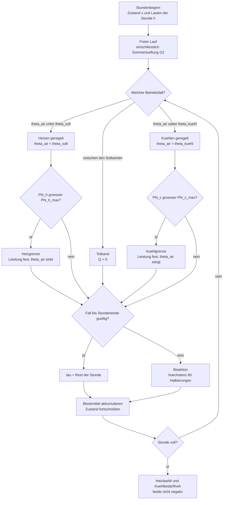
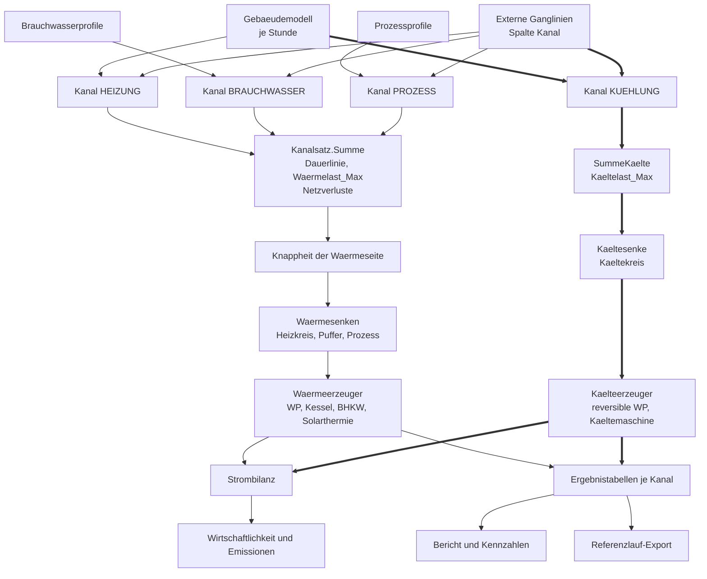
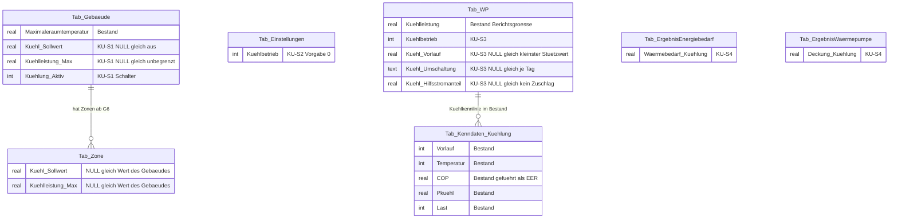
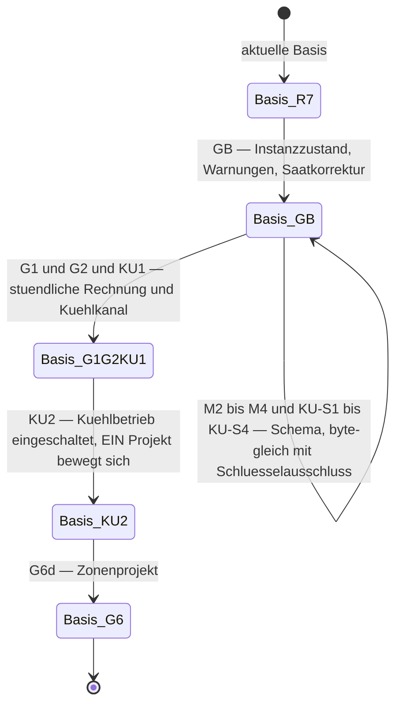

# Konzept: Kühlung in der Gebäudesimulation und in der Simulation von EPOS-Plan

> **Rev. 2 — Korrekturen des Gegenlesens vom 16.09.2026 und Entscheid E15 eingearbeitet,
> Protokoll: [Gegenlesen](Gebaeudesimulation/2026-09-16_Gegenlesen_Kuehlkonzept.md).**

**Auftrag (Anwender, 16.09.2026):** „Q8: Kühlung aufnehmen, konzept dazu erweitern."
Daraus ist **Entscheid E12** geworden: Kühlung wird als vierter Kanal aufgenommen, und ihr
Bedarf wird durch Kälteerzeuger gedeckt
([Konzept](Konzept_Gebaeudesimulation_VDI6007_EPOS-Plan.md), Nachtrag N1.18).

**Stand:** 16.09.2026. **Fassung:** Rev. 2 — gegengelesen aus drei Blickwinkeln (Bestand,
Konsistenz, Entscheid E15), 26 Befunde eingearbeitet; zur Entscheidung vorgelegt.

**Zweck.** Dieses Papier ist das in N1.18 angekündigte eigene Konzept. Es beschreibt, was der
Kühlkanal vom Gebäudemodell bis zum Wiki bedeutet: Rechenweg, Kanalarchitektur, Kälteerzeuger,
Strom und Wirtschaftlichkeit, Datenmodell, Dialogführung, Import und Export, Nachweis und
Regressionsnetz, eine Stufung KU0–KU3 und die Fragen K1–K23 mit Empfehlung. **Es entscheidet
nichts, was der Anwender zu entscheiden hat** — Kapitel 12 trennt „jetzt zu entscheiden" von
„technische Festlegung zur Kenntnis".

**Es steht neben, nicht über den Schwesterpapieren:**

| Papier | Was dort steht, worauf dieses Papier aufsetzt |
|---|---|
| [Konzept Gebäudesimulation](Konzept_Gebaeudesimulation_VDI6007_EPOS-Plan.md) | Physik und Regelung (4.5), Ergebnisreihen (4.6), Bericht (9), Abgrenzung (15), Entscheide E1–E15 (Nachtrag 1; E12 in N1.18, **E15 in N1.20**) |
| [Umsetzungskonzept](Umsetzungskonzept_Gebaeudesimulation_VDI6007_EPOS-Plan.md) | Einbindung in den Kern (1.4–1.8), der Gebäude-Schemaschritt (1.6), Gebäudedialog (2), Reihenfolge und Abnahme (4) |
| [Systementwurf](Systementwurf_Gebaeudesimulation_EPOS-Plan.md) | Anforderungen F1–F17 / N1–N10 / B1–B14, Datenfluss (3), Speicherung (5), Einfrierkette (8.3), Abwägung 10 |
| [Softwarearchitektur](Softwarearchitektur_Gebaeudesimulation_EPOS-Plan.md) | Datenmodell (2.2), Dialogführung (3), Bericht und Kennzahlen (4.3), Referenzlauf-Export (4.4) |
| [Rechenschritte](Rechenschritte_Gebaeudesimulation_VDI6007_EPOS-Plan.md) | Schritt F (Stundenschleife, Umschaltung, Bisektion) und Schritt G (Reihen, Kennzahlen) |
| [Mehrzonenmodell](Konzept_Mehrzonenmodell_IFC_EPOS-Plan.md) | Reihen und Kennzahlen je Zone (7), Abgrenzung (12) |
| [Datenaustauschkonzept](Konzept_Datenaustausch_gbXML_IFC_EPOS-Plan.md) | Kühlsollwerte aus gbXML und IFC, `EPOS_Ergebnis`, `Results` |
| [Befund W](Gebaeudesimulation/2026-09-16_Befund_W_Kuehlung_Bestand.md) | der Bestand: 19 belegte Stellen, Kühlkenndaten der Wärmepumpen, Referenzlauf-Grenze, Größenordnung |

**Was dieses Papier nicht tut.** Es nennt keine Ergebniswerte der VDI-6007-Testbeispiele und
nichts aus VDI 6020:2022 (E6). Es setzt keine Beschaffung von Datenträgern oder
Testreferenzjahren voraus (E5). Es öffnet die Testdatenbank nicht. Es entwirft keine
Kältetechnik über das hinaus, was ein Energiekonzept braucht — die Grenze steht in Kapitel 14.

---

## 0. Das Ergebnis in sechs Punkten

1. **Kühlung ist ein Kanal, aber keine Wärme.** Der vierte Kanal `KUEHLUNG` tritt in
   `SimulationKanaele` neben `HEIZUNG`, `BRAUCHWASSER` und `PROZESS` — er teilt Vektorstruktur,
   Persistenz und Kennzahlenrechnung mit ihnen, **aber nicht die Erzeugerkaskade**. Ein
   Heizkessel deckt keinen Kältebedarf. Die Architektur ist deshalb: **ein Kanalfeld, zwei
   Deckungswelten** (Kapitel 4).
2. **Zwei Stellen ziehen sich gerade *nicht* selbst mit, obwohl sie über `Kanal.ANZAHL`
   geschrieben sind** — und beide sind still. Beide gehören zu **`Kanalsatz`**, der produktiven
   Mehrkanalklasse (`EPOS.Kern/Allgemein/Simulation/SimulationKanaele.cs:598-996`):
   `Kanalsatz.Summe()` (`:645-656`), die Quelle von Dauerlinie, Monatswerten und
   **`Waermebedarf_Max`** (`SimulationWaermebedarf.cs:401`), und `Kanalsatz.NetzverlusteVerteilen`
   (`:686-716`), die die Wärmenetzverluste proportional auf alle Kanäle verteilt. Ohne
   Ausnahmeregel legt ein Kühlkanal jeden Wärmeerzeuger jedes Projekts neu aus und schiebt ihm
   Netzverluste zu, die es nicht gibt. Das ist **der teuerste Fehler dieses Vorhabens**, und er
   erzeugt keine einzige Compilermeldung (4.2). **Nicht zu verwechseln** mit der zweikanaligen
   Altklasse `Waermekanaele` (`:28-409`) und ihrem eigenen `Summe()` (`:48-54`): Sie hat keinen
   produktiven Aufrufer mehr und ist von der Kühlung nicht betroffen.
3. **Der Kühlbedarf des Gebäudemodells ist heute keine Auslegungsgröße.** Er ist die Kappung an
   `Tab_Gebaeude.Maximaleraumtemperatur`: ideale Kühlung ohne Leistungsgrenze, ohne eigenen
   Sollwert, ohne Nachtlüftung (Konzept 4.5). Damit er einen Erzeuger tragen kann, braucht er
   **einen eigenen Kühlsollwert, eine Kühlleistungsgrenze und die Sommerlüftung aus G2** — sonst
   wird ein Kälteerzeuger auf eine nachweislich überzeichnete Last ausgelegt (Kapitel 3).
4. **Der Kälteerzeuger steht zur Hälfte schon da und wird nicht gerechnet.** Jede Wärmepumpe kann
   eine Kühlleistung und eine Kühlkennlinie führen — importiert, gefiltert, gezeichnet — und
   **keine Zeile der Simulation liest sie** (Befund W 2.2, 2.3). KU2 macht aus vorhandenen Daten
   einen Rechenweg; das ist der billigste Teil des Vorhabens und zugleich der mit dem größten
   sichtbaren Gewinn. **Entscheid E15** setzt den Rahmen davor: Der Anwender soll die kühlfähigen
   Maschinen im Katalog **finden** und ihren Kühlbetrieb **einstellen** können — Abschnitt 5.0
   führt beides zusammen und zeigt, dass „kühlfähig" zwei verschiedene Dinge heißt.
5. **Der Referenzlauf setzt die Reihenfolge, nicht die Bequemlichkeit.** Der Vergleich kennt
   **zwei verschiedene Lagen**: Eine **Datei**, die nur im neuen Lauf liegt, bekommt die höchste
   Schwere und ist FAIL — **dagegen gibt es keinen Schalter**
   (`Referenzlauf/Vergleich.cs:183-190`). Ein neuer **Schlüssel** in `aggregate.csv` lässt sich
   dagegen mit `--ohne` ausdrücklich benennen und ausnehmen (`:47-59`, `:61-62`, `:74-79`,
   `:225`, `:250`) — ein Werkzeug für einen **erklärten** Unterschied, kein Weg,
   Abweichungen wegzuschalten. Deshalb gehört **KU1 aus einem anderen Grund** in denselben
   Einfrierschritt wie G1 + G2: wegen der neuen **Datei**, nicht wegen der Schlüssel — zwei
   Neu-Einfrierungen für dieselbe Sache sind der einzige vermeidbare Posten der Rechnung
   (Kapitel 10).
6. **Vier Stufen, rund 47–74 PT, davon KU1 in der laufenden G-Kette.** KU0 schreibt die Papiere
   fort, KU1 öffnet den Kanal (ungedeckt), KU2 bringt die reversible Wärmepumpe samt
   Katalogauswahl (E15), KU3 das Umfeld — Kältemaschine samt Rückkühlung, freie Kühlung,
   Kältespeicher, Zonen (Kapitel 11).

---

## 1. Auftrag und Einordnung

### 1.1 Was bisher galt

Die erste Fassung des Gebäudekonzepts hat Kühlung ausdrücklich **nicht** als Kanal geführt.
Drei Stellen sagten dasselbe:

- **Konzept 13, Q8:** „Kühlung als vierter Kanal? **Nein — informativ** (Kühlenergie, Stunden);
  ein Kanal ist ein eigenes Konzept."
- **Konzept 4.5:** die Kappung an `Maximaleraumtemperatur` als ideale Kühlung, „die dafür nötige
  Leistung wird als Reihe `Kuehlbedarf` geführt — **informativ**, kein vierter Kanal".
- **Konzept 15:** „Kühlung als Kanal und Kältemaschinen" in der Abgrenzung; dazu
  [Systementwurf](Systementwurf_Gebaeudesimulation_EPOS-Plan.md) **B9** („Drei Kanäle — und
  Kühlung ist keiner") und **Abwägung 10**, sowie
  [Softwarearchitektur](Softwarearchitektur_Gebaeudesimulation_EPOS-Plan.md) 3.5 („Informative
  Reihe, kein vierter Kanal") und [Mehrzonenkonzept](Konzept_Mehrzonenmodell_IFC_EPOS-Plan.md) 12.

### 1.2 Was E12 ändert

E12 hebt **eine** Zeile auf, und zwar die entscheidende: der Kühlbedarf wird gedeckt. Daraus
folgt alles Weitere — ein Kanal, der gedeckt wird, braucht Erzeuger, Strom, Kosten, Emissionen,
Kennzahlen, Bericht, Dialoge und einen Platz im Regressionsnetz.

| Ebene | Vorher | Nach E12 |
|---|---|---|
| Gebäudemodell | Reihe `KuehlbedarfKwh`, informativ | **Bedarfsgröße** mit eigenem Sollwert und eigener Leistungsgrenze |
| Rechenkern | drei Kanäle | **vier** Kanäle, zwei Deckungswelten |
| Erzeuger | keiner kennt Kälte | reversible Wärmepumpe (KU2), Kältemaschine (KU3) |
| Wirtschaftlichkeit | kein Kältestrom | eigene Verbrauchsposition, eigene Komponente |
| Bericht | zwei informative Kennzahlen | Kanalzeile, Deckungsbild, Kältekennzahlen |
| Regressionsnetz | dreizehn Projekte ohne Kühlung | ein Referenzprojekt mit Kühlung, neue Einfrierregel |

### 1.3 Was ausdrücklich **nicht** aufgehoben wird

E12 nennt eine Zeile der Abgrenzung. Die übrigen Ausschlüsse aus Konzept 15 bleiben und werden
hier **bestätigt** (Kapitel 14 führt sie vollständig):

- **Feuchte und Entfeuchtung.** Die latente Last ist nicht Gegenstand der VDI 6007 Blatt 1; das
  Modell rechnet **sensible** Kälte. Ein Kühlkanal ohne Entfeuchtung ist eine Teilmenge des
  anlagentechnischen Kältebedarfs, und das gehört im Bericht und im Wiki als Grenze benannt
  (**K5**).
- **Bauteilaktivierung** (Kühldecke, Flächenkühlung) als Funktion. Testbeispiel 11 ist ein
  **Prüffall**, kein Produktmerkmal (Ausblick in 3.6).
- Sommerlicher Wärmeschutz als Nachweis nach DIN 4108-2, Nachweise nach GEG oder DIN V 18599,
  Kopplung von Vorlauftemperatur und Erzeugerfahrplan an die Raumtemperatur.

### 1.4 Drei Begriffe, die in diesem Papier auseinandergehalten werden

Die Umgangssprache nennt alles drei „Kühlung". Die Rechnung darf das nicht.

| Begriff | Was gemeint ist | Wo er entsteht | Einheit |
|---|---|---|---|
| **Kühlbedarf des Gebäudes** (Kältebedarf) | die Wärme, die dem Raum entzogen werden muss, damit er den Kühlsollwert hält — die Last, **bevor** eine Anlage sie deckt | Gebäudemodell, Schritt F; oder externe Ganglinie | kWh je Stunde, **positiv** |
| **Kälteerzeugung** | die Kältemenge, die ein Erzeuger in dieser Stunde tatsächlich bereitstellt — begrenzt durch Leistung, Temperaturlage und Betriebsart | Kälteerzeugerrechnung, KU2/KU3 | kWh je Stunde |
| **Kältestrom** | die elektrische Arbeit, die die Kälteerzeugung kostet — Kältemenge geteilt durch EER, zuzüglich Hilfsantriebe | Strombilanz | kWh je Stunde |

Die drei Größen sind **nie** gleich: Kühlbedarf ≥ Kälteerzeugung (Unterdeckung ist zulässig und
wird benannt), und Kältestrom ist eine andere Energieform. Wo eine Kennzahl nur „Kühlung" heißt,
ist sie falsch benannt.

---

## 2. Anforderungen

Zählung **F-K…** (funktional), **N-K…** (nichtfunktional), **B-K…** (Randbedingung) — in der
Form des [Systementwurfs](Systementwurf_Gebaeudesimulation_EPOS-Plan.md) 1, damit beide Papiere
später zusammenwachsen können, ohne dass Nummern kollidieren.

### 2.1 Funktionale Anforderungen

| # | Anforderung | Quelle | Nachweis | Stufe |
|---|---|---|---|---|
| **F-K1** | Je Gebäude ist ein **Kühlsollwert** eingebbar; NULL bedeutet „Kühlung aus", und der Rückfall auf `Maximaleraumtemperatur` ist **ausdrücklich**, nicht still | E12; Konzept 4.5 | Datenbankfall: NULL ergibt keinen Kühlbedarf im Kanal | KU1 |
| **F-K2** | Je Gebäude ist eine **Kühlleistungsgrenze** eingebbar (NULL = unbegrenzt) — das Gegenstück zu `Heizleistung_Max` (Q7, E-Tabelle N1.17) | Befund W 4.2 | Rechenprobe: mit Grenze steigt θ_air über den Sollwert, Kühlbedarf gekappt | KU1 |
| **F-K3** | Der **Kühlbedarf je Stunde** steht als eigener Kanal `KUEHLUNG` im Kanalsatz, positiv geführt | E12 | Kanalsummenprobe; Wächter „Kühlkanal nie negativ" | KU1 |
| **F-K4** | Der Kühlkanal geht **nicht** in `Kanalsatz.Summe()`, nicht in `Waermebedarf_Max`, nicht in die Dauerlinie und nicht in `Kanalsatz.NetzverlusteVerteilen` ein | 4.2 | Referenzlauf: Projekte ohne Kühlung byte-gleich; Projekt mit Kühlung hat unveränderte `Waermelast_Max` | KU1 |
| **F-K5** | Eine **externe Ganglinie** darf den Kanal `Kühlung` tragen — Kältebedarf ohne Gebäudemodell | K3 | Datenbankfall über `Z_ProjektWaermebedarf.Kanal` | KU1 |
| **F-K6** | Der Kühlbedarf wird von **Kälteerzeugern gedeckt**; Wärmeerzeuger können ihn nicht decken, und das ist erzwungen, nicht verabredet | E12 | **Kälteprobe je Stunde** im Lauf (Muster `SimulationWaermebedarf.Energieprobe`, `:390`, `:458`): kein Wärmeerzeuger schreibt in `Deckung_Kuehlung`. Die **statischen** Zusicherungen (Kanallisten disjunkt und vollständig, Ziel ↔ Senke der Kälteseite) stehen daneben im Selbsttest (4.4) | KU2 |
| **F-K7** | Eine **reversible Wärmepumpe** deckt Kälte über die vorhandene Kühlkennlinie (`Tab_Kenndaten_Kuehlung(_STAMM)`: `Vorlauf`, `Temperatur`, `COP`, `Pkuehl`, `Last`), und der **Kühl-Vorlauf** wählt die Kennlinie so, wie der Heizvorlauf es auf der Wärmeseite tut | Befund W 2.1 | Rechenprobe gegen Handrechnung an einer Stützstelle, **je Vorlauf** | KU2 |
| **F-K8** | Eine Stunde ist **entweder** Heiz- **oder** Kühlbetrieb je Erzeuger; die Umschaltregel ist benannt und deterministisch | K-Frage K8a | Probe: Stunde mit Heiz- und Kühlbedarf, Erzeuger deckt genau eines | KU2 |
| **F-K9** | Der **Kältestrom** ist eine eigene Verbrauchsposition je Komponente, getrennt vom Wärmepumpenstrom | Befund W 3.2 | `aggregate.csv` führt den Posten; Strombilanz schließt | KU2 |
| **F-K10** | Kältestrom geht in **Wirtschaftlichkeit und Emissionen** ein, über denselben Stromträger wie der Wärmepumpenstrom | K9 | Rechenprobe: Betriebskosten steigen um Strommenge × Arbeitspreis | KU2 |
| **F-K11** | **Kennzahlen**: Jahreskälte, Kältespitze, Vollbenutzungsstunden Kälte, Jahresarbeitszahl Kälte (EER-Jahreswert), Deckungsgrad des Kühlkanals | Konzept 9; Befund W 3.1 | Berichtsprobe; Katalogeintrag je Kennzahl in beiden Sprachen | KU2 |
| **F-K12** | **Unterdeckung** des Kühlkanals ist eine **benannte** Meldung, kein stiller Rest | Hausregel `EPOS.Kern/CLAUDE.md` | Probe: Bedarf ohne Erzeuger ergibt Warnung, nicht 0 | KU1 |
| **F-K13** | **Import**: Kühlsollwerte aus gbXML (`Zone/DesignCoolT`) und IFC (`Pset_SpaceThermalRequirements.SpaceTemperatureSummerMax`) landen im Kühlsollwertfeld, mit Herkunftsmarke | Datenaustausch 3, 6.3 | Importprobe; Herkunftsspalte gefüllt | KU2 |
| **F-K14** | **Export**: Kühlenergie steht in `EPOS_Ergebnis` (IFC) und — sofern G7b gebaut wird — als `resultsType CoolingLoad` in gbXML | Datenaustausch 5.6, 6.4 | Rundlaufprobe | KU3 |
| **F-K15** | **Mehrzonen**: Kühlbedarf entsteht je Zone; in den Kanal geht die Gebäudesumme, und gleichzeitiges Heizen und Kühlen wird **ausgewiesen, nicht saldiert** | Mehrzonen 7; K6 | Probe: zwei Zonen, eine heizt, eine kühlt — beide Kanäle tragen ihren Betrag | KU3 |
| **F-K16** | **Bericht**: eine Kanalzeile Kühlung, ein Kühlbild (Monatsstapel bzw. Jahresganglinie), der Deckungsanteil je Kälteerzeuger | Konzept 9; N1.18 | Berichtsprobe; `Proben/ChartProben` grün | KU2 |
| **F-K17** | Der Anwender kann im **Katalog gezielt Wärmepumpen mit Kühlfunktion auswählen** und ihren Kühlbetrieb je Anlage konfigurieren; die Übernahme in das Projekt bringt die Kühlkennlinie mit | **E15** | Katalogprobe (Filter findet genau die kühlfähigen Sätze); Datenbankfall „Katalogübernahme kopiert die Kühlkennlinie vollständig" (10.3) | KU2 |

### 2.2 Nichtfunktionale Anforderungen

| # | Anforderung | Maß | Nachweis |
|---|---|---|---|
| **N-K1** | **Referenzbasis** — jede Stufe rechnet gegen die aktuelle Basis; eine neue Datei ohne Bedingung ist FAIL | `GESAMT: PASS` | Referenzlauf je Merge |
| **N-K2** | **Determinismus** — zwei Läufe byte-gleich, auch mit Kühlung | 13 von 13 | Protokollzeile des Referenzlaufs |
| **N-K3** | **Rückwärtsverträglichkeit** — ein Projekt **ohne** Kühlung rechnet nach KU1 und KU2 **byte-gleich** wie vorher | 12 von 13 Projekten unberührt | Vergleich je Projekt |
| **N-K4** | **Plattformgleichheit** — alle Kühlfelder sind auf iOS erreichbar oder **benannt** abgelehnt | keine stumme Absage | iOS-Navigationszeile je Maske |
| **N-K5** | **Zweisprachigkeit** — jeder neue Anzeigetext und jede Meldung in beiden `.resx`, danach `Werkzeuge/ResourceDesigner` | vollständig | Wächter und Designerlauf |
| **N-K6** | **Einheitenwächter** — Zeitreihen in kWh mit Einheit im Namen, Jahressummen in MWh; keine nackten Faktoren 1 000 in Hülle oder Anzeige | grün | `EinheitenWacheTests`, `DoubleWacheTests` |
| **N-K7** | **Rechenzeit** — die Kälterechnung bleibt im Budget des Laufs; sie ist eine Stundenschleife ohne Iteration | Zuwachs ≤ 0,05 s im CI-Lauf | Laufzeitzeile des Referenzlaufs |
| **N-K8** | **Keine zweite Wahrheit** — Kältepreis, Emissionsfaktor und Stromträger kommen aus denselben Quellen wie die Wärmeseite | eine Quelle je Größe | Prüfung im Auflöser |

### 2.3 Randbedingungen

| # | Randbedingung | Wirkung |
|---|---|---|
| **B-K1** | **E12** ist verbindlich; **E5** (keine Datenträger, keine TRY), **E6** (nichts aus VDI 6020:2022 in Code, Tests, Wiki, Bericht, Auslieferung), **E10** (Produktausweis im Wortlaut) gelten unverändert | keine neuen Normbeschaffungen; keine Normzahlen in diesem Papier |
| **B-K2** | **E1** — das Stundenmodell ist Vorgabe; nur es liefert Kühllast je Stunde | KU1 setzt G1 voraus |
| **B-K3** | **E7** — Einzonen zuerst; Mehrzonen sind Stufe G6 | Kühlung je Zone ist KU3, nicht KU1 |
| **B-K4** | [**ADR-001**](ADR-001_Schema-Ausrollung.md) — jede Schemaänderung ist ein nummerierter Schritt über `SchemaMigration`; drei Eintragungen je neuer Tabelle (Schritt, Auslieferungsvorlage, Schemapflege der Testdatenbank) | die Kühlschritte sind nummerierte Schritte, keine tolerante Migration |
| **B-K5** | [**ADR-002**](ADR-002_Stundenmodell_VDI6007_Einbindung.md) — eine Naht, kein zweiter Rechenweg | die Kälterechnung hängt an derselben Verzweigung, nicht an einer zweiten |
| **B-K6** | [**ADR-005**](ADR-005_Zonenkopplung_Mehrzonenmodell.md) — Zonenkopplung über die Nachbarraum-Randbedingung | die Zonenkühlung folgt demselben Lösungsschema |
| **B-K7** | **Hausregeln der vier `CLAUDE.md`** — Fachänderung einmal im Kern, keine Datenbank in der Oberfläche, Umgebung nur über `Dienste.*`, nichts Fachliches in `EPOS.iOS` | der Kältekern ist plattformfrei |
| **B-K8** | **SQLite**, `STRICT`, Beziehungen über IDs, Boolean als 0/1 mit `CHECK (spalte IN (0,1))`, Zugriff über `DataRepository` mit `?`-Parametern; nach jeder Anweisung der `SqlDialektPruefer` ([`BETRIEB_SQLITE.md`](BETRIEB_SQLITE.md) § 6) | keine neuen Textverweise |
| **B-K9** | **Drei feste Raster** — 8 760 Stunden, 365 Tage, 12 Monate, kein Schaltjahr; dazu 168 Wochenstunden für Profile | der Kühlsollwert folgt demselben Raster wie die Heizsollwerte |
| **B-K10** | **CI-Kontingent und Rückfragepflicht** vor jedem macOS-, iOS- und Setup-Lauf | der Nachweis der Kühlstufen liegt auf `kern.yml` (ubuntu) |
| **B-K11** | **Persistenzwerte sind eingefroren und ASCII** — wie `KANAL_PROZESS = "Prozesswaerme"` (`EPOS.Kern/Allgemein/DbWerte.cs:1271`), bewusst ohne Umlaut, weil in SQL verglichen | der neue Wert heißt `"Kuehlung"`, nicht `"Kühlung"` |

---

## 3. Rechenweg im Gebäudemodell

### 3.1 Der Bestand des Entwurfs — und was ihm fehlt

Schritt F der [Rechenschritte](Rechenschritte_Gebaeudesimulation_VDI6007_EPOS-Plan.md) kennt die
Kühlung bereits als **vierten Betriebsfall** der Stundenschleife. Der Betriebsfall wird je
Abschnitt gewählt, seine Gültigkeit über ein Verletzungsmaß geprüft, und der Umschaltzeitpunkt
per Bisektion gesucht (höchstens 60 Halbierungen, deterministisch — die **einzige** Iteration des
Modells). Vier Fälle stehen dort:

| Fall | Bedingung | Regel | Gültig solange |
|---|---|---|---|
| geregelt | 0 ≤ Φ_h ≤ Φ_h,max | θ_air = θ_soll | 0 ≤ Φ_h(x) ≤ Φ_h,max |
| Grenze oben | Φ_h > Φ_h,max | Leistung fest | θ_air(x) ≤ θ_soll |
| frei | Φ_h < 0 und θ_air im freien Lauf ≤ θ_max | Q = 0 | θ_air(x) ≥ θ_soll |
| **Kühlung** | Φ_h < 0 und θ_air im freien Lauf > θ_max | θ_air = θ_max | θ_air(x) ≤ θ_max |

Was dem Bestand des Entwurfs fehlt, ist **nicht die Physik**, sondern die Parametrierung: Der
Kühlfall regelt auf `Maximaleraumtemperatur` — eine Obergrenze des Komfortbands ohne Zeitprofil —,
und er kennt **keine** Leistungsgrenze. Die Heizseite hat vier Sollwerte (Tag, Nacht,
Wochenende, Ferien, `sql/schema/001_grundschema.sql:1147-1150`) und mit E12/Q7 eine
Leistungsgrenze; die Kühlseite hat einen Wert und keine Grenze
(`sql/schema/001_grundschema.sql:1151`).

### 3.2 Zwei Sollwerte, zwei Grenzen — das Zielbild

Die Regelung bekommt ein **zweites Sollwertpaar**. Sie bleibt ideal und kontinuierlich, und sie
bleibt die Regelung der Richtlinie — nur ihre Grenzen werden eingebbar:

```
Heizen:  theta_soll aus Tag / Nacht / Wochenende / Ferien     Phi_h in [0 , Phi_h_max]
Kuehlen: theta_kuehl (NULL = Maximaleraumtemperatur)          Phi_c in [0 , Phi_c_max]
Totband: theta_soll < theta_air < theta_kuehl  ->  freier Lauf, Q = 0
```

Damit entstehen **fünf** Betriebsfälle statt vier: der Kühlfall spaltet sich in „Kühlung
geregelt" und „Kühlgrenze erreicht". Die Gültigkeitsregel des neuen Falls ist das Spiegelbild der
Heizgrenze:

| Fall | Regel | Verletzungsmaß v (gültig, solange v ≤ 0) |
|---|---|---|
| Kühlung geregelt | θ_air = θ_kuehl | max( Φ_c(x) − Φ_c,max , 0 − Φ_c(x) ) |
| Kühlgrenze oben | Φ_c fest auf Φ_c,max | θ_kuehl − θ_air(x) |

**Das Totband ist neu und wichtig.** Heute fallen Heizgrenze und Kühlgrenze in einer Größe
zusammen, weil `Maximaleraumtemperatur` nur kappt. Mit zwei Sollwerten entsteht ein Bereich, in
dem weder geheizt noch gekühlt wird — physikalisch richtig und der Normalfall in der
Übergangszeit. **Dieses Totband ist kein Reglertotband** (das bleibt ausgeschlossen, Konzept 4.5):
es ist der Abstand zweier Sollwerte, nicht die Hysterese eines Reglers.

**Prüfregel.** `theta_kuehl ≥ theta_soll,max + 1 K` ist eine **harte** Plausibilitätsprüfung mit
benanntem Fehler (Q18-Regel für den Stundenweg). Ein Kühlsollwert unter dem höchsten
Heizsollwert lässt Heizung und Kühlung gegeneinander arbeiten — das ist keine Auslegung, das ist
ein Eingabefehler.

### 3.3 Vorzeichen: die Norm innen, der Betrag außen

Die Richtlinie führt **Φ_h > 0 = Heizen, Φ_h < 0 = Kühlen** (Rechenschritte 4.3). Ein Kanal mit
negativen Werten bräche jede Summen-, Deckungs- und Dauerlinienrechnung des Bestands — und zwar
still, weil `double` kein Vorzeichen prüft.

**Festlegung (K2).** Die Vorzeichenkonvention der Norm gilt **im Löser** und nirgends sonst. An
der Grenze des Gebäudemodells — beim Ablegen in `GebaeudeModellErgebnis` — wird der Betrag
genommen:

```
HeizlastW[h]       = max( Phi_h(h) , 0 )           [W]   -> Kanal HEIZUNG  (ueber WattToKw)
KuehlbedarfKwh[h]  = max( -Phi_h(h) , 0 ) / 1000   [kWh] -> Kanal KUEHLUNG
```

Daraus folgen zwei Zusicherungen, die als Wächter zu bauen sind: **beide Reihen sind nie
negativ**, und **in keiner Stunde sind beide gleichzeitig größer null** (im Einzonenfall; der
Mehrzonenfall ist 3.5). Die zweite ist die schärfere — sie fällt, sobald jemand Heiz- und
Kühlsollwert falsch parametriert, und sie fällt laut.

### 3.4 Sommerlüftung und Nachtlüftung stehen **vor** der Kühlung

Das ist die wichtigste Reihenfolgeregel dieses Papiers, und sie ist keine Modellierungsfrage,
sondern eine Frage der Auslegungsgröße.

Konzept 14 führt als Risiko: „Überhitzungsstunden ohne Nutzerlüftung … **Kühlkennzahl in G1
überzeichnet**", Gegenmaßnahme: „Sommerlüftungsregel in G2; Kennzahl bis dahin als vorläufig
gekennzeichnet". Solange die Kühlkennzahl informativ war, war „vorläufig" eine
Kennzeichnungsfrage. **Für einen Erzeuger ist sie eine Auslegungsfrage.** Wer eine Kältemaschine
auf eine Last legt, die entsteht, weil niemand nachts ein Fenster öffnet, kauft eine Maschine, die
es nicht braucht.

Deshalb gilt:

1. Die **Reihenfolge je Stunde** ist: freier Lauf → Sommer-/Nachtlüftung (erhöhter Luftwechsel,
   wenn die Regel greift) → **erst dann** Kühlbedarf. Die Lüftung ist Teil des freien Laufs, nicht
   eine Deckung des Kühlbedarfs.
2. Die Regel selbst steht in **G2** (`Luftwechsel_Infiltration`, `Luftwechsel_Nutzer`,
   `Sommerlueftung` — die drei G2-Spalten, Umsetzungskonzept 1.7). **KU2 setzt G2 voraus** —
   nicht KU1: KU1 zeigt den Kanal, KU2 legt den Erzeuger aus.
3. Die **freie Kühlung** über erhöhten Luftwechsel ist damit eine **Gebäudemaßnahme, kein
   Erzeuger** (5.4). Sie erscheint nirgends als Deckung, sondern als geringerer Bedarf.

### 3.5 Zonen, die gleichzeitig heizen und kühlen (K6)

Das Mehrzonenmodell rechnet Kühlbedarf **je Zone**
([Mehrzonenkonzept](Konzept_Mehrzonenmodell_IFC_EPOS-Plan.md) 7); in den Kanal geht die
Gebäudesumme. Für die Kühlung ist „Summe" aber zweideutig, sobald eine Südzone kühlt, während
eine Nordzone heizt.

**Empfehlung: nicht saldieren, beides führen, den Fall ausweisen.**

```
Kanal HEIZUNG [h]   = Summe ueber Zonen von max( Phi_h,z(h) , 0 )
Kanal KUEHLUNG [h]  = Summe ueber Zonen von max( -Phi_h,z(h) , 0 )
```

Eine Saldierung (Heizlast minus Kühllast) wäre physikalisch falsch: Die Wärme der Nordzone
erreicht die Südzone nicht, und wer sie verrechnet, erfindet eine Wärmerückgewinnung, die es
nicht gibt. Der Preis ist, dass Heiz- und Kühlkanal in derselben Stunde tragen können — genau
der Fall, den die Zusicherung aus 3.3 im Einzonenfall ausschließt. Deshalb:

- Die Zusicherung „nie beide gleichzeitig" gilt **je Zone**, nicht je Gebäude.
- Eine **Kennzahl „Stunden mit gleichzeitigem Heizen und Kühlen"** weist den Fall aus. Sie ist
  keine Nebensache: Ein hoher Wert heißt entweder falsche Zonierung oder ein Gebäude, das
  wirklich beides braucht — und beides muss der Planer sehen.
- Im **Einzonenfall** bleibt die Kennzahl 0, und der Wächter aus 3.3 bleibt scharf.

### 3.6 Was auch im Rechenweg ausgeschlossen bleibt

- **Feuchte, Entfeuchtung, latente Last** (K5). Die gerechnete Kältemenge ist sensibel. Der
  wirkliche Kältebedarf einer Anlage mit Entfeuchtung liegt darüber, in Mitteleuropa je nach
  Nutzung deutlich. **Das gehört in den Bericht, ins Wiki und an die Kennzahl** — nicht als
  Fußnote, sondern als Satz neben der Zahl.
- **Bauteilaktivierung** als Funktion (Kühldecke, Betonkernaktivierung). Das Zwei-Knoten-Netz der
  Richtlinie kennt einen Innenbauteilknoten; eine Kühldecke mit eigenem konvektivem Übergang
  bräuchte einen eigenen Knoten. Genau daran hängt der **einzige noch offene Prüffall**:
  Testbeispiel 11 (Kühldecke) liegt in zwei Umschaltstunden neben dem Band, und die vermutete —
  diagnostisch belegte, nicht bewiesene — Ursache ist der fehlende eigene Deckenknoten
  (Konzept N1.15, Rechenschritte 10.3). **Ausblick, keine Zusage:** Löst G0 diesen Fall über
  einen eigenen Deckenknoten, ist die Bauteilaktivierung als Funktion erstmals in Reichweite —
  sie bleibt gleichwohl außerhalb dieses Papiers (Kapitel 14).
- **Kopplung an den Erzeugerfahrplan.** Das Modell liefert den Bedarf; die Deckung rechnet der
  Simulationskern, wie auf der Wärmeseite. Keine Rückwirkung der Vorlauftemperatur auf die
  Raumtemperatur.

### 3.7 Der Weg einer Stunde, mit Kühlung



---

## 4. Kanalarchitektur

### 4.1 Die Grundentscheidung (K1): ein Kanalfeld, zwei Deckungswelten

Befund W 1.3 stellt die Frage scharf: vierter Kanal im vorhandenen Kanalfeld — oder eine eigene,
parallele Struktur `Kaeltekanaele`? Beide Wege haben ein wahres Argument.

**Welches Kanalfeld gemeint ist.** Die Datei `SimulationKanaele.cs` trägt **zwei** Klassen mit
Kanälen, und nur eine davon ist der Gegenstand dieses Papiers:

- **`Kanalsatz`** (`EPOS.Kern/Allgemein/Simulation/SimulationKanaele.cs:598-996`) — das
  produktive Feld `Bedarf[Kanal.ANZAHL][8760]` mit `Summe()` (`:645-656`) und
  `NetzverlusteVerteilen` (`:686-716`). **Hier entsteht der vierte Kanal.**
- **`Waermekanaele`** (`:28-409`) — die zweikanalige Altklasse (`Heiz`, `WW`) samt eigenem
  `Summe()` (`:48-54`) und ihrem Selbsttest (`:199-406`). Ihr Klassenkopf hält fest, dass
  `Uebernehmen` seit Paket 6 **keinen produktiven Aufrufer** mehr hat; sie bleibt allein als die
  spezifizierte Kanalarithmetik stehen. **Von der Kühlung ist sie nicht berührt.**

| | Vierter Kanal in `Kanalsatz` | Parallele Struktur `Kaeltekanaele` |
|---|---|---|
| **Dafür** | Vektorstruktur, Persistenz, Knappheitsparser, Bedarfskennzahl (`KennzahlenKatalog.BedarfKanal`, `:62-68`) und Ergebnisspalten entstehen **einmal**, nicht zweimal — allein der **Deckungsgrad** braucht einen eigenen Zweig (`DeckungKanal`, `:85-101`; 6.4) | die Bestandsnamen tragen „Wärme" (`WaermesenkeClass`, `Waermebedarf_*`, `Deckung_*`); eine Kältemenge in einer Spalte namens `Waermebedarf_Kuehlung` ist begrifflich schief |
| **Dagegen** | die Summen-, Dauerlinien- und Netzverlustwege des Bestands rechnen **über alle Kanäle** und müssten Ausnahmen bekommen (4.2) | ein zweites Kanalfeld heißt: zweite Persistenz, zweite Knappheit, zweite Kennzahlrechnung, zweiter Export, zweiter Wächtersatz — die doppelte Fläche für dieselbe Aussage |

**Empfehlung: vierter Kanal in `Kanalsatz`** — mit drei Auflagen, die das begriffliche
Argument der Gegenseite auffangen:

1. **Die Deckungsseite wird getrennt, nicht der Bedarf.** Der Kanalsatz ist ein Bedarfsfeld; die
   Kaskade der Wärmeerzeuger läuft über eine Kanalliste, die den Kühlkanal **nicht** enthält, und
   die Kaskade der Kälteerzeuger über eine Liste, die **nur** ihn enthält. Das ist eine Zeile, kein
   Umbau — und sie ist erzwingbar (4.4).
2. **Die Bestandsnamen bleiben, die Dokumentation wird genau.** `Waermebedarf_Kuehlung` als
   Spaltenname ist das Bestandsmuster von Schritt 52 (`SchemaKatalog.cs:2417-2475`,
   Spaltenzeilen `:2447-2469`) und kostet keine Sonderbehandlung in `KanalLesen`
   (`ErgebnisCtrl.cs:1568-1580`). In Dialogen, Bericht und
   Wiki heißt die Größe **„Kühlbedarf"** bzw. **„Kältebedarf"** — dort zählt der Anwenderbegriff,
   im Schema die Gleichförmigkeit (**K13**).
3. **Der Kanalbegriff wird im Kern umbenannt — im Text, nicht im Bezeichner.** Der
   XML-Dokumentationskopf von `Kanalsatz` spricht künftig vom **Bedarfskanal**; die
   Konstanten und Persistenzwerte bleiben eingefroren.

### 4.2 Die zwei Stellen, die sich **nicht** selbst mitziehen

Befund W 1.2 führt die Kanalschleifen als „zieht sich selbst" (Zeile 3 seiner Stellenliste). Das
stimmt **technisch** und ist **fachlich die gefährlichste Zeile des Befunds**. Zwei Stellen laufen
über `Kanal.ANZAHL` und verändern mit einem vierten Kanal ihr Ergebnis, ohne dass jemand sie
anfasst:

**(a) `Kanalsatz.Summe()` — `SimulationKanaele.cs:645-656`.** Ihr eigener Dokumentationskopf
(`:628-644`) sagt, was an ihr hängt: „die Sicht, mit der die (noch) einkanaligen Rechenwege und
**alle Altleser des Gesamtbedarfs** arbeiten (**Dauerlinie, Maximum, Monatswerte**)". Der
Summenvektor geht in `SimulationWaermebedarf` in die Dauerlinie und in
`Waermebedarf_Max = Maximaler_Waermebedarf(Waermebedarf)` (`SimulationWaermebedarf.cs:401`) — und
`Waermelast_Max` ist nach Q7/E-Tabelle N1.17 ausdrücklich „unverändert das Maximum des
Kanalsummenvektors, damit Dauerlinie, Deckung und Anzeige eine Basis behalten".

Läuft der Kühlkanal in diese Summe ein, dann gilt für **jedes** Projekt mit Kühlung: Die
Jahreshöchstlast steigt um den Kältebedarf der betreffenden Stunde, die Dauerlinie wird auf einen
falschen Wert normiert, und **jeder Wärmeerzeuger wird gegen eine Last ausgelegt, die er nicht zu
decken hat**. Kein Test des Bestands schlägt an; der Referenzlauf schlägt an, aber erst, nachdem
die Basis neu eingefroren wurde — und dann sieht es aus wie „das neue Modell rechnet eben
anders".

**(b) `Kanalsatz.NetzverlusteVerteilen` — `SimulationKanaele.cs:686-716`.** Sie verteilt einen konstanten
Stundenbetrag (die Netzverluste des **Wärme**netzes) proportional zu den Kanalbedarfen dieser
Stunde. Mit vier Kanälen bekäme der Kühlkanal einen Anteil der Wärmenetzverluste — eine Größe, die
in einem Kältekreis nichts zu suchen hat, und die den Kältebedarf um genau den Betrag erhöht, um
den sie den Wärmekanälen fehlt.

**Festlegung (F-K4).** Es gibt **zwei** Kanallisten, und sie stehen an einer Stelle:

```csharp
// Die Kanäle der WÄRMEseite - Summe, Dauerlinie, Maximum, Netzverluste, Wärmeerzeugerkaskade.
public static readonly int[] KANAELE_WAERME = { HEIZUNG, BRAUCHWASSER, PROZESS };

// Die Kanäle der KÄLTEseite - eigene Summe, eigenes Maximum, eigene Erzeugerkaskade.
public static readonly int[] KANAELE_KAELTE = { KUEHLUNG };
```

**Warum `KANAELE_WAERME` und nicht `WAERMEKANAELE`.** Der Bezeichner `Waermekanaele` ist im
Rechenkern bereits vergeben — er ist die zweikanalige Altklasse (4.1). Eine Konstante
`WAERMEKANAELE` daneben läse sich wie ihre Kanalliste und ist es nicht. Der Vorsatz `KANAELE_`
stellt beide Listen nebeneinander und hält sie von der Klasse getrennt.

`Kanalsatz.Summe()` und `Kanalsatz.NetzverlusteVerteilen` laufen über `KANAELE_WAERME`, nicht über
`ANZAHL`. Dazu kommt eine `SummeKaelte()` mit eigenem Maximum `Kaeltelast_Max` (**K16**) — die
Auslegungsgröße der Kälteseite, die neben `Waermelast_Max` steht und sie nicht berührt. Der
Selbsttest von `Kanalsatz` (`SimulationKanaele.cs:795` ff.) bekommt die **statische** Zusicherung
`KANAELE_WAERME ∪ KANAELE_KAELTE = alle Kanäle, Schnitt leer` — damit ein fünfter Kanal später
nicht still in keine der beiden Listen fällt. Was ein Selbsttest **nicht** kann, ist eine
Laufaussage über die Deckung; sie gehört in die Probe je Stunde (4.4).

### 4.3 Die Stellenliste aus Befund W, nach Stufen geordnet

**Stellenliste aus Befund W 1.2, neu durchgezählt und um vier ergänzt; die Spalte „Beleg" nennt
die W-Nummer und die Fundstelle.** Hier stehen die Stellen mit der Stufe, in der sie fällig
werden, und mit dem, was dieses Papier daran festlegt. „zieht sich selbst" heißt: über
`Kanal.ANZAHL` geschrieben und ohne Änderung richtig. Alle Zeilenangaben ohne Dateinamen
beziehen sich auf `EPOS.Kern/Allgemein/Simulation/SimulationKanaele.cs`.

| # | Stelle | Beleg (Befund W) | Änderung | Stufe |
|---|---|---|---|---|
| 1 | Kanalindizes und `ANZAHL` | W1 — `SimulationKanaele.cs:429-438` | `KUEHLUNG = 3`, `ANZAHL = 4`, dazu die zwei Kanallisten aus 4.2 | KU1 |
| 2 | Kanalvektoren, Kurzformen (`Kanalsatz`) | W2 — `:614-615`, `:619-626` | zieht sich selbst; Kurzform `Kuehlung` als Komfort | KU1 |
| 3 | **`Kanalsatz.Summe()`** | W3 (herausgelöst) — `:645-656` | **Ausnahme — nur `KANAELE_WAERME`** (4.2) | KU1 |
| 4 | **`Kanalsatz.NetzverlusteVerteilen`** | W3 (herausgelöst) — `:686-716` | **Ausnahme — nur `KANAELE_WAERME`** (4.2) | KU1 |
| 5 | `Clone()`, Abzugsschleifen | W3 — `:651`, `:694`, `:700`, `:725` | zieht sich selbst | KU1 |
| 6 | Text → Index (`Kanal.AusText`) | W4 — `:454-464` | vierter Zweig; **die Vorbelegung bleibt `HEIZUNG`** — ein unbekannter Wert darf nie in den Kühlkanal fallen | KU1 |
| 7 | Index → Text (`Kanal.Name`) | W4 — `:467-475` | vierter Zweig | KU1 |
| 8 | Persistenzwert | W5 — `DbWerte.cs:1260-1271` | `KANAL_KUEHLUNG = "Kuehlung"` — ASCII, eingefroren (B-K11) | KU1 |
| 9 | Spalte `Z_ProjektWaermebedarf.Kanal` | W6 — `sql/schema/001_grundschema.sql:2916`, `:2921` | kein Schemaschritt (TEXT), ein neuer gültiger Wert (**K3**) | KU1 |
| 10 | Knappheit, Vorbelegung | W7 — `:493` | viertes Glied, **Kühlung zuletzt** (**K4**) | KU1 |
| 11 | **Knappheit, Parser** | W8 — `:530-552` (`ok = teile.Length == ANZAHL`, `:533`), Warnblock `:544-554` | **tolerant machen** statt Daten migrieren (**K14**, 4.5) | KU1 |
| 12 | Vorgabetext | W9 — `DbWerte.cs:1299-1316` | `"BRAUCHWASSER;PROZESS;HEIZUNG;KUEHLUNG"` | KU1 |
| 13 | Anzeigetexte | W10 — `Resource.resx:9424-9430` | Schlüssel `KANAL_KUEHLUNG_ANZEIGE` in **beiden** Sprachen, danach `ResourceDesigner` | KU1 |
| 14 | Senken-Enum | W11 — `:1112-1148` | neuer Wert **Kältekreis** — kein vierter Fall eines bestehenden | KU2 |
| 15 | Zielwerte der Senkenzuordnung | W12 — `DbWerte.cs:1169-1230`, `WaermesenkeClass.cs:25-50` | Ziel „Kältekreis"; `IstPufferZiel` und `VerwendungZuZiel` bekommen Zweige | KU2 |
| 16 | Aufräumregel unbekanntes Ziel | W13 — `WaermesenkeClass.cs:326-372`, `:720` | ein Kälteziel darf **nicht** auf `ZIEL_HEIZKREIS` zurückfallen — eigener Zweig mit benannter Meldung | KU2 |
| 17 | Pufferverwendung | W14 — `DbWerte.cs:1567-1588`, `SimulationPufferspeicher.cs:19-47` | **entfällt in KU1/KU2** — kein `VERWENDUNG_KAELTE`, solange kein Kältespeicher gebaut wird (**K7**) | KU3 |
| 18 | Klassen-Set des Speichers, Anzeige und Prüfung | W15 — `Warnkriterien.cs:431-437`, `:841-843`, `:528` | mit dem Kältespeicher | KU3 |
| 19 | Selbsttest von `Kanalsatz` | W16 — `:795` ff. | **statische** Zusicherungen: Kanallisten disjunkt und vollständig, Ziel ↔ Senke der Kälteseite (4.4) | KU1/KU2 |
| 20 | **Ergebnispersistenz, Schreibweg** | W17 — `ErgebnisCtrl.cs:187-193` (`VALUES (?,?,?,?,?,?,?,?, ?,?,?)`), `:1550-1558` (`KanalParameter` über `ANZAHL`) | **bricht zur Laufzeit** — vierter Platzhalter je INSERT, Spaltenliste um den vierten Namen erweitert | KU1 |
| 21 | Ergebnispersistenz, Leseweg | W18 — `ErgebnisCtrl.cs:1560-1581` (`KanalLesen`, `DeckungLesen`) | vierter Spaltenname je Aufruf | KU1 |
| 22 | Schema der Ergebnistabellen | W19 — `SchemaKatalog.cs:2417-2475` (Schritt 52, Spaltenzeilen `:2447-2469`) | **sechs neue Spalten** in sechs Tabellen, ein nummerierter Schritt nach ADR-001 (7.4) | KU1 |
| 23 | Wächter mit `Kanal.ANZAHL` | W20 — `SimulationErgebnisCtrlTests.cs:474`, `BhkwLeistungsgrenzeTests.cs:177`, `:307` | ziehen sich selbst — sie prüfen gegen die Konstante | KU1 |
| **24** | **`Warnkriterien.KanalAnzeige`** | **neu** (W10 nennt die Stelle, nicht den Rückfall) — `Warnkriterien.cs:882-890` | `switch` mit `default:` → Heizung. Ohne vierten Zweig trägt eine Kühlmeldung den **Heizungstext** | KU1 |
| **25** | **`Warnkriterien.Set_BedientKanal`** | **neu** — `Warnkriterien.cs:1001-1010` | `switch` mit `default:` → `Set.Heizung`. Ein unbehandelter Kanal meldet „der Speicher bedient ihn" | KU3 |
| **26** | **`SchemaModell.PufferBedient` und `SchemaModell.DirektsenkeBedient`** | **neu** — `SchemaModell.cs:225-236`, `:245-260` | `PufferBedient` fällt über `default:` auf `set.Heizung`; `DirektsenkeBedient` liefert für „Beides" am Ende `return true` — **jeder unbehandelte Kanal gilt damit als bedient** | KU2 |
| **27** | **`PufferSpCtrl.KlassenSet`** | **neu** — `PufferSpCtrl.cs:685-696` | drei `bool`-Felder (`Heizung`, `Brauchwasser`, `Prozess`); ein vierter Kanal braucht ein viertes Feld oder eine benannte Ausnahme | KU3 |

**Die Lehre aus #20.** `KanalParameter` erzeugt `Kanal.ANZAHL` Parameter, die INSERT führen drei
Platzhalter. `ANZAHL = 4` liefert einen **grünen Build und einen roten Lauf**. Deshalb ist die
Reihenfolge innerhalb von KU1 nicht frei: **erst Schema und Persistenz, dann `ANZAHL`.**

**Die Lehre aus #24 bis #27: der stille Rückfall auf Heizung.** Vier Stellen des Bestands
entscheiden über einen Kanal per `switch` mit `default:` bzw. mit einem abschließenden
`return true` — und dieser Ausgang ist überall die **Heizung** bzw. „bedient". Das ist für drei
Kanäle richtig und sparsam; mit einem vierten wird es zu einer falschen Antwort **ohne
Fehlermeldung**: eine Kühlmeldung im Heizungstext, ein Pufferspeicher, der angeblich den
Kühlkanal entlädt. Jede der vier Stellen bekommt deshalb einen **ausdrücklichen** Kühlzweig, und
wo die Kühlung dort (noch) nicht gilt, eine benannte Ablehnung statt eines Rückfalls
(Kapitel 13).

### 4.4 Wie die Trennung der Deckungswelten erzwungen wird

Eine Verabredung, die nur im Papier steht, hält einen Rechenkern nicht. Vier Vorrichtungen machen
sie prüfbar — und **zwei davon sind verschiedener Art**, was in Rev. 1 vermengt war:

1. **Zwei Kanallisten** statt einer Zählung (4.2) — jede Kaskade nennt ihre Liste.
2. **Statische Zusicherungen im Selbsttest.** Der Selbsttest ist ein
   **Invariantentest ohne Laufdaten**: Er läuft nur im Debug-Build, wird **nicht automatisch
   aufgerufen**, und sein Ergebnis steht im Umsetzungsprotokoll — so hält es der Klassenkopf von
   `Waermekanaele.Selbsttest` (`SimulationKanaele.cs:172-199`) ausdrücklich fest, und für
   `Kanalsatz.Selbsttest` (`:795` ff.) gilt dasselbe Muster. Prüfbar ist dort deshalb nur, was
   **ohne** einen Lauf wahr ist: `KANAELE_WAERME ∪ KANAELE_KAELTE` vollständig und disjunkt,
   `Summe()` ohne Kühlanteil, die Abbildung Ziel ↔ Senke der Kälteseite hin und zurück.
3. **Die Laufprüfung gehört in die Probe je Stunde.** Die Aussage „kein Wärmeerzeuger hat in
   `Deckung_Kuehlung` geschrieben" ist eine Aussage über **Ergebnisse eines Laufs**; sie gehört
   dorthin, wo der Bestand seine Energiebilanz prüft: in die **Energieprobe je Stunde**
   (`SimulationWaermebedarf.cs:390` ruft sie, `:458` rechnet sie) bzw. in eine **Kälteprobe**
   nach demselben Muster. Sie zählt die Verletzungen und die größte Abweichung, meldet **einmal
   je Lauf** und setzt das Gesamtergebnis auf **fehlgeschlagen** — dieselbe Schärfe, die die
   Energieprobe des Bestands schon hat. **Nachweis zu F-K6** ist damit die Kälteprobe, nicht der
   Selbsttest.
4. **Die Senke.** `Senke` bekommt den Wert **Kältekreis**; die Aufräumregel für unbekannte Ziele
   (`WaermesenkeClass.cs:326-372`) darf ein Kälteziel **nicht** auf `ZIEL_HEIZKREIS` ziehen —
   heute ist das der stille Rückfall, und er wäre hier ein Fachfehler.



### 4.5 Die Knappheitsreihenfolge (K4 und K14)

Der Parser bricht hart: `ok = teile.Length == ANZAHL` (`SimulationKanaele.cs:533`). Jede
gespeicherte Dreierfolge würde mit `ANZAHL = 4` ungültig, auf die Vorbelegung zurückfallen und
**je Lauf eine Warnung** erzeugen (Warnblock `:544-554`).

Zwei Wege stehen offen:

| Weg | Was zu tun ist | Kosten | Risiko |
|---|---|---|---|
| **(a) Datenmigration** | ein Schemaschritt hängt `;KUEHLUNG` an jede gespeicherte `Tab_Einstellungen.Kanal_Knappheitsreihenfolge` an | ein Schritt, eine Prüfung | ein Anwender mit eigener Reihenfolge bekommt sie still geändert; und derselbe Schritt fällt beim fünften Kanal wieder an |
| **(b) Parser tolerant** | eine gespeicherte **Teilfolge** gültiger, eindeutiger Glieder wird angenommen und in kanonischer Reihenfolge um die fehlenden ergänzt — **ohne Warnung**; eine ungültige oder doppelte Angabe warnt wie bisher | eine Methode, ein Test | die Ergänzungsregel muss deterministisch sein |

**Empfehlung: (b), und (a) entfällt.** Der tolerante Parser ist ergebnisneutral für jede heute
gespeicherte Reihenfolge, spart die Datenmigration und macht jeden weiteren Kanal billig. Der
Vorgabetext wird gleichwohl auf vier Glieder gestellt
(`KNAPPHEIT_DEFAULT = "BRAUCHWASSER;PROZESS;HEIZUNG;KUEHLUNG"`), damit eine neue Datenbank die
vollständige Folge führt.

**Wo Kühlung steht (K4): zuletzt.** Die Begründung ist nicht Rangfolge, sondern Bedeutungslosigkeit
— die Knappheitsreihenfolge regelt, welcher Kanal bei knapper **Wärme**erzeugung zuerst bedient
wird, und daran ist die Kälteseite unbeteiligt. Das vierte Glied ist ein Platzhalter, damit die
Folge vollständig ist. Es steht hinten, weil es dort am wenigsten stört, und sein Rang wird in der
Oberfläche **nicht** zur Bearbeitung angeboten (8.4).

### 4.6 Senken, Ziele und der Kältespeicher (K7)

Der Bestand kennt `Senke` mit Heizkreis, drei Pufferzielen und Prozesswärme
(`SimulationKanaele.cs:1112-1148`). Die Kälteseite braucht **einen** neuen Wert:

- **Ziel „Kältekreis"** (`WS_ZIEL_KAELTEKREIS`) — die direkte Übergabe an den gekühlten Raum.
  Damit ist die Kälteseite in KU2 vollständig: Erzeuger → Kältekreis → Kanal.
- **Ziel „Kältespeicher"** — **entfällt in KU1 und KU2.** `SimulationPufferspeicher` kennt
  Heizung, Brauchwasser, Kombi und Quelle (`SimulationPufferspeicher.cs:19-47`); ein
  `VERWENDUNG_KAELTE` wäre ein
  Persistenzwert ohne Rechenweg, und ein Persistenzwert ohne Rechenweg ist eine Zusage, die die
  Oberfläche nicht halten kann.

**Empfehlung zu K7: Kältespeicher benannt vertagen, nicht benannt ablehnen.** Er spart bei
Lastspitzen und bei Nachtstromnutzung real Geld, aber er kostet 3–5 PT, einen
Pufferverwendungswert, einen Klassen-Set-Eintrag und eine Warnkriterienprüfung — und er ist ohne
Kältemaschine (KU3) selten sinnvoll. Er gehört deshalb **mit** der Kältemaschine in KU3 oder gar
nicht. Bis dahin sagt der Dialog es: „Ein Kältespeicher wird nicht gerechnet."

### 4.7 Referenzlauf-Export des Kanals

| Was | Wie |
|---|---|
| **Vektordatei** | `waermebedarf_kuehlung.csv` je Projekt, in **kWh**, Format `Index;Wert` wie alle Vektordateien — der Name folgt dem Bestandsmuster `waermebedarf_brauchwasser.csv` / `waermebedarf_prozess.csv` (`Referenzlauf/Ergebnisexport.cs:60-61`) (**K17**) |
| **Bedingung** | Die Datei entsteht **nur**, wenn das Projekt einen Kühlbedarf > 0 führt — nicht „mit Nullen gefüllt". Muster ist der Erdreichblock, der ohne Erdreich keinen einzigen Eintrag erzeugt. **Das ist eine Abweichung vom Bestandsmuster, und sie ist gewollt:** Die beiden Kanaldateien `waermebedarf_brauchwasser.csv` und `waermebedarf_prozess.csv` stehen im unbedingten Block „Bedarf und Restgrößen (immer vorhanden)" (`Ergebnisexport.cs:57-63`) und entstehen auch für Projekte ohne Brauchwasser oder Prozesswärme. Eine unbedingte Kühldatei wäre folgenlos, **sobald** sie in der Basis steht — bis dahin ist sie für jedes eingefrorene Projekt eine neue Datei und damit FAIL ohne Schalter. Wer sie unbedingt schreiben will, muss sie **mit** dem Einfrierschritt aus 10.5 einführen; dieses Papier empfiehlt die bedingte Fassung, weil sie eine Kühlreihe voller Nullen in zwölf Projekten erspart |
| **Skalare** | die sechs neuen Kanalspalten als Schlüssel in `aggregate.csv`, dazu `Kaeltelast_Max`, Jahreskälte, Deckungsgrad, Kältestrom und die Jahresarbeitszahl Kälte — Einheit im Namen, Jahressummen in MWh |
| **Folge** | Die neue **Datei** erzwingt ein Neu-Einfrieren, **ohne Schalter dagegen** (`Vergleich.cs:183-190`: „Datei nur im Vergleichslauf vorhanden", `Schwere = double.MaxValue`). Die neuen **Schlüssel** sind dagegen mit `--ohne` ausnehmbar (`:47-59`, `:74-79`) — der Vergleich kennt einen Schlüssel-, aber keinen Dateiausschluss (**K17**, 10.5) |
| **Verhältnis zur Gebäudereihe** | Die [Softwarearchitektur](Softwarearchitektur_Gebaeudesimulation_EPOS-Plan.md) 4.4 (`:1791-1793`) legt mit G1 die Reihe `gebaeude_<n>_kuehlbedarf.csv` **je Gebäude** fest (kWh, `<n>` = `ID_ProjektGebaeude`) und dazu die Skalare „Kühlenergie" und „Stunden mit Kühlbedarf" je Gebäude. **Das bleibt unverändert.** Die Kanalreihe dieses Papiers ist eine **andere** Größe: Gebäudereihe = **Rohbedarf eines Gebäudes** aus dem Stundenmodell; Kanalreihe = **Summe über alle Gebäude des Projekts, zuzüglich externer Ganglinien** mit dem Kanal „Kühlung" (K3). Beide stehen nebeneinander, keine ersetzt die andere |
| **Wer „Jahreskälte" führt** | **der Kanal**, nicht das Gebäude. Die Jahreskälte ist die Projektgröße (6.4); die Gebäudeskalare heißen weiter „Kühlenergie" und „Stunden mit Kühlbedarf" und bleiben je Gebäude. Ein Projekt mit einem Gebäude und ohne externe Kältegangline zeigt beide Wege gleich — das ist die Probe, nicht die Definition |
| **Eine Fassung, zwei Werkzeuge** | `EPOS.Referenzlauf` und das Windows-Werkzeug teilen sich eine Fassung von `Ergebnisexport.cs` und `Vergleich.cs`; eine Änderung wirkt auf beiden Wegen |

---

## 5. Kälteerzeuger und Deckung

### 5.0 Wärmepumpen mit Kühlfunktion: Auswahl und Konfiguration

**Entscheid E15 (Anwender, 16.09.2026), im Wortlaut:**

> „Konzept: es gibt Wärmepumpen mit Kühlfunktion. Diese sind auch im Katalog. Es sollte eine
> Auswahl mit Wärmepumpen mit Kühlfunktion geben und entsprechender Konfiguration, so dass die
> Anforderungen an einen Erzeuger erfüllt sind und insbes. die Gebäudesimulation nach VDI 6007
> dann möglich wird."

Der Entscheid betrifft den **Weg des Anwenders** zum Kälteerzeuger: finden, übernehmen,
einstellen. Er setzt den Rechenweg aus 5.1 und 5.2 voraus und geht ihm in der Bedienung voraus.

#### 5.0.1 „Kühlfähig" heißt zweierlei — und nur eines davon rechnet

Der Bestand kennt **zwei verschiedene Kennzeichen**, und sie decken sich nicht:

| Begriff | Woran er hängt | Wofür er heute schon dient |
|---|---|---|
| **kühlfähig im Katalog** | `Tab_WP_STAMM.Kuehlleistung > 0` | Katalogspalte „Kühlen" (`WPStammCtrl.cs:221`, `:240`: `MitKennzeichen(SpKuehlen, kuehl != null && kuehl.Value > 0)`), Spalte „Auslegung" = „Heizen/Kühlen" (`WPStammCtrl.cs:137-139`, `WaermepumpenKatalogZeile.cs:22`, `:56`), Abweichungsbericht (`ParameterVerwendung.cs:488-489` → `AbweichungsErmittler.cs:81`), Katalogimport (`KatalogImportSatz.cs:455`, `:493`), Projektkopie (`WPCtrl.cs:190`, `:513`), Gerätesatz (`WPModel.cs:21`, `:44`) |
| **rechenbar kühlfähig** | `KenndatenKuehlungCtrl.HatKenndaten(ID_WP)` (`:132-138`, `COUNT(*)` auf `Tab_Kenndaten_Kuehlung_STAMM`) | Umschalter „Wärme / Kühlung" im Stammdialog (`WaermepumpeStammDialog.razor:154-159`) — er zeigt allein, **welche Kennlinienbilder** gezeichnet werden |

**Die Nennkühlleistung ist eine Berichtsgröße, keine Rechengröße** (5.1, Festlegung 2). Was die
Simulation braucht, ist die **Kennlinie**. Deshalb gilt in KU2:

- Der **Katalogfilter** und die Spalte „Kühlen" bleiben an `Kuehlleistung > 0` — das ist die
  Angabe, die ein Datenblatt führt und die der Anwender sucht.
- Der **Sperrgrund** des Kühlbetriebs hängt an `HatKenndaten` — nicht an der Nennleistung
  (8.2).
- Ein Satz mit **Nennkühlleistung ohne Kühlkennlinie** bekommt eine benannte **Warnung**, keine
  stille Ablehnung: „Nennkühlleistung ohne Kühlkennlinie — diese Maschine rechnet nur Wärme."

#### 5.0.2 Wie viele Sätze das betrifft (Messung, 16.09.2026)

Gemessen auf `Referenzlaeufe/Kenndaten_Test.sqlite`, **nur lesend**, mit einem Prüfwerkzeug
außerhalb des Repositoriums (Nachtrag zu
[Befund W](Gebaeudesimulation/2026-09-16_Befund_W_Kuehlung_Bestand.md)):

| Größe | Zahl |
|---|---|
| Sätze in `Tab_WP_STAMM` | 51 |
| davon **kühlfähig im Katalog** (`Kuehlleistung > 0`) | **15** |
| Sätze mit Kühlkennlinie (`Tab_Kenndaten_Kuehlung_STAMM`, verschiedene `ID_WP`) | 7 |
| davon **rechenbar kühlfähig** (beides) | **6** |
| Nennkühlleistung **ohne** Kennlinie | 9 |
| Kennlinie **ohne** Nennkühlleistung | 1 |
| Kühlkennlinienzeilen insgesamt / Vorlauf-Stützstellen / Laststufen | 174 / **2** / 10 |
| Projektseite: `Tab_WP` / davon `Kuehlleistung > 0` / mit Kühlkennlinie | 29 / 7 / **0** |

**Drei Folgerungen stehen in diesen Zahlen:**

1. **Ein Filter lohnt sich.** 15 von 51 Sätzen — ohne Filter sucht der Anwender sie in einer
   Liste, die zu zwei Dritteln aus Maschinen besteht, die nicht kühlen.
2. **Die Lücke zwischen beiden Begriffen ist groß**, nicht eine Randerscheinung: Von den 15
   kühlfähigen Sätzen tragen nur 6 eine Kennlinie. Wer den Kühlbetrieb an der Nennleistung
   freigäbe, versprächt ihn neunmal ohne Deckung — genau der Fall, für den die Warnung aus
   5.0.1 gedacht ist.
3. **Das Referenzprojekt braucht gesäte Kältedaten.** Auf der **Projektseite** trägt heute
   **keine** Wärmepumpe eine Kühlkennlinie, obwohl sieben eine Nennkühlleistung führen. Ein
   Referenzprojekt mit Kältedeckung (10.4) entsteht also nicht durch Auswahl, sondern durch
   Saat — und genau deshalb gehört sie unter die Einfrierregeln.

#### 5.0.3 Die Auswahl im Katalog — heute nicht möglich, und warum

Die Katalogliste der Wärmepumpe führt die Spalte **„Kühlen"** als Ja/Nein-Kennzeichen
(`Katalogfilterprofil.cs:340`: `SpKuehlen = "KUEHLEN"`; `:521`:
`new Katalogspalte(SpKuehlen, t("KFLT_SP_KUEHLEN"), "", Katalogspaltenart.JaNein)`). **Filtern
lässt sie sich nicht** — eine einzige Zeile schließt das aus:

```csharp
// EPOS.Kern/Allgemein/Katalog/Katalogfilterprofil.cs:79
Filterbar = filterbar && art != Katalogspaltenart.JaNein;
```

Das ist **kein Versehen, sondern Absicht**: Der
[Katalogfilter-Konzept](Konzept_Katalogfilter_EPOS-Plan.md) 5.6.2 begründet es damit, dass ein
Eingabefeld „enthält ja" für zwei Werte ein Bedienelement ohne Gewinn sei — die **Sortierung**
stelle die betroffenen Sätze ohnehin zusammen. Für Brennwert und „im Projekt verwendet" ist das
eine gute Regel.

**Für die Kühlung trägt sie nicht mehr.** Der Unterschied ist E15: Die Kühlfähigkeit ist ab KU2
keine Zusatzangabe, sondern die **Vorbedingung dafür, dass die Maschine eine Aufgabe des Projekts
überhaupt erfüllen kann**. Wer eine Kältedeckung plant, will nicht sortieren, sondern die
Untermenge sehen. Zwei Wege stehen offen — die Entscheidung ist **K20**:

| Weg | Was zu tun ist | Dafür | Dagegen |
|---|---|---|---|
| **(a) benannte Ausnahme** | `Filterbar` lässt die Spalte `KUEHLEN` zu; das Popover zeigt statt eines Textfelds zwei Schalter („nur mit Kühlfunktion" / „alle") | eine Zeile plus ein Popover-Zweig; der Rest des Filterwerks bleibt unberührt | eine Ausnahme von einer begründeten Regel — und die nächste Kennzeichenspalte fragt, warum nicht sie auch |
| **(b) eigene Filterart** | `Katalogspaltenart.JaNeinFilterbar` (oder ein Merkmal `NurJaFilter`) neben `JaNein`; die Regel in `:79` bleibt wörtlich stehen und gilt weiter für die **nicht** gekennzeichneten Spalten | die Regel bleibt eine Regel; jede künftige Kennzeichenspalte entscheidet selbst, und die Entscheidung steht am Spaltenprofil, nicht in einer Ausnahmeliste | eine neue Spaltenart samt Anzeige, Popover, Profiltests und Fortschreibung des Katalogfilter-Konzepts |

**Empfehlung: (b).** Der Mehraufwand ist klein (rund ein Personentag), und er hält die Regel
aus 5.6.2 als Regel: Eine Kennzeichenspalte ist **grundsätzlich** nicht filterbar, es sei denn,
sie ist ausdrücklich dafür bestimmt. Das Katalogfilter-Konzept bekommt dazu einen Satz — die
Fortschreibung gehört in denselben Auftrag wie der Filter.

**Der Trichter bleibt, was er ist.** Die Auflage „der Unterschied gefüllt/nicht gefüllt muss
ohne Farbe tragen" (Katalogfilter 5.6.2) gilt unverändert; es kommt keine neue Farbe und kein
zweites Bedienmuster dazu.

#### 5.0.4 Übernahme Katalog → Projekt: die Kennlinie reist bereits mit

Das ist die gute Nachricht dieses Abschnitts — **an der Übernahme ist nichts zu bauen.** Drei
Wege führen einen Katalogsatz in ein Projekt, und alle drei führen die Kühlkennlinie mit:

| Weg | Stelle | Was geschieht |
|---|---|---|
| **Katalogsatz übernehmen** | `WPCtrl.CopyFromStamm` (`:235` ff.), Kühlblock `:313-331` | kopiert `Tab_Kenndaten_Kuehlung_STAMM` → `Tab_Kenndaten_Kuehlung` und bildet `ID_WP` auf die neue Projekt-ID ab; der Nachzug für fehlende Kennlinien prüft Wärme **und** Kühlung getrennt (`:395`: `kuehlFehlt`) |
| **Gewerkübernahme** | `KomponentenUebernahmeCtrl.cs:118` | der Plan „Wärmepumpe" führt `Tab_Kenndaten` **und** `Tab_Kenndaten_Kuehlung` als Kindtabellen über `ID_WP` |
| **Projekt duplizieren** | `ProjektDuplizierenCtrl.cs:155` | `Tab_Kenndaten_Kuehlung` steht in der Kinderliste mit demselben Elternfilter wie `Tab_Kenndaten` |

**Folge für KU2:** Die Kühlkennlinie ist im Projekt vorhanden, sobald die Maschine es ist. Was
fehlt, ist allein der **Leser** (5.1) und die **Einstellung** (5.0.5). Ein Datenbankfall hält
das fest (10.3), damit es so bleibt.

#### 5.0.5 Die Konfiguration je Anlage

Damit „die Anforderungen an einen Erzeuger erfüllt sind" (E15), braucht die Projektanlage vier
Angaben. Sie stehen als `KU-S3` im Schema (7.3) und im Erzeugerdialog (8.2):

| Feld | Was es beantwortet | Vorgabe |
|---|---|---|
| `Kuehlbetrieb` | Wird **diese** Maschine im Projekt auch zum Kühlen benutzt? | 0 — aus; einschaltbar nur mit Kühlkennlinie |
| `Kuehl_Vorlauf` | Mit welcher **Kaltwasser-Vorlauftemperatur** arbeitet der Kältekreis? Sie wählt die Kennlinie, wie der Heizvorlauf es auf der Wärmeseite tut (5.1) | NULL = kleinster Stützwert der Kennlinie |
| `Kuehl_Umschaltung` | Nach welcher Regel wechselt die Maschine zwischen Heizen und Kühlen (5.2)? | NULL = je Tag |
| `Kuehl_Hilfsstromanteil` | Welcher Anteil Hilfsstrom (Pumpen, Ventilatoren des Kältekreises) kommt zur Verdichterarbeit? | NULL = kein Hilfsstromzuschlag (**K23**) |

**Die Projekteinstellung steht darüber** (8.3): Solange `Tab_Einstellungen.Kuehlbetrieb = 0` ist,
rechnet keine dieser Angaben. Das ist gewollt — es schützt die zwölf Referenzprojekte (7.2,
10.5).

#### 5.0.6 Was E15 damit zusagt — und was nicht

**Zugesagt:** Eine Projektkonfiguration mit einer reversiblen Wärmepumpe — im Katalog gefunden,
ins Projekt übernommen, im Erzeugerdialog auf Kühlbetrieb gestellt — rechnet die Simulation mit
Kühlung **vollständig**: Bedarf aus dem Gebäudemodell, Deckung durch die Maschine, Kältestrom in
der Strombilanz, Kosten und Emissionen, Kennzahlen und Bericht.

**Nicht zugesagt ist ein Termin, der vor der Kette liegt.** Die Zusage gilt **frühestens nach
G1 + G2 + KU1 + KU2**: G1 liefert die Kühllast je Stunde, G2 die Sommerlüftung (ohne sie wird
auf eine überzeichnete Last ausgelegt, 3.4), KU1 den Kanal, KU2 den Erzeuger. Die
Katalogauswahl und die Konfiguration aus diesem Abschnitt gehören zu **KU2** und sind in seinem
Aufwand enthalten (11.1).

### 5.1 Die reversible Wärmepumpe — der vorhandene halbe Weg

Der Bestand führt je Wärmepumpe eine **Kühlleistung** (`Tab_WP.Kuehlleistung`,
`Tab_WP_STAMM.Kuehlleistung`) und eine **Kühlkennlinie**
(`Tab_Kenndaten_Kuehlung`, `Tab_Kenndaten_Kuehlung_STAMM` mit `ID_WP`, `Vorlauf`, `Temperatur`,
`COP`, `Pkuehl`, `Last`, beide `STRICT`, `sql/schema/001_grundschema.sql:1321-1330` und
`:1332-1343`). Der Zugriff
steht (`EPOS.Kern/Controller/KenndatenKuehlungCtrl.cs`), der VDI-3805-Import trennt Heiz- und
Kühlblock, der Katalog führt die Filterspalte `KUEHLEN`, der Stammdialog zeigt die Kennlinien.
**Gerechnet wird damit nichts** (Befund W 2.2).

KU2 macht daraus einen Rechenweg. Fünf Festlegungen:

**(1) Die Kennlinie wird wie die Heizkennlinie gelesen.** `KenndatenKuehlungCtrl.Reihen`
(`:98-125`) baut heute je Vorlauftemperatur eine `COP`- und eine `Pkuehl`-Reihe über der
Außentemperatur — **nur für die höchste Laststufe** (`SELECT MAX([Last])`, `:100-103`), wörtlich
vom Bestandsdialog übernommen. Für die **Anzeige** ist das richtig; für die **Rechnung** ist es zu
wenig, sobald Teillast eine Rolle spielt. **Empfehlung:** KU2 rechnet zunächst mit der höchsten
Laststufe und einem Teillastfaktor nach dem Muster der Heizseite; die Laststufen der Kennlinie
werden erst genutzt, wenn die Heizseite es ebenfalls tut — **eine** Teillastlogik, nicht zwei
(**K8b**).

**(2) Der Kühl-Vorlauf wählt die Kennlinie — er fehlte in Rev. 1.** Die Kühltabelle ist über
**drei** Größen aufgespannt: `Vorlauf` × `Temperatur` × `Last`
(`sql/schema/001_grundschema.sql:1321-1330`). `Temperatur` ist die Außen- bzw. Quellentemperatur
der Stunde, `Last` die Teillaststufe — und `Vorlauf` ist **keine gerechnete, sondern eine
projektierte** Größe. Die Heizseite macht das vor: `SimulationWaermepumpe` trägt den
projektseitigen Vorlauf in den Kenndatensatz (`:580`), zählt die Stützstellen dieses Vorlaufs
(`:584`), liest die Kennlinie mit `WHERE ID_WP = … AND Vorlauf = …` (`:634`) und meldet eine
**Extrapolation** einmal je Bezeichner **und Vorlauf** (`:1869`). Ohne ein Gegenstück wählte die
Kälterechnung die Kennlinie zufällig — oder gar nicht.

**Festlegung:** `KU-S3` bekommt die Spalte **`Kuehl_Vorlauf`** (°C Kaltwasser-Vorlauf des
Kältekreises, 7.3). NULL bedeutet **kleinster Stützwert der Kennlinie** — die kälteste
angebotene Kaltwassertemperatur ist die sichere Vorbelegung, weil sie den ungünstigsten EER und
die kleinste `Pkuehl` liefert und damit nie eine Leistung verspricht, die die Maschine nicht hat.
Der Dialog bietet die Stützstellen **zur Auswahl** an (8.2), die Warnung bei Extrapolation folgt
dem Muster der Heizseite. In der Testdatenbank stehen heute **zwei** Stützstellen (7 °C und
18 °C) — also genau die zwei Betriebslagen Kaltwasser und Flächenkühlung; ob eine **freie
Eingabe mit Interpolation** gebraucht wird, ist **K21**.

**Rücklauf und Spreizung werden nicht eingeführt.** Die Kennlinie ist über dem Vorlauf
aufgetragen; eine Spreizung wäre eine zweite, nicht gestützte Eingabe. Braucht ein späterer
Erzeugertyp sie, kommt sie mit ihm — bis dahin wird sie **benannt abgelehnt**, nicht still
unterstellt.

**(3) Die Größe, die begrenzt, ist `Pkuehl` bei der Stundentemperatur**, nicht die
Katalogkennzahl `Kuehlleistung`. Letztere ist eine **Nenn- und Berichtsgröße** und bleibt es. Sie
hat **mehrere** Leser, und keiner davon rechnet: der Abweichungsbericht
(`ParameterVerwendung.cs:488-489` → `AbweichungsErmittler.cs:81`), die Katalogspalte „Auslegung"
(`WPStammCtrl.cs:137-139`, `WaermepumpenKatalogZeile.cs:22`, `:56`), das Filterkennzeichen
`KUEHLEN` (`WPStammCtrl.cs:221`, `:240`) und der Gerätesatz (`WPModel.cs:21`, `:44`). Sie bleiben
unverändert — mit ihnen findet der Anwender die Maschine (5.0), gerechnet wird mit der Kennlinie.

**(4) Der EER ist die `COP`-Spalte der Kühltabelle.** Die Spalte heißt im Schema `COP`, führt aber
das Kälteverhältnis; sie wird **nicht umbenannt** (eingefrorene Spalte), aber in Kern, Dialog und
Bericht als **EER** geführt und beschriftet. Das ist der eine Fall, in dem Spaltenname und
Anzeigename bewusst auseinandergehen, und er gehört ins Glossar. **Zu prüfen ist, ob die Spalte
wirklich den EER führt** und nicht den COP eines Heizbetriebs bei Kühlvorlauf — der VDI-3805-Import
trennt beide Blöcke, aber die Herstellerangaben dahinter sind nicht gegengelesen (**K22**).

**(5) Die Rückkühlung der reversiblen Wärmepumpe ist ihre Quelle, rückwärts gelesen.** Eine
Sole-Wasser-Maschine gibt die Abwärme ins Erdreich, eine Luft-Wasser-Maschine an die Außenluft.
**In KU2 gilt:** die Kennlinie enthält die Rückkühlung bereits (sie ist über der
Außen- bzw. Quellentemperatur aufgetragen), und ein eigenes Rückkühlmodell entsteht **nicht**. Die
Rückwirkung auf das Erdreich (sommerliche Regeneration der Sonde) ist ein realer, oft günstiger
Effekt — und ein eigener Rechenweg. Er ist **benannt vertagt** nach KU3 (**K8c**).

### 5.2 Die Umschaltung Heizen ↔ Kühlen (K8a)

Eine reversible Maschine kann in einer Stunde nur eines. Drei Regeln stehen zur Wahl:

| Regel | Wie | Dafür | Dagegen |
|---|---|---|---|
| **je Stunde** | die Betriebsart folgt dem größeren Bedarf der Stunde | einfach, deterministisch, kein Zustand | eine Maschine, die zwölfmal am Tag umschaltet, gibt es nicht |
| **je Tag** | die Betriebsart wird am Tagesanfang aus den Tagessummen bestimmt und gilt 24 Stunden | realistisch, ein Zustand je Tag | ein warmer Nachmittag im März bleibt ungedeckt |
| **Saison mit Übergang** | Heizbetrieb bis zu einer Umschalt-Außentemperatur, darüber Kühlbetrieb, je Tag geprüft | am nächsten an der Praxis | eine weitere Eingabe, die geraten wird |

**Empfehlung: je Tag, mit einer Mindestverweildauer von einem Tag.** Sie ist deterministisch,
braucht keine neue Eingabe, bildet das Verhalten einer realen Anlage hinreichend ab und macht den
Restbedarf sichtbar, statt ihn wegzurechnen. Der ungedeckte Rest beider Seiten erscheint als
Unterdeckung (F-K12) — das ist die ehrliche Auskunft und zugleich das Argument für einen zweiten
Erzeuger.

**Was aus der Regel folgt:** Ein Gebäude mit relevantem gleichzeitigem Heiz- und Kühlbedarf
(3.5) kann von **einer** reversiblen Maschine nicht vollständig versorgt werden. Das ist kein
Modellfehler, sondern ein Planungsbefund, und die Meldung sagt es so.

### 5.3 Die Kältemaschine als eigener Erzeugertyp (KU3)

Es gibt sie im Bestand nicht: keine Klasse, keine Tabelle, kein Katalogeintrag, keine Rückkühlung,
kein Kältespeicher — die Volltextsuche ist leer (Befund W 2.2). Eine Kältemaschine ist damit ein
**vollständiger neuer Erzeugertyp** nach dem Muster der Wärmepumpe:

| Bestandteil | Umfang |
|---|---|
| Schema | `Tab_Kaeltemaschine` und `Tab_Kaeltemaschine_STAMM` (Nennkälteleistung, Nenn-EER, Kältemittel als Text, Rückkühlart, Mindestteillast), `Tab_Kenndaten_Kaeltemaschine(_STAMM)` als Kennlinie über Rückkühl- und Kaltwassertemperatur; dazu `Z_*`-Zuordnung Projekt ↔ Katalog |
| Kern | Rechenklasse unter `EPOS.Kern/Allgemein/Simulation/`, Anlagenart, Katalogzugriff, Teillastkennlinie, Rückkühlmodell (Trocken-/Nasskühler, Hilfsstrom) |
| Wirtschaftlichkeit | neue Komponentenkennung in `Tab_KostenKomponente`, Endenergiezeile, Investition und Nutzungsdauer |
| Oberfläche | Erzeugerdialog, Katalogdialog, Katalogfilterprofil, KI-Dialogkatalogeintrag |
| Bericht und Wiki | Erzeugerabschnitt, Kennzahlen, Wiki-Abschnitt |

**Größenordnung: 12–18 PT** — mehr als Befund W 5.2 für „Kälteerzeuger" insgesamt veranschlagt
(8–14 PT), weil dort die Rückkühlung noch nicht abgetrennt war. Das ist der Grund, warum dieses
Papier die Stufung gegenüber Befund W 6.1 **verschiebt**: KU2 bringt allein die reversible
Wärmepumpe (vorhandene Daten, kleiner Weg, großer sichtbarer Gewinn), die Kältemaschine kommt mit
ihrer Rückkühlung zusammen in KU3.

### 5.4 Freie Kühlung und Nachtlüftung: Gebäudemaßnahme, kein Erzeuger

Drei Dinge werden im Sprachgebrauch „freie Kühlung" genannt, und sie gehören an verschiedene
Stellen:

| Was | Wo es hingehört | Stufe |
|---|---|---|
| **Nacht- und Sommerlüftung** (erhöhter Luftwechsel bei günstiger Außentemperatur) | in den **freien Lauf** des Gebäudemodells — sie senkt den Bedarf, sie deckt ihn nicht (3.4) | G2, vor KU2 |
| **Freie Kühlung über die Wärmequelle** (Sole direkt in den Kältekreis, ohne Verdichter) | ein **Betriebsfall des Erzeugers** mit sehr hohem EER, begrenzt durch die Quellentemperatur | KU3 |
| **Rückkühlung** (Abfuhr der Kondensatorwärme) | **Bestandteil** der Kältemaschine, nicht eigenständig | KU3 |

**Empfehlung zu K8:** Alle drei werden gebaut, aber keine als eigener „Erzeuger" im Sinne der
Anlagenliste. Ein Eintrag „freie Kühlung" in der Erzeugerauswahl würde eine Anlage suggerieren,
die es nicht gibt.

### 5.5 Deckungsreihenfolge und Unterdeckung

Die Kälteseite bekommt **keine** eigene Knappheitsreihenfolge — sie hat nur einen Kanal. Sie
bekommt eine **Erzeugerreihenfolge**, und die folgt derselben Regel wie die Wärmeseite:

1. **Freie Kühlung** (wenn verfügbar, KU3) — der billigste Kilowattstunde-Preis zuerst.
2. **Reversible Wärmepumpe** im Kühlbetrieb, begrenzt durch `Pkuehl` der Stunde und die
   Betriebsart des Tages (5.2).
3. **Kältemaschine** (KU3), begrenzt durch Kennlinie und Mindestteillast.
4. **Kältespeicher** (KU3, nur wenn K7 dafür entschieden wird) — entlädt vor Schritt 2 und 3, lädt
   in Stunden ohne Bedarf.

**Unterdeckung ist eine benannte Meldung (F-K12), kein stiller Rest.** Der Bericht führt den
ungedeckten Kältebedarf als eigene Zeile, der Bedarfsdialog zeigt ihn, und die Meldung nennt den
Grund — kein Kälteerzeuger vorhanden, Leistung zu klein, oder Betriebsart des Tages belegt. Ein
Kühlkanal, dessen Rest kommentarlos verschwindet, erzeugt Konzepte, die im Sommer nicht
funktionieren.

**In KU1 ist die Unterdeckung der Normalfall:** Der Kanal wird gefüllt und von niemandem gedeckt.
Das ist beabsichtigt (Kapitel 11) — und es ist zugleich die Probe, dass die Trennung der
Deckungswelten hält: **kein** Wärmeerzeuger darf in KU1 auch nur ein Kilowatt Kälte liefern.

---

## 6. Strom, Wirtschaftlichkeit, Emissionen

### 6.1 Der Kältestrom in der Strombilanz

Die Strombilanz führt heute je Wärmepumpe `Stromverbrauch_WP` und `Stromverbrauch_Heizstab`
(`EPOS.Kern/Allgemein/Simulation/SimulationRunner.cs:374-380`). Der Kältestrom tritt daneben:

```
Stromverbrauch_Kuehlung [kWh je Stunde] = Kaelteerzeugung[h] / EER(h)  +  Hilfsstrom(h)
```

**Der Hilfsstrom ist eine Eingabe, keine Rechnung** (Kapitel 14: keine Ventilatorphysik). Er
kommt als Anteil der Verdichterarbeit über `Kuehl_Hilfsstromanteil` je Anlage (`KU-S3`, 7.3);
NULL bedeutet **kein Zuschlag**, damit niemand eine geratene Zahl für eine gemessene hält. Ob der
Anteil je Anlage oder pauschal je Projekt geführt wird, ist **K23**.

**Warum eine eigene Position und nicht ein Aufschlag auf `Stromverbrauch_WP`** (F-K9): Ohne
Trennung ist keine Jahresarbeitszahl bildbar — weder für die Wärme (weil Kältestrom drin steckt)
noch für die Kälte (weil sie nicht sichtbar ist). Zwei Kennzahlen, die heute stimmen, würden
falsch, ohne dass eine Fehlermeldung entsteht. Die Trennung ist also nicht Komfort, sondern
Voraussetzung dafür, dass der Bestand richtig bleibt.

Die Position geht **in dieselbe Stufenrechnung** wie der übrige Strom: Eigenverbrauch aus
Photovoltaik zuerst, dann Stromspeicher, dann Netzbezug — die Kälte hat hier keinen Sonderweg. Das
ist inhaltlich der interessanteste Nebeneffekt des Vorhabens: **Kältebedarf und PV-Ertrag fallen
zeitlich zusammen.** Ein Projekt mit Photovoltaik und Kühlung zeigt einen deutlich höheren
Eigenverbrauchsanteil als dasselbe Projekt ohne Kühlung, und genau das ist die Aussage, die ein
Anwender sehen will.

### 6.2 Wirtschaftlichkeit

Die Wirtschaftlichkeit hat **keinen** Kanalbegriff; sie rechnet je **Komponente**
(`EPOS.Kern/Allgemein/Wirtschaftlichkeit/EndenergieAufloeser.cs:53-59`: Wärmepumpe = 1,
Photovoltaik = 3, Solarthermie = 4, Stromspeicher = 5). Daraus folgen zwei verschiedene Wege:

| Fall | Weg | Stufe |
|---|---|---|
| **Reversible Wärmepumpe** | **keine** neue Komponente. Die Maschine ist dieselbe Anlage; ihr Kältestrom erhöht die Endenergiezeile der Komponente Wärmepumpe. Investition und Nutzungsdauer ändern sich nicht — die Kühlfunktion ist ein Merkmal des Geräts, keine zweite Anschaffung | KU2 |
| **Kältemaschine** | **neue Komponente** mit eigener Kennung in `Tab_KostenKomponente`, eigener Endenergiezeile, eigener Investition und Nutzungsdauer — nach dem Muster der bestehenden sieben | KU3 |

**Der Arbeitspreis kommt aus der einen Wahrheit.** `KostenEmissionRechner` liefert
`ArbeitspreisJeKwh` und `StromTraegerId`; eine zweite Preisverrechnung entsteht nicht (N-K8).

### 6.3 Emissionen (K9)

Das ist der kurze Abschnitt. Emissionen laufen über `Emissionsquelle.Fuer(idProjekt, carrierId, …)`
mit dem Stromträger des Projekts; **ein Kälteemissionsfaktor wird nicht gebraucht**, nur eine neue
Verbrauchsposition. Die Rückfallgröße für Netzstrom bleibt unverändert.

**Empfehlung zu K9: derselbe Stromträger und derselbe Tarif wie der Wärmepumpenstrom.** Ein
eigener Kältetarif wäre eine zweite Wahrheit für dieselbe Steckdose. Wo ein Anwender wirklich
zwei Tarife hat (Wärmepumpentarif und Haushaltstarif), ist das bereits über die Trägerzuordnung
des Projekts abbildbar — und das ist die Stelle, an der es hingehört.

**Kältemittel-Emissionen (F-Gase) sind ausgeschlossen.** Die direkte Treibhauswirkung eines
Kältemittelverlusts ist ein eigenes Thema mit eigener Datenlage; EPOS-Plan rechnet die
**betriebsbedingten** Emissionen des Stroms. Das gehört als Grenze in den Bericht (Kapitel 14).

### 6.4 Kennzahlen (F-K11)

| Kennzahl | Einheit | Bildung | Aggregation über Gebäude |
|---|---|---|---|
| **Jahreskälte** (Kältebedarf) | MWh/a | Summe des Kühlkanals | Summe |
| **Kältespitze** (`Kaeltelast_Max`) | kW | Maximum des Kühlkanals — **nicht** in `Waermelast_Max` (4.2) | über den Kanalvektor |
| **Vollbenutzungsstunden Kälte** | h/a | Jahreskälte / Kältespitze | aus den beiden Größen, nicht gemittelt |
| **Jahresarbeitszahl Kälte** (EER-Jahreswert) | — | Kälteerzeugung / Kältestrom | aus den beiden Summen |
| **Deckungsgrad Kühlkanal** | % | **eigener Zweig** neben `DeckungKanal`, mit `Kaeltebedarf_Gesamt` als Bezug (siehe unten) | wie die drei Bestandskanäle |
| **Ungedeckte Kälte** | MWh/a | Kanal minus Deckung | Summe |
| **Stunden mit gleichzeitigem Heizen und Kühlen** | h/a | Zählung (3.5) | Maximum, mit dem führenden Gebäude als Herkunftszeile |

**Die Bedarfsrechnung zieht mit — die Deckungsrechnung nicht.** Das ist der Unterschied, den
Rev. 1 übersehen hatte:

- **`BedarfKanal`** (`KennzahlenKatalog.cs:62-68`) nimmt einen Kanalindex, prüft ihn gegen die
  Feldlänge von `Waermebedarf_Kanal` und liefert den Wert. Ein vierter Kanal rechnet dort **ohne
  Änderung**.
- **`DeckungKanal`** (`:85-101`) tut das **nicht**. Sie summiert die Deckungsanteile über eine
  **namentlich verdrahtete** Erzeugerliste — Wärmepumpe, BHKW, Heizkessel, Solarthermie
  (`:95-98`) — und rechnet sie über `e.Waermebedarf_Gesamt` (`:100`) auf den Kanalbedarf um.
  `Waermebedarf_Gesamt` ist die Summe des **Wärme**kanalsatzes (`Kanalsatz.Summe()`, 4.2) und
  enthält den Kältebedarf ausdrücklich nicht. Ein Aufruf `DeckungKanal(v, Kanal.KUEHLUNG)` liefert
  deshalb einen Deckungsgrad, der mit dem falschen Nenner gebildet ist — **eine Zahl ohne
  Fehlermeldung**.

**Festlegung (KU2).** Der Kühlkanal bekommt einen **eigenen Zweig** `DeckungKanalKaelte`, der
über die **Kälte**erzeuger summiert und mit **`Kaeltebedarf_Gesamt`** umrechnet — der Größe, die
`SummeKaelte()` liefert (4.2). Die Bestandsmethode bleibt wörtlich, wie sie ist; sie wird nicht
um einen Kältefall erweitert, weil ihre Erzeugerliste eine **Wärme**liste ist. Eine Rechenprobe
hält beides auseinander (10.2).

Was **ebenfalls nicht** mitzieht, ist der **benannte Kennzahleintrag** je Kanal — jeder braucht
seinen eigenen, samt Text in beiden Sprachen (Befund W 3.1). Dasselbe gilt für
`BausteineProjekt.cs:156-157`.

**Zwei Ebenen, zwei Kennzahlensätze — und keine ersetzt die andere.** Die
[Softwarearchitektur](Softwarearchitektur_Gebaeudesimulation_EPOS-Plan.md) 4.3 legt mit G1 fünf
**Gebäude**kennzahlen fest, darunter `gebaeude.kuehlbedarf` (`:1738`), und führt „Stunden mit
Kühlbedarf" bewusst **ohne** Katalogeintrag, nur als Skalar je Gebäude (`:1744`). **Das bleibt.**
Die Kennzahlen dieses Abschnitts sind **Projekt- und Kanalgrößen**: Die Jahreskälte ist die Summe
des Kühlkanals über alle Gebäude **und** die externen Kältegangllinien (K3), die Kältespitze das
Maximum des Kanalvektors. Ein Gebäudewert ist kein kleiner Projektwert, und eine Summe über
Gebäudewerte ist nicht die Kanalsumme, sobald eine externe Ganglinie dazukommt.

**Eine Umbenennung folgt aus E12 (K3).** Der Bestandseintrag `gebaeude.kuehlbedarf` heißt heute
**„Kühlbedarf (informativ)" / „cooling demand (informative)"** — der Zusatz war richtig, solange
die Größe niemanden deckte. Mit E12 ist sie es nicht mehr: Der Zusatz **entfällt** in **beiden**
`.resx`, danach wird `Werkzeuge/ResourceDesigner` gezogen. Die Kennzahl selbst, ihr Schlüssel,
ihre Einheit und ihre Aggregation bleiben unverändert — es ist eine Textänderung, kein
Rechenwechsel, und sie gehört in **KU1**, weil dort der Kanal entsteht.

**Gruppenfrage (K15).** Der Katalog führt heute vier Gruppen, und mit G1 kommt `GR_GEBAEUDE` als
fünfte hinzu (Softwarearchitektur 4.3). **Empfehlung:** Die **Kanalkennzahlen** der Kühlung gehen
in dieselbe Gruppe wie die drei Bestandskanäle — sie sind Kanalgrößen. Die **Erzeugerkennzahlen**
(Jahresarbeitszahl Kälte, Deckungsanteile) gehen in eine Gruppe `GR_KAELTE`. Eine Gruppe entsteht
also, nicht zwei.

---

## 7. Datenmodell

Die Schemaschritte tragen in diesem Papier **Papiernamen** (`KU-S1` …). **Die Nummer vergibt der
Schritt bei seiner Beauftragung** — lückenlos aufsteigend nach `SchemaMigration`, wie es ADR-001
und das Umsetzungskonzept 1.6 verlangen. Wer hier eine Nummer einträgt, erzeugt eine Kollision mit
den Gebäude- und Zonenschritten, die parallel entstehen.

Für alle neuen Tabellen gilt ohne Ausnahme: **`STRICT`**, Schlüssel
`INTEGER PRIMARY KEY AUTOINCREMENT`, `CREATE TABLE`/`CREATE INDEX` mit **`IF NOT EXISTS`**
(wiederholbar), Textlänge als `CHECK (length(...) ≤ n)`, Boolean als `INTEGER NOT NULL DEFAULT 0
CHECK (spalte IN (0,1))`, **Beziehungen über IDs**, **kein DDL-DEFAULT auf einem Fachwert** — NULL
ist die Vorgabe.

### 7.1 `KU-S1` — Gebäude und Zone: die Kühleingaben

Vier Spalten je Tabelle, in `Tab_Gebaeude` und `Tab_Gebaeude_STAMM` (also acht
`SchemaSpalte`-Einträge); dazu dieselben Spalten in `Tab_Zone`, sobald es sie gibt (G6). Die
Typangaben stehen in Access-Schreibweise und werden beim Anlegen übersetzt — `YESNO` erzeugt die
`CHECK`-Klausel von selbst.

| Spalte | Typangabe | SQLite | NULL bedeutet | Stufe |
|---|---|---|---|---|
| `Kuehl_Sollwert` | `DOUBLE` | REAL (°C) | **Kühlung aus** — der Rückfall auf `Maximaleraumtemperatur` ist eine ausdrückliche Einstellung, kein stiller Wert (F-K1) | KU1 |
| `Kuehlleistung_Max` | `DOUBLE` | REAL (kW) | unbegrenzt — Gegenstück zu `Heizleistung_Max` | KU1 |
| `Kuehlung_Aktiv` | `YESNO` | INTEGER, `CHECK IN (0,1)` | — (Schalter, Vorgabe 0) | KU1 |
| `Kuehl_Sollwert_Nacht` | `DOUBLE` | REAL (°C) | wie `Kuehl_Sollwert` (keine Nachtanhebung) | KU3 |

**Warum `Kuehlung_Aktiv` **und** ein nullbarer Sollwert.** Der Schalter trägt die Absicht („dieses
Gebäude wird gekühlt"), der Sollwert den Wert. Ohne Schalter müsste ein Anwender den Sollwert
löschen, um die Kühlung abzuschalten — und bekäme ihn beim Wiedereinschalten nicht zurück. Das ist
dieselbe Trennung, die `Aussenbauteile_Strahlung` von seinen Parametern trennt.

**Kein Zeitprofil in KU1 (K11).** Die Heizseite führt vier Sollwerte (Tag, Nacht, Wochenende,
Ferien). Die Kühlseite bekommt sie **nicht** in KU1: Vier Kühlsollwerte ohne ein Nutzungsprofil,
das sie füllt, sind vier leere Felder, und die Ferien- und Wochenendlogik des Bestands ist auf der
Heizseite bereits als fehlerhaft belegt (Ferienmaske, Umsetzungskonzept 1.8/GB). Der
**Nachtwert** kommt in KU3 dazu, wenn Nichtwohngebäude-Profile kommen; die drei übrigen erst,
wenn ein Fall sie verlangt.

**Die Bestandsspalte `Maximaleraumtemperatur` bleibt** (`sql/schema/001_grundschema.sql:1151`,
Stammfassung `:1208`). Sie ist der Wert des Tagesbilanz-Wegs und die Überhitzungsgrenze des
Stundenmodells; der neue Kühlsollwert ist die **Regelgröße einer Anlage**, nicht dieselbe Sache.
Wo beide gesetzt sind, gilt: `Maximaleraumtemperatur` begrenzt die Überhitzungskennzahl,
`Kuehl_Sollwert` regelt die Kühlung — und der Dialog sagt es in einer Herleitungszeile.

### 7.2 `KU-S2` — die Projekteinstellung (K10)

Eine Spalte in `Tab_Einstellungen`:

| Spalte | Typangabe | SQLite | Vorgabe |
|---|---|---|---|
| `Kuehlbetrieb` | `YESNO` | INTEGER, `CHECK IN (0,1)` | **0 — aus** |

**Das ist der Schalter, der KU2 beherrschbar macht.** Solange er aus ist, rechnet kein
Kälteerzeuger, und jedes Bestandsprojekt bleibt byte-gleich (N-K3). Er ist keine Bequemlichkeit,
sondern die Antwort auf die Einfrierfrage: Ein Erzeuger, der in jedem Projekt mit kühlfähiger
Wärmepumpe von selbst anspringt, bewegt **alle** Referenzprojekte auf einmal — und niemand könnte
danach sagen, welche Änderung woher kam.

### 7.3 `KU-S3` — Kühlbetrieb am Erzeuger

| Tabelle | Spalte | Typangabe | Bedeutung |
|---|---|---|---|
| `Tab_WP`, `Tab_WP_STAMM` | `Kuehlbetrieb` | `YESNO` | „diese Maschine wird im Projekt auch zum Kühlen benutzt" — Vorgabe 0, einschaltbar nur, wenn Kühlkenndaten vorliegen |
| `Tab_WP`, `Tab_WP_STAMM` | `Kuehl_Vorlauf` | `DOUBLE` | **Kaltwasser-Vorlauf des Kältekreises [°C]** — er wählt die Kennlinie, wie der Heizvorlauf es auf der Wärmeseite tut (5.1, Festlegung 2). NULL = **kleinster Stützwert** der Kühlkennlinie dieses Geräts |
| `Tab_WP`, `Tab_WP_STAMM` | `Kuehl_Umschaltung` | `TEXT(20)` | Persistenzwert der Umschaltregel (5.2); NULL = je Tag |
| `Tab_WP`, `Tab_WP_STAMM` | `Kuehl_Hilfsstromanteil` | `DOUBLE` | Anteil Hilfsstrom an der Verdichterarbeit des Kühlbetriebs [—] (6.1). NULL = **kein Zuschlag** (**K23**) |

**Warum acht `SchemaSpalte`-Einträge und nicht vier.** Jede der vier Spalten entsteht in
`Tab_WP` **und** in `Tab_WP_STAMM` — sonst verliert die Katalogübernahme (5.0.4) die Einstellung
oder die Katalogpflege kann sie nicht setzen. Dieselbe Regel gilt in `KU-S1` für Gebäude und
Gebäudestamm (7.1).

**Kein neues Kennlinienschema.** `Tab_Kenndaten_Kuehlung(_STAMM)` steht bereits, wird bereits
importiert, gefiltert, kopiert und in der Eindeutigkeitsprüfung mitgeführt (Befund W 2.1;
Eindeutigkeit `AnlagenEindeutigkeit.cs:103`, Kopierwege 5.0.4). KU2 liest sie — mehr nicht.

### 7.4 `KU-S4` — die sechs Ergebnisspalten

Nach dem Muster von Schritt 52 (`EPOS.Kern/Allgemein/Update/SchemaKatalog.cs:2417-2475`,
Spaltenzeilen `:2447-2469`), der die drei Kanalspalten je Tabelle **namentlich** führt:

| Tabelle | Spalte |
|---|---|
| `Tab_ErgebnisEnergiebedarf` | `Waermebedarf_Kuehlung` |
| `Tab_ErgebnisWaermepumpe` | `Deckung_Kuehlung` |
| `Tab_ErgebnisHeizkessel` | `Deckung_Kuehlung` |
| `Tab_ErgebnisBHKW` | `Deckung_Kuehlung` |
| `Tab_ErgebnisSolarthermie` | `Deckung_Kuehlung` |
| `Tab_ErgebnisPufferspeicher` | `Entladung_Kuehlung` |

**Drei davon bleiben dauerhaft 0** — Heizkessel, BHKW und Solarthermie decken keine Kälte, und die
Selbstprüfung erzwingt es (4.4). Sie werden trotzdem angelegt: `KanalParameter`
(`ErgebnisCtrl.cs:1550-1558`) schreibt **alle** Kanäle je Erzeugerzeile, und eine Tabelle mit drei
statt vier Spalten bräuchte eine Sonderbehandlung genau dort, wo der Bestand keine hat. Der Preis
sind drei Spalten mit Nullen; der Gegenwert ist ein Schreibweg ohne Ausnahme.

**Der Schritt ändert kein Rechenergebnis** — das gehört als Notiz in den Schrittbericht, wie es
das Muster verlangt. Dazu die drei Eintragungen nach ADR-001: Migrationsschritt, Auslieferungsvorlage
(zieht ohne Handgriff mit, sie fragt `pragma_table_info`), Schemapflege der Testdatenbank.

**Reihenfolge innerhalb von KU1:** `KU-S4` **vor** der Erhöhung von `Kanal.ANZAHL` — sonst ist der
Lauf rot, bevor eine Zeile Fachlogik existiert (4.3, #20).

### 7.5 Das Bild



### 7.6 Was **nicht** ins Schema kommt

- **Keine Ergebnisreihe in der Datenbank.** Die 8 760 Kühlwerte bleiben draußen — dieselbe Regel
  wie für alle Ergebnisreihen (Systementwurf 5.2). Sie reisen über den Referenzlauf-Export.
- **Kein `VERWENDUNG_KAELTE`** in der Pufferverwendung, solange kein Kältespeicher gerechnet wird
  (4.6, K7). Ein Persistenzwert ohne Rechenweg ist eine Zusage ohne Deckung.
- **Keine neue Spalte für den Kältestrom** in `Tab_ErgebnisWaermepumpe`, solange die Größe als
  Skalar in `aggregate.csv` reist — **offen (K18a)**: Wird der Kältestrom im Bericht je Anlage
  gebraucht, ist eine siebte Ergebnisspalte fällig, und dann gehört sie in denselben Schritt wie
  `KU-S4`.

---

## 8. Dialogführung

Alle neuen Eingaben sind **Razor-Komponenten in `EPOS.UI`**, die Datenbankseite liegt in
Kern-Controllern, die Texte in `MyResource.Resource.*` in **beiden** Sprachen — Hausregel
[`EPOS.UI/CLAUDE.md`](../../EPOS.UI/CLAUDE.md). **Es entsteht kein neuer Maskenschlüssel**: Die
Kühlfelder sind Gruppen in vorhandenen Dialogen, kein zweites Fenster
(Softwarearchitektur 3.1).

### 8.1 Gebäudedialog — Gruppe „Kühlung"

Die Gruppe steht im Reiter „Gebäude und Hülle", **unter** der Gruppe „Rechenmodell" — sie gehört
zur Modellparametrierung, nicht zur Hülle. Sie ist **nur bei VDI 6007 sichtbar** (der
Tagesbilanz-Weg liefert keine Kühllast) und folgt der Regel „verstecken statt sperren" (U2).

```
+-------------------------------------------------------------------------------------------+
|  Kühlung                                                                                   |
|    [x] Gebäude wird gekühlt                                                                |
|    Kühlsollwert        [ 26,0 ] °C      Kühlleistungsgrenze  [ unbegrenzt ] kW             |
|    Kühlsollwert muss mindestens 1 K über dem höchsten Heizsollwert liegen (21,0 °C).       |
|    Ohne Haken bleibt die Überhitzung informativ: Maximaleraumtemperatur 27,0 °C.           |
+-------------------------------------------------------------------------------------------+
```

| Feld | Einheit | Bindung | Vorgabe-Anzeige | Prüfregel | Sichtbar |
|---|---|---|---|---|---|
| Gebäude wird gekühlt | — | `KuehlungAktiv` (0/1) | aus | — | VDI 6007 |
| Kühlsollwert | °C | `KuehlSollwert` (`double?`) | „Kühlung aus" | ≥ höchster Heizsollwert + 1 K; 15 ≤ x ≤ 35 | VDI 6007 **und** Haken |
| Kühlleistungsgrenze | kW | `KuehlleistungMax` (`double?`) | „unbegrenzt" | > 0 | VDI 6007 **und** Haken |

**Drei Regeln, die dabei greifen:**

- **Der Dialog schreibt `null`, nicht die Vorgabe** — Vorbild `PvModellFelder.razor`. Alle Zahlen
  des DTO sind `double?`, „weil leer etwas anderes ist als 0".
- **Die Herleitungszeile nennt den Rückfall**, in beiden Stellungen des Hakens. Still
  überschrieben wird nichts.
- **Hilfe und KI-Anmeldung gehören dazu:** die Gruppe trägt `<InfoKnopf Schluessel=… Dialogname=… />`
  („Jeder Dialog bietet den Hilfe-Assistenten an"), und der Wirt meldet die Feldliste über
  `KiMaskenanmeldung` an.

**Die Katalogkopie ist NULL-erhaltend.** `GebaeudeStammCtrl.CopyFromStamm` bildet heute jeden Wert
als `r["X"] == DBNull.Value ? 0.0 : Convert.ToDouble(r["X"])` ab — **das machte aus „NULL =
Kühlung aus" ein hartes 0, also genau denselben Zustand**, aber aus `Kuehl_Sollwert = NULL` eine
0 °C-Regelung. Die drei neuen Spalten laufen deshalb in allen vier fest verdrahteten
Spaltenlisten (`BuildValueParams`, `Insert`, `Overwrite`, `CopyFromStamm`) mit, und die beiden
nullbaren werden **NULL-erhaltend** gebunden. Ein Datenbankfall „Katalogkopie hält NULL" gehört
dazu.

### 8.2 Katalogauswahl und Erzeugerdialog Wärmepumpe — „Kühlbetrieb" (E15)

Dieser Abschnitt setzt **E15** in Bedienung um; die Begründung und die Messzahlen stehen in 5.0.

**Schritt 1 — im Katalog finden.** Die Katalogliste der Wärmepumpe bekommt den Filter **„nur mit
Kühlfunktion"** auf der vorhandenen Spalte „Kühlen"
(`Katalogfilterprofil.cs:340`, `:521`). Heute ist die Spalte nicht filterbar
(`Katalogfilterprofil.cs:79`); der Weg dorthin — benannte Ausnahme oder eigene Filterart — ist
**K20** (5.0.3). Die Spalte selbst, ihr Kennzeichenwert (`Kuehlleistung > 0`,
`WPStammCtrl.cs:221`, `:240`) und der Trichter im Spaltenkopf bleiben, wie sie sind.

**Schritt 2 — der Stammdialog bleibt Anzeige.** Er zeigt die Kühlleistung als **gesperrtes**
Zahlenfeld und blendet den Umschalter Wärme/Kühlung ein, **wenn** Kühlkenndaten vorliegen
(`WaermepumpeStammDialog.razor:154-159`); die Auswahl steuert allein, welche Kennlinienbilder
gezeichnet werden (Befund W 2.1). Der Umschalter bleibt, was er ist — eine Anzeigeumschaltung.

**Schritt 3 — im Projektdialog der Wärmepumpe einstellen** (nicht im Katalogdialog — es ist eine
Projektentscheidung):

| Feld | Bindung | Sichtbar | Sperrgrund bzw. Warnung |
|---|---|---|---|
| „Maschine auch zum Kühlen benutzen" | `Kuehlbetrieb` (0/1) | immer | **gesperrt**, wenn `KenndatenKuehlungCtrl.HatKenndaten(ID_WP)` falsch ist (`:132-138`): „Zu diesem Gerät liegen keine Kühlkenndaten vor." |
| Kühl-Vorlauf | `KuehlVorlauf` (`double?`) | bei gesetztem Haken | **Auswahlfeld aus den Stützstellen** der Kennlinie dieses Geräts; Vorgabe-Anzeige „kleinster Stützwert". Ein Wert außerhalb der Stützstellen erzeugt dieselbe Extrapolationswarnung wie auf der Heizseite (`SimulationWaermepumpe.cs:1869`). Freie Eingabe mit Interpolation ist **K21** |
| Umschaltregel | `KuehlUmschaltung` | bei gesetztem Haken | Vorgabe-Anzeige „je Tag" (5.2) |
| Hilfsstromanteil | `KuehlHilfsstromanteil` (`double?`) | bei gesetztem Haken | Vorgabe-Anzeige „kein Zuschlag"; 0 ≤ x < 1 (**K23**) |

**Zwei Regeln, die dabei greifen:**

- **Der Sperrgrund hängt an der Kennlinie, nicht an der Nennleistung.** Das ist der
  Unterschied aus 5.0.1 — und er ist nicht theoretisch: In der Testdatenbank tragen neun von
  fünfzehn kühlfähigen Katalogsätzen **keine** Kühlkennlinie (5.0.2).
- **Nennkühlleistung ohne Kühlkennlinie ist eine Warnung, kein stilles Nichts.** Sie steht am
  Feld und im Protokoll: „Nennkühlleistung ohne Kühlkennlinie — diese Maschine rechnet nur
  Wärme." **Ein gesperrtes Bedienelement nennt seinen Grund** — Nachbarregel des Hauses. Ein
  Haken, der sich ohne Erklärung nicht setzen lässt, liest sich als Fehler.

### 8.3 Projekteinstellung

Ein Schalter „Kühlung rechnen" in den Projekteinstellungen, gebunden an
`Tab_Einstellungen.Kuehlbetrieb` (7.2). Er steht **über** allem: Ist er aus, bleibt die Gruppe
„Kühlung" im Gebäudedialog sichtbar, aber der Lauf rechnet keinen Kühlkanal, und der Bedarfsdialog
sagt, warum. Das ist die einzige Stelle, an der ein Anwender die Kühlung projektweit an- und
abschaltet — und sie ist bewusst nicht im Gebäudedialog, weil sie das ganze Projekt betrifft.

### 8.4 Bedarfsdialog, Ergebnis und Bericht

| Ort | Was dazukommt |
|---|---|
| **Bedarfsdialog Gebäude** | eine zweite Kennzahlgruppe „Kühlung" (`Kennzahlkachel`): Jahreskälte, Kältespitze, Stunden mit Kühlbedarf; ein Monatsstapel mit Heiz- und Kühlanteil |
| **Bedarfsdialog Projekt** | eine vierte Kanalzeile „Kühlung" in der Kanalübersicht; die Dauerlinie der Kälteseite als **eigenes** Bild, nicht im Wärmebild (4.2) |
| **Ergebnisdialog** | Deckungsanteile je Kälteerzeuger, ungedeckte Kälte, Jahresarbeitszahl Kälte |
| **Bericht** | eine Kanalzeile, ein Kühlbild, ein Abschnitt Kälteerzeuger; der Abschnitt **entfällt vollständig**, wenn kein Objekt einen Wert trägt — „Eine Tabelle voller ‚—' wäre keine Aussage, sondern eine Frage" |
| **Knappheitsreihenfolge** | das vierte Glied wird **nicht** zur Bearbeitung angeboten (4.5); die Oberfläche zeigt drei Ränge und einen festen Eintrag mit Erklärung |

**„—" statt 0, überall.** Die `Kennzahlkachel` zeigt einen leeren Wert als Gedankenstrich; `null`
heißt „für dieses Projekt nicht verfügbar", nie 0 (**K18**). Ein Projekt ohne Kühlung zeigt also
keine Kühlnullen, sondern gar keine Kühlgruppe.

### 8.5 Meldungen und Ressourcen

Sprachneutral im Kern, Text in der Oberfläche. Die neuen Meldungen, je zweisprachig:

| Anlass | Stufe | Inhalt |
|---|---|---|
| Kühlbedarf ohne Kälteerzeuger | **Warnung** | Menge und Spitze, dazu der Hinweis, dass die Wärmeerzeuger sie nicht decken können |
| Kühlsollwert unter höchstem Heizsollwert | **Fehler** | benannt, mit beiden Werten — der Lauf bricht für dieses Gebäude ab (Q18-Regel des Stundenwegs) |
| Nennkühlleistung ohne Kühlkennlinie (`Kuehlleistung > 0`, `HatKenndaten` falsch) | **Warnung** | die Maschine rechnet nur Wärme; der Kühlbetrieb bleibt gesperrt (5.0.1, 8.2) |
| Kühl-Vorlauf außerhalb der Stützstellen | **Hinweis**, einmal je Gerät und Vorlauf | wie auf der Heizseite (`SimulationWaermepumpe.cs:1869`) |
| Stunden mit gleichzeitigem Heizen und Kühlen | **Info** | Anzahl, mit dem Hinweis auf die Zonierung |
| Kälte ohne Entfeuchtung | **Info**, einmal je Lauf | die gerechnete Kältemenge ist sensibel (K5) |

Nach jedem neuen Ressourcenschlüssel wird `Werkzeuge/ResourceDesigner` gezogen
(`python3 Werkzeuge/ResourceDesigner/designer_neu.py schreiben`) — sonst reißt der Bau.

### 8.6 Maskenreihenfolge und Tests je Maske

Die Reihenfolge, in der ein Anwender die Kühlung einrichtet, ist zugleich die Reihenfolge, in der
die Masken zu bauen sind:

1. **Projekteinstellung** „Kühlung rechnen" (8.3) — ohne sie ist alles Weitere wirkungslos.
2. **Gebäudedialog**, Gruppe „Kühlung" (8.1) — hier entsteht der Bedarf.
3. **Bedarfsdialog** — hier wird er sichtbar, noch ungedeckt (das ist KU1, und es ist eine
   vollständige, abnehmbare Auskunft).
4. **Katalogauswahl Wärmepumpe mit Kühlfunktion** (8.2, Schritt 1) — der Filter „nur mit
   Kühlfunktion" und die Übernahme ins Projekt. Er steht **vor** dem Erzeugerdialog, weil der
   Anwender die Maschine erst haben muss, bevor er sie einstellt (E15).
5. **Erzeugerdialog** Wärmepumpe, „Kühlbetrieb" (8.2, Schritt 3) — hier entsteht die Deckung (KU2).
6. **Ergebnisdialog und Bericht** (8.4).

**Je Maske ein bunit-Fall** (Sichtbarkeitsregel, NULL-Verhalten, Prüfregel, Herleitungszeile) und
**je Maske eine iOS-Zeile** — erreichbar oder **benannt** abgelehnt, nie ein stummes `false`
(N-K4). Da kein neuer Maskenschlüssel entsteht, ist die iOS-Erreichbarkeit der Kühlfelder
identisch mit der des Gebäude- und Erzeugerdialogs; sie wird also nicht besser und nicht
schlechter (**K12**).

---

## 9. Import und Export

### 9.1 Kühlsollwerte aus den Importen

Beide Formate führen den Kühlsollwert, und das Datenaustauschkonzept hat ihn bereits zugeordnet:

| Format | Feld | Ziel | Bemerkung |
|---|---|---|---|
| **gbXML** | `Zone/DesignCoolT` | `Kuehl_Sollwert` (Zone, sonst Gebäude) | „fehlt oft; NULL = Wert des Gebäudes, **keine** Zahlenvorgabe im Import" |
| **IFC** | `Pset_SpaceThermalRequirements.SpaceTemperatureSummerMax` | dito | steht heute gegen `Maximaleraumtemperatur` |

**Eine Umlenkung ist nötig und sie ist klein.** Das Datenaustauschkonzept bildet beide Felder
heute auf `Maximaleraumtemperatur` ab (`:417` für gbXML, `:822` für IFC) — richtig, solange
Kühlung informativ war. Mit KU1 gilt: Der importierte Wert ist ein **Kühlsollwert**
(`Kuehl_Sollwert`). `Maximaleraumtemperatur` behält den Wert ebenfalls, damit der
Tagesbilanz-Weg nicht leer läuft. Beide tragen die **Herkunftsmarke** des Imports (`IFC` bzw.
`GBXML`) — Anforderung N10 des Systementwurfs, ein zweiter Wertevorrat entsteht nicht.

**Der Import setzt `Kuehlung_Aktiv` NICHT auf 1.** Rev. 1 hatte das vorgesehen, mit der
Begründung, ein Autorensystem schreibe `DesignCoolT` nur für gekühlte Zonen. Diese Begründung
trägt nicht: Das Datenaustauschkonzept hält für genau dieses Feld fest, es **„fehlt oft"** und
es gebe **„keine Zahlenvorgabe im Import"** (`:417`) — ein Feld, das oft fehlt, ist kein
Beleg für eine Absicht, wenn es einmal da ist. Ein Autorensystem schreibt Vorgabewerte seiner
Vorlage genauso wie geplante Werte, und `SpaceTemperatureSummerMax` ist in IFC die
**Komfortobergrenze**, nicht die Aussage „hier steht eine Kältemaschine". Ein Import, der die
Kühlung von selbst einschaltet, erzeugt Kältebedarf in Projekten, in denen niemand ihn wollte —
und er tut es still.

**Stattdessen: Vorschlag mit Herkunftsmarke, und der Importbericht sagt es.**

- `Kuehl_Sollwert` bekommt den importierten Wert samt Herkunftsmarke; `Kuehlung_Aktiv` bleibt
  **0**.
- Der **Importbericht** führt eine eigene Zeile: welche Zonen bzw. Gebäude einen Kühlsollwert
  mitgebracht haben, mit ihrer Anzahl. Der Anwender schaltet die Kühlung ein, wo er sie will —
  in einem Handgriff je Gebäude (8.1) und einmal je Projekt (8.3).
- Fehlt das Feld, bleibt `Kuehl_Sollwert` NULL und `Kuehlung_Aktiv` 0 — kein geratener
  Vorgabewert (unten).

**Kein geratener Vorgabewert.** Fehlt das Feld, bleibt `Kuehl_Sollwert` NULL und `Kuehlung_Aktiv`
0. Eine Zahlenvorgabe im Import sähe aus wie eine gemessene Angabe — dieselbe Regel, die das
Datenaustauschkonzept für Anschlusslängen und ψ-Werte setzt.

### 9.2 Export

| Weg | Was | Stufe |
|---|---|---|
| **IFC `EPOS_Ergebnis`** | zwei neue Eigenschaften am `IfcSpace` und `IfcBuilding`: `Kaeltebedarf` (`IfcEnergyMeasure` **mit explizitem `Unit`**) und `Kaeltelast` (`IfcPowerMeasure`, W) — nach dem Muster von `Heizwaermebedarf` und `Heizlast` | KU3, mit G7 |
| **gbXML `Results`** | `resultsType` **`CoolingLoad`** — die Kategorie existiert im Schema, und EPOS erzeugt genau sie | KU3, mit G7b |
| **Produktausweis** | unverändert und **wörtlich**; er steht an **einer** Stelle im Repositorium und wird über **einen** Ressourcenschlüssel gezogen, nie abgeschrieben | mit dem Export |

**Die `unit`-Falle gilt auch hier.** `unit` ist an `Results` Pflichtattribut, und genau daran sind
die Messdateien gescheitert; die zulässigen Werte je `resultsType` sind **vor** dem Bau aus dem
XSD namentlich festzulegen. Für `CoolingLoad` gilt dieselbe Vorarbeit wie für `HeatLoad` — sie ist
nicht doppelt zu leisten.

**Und die Grenze reist mit.** Ein exportierter Kältebedarf ohne den Hinweis „sensibel, ohne
Entfeuchtung" ist in fremder Hand eine falsche Zahl. Der Hinweis gehört in die Beschreibung der
Eigenschaft, nicht nur in den Bericht (K5).

---

## 10. Tests, Nachweis, Referenzlauf

### 10.1 Normband: welche Testbeispiele die Kühlseite belasten

Die Kühlung tritt in **drei** der zwölf Testbeispiele auf. Dieses Papier nennt ihre Nummern und
**keine Normreferenzwerte** — keine Sollwerte, keine Bandgrenzen, keine Tabellenzahlen der
Richtlinie (B-K1, E6):

| Nr. | Was er prüft | Stand |
|---|---|---|
| **6** | Vorzeichen der Leistungsreferenz | besteht mit E10 (Druckrundung) |
| **7** | ideale Regelung | besteht |
| **11** | Kühldecke | **der einzige offene Fall** — zwei Umschaltstunden liegen neben dem Band; vermutete, diagnostisch belegte, nicht bewiesene Ursache ist der fehlende eigene Deckenknoten (3.6) |

**Der Prüfmodus rechnet heute ausdrücklich ohne Kühlung und ohne Leistungsgrenze**
(Rechenschritte 9.6), weshalb `KuehlenergieMwh` und `StundenMitKuehlbedarf` dort als „nicht
gerechnet" stehen. **Mit KU1 ändert sich das nicht:** Der Prüfmodus dient dem Vergleich gegen die
Prototypzahlen und bleibt, wie er ist. Die Kühlrechnung wird in **eigenen** Rechenproben geprüft
(10.2).

**Der Produktausweis bleibt unverändert und wird im Wortlaut geführt:**

> „Rechenkern nach VDI 6007 Blatt 1; elf der zwölf Testbeispiele im Normband einschließlich
> Druckrundung, Testbeispiel 11 in zwei Umschaltstunden um 3,4 W daneben (3,9 W gegen das Band
> ohne Druckrundung)"

**Die beiden Beträge darin sind keine Normzahlen.** Sie sind **eigene Messwerte** — der Abstand
des EPOS-Ergebnisses zum Band, von EPOS gemessen. Genau deshalb dürfen sie im Produktausweis
stehen, und genau deshalb steht er **im Wortlaut**: Er wird an **einer** Stelle im Repositorium
gepflegt und über **einen** Ressourcenschlüssel gezogen, nie abgeschrieben und nie umformuliert
(E10). Was nicht in dieses Papier und nicht in die Auslieferung gehört, sind die
**Referenzwerte**, gegen die gemessen wurde.

**KU1 erbt damit die offene Aufgabe aus Testbeispiel 11.** Sie ist kein Hindernis für den Kanal —
der Fall betrifft eine Kühldecke, nicht die Kühlregelung —, aber sie ist die einzige Stelle, an
der die Kühlseite des Lösers nachweislich noch nicht vollständig im Band liegt, und das gehört
neben jede Kühlzahl.

**VDI 2078:2015 ist die Kühllast-Richtlinie**, und Befund K ordnet sie ein: Sie nutzt das
2-K-Modell nach Blatt 1 als Rechenkern, ihre Testbeispiele sind mit Typ-2-Toleranzen zu führen —
und ihre Nachrechnung bräuchte Datenträger und Testreferenzjahre, die nach **E5** nicht beschafft
werden. **Folge für dieses Papier:** VDI 2078 wird als Einordnung genannt, nicht als Nachweis.
Der Strahlungsweg über ihr Testbeispiel 7 ist bereits als **interner** Nachweis in der Abnahme von
G1 + G2 vorgesehen (aus den gedruckten Klimaparametern, ohne TRY); die Kühlung erbt ihn, sie
verlangt keinen zweiten.

### 10.2 Rechenproben ohne Datenbank

| Probe | Erwartung |
|---|---|
| Kühlsollwert sehr hoch | Kühlkanal ist überall 0, Heizreihe unverändert (**Paritätsprobe**) |
| Kühlsollwert = höchster Heizsollwert + 1 K, Winter | Kühlkanal 0 — kein Kühlen bei Frost |
| Kühlleistungsgrenze wirkt | θ_air steigt über den Sollwert, Kühlbedarf exakt auf die Grenze gekappt |
| Vorzeichen | Heizreihe und Kühlreihe **beide** nie negativ; im Einzonenfall nie beide gleichzeitig > 0 |
| Umschaltstunde | Bisektion findet den Übergang Heizen → frei → Kühlen; zwei Läufe byte-gleich |
| Kanallisten | `KANAELE_WAERME ∪ KANAELE_KAELTE` vollständig und disjunkt; `Kanalsatz.Summe()` ohne Kühlanteil |
| Netzverluste | ein Projekt mit Kühlung bekommt dieselben Netzverluste wie dasselbe Projekt ohne |
| Knappheitsparser | jede heute gespeicherte Dreierfolge ergibt dieselbe Rangfolge wie bisher, **ohne Warnung** |
| Deckung | ein Heizkessel deckt 0 kWh Kälte; die **Kälteprobe je Stunde** schlägt an, wenn er es täte (4.4) |
| **Deckungsgrad, zwei Nenner** | `DeckungKanal` liefert für Heizung, Brauchwasser und Prozess unverändert dieselben Werte wie vor KU1; der Kühlkanal wird über `DeckungKanalKaelte` mit `Kaeltebedarf_Gesamt` gebildet. **Gegenprobe:** dieselbe Kältemenge über den Wärmenenner gerechnet ergibt eine andere Zahl — die Probe hält beide auseinander (6.4) |
| **EER-Stützstellenprobe je Vorlauf** | Für **jede** Vorlauf-Stützstelle der Kühlkennlinie wird die Stützstelle exakt getroffen und ein Zwischenwert linear interpoliert. Zwei Vorläufe ergeben zwei verschiedene EER bei derselben Außentemperatur — die Probe zeigt, dass `Kuehl_Vorlauf` wirkt und nicht ignoriert wird (5.1, Festlegung 2) |
| **Kühl-Vorlauf, Vorbelegung und Extrapolation** | `Kuehl_Vorlauf = NULL` wählt den kleinsten Stützwert; ein Wert außerhalb der Stützstellen erzeugt genau **einen** Hinweis je Gerät und Vorlauf |

### 10.3 Datenbankfälle

`[Collection("Testdatenbank")]` mit `Kulturvorrichtung`, Muster der bestehenden Controller-Tests:
Schemaschritte auf der Testdatenbank; Namensleser hält alle neuen Felder; Katalogkopie hält NULL;
`Kuehlbetrieb = 0` liefert ein Ergebnis ohne Kältedeckung; Auskunft und Lauf liefern denselben
Kühlvektor (Hausregel „Eine Auskunft ruft den Rechenweg des Laufs").

**Dazu drei Fälle aus E15** (5.0):

- **„Katalogübernahme kopiert die Kühlkennlinie vollständig."** Ein Stammsatz mit Kühlkennlinie
  wird über `WPCtrl.CopyFromStamm` in ein Projekt übernommen; danach trägt
  `Tab_Kenndaten_Kuehlung` **dieselbe Zeilenzahl** wie `Tab_Kenndaten_Kuehlung_STAMM` für dieses
  Gerät, mit auf die Projekt-ID abgebildetem `ID_WP` — und dieselbe Probe für die
  Gewerkübernahme (`KomponentenUebernahmeCtrl`) und das Projektduplikat
  (`ProjektDuplizierenCtrl`). Der Fall ist heute schon grün; er hält das fest, damit es so
  bleibt.
- **„Kühlbetrieb nur mit Kennlinie."** Ein Gerät mit `Kuehlleistung > 0` und **ohne** Kennlinie
  lässt `Kuehlbetrieb` nicht setzen und erzeugt die Warnung aus 8.5; ein Gerät mit Kennlinie
  lässt ihn setzen. In der Testdatenbank stehen für beide Lagen Sätze bereit (5.0.2).
- **„Katalogfilter findet genau die kühlfähigen Sätze."** Der Filter „nur mit Kühlfunktion"
  liefert die Sätze mit `Kuehlleistung > 0` und keinen anderen; die Trefferzahl wird gegen die
  gezählte Menge gehalten, nicht gegen eine Zahl im Test (sonst bricht der Fall bei jedem
  Katalogimport).

Nach jeder neuen oder geänderten SQL-Anweisung:
`python3 Werkzeuge/SqlDialektPruefer/pruefer.py --db Referenzlaeufe/Kenndaten_Test.sqlite`.

### 10.4 Das Referenzprojekt mit Kühlung

Ohne ein Referenzprojekt mit Kühlung ist die Kühlung im Regressionsnetz **unsichtbar** — dieselbe
Begründung, mit der Q14 das Gebäudemodell-Referenzprojekt verlangt. Der Vorschlag:

- **Ein** vorhandenes Einzelgebäude-Projekt bekommt `Kuehlung_Aktiv = 1`, einen Kühlsollwert und
  eine Kühlleistungsgrenze; die Wärmepumpe des Projekts bekommt `Kuehlbetrieb = 1`, einen
  `Kuehl_Vorlauf` und **gesäte Kühlkenndaten** — **aber `Tab_Einstellungen.Kuehlbetrieb` bleibt in
  KU1 auf 0**.
- **Die Kenndaten müssen gesät werden, sie sind nicht da.** Auf der Projektseite trägt heute
  keine einzige Wärmepumpe eine Kühlkennlinie (`Tab_Kenndaten_Kuehlung` ist leer, 5.0.2), obwohl
  sieben Projektgeräte eine Nennkühlleistung führen. Der Weg dorthin ist die Übernahme eines
  kühlfähigen Katalogsatzes (5.0.4) oder eine ausdrückliche Saat — beides ist eine Änderung an
  der Testdatenbank und gehört damit unter eine Einfrierregel.
- Damit trägt die Basis ab KU1 den Kanal (Bedarf, ungedeckt) und ab KU2 die Deckung — zwei
  Schritte, zwei Begründungen, jede für sich prüfbar.
- **Eine Einfrierregel „gesäte Kältedaten"** wird angelegt, nach dem Muster der vorhandenen
  Regeln. **Sie bekommt keine Ordnungszahl.** Der
  [Systementwurf](Systementwurf_Gebaeudesimulation_EPOS-Plan.md) 8.3 (`:841-848`) hält
  ausdrücklich fest: „Die Regel wird über ihren **Gegenstand** benannt, nicht über eine
  Ordnungszahl" — neben „gesäte Gebäudedaten" (mit GB, E4, `:148`), „gesäte Klimareihen" (mit
  dem Klimaschritt) und „gesäte Zonendaten" (mit G6d) tritt „gesäte Kältedaten". Eine „fünfte
  Regel" zu schreiben, wie Rev. 1 es tat, erzeugt genau die Ordnungszahl, die dort vermieden
  wird — und sie wäre schon falsch, sobald zwei Regeln in derselben Woche entstehen.
- Ihr Gegenstand: gesäte Kühlleistung, gesäte Kühlkennlinie samt ihren Vorlauf-Stützstellen,
  `Kuehl_Sollwert` und `Kuehlleistung_Max` eines Referenzprojekts, `Kuehl_Vorlauf` der Anlage
  und `Tab_Einstellungen.Kuehlbetrieb`. Sie gehört an **beide** Orte:
  [`Referenzlaeufe/LIESMICH.md`](../../Referenzlaeufe/LIESMICH.md) und den
  Abschnitt „Regressionsnetz" der Wurzel-[`CLAUDE.md`](../../CLAUDE.md).

### 10.5 Die Einfrierschritte — und warum KU1 zu G1 + G2 gehört

Die Einfrierkette der Gebäudesimulation kennt drei Anlässe: **GB**, **G1 + G2** und **G6d**
(Systementwurf 8.3). KU1 erzeugt **eine neue Vektordatei** und **sechs neue
`aggregate.csv`-Schlüssel** je Projekt mit Kühlung — und die beiden sind **nicht gleich schwer**:

| Was entsteht | Lässt sich ausnehmen? | Fundstelle |
|---|---|---|
| die **Datei** `waermebedarf_kuehlung.csv` | **nein** — „Datei nur im Vergleichslauf vorhanden", `Schwere = double.MaxValue`, FAIL ohne Schalter | `Vergleich.cs:183-190` |
| die sechs **Schlüssel** in `aggregate.csv` | **ja** — `--ohne <Schlüssel>` nimmt ausdrücklich benannte Schlüssel aus und **nennt sie in der Ausgabe** | `Vergleich.cs:47-59`, `:61-62`, `:74-79`, `:96-98`, `:225`, `:250` |

Der Schlüsselausschluss ist im Bestand als **Werkzeug für einen erklärten Unterschied**
beschrieben: Eine Etappe, die eine neue Ergebnisspalte einführt, erweitert zwangsläufig die
Schlüsselliste (der Export liest `SELECT * FROM Tab_Ergebnis*`, `Ergebnisexport.cs:449`, `:452`,
`:495`), und `--ohne` stellt dann die eigentliche Frage: *Sind die **alten** Werte unverändert?*
**Er ist kein Weg, Abweichungen wegzuschalten** — er wirkt nur auf benannte Schlüssel.

**Folge für die Schemastufe.** `KU-S4` allein — sechs neue Ergebnisspalten, alle NULL — lässt
sich mit `--ohne Waermebedarf_Kuehlung Deckung_Kuehlung … Entladung_Kuehlung` gegen die
GB-Basis **byte-gleich nachweisen**, ohne Neu-Einfrieren. Genau so ist die Zeile „KU-S1 … KU-S4
byte-gleich" unten zu lesen: byte-gleich **in den alten Schlüsseln**, mit benanntem Ausschluss
der sechs neuen. Der Nachweis ist zu **führen**, nicht zu behaupten.

**Was das Einfrieren erzwingt, ist allein die Datei.** Und weil KU1 sie erzeugt, während G1 + G2
ohnehin alle dreizehn Projekte bewegen: **Getrennt gefahren kostet dasselbe Ergebnis zwei
Neu-Einfrierungen, zwei Begründungen und zwei Runden CI.** Deshalb:



| Schritt | Was sich bewegt | Begründung |
|---|---|---|
| **KU-S1 … KU-S4** (Schema) | **nichts** — die Spalten bleiben NULL bzw. 0, kein Leser rechnet damit | byte-gleich gegen die GB-Basis **in allen alten Schlüsseln**, die sechs neuen mit `--ohne` benannt ausgenommen; die Probe ist der Lauf, nicht die Behauptung |
| **G1 + G2 + KU1** | alle dreizehn Projekte (stündliche Rechnung), dazu die Kühlreihe des einen Referenzprojekts | **ein** Einfrierschritt, **eine** Begründung |
| **KU2** | **genau ein Projekt** — das mit `Kuehlbetrieb = 1` | ein kleiner, klar zuzuordnender Schritt; die übrigen zwölf sind der Beweis, dass nichts anderes sich bewegt hat (N-K3) |

**Warum KU2 nicht einfrierfrei ist.** Befund W 6.3 nennt K10 als den Weg, KU2 ohne zweites
Neu-Einfrieren zu fahren. Das stimmt technisch — solange **kein** Referenzprojekt den Kühlbetrieb
einschaltet, bewegt sich nichts. Es stimmt aber nur um den Preis, dass die Kältedeckung im
Regressionsnetz **nie** geprüft wird. Dieses Papier hält das für den schlechteren Handel: lieber
ein kleiner, begründeter Einfrierschritt, der genau ein Projekt bewegt, als eine Rechenfunktion
ohne Regressionsschutz. **K10 bleibt trotzdem richtig** — es schützt die zwölf anderen Projekte,
und darin liegt sein Wert.

### 10.6 CI und iOS

- **Der Nachweis liegt auf `kern.yml` (ubuntu):** Bau und Tests des Filters, SQL-Dialekt-Prüfer,
  ChartProben, Referenzlauf der fünf Projekte gegen die Basis. Ein grüner Kern-Lauf ist der
  Nachweis für KU0 bis KU3.
- **Ein iOS-Lauf ist für die Kühlung nicht begründet**, solange keine `Dienste.*`-Schnittstelle,
  kein Prüfmodus und keine Seed-Kopie betroffen ist — und das ist bei KU1 und KU2 nicht der Fall
  (**K12**). Käme mit KU3 ein eigener Katalogweg für die Kältemaschine, ist die Lage neu zu
  bewerten. **Vor jedem macOS-, iOS- und Setup-Lauf wird beim Anwender nachgefragt, jedes Mal**
  (B-K10).
- **ChartProben** bekommt die Gegenprobe für jedes neue Bild (Maße, Farben, Determinismus); ein
  neuer Renderer-Parameter bekommt eine Vorgabe, die die Bestandsbilder **byte-gleich** lässt.

---

## 11. Stufen KU0–KU3

### 11.1 Die Stufen

| Stufe | Inhalt | Vorbedingung | Abnahme | Basis | PT |
|---|---|---|---|---|---|
| **KU0** | **Papiere, nichts bauen.** Dieses Konzept; die Fortschreibung von Konzept 13/15, Systementwurf B9 und Abwägung 10, Softwarearchitektur 3.5, Mehrzonen 12, Umsetzungskonzept 6 auf E12 und E15; Entscheid über K1–K23 | — | Papiere widerspruchsfrei, `DokumentationLinkWacheTests` grün, Indexzeile gesetzt | nein | **1–2** |
| **KU1** | **Der Kanal.** Schemaschritte `KU-S1`/`KU-S2`/`KU-S4`, Persistenz und Ergebnisspalten **vor** `ANZAHL = 4`; die zwei Kanallisten und die zwei Ausnahmen (4.2); Text↔Index; toleranter Knappheitsparser; `Warnkriterien.KanalAnzeige` (4.3 #24); Ressourcen, darunter der entfallende Zusatz „(informativ)" an `gebaeude.kuehlbedarf` (6.4); Kühlsollwert und Kühlleistungsgrenze im Löser und im Gebäudedialog; Export der Kühlreihe; Wächter. **Gefüllt vom Gebäudemodell, gedeckt von niemandem** | **G1 steht** (ohne Stundenmodell keine Kühllast je Stunde); `KU-S4` vor `ANZAHL` | Kern-Gate grün; Referenzlauf gegen die **neue** Basis; zwölf Projekte ohne Kühlung byte-gleich | **ja — mit G1 + G2** | **10–15** |
| **KU2** | **Der Erzeuger, samt Auswahl und Konfiguration (E15).** `KU-S3` mit vier Spalten je WP-Tabelle; reversible Wärmepumpe über die vorhandene Kühlkennlinie, Kennlinienwahl über `Kuehl_Vorlauf`; Umschaltregel je Tag; Senke „Kältekreis"; eigener Deckungsgrad-Zweig mit `Kaeltebedarf_Gesamt`; Kältestrom samt Hilfsstromanteil, Wirtschaftlichkeit, Emissionen; Kennzahlen, Bericht, Kühlbild; **Katalogfilter „nur mit Kühlfunktion" (K20)**, Erzeugerdialog, Bedarfs- und Ergebnisdialog; Import der Kühlsollwerte | **G2 steht** (Sommerlüftung — sonst wird auf eine überzeichnete Last ausgelegt, 3.4); KU1 abgenommen | Referenzprojekt mit Kälteerzeuger; Rechenprobe gegen Handrechnung **je Vorlauf**; Katalog- und Übernahmefälle (10.3); ChartProben grün; Sichtabnahme Windows | **ja — ein Projekt** | **16–26** |
| **KU3** | **Das Umfeld.** Kältemaschine als eigener Erzeugertyp samt Rückkühlung (5.3); freie Kühlung über die Quelle; Kältespeicher (nur bei Ja zu K7); Kühlung je Zone (nach G6); Kühlsollwert Nacht; Export nach IFC und gbXML | KU2 im Feld; G6 für die Zonen; G7 für den Export | wie KU2, dazu Rundlaufprobe des Exports | ja | **17–26**, mit Kältespeicher (K7) **20–31** |

**Warum KU2 gegenüber Rev. 1 wächst (14–22 → 16–26).** Drei Posten kommen aus dem Gegenlesen
hinzu: der **Kühl-Vorlauf** als Kennlinienwahl samt Auswahlfeld und Extrapolationswarnung (5.1),
der **eigene Deckungsgrad-Zweig** mit `Kaeltebedarf_Gesamt` (6.4) und die **Katalogauswahl** aus
E15 — der Filter selbst rund 1 PT (eigene Filterart, K20), dazu Dialogfelder, Proben und die
Fortschreibung des Katalogfilter-Konzepts.

**Summe: 47–74 PT**, ohne Kältespeicher **44–69 PT** (K7 ist noch offen). Das ist rund das
**Dreifache** dessen, was das [Umsetzungskonzept](Umsetzungskonzept_Gebaeudesimulation_VDI6007_EPOS-Plan.md) 4
für **G1 + G2 zusammen** ansetzt (dort 15–21 PT in einer Zeile) — die Kühlung ist kein Anbau an
das Gebäudemodell, sondern ein Vorhaben eigener Größe, weil sie Kanal, Erzeuger, Strom,
Wirtschaftlichkeit, Oberfläche und Regressionsnetz zugleich berührt. Die Verteilung ist gegenüber
Befund W 5.2 verschoben (mehr in KU3, weniger in KU2), weil die Kältemaschine samt Rückkühlung
hier als **ein** Vorhaben geführt wird, nicht in zwei Stufen aufgeteilt (5.3).

Die Aufwände sind Größenordnungen für Entwicklung **und Nachweis**; Agentenarbeit verkürzt die
Kalenderzeit, nicht die Prüfzeit.

### 11.2 Einordnung in die G-Stufen

| Reihenfolge | Stufe | Kühlung |
|---|---|---|
| 1 | **G0** — Löser und Normtests | Testbeispiel 11 wird hier gelöst oder bleibt benannt offen (3.6, 10.1) |
| 2 | **GB** — Bestandsbefunde, vierte Einfrierregel | — |
| 3 | **M2–M4** — Umbenennung, Schema, Klimaspalten | **`KU-S1`, `KU-S2`, `KU-S4` laufen hier mit** — byte-gleich, kein Leser; sie gehören zu den Schemaschritten, nicht zur Rechnung |
| 4 | **G1 + G2 + KU1** — das Modell, seine Darstellung **und der Kanal** | **hier** — ein Einfrierschritt |
| 5 | **KU2** — der Erzeuger, seine Auswahl im Katalog und seine Konfiguration (E15) | eigener, kleiner Einfrierschritt |
| 6 | G3, G4a, G4c … | — |
| 7 | **KU3** — das Umfeld | nach G6 (Zonen) und G7 (Export) |

**Die eine Regel, die Läufe spart:** KU1 gehört in **denselben** Merge und **denselben**
Einfrierschritt wie G1 + G2. **Die zweite Regel, die Fehler spart:** KU2 kommt **nach** G2, nie
davor.

### 11.3 Wiki und Logbuch

- **Eine neue Wiki-Seite „Kühlung"** (Funktion, Eingaben, Vorgaben, Grenzen) und Ergänzungen an
  den Seiten „Gebäude", „Simulation" und „Simulationsergebnisse". Keine der zehn Repo-Quellen
  unter `Projekte/Wiki/*.wiki` nennt Kühlung heute (Befund W 2.2).
- **Keine Hersteller- und Produktdaten**: kein Herstellername, keine Typbezeichnung, keine
  Kennwerte eines konkreten Geräts. Beispiele tragen neutrale Namen mit runden Werten
  („Kältemaschine 1, 100 kW"). Der Wächter `WikiProduktdatenWacheTests` hält die Repo-Quellen
  gegen die Katalognamen der Testdatenbank.
- **Kein „seit …" auf Fachseiten.** Änderungskommentare gehören ausschließlich in die Seite
  „Update-Logbuch", dort mit Datum und Version. Zu jeder veröffentlichten Funktionsänderung wird
  ein Logbuch-Eintrag **entworfen** und die **Versionsnummer beim Anwender erfragt**.
- **Veröffentlichung gebündelt**, höchstens einmal je Woche; ausstehende Uploads stehen in der
  Statusdatei. Entwürfe werden vor dem Hochladen gegen das Verbotsmuster gegengelesen.
- **Die Grenze steht auf der Seite**, nicht im Kleingedruckten: sensible Kälte ohne Entfeuchtung,
  keine Kältemittelemissionen, keine Bauteilaktivierung.

---

## 12. Fragen mit Empfehlung

**Bereich: K1 bis K23** (einschließlich K8a–K8c und K18a). K1–K19 stammen aus Rev. 1, K20–K23
sind mit **E15** und dem Gegenlesen vom 16.09.2026 hinzugekommen.

### 12.1 Jetzt zu entscheiden

| Nr. | Frage | Empfehlung | Was daran hängt |
|---|---|---|---|
| **K1** | Vierter Kanal in `Waermekanaele` — oder eine eigene Struktur `Kaeltekanaele`? | **Vierter Kanal**, mit getrennter Deckungsseite und zwei Kanallisten (4.1) | der gesamte Zuschnitt; eine parallele Struktur verdoppelt Persistenz, Kennzahlen, Export und Wächter |
| **K4** | Wo steht Kühlung in der Knappheitsreihenfolge? | **Zuletzt**, und in der Oberfläche nicht zur Bearbeitung angeboten (4.5) | ein Rang, der nichts steuert, darf nicht aussehen, als täte er es |
| **K5** | Bleibt Feuchte ausgeschlossen — sensible Kälte ohne Entfeuchtung? | **Ja**, und die Grenze steht an jeder Zahl: Bericht, Dialog, Wiki, Export (1.3, 9.2) | welche Aussage das Ergebnis trägt |
| **K6** | Wie werden mehrere Zonen auf einen Kanalwert geführt, wenn Zonen gleichzeitig heizen und kühlen? | **Nicht saldieren**: beide Kanäle tragen ihren Betrag, eine Kennzahl weist den Fall aus (3.5) | eine Saldierung erfindet eine Wärmerückgewinnung |
| **K7** | Kältespeicher ja oder nein? | **Vertagen nach KU3**, gemeinsam mit der Kältemaschine — und bis dahin kein Persistenzwert ohne Rechenweg (4.6) | 3–5 PT, ein Pufferverwendungswert, ein Klassen-Set-Eintrag |
| **K8** | Freie Kühlung und Rückkühlung — bauen oder benannt ablehnen? | **Bauen, aber keine als eigener Erzeuger**: Nachtlüftung in G2, freie Kühlung als Betriebsfall, Rückkühlung als Bestandteil der Kältemaschine (5.4) | ohne Rückkühlung ist die Kältemaschine energetisch unvollständig |
| **K9** | Trägt Kältestrom denselben Tarif und Stromträger wie der Wärmepumpenstrom? | **Ja** — ein eigener Tarif wäre eine zweite Wahrheit für dieselbe Steckdose (6.3) | eine zweite Tarifzeile oder keine |
| **K10** | Bleibt der Kühlbetrieb bis zu einer ausdrücklichen Projekteinstellung aus? | **Ja** (`Tab_Einstellungen.Kuehlbetrieb`, Vorgabe 0) — **aber nicht, um das Einfrieren zu vermeiden**, sondern um die zwölf übrigen Projekte zu schützen (7.2, 10.5) | Rückwärtsverträglichkeit aller Bestandsprojekte |
| **K11** | Eigener Kühlsollwert mit Zeitprofil und `Kuehlleistung_Max` — oder bleibt `Maximaleraumtemperatur` die einzige Kühleingabe? | **Eigener Sollwert und eigene Grenze in KU1; Zeitprofil erst in KU3** (Nachtwert), die übrigen drei erst bei Bedarf (7.1) | Schemaumfang und Dialogumfang |
| **K12** | Gilt Kühlung auf iOS? | **Ja** — der Kern ist plattformfrei, es entsteht kein neuer Maskenschlüssel, und ein iOS-Lauf ist für KU1/KU2 nicht begründet (8.6, 10.6) | Rückfragepflicht und Laufzeitkontingent |
| **K19** | Wird KU2 mit einem eigenen, kleinen Einfrierschritt abgenommen (ein Projekt bewegt sich) — oder bleibt die Kältedeckung im Regressionsnetz unsichtbar? | **Eigener Einfrierschritt** (10.5) | ob die Kältedeckung je regressionsgeprüft wird |
| **K20** | **Katalogfilter „nur mit Kühlfunktion" (E15):** benannte **Ausnahme** von der Regel „Kennzeichenspalten sind nicht filterbar" (`Katalogfilterprofil.cs:79`, [Katalogfilter](Konzept_Katalogfilter_EPOS-Plan.md) 5.6.2) — oder eine **eigene Filterart** für ausdrücklich filterbare Kennzeichenspalten? | **Eigene Filterart** (5.0.3) — rund 1 PT mehr, dafür bleibt die Regel eine Regel und jede künftige Kennzeichenspalte entscheidet am Profil, nicht in einer Ausnahmeliste | ob E15 überhaupt bedienbar wird: 15 von 51 Katalogsätzen sind kühlfähig, ohne Filter sucht der Anwender sie von Hand |
| **K21** | **Kühl-Vorlauf:** **Auswahl** aus den Stützstellen der Kennlinie — oder **freie Eingabe** mit Interpolation zwischen zwei Vorläufen? | **Auswahl** (5.1, Festlegung 2; 8.2). In der Testdatenbank stehen zwei Stützstellen; eine Interpolation über den Vorlauf hat die Heizseite ebenfalls nicht, und **eine** Regel für beide Seiten ist mehr wert als ein Sonderweg | Dialogumfang, Extrapolationsregel, und ob Kühl- und Heizseite denselben Kennlinienleser teilen |
| **K22** | **Führt die Spalte `COP` der Kühltabelle wirklich den EER** — oder in manchen Datensätzen den COP eines Heizbetriebs bei Kühlvorlauf? Der VDI-3805-Import trennt Heiz- und Kühlblock, die Herstellerangaben dahinter sind nicht gegengelesen | **Vor KU2 an den vorhandenen Kühlkennlinien prüfen** (sieben Katalogsätze, 174 Zeilen) und das Ergebnis im Glossar festhalten. Ist die Lage uneinheitlich, wird die Größe beim Import **benannt** umgerechnet oder der Satz abgelehnt — nie stillschweigend als EER gelesen | jede Kältekennzahl und jede Wirtschaftlichkeitszahl der Kühlseite; eine verwechselte Kennzahl ist hier ein Faktor, kein Rundungsfehler |
| **K23** | **Hilfsstrom des Kältekreises:** Anteil **je Anlage** (`Kuehl_Hilfsstromanteil` in `Tab_WP`) — oder **pauschal je Projekt** in den Einstellungen? | **Je Anlage** (6.1, 7.3) — er hängt an der Hydraulik der Maschine, nicht am Projekt; NULL = kein Zuschlag, damit keine geratene Zahl entsteht | eine Spalte je WP-Tabelle gegen eine Spalte in `Tab_Einstellungen`; und die Frage, ob eine Kältemaschine (KU3) später dieselbe Eingabe erbt |

### 12.2 Technische Festlegung — zur Kenntnis, Widerspruch möglich

| Nr. | Festlegung | Begründung |
|---|---|---|
| **K2** | **Vorzeichen:** Norm innen (Φ_h < 0 = Kühlen), Betrag außen — der Kanal führt positive Kältemengen | ein Kanal mit negativen Werten bräche jede Summen- und Deckungsrechnung, und zwar still (3.3) |
| **K3** | Eine **externe Ganglinie darf „Kühlung" tragen** — Kältebedarf ohne Gebäudemodell, über `Z_ProjektWaermebedarf.Kanal` | sonst ist Kühlung ohne G1 nicht nutzbar, und gemessene Kältegänge gibt es in der Praxis |
| **K8a** | **Umschaltung je Tag**, Mindestverweildauer ein Tag | deterministisch, ohne neue Eingabe, näher an einer realen Anlage als „je Stunde" (5.2) |
| **K8b** | **Eine** Teillastlogik für Wärme und Kälte, nicht zwei; Kühlkennlinie zunächst über die höchste Laststufe | `KenndatenKuehlungCtrl.Reihen` liest heute nur `MAX(Last)` — für die Rechnung ist das eine bewusste, benannte Vereinfachung (5.1) |
| **K8c** | **Keine Erdreichregeneration** durch sommerliche Rückkühlung in KU2 — benannt vertagt | ein eigener Rechenweg mit eigener Datenlage (5.1) |
| **K13** | Ergebnisspalten heißen `Waermebedarf_Kuehlung`, `Deckung_Kuehlung`, `Entladung_Kuehlung` | Bestandsmuster von Schritt 52; ein abweichendes Muster kostet eine Sonderbehandlung im Leseweg (4.1) |
| **K14** | **Knappheitsparser tolerant** statt Datenmigration | ergebnisneutral, spart einen Schritt und macht jeden weiteren Kanal billig (4.5) |
| **K15** | **Eine** neue Kennzahlgruppe `GR_KAELTE` für die Erzeugergrößen; die Kanalgrößen bleiben in der Kanalgruppe | eine Gruppe je Sache, nicht je Kanal (6.4) |
| **K16** | **`Waermelast_Max` bleibt unberührt**; die Kälteseite bekommt `Kaeltelast_Max` und `Kaeltebedarf_Gesamt`. Die zwei Kanallisten heißen **`KANAELE_WAERME`** und **`KANAELE_KAELTE`** — nicht `WAERMEKANAELE`, weil `Waermekanaele` im Kern bereits eine Klasse ist (4.1, 4.2). Der Deckungsgrad der Kälteseite entsteht in einem **eigenen** Zweig neben `DeckungKanal`, nicht als vierter Fall darin (6.4) | sonst legt der Kühlkanal jeden Wärmeerzeuger neu aus (4.2) — die teuerste stille Änderung des Vorhabens; und ein Deckungsgrad mit dem Wärmenenner wäre die zweitteuerste, weil er eine Zahl liefert statt eines Fehlers |
| **K17** | Reihenname `waermebedarf_kuehlung.csv`, **bedingt** geschrieben | Der Vergleich kennt einen **Schlüssel**-Ausschluss (`--ohne`), aber keinen **Datei**-Ausschluss: eine Datei, die nur im neuen Lauf liegt, ist FAIL ohne Schalter dagegen (4.7, 10.5). Die beiden Bestandskanaldateien werden zwar unbedingt geschrieben (`Ergebnisexport.cs:57-63`) — die Kühldatei bedingt zu schreiben, spart zwölf Reihen voller Nullen und ist deshalb die bewusste Abweichung |
| **K18** | **„—" statt 0** in Dialogen, Kacheln und Bericht; ein Projekt ohne Kühlung zeigt keine Kühlgruppe | „eine 0 wäre eine Aussage, die niemand getroffen hat" (8.4) |
| **K18a** | Kältestrom reist zunächst als **Skalar** in `aggregate.csv`, nicht als Ergebnisspalte je Anlage | eine siebte Spalte gehört in denselben Schemaschritt oder gar nicht — **offen**, bis der Bericht sie verlangt (7.6) |

---

## 13. Risiken

| Risiko | Wirkung | Gegenmaßnahme |
|---|---|---|
| **Der Kühlkanal läuft still in `Kanalsatz.Summe()`** (4.2 a) | `Waermelast_Max`, Dauerlinie und damit **die Auslegung jedes Wärmeerzeugers** verschieben sich; kein Test schlägt an, der Referenzlauf sieht aus wie ein Modellwechsel | zwei Kanallisten statt einer Zählung; eine Rechenprobe, die `Summe()` ohne Kühlanteil prüft; ein Referenzprojekt, dessen `Waermelast_Max` sich **nicht** ändert |
| **Stiller Rückfall auf Heizung** (4.3 #24–#27) | Vier `switch`-Stellen des Bestands beantworten einen unbekannten Kanal über `default:` bzw. `return true` mit „Heizung" bzw. „bedient": eine Kühlmeldung im Heizungstext (`Warnkriterien.cs:882-890`), ein Pufferspeicher, der angeblich Kälte entlädt (`:1001-1010`, `SchemaModell.cs:225-236`, `:245-260`). **Keine einzige Fehlermeldung** | je Stelle ein **ausdrücklicher** Kühlzweig; wo Kühlung dort nicht gilt, eine **benannte** Ablehnung statt eines Rückfalls; ein bunit- bzw. Kernfall je Stelle, der den Kühlkanal einsetzt und den Text bzw. das `false` prüft |
| **Der Deckungsgrad mit dem falschen Nenner** (6.4) | `DeckungKanal` rechnet über `Waermebedarf_Gesamt` und eine namentlich verdrahtete **Wärme**erzeugerliste (`KennzahlenKatalog.cs:95-98`, `:100`). Auf den Kühlkanal angewandt liefert sie eine plausible, falsche Prozentzahl — ohne Fehler | eigener Zweig `DeckungKanalKaelte` mit `Kaeltebedarf_Gesamt`; die Bestandsmethode bleibt wörtlich; eine Gegenprobe, die beide Nenner auseinanderhält (10.2) |
| **Die Kennlinie ohne Vorlaufwahl** (5.1, Festlegung 2) | `Tab_Kenndaten_Kuehlung` ist über `Vorlauf` × `Temperatur` × `Last` aufgespannt. Ohne `Kuehl_Vorlauf` wählt die Rechnung die Kennlinie zufällig — zwei Vorläufe ergeben zwei verschiedene EER bei derselben Außentemperatur | `Kuehl_Vorlauf` in `KU-S3`; Auswahlfeld aus den Stützstellen; Extrapolationswarnung wie auf der Heizseite; **EER-Stützstellenprobe je Vorlauf** (10.2) |
| **Kühlbetrieb versprochen, Kennlinie fehlt** (5.0.1) | Von fünfzehn kühlfähigen Katalogsätzen tragen neun **keine** Kühlkennlinie (5.0.2). Ein Sperrgrund an der Nennleistung gäbe den Kühlbetrieb neunmal ohne Deckung frei | Sperrgrund an `HatKenndaten`, nicht an `Kuehlleistung`; benannte Warnung „Nennkühlleistung ohne Kühlkennlinie"; Datenbankfall in 10.3 |
| **Der Import schaltet die Kühlung von selbst ein** (9.1) | `DesignCoolT` und `SpaceTemperatureSummerMax` fehlen oft und stehen sonst als Vorlagenwert des Autorensystems — ein `Kuehlung_Aktiv = 1` daraus erzeugt Kältebedarf, den niemand geplant hat, und tut es still | Import setzt **nur** `Kuehl_Sollwert` mit Herkunftsmarke; `Kuehlung_Aktiv` bleibt 0; der Importbericht nennt die Zonen mit Kühlsollwert |
| **Netzverluste auf dem Kühlkanal** (4.2 b) | Kältebedarf zu hoch, Wärmekanäle zu niedrig — beides klein, beides falsch, beides unsichtbar | `Kanalsatz.NetzverlusteVerteilen` über `KANAELE_WAERME`; Probe „gleiche Netzverluste mit und ohne Kühlung" |
| **Grüner Build, roter Lauf** (4.3, #20) | `ANZAHL = 4` ohne den vierten Platzhalter im INSERT macht jedes Ergebnisschreiben rot | Reihenfolge innerhalb KU1 erzwingen: Schema und Persistenz **vor** `ANZAHL`; ein Datenbankfall, der genau das prüft |
| **Auslegung auf überzeichnete Last** (3.4) | ohne Sommer-/Nachtlüftung ist die Kühlkennzahl nachweislich zu hoch; ein darauf ausgelegter Erzeuger ist zu groß gekauft | **KU2 setzt G2 voraus**; bis dahin trägt jede Kühlzahl den Vermerk „vorläufig" |
| **Kältemenge ohne Entfeuchtung wird als Anlagenkältebedarf gelesen** (K5) | ein Planer legt die Anlage zu klein aus | die Grenze steht an jeder Zahl — Dialog, Bericht, Wiki, **und in der Exporteigenschaft** |
| **Testbeispiel 11 bleibt offen** (3.6) | der einzige Prüffall, der die Kühlseite belastet, liegt neben dem Band | in G0 klären; der Produktausweis nennt es im Wortlaut; die Kühlkennzahlen tragen den Ausweis |
| **Zwei Neu-Einfrierungen für dieselbe Sache** (10.5) | doppelte Nacharbeit, doppelte Begründung, zwei Runden CI | KU1 in denselben Einfrierschritt wie G1 + G2 |
| **Kältedeckung ohne Regressionsschutz** (K19) | eine Rechenfunktion, die nie gegen eine Basis läuft | ein Referenzprojekt mit `Kuehlbetrieb = 1` und ein kleiner Einfrierschritt mit KU2 |
| **Der Kältespeicher als Persistenzwert ohne Rechenweg** (K7) | ein Anwender wählt eine Verwendung, die nichts tut | kein `VERWENDUNG_KAELTE` vor KU3; der Dialog sagt, dass kein Kältespeicher gerechnet wird |
| **Gleichzeitiges Heizen und Kühlen bleibt unbemerkt** (3.5) | eine falsche Zonierung sieht aus wie ein hoher Bedarf | eigene Kennzahl, eigene Meldung |
| **Die Kältemaschine wächst zum Kältetechnikpaket** (Kapitel 14) | ein Vorhaben, das nicht endet | Kapitel 14 ist die Grenze, und sie wird nicht stillschweigend verschoben |

---

## 14. Abgrenzung — was dieses Papier nicht behandelt

**Ausgeschlossen und nach E12 ausdrücklich bestätigt** (Konzept 15, Systementwurf 12,
Mehrzonen 12):

- **Feuchtebilanz, Entfeuchtung, latente Last.** Die gerechnete Kälte ist sensibel (K5).
- **Bauteilaktivierung als Funktion** — Kühldecke, Betonkernaktivierung, Flächenkühlung.
  Testbeispiel 11 ist ein Prüffall, kein Produktmerkmal (3.6).
- **Sommerlicher Wärmeschutz als Nachweis nach DIN 4108-2**, Nachweise nach GEG oder
  DIN V 18599, Nutzungsprofile für Nichtwohngebäude.
- **Kopplung von Vorlauftemperatur und Erzeugerfahrplan an die Raumtemperatur.**
- **Kältemittel und F-Gase** — Füllmenge, GWP, Leckagerate, direkte Treibhauswirkung. EPOS-Plan
  rechnet die betriebsbedingten Emissionen des Stroms (6.3).
- **Luftführung und Kanalnetz** — Volumenströme, Druckverluste, Ventilatorleistung als Physik.
  Ein Hilfsstromanteil ist eine Eingabe, keine Rechnung.
- **Raumlufttechnische Anlagen als Gewerk** — Wärmerückgewinnung, Befeuchtung, Kanalnetze,
  Luftverteilung. Eine Wärmerückgewinnung kann als wirksamer Luftwechsel eingegeben werden.
- **Kühllastberechnung nach VDI 2078 als Nachweis.** Die Richtlinie ist Einordnung (10.1); ihre
  Testbeispiele sind nach **E5** nicht nachrechenbar, und nach **E6** geht aus VDI 6020:2022
  nichts in Code, Tests, Testdaten, Wiki, Bericht oder Auslieferung.
- **Normzahlen.** Dieses Papier nennt keine Ergebniswerte der VDI-6007-Testbeispiele, nur ihre
  Nummern.

**Nicht hier, sondern in den Schwesterpapieren:**

- **Die Physik des Gebäudemodells** — Knotenbilanzen, Diskretisierung, Randbedingungen,
  Validierung: [Konzept](Konzept_Gebaeudesimulation_VDI6007_EPOS-Plan.md) 4/5/10 und
  [Rechenschritte](Rechenschritte_Gebaeudesimulation_VDI6007_EPOS-Plan.md).
- **Die Einbindung des Stundenmodells in den Kern** und der Umbau des Gebäudedialogs:
  [Umsetzungskonzept](Umsetzungskonzept_Gebaeudesimulation_VDI6007_EPOS-Plan.md) 1 und 2. Dieses
  Papier beschreibt allein, was die Kühlung daran **hinzufügt**.
- **Das Mehrzonenmodell** — Zonenkopplung, Datenmodell Zone → Bauteil → Schicht:
  [Mehrzonenkonzept](Konzept_Mehrzonenmodell_IFC_EPOS-Plan.md). Die Kühlung je Zone (3.5) folgt
  ihm, sie setzt ihn nicht.
- **Import und Export im Einzelnen** — Abbildungsregeln, Herkunftsdaten, Schemavalidierung:
  [Datenaustauschkonzept](Konzept_Datenaustausch_gbXML_IFC_EPOS-Plan.md). Hier steht nur die
  Zuordnung der Kühlsollwerte und der Kühlergebnisse (Kapitel 9).
- **Die Auslegungskälteleistung** (Cooling Design Period) als eigene Rechnung mit eigenen
  Randbedingungen — wie die Auslegungsheizlast Gegenstand eines späteren Papiers.
  `Kaeltelast_Max` ist das Maximum des Kühlkanals, kein Auslegungswert.
- **Die Entscheidung, ob und wann KU1 bis KU3 beauftragt werden.** Dieses Papier legt vor.

---

## 15. Verweise

**Papiere.**
[Konzept Gebäudesimulation](Konzept_Gebaeudesimulation_VDI6007_EPOS-Plan.md) (4.5, 4.6, 9, 11, 13,
14, 15, Nachträge N1.15, N1.17, N1.18, N1.19, **N1.20**),
[Umsetzungskonzept](Umsetzungskonzept_Gebaeudesimulation_VDI6007_EPOS-Plan.md) (1.4–1.8, 2, 4, 5, 6),
[Systementwurf](Systementwurf_Gebaeudesimulation_EPOS-Plan.md) (1, 3, 5, 8.3, 10, 11, 12),
[Softwarearchitektur](Softwarearchitektur_Gebaeudesimulation_EPOS-Plan.md) (2.2, 3.1, 3.5, 3.6,
4.3, 4.4),
[Rechenschritte](Rechenschritte_Gebaeudesimulation_VDI6007_EPOS-Plan.md) (Schritt F, Schritt G,
9.6, 10.3),
[Mehrzonenmodell](Konzept_Mehrzonenmodell_IFC_EPOS-Plan.md) (7, 12),
[Datenaustauschkonzept](Konzept_Datenaustausch_gbXML_IFC_EPOS-Plan.md) (3, 5.6, 6.3, 6.4),
[ADR-001](ADR-001_Schema-Ausrollung.md), [ADR-002](ADR-002_Stundenmodell_VDI6007_Einbindung.md),
[ADR-005](ADR-005_Zonenkopplung_Mehrzonenmodell.md),
[Konzept Hilfesystem](Konzept_Hilfesystem_Wikidokumentation.md) (13.3),
[Konzept Katalogfilter](Konzept_Katalogfilter_EPOS-Plan.md) (5.6.2, 5.6.3),
[BETRIEB_SQLITE.md](BETRIEB_SQLITE.md) (§ 6),
[Status Gebäudesimulation](Status_Gebaeudesimulation_VDI6007.md).

**Befunde und Protokolle.**
[Gegenlesen des Kühlkonzepts (16.09.2026)](Gebaeudesimulation/2026-09-16_Gegenlesen_Kuehlkonzept.md)
(die 26 Befunde dieser Fassung und die Messung zu 5.0.2),
[Befund W — Kühlung im Bestand](Gebaeudesimulation/2026-09-16_Befund_W_Kuehlung_Bestand.md)
(Grundlage dieses Papiers, mit dem Nachtrag zur Zählung),
[Befund D — Testdatenbank](Gebaeudesimulation/2026-09-15_Befund_D_Testdatenbank.md),
[Befund K — VDI 6020 und VDI 2078](Gebaeudesimulation/2026-09-15_Befund_K_VDI6020_VDI2078_Abgleich.md),
[Befund T — Softwarearchitektur im Bestand](Gebaeudesimulation/2026-09-15_Befund_T_Softwarearchitektur_Bestand.md).

**Quelltext** (selbst gelesen, Belege im Text mit `Datei:Zeile`).

`EPOS.Kern/Allgemein/Simulation/SimulationKanaele.cs` — Altklasse `Waermekanaele` `:28-409`
(ihr `Summe()` `:48-54`, ihr Selbsttest `:199-406` mit dem Klassenkopf `:172-199`);
`Kanal`-Konstanten `:426-438`, `AusText` `:454-464`, `Name` `:467-475`, Knappheit `:493`,
Parser `:528-556` (`ok = teile.Length == ANZAHL` `:533`, Warnblock `:544-554`);
**`Kanalsatz` `:598-996`** mit **`Summe()` `:645-656`** und
**`NetzverlusteVerteilen` `:686-716`**, Selbsttest `:795` ff.; `Senke` `:1112-1148`.

`SimulationWaermebedarf.cs` (`SummenvektorAusKanaelen` `:439-443`, `Energieprobe` gerufen `:390`
und gerechnet `:458`, `Waermebedarf_Max` `:401`);
`SimulationWaermepumpe.cs` (Vorlauf in den Kenndatensatz `:580`, Stützstellenzahl `:584`,
Kennlinie `:634`, Extrapolationshinweis `:1869`);
`SimulationPufferspeicher.cs` (`:19-47`), `SimulationRunner.cs` (`:374-380`);
`Warnkriterien.cs` (`KanalAnzeige` `:882-890`, `Set_BedientKanal` `:1001-1010`, `:528`);
`SchemaModell.cs` (`PufferBedient` `:225-236`, `DirektsenkeBedient` `:245-260`).

`EPOS.Kern/Allgemein/DbWerte.cs` (`:1256-1275`, `:1296-1318`, `PSP_VERWENDUNG_*` `:1567-1588`);
`EPOS.Kern/Allgemein/Update/SchemaKatalog.cs` (Schritt 52 `:2417-2475`, Spaltenzeilen
`:2447-2469`); `EPOS.Kern/Allgemein/Update/SchemaStand.cs` (`Zielversion` `:106`);
`EPOS.Kern/Allgemein/Update/AnlagenEindeutigkeit.cs` (`:103`);
`EPOS.Kern/Allgemein/Bericht/KennzahlenKatalog.cs` (`BedarfKanal` `:62-68`, `DeckungKanal`
`:85-101` mit Erzeugerliste `:95-98` und Bezug `:100`, Einträge `:210-214`, `:252-256`);
`EPOS.Kern/Allgemein/Wirtschaftlichkeit/EndenergieAufloeser.cs` (`:20-62`);
`EPOS.Kern/Allgemein/Katalog/Katalogfilterprofil.cs` (`Filterbar` `:79`, `SpKuehlen` `:340`,
Spaltendefinition `:521`), `ParameterVerwendung.cs` (`:488-489`);
`EPOS.Kern/Allgemein/Bericht/AbweichungsErmittler.cs` (`:81`).

`EPOS.Kern/Controller/ErgebnisCtrl.cs` (INSERT `:187-193`, `KanalParameter` `:1545-1558`,
`KanalLesen`/`DeckungLesen` `:1560-1585`); `KenndatenKuehlungCtrl.cs` (`Reihen` `:98-125` mit
`SELECT MAX([Last])` `:100-103`, `HatKenndaten` `:132-138`);
`WPCtrl.cs` (`CopyFromStamm` `:235` ff., Kühlkennlinien `:313-331`, Nachzug `:395`);
`WPStammCtrl.cs` (`CURVE_K` `:19`, Auslegung `:137-139`, Filterzeile `:213-241`);
`KomponentenUebernahmeCtrl.cs` (`:118`), `ProjektDuplizierenCtrl.cs` (`:155`);
`EPOS.Kern/Controller/PufferSpCtrl.cs` (`KlassenSet` `:685-696`);
`EPOS.Kern/Model/WaermepumpenKatalogZeile.cs` (`:22`, `:56`, `:59`), `WPModel.cs` (`:21`, `:44`).

`EPOS.UI/Dialoge/Waermepumpe/WaermepumpeStammDialog.razor` (`:154-159`),
`WaermepumpenKatalogDialog.razor` (`:26-29`).

`Referenzlauf/Vergleich.cs` (Begründung des Schlüsselausschlusses `:47-59`, `_ausgenommen`
`:61-62`, `Ausfuehren(… ohne)` `:74-79`, Ausgabe `:96-98`, Anwendung `:225`, `:250`,
**Datei nur im Vergleichslauf `:183-190`**);
`Referenzlauf/Ergebnisexport.cs` (unbedingter Kanalblock `:57-63`, `SELECT *` `:449`, `:452`,
`:495`).

`sql/schema/001_grundschema.sql` (`Tab_Gebaeude` `:1143-1155`, `Tab_Kenndaten_Kuehlung`
`:1321-1330`, `Tab_Kenndaten_Kuehlung_STAMM` `:1332-1343`).

**Regeln des Hauses.**
[`CLAUDE.md`](../../CLAUDE.md) (Regressionsnetz, Datenhaltung, Dokumentation, Wiki),
[`EPOS.Kern/CLAUDE.md`](../../EPOS.Kern/CLAUDE.md) (Einheitenregeln, Auskunftsregel),
[`EPOS.UI/CLAUDE.md`](../../EPOS.UI/CLAUDE.md) (Dialoge, Texte, Menü),
[`Referenzlaeufe/LIESMICH.md`](../../Referenzlaeufe/LIESMICH.md) (Basis, Einfrierregeln).
