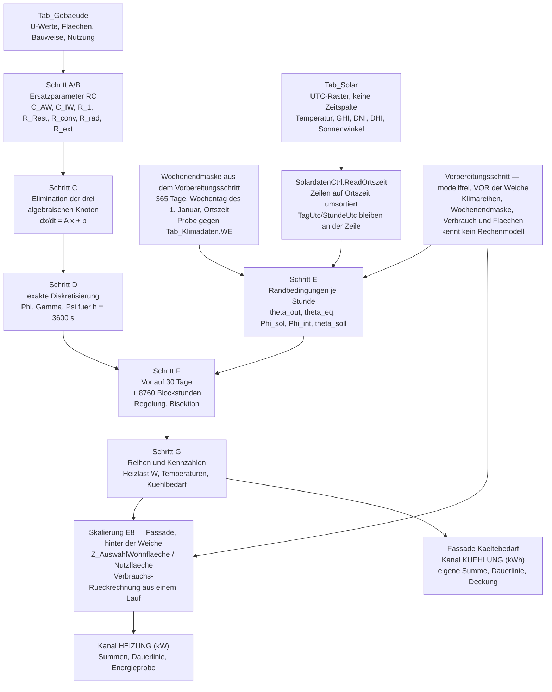
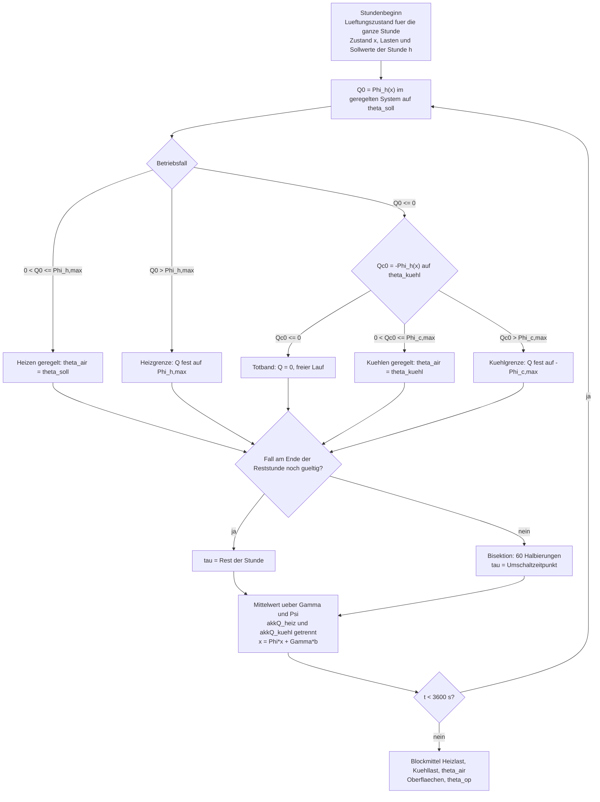

# Rechenschritte der Gebäudesimulation nach VDI 6007 Blatt 1 in EPOS-Plan

**Stand:** 17.09.2026
**Rev. 2 — Prüfung 17.09.2026, E26 eingearbeitet; Rev. 1 vom 16.09.2026**
Rev. 2 zieht den Fensterzweig nach E14 durch alle Schritte (A7a, Schritt C, E7, θ_op, stationäre
Probe), macht die Kühlung zum vierten Kanal mit den fünf Betriebsfällen und getrennten Heiz- und
Kühlakkumulatoren, ergänzt Schritt H der Anlagenkopplung als Vorgriff (7.4) und ersetzt die festen
Schemaschrittnummern durch die Papiernamen M3, M3-G2 und M4.
**Zweck:** Das Rechenbuch des Stundenmodells. Es führt die Rechnung in Schritten vor — je
Schritt die Formeln, die Eingaben mit Einheit und Datenquelle, die Ausgaben und die Stelle in
der Reihenfolge. Damit kann ein Fachplaner ein Ergebnis nachvollziehen und ein Entwickler den
Löser bauen, ohne die Physik neu herzuleiten.
**Leserkreis:** Fachplaner (Nachvollzug einer Zahl), Entwickler (Umsetzung in `EPOS.Kern`),
Prüfer (Abnahme gegen das Normband).
**Was hier nicht steht:** die Begründung der Modellwahl, die Messungen am Bestand, die
Entscheide. Sie stehen im Konzept
[`Konzept_Gebaeudesimulation_VDI6007_EPOS-Plan.md`](Konzept_Gebaeudesimulation_VDI6007_EPOS-Plan.md)
(Kapitel 4 Rechenweg, Kapitel 5 Prototyp und Klimaweg, Nachtrag 1 Entscheide E1 ff.), die
Einbindung in den Kern im
[`Umsetzungskonzept_Gebaeudesimulation_VDI6007_EPOS-Plan.md`](Umsetzungskonzept_Gebaeudesimulation_VDI6007_EPOS-Plan.md)
(Kapitel 1), die Entscheide dazu in
[`ADR-002_Stundenmodell_VDI6007_Einbindung.md`](ADR-002_Stundenmodell_VDI6007_Einbindung.md) und
[`ADR-006_Trennung_Altweg_VDI6007.md`](ADR-006_Trennung_Altweg_VDI6007.md) (Trennung der
Rechenwege), die Kälteseite im
[`Konzept_Kuehlung_Gebaeudesimulation_EPOS-Plan.md`](Konzept_Kuehlung_Gebaeudesimulation_EPOS-Plan.md).
Der Stand der Umsetzung steht in
[`Status_Gebaeudesimulation_VDI6007.md`](Status_Gebaeudesimulation_VDI6007.md).
**Kapitel 13** führt die Befunde des Gegenlesens vom 15.09.2026 und deren Erledigung; was dort
als offen steht, gehört nicht in dieses Papier.

**Bezeichnungen.** Die Richtlinie nennt das Modell **2-K-Modell** (zwei Kapazitäten); „7R2C"
ist nur Kurzform und steht nicht in der Richtlinie. Gleichungsnummern in Klammern — (1), (32),
(103) — verweisen auf **VDI 6007 Blatt 1** (Ausgabe Juni 2015), Nummern mit dem Zusatz
„Blatt 3" auf **VDI 6007 Blatt 3** (Juni 2015), mit „Blatt 2" auf **VDI 6007 Blatt 2**
(März 2012). Wo keine Gleichungsnummer steht, ist die Formel eine EPOS-Festlegung; sie trägt
dann den Vermerk **EPOS-Klassenweg** mit dem Konzeptabschnitt. Temperaturen θ in °C (der Löser
rechnet in K, das ist für ein lineares System gleichgültig), Leistungen Φ in W, Widerstände R
in K/W, Leitwerte G in W/K, Kapazitäten C in J/K.

---

## 0. Überblick

**Wo diese Rechnung steht.** Die Fassade `SimulationWaermebedarf` ruft je Gebäude erst einen
**modellfreien Vorbereitungsschritt** (Klimareihen, Verbrauch und Flächen des Projekts) und danach
über **eine einzige Weiche** genau ein Rechenmodul (E20). **Dieses Papier
beschreibt das Modul `Gebaeude/`** — den VDI-Weg. Der Tagesbilanz-Weg wird Zeichen für Zeichen in
das Modul `Altweg/` verschoben, bekommt keine neue Funktion und **bleibt für die Dauer des
Übergangs als eingefrorener Bestandsweg** neben dem VDI-Weg stehen (E23, E26); abgelöst wird er
mit der Stufe **GA — Altweg ablösen**, deren Zeitpunkt offen ist (Q24). Er wird hier nur
dort genannt, wo eine Zahl gegen ihn gehalten wird. **Keines der beiden Module ruft das andere.**
Die Kälteseite verlässt denselben Lauf über die zweite Fassade `SimulationKaeltebedarf` (E21) — es
gibt keine zweite Gebäuderechnung für sie.

Die Rechnung in zwölf Sätzen:

1. Für jedes Gebäude wird **einmal je Lauf** aus U-Werten, Flächen, Bauweise und Nutzung ein
   Netz aus zwei Massenknoten, drei algebraischen Knoten und sieben Widerständen gebaut
   (Schritt A, in Stufe G3 aus Schichtaufbauten, Schritt B).
2. Die beiden Oberflächenknoten und der Luftknoten sind kapazitätslos und werden **algebraisch
   eliminiert**; übrig bleibt ein Zustandssystem zweiter Ordnung dθ/dt = A·θ + B·u mit voll
   besetzter 2×2-Matrix A (Schritt C).
3. A hängt **nicht** von den Lasten ab, sondern nur vom Betriebsfall (freier Lauf, geregelt)
   und vom Lüftungsleitwert; darum werden die Übergangsmatrizen Φ = exp(A·h), Γ und Ψ für
   h = 3 600 s **einmal je Gebäude, Betriebsfall und Lüftungszustand** gebildet, nicht je Stunde
   (Schritt D). In G1 gibt es einen Lüftungszustand, mit der Sommerlüftungsregel aus G2 zwei.
4. Aus den Klimareihen entstehen je Stunde die Randbedingungen: Außentemperatur, äquivalente
   Außentemperatur am Außenwandpfad, Erdreich- oder Kellertemperatur, Fenstersolareintrag je
   Orientierung, innere Lasten, Sollwert und obere Grenze (Schritt E).
5. Die Strahlungslasten werden flächenproportional auf die beiden Oberflächenknoten verteilt,
   die konvektiven Anteile auf die Luft (43)–(46).
6. Die Stundenschleife läuft über 8 760 Blockstunden, nach einem Vorlauf von 30 Tagen, dessen
   Ergebnisse verworfen werden (Schritt F).
7. Innerhalb einer Stunde hält die ideale Regelung die Lufttemperatur **durchgehend** auf dem
   Sollwert; die dafür nötige Leistung ist eine affine Funktion des Zustands, ihr Stundenmittel
   folgt geschlossen über Ψ.
8. Wechselt der Betrieb innerhalb der Stunde — Heizung erreicht null, Leistungsgrenze greift,
   Kühlgrenze wird erreicht —, sucht der Löser den Umschaltzeitpunkt per Bisektion und setzt
   die Stunde aus zwei oder mehr Abschnitten zusammen. Das ist die einzige Iteration.
9. Prüfgröße ist das **Blockmittel** der Stunde, nicht der Momentanwert am Stundenende.
10. Je Gebäude entstehen vier Reihen (Heizlast, Raumluft-, operative Temperatur, Kühlbedarf)
    und acht Kennzahlen (Schritt G).
11. Die Heizlastreihe geht in Watt in den vorhandenen Gebäudepuffer und von dort unverändert in
    den Kanal `HEIZUNG`; alles danach — Summen, Dauerlinie, Energieprobe, `Waermelast_Max` —
    bleibt Zeichen für Zeichen der Bestandsweg. Die Kühlbedarfsreihe desselben Laufs geht über die
    Kältefassade in den Kanal `KUEHLUNG` und **in keine dieser Rechnungen der Wärmeseite** (E21).
12. Die Skalierung vom Katalogbau auf die Projektfläche und die Verbrauchs-Rückrechnung sind
    eine Verhältnisrechnung **nach** der Simulation und ändern die Physik nicht. Das Modul
    liefert aus **einem** Aufruf die Reihe und den unskalierten Jahreswert `VerbrauchAltKwh`;
    die Verhältnisrechnung und die Nachmultiplikation stehen in der Fassade **hinter der
    Weiche** — nachgebaut, nicht aus dem Altweg gerufen (8.3).



**Zum Bild.** Der **Vorbereitungsschritt** steht links vor der Weiche: Er liefert die Klimareihen
samt Wochenendmaske sowie Verbrauch und Flächen des Projekts und kennt kein Rechenmodell (E20) —
beide Rechenwege lesen sein Ergebnis, keiner ruft den anderen. Die **Skalierung nach E8 bleibt**;
sie steht in der **Fassade hinter der Weiche** und rechnet mit dem, was der eine Lauf dieses Moduls
zurückgibt (8.3) — aus dem Altweg gerufen wird nichts. Die
Spalte heißt nach dem Umbenennungsschritt `Nutzflaeche` (E19); `Z_AuswahlWohnflaeche` behält seinen
Namen. Der **Kühlbedarf** verlässt Schritt G auf einem eigenen Weg in den vierten Kanal (E12, E21) —
aus **demselben** Lauf, nicht aus einer zweiten Rechnung.

---

## 1. Eingaben

### 1.1 Gebäudedaten

Quelle ist `Tab_Gebaeude` — die Projektkopie des Katalogs `Tab_Gebaeude_STAMM` —, gelesen über
die Sicht `Abfrage_Projektgebaeude`. Die Papiere nennen die Schemaschritte bei ihrem
**Papiernamen**, nicht bei einer Nummer: Die mit **M3** gekennzeichneten Spalten kommen mit dem
Gebäudespalten-Schritt **M3** (Stufe G1, zwölf Spalten je Tabelle), die mit **M3-G2**
gekennzeichneten mit dem Gebäudespalten-Schritt der Stufe G2 (drei weitere Spalten je Tabelle);
jeder der beiden bringt einen Sichtneubau (Umsetzungskonzept 1.6). Ob sie zu einem Schritt
zusammengelegt werden, entscheidet die Beauftragung. Die **Nummer** wird erst dort vergeben und
an `SchemaStand.Zielversion` abgelesen; beim Schreiben dieses Papiers steht sie auf **84**, die
nächste freie Nummer ist **85** (`EPOS.Kern/Allgemein/Update/SchemaStand.cs:155`).

„Vorgabe bei NULL" ist die Vorgabe **des Eingangsbauers**, nicht ein DDL-Vorgabewert: auf den
**neuen** Fachwerten aus M3 und M3-G2 steht kein `DEFAULT` (Ausnahme der Schalter
`Aussenbauteile_Strahlung`, `NOT NULL DEFAULT 0`). Für die Bestandsspalten gilt das nicht —
`Tab_Gebaeude.Luftwechselrate` trägt im Bestand `REAL DEFAULT 0`.

| Größe | Zeichen | Einheit | Quelle (Tabelle.Spalte) | Vorgabe bei NULL | Plausibilitätsgrenze (Konzept 4.8) |
|---|---|---|---|---|---|
| Rechenmodell | — | — | `Tab_Gebaeude.Gebaeude_Modell` **M3** | `VDI6007` (E1) | Wert aus `DbWerte.GEBAEUDE_MODELL_*` |
| Nutzfläche des Katalogbaus (E13) | A_f | m² | `Tab_Gebaeude.Nutzflaeche` (bis zum Schemaschritt M3 noch `Wohnflaeche`, E19) | — (Pflicht) | > 0; beheizte Netto-Grundfläche (E13) |
| Raumhöhe | H | m | `Tab_Gebaeude.Raumhoehe` | — (Pflicht) | > 0 |
| Speichermasse | C_ges | Wh/K | `Tab_Gebaeude.Bauweise` | — (Pflicht) | 5 ≤ Bauweise/A_f ≤ 200 Wh/(m²K) |
| U-Wert Außenwand | U_AW | W/(m²K) | `Tab_Gebaeude.k_Wert_Außenwand` | — | 0,1 … 6 |
| U-Wert Fenster | U_w | W/(m²K) | `Tab_Gebaeude.k_Wert_Fenster` | — | 0,1 … 6 |
| U-Wert Dach | U_D | W/(m²K) | `Tab_Gebaeude.k_Wert_Dachflaeche` | — | 0,1 … 6 |
| U-Wert Grundfläche | U_G | W/(m²K) | `Tab_Gebaeude.k_Wert_Grundflaeche` | — | 0,1 … 6 |
| U-Wert Sonstiges | U_So | W/(m²K) | `Tab_Gebaeude.k_Wert_Sonstiges` | — | 0,1 … 6 |
| Fläche Außenwand | A_AW | m² | `Tab_Gebaeude.Flaeche_Außenwand` | — | ≥ 0 |
| Fensterfläche gesamt | A_w | m² | `Tab_Gebaeude.gesamte_Fensterflaeche` | — | ≥ 0 |
| Dachfläche | A_D | m² | `Tab_Gebaeude.Dachflaeche` | — | ≥ 0 |
| Grundfläche | A_G | m² | `Tab_Gebaeude.Grundflaeche` | — | ≥ 0 |
| Sonstige Flächen | A_So | m² | `Tab_Gebaeude.Sonstige_Flaechen` | — | ≥ 0 |
| Fensterfläche Süd | A_w,S | m² | `Tab_Gebaeude.Fensterflaeche_Sued` | — | Summe aller vier = A_w |
| Fensterfläche Nord | A_w,N | m² | `Tab_Gebaeude.Fensterflaeche_Nord` | — | Summe aller vier = A_w |
| Fensterfläche Ost | A_w,O | m² | `Tab_Gebaeude.Fensterflaeche_Ost` **M3** | ½ `Fensterflaeche_Ost_West` | Summe aller vier = A_w |
| Fensterfläche West | A_w,W | m² | `Tab_Gebaeude.Fensterflaeche_West` **M3** | ½ `Fensterflaeche_Ost_West` | Summe aller vier = A_w |
| Gesamtenergiedurchlassgrad | g | — | `Tab_Gebaeude.Fensterdurchlassgrad` | — | 0 < g ≤ 1 |
| Rahmenanteil | 1 − F_F | — | `Tab_Gebaeude.Rahmenanteil` **M3** | 0,3 (also F_F = 0,7) | 0 ≤ Wert < 1 |
| Verschattungsfaktor | F_S | — | `Tab_Gebaeude.Verschattungsfaktor` **M3** | 0,9 | 0 < F_S ≤ 1 |
| Wärmebrücken ψ (drei Paare) | ψ_k | W/(mK) | `Tab_Gebaeude.WBVK_Anschluß_Fenster_Wand`, `…_Wand_Dach`, `…_Außenwand_Kellerdecke` | 0 | ≥ 0 |
| Wärmebrücken Länge (drei Paare) | L_k | m | `Tab_Gebaeude.Abmessung_Anschluß_…` | 0 | ≥ 0 |
| Luftwechselrate | n | 1/h | `Tab_Gebaeude.Luftwechselrate` | — (DDL-Vorgabe **0**) | > 0 — die Prüfung trifft im Bestand auf 0, nicht auf NULL |
| Infiltration (G2) | n_inf | 1/h | `Tab_Gebaeude.Luftwechsel_Infiltration` **M3-G2** | 0,3 | > 0 |
| Nutzerlüftung (G2) | n_nutz | 1/h | `Tab_Gebaeude.Luftwechsel_Nutzer` **M3-G2** | 0,4 | ≥ 0 |
| Sommerlüftung (G2) | — | 0/1 | `Tab_Gebaeude.Sommerlueftung` **M3-G2** | 0 | Schalter |
| Innere Wärmegewinne | Φ_int | W | `Tab_Gebaeude.Interne_Waermegewinne` | 0 | ≥ 0, Leistung des ganzen Katalogbaus |
| Sollwert Tag | θ_soll,Tag | °C | `Tab_Gebaeude.Raumsolltemperatur_Tag` | — (Pflicht) | Stunden 7…22 |
| Sollwert Nacht | θ_soll,Nacht | °C | `Tab_Gebaeude.Raumsolltemperatur_Nachtabsenkung` | — | Stunden 23…6 |
| Sollwert Wochenende | θ_soll,WE | °C | `Tab_Gebaeude.Raumsolltemperatur_Wochenende` | — | wirksam allein über **Wert > 5** und `WE[Tag]`; die Spalte `Wochenende` geht im Bestand in keine Rechnung ein |
| Sollwert Ferien | θ_soll,Fer | °C | `Tab_Gebaeude.Raumsolltemperatur_Ferien` | — | wirksam nur mit Flag `Ferien` > 0,9; bei Wert < 1 setzt der Bestand `Ferien = 0` |
| Obere Raumtemperatur | θ_max | °C | `Tab_Gebaeude.Maximaleraumtemperatur` | — | > θ_soll,Tag; ab KU1 tritt der Kühlsollwert θ_kuehl daneben (`Kuehl_Sollwert`, NULL = `Maximaleraumtemperatur`) und mit ihm die Kühlleistungsgrenze `Kuehlleistung_Max` (Kühlkonzept KU-S1, 7.1) |
| Ferienzeiträume | — | Tag 1…365 | `Tab_Gebaeude.Ferienbeginn_1…4`, `Ferienende_1…4` | aus | **0 und 366 heißen „aus"** (alle fünfzehn gesäten Gebäude führen `Ferienbeginn_1 = 366`); benannt abgelehnt wird nur ein **aktiver** Fahrplan mit einem Tag außerhalb 1…365 |
| Masseanteil außen | a_AW | — | `Tab_Gebaeude.Masseanteil_Aussen` **M3** | 0,3 | 0 < a_AW < 1 |
| Innenflächenfaktor | f_IW | — | `Tab_Gebaeude.Innenflaechenfaktor` **M3** | 2,5 | > 0 |
| Strahlungsanteil der Heizung | a_str,H | — | `Tab_Gebaeude.Heizung_Strahlungsanteil` **M3** | 0,3 | 0 ≤ Wert ≤ 1 |
| Heizleistungsgrenze | Φ_h,max | **kW** | `Tab_Gebaeude.Heizleistung_Max` **M3** | unbegrenzt (`double.PositiveInfinity`) | > 0, wenn gesetzt; der Eingangsbauer bildet daraus **einmal** `Φ_h_max_W = 1 000 · Heizleistung_Max` |
| Randbedingung Grundfläche | — | — | `Tab_Gebaeude.Grundflaeche_Randbedingung` **M3** | `ERDREICH` | `ERDREICH` / `KELLER` / `AUSSENLUFT` |
| Kellertemperatur | θ_NR | °C | `Tab_Gebaeude.Kellertemperatur` **M3** | 10 | nur bei `KELLER` |
| Strahlung auf Außenbauteile | — | 0/1 | `Tab_Gebaeude.Aussenbauteile_Strahlung` **M3** | 0 (Schalter, `NOT NULL DEFAULT 0`) | — |
| Projektfläche (Skalierung) | A_proj | m² | **Vorbereitungsschritt**, aus `Z_ProjektGebaeude.Wohnflaeche_Waermebedarf` über `Z_AuswahlWohnflaeche` | — | > 0 |
| Katalogfläche (Basis der Rückrechnung) | A_alt | m² | **Vorbereitungsschritt**, aus `Tab_Gebaeude.Wohnflaeche_gesamt` | — (Pflicht) | > 0; `FlaecheAlt` in 8.3, Basis von `Bewohner` |
| Einheit der Verbrauchseingabe | — | — | **Vorbereitungsschritt**, aus `Z_ProjektGebaeude.Einheit_Waermebedarf_Wohnflaeche` | `Wohnfläche [m²]` | Wertliste, siehe 8.3 |
| Jahresnutzungsgrad der Altanlage | η | — | **Vorbereitungsschritt**, aus `Z_ProjektGebaeude.Jahresnutzungsgrad` | — | > 0, geht in `VerbrauchNeu` ein |
| Bewohnerzahl | — | Personen | **Vorbereitungsschritt** (modellfrei, vor der Weiche) — nicht aus einem Aufruf des Altwegs | — | Fläche / `Flaeche_Nutzer`, siehe 8.3 |
| Skalierungsfaktor (E8) | — | — | entsteht **nach** dem Lauf in der Fassade aus `VerbrauchAltKwh` und den Flächen des Vorbereitungsschritts (8.3) | 1 | > 0 |
| Fläche je Person | — | m²/Person | `Tab_Gebaeude.Flaeche_Nutzer` | — | > 0 |
| spezifischer Verbrauch | — | kWh/(m²a) | `Tab_Gebaeude.spez_Waermeverbrauch` | — | **reine Katalogkennzahl, kein Rechnungseingang** — sie geht allein in das Abnahmekriterium (Konzept 10.4 (4)) |

**Zur Herkunft „Vorbereitungsschritt".** Die fünf so gekennzeichneten Größen liest das Modul
`Gebaeude/` **nicht selbst aus der Datenbank** und ruft sie auch nicht aus dem Altweg ab: Sie
stehen fertig bereit, wenn die Weiche das Modul ruft (E20). Der Vorbereitungsschritt kennt kein
Rechenmodell — er fragt nicht, auf welchem Weg dieses Gebäude rechnet —, und beide Rechenwege lesen
dasselbe Ergebnis. Die Spalten dahinter sind die des Bestands; sie sind hier genannt, damit jede
Zahl ihre Quelle behält.

### 1.2 Klimadaten

| Größe | Zeichen | Einheit | Quelle | Bemerkung |
|---|---|---|---|---|
| Außenlufttemperatur | θ_out | °C | `Tab_Solar.Temperatur` über `SolardatenCtrl.ReadOrtszeit` | 8 760 Zeilen, auf Ortszeit umsortiert |
| Globalstrahlung horizontal | I_glob | W/m² | `Tab_Solar.Globalstrahlung` | GHI |
| Direktstrahlung | I_dir,n | W/m² | `Tab_Solar.Direktstrahlung` | **DNI**, normal zur Sonne |
| Diffusstrahlung horizontal | I_diff | W/m² | `Tab_Solar.Diffusstrahlung` | DHI |
| Sonnenhöhe | γ_S | ° | `Tab_Solar.Sonnenwinkel` | Höhenwinkel |
| Atmosphärische Gegenstrahlung | E_A | W/m² | `Tab_Solar.Gegenstrahlung` (Klimaspalten-Schritt **M4**) | NULL: Δθ_lw = 0, α_str,A auf dem Rückfallwert aus 1.3 und α_A damit unverändert (E5); eine Schätzung nach Blatt 3 (84)–(88) ist ohne Bedeckungsgrad nicht rechenbar und wird nicht gebaut |
| Ausstrahlung der Erdoberfläche | E_E | W/m² | aus θ_out abgeleitet, Blatt 3 Gl. (89) (Blatt 1 nennt sie E_E) | NULL bzw. E_A fehlt: Δθ_lw = 0, siehe E5 |
| Luftfeuchte | φ_L | % | `Tab_Solar.Luftfeuchte` (Klimaspalten-Schritt **M4**) | nicht rechenwirksam in G1/G2 |
| Wochenendmaske | — | 0/1, 365 Tage | **Vorbereitungsschritt**, aus dem Wochentag des 1. Januar des Referenzjahres (Ortszeit) | Probe gegen `Tab_Klimadaten.WE` derselben Klimaregion, siehe E8 |
| Klimaregion | — | — | `Tab_Projekt.ID_Klimaregion` | Längen- und Breitengrad für den Sonnenstand |

**Keine Windspalte.** Der Klimaspalten-Schritt **M4** legt `Gegenstrahlung` und `Luftfeuchte` an,
also **zwei** Spalten. Eine Spalte `Windgeschwindigkeit` entsteht nicht: Es gibt keinen Leser für
sie, weil der äußere Übergang α_A ein Festwert nach 1.3 bleibt und kein Schritt dieses Papiers
eine windabhängige Bildung vorsieht. Kommt sie später, ist sie ein eigener Schemaschritt mit
eigener Formel und eigener Stufe.

Die isotropen **Tagesmittel** `Tab_Klimadaten.Sol_Nord/Ost/Sued/West` gehören dem
Altweg (`KlimakalenderLesen`); die gleichnamigen **Stundenspalten** in `Tab_Solar`
werden beim Import geschrieben und von `SolardatenCtrl` gemappt, aber von keinem Rechenweg des
Kerns gelesen. Das Stundenmodell rechnet die Fassadenstrahlung selbst (Schritt E).

### 1.3 Festwerte des Modells

Sie stehen im Quelltext, nicht in der Datenbank, und sind Teil des Rechenwegs.

| Größe | Zeichen | Wert | Einheit | Herkunft |
|---|---|---|---|---|
| innerer Strahlungsübergang | α_str,i | 5,0 | W/(m²K) | VDI 6007-1, Gl. (30) |
| innerer konvektiver Übergang, Wände | α_kon,i | 2,7 | W/(m²K) | Testräume der Richtlinie; je Bauteil vorzugeben (Blatt 1, Abschnitt 6.2) |
| äußerer Übergang gesamt | α_A | 25 | W/(m²K) | Summe α_kon,A + α_str,A nach Gl. (38); der **Wert** 25 stammt aus den Testräumen der Richtlinie (20,0 + 5,0) und ist **kein gesetzter Normwert** — benannte Festlegung, Kapitel 11; eine windabhängige Bildung ist nicht vorgesehen (1.2) |
| Massen-Oberflächen-Koeffizient | h_ms | 9,1 | W/(m²K) | DIN EN ISO 13790, 12.2.2 — **EPOS-Klassenweg** |
| innerer Wärmeübergangswiderstand | R_si | 0,13 | m²K/W | im U-Wert enthalten; im Netz tritt an seine Stelle das innere Oberflächennetz aus R_conv und R_rad — mit anderem Wert, siehe A4 |
| Winkelkorrektur Fenster | F_W | 0,9 | — | Näherung für korg (Blatt 3, 8.1) — **EPOS-Vorgabe** |
| konvektiver Anteil des Fenstersolars | a_kon | 0,09 | — | Blatt 2, Tabelle A5, 3-fach-Wärmeschutz; je Verglasung zu wählen |
| Absorptionsgrad opaker Außenflächen | a_F | 0,6 | — | **EPOS-Vorgabe**, kein Normwert |
| Wärmekapazität der Luft | c·ρ | 0,34 | Wh/(m³K) | DIN EN 12831; Normtestfall 12 rechnet 1,1953 kJ/(m³K) = 0,332 |
| Tiefe der Erdreichtemperatur | z | 1,0 | m | Kusuda/Achenbach — **EPOS-Ergänzung** |
| Temperaturleitfähigkeit Erdreich | α_Erd | 0,06 | m²/d | daraus Dämpfung 0,68 und Phasenverzug 22 d; wird der Kernklasse **ausdrücklich übergeben** (E6) |
| Albedo | ρ_Umg | 0,2 | — | Blatt 3, 7.3, Regelwert |
| Zeitschritt | h | 3 600 | s | Blatt 1, Abschnitt 6.4 |
| Vorlauf | — | 30 | d | Konzept 4.6 |
| Abschneidegrenze des Exponentialterms | — | E = 0 ab Z > 170 | — | Blatt 1, **Abschnitt 6.4, Seite 27** (E = exp(−Z)) |

---

## 2. Schritt A — Klassenweg: vom Katalogbau zu den Ersatzparametern

Der Klassenweg baut die RC-Größen ohne neue Eingaben aus dem, was `Tab_Gebaeude` heute führt.
Er läuft **einmal je Gebäude und Lauf** und ist in `ErsatzparameterRC.AusKlassenweg` gekapselt.

**A1 — Speichermasse und ihre Aufteilung** (EPOS-Klassenweg, Konzept 4.3)

```
C_ges  = Bauweise · 3 600            [J/K]      (Bauweise in Wh/K)
C_AW   = a_AW · C_ges                [J/K]
C_IW   = (1 − a_AW) · C_ges          [J/K]
```

Die drei EPOS-Bauarten entsprechen 20 / 50 / 100 Wh/(m²K) je m² Nutzfläche (E13), also 72 / 180 /
360 kJ/(m²K). Prüfung: 5 ≤ Bauweise/A_f ≤ 200 Wh/(m²K), sonst benannter Abbruch. **A_f ist die
Nutzfläche** (beheizte Netto-Grundfläche, E13); sie trägt ab dem Schemaschritt M3
die Spalte `Tab_Gebaeude.Nutzflaeche` (E19; bis dahin `Wohnflaeche`).

**A2 — Bezugsflächen** (EPOS-Klassenweg, Konzept 4.3)

```
A_AW,opak = A_AW + A_D + A_G + A_So   [m²]      opake Außenbauteile — der Massepfad
A_AW,ges  = A_AW,opak + A_w           [m²]      Außenbauteilgruppe einschließlich Fenster (E14)
A_IW      = f_IW · A_f                [m²]      (f_IW Vorgabe 2,5, A_m/A_f nach ISO 13790)
A_rad     = min(A_AW,ges, A_IW)       [m²]      Bezugsfläche des inneren Strahlungsaustauschs
```

**Warum zwei Flächen.** Nach E14 endet der Fensterzweig am gemeinsamen Oberflächenknoten θ_s,AW
(A7a). Überall dort, wo die Gruppe als **Oberfläche** auftritt, zählt die Fensterfläche deshalb
mit: in R_conv,AW (A6), in A_rad, in der Strahlungsverteilung und in der Flächenwichtung von θ_op
(E3, 8.1). Das ist die **Folgeentscheidung zu E14** — E14 selbst nennt nur die
Strahlungsverteilung und die Gewichtung von θ_eq. Wo die Gruppe als **Speichermasse** auftritt —
R_1,AW und R_Rest,AW vor dem Anschluss der Fenster sowie C_AW —, bleibt A_AW,opak stehen: Fenster
tragen keine Masse.

**A3 — Transmissionsleitwerte je Gruppe** (E2: ungewichtet, Konzept N1.6)

```
(U·A)_AW  = U_AW · A_AW      (U·A)_D  = U_D · A_D
(U·A)_G   = U_G  · A_G       (U·A)_So = U_So · A_So          [W/K]
Σ(U·A)_opak = (U·A)_AW + (U·A)_D + (U·A)_G + (U·A)_So        [W/K]
(U·A)_w   = U_w · A_w                                        [W/K]
Σψ·L      = ψ_1·L_1 + ψ_2·L_2 + ψ_3·L_3                      [W/K]
```

Die Gewichte 0,83 / 0,95 / 0,45 / 0,83 gehen hier **nicht** ein; sie bleiben dem Altweg und
entfallen mit ihm (Entscheid E2).

**A4 — Widerstände des Außenwandpfads** (EPOS-Klassenweg, Konzept 4.3; normkonformes
Gegenstück: (25)–(28))

```
R_1,AW    = 1 / (h_ms · A_AW,opak)                           [K/W]
R_ges     = 1 / Σ(U·A)_opak                                  [K/W]
R_Rest,AW = R_ges − R_1,AW − R_si / A_AW,opak                [K/W]
```

Der Abzug R_si/A ist die Stelle, an der der U-Wert und das Netz zusammengeführt werden: der
innere Übergang steckt bereits im U-Wert, im Netz liegt an seiner Stelle das innere
Oberflächennetz; ohne den Abzug zählt er doppelt. **Kein Klemmwert:** wird R_Rest,AW ≤ 0 —
rechnerisch ab einem mittleren U über 4,17 W/(m²K) —, bricht die Rechnung mit benanntem Fehler
ab (Blatt 1, 6.8 verbietet den stillen Rückfall).

**Der Klassenweg gibt die Katalog-U-Werte bewusst nicht wieder.** Das abgezogene R_si/A und der
Widerstand, den das Netz an seiner Stelle führt, sind nicht derselbe Wert. R_rad ist im
2-K-Netz **kein** Luft-Oberflächen-Widerstand, sondern der Austausch zwischen den beiden
Oberflächenknoten; der Weg Luft → θ_s,AW ist R_conv,AW **parallel zu** (R_conv,IW + R_rad):

```
R_innen,eff = R_conv,AW · (R_conv,IW + R_rad) / (R_conv,AW + R_conv,IW + R_rad)   [K/W]
(U·A)_opak,wirksam = 1 / (R_Rest,AW + R_1,AW + R_innen,eff)                       [W/K]
```

Für das Gebäude aus Kapitel 9 ist R_innen,eff = 4,5726·10⁻⁴ K/W, also ein wirksamer innerer
Übergang von 4,49 W/(m²K) statt der 1/0,13 = 7,69 W/(m²K), die der Abzug unterstellt. Der
Klassenweg führt damit nicht Σ(U·A)_opak = 686,95 W/K, sondern 607,48 W/K — **11,6 % weniger**.
Das ist eine benannte Abweichung (Kapitel 11, Zeile 14), keine Rechenprobe: die stationäre
Probe in 10.4 ist entsprechend formuliert, und die Wirkung je Referenzgebäude ist in G1
auszuweisen, bevor die Basis neu eingefroren wird. Mit dem Bauteilweg (Schritt B) entfällt die
Frage, weil dort R_1 und R_Rest aus den Schichten folgen und der U-Wert nicht mehr Eingang ist.

**A5 — Widerstand des Innenbauteilpfads** (EPOS-Klassenweg)

```
R_1,IW = 1 / (h_ms · A_IW)                                   [K/W]
```

**A6 — Übergangswiderstände im Raum** (Gl. (30) für α_str; α_kon je Bauteil, Blatt 1, 6.2)

```
R_conv,AW = 1 / (α_kon,i · A_AW,ges)                         [K/W]   (mit Fenstern, A2)
R_conv,IW = 1 / (α_kon,i · A_IW)                             [K/W]
R_rad     = 1 / (α_str,i · A_rad)                            [K/W]
```

**A7 — masseloser Zweig: Lüftung und Wärmebrücken** (Lüftung: (75); die Fenster liegen nach **E14** im
Außenwandzweig, A7a — nicht mehr hier; Kapitel 11, Zeile 4)

```
H_ve  = n · V · c·ρ           mit V = A_f · H                [W/K]
H_ext = H_ve + Σψ·L                                          [W/K]
R_ext = 1 / H_ext                                            [K/W]
```

In Stufe G2 tritt an die Stelle von n die Summe n_inf + n_nutz; die Sommerlüftungsregel schaltet
auf n = 2,0 1/h. **Wann** sie schaltet, legt 7.2 fest: ausgewertet wird **einmal je Stunde am
Stundenbeginn** mit θ_air und θ_out der Vorstunde, der Zustand gilt die ganze Stunde, mit einer
Hysterese von 1 K und einer Mindestverweildauer von einer Stunde. Die Schwelle ist bis KU1
23 °C, ab KU1 θ_kuehl − 3 K.

**Σψ·L bleibt im masselosen Zweig.** Nach E14 trägt H_ext nur noch Lüftung und Wärmebrücken; die
Wärmebrücken hängen damit ohne Speichermasse, ohne inneres Oberflächennetz und ohne eigene
äquivalente Außentemperatur unmittelbar zwischen θ_out und dem Luftknoten — für das Gebäude aus
Kapitel 9 knapp ein Drittel von H_ext. Das ist eine **benannte Abweichung** (Kapitel 11,
Zeile 16); ihre Wirkung wird in G0 einmal gemessen, indem derselbe Fall mit Σψ·L im masselosen
Zweig und mit Σψ·L in der Außenwandgruppe gerechnet wird.

**A7a — Fensterpfad in der Außenwandgruppe** (Entscheid **E14**, Normweg (25)–(28), Muster B6)

```
R_AF      = (1/U_w − 1/α_I − 1/α_A) / A_w                    [K/W]   (26)
R_1,AF    = R_AF / 6                                         [K/W]
R_Rest,AF = 5/6 · R_AF                                       [K/W]
```

α_I ist der innere Übergang, der im U-Wert des Fensters steckt (α_I = 1/R_si nach 1.3), α_A der
äußere aus 1.3. **Kein Klemmwert:** Wird R_AF ≤ 0, bricht die Rechnung mit benanntem Fehler ab —
dieselbe Regel wie in A4 (Blatt 1, 6.8). Die kürzere Form R_AF = 1/(U·A)_w wäre falsch: Sie ließe
beide Übergänge im Zweig stehen, obwohl im Netz an ihrer Stelle das innere Oberflächennetz
(R_conv, R_rad) und der äußere Übergang in θ_A,eq liegen; der Übergang zählte zweimal.

**Zusammenfassung zu einem Zweig.** Der Fensterzweig wird **nach** den Wänden parallel an den
gemeinsamen Oberflächenknoten θ_s,AW geschaltet, (27)/(28). Danach trägt die Außenwandgruppe
wieder **genau ein** Paar R_1,AW / R_Rest,AW — das der zusammengefassten Gruppe aus Wänden und
Fenstern —, und Schritt C bleibt bei fünf Knoten mit einem G_1 und einem G_Rest (4.1). Greift
einer der Klemmfälle (28a)–(28c) der Richtlinie, gilt der dort festgelegte Wert; die Kapazität
C_AW der Wände bleibt in jedem Fall unverändert.

Die Fensterfläche A_w zählt damit in der Flächenwichtung der Oberflächen (A2), in der
Strahlungsverteilung (Schritt E), in der Gewichtung der äquivalenten Außentemperatur nach (41)
(E7) und in θ_op (8.1). Der Weg des Prototyps — Fenster als masseloser Widerstand am Luftknoten
in R_ext — **entfällt für das Produkt**; er bleibt die Konvention, in der die Zahlen in Kapitel 9
entstanden sind (Konzept N1.19, Kapitel 11, Zeile 4).

**Ausgabe von Schritt A** ist der Datensatz `ErsatzparameterRC`: C_AW, C_IW [J/K]; R_Rest,AW und
R_1,AW — beide **nach** dem Anschluss der Fenster (A7a) —, R_1,IW, R_conv,AW, R_conv,IW, R_rad,
R_ext [K/W]; dazu A_AW,opak, A_AW,ges, A_IW, A_w [m²] sowie Σ(U·A)_opak und (U·A)_w [W/K] für
Schritt E. Für die Knotenrechnung werden daraus die Leitwerte
G_1 = 1/R_1,AW, G_2 = 1/R_1,IW, G_Rest = 1/R_Rest,AW, G_cAW = 1/R_conv,AW,
G_cIW = 1/R_conv,IW, G_rad = 1/R_rad und G_ext = 1/R_ext gebildet [W/K].

---

## 3. Schritt B — Bauteilweg (Stufe G3, Vorschau)

Liegt für ein Gebäude ein Bauteilkatalog mit Schichtaufbauten vor, ersetzt der Bauteilweg die
Schritte A4 bis A6. Er ist das normkonforme Verfahren; hier steht nur die Schrittfolge, die
Herleitung steht in der Richtlinie (Abschnitt 6.3, Seiten 11–14) und der Nachweisplan im
Konzept 4.3 und in
[`Gebaeudesimulation/2026-09-15_Befund_I_VDI6007_Richtlinie_Abgleich.md`](Gebaeudesimulation/2026-09-15_Befund_I_VDI6007_Richtlinie_Abgleich.md),
Abschnitt 4.

| Teilschritt | Was geschieht | Gleichung | Eingabe | Ausgabe |
|---|---|---|---|---|
| B1 | Bezugsperiode je Bauteil festlegen: T_BT = 7 d, bei raumseitig abgedeckter Speichermasse 2 d | (10a)–(10d) | Schichtfolge | T_BT [d] |
| B2 | Kettenmatrix je Schicht aus d, λ, ρ, c und der Kreisfrequenz der Bezugsperiode | (1)–(9) | d [m], λ [W/(mK)], ρ [kg/m³], c [J/(kgK)] | 2×2-Matrix, komplex |
| B3 | Kettenmatrizen **von innen nach außen** multiplizieren — die Reihenfolge ist nicht vertauschbar | (11) | B2 je Schicht | Gesamtmatrix a_ij des Bauteils |
| B4 | Identifikation der Ersatzgrößen: R_1 aus a_22/a_12, R_2 aus a_11/a_12, dann C_1, C_2, R_3 und die Korrektur C_1,korr | (12)–(17) | a_ij | R_1, C_1 [K/W, J/K] je Bauteil |
| B5 | Bauteile einer Gruppe parallel schalten: ΣC, Σ1/R | Abschnitt 6.3 | B4 je Bauteil | R_1,AW, C_AW bzw. R_1,IW, C_IW |
| B6 | Fenster **nach** den Wänden parallel anschließen: R_1,AF = R_AF/6 mit R_AF = (1/U_AF − 1/α_I − 1/α_A)/A; die Kapazität der Wände bleibt dabei unverändert | (25)–(28), Klemmen (28a)–(28c) | U_AF, A | R_ges,AW, R_Rest,AW |
| B7 | Zusammenfassung zum Raum mit der Bezugsperiode T_RA = 5 d | (10e) | B5, B6 | Ersatzparameter des Raums |

**Fallen.** Innenbauteile werden über den **vollständigen** Schichtaufbau in die Kettenmatrix
gegeben und erst danach reduziert; wer zusätzlich an der Mittelebene halbiert, halbiert zweimal.
Die Richtlinie nennt **keine** Soll-RC-Werte zum Abgleich; der Nachweis lautet: Reduktion aus
den Bauteiltabellen der Testräume rechnen, damit simulieren und die Ergebnisreihen im Normband
treffen (Kapitel 10). Mit dem Bauteilweg folgt der U-Wert je Bauteil aus den Schichten und
überschreibt `k_Wert_*` in der Anzeige mit Herkunftskennzeichen.

---

## 4. Schritt C — Systemmatrix

### 4.1 Die fünf Knoten

| Knoten | Zeichen | Art | Kapazität |
|---|---|---|---|
| Masse der Außenbauteile | θ_m,AW | Zustand x_1 | C_AW [J/K] |
| Masse der Innenbauteile | θ_m,IW | Zustand x_2 | C_IW [J/K] |
| Innenoberfläche der Außenbauteile | θ_s,AW | algebraisch | 0 |
| Innenoberfläche der Innenbauteile | θ_s,IW | algebraisch | 0 |
| Raumluft | θ_air | algebraisch | 0 (Zeitkonstante der Luft ≪ 1 h) |

Die Knotenbilanzen (Φ in W, G in W/K):

```
C_AW · dθ_m,AW/dt = G_Rest·(θ_eq − θ_m,AW) + G_1·(θ_s,AW − θ_m,AW)
C_IW · dθ_m,IW/dt = G_2·(θ_s,IW − θ_m,IW)
0 = G_1·(θ_m,AW − θ_s,AW) + G_cAW·(θ_air − θ_s,AW) + G_rad·(θ_s,IW − θ_s,AW) + Φ_rad,AW
0 = G_2·(θ_m,IW − θ_s,IW) + G_cIW·(θ_air − θ_s,IW) + G_rad·(θ_s,AW − θ_s,IW) + Φ_rad,IW
0 = G_cAW·(θ_s,AW − θ_air) + G_cIW·(θ_s,IW − θ_air) + G_ext·(θ_out − θ_air) + Φ_conv + Φ_h
```

**Wo die Fenster sitzen.** G_1 = 1/R_1,AW und G_Rest = 1/R_Rest,AW sind die Leitwerte der
**zusammengefassten** Außenwandgruppe — Wände und Fenster, nach (27)/(28) zu einem Zweig
verbunden (A7a). Deshalb bleibt es bei fünf Knoten und bei je einem G_1 und einem G_Rest; der
Fensterzweig ist kein zusätzlicher Pfad in diesem Bild. G_ext der Luftbilanz trägt nach E14 nur
noch Lüftung und Wärmebrücken (A7).

θ_eq ist die U·A-gewichtete äquivalente Außentemperatur aus Schritt E (Gl. (41)/(42)).
Der Dreieckssatz der Richtlinie — R_α;kon;IW, R_α;kon;AW, R_α;str;AW/IW mit der
Stern-Dreieck-Transformation (55)–(57) — ist dieselbe Algebra; die obige Schreibweise löst das
Dreieck direkt auf.

### 4.2 Fall 1 — freier Lauf (keine Heizung, keine Kühlung)

Der Luftknoten wird zuerst aufgelöst. Mit

```
S       = G_cAW + G_cIW + G_ext                              [W/K]
Φ_Luft  = G_ext·θ_out + Φ_conv                               [W]
θ_air   = (G_cAW·θ_s,AW + G_cIW·θ_s,IW + Φ_Luft) / S
```

und Einsetzen in die beiden Oberflächengleichungen entsteht ein konstantes 2×2-System
**M·θ_s = K·x + v** mit K = diag(G_1, G_2) und

```
M_11 = G_1 + G_rad + G_cAW − G_cAW² / S
M_22 = G_2 + G_rad + G_cIW − G_cIW² / S
M_12 = M_21 = −(G_rad + G_cAW·G_cIW / S)
v_1  = Φ_rad,AW + G_cAW·Φ_Luft / S
v_2  = Φ_rad,IW + G_cIW·Φ_Luft / S
```

Einsetzen von θ_s = M⁻¹(K·x + v) in die beiden Zustandsgleichungen liefert **dx/dt = A·x + b**:

```
A_11 = ( (K·M⁻¹·K)_11 − (G_1 + G_Rest) ) / C_AW
A_12 =   (K·M⁻¹·K)_12 / C_AW
A_21 =   (K·M⁻¹·K)_21 / C_IW
A_22 = ( (K·M⁻¹·K)_22 − G_2 ) / C_IW
b_1  = ( (K·M⁻¹·v)_1 + G_Rest·θ_eq ) / C_AW
b_2  =   (K·M⁻¹·v)_2 / C_IW
```

Die Nebendiagonale A_12, A_21 verschwindet nur ohne Strahlungskopplung und ohne gemeinsamen
Luftknoten — eine diagonale Systemmatrix ist der Strukturfehler, den die Richtlinie mit Bild 3
(Seite 17) ausschließt. Beide Eigenwerte sind reell und negativ. Die Lufttemperatur folgt
affin: θ_air = c_air·x + d_air mit

```
c_air = ( (G_cAW, G_cIW)·M⁻¹ · K ) / S            [Zeilenvektor, dimensionslos]
d_air = ( (G_cAW, G_cIW)·M⁻¹·v + Φ_Luft ) / S     [°C]
```

### 4.3 Fall 2 — ideale Regelung am Luftknoten

Hält die Anlage θ_air = θ_soll durchgehend, entfällt die Luftbilanz als Bestimmungsgleichung
und wird zur Leistungsgleichung. Das Oberflächensystem lautet dann **N·θ_s = K·x + w** mit

```
N_11 = G_1 + G_rad + G_cAW      N_22 = G_2 + G_rad + G_cIW      N_12 = N_21 = −G_rad
w_1  = Φ_rad,AW + G_cAW·θ_soll
w_2  = Φ_rad,IW + G_cIW·θ_soll
```

Die Systemmatrix entsteht mit N statt M nach denselben vier Zeilen wie oben; sie hängt
**nicht** von den Lasten und nicht vom Lüftungsleitwert ab. Die Heizleistung ist affin im
Zustand (Gl. (96)–(98)):

```
Φ_h(x) = c_Q·x + d_Q
c_Q    = −( (G_cAW, G_cIW)·N⁻¹ ) · K
d_Q    = (G_cAW + G_cIW)·θ_soll − (G_cAW, G_cIW)·N⁻¹·w + G_ext·(θ_soll − θ_out) − Φ_conv
```

Vorzeichen nach Blatt 1, Seite 9: **Φ_h > 0 = Heizen**, Φ_h < 0 = Kühlen.

### 4.4 Fall 3 — Leistungsgrenze erreicht

Ist die geforderte Leistung größer als Φ_h,max oder kleiner als null, wird die Leistung
festgehalten und als konvektive Last (bzw. nach a_str,H aufgeteilt) in den freien Lauf
eingespeist: Φ_conv ← Φ_conv + Φ_h,fest. Das ist wieder Fall 1, nur mit anderer rechter Seite;
die Systemmatrix bleibt die des freien Laufs.

### 4.5 Was Schritt C liefert

Je Betriebsfall eine Matrix A [1/s], ein Vektor b [K/s], die Rückrechnung der
Oberflächentemperaturen θ_s = S_C·x + S_D sowie die affinen Ausgänge θ_air(x) und Φ_h(x).
b wechselt je Stunde mit den Randbedingungen.

**A hängt vom Lüftungsleitwert ab — aber nur im freien Lauf.** Der Lüftungsleitwert steckt in
S = G_cAW + G_cIW + G_ext und damit in M, also in A_frei und in den Grenzfällen (4.4). Die
geregelte Matrix bleibt davon unberührt, weil N den Lüftungsleitwert nicht enthält. Folge: in
G1 ist A über den ganzen Lauf konstant; mit der Sommerlüftungsregel aus G2 (A7) sind **zwei**
Sätze von A_frei, Φ, Γ, Ψ vorzuhalten — einer je Lüftungszustand —, und der Stundenschritt
wählt den Satz nach dem geltenden Zustand.

---

## 5. Schritt D — exakte Diskretisierung

Für stückweise konstante Eingänge über eine Blockstunde h = 3 600 s gilt geschlossen:

```
x(h)             = Φ·x₀ + Γ·b
Mittelwert x̄     = (1/h)·(Γ·x₀ + Ψ·b)
mit  Φ = exp(A·h),   Γ = ∫₀ʰ exp(A·τ) dτ,   Ψ = ∫₀ʰ ∫₀^τ exp(A·s) ds dτ
```

Die drei Matrixfunktionen entstehen über die **Sylvester-Formel**. Mit μ = ½·Spur(A),
d = √(μ² − det A), λ_1,2 = μ ± d und einer skalaren Funktion f gilt für eine 2×2-Matrix

```
f(A) = ½·(f(λ_1) + f(λ_2))·I  +  (f(λ_1) − f(λ_2))/(λ_1 − λ_2) · (A − μ·I)
```

und im zusammenfallenden Fall (|d| numerisch null) f(A) = f(μ)·I + f′(μ)·(A − μ·I). Die drei
Funktionen sind

```
Φ:  f(λ) = e^(λh)
Γ:  f(λ) = (e^(λh) − 1) / λ                 nahe λ = 0:  h·(1 + λh/2 + (λh)²/6)
Ψ:  f(λ) = (e^(λh) − 1 − λh) / λ²           nahe λ = 0:  h²·(½ + λh/6 + (λh)²/24)
```

Die Reihenentwicklungen nahe null sind Pflicht, nicht Verzierung: ohne sie löschen sich Zähler
und Nenner aus. Die Grenze der Richtlinie — E = 0 ab Z > 170 (Blatt 1, Abschnitt 6.4, Seite 27)
— wird als **Abschneidegrenze für den abklingenden Exponentialterm** übernommen; ein Überlauf
kann in den drei Funktionen ohnehin nicht entstehen, weil alle Eigenwerte negativ sind. Der
Programmierhinweis 6.8 (Seiten 36–37) trägt etwas anderes: das Verbot des stillen Rückfalls und
die Behandlung der Division durch null (A4).

**Eigenschaften.** Das Verfahren ist unbedingt stabil (jeder Eigenwert von A ist negativ, also
|e^(λh)| < 1), deterministisch und liefert **Endwert und Stundenmittel exakt**. Das
Stundenmittel ist zwingend, weil die Richtlinie Blockmittel je Stunde vergleicht (Seite 24 und
Seite 38: die 11. Stunde ist 10:00–11:00 Uhr).

**Wann gerechnet wird.** Φ, Γ, Ψ werden im Erbauer des Lösers **einmal je Gebäude,
Betriebsfall und Lüftungszustand** gebildet (in G1 ein Zustand, mit der Sommerlüftungsregel aus
G2 zwei — siehe 4.5). Nur die Bisektion (Schritt F) braucht Matrixfunktionen zu einer
Teilzeit τ < h; sie werden dort auf Abruf gerechnet. Aus den Eigenwerten folgen zugleich die
Zeitkonstanten τ_i = −1/λ_i, die für die Bemessung des Vorlaufs gebraucht werden.

---

## 6. Schritt E — Klimaweg je Stunde

Alles in diesem Schritt geschieht im Eingangsbauer `GebaeudeModellEingang` und ergibt sieben
Reihen zu 8 760 Werten. Das Modell hat **einen** Lesepfad: Ortszeit über `ReadOrtszeit` (wie PV
und Solarthermie). Ein Zeitbezug bleibt darin stehen und ist gewollt: der **Sonnenstand rechnet
auf UTC** (E1). Die Wochenendmaske kommt aus dem modellfreien Vorbereitungsschritt und steht auf
dem **Ortszeit-Kalender** (E8); `Tab_Klimadaten` trägt allein die Probe dagegen.

**E1 — Sonnenstand** (Blatt 3, Abschnitt 5)

Aus Längen- und Breitengrad der Klimaregion, Tag des Jahres und Stunde folgen Zeitgleichung
(Blatt 3 Gl. (5)), Deklination (6), Sonnenhöhe (7), Stundenwinkel (8), Azimut (9)/(10) und
Einstrahlwinkel auf die Fläche (11). Gerufen wird
`CalculateHourlyHayDavies(…, dayOfYear, hour)` mit `SolardatenModel.TagUtc` (1-basiert) und
`SolardatenModel.StundeUtc` — die **UTC-Herkunft bleibt an der Zeile**, der Sonnenstand rechnet
auf UTC, die Bilanz auf Ortszeit. Wer statt dessen den Ortszeitindex einsetzt, bekommt einen
anderen Sonnenstand als PV und Solarthermie. Zwei weitere Festlegungen:

- **Zeitbezug:** Blatt 3 rechnet zur **Stundenmitte** (Seite 11). Der Klimaimport des Bestands
  übergibt dagegen den Stundenanfang aus der TMY-Zeitmarke. Der Unterschied ist eine halbe
  Stunde Stundenwinkel = 7,5° und verschiebt gerade die Ost- und Westflächen. Entschieden wird
  an **einer** Stelle, im Eingangsbauer (Frage U6, Konzept N1.10); `Tab_Solar.Sol_*` bleibt
  unberührt, damit die Referenzbasis des Altwegs gültig bleibt.
- **Azimutkonvention** des Eingangsbauers: Grad gegen Süd, Ost −90°, Nord 180°, West +90°,
  Fassadenneigung 90°, Dach nach Projektangabe. (Blatt 3 zählt Nord = 0°, Süd = 180° — die
  Umrechnung steht im Eingangsbauer, nicht verstreut.)

**E2 — Strahlung auf die geneigte Fläche** (Hay-Davies; normkonformes Gegenstück Blatt 3,
Gl. (29)–(50))

Je Orientierung o ∈ {N, O, S, W} und für das Dach wird I_o(h) aus GHI, DNI, DHI und der
Sonnengeometrie mit `SolarCalculator.CalculateHourlyHayDavies` gerechnet — anisotrop, mit
Zirkumsolaranteil, Bodenreflexion mit Albedo 0,2. Die isotrope Bestandsfunktion
`CalculateHourly` darf **nicht** benutzt werden: sie schreibt prozessweite statische Felder.

**E3 — Fenstersolareintrag** (EPOS-Klassenweg)

```
Φ_sol = Σ_o  A_w,o · g · F_F · F_S · F_W · I_o(h)            [W]
mit F_F = 1 − Rahmenanteil,  F_S = Verschattungsfaktor,  F_W = 0,9
```

Vom Ergebnis gehen **a_kon** (Vorgabe 0,09 für 3-fach-Wärmeschutz, je Verglasung aus Blatt 2
Tabelle A5) konvektiv an die Luft, der Rest radiativ auf die beiden Oberflächenknoten.

**Bezugsflächen — Festlegung für den Klassenweg.** Nach E14 endet der Fensterzweig am
Oberflächenknoten θ_s,AW (A7a); die Fensterfläche gehört damit zur Oberflächengruppe:

```
A_AW,ges  = A_AW,opak + A_w                                  [m²]   (aus A2)
A_Raum    = A_AW,ges + A_IW                                  [m²]   mit der Fensterfläche
```

In (43)–(46) steht „A_AW" für A_AW,ges. Dieselbe Definition gilt für die Flächenwichtung von
θ_op (8.1) und für E4.

**Verteilung.** Die Richtlinie verteilt nach (45)/(46): die bestrahlte Fläche selbst und die zu
ihr parallelen Bauteile werden nicht beaufschlagt, Gewicht (A_AW − A_v)/(A_Raum − A_v) bzw.
(A_Raum − A_AW)/(A_Raum − A_v) mit A_v = gesamte Fläche (opak und transparent) der jeweiligen
Orientierung. **A_v ist im Klassenweg nicht rechenbar**: `Tab_Gebaeude` führt nur die Summe
`Flaeche_Außenwand`, orientierungsweise Flächen gibt es allein für die Fenster (1.1). Deshalb
gilt in G1 A_v = 0, und die Verteilung ist flächenproportional:

```
Φ_sol,Luft = a_kon · Φ_sol
Φ_sol,AW   = (1 − a_kon) · Φ_sol · A_AW,ges / A_Raum
Φ_sol,IW   = (1 − a_kon) · Φ_sol · A_IW     / A_Raum
```

(45)/(46) mit A_v sind Voraussetzung des **Bauteilwegs G3**; sie werden dort gerechnet, sobald
die opaken Flächen je Orientierung vorliegen — entweder aus dem Bauteilkatalog oder als neue
Spalten in 1.1. Bis dahin ist die flächenproportionale Verteilung eine **benannte Abweichung**
(Kapitel 11, Zeile 15); ihre Wirkung wird in **G0** einmal gemessen, indem derselbe Lauf mit
A_v = 0 gegen einen Lauf mit A_v aus den Fensterflächen je Orientierung gehalten wird.

**E4 — innere Lasten** (Verteilung nach (43)/(44), im Klassenweg flächenproportional wie E3)

```
Φ_int,conv = 0,5 · Interne_Waermegewinne                     [W]
Φ_int,rad  = 0,5 · Interne_Waermegewinne                     [W]
Φ_int,AW   = Φ_int,rad · A_AW,ges / A_Raum
Φ_int,IW   = Φ_int,rad · A_IW     / A_Raum
```

In G1 sind die inneren Lasten zeitlich konstant; ein Wochenprofil ist G2+. Für den Löser wird je
Oberflächenknoten die **Summe** aus solarem und innerem Strahlungsanteil gebraucht:
Φ_rad,AW = Φ_sol,AW + Φ_int,AW und Φ_rad,IW = Φ_sol,IW + Φ_int,IW, dazu die konvektive Last
Φ_conv = Φ_sol,Luft + Φ_int,conv (Schritt C, 4.1). **Diese drei Summen bildet der Eingangsbauer**,
nicht der Löser: Die Aufteilung 0,5/0,5 und die Flächengewichte stehen hier, in E3 und E4.

**E5 — äquivalente Außentemperatur je Fläche** (Gl. (32)–(40))

```
θ_A,eq,k = θ_out + Δθ_lw,k + Δθ_kw,k                          [°C]
Δθ_kw,k  = (I_dir,k + I_diff,k) · a_F / α_A                   (32), (38)
Δθ_lw,k  = φ_k · ε_F · (E_A − E_E) / α_A                      (33)–(37)
mit φ_k  = (1 + cos γ_F,k)/2                                  (36a), geometrischer Sichtfaktor
```

φ ist der **geometrische** Sichtfaktor (0,5 für die senkrechte Wand, 1,0 für das waagerechte
Dach); die Bewölkung steckt allein in der Gegenstrahlung E_A der Klimadaten. Für **transparente**
Flächen entfällt der kurzwellige Term (39).

Der äußere Übergang nach (37)/(38):

```
α_str,A = (E_A + E_E) / (θ_Atm − θ_Erd)      (37)   Rückfallwert 5,0 W/(m²K)
α_A     = α_kon,A + α_str,A                  (38)   mit α_kon,A = 20,0  ->  25 W/(m²K)
```

α_str,A geht nur über α_A in die beiden Δθ-Terme ein; E_E ist die Ausstrahlung der
Erdoberfläche (Blatt 3 Gl. (89), aus θ_out abgeleitet, 1.2). **Fehlt E_A oder E_E**, ist
Δθ_lw gar nicht rechenbar; dann gilt Δθ_lw = 0 und α_str,A fällt auf 5,0 zurück, sodass
α_A = 25 W/(m²K) bleibt — das ist der Fall der Stufe G1.

In Stufe G1 steht der Schalter `Aussenbauteile_Strahlung` auf aus, also θ_A,eq,k = θ_out für
Wand, Dach und Sonstiges — Parität mit dem Altweg. Mit G2 wird der Schalter mit der
obigen Normformel gefüllt.

**E6 — Grundfläche: Erdreich, Keller oder Außenluft**

| `Grundflaeche_Randbedingung` | θ_grund(d) | Quelle |
|---|---|---|
| `ERDREICH` (Vorgabe) | Kusuda/Achenbach in z = 1 m | EPOS-Ergänzung, VDI 6007-1 kennt kein Erdreichmodell |
| `KELLER` | θ_NR aus `Kellertemperatur` (Vorgabe 10 °C) | θ_NR,eq nach Gl. (40) |
| `AUSSENLUFT` | θ_out | — |

```
θ_grund(d) = θ̄_a − Â_a · D · cos( 2π/365 · (d − d_min − Δt) )     [°C]
D  = exp( −z · √(π / (365 · α_Erd)) )            = 0,68   bei z = 1 m, α_Erd = 0,06 m²/d
Δt = ½ · z · √(365 / (π · α_Erd))                = 22 d
```

θ̄_a ist das Jahresmittel der Außenluft, Â_a die Amplitude der **ersten Harmonischen** der
Tagesmittel (Ausgleich nach kleinsten Quadraten), d_min der Tag ihres Minimums. Die Amplitude
darf **nicht** als (max − min)/2 gebildet werden — das ergäbe eine etwa doppelt so große
Schwankung.

**Kein neuer Kusuda-Code, aber eine benannte Codeänderung.** Gerechnet wird mit der vorhandenen
Klasse `ErdreichTemperatur`. Ihre heutige Form
`JahresprofilKollektor(double[] aussentemp8760, double tiefeM, string bodentyp)`
(`EPOS.Kern/Allgemein/Simulation/ErdreichTemperatur.cs:411`) nimmt **keine**
Temperaturleitfähigkeit entgegen — dort folgt sie aus dem Bodentyp des Katalogs. Das
Gebäudemodell braucht aber **z = 1,0 m und α_Erd = 0,06 m²/d aus 1.3**, woraus D = 0,6847 und
Δt = 22,00 d folgen. Deshalb bekommt die Klasse in **Stufe G1** eine **Überladung mit
ausdrücklicher Temperaturleitfähigkeit**; das ist eine benannte Codeänderung und gehört in die
Stufenliste — kein stiller Rückgriff auf einen Katalogschlüssel, dessen Wert zufällig passt. Die
Vorgaben der Bestandsform gelten dem
Erdkollektor der Wärmepumpe, nicht der Bodenplatte: Verlegetiefe 1,5 m und Bodentyp aus dem
Katalog ergeben Dämpfung 0,69 und Phasenverzug 21,4 d, und der Ausgleich läuft dort über zwölf
Monatsmittel statt über die 365 Tagesmittel. Beide Unterschiede sind bei der Umsetzung
auszuweisen; mit den Kollektorvorgaben ändern sich die Zahlen in 9.4.

**E7 — U·A-gewichtete äquivalente Außentemperatur am einen Massepfad** (Gl. (41)/(42))

```
θ_eq(h) = [ (U·A)_AW·θ_A,eq,AW + (U·A)_D·θ_A,eq,D + (U·A)_So·θ_A,eq,So + (U·A)_G·θ_grund
            + (U·A)_w·θ_A,eq,w ]
          / ( Σ(U·A)_opak + (U·A)_w )                         [°C]
```

Die Gewichtung läuft über **alle** Außenflächen einschließlich der Fenster — das ist die Folge
von E14 (A7a): Der Fensterzweig hängt an derselben Gruppe wie die Wände, also gehört er in
dieselbe Gewichtung. Für die transparente Fläche entfällt der kurzwellige Term (39), sodass
θ_A,eq,w = θ_out + Δθ_lw,w gilt.

**E8 — Sollwertfahrplan**

```
θ_soll(h) = θ_soll,Fer    wenn Tag in einem Ferienzeitraum und Ferien > 0,9
          = θ_soll,WE     wenn Wochenendtag WE[Tag] und θ_soll,WE > 5
          = θ_soll,Tag    wenn Stunde des Tages 7 … 22
          = θ_soll,Nacht  sonst
θ_max(h)  = Maximaleraumtemperatur
```

**Stundenkonvention:** die Stunde des Tages ist **1-basiert**, also h_Tag = (Jahresstunde mod 24)
+ 1 — dieselbe Zählung wie `BhkwPlan.TaeglHeizlastWG` (`for h = 1 … 24`, Tagsollwert für
h = 7 … 22), damit beide Wege denselben Fahrplan rechnen. Mit 0-basiertem Index verschiebt sich
der ganze Fahrplan um eine Stunde.

**Wochenende:** die Absenkung hängt allein an θ_soll,WE > 5 und `WE[Tag]`. Die Spalte
`Tab_Gebaeude.Wochenende` wird im Kern nur gelesen und zurückgeschrieben; sie geht in **keine**
Rechnung ein und ist deshalb auch hier keine Bedingung. Die Maske `WE[365]` bildet der
**modellfreie Vorbereitungsschritt** aus dem Wochentag des 1. Januar des Referenzjahres der
Zeitbasis — also auf dem **Ortszeit**-Kalender, auf dem auch die Bilanz läuft. Eine Probe hält
sie gegen `Tab_Klimadaten.WE` derselben Klimaregion; weicht sie ab, ist das ein Befund der Probe,
keine stille Korrektur. Damit steht der Sollwertfahrplan auf derselben Zeitbasis wie die
Randbedingungen; die Frage **U7** (Ortszeit- oder UTC-Kalender für die Maske) bleibt bis zur
Beauftragung von G1 offen und steht im Register.
Ferien haben Vorrang vor dem Wochenende.

**Ferien:** Zeiträume laufen nach Tagesindex 1…365. Geprüft wird nur ein **aktiver** Fahrplan
(`Ferien` > 0,9 und θ_soll,Fer ≥ 1); **0 und 366 heißen „aus"** und werden still übergangen —
alle fünfzehn gesäten Gebäude der Testdatenbank führen `Ferienbeginn_1 = 366`. Benannt abgelehnt
wird ein Tag außerhalb 1…365 in einem aktiven Fahrplan.

**Ausgabe von Schritt E** sind sieben Reihen zu 8 760 Werten: `ThetaOut`, `ThetaEq`, die drei
fertigen Lasten `PhiRadAW`, `PhiRadIW`, `PhiConv` sowie `ThetaSoll` und `ThetaMax` (ab KU1 tritt
`ThetaKuehl` daneben). Die Aufteilung der inneren Lasten 0,5/0,5 und die Flächengewichte aus E3
und E4 bildet **der Eingangsbauer**, nicht der Löser: Er kennt A_AW,ges, A_IW und a_kon ohnehin,
und der Löser bekommt genau die drei Lasten, die seine Knotenbilanzen brauchen (4.1). Die
Zwischengrößen `PhiSolarAW`, `PhiSolarIW`, `PhiSolarLuft` und `Interne_Waermegewinne` bleiben im
Eingangsbauer und sind dort prüfbar, verlassen ihn aber nicht.

---

## 7. Schritt F — die Stundenschleife

### 7.1 Ablauf

```
Eingang:  ErsatzparameterRC p, sieben Randreihen, Vorlauflaenge 30 Tage
Zustand:  x = (theta_m,AW, theta_m,IW), Startwert theta_soll der ersten Stunde

Einheiten: Q, Phi_h und Phi_c in W, Temperaturen in K bzw. Grad C
           Phi_h_max   = 1000 * Heizleistung_Max  [kW] -> W  (NULL = PositiveInfinity)
           Phi_c_max   = 1000 * Kuehlleistung_Max [kW] -> W  (ab KU1; davor unbegrenzt)
           theta_kuehl = Kuehl_Sollwert                      (NULL = Maximaleraumtemperatur)

Loeser aufbauen:
    A_frei, b-Struktur   aus p und dem Lueftungsleitwert          (Schritt C, Fall 1)
    A_regel              aus p                                    (Schritt C, Fall 2)
    Phi, Gamma, Psi      je Fall und Lueftungszustand, h = 3600 s (Schritt D)

Vorlauf:
    fuer h = 8760-720 bis 8759:  Stundenschritt(h);  Ergebnisse verwerfen

Jahr:
    fuer h = 0 bis 8759:
        (Q_heiz[h], Q_kuehl[h], theta_air[h], theta_op[h]) = Stundenschritt(h)

Stundenschritt(h):
    Lueftungszustand EINMAL je Stunde bestimmen (7.2, Sommerlueftung ab G2):
        Grundlage sind theta_air und theta_out der Vorstunde, Hysterese 1 K,
        Mindestverweildauer 1 h; der Zustand gilt die ganze Stunde und waehlt
        den Satz Phi, Gamma, Psi des freien Laufs

    t = 0;  akkQ_heiz = 0;  akkQ_kuehl = 0;  akkAir = 0;  akkS = (0, 0);  Abschnitte = 0
    solange t < 3600 s:
        wenn Abschnitte = 60:
            benannter Fehler mit Gebaeude, Jahresstunde, Zahl der Abschnitte und
            Fallfolge — kein Teilstundenergebnis, keine Ausgabe dieser Stunde
        Abschnitte = Abschnitte + 1
        rest = 3600 - t
        Lasten und Sollwerte der Stunde h einsetzen
        ab AK1: Schritt H einschieben (7.4)

        Betriebsfall waehlen — fuenf Faelle (Kuehlkonzept 3.2):
            Q0 = Phi_h(x)   im geregelten System auf theta_soll
            wenn Q0 > Phi_h_max:   Fall = Heizgrenze,       Q_fest = +Phi_h_max
            sonst wenn Q0 > 0:     Fall = Heizen geregelt
            sonst:
                Qc0 = -Phi_h(x)  im geregelten System auf theta_kuehl
                wenn Qc0 <= 0:              Fall = Totband,         Q_fest = 0
                sonst wenn Qc0 > Phi_c_max: Fall = Kuehlgrenze,     Q_fest = -Phi_c_max
                sonst:                      Fall = Kuehlen geregelt

        Gueltigkeit am Ende des Restintervalls pruefen, ueber das Verletzungsmass v
        mit der Regel "v <= 0 heisst Fall weiterhin gueltig":
            Heizen geregelt:   v = max( Phi_h(x) - Phi_h_max , 0 - Phi_h(x) )
            Heizgrenze:        v = theta_air(x) - theta_soll
            Totband:           v = max( theta_soll - theta_air(x) ,
                                        theta_air(x) - theta_kuehl )
            Kuehlen geregelt:  v = max( Phi_c(x) - Phi_c_max , 0 - Phi_c(x) )
            Kuehlgrenze:       v = theta_kuehl - theta_air(x)
        Im Klartext:
            Heizen geregelt:   gueltig solange 0 <= Phi_h(x) <= Phi_h_max
            Heizgrenze:        gueltig solange theta_air(x) <= theta_soll
            Totband (Q = 0):   gueltig solange theta_soll <= theta_air(x) <= theta_kuehl
            Kuehlen geregelt:  gueltig solange 0 <= Phi_c(x) <= Phi_c_max
            Kuehlgrenze:       gueltig solange theta_air(x) >= theta_kuehl

        wenn am Ende verletzt:
            tau = Bisektion der ersten Nullstelle des Verletzungsmasses, 60 Halbierungen
        sonst:
            tau = rest

        x_mittel = (Gamma(tau)*x + Psi(tau)*b) / tau
        Q        = Q(x_mittel)   (bzw. Q_fest in den Grenzfaellen und im Totband)
        akkQ_heiz  += max( Q, 0) * tau
        akkQ_kuehl += max(-Q, 0) * tau
        akkAir     += theta_air(x_mittel) * tau
        akkS       += (S_C*x_mittel + S_D) * tau
        x           = Phi(tau)*x + Gamma(tau)*b
        t          += tau

    Q_heiz_Stunde   = akkQ_heiz  / 3600                (Blockmittel, W)
    Q_kuehl_Stunde  = akkQ_kuehl / 3600                (Blockmittel, W)
    theta_air_Std   = akkAir / 3600                    (Blockmittel, °C)
    theta_s_Std     = akkS / 3600                      (Blockmittel der Oberflaechen, °C)
    theta_op_Std    = 0,5*theta_air_Std + 0,5*flaechengewichtetes Mittel von theta_s_Std
```

**Der Abschnittsdeckel ist ein Fehler, kein Rückfall.** Sechzig Abschnitte in einer Stunde heißen,
dass die Fallfolge nicht zur Ruhe kommt. Wird der Deckel erreicht, bricht die Rechnung mit
benanntem Fehler ab und nennt Gebäude, Jahresstunde, Zahl der Abschnitte und die Folge der
Betriebsfälle. Ein Teilstundenergebnis entsteht **nicht**: ein akkQ, das nur einen Teil der Stunde
deckt und trotzdem durch 3 600 s geteilt wird, wäre eine stille Falschzahl (Blatt 1, 6.8 verbietet
den stillen Rückfall). 10.4 führt dafür eine Rechenprobe.

**Heiz- und Kühlanteil werden je Abschnitt getrennt akkumuliert.** Eine Stunde kann beides
enthalten — Aufheizen am Morgen, Übertemperatur danach. Würde erst das vorzeichenbehaftete
Blockmittel gebildet und davon der Betrag genommen, verschwände der kleinere Anteil spurlos. Mit
akkQ_heiz und akkQ_kuehl bleiben beide stehen, und die Zusicherung des Kühlkonzepts 3.3 — „in
keiner Stunde sind beide größer null" — wird eine **echte Probe** statt einer Folge der
Schreibweise.

**Der Lüftungszustand wechselt innerhalb der Stunde nicht.** Er wird am Stundenbeginn bestimmt
(7.2) und gilt die ganze Stunde. Deshalb braucht die Sommerlüftung **kein** eigenes
Verletzungsmaß und erzeugt keinen weiteren Umschaltgrund; die Bisektion sucht allein die Grenzen
der fünf Betriebsfälle.

**Vor KU1** ist θ_kuehl = `Maximaleraumtemperatur` und Φ_c,max unbegrenzt. Dann ist „Kühlen
geregelt" genau die Kappung an θ_max, „Kühlgrenze" tritt nie ein, und das Totband ist der frühere
freie Lauf. Die Struktur des Lösers ist damit schon in G1 die der Stufe KU1 — KU1 füllt nur die
beiden Spalten.

**Zeitbezug aller drei Prüfgrößen.** Heiz-/Kühllast, Raumluft- **und** operative Temperatur sind
Blockmittel; Momentanwerte am Schrittende bilden die Verhältnisse nicht korrekt ab (Blatt 1,
Seite 24). Deshalb geht θ_s als Blockmittel in θ_op ein — θ_s = S_C·x̄ + S_D mit
x̄ = (Γ(τ)·x + Ψ(τ)·b)/τ —, nicht der Wert am Stundenende, und wird bei mehreren Abschnitten je
Stunde abschnittsweise akkumuliert wie Q und θ_air. Der Unterschied ist nicht vernachlässigbar:
in der Beispielstunde 1 399 (9.5) sind es 0,054 K, mehr als ein Drittel des Prüfbandes von
± 0,15 K nach 10.2.

### 7.2 Die Regeln dahinter

- **Vorlauf 30 Tage.** Gerechnet werden die letzten 30 Tage des Jahres vor dem 1. Januar,
  ihre Ergebnisse werden verworfen. Für die **Referenzgebäude** (Zeitkonstanten 7,5–24,8 h,
  Konzept 4.2, 5.7) deckt der Vorlauf die Anfangsabweichung auf unter 0,1 K ab — 720 h sind das
  29- bis 96-fache. Für die **langsameren Normtesträume** (bis rund 264 h) reicht er nicht:
  720/264 = 2,73, und der Restfaktor exp(−2,73) = 0,065 bleibt nur unter 0,1 K, wenn die
  Anfangsabweichung unter 1,5 K liegt. Dort ist der Vorlauf je Fall zu prüfen (10.5).
  **Für Projektläufe bleiben die 30 Tage fest** — eine feste Länge hält den Lauf
  deterministisch und die Rechenzeit vorhersagbar. Für die **Normtests** bekommt G0 statt dessen
  ein deterministisches Abbruchkriterium: Der Vorlauf wird verlängert, bis sich der Zustand
  zweier aufeinanderfolgender Vorlaufwochen um weniger als 0,01 K unterscheidet, höchstens aber
  zwölf Wochen; wird die Grenze erreicht, ist das ein benannter Fehler und kein stiller
  Weiterlauf. Der Nachweis ist eine Rechenprobe in G0.
- **Ideale Regelung, kontinuierlich.** Weil der Luftknoten kapazitätslos ist, hält die Regelung
  θ_air = θ_soll zu **jedem** Zeitpunkt der Stunde. Die Leistung ist dann affin im Zustand und
  ihr Stundenmittel folgt exakt über Ψ. Eine „Sollwert am Schrittende"-Variante ergäbe in den
  Lastfällen andere Stundenmittel und widerspräche der Richtlinie (Seite 24).
- **Bisektion.** Die einzige Iteration, höchstens 60 Halbierungen, deterministisch. Sie
  bestimmt den Zeitpunkt, an dem das Verletzungsmaß des laufenden Betriebsfalls sein Vorzeichen
  wechselt. Jede Halbierung kostet eine Neuberechnung von Φ(τ) und Γ(τ).
- **Sommerlüftung (ab G2).** Der Luftwechsel springt nach einer Regel, die von θ_air abhängt —
  also von einer Größe, die erst aus der Rechnung mit dem gewählten Luftwechsel folgt. Deshalb
  wird die Regel **einmal je Stunde am Stundenbeginn** ausgewertet, mit θ_air und θ_out der
  **Vorstunde**, und der gewählte Zustand gilt die ganze Stunde. Dazu gehören eine **Hysterese
  von 1 K** (das Zurückschalten verlangt 1 K Abstand zur Einschaltschwelle) und eine
  **Mindestverweildauer von einer Stunde**. Die Schwelle ist bis KU1 23 °C, ab KU1
  θ_kuehl − 3 K. Weil der Zustand innerhalb der Stunde fest ist, bleibt es bei den fünf
  Verletzungsmaßen aus 7.1.
- **Kühlung.** Die Kühllast ist **kein Nebenprodukt**. Sie entsteht in den Fällen „Kühlen
  geregelt" und „Kühlgrenze" auf dem Kühlsollwert θ_kuehl (NULL = `Maximaleraumtemperatur`) mit
  der Grenze Φ_c,max = 1 000 · `Kuehlleistung_Max`, wird als Reihe `KuehlbedarfKwh` geführt und
  verlässt den Lauf über die Fassade `SimulationKaeltebedarf` in den **vierten Kanal**
  `KUEHLUNG` — mit eigener Summe, eigener Dauerlinie und eigenem Deckungszweig (E12, E21; 8.1).
  Die fünf Betriebsfälle sind die des [Kühlkonzepts](Konzept_Kuehlung_Gebaeudesimulation_EPOS-Plan.md)
  3.2.
- **Strahlungsanteil der Heizung.** Mit `Heizung_Strahlungsanteil` > 0 wird Φ_h nach (49)–(54)
  auf Luft und Oberflächen aufgeteilt; das ändert c_Q und d_Q, nicht die Struktur. Die
  **Kühlleistung** wirkt in KU1 dagegen **rein konvektiv** am Luftknoten — KU-S1 führt keinen
  Strahlungsanteil der Kühlübergabe. Erst AK1 bringt ihn, aus derselben Quelle wie den der
  Heizübergabe (Anlagenkopplung 7.1).
- **Kein Reglertotband, keine Reglerdynamik.** Der Bereich zwischen θ_soll und θ_kuehl ist der
  Abstand **zweier Sollwerte**, nicht die Hysterese eines Reglers (Kühlkonzept 3.2). Das Modell
  liefert den Bedarf; die Deckung rechnet `SimulationControl` wie bisher.

### 7.3 Eine Stunde im Bild



Mit AK1 tritt zwischen „Lasten und Sollwerte der Stunde h" und „Betriebsfall" der **Schritt H**
(7.4); ohne Anlagenkopplung bleibt das Bild, wie es hier steht.

### 7.4 Schritt H — Einschub der Anlagenkopplung (Vorgriff, gilt ab AK1)

Dieses Unterkapitel beschreibt, was sich an Schritt F ändert, **sobald** die Anlagenkopplung
beauftragt ist. Bis dahin ist es Vorgriff und ändert an G1, G2 und KU1 nichts. Hergeleitet ist
der Schritt in der
[Anlagenkopplung](Konzept_Anlagenkopplung_Gebaeudesimulation_EPOS-Plan.md), 10.1 und 10.2; hier
steht seine Stelle in der Stundenschleife.

**Wo er sitzt.** Schritt H ist kein achter Schritt am Ende, sondern ein **Einschub in Schritt F**
— genau zwischen „Lasten und Sollwerte der Stunde h einsetzen" und „Betriebsfall wählen" (7.1).
Er läuft **je Abschnitt**, weil er von der aktuellen Raumlufttemperatur abhängt.

**Zwei Vorarbeiten in Schritt E.** Sie geschehen einmal je Gebäude, nicht je Stunde, und gehören
deshalb in den Eingangsbauer (Schritt E):

```
Vorlaufreihe        theta_V[8760]   aus der Heizkurve oder als Festwert je Anlage
Uebergabekennwerte  Phi_N, n, W_H, dtheta_m_N aus dem Auslegungspunkt der Uebergabe
ab AK2              Anlagenverfuegbarkeit[8760] aus dem Anlagenfahrplan
```

**Einheiten.** Schritt H rechnet **in W und W/K**, wie der ganze Löser (1.3, 7.1). Die
Übergabekennwerte stehen in der Anlagenwelt in kW und kW/K; die Umrechnung geschieht **einmal im
Eingangsbauer**, nicht verstreut in der Stundenschleife. Auch die Abbruchschwelle der
Newton-Iteration in H2 ist danach eine Schwelle in W.

**Der zusätzliche Betriebsfall.** Zu den fünf Fällen aus 7.1 tritt „**Übergabe begrenzt**" — in
der Zählung der Anlagenkopplung der vierte Fall. Er greift, sobald eine Grenze wirkt oder das
Proportionalband Xp > 0 ist; die Verzweigung lautet in **allen** Papieren gleich:
„Φ_verlangt ≤ Φ_ue,max **und** Xp = 0" führt in den geregelten Fall des Bestands, alles andere in
„Übergabe begrenzt" (Anlagenkopplung 3.7, Bild 6.1, 10.2 H5).

**Der Leitwert hängt vom Sättigungszustand ab.** Die Übergabe wird als Sekantenleitwert in den
freien Lauf gehängt, θ_H = θ_i + Φ/G. Welches G gilt, entscheidet y = clamp((θ_soll − θ_i)/Xp, 0, 1):

```
Regelbereich (0 < y < 1):  G = Phi_ue_max / Xp  +  y * G_H
gesaettigt   (y = 1):      G = G_H
```

G_H ist die Ableitung der voll geöffneten Übergabekennlinie nach θ_i (Anlagenkopplung 3.3). Im
Regelbereich ist der erste Summand der maßgebliche: Dort bewegt der Regler das Ventil, und die
Steigung der geregelten Kennlinie ist um Φ_ue,max/Xp steiler als die der offenen.

**θ_R und θ_m werden nach der Begrenzung neu gebildet.** Erst wird die gelieferte Leistung Φ
bestimmt (Proportionalband, Übergabe, `Heizleistung_Max`, ab AK2 Verfügbarkeit), dann folgen
Rücklauf und mittlere Heizmitteltemperatur **aus dieser Leistung**. Bei konstantem Massenstrom
gilt θ_R = θ_V − Φ/W_H — bei Teillast also eine kleinere Spreizung. Die Werte aus dem Zwischenschritt
mit voll geöffnetem Ventil dürfen nicht zurückgegeben werden; sie gehören zu einer Leistung, die
gar nicht geliefert wird, und würden Erzeugerkennlinie und Ausweis verfälschen.

**Das Verletzungsmaß ist zweiseitig, je Sättigungszustand.** Die Kennlinie des P-Reglers hat zwei
Knicke: bei y = 0 (der Raum erreicht den Sollwert) und bei y = 1 (die Übergabe geht in die
Sättigung). Beide müssen die Bisektion treffen:

```
gesaettigt (y = 1):        gueltig solange  theta_air(x) <= theta_soll - Xp
                           v = theta_air(x) - (theta_soll - Xp)
Regelbereich (0 < y < 1):  gueltig solange  theta_soll - Xp <= theta_air(x) <= theta_soll
                           v = max( theta_soll - Xp - theta_air(x) ,
                                    theta_air(x) - theta_soll )
```

Mit Xp = 0 fällt beides zusammen, und der Fall verhält sich wie „Heizgrenze" aus 7.1.

---

## 8. Schritt G — Ergebnisse

### 8.1 Reihen je Gebäude

| Reihe | Zeichen | Einheit intern | Einheit im Export | Weg |
|---|---|---|---|---|
| Heizlast | Φ_h | W | kWh | in den vorhandenen Puffer `ziel[]` in **Watt**, von dort über `BhkwPlan.WattToKw` in `Kanal.HEIZUNG` (kW) |
| Raumlufttemperatur | θ_air | °C | °C | neue Datei `raumtemperatur_<n>.csv` |
| operative Temperatur | θ_op | °C | °C | neue Datei `operative_temperatur_<n>.csv` |
| Kühlbedarf | Φ_c | **kWh** (`KuehlbedarfKwh`) | kWh | neue Datei `kuehlbedarf_<n>.csv` |

Die drei neuen Dateien entstehen **nur** für Gebäude, die das Modul `Gebaeude/` rechnet. Für
Gebäude auf dem Altweg dürfen sie gar nicht erst angelegt werden — nicht „mit Nullen gefüllt" —,
sonst schlägt der Vergleich des Referenzlaufs fehl (eine Datei, die nur im neuen Lauf liegt,
bekommt die Schwere `double.MaxValue`).

**Die Kühlbedarfsreihe hat zwei Abnehmer (E21).** Sie geht als Datei in den Referenzlauf-Export
**und** über die Fassade `SimulationKaeltebedarf` in den vierten Kanal `KUEHLUNG` — aus demselben
Lauf, ohne zweite Gebäuderechnung. Die Vorzeichenregel dafür ist **„die Norm innen, der Betrag
außen"**: Der Löser führt Φ_h > 0 = Heizen und Φ_h < 0 = Kühlen (4.3), an der Grenze des
Gebäudemodells werden daraus zwei nie negative Reihen. Hergeleitet ist sie im
[Kühlkonzept](Konzept_Kuehlung_Gebaeudesimulation_EPOS-Plan.md) 3.3; hier wird sie nur benannt.
Ein Gebäude auf dem Altweg liefert in diesem Kanal **0 mit benanntem Hinweis** — der Altweg
rechnet keine Kühllast.

**Einheiten.** Der Löser bildet Leistungen in Watt; der Kern rechnet sie vor dem Ablegen in kWh
um — Zeitreihen führen kWh und tragen die Einheit im Namen (Einheitenregeln 1 und 3 des Kerns).
Die **einzige** Ausnahme ist `HeizlastW`: sie bleibt in Watt, weil sie unverändert in den
vorhandenen Watt-Puffer `ziel[]` geht.

Die operative Temperatur (Gl. (103)), als **Blockmittel** beider Anteile (7.1):

```
θ_op = 0,5 · θ_air + 0,5 · ( Σ_k A_k · θ_s,k / Σ_k A_k )       [°C]
mit den Flächen A_AW,opak und A_IW, Σ A_k = A_Raum (ohne die Fensterfläche, E3)
```

### 8.2 Kennzahlen je Gebäude

| Kennzahl | Einheit | Bildung |
|---|---|---|
| `JahresheizwaermeMwh` | MWh | Summe der Heizlastreihe, in MWh (Einheitenregel 2 des Kerns) |
| `SpitzeKw` | kW | Maximum der Stundenreihe |
| `SpitzeTagesmittelKw` | kW | größtes **gleitendes** Mittel über 24 aufeinanderfolgende Blockstunden (8 737 Fenster) |
| `Spitze95Kw` | kW | 95-%-Quantil der Stundenlast **nach nächstgelegenem Rang** über die 8 760 sortierten Stundenwerte |
| `KuehlenergieMwh` | MWh | Summe der Kühlbedarfsreihe |
| `StundenMitKuehlbedarf` | h | Anzahl Stunden mit Φ_c > 0 |
| `MittlereRaumtemperaturHeizzeit` | °C | Mittel von θ_air über die Stunden mit Φ_h > 0 |

Die Kennzahlen gehen **nicht** in die Datenbank: `Tab_ErgebnisEnergiebedarf` ist einzeilig je
Lauf, die Kennzahlen sind je Gebäude. Sie reisen als Skalare in `aggregate.csv` des
Referenzlaufs, mit dem Präfix `Geb[i].`.

**Die Kennzahlen der Kälteseite spiegeln die der Wärmeseite (E21).** Zu `JahresheizwaermeMwh` und
`SpitzeKw` je Gebäude tritt auf Kanalebene das Gegenstück: die **Jahreskälte** in MWh, die
**Kältespitze** `Kaeltelast_Max` in kW als Maximum des Kühlkanals — sie geht **nicht** in
`Waermelast_Max` ein — und die **Kühlstunden** in h. Die beiden Größen dieser Tabelle,
`KuehlenergieMwh` und `StundenMitKuehlbedarf`, sind ihre Entsprechung **je Gebäude**; auf
Kanalebene entstehen sie aus der Summe über die Gebäude, mit eigener Dauerlinie und eigenem
Deckungszweig. Die Symmetrie ist **Bauvorschrift**, kein Stilwunsch: Was auf der Wärmeseite eine
Kennzahl, ein Bild oder einen Deckungsweg hat, hat ihn auf der Kälteseite auch. Bildung, Bezug und
Schemaschritte je Kennzahl stehen im
[Kühlkonzept](Konzept_Kuehlung_Gebaeudesimulation_EPOS-Plan.md).

### 8.3 Skalierung und Verbrauchs-Rückrechnung (Entscheid E8, letzter Schritt)

Die Simulation läuft mit den **Katalogdaten** des Gebäudes. Erst danach wird skaliert:

```
Φ_h,Projekt(h) = Φ_h,Katalog(h) · Z_AuswahlWohnflaeche / Wohnflaeche
```

Im Altweg steckt dieser Faktor im Rückgabewert der Tagesrechnung. **Dieses Modul baut die
Verhältnisrechnung nach — es ruft sie nicht aus dem Altweg** (E20): Die beiden Module kennen
einander nicht, also fällt dem VDI-Weg nichts zu, was im Altweg steht. Was **vor** der Weiche
liegt und deshalb modellfrei ist — Bewohnerzahl aus der Nutzfläche, der Skalierungsfaktor selbst,
die Klimareihen —, liefert der Vorbereitungsschritt; **angewandt** wird der Faktor hier, als
Schritt dieses Moduls.

Die Verbrauchs-Rückrechnung ist eine reine Verhältnisrechnung mit **einem** Kataloglauf. Die
Reihenfolge ist die des Bestands und **nicht vertauschbar** — sie gilt als Vorschrift für den
Nachbau weiter (Befund 22/23 des Gegenlese-Protokolls, Kapitel 13): `Z_AuswahlWohnflaeche` trägt
bis Schritt 2 den **eingegebenen Verbrauch**, danach die Fläche. Wer beim Nachbau zuerst setzt und
dann ausliest, bekommt die Fläche statt des Verbrauchs und rechnet still falsch.

```
1.  VerbrauchNeu aus Z_AuswahlWohnflaeche je Einheit_Waermebedarf_Wohnflaeche bilden [kWh]:
        Öl        [l/a]        -> Wert · η · 10,08
        Gas       [m³/a]       -> Wert · η · 11,48
        Gas       [MWh/a] (Ho) -> Wert · η / 1,1 · 1000
        Brennstoff[MWh/a]      -> Wert · η · 1000
        Verbrauch [MWh/a]      -> Wert · 1000
        Wohnfläche[m²]         -> keine Rückrechnung, nur Bewohner = Fläche / Flaeche_Nutzer
2.  Z_AuswahlWohnflaeche = Wohnflaeche_gesamt setzen;  FlaecheAlt = Wohnflaeche_gesamt
3.  Lauf 1  ->  VerbrauchAlt = Summe der Heizlastreihe [Wh] / 1 000
                             = JahresheizwaermeMwh · 1 000    [kWh]
4.  FlaecheNeu = VerbrauchNeu / VerbrauchAlt · FlaecheAlt
5.  Die Reihe aus Lauf 1 mit FlaecheNeu / FlaecheAlt nachmultiplizieren  ->  Kanal
```

η ist `Z_ProjektGebaeude.Jahresnutzungsgrad`. `Tab_Gebaeude.spez_Waermeverbrauch` geht **nicht**
ein — sie ist reine Katalogkennzahl und dient allein dem Abnahmekriterium (Konzept 10.4 (4)).

**Kein zweiter Lauf.** Die Skalierung ist eine Nachmultiplikation, die die Physik nicht ändert
(Satz 12 in Kapitel 0); die Reihe des zweiten Laufs wäre zeichengleich die Reihe des ersten mal
FlaecheNeu/FlaecheAlt. Ein zweiter Simulationslauf brächte keine neue Information und verdoppelte
die Rechenzeit (Konzept 4.7: „Verhältnisrechnung mit einem einzigen Kataloglauf").

Zwei harte Bedingungen bleiben, jede aus eigenem Grund:

- Der Löser muss **zustandsfrei zweimal hintereinander** laufen dürfen — nicht wegen der
  Rückrechnung, sondern weil derselbe Löser mehrere Gebäude und der Referenzlauf dieselbe
  Instanz mehrfach bedient. `Zuruecksetzen` ist Pflicht, Gegenprobe „zwei Läufe byte-gleich".
- **Die Rückrechnung kann keine zwei Rechenwege mehr mischen.** Im Bestand mussten beide
  Aufrufstellen gemeinsam verzweigen, sonst käme `VerbrauchAlt` aus dem Tagesmodell und der Bedarf
  aus VDI 6007. Nach E20 ist das keine einzuhaltende Bedingung mehr, sondern eine Folge des
  Zuschnitts: Der Vorbereitungsschritt liegt **vor** der Weiche und kennt kein Modell, und
  `VerbrauchAlt` entsteht in **Lauf 1 dieses Moduls** — aus derselben Rechnung wie der Bedarf.
  `VerbrauchAlt = 0` wird hier benannt abgelehnt (im Bestand läuft es ungeschützt in eine Division
  durch null).

### 8.4 Was unverändert bleibt

- `Waermelast_Max` des Projekts bleibt das Maximum des **Kanalsummenvektors**, damit Dauerlinie,
  Deckung und Anzeige eine Basis behalten. Die drei Spitzenkennzahlen aus 8.2 treten
  **zusätzlich je Gebäude** daneben; sie ersetzen `Waermelast_Max` nicht.
- Addition in den Kanal, Energieprobe, Monatssummen, Dauerlinie, Mischfälle mit Ganglinien:
  Zeichen für Zeichen der Bestandsweg — **auf der Wärmeseite**. Die Kälteseite bekommt dieselben
  Wege ein zweites Mal, für sich (E21): eigene Summe, eigene Dauerlinie, eigene Spitze, eigener
  Deckungszweig. Der Kühlkanal läuft in **keinen** dieser Wärmewege ein.
- Der Tagesbilanz-Weg selbst ändert sich nicht — weder seine Gewichte noch sein Vorlauf von
  15 Tagen. Er wird **Zeichen für Zeichen nach `Altweg/` verschoben** und bekommt danach keine
  Funktion mehr, nur noch Fehlerbehebung; die Verschiebung ist mit einem **byte-gleichen**
  Referenzlauf abzunehmen, bevor dieses Modul angebunden wird (E20). Er **bleibt dauerhaft** als
  eingefrorener Bestandsweg — ohne Kühllast (0 mit benanntem Hinweis), ohne Anlagenkopplung, ohne
  Zonen (E23, 16.09.2026).

---

## 9. Zahlenweg an einem EPOS-Gebäude

**Gebäude.** Projekt 1045, Gebäude `EFH-A-U-347s` (Einfamilienhaus, Baualtersklasse A,
Wohnfläche 201 m², Raumhöhe 2,75 m), Klimaregion 1020055. Dasselbe Katalogobjekt trägt in den
Projekten 1040, 1041 und 1042 andere Zeilen-IDs.

**Wie diese Zahlen entstanden sind.** Die Schritte A, C, D und die Beispielstunden sind **von
Hand nachgerechnet** — mit einem Prüfskript im Arbeitsordner der Sitzung, gegen die Gebäude- und
Klimadaten des Prototyp-Spikes. Der Prototyp selbst gibt diesen Zahlenweg nicht aus (sein
Schalter `--diag` erzwingt eine diagonale Systemmatrix zur Fehleranalyse, sein Schalter
`--matrix` zeigt die Matrizen nur für die Normtestfälle).

**In welcher Fassung gerechnet ist.** 9.1 bis 9.3 folgen den Formeln dieses Papiers ohne
Einschränkung. 9.4 bis 9.6 rechnen im **Prüfmodus** — jener Konventionsbündel, den
`GebaeudeModellEingang` nach Umsetzungskonzept 1.4 als Schalter führt, damit der Kern gegen den
Prototyp gehalten werden kann, erweitert um zwei Konventionen des Prototyp-Adapters:

| Konvention des Prüfmodus | Auslieferungsweg dieses Papiers |
|---|---|
| **isotrope** Fassadenstrahlung aus den `Sol_*`-Spalten | Hay-Davies (E2) |
| θ_eq **ohne** Absorptionsterm (`Aussenbauteile_Strahlung` = 0) | in G1 gleich, mit G2 Normformel (E5) |
| **UTC-Reihenfolge** der Stundenreihe | Ortszeit über `ReadOrtszeit` (E1/6) |
| **a_kon = 0** (kein konvektiver Anteil des Fenstersolars) | a_kon = 0,09 (E3) |
| Regelung **ohne** Kühlung und ohne Φ_h,max (Q ≥ 0, Q_max = ∞) | Kappung an θ_max, Grenze nach 1.1 (7.1) |
| **Fenster am Luftknoten** in R_ext (Weg A des Prototyps) | Normweg (25)–(28) im Außenwandzweig, R_1,AF = R_AF/6 (**E14**, A7a). Die Zwischenwerte in 9.1 bis 9.6 sind in der Prototypkonvention gerechnet und werden hier **nicht** neu gerechnet |

Folgen für den Leser: die Tages- und Stundenangaben in 9.4 und 9.5 stehen in der
UTC-Reihenfolge, nicht in Ortszeit — in Ortszeit trifft der Sollwertfahrplan aus E8 andere
Stunden, und die Spitzenstunde des Auslieferungswegs ist eigens zu bestimmen. Die Zeile
„Stunden über 24 °C" in 9.6 ist eine reine Überhitzungsprobe des ungekappten Laufs, **keine** der
sieben Kennzahlen aus 8.2. Wo eine Konvention zahlenwirksam ist, steht die Empfindlichkeit
daneben.

**Was noch fehlt.** Das Prüfskript liegt nicht im Repositorium; 9.4 bis 9.6 sind deshalb nur
über die hier abgedruckten Zwischengrößen nachrechenbar. Mit G0 wandert es als Rechenprobe nach
`EPOS.Kern.Tests` (Rechenproben ohne Datenbank, 10.4), dann ist der ganze Zahlenweg wiederholbar.

### 9.1 Schritt A — Ersatzparameter

| Größe | Wert | Einheit | Herkunft |
|---|---|---|---|
| Volumen V = A_f · H | 552,75 | m³ | 201 · 2,75 |
| Bauweise/A_f | 50,0 | Wh/(m²K) | 10 050 / 201 — innerhalb 5…200 ✓ |
| C_ges | 3,618·10⁷ | J/K | 10 050 · 3 600 |
| C_AW = 0,3 · C_ges | 1,0854·10⁷ | J/K | a_AW = 0,3 |
| C_IW = 0,7 · C_ges | 2,5326·10⁷ | J/K | — |
| A_AW,opak | 487,24 | m² | 280,28 + 116,86 + 88,00 + 2,10 |
| A_IW = 2,5 · A_f | 502,50 | m² | f_IW = 2,5 |
| (U·A)_AW | 515,715 | W/K | 1,84 · 280,28 |
| (U·A)_D | 93,488 | W/K | 0,80 · 116,86 |
| (U·A)_G | 70,400 | W/K | 0,80 · 88,00 |
| (U·A)_So | 7,350 | W/K | 3,50 · 2,10 |
| Σ(U·A)_opak | 686,953 | W/K | Summe |
| R_ges | 1,45570·10⁻³ | K/W | 1 / 686,953 |
| R_1,AW | 2,25536·10⁻⁴ | K/W | 1 / (9,1 · 487,24) |
| R_si / A_AW,opak | 2,66809·10⁻⁴ | K/W | 0,13 / 487,24 |
| **R_Rest,AW** | **9,63358·10⁻⁴** | K/W | R_ges − R_1,AW − R_si/A — **positiv** ✓ |
| R_1,IW | 2,18687·10⁻⁴ | K/W | 1 / (9,1 · 502,50) |
| H_ve | 131,555 | W/K | 0,7 · 552,75 · 0,34 |
| (U·A)_w | 126,168 | W/K | 2,8 · 45,06 |
| Σψ·L | 106,558 | W/K | 0,15·160 + 0,40·202,02 + 0,70·2,50 |
| H_ext | 364,281 | W/K | Summe der drei |
| R_conv,AW | 7,60140·10⁻⁴ | K/W | 1 / (2,7 · 487,24) |
| R_conv,IW | 7,37055·10⁻⁴ | K/W | 1 / (2,7 · 502,50) |
| R_rad | 4,10475·10⁻⁴ | K/W | 1 / (5,0 · 487,24), A_rad = min(487,24; 502,50) |

Daraus die Leitwerte [W/K]: G_1 = 4 433,88 · G_2 = 4 572,75 · G_Rest = 1 038,04 ·
G_cAW = 1 315,55 · G_cIW = 1 356,75 · G_rad = 2 436,20 · G_ext = 364,28.

### 9.2 Schritt C — Systemmatrix

**Geregelt** (θ_air = θ_soll):

```
N       = [  8 185,632   −2 436,200 ;  −2 436,200    8 365,700 ]   [W/K]
A_regel = [ −2,6186878·10⁻⁴   7,2761715·10⁻⁵ ;
             3,1183592·10⁻⁵  −7,2497151·10⁻⁵ ]                      [1/s]
```

**Freier Lauf** (S = G_cAW + G_cIW + G_ext = 3 036,579 W/K):

```
M       = [  7 615,692   −3 023,990 ;  −3 023,990    7 759,501 ]   [W/K]
A_frei  = [ −2,2276587·10⁻⁴   1,1308929·10⁻⁴ ;
             4,8466841·10⁻⁵  −5,4672604·10⁻⁵ ]                      [1/s]
```

Beide Matrizen sind **voll besetzt** — die Nebendiagonale trägt die Kopplung über Strahlung und
Luftknoten. Eigenwerte und Zeitkonstanten:

| Betriebsfall | λ_1 [1/s] | λ_2 [1/s] | τ_1 [h] | τ_2 [h] |
|---|---|---|---|---|
| geregelt | −6,11906·10⁻⁵ | −2,73175·10⁻⁴ | 4,54 | 1,02 |
| frei | −2,67151·10⁻⁵ | −2,50723·10⁻⁴ | 10,40 | 1,11 |

Beide Eigenwerte sind in beiden Fällen **reell und negativ** — die Probe aus Konzept 10.2. Die
langsamste Zeitkonstante ist 10,4 h; der Vorlauf von 30 Tagen ist das rund 70-fache.

### 9.3 Schritt D — Übergangsmatrizen für h = 3 600 s

**Geregelter Fall:**

```
Φ = [ 0,39686766   0,14699736 ;  0,06299887   0,77944702 ]          [—]
Γ = [ 2 341,590      322,505   ;    138,217    3 180,951  ]         [s]
Ψ = [ 4 856 151       425 349  ;    182 293     5 963 177 ]         [s²]
```

**Freier Lauf:**

```
Φ = [ 0,46826370   0,25383234 ;  0,10878529   0,84555412 ]          [—]
```

Gegenprobe für Γ ohne Sylvester-Formel: Γ = A⁻¹·(Φ − I) ergibt dieselben vier Zahlen.

### 9.4 Schritt E — eine Beispielstunde

Gewählt ist die Jahresspitzenstunde: **Stunde 1 399** (1-basiert) der UTC-Reihenfolge, Tag 59,
Stunde 7 — die erste Stunde nach Ende der Nachtabsenkung am kältesten Tag. A_Raum ist hier
989,74 m² = A_AW,opak + A_IW, ohne die 45,06 m² Fensterfläche (E3).

| Größe | Wert | Einheit | Herkunft |
|---|---|---|---|
| θ_out | −17,55 | °C | `Tab_Solar.Temperatur` |
| Jahresmittel θ̄_a | 9,875 | °C | Mittel der 8 760 Stundenwerte |
| Amplitude Â_a (1. Harmonische) | 9,315 | K | Ausgleich über die 365 Tagesmittel |
| Tag des Minimums d_min | 18 | — | aus der Phase der Harmonischen |
| Dämpfung D | 0,6847 | — | z = 1 m, α_Erd = 0,06 m²/d |
| Phasenverzug Δt | 22,00 | d | — |
| θ_grund (Tag 59) | 3,835 | °C | Kusuda; Jahresgang 3,50 … 16,25 °C |
| **θ_eq** | **−15,3585** | °C | U·A-gewichtet nach E7 |
| Φ_sol | 0,00 | W | vor Sonnenaufgang — a_kon ist hier ohne Wirkung |
| Φ_conv (innere Lasten) | 231,0 | W | 0,5 · 462 |
| Φ_rad,AW | 113,72 | W | 231,0 · 487,24/989,74 |
| Φ_rad,IW | 117,28 | W | 231,0 · 502,50/989,74 |
| θ_soll | 20,0 | °C | Stunde des Tages 7 (1-basiert) ⇒ Tagsollwert |

### 9.5 Schritte F und G — die Beispielstunde durchgerechnet

| Größe | Wert | Einheit |
|---|---|---|
| Zustand vor der Stunde θ_m,AW / θ_m,IW | 4,3303 / 12,8234 | °C |
| Betriebsfall | geregelt, ein Abschnitt (keine Umschaltung) | — |
| **Heizleistung, Blockmittel** | **36 440,60** (36,441 kW) | W |
| θ_air, Blockmittel | 20,000 | °C |
| Zustand nach der Stunde θ_m,AW / θ_m,IW | 4,8281 / 12,9642 | °C |
| θ_s,AW / θ_s,IW als **Blockmittel** | 9,629 / 13,109 | °C |
| **θ_op, Blockmittel** (Prüfgröße nach 7.1) | **15,698** | °C |
| θ_s,AW / θ_s,IW am Stundenende (Momentanwert, nicht Prüfgröße) | 9,769 / 13,189 | °C |
| θ_op am Stundenende (nicht Prüfgröße) | 15,753 | °C |
| Stunde davor (Nachtabsenkung 18 °C) | 31 975,67 | W |
| Stunde danach | 34 444,80 | W |

Die 0,054 K zwischen den beiden θ_op-Zeilen sind der Grund für die Blockmittel-Regel in 7.1: sie
sind mehr als ein Drittel des Prüfbandes von ± 0,15 K.

**Eine Stunde mit Umschaltung.** Stunde 2 221 (Tag 93, Stunde des Tages 13), θ_out = 18,57 °C,
θ_soll = 20 °C, Zustand vorher 19,0205 / 19,3320 °C. Die Randbedingungen dieser Stunde im
Einzelnen — ohne sie ist der Umschaltzeitpunkt nicht prüfbar:

| Größe | Wert | Einheit | Herkunft |
|---|---|---|---|
| θ_grund (Tag 93) | 5,973 | °C | Kusuda, D = 0,6847, Δt = 22,00 d, d_min = 18 |
| **θ_eq** | **17,279** | °C | (515,715+93,488+7,350)·18,57 + 70,400·5,973, geteilt durch 686,953 |
| Φ_sol | 5 770,95 | W | isotrope `Sol_*` · A_w,o · g·F_F·F_S·F_W = 13 570,71 · 0,42525 |
| Φ_sol,Luft | 0,00 | W | a_kon = 0 im Prüfmodus (mit a_kon = 0,09: 519,39 W) |
| Φ_sol,AW | 2 841,01 | W | 5 770,95 · 487,24/989,74 |
| Φ_sol,IW | 2 929,94 | W | 5 770,95 · 502,50/989,74 |
| Φ_conv | 231,0 | W | 0,5 · 462, ohne Solaranteil |
| Φ_rad,AW / Φ_rad,IW | 2 954,73 / 3 047,22 | W | Solar- plus innerer Strahlungsanteil (E4) |

Γ und Ψ des freien Laufs folgen aus A_frei (9.2) nach der Sylvester-Formel; Φ_frei steht in 9.3.

| Abschnitt | Betriebsfall | τ [s] | Q im Abschnitt [W] | θ_air [°C] |
|---|---|---|---|---|
| 1 | geregelt | 2 590,1 | 288,64 | 20,000 |
| 2 | frei (Q = 0) | 1 009,9 | 0,00 | 20,041 |
| **Blockmittel der Stunde** | | 3 600,0 | **207,66** | **20,012** |

Der Umschaltzeitpunkt 2 590,1 s ist das Ergebnis der Bisektion. **Empfindlichkeit gegen a_kon:**
mit a_kon = 0,09 nach E3 — also 519,39 W konvektiv statt radiativ — verschiebt sich die
Umschaltung auf 887,5 s, Q des ersten Abschnitts auf 102,40 W und das Blockmittel auf 25,24 W.
Die Wahl von a_kon ist in Umschaltstunden also zahlenwirksam, nicht bloß eine Aufteilungsfrage.

Über das ganze Jahr haben **206 von 8 760 Stunden** mindestens eine Umschaltung; im Mittel
besteht eine Stunde aus 1,034 Abschnitten.

### 9.6 Jahreswerte und Gegenprobe

Die Kennzahlen nach 8.2, soweit der Prüfmodus sie hergibt:

| Kennzahl (8.2) | Wert | Einheit |
|---|---|---|
| `JahresheizwaermeMwh` | 71,916 (= 71 916 kWh) | MWh |
| `SpitzeKw` (Stunde 1 399) | 36,441 | kW |
| `SpitzeTagesmittelKw` (gleitend) | 26,620 | kW |
| `Spitze95Kw` | 20,284 | kW |
| `MittlereRaumtemperaturHeizzeit` | nicht gerechnet | °C |
| `KuehlenergieMwh` | nicht gerechnet | MWh |
| `StundenMitKuehlbedarf` | nicht gerechnet | h |

Die drei letzten Zeilen bleiben offen, weil der Prüfmodus **ohne Kühlung und ohne Φ_h,max**
läuft (Q ≥ 0, Q_max = ∞): es entsteht keine Kühlreihe, und θ_air steigt über
`Maximaleraumtemperatur` = 24 °C statt gekappt zu werden. Der Auslieferungsweg nach 7.1 kappt
dort und führt statt dessen Kühlbedarf.

**Prototypgrößen dazu, ausdrücklich ohne Kühlung gerechnet** — keine Kennzahlen aus 8.2:

| Größe (Prototyp, ohne Kühlung) | Wert | Einheit |
|---|---|---|
| mittlere Raumlufttemperatur über alle 8 760 Stunden | 19,942 | °C |
| Stunden über 24 °C (Überhitzungsprobe) | 414 | h |

**Gegenprobe gegen den Prototyp.** Der Prototyp (Konzept 5.5) rechnet dieses Gebäude mit zwei
Vereinfachungen gegenüber diesem Papier: R_Rest,AW **ohne** den Abzug R_si/A und Fenstersolar
**ohne** F_W. Mit genau diesen beiden Konventionen liefert die Nachrechnung 63 681 kWh gegen
63 677 kWh des Prototyps — **0,007 % Abweichung**, ebenso Spitzenstunde (1 399), Spitze als
Tagesmittel (24,03 kW) und Stunden über 24 °C (495) zeichengleich. Die Nachrechnung bildet den
Prototyp also ab. Die Unterschiede in der Tabelle unten sind die Wirkung **dieser zwei
variierten Formeln**; im Übrigen folgt jede Zeile den Prototyp-Konventionen des Prüfmodus (siehe
den Kopf von Kapitel 9), dazu `R_Rest` beim Klemmwert 1e−6 und ein äußerer Übergang von
1e12 W/K, die A4 so nicht vorsieht:

| Variante | R_si im R_Rest | F_W | Jahresheizwärme [kWh] | gegen Prototyp | Spitze [kW] |
|---|---|---|---|---|---|
| Prototyp (Konzept 5.5) | nein | 1,0 | 63 677 | — | 33,56 |
| Nachrechnung, Prototypkonvention | nein | 1,0 | 63 681 | +0,007 % | 33,560 |
| nur F_W = 0,9 | nein | 0,9 | 64 434 | +1,2 % | 33,569 |
| nur R_si-Abzug | ja | 1,0 | 71 177 | +11,8 % | 36,433 |
| **Prototypkonvention + R_si-Abzug + F_W** | **ja** | **0,9** | **71 916** | **+12,9 %** | **36,441** |

**Befund für G1.** Der Abzug R_si/A in Schritt A4 ist der größere der beiden Posten: er hebt die
Jahresheizwärme dieses Gebäudes um 11,8 %. Physikalisch ist er zwingend — ohne ihn zählt der
innere Wärmeübergang zweimal, einmal im U-Wert und einmal im inneren Oberflächennetz —, aber die
Messungen in Konzept 5.5 (86–100 % der Katalogkennzahl) sind **ohne** ihn entstanden. Er ist
zugleich der Posten, mit dem der Klassenweg die Katalog-U-Werte verlässt (A4: 607,48 statt
686,95 W/K, −11,6 %). In G1 ist beides je Referenzgebäude auszuweisen, bevor die Basis neu
eingefroren wird.

**Was für den Auslieferungsweg nachzurechnen ist.** Hay-Davies statt der isotropen `Sol_*`,
a_kon = 0,09, Ortszeit statt UTC-Reihenfolge und die Kappung an θ_max wirken alle vier auf die
Jahreszahl; die Größe ist offen. Der Zahlenweg dieses Kapitels ist deshalb ein
**Nachvollzugsbeispiel des Verfahrens**, keine Prognose für ein Projekt.

---

## 10. Prüfregeln und Nachweis

### 10.1 Die Prüfregel der Richtlinie

Abschnitt 6.6 (Seite 31) verlangt, dass Raumluft- und operative Temperatur im Bereich der
Ergebnisse von **Programm 1 und Programm 2** ± 0,1 °C und die Heiz-/Kühllasten im selben Bereich
± 1 W liegen. Das ist ein **Band zwischen zwei Referenzreihen**, nicht eine einzelne Referenz.
Prüfgröße ist das Blockmittel („n-te Stunde": die 11. Stunde ist 10:00–11:00 Uhr).

### 10.2 Das Prüfband nach Entscheid E10

Die abgedruckten Referenzwerte sind gerundet — Temperaturen auf 0,1 K, Lasten auf 1 W. Ein
gedruckter Wert steht für ein Intervall von ± einer halben Druckstelle um den wahren Wert; die
Prüfregel 6.6 bezieht sich auf den wahren Wert. Daraus:

```
Band = [ min(P1,P2) − tol − ½ Druckstelle ,  max(P1,P2) + tol + ½ Druckstelle ]
  Temperaturen:  tol = 0,1 K,  ½ Druckstelle = 0,05 K   ->  ± 0,15 K
  Lasten:        tol = 1 W,    ½ Druckstelle = 0,5 W    ->  ± 1,5 W
```

Die Regel gilt einheitlich für alle Größen und alle zwölf Fälle, nicht fallweise.

### 10.3 Stand des Nachweises

**35 von 36 Prüfungen bestanden, 11 von 12 Fällen vollständig im Band.** Offen ist allein
Testbeispiel 11 (Kühldecke): zwei Umschaltstunden liegen **um 3,4 W bzw. 2,8 W** neben dem Band
nach 10.2 — gegen das strenge Band ohne Druckrundung (± 1 W) sind es 3,9 W bzw. 3,3 W. Von den
vier Stunden, die das strenge Band verfehlen, bleiben unter 10.2 genau diese beiden draußen.

Die **wahrscheinlichste Ursache** — der Prototyp schaltet rund 45 s zu früh, weil das
Ein-Knoten-Modell die Kühldecke nicht von den übrigen Innenflächen trennt (der Datensatz führt
einen einzigen Innenknoten mit einer flächengewichteten Mischung aus α_kon = 5,0 der Decke und
dem Normalwert der übrigen Flächen) — ist diagnostisch belegt, aber **nicht bewiesen**. Belegt
ist der Umschaltversatz, nicht seine Ursache; ein Nachweis bräuchte ein Modell mit getrenntem
Deckenknoten.

Der Produktausweis lautet im Wortlaut (Entscheid E10, in Konzept N1.15 nachgezogen: seine Zahl
3,9 W bezieht sich auf das strenge Band ohne Druckrundung und steht dort jetzt in Klammern hinter
der Zahl gegen das Band nach 10.2 — siehe Kapitel 13, Befund 7):

> „Rechenkern nach VDI 6007 Blatt 1; elf der zwölf Testbeispiele im Normband einschließlich
> Druckrundung, Testbeispiel 11 in zwei Umschaltstunden um 3,4 W daneben (3,9 W gegen das Band
> ohne Druckrundung)"

Der Nachweis im Einzelnen steht in
[`Gebaeudesimulation/2026-09-15_Befund_J_Normband_Validierung.md`](Gebaeudesimulation/2026-09-15_Befund_J_Normband_Validierung.md)
und
[`Gebaeudesimulation/2026-09-15_Befund_E_Prototyp_Normtestfaelle.md`](Gebaeudesimulation/2026-09-15_Befund_E_Prototyp_Normtestfaelle.md).

**Die Normzahlen werden nicht ausgeliefert.** Sie sind ein internes Prüfmittel; der
ausgelieferte Test führt nur die berechneten Abweichungen und das Bestanden-Kriterium.

### 10.4 Reine Rechenproben (ohne Datenbank)

| Probe | Erwartung |
|---|---|
| Eigenwerte der Systemmatrix | beide reell und negativ, in jedem Betriebsfall |
| Γ gegen A⁻¹·(Φ − I) | gleich auf Maschinengenauigkeit |
| Reihenentwicklung nahe λ = 0 | stetiger Übergang, keine Auslöschung |
| zwei Läufe derselben Instanz nach `Zuruecksetzen` | byte-gleiche Reihen |
| Vorlauf 30 Tage | Zustand konvergiert auf unter 0,1 K — **für Zeitkonstanten bis rund 25 h**; darüber je Fall zu prüfen (7.2, 10.5) |
| stationärer Grenzfall (konstante Randbedingungen) | Φ_h = [1/(R_Rest,AW + R_1,AW + R_innen,eff) + H_ext]·(θ_soll − θ_out) − Gewinne, mit R_innen,eff nach A4 — **nicht** mit Σ(U·A)_opak |
| wirksamer Leitwert gegen A4 | 1/(R_Rest,AW + R_1,AW + R_innen,eff) gleich dem aus der stationären Lösung zurückgerechneten U·A |
| R_Rest,AW ≤ 0 | benannter Abbruch, **kein** Klemmwert |
| Ferientag außerhalb 1…365 in einem **aktiven** Fahrplan | benannte Ablehnung; 0 und 366 heißen „aus" und laufen still durch (E8) |
| `VerbrauchAlt = 0` | benannte Ablehnung im Stundenzweig |

### 10.5 Grenzfälle

- **Leichtes Gebäude** (Bauweise/A_f nahe 5 Wh/(m²K)): die kleinere Zeitkonstante wird sehr
  klein, Φ nähert sich der Nullmatrix — der Schritt bleibt stabil, weil exp(A·h) exakt gebildet
  wird; das Stundenmittel folgt der Last fast unverzögert.
- **Schweres Gebäude** (nahe 200 Wh/(m²K)): die größere Zeitkonstante wächst; der Vorlauf ist an
  ihr zu messen. Bei Zeitkonstanten über rund 250 h ist der 30-Tage-Vorlauf zu prüfen.
- **Sehr gut gedämmt** (kleines Σ(U·A)): R_Rest,AW wird groß, das System langsam — unkritisch.
- **Sehr schlecht gedämmt** (mittleres U über 4,17 W/(m²K)): R_Rest,AW wird null oder negativ —
  Abbruch mit benanntem Fehler.
- **Gleiche Eigenwerte** (zusammenfallender Fall): die Sylvester-Formel geht in die Ableitungsform
  über; der Zweig ist eigens zu prüfen.
- **Rechenzeit:** rund 5 ms je Gebäude und Jahr (9 480 Stundenschritte einschließlich 720 h
  Vorlauf), Spanne 4,5–9,1 ms; Planungsgröße 10 ms. Die Spanne erklärt sich vollständig aus der
  Zahl der Umschaltereignisse — rund 7,4 µs je Ereignis mit seinen 60 Bisektionsschritten.

---

## 11. Abweichungen von der Richtlinie, benannt

Jede Zeile ist eine bewusste Festlegung, keine Lücke. Die Begründung steht jeweils im Konzept.

**Was hier nicht steht: der Unterschied zum bisherigen Rechenweg.** Diese Tabelle führt
Abweichungen von der **Richtlinie**. Der Tagesbilanz-Weg ist nach E20 kein zweiter, gleichrangiger
Weg, gegen den hier abgegrenzt würde, sondern der **Bestandsweg (Altweg)**, den der VDI-Weg als
Vorgabe ablöst: eigenes Modul, keine neue Funktion, **dauerhaft eingefroren** (E23, 16.09.2026). Wo
eine Zeile ihn unten nennt, geht es um eine Zahl, die bei ihm bleibt. Wer beide Wege an einem
Gebäude nebeneinander sehen will, findet sie im **Vergleich alt/neu im Bedarfsdialog**; er entsteht
mit G2 und **bleibt dauerhaft**, weil es dauerhaft zwei Rechenwege gibt.

| # | Abweichung | Was die Richtlinie sagt | Warum in EPOS-Plan | Verweis |
|---|---|---|---|---|
| 1 | **Hay-Davies** als Transpositionsmodell | Blatt 3 schreibt Aydinli/Krochmann vor: bedeckter Himmel rotationssymmetrisch, klarer Himmel anisotrop, Mischung über die Sonnenwahrscheinlichkeit aus dem Bedeckungsgrad | Der Bedeckungsgrad fehlt in `Tab_Solar` (PVGIS liefert ihn nicht); Blatt 3 verlangt zudem die Koordinaten des TRY-Referenzorts, nicht des Projektorts. Hay-Davies ist gegenüber dem isotropen Weg des Altwegs eine erhebliche Verbesserung. In G1 wird Blatt 3 **neben** Hay-Davies gerechnet und je Klimaregion, Orientierung und Neigung gegengehalten | Konzept N1.3, N1.10 (E5); Q20 |
| 2 | **Kusuda-Erdreich** | VDI 6007-1 hat kein Erdreichmodell; erdberührte Bauteile laufen über θ_NR,eq (40) mit vorzugebender Nachbarraumtemperatur | Ein Anwender soll für die Bodenplatte keine Temperatur erfinden müssen. Kusuda ergänzt die Norm, ohne sie zu verletzen: er liefert genau das θ_NR, das (40) verlangt. `KELLER` ist der Normweg mit vorgegebener Temperatur | Konzept N1.3, 4.4 |
| 3 | **Klassenweg-Parameter** h_ms = 9,1 W/(m²K), a_AW = 0,3, f_IW = 2,5 | Die Richtlinie leitet R_1, R_Rest und C_1 aus dem Schichtaufbau ab (1)–(17) | `Tab_Gebaeude` führt keine Schichtaufbauten. Der Klassenweg ist die Brücke, bis der Bauteilkatalog (G3) und der IFC-Import (G4) sie liefern. h_ms stammt aus DIN EN ISO 13790 und wird — bewusst abweichend von dort — auf **beide** Massepfade angewandt | Konzept 4.3 |
| 4 | **Fenster im Lüftungszweig** statt im Außenwandzweig | (25)–(28): Fenster mit R_1,AF = R_AF/6 **nach** den Wänden parallel, und in θ_A,eq,gew (41) | Im Klassenweg eine bewusste **Vereinfachung**, nicht eine gleichwertige Umformung: der Fensterpfad umgeht den AW-Massenknoten und das innere Oberflächennetz und läuft über R_ext direkt zwischen Außenluft und Luftknoten. Stationär unterscheiden sich die Wege um den inneren Übergang, transient um die Pufferung durch C_AW; zudem fällt die Fensterfläche aus der Flächenwichtung von θ_op und aus der Strahlungsverteilung heraus (E3). Die Wirkung ist in G1 auszuweisen; mit G3 wird auf (25)–(28) umgestellt. **Entfallen mit E14 (16.09.2026):** der Normweg (25)–(28) gilt bereits in G1 (A7a); die Zeile bleibt als Beschreibung des Prototypwegs stehen, der nur noch Prüfwerkzeug ist | Konzept N1.3, N1.19 (E14), Frage Q6 |
| 5 | **Zeitbezug Stundenanfang statt Stundenmitte** | Blatt 3, Seite 11: Sonnenstand zur Stundenmitte | Der Klimaimport des Bestands übergibt den Stundenanfang. Der Unterschied sind 7,5° Stundenwinkel und trifft Ost und West. Entschieden wird an einer Stelle, im Eingangsbauer; `Tab_Solar.Sol_*` bleibt unberührt | Umsetzungskonzept 1.2, Frage U6 |
| 6 | **F_F (Rahmenanteil) und F_W = 0,9** | Blatt 2 schließt Rahmen ausdrücklich aus; Blatt 3 kennt die winkelabhängige Korrektur korg (59)–(61) | F_F stammt aus DIN V 18599 und bildet ab, dass die Katalogfläche die Rohbaufläche ist. F_W = 0,9 ist die Näherung für korg; korg kommt mit G3 | Konzept N1.3 |
| 7 | **F_S als Pauschalfaktor** (0,9 / 0,8 / 0,7) | Blatt 3, Abschnitt 12: Verschattung geometrisch | Die Datenbank führt keine Verbauungsgeometrie. Mit dem IFC-Import wird sie verfügbar | Konzept N1.3 |
| 8 | **a_F = 0,6** für opake Außenflächen | kein Normwert; die Testfälle rechnen a = 0,70 und ε = 0,90 | EPOS-Vorgabe für den Klassenweg; je Bauteil eingebbar mit G3. In G1 ist der Term ohnehin abgeschaltet (`Aussenbauteile_Strahlung` = 0) | Konzept N1.3 |
| 9 | **a_kon = 0,09** als Vorgabe | Blatt 2, Tabelle A5: je Verglasung 0,02 bis 0,09, mit innen liegendem Sonnenschutz bis 0,52 | 0,09 gilt für 3-fach-Wärmeschutz. Die Tabellenwerte aus Blatt 2 sind je Verglasungsart zu übernehmen | Konzept N1.3 |
| 10 | **α_kon,i = 2,7** global, **α_A = 25** als Festwert | Blatt 1, Seite 10: die konvektiven Werte sind je Bauteil vorzugeben (Testräume 1,7 Boden/Decke, 2,7 Wände/Fenster, 5,0 Kühldecke, außen 20,0); Gl. (38) legt nur die Summenbildung α_A = α_kon,A + α_str,A fest | Im Klassenweg gibt es keine Bauteile, nur zwei Gruppen; α_A = 25 ist die Summe der Testraumwerte 20,0 + 5,0, **kein gesetzter Normwert** (1.3). Die Normtestfälle laufen mit den Bauteilwerten; für Testbeispiel 11 ist der eigene Kühldeckenknoten die **vermutete** Ursache und die offene Aufgabe (10.3) | Konzept N1.3 |
| 11 | **c·ρ = 0,34 Wh/(m³K)** | Testbeispiel 12 schreibt 1,1953 kJ/(m³K) = 0,332 vor | 0,34 stammt aus DIN EN 12831 und gilt für Projektrechnungen; die Normfälle rechnen mit 1,1953 | Konzept N1.3 |
| 12 | **Bestandsgewichte gestrichen** (0,83 / 0,95 / 0,45 / 0,83) | — (die Gewichte sind eine Kalibrierung, keine Norm) | Im Stundenmodell gehen die Transmissionsverluste ungewichtet mit U·A ein; jede Fläche bekommt statt dessen ihre eigene Randbedingung. Faktor **und** Randbedingung wären eine doppelte Minderung. Der Altweg behält seine Gewichte dauerhaft — er ist der eingefrorene Bestandsweg (E23) | Entscheid E2, E20, E23, Konzept N1.6 |
| 13 | **Validierung nur gegen Blatt 1** | Blatt 3 verweist zur Validierung auf Testbeispiele der VDI 2078 bzw. VDI 6020 | Deren Referenzergebnisse liegen nur auf den Datenträgern und setzen TRY05 Würzburg voraus; beides wird nach Entscheid E5 nicht beschafft. Ausgewiesen wird deshalb „validiert an den zwölf Testbeispielen der VDI 6007 Blatt 1" — nicht „validiert nach VDI 6020/2078" | Konzept N1.10 (E5), N1.11 (E6) |
| 14 | **Der Klassenweg gibt die Katalog-U-Werte nicht wieder** | Der U-Wert enthält R_si; das Netz führt den inneren Übergang über (25)–(28) und die Dreieckschaltung — beide sind im Bauteilweg widerspruchsfrei, weil R_1 und R_Rest aus den Schichten folgen | Im Klassenweg wird R_si/A vom U-Wert abgezogen, im Netz liegt an seiner Stelle R_conv,AW parallel (R_conv,IW + R_rad) = R_innen,eff. Der wirksame Leitwert ist deshalb kleiner als Σ(U·A)_opak — für das Gebäude aus Kapitel 9 607,48 statt 686,95 W/K (−11,6 %). Der Abzug bleibt, weil der innere Übergang sonst zweimal zählt; die Minderung ist je Referenzgebäude auszuweisen, bevor die Basis neu eingefroren wird. Mit G3 entfällt die Frage | A4, 9.6, 10.4 |
| 15 | **Verteilung der Strahlungslasten flächenproportional** | (45)/(46): die bestrahlte Fläche und die zu ihr parallelen Bauteile werden nicht beaufschlagt, Gewichte mit A_v je Orientierung | `Tab_Gebaeude` führt keine opaken Flächen je Orientierung, also ist A_v nicht rechenbar; in G1 gilt A_v = 0. Mit dem Bauteilkatalog (G3) oder neuen Spalten in 1.1 wird auf (45)/(46) umgestellt | E3, E4 |

---

## 12. Verweise

**Konzept und Umsetzung**

- [`Konzept_Gebaeudesimulation_VDI6007_EPOS-Plan.md`](Konzept_Gebaeudesimulation_VDI6007_EPOS-Plan.md)
  — Kapitel 4 (Rechenweg, Randbedingungen, Regelung, Vorlauf, Skalierung, Determinismus),
  Kapitel 5 (Prototyp, Klimaweg, Messungen), Kapitel 6 (Datenmodell), Kapitel 10 (Tests und
  Abnahme), Nachtrag 1 (Entscheide E1 ff., Korrekturen aus der Richtlinie).
- [`Umsetzungskonzept_Gebaeudesimulation_VDI6007_EPOS-Plan.md`](Umsetzungskonzept_Gebaeudesimulation_VDI6007_EPOS-Plan.md)
  — Kapitel 1 (Weiche und Datenfluss, Kernklassen, Schemaschritt 77, Ergebnisreihen, Tests),
  Kapitel 2 (Gebäudedialog mit der U·A-Tabelle), Kapitel 4 (Reihenfolge und Abnahme je Stufe).
- [`ADR-002_Stundenmodell_VDI6007_Einbindung.md`](ADR-002_Stundenmodell_VDI6007_Einbindung.md)
  — der Entscheid: Stundenmodell als Vorgabemodell, eine Naht, Neu-Einfrieren der Basis.
- [`ADR-006_Trennung_Altweg_VDI6007.md`](ADR-006_Trennung_Altweg_VDI6007.md)
  — die Trennung der Rechenwege: Weiche am Eingang, modellfreier Vorbereitungsschritt, Modul
  `Altweg/` als dauerhafter, eingefrorener Bestandsweg (E23).
- [`Konzept_Kuehlung_Gebaeudesimulation_EPOS-Plan.md`](Konzept_Kuehlung_Gebaeudesimulation_EPOS-Plan.md)
  — die Kälteseite: Vorzeichenregel (3.3), vierter Kanal `KUEHLUNG`, Kälteerzeuger und Deckung,
  Kennzahlen, Stufen KU0–KU3.
- [`ADR-001_Schema-Ausrollung.md`](ADR-001_Schema-Ausrollung.md) — Regeln für den Schemaschritt.
- [`Status_Gebaeudesimulation_VDI6007.md`](Status_Gebaeudesimulation_VDI6007.md) — Stand je
  Entscheid und je Stufe.
- [`Konzept_Mehrzonenmodell_IFC_EPOS-Plan.md`](Konzept_Mehrzonenmodell_IFC_EPOS-Plan.md) und
  [`Konzept_Datenaustausch_gbXML_IFC_EPOS-Plan.md`](Konzept_Datenaustausch_gbXML_IFC_EPOS-Plan.md)
  — die Fortsetzung: mehrere Zonen und die Datenquelle für den Bauteilweg.

**Befunde (Protokolle)**

- [`Gebaeudesimulation/2026-09-15_Befund_B_Rechenweg_Kern.md`](Gebaeudesimulation/2026-09-15_Befund_B_Rechenweg_Kern.md)
  — was der Bestand rechnet, Datenmodell, Klimadaten, Andockpunkte.
- [`Gebaeudesimulation/2026-09-15_Befund_E_Prototyp_Normtestfaelle.md`](Gebaeudesimulation/2026-09-15_Befund_E_Prototyp_Normtestfaelle.md)
  — Aufbau des Lösers, Herleitung der eliminierten Matrix, Validierungstabelle.
- [`Gebaeudesimulation/2026-09-15_Befund_D_Testdatenbank.md`](Gebaeudesimulation/2026-09-15_Befund_D_Testdatenbank.md)
  — die fünfzehn gesäten Gebäude, Einheiten und Wertebereiche je Spalte, Aus-Marker.
- [`Gebaeudesimulation/2026-09-15_Befund_F_Prototyp_Vergleich_Tagesmodell.md`](Gebaeudesimulation/2026-09-15_Befund_F_Prototyp_Vergleich_Tagesmodell.md)
  — Sollwertfahrplan und Stundenkonvention des Bestands im Vergleich zum Prototyp.
- [`Gebaeudesimulation/2026-09-15_Befund_H_OstWest_Rechenzeit.md`](Gebaeudesimulation/2026-09-15_Befund_H_OstWest_Rechenzeit.md)
  — Wirkung der Ost/West-Trennung, Rechenzeit je Gebäude und Jahr.
- [`Gebaeudesimulation/2026-09-15_Befund_I_VDI6007_Richtlinie_Abgleich.md`](Gebaeudesimulation/2026-09-15_Befund_I_VDI6007_Richtlinie_Abgleich.md)
  — die Gleichungsnummern und Fundstellen der Blätter 1 bis 3.
- [`Gebaeudesimulation/2026-09-15_Befund_J_Normband_Validierung.md`](Gebaeudesimulation/2026-09-15_Befund_J_Normband_Validierung.md)
  — die Prüfung gegen das Normband aller zwölf Fälle.
- [`Gebaeudesimulation/2026-09-15_Befund_L_Einbindung_Kern.md`](Gebaeudesimulation/2026-09-15_Befund_L_Einbindung_Kern.md)
  — die eine Naht, der Puffer in Watt, der Weg vom Klima bis zum Kanal.

**Hausregeln**

- [`../../CLAUDE.md`](../../CLAUDE.md) — Aufbau des Repositoriums, Regressionsnetz,
  Einfrierregeln.
- [`../../EPOS.Kern/CLAUDE.md`](../../EPOS.Kern/CLAUDE.md) — Einheitenregeln, Wächter,
  „eine Auskunft ruft den Rechenweg des Laufs".
- [`BETRIEB_SQLITE.md`](BETRIEB_SQLITE.md) — SQL-Dialekt und Betrieb der Datenbank.
- [`../../Referenzlaeufe/LIESMICH.md`](../../Referenzlaeufe/LIESMICH.md) — Referenzbasis,
  Einfrierregeln, Testdatenbank.

---

## 13. Gegenlesen (15.09.2026)

Zwei Leser haben das Papier Zeichen für Zeichen gegen die Richtlinienabgleiche, das Konzept, das
Umsetzungskonzept, den Bestand im Kern und den Prototyp-Spike gehalten: **Physik** (Rechenweg,
Formeln, Zahlenweg) und **Bestand** (Datenmodell, Bestandsquelltext, Repositoriumsregeln). Die
Tabelle führt jeden Befund und seine Erledigung. Alle Änderungen aus dieser Runde stecken in den
Kapiteln oben; dieser Abschnitt ist die Abnahmeliste, kein zweites Rechenbuch.

| Nr. | Schwere | Leser | Stelle | Befund | Erledigung |
|---|---|---|---|---|---|
| 1 | hoch | Physik | 7.1, Pseudocode | Beide Ungleichungen des Zweigs „frei" umgedreht; der Fall „Grenze oben" hatte keine Gültigkeitsregel | Gültigkeitsprüfung auf das Verletzungsmaß v mit „v ≤ 0 heißt gültig" umgestellt, alle vier Fälle einzeln ausgeschrieben (7.1) |
| 2 | hoch | Physik | 2/A4, 10.4 | Begründung des Abzugs R_si/A trifft nicht zu (R_rad ist kein Luft-Oberflächen-Widerstand); die Prüfregel „stationärer Grenzfall" ist mit den Formeln des Papiers nicht erfüllbar | A4 nennt jetzt R_innen,eff = R_conv,AW ∥ (R_conv,IW + R_rad), weist die Minderung (607,48 statt 686,95 W/K, −11,6 %) aus; 10.4 auf die gültige Beziehung umgestellt, neue Zeile 14 in Kapitel 11 |
| 3 | hoch | Physik | 9 Kopf, 9.6 | „nach genau den Formeln dieses Papiers" ist falsch (isotrope `Sol_*`, a_kon = 0, flächenproportionaler Split, UTC); 9.6 nennt nur zwei von mindestens vier Abweichungen | Kapitel 9 bekommt eine Tabelle „Konvention des Prüfmodus / Auslieferungsweg"; die letzte Tabellenzeile in 9.6 heißt „Prototypkonvention + R_si-Abzug + F_W"; der Satz „stammen allein aus den beiden Formeln" ist gestrichen |
| 4 | hoch | Physik | 6/E3, E4 | (45)/(46) mit A_v im Klassenweg nicht ausführbar; A_Raum widersprüchlich (mit/ohne Fenster) | E3 legt A_Raum = A_AW,opak + A_IW fest und schreibt für G1 die flächenproportionale Verteilung vor; (45)/(46) als Voraussetzung von G3 gekennzeichnet, neue Zeile 15 in Kapitel 11 |
| 5 | mittel | Physik | 8.1, 7.1 | θ_op mischte Blockmittel der Luft mit Momentanwerten der Oberflächen — 0,054 K, ein Drittel des Prüfbands | θ_s geht als Blockmittel ein (`akkS`), abschnittsweise akkumuliert; 9.5 führt beide Werte, die Prüfgröße ist 15,698 °C |
| 6 | mittel | Physik | 10.3, 11 Zeile 10 | Ursache zu Testbeispiel 11 als Tatsache behauptet, obwohl der Nachweis sie nur als Hypothese freigibt | 10.3 auf „wahrscheinlichste Ursache … diagnostisch belegt, aber nicht bewiesen" umformuliert, Kapitel 11 Zeile 10 auf „vermutete Ursache" (zusammen mit Befund 37) |
| 7 | mittel | Physik | 10.3 Produktausweis | „3,9 W" ist die Überschreitung gegen das strenge Band (± 1 W), nicht gegen das Band nach 10.2 (± 1,5 W): dort sind es 3,42 W und 2,77 W | **Erledigt:** der Prosasatz nennt 3,4/2,8 W gegen 10.2 und 3,9/3,3 W gegen das strenge Band; Konzept N1.15 ist nachgezogen, der Produktausweis lautet in beiden Papieren gleich — „… um 3,4 W daneben (3,9 W gegen das Band ohne Druckrundung)" |
| 8 | mittel | Physik | 6/E6 | Formel und Zahlen (0,6847 / 22,00 d bei z = 1 m) passen nicht zur Kernklasse, die derselbe Absatz vorschreibt (0,69 / 21,4 d) | E6 hält fest: die Kernklasse wird mit z und α_Erd aus 1.3 gerufen; ihre Kollektorvorgaben (1,5 m, Bodentyp aus dem Katalog) und ihr Ausgleich über zwölf Monatsmittel gelten dem Erdkollektor und sind bei der Umsetzung auszuweisen |
| 9 | mittel | Physik | 6/E5 | Satz zu α_A/α_str,A in sich unschlüssig; E_E nirgends definiert; „Rückfallwert, wenn E_A und E_E fehlen" hilft dann nicht | E5 schreibt (37)/(38) aus; E_E als eigene Zeile in 1.2 (Blatt 3 Gl. (89)); der Fall „E_A oder E_E fehlt" ist ausdrücklich Δθ_lw = 0 |
| 10 | mittel | Physik | 1.3 | α_A = 25 der Richtlinie zugeschrieben, obwohl (38) nur die Summenbildung festlegt | Herkunftsspalte nennt jetzt „Wert aus den Testräumen (20,0 + 5,0), kein gesetzter Normwert"; Kapitel 11 Zeile 10 auf α_A ausgedehnt |
| 11 | mittel | Physik | 8.3 | „zwei Läufe desselben Modells" widerspricht Konzept 4.7 und der eigenen Aussage, dass die Skalierung die Physik nicht ändert | Schritt 5 ist jetzt „Reihe aus Lauf 1 mit FlaecheNeu/FlaecheAlt nachmultiplizieren"; die zwei harten Bedingungen bleiben, jede mit eigener Begründung |
| 12 | mittel | Physik | 7.2, 10.4 | „30 Tage decken beides auf unter 0,1 K ab" ist für Zeitkonstanten bis 264 h nicht haltbar und widerspricht 10.5 | 7.2 unterscheidet Referenzgebäude (belegt) und Normtesträume (je Fall zu prüfen, mit der Rechnung 720/264 = 2,73); 10.4 mit derselben Einschränkung |
| 13 | mittel | Physik | 0 Satz 3, 4.5, 5 | „einmal je Gebäude und Betriebsfall" ist mit der G2-Sommerlüftungsregel unvereinbar — der Lüftungsleitwert steckt über S in M | Überall auf „je Gebäude, Betriebsfall **und Lüftungszustand**" umgestellt; 4.5 erklärt, dass N den Lüftungsleitwert nicht enthält und die geregelte Matrix unberührt bleibt |
| 14 | mittel | Physik | 11 Zeile 4 | „algebraisch identisch" ist zu stark und wird vom Konzept nicht getragen | Zeile 4 auf „bewusste Vereinfachung" umgeschrieben, mit der Nennung beider Wirkungen (stationär, transient) und dem Ausfall aus θ_op und Strahlungsverteilung |
| 15 | mittel | Physik | 9.4, 9.5 | Tages- und Stundenangaben stehen in der UTC-Reihenfolge des Prototyps, nicht in der Ortszeit, die Kapitel 6 vorschreibt | Im Kopf von Kapitel 9 als Prüfmodus-Zeitbasis benannt, samt Folge für den Sollwertfahrplan; die Spitzenstunde des Auslieferungswegs ist eigens zu bestimmen |
| 16 | mittel | Physik | 9.6 | „mittlere Raumlufttemperatur" und „Stunden über 24 °C" sind keine Kennzahlen aus 8.2; mit Kappung an θ_max könnte das Modell 414 solcher Stunden nicht melden | 9.6 führt die Kennzahlen nach 8.2 (drei davon „nicht gerechnet", mit Grund) und die beiden Prototypgrößen getrennt darunter, ausdrücklich „ohne Kühlung" |
| 17 | mittel | Physik | 9 Kopf, 9.5 | Zahlenweg ruht auf einem Prüfskript außerhalb des Repositoriums; in 9.5 fehlen θ_eq und die Aufteilung von Φ_sol | 9.5 druckt θ_grund, θ_eq, die drei Solaranteile und Φ_rad,AW/IW; Kapitel 9 sagt, was fehlt und dass das Skript mit G0 als Rechenprobe nach `EPOS.Kern.Tests` wandert |
| 18 | niedrig | Physik | 1.3, 5 | Fundstelle für „E = 0 ab Z > 170" falsch (6.4 S. 27, nicht 6.8) und Begründung falsch (Unterlauf, nicht Überlauf) | Beide Stellen berichtigt; 5 nennt zusätzlich, was 6.8 wirklich trägt. **Erledigt:** Konzept N1.3, Zeile 4.8 ist nachgezogen (Blatt 1, Abschnitt 6.4, Seite 27, Unterlauf; 6.8 trägt das Verbot des stillen Rückfalls und die Division durch null) |
| 19 | niedrig | Physik | 8.2 | `SpitzeTagesmittelKw` und `Spitze95Kw` nicht eindeutig definiert | „größtes gleitendes Mittel über 24 aufeinanderfolgende Blockstunden (8 737 Fenster)" und „95-%-Quantil nach nächstgelegenem Rang über die 8 760 sortierten Stundenwerte" |
| 20 | niedrig | Physik | 8.2 gegen 8.3 | Einheitenkollision: MWh geteilt durch 1 000 sind GWh | 8.3 schreibt „Summe der Heizlastreihe [Wh] / 1 000 = JahresheizwaermeMwh · 1 000 [kWh]" |
| 21 | niedrig | Physik | 1.1 Kopfsatz | Setzt voraus, dass Schritt 78 mit 77 verschmolzen ist; entschieden ist das nicht (alle Spaltennamen und Vorgabewerte der Tabelle selbst wurden bestätigt) | Kopfsatz nennt Schritt 78 als eigenen G2-Schritt und die Verschmelzung als Entscheid zu Frage U5 (zusammen mit Befund 31) |
| 22 | hoch | Bestand | 8.3 Schritt 3, 1.1 | `spez_Waermeverbrauch` geht in keine Rechnung ein; `VerbrauchNeu` entsteht aus `Z_AuswahlWohnflaeche`, `Jahresnutzungsgrad` und der Einheit | Schritt 1 führt jetzt alle sechs Einheitenzweige mit ihren Faktoren; 1.1 nimmt `Jahresnutzungsgrad`, `Einheit_Waermebedarf_Wohnflaeche` und `Wohnflaeche_gesamt` auf und kennzeichnet `spez_Waermeverbrauch` als reine Katalogkennzahl |
| 23 | hoch | Bestand | 8.3 Schrittfolge | Reihenfolge vertauscht: wer der Anleitung folgt, überschreibt den Verbrauchswert vor seiner Auswertung | Schrittfolge auf die des Bestands gebracht, mit dem ausdrücklichen Hinweis, dass `Z_AuswahlWohnflaeche` bis Schritt 2 den eingegebenen Verbrauch trägt |
| 24 | hoch | Bestand | 1.1, 6/E8 | Die Flag-Bedingung `Wochenende` stammt aus dem Prototyp-Adapter; im Kern geht die Spalte in keine Rechnung ein | Bedingung auf θ_soll,WE > 5 und `WE[Tag]` reduziert, in 1.1 und E8; E8 sagt zusätzlich, dass Ferien Vorrang haben |
| 25 | hoch | Bestand | 1.1, 6/E8, 10.4 | „Werte über 365 werden benannt abgelehnt" bricht jedes Referenzprojekt ab — alle fünfzehn gesäten Gebäude führen `Ferienbeginn_1 = 366` als Aus-Marker | 0 und 366 sind ausdrücklich „aus"; benannt abgelehnt wird nur ein Tag außerhalb 1…365 in einem **aktiven** Fahrplan (`Ferien` > 0,9, θ_soll,Fer ≥ 1). Gleichlautend in 1.1, E8 und 10.4 |
| 26 | hoch | Bestand | 1.2 | Falsche Tabelle: der Tagesbilanz-Weg liest die isotropen Werte als Tagesmittel aus `Tab_Klimadaten`, nicht aus `Tab_Solar` | Satz auf `Tab_Klimadaten.Sol_*` (über `KlimakalenderLesen`) umgestellt, mit dem Zusatz, dass die gleichnamigen Stundenspalten in `Tab_Solar` von keinem Rechenweg gelesen werden |
| 27 | mittel | Bestand | 0, Mermaid | `Tab_Solar` steht im UTC-Raster und führt keine Zeitspalte; der Knoten schrieb ihr die Ortszeit zu | Knoten auf „UTC-Raster, keine Zeitspalte" gesetzt, `SolardatenCtrl.ReadOrtszeit` als eigener Schritt davor |
| 28 | mittel | Bestand | 6 Kopfsatz, E1 | Zwei Lücken: der Sonnenstand rechnet weiter auf UTC, und `WE[365]` trägt UTC-Tage — die zweite Zeitbasis kommt zurück in den Lauf | Kopfsatz auf „ein Lesepfad (Ortszeit)" geändert und beide UTC-Bezüge benannt; E1 nennt `TagUtc`/`StundeUtc` als Argumente von `CalculateHourlyHayDavies` |
| 29 | mittel | Bestand | 8.1 | Kühlbedarf als „intern W" geführt; im Kern heißt die Reihe `KuehlbedarfKwh` und führt kWh | Zeile auf kWh gestellt, dazu ein Absatz zu den Einheitenregeln und zur einzigen Ausnahme `HeizlastW` |
| 30 | mittel | Bestand | 1.1 Kopfsatz | „auf einem Fachwert steht kein `DEFAULT`" gilt nur für die neuen Spalten; `Luftwechselrate` trägt `REAL DEFAULT 0` | Satz auf die Spalten der Schritte 77/78 eingeschränkt (mit der Ausnahme `Aussenbauteile_Strahlung`); die Zeile „Luftwechselrate" nennt die DDL-Vorgabe 0 |
| 31 | mittel | Bestand | 1.1 Kopfsatz | „derselbe Schritt" ist widersprüchlich und greift dem Entscheid U5 vor; `SchemaStand.Zielversion` steht auf 76 | Mit Befund 21 zusammen erledigt; der Kopfsatz nennt U5 und den Stand 76 |
| 32 | mittel | Bestand | 9.6 | Liste der Prototyp-Konventionen unvollständig, deshalb hält „allein" nicht (a_kon = 0, isotrope `Sol_*`, flächenproportional, R_Rest-Klemmwert 1e−6, äußerer Übergang 1e12 W/K) | Satz auf „die zwei variierten Formeln" eingeschränkt; die übrigen Konventionen stehen im Kopf von Kapitel 9, Klemmwert und äußerer Übergang unmittelbar vor der Tabelle |
| 33 | mittel | Bestand | 9.6, 9.5 | Der Zahlenweg läuft ohne Kühlung und ohne Leistungsgrenze, das Papier sagt es nicht | Im Kopf von Kapitel 9 als Konvention des Prüfmodus benannt; „Stunden über 24 °C" ist als Überhitzungsprobe gekennzeichnet, nicht als `StundenMitKuehlbedarf` (mit Befund 16) |
| 34 | mittel | Bestand | 6/E3 | A_v hat im Klassenweg keine Datenquelle; A_Raum nirgends in EPOS-Größen definiert | Mit Befund 4 zusammen erledigt: A_Raum = A_AW,opak + A_IW, A_v = 0 in G1, (45)/(46) als Voraussetzung von G3 |
| 35 | mittel | Bestand | 6/E8, 1.1 | Stundenkonvention fehlte; im Bestand ist die Stunde des Tages 1-basiert (`for h = 1 … 24`) | E8 nennt h_Tag = (Jahresstunde mod 24) + 1 und die Fundstelle im Bestand; 9.4 sagt „Stunde des Tages 7 (1-basiert)" |
| 36 | mittel | Bestand | 7.1 | Einheitenbruch: `Heizleistung_Max` in kW gegen Q0 und Φ_h in W — nachgebaut begrenzt das jedes Gebäude auf ein Tausendstel | Der Pseudocode führt eine Einheitenzeile und durchgehend `Phi_h_max` in Watt; 1.1 nennt die Umrechnung im Eingangsbauer |
| 37 | mittel | Bestand | 10.3 | Kühldeckenursache als Tatsache formuliert, obwohl die Quellen sie als Hypothese führen | Mit Befund 6 zusammen erledigt |
| 38 | mittel | Bestand | [`../LIESMICH.md`](../LIESMICH.md) | Keine Indexzeile für dieses Papier — die Wache „kein Papier ohne Indexzeile" wird rot | **Offen, außerhalb dieses Papiers:** der Index wird zentral gepflegt; der Zeilenvorschlag steht unter der Tabelle |
| 39 | niedrig | Bestand | ganze Datei | 0 von 1 064 Zeilen mit CRLF, `.editorconfig` verlangt für `[*.md]` `end_of_line = crlf` (UTF-8 ohne BOM war richtig) | Erledigt: die Datei steht jetzt durchgehend auf CRLF, ohne BOM. Die übrigen neuen Papiere der Reihe tragen dieselbe Abweichung und sind beim nächsten Anfassen mitzunehmen |
| 40 | niedrig | Bestand | 6, Ausgabe | „acht Reihen" ging nur auf, wenn Φ_int eine Reihe ist — E4 bildet drei Größen daraus | Die acht Reihen sind namentlich genannt; `PhiIntern` führt die konstante Gesamtleistung, die Aufteilung bildet erst der Löser |

**Offen aus dieser Runde** (nicht in diesem Papier zu erledigen):

- [`../LIESMICH.md`](../LIESMICH.md): Indexzeile für dieses Papier (Befund 38), Muster der
  Nachbarzeilen, Ziel und Beschreibung:

  ```
  aktuell/Rechenschritte_Gebaeudesimulation_VDI6007_EPOS-Plan.md
  Rechenbuch des Stundenmodells nach VDI 6007 Blatt 1: Schritte A–G, Klimaweg,
  Stundenschleife, Zahlenweg, Prüfregeln, benannte Abweichungen | 2026-09-15
  ```

- CRLF für die übrigen neuen Papiere unter `Dokumentation/aktuell/` und
  `Dokumentation/aktuell/Gebaeudesimulation/` (Befund 39).
- Entscheid zu Frage U5 (Verschmelzung der Schemaschritte 77 und 78, Befund 21/31) und die
  Parametrierung von `ErdreichTemperatur` für die Bodenplatte (Befund 8).
