# Softwarearchitektur: Gebäudesimulation in EPOS-Plan — Software, Datenmodell, Dialogführung, Integration

**15.09.2026 — Architekturentwurf, zur Abnahme durch Philipp**

> **Nachzug 25.09.2026 — Abschluss G3** ([Protokoll G3](../ueberholt/Protokolle/Gebaeudesimulation/2026-09-25_G3_Bauteilkatalog.md),
> [Konzept](Konzept_Gebaeudesimulation_VDI6007_EPOS-Plan.md) N1.44–N1.46): Die acht Tabellen sind nach
> W1 mit G3 gebaut (Schritte 132–134). Abweichend vom Entwurf trägt der Baustoffkatalog die Spalte
> `Hersteller` (E39), und die Projektkopien `Tab_Baustoff` und `Tab_Bauteilaufbau` haben den
> Fremdschlüssel auf `Tab_Projekt` nach der Hausregel seit Schemaschritt 96 (2.2). Die zwei Kataloge
> stehen unter Administration › Gebäude (3.1); der Gebäudeeditor hat die Betriebsart Projekt, erreicht
> über „Hülle und Zonen…" im Gebäudedialog (3.2). Regel 5 aus 3.2 ist mit der Welle K umgesetzt: Die
> Katalogseite des Gebäudedialogs ist die virtualisierte `Katalogliste` (Rasterprobe GD1–GD3).
> Nachgezogen in 2.2, 3.1, 3.2 und Kapitel 5.
>
> **Nachzug 25.09.2026 — Umsetzung G4** ([Protokoll G4](../ueberholt/Protokolle/Gebaeudesimulation/2026-09-24_G4_Importe.md)):
> G4c (gbXML) und G4a (IFC) sind gebaut und im Gebäudedialog angebunden. Der Import legt ein
> **neues** Gebäude an (3.4, benannte Fortschreibung); `UebernehmenInsProjekt` gibt es nicht, die
> Herkunft schreibt `GebaeudeImportCtrl.SchreibeHerkunft` beim Speichern der Gebäudeliste im Vorgang
> von `WizardCtrl.GebaeudeZuordnungAnlegen`. Die Herkunftsablage ist Schemaschritt **138** (S-F); die
> fünf Zielverweise der Importzuordnung tragen `ON DELETE CASCADE` statt „ohne Kaskade", und eine
> Kaskadenrettung in `WizardCtrl` ist nicht gebaut — die Messung A1 hat gezeigt, dass kein
> gewöhnlicher Speicherweg ein Gebäude löscht und neu anlegt. Nachgezogen in 1.2, 1.4, 1.6, 2.1 bis
> 2.4, 2.7, Kapitel 5 und 6 (A1, A6). Offen: die Windows-Sichtabnahme, der eine iOS-Lauf zur Abnahme
> von G4a nur nach Rückfrage (E38) samt den erst dort gemessenen iOS-Größengrenzen, der
> Schemaschritt `Baujahr` (G4a, in Arbeit).
>
> **Nachgezogen 22.09.2026 — Entscheid E27** ([Konzept N1.32](Konzept_Gebaeudesimulation_VDI6007_EPOS-Plan.md)): Die offenen Architekturfragen sind
> entschieden — A1, A2, A3, A6, A10–A15, A17 und A18 nach Empfehlung, A4 = U1, A5 = U3 und
> A9 = U5 unter ihrer U-Nummer —, dazu Q24 und Q25 für die Stufe GA, D1 (gbXML-Import vor
> IFC-Import) und D17 (Schemakopie außerhalb des Repositoriums). Nachgezogen in 0, 1.8, 2.2, 2.4,
> 2.8, 2.9, 3.1, 3.2, 3.4, 4.1, 4.3, 4.5, 4.6 und in den Kapiteln 5, 6 und 7.
> **Rev. 5 — Restabgleich 22.09.2026:** Der Klimaspalten-Schritt **M4** ist durch den Schemaschritt 95
> vorweggenommen (Anwenderentscheid 19.09.2026, Aufträge KL-3/KL-4; [Klimadatenquellen](Konzept_Klimadatenquellen_TMY_TRY_EPOS-Plan.md)):
> `Gegenstrahlung`, `Luftfeuchte` und `Bedeckungsgrad` statt einer Windspalte, die Einfrierregel
> „gesäte Klimareihen" mit dem ersten Leser in G1 + G2. Nachgezogen in 0, Bild 1.1, 1.2, 2.1–2.4,
> 2.8 und Kapitel 5.
> **Rev. 4 — Prüfung 17.09.2026, E26 eingearbeitet:** Der Altweg ist der **Übergang**, nicht der
> Dauerzustand. Diese Fassung holt die Stufe **GA — Altweg ablösen** als letzte Stufe ohne Termin
> zurück (Kap. 5), nennt im Einfrierplan alle Anlässe samt KU2, AK1–AK3 und GA (2.8), schreibt den
> Vertrag des Vorbereitungsschritts und den zweiteiligen Klimakalender aus (1.3), gibt der
> `Modultrennungswache` vier Sätze samt Ausbauprobe (1.7), nennt die Nähte `IGebaeudeRechenweg` und
> `Anlagenverfuegbarkeit` (1.5), nimmt die Bausteine und Stufen der Anlagenkopplung und der Kühlung
> auf (1.2, 1.3, Kap. 5), ersetzt feste Schemaschrittnummern durch die Papiernamen (2.4), fasst den
> Rückweg-Test auf das eine Referenzprojekt und stellt A15 auf die Empfehlung des Systementwurfs 8.4
> (4.4, Kap. 6) und gibt der Auslieferungsvorlage einen Prüfpunkt für `Gebaeude_Modell` (2.7).
> **Rev. 3 — die Entscheide E20, E21 und E23 vom 16.09.2026 eingearbeitet:** Trennung der
> Rechenwege (eine Weiche am Eingang, zwei Module, der Altweg als eingefrorener Bestandsweg —
> [ADR-006](ADR-006_Trennung_Altweg_VDI6007.md)), der symmetrische Ausbau der Kälteseite und der
> Verbleib des Tagesbilanz-Wegs für die Dauer des Übergangs (E23).
> **Rev. 2 — Korrekturen des Gegenlesens vom 15.09.2026, Protokoll:**
> [Gegenlesen](Gebaeudesimulation/2026-09-15_Gegenlesen_Softwarearchitektur.md)

Auftrag (Anwender, 15.09.2026, im Wortlaut):

> „design für Gebäudesimulation und Integration in EPOS-Plan"
>
> „erstelle Architektur für Datenmodell und Integration in EPOS-Plan. Erstelle dialogführungs
> Architektur und Softwarearchitektur"

Dieses Papier ist **Architektur, kein drittes Konzept**: Es nennt Schichten, Pakete, Klassen,
Verträge, Tabellen, Spalten, Masken, Zustände, Nähte, Regeln und die Wächter, die sie halten. Die
**Physik** steht im [Konzept](Konzept_Gebaeudesimulation_VDI6007_EPOS-Plan.md), die **Aufwände und
Stufeninhalte** im [Umsetzungskonzept](Umsetzungskonzept_Gebaeudesimulation_VDI6007_EPOS-Plan.md),
im [Mehrzonenkonzept](Konzept_Mehrzonenmodell_IFC_EPOS-Plan.md) und im
[Datenaustauschkonzept](Konzept_Datenaustausch_gbXML_IFC_EPOS-Plan.md). Sie werden verwiesen, nicht
wiederholt.

**Das Schwesterpapier** ist der
[Systementwurf](Systementwurf_Gebaeudesimulation_EPOS-Plan.md): Anforderungen (Kap. 1),
Komponentenbild (Kap. 2), Datenfluss (Kap. 3), Schnittstellen und Verträge (Kap. 4), Speicherung
(Kap. 5), Fehlerbehandlung und Meldungen (Kap. 6), Skalierung und Leistung (Kap. 7),
Determinismus und Nachweis (Kap. 8), Fremdbestandteile und Auslieferung (Kap. 9), Abwägungen
(Kap. 10), was später zu überdenken ist (Kap. 11), Abgrenzung (Kap. 12). Was dort steht, steht hier
nicht: Dieses Papier sagt **wie es gebaut ist**, jenes **warum es so entschieden ist**.

**Grundlage.** Jede Aussage über den Bestand steht auf einem der drei Architekturbefunde oder auf
eigener Lesung (Belege `Datei:Zeile`):

| Befund | Gegenstand |
|---|---|
| [`Befund T`](Gebaeudesimulation/2026-09-15_Befund_T_Softwarearchitektur_Bestand.md) | Schichten und Kantenrichtung, neun Umgebungsdienste, die drei Nähte, Laufreihenfolge, Zustand und Fäden, Leistungsbudget, Regeln 1–10 und die drei Fehlerstellen (Kap. 7) |
| [`Befund U`](Gebaeudesimulation/2026-09-15_Befund_U_Dialogfuehrung_Bestand.md) | Navigation, Bausteinsatz, der eine Schreibweg, die fünf Gebäudemasken, Importkette, Ergebnisdarstellung, Tests, iOS; Muster P1–P13, Lücken L1–L12, Maskenreihenfolge je Stufe |
| [`Befund V`](Gebaeudesimulation/2026-09-15_Befund_V_Datenmodell_Architektur.md) | Schemaverwaltung, Sicht `Abfrage_Projektgebaeude`, konsolidiertes Zielmodell, Widersprüche W1–W18 und Lücken L1/L2, Migrations- und Einfrierplan, Mengen, Regeln R1–R18 |

Dazu die Fachbefunde L (Einbindung Kern), M (Gebäudedialog), N (IFC-Import), Q (Muster Datenmodell
und Dialoge), R (gbXML), S (IFC-Export), H (Rechenzeit) unter
[`Dokumentation/aktuell/Gebaeudesimulation/`](Gebaeudesimulation/2026-09-15_Befund_L_Einbindung_Kern.md),
die Architekturentscheide [ADR-001](ADR-001_Schema-Ausrollung.md) (angenommen),
[ADR-002](ADR-002_Stundenmodell_VDI6007_Einbindung.md) (angenommen, mit **Ergänzungsvermerk vom
16.09.2026**: die „eine Naht" ist die **Weiche am Eingang** zwischen zwei getrennten Modulen),
[ADR-003](ADR-003_IFC_xBIM_ohne_Geometriekernel.md) (angenommen),
[ADR-004](ADR-004_gbXML_LINQ_to_XML.md) (angenommen),
[ADR-005](ADR-005_Zonenkopplung_Mehrzonenmodell.md) (angenommen),
[ADR-006](ADR-006_Trennung_Altweg_VDI6007.md) (**angenommen** — Trennung der Rechenwege, E20) und
die Hausregeln der vier
`CLAUDE.md` ([Wurzel](../../CLAUDE.md), [`EPOS.Kern`](../../EPOS.Kern/CLAUDE.md),
[`EPOS.UI`](../../EPOS.UI/CLAUDE.md), [`EPOS.iOS`](../../EPOS.iOS/CLAUDE.md)).

Die Anwenderentscheide **E1–E27** (Konzept Nachtrag 1,
[Statusdatei](Status_Gebaeudesimulation_VDI6007.md)) sind verbindlich und werden nicht neu
verhandelt. Die fünf jüngsten prägen dieses Papier durchgehend:

- **E20** (16.09.2026, Konzept N1.25, [ADR-006](ADR-006_Trennung_Altweg_VDI6007.md)): Die neue
  Berechnung nach VDI 6007 und die alte Tagesbilanz werden **vollständig getrennt**, die neue löst
  die alte ab, die alte bleibt als **ausdrücklich wählbarer Bestandsweg**, und alle Dialoge folgen
  der VDI-6007-Struktur. Folgen in 0, 1.2, 1.3, 1.6, 1.7, 2.1–2.4, 2.8, 2.9, 3.2, 3.5, 3.7, 4.1,
  4.2, 4.4, Kapitel 5 und Kapitel 6.
- **E21** (16.09.2026): Die **Simulation des Kältebedarfs wird analog zur Wärmeseite ausgebaut** —
  eine eigene Fassade, der vierte Kanal `KUEHLUNG` (E12), Kennzahlen, Deckung, Bericht und
  Wirtschaftlichkeit nach denselben Klassenmustern; **die Symmetrie ist Bauvorschrift, jede
  Abweichung wird benannt.** Folgen in 0, 1.2, 1.3, 1.7, 3.2, 3.5, 4.1, 4.3 und Kapitel 5.
- **E23** (16.09.2026, Konzept N1.28): Der Tagesbilanz-Weg **bleibt** — als eingefrorener
  **Bestandsweg** neben dem VDI-Weg. Alles Übrige aus E20 bleibt: Trennung, zwei Module, Weiche,
  Vorbereitungsschritt, `Modultrennungswache` und die Dialoge in VDI-6007-Struktur. Folgen in 0,
  1.2, 1.3, 2.1–2.4, 2.8, 2.9, 3.2, 3.5, 3.7, 4.1, 4.4, Kapitel 5, Kapitel 6 und Kapitel 7.
- **E26** (17.09.2026, Konzept N1.31): Das Altmodell funktioniert **noch als Übergang**; das neue
  Modell nach VDI 6007 löst es **später vollständig ab** und arbeitet eigenständig. E23 heißt damit:
  Der Altweg bleibt **jetzt**, für die Dauer des Übergangs. Die Stufe **GA — Altweg ablösen** ist
  wieder die letzte Stufe des Plans, ohne Termin und in keiner Summe; **Q24** (wann wird GA
  beauftragt?) und **Q25** (Umfang von GA) waren damit wieder offen — **E27** hat beide
  entschieden. Fassade und Vorbereitungsschritt
  bleiben über die Ablösung hinaus; Weiche, `IGebaeudeRechenweg` und Wache leben bis GA. Folgen in
  0, 1.2, 1.3, 1.5, 1.7, 2.2–2.4, 2.8, 2.9, 3.2, 4.1, 4.4, Kapitel 5, Kapitel 6 und Kapitel 7.
- **E27** (22.09.2026, [Konzept N1.32](Konzept_Gebaeudesimulation_VDI6007_EPOS-Plan.md)): Der Anwender entscheidet die offenen Punkte nach Empfehlung —
  für dieses Papier **alle Architekturfragen** (Kap. 6), dazu **Q24**: GA wird beauftragbar und
  fällig, sobald die vier Bedingungen des Ablösekriteriums erfüllt sind (Referenz- und
  Bestandsprojekte auf VDI 6007 gerechnet und die Abweichung erklärt; Feldphase von mindestens
  einer Heizperiode ohne offenen Fehler; KU1 und, falls beauftragt, AK1 abgenommen; Ausbauprobe
  grün), geprüft mit jeder Abnahme, Stand in der Statusdatei; und **Q25**: die vollständige
  Ablösung nach der Löschliste des Umsetzungskonzepts Kap. 6. Folgen in 0, 1.8, 2.2, 2.4, 2.8,
  2.9, 3.1, 3.2, 3.4, 4.1, 4.3, 4.5, 4.6, Kapitel 5, Kapitel 6 und Kapitel 7.

**E11** (Gebäudebetrachter mit zwei Ansichten auf **einem** Zonengeometrie-Modell, Konzept N1.16)
wirkt unverändert fort; der Konzepttext überlässt die endgültigen Namen ausdrücklich diesem Papier.
Seine Architekturfolgen stehen in 1.2, 1.3, 3.2, 3.4, 3.6, 3.8, 4.5, 4.6 und in Kapitel 5.

---

## 0. Das Ergebnis in sechs Punkten

1. **Die Physik und die Zonengeometrie liegen in einer Ablage mit fünfzehn Bausteinen** —
   `EPOS.Kern/Allgemein/Simulation/Gebaeude/`, davon neun bis Stufe G1; Namensraum wie überall im
   Kern `WindowsFormsApplication1`, durchgehend `double`, Zustand je Instanz. Der Ordner liegt
   damit von selbst unter `DoubleWacheTests`, das über Unterordner von `Simulation/` greift. Zwei
   Bausteine sind das **Zonengeometrie-Modell** nach **E11** (`Zonengeometrie`, `Zonenumriss`,
   Stufe G6c): **eine** Quelle, **drei** Abnehmer — die Ansicht, der gbXML-Export und der
   IFC-Export; der fünfzehnte ist `Waermeuebergabe`, die Übergabegleichung der Anlagenkopplung
   (Stufe AK1).
2. **Drei benannte Nähte tragen alles Plattform- und Formatgebundene:** `Gebaeudewege` (die zwei
   Gaben-Haken der Gebäudehülle), `IGebaeudeLeser`/`IGebaeudeSchreiber` (IFC und gbXML, je zwei
   Ausprägungen) und `Dienste.Datei` (Dateiwahl und Ablage, asynchron, aus der Hülle). Dazu die
   vierte, vorhandene Naht für Fortschritt und Abbruch. Was eine Plattform nicht kann, ist **kein
   Knopf** oder eine **benannte Ablehnung** — ein Knopf, der nichts tut, kommt im Haus nicht vor.
3. **Das Datenmodell wächst um 15 Gebäudespalten und elf Tabellen** — neun für Baustoffe,
   Aufbauten, Schichten, Zonen, Bauteile und Luftströme, zwei für die Importherkunft —, bei
   **einem** Sichtneubau: **A9 = U5** ist mit E27 entschieden, die beiden Gebäudespalten-Schritte
   sind zu **einem** verschmolzen (M3). **Die Klimaspalten liegen schon:** Der Schemaschritt 95
   (Anwenderentscheid 19.09.2026, Aufträge KL-3/KL-4) hat den Klimaspalten-Schritt **M4**
   vorweggenommen — `Tab_Solar` und `Tab_Solar_STAMM` führen `Gegenstrahlung`, `Luftfeuchte` und
   `Bedeckungsgrad`, `Tab_Klimaregion(_STAMM)` führt `Quelle` und `Importdatum`, Schritt 97 dazu
   Szenario und Bezugsjahr; eine Spalte `Windgeschwindigkeit` gibt es nicht
   ([Klimadatenquellen](Konzept_Klimadatenquellen_TMY_TRY_EPOS-Plan.md)). Die Sicht berührt das nicht. Die Ergebnisreihen
   bleiben draußen: Sie gehen als CSV und Skalare aus dem Lauf, nicht in die Datenbank.
4. **Ein Schreibweg je Dialog, vier Überlagerungsebenen statt zweiter Fenster.** Arbeitsstand im
   Speicher, vorläufige Zeilen mit negativer Id, geschrieben wird im OK-Weg in der Reihenfolge
   Entfernen → Ändern → Anlegen; die Prüfregeln stehen einmal, im Rückruf der `SpeichernLeiste`.
   Der Gebäude-Katalogeditor ist die einzige Maske des Bedarfsbereichs, die das heute bricht.
5. **Die Integration berührt sieben Stellen, jede benannt:** die **eine Weiche am Eingang** der
   Gebäudebedarfsrechnung (Fassade `SimulationWaermebedarf`, zwei Aufrufer —
   `SimulationWaermebedarf.cs:197` für den Lauf, `GebaeudeBedarfCtrl.cs:117` für die Auskunft),
   den Bedarfsdialog, Bericht und Kennzahlen, den Referenzlauf-Export, `kern.yml`, den
   iOS-Prüfmodus und die Lizenzhinweisseite des Installationspakets. **Hinter der Weiche liegen
   zwei getrennte Module** — `Gebaeude/` für den VDI-Weg, `Altweg/` für die Tagesbilanz —, davor
   ein **modellfreier Vorbereitungsschritt**; keines der beiden Module ruft das andere (E20). Der
   Altweg ist **eingefrorener Bestandsweg**: Er trägt den Übergang und wird mit der Stufe **GA**
   abgelöst, sobald das Ablösekriterium Q24 erfüllt ist (E23, E26, E27). **Neben der Wärmefassade
   steht die Fassade `SimulationKaeltebedarf`** (E21): Beide lesen denselben Vorbereitungsschritt
   und werden vom VDI-Modul bedient, das Heiz- und Kühllast je Stunde in **einem** Lauf liefert —
   die Fassaden verteilen, sie rechnen nicht doppelt. Auf der Kälteseite gibt es **keinen Altweg**.
6. **Die Referenzbasis wird an benannten Anlässen neu eingefroren** — GB, G1 + G2 und G6d in der
   laufenden Kette, dazu KU2, AK1–AK3 und, als letzter, **GA** (2.8) —, und **alle neunzehn
   Architekturfragen A1–A19 sind entschieden oder überholt**: **A7** (ADR-004) und **A8**
   (ADR-005) sind angenommen (E16, E17) — der gbXML-Import hat seinen Leseweg, das Mehrzonenmodell
   seine Kopplung —, **A16** ist durch **E20** entschieden, **A19 (= U2)** durch **E20**
   überholt, alle übrigen mit **E27** (22.09.2026) nach Empfehlung. **E26** stellt den Altweg als
   Übergang fest: Die Stufe **GA — Altweg ablösen** ist die letzte Stufe des Plans; mit **E27** wird
   sie fällig, sobald das Ablösekriterium **Q24** erfüllt ist, und ihr Umfang ist die vollständige
   Ablösung (**Q25**).

---

## 1. Softwarearchitektur

### 1.1 Schichten und Abhängigkeitsregeln

Die Richtung jeder Kante bleibt, wie sie ist: **Der Kern kennt keine Oberfläche, die Oberfläche
keine Datenbank, die Hüllen kennen beide, die zwei Schalen kennen alles** (Befund T 1.1).
`EnableWindowsTargeting=false` in **sechs** Projektdateien macht einen Rückwärtsbezug zum
Übersetzungsfehler statt zum Laufzeitfehler auf dem iPad — das ist die einzige Schranke, die vor
dem Bau greift: in den vier Auslieferungsprojekten `EPOS.Kern`, `EPOS.UI`, `EPOS.UI.Daten` und
`EPOS.Referenzlauf` und in den zwei Prüfständen `Proben/ChartProben` und `Proben/SvgProbe`.

| Projekt | Was die Gebäudesimulation dort ablegt | Was dort **nicht** liegen darf |
|---|---|---|
| `EPOS.Kern` | Löser, Ersatzparameter, Eingang, Ergebnis, Prüfungen, Zonenkopplung; Schema-Klassen; Leser und Schreiber beider Formate; die vier neuen Controller und ihre Modelle; Ressourcenschlüssel | `MessageBox`, `Registry`, `Program.*`, `System.Windows.Forms`, `System.Drawing`, `ProtectedData` (DPAPI), `Environment.SpecialFolder`, `OleDb`, ein zusammengesetzter SQL-Text |
| `EPOS.UI` | die sechs neuen Razor-Komponenten samt `*Daten.cs` und `*Texte`, dazu `GebaeudeAnsicht.razor`; **je neuem Schlüssel ein Fall in `AppWurzel.razor`** (3.1); zwei Menüzeilen; Maskenschlüssel; `three.js` lokal unter `wwwroot` | `DataRepository`, `DbParam`, SQL, **jede Fachklasse des Kerns** |
| `EPOS.UI.Daten` | acht Hüllen des Gebäudebereichs (neun mit dem Export in G7), die Naht `Gebaeudewege` | ein `IWin32Window` in einer Gaben-Signatur, `Task.Run`, ein modales Systemfenster im Blazor-Ereignis |
| `WindowsFormsApplication1` | **zwei** Fensterdateien — `GebaeudeFenster.cs` und `GebaeudeKatalogFenster.cs`, die Fensterrümpfe der heutigen `GebaeudeHuelle.cs` und `GebaeudeKatalogHuelle.cs` (1.2) —, die Belegung von `Gebaeudewege` in `Program.Main`, der Migrationsschritt | jede Fachmaske, jeder Rechenweg, jedes Inline-SQL |
| `EPOS.iOS` | neun Adapter unverändert, zwei Einträge in `Dienste/Dateifilter.cs`, eine Zeile je Maske in `IosNavigation.Uebersetze` | nichts Fachliches |
| `EPOS.Referenzlauf`, `Referenzlauf` | drei bedingte Vektordateien je Gebäude, Skalare mit Gebäudepräfix | — |
| `SpeicherEngine`, `SpeicherPlanung`, `KiKern` | nichts | — |

**Die eine Regel bleibt:** Jede Fachänderung wird **einmal** gemacht — im Kern. Ein Rechenweg, der
in einer Hülle oder in einer Komponente entsteht, ist ein Fehler, nicht eine Abkürzung.

**Eine Asymmetrie, die die Architektur kennen muss** (Befund T 1.2): `SchemaMigration` liegt in der
**Windows-Schale**, die Definitionen im **Kern**; iOS migriert nicht, sondern kopiert eine
Seed-Datenbank, die den Zielstand schon trägt. Eine neue Tabelle braucht deshalb **drei**
Eintragungen — Migrationsschritt, Auslieferungsvorlage, Schemapflege der
Testdatenbank-Arbeitskopie —, nicht eine.

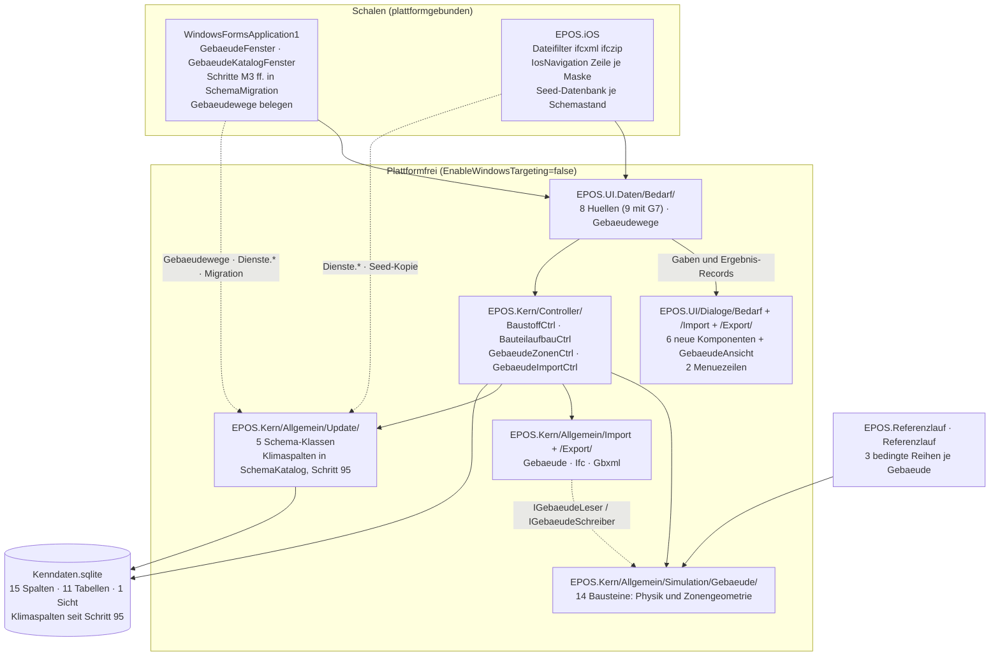

### 1.2 Pakete, Ordner und Dateien

Namensraum **aller** neuen Kernklassen ist `WindowsFormsApplication1` — der Kern führt einen
einzigen flachen Namensraum; ein Unternamensraum wäre die erste Ausnahme und bräche die
`InternalsVisibleTo`-Gewohnheit (Befund T 1.1).

| Ort | Dateien | Stufe |
|---|---|---|
| `EPOS.Kern/Allgemein/Simulation/` | **die zwei Fassaden** `SimulationWaermebedarf.cs` (Weiche am Eingang, E20) und `SimulationKaeltebedarf.cs` (Kälteseite, E21) sowie `GebaeudeVorbereitung.cs` — der modellfreie Vorbereitungsschritt **vor** der Weiche, den beide Fassaden lesen, dazu `IGebaeudeRechenweg.cs` (die Naht der Weiche, 1.5) und `Anlagenfahrplan.cs` samt der Naht `Anlagenverfuegbarkeit` (AK2) — er liegt **außerhalb** beider Module und wird von der Fassade gerufen | G1 · KU1 · AK2 |
| `EPOS.Kern/Allgemein/Simulation/Gebaeude/` | `Zonenmodell2K.cs` (mit `Stundenrand` und `Stundenergebnis`), `ErsatzparameterRC.cs`, `Bauteilreduktion.cs`, `GebaeudeKlimaweg.cs`, `GebaeudeModellEingang.cs`, `GebaeudeModellErgebnis.cs`, `Gebaeudepruefung.cs`, `Zonenkopplung.cs`, `ZonenEingang.cs`, `ZonenErgebnis.cs`, **`Zonengeometrie.cs`** (mit `Zonenumriss`, E11), **`Waermeuebergabe.cs`** (die Übergabegleichung der Anlagenkopplung) | G0 · G1 · G3 · G6 · G6c · AK1 |
| `EPOS.Kern/Allgemein/Simulation/Altweg/` | `TagesbilanzWaermebedarf.cs` — der Tagesbilanz-Weg, **Zeichen für Zeichen** aus `SimulationWaermebedarf` hierher verschoben (E20). Er bekommt keine neue Funktion mehr, kennt **keine** Kälteseite und **bleibt als eingefrorener Bestandsweg, bis die Stufe GA ihn ablöst** (E23, E26; GA fällig nach Q24, E27) | G1 (Verschiebung) · GA (Rückbau) |
| `EPOS.Kern/Allgemein/Update/` | `GebaeudeSchema.cs`, `BaustoffSchema.cs`, `BauteilaufbauSchema.cs`, `ZonenSchema.cs`, `ImportzuordnungSchema.cs`; die Klimaspalten (M4) stehen ohne eigene Klasse in `SchemaKatalog.Schritt95_Klimaspalten` (Schemaschritt 95, umgesetzt) | G1 · G3 · G6 · G4 |
| `EPOS.Kern/Allgemein/Import/Gebaeude/` | `IGebaeudeLeser.cs`, `GebaeudeImportAblauf.cs`, `GebaeudeImportProfil.cs`, `GebaeudeImportSatz.cs`, `GebaeudeAbbild.cs`, `GebaeudeZuordnungsModell.cs`, `GebaeudeFeldzeile.cs` | G4 |
| `EPOS.Kern/Allgemein/Import/Ifc/` | `IfcLeser.cs`, `IfcGebaeudeAbbild.cs`, `IfcBauteilAbbild.cs`, `IfcSchichtAbbild.cs`, `IfcRaumAbbild.cs`, `IfcSchemaStand.cs`, `IfcSektor.cs`, `IfcImportProfil.cs` (umgesetzt: `IfcLeser.cs`, `IfcAbbildBauer.cs`, `IfcEigenschaften.cs`, `IfcEinheiten.cs`, `IfcPlatzierung.cs`, `IfcProtokoll.cs`, `IfcGebaeudeAbbild.cs`, `IfcSchemaStand.cs`, `IfcImportProfil.cs`; Bauteil, Raum und Schicht stehen im gemeinsamen `GebaeudeAbbild`, der Sektor in `GebaeudeAggregation` — eigene Dateien dafür gibt es nicht) | G4a |
| `EPOS.Kern/Allgemein/Import/Gbxml/` | `GbxmlLeser.cs`, `GbxmlAbbild.cs`, `GbxmlImportProfil.cs` | G4c |
| `EPOS.Kern/Allgemein/Export/Gebaeude/` | `IGebaeudeSchreiber.cs`, `GebaeudeExportAblauf.cs`, `GebaeudeExportProfil.cs` | G7 |
| `EPOS.Kern/Allgemein/Export/Ifc/`, `…/Gbxml/` | `IfcSchreiber.cs` · `GbxmlSchreiber.cs` | G7c · G7a |
| `EPOS.Kern/Controller/` | `BaustoffCtrl.cs`, `BauteilaufbauCtrl.cs`, `GebaeudeZonenCtrl.cs`, `GebaeudeImportCtrl.cs`; geändert `GebaeudeBedarfCtrl.cs`, `GebaeudeStammCtrl.cs`, `ProjektGebaeudeCtrl.cs`, `WizardCtrl.cs`, `ProjektDuplizierenCtrl.cs` | G1 · G3 · G4 · G6 |
| `EPOS.Kern/Model/` | `BaustoffModel.cs`, `BauteilaufbauModel.cs`, `BauteilschichtModel.cs`, `ZoneModel.cs`, `BauteilModel.cs`, `ZonenluftstromModel.cs`, `ImportquelleModel.cs`, `ImportzuordnungModel.cs` | G3 · G4 · G6 |
| `EPOS.UI/Dialoge/Bedarf/` | `BaustoffKatalogDialog.razor` + `…Daten.cs` (G3), `BauteilaufbauDialog.razor` + `…Daten.cs` (G3), `BauteilDialog.razor` + `…Daten.cs` (G3), `ZonenDialog.razor` + `…Daten.cs` (G3 in der Grundform, mit G6b um Mehrzonenfelder und Luftaustausch erweitert), `GebaeudeAnsicht.razor` + `GebaeudeAnsichtDaten.cs` (E11) | G3 · G6 · G7 |
| `EPOS.UI/Dialoge/Import/` | `GebaeudeImportDialog.razor` + `GebaeudeImportDaten.cs` | G4 |
| `EPOS.UI/Dialoge/Export/` | `GebaeudeExportDialog.razor` + `GebaeudeExportDaten.cs` — **neu**, kein Gegenstück im Bestand | G7 |
| `EPOS.UI/wwwroot/` | `three.min.js` samt Lizenztext, **lokal** ausgeliefert, nie vom CDN (E11) | G7b |
| `EPOS.UI.Daten/Bedarf/` | **aus der Schale gezogen:** `GebaeudeHuelle.cs`, `GebaeudeKatalogHuelle.cs`, `GebaeudeWohnflaecheHuelle.cs` (sie ist nur noch Gabenbauer — ihr Fensterweg `Oeffnen` hat schon heute keinen Aufrufer mehr und fällt weg). **Neu:** `GebaeudeBedarfHuelle.cs` (die Gaben des Bedarfsdialogs stehen heute in `GebaeudeHuelle`), `Gebaeudewege.cs`, `BaustoffKatalogHuelle.cs`, `BauteilaufbauHuelle.cs`, `GebaeudeZonenHuelle.cs`, `GebaeudeImportHuelle.cs`, `GebaeudeExportHuelle.cs` (G7) | G1 · G3 · G4 · G6 · G7 |
| `WindowsFormsApplication1/Views/Gebäude/` | **nur** `GebaeudeFenster.cs`, `GebaeudeKatalogFenster.cs` — die Fensterrümpfe, die bleiben, wenn der plattformfreie Teil von `GebaeudeHuelle.cs` und `GebaeudeKatalogHuelle.cs` gezogen ist. **Nur diese zwei Hüllen öffnen heute ein Fenster** (`BlazorDialogForm`, `ShowDialog`); der Zuschnitt gehört zu **A10** | G1 |

**Was wo nicht liegen darf.** Die Physik nicht in einer Hülle, nicht in einer Komponente, nicht in
einem Werkzeug. Der Leseweg eines Formats nicht im Controller, der Schreibweg nicht in der
Komponente. Eine `*Schema`-Klasse nicht in der Schale — dort steht allein der Schrittkörper, der
sie ruft. Und **kein zweites `CREATE TABLE` und kein zweites `CREATE VIEW`** irgendwo im Baum
(R1, W17). **Und kein Aufruf über die Modulgrenze:** `Gebaeude/` nennt nichts aus `Altweg/`,
`Altweg/` nichts aus `Gebaeude/`. Die Wärmefassade und der Vorbereitungsschritt kennen beide
Seiten; die **Kältefassade kennt allein `Gebaeude/`** und weist ein Altweg-Gebäude benannt mit
Kältebedarf 0 aus; der `Anlagenfahrplan` liegt außerhalb beider Module und nennt keines von beiden
(E20, E21; Wächter `Modultrennungswache`, 1.7).

**Fremdbestandteile — ein NuGet-Paket und eine lokal ausgelieferte JS-Bibliothek.** Der **Kern**
nimmt genau **eine** neue Paketzeile: `Xbim.IO.MemoryModel`, zentral versioniert in
`Directory.Packages.props`, die drei Schemapakete transitiv (ADR-003, E3 — kein `IfcStore`, kein
Esent, kein `Xbim.Geometry`, nie geforkt, nie gepatcht). gbXML kommt **ohne** Paket: LINQ to XML mit
handgeschriebenem Lesemodell (ADR-004, angenommen; A7 entschieden). Die **Oberfläche** nimmt für die Körperansicht
nach **E11** `three.js` (MIT) hinzu — **lokal** unter `EPOS.UI/wwwroot`, nie vom CDN, als gewöhnliche
Auslieferungsdatei, nicht als Paket. Beide stehen auf der Lizenzhinweisseite (4.5), und für
`three.js` gilt dieselbe Auflage wie für jedes Fremdstück auf dem iPad: **erst messen, dann zusagen**
(3.7). Der **Grundriss** kommt ohne Bibliothek aus — SVG in der Komponente —, und das ist zugleich
der Rückfall, wenn die Körperansicht auf einer Plattform nicht trägt.

### 1.3 Die Klassen des Rechenkerns

| Baustein | Zweck | Zustand | Kennt **nicht** | Stufe |
|---|---|---|---|---|
| `SimulationWaermebedarf` (Fassade) | die **eine Weiche am Eingang** der Gebäudebedarfsrechnung: Sie ruft den Vorbereitungsschritt, liest den Rechenweg des Gebäudes und ruft **genau ein** Modul — `Gebaeude/` oder `Altweg/` | wie bisher, je Lauf | die Physik beider Wege — sie liegt in den Modulen | G1 |
| `SimulationKaeltebedarf` (Fassade) | das **Gegenstück auf der Kälteseite** (E21): dieselbe Bauform, derselbe Vorbereitungsschritt, dieselben Kennzahlmuster. Sie **rechnet das Gebäude nicht ein zweites Mal**, sondern verteilt die Kühllast, die das VDI-Modul je Stunde neben der Heizlast liefert, in den Kanal `KUEHLUNG`; `Kaeltebedarf_Max` ist das Gegenstück zu `Waermebedarf_Max`, die Kältedauerlinie das Gegenstück zur Wärmedauerlinie. **Benannte Abweichung:** Sie kennt **keinen** Altweg — ein Gebäude auf dem Altweg liefert Kältebedarf 0 mit dem Hinweis „Tagesbilanz (Bestandsweg) liefert keine Kühllast" | wie die Wärmefassade, je Lauf | `Altweg/`, die Physik | KU1 |
| `GebaeudeVorbereitung` | der **modellfreie** Schritt **vor** der Weiche: Klimakalender, bisheriger Verbrauch, Flächen, Einheit, Jahresnutzungsgrad — alles, was **beide** Rechenwege und **beide** Fassaden brauchen, und **nur** das. Sein Vertrag steht unten ausgeschrieben; die Schwesterpapiere verweisen auf diese Stelle | keiner (reine Aufbereitung) | Rechenweg, Löser, Tagesverteilung — und **Bewohnerzahl und Skalierungsfaktor**, die je Modul entstehen | G1 |
| `TagesbilanzWaermebedarf` (`Altweg/`) | der Tagesbilanz-Weg, Zeichen für Zeichen verschoben: Tageswerte, Tagesverteilung, Abbruch bei fehlender Verteilung, Stundenverteilung. **Keine neue Funktion**, allein gegen die Referenzbasis gehalten | wie im Bestand, je Instanz | `Gebaeude/` — er ruft **nichts** daraus; Kühllast kennt er nicht | G1 (Verschiebung) |
| `Zonenmodell2K` | der Löser einer Zone: baut die Systemmatrix einmal, rechnet je Blockstunde einen Schritt | zwei `double` (die beiden Knotentemperaturen), je Instanz | Datenbank, Protokoll, Oberfläche, `Tab_*` | G0 |
| `Stundenrand` | der Vertrag **hinein**: Außen- und Äquivalenttemperatur, Soll- und Höchstwert, die drei Lasten, Leistungsgrenze, Strahlungsanteil der Heizung; **ab AK1 drei Felder mehr** — `VorlaufC`, `UebergabeKennwerte`, `ReglerbandK` ([Anlagenkopplung](Konzept_Anlagenkopplung_Gebaeudesimulation_EPOS-Plan.md) 6.1) | `readonly struct`, keiner | alles Übrige | G0 · AK1 |
| `Stundenergebnis` | der Vertrag **heraus**: Heiz- und Kühlleistung als **Blockmittel**, Luft- und operative Temperatur, die beiden Endzustände; **ab AK1** dazu `VorlaufC`, `RuecklaufC` und der `Begrenzungsgrund` | `readonly struct`, keiner | alles Übrige | G0 · AK1 |
| `ErsatzparameterRC` | `record` mit den reduzierten RC-Größen; zwei Fabrikwege `AusKlassenweg(...)` und `AusBauteilweg(...)`; der Erbauer trägt die harten Prüfungen mit **benanntem** Fehler statt stillem Rückfall | unveränderlich | Zonen und Bauteile als Tabellenzeilen | G0 · G3 |
| `Bauteilreduktion` | Kettenmatrix je Bauteil, `System.Numerics.Complex` (`double`-basiert, `DoubleWacheTests` bleibt grün) | keiner | Zonen, Klima | G0 (leerer Platz) · G3 |
| `GebaeudeKlimaweg` | bereitet die Klimareihen für das Modell auf: Zeitbezug der Sonnengeometrie, Azimutzuordnung der vier Fensterrichtungen, Erdreichtemperatur, Wochenendkalender | keiner (reine Umrechnung) | `Tab_Solar` als Tabelle — er bekommt die gelesenen Zeilen | G1 |
| `GebaeudeModellEingang` | die 8 760 Randbedingungen eines Gebäudes samt `ErsatzparameterRC` und dem Schalter `Pruefmodus` (das **Prüforakel des Eingangsbaus** — nicht zu verwechseln mit dem Prüfmodus der iOS-Schale, 4.5); **die statische Fabrik `Bauen(...)` ist der Eingangsbauer** und die eine Stelle, an der `GebaeudeKlimaweg` gerufen wird | unveränderlich nach `Bauen` | Löser, Kanal, Bericht | G1 |
| `GebaeudeModellErgebnis` | Reihen und Kennzahlen eines Gebäudes; `HeizlastW` in Watt, Zeitreihen kWh, Jahressummen MWh, Leistungen kW — **die Einheit steht im Namen** | unveränderlich | Datenbank, Anzeige | G1 |
| `Gebaeudepruefung` | die Prüfungen **zwischen** Geschwistern je Gebäude: Flächensumme, geschlossene Hülle, Trennflächenbilanz, Nachbar existiert, Luftstrombilanz, Zonenzahl; liefert eine `PruefMeldung`-Liste, Schlüsselpräfix `GEBP_` | keiner (prüft einen übergebenen Satz) | Anzeigetext, Ressourcen | G1 (Gebäudeebene) · G6 (Zonenebene) |
| `Zonenkopplung` | der Durchlauf über die Zonen **einer** Stunde in fester Reihenfolge, mit den Abbruchmaßen und einer Höchstzahl an Durchläufen (ADR-005) | je Stunde, je Instanz | die Physik einer Zone — die bleibt `Zonenmodell2K` | G6 |
| `ZonenEingang` / `ZonenErgebnis` | Randbedingungen und Ergebnis je Zone; `GebaeudeModellEingang` führt sie als **geordnete** Liste, `GebaeudeModellErgebnis` summiert die Gebäudesumme | wie ihre Wirte | Gebäudesummen, Kanal | G6 |
| `Zonengeometrie` / `Zonenumriss` | das **Zonengeometrie-Modell** nach **E11**: je Zone ein Grundrisspolygon, eine Höhe, ein Geschoss und die Zuordnung der Bauteile zu den Polygonkanten, zu Boden und zu Decke. Zwei Fabrikwege wie bei `ErsatzparameterRC`: `AusRaumgrenzen(...)` (mit IFC, aus den Raumgrenzen) und `AusFlaechen(...)` (ohne IFC, aus Zonenfläche und dem Seitenverhältnis der Bauteilgruppen). **Eine Quelle, drei Abnehmer:** Ansicht, gbXML-Export, IFC-Export | unveränderlich nach dem Bauen | Datei, Format, Oberfläche, `three.js` | G6c |
| `Waermeuebergabe` | die **Übergabegleichung** der Anlagenkopplung: Newton-Lösung des Rücklaufs und Sekantenleitwert; eine reine Rechenklasse in `Gebaeude/`, ohne Zustand ([Anlagenkopplung](Konzept_Anlagenkopplung_Gebaeudesimulation_EPOS-Plan.md) 6.1) | keiner | Anlagenseite, Fahrplan, Kanal, Datenbank | AK1 |
| `Anlagenfahrplan` | bildet je Gebäude und Stunde die Naht `Anlagenverfuegbarkeit` (1.5) aus Sperrzeiten, Zeitprogrammen, Abschaltpunkten und Nennleistungen; er läuft **einmal je Projekt**, **neben** den Fassaden und **außerhalb** beider Module | je Lauf | `Gebaeude/`, `Altweg/`, die Physik | AK2 |

**Der Vertrag des Vorbereitungsschritts — und dies ist die eine Stelle, auf die die
Schwesterpapiere verweisen.** Was `GebaeudeVorbereitung` liefert, ist **modellfrei**: Es steht fest,
ohne dass ein Rechenweg gelaufen ist, und beide Module lesen dasselbe. Das sind genau sechs Stücke:

| Stück | Was es ist |
|---|---|
| `Klimakalender` | der Wertträger der Klimareihen, **in zwei Teilen** (unten) |
| `VerbrauchNeu` je Einheit | der bisherige Verbrauch der Gebäudezeile, wie ihn der Bestand liest |
| `FlaecheAlt` | die Gesamtfläche der Gebäudezeile: `Wohnflaeche_gesamt`, nach **E19** die umbenannte `Nutzflaeche_gesamt` mit denselben Werten |
| `Flaeche_Nutzer` | die Nutzerfläche der Gebäudezeile |
| `Einheit` | die Bezugseinheit, auf die sich Verbrauch und Fläche beziehen |
| `Jahresnutzungsgrad` | der Jahresnutzungsgrad der Gebäudezeile |

**Was der Vorbereitungsschritt ausdrücklich nicht liefert: Bewohnerzahl und Skalierungsfaktor.**
Beide entstehen nach **E8** **je Modul** aus dessen **erstem** Lauf; die **Fassade** führt die
Schleife darüber und multipliziert nach. Eine Größe, die zwei Module verschieden bilden, darf nicht
vor der Weiche stehen — sonst rechnete der VDI-Weg mit einer Zahl des Altwegs, und die
Eigenständigkeit, die E26 verlangt, wäre nur behauptet.

**Der Klimakalender hat zwei Teile.** `Klimakalender.Gemeinsam` trägt `WE[365]`,
`Stundentemperatur[8760]`, `WochentagJan1` und die Monatsgrenzen; `Klimakalender.Altweg` trägt
`Sol_N`/`Sol_O`/`Sol_S`/`Sol_W`, `A_Temp` und `TagTyp_W`/`TagTyp_NW`. **Die Weiche reicht dem
VDI-Modul allein `Gemeinsam`**, dem Altweg beides. So steht in der Signatur, was das VDI-Modul
lesen darf, und die `Modultrennungswache` (1.7) kann es prüfen, statt es zu glauben.

**Eine benannte Abhängigkeit vom Bestandsfeld, und sie gilt nur für den Übergang.** Die
NULL-Vorgabe von `Fensterflaeche_Ost` und `Fensterflaeche_West` — je die Hälfte von
`Fensterflaeche_Ost_West` — bildet der **Vorbereitungsschritt**, nicht das VDI-Modul. Die Stufe
**GA** füllt beide Spalten einmalig aus dem Bestandsfeld, bevor sie es entfernt (2.2, 2.4).

**Fassade und Vorbereitungsschritt bleiben über die Ablösung hinaus** (E26): Sie sind die
Gliederung der Gebäudebedarfsrechnung, nicht ein Stück des Übergangs. Weiche,
`IGebaeudeRechenweg` und `Modultrennungswache` leben dagegen **bis zur Stufe GA**.

**Fünf Festlegungen, die aus dem Bestand folgen.**

- **`Stundenrand` und `Stundenergebnis` stehen in `Zonenmodell2K.cs`**, nicht in eigenen Dateien:
  Sie sind der Vertrag des Lösers, und die Prüfgröße ist das **Blockmittel** der Stunde.
- **Zwei Fabrikwege, ein Record.** Klassenweg (G1, aus den k-Wert-/Flächenpaaren und der Bauweise)
  und Bauteilweg (G3, über `Bauteilreduktion`) sind Fabrikmethoden **desselben**
  `ErsatzparameterRC`, nicht zwei Klassen — sonst gäbe es zwei Wahrheiten über dieselben Größen.
- **`Zuruecksetzen` ist Pflicht, keine Bequemlichkeit.** Ein Verbrauchsgebäude **des Altwegs** wird
  **zweimal** gerechnet, wie im Bestand (Umsetzungskonzept 1.5); das **VDI-Modul** rechnet **einen**
  Lauf, und die Skalierung nach E8 ist eine Nachmultiplikation in der Fassade. Die Gegenprobe „zwei
  Läufe byte-gleich" gehört als Rechenprobe dazu.
- **Die Einheit im Namen ist bewacht — aber nur halb.** `EinheitenWacheTests` führt eine feste
  Namensliste von Simulationsklassen (`EPOS.Kern.Tests/EinheitenWacheTests.cs:201-206`) und hält in
  der Gegenprobe Liste gegen Dateien (`:362`). Einzutragen sind
  `Gebaeude/GebaeudeModellErgebnis.cs` und `Gebaeude/ZonenErgebnis.cs` — **mit Unterordner**, sonst
  ist der Wächter rot. `Stundenergebnis` trägt Leistungen in Watt und verlässt den Kern nicht: Es
  gehört **nicht** in die Liste. **Dritter Handgriff desselben Merges:** Die XML-Doku der Liste
  (`:195-200`) und die der Hilfsmethode (`:447`) nennen die Zahl der Dateien im Wortlaut — sechs
  Klassen samt `SimulationControl`, sieben Quelldateien; sie ist auf **neun** zu ziehen. Kein Test
  wird davon rot, der Satz wird bloß unwahr.
- **`GebaeudeModellErgebnis` bleibt `internal` — und der Referenzlauf braucht dafür zwei Zeilen.**
  `EPOS.Referenzlauf` und `Referenzlauf` sind **eigene Assemblys** mit eigenem Namen
  (`EPOS.Referenzlauf/EPOS.Referenzlauf.csproj:28`, `Referenzlauf/Referenzlauf.csproj:35`), und
  `Ergebnisexport.cs` ist in beide verlinkt. `EPOS.Kern.csproj` führt heute `InternalsVisibleTo`
  für `EPOS_Plan`, `EPOS.Kern.Tests`, `EPOS.iOS`, `EPOS.UI.Daten`, `Testdatenbankschema`,
  `Auslieferungsvorlage` und `Auslieferungsvorlage.Tests` (`:67-93`) — **die beiden
  Referenzlauf-Namen fehlen**. Ohne sie übersetzt der Export der drei neuen Reihen (4.4) nicht. Die
  zwei Zeilen entstehen **im selben Merge** wie die Ergebnisklasse; die Klasse selbst wird **nicht**
  `public`.

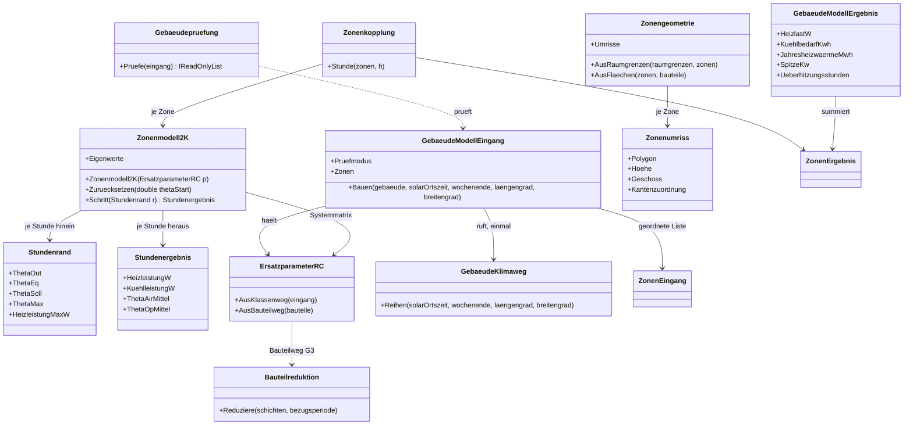

### 1.4 Controller und Hüllen

**Wer was tut** (Befund T 3.1): Der **Kern-Controller** schreibt. Die **Hülle** baut das DTO,
rendert Bilder vorab und nennt je Kennzahl die Einheit, in der ihr Wert vorliegt. Die **Komponente**
kennt weder Datenbank noch Fachklasse und gibt einen Ergebnis-Record zurück.

| Controller | Lesewege | Schreibweg | Warum ein Aggregat |
|---|---|---|---|
| `BaustoffCtrl` | `LesenStamm(filter)`, `LesenJeProjekt(idProjekt)` | `Speichern(satz)`, `CopyFromStamm(idStamm, idProjekt)` **NULL-erhaltend** | Muster der Katalogcontroller; Stamm und Projektkopie sind spaltengleich (R9) |
| `BauteilaufbauCtrl` | `LesenJeAufbau(idAufbau)` für den Dialog, `LesenJeProjekt(idProjekt)` über JOIN für den Rechenkern | `SpeichernJeAufbau(kopf, schichten)` — der **Kopf wird geändert**, die **Schichtzeilen** werden in **EINER** Transaktion gelöscht und neu angelegt, `Reihenfolge` lückenlos neu vergeben (Muster `AnlageStrangCtrl`). Die Id des Aufbaus bleibt dabei stehen; auf eine Schicht-Id zeigt nichts | Kopf und Wertetabelle sind ein Aggregat; zwei Controller hießen zwei Transaktionen |
| `GebaeudeZonenCtrl` | `LesenJeGebaeude(idGebaeude)` für den Dialog, `LesenJeProjekt(idProjekt)` über **eine** Abfrage für den Rechenkern (2.9) | `SpeichernJeGebaeude(zonen, bauteile, luftstroeme)` — **ein Abgleich über die Ids in EINER Transaktion**, in der Reihenfolge *Entfernen → Ändern → Anlegen* (3.3): entfernt wird nur, was der Anwender entfernt hat, geändert wird die vorhandene Zeile, angelegt wird allein, was eine negative Id trägt. **Kein Pauschallöschen je Gebäude** | Ein Aggregat, sonst zerfällt der eine Schreibweg des Dialogs über vier Überlagerungsebenen in drei (A6). Pauschal löschen dürfte er nicht: `Tab_Importzuordnung.ID_Zone` und `.ID_Bauteil` tragen **keine** Kaskade (2.2) und zeigten nach einem Neuanlegen ins Leere (umgesetzt tragen sie `ON DELETE CASCADE` — ein Pauschallöschen räumte die Paarungen ab, 2.7), und `Tab_Zonenluftstrom` hinge mit seinem `CHECK (ID_ZoneA < ID_ZoneB)` an neu vergebenen Ids (2.7) |
| `GebaeudeImportCtrl` | `LesenQuellen(idGebaeude)`, `FindeZuordnung(quellkennung)` (umgesetzt dazu `LesenZuordnungen`, `SchonImportiert`, `ImporteImProjekt`) | `UebernehmenInsProjekt(satz, quelle)` — schreibt Gebäude, Zonen, Bauteile, Aufbauten, Baustoffe **und** `Tab_Importquelle`/`Tab_Importzuordnung` in **einer** Transaktion. (Umgesetzt: kein `UebernehmenInsProjekt`; `SchreibeHerkunft(idGebaeude, quelle, zuordnungen, vorgang)` schreibt Quelle und Paarungen in einer Transaktion bzw. als Sicherungspunkt im Vorgang des Aufrufers `WizardCtrl.GebaeudeZuordnungAnlegen`; die Gebäudezeile entsteht über Katalogeditor und Gebäudeliste, 3.4; `EPOS.Kern/Controller/GebaeudeImportCtrl.cs:211`) | Die Oberfläche schreibt nie selbst; ohne die Herkunftszeilen ist der Round-Trip verbaut |

**`GebaeudeBedarfCtrl` bekommt einen vierten Parameter.** Die Bestandssignatur ist
`internal static GebaeudeBedarfErgebnis Rechnen(int idProjekt, int idKlimaregion, int idZ)`
(`EPOS.Kern/Controller/GebaeudeBedarfCtrl.cs:94`); sie wird zu

```csharp
internal static GebaeudeBedarfErgebnis Rechnen(int idProjekt, int idKlimaregion, int idZ,
                                              string? modellErzwungen = null);
```

`null` ist der Spaltenwert. Der Parameter wirkt **allein auf der gelesenen Modellinstanz**, schreibt
nichts und ruft dieselbe Verzweigung wie der Lauf — „eine Auskunft ruft den Rechenweg des Laufs, sie
schreibt ihn nicht ab". Nur so ist der Vergleich beider Wege im Bedarfsdialog zu holen, ohne zweimal
zu rechnen.

**Die acht Hüllen liegen plattformfrei** in `EPOS.UI.Daten/Bedarf/` — neun mit der Exporthülle in
G7 (Umsetzungskonzept 2.8). In der Schale bleiben zwei Fensterdateien mit `BlazorDialogForm<T>`,
`ShowDialog`, dem Maß und dem `Geschlossen`-Rückruf. Der `IWin32Window` fällt aus **allen** Gaben-Signaturen — er wurde ohnehin
nur weitergereicht (Befund M 5.9). Der Fadenwechsel einer plattformfreien Hülle läuft über
`Kulturweitergabe.Starten`, nie über `Task.Run` (1.6).

### 1.5 Die Nähte

**Zwei Nähte liegen im Kern selbst, nicht zur Plattform hin.** `IGebaeudeRechenweg` ist die Naht
der **Weiche**: `Rechnen(zeile, index, ziel, gemeinsam)` liefert aus **einem** Aufruf die Wattreihe
in `ziel` und den unskalierten Jahreswert `VerbrauchAltKwh`; der vierte Parameter ist allein
`Klimakalender.Gemeinsam` (1.3). Die zwei Ausprägungen heißen `Vdi6007Rechenweg` (Modul
`Gebaeude/`) und `TagesbilanzRechenweg` (Modul `Altweg/`), und der Vertrag steht als **V16** im
[Systementwurf](Systementwurf_Gebaeudesimulation_EPOS-Plan.md) 4.1. Naht und Ausprägungen leben
**bis zur Stufe GA**; Fassade und Vorbereitungsschritt bleiben darüber hinaus (E26).
`Anlagenverfuegbarkeit` ist die Naht der **Anlagenseite** (AK2): je Gebäude und Stunde eine obere
Leistungsschranke, eine erreichbare Vorlauftemperatur und ein `Verfuegbarkeitsgrund`, gebildet vom
`Anlagenfahrplan` außerhalb beider Module, gelesen allein vom Modul `Gebaeude/`
([Anlagenkopplung](Konzept_Anlagenkopplung_Gebaeudesimulation_EPOS-Plan.md) 5.3). Ist die
Anlagenkopplung aus, entsteht sie nicht, und das Modul rechnet wie heute.

**Die vier übrigen Nähte tragen alles Plattform- und Formatgebundene.**

| Naht | Ort | Vertrag | Windows | iOS | Ohne Belegung |
|---|---|---|---|---|---|
| `Gebaeudewege` | `EPOS.UI.Daten/Bedarf/Gebaeudewege.cs` | zwei `static Func<…>`-Haken: `BrauchwasserGaben`, `GebaeudetypGaben` | belegt in `Program.Main` | lässt leer | **„Kein Delegat ist kein Knopf"** — der Dialog zeigt den Knopf nicht, die Kernfunktion bleibt vollständig (Muster `Katalogwege`) |
| `IGebaeudeLeser` | `EPOS.Kern/Allgemein/Import/Gebaeude/IGebaeudeLeser.cs` | `Lesen(Stream quelle, GebaeudeImportProfil profil, IProgress<ImportFortschritt> melder, CancellationToken abbruch) → GebaeudeAbbild`; zwei Ausprägungen `IfcLeser`, `GbxmlLeser`. **Strom statt Pfad** — der Schreiber nimmt ihn schon, auf iOS liefert ihn der `FilePicker`, und der `.ifczip`-Fall muss ohnehin in den Behälter hineinsehen. **Profil in der Signatur**, weil es Dateifilter, `MaxBytes`, Schemaanzeige und Zonierungsregeln trägt (Regel 3) | beide | beide (A2) | der Ablauf legt eine `PruefMeldung` der Stufe **Fehler** und endet — nie eine Ausnahme |
| `IGebaeudeSchreiber` | `EPOS.Kern/Allgemein/Export/Gebaeude/IGebaeudeSchreiber.cs` | `Schreiben(satz, stream, profil) → ImportBilanz`; `IfcSchreiber`, `GbxmlSchreiber` | beide | beide (`Stream`, kein Zielwahldialog nötig) | wie oben |
| `Dienste.Datei` | `EPOS.Kern/Allgemein/Dienste/IDateiDienst.cs` (Bestand) | Die **synchrone** Form ist die Schnittstelle: `DateiOeffnen`, `DateiSpeichern`, `OrdnerWaehlen`, `DateienOeffnen`, `MitSystemOeffnen` (`:19`, `:25`, `:28`, `:63`); die `*Async`-Zwillinge sind **Standardimplementierungen**, die auf sie zurückfallen (`:96-124`). Für den Gebäudeimport ist die asynchrone Form **Pflicht** — dass `WindowsDateiDienst` und `IosDateiDienst` sie überschreiben, ist damit **Voraussetzung, nicht Zusage der Schnittstelle** | Dateiwähler; `OrdnerWaehlen` vorhanden | `FilePicker`, Ablage unter `Documents`, **Teilen-Blatt** statt „Speichern unter…"; `OrdnerWaehlen(Async)` **nicht verfügbar** — ein Zielordner darf keine Voraussetzung eines Ablaufs sein (3.7) | `KeineDateiwahl` liefert `""`, der Aufrufer tut nichts |
| Fortschritt und Abbruch | `ImportFortschritt`, `ImportBilanz` (Bestand) | `IProgress<ImportFortschritt>` und `CancellationToken` hinein, `ImportBilanz` heraus | Fadenwechsel in der Hülle | derselbe Weg | ohne Melder läuft der Lauf still durch — das ist erlaubt |

**Drei Regeln, die für jede dieser Nähte gelten.**

1. **Ein Delegat, der Oberfläche der Plattform öffnet, wird `await`et und nie synchron
   ausgewertet** — synchron stürzt die WebView2 ab (Hausregel `EPOS.UI/CLAUDE.md`, Wächter
   `HuellenwegTests`). Das betrifft jede Dateiwahl und jede Rückfrage im Importweg.
2. **Die Größengrenze ist kein Glied der Plattformnaht, sondern ein Datum des Profils.** Sie
   unterscheidet sich **je Format und je Plattform** — vier Zahlen, nicht eine: IFC 50 MB Windows /
   20 MB iOS (U11), gbXML 25 MB Windows / 25 MB iOS (D15, **E42**); **beide iOS-Zahlen sind im iOS-Lauf
   zur Abnahme von G4a gemessen** (IFC rund 9–11, gbXML rund 7,5 MB Prozessspeicher je MB Datei; Protokoll G4
   Abschnitt 10). **Diese vier Zahlen stehen allein hier** — der Systementwurf verweist auf diese
   Stelle, statt sie zu wiederholen. Sie stehen als `MaxBytes` in `IfcImportProfil` bzw.
   `GbxmlImportProfil`, und die **Hülle** belegt sie je Plattform (Befund U L7). Die Ablehnung ist
   ein `Warnbanner` der Stufe Fehler **vor** dem Lesen — benannt, nicht versucht. **Bei `.ifczip`
   wird nicht die Dateigröße geprüft, sondern die im Zip-Verzeichnis ausgewiesene entpackte Größe
   des enthaltenen STEP- oder XML-Eintrags** (ADR-003, Entscheidung Punkt 3); dafür wird der
   Behälter geöffnet, aber **nicht** entpackt. Eine 15-MB-`.ifczip` mit 300 MB STEP-Inhalt liefe
   sonst genau in den Speicherabbruch, den die Grenze verhindern soll (U11). Ist der Behälter nicht
   lesbar oder trägt er keinen solchen Eintrag, ist das eine **eigene benannte Ablehnung**, nicht
   ein Lesefehler.
3. **Was je Format verschieden ist, steht als Daten im Profil, nicht im Quelltext des Dialogs:**
   Dateifilter, Größengrenze, Schemaanzeige, die Liste der Zonierungsregeln (Datenaustauschkonzept
   2.4). Ein Wächtertest hält Formatnamen aus der Komponente heraus.

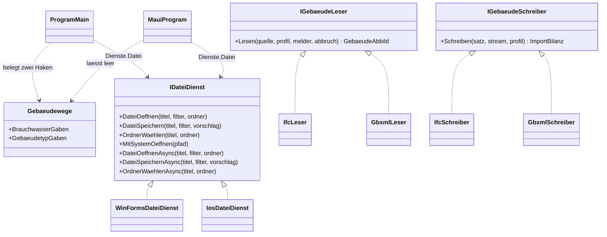

**Die Import- und Exportfamilie** ist die größte neue Ablage und folgt dem Hausmuster **Ablauf
(Verb) / Profil (Daten) / Satz (Ziel)** (Befund T 4.1, Befund N 1.1). IFC und gbXML sind damit
**zwei Profile und zwei Leser über einem Ablauf**, nicht zwei Programme. Drei Regeln gelten
wörtlich: der **Ablauf zeigt nichts an** (der Zuordnungsschritt ist eine Zäsur, kein Rückruf), ein
**fehlerhafter Eintrag bricht den Lauf nicht ab** (nur ein Abbruch durch den Anwender beendet ihn),
und der **Zustand lebt im Ablauf**, nicht in der Komponente.

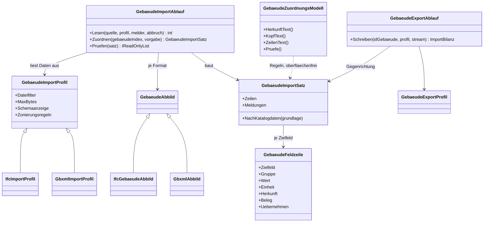

### 1.6 Zustand, Fäden und Kultur

| Regel | Ausprägung in der Gebäudesimulation | Warum |
|---|---|---|
| **Zustand je Instanz, nichts Statisches** | Ein `Zonenmodell2K` entsteht je Gebäude bzw. je Zone und wird je Gebäude verworfen; kein `static`-Feld trägt eine Temperatur über Gebäude hinweg | Der Bestand hat genau diese Falle: `BhkwPlan._prevRoomTemp` ist statisch, und das Ergebnis hängt an der Zeilenreihenfolge (Befund T 5.2). GB behebt es **vor** der ersten Zeile Stundenmodell |
| **Der Vorlauf gehört in den Löser** | `Zonenmodell2K` fährt seinen Vorlauf selbst; der Aufrufer sieht ihn nicht | Wer ihn außen anhängt, hat wieder einen Zustand, der zwischen Gebäuden reisen kann |
| **Zweimal rechnen muss gehen** | `Zuruecksetzen(thetaStart)` vor jedem Lauf; die Verhältnisrechnung des bisherigen Verbrauchs (E8) ruft den **Altweg** wie im Bestand ein zweites Mal — hinter derselben Weiche, nie den Weg des anderen Moduls; das VDI-Modul liefert Reihe und `VerbrauchAltKwh` aus **einem** Lauf, die Fassade multipliziert nach (1.3, 4.1) | Sonst mischt die Verhältnisrechnung zwei Zustände oder gar zwei Rechenwege, und die zweite Zahl hängt an der ersten |
| **Der Lauf ist einfädig** | kein `Parallel.For` über die Gebäude, kein `Task.Run` in Kern, Engine, `EPOS.UI.Daten` und `EPOS.UI` — auch nicht im `@code`-Block einer `.razor` | Wächter `ParallelitaetWacheTests`; das Budget gibt keinen Anlass (Systementwurf Kap. 7), und Parallelität widerspräche dem Determinismusversprechen |
| **Fadenwechsel nur in der Hülle, nur über `Kulturweitergabe.Starten`** | Der Importfaden entsteht in `GebaeudeImportHuelle`, nicht im Ablauf und nicht in der Komponente | Ein Faden ohne eigene Kultur liest den prozessweiten `DefaultThreadCurrentCulture`, und der ist veränderlich |
| **Meldungen über den vorhandenen Kanal** | `SimulationProtokoll.Aktuell` für Laufwarnungen (fehlende Eingangsgröße, nicht konvergierter Durchlauf, erreichte Leistungsgrenze); `PruefMeldung` für Fachprüfungen | Keine neue Ausnahmeklasse, keine gewachsene Signatur (Systementwurf Kap. 6) |

**Der Importfaden, vollständig geregelt** — er ist der einzige lange Lauf der Gebäudesimulation:

1. **Verbindungsbesitz.** Der Ablauf **liest** die Datei im Arbeitsfaden und berührt die Datenbank
   dabei **nicht**. Geschrieben wird erst in `GebaeudeImportCtrl.UebernehmenInsProjekt`, und das
   läuft auf dem Faden des Aufrufers über `DataRepository` wie jeder andere Schreibweg. (Umgesetzt:
   in `GebaeudeImportCtrl.SchreibeHerkunft`, gerufen aus `WizardCtrl.GebaeudeZuordnungAnlegen` beim
   Speichern der Gebäudeliste — Projektkopie und Herkunft in einem Vorgang, 3.4.)
2. **Eine Transaktion je Übernahme.** Bis zu rund **3 500** Zeilen je Zonenprojekt (Befund V 6.2 —
   die 3 200 dort sind allein die Zeilen der Importzuordnung) gehen in **einer** Transaktion hinein
   — teils geschriebene Zonen ohne ihre Bauteile wären ein Gebäude, das niemand gewollt hat.
3. **Abbruch nur vor dem Schreiben.** Der `CancellationToken` wirkt im **Lese**- und im
   **Prüf**schritt; der Schreibschritt ist nicht abbrechbar. Ein Abbruch nach der Zäsur ist damit
   kein Fall, den es gibt.
4. **Sperrverhalten.** Solange die Übernahme läuft, steht **kein Schließkreuz** und Esc schließt
   nicht — dieselbe Regel wie im Katalog- und Klimaimport (Befund U 4.1). Weil die SQLite-Datei im
   Betrieb eine Schreibsperre hält, läuft in dieser Zeit kein zweiter Schreibweg; die Sperre „ein
   Lauf zur Zeit" des Simulationsbereichs bleibt davon unberührt.
5. **Verbindungsbesitz im Export — dieselbe Regel in Gegenrichtung.** Auch der Exportablauf berührt
   die Datenbank **nicht**: Die **Hülle** liest den Satz **vor** dem Fadenwechsel über
   `GebaeudeZonenCtrl.LesenJeGebaeude`, `BauteilaufbauCtrl.LesenJeAufbau` und
   `ProjektGebaeudeCtrl.ReadAll` und gibt ihn fertig hinein (4.6). Deshalb gibt es **keinen**
   Exportcontroller: Es entsteht keine neue Schreibung, und ein Leseweg, der schon besteht, wird
   nicht verdoppelt.

### 1.7 Abhängigkeitsregeln und Wächter

Siebzehn prüfbare Sätze in sechzehn Nummern — AR8 zerfällt in zwei Hälften mit verschiedenen
Wächtern. Jeder Satz hat einen Wächter oder eine benannte Probe; wo einer fehlt, steht es dabei.

| # | Regel | Wächter |
|---|---|---|
| **AR1** | Kein `Parallel.*`, `Task.Run`, `new Thread`, `ThreadPool.QueueUserWorkItem`, `.AsParallel()` in Kern, Engine, `KiKern`, `EPOS.UI.Daten`, `EPOS.UI` — `.cs` **und** `.razor` | `ParallelitaetWacheTests` |
| **AR2** | Wer eine Kultur setzt, stellt sie zurück; Testklassen mit deutschem Text-Assert nehmen die Hausvorrichtung | `KulturwaechterTests`, `EposBunitContext`, `Kulturvorrichtung` |
| **AR3** | Wer die Testdatenbank benutzt **oder** ein `Dienste.*` tauscht, trägt `[Collection("Testdatenbank")]` | `DiensteSammlungTests` |
| **AR4** | Kein `float`, kein `MathF.`, kein `f`-Suffix, kein `Convert.ToSingle` unter `Allgemein/Simulation/**` | `DoubleWacheTests` (greift über Unterordner — deshalb liegt die Physik dort) |
| **AR5** | Jede Jahressumme trägt ihre Einheit im Namen; **die neuen Ergebnisklassen gehören in die Namensliste**, mit Unterordner | `EinheitenWacheTests` (`:201-206`, Gegenprobe `:362`) |
| **AR6** | Kein Faktor 1 000 auf einer Energiemenge in Anzeige und Hüllen; umgerechnet wird im Kern | `EinheitenWacheTests`, Wächter 1 |
| **AR7** | Jede Marke, auf die eine Rechnung zusteuert (Höchstraumtemperatur, Leistungsgrenze, Umschaltzeitpunkt), vergleicht über `Rechenrand.SchwelleErreicht`, nicht über `>=` | `RechenrandTests` prüft den Rand selbst; die Anwendung ist **Probe**, nicht Wächter |
| **AR8a** | Datenzugriff nur über `DataRepository` mit `?`-Parametern, **nie** über einen zusammengesetzten SQL-Text | `DatenzugriffTests` prüft die Platzhalter- und Typumsetzung (`:35-83`); für die **Texte** ist `Werkzeuge/SqlDialektPruefer` die Probe. Der Bestand zeigt, dass die Regel einen Halt braucht: `GebaeudeKatalogHuelle.cs:309` setzt einen SQL-Text zusammen |
| **AR8b** | Kein SQL, kein `DataRepository`, kein `DbParam` in einer Razor-Komponente | Hausregel `EPOS.UI/CLAUDE.md:14` — **bislang unbewacht**; ein Wächter wäre ein fünfter neuer und steht nicht in dieser Liste |
| **AR9** | Jeder Gaben-Schlüssel trifft ein `[Parameter]` | `ParametersatzTests` + `Parametersatzwache` am Gerät |
| **AR10** | Kein modales Systemfenster im Blazor-Ereignis; ein plattformöffnender Delegat wird `await`et | `HuellenwegTests` |
| **AR11** | Jeder Dialogkopf trägt das Schließkreuz beim Titel; ein Titel, eine Stelle | `SchliesskreuzWacheTests`, `UeberlagerungstitelTests` |
| **AR12** | Kein CSS-Nesting, keine verlorene Klammer, keine Farbe als Rückfall in der Regel | `StilblattTests` |
| **AR13** | Keine Arbeitsordner, keine Datenbankkopien, keine `*.bak`/`*.orig` im Repositorium | `RepositoryOrdnungWacheTests` |
| **AR14** | Jeder relative Verweis hat ein Ziel, **jedes** Papier unter `aktuell/` hat seine Indexzeile in [`Dokumentation/LIESMICH.md`](../LIESMICH.md); keine Hersteller- und Produktdaten in den Wiki-Quellen. Der Wächter prüft die Indexpflicht als **eigenen Fall**, ohne Ausnahmeliste — **die Indexzeile dieses Papiers und seines Schwesterpapiers entsteht deshalb im Abnahme-Commit**, zusammen mit den Zeilen der übrigen Papiere der Gebäudesimulation | `DokumentationLinkWacheTests`, `WikiProduktdatenWacheTests` |
| **AR15** | Jede neue Fachtabelle ist `STRICT`, ihr Schlüssel `INTEGER PRIMARY KEY AUTOINCREMENT`, jede `CREATE`-Anweisung und jeder Index tragen `IF NOT EXISTS`, Textlängen stehen als `CHECK (length(...))` statt als Typlänge (2.2) | Schemaprobe `Werkzeuge/Testdatenbankschema`; dazu der **Prüfmodus der iOS-Schale**, der die `STRICT`-Tabellen **zählt** (4.5) |
| **AR16** | **Der VDI-Weg (`Gebaeude/`) nennt nichts aus `Altweg/`, der Altweg nichts aus `Gebaeude/`, und keine Datei unter `Gebaeude/` nennt eine Altweg-Datenquelle** — allein die Wärmefassade und der Vorbereitungsschritt kennen beide Seiten, die **Kältefassade nur `Gebaeude/`** (E20, E21); der `Anlagenfahrplan` liegt außerhalb beider Module und nennt keines von beiden (AK2) | `Modultrennungswache` (neu, unten) |

**Vier Wächter kommen hinzu, ein vorhandener bekommt neue Einträge** — ohne sie hat die Architektur
fünf Stellen ohne Halt:

| Neu | Was er prüft | Warum |
|---|---|---|
| **`Modultrennungswache`** (Test `EPOS.Kern.Tests/ModultrennungswacheTests.cs`) | **Vier Sätze.** (1) Keine Datei unter `EPOS.Kern/Allgemein/Simulation/Gebaeude/` nennt einen Bezeichner aus `Altweg/` **oder eine Altweg-Datenquelle** — `Sol_N`/`Sol_O`/`Sol_S`/`Sol_W`, `A_Temp`, `TagTyp_W`/`TagTyp_NW`, `Tab_DBTagV`, `Abfrage_Tagverteilung`, `Fensterflaeche_Ost_West`, `Typ` als Verteilungsschlüssel, `Klimakalender.Altweg`. (2) Keine Datei unter `Altweg/` nennt einen Bezeichner aus `Gebaeude/`. (3) Die **Kältefassade** `SimulationKaeltebedarf` nennt `Altweg/` nicht (E21), und der `Anlagenfahrplan` nennt keinen der beiden Ordner (AK2). (4) **Ausbauprobe, statischer Teil:** Außer der Weiche in `SimulationWaermebedarf`, dem Rückweg-Test und der Wache selbst nennt **keine** Datei des Kerns `Altweg/`. Die Namensliste beider Ordner ist die Quelle, die Gegenprobe hält Liste gegen Dateien. **Muster ist `EinheitenWacheTests`** mit seiner festen Namensliste (`:201-206`) und ihrer Gegenprobe (`:362`); die Bauform ist die eines reinen Textwächters wie `ParallelitaetWacheTests` — er braucht keinen Lauf. Die Wache entsteht mit der Verschiebung in G1 und lebt **bis zur Stufe GA** (fällig nach Q24; E26, E27) | E20 trennt die Rechenwege; ohne Halt wandert beim ersten gemeinsam gebrauchten Hilfsstück wieder ein Aufruf über die Grenze, und der byte-gleiche Nachweis des Altwegs wäre nicht mehr zu führen. Satz (4) ist zugleich die Vorstufe des **Gates von GA** — der vollständigen Ausbauprobe (Kap. 4) |
| **`SichtQuelleWache`** | Im ganzen Baum steht **kein zweites** `CREATE VIEW` für `Abfrage_Projektgebaeude`; ab M3 ist `GebaeudeSchema.SQL_VIEW_NEU` die einzige Quelle, `sql/schema/002_views.sql` bleibt der eingefrorene Stand 61 | SQLite kennt kein `ALTER VIEW`; zwei Quellen laufen beim ersten Nachtrag auseinander, und der Fehler fiele erst im Leser auf (W17) |
| **Determinismusprobe** | Dasselbe Gebäude zweimal hintereinander gerechnet liefert **byte-gleiche** Reihen; ein Projekt mit zwei Gebäuden liefert dasselbe Ergebnis in umgekehrter Zeilenreihenfolge. **Ab G6c dazu die Geometrie:** dieselbe Eingabe ergibt dieselben Polygone in derselben Reihenfolge — und damit einen byte-gleichen Export (E11) | Die Gegenprobe zur statischen Falle des Bestands und zur Pflicht von `Zuruecksetzen`; für die Geometrie die Bedingung dafür, dass Ansicht und Export dasselbe Gebäude zeigen |
| **`KiDialogkatalog`** (vorhandener Wächter, neue Einträge) | Jede neue Maske steht im Dialogkatalog des Assistenten; die Zahl ist namentlich geprüft (heute `Assert.Equal(7, katalog.Anzahl)`, `EPOS.UI.Tests/Dialoge/Hilfe/KiDialogkatalogTests.cs:112`) — mit den fünf neuen Masken bis G6 sind es **zwölf**, mit der Exportmaske in G7 **dreizehn** | Eine neue Maske ohne Eintrag macht den Wächter rot — und lässt die Maske ohne Assistenten (3.8) |
| **Trennflächenwächter** | Nicht **beide** Zonen führen dieselbe Trennfläche; die Gegenseite entsteht beim Lesen | Mehrzonenkonzept 4.2 verlangt ihn ausdrücklich; zwei Zeilen über dieselbe Fläche sind ein Fehler |

**Die drei Stellen, an denen es erfahrungsgemäß schiefgeht** (Befund T 7.3): eine neue CSV-Datei im
Referenzlauf **ohne Bedingung** (Schwere `double.MaxValue`, FAIL ohne Schalter dagegen); ein neuer
Schlüssel im Parametersatz **ohne `[Parameter]`** (übersetzt sauber, fällt beim ersten Zeichnen beim
Anwender aus); eine neue Spalte, die über `CopyFromStamm` mitläuft und dort **NULL zu 0 macht**
(W14).

**Zwei `git grep`-Wächter aus [`EPOS.Kern/CLAUDE.md`](../../EPOS.Kern/CLAUDE.md) müssen nach jedem
Merge der Import- und Exportfamilie leer bleiben** — sie halten `System.Windows.Forms`,
`System.Drawing`, `MessageBox.`, `Registry.`, `ProtectedData` und `OleDb` aus `EPOS.Kern/*.cs`
heraus. Gerade diese Familie trägt Dateipfade, Probendateien und eine Ablage im Dokumentenordner;
das ist die Stelle, an der ein Griff nach `Environment.SpecialFolder` oder `ProtectedData` verlockend
ist. Beides gehört in einen `Dienste.*`-Adapter, nie in den Kern.

**Eine Berichtigung an der Einheitenregel.** `EPOS.Kern/CLAUDE.md`, Einheitenregel 4, nennt **zwei**
Umrechnungsnähte für Energiemengen (`SimulationErgebnisCtrl`, `SimulationRunner`). Der Bestand hat
eine dritte: `GebaeudeBedarfCtrl.Rechnen` rechnet die **Jahressumme** selbst um —
`werte.Sum() / 1000` (`EPOS.Kern/Controller/GebaeudeBedarfCtrl.cs:130`), absichtlich zeichengleich
zum Lauf, mit dem Kommentar, der es dort begründet. (`BhkwPlan.WattToKw(werte)` auf `:121` ist
daneben eine **Leistungs**umrechnung und keine Naht der Regel.) Die Regel ist auf **drei** Nähte
fortzuschreiben, in demselben Merge, in dem der vierte Parameter entsteht; ein zweiter Rechenweg in
der Hülle bleibt verboten. Der Wächter prüft die **Namensliste**, nicht die Zeile — Schweigen genügt
hier also nicht.

### 1.8 Probendateien und Prüfdaten

Drei Sorten, drei Orte, drei Regeln — sonst liegen entweder Normzahlen im Repositorium oder große
Fremddateien dauerhaft in der Geschichte.

| Sorte | Ort | Regel |
|---|---|---|
| **Normprüfdaten** (die zwölf Testbeispiele) | `Referenzlaeufe/Normzahlen/`, **gitignoriert**, mit versionierter `LIESMICH.md` **ohne eine einzige Zahl** und einer Vorrichtung `Normzahlen` mit Kennzeichen `Vorhanden`. Die Prüfklasse, die sie benutzt, heißt **`EPOS.Kern.Tests/GebaeudeModellNormfallTests`**: Sie prüft mit dem Band nach E10 und weist die Reserve aus; ohne die Datei schweigt jeder Fall (Muster `TestDatenbank.cs`) | Sie werden **nicht ausgeliefert** und nicht versioniert; ohne Datei **schweigt** jeder Fall. Folge: Der Normfallnachweis ist ein **lokaler** Nachweis, kein CI-Nachweis — die Lücke im Gate gehört ins Protokoll (U8, mit E27 entschieden) |
| **Importproben** (`.ifc`, `.ifcxml`, `.ifczip`, `.xml`) | im **vorhandenen** Ordner `Referenzlaeufe/Importproben/`, neben den Proben der übrigen Importwege (CEC-Listen, `.pan`/`.ond`, VDI-3805-Kessel, Ganglinie), versioniert, gewöhnliche Blobs. **Namensregel:** Vorsatz `ifc_` bzw. `gbxml_`, damit die neuen Dateien von den vorhandenen zu unterscheiden sind | Kleinstdateien je Fehlerbild werden **selbst geschrieben**; die gbXML-Prüfdateien erzeugt der eigene Exporteur im Rundlauf (D3). Eine große Fremddatei kommt nur mit einer `.gitattributes`-Zeile für LFS **im selben Schritt** hinein, dazu ein Vermerk im Abschnitt „Git LFS" von [`Referenzlaeufe/LIESMICH.md`](../../Referenzlaeufe/LIESMICH.md) (M10, mit E27 entschieden) |
| **Schemakopien** (gbXML-XSD) | lokale Kopie im Test, **nie aus dem Netz**, nicht im Installationspaket | **Außerhalb des Repositoriums** — mit E27 entschieden (D17, zu D3): gitignoriert, mit Einrichtungshinweis und einer LIESMICH-Zeile mit Herkunft, Abrufdatum und Lizenzstand „keine"; fehlt die Datei, wird der Validierungstest **benannt übersprungen** (Muster U8). Die verworfene Alternative war eine Kopie unter `EPOS.Kern.Tests/` mit ausgeschriebener Begründung |

**`RepositoryOrdnungWacheTests` greift auf allen drei Wegen** — kein `.work/`, keine
Datenbankkopie, keine `*.bak`. Und **keine Hersteller- und Produktdaten** in einer Probendatei,
deren Inhalt in eine Wiki-Quelle wandert (`WikiProduktdatenWacheTests`): Beispiele tragen neutrale
Namen mit runden Werten.

---

## 2. Datenmodell-Architektur

### 2.1 Das Zielmodell in zwei Bildern

Der Bestand steuert bei: `Tab_Gebaeude` (55 Spalten) mit dem Katalogzwilling `Tab_Gebaeude_STAMM`
(54), die Zuordnung `Z_ProjektGebaeude`, die Sicht `Abfrage_Projektgebaeude` mit **fester**
58-Spalten-Liste, `Tab_Solar` und `Tab_Klimadaten` je Klimaregion, `Tab_DBTagV(-Daten)` als einzige
Kindtabelle des Gebäudes und die `Tab_Ergebnis*`-Familie mit **ausnahmslos** Skalaren je Lauf
(Befund V 2).

Hinzu kommen **15 Spalten** an `Tab_Gebaeude(_STAMM)` und **elf Tabellen**: neun für Baustoffe,
Aufbauten, Schichten, Zonen, Bauteile und Luftströme, zwei für die Importherkunft. Die Klimaspalten
an `Tab_Solar(_STAMM)` und `Tab_Klimaregion(_STAMM)` sind bereits angelegt (Schemaschritt 95, 2.2).

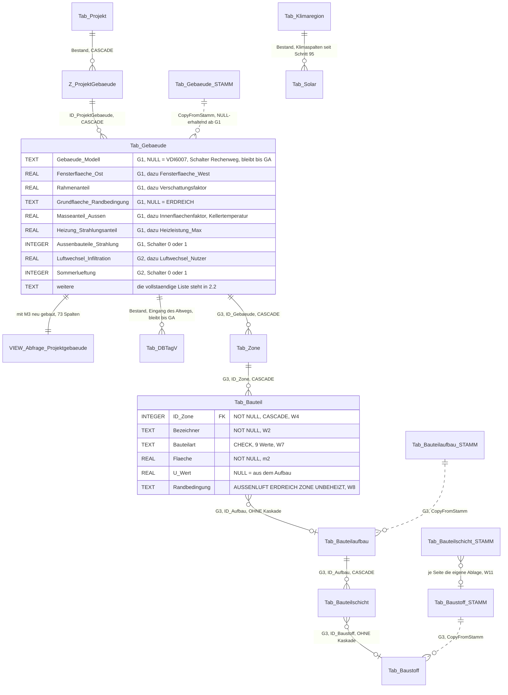

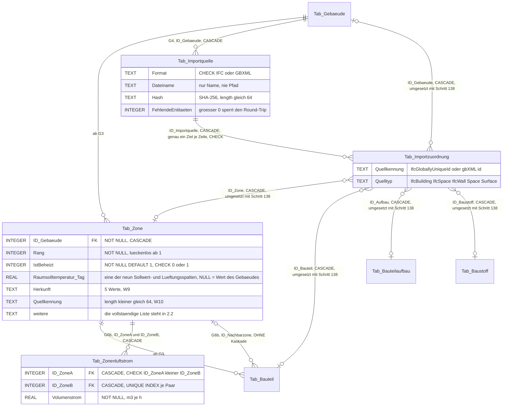

> **Unverändert durch dieses Vorhaben:** `Tab_Projekt`, `Z_ProjektGebaeude`, `Tab_Klimaregion` (seine
> Spalten `Quelle`, `Importdatum`, `Szenario` und `Bezugsjahr` kamen mit den Schritten 95 und 97),
> `Tab_Klimadaten`,
> `Tab_DBTagV(-Daten)` und die 17 `Tab_Ergebnis*`-Tabellen. **Keine `Tab_Zonenkopplung`:** Die
> Trennfläche ist **ein** Bauteil mit `Randbedingung = 'ZONE'` und `ID_Nachbarzone`; eine zweite
> Tabelle wäre eine zweite Wahrheit über dieselbe Fläche.

### 2.2 Tabellen und Spalten, endgültig

**Für alle elf neuen Tabellen gilt ohne Ausnahme** (R4, Mehrzonenkonzept 4.1): Sie sind **`STRICT`**;
ihr Schlüssel ist `INTEGER PRIMARY KEY AUTOINCREMENT`; jede `CREATE TABLE`- und jede
`CREATE INDEX`-Anweisung trägt **`IF NOT EXISTS`**, damit der Schritt wiederholbar bleibt; eine
Textlänge steht als `CHECK (length(...) ≤ n)`, nicht als Typlänge; eine Kaskade zeigt **nur** zum
Eltern (benannte Ausnahme, umgesetzt mit Schritt 138: die fünf Zielverweise der Importzuordnung,
2.7). Die Zahl der `STRICT`-Tabellen ist zugleich die Größe, an der der Prüfmodus der iOS-Schale
die Seed-Datenbank misst (4.5) — sie wächst mit jedem Tabellenschritt und ist dort im selben Merge
nachzuziehen.

**Die 15 neuen Spalten an `Tab_Gebaeude` und `Tab_Gebaeude_STAMM`** — 30 `SchemaSpalte`-Einträge,
definiert in `GebaeudeSchema`. Die Typangaben stehen in Access-Schreibweise und werden beim Anlegen
übersetzt; `YESNO` erzeugt `INTEGER NOT NULL DEFAULT 0 CHECK (… IN (0,1))` von selbst, kein
handgeschriebenes `CHECK`. **Kein DDL-DEFAULT auf einem Fachwert** (R5).

| Spalte | Typangabe | SQLite | NULL bedeutet | Stufe |
|---|---|---|---|---|
| `Gebaeude_Modell` | `TEXT(20)` | TEXT | **`VDI6007`** (E1, W12) | G1 · **bleibt bis GA** (E23, E26; GA fällig nach Q24, E27) |
| `Fensterflaeche_Ost` | `DOUBLE` | REAL | die Hälfte der **Bestandsspalte** `Fensterflaeche_Ost_West` (Modellfeld ab M2: `Fensterflaeche_OstWest`) | G1 |
| `Fensterflaeche_West` | `DOUBLE` | REAL | die Hälfte der **Bestandsspalte** `Fensterflaeche_Ost_West` | G1 |
| `Rahmenanteil` | `DOUBLE` | REAL | Vorgabe | G1 |
| `Verschattungsfaktor` | `DOUBLE` | REAL | Vorgabe | G1 |
| `Grundflaeche_Randbedingung` | `TEXT(20)` | TEXT | `ERDREICH` | G1 |
| `Kellertemperatur` | `DOUBLE` | REAL (°C) | Vorgabe | G1 |
| `Masseanteil_Aussen` | `DOUBLE` | REAL | Vorgabe | G1 |
| `Innenflaechenfaktor` | `DOUBLE` | REAL | Vorgabe | G1 |
| `Heizung_Strahlungsanteil` | `DOUBLE` | REAL | Vorgabe | G1 |
| `Heizleistung_Max` | `DOUBLE` | REAL (kW) | unbegrenzt | G1 |
| `Aussenbauteile_Strahlung` | `YESNO` | INTEGER, `CHECK IN (0,1)` | — (Schalter) | G1 |
| `Luftwechsel_Infiltration` | `DOUBLE` | REAL (1/h) | Vorgabe | G2 |
| `Luftwechsel_Nutzer` | `DOUBLE` | REAL (1/h) | Vorgabe | G2 |
| `Sommerlueftung` | `YESNO` | INTEGER, `CHECK IN (0,1)` | — (Schalter) | G2 |

**Zwei Bestandsspalten bleiben, und ihr Verhältnis zu den neuen ist zu benennen.**
`Fensterflaeche_Ost_West` (`sql/schema/001_grundschema.sql:1144`, `:1201`) wird **nicht** umbenannt
und **nicht** gelöscht — umbenannt wird allein das Modellfeld (M2, unten). Sie bleibt der Wert des
Altwegs und **bleibt mit ihm bis zur Stufe GA** (E23, E26; GA fällig nach Q24, E27); die zwei neuen Spalten
sind die Auflösung nach Himmelsrichtungen, und ihr NULL verweist auf sie zurück. Die NULL-Vorgabe
bildet der **Vorbereitungsschritt** (1.3); **GA füllt beide Spalten einmalig aus ihr, bevor sie die
Bestandsspalte entfernt**. `Luftwechselrate` (`:1170`, `:1227`) bleibt ebenso: Sie ist der Wert, mit
dem der **Klassenweg** rechnet, und steht in der Einfrierregel „gesäte Gebäudedaten" (2.8). Im
**Stundenweg** gilt `Luftwechsel_Infiltration` + `Luftwechsel_Nutzer`; sind beide NULL, fällt der
Weg auf `Luftwechselrate` zurück, und erst wenn auch sie fehlt, auf die Vorgabe. Der Rückfall steht
in einer `Herleitungszeile` am Feld — **still überschrieben wird nichts**. Für die Zone gilt
dieselbe Kette: `NULL` heißt „Wert des Gebäudes", und der Gebäudewert ist diese Summe, nicht die
Bestandsspalte.

**Vor dem Schemaschritt steht eine Umbenennung im Bestand** (Merge M2): Das Modellfeld
`Fensterflaeche_Ost` trägt heute die Spalte `Fensterflaeche_Ost_West` und heißt künftig
`Fensterflaeche_OstWest` — in `GebaeudeModel`, `ProjektGebaeudeModel`, `GebaeudeCtrl`,
`GebaeudeStammCtrl`, `ProjektGebaeudeCtrl`, `SimulationWaermebedarf` und `GebaeudeKatalogHuelle`.
**Wer die neue Spalte anlegt, bevor das Feld umbenannt ist, verliert die Ost-/Westfenster des
Tagesmodells ohne Meldung.** Reihenfolge: Umbenennung vor Schema, Schema vor Modell.

**Die Klimaspalten sind umgesetzt** — der Klimaspalten-Schritt **M4** ist durch den Schemaschritt 95
vorweggenommen (Anwenderentscheid 19.09.2026, Aufträge KL-3/KL-4; Quellen und Zuordnung im
[Konzept Klimadatenquellen](Konzept_Klimadatenquellen_TMY_TRY_EPOS-Plan.md)). Er hat **keine eigene
Schema-Klasse**; die eine Liste für Migration, Testdatenbankschema und Nachweis ist
`SchemaKatalog.Schritt95_Klimaspalten`.

| Tabelle | Spalte | Typ | Quelle | NULL bedeutet |
|---|---|---|---|---|
| `Tab_Solar`, `Tab_Solar_STAMM` | `Gegenstrahlung` | REAL (W/m²) | PVGIS `IR(h)`, TRY `A` | nicht verfügbar; im Stundenweg gilt Δθ_lw = 0 und α_str,A = 5,0 W/(m²K) (Rechenschritte 1.2) |
| `Tab_Solar`, `Tab_Solar_STAMM` | `Luftfeuchte` | REAL (%) | PVGIS `RH`, TRY `RF` | nicht verfügbar; in G1/G2 nicht rechenwirksam |
| `Tab_Solar`, `Tab_Solar_STAMM` | `Bedeckungsgrad` | REAL (Achtel, 0…8) | TRY `N`; PVGIS führt ihn nicht | nicht verfügbar; kein Rechenweg der Gebäudesimulation liest ihn |
| `Tab_Klimaregion`, `Tab_Klimaregion_STAMM` | `Quelle`, `Importdatum` | TEXT | Importweg | Altbestand, nie nachdatiert |

Schritt 97 ergänzt `Tab_Klimaregion(_STAMM)` um `Szenario` und `Bezugsjahr`. **Eine Spalte
`Windgeschwindigkeit` gibt es nicht** (F-S3): Sie hätte keinen Leser, weil der äußere Wärmeübergang
beim festen Vorgabewert bleibt; kommt ein windabhängiger Übergang, ist sie ein eigener
Schemaschritt mit eigener Stufe. Beide Schritte sind reines DDL: **Bestandsregionen bleiben NULL,
bis der Anwender neu importiert**, und der Referenzlauf blieb byte-gleich. **Fehlt die
Gegenstrahlung, wird nicht geschätzt:** `GebaeudeKlimaweg` setzt Δθ_lw = 0 und α_str,A = 5,0 W/(m²K)
und meldet das einmal je Region und Lauf über `SimulationProtokoll`; eine Schätzung aus dem
Bedeckungsgrad wäre möglich, wird aber nicht gerechnet.

**`Tab_Baustoff_STAMM` / `Tab_Baustoff`** (`BaustoffSchema`, spaltengleich nach R9):

| Spalte | Typ | NULL | Bedeutung |
|---|---|---|---|
| `ID` | `INTEGER PRIMARY KEY AUTOINCREMENT` | — | |
| `Bezeichner` | `TEXT NOT NULL CHECK (length ≤ 80)` | — | Name des Stoffes (W3) |
| `Gruppe` | `TEXT CHECK (length ≤ 40)` | ja | Ordnungsgruppe |
| `Hersteller` | `TEXT CHECK (length ≤ 80)` | ja | **NULL = herstellerneutral** (Norm- oder Richtwert); mit G3 nach E39 ergänzt, Teil des natürlichen Schlüssels der Saat |
| `Lambda`, `Rho`, `cp` | `REAL` | ja | Stoffwerte; NULL = nicht angegeben |
| `Quelle` | `TEXT CHECK (length ≤ 120)` | ja | Regelwerk oder Dateiname des Imports |
| `Herkunft` | `TEXT CHECK (IN ('MANUELL','KATALOG','IFC','GBXML','VORGABE'))` | ja | W9 |
| `Quellkennung` | `TEXT CHECK (length ≤ 64)` | ja | W10 |
| nur `_STAMM`: `ReadOnly` | `INTEGER NOT NULL DEFAULT 0 CHECK (IN (0,1))` | — | gehört zur Auslieferung |
| nur Projektkopie: `ID_Projekt` | `INTEGER NOT NULL` | — | **umgesetzt mit Fremdschlüssel** auf `Tab_Projekt` (`ON DELETE CASCADE ON UPDATE CASCADE`) nach der Hausregel seit Schemaschritt 96 — der Entwurf „ohne Fremdschlüssel, wie der Bestand" beschrieb den Stand davor (Konzept N1.46) |

**`Tab_Bauteilaufbau_STAMM` / `Tab_Bauteilaufbau`** (`BauteilaufbauSchema`): `ID`, `Bezeichner`
(`NOT NULL`, ≤ 80), `Beschreibung` (≤ 250), `Bauteilart`, `Quelle`, `Herkunft`, `Quellkennung`; im
Stamm `ReadOnly`, in der Projektkopie `ID_Projekt NOT NULL` mit demselben Fremdschlüssel auf
`Tab_Projekt` wie `Tab_Baustoff`. `Quelle` nimmt den **Dateinamen** eines
Imports auf.

**`Tab_Bauteilschicht_STAMM` / `Tab_Bauteilschicht`** (`BauteilaufbauSchema`, Bauform Wertetabelle):

| Spalte | Typ | NULL | Bedeutung |
|---|---|---|---|
| `ID` | `INTEGER PRIMARY KEY AUTOINCREMENT` | — | |
| `ID_Aufbau` | `INTEGER NOT NULL` | — | FK → `Tab_Bauteilaufbau.ID`, **`ON DELETE CASCADE`** (W5) |
| `Reihenfolge` | `INTEGER NOT NULL` | — | innen → außen, lückenlos ab 1 |
| `ID_Baustoff` | `INTEGER` | ja | FK **ohne** Kaskade; **NULL = freie Eingabe**. In `Tab_Bauteilschicht` auf `Tab_Baustoff`, in `Tab_Bauteilschicht_STAMM` auf `Tab_Baustoff_STAMM` — gleicher Spaltenname, eigene Ablage je Seite (W11) |
| `Dicke` | `REAL NOT NULL` | — | m |
| `IstLuftschicht` | `INTEGER NOT NULL DEFAULT 0 CHECK (IN (0,1))` | — | Schalter |
| `Lambda`, `Rho`, `cp` | `REAL` | ja | **Kopie** der Stoffwerte zum Zeitpunkt der Zuordnung |

Index `(ID_Aufbau, Reihenfolge)`. **Keine Spalte `ReadOnly`** (L1) und **keine eigene `Herkunft`** —
die Schicht erbt die Herkunft ihres Aufbaus.

**`Tab_Zone`** (`ZonenSchema`, keine `_STAMM`-Entsprechung — eine Zone ist Projektware):

| Spalte | Typ | NULL | Bedeutung |
|---|---|---|---|
| `ID` | `INTEGER PRIMARY KEY AUTOINCREMENT` | — | |
| `ID_Gebaeude` | `INTEGER NOT NULL` | — | FK → `Tab_Gebaeude.ID`, **`ON DELETE CASCADE`** (A1) |
| `Rang` | `INTEGER NOT NULL` | — | Reihenfolge, lückenlos ab 1; zugleich die Iterationsreihenfolge der Kopplung |
| `Bezeichner` | `TEXT NOT NULL CHECK (length ≤ 80)` | — | |
| `Nutzflaeche`, `Raumhoehe`, `Volumen` | `REAL` | ja | NULL = aus den Bauteilen bzw. aus `Tab_Gebaeude.Raumhoehe` bzw. Fläche × Höhe |
| `IstBeheizt` | `INTEGER NOT NULL DEFAULT 1 CHECK (IN (0,1))` | — | Schalter |
| `Raumsolltemperatur_Tag`, `_Nachtabsenkung`, `_Wochenende`, `_Ferien`, `Maximaleraumtemperatur`, `Heizung_Strahlungsanteil`, `Heizleistung_Max`, `Luftwechsel_Infiltration`, `Luftwechsel_Nutzer` | `REAL` | ja | **NULL = Wert des Gebäudes** |
| `Interne_Waermegewinne`, `Bewohner` | `REAL` | ja | NULL = anteilig aus dem Gebäude über den Flächenschlüssel |
| `Herkunft`, `Quellkennung` | `TEXT` | ja | W9, W10 |

Dazu die Spaltenblöcke aus KU-S1 und AK-S1, die S-C (Schritt 134) mit anlegt, und der Block aus
KAK-S1 in Schritt 137 ([Mehrzonenkonzept](Konzept_Mehrzonenmodell_IFC_EPOS-Plan.md) 4.2). In G3 liest
der Lauf von der Zone allein `Nutzflaeche` (E40) und ihre Bauteile.

Index `(ID_Gebaeude, Rang)`. **Die neun Sollwert- und Lüftungsspalten spiegeln die Spaltennamen des
Gebäudes buchstabengetreu** — einschließlich des im Bestand vorhandenen `Maximaleraumtemperatur` —,
damit sie niemand später „verbessert" und der Rückfall auf den Gebäudewert eine Namensgleichheit
bleibt, keine Übersetzungstabelle.

**`Tab_Bauteil`** (`ZonenSchema`):

| Spalte | Typ | NULL | Bedeutung |
|---|---|---|---|
| `ID`, `Rang`, `Bezeichner` | wie bei der Zone | — | Namensspalte `Bezeichner` (W2) |
| `ID_Zone` | `INTEGER NOT NULL` | — | FK → `Tab_Zone.ID`, **`ON DELETE CASCADE`** (W4) |
| `Bauteilart` | `TEXT NOT NULL CHECK (IN ('AUSSENWAND','DACH','BODENPLATTE','FENSTER','TUER','INNENWAND','DECKE','VORHANGFASSADE','SONSTIGES'))` | — | neun Werte; `VORHANGFASSADE` trägt U- **und** g-Wert wie ein Fenster (W7) |
| `ID_Aufbau` | `INTEGER` | ja | FK → `Tab_Bauteilaufbau.ID`, **ohne** Kaskade; NULL = nur U-Wert |
| `Flaeche` | `REAL NOT NULL` | — | m² |
| `U_Wert` | `REAL` | ja | NULL = aus dem Aufbau gerechnet |
| `g_Wert`, `Rahmenanteil`, `Verschattungsfaktor` | `REAL` | ja | nur Fenster und Vorhangfassade; NULL = Vorgabe |
| `Neigung` | `REAL` | ja | NULL = nach `Bauteilart` |
| `Azimut` | `REAL` | ja | **Pflicht nur an Außenluft:** NULL ist zulässig bei Neigung 0° oder 180° und an Erdreich, Zone, unbeheiztem Raum oder innerhalb der Zone — eine Wand an Außenluft ohne Azimut wird **benannt abgelehnt**, nicht auf Nord vorbelegt (`GebaeudeZonenCtrl.BrauchtAzimut`, `BauteilEingang`; [Leitkonzept](Konzept_Gebaeudesimulation_VDI6007_EPOS-Plan.md) N1.46, Punkt 9) |
| `Randbedingung` | `TEXT CHECK (IN ('AUSSENLUFT','ERDREICH','ZONE','UNBEHEIZT'))` | ja | NULL = Außenluft, **an `INNENWAND` und `DECKE` NULL = innerhalb der Zone** (Innenbauteilgruppe; einen Wert dafür gibt es nicht) — die Regel steht an einer Stelle, `GebaeudeZonenabbildung.RandAusZeile`; **kein `KELLER`** (W8), und **keine Spalte `IstAussen`** (W6) |
| `ID_Nachbarzone` | `INTEGER` | ja | FK → `Tab_Zone.ID`, **ohne** Kaskade; gesetzt **genau dann**, wenn `Randbedingung = 'ZONE'`, und ≠ `ID_Zone` (Schritt **S-G**) |
| `Psi_L` | `REAL` | ja | ψ·L in W/K; NULL = keine Wärmebrücke |
| `Herkunft`, `Quellkennung` | `TEXT` | ja | W9, W10 |

Index `(ID_Zone, Rang)`.

**`Tab_Zonenluftstrom`** (`ZonenSchema`, Schritt **S-G**): `ID`; `ID_ZoneA`, `ID_ZoneB`
`INTEGER NOT NULL` (FK → `Tab_Zone.ID`, **beide mit `ON DELETE CASCADE`**); `Volumenstrom`
`REAL NOT NULL` (m³/h, Einheit in der XML-Doku der Spaltenkonstante); dazu
`CHECK (ID_ZoneA < ID_ZoneB)` und `CREATE UNIQUE INDEX` über das Paar. **Der `CHECK` normiert die
Richtung, der Index erzwingt eine Zeile je Paar** — erst beides zusammen trägt die Massenbilanz von
selbst. Weil **beide** Seiten Eltern sind, gilt die Kaskadenfalle aus A1 hier **doppelt**.

**`Tab_Importquelle`** (`ImportzuordnungSchema`, eine Zeile je Importlauf): `ID`; `ID_Gebaeude`
`NOT NULL` (FK, **CASCADE**); `Format` `TEXT NOT NULL CHECK (IN ('IFC','GBXML'))`; `Dateiname`
`TEXT NOT NULL CHECK (length ≤ 260)` — **nur der Name, nie der Pfad**; `Hash`
`TEXT NOT NULL CHECK (length = 64)` (SHA-256, hexadezimal klein); `Groesse` `INTEGER NOT NULL`;
`Schemastand` `TEXT`; `Zeitpunkt` `TEXT NOT NULL` (ISO-8601, invariant); `Programmfassung` `TEXT`;
`Zonenregel` `TEXT`; `FehlendeEntitaeten` `INTEGER NOT NULL DEFAULT 0` — **> 0 sperrt den
Round-Trip**.

**`Tab_Importzuordnung`** (`ImportzuordnungSchema`, eine Zeile je Paarung): `ID`; `ID_Importquelle`
`NOT NULL` (FK, **CASCADE**); die **fünf** nullbaren Fremdschlüssel `ID_Gebaeude`, `ID_Zone`,
`ID_Bauteil`, `ID_Aufbau`, `ID_Baustoff` (alle **ohne** Kaskade — umgesetzt tragen alle fünf
`ON DELETE CASCADE`, Schemaschritt 138, Begründung 2.7); `Quellkennung`
`TEXT NOT NULL CHECK (length ≤ 64)`; `Quelltyp` `TEXT NOT NULL CHECK (length ≤ 40)`. Dazu die Regel,
die aus fünf Fremdschlüsseln einen Zeiger macht:

```sql
CHECK ((ID_Gebaeude IS NOT NULL) + (ID_Zone IS NOT NULL) + (ID_Bauteil IS NOT NULL)
     + (ID_Aufbau IS NOT NULL) + (ID_Baustoff IS NOT NULL) = 1)
```

Indizes `(ID_Importquelle)` und `(Quellkennung)`; der zweite ist der Weg des Round-Trips von der
Quellentität zurück zur EPOS-Zeile. **Fünf, nicht vier:** Ohne `ID_Gebaeude` ist die Gebäudeentität
beim Round-Trip nicht wiederzufinden (Datenaustauschkonzept 7.2); die auf vier verkürzte Wiedergabe
in Befund V 3.4 ist an dieser Stelle überholt.

**Persistenzwerte in `DbWerte`** — ASCII, Großbuchstaben, eingefroren, **nie** Anzeigetext; die
XML-Doku jeder Konstante sagt, was NULL bedeutet:

`GEBAEUDE_MODELL_TAGESBILANZ`, `GEBAEUDE_MODELL_VDI6007`; `GRUND_ERDREICH`, `GRUND_KELLER`,
`GRUND_AUSSENLUFT`; `BAUTEILART_AUSSENWAND` … `BAUTEILART_SONSTIGES` (neun);
`RANDBEDINGUNG_AUSSENLUFT`, `_ERDREICH`, `_ZONE`, `_UNBEHEIZT`; `HERKUNFT_MANUELL`, `_KATALOG`,
`_IFC`, `_GBXML`, `_VORGABE`; `IMPORT_FORMAT_IFC`, `IMPORT_FORMAT_GBXML`.

**Sobald Zonen da sind, sind `Tab_Gebaeude.Wohnflaeche_gesamt` und die Flächenspalten abgeleitete
Anzeigen, keine Eingaben** (Mehrzonenkonzept 4.3). Sichtbar gemacht wird das über eine
`Herleitungszeile`; **still überschrieben wird nichts**.

### 2.3 Auflösung der Widersprüche

Kennung wie in Befund V Kapitel 4. Jede Zeile ist eine **Festlegung** dieses Papiers, keine
Empfehlung mehr.

| Nr. | Festlegung | Begründung und Wirkort |
|---|---|---|
| **W1** | **G3 legt alle acht Tabellen an** (Baustoff(_STAMM), Bauteilaufbau(_STAMM), Bauteilschicht(_STAMM), Zone, Bauteil — Schritte **S-A** bis **S-C**); G6b ergänzt allein `Tab_Zonenluftstrom` und `ID_Nachbarzone` (Schritt **S-G**). **Abweichend von Befund V entsteht keine implizite Zone 1**: `Tab_Zone` bleibt leer, bis der Anwender „Gebäude als eine Zone übernehmen" drückt oder ein Import Zonen schreibt — **und dieser Knopf entsteht mit G3**, nicht erst mit G6 | Die Fremdschlüsselziele müssen vorhanden sein, wenn `Tab_Bauteil` und `Tab_Bauteilschicht` entstehen. Eine implizite Zone 1 kehrte dagegen die Verzweigung des Mehrzonenkonzepts 4.3 („`Tab_Zone` leer heißt Klassenweg") um und schaltete jedes Bestandsgebäude ungefragt auf den Bauteilweg. Weil `Tab_Bauteil.ID_Zone` `NOT NULL` ist (W4), braucht der Bauteilweg der Stufe G3 aber **einen** Weg zur ersten Zone — deshalb wandert der Übernahmeknopf aus dem G6-Zonenreiter in den Reiter „Hülle und Rechenmodell" vor (3.2). Der Nachweis „eine Zone bitgleich zum Einzonenmodell" bleibt Probe, nicht Auslieferungsweg |
| **W2** | Die Namensspalte des Bauteils heißt **`Bezeichner`** | Durchgängige Hausregel aller Kataloge; `Bezeichnung` aus Befund Q 5.1 ist die ältere Fassung |
| **W3** | Die Namensspalte des Baustoffs heißt **`Bezeichner`**; Konzept 6.3 wird im selben Schritt fortgeschrieben | Dieselbe Hausregel, und der Namensabgleich des Imports zielt ohnehin auf `Bezeichner` |
| **W4** | Eltern des Bauteils ist die **Zone**: `ID_Zone NOT NULL` mit `ON DELETE CASCADE`; Konzept 6.3 wird fortgeschrieben | Hinge das Bauteil am Gebäude, liefen Zonen leer und dieselbe Fläche wäre zweimal darstellbar; im Einzonenfall hängt es an der einen Zone, und alle Abfragen bleiben gleich |
| **W5** | Eltern der Schicht ist der **Aufbau**: `ID_Aufbau NOT NULL` mit `ON DELETE CASCADE`; Konzept 6.3 wird fortgeschrieben | Nur so ist ein Schichtaufbau wiederverwendbar; hinge die Schicht am Bauteil, gäbe es je Bauteil eine eigene Kopie derselben Wand |
| **W6** | Die Spalte `IstAussen` **entfällt ersatzlos**; die Aussage trägt allein `Randbedingung` | Zwei Spalten über dieselbe Aussage laufen beim ersten Import auseinander |
| **W7** | `Bauteilart` führt **neun** Werte; `VORHANGFASSADE` trägt U- und g-Wert wie ein Fenster | Ein `CHECK` mit acht Werten wiese gültige Importzeilen ab, und eine Vorhangfassade als `SONSTIGES` verlöre den g-Wert |
| **W8** | `Randbedingung` des Bauteils kennt `AUSSENLUFT`, `ERDREICH`, `ZONE`, `UNBEHEIZT`, **kein `KELLER`**; an `Tab_Gebaeude.Grundflaeche_Randbedingung` bleibt `KELLER` | Im Zonenmodell ist ein Keller eine unbeheizte Zone; stünde `KELLER` auch am Bauteil, hinge die Bilanz davon ab, welchen Weg der Anwender zufällig wählt |
| **W9** | `Herkunft` führt **von Anfang an fünf** Werte, als ASCII-Konstanten in `DbWerte`, mit `CHECK` an jeder Spalte | Der `CHECK` würde dem Importweg sonst zweimal hinterherlaufen; `KATALOG` muss dabei sein, sonst lehnte das Schema jede über `CopyFromStamm` übernommene Zeile ab |
| **W10** | Die Herkunftskennung heißt **`Quellkennung`**, `CHECK (length ≤ 64)`; es gibt **keine** Spalte `IfcGuid` | Eine gbXML-`id` in einer Spalte namens `IfcGuid` wäre eine Unwahrheit, und 22 Zeichen reichen für eine `xsd:ID` nicht. Die Spalten existieren noch nicht, die Festlegung kostet nichts |
| **W11** | `Tab_Bauteilschicht.ID_Baustoff` → `Tab_Baustoff`, `Tab_Bauteilschicht_STAMM.ID_Baustoff` → `Tab_Baustoff_STAMM`; gleicher Name, der Kopierweg setzt über die Id-Abbildung um | Zeigte die Stammseite auf Projektdaten, trüge die Auslieferungsdatenbank Verweise auf gelöschte Projektzeilen und die Auslieferungsvorlage bräche |
| **W12** | `Gebaeude_Modell = NULL` bedeutet **`VDI6007`** (E1); die XML-Doku der Spaltenkonstante in `GebaeudeSchema` **und** der `DbWerte`-Konstanten trägt diesen Satz, Konzept 6.1 wird fortgeschrieben | E1 kehrt die Fassung von Konzept 6.1 um; stünde die alte Bedeutung irgendwo weiter, rechneten Bestandsgebäude das falsche Modell, ohne dass es auffiele |
| **W13** | Die zwei Gebäudespalten-Schritte des Konzepts werden **zu einem verschmolzen** (Papiername **M3**): 15 Spalten je Tabelle, 30 Einträge, die Umbenennung `Wohnflaeche` → `Nutzflaeche` in beiden Tabellen (E19), **ein** Sichtneubau; die Klimaspalten sind ein eigener Schritt (**M4**), durch den Schemaschritt 95 vorweggenommen (2.2). **Spalten, die allein der Altweg liest, fasst M3 nicht an** — sie bleiben unverändert stehen, **bis die Stufe GA sie entfernt** (E23, E26; GA fällig nach Q24, E27); es entsteht **kein zweites Datenmodell** (E20). Welche Spalten das sind, weist [Befund X](Gebaeudesimulation/2026-09-16_Befund_X_Feldzuordnung_Altweg_VDI6007.md) je Feld aus (Klasse „nur Altweg", „beide", „nur VDI"). Vorbehalt: A9 = U5. Feste Schrittnummern trägt dieses Papier nicht; die Nummer vergibt der Schritt bei seiner Beauftragung (2.4, A11) | G1 und G2 werden nach E1 gemeinsam ausgeliefert; zwei Sichtneubauten hintereinander sind zwei Gelegenheiten, die Definitionen auseinanderlaufen zu lassen. Ein zweiter Spaltensatz für den Altweg hieße zwei Wahrheiten über dasselbe Gebäude und einen Kopierweg zwischen ihnen |
| **W14** | `GebaeudeStammCtrl.CopyFromStamm` **und `Insert` und `Overwrite`** werden auf die Spaltenlisten-Bauweise (`GebaeudeSchema.Fachspalten`) mit NULL-erhaltender Bindung umgebaut; der Umbau ist **Sperrpunkt von G1** und läuft als eigener Merge gegen die Basis byte-gleich | Der heutige Weg bildet jedes `DBNull` auf 0,0 bzw. Leertext ab; bei `Rahmenanteil`, `Verschattungsfaktor`, `Masseanteil_Aussen`, `Innenflaechenfaktor` und `Heizung_Strahlungsanteil` ist 0 kein Vorgabewert, sondern ein anderes Gebäude. **Dieselbe Handliste steckt in `Insert` und `Overwrite`** (Befund Q-1) — nur `CopyFromStamm` umzubauen ließe „NULL = Vorgabe" auf dem Anlege- und Überschreibweg gebrochen |
| **W15** | Die Kaskade `Tab_Zone` → `Tab_Gebaeude` **bleibt**; vor G3 wird der Gebäude-Schreibweg **gemessen**, und wenn er löscht und neu anlegt, entsteht die Rettung dort, wo das Löschen steht: `GebaeudekinderSichern`/`GebaeudekinderWiederherstellen` in `WizardCtrl` (Muster `StraengeSichern`). Bleibt offen als **A1** (gemessen: kein gewöhnlicher Speicherweg löscht ein Gebäude und legt es neu an — die Rettung ist nicht gebaut, 2.7) | Ohne Kaskade bleiben Waisen; mit Kaskade räumt ein gewöhnlicher Speichervorgang über den Wizard-Weg die Zonen ab. Die Probe prüft **beides**: nach dem Löschen des Gebäudes sind die Kindtabellen leer, nach einem gewöhnlichen Speichern stehen sie unverändert |
| **W16** | `Tab_Gebaeude.ID_Projekt` bleibt **ohne** Fremdschlüssel; die Doppelbindung wird in `GebaeudeSchema` ausdrücklich benannt. **Kein Kind des Gebäudes bekommt ein eigenes `ID_Projekt`** — es hängt über seinen **unmittelbaren** Elternteil am Projekt: das Bauteil an der Zone, der Luftstrom an seinen beiden Zonen, die Schicht am Aufbau, die Zuordnung an der Importquelle. Die **Projektkataloge** `Tab_Baustoff` und `Tab_Bauteilaufbau` tragen `ID_Projekt` wie ihre Vorbilder im Bestand | Ein nachgerüsteter Fremdschlüssel änderte den Löschweg eines Projekts und wäre eine Verhaltensänderung; ein zweites `ID_Projekt` am Kind wäre eine zweite Wahrheit. Zugleich ist das die Bedingung, unter der `ProjektDuplizierenCtrl.ErmittlePlan()` eine Tabelle überhaupt aufnimmt — wer kein `ID_Projekt` trägt, reist nur über seinen `KINDER`-Eintrag (2.6) |
| **W17** | Ab dem Sichtneubau in **M3** ist **`GebaeudeSchema.SQL_VIEW_NEU` die einzige Quelle** der Sichtdefinition; `sql/schema/002_views.sql` bleibt der eingefrorene Stand 61 und wird **nicht** nachgezogen. Der Wächter `SichtQuelleWache` hält das (1.7) | SQLite kennt kein `ALTER VIEW`; jeder weitere Gebäudespalten-Schritt ist wieder ein Sichtneubau. Zwei Quellen derselben Sicht laufen beim ersten Nachtrag auseinander, und der Fehler fiele erst im Leser nach Spaltenindex auf |
| **W18** | Drei neue Einfrierregeln, **benannt nach ihrem Gegenstand statt nach einer Ordnungszahl**: „gesäte Gebäudedaten" wird im Schritt **GB** eingetragen, „gesäte Klimareihen" (`Tab_Solar.Gegenstrahlung`, `Luftfeuchte`, `Bedeckungsgrad`) im Schritt **G1 + G2**, „gesäte Zonendaten" im Schritt **G6d** — jeweils an **beiden** Orten: [`Referenzlaeufe/LIESMICH.md`](../../Referenzlaeufe/LIESMICH.md) und Abschnitt „Regressionsnetz" der [Wurzel-`CLAUDE.md`](../../CLAUDE.md) | Eine Regel, die später nachgetragen wird, schützt die Saat nicht, die sie schützen soll. Die Klimaregel ist neu gegenüber Befund V: Der Schemaschritt 95 (M4) war byte-gleich, weil kein Leser die Klimaspalten liest und die Referenzregionen NULL tragen; ab G1 + G2 liest `GebaeudeKlimaweg` die Gegenstrahlung, und ein späterer Neuimport einer Referenzregion verschöbe die Basis sonst still — deshalb steht die Regel beim ersten Leser, nicht beim Spaltenschritt. **Ordinalzahlen stehen bewusst nicht dabei:** G1 + G2 läuft lange vor G6d, und wer beide Regeln durchzählte, trüge in `Referenzlaeufe/LIESMICH.md` eine Nummernlücke ein |
| **L1** | `Tab_Bauteilschicht_STAMM` bekommt **keine** Spalte `ReadOnly`; `Werkzeuge/Auslieferungsvorlage` behält Kindkataloge ohne `ReadOnly` **vollständig** (Muster `Tab_Solar_STAMM`), führt diese Tabellen in einer **namentlichen** Liste und prüft, dass keine davon auf null Zeilen fällt | Eine Kindtabelle mit eigenem `ReadOnly` hätte zwei Wahrheiten über die Auslieferungszugehörigkeit; ohne die namentliche Liste risse der Katalog beim Bereinigen über die Kaskade ab und der Wächter meldete einen leeren Katalog |
| **L2** | `Z_ProjektWaermebedarf.Kanal` bleibt **Text**; es gibt keinen Umbauauftrag. Jede **neue** Beziehung läuft über IDs, der geerbte Textvergleich wird hier als **benannter Bestand** geführt | Das Gebäudemodell schreibt in den Heizungskanal und erbt damit den einzigen Textverweis des Gebäudeumfelds; ihn im selben Vorhaben umzubauen mischte eine Altlastbehebung in einen Einfrierschritt, der dreizehn Projekte bewegt |

**Drei Berichtigungen, die die Befunde selbst noch nicht führen:**

| Nr. | Berichtigung | Beleg |
|---|---|---|
| **W19** | Die Sammlung heißt **`FK_MAP`**, nicht `ID_MAP`; daneben stehen `FK_OVERRIDE` und `KINDER`. Befund V 5.1 und Mehrzonenkonzept 4.4 werden an dieser Stelle fortgeschrieben | `EPOS.Kern/Controller/ProjektDuplizierenCtrl.cs:85` (`FK_MAP`), `:140` (`FK_OVERRIDE`), `:152` (`KINDER`); Datenaustauschkonzept 7.4 sagt es ausdrücklich. Wer nach `ID_MAP` sucht, sucht nach einem Bezeichner, den der Bestand nicht führt |
| **W20** | Die Schema-Klassen heißen `GebaeudeSchema`, `BaustoffSchema`, **`BauteilaufbauSchema`**, `ZonenSchema`, `ImportzuordnungSchema`. Befund V R1 nennt `BauteilSchema` — R1 wird hier berichtigt. Die Klimaspalten (M4) haben **keine** eigene Klasse: Der Schemaschritt 95 führt sie in `SchemaKatalog.Schritt95_Klimaspalten` | Die Klasse trägt **Aufbau und Schicht** (W5), nicht das Bauteil; das Bauteil liegt in `ZonenSchema`, weil es mit der Zone in **einem** Schritt entsteht. Der Klimaschritt hat andere Wirkung, anderen Mitläufercode und anderes Risiko und steht deshalb für sich — als eigener Schritt mit eigener Katalogliste, nicht in `GebaeudeSchema` |
| **W21** | Der Registerschlüssel des Aufbaukatalogs heißt **`BAUTEILAUFBAU`**, nicht `AUFBAU` | Alle Bestandsschlüssel spiegeln den Tabellennamen: `HEIZKESSEL` (`EPOS.Kern/Allgemein/Katalog/KatalogRegistry.cs:139`), `PUFFERSPEICHER` (`:149`), `WECHSELRICHTER` (`:179`), `GEBAEUDE` (`:218`), `BRAUCHWASSERTYP` (`:257`). `AUFBAU` wäre der erste, der das nicht tut, und neben `GEBAEUDE` mehrdeutig |

### 2.4 Schrittfolge und Schema-Klassen

**Eine Schema-Klasse je Tabellenfamilie ist die einzige Quelle für vier Leser** — Migrationsschritt,
`Werkzeuge/Testdatenbankschema`, Kopierweg und Nachweis (R1). Sie führt die Spaltennamen als
`public const string`, die DDL als `SQL_CREATE_STAMM`/`SQL_CREATE_PROJEKT`, die Anlegereihenfolge als
`Anweisungen` und die **Fachspalten** in Schemareihenfolge als die eine Liste, an der `CopyFromStamm`
und der Nachweis hängen.

| Papiername | Klasse | Inhalt | Ergebnisneutral? | Saat | Auslieferung |
|---|---|---|---|---|---|
| **GB** | — | kein DDL: Instanzzustand statt `static`, Warnungen in der Ferienmaske, Korrektur der Bauweise eines Testgebäudes, die 100-Gebäude-Grenze (U9, E28), Einfrierregel **„gesäte Gebäudedaten"** | **nein** — ein Referenzprojekt ändert sich (1008; 1039 blieb entgegen der Planung byte-gleich) | Wert in der Testdatenbank korrigieren | unberührt |
| **M2** | — | kein DDL: Umbenennung `Fensterflaeche_Ost` → `Fensterflaeche_OstWest` im Modell, 15 Stellen | **ja**, byte-gleich | — | — |
| **M3** | `GebaeudeSchema` | 15 Spalten × 2 Tabellen, `RENAME COLUMN Wohnflaeche → Nutzflaeche` (E19), Sicht `DROP` + `CREATE`, Leser auf **Namenszugriff**, `DbWerte`; **die Altweg-Spalten bleiben unberührt** (W13, E20) | **ja**, solange kein Leser rechnet | keine — neue Spalten bleiben NULL (= Vorgabe), `Nutzflaeche` behält die Werte von `Wohnflaeche` | läuft ohne Handgriff mit |
| **S-E** | — | kein DDL: Umbau von `GebaeudeStammCtrl.CopyFromStamm`, `Insert` und `Overwrite` auf die Spaltenlisten-Bauweise mit NULL-erhaltender Bindung (W14). **In den Nachbarpapieren ist S-E genau dieser Schritt** (Mehrzonenkonzept 4.4, Datenaustauschkonzept 7.4); hier ist er **Sperrpunkt und Bestandteil von M3**, nicht ein eigener Migrationsschritt — er trägt kein DDL | **ja**, byte-gleich: Der Kopierweg läuft im Referenzlauf nicht | — | — |
| **M4** | `SchemaKatalog.Schritt95_Klimaspalten` (keine eigene Klasse) | **umgesetzt als Schemaschritt 95** (Anwenderentscheid 19.09.2026, Aufträge KL-3/KL-4): `Gegenstrahlung`, `Luftfeuchte`, `Bedeckungsgrad` × `Tab_Solar(_STAMM)`, `Quelle`, `Importdatum` × `Tab_Klimaregion(_STAMM)`, Leseweg der PVGIS- und der TRY-Antwort; **keine** `Windgeschwindigkeit` (F-S3); Schritt 97 bringt `Szenario` und `Bezugsjahr`. Die Einfrierregel **„gesäte Klimareihen"** steht bei G1 + G2 (2.8) | **ja**, byte-gleich — reines DDL, kein Leser | keine — alle Spalten im Bestand NULL | `Tab_Solar_STAMM` bleibt vollständig (kein `ReadOnly`) |
| **S-A** | `BaustoffSchema` | `Tab_Baustoff_STAMM` + `Tab_Baustoff`, Baustoffsaat mit `ReadOnly = 1` | **ja** (legt an und sät) | über `SaatSchreiben()` mit `?`-Parametern, feste Ids, idempotent | **Pflicht:** Name exakt `_STAMM`, Saat `ReadOnly = 1`, sonst Katalog leer und Wächter rot |
| **S-B** | `BauteilaufbauSchema` | `Tab_Bauteilaufbau(_STAMM)` + `Tab_Bauteilschicht(_STAMM)`, Index `(ID_Aufbau, Reihenfolge)` | **ja** | keine | L1: Schicht ohne `ReadOnly`, namentliche Liste in der Auslieferungsvorlage |
| **S-C** | `ZonenSchema.Anweisungen` | `Tab_Zone` + `Tab_Bauteil`, Indizes `(ID_Gebaeude, Rang)` und `(ID_Zone, Rang)` — **`Tab_Zone` entsteht hier**, mit G3, weil `Tab_Bauteil.ID_Zone` NOT NULL auf sie zeigt. **Stehen `KU-S1` bzw. `AK-S1` schon, legt S-C deren Zonenspalten gleich mit an** (`Kuehl_Sollwert`, `Kuehlleistung_Max`, `Kuehlung_Aktiv`, `Kuehl_Sollwert_Nacht`; `Uebergabe_Art`, `Uebergabe_Exponent`, `Uebergabe_Leistung_Nenn` — [Mehrzonenkonzept](Konzept_Mehrzonenmodell_IFC_EPOS-Plan.md) 4.2) | **ja**, solange kein Rechenweg liest | keine | — |
| **S-D** | — | **Registerpflege ohne DDL**, und sie ist nicht leer: `SchemaKatalog`-Konstante je neuer Tabelle, `KatalogRegistry`-Eintrag je neuem Katalog, `FK_MAP` und `KINDER`, Reduzierskript, Auslieferungsvorlage (2.6), dazu Seitenschlüssel und Menüzeilen (3.1) sowie beide `.resx` samt `ResourceDesigner` (3.6) | **ja** | — | — |
| **S-F** | `ImportzuordnungSchema` | `Tab_Importquelle` + `Tab_Importzuordnung`, zwei Indizes (mit G4a; umgesetzt als Schritt **138**, schon mit G4c) | **ja** — kein Rechenweg liest sie, Import läuft nur auf Zuruf | keine | **Prüfregel: beide Tabellen sind in der Auslieferungsdatenbank leer** |
| **S-G** | `ZonenSchema.AnweisungenKopplung` | `Tab_Zonenluftstrom` mit `CHECK` und eindeutigem Index, `ID_Nachbarzone` am Bauteil (mit G6b) | **ja** | keine | — |
| **G6d** | — | kein DDL: Zonendaten in der Testdatenbank säen, Einfrierregel **„gesäte Zonendaten"** | **nein** — das Projekt ändert seine Zahlen | Zonen-, Bauteil- und Schichtzeilen | — |

**`GebaeudeSchema` wird mehrfach angefasst.** **M3** ist der erste Durchgang; **KU-S1**
([Kühlkonzept](Konzept_Kuehlung_Gebaeudesimulation_EPOS-Plan.md) 7.1) und **AK-S1**
([Anlagenkopplung](Konzept_Anlagenkopplung_Gebaeudesimulation_EPOS-Plan.md) 8.1) legen weitere
Gebäudespalten an, und die Stufe **GA** schließt die Reihe: `DROP COLUMN` der nur vom Altweg
gelesenen Spalten samt `Gebaeude_Modell`, je Tabelle, mit Sichtneubau
([Befund X](Gebaeudesimulation/2026-09-16_Befund_X_Feldzuordnung_Altweg_VDI6007.md) Kap. 4).
**Jeder dieser Durchgänge ist ein eigener Sichtneubau** — genau das meint A13, wenn es sagt, jede
weitere Gebäudespalte koste einen. Vor dem `DROP COLUMN` füllt GA `Fensterflaeche_Ost` und
`Fensterflaeche_West` einmalig aus `Fensterflaeche_Ost_West` (2.2). Bis dahin bleiben die
Altweg-Spalten, `Gebaeude_Modell` und `Tab_DBTagV(-Daten)` samt ihrem Leser stehen, und die
Auslieferungsdatenbank führt sie mit. Ob die **leserlosen** Bestandsspalten `WW_Bedarf` und
`Waermebedarf` früher fallen oder mit GA, ist ein gewöhnlicher Aufräumpunkt; GA ist die nächste
Gelegenheit, bei der die Sicht ohnehin neu gebaut wird.

**Dieses Papier vergibt keine Schrittnummern, und feste Nummern älterer Papiere gelten nicht.**
Verbindlich sind **Reihenfolge und Inhalt** je Schritt; die Nummer vergibt der Schritt bei seiner
Beauftragung (**A11**, mit E27 entschieden), weil jede vergebene Nummer ältere Projektpakete entwertet — der Schemastand
steht im Transportmanifest. **Der Zielstand wird bei der Beauftragung an `SchemaStand.Zielversion`
abgelesen;** Momentaufnahme **Stand 22.09.2026: 100, nächste freie 101**
(`EPOS.Kern/Allgemein/Update/SchemaStand.cs:341`). Eine Nummer trägt bisher allein der
Klimaspalten-Schritt **M4**, weil er als Schemaschritt 95 umgesetzt ist; wo ältere Papiere feste
Zahlen für die Gebäudespalten nennen, ist der **Papiername M3** gemeint. Befund V geht noch von
einem älteren Stand aus.

**Die Papiernamen sind die verlässliche Adresse zwischen den Papieren, und sie sind in allen vier
Papieren dieselben:** **S-E** ist der Umbau von `CopyFromStamm` (Mehrzonenkonzept 4.4,
Datenaustauschkonzept 7.4), **S-F** die Importzuordnung (Datenaustauschkonzept 7.4). Der
Kopplungsschritt dieses Papiers heißt deshalb **S-G** — hieße er S-E, stünde derselbe Name in drei
geltenden Papieren für zwei verschiedene Schritte, und wer ihn sucht, fände je nach Papier einen
ergebnisneutralen Tabellenschritt in G6b oder einen Einfrierschritt in G1. **Dieselbe Adressform
führen die Schwesterpapiere:** `KU-S1` bis `KU-S4`
([Kühlkonzept](Konzept_Kuehlung_Gebaeudesimulation_EPOS-Plan.md) Kap. 7) und `AK-S1` bis `AK-S3`
([Anlagenkopplung](Konzept_Anlagenkopplung_Gebaeudesimulation_EPOS-Plan.md) Kap. 8); mehrere davon
legen Spalten an `Tab_Gebaeude(_STAMM)` und kosten damit je einen Sichtneubau (2.5).

**Mit jedem Tabellenschritt wächst die Zahl der `STRICT`-Tabellen** (2.2). Der Prüfmodus der
iOS-Schale zählt sie, und die Seed-Datenbank ist im selben Merge neu zu erzeugen (4.5) — iOS
migriert nicht.

**Die feste Reihenfolge der Handgriffe** (R2): **erst** Schrittkonstante, Methode und
`SCHRITTE_SQLITE`-Eintrag, **dann** die Zielversion. Innerhalb eines Schritts: Tabelle samt Index —
Verweisspalten — Saat — Saat-Zuordnung. **Die vier erlaubten SQLite-Helfer** (R3): `SqliteDdl`,
`SqliteSpalteAnlegen`, `SqliteSpalteVorhanden`, `SqliteTabelleVorhanden` — nie `Ddl`/`NonQuery`, die
auf der Access-Verbindung arbeiten und im SQLite-Zweig `null` ist.

**Jeder `SCHRITTE_SQLITE`-Eintrag trägt vier Stücke** (R13): Nummer, was der Schritt tut, **was ohne
ihn schiefginge**, die Methode. Ergebnisneutralität wird im Schrittbericht **belegt**, nicht
behauptet — mit Zeilenzahl, Dateigröße, Tabellenzahl, Projektzahl und dem Satz, dass der
Referenzlauf byte-gleich ist. Nach **jeder** neuen SQL-Anweisung läuft
`Werkzeuge/SqlDialektPruefer`, danach `Werkzeuge/Testdatenbankschema`.

### 2.5 Der Sichtneubau

Alles, was der Rechenkern von einem Gebäude sieht, geht durch die Sicht `Abfrage_Projektgebaeude`
mit **fester** 58-Spalten-Liste, und sie wird **nach Spaltenindex** gelesen (Befund V 2.3).
SQLite kennt kein `ALTER VIEW`. Daraus folgen vier Festlegungen, und sie hängen zusammen:

1. **Jeder Gebäudespalten-Schritt ist zugleich ein Sichtneubau** — `DROP VIEW IF EXISTS` (damit der
   Schritt wiederholbar ist) **und** `CREATE VIEW` mit den neuen Spalten. **M3 ist der erste
   Sichtneubau des SQLite-Zweigs** überhaupt.
2. **Die neuen Spalten stehen hinter `Tab_Gebaeude.ID`** — dem letzten Ausgabefeld der heutigen
   Sicht. Nur so bleibt der Indexzugriff gültig, während der Schritt läuft; das ist kein
   Schönheitsfehler, sondern die Bedingung dafür, dass der Leser den Schritt überlebt.
3. **Der Leser wird im selben Schritt auf Namenszugriff umgestellt.** Danach ist die Reihenfolge der
   Sichtspalten gleichgültig — vorher entscheidet sie über jedes Feld. Der Feldbestandstest prüft
   **alle 58 Bestandsfelder namentlich**, einschließlich der acht nicht-ASCII-Bezeichner, die der
   Leser und `SQL_VIEW_NEU` **buchstabengetreu** schreiben (Umlautregel
   [`BETRIEB_SQLITE.md`](BETRIEB_SQLITE.md) § 6.1).
4. **`GebaeudeSchema.SQL_VIEW_NEU` ist ab M3 die einzige Quelle der Sichtdefinition**
   (W17), bewacht von `SichtQuelleWache` (1.7). `sql/schema/002_views.sql` bleibt der eingefrorene
   Stand 61 — die Anwendung führt sie nicht aus; gelesen wird sie allein von den zwei Werkzeugen,
   die den Stand 61 aufbauen.

**Der Katalogeditor hängt nicht an der Sicht, und das rettet ihn nicht.** `GebaeudeKatalogHuelle`
liest über `GebaeudeStammCtrl.ReadAll` aus `Tab_Gebaeude_STAMM` und arbeitet mit `GebaeudeModel`,
nicht mit `ProjektGebaeudeModel` (`WindowsFormsApplication1/Views/Gebäude/GebaeudeKatalogHuelle.cs:308-309`).
Die Umstellung auf Namenszugriff (Punkt 3) geht deshalb an ihm vorbei: Er hängt an der Spaltenliste
von `GebaeudeStammCtrl`/`GebaeudeCtrl` und ist eine **eigene**, mit M3 ebenfalls anzufassende
Stelle — mit denselben 15 Spalten. Nebenbefund derselben Zeile: Sie setzt einen SQL-Text zusammen
(`"Bezeichner='" + bezeichner + "'"`) und ist damit der Gegenstand von **AR8a** (1.7).

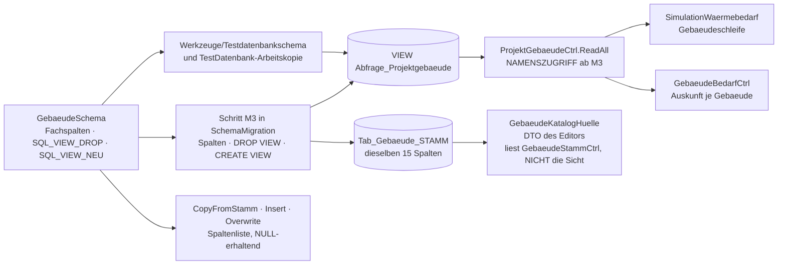

### 2.6 Kopierwege und NULL = Vorgabe

| Weg | Was zu tun ist | Falle |
|---|---|---|
| `GebaeudeStammCtrl.CopyFromStamm`, `Insert`, `Overwrite` | Umbau auf `GebaeudeSchema.Fachspalten` mit **NULL-erhaltender** Bindung (W14); Sperrpunkt von G1, eigener Merge, byte-gleich gegen die Basis | Der heutige Weg bildet `DBNull` auf `0.0` bzw. `""` ab. Ohne den Umbau ist „NULL = Vorgabe" nur eine Behauptung des Papiers — und der Fehler vererbt sich an jede Zone |
| `BaustoffCtrl.CopyFromStamm`, `BauteilaufbauCtrl.CopyFromStamm` | von Anfang an Spaltenlisten-Bauweise; die Schichten werden **mitkopiert**, `ID_Baustoff` über die Id-Abbildung umgesetzt (W11) | Ein Aufbau ohne seine Schichten ist ein Aufbau ohne U-Wert |
| `ProjektDuplizierenCtrl` | `FK_MAP` um `ID_Zone`, `ID_Aufbau`, `ID_Baustoff`, `ID_Nachbarzone`, `ID_Importquelle` ergänzen (vorhanden sind `ID_Gebaeude` und `ID_ProjektGebaeude`); `KINDER` **von Hand, dreistufig**: Gebäude → Zone → Bauteil, Aufbau → Schicht, Importquelle → Importzuordnung (W19) | Alle Sammlungen vergleichen **ohne** Rücksicht auf Groß- und Kleinschreibung — ein zweiter Eintrag in anderer Schreibweise ist eine Ausnahme beim Klassenladen, also „Programm startet nicht". Auf die Auto-Erkennung ist bei **zwei** Fremdschlüsseln an einer Zeile (`ID_Aufbau`, `ID_Baustoff` an der Schicht) kein Verlass: Sie nimmt die erste Spalte mit deklarierter Beziehung, und über `ID_Baustoff` gefiltert fielen alle Schichten weg |
| Projekttransfer (`.wpx`) | **Er erbt die Tabellenmenge aus `ProjektDuplizierenCtrl.ErmittlePlan()`** (`EPOS.Kern/Controller/ProjektExportImportCtrl.cs:131`) — also genau die Handgriffe der Zeile darüber: Die fünf Tabellen **ohne** `ID_Projekt` (`Tab_Zone`, `Tab_Bauteil`, `Tab_Zonenluftstrom`, `Tab_Importquelle`, `Tab_Importzuordnung`, W16) reisen **nur über ihre `KINDER`-Einträge** mit. Dazu der Schemastand im Manifest; ein Paket mit abweichendem Stand wird beim Import abgelehnt | Fehlt ein `KINDER`-Eintrag, **reist ein Projekt mit Zonen still ohne seine Zonen** — das Paket ist gültig, das Projekt am Ziel ein anderes. **Abnahme:** ein Projekt mit Zonen ausgeben, in eine leere Datenbank einlesen und Zonen-, Bauteil-, Luftstrom- und Herkunftszeilen zählen. Dazu: **Jede neue Nummer entwertet ältere Pakete** (R17); das gehört in den Schrittbericht und, bei mehreren Schritten in einer Auslieferung, in die Freigabemitteilung |
| `SchemaKatalog` | **je neuer Tabelle eine Konstante** | Ohne sie **startet das Programm nicht** — die Sammlungen vergleichen ohne Rücksicht auf Groß- und Kleinschreibung, ein zweiter oder fehlender Eintrag fällt beim Klassenladen an (R11) |
| `KatalogRegistry` | **je neuem Katalog ein Eintrag samt Datenblock**: `BAUSTOFF` und `BAUTEILAUFBAU` (W21) | Ohne den Eintrag ist der Katalog über die Katalogverwaltung **nicht auffindbar**, obwohl die Tabelle steht |
| `sql/tools/Reduziere-Testdatenbank.sql` | **acht** neue `DELETE`-Zeilen, Eltern zuerst: `Tab_Zone`, `Tab_Bauteil`, `Tab_Zonenluftstrom` über den Unterausdruck auf `Tab_Gebaeude` (sie führen bewusst **kein** `ID_Projekt`, Vorbild `Tab_DBTagVDaten`); `Tab_Bauteilaufbau` und `Tab_Baustoff` über `ID_Projekt`; **`Tab_Bauteilschicht` über `ID_Aufbau`**, nicht über `ID_Projekt` — sie führt keines (Berichtigung zu Mehrzonenkonzept 4.4); `Tab_Importquelle` über `ID_Gebaeude`, `Tab_Importzuordnung` über `ID_Importquelle`. Dazu die Gegenprobe `Reduziere-Testdatenbank.probe.py` | Ohne die Zeilen bleiben Waisenzeilen stehen |
| `Werkzeuge/Auslieferungsvorlage` | Kindkataloge ohne `ReadOnly` **namentlich** führen und auf „nicht leer" prüfen (L1); **Prüfregel: `Tab_Importquelle` und `Tab_Importzuordnung` sind in der Auslieferungsdatenbank leer** | Sonst trüge eine ausgelieferte `Kenndaten.sqlite` Dateinamen und SHA-256 fremder Importe mit; und ein auf null Zeilen fallender Katalog bricht die Vorlage mit Abbruchcode ab |

**Die sichtbare Seite von „NULL = Vorgabe"** ist die Probe darauf, dass der Umbau geglückt ist: Jedes
leere Parameterfeld zeigt die Vorgabe an — im Feld als Platzhalter (A5 = U3, mit E27 entschieden), ergänzend als
`Herleitungszeile` darunter. **Steht dort eine 0, wo eine Vorgabe stehen müsste, ist der Kopierweg
noch der alte.**

### 2.7 Herkunft und Importablage

**Zwei Spalten an vier Tabellen.** `Herkunft` und `Quellkennung` stehen an `Tab_Zone`,
`Tab_Bauteil`, `Tab_Bauteilaufbau` und `Tab_Baustoff`. `Tab_Bauteilschicht` braucht sie **nicht** —
sie erbt die Herkunft ihres Aufbaus, und ihre Stoffwerte sind ohnehin Kopien zum Zeitpunkt der
Zuordnung. `Tab_Gebaeude` bekommt sie **nicht**; die Paarung EPOS-Gebäude ↔ Quellentität trägt
`Tab_Importzuordnung.ID_Gebaeude` (**A13**).

**Herkunft je Feld und Herkunft je Zeile sind zwei Dinge, und beide gebraucht.** Das ist der einzige
Punkt, an dem die Anforderung und die Persistenz auseinandergehen, und er wird hier ausdrücklich
aufgelöst:

| Ebene | Wo sie lebt | Wie lange | Wofür |
|---|---|---|---|
| **je Feld** | `GebaeudeFeldzeile.Herkunft` + `Beleg` im `GebaeudeImportSatz` — ein Wert, kein Anzeigetext | **nur** im Importlauf, bis zum Schließen des Zuordnungsdialogs | Der Anwender sieht je Zelle, ob eine Zahl gelesen, aus dem Katalog kopiert, vorbelegt, leer oder von ihm geändert ist; das ist die Entscheidungsgrundlage der Übernahme |
| **je Zeile** | `Herkunft` + `Quellkennung` an Zone, Bauteil, Aufbau, Baustoff | **über den Lauf hinaus, in der Datenbank** | Nach dem Lauf beantwortet sie „woher stammt diese Zone" und trägt den Rückweg des Round-Trips |
| **je Paarung** | `Tab_Importzuordnung` — eine Zeile je EPOS-Zeile ↔ Quellentität | über den Lauf hinaus, in der Datenbank | Der zweite Import derselben Datei erkennt, was er schon zugeordnet hat; der Round-Trip findet die Entität wieder |

**Die Feldherkunft wird also bewusst nicht persistiert.** Sie zu speichern hieße, je Gebäude rund
vierzig weitere Zeilen zu führen, die niemand liest, sobald der Dialog geschlossen ist — und die
beim ersten Handeingriff falsch werden. Was **bleiben** muss, ist die Zeilenherkunft und die
Paarung; was der Anwender **beim Übernehmen** braucht, ist die Feldherkunft. Die eine Angabe, die
beides verbindet, ist `Tab_Importquelle`: Dateiname, SHA-256, Zeitpunkt, Programmfassung,
Zonenregel.

**Die Kaskadenrettung im Löschweg.** `Tab_Importquelle` hängt mit `ON DELETE CASCADE` an
`Tab_Gebaeude`, und `Tab_Gebaeude` kaskadiert selbst an `Z_ProjektGebaeude`. Löscht der
Gebäude-Schreibweg und legt neu an, räumt **jeder gewöhnliche Speichervorgang** die Herkunftsablage
ab. Die Rettung steht deshalb dort, wo das Löschen steht — `GebaeudekinderSichern` /
`GebaeudekinderWiederherstellen` in `WizardCtrl` (Muster `StraengeSichern`) —, **nicht** im
Import- oder Zonencontroller, der den Löschweg nicht kennt. Sie deckt `Tab_Zone`, `Tab_Bauteil`,
`Tab_Zonenluftstrom`, `Tab_Importquelle` und `Tab_Importzuordnung` ab (W15, A1).

**Umgesetzt (Protokoll G4 Abschnitt 4): gegenstandslos.** Die Messung A1 der Sitzung G3 hat gezeigt,
dass kein gewöhnlicher Speicherweg ein Gebäude löscht und neu anlegt; `GebaeudekinderSichern` und
`GebaeudekinderWiederherstellen` sind nicht gebaut. Die Tests halten beide Fälle: Gewöhnliches
Speichern lässt Quelle und Paarung stehen, das Löschen des Gebäudes bzw. Projekts leert beide
Tabellen. Im Einzonenweg der Stufe G4 schreibt `GebaeudeImportCtrl.SchreibeHerkunft` nur die
Gebäudepaarung (`Einzonenpaarungen`); die Paarungen für Räume, Flächen und Öffnungen gehören zu G6c.

**Der Zonencontroller kennt sehr wohl einen Löschweg — seinen eigenen, und der ist deshalb kein
Pauschallöschen** (1.4, A6). `SpeichernJeGebaeude` gleicht über die Ids ab und entfernt nur, was der
Anwender entfernt hat. Der Unterschied ist an zwei Stellen sichtbar: `Tab_Importzuordnung.ID_Zone`
und `.ID_Bauteil` tragen **keine** Kaskade — ein Löschen und Neuanlegen ließe die Importherkunft auf
verschwundene Ids zeigen und verbaute den Round-Trip bei jedem gewöhnlichen Speichern; und
`Tab_Zonenluftstrom` hängt mit Kaskade an **beiden** Zonen, käme also im selben Aufruf zurück, aber
mit neuen Ids — und die Normierung `CHECK (ID_ZoneA < ID_ZoneB)` kann dabei kippen. Die
Kaskadenrettung in `WizardCtrl` bleibt daneben bestehen: Sie deckt den **Gebäude**-Löschweg ab, den
der Zonencontroller nicht kennt (umgesetzt: nicht gebaut, siehe oben).

**Kaskade auf die Zielverweise (umgesetzt, Protokoll G4 Abschnitt 4).** Die fünf Zielverweise der
Importzuordnung tragen `ON DELETE CASCADE` statt „ohne Kaskade": Die Fremdschlüssel sind im Betrieb
scharf, ohne Löschregel scheiterte das Entfernen einer importierten Zone, eines Bauteils, Aufbaus
oder Baustoffs am Verweis, und `SET NULL` verletzte den `CHECK` „genau ein Ziel"; eine Paarung ohne
ihr Ziel hat keine Bedeutung. Ein Löschen und Neuanlegen räumte die Paarung damit ab, statt sie ins
Leere zeigen zu lassen — der Abgleich über die Ids bleibt deshalb Pflicht
(`EPOS.Kern/Allgemein/Update/ImportzuordnungSchema.cs:24-44`, `:212-217`).

**Ein Prüfpunkt der Auslieferungsvorlage.** `Gebaeude_Modell` steht auch an `Tab_Gebaeude_STAMM`,
weil der Katalog in das Projekt kopiert wird (2.2), und `Werkzeuge/Auslieferungsvorlage` läuft
spaltenblind mit: Sie kennt keine Spaltenlisten, sondern fragt das Schema. Damit kein ausgelieferter
Katalogsatz still auf dem Bestandsweg landet, **weist der Prüfbericht des Werkzeugs jede Zeile von
`Tab_Gebaeude_STAMM` mit gesetztem `Gebaeude_Modell` namentlich aus**; die Vorgabe für die
Auslieferung ist **NULL** (= VDI 6007, E1). Das ist ein Prüfpunkt, kein Verbot — ein Katalogsatz
darf den Bestandsweg tragen, er soll es nur nicht unbemerkt tun. Mit der Stufe GA entfällt der
Prüfpunkt zusammen mit der Spalte.

### 2.8 Einfrierplan

Die Einfrierkette steht **hier**, nicht im Schwesterpapier: Der Einfrierplan ist Teil der
Datenmodell-Architektur; der Systementwurf nennt nur die drei Anlässe und die zwei Gefährdungen.

Drei Schritte der laufenden Kette berühren die Referenzbasis, und alle drei sind begründet: **GB**,
weil der Gebäudezustand heute statisch ist und das Ergebnis damit an der Zeilenreihenfolge hängt;
**G1 + G2**, weil dreizehn Projekte stündlich rechnen; **G6d**, weil ein Referenzprojekt auf Zonen
umgestellt wird. **Aus E23 folgt kein weiterer Anlass** — wohl aber aus den Stufen, die daneben
stehen: **KU2** bringt die Deckung der Kälteseite
([Kühlkonzept](Konzept_Kuehlung_Gebaeudesimulation_EPOS-Plan.md), K19), **AK1**, **AK2** und
**AK3** bringen je einen eigenen Einfrierschritt mit
([Anlagenkopplung](Konzept_Anlagenkopplung_Gebaeudesimulation_EPOS-Plan.md), B-A2), und die Stufe
**GA** friert die Basis ein letztes Mal ein, wenn das Referenzprojekt des Altwegs auf VDI 6007
umgestellt und der Rückweg-Test eingestellt ist (E26; fällig nach dem Ablösekriterium Q24, E27).
Dazu ein Anlass, der
sich nicht planen lässt: **eine erst nach der Verschiebung gefundene, ergebniswirksame
Fehlerbehebung im Altweg** — sie ist ein eigener, ausdrücklich begründeter Einfrierschritt, kein
Nebenwerk eines anderen Merges. Alle Tabellen-, Saat- und Sichtschritte sind ergebnisneutral —
**und das ist nachzuweisen, nicht zu behaupten** (R13). Die Anlässe werden **benannt**, nicht
durchgezählt: Wer sie nummerierte, müsste die Zahlen bei jeder wählbaren Stufe umhängen.

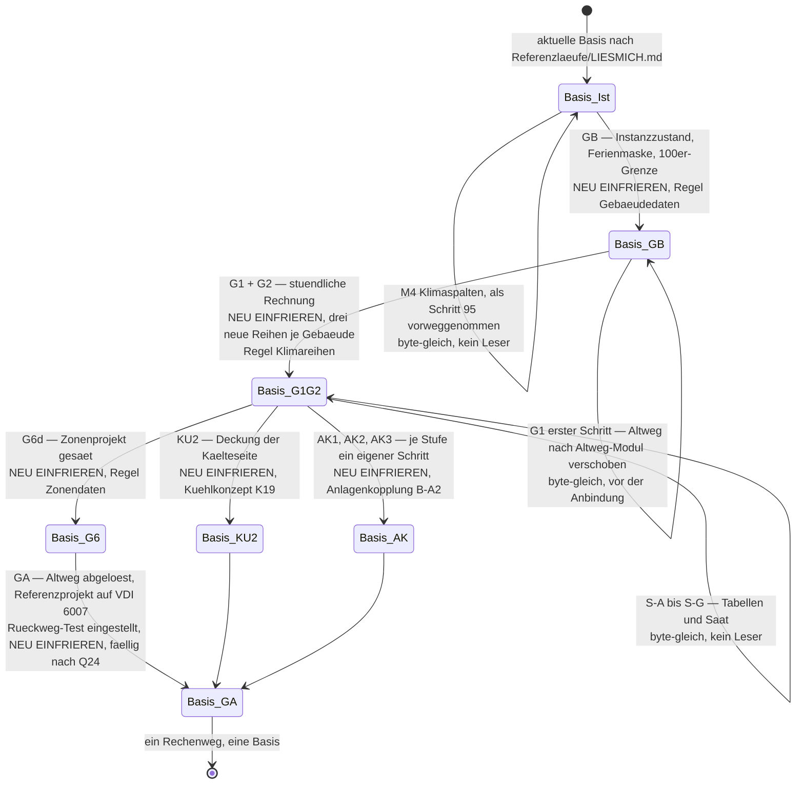

| Schritt | Nachweis, der zu führen ist |
|---|---|
| **GB** | Lauf, Vergleich, Begründung, grüner Kern-Lauf; das betroffene Projekt namentlich mit alter und neuer Zahl — gemessen allein 1008 (1039 blieb byte-gleich, der statische Zustand erreichte dort nie ein Ergebnis). Diese Basis ist die **letzte reine Bestandsbasis** (A15) |
| **M2** | `GESAMT: PASS` byte-gleich gegen die GB-Basis. Eigener Merge, weil jede der 15 Stellen in die solaren Gewinne mündet |
| **M3** | byte-gleich; die Probe **ist** der Sichtneubau: Der Leser liefert alle 58 Bestandsfelder unverändert, `Nutzflaeche` mit den Werten der alten `Wohnflaeche` (E19); `SqlDialektPruefer` grün |
| **M4** (Schemaschritt 95, erbracht) | byte-gleich — reines DDL, kein Rechenweg liest die Spalten, alle Bestandsregionen NULL; die Importprobe gegen die eingefrorene PVGIS-Antwort liefert dieselben Strahlungsreihen wie bisher. Die Einfrierregel „gesäte Klimareihen" gehört **nicht** hierher, sondern zu G1 + G2 |
| **G1 + G2** | **Erster Schritt: die Verschiebung des Altwegs nach `Altweg/` — byte-gleich gegen die GB-Basis, vor jeder Anbindung des VDI-Wegs** (E20). Danach ändern alle dreizehn Projekte sich; Basis vollständig neu. Dazu der **Rückweg-Test** auf einer gitignorierten Arbeitskopie gegen die GB-Basis — **danach misst er allein das eine Referenzprojekt, das auf dem Altweg steht**, in der jeweils aktuellen Basis (A15, mit E27 entschieden; 4.4); `ChartProben` grün; Sichtabnahme Windows; **Einfrierregel „gesäte Klimareihen" eingetragen** |
| **S-A bis S-G** | je Schritt: Zeilenzahl, Dateigröße, Tabellenzahl, Projektzahl, und der Satz, dass der Referenzlauf byte-gleich ist — **weil kein Leser die neuen Tabellen liest** |
| **G6d** | grüner Kern-Lauf, neue Basis begründet; **Einfrierregel „gesäte Zonendaten" eingetragen** |
| **KU2** | eigener Einfrierschritt (Kühlkonzept K19): Projekte **ohne** Kühlung byte-gleich, das Kühlprojekt mit neuer Basis und begründetem Wechsel |
| **AK1 · AK2 · AK3** | je Stufe ein eigener Einfrierschritt (Anlagenkopplung B-A2): Projekte mit `Anlagenkopplung = AUS` byte-gleich, das gekoppelte Projekt mit neuer Basis |
| **GA** | Altweg abgelöst: Modul, Weiche, `IGebaeudeRechenweg`, Wache, Schalter, Bestandswegabschnitt, Spalten und `Tab_DBTagV(-Daten)` entfernt; das Referenzprojekt des Altwegs auf VDI 6007 umgestellt, der Rückweg-Test eingestellt — **neue Basis**, fällig nach dem Ablösekriterium Q24 (E27). **Gate ist die Ausbauprobe** (1.7, 4.4) |
| **Fehlerbehebung im Altweg** | Ein erst **nach** der Verschiebung gefundener, **ergebniswirksamer** Fehler des Altwegs wird behoben und die Basis in einem eigenen, begründeten Schritt neu eingefroren; die Begründung nennt Fehlerbild, betroffene Projekte und die geänderten Zahlen |

**Die drei neuen Einfrierregeln — benannt nach ihrem Gegenstand, nicht durchgezählt** (R18, W18);
einzutragen an **beiden** Orten, [`Referenzlaeufe/LIESMICH.md`](../../Referenzlaeufe/LIESMICH.md)
und Abschnitt „Regressionsnetz" der [Wurzel-`CLAUDE.md`](../../CLAUDE.md):

- **„gesäte Gebäudedaten"** (mit GB): Bauweise, U-Werte, Flächen, Sollwerte, Luftwechselrate,
  Fensterdurchlassgrad sowie ab G1 die fünfzehn neuen Spalten;
- **„gesäte Klimareihen"** (mit G1 + G2): `Tab_Solar.Gegenstrahlung`, `Luftfeuchte` und
  `Bedeckungsgrad` der Referenzregionen. Der Schemaschritt 95 hat die Spalten angelegt, aber weder
  gefüllt noch einen Leser mitgebracht — dort hätte die Regel nichts geschützt. Ab G1 + G2 liest
  `GebaeudeKlimaweg` die Gegenstrahlung, und ohne die Regel verschöbe ein späterer PVGIS- oder
  TRY-Neuimport einer Referenzregion die Basis still;
- **„gesäte Zonendaten"** (mit G6d): Zonen-, Bauteil-, Schicht- und Luftstromzeilen des umgestellten
  Referenzprojekts.

**Die Reihenfolge ist die der Eintragung, und sie trägt bewusst keine Ordnungszahlen.** G1 + G2 läuft
lange vor G6d; wer die Regeln durchzählte, müsste die Zahlen später umhängen oder eine Lücke
eintragen. Genannt wird jede Regel über ihren Gegenstand — so steht in beiden Papieren dasselbe.

### 2.9 Leseweg des Rechenkerns

Der Dialog liest **je Gebäude**, der Lauf **je Projekt** — und der Lauf darf dabei nicht je Zone und
je Bauteil einzeln fragen. Bei bis zu 150 Zonen und 3 000 Bauteilen je Projekt (Befund V 6.2) wäre
das der klassische N+1-Fall.

| Leseweg | Form | Regel |
|---|---|---|
| `GebaeudeZonenCtrl.LesenJeGebaeude(idGebaeude)` | drei Abfragen (Zonen, Bauteile, Luftströme), je über den Index sortiert | Der Dialog braucht die Bauteile ohnehin alle; drei Abfragen sind der Arbeitsstand |
| `GebaeudeZonenCtrl.LesenJeProjekt(idProjekt)` | **drei** Abfragen für das **ganze** Projekt, je mit `JOIN` über `Tab_Gebaeude` und `Z_ProjektGebaeude`, sortiert nach `(ID_Gebaeude, Rang)` bzw. `(ID_Zone, Rang)`; die Zuordnung zu Gebäude und Zone geschieht **im Speicher** über die gelesenen Ids | **Nie eine Abfrage je Zone.** Muster ist der Leseweg je Projekt der Anlagenstränge; die Reihenfolge kommt aus `ORDER BY`, nicht aus dem Einfügezeitpunkt — sonst hängt das Ergebnis an der Datenbankinternen Reihenfolge und der Determinismus ist weg |
| `BauteilaufbauCtrl.LesenJeProjekt(idProjekt)` | zwei Abfragen (Aufbauten, Schichten), Schichten sortiert nach `(ID_Aufbau, Reihenfolge)` | Ein Aufbau wird von vielen Bauteilen benutzt; er wird **einmal** gelesen und **einmal** reduziert, das Ergebnis je Aufbau zwischengespeichert |
| `ProjektGebaeudeCtrl.ReadAll(idProjekt)` | unverändert **eine** Abfrage über die Sicht, ab **M3** nach **Namen**; danach hängt `GebaeudeZonenanschluss.Anschliessen` jedem Gebäude seine Zonen an | 2.5; der Zonenanschluss folgt unter der Tabelle |
| `GebaeudeStammCtrl.ReadAll(filter)` | **eine** Abfrage über `Tab_Gebaeude_STAMM` — der Leseweg des **Katalogeditors**, nicht der Sicht | Er ist mit denselben 15 Spalten zu versorgen wie die Sicht und deshalb eine eigene, mit M3 anzufassende Stelle (2.5) |

**Der Zonenanschluss des Laufs** (`GebaeudeZonenanschluss`, gerufen am Ende von
`ProjektGebaeudeCtrl.ReadAll` — Lauf und Auskunft lesen darüber dieselbe Zone): `LesenJeProjekt` der
Zonen und, **nur wenn ein Bauteil auf einen Aufbau zeigt**, `LesenJeProjekt` der Aufbauten — höchstens
vier Abfragen je Projekt, gleich wie viele Zonen, Bauteile und Schichten. Die Abbildung Zeile ↔ Kern
steht an einer Stelle, `GebaeudeZonenabbildung` (ohne Datenbank): Persistenzwerte auf die
Kern-Aufzählungen, NULL auf NaN bzw. die Vorgabe von `BauteilEingang`, `Psi_L` NULL auf 0, die Schichten
mit ihrer Wertekopie λ/ρ/c_p; die Gegenrichtung schreibt neue Zeilen mit negativen vorläufigen Ids und
Herkunft `VORGABE` („Gebäude als eine Zone übernehmen"). Eine Zone, deren Zeilen sich nicht abbilden
lassen, hängt mit ihrem benannten Fehler an und bricht erst den Lauf dieses Gebäudes ab, nicht das
Lesen. Ein Schemastand ohne `Tab_Zone` heißt „keine Zonen" (Schemaprobe mit `COUNT(*)`, gemerkt je
Datenbankpfad).

**Die Indizes, die das tragen:** `(ID_Gebaeude, Rang)` an `Tab_Zone`, `(ID_Zone, Rang)` an
`Tab_Bauteil`, `(ID_Aufbau, Reihenfolge)` an `Tab_Bauteilschicht`, `(ID_Importquelle)` und
`(Quellkennung)` an `Tab_Importzuordnung`. Mehr braucht es nicht — die Mengen sind dreistellig bis
vierstellig: rund 3 500 Zeilen je Projekt im ungünstigen Fall und damit rund 40 % der 8 760 Zeilen
einer **einzigen** Klimaregion (Systementwurf 5.2).

**Ergebnisreihen gehen nicht in die Datenbank** (R16). Vier Stundenreihen je Zone persistiert
ergäben bei einem großen Zonenprojekt Millionen Zeilen und mehr Umfang als die gesamte
Testdatenbank; der Bestand hält Ergebnisse ausnahmslos als Skalare je Lauf, und dabei bleibt es. Die
Zahlen stehen im [Systementwurf](Systementwurf_Gebaeudesimulation_EPOS-Plan.md) Kap. 5.

**Der Stand der Eingaben des Altwegs.** `Tab_DBTagV` und `Tab_DBTagVDaten` bleiben unverändert: Sie
sind der Eingang des **Tagesbilanz-Wegs**, der nach **E20**, **E23** und **E26** der
**Bestandsweg** neben dem VDI-Weg ist, solange der Übergang läuft, und liegen zu allen
Testgebäuden vor. Sie werden **nicht erweitert**, und der VDI-Weg liest sie **nicht** (4.1); sie
bleiben mit ihrem einzigen Leser stehen, bis die Stufe **GA** beide entfernt (2.4; GA fällig nach
Q24, E27).

**Zonen im Katalog gibt es nicht.** `Tab_Zone` hat keine `_STAMM`-Entsprechung — eine Zone ist
Projektware, wiederverwendbar ist der **Bauteilaufbau**, nicht die Zone. Folge für „Speichern
unter…" im Katalogeditor: Ein Gebäude, das Zonen und Bauteile trägt, wird als **Katalogsatz ohne
Zonen** abgelegt, und der Anwender erfährt es **bevor** geschrieben wird — als `Rueckfrage`-Komponente
im OK-Weg („Der Katalogsatz trägt die n Zonen nicht mit — trotzdem speichern?"), die den Weg zu Ende
führt (3.3 Punkt 6), danach das gewöhnliche Bestätigungsbanner. **Kein stiller Verlust** — und kein
Hinweisbanner **nach** dem Schreiben: Ein Banner ist nach der Meldungsstaffel (3.6) das Mittel nach
dem Versuch, hier aber ist die Frage vor dem Versuch zu stellen. Wer das Gebäude aus dem Katalog
zurückholt, bekommt ein Gebäude ohne Zonen und rechnet den Klassenweg.

---

## 3. Dialogführungs-Architektur

### 3.1 Navigation und Maskenschlüssel

**Die Navigation ist zweigeteilt und asymmetrisch** (Befund U 0.1): Die `AppWurzel` kennt dreizehn
freie Ansichten selbst, die übrigen 25 Maskenschlüssel beantwortet die **Plattformhülle** — unter
Windows mit einem modalen Fenster, auf iOS mit `false`. Deshalb sind Gebäude, Klima und alle
Importe auf dem iPad heute **unerreichbar**: nicht, weil die Komponenten fehlten, sondern weil ihre
Hüllen in der Windows-Schale liegen.

**Zum Gebäude führen genau zwei Klickwege, und beide bleiben:** die Kachel „Gebäude" im
Startseiten-Reiter *Wärmebedarf* und *Administration → Gebäude → Bearbeiten*
(`EPOS.UI/Bausteine/Menuetabelle.cs:274-278`, Schlüssel
`Seitenschluessel.GebaeudeAdmin = Masken.GebaeudeAdmin`, `EPOS.Kern/Allgemein/Dienste/Masken.cs:20`).
Beide öffnen **dieselbe** Komponente, der zweite in der Betriebsart Verwaltung. **Ein eigener
Einstieg „Gebäudemodell rechnen" entsteht nicht** — das Kachelregister ist gedeckelt, und der Weg
gehört als Knopf **in** den Gebäudedialog.

**Je neuem Maskenschlüssel sind vier Stellen zu pflegen**, nicht drei:

| # | Stelle | Was dort steht |
|---|---|---|
| 1 | `EPOS.UI/Seiten/Seitenschluessel.cs` (bzw. `Masken.cs`, wenn der Kern ihn ruft) | die Konstante — sprachneutraler ASCII-Schlüssel in Großschreibung |
| 2 | `EPOS.UI/Seiten/AppWurzel.razor` **oder** die Plattformhülle | der Fall, der die Maske aufmacht — **je Maske ist zu entscheiden, welcher von beiden**, und die Entscheidung steht in der Tabelle darunter |
| 3 | `EPOS.UI/Bausteine/Menuetabelle.cs` | die Zeile — **das Menü ist Daten, kein Code**; kein Untermenü mit nur einem Punkt |
| 4 | `EPOS.iOS/Dienste/IosNavigation.Uebersetze` | **eine Zeile je Maske** — und für alles, was iOS nicht kann, eine **benannte Absage** statt eines stummen `false` (Befund U L9) |

**Was neue Schlüssel bekommt und was nicht:**

| Maske | Schlüssel | Beantwortet von | Menüzeile | Begründung |
|---|---|---|---|---|
| Baustoffkatalog | `Seitenschluessel.BaustoffKatalog = "BAUSTOFF_KATALOG"` | **`AppWurzel.razor`** — freie Ansicht | *Administration → Gebäude → Baustoffe* (umgesetzt mit G3, nach „Gebäudetypen"; der Entwurf sah einen eigenen Punkt „Bauteilkatalog" vor) | eigener Katalogeditor, über das Menü erreichbar wie jeder andere Katalog |
| Bauteilaufbau-Katalog | `Seitenschluessel.BauteilaufbauKatalog = "BAUTEILAUFBAU_KATALOG"` | **`AppWurzel.razor`** — freie Ansicht | *Administration → Gebäude → Bauteilaufbauten* (umgesetzt mit G3) | **die zwei Kataloge müssen gemeinsam eingehängt werden** — ein Untermenü mit nur einem Punkt ist verboten |
| Zonendialog, Bauteildialog | **keiner** | — | keine | Sie sind Überlagerungen **im** Gebäudedialog, vier Ebenen tief; ein Schlüssel wäre ein zweites Fenster |
| Gebäudeimport (IFC, gbXML) | **keiner** (A17, mit E27 entschieden) | — | keine | **Überlagerung** statt Schlüssel — im Gebäudedialog, aufgemacht über zwei Knöpfe in der Katalogleiste („Aus IFC-Datei übernehmen …", „Aus gbXML-Datei übernehmen …"), je mit eigenem Profil und der Regel „kein Delegat, kein Knopf" |
| Gebäudeexport (G7) | **keiner** (A17, mit E27 entschieden) | — | keine | **Überlagerung**, aus demselben Grund — und der Einstieg zusätzlich dort, wo die Ergebnisse liegen (Bedarfsdialog) |
| Gebäude, Gebäudetypen (Bestand) | `Masken.GebaeudeAdmin`, `Masken.GebaeudetypenAdmin` | Windows: die **Plattformhülle** (modales Fenster, Bestand). iOS: **`AppWurzel.razor`** — mit G1 kommt je Maske ein Fall hinzu | unverändert | Ohne diesen Fall läuft die Übersetzungszeile in `IosNavigation` ins Leere: Sie bildet einen Maskenschlüssel auf einen Seitenschlüssel ab, **den die Wurzel kennen muss** — „Unbekanntes bleibt unverändert, die Wurzel antwortet dann selbst mit `false`" (`EPOS.iOS/Dienste/IosNavigation.cs:64-78`). Der Hüllenumzug allein macht den Gebäudedialog auf dem iPad **nicht** erreichbar |

**Zwei Folgerungen, die in dieser Tabelle stecken.** Erstens: Die beiden neuen Katalogeditoren
laufen als **freie Ansicht** in `AppWurzel.razor`, mit einem Schlüssel in `Seitenschluessel.cs` in
reiner Großschreibung — damit ist zum ersten Mal ein Katalogeditor ohne Plattformhülle erreichbar,
auf beiden Plattformen, und es entsteht **keine** dritte Fensterdatei in der Schale. Alle
Bestandskatalogeditoren laufen dagegen über `Masken.*` und die Hülle
(`EPOS.UI/Seiten/Seitenschluessel.cs:216`); der Unterschied ist gewollt und hier begründet.
Zweitens: **Erreichbarkeit auf iOS ist ein Fall in der Wurzel plus eine Zeile in `IosNavigation`**,
nie eine Zeile allein.

**A17 war ein echter Widerspruch zwischen zwei geltenden Papieren**: Das
Datenaustauschkonzept 11.2 (D14) sagt „als Überlagerung im Gebäudedialog — kein neuer Menüpunkt,
kein neuer Maskenschlüssel"; Befund U 1.3 sagt „der IFC-/gbXML-Import ist je eine `Menuepunkt`-Zeile
mit Seitenschlüssel". **Mit E27 (22.09.2026, [Konzept N1.32](Konzept_Gebaeudesimulation_VDI6007_EPOS-Plan.md)) ist entschieden: kein
Maskenschlüssel, keine Menüzeile, Überlagerung im Gebäudedialog** (D14). Der verworfene Menüweg
hätte zwei flache Zeilen unter *Daten & Import*
(`Menuetabelle.cs:235`), die auf **einen** Schlüssel mit verschiedenem **Argument** zeigen —
Muster ist der PV-Import, dessen Schlüssel das Argument `"CEC"` bzw. `"PAN"` trägt
(`Masken.cs:75`, `:80`).

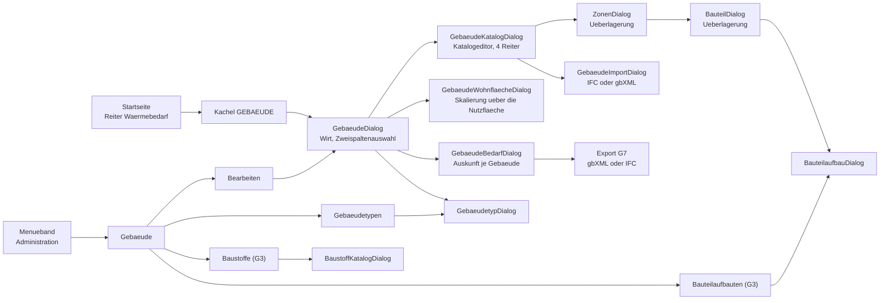

### 3.2 Masken je Stufe und Zustandsmodelle

**Fünf Bestandsmasken im Soll, sechs neue** — fünf bis G6 und die Exportmaske mit G7; dazu **eine
eingebettete Ansicht ohne eigenen Maskenschlüssel**.

| Maske | Art | Betriebsarten | Was sich ändert | Stufe |
|---|---|---|---|---|
| `GebaeudeDialog` (Wirt) | Ansicht mit `SpeichernLeiste` | Projekt, Assistent, Verwaltung | Spalte „Modell" in der Projektliste, zwei leise Kennzahlen im Detailblock, zwei Importknöpfe in der Katalogleiste (gebaut: ein Knopf „Importieren (gbXML, IFC)…"); mit G3 der Knopf **„Hülle und Zonen…"**, der den Editor in der Betriebsart Projekt öffnet — weich gesperrt ohne Projektkopie | G1 · G3 · G4 |
| `GebaeudeKatalogDialog` (Editor) | Überlagerung, vier Reiter | Bearbeiten, Neu, Verwaltung; **Projekt** (G3: die Projektkopie des Gebäudes samt Zonen) | **ein** Schreibweg (A4 = U1), Reiter 3 „Hülle und Rechenmodell" **in VDI-6007-Struktur** — Modellparameter immer sichtbar, dazu der Schalter **„Rechenweg"** und der eingeklappte Abschnitt **„Tagesbilanz (Bestandsweg)"** (E20, E23) —, Reiter 4 „Zonen", der Knopf „Gebäude als eine Zone übernehmen" (frei nur in der Betriebsart Projekt ohne Zone auf dem VDI-Weg, mit Rückfrage und Hochrechnung nach E40); in der Betriebsart Projekt schreibt OK in drei benannten Schritten — Projektkopie, Katalogaufbauten, Zonen | G1 · G3 · G6 |
| `GebaeudeBedarfDialog` | Überlagerung | — | Raumtemperatur, drei Spitzenkennzahlen, Vergleichstabelle beider Rechenwege, zweites Bild; **ein Abschnitt „Kältebedarf" neben dem Abschnitt „Wärmebedarf"** mit denselben Bausteinen — Kennzahlkachel, Kanalzeile, Monatsstapel, Dauerlinie (E21); der Ausweis „Tagesbilanz (Bestandsweg)" bei einem Altweg-Gebäude (E20, E23) | G1 · KU1 |
| `GebaeudeWohnflaecheDialog` (Skalierungsdialog) | Überlagerung | — | **in VDI-6007-Struktur**: Die Zuordnung läuft über die **Nutzfläche** (E19), nicht mehr über die Wohnfläche; Beschriftung, `Herleitungszeile` und Prüfregeln folgen dem Feldnamen der Sicht (E20). **Nicht mehr „unverändert"** | G1 |
| `GebaeudetypDialog` | Überlagerung | — | **unverändert** | — |
| `BaustoffKatalogDialog` | Katalogdialog | Bearbeiten, Neu, Verwaltung | neu | G3 |
| `BauteilaufbauDialog` | Katalogdialog mit Schichtenraster | wie oben | neu | G3 |
| `ZonenDialog` | Überlagerung (Ebene 3) | — | neu — in der **Grundform mit G3** (die eine Zone, die der Übernahmeknopf anlegt, samt Bauteilraster), mit **G6b** um Mehrzonenfelder und Luftaustausch erweitert | G3 · G6b |
| `BauteilDialog` | Überlagerung (Ebene 4) | — | neu — **mit G3**, weil der Bauteilweg dieser Stufe sonst nur über Import oder Testdaten zu füllen wäre, während der Nachweis „Bauteilweg gleich Klassenweg im Grenzfall" beide Wege bedienbar verlangt | G3 |
| `GebaeudeImportDialog` | Überlagerung | zwei Profile (IFC, gbXML) | neu | G4 |
| `GebaeudeExportDialog` | Überlagerung | zwei Profile (gbXML, IFC), zwei Einstiege (Gebäude- und Bedarfsdialog) | neu — Format, Umfang und Kennzeichnung wählen, dann schreiben (4.6) | G7 |
| `GebaeudeAnsicht` | **eingebettete Komponente**, keine eigene Maske | Umschalter „Grundriss \| Körper" | neu (E11) — sie erscheint im Zuordnungsschritt des Imports (Grundriss, G6c) und im Gebäudedialog (Körper, G7b); **kein** Maskenschlüssel, **kein** Katalogeintrag, weil sie keine Eingabefelder trägt | G6c · G7b |

**Der Bruch, den G1 behebt:** Der Katalogeditor hat heute **vier** Aus- und Schreibwege und **kein**
Abbrechen; seine Pflichtprüfung hängt an zwei der drei Schreibstellen, und Reiter 2 führt einen
**eigenen** Stand, der erst mit „Übernehmen" in die Daten wandert. Sobald U·A-Summen über beide
Reiter laufen, ist die Summe zeitweise falsch (Befund U 3.3, L1/L2).

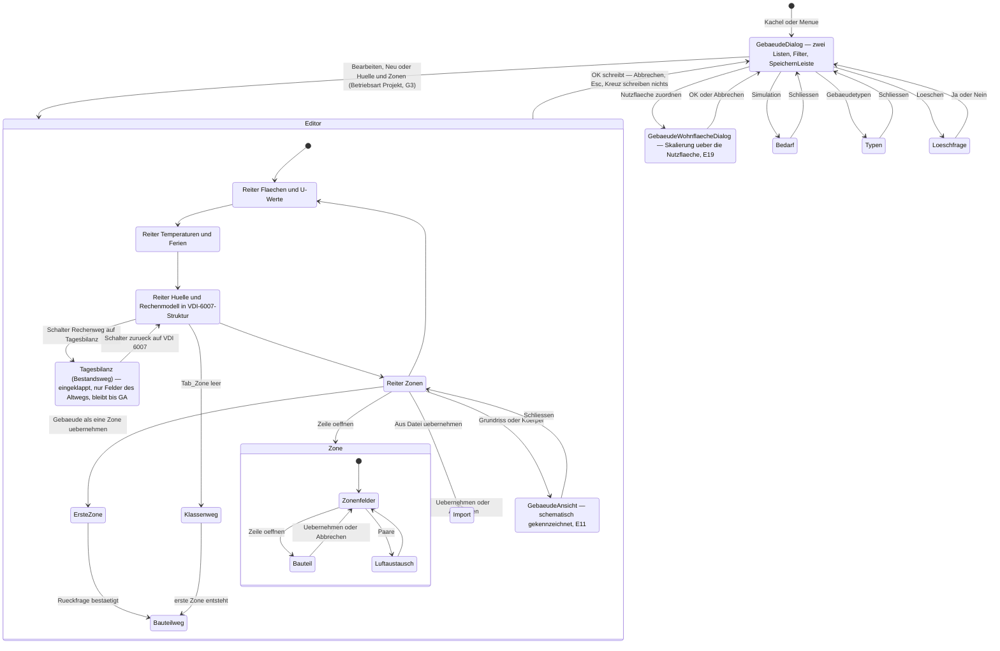

**Fünf Regeln zu diesem Stapel.**

1. **Esc kaskadiert von innen nach außen.** Jeder Wirt prüft **zuerst** seine offenen
   Überlagerungen; der Hintergrundklick schließt nicht; Enter ist dort unbelegt, wo ein Knopf
   schreibt.
2. **Der leere Zonenreiter bleibt bedienbar.** „Noch keine Zone" darf den Zonenweg nicht sperren —
   sonst läge der einzige Weg zur ersten Zone **innerhalb** des gesperrten Weges (Lehre aus dem
   Strangdialog, Befund U 8.3). Der Reiter steht auch leer da, mit dem Knopf **„Gebäude als eine
   Zone übernehmen"**, und dieser Knopf entsteht **mit G3**, nicht erst mit G6 (W1).
3. **Der Übergang Klassenweg → Bauteilweg wird benannt.** Das Anlegen der ersten Zone ändert die
   Zahlen eines Gebäudes, weil `Tab_Zone` leer die Verzweigung trägt (Mehrzonenkonzept 4.3). Deshalb:
   **Rückfrage vor der ersten Zone** („Ab jetzt rechnet dieses Gebäude über seine Bauteile statt über
   die U-Wert-Gruppen"), dazu eine `Herleitungszeile` am Schalter „Rechenweg", die in **beiden**
   Stellungen
   sagt, was gilt. **Die Datenlage bleibt der Träger**, kein dritter Persistenzwert — **A14**, mit
   E27 entschieden.
4. **Der Schalter „Rechenweg" versteckt keinen Modellparameter.** Der Dialog steht in
   VDI-6007-Struktur; die Modellparameterfelder des Reiters 3 sind **immer sichtbar und
   bearbeitbar** — auch bei einem Gebäude auf dem Altweg, denn sie gelten dort nach der Umstellung
   (E20). Der Schalter steuert allein den **eingeklappten Abschnitt „Tagesbilanz (Bestandsweg)"**:
   Felder, die **nur** der Altweg liest, erscheinen nur bei einem Altweg-Gebäude, mit dem Hinweis,
   dass dieser Weg keine neue Funktion mehr bekommt. Der Schalter trägt die Werte **„VDI 6007"**
   (Vorgabe, NULL) und **„Tagesbilanz"** und eine `Herleitungszeile`, die in **beiden** Stellungen
   sagt, was gilt; **Schalter und Abschnitt bleiben bis zur Stufe GA** (E23, E26; fällig nach
   Q24, E27 — sie sind Teil ihrer Löschliste). Der Feldbestandstest je
   Reiter (3.7) prüft den Reiter **einmal** — sein Feldbestand hängt nicht mehr vom Rechenweg ab —
   und den Bestandswegabschnitt als **eigenen** Fall. **A19 (= U2) ist damit überholt.**
5. **Die Katalogseite des Wirts wird virtualisiert, bevor die Listen lang werden** — Umstellung auf
   `Katalogliste` mit Filterstand aus dem Kern, danach die `Proben/Rasterprobe`. Das ist **keine**
   Voraussetzung von G1, aber **Vorbedingung von G3** (Befund U L4). **Stand nach dem Abschluss von
   G3 (25.09.2026): umgesetzt** (Welle K) — die Katalogseite ist die `Katalogliste` mit Filterstand
   aus dem Kern, Wahlspalte und 53 px; die Rasterprobe (Fälle GD1–GD3) ist im integrierten Browser
   gemessen, der Skriptlauf mit Playwright steht auf dem Arbeitsrechner aus.

### 3.3 Der eine Schreibweg

Die Hausregel steht wörtlich in `EPOS.UI/CLAUDE.md` und ist seit der Pufferverwaltung verbindlich
(Befund U 2.2). Sie gilt für **jede** Liste-im-Dialog der Gebäudesimulation — Zonen, Bauteile,
Schichten, Luftströme:

1. Der Dialog führt einen **Arbeitsstand**. „Anlegen"/„Übernehmen" prüft die Felder (dieselbe
   Prüfkette, dieselbe Reihenfolge, derselbe Wortlaut) und legt sie als Zeile in die Liste;
   „Entfernen" nimmt eine heraus. **Der Knopf speichert nicht, er übernimmt.**
2. Eine vorläufige Zeile trägt eine **negative** Nummer; nur eine positive Id hat eine Entsprechung
   in der Datenbank.
3. **Erst OK schreibt**, in der Reihenfolge *Entfernen → Ändern → Anlegen* — so wird ein Bezeichner
   wieder frei, den eine neue Zeile tragen soll. **Scheitert ein Schritt, bleibt der Dialog offen;
   ein zweites OK wiederholt das bereits Geschriebene nicht, versucht den gescheiterten Schritt aber
   erneut** (Hausregel `EPOS.UI/CLAUDE.md`). Andersherum wäre die Zeile für immer verloren: Der
   Anwender berichtigt seine Eingabe, und geschrieben würde sie trotzdem nie.
4. **Die neue Id entsteht im OK-Weg**; der Wirt liest sie danach.
5. OK prüft eine offene Zeile **nur, wenn an ihr etwas geändert wurde** — sonst verriegelt ein
   Altbestand, der heutige Regeln verletzt, den Dialog.
6. Eine **Rückfrage im OK-Weg führt ihn zu Ende**: Ja übernimmt, schreibt und schließt; Nein hält den
   Dialog offen. Die Rückfrage ist eine `Rueckfrage`-**Komponente**, nie ein Dialogdienst — auf iOS
   antwortet der vom Hauptfaden aus gar nicht.
7. Die Prüfregeln stehen **genau einmal**, im Rückruf der `SpeichernLeiste`. „Speichern unter…"
   bleibt als **nicht schließender** Zweitknopf.

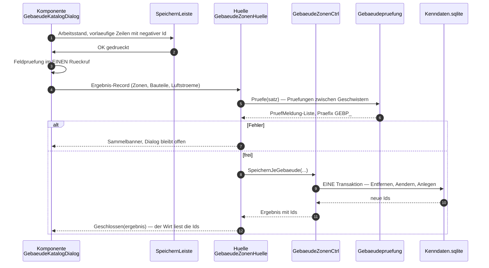

### 3.4 Der Zuordnungsdialog mit zwei Ausprägungen

**Eine Komponente, zwei Profile.** Wie der Katalogimport fünf Ausprägungen über **ein** Profil trägt,
trägt `GebaeudeImportDialog` die beiden Formate: derselbe Ablauf, unterschiedliche Daten. Was sich
unterscheidet, steht im Profil — Dateifilter, Größengrenze, Schemaanzeige, Liste der
Zonierungsregeln —, **nicht im Quelltext des Dialogs**.

> **Benannte Fortschreibung.** Das Datenaustauschkonzept 2.4 führt den Dialog als
> `EPOS.UI/Dialoge/Bedarf/IfcZuordnungDialog.razor` mit der Hülle
> `EPOS.UI.Daten/Bedarf/IfcImportHuelle.cs`. Beide gibt es heute nicht. Dieses Papier benennt sie um
> in `EPOS.UI/Dialoge/Import/GebaeudeImportDialog.razor` und
> `EPOS.UI.Daten/Bedarf/GebaeudeImportHuelle.cs` — ein Format im Namen einer Maske, die zwei
> Formate trägt, ist eine Unwahrheit, und der Dialog erbt den Ablauf des Katalogimports, neben dem
> er deshalb liegt. **Auch Name und Ordner sind entschieden (A3, E27): `GebaeudeImportDialog` in `Dialoge/Import/`.**

Der Aufbau folgt dem Hausmuster (Befund U 4.1/4.2): Kopf mit Datei, Format, Schema, Gebäudewahl und
Bilanz; Zeilenliste mit Gruppe, Feld, gelesenem Wert, Beleg, Vorgabewert, **Herkunft** und Haken;
Protokoll; OK/Abbrechen. Neu gegenüber dem Katalogimport sind **Herkunft je Feld**, die
**Gebäudewahl vor** der Zuordnung (eines je Lauf), die **Größenablehnung vor dem Lesen**, die
**Vorprüfung ohne Schreiben** und — ab G6c — die **Hierarchie** Gebäude → Zonen → Bauteile als
`Zeilenraster` je Ebene.

**Die Größenprüfung sitzt in der Hülle, nicht im Ablauf** (1.5, Regel 2): Sie ist ein Datum des
Profils, das die Hülle je Plattform belegt, und sie fällt **vor** dem Öffnen des Stroms. Die Absage
geht deshalb von der **Hülle** an die Komponente zurück — der Ablauf zeigt nichts an und antwortet
der Oberfläche nie unmittelbar.

**Der Zuordnungsschritt hat ab G6c eine zweite Ausprägung: die zeichnende Fläche** (E11). Neben der
Zeilenliste steht der **2D-Grundriss je Geschoss** (`GebaeudeAnsicht`, SVG, ohne Bibliothek): Ein
Klick auf einen Raum wählt die Zone oder ordnet sie zu — dieselbe Wirkung wie „zusammenlegen" und
„trennen" in der Liste, nur sichtbar. Es gelten dieselben zwei Regeln wie für die Liste: **nichts
ohne OK** (die Fläche ändert den Arbeitsstand, nicht die Datenbank) und **kein Anzeigetext als
Steuerwert** — geklickt wird eine Zone über ihre Id, nie über ihren Namen. Die Fläche liest das
**Zonengeometrie-Modell** (1.3); ohne Raumgrenzen in der Quelldatei entsteht es aus Fläche und
Seitenverhältnis, und die Anordnung ist dann **erfunden** — das steht sichtbar daran.

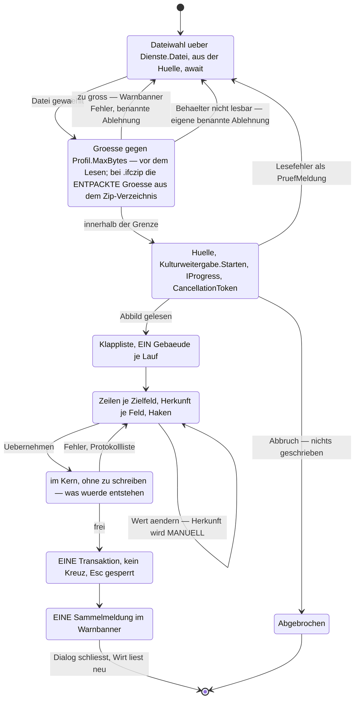

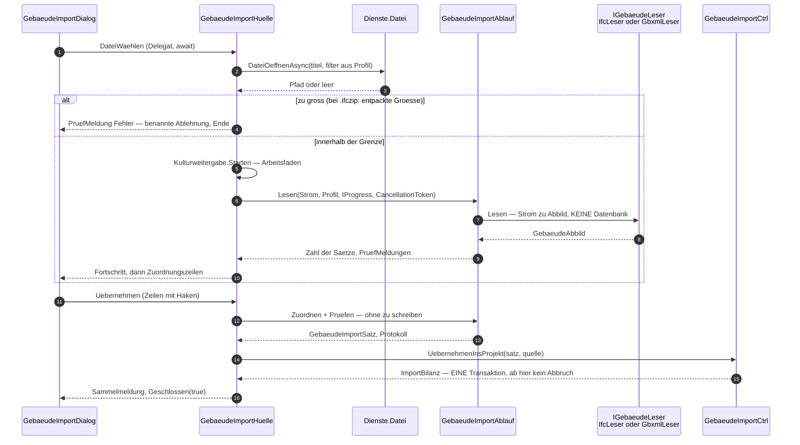

> **Benannte Fortschreibung (Stufe G4, Welle 4).** Die Übernahme in den Einzonenweg geht nicht in
> EINEM Schritt ins Projekt — `UebernehmenInsProjekt` gibt es nicht. Der Einstieg ist EIN Knopf im
> Gebäudedialog (A17), das Profil folgt der Dateiendung (`GebaeudeImportProfil.FuerDatei`). Nach dem
> OK des Zuordnungsdialogs öffnet der Katalogeditor im Modus Neu, vorbelegt
> (`GebaeudeImportHuelle.Vorbelegung`); sein gewöhnlicher Schreibweg legt den Katalogsatz an. Der
> Gebäudedialog nimmt die neue Zeile samt dem Schlüssel ihrer ausstehenden Herkunft in seine Liste,
> und erst das Speichern der Gebäudeliste schreibt Projektkopie und Herkunft in EINEM Vorgang
> (`WizardCtrl.GebaeudeZuordnungAnlegen` → `GebaeudeImportCtrl.SchreibeHerkunft`). Ablauf und
> Begründung: [Protokoll G4](../ueberholt/Protokolle/Gebaeudesimulation/2026-09-24_G4_Importe.md),
> Abschnitt 6.

### 3.5 Ergebnisdarstellung

Die Ergebnisdarstellung ist **fertig gebaut und stufbar** (Befund U 5). Die neuen Größen brauchen
keinen neuen Baustein, nur ihren Platz.

| Neue Größe | Ort | Bauform |
|---|---|---|
| Raumtemperatur (Luft und operativ), stündlich | `GebaeudeBedarfDialog`, **zweites Bild** mit eigenem `BereichGewaehlt`/`Zurueckgesetzt` | Renderer-Bild über `ChartBild` im Baustein `Diagramm`; Ganglinie mit Sollwertband, dazu die Dauerlinie desselben Vektors. **Nur bei Stundenmodell** |
| Kühlbedarf (Jahressumme, Monatswerte) | `GebaeudeBedarfDialog`, Abschnitt **„Kältebedarf"**; Monatsblatt des Ergebnisdialogs als zweite Reihe | `Kennzahlkachel`; Monatsbild als Stapel mit Heiz- und Kühlanteil. **Vierter Kanal `KUEHLUNG`** (E12) — mit **E21** trägt der Abschnitt dieselben Bausteine wie der Abschnitt „Wärmebedarf": Kennzahlkachel, Kanalzeile, Monatsstapel und eine **eigene Dauerlinie**; die Folgen für Kennzahlen, Bericht und Export regelt das [Kühlkonzept](Konzept_Kuehlung_Gebaeudesimulation_EPOS-Plan.md) (Konzept N1.18) |
| Spitzenlast (Stunde), Spitzenlast (Tagesmittel), 95-%-Quantil, Übertemperaturstunden | eigene Kennzahlkategorie „Spitzen" | `Kennzahlkachel` mit der Stunde bzw. dem Datum als leiser Herkunftszeile |
| Vergleich Altweg ↔ VDI 6007 | `GebaeudeBedarfDialog`, Tabelle mit vier Spalten (Kennzahl · Tagesbilanz (Bestandsweg) · VDI 6007 · Abweichung) über fünf Zeilen | **Zwei Auskünfte desselben Controllers**, keine zweite Rechnung (1.4); die Abweichung als `Kohaerenzzeile`. **Sie bleibt, solange zwei Rechenwege nebeneinander stehen** — bis zur Stufe GA (E20, E23, E26; fällig nach Q24, E27) |
| Ausweis des Rechenwegs | `GebaeudeBedarfDialog` und Berichtskopf | Ein Gebäude auf dem Altweg trägt die Zeile **„Tagesbilanz (Bestandsweg)"** statt des Produktausweises nach E10 (E20, E23); im Abschnitt „Kältebedarf" steht daneben der benannte Hinweis, dass dieser Weg **keine Kühllast** liefert (E21). Beides bleibt bis zur Stufe GA und steht in ihrer Löschliste (Umsetzungskonzept Kap. 6) |
| Zonenzeilen (G6) | Reiter „Zonen" des Editors; im Ergebnis eine Tabelle je Zone | `Zeilenraster` mit Summenfuß — **kein** `Raster`, weil die Zeile Bedienelemente trägt; unbeheizte Zonen bekommen **eigene** Zeilen (sie tragen keine Heizlast, aber Temperatur und Übertemperaturstunden) |
| Schichtenraster (G3) | `BauteilaufbauDialog` | `Zeilenraster` mit Summenfuß über Wärmedurchlasswiderstand, U-Wert und wirksame Kapazität |

**Vier Regeln, die dabei greifen.**

- **`ChartBild` ist der einzige Weg zu einem Renderer-Bild** — sonst fehlt der Zoom. Gezeichnet wird
  **im Kern** (SkiaSharp), nie in der Oberfläche; jede Änderung am Renderer läuft durch
  `Proben/ChartProben`, und **ein neuer Parameter bekommt eine Vorgabe, die das Bild byte-gleich
  lässt**.
- **„—" statt 0.** Die `Kennzahlkachel` zeigt einen leeren Wert als Gedankenstrich, nie als 0 — „eine
  0 wäre eine Aussage, die niemand getroffen hat".
- **Ein Reiter zeichnet nie ein vorbelegtes DTO als Ergebnis.** Jedes Feld, das es ohne Ergebnis
  nicht gibt — Kühlbedarf im Tagesbilanz-Weg —, ist **nullbar**, der Stand trägt einen benannten
  `ErgebnisZustand` samt Anlass, und an seiner Stelle steht eine Karte mit Grund.
- **Energiemengen nur über `Energieeinheit`**, nie mit nacktem Faktor 1 000; die Leistung bleibt kW.
  Das DTO führt **keine** 8 760 Werte — es führt die Kennzahlen und die vorab gerenderten Bilder.

### 3.6 Meldungen, Texte und Ressourcen

**Sprachneutral im Kern, Text in der Oberfläche.** Eine `PruefMeldung` trägt Stufe (Info, Warnung,
Fehler), einen **Schlüssel** — zugleich der Name des Ressourcenschlüssels — und bereits invariant
formatierte Werte; den Text holt erst die Oberfläche. Ein Anzeigetext ist **nie** ein Steuerwert.

**Gestaffelte Anzeige:** eine **leise Zeile** dort, wo der Anwender hinsieht → der **Grund am
Bedienelement** (`title` + `aria-disabled`, nicht `disabled`, sonst erschiene der Tooltip nie) →
das **Banner nach dem Versuch**, mit Verfallszeit. Ein dauerhaftes Banner nur für einen Zustand, den
der Anwender beheben muss und sonst nicht sieht.

**Die Ressourcenschlüssel-Präfixe:**

| Präfix | Bereich | Stufe |
|---|---|---|
| `GEB_` | der Wirt `GebaeudeDialog` | Bestand |
| `GEBK_` | der Katalogeditor | Bestand |
| `GEBB_` | der Bedarfsdialog | Bestand |
| `GEBW_` | die Wohnflächenmaske | Bestand |
| `BST_` | Baustoffkatalog | G3 |
| `BTA_` | Bauteilaufbau und Schichtenraster | G3 |
| `ZON_` | Zonenreiter und Zonendialog | G6 |
| `BTL_` | Bauteildialog | G6 |
| `GIMP_` | Gebäudeimport | G4 |
| `GEXP_` | Gebäudeexport | G7 |
| `GAN_` | Gebäudeansicht (Grundriss und Körper, E11) — darunter der **Pflichttext „schematisch"** | G6c · G7b |
| `GEBP_` | **Prüfmeldungen des Gebäudemodells aus dem Kern** — zugleich der Schlüssel der `PruefMeldung`, damit Kern und Oberfläche denselben Namen führen | G1 · G6 |

**Die Sortenordnung innerhalb eines Präfixes** ist streng: `TITEL`, `REITER_*`, `GRP_*`, `LBL_*`
(**mit** Doppelpunkt), `FELD_*` (**ohne** — für die Pflichtmeldung), `SP_*` (Spaltenköpfe), `BTN_*`,
`MSG_*`, `HINWEIS_*`; Wertelisten ohne Sortenkürzel. `LBL_` und `FELD_` sind **bewusst zwei
Schlüssel für dasselbe Feld**.

**Vier Handgriffe, jedes Mal:** beide `.resx` (deutsch **und** en-US), Einträge alphabetisch, UTF-8
mit BOM und CRLF; **ab etwa zehn Anzeigetexten ein Bündel** (`*Texte`-Klasse, **ein**
`[Parameter]`) statt einzelner Parameter — die Schwelle ist in jedem der neuen Dialoge
überschritten; der **Glossarabschnitt „Gebäudehülle und Gebäudemodell"** in
[`Glossar_Lokalisierung.md`](Glossar_Lokalisierung.md) entsteht **bevor** die englischen Werte
geschrieben werden (U4, E28), sonst gibt es zwei Übersetzungen desselben Begriffs; und **nach jedem neuen
Schlüssel läuft `Werkzeuge/ResourceDesigner`**.

**Der Produktausweis nach E10 ist ein Ressourcenschlüssel, kein abgeschriebener Satz.** Sein
Wortlaut steht an **einer** Stelle im Repositorium — [ADR-002](ADR-002_Stundenmodell_VDI6007_Einbindung.md),
Entscheidung Punkt 7 — und wandert von dort **unverändert** als **ein** Schlüssel in beide `.resx`.
Berichtskopf, Wiki-Seite und das Beschreibungsfeld der Exportdateien ziehen denselben Schlüssel
(4.3, 4.6); abgeschrieben oder umformuliert wird er nirgends. Dieses Papier gibt ihn nicht wieder —
es führt keine Zahlen des Nachweises.

**Vier freiwerdende Bestandsschlüssel werden gelöscht, nicht umgewidmet** — ein wiederverwendeter
Schlüssel trägt in der zweiten Sprache noch den alten Text.

### 3.7 Tests je Maske und iOS-Erreichbarkeit

**Der bunit-Fall nach Hausmaß.** Jede neue Maske bringt mit: Klasse erbt `EposBunitContext` (die
Kultur ist auf Deutsch gepinnt — der CI-Läufer läuft englisch, und die Ressourcen lösen über die
Oberflächenkultur auf); `JSInterop.Mode = Loose`; die Dienste-Attrappen im Konstruktor; ein
`Aufbauen(...)`-Helfer mit **allen** Delegaten als benannte Parameter mit Vorgabe. Die Fälle decken
**mindestens**: Feldbestand je Reiter gegen die Feldkarte, verzögerter Reiteraufbau, **jede
Betriebsart** und ihre Knopfsperren, Steuerwert ≠ Anzeigetext, abgeleitete Werte, **jede Prüfregel
mit ihrer Meldung**, der Schreibweg, die **abgelehnte** Schreibung als stehendes Banner, „ohne
Delegat kein Knopf", Esc/Beenden/Kreuz, das Kreuz der Überlagerung — und den **Rückweg mit `null`
bei Abbruch** sowie den Fall **ohne Gaben**. **Einen Dialogzustand „Modell" gibt es nicht mehr:**
Der Gebäudedialog steht in **einer** Struktur, und der Feldbestand eines Reiters hängt nicht mehr
vom Rechenweg ab (E20) — geprüft wird der Reiter **einmal**, der eingeklappte Bestandswegabschnitt
als **eigener** Fall und sein Fortfall bei einem Gebäude auf VDI 6007. Der Abschnitt „Kältebedarf"
des Bedarfsdialogs bekommt **dieselben** Fälle wie der Abschnitt „Wärmebedarf" (E21), dazu den
Fall „Altweg-Gebäude zeigt Kältebedarf 0 mit benanntem Hinweis".

Zwei Fallstricke, die im Haus schon Zeit gekostet haben: `RenderCount` taugt **nicht** als Zähler,
und bunits synchrones `Input()`/`Click()` wartet den Zeichenlauf **nicht** ab — nach jeder Eingabe
auf den gezeichneten Zustand warten und die Entprellung im Prüfstand ausdrücklich auf 0 setzen.

**Die drei Strukturwachen laufen ohne Zutun mit:** `StilblattTests` (keine verlorene Klammer, kein
Nesting), `SchliesskreuzWacheTests` (jeder Dialogkopf trägt das Kreuz, nie zwei),
`UeberlagerungstitelTests` (ein Titel, eine Stelle). Dazu `ParametersatzTests` bei jedem neuen
Gaben-Schlüssel, `HuellenwegTests` beim Hüllenumzug und `FenstermassTests` beim Fenstermaß.

**Die Rasterprobe** (`Proben/Rasterprobe`, Playwright, in keiner CI) misst, was bunit nicht kann —
Zeilenhöhe gegen das gesetzte Zeilenmaß, Abstandshalter, Rollbehälter, die Rückmeldungen der
Sichtbarkeitsmelder. **Sie ist vor jeder Änderung an `Raster`, `Katalogliste` oder den
`.epos-raster*`-Regeln zu ziehen** — also vor der Umstellung der Katalogseite (Befund U L4, G3) und
vor dem Schichten- und Bauteilraster.

**Die iOS-Liste** — zwölf Punkte, jeder mit seiner Folge:

| Punkt | Folge für die Gebäudesimulation |
|---|---|
| **Hüllenumzug** | Die drei vorhandenen Gebäudehüllen wandern nach `EPOS.UI.Daten/Bedarf/` — `GebaeudeHuelle` und `GebaeudeKatalogHuelle` mit einem Fensterrumpf, der in der Schale bleibt, `GebaeudeWohnflaecheHuelle` als reiner Gabenbauer (ihr Fensterweg hat schon heute keinen Aufrufer). **Der Umzug allein reicht nicht:** Erreichbar wird der Gebäudedialog auf dem iPad erst mit dem **Fall in `AppWurzel.razor`** und der Übersetzungszeile in `IosNavigation` (3.1, A10) |
| **Überlagerung statt Fenster** | Zonen-, Bauteil- und Importdialog **müssen** Überlagerungen sein — vier Ebenen tief, jede mit eigener Esc-Prüfung |
| **Dateifilter je Endung** | Nachzutragen in `EPOS.iOS/Dienste/Dateifilter.cs`: `".ifcxml"` auf `"public.xml"` und `".ifczip"` auf `"public.zip-archive"` — beide Kennungen sind dort schon für `.xml` und `.zip` geführt. Für `".ifc"` gibt es **keine** registrierte Typkennung; dort bleibt `"public.data"` **mit Kommentar**. Für gbXML ist nichts zu tun: `.xml` ist bereits abgebildet |
| **Kein „Speichern unter"** | Der Export bekommt keinen Zielpfad vom Anwender: Er schreibt in den Dokumentenordner und reicht die Datei über das **Teilen-Blatt** weiter; der Knopf heißt entsprechend anders |
| **Kein Ordnerdialog** | Ein Zielordner darf **keine Voraussetzung** eines Ablaufs sein |
| **Rückfrage als Komponente** | Die Rückfrage im OK-Weg läuft über `Rueckfrage`, nie über den Dialogdienst — der antwortet vom Hauptfaden aus nicht |
| **Hauptfaden** | Jeder plattformöffnende Delegat wird `await`et; synchron stürzt die WebView2 ab |
| **Umbruch bei 900 px** | Der vierstufige Stapel muss bei 900 CSS-Pixeln **umbrechen**, nicht scrollen; Zonen- und Bauteilraster brauchen je einen Haltepunkt |
| **Berührziel 44 px** | Die Aktionsknöpfe einer Bauteilzeile sind **immer sichtbar**, nie erst beim Zeigen, und 44 px hoch — das drückt auf die Spaltenzahl |
| **Eine Zeile je Maske in `IosNavigation`** | Sie zeigt auf einen Schlüssel, **den die Wurzel kennt** — sonst antwortet die Wurzel mit `false`, und die Zeile bleibt wirkungslos. Für alles, was iOS nicht kann, eine **benannte Absage** statt eines stummen `false` |
| **Fremdstück im Browser** | `three.js` wird **lokal** ausgeliefert, nie vom CDN, und die Körperansicht ist auf dem iPad **erst nach einer Messung** zugesagt (WebGL in der iOS-WebView, Speicher, Startzeit — dieselbe Auflage wie für jedes Fremdstück, 1.2). Trägt sie dort nicht, bleibt der **Grundriss** (SVG, ohne Bibliothek) als benannter Rückfall, und die Körperansicht wird mit Grund abgelehnt |
| **Benannte Ablehnung** | Was das iPad nicht trägt (etwa eine zu große Importdatei), wird mit Grund abgelehnt — nie still übergangen |

### 3.8 Hilfe, Assistent und Wiki je Maske

Jede neue Maske heißt **ein** Eintrag an **vier** Stellen — fünf Masken bis G6, mit der Exportmaske
sechs. Fehlt einer, ist entweder ein Wächter rot oder eine Maske ohne Hilfe. **`GebaeudeAnsicht`
zählt nicht mit:** Sie ist eine eingebettete Komponente ohne eigene Maske und ohne Eingabefelder —
Hilfe und Assistent gehören zu der Maske, die sie trägt.

| Stelle | Was einzutragen ist | Ohne den Eintrag |
|---|---|---|
| `<InfoKnopf Schluessel="…" Dialogname="…" />` im Dialogkopf | je Maske ein Hilfeschlüssel nach dem Bestandsmuster `<Maskenname>.btn_Help` | Die Maske hat **keinen** Hilfeknopf und **keinen** Assistenten — der KI-Knopf steckt im `InfoKnopf`, weil der den Hilfeschlüssel trägt, aus dem der Kern den Bereich ableitet. `MitAssistent="false"` braucht einen Grund |
| `KiMaskennamen` in `EPOS.Kern/Allgemein/KI/Dialoge/KiDialoge.cs` | je Maske eine Konstante — **die EINE Stelle**, an der ein Razor-Dialog erfährt, unter welchem Namen er in der Maskenbrücke steht. Die neuen Masken hatten nie eine WinForms-Fassung und bekommen deshalb **keine** `Form_`-Vorsilbe | Der Assistent kennt die Maske nicht |
| `KiDialoge.Katalog` | je Maske die Feldliste (Feldname, Eigenschaftspfad, Anzeigename, Parametertyp, Erläuterung) und die Knöpfe; ein Raster wird über die Sammlungsform des Eigenschaftspfades benannt | `KiDialogkatalogTests` ist **rot**: Die Zahl der Masken ist namentlich geprüft (heute `Assert.Equal(7, katalog.Anzahl)`, `EPOS.UI.Tests/Dialoge/Hilfe/KiDialogkatalogTests.cs:112`) — **zwölf** nach G6, **dreizehn** nach G7 |
| Anmeldung im Wirt | `KiMaskenanmeldung.Fuer(name, () => Daten, KiHaken())` in `OnInitialized` — als **Delegat**, nicht als Instanz, und **der Wirt meldet an, nicht das Blatt** darin. `Pruefen` im Haken ist **dieselbe** Prüfung wie am OK-Weg | Der Assistent sieht die Maske, aber keine Werte |

**Wiki und Logbuch sind Teil der Stufe, nicht ihres Nachklangs.** Je Stufe mit sichtbarer Wirkung
entsteht eine Repo-Quelle unter `Projekte/Wiki/` bzw. wird eine bestehende fortgeschrieben; die
Seiten beschreiben **ausschließlich die Funktion, so wie sie ist** — kein „seit …", kein „bisher",
kein Auftrags- oder Wellenkürzel, auch nicht in HTML-Kommentaren. **Änderungsvermerke gehören
ausschließlich in die Seite „Update-Logbuch"**, mit Datum, geordnet nach Version. Der
Logbuch-Eintrag wird **mit dem Auftrag entworfen** und **mit dem Upload veröffentlicht**; die
**Versionsnummer erfragt der Auftrag beim Anwender**. Hochgeladen wird gebündelt, höchstens einmal je
Woche, für alle seither geänderten Seiten; ausstehende Uploads stehen in der Statusdatei. **Keine
Hersteller- und Produktdaten**: Beispiele tragen neutrale Namen mit runden Werten
(`WikiProduktdatenWacheTests`). Zuordnung und Regel:
[`Konzept_Hilfesystem_Wikidokumentation.md`](Konzept_Hilfesystem_Wikidokumentation.md), Abschnitt 13.

| Stufe | Wiki-Arbeit |
|---|---|
| **G1 + G2** | neue Seite „Gebäudemodell VDI 6007"; die Seite „Gebäude" wird fortgeschrieben (Reiter „Hülle und Rechenmodell" in VDI-6007-Struktur, Schalter „Rechenweg" samt Abschnitt „Tagesbilanz (Bestandsweg)", ein Schreibweg, Skalierung über die Nutzfläche) |
| **KU1** | Abschnitt „Kältebedarf" auf der Seite „Gebäudemodell VDI 6007" und im Bedarfsdialog-Abschnitt der Bedienungsseite — nach dem Muster des Abschnitts „Wärmebedarf" (E21) |
| **G3** | neue Seite „Bauteilkatalog" (Baustoffe und Aufbauten) |
| **G4** | Abschnitt „Gebäudedaten aus IFC und gbXML übernehmen" |
| **G6** | Abschnitt „Zonen" auf der Seite „Gebäudemodell VDI 6007" |
| **G7** | Abschnitt „Gebäudedaten ausgeben" samt dem Vorbehalt zur schematischen Geometrie; dazu die Körperansicht des Gebäudebetrachters (E11) — mit derselben Kennzeichnung „schematisch" |

---

## 4. Integrationsarchitektur

### 4.1 Lauf

**Zwei Aufrufer, eine Weiche am Eingang, zwei getrennte Module.** `HeizwaermeEinesGebaeudes`
(`EPOS.Kern/Allgemein/Simulation/SimulationWaermebedarf.cs:566`) hat **zwei Aufrufer** — die
Gebäudeschleife des Laufs (`:197`) und die Auskunft je Gebäude
(`EPOS.Kern/Controller/GebaeudeBedarfCtrl.cs:117`). Nach **E20** fällt die Wahl des Rechenwegs
**nicht mehr an zwei Punkten im Rumpf**, sondern **einmal, am Eingang**: `SimulationWaermebedarf`
wird zur **Fassade**. Sie ruft zuerst den **modellfreien Vorbereitungsschritt**
`GebaeudeVorbereitung` — Klimakalender, bisheriger Verbrauch, Flächen, Einheit, Jahresnutzungsgrad;
sein Vertrag steht ausgeschrieben in 1.3 —, liest dann den Rechenweg des Gebäudes und ruft **genau
ein** Modul: `Gebaeude/` für VDI 6007,
`Altweg/` für die Tagesbilanz. **Keines der beiden Module ruft das andere.** Damit kann die
Verhältnisrechnung des bisherigen Verbrauchs zwei Rechenwege nicht mehr mischen — die Gefahr, gegen
die ADR-002 Punkt 3 den Satz „Die Flächen- und Bewohnerrechnung … folgt derselben Modellwahl"
gestellt hat, besteht nicht mehr, weil es nur noch **eine** Wahl gibt; Bewohnerzahl und
Skalierungsfaktor entstehen **je Modul** aus dessen erstem Lauf, und die Fassade führt die Schleife
(1.3).

**Der Tagesbilanz-Weg wird Zeichen für Zeichen nach `Altweg/` verschoben.** Alles, was heute im
Rumpf steht — Tageswerte rechnen, Tagesverteilung lesen, **Abbruch bei fehlender Verteilung**,
Puffer nullen, Stundenwerte verteilen —, wandert unverändert in `TagesbilanzWaermebedarf` und
bekommt **keine neue Funktion** mehr. Die Verschiebung ist **ergebnisneutral und mit einem
byte-gleichen Referenzlauf abzunehmen** — als **eigener, erster Schritt innerhalb von G1, vor** der
Anbindung des VDI-Wegs (E20). Der VDI-Weg braucht keine Tagesverteilung und **erbt deshalb auch
deren Abbruch nicht**; er füllt denselben Puffer, in **Watt**, und gibt `true` zurück. **Modul,
Weiche und Schalter tragen den Übergang und fallen mit der Stufe GA** (E23, E26; fällig nach Q24, E27);
bis dahin bleibt es bei **einer** Verzweigung, und die steht am Eingang. **A16** ist damit gegenstandslos: Es gibt keinen zweiten Verzweigungspunkt (Kap. 6).

**Die Kälteseite ist symmetrisch gebaut — und rechnet das Gebäude nicht ein zweites Mal** (E21).
Neben `SimulationWaermebedarf` steht die Fassade **`SimulationKaeltebedarf`**. Beide lesen
**denselben** Vorbereitungsschritt, und beide werden vom Modul `Gebaeude/` bedient: Der Löser
liefert je Blockstunde **Heiz- und Kühlleistung in einem Lauf** (`Stundenergebnis` führt beide
bereits, 1.3). Die Fassaden **verteilen** dieses eine Ergebnis — die Wärmefassade in den Kanal
`HEIZUNG`, die Kältefassade in den vierten Kanal **`KUEHLUNG`** (E12) —, sie rechnen nicht doppelt.
`Kaeltebedarf_Max` ist das Gegenstück zu `Waermebedarf_Max`, die Kältedauerlinie das Gegenstück zur
Wärmedauerlinie, die Kälteprobe je Stunde das Gegenstück zur Energieprobe. **Die Trennung der
Deckungswelten trägt nicht eine Verabredung, sondern zwei Kanallisten:** `KANAELE_WAERME` für die
Kaskade der Wärmeerzeuger, `KANAELE_KAELTE` für die der Kälteerzeuger — vollständig und disjunkt,
im Selbsttest zugesichert (Kühlkonzept 4.2 und 4.4). **Die einzige benannte Abweichung von der
Symmetrie:** Es gibt **keinen Altweg der Kälteseite. Ein Gebäude auf dem Altweg liefert
Kältebedarf 0**, und zwar mit dem benannten Hinweis „Tagesbilanz (Bestandsweg) liefert keine
Kühllast" über `SimulationProtokoll` — **nicht still**. Dieser Fall besteht, **solange es
Altweg-Gebäude gibt**; er endet mit der Stufe GA (E23, E26).

**Alles davor und dahinter bleibt unberührt** — mit einer benannten Ausnahme: Die **Flächen** des
Gebäudes wandern in den Vorbereitungsschritt und stehen damit **vor** der Weiche (der Eingangsbauer
liest ihr Ergebnis **danach**); **Bewohnerzahl und Skalierungsfaktor nach E8 entstehen dagegen je
Modul aus dessen erstem Lauf** (1.3), und die Fassade führt die Schleife darüber. Die
**Verhältnisrechnung** des bisherigen Verbrauchs bleibt Teil des gewählten Moduls. Unberührt
bleiben ferner die Addition
in den Kanal Heizung, die unabhängige Energieprobe, die Summe über alle Gebäude, die eine
Umrechnung nach kW, die Dauerlinie, der Erzeugerlauf, das Ergebnismodell, der Bericht.

**Die Skalierung bleibt Teil der Rechnung** (E8). Sie steckt heute im Rückgabewert der
Tagesrechnung, und der Altweg wird dafür wie im Bestand **zweimal** gerufen. **Dem VDI-Modul fällt
sie nicht zu:** `IGebaeudeRechenweg.Rechnen` liefert aus **einem** Aufruf die Reihe und den
unskalierten Jahreswert `VerbrauchAltKwh`; daraus bildet die Fassade den Faktor nach E8 und
multipliziert nach (1.3, 1.5; Systementwurf V16). Das Ergebnisobjekt je Gebäude liegt in einem je
Lauf gehaltenen Träger neben dem Vorbereitungsergebnis, und **beide** Fassaden lesen es (4.3,
4.4). Der Fall „bisheriger Verbrauch
null" ist heute ungeschützt und bekommt im Stundenzweig eine **benannte** Prüfung; im Tagesmodell
bleibt es bei einer Warnung, damit die Basis unberührt bleibt.

**Die Liste der Gebäudeergebnisse tritt an die Stelle des toten Feldes.** `MaxP` ist `double[100]`,
wird je Gebäude geschrieben (`:212`) und **nirgends gelesen** — toter Bestand. An seiner Stelle führt
`SimulationWaermebedarf` eine `List<GebaeudeModellErgebnis>`; sie trägt Reihen und Kennzahlen je
Gebäude zum Export und in den Bericht. Zugleich fällt die 100er-Grenze: `HeizwaermebedarfGeb`
(`:31`) wird auf die Zeilenzahl dimensioniert, `MaxP` (`:56`) gelöscht — ergebnisneutral, und es
geschieht in **GB**, wo die Schleife ohnehin angefasst wird (U9, E28).

```mermaid
flowchart LR
  RUN["SimulationRunner.Simuliere"] --> WB["SimulationWaermebedarf — Fassade<br/>Waermebedarf_berechnen"]
  WB --> KAL["KlimakalenderLesen<br/>Wochenendmaske"]
  WB --> SOL["SolardatenCtrl.ReadOrtszeit<br/>8760 Zeilen, Ortszeit"]
  WB --> LOOP["je Gebaeudezeile"]
  LOOP --> VOR["GebaeudeVorbereitung<br/>Klimakalender · Verbrauch · Flaechen<br/>modellfrei, vor der Weiche"]
  VOR --> VZ{"Weiche am Eingang<br/>Rechenweg des Gebaeudes"}
  VZ -->|Tagesbilanz, Bestandsweg| TAG["Modul Altweg<br/>TagesbilanzWaermebedarf<br/>bleibt bis GA"]
  VZ -->|VDI6007 oder NULL| EIN["Modul Gebaeude<br/>GebaeudeModellEingang.Bauen<br/>ruft GebaeudeKlimaweg"]
  EIN --> LOES["Zonenmodell2K<br/>8760 Blockstunden"]
  LOES --> ERG["GebaeudeModellErgebnis"]
  TAG --> PUF["Wattpuffer ziel 8760"]
  ERG --> PUF
  PUF --> KAN["Kanal HEIZUNG · Energieprobe · Summe"]
  KAN --> KW["WattToKw · MWh · Dauerlinie"]
  KW --> EM["ErgebnisModel · ErgebnisCtrl.Save"]
  ERG --> LISTE["Liste der Gebaeudeergebnisse<br/>statt des toten MaxP"]
  LISTE --> BER["Bericht · Kennzahlen · Diagramme"]
  LISTE --> REF["Referenzlauf-Export<br/>3 bedingte Reihen + Skalare"]
  EM --> BER
  ERG ==> KUE["SimulationKaeltebedarf — Fassade<br/>Kanal KUEHLUNG · Kaeltebedarf_Max<br/>Dauerlinie Kaelte"]
  TAG -.-> K0["Kaeltebedarf 0<br/>benannter Hinweis, kein Altweg der Kaelteseite"]
  KUE ==> KDE["Deckung der Kaelteseite<br/>KANAELE_KAELTE · Kaelteprobe je Stunde"]
  KDE ==> BER
```

### 4.2 Bedarfsdialog und Auskunft

**Eine Auskunft ruft den Rechenweg des Laufs — sie schreibt ihn nicht ab.** Der Bedarfsdialog rechnet
über `GebaeudeBedarfCtrl.Rechnen`, und dieser Weg ruft **dieselbe Fassade** wie die Gebäudeschleife:
Vorbereitungsschritt, Weiche, ein Modul. Die **eine Weiche** trägt den Dialog damit **automatisch**
mit; es gibt keinen zweiten Rechenweg und keine zweite Prüfkette. **Das gilt für jede Auskunft** —
auch der Assistent und der Bericht rufen die Fassade, nie ein Modul unmittelbar (E20); für die
Kälteseite gilt dasselbe gegenüber `SimulationKaeltebedarf` (E21).

**Der vierte Parameter `modellErzwungen`** (1.4) macht den Vergleich beider Modelle zu **zwei
Aufrufen desselben Controllers**: `null` für den Spaltenwert, der Gegenwert für die andere Seite der
Tabelle. Er wirkt **allein auf der gelesenen Modellinstanz** und **schreibt nichts** — weder die
Spalte noch eine Einstellung. Der Dialog zeigt das Ergebnis als vierspaltige Tabelle (Kennzahl ·
Tagesbilanz · VDI 6007 · Abweichung); die Abweichung steht als `Kohaerenzzeile`, sie sperrt nichts.

**Was der Dialog zusätzlich bekommt** (3.5): das zweite Bild „Raumtemperatur" mit eigenem Zoom, drei
neue Kennzahlen im Kennzahlblock, die Vergleichstabelle. **Alle neuen Felder sind nullbar**; ohne
Wert steht ein Gedankenstrich. Das DTO führt **keine** 8 760 Werte.

### 4.3 Bericht und Kennzahlen

**Fünf neue Gebäudekennzahlen — dazu vier der Kälteseite (E21)** mit stabilem Schlüssel in
Kleinschreibung mit Punkt, wie der Bestand
(`EPOS.Kern/Allgemein/Bericht/KennzahlenKatalog.cs:204` ff.). Jede Kennzahl trägt **acht** Stücke:
Schlüssel, deutschen und englischen Namen, Einheit, Gruppe, Zahlenformat, Delta-Kennzeichen und den
Wertzugriff (`:11-22`).

| Schlüssel | Deutsch / Englisch | Einheit | Format | Delta | Aggregation über Gebäude |
|---|---|---|---|---|---|
| `gebaeude.raumtemperatur_mittel` | mittlere Raumtemperatur in der Heizzeit / mean room temperature, heating season | °C | `N1` | nein | **flächengewichtetes Mittel** |
| `gebaeude.kuehlbedarf` | Kühlbedarf des Gebäudes / building cooling demand | MWh/a | `N0` | ja | **Summe** |
| `gebaeude.spitze_tagesmittel` | Spitzenlast (Tagesmittel) / peak load (daily mean) | kW | `N0` | ja | **Summe der gleichzeitigen Werte** des Kanalvektors, nicht der Einzelspitzen |
| `gebaeude.spitze95` | 95-%-Quantil der Stundenlast / 95th percentile hourly load | kW | `N0` | ja | über den **Kanalvektor**, nicht je Gebäude |
| `gebaeude.uebertemperaturstunden` | Übertemperaturstunden / hours above set maximum | h/a | `N0` | nein | **Maximum** über die Gebäude, mit dem führenden Gebäude als Herkunftszeile |
| `kaelte.jahresbedarf` | Jahreskältebedarf / annual cooling demand | MWh/a | `N0` | ja | **Summe des Kanals `KUEHLUNG`** — einschließlich externer Ganglinien, deshalb nicht dasselbe wie `gebaeude.kuehlbedarf` |
| `kaelte.spitze` | Kältespitze / peak cooling load | kW | `N0` | ja | über den **Kanalvektor** der Kälteseite (`Kaeltebedarf_Max`) — Gegenstück zu `Waermebedarf_Max` |
| `kaelte.stunden` | Stunden mit Kühlbedarf / hours with cooling demand | h/a | `N0` | nein | über den **Kanalvektor**, nicht je Gebäude |
| `kaelte.deckungsgrad` | Deckungsgrad Kälte / cooling coverage | % | `N1` | nein | `DeckungKanalKaelte` — **eigener Zweig** neben `DeckungKanal` der Wärmeseite, gleiche Bauform (KU2) |

**Fünf Gebäudekennzahlen im Bericht, eine weitere Größe nur im Export.** Die Anforderung nennt je
Gebäude **acht** Größen (Systementwurf F7; die achte, `Ueberhitzungsstunden`, steht im Katalog als
`gebaeude.uebertemperaturstunden`): die Jahresheizwärme, die fünf des Katalogs, die Gebäudespitze
und die Stunden mit Kühlbedarf. Die **Gebäudespitze** bekommt **keinen** Katalogeintrag (sie steht
schon als `Waermelast_Max` über den Kanalvektor im Bericht). Sie steht als **Skalar je
Gebäude** im Referenzlauf-Export (4.4) — dort ist das Gebäude die Zeile, und die Frage der
Aggregation stellt sich nicht. **„Stunden mit Kühlbedarf" bekommt mit E21 doch einen Eintrag:**
Sobald die Größe über den **Kanalvektor** `KUEHLUNG` gebildet wird, ist sie ein Skalar je Projekt,
und die Aggregationsfrage, die sie bisher ausschloss, stellt sich nicht mehr.

**Bericht und Wirtschaftlichkeit folgen derselben Symmetrie** (E21): eine **Kanalzeile Kühlung**
neben den Wärmekanälen, ein **Kältebild** nach dem Muster des Wärmebildes (Monatsstapel bzw.
Jahresganglinie, gezeichnet über `ChartBild` im Kern), der **Deckungsanteil je Kälteerzeuger** nach
dem Muster der Wärmedeckung und der **Kältestrom** als eigene Verbrauchsposition, die über denselben
Stromträger in Kosten und Emissionen eingeht. **Die Symmetrie ist Bauvorschrift** — gleiche
Klassenmuster, gleiche Bausteine, gleiche Wächter —, und **jede Abweichung wird benannt**; die
einzige im Rechenweg ist der fehlende Altweg der Kälteseite (4.1).

**Die Aggregationsregel gehört zur Kennzahl, nicht zur Anzeige:** Eine Kennzahl liefert genau
**einen** Skalar je Projekt, die Gebäudegrößen sind aber je Gebäude. Wo eine Summe sinnlos wäre
(Temperatur), steht das gewichtete Mittel; wo eine Spitze sich nicht addieren lässt, steht der Wert
aus dem **Kanalvektor** — dort sind die Gleichzeitigkeiten schon drin. **`null` bedeutet „für dieses
Projekt nicht verfügbar" und wird als Gedankenstrich gezeigt, nie als 0.**

**Eine fünfte Kennzahlgruppe `GR_GEBAEUDE` kommt hinzu.** Der Katalog führt heute **vier**
(`KennzahlenKatalog.cs:36-39`), und sein Kopf sagt das ausdrücklich (`:8`). Die fünfte Gruppe ist
damit eine **Fortschreibung des Berichtskonzepts**, kein Nebenbei — sie gehört mit ihrem Namen in
beide Ausgabewege und in die Wiki-Seite.

**Die vier Kältekennzahlen bleiben in `GR_ENERGIE`** (E21): Sie beschreiben einen **Kanal**, nicht
ein Gebäude — dieselbe Gruppe, in der `DeckungKanal` und die Bedarfskennzahlen der drei
Wärmekanäle schon stehen. Eine eigene Kältegruppe wäre eine sechste Gruppe für dieselbe Aussage.

**Abweichungsmerkmale** je Gebäudefeld stehen bereits im Bestand und sind **tolerant**: Fehlt eine
Spalte, wird sie übersprungen. Die fünfzehn neuen Spalten kommen als Merkmale dazu, je mit Gewerk,
Tabelle, Spalte, Beschriftung, Einheit und Nachkommastellen.

**Eine Zonentabelle je Teilobjekt** (G6) folgt dem Bestandsmuster für Tabellen je Teilobjekt. **Jedes
Bild** entsteht über den vorhandenen Renderer im Kern und läuft durch `Proben/ChartProben`.

**Der Produktausweis nach E10** steht im Berichtskopf und auf der Wiki-Seite, **im Wortlaut,
unverändert und ohne Umschreibung**. Sein Wortlaut steht an **einer** Stelle im Repositorium —
[ADR-002](ADR-002_Stundenmodell_VDI6007_Einbindung.md), Entscheidung Punkt 7 — und liegt als **ein**
Ressourcenschlüssel in beiden `.resx` (3.6); Bericht, Wiki-Seite und Exportdatei ziehen denselben
Schlüssel. **Dieses Papier gibt ihn nicht wieder**, weil es keine Zahlen des Nachweises führt — wer
ihn baut, holt ihn dort und schreibt ihn nicht ab. In den Exportdateien ist er bereits geregelt
(Datenaustauschkonzept 6.5): das Validierungsfeld trägt den E10-Wortlaut, das Rechenmodellfeld die
Kurzform, und **im Mehrzonenfall gilt der Ausweis je Zone** — das Mehrzonenmodell selbst ist eine
EPOS-Erweiterung, keine Norm, und die Datei darf das Gegenteil nicht nahelegen. Für Wiki-Seite und
Berichtskopf ist mit E27 entschieden (**A12**): Beide tragen ihn, im Wortlaut von E10. Der Ausweis wechselt, sobald G0 den offenen
Testfall löst.

**Die Kennzeichnung der Testversion** liegt an derselben Stelle wie der Produktausweis: Eine
Testlizenz zeichnet Exporte und Berichte mit einem Wasserzeichen
([`EPOS-Plan_Konzept_Lizenzierung.md`](EPOS-Plan_Konzept_Lizenzierung.md), Abschnitt 2.1). **Beide
Kennzeichnungen stehen nebeneinander, nicht statt einander**: Der Produktausweis sagt, **womit**
gerechnet wurde, das Wasserzeichen, **unter welcher Lizenz** — die neuen Exportdateien tragen
beides.

### 4.4 Referenzlauf-Export

| Was | Wie |
|---|---|
| **Drei neue Vektordateien je Gebäude** | `gebaeude_<n>_raumtemperatur.csv`, `gebaeude_<n>_operative_temperatur.csv`, `gebaeude_<n>_kuehlbedarf.csv` — **Gegenstandsvorsatz, Kennung, Größe**, wie die Speicherdateien es vormachen (`quellspeicher_<n>_soc.csv`). `<n>` ist **keine** Schleifennummer, sondern die stabile Kennung `ID_ProjektGebaeude` (Rückfall: ein laufender Zähler), genau wie dort die `ID_Anlage` — „damit sie stabil bleiben" steht als Begründung im Bestand (`Referenzlauf/Ergebnisexport.cs:90-101`). Ein Schleifenindex verschöbe sämtliche Dateinamen, sobald ein Gebäude eingefügt oder gelöscht wird, und damit die Basis, ohne dass sich eine Zahl geändert hätte. Format wie alle Vektordateien: `Index;Wert`, UTF-8 mit BOM, CRLF; die Summe je Datei landet als Vektorsumme in der Sammeldatei |
| **Die Einheit je Datei** | `gebaeude_<n>_kuehlbedarf.csv` in **kWh** (Zeitreihen führen kWh; die Wattform bleibt intern). `gebaeude_<n>_raumtemperatur.csv` und `gebaeude_<n>_operative_temperatur.csv` führen **°C** — sie sind Zustandsgrößen, keine Energiemengen, und die kWh-Regel des Einheitenwächters gilt den **Energie**reihen. Muster im Bestand: `stundentemperatur.csv` liegt neben den kWh-Reihen. Bei den zwei Temperaturreihen ist die Vektorsumme **kein Jahreswert, sondern ein Vergleichsanker** — das gehört in die `LIESMICH.md` der Basis, damit niemand sie als Energie liest; ob die Toleranz (Betrag ≥ 1 relativ 1e-4) für Werte um 20 °C scharf genug ist, wird beim ersten Einfrieren gemessen |
| **Skalare** | mit Gebäudepräfix in der Sammeldatei, Muster ist der Erdreichblock: Gebäude-Id, Modell, Spitzenlast, Spitze im Tagesmittel, 95-%-Quantil, Kühlenergie, Stunden mit Kühlbedarf, mittlere Raumtemperatur, Heizwärme. **Einheit im Namen**, Jahressummen in MWh. Hier — und **nur** hier — stehen auch die zwei Größen, die keinen Kennzahleintrag bekommen: „Stunden mit Kühlbedarf" und die Gebäudespitze (4.3) |
| **Die Bedingung** | Der Block läuft **nur**, wenn das Projekt mindestens ein Gebäude im Stundenmodell führt — Muster ist der Erdreichblock, der ohne Erdreich **keinen einzigen** Eintrag erzeugt |
| **Warum das Bedingung ist und nicht Bequemlichkeit** | Der Vergleich kennt nur einen **Schlüssel**-Ausschluss innerhalb einer Datei, keinen **Datei**-Ausschluss. Eine Datei, die nur in einem der beiden Läufe liegt, bekommt die höchste Schwere und ist damit FAIL, **ohne Schalter dagegen**. Die drei Reihen dürfen für Tagesbilanz-Gebäude deshalb **gar nicht entstehen** — nicht „mit Nullen gefüllt" |
| **Der Rückweg-Test** | läuft auf einer **gitignorierten Arbeitskopie** der Testdatenbank, die alle Gebäude auf den Altweg setzt; die eingefrorene Testdatenbank bleibt unberührt, der Schalter dafür ist ein eigener Modus des Referenzlaufs. **Sein Umfang ist eng gefasst:** Bis zum Merge G1 + G2 hält er den Projektbestand gegen die GB-Basis; **danach misst er allein das eine Referenzprojekt**, das mit `Gebaeude_Modell = TAGESBILANZ` in der **jeweils aktuellen** Basis steht (A15) — nicht alle Gebäude, nicht die Zonenprojekte, nicht das VDI-Referenzprojekt. **Einen zweiten Basisordner gibt es nicht.** Er läuft, solange der Übergang läuft, und **endet mit der Stufe GA** (E26) |
| **Die Ausbauprobe** | das **Gate der Stufe GA** (1.7, Kap. 5): Ein Bau mit umbenanntem Ordner `Altweg/` übersetzt, nachdem die Weiche entfernt ist, und der Referenzlauf **aller** Projekte ohne Altweg-Gebäude bleibt byte-gleich. Ihr **statischer** Teil — außer Weiche, Rückweg-Test und Wache nennt keine Datei des Kerns `Altweg/` — läuft schon **ab G1** in der `Modultrennungswache` mit und ist damit kein Befund des letzten Tages |
| **Eine Fassung, zwei Werkzeuge** | `EPOS.Referenzlauf` und das Windows-Werkzeug teilen sich **eine** Fassung von Export und Vergleich; eine Änderung wirkt auf beiden Wegen |

**Toleranz unverändert:** Betrag ≥ 1 relativ 1e-4, sonst absolut 0,01; der Byte-Vergleich ist nur
Information.

### 4.5 CI, iOS-Prüfmodus, Setup und Lizenzseite

| Stelle | Was je Stufe geschieht |
|---|---|
| **`kern.yml`** (ubuntu, bei jedem Push) | Bau und Tests des plattformfreien Filters, Werkzeugtests, SQL-Dialekt-Prüfer, `ChartProben`, Referenzlauf der sechs Projekte gegen die Basis. **Das ist der Nachweis für Kern, Oberfläche, Testdatenbank und Doku.** Ab G0 laufen die Normfälle **schweigend** durch (die Zahlen liegen nicht im Repositorium, 1.8) — das ist eine bewusste Lücke im Gate und gehört ins Protokoll |
| **`windows.yml`** | Job „build-test" bei Push auf den Hauptzweig und nächtlich; er prüft die Windows-Schale samt Migrationsschritt und Hüllen. **Der Setup-Lauf ist beim Anwender zu erfragen**, jedes Mal |
| **`ios.yml`** | Nur auf Zuruf und **nur nach Rückfrage beim Anwender**, jedes Mal. **Begründet ist ein iOS-Lauf allein, wenn die Änderung die iOS-Hülle selbst trifft** — Dateifilter, Navigationszeile, Seed-Datenbank, Prüfmodus, ein `Dienste.*`-Adapter — oder wenn der Anwender ihn verlangt. Die einmalige Trimming-Messung des Gerätebaus (U16) ist ein solcher Fall |
| **Der Prüfmodus der iOS-Schale** (nicht zu verwechseln mit dem Schalter `Pruefmodus` des Eingangsbaus, 1.3) | prüft die Seed-Datenbank über die **Zahl der `STRICT`-Tabellen**; sie wächst mit jedem Tabellenschritt (2.2, 2.4) und ist je Schemastand nachzuziehen. **Richtigstellung:** Der iOS-Lauf rechnet heute ein Projekt, das **kein** Gebäude führt — er kann das Gebäudemodell also **nicht** berühren. Er prüft die **Schale**: dass die App startet, die Seed-Datenbank findet, das Schema stimmt und ein Lauf durchläuft. Wer das Gebäudemodell auf iOS nachweisen will, muss dafür ein anderes Projekt wählen; **solange das nicht geschieht, ist der grüne Kern-Lauf auf ubuntu der Nachweis**, und das gehört so ins Protokoll |
| **Seed-Datenbank** | je Schemaschritt neu zu erzeugen: Die Migration läuft auf iOS **nicht** |
| **Setup und Lizenzseite** | `Setup/` führt heute **keine** Seite für Fremdbibliotheken. Für xBIM verlangt die Lizenz den dauerhaften **Quellenverweis an den Empfänger** (ADR-003, E3). Es entsteht eine Datei mit je Fremdbibliothek Name, Fassung, Lizenz, Copyright-Vermerk und Quellenverweis — **erster Eintrag xBIM**, **zweiter `three.js` (MIT)** nach E11, dazu die schon ausgelieferten Fremdanteile —, eine Kopierzeile im Installationsskript und als Pflegeweg eine Zeile je ausgelieferter Fassung. **Ohne diese Seite ist weder der IFC-Weg noch die Körperansicht auslieferbar**, Import wie Export (U10, mit E27 entschieden: mit der ersten IFC-Stufe, für alle Fremdanteile) |

### 4.6 Export und Round-Trip

Der Export ist nach **E9** entschieden — er ist Stufe G7, kein Ausblick. Architektonisch ist er das
**Spiegelbild** des Imports und benutzt dieselben Bausteine in der Gegenrichtung.

| Glied | Ort | Regel |
|---|---|---|
| Naht | `IGebaeudeSchreiber` mit `IfcSchreiber` und `GbxmlSchreiber` (1.5) | Die Dateiwahl bleibt **außerhalb**, über `Dienste.Datei` aus der Hülle |
| Ablauf | `GebaeudeExportAblauf` + `GebaeudeExportProfil`; er bekommt den **fertig gelesenen** Satz und berührt die Datenbank nicht (1.6, Punkt 5) | Was je Format verschieden ist, steht als **Daten** im Profil. Gelesen wird in der **Hülle**, vor dem Fadenwechsel, über `GebaeudeZonenCtrl.LesenJeGebaeude`, `BauteilaufbauCtrl.LesenJeAufbau` und `ProjektGebaeudeCtrl` — dieselbe Regel wie im Import, nur in Gegenrichtung, und deshalb **kein** eigener Exportcontroller |
| Maske | `GebaeudeExportDialog` + `GebaeudeExportHuelle` (1.2, 3.2) — **eine eigene Maske**, nicht der Importdialog in Gegenrichtung: Format, Umfang und Kennzeichnung sind zu wählen, eine Zuordnungsliste gibt es nicht | Sie zählt wie jede Maske: vier Pflegestellen (3.8), Ressourcenpräfix `GEXP_` (3.6), bunit-Fall (3.7) |
| Einstieg | Überlagerung im Gebäudedialog **und** im Bedarfsdialog (dort liegen die Ergebnisse) | **A17**, mit E27 entschieden: kein Menüpunkt, kein Maskenschlüssel (D14) |
| Geometriequelle | das **Zonengeometrie-Modell** (1.3, E11) — `PolyLoop` in G7b und `IfcExtrudedAreaSolid` in G7e **lesen** es | **Die Exportgeometrie wird gelesen, nicht im Exporteur gerechnet.** Sonst gäbe es zwei Herleitungen derselben Körper — eine für die Ansicht, eine für die Datei — und zwei Bilder desselben Gebäudes, die nicht zueinander passen |
| Kennungen | deterministisch, aus dem Schlüsselpfad der **IDs**, nie aus Namen | Voraussetzung für jeden Modellvergleich beim Empfänger und für den Rundlauf; nachträglich nicht einzuführen (D5, mit E27 entschieden) |
| Ablage | Windows: Zielwahl über `DateiSpeichernAsync`. iOS: **kein** „Speichern unter" — Ablage im Dokumentenordner, Weitergabe über das **Teilen-Blatt** | Der Knopf heißt auf iOS entsprechend anders; ohne Delegat gibt es ihn nicht |
| Kennzeichnung | Produktausweis nach E10 im Validierungsfeld, Kurzform im Rechenmodellfeld, **im Mehrzonenfall je Zone**; dazu das Wasserzeichen der Testlizenz (4.3) | Eine schematisch erzeugte Geometrie wird **an drei Stellen** gekennzeichnet und heißt nie „Gebäudemodell" |
| **Round-Trip-Sperre** | `Tab_Importquelle.FehlendeEntitaeten > 0` **sperrt** den Round-Trip; ebenso ein Schemastand, den der Weg nicht trägt | Eine fremde Datei beschädigt zurückzugeben ist kein Fehlerbild, das man erklären kann. Die Sperre ist **Sperre**, nicht Warnung |
| Wiederfinden | über `Tab_Importzuordnung`, Index `(Quellkennung)`, mit Abgleich des SHA-256 der erneut gewählten Datei | **Ist das dieselbe Datei?** — ein Zeitstempel beantwortet das nicht |

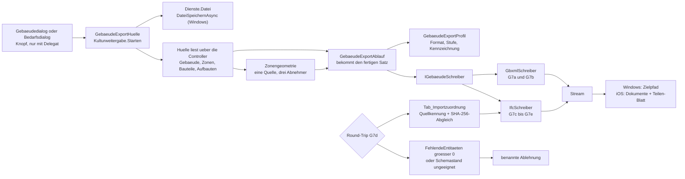

### 4.7 Hilfe, Wiki und Logbuch als Integrationspflicht

Sie stehen hier, weil sie **zur Stufe gehören und nicht zu ihrem Nachklang**: Der Eintrag im
Dialogkatalog des Assistenten ist ein **Wächter**, die Wiki-Seite eine **Abnahmebedingung** der
Stufe G2, und der Logbuch-Eintrag wird mit dem Auftrag entworfen und mit dem Upload veröffentlicht.
Die vier Stellen je Maske und die Wiki-Arbeit je Stufe stehen in 3.8; hier nur der Satz, der die
Reihenfolge festhält: **Der Eintrag im Dialogkatalog entsteht im selben Merge wie die Maske** — sonst
ist der Wächter rot und der Merge rot mit ihm.

---

## 5. Umsetzungsreihenfolge je Stufe

Was hier steht, sind **die Bausteine dieses Papiers je Stufe, die Vorbedingung und die Abnahme** —
keine Aufwandszahlen. Die stehen im Umsetzungskonzept Kap. 4, im Mehrzonenkonzept Kap. 9, im
Datenaustauschkonzept Kap. 10, im Kühlkonzept Kap. 11 und in der Anlagenkopplung Kap. 12; die
Stufe **GA** steht in keiner Summe (E26).

| Stufe | Was aus diesem Papier entsteht | Vorbedingung | Abnahme |
|---|---|---|---|
| **G0** | `Zonenmodell2K`, `Stundenrand`, `Stundenergebnis`, `ErsatzparameterRC.AusKlassenweg`, `Bauteilreduktion` als leerer Platz; die Vorrichtung für nicht ausgelieferte Prüfdaten samt `EPOS.Kern.Tests/GebaeudeModellNormfallTests` (1.8) | — | Kern-Filter grün; `GebaeudeModellNormfallTests` **lokal** im Band nach E10, in der CI schweigend; **Referenzlauf unberührt** (kein Aufrufer) |
| **GB** | Instanzzustand statt statischem Feld, Warnungen in der Ferienmaske, die 100er-Grenze (U9, E28), Einfrierregel **„gesäte Gebäudedaten"** | G0 | ein Referenzprojekt ändert sich (1008; 1039 blieb byte-gleich) — **eigener Einfrierschritt**; letzte reine Bestandsbasis (A15) |
| **Merge M2** | Umbenennung des Ostfensterfeldes, 15 Stellen | GB | **byte-gleich** gegen die GB-Basis; eigener Merge, weil jede Zeile in die solaren Gewinne mündet |
| **Merge M3** | `GebaeudeSchema` samt Sichtneubau, Namensleser, `DbWerte`, **Katalogkopie NULL-erhaltend über alle drei Schreibstellen** (W14), `SichtQuelleWache` | M2 | byte-gleich; die Probe **ist** der Sichtneubau; SQL-Dialekt-Prüfer grün |
| **M4** (vorweggenommen) | **umgesetzt als Schemaschritt 95** (Anwenderentscheid 19.09.2026): Klimaspalten in `SchemaKatalog.Schritt95_Klimaspalten`, Leseweg der PVGIS- und der TRY-Antwort; keine `Windgeschwindigkeit` ([Klimadatenquellen](Konzept_Klimadatenquellen_TMY_TRY_EPOS-Plan.md)) | — (lief vor GB) | erbracht: byte-gleich; Importprobe liefert dieselben Strahlungsreihen |
| **G1 + G2** | **Erster Schritt: der Altweg wandert Zeichen für Zeichen nach `Altweg/`** (`TagesbilanzWaermebedarf`), die Fassade `SimulationWaermebedarf` und der Vorbereitungsschritt `GebaeudeVorbereitung` entstehen, dazu `Modultrennungswache` (E20). **Danach erst** die Anbindung: `GebaeudeKlimaweg` (liest die Klimaspalten aus Schritt 95; Einfrierregel **„gesäte Klimareihen"**), `GebaeudeModellEingang` samt `Bauen`, `GebaeudeModellErgebnis`, `Gebaeudepruefung`; **die eine Weiche am Eingang**; der vierte Parameter der Auskunft; **ein Schreibweg im Editor** (A4), Reiter 3 in VDI-6007-Struktur, Platzhalter am Zahlenfeld (A5), Schalter „Rechenweg" samt eingeklapptem Abschnitt „Tagesbilanz (Bestandsweg)", Skalierungsdialog auf die Nutzfläche (E19); **Hüllenumzug nach `EPOS.UI.Daten`** samt `Gebaeudewege` (A10); Bedarfsdialog mit Vergleich, zweitem Bild, drei Spitzenkennzahlen und dem Ausweis „Tagesbilanz (Bestandsweg)"; Kennzahlen und Gruppe `GR_GEBAEUDE`; drei bedingte Reihen im Export; Glossarabschnitt, beide `.resx`, Dialogkatalog-Einträge; Wiki-Seite und Logbuch-Entwurf | M3 (M4 liegt mit Schritt 95 bereit) | **die Verschiebung des Altwegs byte-gleich gegen die GB-Basis, vor der Anbindung**; danach ändern **alle dreizehn Projekte sich — Basis vollständig neu**; dazu der Rückweg-Test auf der Arbeitskopie; `ChartProben` grün; Sichtabnahme Windows; **Versionsnummer beim Anwender erfragt** |
| **KU0** | **Papiere, nichts bauen:** die Fortschreibung dieses Papiers auf E12, E15 und E21 (1.2, 1.3, 3.5, 4.1, 4.3); führend ist das [Kühlkonzept](Konzept_Kuehlung_Gebaeudesimulation_EPOS-Plan.md) Kap. 11 | — | Papiere widerspruchsfrei, `DokumentationLinkWacheTests` grün |
| **KU1** (mit G1 + G2) | **Fassade `SimulationKaeltebedarf`** nach dem Muster der Wärmefassade, Kanal `KUEHLUNG` samt den zwei Kanallisten `KANAELE_WAERME`/`KANAELE_KAELTE`, `Kaeltebedarf_Max` und Kältedauerlinie, die vier Kältekennzahlen (4.3), der Abschnitt „Kältebedarf" im Bedarfsdialog mit denselben Bausteinen wie der Abschnitt „Wärmebedarf"; benannter Hinweis bei einem Altweg-Gebäude (E21) | G1 + G2 (nur das Stundenmodell liefert Kühllast) | Projekte **ohne** Kühlung byte-gleich, `Waermelast_Max` unverändert; Kanalsummenprobe; Wächter „Kühlkanal nie negativ"; `ChartProben` grün |
| **G3** | `Bauteilreduktion` gefüllt, `ErsatzparameterRC.AusBauteilweg`; `BaustoffSchema`, `BauteilaufbauSchema`, `ZonenSchema.Anweisungen` (Schritte S-A bis S-C — **`Tab_Zone` entsteht hier**, und S-C legt die Zonenspalten aus KU-S1 bzw. AK-S1 mit an, sofern diese Stufen stehen, 2.4); `BaustoffCtrl`, `BauteilaufbauCtrl`, Modelle; `BaustoffKatalogDialog`, `BauteilaufbauDialog` mit Schichtenraster; **zwei Menüzeilen gemeinsam**; der Knopf „Gebäude als eine Zone übernehmen" (W1); **`BauteilDialog` und der Zonenreiter in der Grundform** — ohne sie wäre der Bauteilweg dieser Stufe nur über Import oder Testdaten zu füllen (3.2); Registerpflege S-D; **Katalogseite auf `Katalogliste`** samt `Proben/Rasterprobe` (Befund U L4) | G1 + G2 | Reduktion trifft die Vergleichswerte; Bauteilweg gleich Klassenweg im Grenzfall; Referenzlauf **byte-gleich** (kein Leser); Auslieferungsvorlage grün (Katalog nicht leer). **Stand 25.09.2026: abgeschlossen** — Schritte 132–134 mit allen acht Tabellen (W1), Spalte `Hersteller` und Herstellersaat (E39), `GebaeudeZonenCtrl` samt Zonenleser des Laufs schon hier; die zwei Menüzeilen unter Administration › Gebäude (3.1); der Editor in der Betriebsart Projekt über „Hülle und Zonen…" mit `ZonenDialog`, `BauteilDialog` und der Übernahme nach E40 (3.2); Normnachweis 12 von 12 Testbeispielen relativ ≤ 10⁻³, Normfälle damit 11 von 12 im Band, Grenzfälle erfüllt, Referenzlauf 13/13 unverändert; mit der Welle K die Katalogseite auf `Katalogliste` (Regel 5 in 3.2, Rasterprobe GD1–GD3) |
| **G4a** (IFC-Import) | `IGebaeudeLeser`, `IfcLeser` samt Abbildern und Profil; `GebaeudeImportAblauf`, `-Profil`, `-Satz`, `GebaeudeZuordnungsModell`; `GebaeudeImportDialog` + Hülle; `ImportzuordnungSchema` (Schritt S-F), `GebaeudeImportCtrl`, Kaskadenrettung (W15); **Lizenzhinweisseite** (U10); iOS-Dateifilter | G1 + G2 (G3 für Schichten); G4c vorher (D1, E27) | Importprobe bestanden; **Referenzlauf unverändert**; Windows-Sichtabnahme; iOS-Lauf **nur nach Rückfrage**. **Stand 25.09.2026:** gebaut und im Gebäudedialog angebunden, S-F schon mit G4c als Schritt 138, eine Kaskadenrettung entfällt (2.7); selbst erzeugte Proben bestanden, Referenzlauf 13/13 byte-gleich; offen die Windows-Sichtabnahme, der eine iOS-Lauf nach Rückfrage (E38) und der Schemaschritt `Baujahr` (in Arbeit) |
| **G4b** | Bauteilebene des IFC-Imports | G3, G4a | nach G4a im Feld |
| **G4c** (gbXML-Import) | `GbxmlLeser`, `GbxmlAbbild`, `GbxmlImportProfil`; zweites Profil am selben Dialog; Zonenregel für den Einzonenfall | G1 + G2 (A7/ADR-004 angenommen, E16); G3 für Schichten | Importprobe bestanden; Referenzlauf unverändert. **G4c kommt vor G4a** (D1, mit E27 entschieden); **D16 ist mit E27 bejaht** — die Zonenregeln des gbXML-Imports kommen damit mit G6c. **Stand 25.09.2026:** gebaut und im Gebäudedialog angebunden (dazu `GbxmlEinheiten`; das Profil folgt der Dateiendung), samt `ImportzuordnungSchema` als Schritt 138 und `GebaeudeImportCtrl`; Proben bestanden, Referenzlauf 13/13 byte-gleich; offen die Windows-Sichtabnahme |
| **G5** (Geometrieableitung) | nichts aus diesem Papier | G4 | **unabhängiger Zweig** — G6 braucht ihn nicht; nur bei Bedarf aus der Praxis |
| **G6a** | `GebaeudeZonenCtrl`, Modelle, Kopierwege, Registerpflege, Bericht-Zonentabelle — Controller, Modelle, Registerpflege und die Kopierwege einer Zone sind mit G3 gebaut; G6a behält, was mehrere Zonen verlangen, und die Bericht-Zonentabelle | G3 | Migrationstests grün; Referenzlauf byte-gleich |
| **G6b** | `ZonenSchema.AnweisungenKopplung` (Schritt **S-G**: `Tab_Zonenluftstrom`, `ID_Nachbarzone` — **hier**, nicht in G6a: W1 und die Bilder in 2.1 führen ihn mit G6b); `Zonenkopplung`, `ZonenEingang`, `ZonenErgebnis`; `ZonenDialog` um Mehrzonenfelder und Luftaustausch erweitert; `Gebaeudepruefung` auf Zonenebene samt Trennflächenwächter | G6a (A8/ADR-005 angenommen, E17) | Migrationstests grün; die Probe „eine Zone bitgleich zum Stand nach G3" ist **Gate**; Vergleichsrechnung gegen den einfacheren Kopplungsweg; Laufzeit an einem echten Mehrzonengebäude **gemessen** |
| **G6c** | Zonenimport (IFC und, nach D16 mit E27, gbXML): Zuordnung Zone ↔ Quellentität, Hierarchie im Zuordnungsdialog; **`Zonengeometrie` samt `Zonenumriss`** und die **Grundrissansicht** `GebaeudeAnsicht` im Zuordnungsschritt (E11, 3.4) | G4, G6b | Importproben; **Determinismusprobe der Geometrie** (gleiche Eingabe, gleiche Polygone, 1.7); bunit-Fall der Ansicht samt Pflichttext „schematisch"; iOS-Lauf nach Rückfrage |
| **G6d** | Zonendaten in der Testdatenbank, Einfrierregel **„gesäte Zonendaten"** | G6c | grüner Kern-Lauf, neue Basis begründet |
| **G7** | `IGebaeudeSchreiber`, `GebaeudeExportAblauf`, `-Profil`, `IfcSchreiber`, `GbxmlSchreiber`; `GebaeudeExportDialog` + `GebaeudeExportHuelle` als **sechste** neue Maske samt ihren vier Pflegestellen; Einstieg, Kennzeichnung, Round-Trip-Sperre (4.6); **mit G7b die Körperansicht** (`three.js` lokal, `GebaeudeAnsicht`), die dasselbe `Zonengeometrie`-Modell liest wie der Export | **G6** (der Export bildet dessen Datenmodell ab), G4a für Paket und Lizenzseite; **`three.js` auf der Lizenzhinweisseite** und die iOS-Messung (3.7) | je Teilstufe eigene Proben; der Körper zeigt, was die Datei schreibt — Sichtprüfung gegen `PolyLoop` und `IfcExtrudedAreaSolid`; **die Rückgabe angereicherter fremder Dateien ist zulässig** — mit Kennung in der Datei und Beipackzettel (D11, mit E27 entschieden) |
| **KU2** | **Deckung der Kälteseite**: `DeckungKanalKaelte` neben `DeckungKanal`, Kältesenke und Kälteziel, reversible Wärmepumpe über die vorhandene Kühlkennlinie, Kältestrom als eigene Verbrauchsposition, Kanalzeile und Kältebild im Bericht — **jeweils nach dem Muster der Wärmeseite** (E21) | KU1 | **Kälteprobe je Stunde** (Muster `Energieprobe`): kein Wärmeerzeuger schreibt in `Deckung_Kuehlung`; Selbsttest: Kanallisten vollständig und disjunkt; Strombilanz schließt |
| **KU3** | **Kältemaschine als eigener Erzeugertyp** samt Umfeld, Kühlung je Zone im Mehrzonenfall, Export der Kältegrößen — dieselben Klassenmuster wie beim jeweiligen Gegenstück der Wärmeseite (E21) | KU2, G6 für die Zonenseite | Rechenproben je Erzeuger; Rundlaufprobe des Exports; Referenzlauf: Projekte ohne Kühlung unverändert |
| **AK0** | **Papiere, nichts bauen:** die Bausteine der Anlagenkopplung in diesem Papier (1.2, 1.3, 1.5, 1.7, 2.8) auf E22; führend ist die [Anlagenkopplung](Konzept_Anlagenkopplung_Gebaeudesimulation_EPOS-Plan.md) Kap. 12 | — | Papiere widerspruchsfrei, `DokumentationLinkWacheTests` grün |
| **AK1** | **Heizkreis als Randbedingung:** `Waermeuebergabe` in `Gebaeude/`; `Stundenrand` um `VorlaufC`, `UebergabeKennwerte`, `ReglerbandK` und `Stundenergebnis` um `VorlaufC`, `RuecklaufC`, `Begrenzungsgrund` erweitert (1.3); Schemaschritte `AK-S1` und `AK-S3` (Wärmeteil) mit Sichtneubau und NULL-erhaltender Katalogkopie (2.4, 2.5); ein Gebäude auf dem Altweg geht als **feste Last** ein — ein Altweg-Sonderfall, der in die Löschliste der Stufe GA gehört | G1 + G2 (Wärmeseite); die Kälteseite setzt KU1 und KU2 voraus (Anlagenkopplung 12.3) | eigener Einfrierschritt (2.8): Projekte mit `Anlagenkopplung = AUS` byte-gleich, das gekoppelte Projekt mit neuer Basis; die Grenzfallproben der Anlagenkopplung 11.1; `ChartProben` grün |
| **AK2** | **Erzeugerfahrplan als Verfügbarkeit:** `Anlagenfahrplan` samt Naht `Anlagenverfuegbarkeit` neben den Fassaden, außerhalb beider Module (1.3, 1.5); Schemaschritt `AK-S2` und der Komfortteil von `AK-S3`; der Zweipass der Verteilung auf mehrere Gebäude; die Wache prüft, dass der Fahrplan keinen der beiden Ordner nennt (1.7) | AK1 abgenommen und eine Feldphase (Anlagenkopplung B-A6) | eigener Einfrierschritt (2.8); die AK2-Proben der Anlagenkopplung 11.1; Restbedarf und Komfortstunden stehen im Bericht nebeneinander |
| **AK3** | **Der geschlossene Kreis:** Iterationsrahmen nach dem Muster von ADR-005 (feste Reihenfolge, Abbruchmaße, Höchstzahl, benannter Fehler), Umkehr der Laufordnung in `SimulationWaermebedarf`/`SimulationControl` | AK2 abgenommen und eine Feldphase; ob überhaupt, wird dann entschieden (Anlagenkopplung H6) | eigener Einfrierschritt (2.8); „ein Erzeuger ohne Grenzen bitgleich zu AK1" als Gate; Laufzeit an einem Mehrzonengebäude gemessen |
| **GA — Altweg ablösen** (letzte Stufe, fällig nach Q24) | Modul `Altweg/`, Weiche, `IGebaeudeRechenweg`, `Modultrennungswache` (1.2, 1.3, 1.5, 1.7); Schalter „Rechenweg" und Abschnitt „Tagesbilanz (Bestandsweg)" (3.2); Vergleich alt/neu, Ausweis und Kältebedarf-0-Hinweis (3.5, 4.1); `DROP COLUMN` der nur vom Altweg gelesenen Spalten samt `Gebaeude_Modell` je Tabelle mit Sichtneubau, davor `Fensterflaeche_Ost`/`_West` einmalig aus `Fensterflaeche_Ost_West` füllen (2.2, 2.4); `Tab_DBTagV(-Daten)` samt Leser (2.9); der Prüfpunkt der Auslieferungsvorlage (2.7); der AK-Sonderfall „feste Last"; das Referenzprojekt des Altwegs auf VDI 6007 umstellen, den Rückweg-Test einstellen (4.4). Die vollständige **Löschliste** führt das Umsetzungskonzept Kap. 6 (Q25: vollständige Ablösung, E27) | Ablösekriterium **Q24**, mit E27 entschieden ([Konzept N1.32](Konzept_Gebaeudesimulation_VDI6007_EPOS-Plan.md)): GA wird beauftragbar und fällig, sobald alle vier Bedingungen erfüllt sind — alle Referenz- und Bestandsprojekte einmal auf VDI 6007 gerechnet und die Abweichung zum Altweg je Projekt erklärt; eine Feldphase von mindestens einer Heizperiode ohne offenen Fehler am VDI-Weg; KU1 und, falls beauftragt, AK1 abgenommen; die Ausbauprobe grün. Geprüft wird mit jeder Abnahme, der Stand steht in der Statusdatei | **Gate ist die Ausbauprobe** (1.7, 4.4): Ein Bau mit umbenanntem Ordner `Altweg/` übersetzt, nachdem die Weiche entfernt ist, und der Referenzlauf aller Projekte ohne Altweg-Gebäude bleibt byte-gleich; danach die **Basis neu eingefroren** (2.8). 5–8 PT, in keiner Summe |

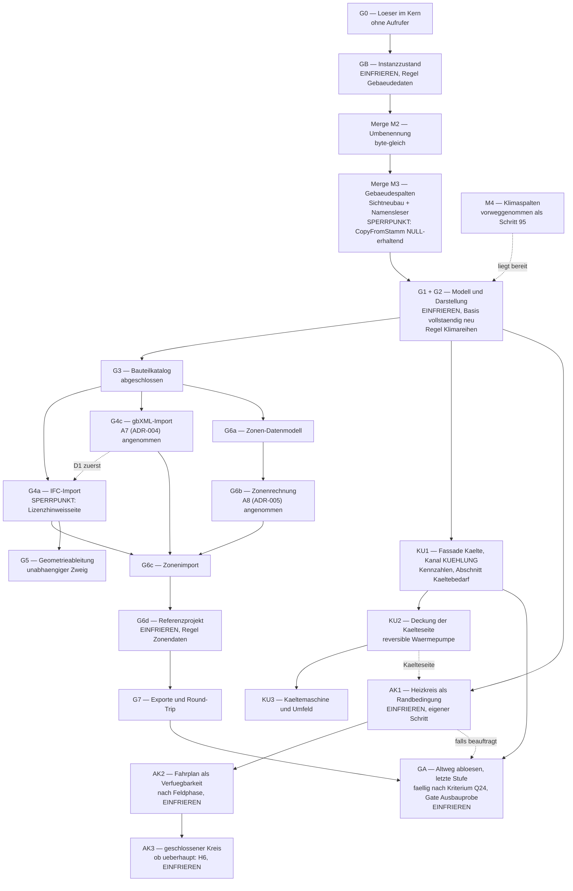

---

## 6. Offene Architekturentscheide

Neunzehn Fragen — **alle entschieden oder überholt**. Vier davon (**A4**, **A5**, **A9**, **A19**)
lagen unter einer Nummer des Umsetzungskonzepts beim Anwender und standen hier **nur als Sperrpunkt
dieses Papiers** — entschieden sind sie unter ihrer alten Nummer (U1, U3, U5, U2), damit nicht zwei
Register zwei Antworten bekommen. **A7** und **A8** sind durch E16 und E17 entschieden, **A16** durch
**E20** (es gibt keinen zweiten Verzweigungspunkt), **A19 (= U2)** ist durch **E20** überholt (kein
Feld wird mehr versteckt). **Alle übrigen — A1, A2, A3, A6, A10 bis A15, A17 und A18, dazu A4, A5
und A9 über U1, U3 und U5 — sind mit E27 (22.09.2026, [Konzept N1.32](Konzept_Gebaeudesimulation_VDI6007_EPOS-Plan.md)) nach Empfehlung
entschieden.** **A15** gilt damit in der Fassung des Systementwurfs 8.4 (F-Ü7): kein zweiter
Basisordner, **genau ein** Referenzprojekt mit `Gebaeude_Modell = TAGESBILANZ` in der jeweils
aktuellen Basis bis GA, die Arbeitskopie gegen die GB-Basis nur bis zum Merge G1 + G2, der
Rückweg-Test allein auf diesem Projekt — er endet mit GA (E26). Die Tabelle bleibt als Begründung
stehen: Die Spalte „Empfehlung" nennt, was entschieden ist, die Alternativen sind verworfen.

| Nr. | Sachverhalt | Empfehlung — Stand 22.09.2026 | Alternative (verworfen) | Ohne Entscheid wäre blockiert gewesen |
|---|---|---|---|---|
| **A1** | Bleibt die Kaskade der Gebäudekinder auf `Tab_Gebaeude`, obwohl der Gebäude-Schreibweg möglicherweise löscht und neu anlegt? Bei `Tab_Zonenluftstrom` greift die Falle **doppelt** (zwei Eltern) | **Mit E27 entschieden:** **Kaskade behalten**, den Schreibweg **vor G3 messen** und die Rettung dort einbauen, wo das Löschen steht (`GebaeudekinderSichern` in `WizardCtrl`); die Probe prüft beide Fälle. **Umgesetzt:** gemessen (Messung A1 der Sitzung G3) — kein gewöhnlicher Speicherweg löscht ein Gebäude und legt es neu an; die Rettung ist nicht gebaut (2.7, Protokoll G4 Abschnitt 4) | (b) ohne Kaskade, Waisen über ein Werkzeug entfernen — verlagert die Verantwortung in ein Werkzeug, das beim Anwender nie läuft. (c) Schreibweg auf „Ändern statt Löschen" umbauen — sauber, aber ein Eingriff in den Bestandsweg mitten in der Einfrierkette | G3 (Anlage von `Tab_Zone`) |
| **A2** | Bleibt das IFC-Paket am Kern, oder zieht der Leser in ein eigenes Projekt hinter `IGebaeudeLeser`? | **Mit E27 entschieden:** **Am Kern bleiben** (ADR-003), aber `IGebaeudeLeser` **von Anfang an** ziehen: Vermisst der iOS-Gerätebau Typen, kostet der Umzug eine Fabrikzeile statt eines Umbaus | (b) sofort eigenes Projekt — iOS verlöre den Import von vornherein. (c) ohne Naht binden — spart eine Schnittstelle, macht jeden Umzug zum Umbau | nichts; die Messung steht in G4 an |
| **A3** | **Name und Ordner** des Zuordnungsdialogs: `GebaeudeImportDialog` in `Dialoge/Import/` (dieses Papier) oder `IfcZuordnungDialog` in `Dialoge/Bedarf/` (Datenaustauschkonzept 2.4)? Dass es **einer** ist, ist dort entschieden | **Mit E27 entschieden:** **`GebaeudeImportDialog`** — ein Format im Namen einer Maske, die zwei Formate trägt, ist eine Unwahrheit; der Dialog erbt den Ablauf des Katalogimports | (b) den Namen aus 2.4 behalten und die Zweiformatigkeit nur im Profil führen | G4 |
| **A4** | Ein Schreibweg im Katalogeditor statt der heutigen vier Aus- und Schreibwege — **für den Anwender sichtbar** | **= U1, mit E27 entschieden: ja**, mit G1; „Speichern unter…" bleibt als nicht schließender Zweitknopf | siehe U1 | G1 (sonst hängen zehn Prüfregeln an drei Schreibstellen) |
| **A5** | Platzhalter am Zahlenfeld — ein Eingriff in einen Standardbaustein, den jeder Dialog benutzt | **= U3, mit E27 entschieden: ja**, rein additiv; zieht `StilblattTests` nach sich | siehe U3 | G1 (Reiter 3 bekommt rund zehn Vorgabefelder) |
| **A6** | Werden Zonen, Bauteile und Luftströme als **ein** Aggregat je Gebäude geschrieben oder je Zone einzeln — und schreibt das Aggregat durch **Löschen + Neuanlegen** oder durch **Abgleich über die Ids**? | **Mit E27 entschieden:** **Ein Aggregat** (`GebaeudeZonenCtrl`), und darin **Ändern statt Löschen**: Abgleich über die Ids des Arbeitsstands in der Reihenfolge Entfernen → Ändern → Anlegen, alles in **einer** Transaktion (1.4, 2.7). Nur so bleibt der eine Schreibweg über vier Überlagerungsebenen einer **und** bleiben die Ids stehen, an denen `Tab_Importzuordnung` (ohne Kaskade; umgesetzt mit Kaskade auf die Ziele, 2.7) und `Tab_Zonenluftstrom` (Kaskade an **beiden** Zonen, `CHECK ID_ZoneA < ID_ZoneB`) hängen | (b) Löschen + Neuanlegen je Gebäude — einfacher zu schreiben, zerstört aber bei **jedem** gewöhnlichen Speichern die Importherkunft und damit den Round-Trip. (c) je Zone schreiben — der Bauteildialog müsste selbst schreiben, und Abbrechen auf der Zonenebene ließe geschriebene Bauteile stehen | G6b |
| **A7** | Wird ADR-004 angenommen (gbXML über LINQ to XML mit handgeschriebenem Lesemodell)? | **entschieden 16.09.2026 (E16): angenommen** — das aus dem Schema erzeugte Modell ist unbrauchbar; G4c hat damit seinen Leseweg | (b) Serialisierer mit erzeugtem Modell — scheidet schon unter Windows aus und erzeugt Laufzeitcode, den iOS nicht trägt. (c) Fremdbibliothek — es gibt für .NET keine | — (entschieden) |
| **A8** | Wird ADR-005 angenommen (Zonenkopplung über die Nachbarraum-Randbedingung, Durchlauf je Stunde)? | **entschieden 16.09.2026 (E17): angenommen, M1 und M4 damit festgelegt — mit Messpflicht:** der einfachere Weg als Vergleichsrechnung, das Gesamtsystem für zwei Zonen als Prüforakel, die Probe „eine Zone bitgleich" als Gate | (b) Vorstundenkopplung — einfacher und schneller, trägt aber den Zonen-Luftaustausch nicht. (c) Gesamtsystem — exakt, aber teuer genau dort, wo das Regelungsmuster je Stunde festgehalten wird | — (entschieden) |
| **A9** | Die **zwei Gebäudespalten-Schritte** des Konzepts zu **einem** verschmelzen (Papiername **M3**)? Die Zahlen, die das Konzept dafür nennt, sind anderweitig vergeben (2.4) | **= U5, mit E27 entschieden: ja** — ein Schritt, 15 Spalten je Tabelle, ein Sichtneubau; der Klimaschritt ist getrennt und als Schemaschritt 95 umgesetzt | siehe U5 | M3 |
| **A10** | Zieht der Gebäudedialog schon mit G1 nach `EPOS.UI.Daten` oder erst mit G6? | **Mit E27 entschieden:** **Mit G1** — die Hülle wird ohnehin neu geschnitten, und der Importweg setzt einen plattformfreien Schreibweg voraus | (b) erst mit G6 — spart im ersten Schritt Arbeit, verdoppelt sie aber, und der Import bleibt auf iOS bis dahin benannt abgelehnt | G4 (plattformfreie Importhülle) |
| **A11** | Werden die Schrittnummern jetzt verbindlich vergeben oder erst bei Beauftragung? | **Mit E27 entschieden:** **Erst bei Beauftragung**; verbindlich sind jetzt **Reihenfolge und Inhalt**. Jede vergebene Nummer entwertet ältere Projektpakete, weil der Schemastand im Transportmanifest steht | (b) jetzt fest vergeben — gibt allen Papieren feste Zahlen, erzwingt aber genau diese Auslieferungsreihenfolge | nichts; die Papiere führen bis dahin GB, M2–M4, S-A bis S-G, KU-S1 bis KU-S4 (Kühlkonzept Kap. 7) und AK-S1 bis AK-S3 (Anlagenkopplung Kap. 8); mehrere davon legen Spalten an `Tab_Gebaeude(_STAMM)` und kosten je einen Sichtneubau (2.4, 2.5) |
| **A12** | Wo erscheint der Produktausweis nach E10 — **Wiki-Seite und Berichtskopf**? (In den Exportdateien ist er mit Datenaustauschkonzept 6.5 entschieden, je Zone im Mehrzonenfall) | **Mit E27 entschieden:** **Beides**, im Wortlaut von E10, unverändert und ohne Umschreibung; er wechselt, sobald G0 den offenen Testfall löst | (b) nur im Wiki — der Leser eines Berichts erführe nicht, mit welchem Rechenkern die Zahlen entstanden sind | G2 (Wiki-Seite), G1 (Berichtskopf) |
| **A13** | Bekommt `Tab_Gebaeude` die Spalten `Herkunft` und `Quellkennung`, wie Zone, Bauteil, Aufbau und Baustoff sie tragen? | **Mit E27 entschieden:** **Nein — Regel „Gebäudeherkunft nur in `Tab_Importzuordnung`"** (2.7). `Tab_Gebaeude` hat einen Katalogzwilling, an dem eine Importherkunft nichts bedeutet, und die Spaltengleichheit (R9) zwänge sie dorthin; jede weitere Gebäudespalte ist außerdem ein weiterer Sichtneubau | (b) beide Spalten mit Schritt S-F an beide Tabellen — dann 17 statt 15 neue Spalten und ein **zweiter** Sichtneubau | G4 (Schritt S-F) |
| **A14** | Was trägt den Umschalter **Klassenweg → Bauteilweg**? Heute die Datenlage: `Tab_Zone` leer heißt Klassenweg (Mehrzonenkonzept 4.3). Damit ändert das Anlegen der **ersten** Zone die Zahlen eines Projekts ohne Schalter | **Mit E27 entschieden:** **Datenlage behalten, aber den Übergang benennen**: Rückfrage vor der ersten Zone, `Herleitungszeile` am Schalter „Rechenweg" in **beiden** Stellungen, und der Übergang ist ein Einfrieranlass nur dort, wo ein Referenzprojekt Zonen bekommt (G6d) | (b) dritter Persistenzwert an `Gebaeude_Modell` — der Weg steht dann ausdrücklich in der Datenbank, kostet aber einen Wert, der beim Löschen der letzten Zone wieder falsch wäre; er hinge zudem an `Gebaeude_Modell`, einer Spalte, die mit der Stufe GA fällt (E26) | G3 (der Übernahmeknopf entsteht dort) |
| **A15** | Was geschieht mit der letzten reinen Bestandsbasis (GB), gegen die der Rückweg-Nachweis läuft? Befund V 5.2 will sie aufheben; die Hausregel sagt „frühere Basen liegen nicht mehr im Repositorium, gerechnet wird ausschließlich gegen die aktuelle Basis" | **Mit E27 entschieden:** **Keine zweite Basis im Repositorium, sondern ein Referenzprojekt mit `Gebaeude_Modell = TAGESBILANZ`, das in der jeweils aktuellen Basis mit eingefroren wird** (Fassung des Systementwurfs 8.4, F-Ü7); **der Rückweg-Test misst allein dieses Projekt und läuft bis zur Stufe GA** (E26), die es auf VDI 6007 umstellt und die Basis neu einfriert. So prüft jeder Lauf **beide** Wege gegen dieselbe, aktuelle Basis, und die drei neuen Reihen entstehen für dieses Projekt gar nicht erst — genau die Bedingung, die der Vergleich ohnehin stellt. Die GB-Basis bleibt nur bis zum Merge G1 + G2 und wandert dann mit ihrem Protokoll nach `Dokumentation/ueberholt/Referenzbasen/`; **mit E27 (22.09.2026) so entschieden** | (b) zwei Basen nebeneinander — gegen die Hausregel, und jeder Lauf müsste sagen, gegen welche er misst. (c) ein Dateiausschluss im Vergleich — löste es technisch, kostet aber einen neuen Schalter an einem Werkzeug, an dem die ganze Nachweiskette hängt | G1 + G2 |
| **A16** | **Welchen Zuschnitt bekommt der Verzweigungspunkt in `Bewohner_und_Flaeche_berechnen`?** Die Frage setzte **zwei** Verzweigungspunkte im Rumpf voraus (`:581` und `:647`) | **Entschieden durch E20 (16.09.2026): kein zweiter Verzweigungspunkt.** Es gibt **eine Weiche am Eingang** (Fassade `SimulationWaermebedarf`), davor einen modellfreien Vorbereitungsschritt, der Klimakalender, bisherigen Verbrauch, Flächen, Einheit und Jahresnutzungsgrad für **beide** Wege bereitstellt (1.3); Bewohnerzahl und Skalierungsfaktor nach E8 entstehen je Modul aus dessen erstem Lauf, und die Fassade führt die Schleife. Der Tagesbilanz-Weg wird dabei **Zeichen für Zeichen nach `Altweg/` verschoben** (4.1, ADR-006) | entfallen — die Alternativen (b) und (c) setzten den zweiten Punkt voraus | — (entschieden) |
| **A17** | Bekommen Gebäudeimport und ‑export einen **Maskenschlüssel und eine Menüzeile**? Zwei geltende Papiere widersprechen sich: Datenaustauschkonzept 11.2 (D14) sagt nein, Befund U 1.3 sagt ja | **Mit E27 entschieden:** **Nein** (D14): Überlagerung im Gebäudedialog, aufgemacht über Knöpfe in der Katalogleiste, je Format ein Profil — das spart vier Pflegestellen je Schlüssel und macht die Regel „kein Untermenü mit nur einem Punkt" gegenstandslos | (b) zwei flache Menüzeilen auf **einen** Schlüssel mit Argument (Muster PV-Import) — sichtbarer Einstieg auch ohne geöffnetes Gebäude | G4 (3.1) |
| **A18** | Bleibt `GebaeudeKlimaweg` eine **eigene Klasse**, oder fällt sie in `GebaeudeModellEingang.Bauen` zurück? Das Umsetzungskonzept 1.4 sagt „hier — und nur hier — fällt die Entscheidung über den Zeitbezug, die Azimutzuordnung und die Erdreichtemperatur", und U6 sagt „an der einen Stelle im Eingangsbauer" | **Mit E27 entschieden:** **Eigene Klasse behalten** — aber **ausschließlich** von `GebaeudeModellEingang.Bauen` gerufen, sodass „an einer Stelle" als Aufrufstelle gilt. Grund: Genau diese vier Entscheidungen muss der Prüfmodus umschalten, und sie ohne den ganzen Eingangsbauer prüfen zu können, spart in G1 die Messung, die U6 verlangt | (b) in `Bauen` zurückfalten — hält den Wortlaut von 1.4 buchstäblich, macht die Messung zu U6 aber teurer, weil jeder Probefall den vollen Eingang bauen muss | G1 (die Klassenliste in 1.3) |
| **A19** | Werden die sieben Modellparameterfelder des Reiters 3 im Tagesbilanz-Weg **versteckt** oder **gesperrt gezeigt**? Das ist ein Zustand der Maske (3.2) und für den Anwender sichtbar | **Durch E20 überholt (16.09.2026):** Der Dialog steht in VDI-6007-Struktur, die Modellparameter sind **immer sichtbar und bearbeitbar** — auch bei einem Gebäude auf dem Altweg, denn sie gelten dort nach der Umstellung. Versteckt wird nichts; was **nur** der Altweg liest, steht im eingeklappten Abschnitt „Tagesbilanz (Bestandsweg)" und bleibt mit ihm (3.2). **U2 ist damit gegenstandslos** | entfallen | — (überholt) |

**Zwei Fragen, die dieses Papier ausdrücklich nicht neu stellt:** Die Reihenfolge von gbXML- und
IFC-Import (D1) und ob der gbXML-Export ohne synthetische Geometrie lohnt (D2) sind
Anwenderentscheide des Datenaustauschkonzepts; beide sind mit **E27** entschieden (gbXML-Import vor
IFC-Import; gbXML-Export erst mit der zweiten Stufe). Den Stand der **U-**, **M-** und **D-Fragen**
führen die Konzeptpapiere, die sie stellen, und das
[Register](Offene_Entscheide_Gebaeudesimulation_EPOS-Plan.md).

---

## 7. Abgrenzung

**Was dieses Papier nicht enthält — und wo es steht:**

- **Die Physik.** Knotenbilanzen, Gleichungen, Diskretisierung, Randbedingungen, Bauteilreduktion,
  Zonenkopplungsformeln und alle Vergleichszahlen stehen im
  [Konzept](Konzept_Gebaeudesimulation_VDI6007_EPOS-Plan.md), in den
  [Rechenschritten](Rechenschritte_Gebaeudesimulation_VDI6007_EPOS-Plan.md) und in den Befunden A,
  B, E, F, I, J, K, O. Hier steht nur, **in welchen Klassen** sie liegt und **welchen Vertrag** diese
  Klassen erfüllen.
- **Aufwände und Stufeninhalte.** Personentage, Reihenfolge innerhalb einer Stufe und der Umfang je
  Merge stehen im [Umsetzungskonzept](Umsetzungskonzept_Gebaeudesimulation_VDI6007_EPOS-Plan.md)
  Kap. 4, im [Mehrzonenkonzept](Konzept_Mehrzonenmodell_IFC_EPOS-Plan.md) Kap. 9, im
  [Datenaustauschkonzept](Konzept_Datenaustausch_gbXML_IFC_EPOS-Plan.md) Kap. 10, im
  [Kühlkonzept](Konzept_Kuehlung_Gebaeudesimulation_EPOS-Plan.md) Kap. 11 und in der
  [Anlagenkopplung](Konzept_Anlagenkopplung_Gebaeudesimulation_EPOS-Plan.md) Kap. 12; die
  **Löschliste der Stufe GA** führt das Umsetzungskonzept Kap. 6 (Q25). Kapitel 5 nennt
  **Reihenfolge und Abnahmebedingung**, sonst nichts.
- **Die Feldlisten und der Wortlaut der Masken.** Welche Felder Reiter 3 trägt, wie die U·A-Tabelle
  aussieht und wie die neuen Texte lauten, steht in
  [Befund M](Gebaeudesimulation/2026-09-15_Befund_M_Gebaeudedialog.md) 5.2 bis 5.11. Hier stehen
  Zustände, Übergänge, Schreibwege, Präfixe und Tests.
- **Die Abbildungsregeln je Format.** Welche IFC-Entität und welches gbXML-Element auf welches
  EPOS-Feld führt, mit welchen Rückfällen und Sonderfällen, steht im Umsetzungskonzept 3.4, im
  Mehrzonenkonzept Kap. 6 und im Datenaustauschkonzept Kap. 3, 5 und 6. Hier steht das **gemeinsame
  Gerüst**.
- **Verbindliche Schemaschrittnummern.** Festgelegt sind Inhalt, Reihenfolge, Ergebnisneutralität
  und Nachweis je Schritt; die Nummer vergibt der Schritt bei seiner Beauftragung (A11).
- **Wiki- und Berichtstexte im Wortlaut, Logbuch-Einträge und Versionsnummern.** Sie entstehen mit
  dem jeweiligen Auftrag; die Versionsnummer erfragt der Auftrag beim Anwender.
- **Normzahlen und ihre Ablage.** Die Testbeispiele werden **nicht** ausgeliefert; der Nachweis ist
  lokal, die Lücke im Gate gehört ins Protokoll (1.8). Dieses Papier führt keine Normwerte, und aus
  VDI 6020:2022 geht nach **E6** nichts in Code, Tests, Testdaten, Wiki, Bericht oder Auslieferung.
- **Anforderungen, Datenfluss, Fehlerklassen, Leistungsbudget, Abwägungen.** Sie stehen im
  [Systementwurf](Systementwurf_Gebaeudesimulation_EPOS-Plan.md), Kap. 1 bis 12 — dieses Papier
  nennt Struktur und Namen, jenes Anlass und Begründung.
- **Die Auslegungsheizlast im Stundenmodell.** Die Höchstlast des Projekts bleibt das Maximum des
  Kanalsummenvektors; die drei Spitzenkennzahlen stehen **zusätzlich** je Gebäude. Das Thema ist
  Gegenstand eines späteren Papiers.
- **Alles, was das Konzept in Kapitel 15 ausschließt:** Feuchtebilanz, Kühlung als vierter Kanal
  (**E12 vom 16.09.2026 nimmt ihn auf, E21 baut die Kälteseite symmetrisch zur Wärmeseite aus** —
  die Folgen regelt das [Kühlkonzept](Konzept_Kuehlung_Gebaeudesimulation_EPOS-Plan.md),
  Konzept N1.18; dessen Frage **K1 ist mit E21 entschieden**: vierter Kanal im vorhandenen
  Kanalfeld, getrennte Deckungsseite),
  Bauteilaktivierung, die Kopplung von Vorlauftemperatur und Wärmepumpen-Fahrplan an die
  Raumtemperatur (**E22 nimmt sie als Anlagenkopplung auf**, Stufen AK1–AK3 nach der
  [Anlagenkopplung](Konzept_Anlagenkopplung_Gebaeudesimulation_EPOS-Plan.md); ihre Bausteine
  stehen in 1.2, 1.3 und 1.5),
  sommerlicher Wärmeschutz nach DIN 4108-2, Nachweise nach GEG oder DIN V 18599, Verschattung durch
  Nachbarbebauung, Wärmerückgewinnung, Nutzungsprofile für Nichtwohngebäude, Scan-to-BIM,
  Validierung an gemessenen Verbräuchen.
- **Entscheide.** Dieses Papier entscheidet nichts, was dem Anwender zusteht: **A1 bis A19** waren
  Fragen mit Empfehlung und sind **alle entschieden oder überholt**: ADR-004 und ADR-005 sind
  angenommen (E16, E17), **A7** und **A8** damit entschieden; **A16 ist durch E20 entschieden** (eine
  Weiche am Eingang, kein zweiter Verzweigungspunkt), **A19 (= U2) durch E20 überholt**, alle
  übrigen hat **E27** (22.09.2026) nach Empfehlung entschieden, **A15** in der Fassung des
  Systementwurfs 8.4. **ADR-006 ist angenommen**
  (E20, 16.09.2026), **ADR-002 trägt seinen Ergänzungsvermerk**, und beide tragen den Nachtrag aus
  **E23**, den **E26** klarstellt: Der Altweg bleibt für die Dauer des Übergangs, die Stufe **GA —
  Altweg ablösen** ist die letzte Stufe des Plans; nach **E27** wird sie fällig, sobald das
  Ablösekriterium **Q24** erfüllt ist, und ist die vollständige Ablösung nach der Löschliste
  (**Q25**). **E21** legt die
  Kälteseite symmetrisch zur Wärmeseite an und entscheidet damit **K1** des Kühlkonzepts.

**Was nach der Abnahme mit den Befunden geschieht.** Die Befunde unter
[`Dokumentation/aktuell/Gebaeudesimulation/`](Gebaeudesimulation/2026-09-15_Befund_T_Softwarearchitektur_Bestand.md)
sind **Belegquelle**, nicht Konzept: Sie bleiben in `aktuell/`, solange die Stufen laufen, die auf
ihnen stehen — dieses Papier und der Systementwurf verweisen an rund vierzig Stellen auf sie, und die
Wache über die Papiere prüft **jeden** dieser Verweise. Sie wandern erst dann per `git mv` nach
`ueberholt/`, wenn ihr Gegenstand umgesetzt ist — **und im selben Schritt werden die Verweise
umgebaut**, hier wie im Systementwurf, wie in den drei Konzeptpapieren. Ein Befund, der nach
`ueberholt/` verschoben wird, ohne dass die Verweise mitwandern, macht die Wache rot.
