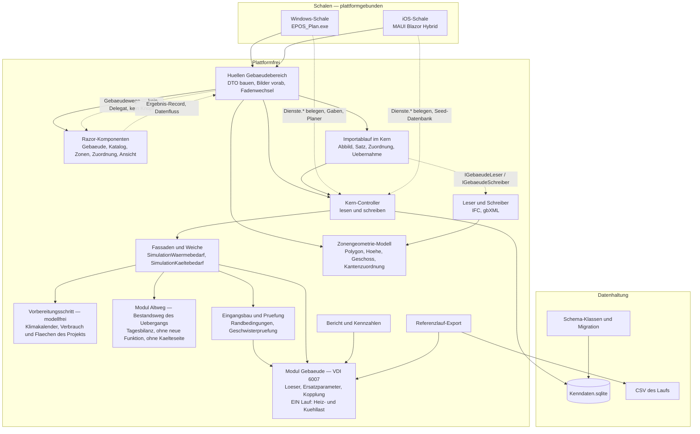
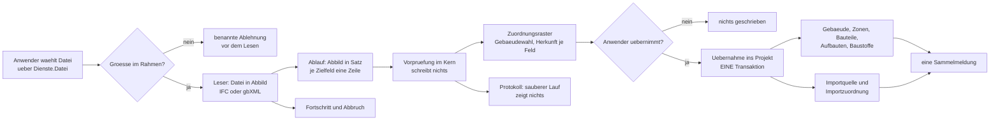
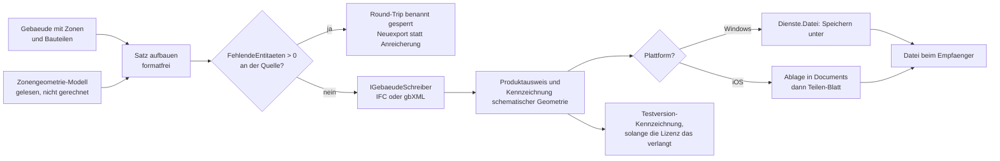
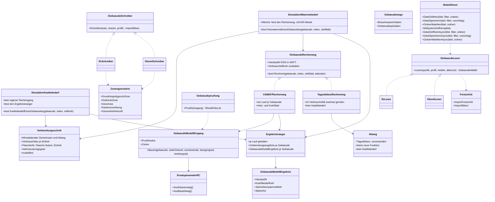
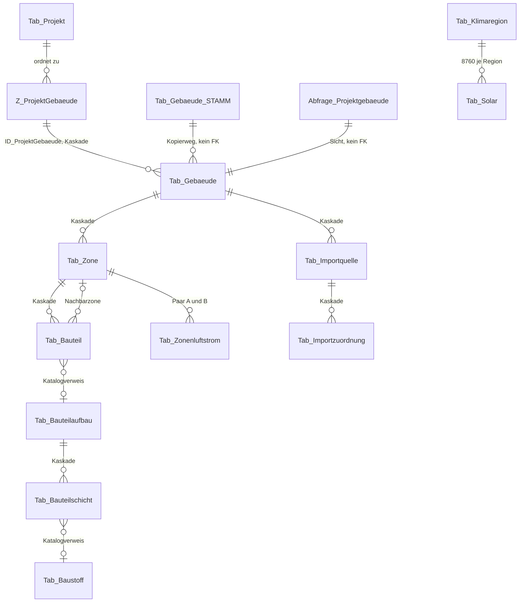
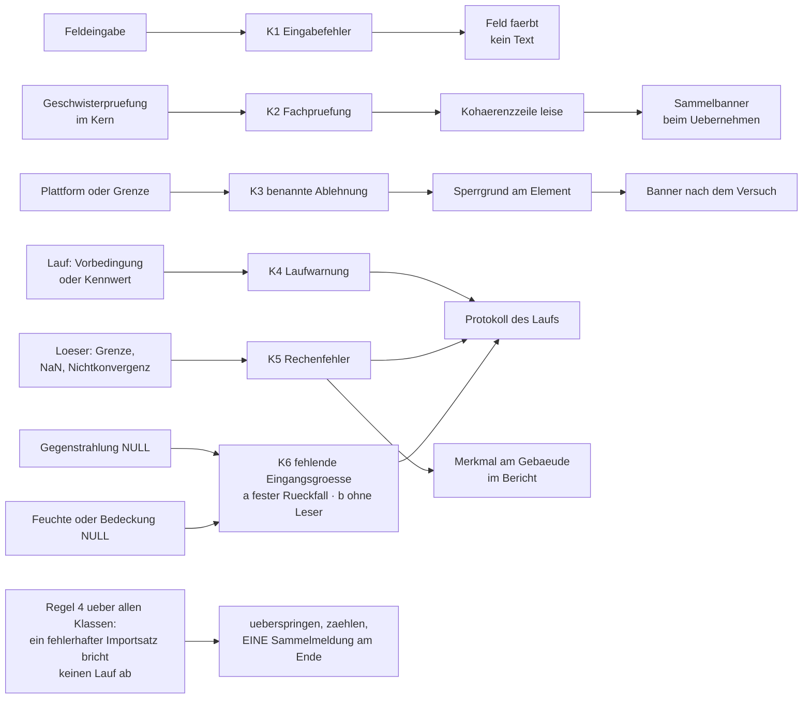
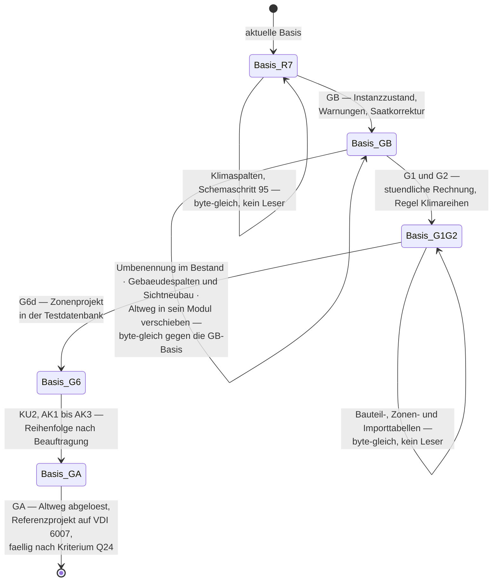

# Systementwurf Gebäudesimulation und ihre Einbindung in EPOS-Plan

**Stand:** 22.09.2026
**Zweck:** Der Systementwurf der Gebäudesimulation nach VDI 6007 Blatt 1 und ihrer Einbindung in
EPOS-Plan: Anforderungen, Bausteine und ihre Verantwortlichkeiten, Datenflüsse, Verträge,
Speicherung, Fehlerbehandlung, Leistung, Nachweis, Abwägungen und Grenzen. Er sagt, **in welchem
Gerüst** gerechnet, gespeichert, gemeldet und nachgewiesen wird — nicht, **wie** gerechnet wird.
**Leserkreis:** Projektverantwortung, Entwickler, Agenten.

> **Nachgezogen 22.09.2026 — Entscheid E27** ([Konzept N1.32](Konzept_Gebaeudesimulation_VDI6007_EPOS-Plan.md)): Q24 (GA fällig, sobald die vier
> Bedingungen des Ablösekriteriums erfüllt sind), Q25 (vollständige Ablösung), Q26, A15 (ein
> Referenzprojekt auf dem Bestandsweg), U5 = A9 (ein Gebäudespalten-Schritt), U17, A2, A14, A17,
> D16 und D17 sind entschieden, mit ihnen die übrigen Architekturfragen. Nachgezogen in 0, 3.2,
> 3.3, 3.4, 5.3, 5.5, Kapitel 6, 8.3, 8.4, 9, 11 und 12.
> **Rev. 5 — Restabgleich 22.09.2026:** Der Klimaspalten-Schritt (Papiername **M4**) ist durch den
> Schemaschritt 95 vorweggenommen (Anwenderentscheid 19.09.2026, [Klimadatenquellen](Konzept_Klimadatenquellen_TMY_TRY_EPOS-Plan.md)):
> `Gegenstrahlung`, `Luftfeuchte`, `Bedeckungsgrad`, keine Windspalte. Nachgezogen in 0, 5.1, 5.3,
> Kapitel 6 (K6 ohne Schätzweg), 8.3 und 12.
> **Rev. 4 — Prüfung 17.09.2026, E26 eingearbeitet:** Der Altweg ist der **Übergang**, den die
> Stufe **GA — Altweg ablösen** später ablöst (Zeitpunkt offen, Q24). Diese Fassung ändert: das
> Sequenzbild 3.1 legt die Verbrauchs-Rückrechnung **hinter** die Weiche und ruft nur im
> Altweg-Zweig zweimal dasselbe Modul; der Vorbereitungsschritt liefert allein die modellfreien
> Größen; `IGebaeudeRechenweg` wird Vertrag **V16**; F7 nennt die achte Kennzahl
> `Ueberhitzungsstunden`; Fehlerweg des VDI-Moduls und Abbruch eines Altweg-Gebäudes ohne
> Tagesverteilung (U17) sind benannt; die Einfrierkette führt GA als eigenen Anlass.
> **Rev. 3 — Trennung der Rechenwege eingearbeitet (E20, E23):** eine Weiche am Eingang statt
> zweier Verzweigungspunkte, ein modellfreier Vorbereitungsschritt davor, der Tagesbilanz-Weg als
> **Bestandsweg** im eigenen Modul `Altweg/`, die Oberfläche allein in VDI-6007-Struktur —
> [`ADR-006`](ADR-006_Trennung_Altweg_VDI6007.md).
> **Rev. 2 — Korrekturen des Gegenlesens vom 15.09.2026 eingearbeitet, Protokoll:**
> [Gegenlesen](Gebaeudesimulation/2026-09-15_Gegenlesen_Systementwurf.md)

| Bezug | Papier |
|---|---|
| **Schwesterpapier** (Softwarearchitektur, Datenmodell, Dialogführung, Integration) | [`Softwarearchitektur_Gebaeudesimulation_EPOS-Plan.md`](Softwarearchitektur_Gebaeudesimulation_EPOS-Plan.md) |
| Physik, Stufen G0–G5, Entscheide E1–E11 | [`Konzept_Gebaeudesimulation_VDI6007_EPOS-Plan.md`](Konzept_Gebaeudesimulation_VDI6007_EPOS-Plan.md) |
| Kern-Einbindung, Gebäudedialog, IFC-Import, Stufenfolge | [`Umsetzungskonzept_Gebaeudesimulation_VDI6007_EPOS-Plan.md`](Umsetzungskonzept_Gebaeudesimulation_VDI6007_EPOS-Plan.md) |
| Zonen, Kopplung, Zonenimport, Stufen G6a–G6d | [`Konzept_Mehrzonenmodell_IFC_EPOS-Plan.md`](Konzept_Mehrzonenmodell_IFC_EPOS-Plan.md) |
| Zuordnungsgerüst, gbXML, Exporte, Importherkunft | [`Konzept_Datenaustausch_gbXML_IFC_EPOS-Plan.md`](Konzept_Datenaustausch_gbXML_IFC_EPOS-Plan.md) |
| Kältebedarf, vierter Kanal, Kälteerzeuger und Deckung, Stufen KU0–KU3 | [`Konzept_Kuehlung_Gebaeudesimulation_EPOS-Plan.md`](Konzept_Kuehlung_Gebaeudesimulation_EPOS-Plan.md) |
| Architekturentscheide | [`ADR-001`](ADR-001_Schema-Ausrollung.md) · [`ADR-002`](ADR-002_Stundenmodell_VDI6007_Einbindung.md) · [`ADR-003`](ADR-003_IFC_xBIM_ohne_Geometriekernel.md) · [`ADR-004`](ADR-004_gbXML_LINQ_to_XML.md) · [`ADR-005`](ADR-005_Zonenkopplung_Mehrzonenmodell.md) · [`ADR-006`](ADR-006_Trennung_Altweg_VDI6007.md) |
| Bestandsbefunde, auf denen dieser Entwurf steht | [Befund T — Softwarearchitektur](Gebaeudesimulation/2026-09-15_Befund_T_Softwarearchitektur_Bestand.md) · [Befund U — Dialogführung](Gebaeudesimulation/2026-09-15_Befund_U_Dialogfuehrung_Bestand.md) · [Befund V — Datenmodell](Gebaeudesimulation/2026-09-15_Befund_V_Datenmodell_Architektur.md) |
| Weitere Befunde | [L — Einbindung Kern](Gebaeudesimulation/2026-09-15_Befund_L_Einbindung_Kern.md) · [M — Gebäudedialog](Gebaeudesimulation/2026-09-15_Befund_M_Gebaeudedialog.md) · [N — IFC-Import](Gebaeudesimulation/2026-09-15_Befund_N_IFC-Import_Entwurf.md) · [Q — Muster](Gebaeudesimulation/2026-09-15_Befund_Q_Muster_Datenmodell_Dialoge.md) · [R — gbXML](Gebaeudesimulation/2026-09-15_Befund_R_gbXML_Schema_Werkzeuge.md) · [S — IFC-Export](Gebaeudesimulation/2026-09-15_Befund_S_IFC-Export_ohne_Geometriekernel.md) · [H — Rechenzeit](Gebaeudesimulation/2026-09-15_Befund_H_OstWest_Rechenzeit.md) |
| Hausregeln | Wurzel-[`CLAUDE.md`](../../CLAUDE.md) · [`EPOS.Kern/CLAUDE.md`](../../EPOS.Kern/CLAUDE.md) · [`EPOS.UI/CLAUDE.md`](../../EPOS.UI/CLAUDE.md) · [`EPOS.iOS/CLAUDE.md`](../../EPOS.iOS/CLAUDE.md) |
| Regressionsnetz | [`Referenzlaeufe/LIESMICH.md`](../../Referenzlaeufe/LIESMICH.md) |

**Wie dieses Papier zu lesen ist.** Es entscheidet nichts, was dem Anwender zusteht; die
Architekturfragen führt das Schwesterpapier in seinem Kapitel 6 unter den Kennungen A1 ff. — seit
**E27** (22.09.2026, [Konzept N1.32](Konzept_Gebaeudesimulation_VDI6007_EPOS-Plan.md)) sind sie alle entschieden oder überholt. Wo dieser
Entwurf eine Stelle im Bestand benennt, steht der Beleg als `Datei:Zeile`; wo er auf einen Befund
zurückgreift, steht der Befund. Die Befunde unter
[`Dokumentation/aktuell/Gebaeudesimulation/`](Gebaeudesimulation/) bleiben **Belegquelle in
`aktuell/`**, solange dieses Papier und sein Schwesterpapier gelten; sie wandern erst nach
`ueberholt/`, wenn beide abgelöst sind — und dann im selben Schritt mit dem Umbau aller Verweise,
weil `EPOS.Kern.Tests/DokumentationLinkWacheTests` jeden relativen Verweis prüft. **Derselbe Wächter
prüft als eigenen Fall die Indexpflicht:** Jedes Papier unter `aktuell/` braucht eine Indexzeile in
[`Dokumentation/LIESMICH.md`](../LIESMICH.md) — auch dieses und sein Schwesterpapier. Die Zeile
entsteht im **selben Schritt**, in dem das Papier committet wird; ohne sie ist das Gate rot, gleich
welches Papier zuerst hineingeht.

---

## 0. Das Ergebnis in sieben Punkten

1. **Die Gebäudesimulation dockt an genau einer Naht an — einer Weiche am Eingang (E20).** Die
   Methode, die heute die Wärme eines Gebäudes erzeugt, wird zur **Fassade**: Sie hat **zwei
   Aufrufer** — den Lauf und die Auskunft —, sie ruft **einen modellfreien Vorbereitungsschritt**
   und danach über **eine einzige Weiche** genau ein Rechenmodul: `Gebaeude/` für VDI 6007 oder
   `Altweg/` für die Tagesbilanz. **Modellfrei ist dabei nur, was ohne einen Modellauf feststeht:**
   Klimakalender, `VerbrauchNeu` je Einheit, `FlaecheAlt`, `Flaeche_Nutzer`, `Einheit` und
   `Jahresnutzungsgrad`. **Bewohnerzahl und Skalierungsfaktor nach E8 entstehen je Modul aus
   dessen erstem Lauf**, und die Schleife darüber führt die Fassade; den verbindlichen Vertrag des
   Vorbereitungsschritts führt das Schwesterpapier in 1.3, alle übrigen Stellen verweisen darauf.
   **Die Module kennen einander nicht.** Neben der Wärmefassade steht die
   **Kältefassade `SimulationKaeltebedarf` (E21)**: Sie liest denselben Vorbereitungsschritt und
   wird aus **demselben einen Lauf** des Moduls `Gebaeude/` bedient — die Fassaden verteilen, sie
   rechnen das Gebäude nicht zweimal. Puffer, Kanal, Dauerlinie und Energieprobe der Wärmeseite
   bleiben unberührt; die Kälteseite bekommt ihre eigenen. Die Fundstellen stehen in 3.1.
2. **Das Gerüst ist unverändert Kern → Hülle → Razor-Komponente mit neun Umgebungsdiensten.** Die
   Physik liegt einmal im Kern, die Oberfläche kennt keine Datenbank und keine Fachklasse, die
   Umgebung erreicht der Kern nur über `Dienste.*` (Befund T 1.2, 1.3). Neue Bausteine ordnen sich
   ein, sie ändern das Gerüst nicht.
3. **Das Datenmodell wächst um 15 Gebäudespalten und elf Tabellen bei einem Sichtneubau** —
   neun Tabellen für Bauteile und Zonen (`Tab_Baustoff(_STAMM)`, `Tab_Bauteilaufbau(_STAMM)`,
   `Tab_Bauteilschicht(_STAMM)`, `Tab_Zone`, `Tab_Bauteil`, `Tab_Zonenluftstrom`) und zwei für die
   Importherkunft (`Tab_Importquelle`, `Tab_Importzuordnung`). *Ein* Sichtneubau gilt, weil die
   beiden Gebäudespalten-Schritte nach **U5 / A9** zu einem verschmolzen sind — mit E27
   entschieden. Der Sichtneubau von `Abfrage_Projektgebaeude` ist in jedem Fall der Engpass des Vorhabens,
   weil SQLite kein `ALTER VIEW` kennt (Befund V 0.3). Der Klimaspalten-Schritt (**M4**) ist als
   Schemaschritt 95 schon umgesetzt und hat die Sicht nicht berührt.
4. **Was eine Plattform nicht kann, wird benannt abgelehnt statt still übergangen.** Für jeden Weg
   gilt einer von zwei Fällen: *kein Delegat, kein Knopf* (die Funktion bleibt ohne ihn vollständig)
   oder *benannte Ablehnung* mit Sperrgrund am Bedienelement. Ein dritter Fall — der Knopf ist da und
   tut nichts — kommt im Bestand nicht vor und entsteht hier nicht (Befund T 1.4).
5. **Determinismus entsteht aus Instanzzustand und Einfädigkeit, nachgewiesen wird er gegen die
   Referenzbasis.** Kein statisches Feld schreibt über Gebäude hinweg fort, der Vorlauf gehört in
   den Löser, der Lauf bleibt einfädig, und dasselbe Gebäude zweimal zu rechnen muss byte-gleich
   bleiben — die Verbrauchs-Rückrechnung tut genau das.
6. **Die Basis wird in benannten Schritten neu eingefroren — GB, G1 + G2, G6d, KU2, AK1 bis AK3
   und GA.** GB, weil der Instanzzustand zwei Referenzprojekte ändert; G1 + G2, weil dreizehn
   Projekte stündlich rechnen; G6d, weil ein Referenzprojekt auf Zonen umgestellt wird; KU2, weil
   die Kältedeckung Zahlen bewegt (Kühlkonzept K19); AK1 bis AK3, weil die Anlagenkopplung in die
   Übergabe greift (Anlagenkopplung B-A2); **GA, weil der Altweg abgelöst wird** — das
   Referenzprojekt auf ihm geht auf VDI 6007 über und der Rückweg-Test wird eingestellt
   (fällig, sobald das Ablösekriterium **Q24** erfüllt ist — E27). Hinzu kommt als eigener, begründeter Anlass eine **erst nach der
   Verschiebung gefundene, ergebniswirksame Fehlerbehebung im Altweg**. Die Anlässe werden über
   ihren Gegenstand benannt, nicht durchgezählt.
   Alle Tabellen-, Saat- und Sichtschritte dazwischen sind ergebnisneutral — ebenso die
   **Verschiebung des Altwegs in sein Modul, die byte-gleich nachzuweisen ist** —, **und das ist je
   Schritt zu belegen, nicht zu behaupten**.
7. **Import, Export und Ansicht laufen über ein Gerüst und eine Geometriequelle.** Ein
   Zuordnungsgerüst mit zwei Formatprofilen trägt IFC und gbXML; bis zur ausdrücklichen Übernahme
   wird nichts geschrieben. Die Geometrie, die die Exporte schreiben und die der Gebäudebetrachter
   zeigt (E11), entsteht **einmal** im Kern als Zonengeometrie-Modell und wird gelesen, nicht im
   Exporteur gerechnet. Die Lizenzhinweisseite im Installationspaket — xBIM und three.js — ist
   Vorbedingung der Auslieferung des IFC-Wegs und des Betrachters.

---

## 1. Anforderungen

### 1.1 Funktionale Anforderungen

| # | Anforderung | Quelle | Nachweis |
|---|---|---|---|
| **F1** | Das 2-K-Modell nach VDI 6007 Blatt 1 rechnet **stündlich** und ist das Vorgabemodell **jedes** Gebäudes, auch eines bestehenden | E1, ADR-002 | Normtestfälle lokal (G0); Referenzlauf G1 + G2 |
| **F2** | Die Tagesbilanz bleibt je Gebäude wählbar — als **eingefrorener Bestandsweg** im eigenen Modul `Altweg/`, ausdrücklich gewählt neben der Vorgabe VDI 6007, nicht als stille Ausnahme; sie bleibt regressionsgeprüft, solange sie besteht — und sie besteht für die Dauer des Übergangs, bis die Stufe **GA** sie ablöst (fällig nach dem Ablösekriterium Q24, E27; F18) | E1, **E20**, **E23**, **E26**, ADR-002, ADR-006 | Rückweg-Nachweis: ein Altweg-Gebäude rechnet gegen die Basis unverändert; die Verschiebung in das Modul selbst **byte-gleich** |
| **F3** | Der Gebäudedialog zeigt je Bauteilgruppe bzw. je Bauteil **U, A und U·A** ohne verdeckte Gewichte, darunter H_T, H_ve, H_ges | E2, Konzept N1.6 | bunit-Fall über die U·A-Tabelle; Summenprobe gegen den Löser |
| **F4** | Eine **Vorschau je Gebäude** rechnet auf demselben Rechenweg wie der Lauf — nie eine zweite Rechnung | Hausregel `EPOS.Kern/CLAUDE.md`; Befund T 7.1 (2) | Datenbankfall: Auskunft und Lauf liefern denselben Vektor |
| **F5** | Die **Skalierung** (Hochrechnung auf Fläche/Volumen) und die **Verbrauchs-Rückrechnung** bleiben erhalten. Die **Hochrechnung Projektfläche/Katalogfläche** ist Teil der Modellrechnung und wird von jedem Modul **selbst** geführt: Im Altweg steckt sie im Rückgabewert der Tagesrechnung, das Modul `Gebaeude/` baut sie nach — es ruft sie nicht aus dem Altweg. Im **Verbrauchsfall** liefert **ein** Aufruf des Rechenwegs (V16) die Reihe **und** den unskalierten Jahreswert `VerbrauchAltKwh`; daraus bildet die **Fassade** den Faktor nach E8 und multipliziert ihn beim Modul `Gebaeude/` nach, während sie den **Altweg zweimal ruft wie im Bestand** (byte-gleich). **Bewohnerzahl und Skalierungsfaktor entstehen je Modul aus dessen erstem Lauf**, nicht im Vorbereitungsschritt | E8, E13/E19, **E20**, **E26**; Umsetzungskonzept 1.5, Rechenschritte 8.3 | Zwei Läufe desselben Gebäudes byte-gleich; Datenbankfall über beide Einheiten |
| **F6** | Je Gebäude entstehen die Reihen **Raumtemperatur**, **operative Temperatur** und **Kühlbedarf** über 8 760 Stunden | Konzept 4, Umsetzungskonzept 1.4 | drei neue Vektordateien im Referenzlauf-Export |
| **F7** | Je Gebäude entstehen **acht Kennzahlen**: Jahresheizwärme, Spitze, Tagesmittel der Spitze, 95-%-Wert, Kühlenergie, Stunden mit Kühlbedarf, mittlere Raumtemperatur der Heizzeit und **`Ueberhitzungsstunden`** [h] — die Stunden der Nutzungszeit, in denen die operative Temperatur die `Maximaleraumtemperatur` übersteigt (ab KU1 den `Kuehl_Sollwert`). Dieser Name gilt in allen Papieren gleich; das Mehrzonenkonzept führt unter M5 dieselbe Größe. **Im Bericht** stehen die fünf des Kennzahlenkatalogs (Schwesterpapier 4.3), **im Referenzlauf-Export** zusätzlich Stunden mit Kühlbedarf und die Gebäudespitze; wer eine der beiden später in den Bericht hebt, gibt ihr dabei eine Aggregationsregel über Gebäude — bei Stunden mit Kühlbedarf wäre eine Summe sinnlos | Umsetzungskonzept 1.4, Rechenschritte 8.2, Mehrzonenkonzept M5; Befund U 5.2 | Skalare mit Gebäudepräfix in `aggregate.csv`; die fünf Kennzahlen im Bericht |
| **F8** | Ein **Bauteilkatalog** trägt Baustoffe, Aufbauten und Schichten — als Auslieferungskatalog und als Projektkopie | Konzept 6.3, Mehrzonenkonzept 3 | Katalogeditor-Fälle; Auslieferungsvorlage meldet keinen leeren Katalog |
| **F9** | Der **Bauteilweg** (Reduktion aus Schichten) tritt neben den Klassenweg (k-Wert-/Flächenpaare und Bauweise) | Konzept 4.3, Mehrzonenkonzept 4.3 | Probe: ein Gebäude über beide Wege parametriert, Abweichung ausgewiesen |
| **F10** | Ein Gebäude kann **mehrere Zonen** tragen, gekoppelt über Trennflächen und Luftaustausch | E7, Mehrzonenkonzept 2, ADR-005 | Probe: eine Zone **bitgleich** zum Einzonenmodell desselben Programmstands |
| **F11** | **IFC-Import** eines Gebäudes mit Herkunft je Feld und Beleg je Zahl | E3, E9, ADR-003 | Importprobe gegen die benannte Prüfdatei; Protokoll ohne Einträge bei sauberem Lauf |
| **F12** | **gbXML-Import** — Pflichtbestandteil der Stufe **G4c** | E9, ADR-004 | Rundlauf: eigener Export gelesen, Werte auf 1e-6 gleich |
| **F13** | **gbXML- und IFC-Export** samt Round-Trip-Anreicherung | E9, Datenaustausch 5/6 | Rundlaufprobe; Schemavalidierung des Exports gegen die lokale Schemakopie |
| **F14** | **Herkunft und Quelle** jeder importierten Zeile bleiben nach dem Lauf sichtbar und wiederauffindbar | Datenaustausch 2.2, 2.3 | Datenbankfall: Zeile, Quelle und Paarung nach dem Import vorhanden |
| **F15** | **Bericht und Kennzahlen** führen die neuen Größen je Gebäude, im Mehrzonenfall zusätzlich je Zone | Konzept 9, Mehrzonenkonzept 7 | Berichtsprobe; `Proben/ChartProben` für jedes neue Bild |
| **F16** | Der **Referenzlauf-Export** trägt die neuen Reihen und Skalare — **nur** für Gebäude im neuen Modell | Umsetzungskonzept 1.8; Befund L 4.3 | Vergleich gegen die Basis: `GESAMT: PASS`, keine unbedingte neue Datei |
| **F17** | Ein **Gebäudebetrachter** zeigt Grundriss je Geschoss und schematische Körper aus **einem** Zonengeometrie-Modell des Kerns — eine Komponente, ein Umschalter; die Kennzeichnung **„schematisch" steht sichtbar am Bild**, nicht nur in der Datei, und jede Zone weist aus, ob ihr Polygon aus Raumgrenzen oder aus der Rechteckherleitung stammt | **E11**, Datenaustausch Kapitel 14 | bunit-Fall über die Ansicht; Probe „Determinismus der Geometrie" (gleiche Eingabe, gleiche Polygone, byteweise gleicher Export) |
| **F18** | Der **Altweg ist der eingefrorene Bestandsweg des Übergangs**: Er liegt in einem eigenen, abgeschlossenen Modul, bekommt **keine neue Funktion** (nur Fehlerbehebung), ruft nichts aus dem VDI-Weg und wird von ihm nicht gerufen. **Modul, Weiche, Rechenweg-Schalter und die Altweg-Spalten bleiben, bis die Stufe GA sie ablöst** (fällig nach dem Ablösekriterium Q24, E27); ein Gebäude auf dem Altweg wird als **„Tagesbilanz (Bestandsweg)"** ausgewiesen | **E20**, **E23**, **E26**, ADR-006 | byte-gleicher Referenzlauf über die Verschiebung; GA ist ein **eigener Einfrieranlass** (8.3) |
| **F19** | Die **Oberfläche folgt allein der VDI-6007-Struktur**: Gebäude-, Katalog-, Skalierungs- und Bedarfsdialog nach den Eingaben des VDI-Wegs, die Modellparameter **immer sichtbar und bearbeitbar**. Felder, die nur der Altweg liest, erscheinen ausschließlich bei einem Altweg-Gebäude im **eingeklappten Abschnitt „Tagesbilanz (Bestandsweg)"** und bleiben mit ihm; der Schalter heißt **„Rechenweg"** (Vorgabe „VDI 6007", Wert „Tagesbilanz") | **E20**, **E23**, E2, E13/E19, ADR-006 | bunit-Fälle über Dialogstruktur und Bestandswegabschnitt; kein Dialogfall kennt einen Modellzustand mehr |
| **F20** | Der **Kältebedarf wird analog zum Wärmebedarf simuliert, dargestellt und gedeckt**: eigene Fassade `SimulationKaeltebedarf` neben `SimulationWaermebedarf`, beide aus **demselben** Vorbereitungsschritt und **einem** Lauf des Moduls `Gebaeude/` (Heiz- und Kühllast je Stunde, **keine zweite Gebäuderechnung**); Ergebnis ist der vierte Kanal `KUEHLUNG` mit eigener Summe, eigener Spitze, eigener Dauerlinie, eigenem Deckungszweig, eigenen Kennzahlen, Berichts-, Wirtschaftlichkeits- und Emissionszeilen. **Auf der Kälteseite gibt es keinen Altweg:** ein Altweg-Gebäude liefert Kältebedarf **0 mit benanntem Hinweis**, nie stillschweigend | **E21**, E12, E20 | Symmetrieprobe: zu jeder Kennzahl, jedem Bild und jedem Deckungsweg der Wärmeseite steht das Gegenstück der Kälteseite; Probe „Altweg-Gebäude liefert Kältebedarf 0 **mit Hinweis**"; Probe „ein Lauf, zwei Reihen" |

### 1.2 Nichtfunktionale Anforderungen

| # | Anforderung | Maß | Quelle | Nachweis |
|---|---|---|---|---|
| **N1** | **Determinismus** | zwei Läufe desselben Standes byte-gleich | Regressionsnetz | Protokollzeile des Referenzlaufs (Bestand: 13 von 13 byte-gleich) |
| **N2** | **Reproduzierbarkeit** unabhängig von Zeilenreihenfolge und Vorgeschichte im selben Prozess | Ergebnis eines Gebäudes hängt an seinen Daten, an nichts sonst | Befund T 5.2 | Probe: Gebäudeliste in umgekehrter Reihenfolge, gleiche Zahlen je Gebäude |
| **N3** | **Rechenzeitbudget** des Laufs | **Einzonengebäude ≤ 10 ms je Gebäudejahr** (Planungsgröße); Basislauf wächst um ≤ 0,15 s, CI-Lauf um ≤ 0,04 s. **Mehrzonengebäude sind benannt ausgenommen:** rund **1,1–2,0 s** bei 50 Zonen einschließlich des zweiten Vorlaufs und des ungekoppelten adiabaten Vorlaufs — das liegt weit über der Planungsgröße und ist vertretbar, weil es **nur bei Mehrzonengebäuden** anfällt | Befund H 2, Befund T 6.2; Mehrzonenkonzept 2.9 | Laufzeitzeile im Protokoll des Referenzlaufs |
| **N4** | **Antwortzeit der Vorschau** im Dialog | Prüfung entprellt (Vorgabe 400 ms, `0` im Test), keine Datenbankfrage je Tastendruck, Rechnung je Vorschau im Bereich von 10 ms | Befund U 8.1 (P11) | bunit-Fall mit Entprellung `0`; Zählung der Datenbankfragen im Fall |
| **N5** | **Plattformgleichheit** Windows/iOS | jede Maske erreichbar oder **benannt** abgelehnt; kein stummes `false` | Befund U 7; Befund U 8.2 (L9); Befund T 1.4 | iOS-Navigationszeile je Maske; Sperrgrund am Bedienelement |
| **N6** | **Zweisprachigkeit** | jeder Anzeigetext in beiden `.resx`, deutscher Rückfall | `EPOS.UI/CLAUDE.md` | `Werkzeuge/ResourceDesigner` läuft nach jedem neuen Schlüssel |
| **N7** | **Berührbarkeit und Breite** | Berührziel 44 px; vierstufiger Dialogstapel bricht bei 900 CSS-Pixeln um, er scrollt nicht | Befund U 7 | Strukturwachen; `Proben/Rasterprobe` vor jeder Rasteränderung |
| **N8** | **Auslieferbarkeit** | Lizenzhinweisseite für Fremdbestandteile im Installationspaket | E3, Datenaustausch 8.1 | Setup-Lauf enthält die Seite; ohne sie ist der IFC-Weg nicht auslieferbar |
| **N9** | **Sicherungs- und Transportfähigkeit** | `VACUUM INTO` im laufenden Betrieb bleibt brauchbar; ein Projektpaket bleibt in Minuten übertragbar | Befund V 6.3 | Datenbankgröße je Lauf unverändert (Ergebnisreihen bleiben draußen) |
| **N10** | **Nachweisbarkeit jeder Zahl** | jede angezeigte Zahl hat eine Herkunft aus den **fünf** persistierten Werten (`MANUELL`, `KATALOG`, `IFC`, `GBXML`, `VORGABE`) oder eine Herleitung — ein zweiter Wertevorrat entsteht nicht (Schwesterpapier 2.2, W9) | E2, Datenaustausch 2.2 | Herkunftsspalte im Zuordnungsraster; Herleitungszeile im Dialog; `CHECK` an jeder Herkunftsspalte |

### 1.3 Randbedingungen

| # | Randbedingung | Wirkung auf den Entwurf |
|---|---|---|
| **B1** | **Die Entscheide E1–E26 sind verbindlich** — E1–E11 im Wortlaut ihrer Wirkung in der Tabelle unten, die späteren dort, wo sie wirken: E12 in B9 und Abwägung 10, E16/E17 in B4/B5, E13/E19 in F5 und F19, **E20 in F18, F19, B15, Kapitel 2, 3.1 und Abwägung 11**, **E21 in F20, B9, Kapitel 2, 3.1, V15 und 8.2**, **E23 und E26 in F2, F18, B15, 3.2, 8.3, 8.4 und Kapitel 11** | sie sind nicht Gegenstand einer Abwägung, sondern deren Ausgangspunkt |
| **B2** | [`ADR-002`](ADR-002_Stundenmodell_VDI6007_Einbindung.md) **angenommen** — Stundenmodell als Vorgabe, eine Naht, Basis neu einfrieren; sein **Ergänzungsvermerk** führt die eine Naht in der Form aus, die E20 verlangt: als **Weiche am Eingang** | kein zweiter Rechenweg im Rumpf, keine zweite Kennzahlenmenge; die Modellwahl fällt an genau **einer** Stelle |
| **B3** | [`ADR-003`](ADR-003_IFC_xBIM_ohne_Geometriekernel.md) **angenommen** — xBIM unverändert, allein `Xbim.IO.MemoryModel` | kein `IfcStore`, kein Esent, kein `Xbim.Geometry`; CDDL-Auflage ist eine Auslieferungsauflage |
| **B4** | [`ADR-004`](ADR-004_gbXML_LINQ_to_XML.md) **angenommen** (E16) — gbXML über LINQ to XML | F12 hat seinen Leseweg: kein Paket, keine Code-Erzeugung, Import tolerant |
| **B5** | [`ADR-005`](ADR-005_Zonenkopplung_Mehrzonenmodell.md) **angenommen** (E17) — Nachbarraum-Randbedingung, Gauß-Seidel je Stunde, Zonen-Luftaustausch als Paare | F10 hat sein Lösungsschema; das Zonennetz bleibt unverändert, Messpflicht mit Prüforakel für zwei Zonen |
| **B6** | [`ADR-001`](ADR-001_Schema-Ausrollung.md) — jede Schemaänderung ist ein nummerierter Schritt über `SchemaMigration` | drei Eintragungen je neuer Tabelle: Migrationsschritt, Auslieferungsvorlage, Schemapflege der Testdatenbank (Befund T 1.2) |
| **B7** | **Die Hausregeln der vier `CLAUDE.md`** | Fachänderung einmal im Kern; keine Datenbank in der Oberfläche; Umgebung nur über `Dienste.*`; in `EPOS.iOS` nichts Fachliches |
| **B8** | **Feste Raster** 8 760 Stunden, 168 Wochenstunden, 365 Tage, 12 Monate, kein Schaltjahr | der Löser rechnet Blockstunden auf diesem Raster; Vorlauf zählt nicht zum Jahr |
| **B9** | **Vier Kanäle** — `HEIZUNG`, `BRAUCHWASSER`, `PROZESS` und **`KUEHLUNG`** (E12); der Bestand führt drei (`Kanal.ANZAHL = 3`, `EPOS.Kern/Allgemein/Simulation/SimulationKanaele.cs:429-438`) | Der Kühlbedarf ist keine bloß informative Reihe mehr, sondern ein **gedeckter Bedarf**. **Die Kälteseite bleibt dabei von der Wärmeseite getrennt (E21):** eigene Summe, eigene Spitze, eigene Dauerlinie, eigene Erzeugerkaskade, eigener Deckungszweig — der Kühlkanal geht in **keine** Summen-, Dauerlinien-, Maximum- und Netzverlustrechnung der Wärmeseite ein. Die Folgen im Einzelnen regelt das [Kühlkonzept](Konzept_Kuehlung_Gebaeudesimulation_EPOS-Plan.md) |
| **B10** | **SQLite, `STRICT`, Beziehungen über IDs**, Boolean als 0/1 mit `CHECK`, Zugriff nur über `DataRepository` mit `?`-Parametern | keine neuen Textverweise; kein zusammengesetzter SQL-Text; nach jeder Anweisung der `SqlDialektPruefer` |
| **B11** | **Kein Fremdpaket an iOS ohne Messung** | ein Paket, das der Gerätebau nicht trägt, gehört hinter eine Schnittstelle mit Fabrik in der Schale (Muster `IFlottenPlaner`) |
| **B12** | **CI-Kontingent und Rückfragepflicht** — vor jedem macOS-, iOS- und Setup-Lauf beim Anwender nachfragen, jedes Mal | der Nachweis der Stufen liegt auf `kern.yml` (ubuntu); ein iOS-Lauf ist nur begründet, wenn die iOS-Hülle selbst betroffen ist |
| **B13** | **Normzahlen liegen nicht im Repositorium** | der Normfallnachweis ist ein lokaler Nachweis; die Lücke im Gate gehört ins Protokoll, nicht in eine Datei |
| **B14** | **Referenzbasis und Toleranz** — aktuell `2026-09-26_R22_Solarthermie`, Toleranz Betrag ≥ 1 relativ 1e-4, sonst absolut 0,01; der Byte-Vergleich ist Information | jede Stufe rechnet gegen die **aktuelle** Basis; eine Datei, die nur im neuen Lauf liegt, ist ohne Schalter FAIL |
| **B15** | [`ADR-006`](ADR-006_Trennung_Altweg_VDI6007.md) **angenommen** (E20) — zwei getrennte Module, **eine** Weiche am Eingang, ein modellfreier Vorbereitungsschritt davor, der Altweg als **Bestandsweg für die Dauer des Übergangs** (E23, E26), die Oberfläche in **einer** Struktur | der VDI-Weg ruft nichts aus dem Altweg und der Altweg nichts aus dem VDI-Weg; kein zweites Datenmodell; **A16 gegenstandslos**, **U2 überholt**, **A15 bleibt offen** — mit der Empfehlung aus 8.4 |

**Die elf Entscheide im Wortlaut ihrer Wirkung** (Quelle: Konzept-Nachtrag 1 und
[`Status_Gebaeudesimulation_VDI6007.md`](Status_Gebaeudesimulation_VDI6007.md)):

| # | Entscheid |
|---|---|
| **E1** | Stundenmodell für **alle** Gebäude, auch bestehende; `Gebaeude_Modell = NULL` bedeutet **VDI 6007**. Die Tagesbilanz bleibt je Gebäude wählbar — nach E20, E23 und E26 als **eingefrorener Bestandsweg des Übergangs** im eigenen Modul `Altweg/`, ausdrücklich gewählt, nicht als stille Ausnahme |
| **E2** | Bestandsgewichte gestrichen; **U·A je Bauteil** im Dialog, ohne verdeckte Faktoren |
| **E3** | **xBIM unverändert** als NuGet-Paket unter CDDL-1.0, allein `Xbim.IO.MemoryModel`; kein `IfcStore`, kein Esent, kein `Xbim.Geometry`; Lizenztext und Quellenverweis im Installationspaket |
| **E4** | **Einfrierschritt GB vor G1** (Instanzzustand, Ferienwarnungen, Korrektur der Bauweise eines Gebäudes), dazu die vierte Einfrierregel |
| **E5** | Klimabasis ist je Klimaregion das, was importiert wurde — **PVGIS-TMY oder DWD-TRY**; keine Datenträger (Fortschreibung 19.09.2026, Klimadatenkonzept) |
| **E6** | VDI 6020:2022 **nur zu Forschungszwecken** — nichts daraus in Quelltext, Tests, Wiki, Bericht oder Auslieferung |
| **E7** | **Einzonen zuerst** (G0–G2); Mehrzonen als Stufe G6 über den Import |
| **E8** | Die **Skalierung bleibt** — Hochrechnung und Verbrauchs-Rückrechnung; sie entfällt erst für Gebäude mit echter Hülle |
| **E9** | **Import und Export** von gbXML und IFC; gbXML-Import ist Pflicht in G4, die Exporte sind Stufe G7 |
| **E10** | Druckrundung als Prüfregel; Produktausweis: „Rechenkern nach VDI 6007 Blatt 1; elf der zwölf Testbeispiele im Normband einschließlich Druckrundung, Testbeispiel 11 in zwei Umschaltstunden um 3,4 W daneben (3,9 W gegen das Band ohne Druckrundung)" |
| **E11** | **Ein Gebäudebetrachter, zwei Ansichten, ein Zonengeometrie-Modell** — 2D-Grundriss je Geschoss aus den Raumgrenzen (SVG in einer Razor-Komponente, mit G6c) und schematische Körper aus EPOS-Daten (Quader je Zone, Platte je Bauteil, three.js lokal, mit G7b); ein vollwertiger 3D-IFC-Betrachter und die xBIM Geometry Engine sind **benannt abgelehnt** |

---

## 2. Komponentenbild und Verantwortlichkeiten

### 2.1 Das Bild

**Bild 1 — Bausteine, Schichten und Nähte.** Jede **durchgezogene** Kante ist eine
Abhängigkeit und zeigt nach innen: `A --> B` heißt *A kennt B*. **Gestrichelte** Kanten sind keine
Abhängigkeiten — sie sind die benannten Nähte und, einmal, ein reiner Datenfluss.



**Vier Kanten, die es ausdrücklich nicht gibt.** Die Razor-Komponente kennt die Hülle **nicht** —
`EPOS.UI.Daten` verweist auf `EPOS.UI`, nie umgekehrt (`EPOS.UI.Daten/EPOS.UI.Daten.csproj:52`;
`EPOS.UI/EPOS.UI.csproj:44` verweist allein auf `EPOS.Kern`); der Rückweg im Bild ist der
Ergebnis-Record, also Datenfluss. Der **Leser** kennt den Controller nicht: Er füllt ein
formatfreies Abbild, das Schreiben macht der Ablauf über den Controller. **Bericht und Export
lesen die Physik**, nicht umgekehrt — die Physik kennt keinen ihrer Abnehmer. Und der **Altweg
kennt das Modul `Gebaeude/` nicht, das Modul `Gebaeude/` den Altweg nicht** (E20): Was beide
brauchen, reicht die Fassade aus dem Vorbereitungsschritt herein — er steht im Bild an der
Fassade, weil **sie** ihn ruft und sein Ergebnis in genau ein Modul gibt. Das ist der Grund, aus
dem es zwischen den beiden Modulen keine Kante gibt und auch keine geben darf.

### 2.2 Wer welche Frage beantwortet — und welchen Typ er nicht kennen darf

| Baustein | Beantwortet die Frage | Kennt **nicht** |
|---|---|---|
| **Fassaden und Weiche** (`SimulationWaermebedarf`, `SimulationKaeltebedarf`) | „Auf welchem Rechenweg steht dieses Gebäude, wie oft muss sein Modul im Verbrauchsfall laufen, und wohin gehen seine beiden Reihen?" | die Physik beider Module von innen. Sie **verteilen** und führen die Schleife, sie rechnen nicht: die Weiche ruft **genau ein** Modul, und die Kältefassade rechnet das Gebäude **nicht ein zweites Mal** (E21) |
| **Vorbereitungsschritt** (modellfrei) | „Welcher Klimakalender, welcher gemessene Verbrauch, welche Flächen und welcher Jahresnutzungsgrad gehören zu diesem Gebäude?" | **jedes Rechenmodell** — er fragt nie, auf welchem Weg gerechnet wird, und er ruft weder den Altweg noch das Modul `Gebaeude/`. Er kennt auch **Bewohnerzahl und Skalierungsfaktor nicht**: die entstehen je Modul aus dessen erstem Lauf |
| **Modul `Gebaeude/`** — VDI 6007 (Löser, Ersatzparameter, Bauteilreduktion, Zonenkopplung) | „Welche Heizlast, welche Temperatur, welcher Kühlbedarf entsteht in dieser Stunde?" | Datenbank, `Dienste.*`, Protokollkanal, Ressourcen, Oberfläche **und den Altweg**. Reine Rechnung auf `double`, Zustand an der Instanz; **ein** Lauf liefert Heiz- **und** Kühllast |
| **Modul `Altweg/`** — Tagesbilanz, Bestandsweg (E20, E23, E26) | „Welchen Wattvektor liefert der Bestandsweg für dieses Gebäude?" | das Modul `Gebaeude/`, den Vorbereitungsschritt als Aufrufziel **und die Kälteseite** — er liefert keinen Kältebedarf. Er bekommt **keine neue Funktion** und bleibt bis zur Ablösung durch die Stufe GA (fällig nach dem Ablösekriterium Q24, E27) |
| **Eingangsbau** | „Wie sehen die 8 760 Randbedingungen dieses Gebäudes aus?" | die Oberfläche; er liest **fertige** Modelle und Klimareihen, nie die Datenbank selbst |
| **Geschwisterprüfung** | „Passen Flächen, Hülle, Trennflächen und Luftströme dieses Gebäudes zueinander?" | Anzeigetexte — sie liefert Meldungsschlüssel und invariante Werte, nie Sätze |
| **Kern-Controller** | „Welche Zeilen stehen in der Datenbank, und wie kommen meine hinein?" | WinForms, Razor, `MessageBox`, Dateipfade außerhalb von `Dienste.*` |
| **Hülle** | „Wie sieht das DTO dieser Maske aus, und welcher Delegat wird dafür gebraucht?" | Fachlogik. Sie rechnet nicht; sie ordnet |
| **Razor-Komponente** | „Wie wird das dargestellt und bedient?" | Datenbank (`DataRepository`, `RecordSet`, `DbParam`, SQL) **und** die Fachklassen des Kerns; sie gibt einen Ergebnis-Record zurück |
| **Zonengeometrie-Modell** (Kern, plattformfrei) | „Wo liegt welche Zone — welches Polygon, welche Höhe, welches Geschoss, welche Kante trägt welches Bauteil?" | Datenbank, Oberfläche, Dateiformate. Es hat **drei Abnehmer** und rechnet für alle drei dasselbe (Vertrag V13) |
| **Leser / Schreiber** (IFC, gbXML) | „Was steht in dieser Datei — und wie schreibe ich diese Datei?" | das Zielmodell der Datenbank **und den Controller**; sie füllen bzw. lesen ein formatfreies Abbild, die Geometrie **lesen** sie aus dem Zonengeometrie-Modell |
| **Bericht, Kennzahlen und Referenzlauf-Export** | „Welche Zahl je Gebäude bzw. je Zone geht hinaus, unter welchem Schlüssel und in welcher Einheit?" | die Datenbank als Ziel — Ergebnisse gehen in CSV und Bericht, nie in eine Tabelle; sie lesen die Physik, die Physik kennt sie nicht (Vertrag V14) |
| **Schema-Klasse** | „Welche Spalten und Tabellen gehören zu dieser Familie, und wie entstehen sie?" | Fachrechnung. Sie ist die **eine** Quelle für Migration, Testdatenbankwerkzeug, Kopierweg und Nachweis |
| **Schale** | „Wie sieht ein Fenster aus, wo liegt eine Datei, welches Paket ist da?" | alles Fachliche. In `EPOS.iOS` gilt das als ausdrückliche Regel |

**Die drei Regeln, die dieses Bild zusammenhalten.** Erstens: *Jede Fachänderung wird einmal
gemacht — im Kern.* Zweitens: *Die Komponente sieht nie einen Typ, der schreiben könnte.* Drittens:
*Was die Plattform beisteuern muss, kommt als benannte Naht herein* — als Gaben-Haken, wenn die
Funktion ohne sie vollständig bleibt, und als benannte Ablehnung, wenn sie es nicht bleibt.

---

## 3. Datenfluss

Vier Flüsse, getrennt zu betrachten: der **Lauf**, die **Auskunft**, der **Import** und der
**Export**. Sie teilen sich Rechenweg und Datenhaltung, aber nicht ihre Auslöser.

### 3.1 Der Lauf — von den Klimareihen bis zum Bericht

**Bild 2 — der Lauf mit einer Weiche am Eingang.** Ein modellfreier Vorbereitungsschritt läuft
**vor** der Weiche und liefert nur, was ohne Modellauf feststeht; die Weiche ruft **genau ein**
Modul. Die **Verbrauchs-Rückrechnung liegt hinter der Weiche**: Im Altweg-Zweig ruft die Fassade
dasselbe Modul zweimal wie im Bestand, im VDI-Zweig einmal und multipliziert den Faktor nach E8
nach. Die Kältefassade nimmt ihre Reihe aus **demselben** Lauf des Moduls `Gebaeude/` und liest
sie über den **je Lauf gehaltenen Ergebnisträger** (E21).

```mermaid
sequenceDiagram
  autonumber
  participant R as SimulationRunner
  participant W as Fassade Waermebedarf
  participant V as Vorbereitungsschritt
  participant A as Modul Altweg
  participant E as Eingangsbau
  participant L as Modul Gebaeude — Loeser 2-K
  participant T as Ergebnistraeger je Lauf
  participant P as Protokollkanal
  participant KW as Kanal HEIZUNG
  participant KK as Fassade Kaeltebedarf und Kanal KUEHLUNG
  participant B as Bericht und Export

  R->>W: Waermebedarf rechnen
  loop je Gebaeudezeile
    W->>V: Vorbereitung — modellfrei, kennt kein Rechenmodell
    V-->>W: Klimakalender Gemeinsam und Altweg, VerbrauchNeu,<br/>FlaecheAlt, Flaeche Nutzer, Einheit, Jahresnutzungsgrad
    alt Rechenweg = Tagesbilanz — Bestandsweg
      W->>A: Tagesbilanz rechnen — Kalender Gemeinsam und Altweg
      A-->>W: HeizlastW 8760 in WATT, VerbrauchAltKwh
      opt Verbrauchseinheit
        W->>W: Flaeche und Bewohner aus VerbrauchAltKwh neu bestimmen
        W->>A: Tagesbilanz erneut rechnen — zweiter Lauf wie im Bestand
        A-->>W: HeizlastW 8760 in WATT, skaliert
      end
      A-->>P: Hinweis — Altweg liefert keinen Kaeltebedarf
    else Rechenweg = VDI 6007 — Vorgabe, NULL
      W->>E: Randbedingungen 8760 h bauen — nur Kalender Gemeinsam
      E->>L: Ersatzparameter und acht Reihen
      L-->>T: Ergebnisobjekt dieses Gebaeudes ablegen
      T-->>W: HeizlastW 8760 in WATT, VerbrauchAltKwh, Reihen, Kennzahlen
      opt Verbrauchseinheit
        W->>W: Faktor E8 aus VerbrauchNeu und VerbrauchAltKwh,<br/>Reihe nachmultiplizieren — kein zweiter Lauf
      end
      L-->>P: Fehler oder Warnung — Meldung, dann false; nie eine Ausnahme
    end
    W->>KW: Wattpuffer in den Heizkanal addieren
  end
  T-->>KK: KuehlbedarfKwh 8760 je Gebaeude — derselbe Lauf
  W->>W: Kanal EINMAL nach kW
  R->>B: Kennzahlen, Reihen, Gebaeudeergebnisse
```

**Die Naht im Wortlaut ihrer Fundstellen.** Die Wärme eines Gebäudes entsteht heute in
`SimulationWaermebedarf.HeizwaermeEinesGebaeudes`
(`EPOS.Kern/Allgemein/Simulation/SimulationWaermebedarf.cs:566`, Rumpf bis `:611`). Sie hat **zwei
Aufrufer** — den Lauf (`…/SimulationWaermebedarf.cs:197`) und die Auskunft
(`EPOS.Kern/Controller/GebaeudeBedarfCtrl.cs:117`) — und im Bestand **zwei Stellen, an denen das
Tagesmodell hängt**: die Flächen- und Bewohnerrechnung `Bewohner_und_Flaeche_berechnen`
(`:613-656`, gerufen bei `:575`, Tagesmodellruf `:647`) und den Rumpf selbst (`:581`). **Beide
Stellen werden aufgelöst, nicht verzweigt** (E20):

1. Was an `:613-656` **modellfrei** ist — Klimakalender, gemessener Verbrauch je Einheit, Bezugs-
   und Nutzerfläche, Einheit und Jahresnutzungsgrad —, wird zum **Vorbereitungsschritt** vor der
   Weiche. Er kennt kein Rechenmodell und ruft keines. **Bewohnerzahl und Skalierungsfaktor nach
   E8 bleiben draußen:** Beide hängen am Vergleichswert eines Modellaufs und entstehen deshalb je
   Modul aus dessen erstem Lauf; die Schleife darüber führt die Fassade. Den verbindlichen
   Vertrag des Vorbereitungsschritts führt das Schwesterpapier in 1.3.
2. Was an `:581` und `:647` **Tagesbilanz** ist, wandert **Zeichen für Zeichen** in das Modul
   `Altweg/` — ohne neue Funktion, mit einem **byte-gleichen** Referenzlauf als Abnahme.
3. `SimulationWaermebedarf` bleibt als **Fassade** stehen und trägt die **eine Weiche**: Sie liest
   den Rechenweg des Gebäudes und ruft genau ein Modul. **Einen zweiten Verzweigungspunkt gibt es
   nicht** — die frühere Architekturfrage nach seinem Zuschnitt ist damit gegenstandslos.

ADR-002, Entscheidung 3, verlangte, dass die Flächen- und Bewohnerrechnung „derselben Modellwahl
folgt". Der Ergänzungsvermerk zieht daraus die schärfere Folge: Sie liegt **hinter** der Weiche und
arbeitet mit dem Ergebnis desjenigen Moduls, das für dieses Gebäude gewählt ist — ein zweites steht
ihr dort gar nicht zur Verfügung. Damit kann die Skalierung zwei Modelle nicht mehr mischen; die
Bedingung ist nicht mehr einzuhalten, sondern strukturell erfüllt. Vor der Weiche liegt allein,
was ohne Modellauf feststeht.

**Die zweite Fassade (E21).** Neben `SimulationWaermebedarf` steht `SimulationKaeltebedarf` mit
demselben Aufbau: dieselben zwei Aufrufer, derselbe Vorbereitungsschritt, dieselbe
Gebäudeschleife — und **kein eigener Rechengang**. Das Modul `Gebaeude/` liefert Heiz- und
Kühllast je Stunde aus **einem** Lauf (Vorzeichenregel „Norm innen, Betrag außen"); die Fassaden
**verteilen** diese beiden Reihen auf die Kanäle `HEIZUNG` und `KUEHLUNG`. Eine zweite
Gebäuderechnung für die Kälteseite gäbe es nicht nur doppelte Rechenzeit, sie könnte auch
auseinanderlaufen. **Der Altweg hat keine Kälteseite:** Ein Gebäude auf dem Bestandsweg liefert
Kältebedarf **0 mit benanntem Hinweis** im Protokollkanal — nicht stillschweigend, damit eine 0 im
Kühlkanal nie als Rechenergebnis missverstanden wird.

**Was dabei gilt.**

- Der Puffer bleibt ein `double[8760]` in **Watt**; die Umrechnung nach kW geschieht genau dort, wo
  sie heute geschieht — einmal am Kanal (`…/SimulationWaermebedarf.cs:222`) und einmal in der
  Auskunft (`EPOS.Kern/Controller/GebaeudeBedarfCtrl.cs:121`). Das ist eine **Leistungs**umrechnung
  und berührt die Einheitenregel nicht.
- **Die Einheitenregel ist auf drei Nähte fortzuschreiben, nicht zu dehnen.** Ihr Punkt 4 nennt heute
  zwei Umrechnungsnähte für eine **Energiemenge**: `SimulationErgebnisCtrl` (Anzeige) und
  `SimulationRunner` (Datenbank) (`EPOS.Kern/CLAUDE.md:141-142`,
  `EPOS.Kern.Tests/EinheitenWacheTests.cs:10-24`). Der Bestand hat eine **dritte**:
  `GebaeudeBedarfCtrl.Rechnen` bildet die Jahressumme selbst —
  `ergebnis.HeizwaermeMwh = werte.Sum() / 1000` (`EPOS.Kern/Controller/GebaeudeBedarfCtrl.cs:130`),
  zeichengleich zum Lauf und deshalb dort bewusst so geschrieben. Sie bleibt, solange der Altweg
  besteht: Er liefert nur einen Wattvektor, und eine Auskunft, die eine zweite Rechnung führte,
  wäre der schwerere Fehler. Festlegung dieses Entwurfs, gleichlautend mit dem Schwesterpapier 1.7: Die
  dritte Naht wird **benannt und in die Regel aufgenommen** — drei Nähte, alle drei im Kern —, und
  für Gebäude im Stundenmodell bildet die Ergebnisklasse die Jahressumme, die der Controller dann
  durchreicht. Damit stimmt der Satz des Umsetzungskonzepts 1.4 („umgerechnet wird im Kern,
  `GebaeudeBedarfCtrl` bzw. `SimulationErgebnisCtrl`") mit dem Quelltext und mit der Regel überein.
  **Eine vierte Naht entsteht nicht.**
- Die **Liste der Gebäudeergebnisse** hängt an der Simulationsinstanz, an der Stelle des toten
  `MaxP`; sie verlässt den Lauf über Bericht und Export, nicht über die Datenbank.
- **Der Vorbereitungsschritt ist modellfrei — das ist seine ganze Aufgabe.** Käme der
  Vergleichswert der Rückrechnung aus dem einen und der Bedarf aus dem anderen Modul, mischte die
  Skalierung zwei Rechenwege. Der Bestand verhindert das durch eine Bedingung („beide Stellen
  verzweigen gemeinsam"), der Entwurf durch den Zuschnitt: Vor der Weiche liegt nur, was ohne
  Modellauf feststeht, und hinter ihr steht je Gebäude genau ein Modul. **Der Vergleichswert
  `VerbrauchAltKwh` kommt deshalb aus demselben Aufruf wie die Reihe** (V16). Die
  Verhältnisrechnung Projektfläche/Katalogfläche führt jedes Modul für sich — das Modul
  `Gebaeude/` **baut sie nach**, es ruft sie nicht aus dem Altweg (F5).
- **Eine Vorbedingung des Altwegs kann das Modul `Gebaeude/` nicht erben.** Der Abbruch bei
  fehlender Tagesverteilung steht heute im Rumpf
  (`…/SimulationWaermebedarf.cs:590-595`, Warnung `SIMENG_TAGESVERTEILUNG_FEHLT`, `return false`).
  Er **wandert mit dem Tagesbilanz-Weg in das Modul `Altweg/`** und bleibt dort, was er ist. Das
  Modul `Gebaeude/` braucht keine Tagesverteilung, es liest sie nicht und ruft den Altweg nicht —
  ein VDI-Gebäude kann an einem fehlenden Tagesprofil also gar nicht mehr scheitern. Das ist die
  Wirkung der Trennung: Was früher als Zuschnitt einer Verzweigung zu entscheiden war, entscheidet
  jetzt die Modulgrenze. **Die Wirkung im gemischten Projekt bleibt gleichwohl hart** und wird in
  Kapitel 6 (K4) benannt: Ein Altweg-Gebäude ohne Tagesverteilung bricht den **gesamten** Lauf ab,
  auch für die VDI-Gebäude desselben Projekts.
- **Die Kälteseite hängt an derselben Grenze (E21).** Der Kühlbedarf entsteht im Modul `Gebaeude/`
  und nirgends sonst; er geht über die Kältefassade in den Kanal `KUEHLUNG` und **nicht** in
  Summe, Dauerlinie, Maximum oder Netzverlustverteilung der Wärmeseite (B9). Ein Altweg-Gebäude
  trägt in diesem Kanal eine **0 mit Hinweis**, kein Rechenergebnis.
- **Den Weg an die Kühlreihe hat die Kältefassade über einen Träger, nicht über die
  Wärmefassade.** Das Modul `Gebaeude/` legt sein Ergebnisobjekt je Gebäude in einem **je Lauf
  gehaltenen Träger** ab — neben dem Ergebnis des Vorbereitungsschritts —, und **beide** Fassaden
  lesen es dort. Damit greift die Kältefassade nie in die Wärmefassade hinein, und die Reihe, die
  sie verteilt, ist nachweislich dieselbe, die die Wärmeseite gerechnet hat (V15, V16).

### 3.2 Die Auskunft — eine Rechnung, kein zweiter Rechenweg

Der Bedarfsdialog ruft denselben Weg wie der Lauf: `HeizwaermeEinesGebaeudes` über
`GebaeudeBedarfCtrl` (`EPOS.Kern/Controller/GebaeudeBedarfCtrl.cs:117`), mit denselben Tabellen,
demselben Vorbereitungsschritt und **derselben Weiche**. Neu ist allein ein **vierter Parameter für
den erzwungenen Rechenweg** (`null` = der Spaltenwert). Er wirkt ausschließlich auf der
**gelesenen** Instanz, schreibt nichts und trägt den **Vergleich alt/neu im Bedarfsdialog**. Dieser
Vergleich **entsteht mit G2 und bleibt bis zur Ablösung** (Stufe GA, fällig nach Q24), weil für die
Dauer des Übergangs zwei Rechenwege nebeneinander stehen, zwischen denen sich vergleichen lässt.
Mit GA fällt er zusammen mit dem erzwungenen Rechenweg. Der Abschnitt „Kältebedarf"
desselben Dialogs zeigt die Kälteseite **nach demselben Muster** (E21) — aus derselben Rechnung,
nicht aus einer zweiten. *Eine Auskunft ruft den Rechenweg des Laufs, sie schreibt ihn nicht ab* —
das ist keine Stilfrage, sondern die Bedingung dafür, dass Vorschau und Bericht nie auseinanderlaufen.

### 3.3 Der Import — von der Datei bis ins Projekt

**Bild 3 — der Importfluss.** Bis zur Übernahme wird **nichts** geschrieben.



**Vier Regeln des Importflusses.**

1. **Die Größenablehnung steht vor dem Lesen**, nicht danach — ein Abbruch nach dem Einlesen einer
   zu großen Datei hat den Speicher schon belegt. Die Grenze ist **kein Glied der Plattformnaht,
   sondern ein Datum des Profils**: vier Zahlen, je Format und Plattform eine, und die beiden
   iOS-Zahlen sind **zu messen, nicht zu schätzen**. Die Zahlen selbst stehen an einer Stelle —
   Schwesterpapier 1.5, Regel 2 (Herleitung: Umsetzungskonzept U11, Datenaustausch D15).
2. **Ein fehlerhafter Satz bricht den Lauf nicht ab.** Fehlerbilder sind Meldungen mit Schlüssel und
   invariant formatierten Werten, keine Ausnahmen; der Ablauf zeigt selbst nichts an.
3. **Zonen entstehen nie stillschweigend.** Erst die ausdrückliche Übernahme schreibt Zeilen; ohne
   sie bleibt das Gebäude, was es war. **Aus welchem Format sie überhaupt entstehen können, ist
   nicht in jeder Stufe möglich:** Zonen entstehen aus IFC ab G6c; dass der gbXML-Weg ebenfalls
   Zonen bildet, ist mit **D16** entschieden (E27) und kommt ebenfalls mit G6c — bis dahin legt der
   gbXML-Pflichtteil G4c ein Gebäude ohne Zonen an (Einzonen-Rückfall). Das Bild oben zeichnet den
   ausgebauten Fall; Regel 3 gilt in beiden.
4. **Herkunft je Feld im Dialog, Herkunft je Zeile in der Datenbank.** Beides ist verlangt, und
   beides ist verschieden: Im Zuordnungsraster trägt **jede Zelle** ihre Herkunft und ihren Beleg;
   persistiert wird je **Zeile** (Zone, Bauteil, Aufbau, Baustoff) die Herkunft und die
   Quellkennung, dazu je Paarung eine Zeile in der Zuordnungstabelle. Was nach dem Schließen des
   Dialogs bleibt, ist also: *woher stammt diese Zeile* und *welche Quellentität gehört zu ihr* —
   nicht mehr *welches einzelne Feld hat der Anwender von Hand geändert*. Der Entwurf sagt das
   ausdrücklich, statt „Herkunft je Feld" zu versprechen und je Zeile zu speichern; wer die
   feinere Auflösung dauerhaft will, braucht eine weitere Tabelle, und die ist nicht vorgesehen.

### 3.4 Der Export und der Round-Trip

**Bild 4 — der Exportfluss.**



**Vier Festlegungen zum Export.**

- **Die Exportgeometrie wird gelesen, nicht gerechnet.** Polygone, Höhen, Geschosse und die
  Zuordnung der Bauteile zu Kanten, Boden und Decke entstehen **einmal** im Zonengeometrie-Modell
  des Kerns (E11, Vertrag V13); der gbXML-Schreiber und der IFC-Schreiber lesen dasselbe Modell wie
  der Gebäudebetrachter. Ein Unterschied zwischen den beiden Dateien ist damit ein **Fehler**, keine
  Auslegung — und die Ansicht ist zugleich der Prüfstand vor dem Schreiben.
- **Die Sperre ist Teil des Vertrags, nicht des Dialogs.** Eine Importquelle, bei der Entitäten
  fehlten, taugt nicht als Grundlage einer Round-Trip-Anreicherung; die Ablehnung ist benannt und
  nennt den Grund, statt eine unvollständige Datei zurückzugeben.
- **iOS kennt kein „Speichern unter".** Der Zielordner darf deshalb **keine Voraussetzung** des
  Ablaufs sein: geschrieben wird in den Ablageordner der App, weitergereicht wird über das
  Teilen-Blatt. Der Knopf heißt dort entsprechend anders — und ohne Delegat gibt es ihn nicht.
- **An derselben Stelle stehen zwei Kennzeichnungspflichten** — Produktausweis nach E10 und
  Testversion-Wasserzeichen. Beide gelten nebeneinander; keine ersetzt die andere. Der Wortlaut und
  die Auslieferungsauflage stehen **an einer Stelle**, in Kapitel 9.

**Wo Import und Export in der Oberfläche stehen**, ist **nicht** Gegenstand dieses Entwurfs: Das
Datenaustauschkonzept legt sie als Überlagerung im Gebäudedialog fest, ohne neuen Menüpunkt und
ohne neuen Maskenschlüssel (D14); mit **A17** ist das auch für das Schwesterpapier entschieden
(E27), das in seinem Kapitel 3.1 den Einstieg ausführt. Dieser Entwurf verlangt nur, dass der Weg von der Naht her gleich aussieht:
Dateiwahl aus der Hülle, Ablauf im Kern, Schreiben nur über den Controller.

---

## 4. Schnittstellen und Verträge

Sechzehn Verträge tragen die Gebäudesimulation. Je Vertrag stehen Zweck, Eingaben, Ausgaben mit
Einheit, Fehlerfall und derjenige, der ihn belegt. **Die Signaturen, Klassennamen und Ablageorte
stehen im Schwesterpapier, Kapitel 1.3 bis 1.5** — dieses Kapitel nennt, *was* über die Naht geht,
nicht *wie* sie heißt.

**Bild 5 — die Verträge und ihre Umsetzungen.**



**Zur Signatur des Lesers.** Eingaben sind **Datenstrom und Format-Profil** neben Melder und
Abbruchzeichen — gleichlautend mit dem Schwesterpapier 1.5, das dieselbe Fassung in Nahttabelle,
Klassenbild und Sequenzbild führt; verbindlich ist sie dort. Sie trägt Strom und Profil aus drei
Gründen: Der **Schreiber** derselben Familie nimmt bereits einen Strom; auf **iOS** liefert der
Dateiwähler den Zugriff als Strom; und die Größenprüfung bei einem gepackten IFC läuft gegen die
**entpackte** Größe. Ohne Profil fehlten dem Leser Dateifilter, Größengrenze, Schemaanzeige und
Zonierungsregeln — genau die Daten, die 1.5 Regel 3 im Profil führt.

**Zur Signatur des Dateidienstes.** Die **synchrone** Form trägt die Schnittstelle: `DateiOeffnen`,
`DateiSpeichern`, `OrdnerWaehlen` und `MitSystemOeffnen` stehen dort ohne Rumpf
(`EPOS.Kern/Allgemein/Dienste/IDateiDienst.cs:19`, `:25`, `:28`, `:34`); `DateienOeffnen` (`:63`) und
die `*Async`-Zwillinge (`:107`, `:115`, `:123`) sind **Standardimplementierungen**, die auf sie
zurückfallen. Für den Gebäudeimport ist die asynchrone Form Pflicht — dass beide Schalen sie
überschreiben, ist damit Voraussetzung, nicht Zusage der Schnittstelle.
`OrdnerWaehlen` gehört dazu; auf iOS ist es benannt nicht verfügbar (3.4, Schwesterpapier 1.5).

### 4.1 Die Verträge im Einzelnen

| # | Vertrag | Eingaben | Ausgaben und Einheiten | Fehlerfall | Belegt von |
|---|---|---|---|---|---|
| **V1** | **Kernnaht** — die Wärme eines Gebäudes, als **Weiche am Eingang** (E20): erst der modellfreie Vorbereitungsschritt (Klimakalender, `VerbrauchNeu` je Einheit, Bezugs- und Nutzerfläche, Einheit, Jahresnutzungsgrad), dann **genau ein** Rechenweg nach **V16** — `Gebaeude/` oder `Altweg/`. Die Weiche reicht dem VDI-Modul **nur `Klimakalender.Gemeinsam`**, dem Altweg beide Teile | Gebäudezeile, Merkplatz, Zielpuffer, der für dieses Modul bestimmte Teil des Klimakalenders | Zielpuffer gefüllt in **Watt**; `bool` für „gerechnet"; dazu der unskalierte Jahreswert `VerbrauchAltKwh` desselben Aufrufs | fehlende Vorbedingung des **gerufenen Moduls**: Meldung im Protokollkanal, `false`, **nie eine Ausnahme** — auch das VDI-Modul wirft keine, es legt eine Meldung der Stufe Fehler ab und gibt `false` zurück; der Lauf endet dann an derselben Stelle wie heute (`EPOS.Kern/Allgemein/Simulation/SimulationWaermebedarf.cs:197`). Die Vorbedingungen des Altwegs liegen **im Altweg** und gelten nur dort | Kern; zwei Aufrufer (Lauf, Auskunft). **Über diese Naht bekommt der Altweg keine neue Funktion** — sie ruft ihn nur |
| **V2** | **Eingangsbau** — Randbedingungen eines Gebäudejahres | Gebäudemodell, 8 760 Klimazeilen in Ortszeit, Wochenendmaske, Ort | acht Reihen zu 8 760 Werten (Temperaturen °C, Strahlungs- und Gewinnleistungen W), Ersatzparameter, Prüfmodus-Schalter | fehlende Klimaspalte: Schätzweg bzw. fester Rückfall, je mit Meldung (Klasse K6a/K6b); unplausible Kennwerte: benannter Fehler statt stillem Rückfall | Kern |
| **V3** | **Ergebnis** — Reihen und Kennzahlen eines Gebäudes | — | `HeizlastW` 8 760 in **Watt**, **auf die Projektfläche hochgerechnet** — diese Hochrechnung ist Teil der Modellrechnung, nicht eine Nachmultiplikation des Vektors (F5); im Verbrauchsfall multipliziert die Fassade den Faktor nach E8 nach. `JahresheizwaermeMwh` ist die Summe **nach** dieser Skalierung, `VerbrauchAltKwh` der **unskalierte** Wert des ersten Laufs — beide sind ausdrücklich getrennt. Zeitreihen in **kWh** bzw. **°C**; Jahressummen in **MWh**; Leistungen in **kW** — die Einheit steht im Namen | — | Kern; **Eintrag in der Namensliste des Einheitenwächters ist Pflicht**, sonst sieht der Wächter die Datei nicht |
| **V4** | **Auskunft je Gebäude** | Projekt, Gebäude, Klimaregion, **erzwungener Rechenweg** (`null` = Spaltenwert) | dasselbe Ergebnis wie im Lauf, Leistung in kW, Jahressumme in MWh, Kälteseite nach V15 | wie V1; der erzwungene Wert schreibt **nie**. Der Parameter trägt den Vergleich alt/neu und **bleibt bis zur Ablösung** (Stufe GA, fällig nach Q24, E27) | Kern-Controller |
| **V5** | **Geschwisterprüfung** eines Gebäudes | Gebäude mit Zonen, Bauteilen, Luftströmen | Liste von Prüfmeldungen: Schlüssel, Stufe, invariante Werte — **nie Text** | keine Ausnahme; eine leere Liste heißt „in Ordnung" | Kern; Anzeige gestaffelt (Kapitel 6) |
| **V6** | **Formatnaht Lesen** (Signatur siehe Schwesterpapier 1.5 und die Anmerkung über dieser Tabelle) | Datenstrom, Format-Profil, Fortschrittsmelder, Abbruchzeichen | formatfreies Abbild; Bilanz (gelesen, übersprungen, fehlend) | ein fehlerhafter Eintrag erzeugt eine Meldung und wird übersprungen; die Datei wird nie validiert, nie aus dem Netz geladen | Kern; Fabrik in der Schale, falls das Paket eine Plattform nicht trägt |
| **V7** | **Formatnaht Schreiben** | Satz, Datenstrom, Format-Profil | Datei im Zielformat samt Produktausweis und Kennzeichnung | fehlende Pflichtangabe: benannte Ablehnung **vor** dem Schreiben, keine halbe Datei | Kern; Dateiwahl bleibt außerhalb (V9) |
| **V8** | **Plattformnaht der Gebäudemaske** (Gaben-Haken) — sie gehört zur **Maske**, nicht zur Rechennaht: sie liegt in `EPOS.UI.Daten`, die Rechennaht im Kern | zwei Gaben-Haken: Brauchwasser, Gebäudetyp | belegt = Knopf; unbelegt = **kein** Knopf, Funktion bleibt vollständig | keiner — das ist die Bauform „kein Delegat ist kein Knopf" | Windows in der Startroutine; iOS lässt leer |
| **V9** | **Dateidienst** | Titel, Filter, Vorschlag | Pfad oder Leertext („abgebrochen") | ohne Oberfläche liefert die folgenlose Standardfassung Leertext, und der Aufrufer tut nichts | Schale; **die asynchrone Fassung ist Pflicht** — ein Delegat, der Plattformoberfläche öffnet, wird erwartet und nie synchron ausgewertet |
| **V10** | **Fortschritt und Abbruch** eines langen Laufs | Meldeschritte des Ablaufs | Fortschrittsanzeige, Bilanz am Ende | Abbruch wirkt **vor** dem Schreiben, nie mitten in der Übernahme; ein abgebrochener Lauf hinterlässt nichts | Ablauf im Kern; Fadenwechsel in der Hülle über die Kulturweitergabe |
| **V11** | **Controller-Verträge der vier neuen Aggregate** (Baustoffe, Aufbauten, Zonen samt Bauteilen und Luftströmen, Importherkunft) | je zwei Lesewege — einer für den Dialog, einer je Projekt für den Rechenkern — und **ein** Schreibweg je Aggregat | geschriebene Zeilen samt neuer Ids | der Schreibweg läuft in **einer** Transaktion; ein Fehler schreibt nichts | Kern-Controller; die Oberfläche schreibt nie selbst |
| **V12** | **Gaben-Vertrag der Oberfläche** | Wörterbuch aus der Hülle | Parameter der Komponente | **jeder Schlüssel trifft ein `[Parameter]`** — sonst übersetzt es sauber und fällt beim ersten Zeichnen beim Anwender aus | Strukturwache über Hüllen und Komponenten |
| **V13** | **Zonengeometrie — eine Quelle, drei Abnehmer** (E11) | Zonen, Bauteile und Flächen eines Gebäudes; bei IFC die Raumgrenzen, sonst die Rechteckherleitung aus Fläche und Bauteilgruppen | je Zone Grundrisspolygon, Höhe, Geschoss und die Zuordnung der Bauteile zu Kanten, Boden und Decke, **je Zone mit ihrer Geometrieherkunft** (Raumgrenze oder Herleitung) | widersprüchliche Anordnung: **benannte Ablehnung** statt erfundener Lage; keine Geometrie ohne Herkunft | Kern; **drei Abnehmer**: Gebäudebetrachter (über die Hülle), gbXML-Export, IFC-Export. Nachweis: Probe „Determinismus der Geometrie" — gleiche Eingabe, gleiche Polygone, byteweise gleicher Export |
| **V14** | **Berichtskante** | Gebäudeergebnisse der Simulationsinstanz, im Mehrzonenfall die Zonenreihen | Kennzahlblock je Gebäude bzw. je Zone (Einheit im Namen, `null` als Gedankenstrich, nie als 0); Diagrammbilder über den **plattformfreien** Renderer. **Zu jeder Zeile und jedem Bild der Wärmeseite steht das Gegenstück der Kälteseite** (E21) | fehlende Reihe: **Merkmal am Gebäude** statt leerem Bild | Bericht; `Proben/ChartProben` ist rot, sobald sich ein Bild ändert oder der Renderer eine Windows-API braucht |
| **V15** | **Kältekante** (E21) — die Kälteseite trägt dieselbe Bauform wie die Wärmeseite | dieselbe Gebäudezeile, derselbe Vorbereitungsschritt, **die Kühlreihe aus demselben Lauf** des Moduls `Gebaeude/`, gelesen aus dem **je Lauf gehaltenen Ergebnisträger** (keine zweite Gebäuderechnung, kein Griff in die Wärmefassade) | Kanal **`KUEHLUNG`** mit eigener Summe, eigener Spitze (`Kaeltelast_Max`, Kühlkonzept K16), eigener Dauerlinie und eigenem Deckungszweig (`DeckungKanalKaelte` mit `Kaeltebedarf_Gesamt` als Bezug); Kennzahlen Jahreskälte in **MWh**, Kältespitze in **kW**, Kühlstunden in **h** | **Altweg-Gebäude: Kältebedarf 0 mit benanntem Hinweis** im Protokollkanal, nie stillschweigend; Unterdeckung ist eine benannte Meldung, kein stiller Rest | Kern; die Trennung der Deckungswelten ist **erzwungen**, nicht verabredet: Der Kühlkanal geht in keine Summen-, Dauerlinien-, Maximum- und Netzverlustrechnung der Wärmeseite ein (B9). Einzelheiten: [Kühlkonzept](Konzept_Kuehlung_Gebaeudesimulation_EPOS-Plan.md) |
| **V16** | **Rechenweg eines Gebäudes** (`IGebaeudeRechenweg`) — die Naht, auf der die Eigenständigkeit des VDI-Wegs steht. Sie hat **zwei Ausprägungen**, `Vdi6007Rechenweg` und `TagesbilanzRechenweg`; die Weiche kennt allein die Schnittstelle, nie eines der beiden Module | Gebäudezeile, Merkplatz, Zielpuffer und der für dieses Modul bestimmte Teil des Klimakalenders — `Klimakalender.Gemeinsam` für den VDI-Weg, beide Teile für den Altweg | **ein** Aufruf liefert die Reihe `HeizlastW` 8 760 in **Watt** und den **unskalierten** Jahreswert `VerbrauchAltKwh` in **kWh**; `Vdi6007Rechenweg` legt zusätzlich sein Ergebnisobjekt — Reihen (°C bzw. kWh), acht Kennzahlen, Kühlreihe in **kWh** — im Ergebnisträger ab, `TagesbilanzRechenweg` liefert **keinen** Kältebedarf | Meldung im Protokollkanal und `false`, **nie eine Ausnahme** — für beide Ausprägungen gleich (V1). Eine Ausprägung ruft die andere nicht und kennt sie nicht | Kern; Klassenname und Ablageort im Schwesterpapier 1.5. **Schnittstelle, Weiche und Modultrennungswache leben bis zur Stufe GA**; Fassade und Vorbereitungsschritt bleiben über die Ablösung hinaus, weil sie die Gliederung der Gebäudebedarfsrechnung sind |

### 4.2 Die Ergebniskante

Die Kennzahlen je Gebäude passen weder in die einzeilige Ergebnistabelle des Laufs noch in das tote
`double[100]` des Bestands. Der Weg ist deshalb derselbe wie bei den Emissionsgrößen:

| Gegenstand | Form | Regel |
|---|---|---|
| Skalare je Gebäude | Zeilen mit **Gebäudepräfix** in `aggregate.csv` | Einheit im Namen; Jahressummen in MWh |
| Reihen je Gebäude | drei Vektordateien je Gebäude, durchnummeriert | **nur** für Gebäude im neuen Modell |
| Reihen je Zone | gehen als Gebäudesumme in den Kanal; je Zone in Bericht und Export | keine Zonenreihe in der Datenbank |
| Bedingung | der Block läuft nur, wenn das Projekt mindestens ein Gebäude im neuen Modell führt | **Bedingung, nicht Bequemlichkeit** — eine Datei, die nur im neuen Lauf liegt, ist ohne Schalter FAIL |

---

## 5. Speicherung

### 5.1 Was in die Datenbank kommt — und was nicht

| Gegenstand | Ablage | Begründung |
|---|---|---|
| Gebäudeeingaben (15 neue Spalten je Tabelle) | `Tab_Gebaeude` und `Tab_Gebaeude_STAMM` | Eingaben gehören zum Projekt und zum Katalog |
| Stündliche Klimagrößen (`Gegenstrahlung`, `Luftfeuchte`, `Bedeckungsgrad`; keine `Windgeschwindigkeit`) | `Tab_Solar` und `Tab_Solar_STAMM`, angelegt mit dem Schemaschritt 95 (Papiername M4) | **Eingaben**, wie die vorhandenen Klimareihen; NULL heißt „nicht verfügbar", nie 0 ([Klimadatenquellen](Konzept_Klimadatenquellen_TMY_TRY_EPOS-Plan.md)) |
| Bauteilkatalog (Baustoffe, Aufbauten, Schichten) | je Familie Katalog **und** Projektkopie | Auslieferungskatalog und projekteigene Abwandlung |
| Zonen, Bauteile, Luftströme | Projekttabellen am Gebäude | eine Zone ist Projektware; einen Zonenkatalog gibt es nicht |
| Importherkunft (Quelle je Lauf, Paarung je Zeile) | zwei Projekttabellen | ohne sie findet der Round-Trip nichts wieder und die Herkunft ist nach dem Dialog verloren |
| **Ergebnis-Zeitreihen** | **nicht in die Datenbank** | siehe 5.2 |
| Ergebnis-Kennzahlen je Gebäude | CSV des Laufs und Bericht | die Ergebnistabelle des Bestands ist einzeilig je Lauf |

### 5.2 Warum keine Ergebnisreihe in die Datenbank kommt

Drei Gründe, jeder für sich tragend (Befund V 6.3):

1. **Bestandsmuster.** Keine der siebzehn Ergebnistabellen hält eine Stundenreihe. Stundenreihen
   liegen im Bestand ausschließlich als **Eingaben**.
2. **Größenordnung.** Vier Reihen je Zone persistiert bedeuten bei einem Projekt mit 150 Zonen rund
   **5,3 Millionen Zeilen und etwa 150 MB je Lauf** — mehr als die gesamte Testdatenbank. Jede
   Variante und jeder Wiederholungslauf käme obendrauf; `VACUUM INTO` als Sicherungsweg im laufenden
   Betrieb wäre praktisch unbrauchbar (N9).
3. **Der Nachweisweg braucht sie nicht.** Der Referenzlauf vergleicht CSV, die Kennzahlen gehen als
   Skalare hinaus, und der Bericht entsteht in demselben Lauf, der die Reihen ohnehin im Speicher
   hält.

Zur Einordnung: Alles, was **persistiert** wird, bleibt bei rund **3 500 Zeilen je Projekt** im
ungünstigen Fall, also **0,2 bis 0,4 MB** — rund **40 %** der 8 760 Zeilen einer **einzigen**
Klimaregion. Das Datenmodell der Gebäudesimulation ist mengenmäßig unkritisch; kritisch sind
allein die Ergebnisreihen, und die bleiben draußen.

### 5.3 Wie der Kern liest

**Bild 6 — die Speicherung im Überblick.**



Zwei Kanten des Bildes sind **keine** Fremdschlüssel und als solche beschriftet: der Weg vom
Auslieferungskatalog in das Projekt ist ein **Kopiervorgang**, und `Abfrage_Projektgebaeude` ist eine
**Sicht**, keine Entität — sie steht im Bild, weil der Rechenkern das Gebäude durch genau sie liest.
Das Gebäude hängt zugleich über `ID_ProjektGebaeude` (mit Fremdschlüssel und Kaskade) und über
`ID_Projekt` (**ohne** Fremdschlüssel) am Projekt; das ist die geerbte Doppelbindung aus Kapitel 11.

**Der Rechenkern liest das Gebäude durch genau eine Sicht.** Diese Sicht führt heute eine feste
Spaltenliste, die **nach Index** gelesen wird — und SQLite kennt kein `ALTER VIEW`. Daraus folgen
drei Festlegungen, die im Schwesterpapier (Kapitel 2.5) ausgeführt sind und hier nur als
Systemeigenschaft festgehalten werden:

1. Jeder Schritt, der eine Gebäudespalte hinzufügt, ist zugleich ein **Sichtneubau** (`DROP VIEW`
   plus `CREATE VIEW`). Für die Gebäudespalten von G1 + G2 ist es **einer**: **U5 / A9** ist mit E27
   entschieden, die beiden Gebäudespalten-Schritte sind zu einem verschmolzen (M3). Der
   Klimaspalten-Schritt ist getrennt, als Schemaschritt 95 umgesetzt und hat die
   Sicht nicht berührt.
2. Die neuen Spalten stehen **hinter** dem bisherigen Ende, damit die Indizes des Bestandslesers
   gültig bleiben, bis er umgestellt ist — und **im selben Schritt** wird er auf Namenszugriff
   umgestellt.
3. Ab diesem Schritt gibt es **eine** Quelle der Sichtdefinition; die eingefrorene SQL-Datei des
   Grundschemas wird nicht nachgezogen. Zwei Quellen derselben Sicht laufen beim ersten Nachtrag
   auseinander, und der Fehler fiele erst im Leser auf.

**Der Leseweg des Rechenkerns ist eine Abfrage je Projekt, nicht eine je Zone.** Bei bis zu 150
Zonen und 3 000 Bauteilen je Projekt ist eine Abfrage je Zone der sichere Weg in eine sekundenlange
Rechnung; der projektweite Leseweg mit Verbund über das Gebäude und Sortierung nach Rang ist Teil
des Controller-Vertrags V11.

### 5.4 Kopieren, transportieren, reduzieren

| Weg | Was zu tun ist | Fallstrick |
|---|---|---|
| **Katalog → Projekt** | Kopierweg über die Spaltenliste der Schema-Klasse, **NULL-erhaltend** gebunden | der heutige Weg bildet jedes `NULL` auf 0,0 bzw. Leertext ab; bei Rahmenanteil, Verschattungsfaktor und Innenflächenfaktor ist 0 **kein** Vorgabewert, sondern ein anderes Gebäude |
| **Projekt duplizieren** | Fremdschlüsselabbildung und Kindliste **mehrstufig von Hand** — Gebäude → Zone → Bauteil, Aufbau → Schicht, Importquelle → Zuordnung | auf die Auto-Erkennung ist bei zwei Fremdschlüsseln an einer Zeile kein Verlass |
| **Projekt transportieren** | der Schemastand steht im Transportmanifest | jede neue Schrittnummer entwertet ältere Projektpakete; das gehört in den Schrittbericht |
| **Testdatenbank reduzieren** | je neuer Kette Löschanweisungen — die Zonenkette hängt am Gebäude, die Katalogkette am Projekt, die Schicht **am Aufbau** | wer die Schicht über ein eigenes Projektfeld zu löschen versucht, sucht nach einer Spalte, die es nicht gibt |
| **Auslieferungsvorlage** | Katalogname exakt, Saat mit Auslieferungskennzeichen; Kindtabellen ohne eigenes Kennzeichen namentlich behalten | ein auf null Zeilen gefallener Katalog bricht die Vorlage ab. **Die beiden Importtabellen müssen in der Auslieferungsdatenbank leer sein** — sonst trüge eine ausgelieferte Datenbank Dateinamen und Prüfsummen fremder Importe mit |

### 5.5 Der Stand der Tagesmodell-Eingaben

Die Tagesverteilungen des Bestands bleiben der **Eingang des Bestandswegs** (F2): nicht erweitert,
nicht gepflegt, nicht gelöscht — das Modul `Gebaeude/` liest sie nicht. Daraus folgt für dieses
Papier eine Systemeigenschaft **für die Dauer des Übergangs**: Eine Bestandsdatenquelle bleibt im
Spiel, und für sie gilt dieselbe Regel wie für das Modul — **keine Änderung außer Fehlerbehebung**
(E23). Ihr Ende ist die Stufe **GA**, die `Tab_DBTagV` und `Tab_DBTagVDaten` mit dem Altweg
entfernt (fällig nach dem Ablösekriterium Q24, E27); ob die **leserlosen** Bestandsspalten `WW_Bedarf` und
`Waermebedarf` schon vorher fallen, ist ein gewöhnlicher Aufräumpunkt ohne eigene Stufe. Tabellen,
Stand je Testgebäude und die Belege stehen im Schwesterpapier 2.9.

### 5.6 Zonen im Katalog — es gibt keine

`Tab_Zone` hat **keine** Katalogentsprechung: Eine Zone beschreibt ein Projektgebäude, nicht ein
Auslieferungsmuster. Daraus folgt eine Frage, die der Entwurf beantworten muss, weil sie sonst
still falsch beantwortet wird: **Was geschieht, wenn ein Gebäude mit Zonen und Bauteilen in den
Katalog gespeichert wird?**

Festlegung: Der Katalogeintrag trägt die Gebäudespalten, **nicht** die Zonen — und der Anwender
erfährt es **zweimal**, nach der Meldungsstaffel aus Kapitel 6:

1. **Vor dem Schreiben eine Rückfrage** mit der Zahl der nicht mitgeschriebenen Zonen („Der
   Katalogsatz trägt diese Zonen nicht mit — trotzdem speichern?"). Eine Rückfrage vor der Tat ist
   der Weg im OK-Zweig, keine Banner-Zeile — ein Banner ist nach der Staffel das Mittel **nach** dem
   Versuch.
2. **Danach die Bestätigung** mit derselben Zahl.

Wer das Gebäude aus dem Katalog zurückholt, bekommt ein Gebäude **ohne** Zonen und rechnet den
Klassenweg. Ein stiller Verlust ist damit ausgeschlossen — die Meldung ist Teil des Weges, nicht
seine Verzierung. Die Komponente und die Meldungsschlüssel stehen im Schwesterpapier (3.3 und 3.6).

---

## 6. Fehlerbehandlung und Meldungen

**Sechs Fehlerklassen, je Klasse genau ein Anzeigeweg.** Wer eine siebte einführt, führt eine zweite
Anzeigelogik ein. Die sechste hat **zwei Ausprägungen** — eine fehlende Größe, die ein Rechenweg liest und durch einen
festen Rückfall ersetzt, und eine, die heute keinen Leser hat; **gemeldet wird beides gleich**, sobald
es etwas zu melden gibt, eine Zeile je Region und Lauf, also bleibt es eine Klasse. Geschätzt wird in
keiner der beiden.

| # | Klasse | Anlass | Weg | Anzeige |
|---|---|---|---|---|
| **K1** | **Eingabefehler** | Zahl außerhalb des Bereichs, Pflichtfeld leer | das Feld färbt und trägt seinen Fehlerzustand | **kein** Meldungstext; leise, am Ort des Fehlers |
| **K2** | **Fachprüfung** | Flächensumme, geschlossene Hülle, Trennflächen- und Luftstrombilanz je Gebäude | Prüfmeldung mit Schlüssel, Stufe und invarianten Werten aus dem Kern | Kohärenzzeile je Zeile (leise); **Sammelbanner erst beim Übernahme-Versuch**; zusätzlich unverzüglich vor dem Lauf |
| **K3** | **Benannte Ablehnung** | die Plattform kann den Weg nicht, die Datei ist zu groß, die Quelle taugt nicht für den Round-Trip | Sperrgrund am Bedienelement (sichtbar, nicht ausgeblendet) | Grund am Element, Banner nach dem Versuch — **nie** ein Knopf, der nichts tut |
| **K4** | **Laufwarnung** | fehlende Vorbedingung, unplausible Bauweise, nicht konvergierter Vorlauf; **ein Gebäude auf dem Bestandsweg, das deshalb keinen Kältebedarf liefert** (E21) | Protokollkanal des Laufs | im Protokoll des Laufs; **keine Ausnahme, keine gewachsene Signatur**. Die 0 im Kühlkanal ist damit **benannt**, nicht stillschweigend |
| **K5** | **Rechenfehler und Grenzwert** | Gauß-Seidel erreicht die Höchstzahl der Durchläufe ohne Konvergenz; die Heizleistungsgrenze wird erreicht; ein Zwischenwert wird `NaN` oder unendlich; der Vergleichswert der Rückrechnung ist null | Warnung im Protokollkanal **mit Stunde und Gebäude**; die Rechnung liefert den letzten gültigen Stand, **niemals stillschweigend 0** | im Protokoll; im Bericht als Merkmal am betroffenen Gebäude |
| **K6a** | **Fehlende Eingangsgröße mit festem Rückfall** | `Gegenstrahlung` ist `NULL` — die Region stammt aus der Zeit vor dem Schemaschritt 95 oder ihre Quelle führt die Größe nicht | benannter **fester Rückfall**: Δθ_lw = 0 und α_str,A = 5,0 W/(m²K) (Rechenschritte 1.2); eine Schätzung aus dem Bedeckungsgrad wäre möglich, wird aber nicht gerechnet | im Protokoll, **eine** Meldung je Region und Lauf, die den Rückfall **nennt** — nie stillschweigend |
| **K6b** | **Fehlende Eingangsgröße ohne Leser** | `Luftfeuchte` oder `Bedeckungsgrad` ist `NULL` (eine PVGIS-Region trägt nie einen Bedeckungsgrad) | **keine Ersatzhandlung**: Kein Rechenweg der Stufen G1/G2 liest die beiden; eine Stufe, die das ändert, bringt ihren benannten Rückfall mit und meldet wie K6a | heute keine Meldung — ein NULL ohne Leser ist folgenlos |

**Zur Klasse K4 — eine Laufwarnung ist nicht immer folgenlos.** Gibt das Modul `Altweg/` wegen
fehlender Tagesverteilung `false` zurück, **bricht der gesamte Lauf ab** — auch für die
VDI-Gebäude desselben Projekts
(`EPOS.Kern/Allgemein/Simulation/SimulationWaermebedarf.cs:590-595`, Abbruch an `:197`). Das ist
Bestandsverhalten, es wandert mit dem Altweg in sein Modul und bleibt bis GA, was es ist. **Mit
E27 ist entschieden (U17):** Ein solches Gebäude wird künftig **benannt abgelehnt**, während die
übrigen weiterrechnen — aber erst mit der Stufe **GA**, weil die Änderung Altweg-Verhalten ändert
und der Übergang byte-gleich bleiben soll
([Register der offenen Entscheide](Offene_Entscheide_Gebaeudesimulation_EPOS-Plan.md)).

**Bild 7 — die sechs Wege vom Anlass bis zur Anzeige.** Der Importfall ist **keine siebte Klasse**:
Er ist Regel 4, die über allen sechs steht, und im Bild deshalb ohne Klassenkennung gezeichnet.



**Vier Regeln, die über allen sechs Klassen stehen.**

1. **Gestaffelt, nicht laut.** Leise Zeile → Grund am Bedienelement → Banner nach dem Versuch. Ein
   dauerhaftes Banner nur für das, was der Anwender beheben muss.
2. **Gesperrt heißt sichtbar.** Wer seinen Grund erklären soll, ist nicht technisch abgeschaltet,
   sondern als gesperrt gekennzeichnet — mit einem Handler, der den Grund meldet.
3. **Texte erst in der Oberfläche.** Der Kern liefert Schlüssel und invariante Werte; der Text steht
   in beiden Sprachdateien. Steuerwerte sind **Werte**, nie Anzeigetexte.
4. **Ein fehlerhafter Satz bricht einen Importlauf nicht ab.** Er wird übersprungen, gezählt und in
   **einer** Sammelmeldung berichtet; ein sauberer Lauf zeigt nichts.

---

## 7. Skalierung und Leistung

### 7.1 Budget und Mengen

| Größe | Wert | Quelle |
|---|---|---|
| Voller Basislauf heute (13 Projekte, 15 Gebäudezeilen) | **4 s** | Befund T 6.1 |
| Ein Gebäudejahr im Stundenmodell (eingeschwungen) | **Median 5,09 ms**, Spanne 4,5–9,1 ms über 15 Gebäude, 9 480 Schritte einschließlich Vorlauf | Befund H 2 |
| Planungsgröße | **10 ms** je Gebäude und Jahr, dazu einmalig rund 0,25 s Anlauf je Prozess | Befund H 2 |
| Zuwachs im CI-Lauf (5 Projekte, 4 Gebäude) | **0,02 s** bei 5 ms, 0,04 s bei 10 ms | Befund T 6.2 |
| Zuwachs im Basislauf (13 Projekte, 15 Gebäude) | **0,08 s** bei 5 ms, 0,15 s bei 10 ms | Befund T 6.2 |
| Ein Projekt mit 100 Gebäuden | 0,5 bis 1,0 s | Befund T 6.2 |
| Zonen | N × 5 ms je Zone, dazu die Durchläufe der Kopplung je Stunde **und der ungekoppelte adiabate Vorlauf**, aus dem die 4-K-Zuordnung fällt (ein Durchlauf je Zone, rund 0,25 s bei 50 Zonen) | Mehrzonenkonzept 2.9, ADR-005 |
| **Ein Gebäudejahr mit 50 Zonen, alles zusammen** | **1,1–2,0 s** — weit über der Planungsgröße, benannt ausgenommen (N3), weil es nur bei Mehrzonengebäuden anfällt | Mehrzonenkonzept 2.9 |
| Neue Zeilen je Zonenprojekt | **unter 3 500** | Befund V 6.2 |
| Arbeitsspeicher beim IFC-Lesen | rund **10–20 MB je MB** Quelltext der Datei | Befund N |

**Die Rechenzeit ist nicht die knappe Größe — die CI-Minuten sind es.** Ein Gebäudemodell, das den
Referenzlauf um 0,08 s verlängert, liegt im Rauschen; ein Gebäudemodell, das eine **unbedingte**
neue Ergebnisdatei erzeugt, kostet einen Neueinfrierschritt und damit ein Vielfaches an Läufen und
Nacharbeit (Befund T 6.2, 7.3).

### 7.2 Grenzen und was beim Erreichen geschieht

| Grenze | Wert | Art | Verhalten beim Erreichen |
|---|---|---|---|
| **Gebäude je Projekt** | 100 | **hart** — zwei feste Felder der Gebäudeschleife | heute eine Ausnahme beim 101. Gebäude; das ist eine Strukturfrage, keine Laufzeitfrage, und sie wird im Bestandsschritt GB benannt behandelt |
| **Importdateigröße** | vier Zahlen, je Format und Plattform eine; sie stehen als Datum des Profils an **einer** Stelle (Schwesterpapier 1.5, Regel 2), die iOS-Zahlen **zu messen** | **hart** — je Plattform und Format | benannte Ablehnung **vor** dem Lesen (Klasse K3) |
| **Zonen je Gebäude — im Import** | 50 | **weich** | **Warnung mit Rückfrage** (Klasse K2) und der Vorschlag, Geschosse zusammenzulegen; der Anwender kann weitermachen |
| **Zonen je Gebäude — in der Rechnung** | 50 | **hart** | **benannte Ablehnung** (Klasse K3) mit Meldungsschlüssel des Präfixes `GEBP_` aus der Geschwisterprüfung. Die Zahl ist ein **Datum des Prüfsatzes**, nicht eine Konstante im Quelltext — und sie ist eine Setzung aus der Rechenzeit, kein Messergebnis: sie bleibt offen, bis die Laufzeit an einem echten Mehrzonengebäude gemessen ist (Kapitel 11) |
| **Durchläufe der Zonenkopplung je Stunde** | Höchstzahl nach ADR-005 | hart | Abbruch der Iteration mit dem letzten Stand und Warnung (Klasse K5), nie stillschweigende Übernahme eines nicht konvergierten Werts |

### 7.3 Antwortzeit der Vorschau

Die Vorschau je Gebäude rechnet denselben Weg wie der Lauf (F4) und kostet damit im Bereich von
10 ms — für einen Dialog belanglos. Teuer ist nicht die Rechnung, sondern die **Prüfung je
Tastendruck**. Deshalb gelten drei Sätze:

1. **Eine Prüfung je Tastendruck fragt keine Datenbank.** Die günstige Stufe läuft sofort, die
   teure entprellt (Vorgabe 400 ms, als Parameter führbar, `0` im Test).
2. **Und außerdem unverzüglich vor dem Lauf** — die Entprellung darf nie dazu führen, dass gerechnet
   wird, bevor geprüft wurde.
3. **Die Meldungsliste wird ersetzt, nicht ergänzt** — sonst wächst sie über die Sitzung.

---

## 8. Zuverlässigkeit, Determinismus und Nachweis

### 8.1 Woher der Determinismus kommt

| Eigenschaft | Festlegung | Warum |
|---|---|---|
| **Zustand an der Instanz** | Ein Gebäudelöser wird je Gebäude angelegt und je Gebäude verworfen; kein statisches Feld schreibt über Gebäude hinweg fort | Heute startet das nächste Gebäude mit der Endraumtemperatur des vorigen, und damit hängt das Ergebnis an der Zeilenreihenfolge und an dem, was vorher im selben Prozess gerechnet wurde (Befund T 5.2). Das wird im Schritt GB behoben — vor der ersten Zeile Stundenmodell |
| **Vorlauf im Löser** | Der Einschwingvorlauf ist Teil der Rechnung, nicht ihres Aufrufers | Wer den Vorlauf außen anhängt, hat wieder einen Zustand, der zwischen Gebäuden reisen kann |
| **Zweimal rechnen ist erlaubt und muss gleich sein** | Die Verbrauchs-Rückrechnung ruft den Löser **zweimal** für dasselbe Gebäude; beide Läufe müssen byte-gleich sein | Sonst hinge die Rückrechnung am Aufrufzeitpunkt. Der Löser braucht dafür einen ausdrücklichen Rücksetzweg, und die Rechenprobe „zwei Läufe byte-gleich" ist die Gegenprobe |
| **Einfädig** | Kein paralleler Faden in Kern, Engine, Hüllen und Oberfläche — auch nicht im Code-Block einer Razor-Datei; Fadenwechsel nur in der Hülle und nur über die Kulturweitergabe | Ein Faden ohne eigene Kultur liest den prozessweiten Kulturwert, und der ist veränderlich; das Budget aus Kapitel 7 gibt für Parallelität ohnehin keinen Anlass |
| **`double` durchgehend, Schwellen über den Rechenrand** | kein `float`, keine Gleitkommavergleiche von Hand | Jede Marke, auf die die Rechnung zusteuert — Maximalraumtemperatur, Leistungsgrenze, Umschaltzeitpunkt —, vergleicht über den Rechenrand |
| **Determinismus der Geometrie** | Dieselbe Eingabe ergibt dieselben Polygone und einen **byteweise gleichen** Export | Die Geometrie hat drei Abnehmer (V13): Ansicht, gbXML-Export, IFC-Export. Wären sie nicht bitgleich, wäre der Unterschied zwischen zwei Exportdateien Auslegung statt Fehler — die Probe läuft deshalb über das **Modell**, nicht über das Bild |

### 8.2 Die Nachweisleiter

Der Nachweis läuft in **vier Stufen**, und keine ersetzt eine andere:

| Stufe | Gegenstand | Ort | Grenze |
|---|---|---|---|
| **1 — Normband** | die zwölf Testbeispiele der Richtlinie mit Druckrundung (E10) | **lokal**, Prüfdatei nicht im Repositorium | läuft nicht in der CI; die Lücke im Gate gehört ins Protokoll, nicht in eine Datei |
| **2 — unabhängige Zweitimplementierung** | der Prototyp außerhalb des Repositoriums als Prüforakel | lokal | dient der Entwicklung; maßgeblich ist Stufe 1 |
| **3 — Proben im Repositorium** | Rechenproben, Dialogfälle, Strukturwachen, Rundläufe der Formate; dazu die drei Proben der Trennung: **Aufrufprobe** (das Modul `Gebaeude/` ruft nichts aus dem Altweg und umgekehrt), **Symmetrieprobe der Kennzahlen** (zu jeder Kennzahl, jedem Bild und jedem Deckungsweg der Wärmeseite steht das Gegenstück der Kälteseite, E21) und **Probe „Altweg-Gebäude liefert Kältebedarf 0 mit Hinweis"** | `kern.yml` bei jedem Push | prüft Verhalten, nicht Normtreue |
| **4 — Referenzlauf** | sechs Projekte in der CI, vierzehn in der Basis, Toleranz nach B14 | `kern.yml`; Basis unter `Referenzlaeufe/` | prüft Gleichheit gegen den eingefrorenen Stand, nicht Richtigkeit |

**Der Prüfmodus ist ein Vertrag, kein Schalter im Dialog.** Der Eingangsbau trägt einen
Prüfmodus-Schalter, mit dem der Kern gegen die Prototypzahlen gehalten wird. Für ihn gilt: Er wird
**nur im Test** gesetzt, er wird **nie persistiert**, er erscheint **nie** in einem Dialog und
**nie** in einer Auslieferungsoberfläche, und der Unterschied zwischen Prüfmodus und
Auslieferungsweg wird je Referenzprojekt ausgewiesen. Ein Schalter, der in die Oberfläche geriete,
wäre ein zweiter Rechenweg durch die Hintertür.

### 8.3 Die Einfrierkette

**Bild 8 — welche Schritte die Basis bewegen.** Die Reihenfolge ist die des Schwesterpapiers 2.8:
Umbenennung und Gebäudespalten samt Sichtneubau laufen **vor** G1 + G2 und byte-gleich **gegen die
GB-Basis**. Die Klimaspalten liegen schon — der Schemaschritt 95 (Papiername **M4**) hat sie
byte-gleich gegen die aktuelle Basis angelegt —, und der Eingangsbau liest sie **ab G1**.



**Die Anlässe werden über ihren Gegenstand benannt, nicht durchgezählt** — GB, G1 + G2, G6d, KU2,
AK1 bis AK3 und GA. Was dazwischen liegt, ist ergebnisneutral, und **das ist je Schritt zu belegen,
nicht zu behaupten**. Als Systemeigenschaften gilt dazu:

- **Die Verschiebung des Altwegs ist ergebnisneutral und byte-gleich nachzuweisen** (E20). Sie ist
  ein **eigener Schritt innerhalb von G1**, und sie läuft **vor** der Anbindung des Moduls
  `Gebaeude/`: Wer beides in einem Zug macht, kann eine Abweichung nicht mehr zuordnen. Die
  Bestandsbefunde **GB werden vor der Verschiebung behoben**, damit das verschobene Modul der
  geprüfte Stand ist und danach nur noch Fehlerbehebung erfährt.
- **GA ist ein eigener Einfrierschritt** (E26): Sie entfernt Modul, Weiche, Rechenweg-Schalter und
  die nur vom Altweg gelesenen Spalten, stellt das Referenzprojekt auf dem Altweg auf VDI 6007 um
  und stellt den Rückweg-Test ein. Dazu gehören `DROP COLUMN` je Tabelle und ein zweiter
  Sichtneubau (B6). Mit **E27** ist entschieden: GA wird fällig, sobald die vier Bedingungen des
  Ablösekriteriums erfüllt sind (**Q24**; geprüft mit jeder Abnahme, Stand in der Statusdatei), und
  sie ist die **vollständige Ablösung** nach der Löschliste des Umsetzungskonzepts (**Q25**); beide
  führt das Konzept.
- **Eine erst nach der Verschiebung gefundene, ergebniswirksame Fehlerbehebung im Altweg** ist ein
  eigener, **begründeter** Anlass. Fehlerbehebung bleibt am Altweg erlaubt (F18); bewegt sie
  Zahlen, wird die Basis neu eingefroren — mit der Begründung im Protokoll, nicht stillschweigend.

- **Der Klimaschritt liegt vor G1 — er ist als Schemaschritt 95 schon umgesetzt** (Anwenderentscheid
  19.09.2026, [Klimadatenquellen](Konzept_Klimadatenquellen_TMY_TRY_EPOS-Plan.md)). Er hat die Spalten angelegt,
  aber weder gefüllt noch einen Leser mitgebracht; die Basis hat er deshalb nicht bewegt. Ab G1
  liest der Eingangsbau die Gegenstrahlung, und ein späterer Neuimport einer Referenzregion
  verschöbe die Basis dann **still**. Deshalb gehört eine **Einfrierregel „gesäte Klimareihen"** an
  beide Orte — [`Referenzlaeufe/LIESMICH.md`](../../Referenzlaeufe/LIESMICH.md) und Abschnitt
  „Regressionsnetz" der Wurzel-[`CLAUDE.md`](../../CLAUDE.md) —, **mit G1 + G2**, dem ersten Leser,
  und nicht später. Die Regel wird über ihren **Gegenstand** benannt, nicht über eine Ordnungszahl
  (Kapitel 12). Neben ihr stehen die Regeln „gesäte Gebäudedaten" (mit GB) und „gesäte
  Zonendaten" (mit G6d). **Diese Klimaregel ist eine Empfehlung dieses Entwurfs**, die das
  Schwesterpapier 2.8 übernimmt; sie greift in den Abschnitt „Regressionsnetz" der
  Wurzel-`CLAUDE.md` ein.
- **G6d setzt eine Probe voraus:** „eine Zone bitgleich zum Einzonenmodell desselben
  Programmstands".

Welcher Nachweis je Schritt zu führen ist — Zeilenzahl, Dateigröße, Tabellenzahl, Projektzahl, der
Rückweg-Test, die Importprobe gegen die eingefrorene Klimaantwort —, steht **an einer Stelle**:
Schwesterpapier 2.8. Dieses Papier hält nur fest, **dass** es zu führen ist.

**Zwei Dinge, die diese Kette gefährden.**

- **Eine neue Ergebnisdatei ohne Bedingung.** Der Vergleich kennt keinen Schalter für eine Datei,
  die nur im neuen Lauf liegt — sie wird als schwerster Fehler gewertet. Deshalb entstehen die neuen
  Reihen **nur** für Gebäude im neuen Modell, nicht „mit Nullen gefüllt".
- **Der Wechsel vom Klassenweg zum Bauteilweg ohne Schalter.** Die Verzweigung hängt allein an der
  Datenlage: Sind für ein Gebäude Zonen vorhanden, rechnet der Zonenweg. Das Anlegen der **ersten**
  Zone ändert damit die Zahlen eines Projekts, ohne dass jemand ein Modell umgestellt hat. Der
  Entwurf verlangt deshalb: Die erste Zone entsteht **nur** über eine ausdrücklich benannte
  Handlung, diese Handlung nennt ihre Folge, **bevor** sie schreibt, und der Gebäudedialog zeigt
  danach, auf welchem Weg gerechnet wird. **Diese Handlung ist der Knopf „Gebäude als eine Zone
  übernehmen" im Reiter „Hülle und Rechenmodell", der mit G3 entsteht** (Schwesterpapier 2.3, W1,
  und 3.2). **Was den Umschalter Klassenweg → Bauteilweg trägt**, ist mit E27 entschieden: die
  Datenlage, kein eigener Persistenzwert (Schwesterpapier Kapitel 6, **A14**).

### 8.4 Die Basis für den Rückweg-Test

Der Rückweg-Nachweis für den Bestandsweg (F2) verlangt eine Basis, die ihn trägt. Zugleich gilt die
Hausregel, dass frühere Basen **nicht** im Repositorium liegen und ausschließlich gegen die aktuelle
Basis gerechnet wird. Beides zusammen geht nur auf einem Weg — und der ist entschieden.

**Zwei Quellen sahen die GB-Basis als bleibenden Prüfstand.** Befund V 5.2 verlangt: „Die GB-Basis
ist aufzuheben." Und der Wortlaut des Entscheids **E4** nennt sie „die letzte reine Bestandsbasis,
**gegen die** der ausdrücklich gewählte Tagesbilanz-Weg später regressionsgeprüft wird".

**Festlegung (E20, Punkt 6; präzisiert durch E26; entschieden mit E27 als A15, 22.09.2026,
[Konzept N1.32](Konzept_Gebaeudesimulation_VDI6007_EPOS-Plan.md)):** kein zweiter Basisordner im Repositorium, sondern **genau ein
Referenzprojekt mit `Gebaeude_Modell = TAGESBILANZ`, das bis zur Stufe GA in der jeweils aktuellen
Basis mit eingefroren wird**. Dann prüft jeder Lauf beide Wege gegen dieselbe, aktuelle Basis, und
die drei neuen Reihen entstehen für dieses Projekt gar nicht erst — genau die Bedingung, die der
Vergleich ohnehin stellt. Bis zum Merge G1 + G2 ist die GB-Basis dabei ohnehin die **aktuelle**
Basis; danach wandert sie mit ihrem Protokoll nach
[`Dokumentation/ueberholt/Referenzbasen/`](../ueberholt/Referenzbasen/LIESMICH.md), wie jede Basis
vor ihr.

**Der Rückweg-Test läuft bis zur Stufe GA** (E26). Sein Umfang ist **dieses eine Referenzprojekt**,
nicht jedes Altweg-Gebäude: Ein Weg, der byte-gleich bleiben soll, braucht einen abgegrenzten
Gegenstand. Mit GA geht das Projekt auf VDI 6007 über, der Test wird eingestellt und die Basis neu
eingefroren (8.3). Bis zum Merge G1 + G2 ist der Rückweg-Test auf einer **gitignorierten
Arbeitskopie** gegen die GB-Basis der Zwischenweg (Schwesterpapier 2.8, Zeile G1 + G2); danach gilt
allein der Weg über die jeweils aktuelle Basis. Die Architekturfrage **A15** ist damit
entschieden: ein Referenzprojekt, die Arbeitskopie nur bis zum Merge G1 + G2, der Rückweg-Test nur
auf diesem Projekt, sein Ende mit GA.

---

## 9. Fremdbestandteile, Lizenzen und Auslieferung

| Gegenstand | Lage | Auflage | Folge für den Entwurf |
|---|---|---|---|
| **xBIM** (IFC lesen und schreiben) | unverändertes NuGet-Paket unter CDDL-1.0, nie geforkt (E3, ADR-003) | **Datei-Copyleft**: dauerhafter Lizenztext und Quellenverweis **an den Empfänger** | Das Installationspaket führt heute nur eine Produktlizenz (`Setup/EPOS-Plan.iss:165`) und **keine** Seite für Fremdbestandteile. Eine solche Seite — je Bibliothek Name, Version, Lizenz, Copyright-Vermerk und Quelltextverweis — ist **Vorbedingung der Auslieferung des IFC-Wegs**, für Import und Export gleichermaßen |
| **three.js** (schematische Körper des Gebäudebetrachters, E11) | Bibliothek unter **MIT**, **lokal** unter `EPOS.UI/wwwroot` ausgeliefert, **nie vom CDN** | Lizenztext und Copyright-Vermerk an den Empfänger — **dieselbe Seite** wie xBIM | Sie ist der zweite Eintrag der Lizenzhinweisseite und damit **Vorbedingung der Auslieferung des Betrachters**. Auf iOS läuft WebGL in der WebView; die Dreieckszahl ist klein (je Zone ein Quader, je Bauteil eine Platte), ein Speicherproblem entsteht daraus nicht — die Messpflicht nach **B11** gilt gleichwohl, weil sie für jedes Fremdpaket gilt |
| **gbXML-Schema** | ohne ausdrückliche Lizenz | nicht ausliefern, nie aus dem Netz laden | Der Leser validiert nie; das Schema dient allein der Prüfung des **Exports**, lokal. Die Kopie liegt **außerhalb des Repositoriums** (gitignoriert, Einrichtungshinweis, LIESMICH-Zeile mit Herkunft, Abrufdatum und Lizenzstand „keine"); fehlt sie, wird der Validierungstest benannt übersprungen — D17, mit E27 entschieden |
| **Prüf- und Probendateien der Formate** | je Datei eigene Rechtslage | nur Dateien mit klarer Erlaubnis ins Repositorium; die übrigen erzeugt der eigene Exporteur im Rundlauf | Die Proben liegen im dafür vorgesehenen Ordner der Referenzläufe, mit einer Liesmich-Zeile je Datei (Herkunft, Abrufdatum, Lizenzstand). Sie sind gewöhnliche Dateien, keine Großdateien der Versionsverwaltung, und sie unterliegen der Aufräumregel wie alles andere |
| **Paketgröße und Trimming auf iOS** | zu messen, nicht zu schätzen | ein Paket, das der Gerätebau trimmt, bricht erst auf dem Gerät | Deshalb steht die Formatnaht **von Anfang an**: zieht der Leser später in ein eigenes Projekt, kostet der Umzug eine Fabrikzeile statt eines Umbaus (Schwesterpapier Kapitel 6, **A2**, mit E27 entschieden) |
| **Kennzeichnung der Exportdateien** | zwei Pflichten an einer Stelle | Das Beschreibungsfeld trägt den **Produktausweis nach E10**; in der Testphase trägt dieselbe Datei das Wasserzeichen **„Testversion"**, solange die Lizenz das verlangt | beide werden geschrieben, keine ersetzt die andere — **hier steht der Wortlaut, 3.4 nennt nur den Ort im Ablauf**. Wie der Ausweis im Mehrzonenfall zu formulieren ist (das Mehrzonenmodell ist eine EPOS-Erweiterung, keine Norm), regelt das Datenaustauschkonzept 6.5 |
| **Kennzeichnung schematischer Geometrie** | Auslieferungsauflage | in der Datei, im Beipackzettel **und sichtbar am Bild** des Gebäudebetrachters (E11) | eine Ersatzgeometrie darf nirgends als Vermessung erscheinen — ein Bild, das aussieht wie ein Gebäude, ist dieselbe Verwechslungsgefahr wie eine Datei, die aussieht wie ein Gebäude |

---

## 10. Abwägungen

| # | Entscheidung | Alternativen | Grund für den gewählten Weg | Entscheid |
|---|---|---|---|---|
| **1** | **Stundenmodell als Vorgabemodell für alle Gebäude** | (b) Tagesmodell bleibt Vorgabe, Stundenmodell wählbar; (c) Material übernehmen und anpassen; (d) externe Simulationsmaschine anbinden | (b) hielte zwei Rechenwege, zwei Kennzahlensätze und zwei Wiki-Seiten ohne Aussicht auf Ablösung; (c) baut auf einem belegten Strukturfehler und ungeklärter Lizenz auf; (d) bricht Plattformfreiheit und Laufzeitgrößenordnung | **E1**, [ADR-002](ADR-002_Stundenmodell_VDI6007_Einbindung.md) |
| **2** | **Eine Naht statt zweier Rechenwege** — die Wahl fällt in derjenigen Methode, die die Wärme eines Gebäudes erzeugt, und zwar **an ihrem Eingang** (Abwägung 11) | (b) ein zweiter Bedarfsweg neben dem bestehenden; (c) Verzweigung beim Aufrufer | (b) verdoppelt Puffer, Kanal, Dauerlinie und Energieprobe; (c) verdoppelt sie an jedem Aufrufer — und es gibt zwei | [ADR-002](ADR-002_Stundenmodell_VDI6007_Einbindung.md) samt Ergänzungsvermerk (E20) |
| **3** | **xBIM im Speichermodell, am Kern gebunden, aber hinter einer Naht** | (b) sofort ein eigenes Projekt mit Fabrik in der Schale; (c) ohne Naht direkt binden | (b) nähme iOS den IFC-Import von vornherein, obwohl das Paket ihn tragen könnte; (c) macht jeden späteren Umzug zu einem Umbau | **E3**, [ADR-003](ADR-003_IFC_xBIM_ohne_Geometriekernel.md) |
| **4** | **gbXML über einen handgeschriebenen Leseweg** | (b) aus dem Schema erzeugtes Modell mit Serialisierer; (c) Fremdbibliothek | (b) liefert Kindinhalte als typlose Felder und erzeugt Laufzeitcode, den iOS nicht trägt; (c) gibt es für .NET nicht | [ADR-004](ADR-004_gbXML_LINQ_to_XML.md), **angenommen** (E16) |
| **5** | **Zonenkopplung über die Nachbarraum-Randbedingung, iterativ je Stunde** | (b) Kopplung über die Vorstunde; (c) Gesamtsystem über alle Zonen | (b) ist einfacher und schneller, trägt aber den Luftaustausch zwischen Zonen nicht; (c) ist exakt, aber teuer genau dort, wo je Stunde das Regelungsmuster festgehalten wird | [ADR-005](ADR-005_Zonenkopplung_Mehrzonenmodell.md), **angenommen** (E17) |
| **6** | **Schema über nummerierte Schritte, eine Quelle je Tabellenfamilie** | (b) tolerante Migration beim Programmstart; (c) Schema aus dem Grundskript nachziehen | (b) ist im Bestand ausdrücklich kein Muster zum Nachbauen; (c) erzeugte zwei Quellen derselben Definition | [ADR-001](ADR-001_Schema-Ausrollung.md) |
| **7** | **Ergebnisreihen als CSV des Laufs, nicht als Tabelle** | (b) Stundenreihen je Zone persistieren; (c) Reihen verdichtet ablegen | (b) kostet bei 150 Zonen rund 5,3 Mio. Zeilen und 150 MB je Lauf und macht die Sicherung im laufenden Betrieb unbrauchbar; (c) verliert genau das, was der Vergleich braucht | Befund V 6.3 — **ohne eigenen ADR, Festlegung dieses Papiers** |
| **8** | **Ein Zuordnungsgerüst für beide Formate** — ein Ablauf, zwei Profile, zwei Leser | (b) zwei getrennte Importprogramme | (b) macht jede Änderung an Zuordnung, Fortschritt, Größenablehnung und Sammelmeldung zweimal nötig | Datenaustausch 2.1, 2.4 — **ohne eigenen ADR, Festlegung dieses Papiers** |
| **9** | **Zonen entstehen erst nach ausdrücklicher Übernahme, nie implizit** | (b) je Gebäude beim Anlegen der Tabellen eine Zone erzeugen | (b) kehrte die Verzweigung des Mehrzonenmodells um und schaltete **jedes** Bestandsgebäude ungefragt auf den Bauteilweg; der Nachweis „eine Zone bitgleich" bleibt als Probe, nicht als Auslieferungsweg | Mehrzonenkonzept 1.2, 4.3 — **ohne eigenen ADR, Festlegung dieses Papiers** |
| **10** | **Der Kühlbedarf ist ein eigener, vierter Kanal `KUEHLUNG` — mit getrennter Deckungsseite** | (b) Kühlbedarf bleibt eine bloß informative Reihe je Gebäude (der frühere Weg); (c) eine eigene, parallele Kanalstruktur neben dem Bedarfsfeld | (b) hätte Erzeuger, Speicher, Wirtschaftlichkeit und Bericht außen vor gelassen — der Kühlbedarf wäre ausgewiesen, aber nie gedeckt worden; (c) verdoppelte Persistenz, Knappheit, Kennzahlrechnung, Export und Wächtersatz für dieselbe Aussage. Der vierte Kanal entsteht **einmal**; getrennt wird die **Deckungsseite**, nicht das Bedarfsfeld — und die Kälteseite wird **symmetrisch zur Wärmeseite** gebaut (Abwägung 12) | **E12**, **E21**; [Kühlkonzept](Konzept_Kuehlung_Gebaeudesimulation_EPOS-Plan.md) K1 — **ohne eigenen ADR** |
| **11** | **Trennung der Rechenwege mit Weiche und eigenem Modul für den Altweg** statt einer Verzweigung im Bestandsrumpf | (b) Verzweigung im Rumpf — zwei `if`, der Tagesbilanz-Zweig bleibt im selben Code (der Weg, den ADR-002 beschrieben hatte); (c) sofortige Entfernung des Tagesbilanz-Wegs mit G1 + G2 | (b) ist nur am ersten Tag billig: Jede Zeile des VDI-Wegs müsste beweisen, dass sie den anderen Zweig nicht berührt, der Dialog trüge zwei Zustände (U2), und der Rückweg-Test hätte keinen abgegrenzten Gegenstand. (c) wäre sauber im Kern, nähme dem Anwender aber die Brücke, die er verlangt hat — Bestandsprojekte sprängen ohne Vergleich; **E23 hat sie für den Übergang verworfen, E26 holt sie als Stufe GA ohne Termin zurück** (fällig nach dem Ablösekriterium Q24, E27). Die Trennung kostet **einen** zusätzlichen Nachweisschritt (byte-gleiche Verschiebung) und liefert dafür klare Grenzen, eine Dialogstruktur, die auch nach der Ablösung trägt, und einen abgegrenzten Gegenstand für den Ausbau | [ADR-006](ADR-006_Trennung_Altweg_VDI6007.md), **angenommen** (E20); Übergang nach **E23**, Ablösung nach **E26** |
| **12** | **Die Kälteseite wird symmetrisch zur Wärmeseite gebaut** — zweite Fassade, ein Lauf des Gebäudemoduls | (b) der Kühlbedarf reist als Anhang der Wärmerechnung mit; (c) eine zweite Gebäuderechnung eigens für die Kälte | (b) ließe Kennzahlen, Dauerlinie, Deckung und Bericht der Kälteseite je Stelle einzeln erfinden — die Symmetrie ist gerade das, was sie entbehrlich macht; (c) kostete die doppelte Rechenzeit und könnte auseinanderlaufen. Deshalb: **zwei Fassaden, ein Rechengang** — und die Symmetrie ist **Bauvorschrift für KU1–KU3**, nicht ein Stilwunsch | **E21**; [Kühlkonzept](Konzept_Kuehlung_Gebaeudesimulation_EPOS-Plan.md) — **ohne eigenen ADR** |

---

## 11. Was später zu überdenken ist

| Gegenstand | Warum er heute offenbleibt | Woran er hängt |
|---|---|---|
| **Auslegungsheizlast im Stundenmodell** | Die maximale Wärmelast bleibt das Maximum des Kanalsummenvektors; die drei Spitzenkennzahlen stehen zusätzlich je Gebäude. Eine Norm-Auslegungsheizlast ist eine andere Rechnung mit anderen Randbedingungen | eigenes Papier |
| **Der Zeitpunkt der Ablösung — Stufe GA** | Dass der VDI-Weg den Altweg ablöst, ist entschieden (E26); **woran** der Zeitpunkt hängt, ebenfalls (**Q24**, E27): GA wird beauftragbar und fällig, sobald alle vier Bedingungen erfüllt sind — alle Referenz- und Bestandsprojekte einmal auf VDI 6007 gerechnet und je Projekt erklärt, eine Feldphase über mindestens eine Heizperiode ohne offenen Fehler, KU1 und — falls beauftragt — AK1 abgenommen, Ausbauprobe grün. Offen ist allein das Kalenderdatum, weil es an diesen Bedingungen hängt | Prüfung mit jeder Abnahme, Stand in der Statusdatei; Umfang der Stufe ist die vollständige Ablösung (**Q25**, E27), die Löschliste führt das Umsetzungskonzept |
| **Die leserlosen Bestandsspalten `WW_Bedarf` und `Waermebedarf`** | Sie haben heute keinen Rechenleser. Die Stufe GA bringt einen Schemaschritt mit `DROP COLUMN` und Sichtneubau, der sie mitnehmen könnte; bis dahin wäre ein eigener Aufräumschritt ein `DROP COLUMN` mit Sichtneubau ohne fachlichen Anlass | Anwenderentscheid; ein Aufräumpunkt ohne eigene Stufe — entweder er wandert in die Löschliste von GA oder er bleibt liegen |
| **Die geerbten Textvergleiche im Umfeld des Gebäudemodells** | Das Umfeld trägt **mehrere**: die Kanalzuordnung der externen Ganglinien (`Kanal.AusText`, `SimulationKanaele.cs:454-463`) sowie `item.Einheit` und `item.Typ` in der Gebäudeschleife selbst (`SimulationWaermebedarf.cs:569`, `:601`, `:617-638`), dazu die Einheit der Netzverluste (`:353`). **Kein Umbauauftrag**, aber ein benannter Bestand: neue Beziehungen laufen über IDs, die alten Vergleiche bleiben | eine Altlastbehebung gehört nicht in einen Einfrierschritt, der dreizehn Projekte bewegt |
| **Die zwei Projektbindungen des Gebäudes** | Das Gebäude hängt über eine Zuordnungstabelle (`ID_ProjektGebaeude`, mit Fremdschlüssel und Kaskade) **und** über ein Projektfeld **ohne** Fremdschlüssel am Projekt. Ein nachgerüsteter Fremdschlüssel änderte den Löschweg eines Projekts und wäre eine Verhaltensänderung | wird benannt und dokumentiert. Die Regel dazu lautet: **kein Kind des Gebäudes bekommt ein eigenes Projektfeld**; es hängt über seinen unmittelbaren Elternteil — Gebäude, Zone, Aufbau, Importquelle — am Projekt. Die **Projektkataloge** (Baustoffe, Bauteilaufbauten) tragen ihr Projektfeld wie ihre Vorbilder im Bestand; das ist zugleich die Bedingung, unter der der Projekttransfer sie erfasst |
| **Parallelität bei sehr großen Zonenprojekten** | technisch über die Kulturweitergabe erlaubt, heute ohne Anlass (Kapitel 7) und im Widerspruch zum Determinismusversprechen | erst, wenn ein gemessener Fall es verlangt |
| **Ein eigenes Projekt für die Formatleser** | falls der iOS-Gerätebau Typen des Pakets trimmt | die Naht steht von Anfang an; der Umzug kostet dann eine Fabrikzeile |
| **Ob der Bauteilweg den Klassenweg vollständig ablöst** | Der Klassenweg ist heute zugleich die Vorgabe, aus der eine erste Zone entsteht; solange Bestandsgebäude ohne Schichtdaten bestehen, bleiben beide | Datenlage im Feld |
| **Die dritte Umrechnungsnaht** | Sie ist im Bestand vorhanden (`GebaeudeBedarfCtrl.cs:130`) und wird mit diesem Vorhaben **benannt und in die Regel aufgenommen**, statt sie zu verschweigen (3.1). Sie **bleibt, solange der Altweg besteht**: Es gibt bis dahin einen Weg, der nur einen Wattvektor liefert, und die Jahressumme dieses Wegs entsteht an der Naht. Sie zu beseitigen hieße, eine Auskunft eine zweite Rechnung führen zu lassen — der schwerere Fehler. Ob sie mit der Stufe GA entfällt, entscheidet der Auftrag, der GA beauftragt | Einheitenregel des Kerns; `EPOS.Kern/CLAUDE.md` Punkt 4 ist im selben Merge fortzuschreiben |
| **Zwei Festlegungen von ADR-Gewicht ohne ADR** | „Ergebnisreihen als CSV, nicht als Tabelle" und „ein Zuordnungsgerüst für beide Formate" (Abwägungen 7 und 8) tragen keinen Architekturentscheid. Sie sind als Festlegungen dieses Papiers gekennzeichnet; ob sie eigene ADR bekommen, ist zur Wiedervorlage gestellt | Beauftragung von G4c bzw. des Ergebnisexports |
| **Die Obergrenze von 50 Zonen** | eine Setzung aus der Rechenzeit, kein Messergebnis | Laufzeitmessung an einem echten Mehrzonengebäude |

---

## 12. Abgrenzung

**Was dieser Entwurf nicht beantwortet — und wo es steht.**

| Gegenstand | Wo er steht |
|---|---|
| **Die Physik** — Knotenbilanzen, Gleichungen, Diskretisierung, Randbedingungen, Bauteilreduktion, Kopplungsformeln, Vergleichszahlen | [Konzept](Konzept_Gebaeudesimulation_VDI6007_EPOS-Plan.md) Kapitel 2, 4 und 5; Befunde A, B, E, F, I, J, K, O |
| **Klassennamen, Ordner, Signaturen, Spaltennamen, Maskenschlüssel, Ressourcenpräfixe, Wächterliste** | [Schwesterpapier](Softwarearchitektur_Gebaeudesimulation_EPOS-Plan.md) Kapitel 1 bis 4 |
| **Die Auflösung der Widersprüche W1–W21 und der Lücken L1/L2** — W1–W18 stammen aus Befund V, W19–W21 sind eigene Berichtigungen des Schwesterpapiers | [Schwesterpapier](Softwarearchitektur_Gebaeudesimulation_EPOS-Plan.md) Kapitel 2.3; Fundstelle von W1–W18: [Befund V](Gebaeudesimulation/2026-09-15_Befund_V_Datenmodell_Architektur.md) Kapitel 4 |
| **Aufwände, Stufeninhalte und Umfang je Merge** | [Umsetzungskonzept](Umsetzungskonzept_Gebaeudesimulation_VDI6007_EPOS-Plan.md) Kapitel 4, [Mehrzonenkonzept](Konzept_Mehrzonenmodell_IFC_EPOS-Plan.md) Kapitel 9, [Datenaustauschkonzept](Konzept_Datenaustausch_gbXML_IFC_EPOS-Plan.md) Kapitel 10 |
| **Die Kälteseite im Einzelnen** — Kühlsollwert und Kühlleistungsgrenze, Kälteerzeuger und Deckungsreihenfolge, Kältestrom, Kältespeicher, Wirtschaftlichkeit und Emissionen der Kälte, Kennzahlen- und Schemaschritte KU0–KU3. Dieses Papier führt davon nur F20, B9, V15 und die Symmetrie als Bauvorschrift | [Kühlkonzept](Konzept_Kuehlung_Gebaeudesimulation_EPOS-Plan.md) |
| **Feldlisten und Wortlaut der Masken** | [Befund M](Gebaeudesimulation/2026-09-15_Befund_M_Gebaeudedialog.md) Kapitel 5 |
| **Die Geometrieherleitung des Betrachters** — woher ein Polygon kommt, wenn keine Raumgrenzen vorliegen, wie die Zonen zueinander angeordnet werden, wie die Ansicht gebaut ist | [Datenaustauschkonzept](Konzept_Datenaustausch_gbXML_IFC_EPOS-Plan.md) Kapitel 14 (Nachtrag 1) und 5.5; Klassenname, Ordner und Naht im [Schwesterpapier](Softwarearchitektur_Gebaeudesimulation_EPOS-Plan.md) Kapitel 1 und 3. Dieses Papier führt nur den Vertrag V13 und die Auflagen aus F17 und Kapitel 9 |
| **Abbildungsregeln je Format** — welche Entität auf welches Feld führt | [Umsetzungskonzept](Umsetzungskonzept_Gebaeudesimulation_VDI6007_EPOS-Plan.md) 3.4, [Mehrzonenkonzept](Konzept_Mehrzonenmodell_IFC_EPOS-Plan.md) Kapitel 6, [Datenaustauschkonzept](Konzept_Datenaustausch_gbXML_IFC_EPOS-Plan.md) Kapitel 3, 5 und 6 |
| **Verbindliche Schemaschrittnummern** | festgelegt sind Inhalt, Reihenfolge, Ergebnisneutralität und Nachweis je Schritt; die Nummer vergibt der Schritt bei seiner Beauftragung. Momentaufnahme `SchemaStand.Zielversion`, Stand 22.09.2026: 100, nächste freie 101; eine Nummer trägt bisher allein der Klimaspalten-Schritt M4 (Schemaschritt 95) |
| **Wiki- und Berichtstexte im Wortlaut, Logbuch-Einträge, Versionsnummern** | entstehen mit dem jeweiligen Auftrag; die Versionsnummer erfragt der Auftrag beim Anwender |
| **Normzahlen und ihre Ablage** | die Testbeispiele werden nicht ausgeliefert; der Nachweis ist lokal, die Lücke im Gate gehört ins Protokoll. Dieses Papier führt keine Normwerte |
| **Alles, was das Konzept ausschließt** | Feuchtebilanz, Bauteilaktivierung, Kopplung von Vorlauftemperatur und Erzeugerfahrplan an die Raumtemperatur (**E22 nimmt sie als benannte Erweiterung auf** — eigenes Papier [Anlagenkopplung](Konzept_Anlagenkopplung_Gebaeudesimulation_EPOS-Plan.md), Stufen AK1 nach G2, AK2 nach abgenommenem AK1 und einer Feldphase, AK3 danach — **nicht an die Stufe GA gebunden** (E23, E26): Sie wirken auf VDI-Gebäude, Altweg-Gebäude gehen bis zur Ablösung als feste Last ein; kein Bestandteil dieses Entwurfs), sommerlicher Wärmeschutz nach DIN 4108-2, Nachweise nach GEG oder DIN V 18599, Verschattung durch Nachbarbebauung, Wärmerückgewinnung, Nutzungsprofile für Nichtwohngebäude, Scan-to-BIM, Validierung an gemessenen Verbräuchen ([Konzept](Konzept_Gebaeudesimulation_VDI6007_EPOS-Plan.md) Kapitel 15) |
| **Entscheide** | A1 ff. sind im [Schwesterpapier](Softwarearchitektur_Gebaeudesimulation_EPOS-Plan.md) Kapitel 6 geführt und seit **E27** alle entschieden oder überholt; ADR-004 und ADR-005 sind angenommen (E16, E17), **[ADR-006](ADR-006_Trennung_Altweg_VDI6007.md) ist angenommen (E20)**, ADR-002 trägt dessen Ergänzungsvermerk, und beide tragen den Nachtrag aus **E23**, den **E26** präzisiert. **E20** macht A16 gegenstandslos und überholt U2; **E21** entscheidet K1 des Kühlkonzepts (vierter Kanal mit getrennter Deckungsseite, Kälteseite symmetrisch zur Wärmeseite); **E23** lässt den Altweg für den Übergang bestehen, und **E26** stellt klar, dass der VDI-Weg ihn später **komplett ablöst** und eigenständig arbeiten muss — die Stufe **GA — Altweg ablösen** ist damit wieder die letzte Stufe des Stufenplans, ohne Termin und in keiner Summe. **E27** (22.09.2026, [Konzept N1.32](Konzept_Gebaeudesimulation_VDI6007_EPOS-Plan.md)) entscheidet die daraus offenen Punkte: **Q24** (GA fällig, sobald die vier Bedingungen des Ablösekriteriums erfüllt sind), **Q25** (vollständige Ablösung nach der Löschliste), **Q26** (Stufenplan der Anlagenkopplung), **A15** (ein Referenzprojekt als Gegenstand des Rückweg-Tests — 8.4) und **U17** (ein Altweg-Gebäude ohne Tagesverteilung wird mit GA benannt abgelehnt — Kapitel 6, K4). Den Stand der übrigen Fragen führen die Konzeptpapiere, die sie stellen, und das [Register](Offene_Entscheide_Gebaeudesimulation_EPOS-Plan.md) |
| **Geschichte** | Dieses Papier führt keine Datums-, Auftrags-, Wellen- oder Commit-Kennungen. Was war und warum es geändert wurde, steht in den Protokollen unter [`Dokumentation/ueberholt/`](../ueberholt/) und in [`Status_Gebaeudesimulation_VDI6007.md`](Status_Gebaeudesimulation_VDI6007.md) |
