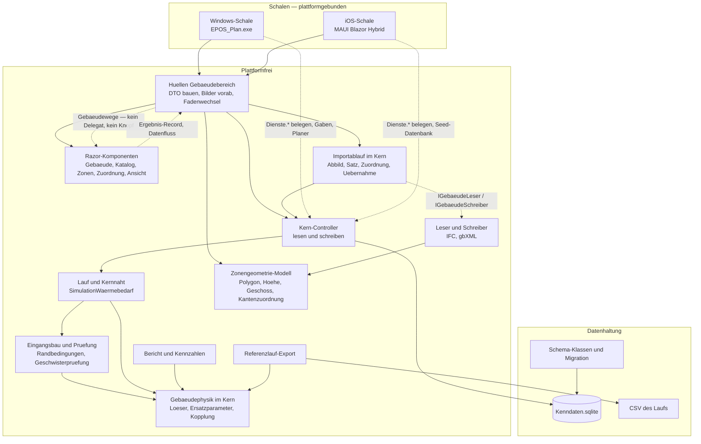
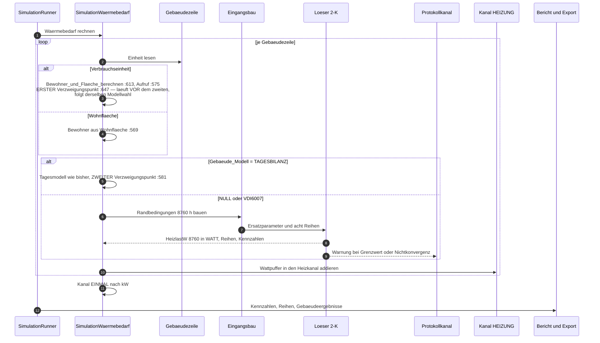
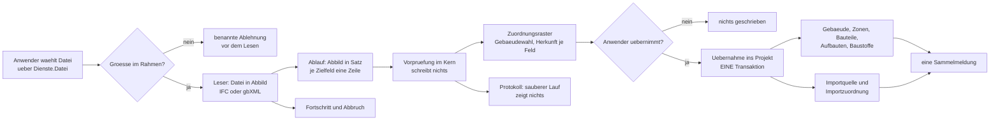
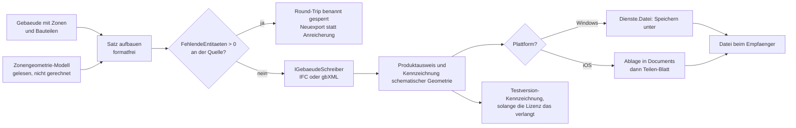
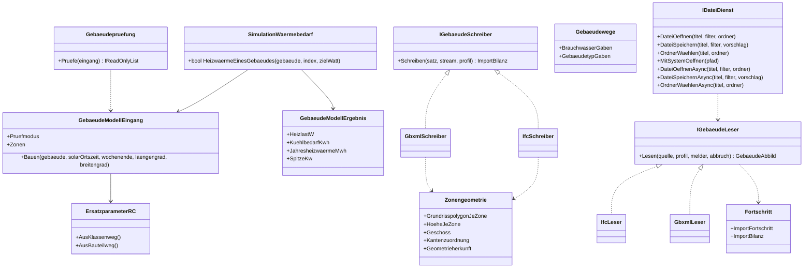
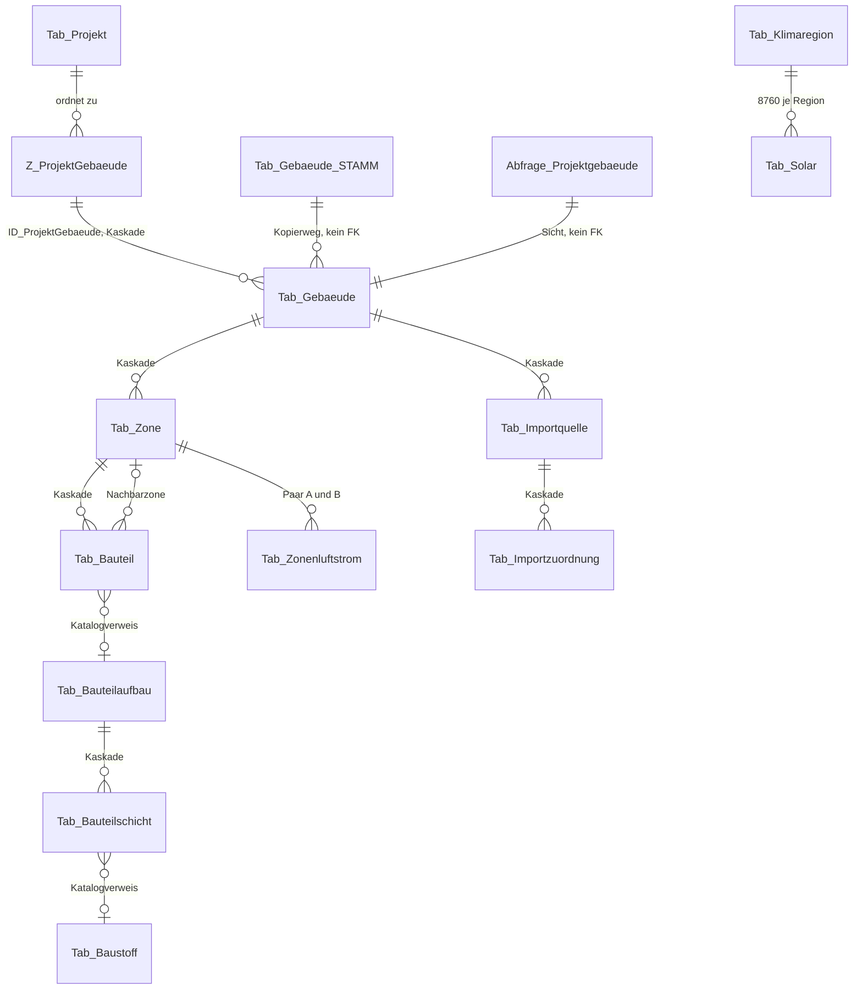
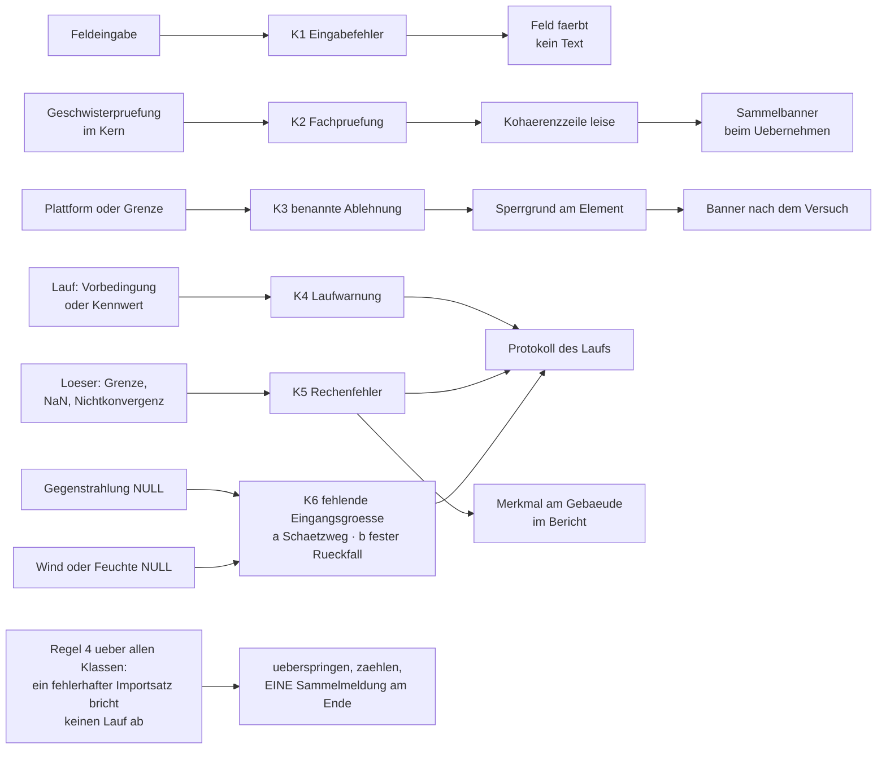
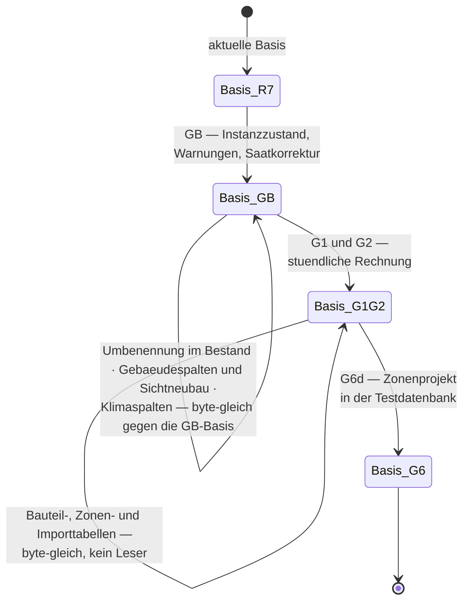

# Systementwurf Gebäudesimulation und ihre Einbindung in EPOS-Plan

**Stand:** 15.09.2026
**Zweck:** Der Systementwurf der Gebäudesimulation nach VDI 6007 Blatt 1 und ihrer Einbindung in
EPOS-Plan: Anforderungen, Bausteine und ihre Verantwortlichkeiten, Datenflüsse, Verträge,
Speicherung, Fehlerbehandlung, Leistung, Nachweis, Abwägungen und Grenzen. Er sagt, **in welchem
Gerüst** gerechnet, gespeichert, gemeldet und nachgewiesen wird — nicht, **wie** gerechnet wird.
**Leserkreis:** Projektverantwortung, Entwickler, Agenten.

> **Rev. 2 — Korrekturen des Gegenlesens vom 15.09.2026 eingearbeitet, Protokoll:**
> [Gegenlesen](Gebaeudesimulation/2026-09-15_Gegenlesen_Systementwurf.md)

| Bezug | Papier |
|---|---|
| **Schwesterpapier** (Softwarearchitektur, Datenmodell, Dialogführung, Integration) | [`Softwarearchitektur_Gebaeudesimulation_EPOS-Plan.md`](Softwarearchitektur_Gebaeudesimulation_EPOS-Plan.md) |
| Physik, Stufen G0–G5, Entscheide E1–E11 | [`Konzept_Gebaeudesimulation_VDI6007_EPOS-Plan.md`](Konzept_Gebaeudesimulation_VDI6007_EPOS-Plan.md) |
| Kern-Einbindung, Gebäudedialog, IFC-Import, Stufenfolge | [`Umsetzungskonzept_Gebaeudesimulation_VDI6007_EPOS-Plan.md`](Umsetzungskonzept_Gebaeudesimulation_VDI6007_EPOS-Plan.md) |
| Zonen, Kopplung, Zonenimport, Stufen G6a–G6d | [`Konzept_Mehrzonenmodell_IFC_EPOS-Plan.md`](Konzept_Mehrzonenmodell_IFC_EPOS-Plan.md) |
| Zuordnungsgerüst, gbXML, Exporte, Importherkunft | [`Konzept_Datenaustausch_gbXML_IFC_EPOS-Plan.md`](Konzept_Datenaustausch_gbXML_IFC_EPOS-Plan.md) |
| Architekturentscheide | [`ADR-001`](ADR-001_Schema-Ausrollung.md) · [`ADR-002`](ADR-002_Stundenmodell_VDI6007_Einbindung.md) · [`ADR-003`](ADR-003_IFC_xBIM_ohne_Geometriekernel.md) · [`ADR-004`](ADR-004_gbXML_LINQ_to_XML.md) · [`ADR-005`](ADR-005_Zonenkopplung_Mehrzonenmodell.md) |
| Bestandsbefunde, auf denen dieser Entwurf steht | [Befund T — Softwarearchitektur](Gebaeudesimulation/2026-09-15_Befund_T_Softwarearchitektur_Bestand.md) · [Befund U — Dialogführung](Gebaeudesimulation/2026-09-15_Befund_U_Dialogfuehrung_Bestand.md) · [Befund V — Datenmodell](Gebaeudesimulation/2026-09-15_Befund_V_Datenmodell_Architektur.md) |
| Weitere Befunde | [L — Einbindung Kern](Gebaeudesimulation/2026-09-15_Befund_L_Einbindung_Kern.md) · [M — Gebäudedialog](Gebaeudesimulation/2026-09-15_Befund_M_Gebaeudedialog.md) · [N — IFC-Import](Gebaeudesimulation/2026-09-15_Befund_N_IFC-Import_Entwurf.md) · [Q — Muster](Gebaeudesimulation/2026-09-15_Befund_Q_Muster_Datenmodell_Dialoge.md) · [R — gbXML](Gebaeudesimulation/2026-09-15_Befund_R_gbXML_Schema_Werkzeuge.md) · [S — IFC-Export](Gebaeudesimulation/2026-09-15_Befund_S_IFC-Export_ohne_Geometriekernel.md) · [H — Rechenzeit](Gebaeudesimulation/2026-09-15_Befund_H_OstWest_Rechenzeit.md) |
| Hausregeln | Wurzel-[`CLAUDE.md`](../../CLAUDE.md) · [`EPOS.Kern/CLAUDE.md`](../../EPOS.Kern/CLAUDE.md) · [`EPOS.UI/CLAUDE.md`](../../EPOS.UI/CLAUDE.md) · [`EPOS.iOS/CLAUDE.md`](../../EPOS.iOS/CLAUDE.md) |
| Regressionsnetz | [`Referenzlaeufe/LIESMICH.md`](../../Referenzlaeufe/LIESMICH.md) |

**Wie dieses Papier zu lesen ist.** Es entscheidet nichts, was dem Anwender zusteht; die offenen
Architekturfragen führt das Schwesterpapier in seinem Kapitel 6 unter den Kennungen A1 ff. Wo dieser
Entwurf eine Stelle im Bestand benennt, steht der Beleg als `Datei:Zeile`; wo er auf einen Befund
zurückgreift, steht der Befund. Die Befunde unter
[`Dokumentation/aktuell/Gebaeudesimulation/`](Gebaeudesimulation/) bleiben **Belegquelle in
`aktuell/`**, solange dieses Papier und sein Schwesterpapier gelten; sie wandern erst nach
`ueberholt/`, wenn beide abgelöst sind — und dann im selben Schritt mit dem Umbau aller Verweise,
weil `EPOS.Kern.Tests/DokumentationLinkWacheTests` jeden relativen Verweis prüft. **Derselbe Wächter
prüft als eigenen Fall die Indexpflicht:** Jedes Papier unter `aktuell/` braucht eine Indexzeile in
[`Dokumentation/LIESMICH.md`](../LIESMICH.md) — auch dieses und sein Schwesterpapier. Die Zeile
entsteht im **selben Schritt**, in dem das Papier committet wird; ohne sie ist das Gate rot, gleich
welches Papier zuerst hineingeht.

---

## 0. Das Ergebnis in sieben Punkten

1. **Die Gebäudesimulation dockt an genau einer Naht an.** Die Wärme eines Gebäudes entsteht in
   derjenigen Methode, die sie heute erzeugt; sie hat **zwei Aufrufer** — den Lauf und die
   Auskunft — und **zwei Stellen, an denen die Modellwahl fällt**: die Bedarfsrechnung im Rumpf
   der Methode und die Flächen- und Bewohnerrechnung, die **vor** ihr läuft und derselben Wahl
   folgen muss. Eine Naht, zwei Aufrufer, zwei Stellen: Puffer, Kanal, Dauerlinie und Energieprobe
   bleiben unberührt. Die Fundstellen stehen in 3.1.
2. **Das Gerüst ist unverändert Kern → Hülle → Razor-Komponente mit neun Umgebungsdiensten.** Die
   Physik liegt einmal im Kern, die Oberfläche kennt keine Datenbank und keine Fachklasse, die
   Umgebung erreicht der Kern nur über `Dienste.*` (Befund T 1.2, 1.3). Neue Bausteine ordnen sich
   ein, sie ändern das Gerüst nicht.
3. **Das Datenmodell wächst um 15 + 3 Spalten und elf Tabellen bei einem Sichtneubau** —
   neun Tabellen für Bauteile und Zonen (`Tab_Baustoff(_STAMM)`, `Tab_Bauteilaufbau(_STAMM)`,
   `Tab_Bauteilschicht(_STAMM)`, `Tab_Zone`, `Tab_Bauteil`, `Tab_Zonenluftstrom`) und zwei für die
   Importherkunft (`Tab_Importquelle`, `Tab_Importzuordnung`). *Ein* Sichtneubau gilt, sobald die
   beiden Gebäudespalten-Schritte nach **U5 / A9** verschmolzen sind; bleiben sie getrennt, sind es
   zwei. Der Sichtneubau von `Abfrage_Projektgebaeude` ist in jedem Fall der Engpass des Vorhabens,
   weil SQLite kein `ALTER VIEW` kennt (Befund V 0.3); der Klimaschritt bleibt getrennt und berührt
   die Sicht nicht.
4. **Was eine Plattform nicht kann, wird benannt abgelehnt statt still übergangen.** Für jeden Weg
   gilt einer von zwei Fällen: *kein Delegat, kein Knopf* (die Funktion bleibt ohne ihn vollständig)
   oder *benannte Ablehnung* mit Sperrgrund am Bedienelement. Ein dritter Fall — der Knopf ist da und
   tut nichts — kommt im Bestand nicht vor und entsteht hier nicht (Befund T 1.4).
5. **Determinismus entsteht aus Instanzzustand und Einfädigkeit, nachgewiesen wird er gegen die
   Referenzbasis.** Kein statisches Feld schreibt über Gebäude hinweg fort, der Vorlauf gehört in
   den Löser, der Lauf bleibt einfädig, und dasselbe Gebäude zweimal zu rechnen muss byte-gleich
   bleiben — die Verbrauchs-Rückrechnung tut genau das.
6. **Drei Schritte frieren die Basis neu ein: GB, G1 + G2 und G6d.** GB, weil der Instanzzustand
   zwei Referenzprojekte ändert; G1 + G2, weil dreizehn Projekte stündlich rechnen; G6d, weil ein
   Referenzprojekt auf Zonen umgestellt wird. Alle Tabellen-, Saat- und Sichtschritte dazwischen sind
   ergebnisneutral — **und das ist je Schritt zu belegen, nicht zu behaupten**.
7. **Import, Export und Ansicht laufen über ein Gerüst und eine Geometriequelle.** Ein
   Zuordnungsgerüst mit zwei Formatprofilen trägt IFC und gbXML; bis zur ausdrücklichen Übernahme
   wird nichts geschrieben. Die Geometrie, die die Exporte schreiben und die der Gebäudebetrachter
   zeigt (E11), entsteht **einmal** im Kern als Zonengeometrie-Modell und wird gelesen, nicht im
   Exporteur gerechnet. Die Lizenzhinweisseite im Installationspaket — xBIM und three.js — ist
   Vorbedingung der Auslieferung des IFC-Wegs und des Betrachters.

---

## 1. Anforderungen

### 1.1 Funktionale Anforderungen

| # | Anforderung | Quelle | Nachweis |
|---|---|---|---|
| **F1** | Das 2-K-Modell nach VDI 6007 Blatt 1 rechnet **stündlich** und ist das Vorgabemodell **jedes** Gebäudes, auch eines bestehenden | E1, ADR-002 | Normtestfälle lokal (G0); Referenzlauf G1 + G2 |
| **F2** | Die Tagesbilanz bleibt als **ausdrücklich wählbare** Ausnahme je Gebäude erhalten und bleibt regressionsgeprüft | E1, ADR-002 | Rückweg-Nachweis: ein Tagesbilanz-Gebäude rechnet gegen die Basis unverändert |
| **F3** | Der Gebäudedialog zeigt je Bauteilgruppe bzw. je Bauteil **U, A und U·A** ohne verdeckte Gewichte, darunter H_T, H_ve, H_ges | E2, Konzept N1.6 | bunit-Fall über die U·A-Tabelle; Summenprobe gegen den Löser |
| **F4** | Eine **Vorschau je Gebäude** rechnet auf demselben Rechenweg wie der Lauf — nie eine zweite Rechnung | Hausregel `EPOS.Kern/CLAUDE.md`; Befund T 7.1 (2) | Datenbankfall: Auskunft und Lauf liefern denselben Vektor |
| **F5** | Die **Skalierung** (Hochrechnung auf Fläche/Volumen) und die **Verbrauchs-Rückrechnung** bleiben erhalten. Die Skalierung ist **Teil der Modellrechnung**, keine Nachmultiplikation des Ergebnisvektors: Sie steckt heute im Rückgabewert der Tagesrechnung, das Stundenmodell **führt die Verhältnisrechnung Gesamtfläche/Wohnfläche selbst** — sie fällt ihm nicht zu | E8; Umsetzungskonzept 1.5 | Zwei Läufe desselben Gebäudes byte-gleich; Datenbankfall über beide Einheiten |
| **F6** | Je Gebäude entstehen die Reihen **Raumtemperatur**, **operative Temperatur** und **Kühlbedarf** über 8 760 Stunden | Konzept 4, Umsetzungskonzept 1.4 | drei neue Vektordateien im Referenzlauf-Export |
| **F7** | Je Gebäude entstehen **acht Kennzahlen**: Jahresheizwärme, Spitze, Tagesmittel der Spitze, 95-%-Wert, Kühlenergie, Stunden mit Kühlbedarf, mittlere Raumtemperatur der Heizzeit und Übertemperaturstunden (im Mehrzonenkonzept M5 „Überhitzungsstunden" — **dieselbe Größe**). **Im Bericht** stehen die fünf des Kennzahlenkatalogs (Schwesterpapier 4.3), **im Referenzlauf-Export** zusätzlich Stunden mit Kühlbedarf und die Gebäudespitze; wer eine der beiden später in den Bericht hebt, gibt ihr dabei eine Aggregationsregel über Gebäude — bei Stunden mit Kühlbedarf wäre eine Summe sinnlos | Umsetzungskonzept 1.4 (sieben Kennzahlen) **und** Befund U 5.2 (Übertemperaturstunden) | Skalare mit Gebäudepräfix in `aggregate.csv`; die fünf Kennzahlen im Bericht |
| **F8** | Ein **Bauteilkatalog** trägt Baustoffe, Aufbauten und Schichten — als Auslieferungskatalog und als Projektkopie | Konzept 6.3, Mehrzonenkonzept 3 | Katalogeditor-Fälle; Auslieferungsvorlage meldet keinen leeren Katalog |
| **F9** | Der **Bauteilweg** (Reduktion aus Schichten) tritt neben den Klassenweg (k-Wert-/Flächenpaare und Bauweise) | Konzept 4.3, Mehrzonenkonzept 4.3 | Probe: ein Gebäude über beide Wege parametriert, Abweichung ausgewiesen |
| **F10** | Ein Gebäude kann **mehrere Zonen** tragen, gekoppelt über Trennflächen und Luftaustausch | E7, Mehrzonenkonzept 2, ADR-005 | Probe: eine Zone **bitgleich** zum Einzonenmodell desselben Programmstands |
| **F11** | **IFC-Import** eines Gebäudes mit Herkunft je Feld und Beleg je Zahl | E3, E9, ADR-003 | Importprobe gegen die benannte Prüfdatei; Protokoll ohne Einträge bei sauberem Lauf |
| **F12** | **gbXML-Import** — Pflichtbestandteil der Stufe **G4c** | E9, ADR-004 | Rundlauf: eigener Export gelesen, Werte auf 1e-6 gleich |
| **F13** | **gbXML- und IFC-Export** samt Round-Trip-Anreicherung | E9, Datenaustausch 5/6 | Rundlaufprobe; Schemavalidierung des Exports gegen die lokale Schemakopie |
| **F14** | **Herkunft und Quelle** jeder importierten Zeile bleiben nach dem Lauf sichtbar und wiederauffindbar | Datenaustausch 2.2, 2.3 | Datenbankfall: Zeile, Quelle und Paarung nach dem Import vorhanden |
| **F15** | **Bericht und Kennzahlen** führen die neuen Größen je Gebäude, im Mehrzonenfall zusätzlich je Zone | Konzept 9, Mehrzonenkonzept 7 | Berichtsprobe; `Proben/ChartProben` für jedes neue Bild |
| **F16** | Der **Referenzlauf-Export** trägt die neuen Reihen und Skalare — **nur** für Gebäude im neuen Modell | Umsetzungskonzept 1.8; Befund L 4.3 | Vergleich gegen die Basis: `GESAMT: PASS`, keine unbedingte neue Datei |
| **F17** | Ein **Gebäudebetrachter** zeigt Grundriss je Geschoss und schematische Körper aus **einem** Zonengeometrie-Modell des Kerns — eine Komponente, ein Umschalter; die Kennzeichnung **„schematisch" steht sichtbar am Bild**, nicht nur in der Datei, und jede Zone weist aus, ob ihr Polygon aus Raumgrenzen oder aus der Rechteckherleitung stammt | **E11**, Datenaustausch Kapitel 14 | bunit-Fall über die Ansicht; Probe „Determinismus der Geometrie" (gleiche Eingabe, gleiche Polygone, byteweise gleicher Export) |

### 1.2 Nichtfunktionale Anforderungen

| # | Anforderung | Maß | Quelle | Nachweis |
|---|---|---|---|---|
| **N1** | **Determinismus** | zwei Läufe desselben Standes byte-gleich | Regressionsnetz | Protokollzeile des Referenzlaufs (Bestand: 13 von 13 byte-gleich) |
| **N2** | **Reproduzierbarkeit** unabhängig von Zeilenreihenfolge und Vorgeschichte im selben Prozess | Ergebnis eines Gebäudes hängt an seinen Daten, an nichts sonst | Befund T 5.2 | Probe: Gebäudeliste in umgekehrter Reihenfolge, gleiche Zahlen je Gebäude |
| **N3** | **Rechenzeitbudget** des Laufs | **Einzonengebäude ≤ 10 ms je Gebäudejahr** (Planungsgröße); Basislauf wächst um ≤ 0,15 s, CI-Lauf um ≤ 0,04 s. **Mehrzonengebäude sind benannt ausgenommen:** rund **1,1–2,0 s** bei 50 Zonen einschließlich des zweiten Vorlaufs und des ungekoppelten adiabaten Vorlaufs — das liegt weit über der Planungsgröße und ist vertretbar, weil es **nur bei Mehrzonengebäuden** anfällt | Befund H 2, Befund T 6.2; Mehrzonenkonzept 2.9 | Laufzeitzeile im Protokoll des Referenzlaufs |
| **N4** | **Antwortzeit der Vorschau** im Dialog | Prüfung entprellt (Vorgabe 400 ms, `0` im Test), keine Datenbankfrage je Tastendruck, Rechnung je Vorschau im Bereich von 10 ms | Befund U 8.1 (P11) | bunit-Fall mit Entprellung `0`; Zählung der Datenbankfragen im Fall |
| **N5** | **Plattformgleichheit** Windows/iOS | jede Maske erreichbar oder **benannt** abgelehnt; kein stummes `false` | Befund U 7; Befund U 8.2 (L9); Befund T 1.4 | iOS-Navigationszeile je Maske; Sperrgrund am Bedienelement |
| **N6** | **Zweisprachigkeit** | jeder Anzeigetext in beiden `.resx`, deutscher Rückfall | `EPOS.UI/CLAUDE.md` | `Werkzeuge/ResourceDesigner` läuft nach jedem neuen Schlüssel |
| **N7** | **Berührbarkeit und Breite** | Berührziel 44 px; vierstufiger Dialogstapel bricht bei 900 CSS-Pixeln um, er scrollt nicht | Befund U 7 | Strukturwachen; `Proben/Rasterprobe` vor jeder Rasteränderung |
| **N8** | **Auslieferbarkeit** | Lizenzhinweisseite für Fremdbestandteile im Installationspaket | E3, Datenaustausch 8.1 | Setup-Lauf enthält die Seite; ohne sie ist der IFC-Weg nicht auslieferbar |
| **N9** | **Sicherungs- und Transportfähigkeit** | `VACUUM INTO` im laufenden Betrieb bleibt brauchbar; ein Projektpaket bleibt in Minuten übertragbar | Befund V 6.3 | Datenbankgröße je Lauf unverändert (Ergebnisreihen bleiben draußen) |
| **N10** | **Nachweisbarkeit jeder Zahl** | jede angezeigte Zahl hat eine Herkunft aus den **fünf** persistierten Werten (`MANUELL`, `KATALOG`, `IFC`, `GBXML`, `VORGABE`) oder eine Herleitung — ein zweiter Wertevorrat entsteht nicht (Schwesterpapier 2.2, W9) | E2, Datenaustausch 2.2 | Herkunftsspalte im Zuordnungsraster; Herleitungszeile im Dialog; `CHECK` an jeder Herkunftsspalte |

### 1.3 Randbedingungen

| # | Randbedingung | Wirkung auf den Entwurf |
|---|---|---|
| **B1** | **Die Entscheide E1–E11 sind verbindlich** (Tabelle unten) | sie sind nicht Gegenstand einer Abwägung, sondern deren Ausgangspunkt |
| **B2** | [`ADR-002`](ADR-002_Stundenmodell_VDI6007_Einbindung.md) **angenommen** — Stundenmodell als Vorgabe, eine Naht, Basis neu einfrieren | kein zweiter Rechenweg, keine zweite Kennzahlenmenge |
| **B3** | [`ADR-003`](ADR-003_IFC_xBIM_ohne_Geometriekernel.md) **angenommen** — xBIM unverändert, allein `Xbim.IO.MemoryModel` | kein `IfcStore`, kein Esent, kein `Xbim.Geometry`; CDDL-Auflage ist eine Auslieferungsauflage |
| **B4** | [`ADR-004`](ADR-004_gbXML_LINQ_to_XML.md) **vorgeschlagen** — gbXML über LINQ to XML | ohne Entscheid hat F12 keinen Leseweg |
| **B5** | [`ADR-005`](ADR-005_Zonenkopplung_Mehrzonenmodell.md) **vorgeschlagen** — Nachbarraum-Randbedingung, Gauß-Seidel je Stunde | ohne Entscheid hat F10 kein Lösungsschema |
| **B6** | [`ADR-001`](ADR-001_Schema-Ausrollung.md) — jede Schemaänderung ist ein nummerierter Schritt über `SchemaMigration` | drei Eintragungen je neuer Tabelle: Migrationsschritt, Auslieferungsvorlage, Schemapflege der Testdatenbank (Befund T 1.2) |
| **B7** | **Die Hausregeln der vier `CLAUDE.md`** | Fachänderung einmal im Kern; keine Datenbank in der Oberfläche; Umgebung nur über `Dienste.*`; in `EPOS.iOS` nichts Fachliches |
| **B8** | **Feste Raster** 8 760 Stunden, 168 Wochenstunden, 365 Tage, 12 Monate, kein Schaltjahr | der Löser rechnet Blockstunden auf diesem Raster; Vorlauf zählt nicht zum Jahr |
| **B9** | **Drei Kanäle** — `HEIZUNG`, `BRAUCHWASSER`, `PROZESS` (`Kanal.ANZAHL = 3`, `EPOS.Kern/Allgemein/Simulation/SimulationKanaele.cs:429-438`) —, **und Kühlung ist keiner** | der Kühlbedarf ist eine informative Reihe je Gebäude, er geht in keinen Kanal und in keine Erzeugerrechnung; ein Kühlkanal wäre der **vierte** (Abwägung 10) |
| **B10** | **SQLite, `STRICT`, Beziehungen über IDs**, Boolean als 0/1 mit `CHECK`, Zugriff nur über `DataRepository` mit `?`-Parametern | keine neuen Textverweise; kein zusammengesetzter SQL-Text; nach jeder Anweisung der `SqlDialektPruefer` |
| **B11** | **Kein Fremdpaket an iOS ohne Messung** | ein Paket, das der Gerätebau nicht trägt, gehört hinter eine Schnittstelle mit Fabrik in der Schale (Muster `IFlottenPlaner`) |
| **B12** | **CI-Kontingent und Rückfragepflicht** — vor jedem macOS-, iOS- und Setup-Lauf beim Anwender nachfragen, jedes Mal | der Nachweis der Stufen liegt auf `kern.yml` (ubuntu); ein iOS-Lauf ist nur begründet, wenn die iOS-Hülle selbst betroffen ist |
| **B13** | **Normzahlen liegen nicht im Repositorium** | der Normfallnachweis ist ein lokaler Nachweis; die Lücke im Gate gehört ins Protokoll, nicht in eine Datei |
| **B14** | **Referenzbasis und Toleranz** — aktuell `2026-09-11_R7_Speicherflotte`, Toleranz Betrag ≥ 1 relativ 1e-4, sonst absolut 0,01; der Byte-Vergleich ist Information | jede Stufe rechnet gegen die **aktuelle** Basis; eine Datei, die nur im neuen Lauf liegt, ist ohne Schalter FAIL |

**Die elf Entscheide im Wortlaut ihrer Wirkung** (Quelle: Konzept-Nachtrag 1 und
[`Status_Gebaeudesimulation_VDI6007.md`](Status_Gebaeudesimulation_VDI6007.md)):

| # | Entscheid |
|---|---|
| **E1** | Stundenmodell für **alle** Gebäude, auch bestehende; Tagesbilanz nur als ausdrücklich wählbare Ausnahme; `Gebaeude_Modell = NULL` bedeutet **VDI 6007** |
| **E2** | Bestandsgewichte gestrichen; **U·A je Bauteil** im Dialog, ohne verdeckte Faktoren |
| **E3** | **xBIM unverändert** als NuGet-Paket unter CDDL-1.0, allein `Xbim.IO.MemoryModel`; kein `IfcStore`, kein Esent, kein `Xbim.Geometry`; Lizenztext und Quellenverweis im Installationspaket |
| **E4** | **Einfrierschritt GB vor G1** (Instanzzustand, Ferienwarnungen, Korrektur der Bauweise eines Gebäudes), dazu die vierte Einfrierregel |
| **E5** | Klimabasis sind die vorhandenen **PVGIS-TMY**-Daten; keine Datenträger, keine DWD-TRY |
| **E6** | VDI 6020:2022 **nur zu Forschungszwecken** — nichts daraus in Quelltext, Tests, Wiki, Bericht oder Auslieferung |
| **E7** | **Einzonen zuerst** (G0–G2); Mehrzonen als Stufe G6 über den Import |
| **E8** | Die **Skalierung bleibt** — Hochrechnung und Verbrauchs-Rückrechnung; sie entfällt erst für Gebäude mit echter Hülle |
| **E9** | **Import und Export** von gbXML und IFC; gbXML-Import ist Pflicht in G4, die Exporte sind Stufe G7 |
| **E10** | Druckrundung als Prüfregel; Produktausweis: „Rechenkern nach VDI 6007 Blatt 1; elf der zwölf Testbeispiele im Normband einschließlich Druckrundung, Testbeispiel 11 in zwei Umschaltstunden um 3,4 W daneben (3,9 W gegen das Band ohne Druckrundung)" |
| **E11** | **Ein Gebäudebetrachter, zwei Ansichten, ein Zonengeometrie-Modell** — 2D-Grundriss je Geschoss aus den Raumgrenzen (SVG in einer Razor-Komponente, mit G6c) und schematische Körper aus EPOS-Daten (Quader je Zone, Platte je Bauteil, three.js lokal, mit G7b); ein vollwertiger 3D-IFC-Betrachter und die xBIM Geometry Engine sind **benannt abgelehnt** |

---

## 2. Komponentenbild und Verantwortlichkeiten

### 2.1 Das Bild

**Bild 1 — Bausteine, Schichten und Nähte.** Jede **durchgezogene** Kante ist eine
Abhängigkeit und zeigt nach innen: `A --> B` heißt *A kennt B*. **Gestrichelte** Kanten sind keine
Abhängigkeiten — sie sind die benannten Nähte und, einmal, ein reiner Datenfluss.

**Drei Kanten, die es ausdrücklich nicht gibt.** Die Razor-Komponente kennt die Hülle **nicht** —
`EPOS.UI.Daten` verweist auf `EPOS.UI`, nie umgekehrt (`EPOS.UI.Daten/EPOS.UI.Daten.csproj:52`;
`EPOS.UI/EPOS.UI.csproj:44` verweist allein auf `EPOS.Kern`); der Rückweg im Bild ist der
Ergebnis-Record, also Datenfluss. Der **Leser** kennt den Controller nicht: Er füllt ein
formatfreies Abbild, das Schreiben macht der Ablauf über den Controller. Und **Bericht und Export
lesen die Physik**, nicht umgekehrt — die Physik kennt keinen ihrer Abnehmer.

### 2.2 Wer welche Frage beantwortet — und welchen Typ er nicht kennen darf

| Baustein | Beantwortet die Frage | Kennt **nicht** |
|---|---|---|
| **Gebäudephysik im Kern** (Löser, Ersatzparameter, Bauteilreduktion, Zonenkopplung) | „Welche Heizlast, welche Temperatur, welcher Kühlbedarf entsteht in dieser Stunde?" | Datenbank, `Dienste.*`, Protokollkanal, Ressourcen, Oberfläche. Reine Rechnung auf `double`, Zustand an der Instanz |
| **Eingangsbau** | „Wie sehen die 8 760 Randbedingungen dieses Gebäudes aus?" | die Oberfläche; er liest **fertige** Modelle und Klimareihen, nie die Datenbank selbst |
| **Geschwisterprüfung** | „Passen Flächen, Hülle, Trennflächen und Luftströme dieses Gebäudes zueinander?" | Anzeigetexte — sie liefert Meldungsschlüssel und invariante Werte, nie Sätze |
| **Kern-Controller** | „Welche Zeilen stehen in der Datenbank, und wie kommen meine hinein?" | WinForms, Razor, `MessageBox`, Dateipfade außerhalb von `Dienste.*` |
| **Hülle** | „Wie sieht das DTO dieser Maske aus, und welcher Delegat wird dafür gebraucht?" | Fachlogik. Sie rechnet nicht; sie ordnet |
| **Razor-Komponente** | „Wie wird das dargestellt und bedient?" | Datenbank (`DataRepository`, `RecordSet`, `DbParam`, SQL) **und** die Fachklassen des Kerns; sie gibt einen Ergebnis-Record zurück |
| **Zonengeometrie-Modell** (Kern, plattformfrei) | „Wo liegt welche Zone — welches Polygon, welche Höhe, welches Geschoss, welche Kante trägt welches Bauteil?" | Datenbank, Oberfläche, Dateiformate. Es hat **drei Abnehmer** und rechnet für alle drei dasselbe (Vertrag V13) |
| **Leser / Schreiber** (IFC, gbXML) | „Was steht in dieser Datei — und wie schreibe ich diese Datei?" | das Zielmodell der Datenbank **und den Controller**; sie füllen bzw. lesen ein formatfreies Abbild, die Geometrie **lesen** sie aus dem Zonengeometrie-Modell |
| **Bericht, Kennzahlen und Referenzlauf-Export** | „Welche Zahl je Gebäude bzw. je Zone geht hinaus, unter welchem Schlüssel und in welcher Einheit?" | die Datenbank als Ziel — Ergebnisse gehen in CSV und Bericht, nie in eine Tabelle; sie lesen die Physik, die Physik kennt sie nicht (Vertrag V14) |
| **Schema-Klasse** | „Welche Spalten und Tabellen gehören zu dieser Familie, und wie entstehen sie?" | Fachrechnung. Sie ist die **eine** Quelle für Migration, Testdatenbankwerkzeug, Kopierweg und Nachweis |
| **Schale** | „Wie sieht ein Fenster aus, wo liegt eine Datei, welches Paket ist da?" | alles Fachliche. In `EPOS.iOS` gilt das als ausdrückliche Regel |

**Die drei Regeln, die dieses Bild zusammenhalten.** Erstens: *Jede Fachänderung wird einmal
gemacht — im Kern.* Zweitens: *Die Komponente sieht nie einen Typ, der schreiben könnte.* Drittens:
*Was die Plattform beisteuern muss, kommt als benannte Naht herein* — als Gaben-Haken, wenn die
Funktion ohne sie vollständig bleibt, und als benannte Ablehnung, wenn sie es nicht bleibt.

---

## 3. Datenfluss

Vier Flüsse, getrennt zu betrachten: der **Lauf**, die **Auskunft**, der **Import** und der
**Export**. Sie teilen sich Rechenweg und Datenhaltung, aber nicht ihre Auslöser.

### 3.1 Der Lauf — von den Klimareihen bis zum Bericht

**Bild 2 — der Lauf mit der Modellwahl an beiden Stellen.** Die Flächen- und Bewohnerrechnung läuft
**vor** der Verzweigung des Bedarfs und folgt derselben Modellwahl.

**Die Naht im Wortlaut ihrer Fundstellen.** Die Wärme eines Gebäudes entsteht in
`SimulationWaermebedarf.HeizwaermeEinesGebaeudes`
(`EPOS.Kern/Allgemein/Simulation/SimulationWaermebedarf.cs:566`, Rumpf bis `:611`). Sie hat **zwei
Aufrufer** — den Lauf (`…/SimulationWaermebedarf.cs:197`) und die Auskunft
(`EPOS.Kern/Controller/GebaeudeBedarfCtrl.cs:117`) — und **zwei Verzweigungspunkte**, die nicht
beide in ihrem Rumpf liegen. Der **erste** steht in der Flächen- und Bewohnerrechnung
`Bewohner_und_Flaeche_berechnen` (`:613-656`, gerufen bei `:575`, Tagesmodellruf `:647`), der
**zweite** im Rumpf selbst (`:581`). Die Rückrechnung läuft also **vor** der Modellwahl des Bedarfs
und nicht hinter ihr, und sie **muss derselben Modellwahl folgen** — die Zählung ist die des
Schwesterpapiers 4.1. ADR-002, Entscheidung 3, sagt genau das: „Die
Flächen- und Bewohnerrechnung, die vor der Verzweigung läuft und selbst das Tagesmodell ruft, folgt
derselben Modellwahl."

**Was dabei gilt.**

- Der Puffer bleibt ein `double[8760]` in **Watt**; die Umrechnung nach kW geschieht genau dort, wo
  sie heute geschieht — einmal am Kanal (`…/SimulationWaermebedarf.cs:222`) und einmal in der
  Auskunft (`EPOS.Kern/Controller/GebaeudeBedarfCtrl.cs:121`). Das ist eine **Leistungs**umrechnung
  und berührt die Einheitenregel nicht.
- **Die Einheitenregel ist auf drei Nähte fortzuschreiben, nicht zu dehnen.** Ihr Punkt 4 nennt heute
  zwei Umrechnungsnähte für eine **Energiemenge**: `SimulationErgebnisCtrl` (Anzeige) und
  `SimulationRunner` (Datenbank) (`EPOS.Kern/CLAUDE.md:141-142`,
  `EPOS.Kern.Tests/EinheitenWacheTests.cs:10-24`). Der Bestand hat eine **dritte**:
  `GebaeudeBedarfCtrl.Rechnen` bildet die Jahressumme selbst —
  `ergebnis.HeizwaermeMwh = werte.Sum() / 1000` (`EPOS.Kern/Controller/GebaeudeBedarfCtrl.cs:130`),
  zeichengleich zum Lauf und deshalb dort bewusst so geschrieben. Sie bleibt: Der Tagesbilanz-Weg
  liefert nur einen Wattvektor, und eine Auskunft, die eine zweite Rechnung führte, wäre der
  schwerere Fehler. Festlegung dieses Entwurfs, gleichlautend mit dem Schwesterpapier 1.7: Die
  dritte Naht wird **benannt und in die Regel aufgenommen** — drei Nähte, alle drei im Kern —, und
  für Gebäude im Stundenmodell bildet die Ergebnisklasse die Jahressumme, die der Controller dann
  durchreicht. Damit stimmt der Satz des Umsetzungskonzepts 1.4 („umgerechnet wird im Kern,
  `GebaeudeBedarfCtrl` bzw. `SimulationErgebnisCtrl`") mit dem Quelltext und mit der Regel überein.
  **Eine vierte Naht entsteht nicht.**
- Die **Liste der Gebäudeergebnisse** hängt an der Simulationsinstanz, an der Stelle des toten
  `MaxP`; sie verlässt den Lauf über Bericht und Export, nicht über die Datenbank.
- **Der Tagesmodellruf `:647` verzweigt mit.** Käme der Vergleichswert der Rückrechnung aus dem
  Tagesmodell und der Bedarf aus VDI 6007, mischte die Skalierung zwei Modelle — genau das
  verbietet ADR-002, Entscheidung 3, für die Flächen- und Bewohnerrechnung ausdrücklich.
- **Eine Vorbedingung des Bestandswegs darf das Stundenmodell nicht erben.** Der Abbruch bei
  fehlender Tagesverteilung steht heute **hinter** dem zweiten Verzweigungspunkt
  (`…/SimulationWaermebedarf.cs:590-595`, Warnung `SIMENG_TAGESVERTEILUNG_FEHLT`, `return false`).
  Das Stundenmodell braucht keine Tagesverteilung. **Für den Punkt im Rumpf (`:581`) ist der
  Zuschnitt entschieden:** Das Umsetzungskonzept 1.5 legt fest, dass im Stundenzweig der ganze
  Tagesverteilungsblock entfällt — samt diesem Abbruch, den das Stundenmodell deshalb nicht erbt.
  Offen ist allein, ob der Tagesmodellruf `:647` denselben Zuschnitt bekommt und wie die Modellwahl
  dorthin gelangt (Schwesterpapier Kapitel 6, **A16**); der Entwurf verlangt nur, dass ein
  Stundenmodell-Gebäude **nicht** am fehlenden Tagesprofil scheitert.

### 3.2 Die Auskunft — eine Rechnung, kein zweiter Rechenweg

Der Bedarfsdialog ruft denselben Weg wie der Lauf: `HeizwaermeEinesGebaeudes` über
`GebaeudeBedarfCtrl` (`EPOS.Kern/Controller/GebaeudeBedarfCtrl.cs:117`), mit denselben Tabellen und
derselben Verzweigung. Neu ist allein ein **vierter Parameter für das erzwungene Modell**
(`null` = der Spaltenwert). Er wirkt ausschließlich auf der **gelesenen** Instanz, schreibt nichts
und dient dem Vergleich beider Wege im Dialog. *Eine Auskunft ruft den Rechenweg des Laufs, sie
schreibt ihn nicht ab* — das ist keine Stilfrage, sondern die Bedingung dafür, dass Vorschau und
Bericht nie auseinanderlaufen.

### 3.3 Der Import — von der Datei bis ins Projekt

**Bild 3 — der Importfluss.** Bis zur Übernahme wird **nichts** geschrieben.

**Vier Regeln des Importflusses.**

1. **Die Größenablehnung steht vor dem Lesen**, nicht danach — ein Abbruch nach dem Einlesen einer
   zu großen Datei hat den Speicher schon belegt. Die Grenze ist **kein Glied der Plattformnaht,
   sondern ein Datum des Profils**: vier Zahlen, je Format und Plattform eine, und die beiden
   iOS-Zahlen sind **zu messen, nicht zu schätzen**. Die Zahlen selbst stehen an einer Stelle —
   Schwesterpapier 1.5, Regel 2 (Herleitung: Umsetzungskonzept U11, Datenaustausch D15).
2. **Ein fehlerhafter Satz bricht den Lauf nicht ab.** Fehlerbilder sind Meldungen mit Schlüssel und
   invariant formatierten Werten, keine Ausnahmen; der Ablauf zeigt selbst nichts an.
3. **Zonen entstehen nie stillschweigend.** Erst die ausdrückliche Übernahme schreibt Zeilen; ohne
   sie bleibt das Gebäude, was es war. **Aus welchem Format sie überhaupt entstehen können, ist
   nicht für beide gleich entschieden:** Zonen entstehen aus IFC ab G6c; ob der gbXML-Weg ebenfalls
   Zonen bildet, ist mit **D16** offen — bis dahin legt der gbXML-Pflichtteil G4c ein Gebäude ohne
   Zonen an (Einzonen-Rückfall). Das Bild oben zeichnet den ausgebauten Fall; Regel 3 gilt in beiden.
4. **Herkunft je Feld im Dialog, Herkunft je Zeile in der Datenbank.** Beides ist verlangt, und
   beides ist verschieden: Im Zuordnungsraster trägt **jede Zelle** ihre Herkunft und ihren Beleg;
   persistiert wird je **Zeile** (Zone, Bauteil, Aufbau, Baustoff) die Herkunft und die
   Quellkennung, dazu je Paarung eine Zeile in der Zuordnungstabelle. Was nach dem Schließen des
   Dialogs bleibt, ist also: *woher stammt diese Zeile* und *welche Quellentität gehört zu ihr* —
   nicht mehr *welches einzelne Feld hat der Anwender von Hand geändert*. Der Entwurf sagt das
   ausdrücklich, statt „Herkunft je Feld" zu versprechen und je Zeile zu speichern; wer die
   feinere Auflösung dauerhaft will, braucht eine weitere Tabelle, und die ist nicht vorgesehen.

### 3.4 Der Export und der Round-Trip

**Bild 4 — der Exportfluss.**

**Vier Festlegungen zum Export.**

- **Die Exportgeometrie wird gelesen, nicht gerechnet.** Polygone, Höhen, Geschosse und die
  Zuordnung der Bauteile zu Kanten, Boden und Decke entstehen **einmal** im Zonengeometrie-Modell
  des Kerns (E11, Vertrag V13); der gbXML-Schreiber und der IFC-Schreiber lesen dasselbe Modell wie
  der Gebäudebetrachter. Ein Unterschied zwischen den beiden Dateien ist damit ein **Fehler**, keine
  Auslegung — und die Ansicht ist zugleich der Prüfstand vor dem Schreiben.
- **Die Sperre ist Teil des Vertrags, nicht des Dialogs.** Eine Importquelle, bei der Entitäten
  fehlten, taugt nicht als Grundlage einer Round-Trip-Anreicherung; die Ablehnung ist benannt und
  nennt den Grund, statt eine unvollständige Datei zurückzugeben.
- **iOS kennt kein „Speichern unter".** Der Zielordner darf deshalb **keine Voraussetzung** des
  Ablaufs sein: geschrieben wird in den Ablageordner der App, weitergereicht wird über das
  Teilen-Blatt. Der Knopf heißt dort entsprechend anders — und ohne Delegat gibt es ihn nicht.
- **An derselben Stelle stehen zwei Kennzeichnungspflichten** — Produktausweis nach E10 und
  Testversion-Wasserzeichen. Beide gelten nebeneinander; keine ersetzt die andere. Der Wortlaut und
  die Auslieferungsauflage stehen **an einer Stelle**, in Kapitel 9.

**Wo Import und Export in der Oberfläche stehen**, ist **nicht** Gegenstand dieses Entwurfs: Das
Datenaustauschkonzept legt sie als Überlagerung im Gebäudedialog fest, ohne neuen Menüpunkt und
ohne neuen Maskenschlüssel (D14); das Schwesterpapier führt in seinem Kapitel 3.1 den Einstieg samt
der offenen Frage aus. Dieser Entwurf verlangt nur, dass der Weg von der Naht her gleich aussieht:
Dateiwahl aus der Hülle, Ablauf im Kern, Schreiben nur über den Controller.

---

## 4. Schnittstellen und Verträge

Vierzehn Verträge tragen die Gebäudesimulation. Je Vertrag stehen Zweck, Eingaben, Ausgaben mit
Einheit, Fehlerfall und derjenige, der ihn belegt. **Die Signaturen, Klassennamen und Ablageorte
stehen im Schwesterpapier, Kapitel 1.3 bis 1.5** — dieses Kapitel nennt, *was* über die Naht geht,
nicht *wie* sie heißt.

**Bild 5 — die Verträge und ihre Umsetzungen.**

**Zur Signatur des Lesers.** Eingaben sind **Datenstrom und Format-Profil** neben Melder und
Abbruchzeichen — gleichlautend mit dem Schwesterpapier 1.5, das dieselbe Fassung in Nahttabelle,
Klassenbild und Sequenzbild führt; verbindlich ist sie dort. Sie trägt Strom und Profil aus drei
Gründen: Der **Schreiber** derselben Familie nimmt bereits einen Strom; auf **iOS** liefert der
Dateiwähler den Zugriff als Strom; und die Größenprüfung bei einem gepackten IFC läuft gegen die
**entpackte** Größe. Ohne Profil fehlten dem Leser Dateifilter, Größengrenze, Schemaanzeige und
Zonierungsregeln — genau die Daten, die 1.5 Regel 3 im Profil führt.

**Zur Signatur des Dateidienstes.** Die **synchrone** Form trägt die Schnittstelle: `DateiOeffnen`,
`DateiSpeichern`, `OrdnerWaehlen` und `MitSystemOeffnen` stehen dort ohne Rumpf
(`EPOS.Kern/Allgemein/Dienste/IDateiDienst.cs:19`, `:25`, `:28`, `:34`); `DateienOeffnen` (`:63`) und
die `*Async`-Zwillinge (`:107`, `:115`, `:123`) sind **Standardimplementierungen**, die auf sie
zurückfallen. Für den Gebäudeimport ist die asynchrone Form Pflicht — dass beide Schalen sie
überschreiben, ist damit Voraussetzung, nicht Zusage der Schnittstelle.
`OrdnerWaehlen` gehört dazu; auf iOS ist es benannt nicht verfügbar (3.4, Schwesterpapier 1.5).

### 4.1 Die Verträge im Einzelnen

| # | Vertrag | Eingaben | Ausgaben und Einheiten | Fehlerfall | Belegt von |
|---|---|---|---|---|---|
| **V1** | **Kernnaht** — die Wärme eines Gebäudes | Gebäudezeile, Merkplatz, Zielpuffer | Zielpuffer gefüllt in **Watt**; `bool` für „gerechnet" | fehlende Vorbedingung des **gewählten** Modells: Warnung im Protokollkanal, `false`; keine Ausnahme | Kern; zwei Aufrufer (Lauf, Auskunft) |
| **V2** | **Eingangsbau** — Randbedingungen eines Gebäudejahres | Gebäudemodell, 8 760 Klimazeilen in Ortszeit, Wochenendmaske, Ort | acht Reihen zu 8 760 Werten (Temperaturen °C, Strahlungs- und Gewinnleistungen W), Ersatzparameter, Prüfmodus-Schalter | fehlende Klimaspalte: Schätzweg bzw. fester Rückfall, je mit Meldung (Klasse K6a/K6b); unplausible Kennwerte: benannter Fehler statt stillem Rückfall | Kern |
| **V3** | **Ergebnis** — Reihen und Kennzahlen eines Gebäudes | — | `HeizlastW` 8 760 in **Watt** und **bereits skaliert** — die Hochrechnung ist Teil der Modellrechnung, nicht eine Nachmultiplikation des Vektors (F5); Zeitreihen in **kWh** bzw. **°C**; Jahressummen in **MWh**; Leistungen in **kW** — die Einheit steht im Namen | — | Kern; **Eintrag in der Namensliste des Einheitenwächters ist Pflicht**, sonst sieht der Wächter die Datei nicht |
| **V4** | **Auskunft je Gebäude** | Projekt, Gebäude, Klimaregion, **erzwungenes Modell** (`null` = Spaltenwert) | dasselbe Ergebnis wie im Lauf, Leistung in kW, Jahressumme in MWh | wie V1; der erzwungene Wert schreibt **nie** | Kern-Controller |
| **V5** | **Geschwisterprüfung** eines Gebäudes | Gebäude mit Zonen, Bauteilen, Luftströmen | Liste von Prüfmeldungen: Schlüssel, Stufe, invariante Werte — **nie Text** | keine Ausnahme; eine leere Liste heißt „in Ordnung" | Kern; Anzeige gestaffelt (Kapitel 6) |
| **V6** | **Formatnaht Lesen** (Signatur siehe Schwesterpapier 1.5 und die Anmerkung über dieser Tabelle) | Datenstrom, Format-Profil, Fortschrittsmelder, Abbruchzeichen | formatfreies Abbild; Bilanz (gelesen, übersprungen, fehlend) | ein fehlerhafter Eintrag erzeugt eine Meldung und wird übersprungen; die Datei wird nie validiert, nie aus dem Netz geladen | Kern; Fabrik in der Schale, falls das Paket eine Plattform nicht trägt |
| **V7** | **Formatnaht Schreiben** | Satz, Datenstrom, Format-Profil | Datei im Zielformat samt Produktausweis und Kennzeichnung | fehlende Pflichtangabe: benannte Ablehnung **vor** dem Schreiben, keine halbe Datei | Kern; Dateiwahl bleibt außerhalb (V9) |
| **V8** | **Plattformnaht der Gebäudemaske** (Gaben-Haken) — sie gehört zur **Maske**, nicht zur Rechennaht: sie liegt in `EPOS.UI.Daten`, die Rechennaht im Kern | zwei Gaben-Haken: Brauchwasser, Gebäudetyp | belegt = Knopf; unbelegt = **kein** Knopf, Funktion bleibt vollständig | keiner — das ist die Bauform „kein Delegat ist kein Knopf" | Windows in der Startroutine; iOS lässt leer |
| **V9** | **Dateidienst** | Titel, Filter, Vorschlag | Pfad oder Leertext („abgebrochen") | ohne Oberfläche liefert die folgenlose Standardfassung Leertext, und der Aufrufer tut nichts | Schale; **die asynchrone Fassung ist Pflicht** — ein Delegat, der Plattformoberfläche öffnet, wird erwartet und nie synchron ausgewertet |
| **V10** | **Fortschritt und Abbruch** eines langen Laufs | Meldeschritte des Ablaufs | Fortschrittsanzeige, Bilanz am Ende | Abbruch wirkt **vor** dem Schreiben, nie mitten in der Übernahme; ein abgebrochener Lauf hinterlässt nichts | Ablauf im Kern; Fadenwechsel in der Hülle über die Kulturweitergabe |
| **V11** | **Controller-Verträge der vier neuen Aggregate** (Baustoffe, Aufbauten, Zonen samt Bauteilen und Luftströmen, Importherkunft) | je zwei Lesewege — einer für den Dialog, einer je Projekt für den Rechenkern — und **ein** Schreibweg je Aggregat | geschriebene Zeilen samt neuer Ids | der Schreibweg läuft in **einer** Transaktion; ein Fehler schreibt nichts | Kern-Controller; die Oberfläche schreibt nie selbst |
| **V12** | **Gaben-Vertrag der Oberfläche** | Wörterbuch aus der Hülle | Parameter der Komponente | **jeder Schlüssel trifft ein `[Parameter]`** — sonst übersetzt es sauber und fällt beim ersten Zeichnen beim Anwender aus | Strukturwache über Hüllen und Komponenten |
| **V13** | **Zonengeometrie — eine Quelle, drei Abnehmer** (E11) | Zonen, Bauteile und Flächen eines Gebäudes; bei IFC die Raumgrenzen, sonst die Rechteckherleitung aus Fläche und Bauteilgruppen | je Zone Grundrisspolygon, Höhe, Geschoss und die Zuordnung der Bauteile zu Kanten, Boden und Decke, **je Zone mit ihrer Geometrieherkunft** (Raumgrenze oder Herleitung) | widersprüchliche Anordnung: **benannte Ablehnung** statt erfundener Lage; keine Geometrie ohne Herkunft | Kern; **drei Abnehmer**: Gebäudebetrachter (über die Hülle), gbXML-Export, IFC-Export. Nachweis: Probe „Determinismus der Geometrie" — gleiche Eingabe, gleiche Polygone, byteweise gleicher Export |
| **V14** | **Berichtskante** | Gebäudeergebnisse der Simulationsinstanz, im Mehrzonenfall die Zonenreihen | Kennzahlblock je Gebäude bzw. je Zone (Einheit im Namen, `null` als Gedankenstrich, nie als 0); Diagrammbilder über den **plattformfreien** Renderer | fehlende Reihe: **Merkmal am Gebäude** statt leerem Bild | Bericht; `Proben/ChartProben` ist rot, sobald sich ein Bild ändert oder der Renderer eine Windows-API braucht |

### 4.2 Die Ergebniskante

Die Kennzahlen je Gebäude passen weder in die einzeilige Ergebnistabelle des Laufs noch in das tote
`double[100]` des Bestands. Der Weg ist deshalb derselbe wie bei den Emissionsgrößen:

| Gegenstand | Form | Regel |
|---|---|---|
| Skalare je Gebäude | Zeilen mit **Gebäudepräfix** in `aggregate.csv` | Einheit im Namen; Jahressummen in MWh |
| Reihen je Gebäude | drei Vektordateien je Gebäude, durchnummeriert | **nur** für Gebäude im neuen Modell |
| Reihen je Zone | gehen als Gebäudesumme in den Kanal; je Zone in Bericht und Export | keine Zonenreihe in der Datenbank |
| Bedingung | der Block läuft nur, wenn das Projekt mindestens ein Gebäude im neuen Modell führt | **Bedingung, nicht Bequemlichkeit** — eine Datei, die nur im neuen Lauf liegt, ist ohne Schalter FAIL |

---

## 5. Speicherung

### 5.1 Was in die Datenbank kommt — und was nicht

| Gegenstand | Ablage | Begründung |
|---|---|---|
| Gebäudeeingaben (15 neue Spalten je Tabelle) | `Tab_Gebaeude` und `Tab_Gebaeude_STAMM` | Eingaben gehören zum Projekt und zum Katalog |
| Stündliche Klimagrößen (Gegenstrahlung, Windgeschwindigkeit, Luftfeuchte) | `Tab_Solar` und `Tab_Solar_STAMM` | **Eingaben**, wie die vorhandenen Klimareihen |
| Bauteilkatalog (Baustoffe, Aufbauten, Schichten) | je Familie Katalog **und** Projektkopie | Auslieferungskatalog und projekteigene Abwandlung |
| Zonen, Bauteile, Luftströme | Projekttabellen am Gebäude | eine Zone ist Projektware; einen Zonenkatalog gibt es nicht |
| Importherkunft (Quelle je Lauf, Paarung je Zeile) | zwei Projekttabellen | ohne sie findet der Round-Trip nichts wieder und die Herkunft ist nach dem Dialog verloren |
| **Ergebnis-Zeitreihen** | **nicht in die Datenbank** | siehe 5.2 |
| Ergebnis-Kennzahlen je Gebäude | CSV des Laufs und Bericht | die Ergebnistabelle des Bestands ist einzeilig je Lauf |

### 5.2 Warum keine Ergebnisreihe in die Datenbank kommt

Drei Gründe, jeder für sich tragend (Befund V 6.3):

1. **Bestandsmuster.** Keine der siebzehn Ergebnistabellen hält eine Stundenreihe. Stundenreihen
   liegen im Bestand ausschließlich als **Eingaben**.
2. **Größenordnung.** Vier Reihen je Zone persistiert bedeuten bei einem Projekt mit 150 Zonen rund
   **5,3 Millionen Zeilen und etwa 150 MB je Lauf** — mehr als die gesamte Testdatenbank. Jede
   Variante und jeder Wiederholungslauf käme obendrauf; `VACUUM INTO` als Sicherungsweg im laufenden
   Betrieb wäre praktisch unbrauchbar (N9).
3. **Der Nachweisweg braucht sie nicht.** Der Referenzlauf vergleicht CSV, die Kennzahlen gehen als
   Skalare hinaus, und der Bericht entsteht in demselben Lauf, der die Reihen ohnehin im Speicher
   hält.

Zur Einordnung: Alles, was **persistiert** wird, bleibt bei rund **3 500 Zeilen je Projekt** im
ungünstigen Fall, also **0,2 bis 0,4 MB** — rund **40 %** der 8 760 Zeilen einer **einzigen**
Klimaregion. Das Datenmodell der Gebäudesimulation ist mengenmäßig unkritisch; kritisch sind
allein die Ergebnisreihen, und die bleiben draußen.

### 5.3 Wie der Kern liest

**Bild 6 — die Speicherung im Überblick.**

Zwei Kanten des Bildes sind **keine** Fremdschlüssel und als solche beschriftet: der Weg vom
Auslieferungskatalog in das Projekt ist ein **Kopiervorgang**, und `Abfrage_Projektgebaeude` ist eine
**Sicht**, keine Entität — sie steht im Bild, weil der Rechenkern das Gebäude durch genau sie liest.
Das Gebäude hängt zugleich über `ID_ProjektGebaeude` (mit Fremdschlüssel und Kaskade) und über
`ID_Projekt` (**ohne** Fremdschlüssel) am Projekt; das ist die geerbte Doppelbindung aus Kapitel 11.

**Der Rechenkern liest das Gebäude durch genau eine Sicht.** Diese Sicht führt heute eine feste
Spaltenliste, die **nach Index** gelesen wird — und SQLite kennt kein `ALTER VIEW`. Daraus folgen
drei Festlegungen, die im Schwesterpapier (Kapitel 2.5) ausgeführt sind und hier nur als
Systemeigenschaft festgehalten werden:

1. Jeder Schritt, der eine Gebäudespalte hinzufügt, ist zugleich ein **Sichtneubau** (`DROP VIEW`
   plus `CREATE VIEW`). Ob es **einer** oder **zwei** sind, hängt an **U5 / A9**: Werden die beiden
   Gebäudespalten-Schritte verschmolzen, ist es einer; bleiben sie getrennt, sind es zwei
   hintereinander. Der Klimaschritt bleibt in beiden Fällen getrennt und berührt die Sicht nicht.
2. Die neuen Spalten stehen **hinter** dem bisherigen Ende, damit die Indizes des Bestandslesers
   gültig bleiben, bis er umgestellt ist — und **im selben Schritt** wird er auf Namenszugriff
   umgestellt.
3. Ab diesem Schritt gibt es **eine** Quelle der Sichtdefinition; die eingefrorene SQL-Datei des
   Grundschemas wird nicht nachgezogen. Zwei Quellen derselben Sicht laufen beim ersten Nachtrag
   auseinander, und der Fehler fiele erst im Leser auf.

**Der Leseweg des Rechenkerns ist eine Abfrage je Projekt, nicht eine je Zone.** Bei bis zu 150
Zonen und 3 000 Bauteilen je Projekt ist eine Abfrage je Zone der sichere Weg in eine sekundenlange
Rechnung; der projektweite Leseweg mit Verbund über das Gebäude und Sortierung nach Rang ist Teil
des Controller-Vertrags V11.

### 5.4 Kopieren, transportieren, reduzieren

| Weg | Was zu tun ist | Fallstrick |
|---|---|---|
| **Katalog → Projekt** | Kopierweg über die Spaltenliste der Schema-Klasse, **NULL-erhaltend** gebunden | der heutige Weg bildet jedes `NULL` auf 0,0 bzw. Leertext ab; bei Rahmenanteil, Verschattungsfaktor und Innenflächenfaktor ist 0 **kein** Vorgabewert, sondern ein anderes Gebäude |
| **Projekt duplizieren** | Fremdschlüsselabbildung und Kindliste **mehrstufig von Hand** — Gebäude → Zone → Bauteil, Aufbau → Schicht, Importquelle → Zuordnung | auf die Auto-Erkennung ist bei zwei Fremdschlüsseln an einer Zeile kein Verlass |
| **Projekt transportieren** | der Schemastand steht im Transportmanifest | jede neue Schrittnummer entwertet ältere Projektpakete; das gehört in den Schrittbericht |
| **Testdatenbank reduzieren** | je neuer Kette Löschanweisungen — die Zonenkette hängt am Gebäude, die Katalogkette am Projekt, die Schicht **am Aufbau** | wer die Schicht über ein eigenes Projektfeld zu löschen versucht, sucht nach einer Spalte, die es nicht gibt |
| **Auslieferungsvorlage** | Katalogname exakt, Saat mit Auslieferungskennzeichen; Kindtabellen ohne eigenes Kennzeichen namentlich behalten | ein auf null Zeilen gefallener Katalog bricht die Vorlage ab. **Die beiden Importtabellen müssen in der Auslieferungsdatenbank leer sein** — sonst trüge eine ausgelieferte Datenbank Dateinamen und Prüfsummen fremder Importe mit |

### 5.5 Der Stand der Tagesmodell-Eingaben

Die Tagesverteilungen des Bestands bleiben der **Eingang des ausdrücklich wählbaren** Tagesmodells
(F2): nicht abgelöst, nicht erweitert, nicht eingefroren gelöscht — und der Stundenzweig liest sie
nicht. Daraus folgt für dieses Papier nur eine Systemeigenschaft: **Solange F2 gilt, ist eine
Bestandsdatenquelle im Spiel, die niemand pflegt.** Wer den Tagesweg ablösen will, löst zuerst F2
ab, und das ist ein eigener Entscheid. Tabellen, Stand je Testgebäude und die Belege stehen im
Schwesterpapier 2.9.

### 5.6 Zonen im Katalog — es gibt keine

`Tab_Zone` hat **keine** Katalogentsprechung: Eine Zone beschreibt ein Projektgebäude, nicht ein
Auslieferungsmuster. Daraus folgt eine Frage, die der Entwurf beantworten muss, weil sie sonst
still falsch beantwortet wird: **Was geschieht, wenn ein Gebäude mit Zonen und Bauteilen in den
Katalog gespeichert wird?**

Festlegung: Der Katalogeintrag trägt die Gebäudespalten, **nicht** die Zonen — und der Anwender
erfährt es **zweimal**, nach der Meldungsstaffel aus Kapitel 6:

1. **Vor dem Schreiben eine Rückfrage** mit der Zahl der nicht mitgeschriebenen Zonen („Der
   Katalogsatz trägt diese Zonen nicht mit — trotzdem speichern?"). Eine Rückfrage vor der Tat ist
   der Weg im OK-Zweig, keine Banner-Zeile — ein Banner ist nach der Staffel das Mittel **nach** dem
   Versuch.
2. **Danach die Bestätigung** mit derselben Zahl.

Wer das Gebäude aus dem Katalog zurückholt, bekommt ein Gebäude **ohne** Zonen und rechnet den
Klassenweg. Ein stiller Verlust ist damit ausgeschlossen — die Meldung ist Teil des Weges, nicht
seine Verzierung. Die Komponente und die Meldungsschlüssel stehen im Schwesterpapier (3.3 und 3.6).

---

## 6. Fehlerbehandlung und Meldungen

**Sechs Fehlerklassen, je Klasse genau ein Anzeigeweg.** Wer eine siebte einführt, führt eine zweite
Anzeigelogik ein. Die sechste hat **zwei Ausprägungen**, weil es zwei verschiedene Ersatzhandlungen
gibt — Schätzweg und fester Rückfall; **gemeldet wird beides gleich**, eine Zeile je Region und Lauf,
also bleibt es eine Klasse.

| # | Klasse | Anlass | Weg | Anzeige |
|---|---|---|---|---|
| **K1** | **Eingabefehler** | Zahl außerhalb des Bereichs, Pflichtfeld leer | das Feld färbt und trägt seinen Fehlerzustand | **kein** Meldungstext; leise, am Ort des Fehlers |
| **K2** | **Fachprüfung** | Flächensumme, geschlossene Hülle, Trennflächen- und Luftstrombilanz je Gebäude | Prüfmeldung mit Schlüssel, Stufe und invarianten Werten aus dem Kern | Kohärenzzeile je Zeile (leise); **Sammelbanner erst beim Übernahme-Versuch**; zusätzlich unverzüglich vor dem Lauf |
| **K3** | **Benannte Ablehnung** | die Plattform kann den Weg nicht, die Datei ist zu groß, die Quelle taugt nicht für den Round-Trip | Sperrgrund am Bedienelement (sichtbar, nicht ausgeblendet) | Grund am Element, Banner nach dem Versuch — **nie** ein Knopf, der nichts tut |
| **K4** | **Laufwarnung** | fehlende Vorbedingung, unplausible Bauweise, nicht konvergierter Vorlauf | Protokollkanal des Laufs | im Protokoll des Laufs; **keine Ausnahme, keine gewachsene Signatur** |
| **K5** | **Rechenfehler und Grenzwert** | Gauß-Seidel erreicht die Höchstzahl der Durchläufe ohne Konvergenz; die Heizleistungsgrenze wird erreicht; ein Zwischenwert wird `NaN` oder unendlich; der Vergleichswert der Rückrechnung ist null | Warnung im Protokollkanal **mit Stunde und Gebäude**; die Rechnung liefert den letzten gültigen Stand, **niemals stillschweigend 0** | im Protokoll; im Bericht als Merkmal am betroffenen Gebäude |
| **K6a** | **Fehlende Eingangsgröße mit Schätzweg** | `Gegenstrahlung` ist `NULL`, weil die Region vor dem Klimaschritt importiert wurde | benannter **Schätzweg** nach Blatt 3 mit **einer** Meldung je Region und Lauf | im Protokoll: „geschätzt, weil nicht importiert" — nie stillschweigend |
| **K6b** | **Fehlende Eingangsgröße mit festem Rückfall** | `Windgeschwindigkeit` oder `Luftfeuchte` ist `NULL` | benannter **Rückfall auf den festen Kennwert** — beim Wärmeübergang bleibt es beim Festwert; **kein** Schätzweg, weil es für diese beiden keinen gibt | dieselbe Form: eine Meldung je Region und Lauf, die den Rückfall **nennt** |

**Bild 7 — die sechs Wege vom Anlass bis zur Anzeige.** Der Importfall ist **keine siebte Klasse**:
Er ist Regel 4, die über allen sechs steht, und im Bild deshalb ohne Klassenkennung gezeichnet.

**Vier Regeln, die über allen sechs Klassen stehen.**

1. **Gestaffelt, nicht laut.** Leise Zeile → Grund am Bedienelement → Banner nach dem Versuch. Ein
   dauerhaftes Banner nur für das, was der Anwender beheben muss.
2. **Gesperrt heißt sichtbar.** Wer seinen Grund erklären soll, ist nicht technisch abgeschaltet,
   sondern als gesperrt gekennzeichnet — mit einem Handler, der den Grund meldet.
3. **Texte erst in der Oberfläche.** Der Kern liefert Schlüssel und invariante Werte; der Text steht
   in beiden Sprachdateien. Steuerwerte sind **Werte**, nie Anzeigetexte.
4. **Ein fehlerhafter Satz bricht einen Importlauf nicht ab.** Er wird übersprungen, gezählt und in
   **einer** Sammelmeldung berichtet; ein sauberer Lauf zeigt nichts.

---

## 7. Skalierung und Leistung

### 7.1 Budget und Mengen

| Größe | Wert | Quelle |
|---|---|---|
| Voller Basislauf heute (13 Projekte, 15 Gebäudezeilen) | **4 s** | Befund T 6.1 |
| Ein Gebäudejahr im Stundenmodell (eingeschwungen) | **Median 5,09 ms**, Spanne 4,5–9,1 ms über 15 Gebäude, 9 480 Schritte einschließlich Vorlauf | Befund H 2 |
| Planungsgröße | **10 ms** je Gebäude und Jahr, dazu einmalig rund 0,25 s Anlauf je Prozess | Befund H 2 |
| Zuwachs im CI-Lauf (5 Projekte, 4 Gebäude) | **0,02 s** bei 5 ms, 0,04 s bei 10 ms | Befund T 6.2 |
| Zuwachs im Basislauf (13 Projekte, 15 Gebäude) | **0,08 s** bei 5 ms, 0,15 s bei 10 ms | Befund T 6.2 |
| Ein Projekt mit 100 Gebäuden | 0,5 bis 1,0 s | Befund T 6.2 |
| Zonen | N × 5 ms je Zone, dazu die Durchläufe der Kopplung je Stunde **und der ungekoppelte adiabate Vorlauf**, aus dem die 4-K-Zuordnung fällt (ein Durchlauf je Zone, rund 0,25 s bei 50 Zonen) | Mehrzonenkonzept 2.9, ADR-005 |
| **Ein Gebäudejahr mit 50 Zonen, alles zusammen** | **1,1–2,0 s** — weit über der Planungsgröße, benannt ausgenommen (N3), weil es nur bei Mehrzonengebäuden anfällt | Mehrzonenkonzept 2.9 |
| Neue Zeilen je Zonenprojekt | **unter 3 500** | Befund V 6.2 |
| Arbeitsspeicher beim IFC-Lesen | rund **10–20 MB je MB** Quelltext der Datei | Befund N |

**Die Rechenzeit ist nicht die knappe Größe — die CI-Minuten sind es.** Ein Gebäudemodell, das den
Referenzlauf um 0,08 s verlängert, liegt im Rauschen; ein Gebäudemodell, das eine **unbedingte**
neue Ergebnisdatei erzeugt, kostet einen Neueinfrierschritt und damit ein Vielfaches an Läufen und
Nacharbeit (Befund T 6.2, 7.3).

### 7.2 Grenzen und was beim Erreichen geschieht

| Grenze | Wert | Art | Verhalten beim Erreichen |
|---|---|---|---|
| **Gebäude je Projekt** | 100 | **hart** — zwei feste Felder der Gebäudeschleife | heute eine Ausnahme beim 101. Gebäude; das ist eine Strukturfrage, keine Laufzeitfrage, und sie wird im Bestandsschritt GB benannt behandelt |
| **Importdateigröße** | vier Zahlen, je Format und Plattform eine; sie stehen als Datum des Profils an **einer** Stelle (Schwesterpapier 1.5, Regel 2), die iOS-Zahlen **zu messen** | **hart** — je Plattform und Format | benannte Ablehnung **vor** dem Lesen (Klasse K3) |
| **Zonen je Gebäude — im Import** | 50 | **weich** | **Warnung mit Rückfrage** (Klasse K2) und der Vorschlag, Geschosse zusammenzulegen; der Anwender kann weitermachen |
| **Zonen je Gebäude — in der Rechnung** | 50 | **hart** | **benannte Ablehnung** (Klasse K3) mit Meldungsschlüssel des Präfixes `GEBP_` aus der Geschwisterprüfung. Die Zahl ist ein **Datum des Prüfsatzes**, nicht eine Konstante im Quelltext — und sie ist eine Setzung aus der Rechenzeit, kein Messergebnis: sie bleibt offen, bis die Laufzeit an einem echten Mehrzonengebäude gemessen ist (Kapitel 11) |
| **Durchläufe der Zonenkopplung je Stunde** | Höchstzahl nach ADR-005 | hart | Abbruch der Iteration mit dem letzten Stand und Warnung (Klasse K5), nie stillschweigende Übernahme eines nicht konvergierten Werts |

### 7.3 Antwortzeit der Vorschau

Die Vorschau je Gebäude rechnet denselben Weg wie der Lauf (F4) und kostet damit im Bereich von
10 ms — für einen Dialog belanglos. Teuer ist nicht die Rechnung, sondern die **Prüfung je
Tastendruck**. Deshalb gelten drei Sätze:

1. **Eine Prüfung je Tastendruck fragt keine Datenbank.** Die günstige Stufe läuft sofort, die
   teure entprellt (Vorgabe 400 ms, als Parameter führbar, `0` im Test).
2. **Und außerdem unverzüglich vor dem Lauf** — die Entprellung darf nie dazu führen, dass gerechnet
   wird, bevor geprüft wurde.
3. **Die Meldungsliste wird ersetzt, nicht ergänzt** — sonst wächst sie über die Sitzung.

---

## 8. Zuverlässigkeit, Determinismus und Nachweis

### 8.1 Woher der Determinismus kommt

| Eigenschaft | Festlegung | Warum |
|---|---|---|
| **Zustand an der Instanz** | Ein Gebäudelöser wird je Gebäude angelegt und je Gebäude verworfen; kein statisches Feld schreibt über Gebäude hinweg fort | Heute startet das nächste Gebäude mit der Endraumtemperatur des vorigen, und damit hängt das Ergebnis an der Zeilenreihenfolge und an dem, was vorher im selben Prozess gerechnet wurde (Befund T 5.2). Das wird im Schritt GB behoben — vor der ersten Zeile Stundenmodell |
| **Vorlauf im Löser** | Der Einschwingvorlauf ist Teil der Rechnung, nicht ihres Aufrufers | Wer den Vorlauf außen anhängt, hat wieder einen Zustand, der zwischen Gebäuden reisen kann |
| **Zweimal rechnen ist erlaubt und muss gleich sein** | Die Verbrauchs-Rückrechnung ruft den Löser **zweimal** für dasselbe Gebäude; beide Läufe müssen byte-gleich sein | Sonst hinge die Rückrechnung am Aufrufzeitpunkt. Der Löser braucht dafür einen ausdrücklichen Rücksetzweg, und die Rechenprobe „zwei Läufe byte-gleich" ist die Gegenprobe |
| **Einfädig** | Kein paralleler Faden in Kern, Engine, Hüllen und Oberfläche — auch nicht im Code-Block einer Razor-Datei; Fadenwechsel nur in der Hülle und nur über die Kulturweitergabe | Ein Faden ohne eigene Kultur liest den prozessweiten Kulturwert, und der ist veränderlich; das Budget aus Kapitel 7 gibt für Parallelität ohnehin keinen Anlass |
| **`double` durchgehend, Schwellen über den Rechenrand** | kein `float`, keine Gleitkommavergleiche von Hand | Jede Marke, auf die die Rechnung zusteuert — Maximalraumtemperatur, Leistungsgrenze, Umschaltzeitpunkt —, vergleicht über den Rechenrand |
| **Determinismus der Geometrie** | Dieselbe Eingabe ergibt dieselben Polygone und einen **byteweise gleichen** Export | Die Geometrie hat drei Abnehmer (V13): Ansicht, gbXML-Export, IFC-Export. Wären sie nicht bitgleich, wäre der Unterschied zwischen zwei Exportdateien Auslegung statt Fehler — die Probe läuft deshalb über das **Modell**, nicht über das Bild |

### 8.2 Die Nachweisleiter

Der Nachweis läuft in **vier Stufen**, und keine ersetzt eine andere:

| Stufe | Gegenstand | Ort | Grenze |
|---|---|---|---|
| **1 — Normband** | die zwölf Testbeispiele der Richtlinie mit Druckrundung (E10) | **lokal**, Prüfdatei nicht im Repositorium | läuft nicht in der CI; die Lücke im Gate gehört ins Protokoll, nicht in eine Datei |
| **2 — unabhängige Zweitimplementierung** | der Prototyp außerhalb des Repositoriums als Prüforakel | lokal | dient der Entwicklung; maßgeblich ist Stufe 1 |
| **3 — Proben im Repositorium** | Rechenproben, Dialogfälle, Strukturwachen, Rundläufe der Formate | `kern.yml` bei jedem Push | prüft Verhalten, nicht Normtreue |
| **4 — Referenzlauf** | fünf Projekte in der CI, dreizehn in der Basis, Toleranz nach B14 | `kern.yml`; Basis unter `Referenzlaeufe/` | prüft Gleichheit gegen den eingefrorenen Stand, nicht Richtigkeit |

**Der Prüfmodus ist ein Vertrag, kein Schalter im Dialog.** Der Eingangsbau trägt einen
Prüfmodus-Schalter, mit dem der Kern gegen die Prototypzahlen gehalten wird. Für ihn gilt: Er wird
**nur im Test** gesetzt, er wird **nie persistiert**, er erscheint **nie** in einem Dialog und
**nie** in einer Auslieferungsoberfläche, und der Unterschied zwischen Prüfmodus und
Auslieferungsweg wird je Referenzprojekt ausgewiesen. Ein Schalter, der in die Oberfläche geriete,
wäre ein zweiter Rechenweg durch die Hintertür.

### 8.3 Die Einfrierkette

**Bild 8 — welche Schritte die Basis bewegen.** Die Reihenfolge ist die des Schwesterpapiers 2.8:
Umbenennung, Gebäudespalten samt Sichtneubau und Klimaspalten laufen **vor** G1 + G2 und byte-gleich
**gegen die GB-Basis** — die Klimaspalten müssen dort liegen, weil der Eingangsbau sie **ab G1**
liest.

**Drei Anlässe, und nur drei** — GB, G1 + G2, G6d. Was dazwischen liegt, ist ergebnisneutral, und
**das ist je Schritt zu belegen, nicht zu behaupten**. Als Systemeigenschaften gilt dazu:

- **Der Klimaschritt liegt vor G1.** Rechnete G1 vor ihm, fehlten dem Eingangsbau die Spalten, die er
  liest; käme er nach G1, verschöbe ein späterer Neuimport einer Referenzregion die Basis **still**.
  Deshalb gehört eine **Einfrierregel „gesäte Klimareihen"** an beide Orte —
  [`Referenzlaeufe/LIESMICH.md`](../../Referenzlaeufe/LIESMICH.md) und Abschnitt „Regressionsnetz"
  der Wurzel-[`CLAUDE.md`](../../CLAUDE.md) —, **mit** dem Klimaschritt und nicht später. Die Regel
  wird über ihren **Gegenstand** benannt, nicht über eine Ordnungszahl: Die Nummer vergibt der
  Schritt bei seiner Beauftragung, wie die Schemaschrittnummern (Kapitel 12). Neben ihr stehen die
  Regeln „gesäte Gebäudedaten" (mit GB) und „gesäte Zonendaten" (mit G6d). **Diese Klimaregel ist
  eine Empfehlung dieses Entwurfs**; kein Konzeptpapier führt sie bisher, und sie greift in den
  Abschnitt „Regressionsnetz" der Wurzel-`CLAUDE.md` ein.
- **G6d setzt eine Probe voraus:** „eine Zone bitgleich zum Einzonenmodell desselben
  Programmstands".

Welcher Nachweis je Schritt zu führen ist — Zeilenzahl, Dateigröße, Tabellenzahl, Projektzahl, der
Rückweg-Test, die Importprobe gegen die eingefrorene Klimaantwort —, steht **an einer Stelle**:
Schwesterpapier 2.8. Dieses Papier hält nur fest, **dass** es zu führen ist.

**Zwei Dinge, die diese Kette gefährden.**

- **Eine neue Ergebnisdatei ohne Bedingung.** Der Vergleich kennt keinen Schalter für eine Datei,
  die nur im neuen Lauf liegt — sie wird als schwerster Fehler gewertet. Deshalb entstehen die neuen
  Reihen **nur** für Gebäude im neuen Modell, nicht „mit Nullen gefüllt".
- **Der Wechsel vom Klassenweg zum Bauteilweg ohne Schalter.** Die Verzweigung hängt allein an der
  Datenlage: Sind für ein Gebäude Zonen vorhanden, rechnet der Zonenweg. Das Anlegen der **ersten**
  Zone ändert damit die Zahlen eines Projekts, ohne dass jemand ein Modell umgestellt hat. Der
  Entwurf verlangt deshalb: Die erste Zone entsteht **nur** über eine ausdrücklich benannte
  Handlung, diese Handlung nennt ihre Folge, **bevor** sie schreibt, und der Gebäudedialog zeigt
  danach, auf welchem Weg gerechnet wird. **Diese Handlung ist der Knopf „Gebäude als eine Zone
  übernehmen" im Reiter „Hülle und Rechenmodell", der mit G3 entsteht** (Schwesterpapier 2.3, W1,
  und 3.2). Offen bleibt allein, **was den Umschalter Klassenweg → Bauteilweg trägt** — die Datenlage
  oder ein eigener Persistenzwert (Schwesterpapier Kapitel 6, **A14**).

### 8.4 Die Frage der Basis vor dem Modellwechsel

Der Rückweg-Nachweis für die ausdrücklich gewählte Tagesbilanz (F2) verlangt eine Basis, die den
reinen Bestandsweg trägt. Zugleich gilt die Hausregel, dass frühere Basen **nicht** im Repositorium
liegen und ausschließlich gegen die aktuelle Basis gerechnet wird. Beides zusammen geht nicht;
entschieden ist es nicht (Schwesterpapier Kapitel 6, **A15**).

**Zwei Quellen sehen die GB-Basis als dauerhaften Prüfstand.** Befund V 5.2 verlangt ausdrücklich:
„Die GB-Basis ist aufzuheben." Und der Wortlaut des verbindlichen Entscheids **E4** nennt sie „die
letzte reine Bestandsbasis, **gegen die** der ausdrücklich gewählte Tagesbilanz-Weg später
regressionsgeprüft wird".

**Empfehlung dieses Entwurfs — und sie weicht von beiden ab:** keine zweite Basis im Repositorium,
sondern **ein Referenzprojekt, das dauerhaft auf Tagesbilanz steht und in der neuen Basis mit
eingefroren wird**. Dann prüft jeder Lauf beide Wege gegen dieselbe, aktuelle Basis, und die drei
neuen Reihen entstehen für dieses Projekt gar nicht erst — genau die Bedingung, die der Vergleich
ohnehin stellt. Bis zum Merge G1 + G2 ist die GB-Basis dabei ohnehin die **aktuelle** Basis; danach
wandert sie mit ihrem Protokoll nach
[`Dokumentation/ueberholt/Referenzbasen/`](../ueberholt/Referenzbasen/LIESMICH.md), wie jede Basis
vor ihr. Solange A15 offen ist, ist der Rückweg-Test auf einer **gitignorierten Arbeitskopie** gegen
die GB-Basis der Übergangsweg (Schwesterpapier 2.8, Zeile G1 + G2).

---

## 9. Fremdbestandteile, Lizenzen und Auslieferung

| Gegenstand | Lage | Auflage | Folge für den Entwurf |
|---|---|---|---|
| **xBIM** (IFC lesen und schreiben) | unverändertes NuGet-Paket unter CDDL-1.0, nie geforkt (E3, ADR-003) | **Datei-Copyleft**: dauerhafter Lizenztext und Quellenverweis **an den Empfänger** | Das Installationspaket führt heute nur eine Produktlizenz (`Setup/EPOS-Plan.iss:165`) und **keine** Seite für Fremdbestandteile. Eine solche Seite — je Bibliothek Name, Version, Lizenz, Copyright-Vermerk und Quelltextverweis — ist **Vorbedingung der Auslieferung des IFC-Wegs**, für Import und Export gleichermaßen |
| **three.js** (schematische Körper des Gebäudebetrachters, E11) | Bibliothek unter **MIT**, **lokal** unter `EPOS.UI/wwwroot` ausgeliefert, **nie vom CDN** | Lizenztext und Copyright-Vermerk an den Empfänger — **dieselbe Seite** wie xBIM | Sie ist der zweite Eintrag der Lizenzhinweisseite und damit **Vorbedingung der Auslieferung des Betrachters**. Auf iOS läuft WebGL in der WebView; die Dreieckszahl ist klein (je Zone ein Quader, je Bauteil eine Platte), ein Speicherproblem entsteht daraus nicht — die Messpflicht nach **B11** gilt gleichwohl, weil sie für jedes Fremdpaket gilt |
| **gbXML-Schema** | ohne ausdrückliche Lizenz | nicht ausliefern, nie aus dem Netz laden | Der Leser validiert nie; das Schema dient allein der Prüfung des **Exports**, lokal. Die Ablage der Kopie im Repositorium ist im Datenaustauschkonzept als offene Frage geführt |
| **Prüf- und Probendateien der Formate** | je Datei eigene Rechtslage | nur Dateien mit klarer Erlaubnis ins Repositorium; die übrigen erzeugt der eigene Exporteur im Rundlauf | Die Proben liegen im dafür vorgesehenen Ordner der Referenzläufe, mit einer Liesmich-Zeile je Datei (Herkunft, Abrufdatum, Lizenzstand). Sie sind gewöhnliche Dateien, keine Großdateien der Versionsverwaltung, und sie unterliegen der Aufräumregel wie alles andere |
| **Paketgröße und Trimming auf iOS** | zu messen, nicht zu schätzen | ein Paket, das der Gerätebau trimmt, bricht erst auf dem Gerät | Deshalb steht die Formatnaht **von Anfang an**: zieht der Leser später in ein eigenes Projekt, kostet der Umzug eine Fabrikzeile statt eines Umbaus (Schwesterpapier Kapitel 6, **A2**) |
| **Kennzeichnung der Exportdateien** | zwei Pflichten an einer Stelle | Das Beschreibungsfeld trägt den **Produktausweis nach E10**; in der Testphase trägt dieselbe Datei das Wasserzeichen **„Testversion"**, solange die Lizenz das verlangt | beide werden geschrieben, keine ersetzt die andere — **hier steht der Wortlaut, 3.4 nennt nur den Ort im Ablauf**. Wie der Ausweis im Mehrzonenfall zu formulieren ist (das Mehrzonenmodell ist eine EPOS-Erweiterung, keine Norm), regelt das Datenaustauschkonzept 6.5 |
| **Kennzeichnung schematischer Geometrie** | Auslieferungsauflage | in der Datei, im Beipackzettel **und sichtbar am Bild** des Gebäudebetrachters (E11) | eine Ersatzgeometrie darf nirgends als Vermessung erscheinen — ein Bild, das aussieht wie ein Gebäude, ist dieselbe Verwechslungsgefahr wie eine Datei, die aussieht wie ein Gebäude |

---

## 10. Abwägungen

| # | Entscheidung | Alternativen | Grund für den gewählten Weg | Entscheid |
|---|---|---|---|---|
| **1** | **Stundenmodell als Vorgabemodell für alle Gebäude** | (b) Tagesmodell bleibt Vorgabe, Stundenmodell wählbar; (c) Material übernehmen und anpassen; (d) externe Simulationsmaschine anbinden | (b) hielte zwei Rechenwege, zwei Kennzahlensätze und zwei Wiki-Seiten dauerhaft; (c) baut auf einem belegten Strukturfehler und ungeklärter Lizenz auf; (d) bricht Plattformfreiheit und Laufzeitgrößenordnung | **E1**, [ADR-002](ADR-002_Stundenmodell_VDI6007_Einbindung.md) |
| **2** | **Eine Naht statt zweier Rechenwege** — die Verzweigung sitzt in der einen Methode, die die Wärme eines Gebäudes erzeugt | (b) ein zweiter Bedarfsweg neben dem bestehenden; (c) Verzweigung beim Aufrufer | (b) verdoppelt Puffer, Kanal, Dauerlinie und Energieprobe; (c) verdoppelt sie an jedem Aufrufer — und es gibt zwei | [ADR-002](ADR-002_Stundenmodell_VDI6007_Einbindung.md) |
| **3** | **xBIM im Speichermodell, am Kern gebunden, aber hinter einer Naht** | (b) sofort ein eigenes Projekt mit Fabrik in der Schale; (c) ohne Naht direkt binden | (b) nähme iOS den IFC-Import von vornherein, obwohl das Paket ihn tragen könnte; (c) macht jeden späteren Umzug zu einem Umbau | **E3**, [ADR-003](ADR-003_IFC_xBIM_ohne_Geometriekernel.md) |
| **4** | **gbXML über einen handgeschriebenen Leseweg** | (b) aus dem Schema erzeugtes Modell mit Serialisierer; (c) Fremdbibliothek | (b) liefert Kindinhalte als typlose Felder und erzeugt Laufzeitcode, den iOS nicht trägt; (c) gibt es für .NET nicht | [ADR-004](ADR-004_gbXML_LINQ_to_XML.md), **vorgeschlagen** |
| **5** | **Zonenkopplung über die Nachbarraum-Randbedingung, iterativ je Stunde** | (b) Kopplung über die Vorstunde; (c) Gesamtsystem über alle Zonen | (b) ist einfacher und schneller, trägt aber den Luftaustausch zwischen Zonen nicht; (c) ist exakt, aber teuer genau dort, wo je Stunde das Regelungsmuster festgehalten wird | [ADR-005](ADR-005_Zonenkopplung_Mehrzonenmodell.md), **vorgeschlagen** |
| **6** | **Schema über nummerierte Schritte, eine Quelle je Tabellenfamilie** | (b) tolerante Migration beim Programmstart; (c) Schema aus dem Grundskript nachziehen | (b) ist im Bestand ausdrücklich kein Muster zum Nachbauen; (c) erzeugte zwei Quellen derselben Definition | [ADR-001](ADR-001_Schema-Ausrollung.md) |
| **7** | **Ergebnisreihen als CSV des Laufs, nicht als Tabelle** | (b) Stundenreihen je Zone persistieren; (c) Reihen verdichtet ablegen | (b) kostet bei 150 Zonen rund 5,3 Mio. Zeilen und 150 MB je Lauf und macht die Sicherung im laufenden Betrieb unbrauchbar; (c) verliert genau das, was der Vergleich braucht | Befund V 6.3 — **ohne eigenen ADR, Festlegung dieses Papiers** |
| **8** | **Ein Zuordnungsgerüst für beide Formate** — ein Ablauf, zwei Profile, zwei Leser | (b) zwei getrennte Importprogramme | (b) macht jede Änderung an Zuordnung, Fortschritt, Größenablehnung und Sammelmeldung zweimal nötig | Datenaustausch 2.1, 2.4 — **ohne eigenen ADR, Festlegung dieses Papiers** |
| **9** | **Zonen entstehen erst nach ausdrücklicher Übernahme, nie implizit** | (b) je Gebäude beim Anlegen der Tabellen eine Zone erzeugen | (b) kehrte die Verzweigung des Mehrzonenmodells um und schaltete **jedes** Bestandsgebäude ungefragt auf den Bauteilweg; der Nachweis „eine Zone bitgleich" bleibt als Probe, nicht als Auslieferungsweg | Mehrzonenkonzept 1.2, 4.3 — **ohne eigenen ADR, Festlegung dieses Papiers** |
| **10** | **Der Kühlbedarf ist eine Reihe, kein Kanal** | (b) vierter Kanal neben Heizung, Brauchwasser und Prozess | (b) zöge Erzeuger, Speicher, Wirtschaftlichkeit und Bericht mit — ein eigenes Vorhaben, nicht ein Nebenprodukt | Konzept 15, B9 — **ohne eigenen ADR, Festlegung dieses Papiers** |

---

## 11. Was später zu überdenken ist

| Gegenstand | Warum er heute offenbleibt | Woran er hängt |
|---|---|---|
| **Auslegungsheizlast im Stundenmodell** | Die maximale Wärmelast bleibt das Maximum des Kanalsummenvektors; die drei Spitzenkennzahlen stehen zusätzlich je Gebäude. Eine Norm-Auslegungsheizlast ist eine andere Rechnung mit anderen Randbedingungen | eigenes Papier |
| **Kühlung als eigener Kanal** | heute eine informative Reihe je Gebäude (B9) | Erzeuger-, Speicher- und Wirtschaftlichkeitsrechnung |
| **Die geerbten Textvergleiche im Umfeld des Gebäudemodells** | Das Umfeld trägt **mehrere**: die Kanalzuordnung der externen Ganglinien (`Kanal.AusText`, `SimulationKanaele.cs:454-463`) sowie `item.Einheit` und `item.Typ` in der Gebäudeschleife selbst (`SimulationWaermebedarf.cs:569`, `:601`, `:617-638`), dazu die Einheit der Netzverluste (`:353`). **Kein Umbauauftrag**, aber ein benannter Bestand: neue Beziehungen laufen über IDs, die alten Vergleiche bleiben | eine Altlastbehebung gehört nicht in einen Einfrierschritt, der dreizehn Projekte bewegt |
| **Die zwei Projektbindungen des Gebäudes** | Das Gebäude hängt über eine Zuordnungstabelle (`ID_ProjektGebaeude`, mit Fremdschlüssel und Kaskade) **und** über ein Projektfeld **ohne** Fremdschlüssel am Projekt. Ein nachgerüsteter Fremdschlüssel änderte den Löschweg eines Projekts und wäre eine Verhaltensänderung | wird benannt und dokumentiert. Die Regel dazu lautet: **kein Kind des Gebäudes bekommt ein eigenes Projektfeld**; es hängt über seinen unmittelbaren Elternteil — Gebäude, Zone, Aufbau, Importquelle — am Projekt. Die **Projektkataloge** (Baustoffe, Bauteilaufbauten) tragen ihr Projektfeld wie ihre Vorbilder im Bestand; das ist zugleich die Bedingung, unter der der Projekttransfer sie erfasst |
| **Parallelität bei sehr großen Zonenprojekten** | technisch über die Kulturweitergabe erlaubt, heute ohne Anlass (Kapitel 7) und im Widerspruch zum Determinismusversprechen | erst, wenn ein gemessener Fall es verlangt |
| **Ein eigenes Projekt für die Formatleser** | falls der iOS-Gerätebau Typen des Pakets trimmt | die Naht steht von Anfang an; der Umzug kostet dann eine Fabrikzeile |
| **Ob der Bauteilweg den Klassenweg vollständig ablöst** | Der Klassenweg ist heute zugleich die Vorgabe, aus der eine erste Zone entsteht; solange Bestandsgebäude ohne Schichtdaten bestehen, bleiben beide | Datenlage im Feld |
| **Die dritte Umrechnungsnaht** | Sie ist im Bestand vorhanden (`GebaeudeBedarfCtrl.cs:130`) und wird mit diesem Vorhaben **benannt und in die Regel aufgenommen**, statt sie zu verschweigen (3.1). Offen bleibt, ob sie später entfällt — sie entfällt genau dann, wenn F2 entfällt und jede Jahressumme aus der Ergebnisklasse kommt | Einheitenregel des Kerns; `EPOS.Kern/CLAUDE.md` Punkt 4 ist im selben Merge fortzuschreiben |
| **Zwei Festlegungen von ADR-Gewicht ohne ADR** | „Ergebnisreihen als CSV, nicht als Tabelle" und „ein Zuordnungsgerüst für beide Formate" (Abwägungen 7 und 8) tragen keinen Architekturentscheid. Sie sind als Festlegungen dieses Papiers gekennzeichnet; ob sie eigene ADR bekommen, ist zur Wiedervorlage gestellt | Beauftragung von G4c bzw. des Ergebnisexports |
| **Die Obergrenze von 50 Zonen** | eine Setzung aus der Rechenzeit, kein Messergebnis | Laufzeitmessung an einem echten Mehrzonengebäude |

---

## 12. Abgrenzung

**Was dieser Entwurf nicht beantwortet — und wo es steht.**

| Gegenstand | Wo er steht |
|---|---|
| **Die Physik** — Knotenbilanzen, Gleichungen, Diskretisierung, Randbedingungen, Bauteilreduktion, Kopplungsformeln, Vergleichszahlen | [Konzept](Konzept_Gebaeudesimulation_VDI6007_EPOS-Plan.md) Kapitel 2, 4 und 5; Befunde A, B, E, F, I, J, K, O |
| **Klassennamen, Ordner, Signaturen, Spaltennamen, Maskenschlüssel, Ressourcenpräfixe, Wächterliste** | [Schwesterpapier](Softwarearchitektur_Gebaeudesimulation_EPOS-Plan.md) Kapitel 1 bis 4 |
| **Die Auflösung der Widersprüche W1–W21 und der Lücken L1/L2** — W1–W18 stammen aus Befund V, W19–W21 sind eigene Berichtigungen des Schwesterpapiers | [Schwesterpapier](Softwarearchitektur_Gebaeudesimulation_EPOS-Plan.md) Kapitel 2.3; Fundstelle von W1–W18: [Befund V](Gebaeudesimulation/2026-09-15_Befund_V_Datenmodell_Architektur.md) Kapitel 4 |
| **Aufwände, Stufeninhalte und Umfang je Merge** | [Umsetzungskonzept](Umsetzungskonzept_Gebaeudesimulation_VDI6007_EPOS-Plan.md) Kapitel 4, [Mehrzonenkonzept](Konzept_Mehrzonenmodell_IFC_EPOS-Plan.md) Kapitel 9, [Datenaustauschkonzept](Konzept_Datenaustausch_gbXML_IFC_EPOS-Plan.md) Kapitel 10 |
| **Feldlisten und Wortlaut der Masken** | [Befund M](Gebaeudesimulation/2026-09-15_Befund_M_Gebaeudedialog.md) Kapitel 5 |
| **Die Geometrieherleitung des Betrachters** — woher ein Polygon kommt, wenn keine Raumgrenzen vorliegen, wie die Zonen zueinander angeordnet werden, wie die Ansicht gebaut ist | [Datenaustauschkonzept](Konzept_Datenaustausch_gbXML_IFC_EPOS-Plan.md) Kapitel 14 (Nachtrag 1) und 5.5; Klassenname, Ordner und Naht im [Schwesterpapier](Softwarearchitektur_Gebaeudesimulation_EPOS-Plan.md) Kapitel 1 und 3. Dieses Papier führt nur den Vertrag V13 und die Auflagen aus F17 und Kapitel 9 |
| **Abbildungsregeln je Format** — welche Entität auf welches Feld führt | [Umsetzungskonzept](Umsetzungskonzept_Gebaeudesimulation_VDI6007_EPOS-Plan.md) 3.4, [Mehrzonenkonzept](Konzept_Mehrzonenmodell_IFC_EPOS-Plan.md) Kapitel 6, [Datenaustauschkonzept](Konzept_Datenaustausch_gbXML_IFC_EPOS-Plan.md) Kapitel 3, 5 und 6 |
| **Verbindliche Schemaschrittnummern** | festgelegt sind Inhalt, Reihenfolge, Ergebnisneutralität und Nachweis je Schritt; die Nummer vergibt der Schritt bei seiner Beauftragung |
| **Wiki- und Berichtstexte im Wortlaut, Logbuch-Einträge, Versionsnummern** | entstehen mit dem jeweiligen Auftrag; die Versionsnummer erfragt der Auftrag beim Anwender |
| **Normzahlen und ihre Ablage** | die Testbeispiele werden nicht ausgeliefert; der Nachweis ist lokal, die Lücke im Gate gehört ins Protokoll. Dieses Papier führt keine Normwerte |
| **Alles, was das Konzept ausschließt** | Feuchtebilanz, Kühlung als vierter Kanal, Bauteilaktivierung, Kopplung von Vorlauftemperatur und Erzeugerfahrplan an die Raumtemperatur, sommerlicher Wärmeschutz nach DIN 4108-2, Nachweise nach GEG oder DIN V 18599, Verschattung durch Nachbarbebauung, Wärmerückgewinnung, Nutzungsprofile für Nichtwohngebäude, Scan-to-BIM, Validierung an gemessenen Verbräuchen ([Konzept](Konzept_Gebaeudesimulation_VDI6007_EPOS-Plan.md) Kapitel 15) |
| **Entscheide** | A1 ff. sind Fragen mit Empfehlung im [Schwesterpapier](Softwarearchitektur_Gebaeudesimulation_EPOS-Plan.md) Kapitel 6; ADR-004 und ADR-005 bleiben bis zum Wort des Anwenders Vorschläge; die Fragen der Konzeptpapiere bleiben dort offen, wo sie geführt werden |
| **Geschichte** | Dieses Papier führt keine Datums-, Auftrags-, Wellen- oder Commit-Kennungen. Was war und warum es geändert wurde, steht in den Protokollen unter [`Dokumentation/ueberholt/`](../ueberholt/) und in [`Status_Gebaeudesimulation_VDI6007.md`](Status_Gebaeudesimulation_VDI6007.md) |
