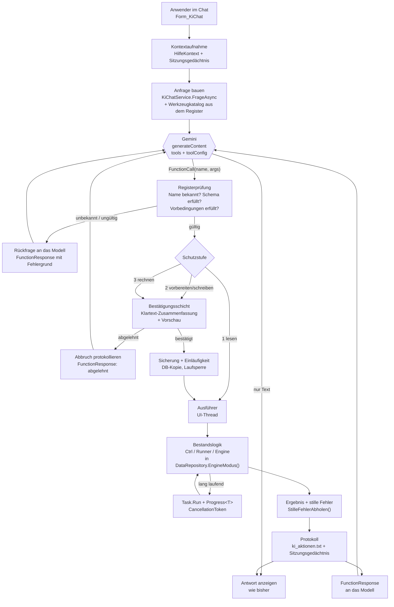

# Fach- und Umsetzungskonzept: KI-Assistent mit Aufgabensteuerung (EPOS-Plan)

Stand: 2026-08-20, Rev. 2 ·
Auftraggeber: Philipp (INEKON) ·
Auftrag wörtlich: *„Erstelle ein Konzept, wie ich den bestehenden Chatbot erweitern kann, um Aufgaben zu steuern."* ·
Grundlage: Prüfung des Bestands im Klon `Documents\WP-Plan` (Commit `6b63f63`, Arbeitsbaum sauber) und der
Paket-Metadaten von `Mscc.GenerativeAI` 3.1.0 im NuGet-Cache.

> **Rev. 2 (20.08.2026).** Auftrag wörtlich: *„Formularausfüllen und Werte setzen sowie Aktionen ausführen soll
> möglich sein. Auch sollen die Parameter für die Dialoge gefunden werden — und auch erklärt werden können. Es
> soll eine zusätzliche Sicherheit zum Setzen von Werten eingeführt werden, die vom Benutzer bestätigt werden
> muss und die vom Entwickler auch abgeschaltet werden kann."* Das kehrt die Festlegung aus 9.5 um; die
> Ausgestaltung steht in **Kapitel 11** (Formularsteuerung, Feldsicherung, Etappe 3b). Belegstellen der Rev. 2
> sind gegen den Arbeitsbaum vom 20.08.2026 geprüft (nach Etappe 3; `KiRiegel`, Bestätigungsschicht und drei
> Schreibaktionen liegen bereits im Code).
>
> **Abnahmerunde 20.08.2026:** Grenzen (11.7) vom Auftraggeber bestätigt. Ergänzender Auftrag wörtlich:
> *„Setze in die Dialoge einen dezenten Button (oder ähnliches), um den KI-Assistenten aufzurufen."* —
> ausgestaltet in **11.8** (Aufrufknopf). Im selben Zug vollständig abgenommen („setze um wie vorgeschlagen"):
> Blockbestätigung (11.5), Befehlszeilenschalter als Entwicklerkanal (11.5, damit festgelegt), Reihenfolge
> 3b vor Etappe 4 (11.6) und die Startmasken (11.6). **Umsetzung der Etappe 3b beauftragt** (zurückgestellt
> bis zur Abnahme des Umsetzungskonzepts `Konzept_Etappe3b_Formularsteuerung.md`).
>
> **Ergänzung 20.08.2026,** Auftrag wörtlich: *„Alle KI-Beschriftungen/Aufrufe sollen per Konfiguration
> ausgeblendet werden können. Das Symbol ändert sich dann auf Hilfe (Symbol/Text, analog zu KI)."* —
> ausgestaltet in **11.9** (Hilfe-Betrieb).

> **Belegregel.** Jede Aussage über den Bestand ist mit `Datei:Zeile` belegt; Pfade ohne Präfix liegen unter
> `WindowsFormsApplication1\`, Pfade mit Präfix `SpeicherEngine\` bzw. `Referenzlauf\` im jeweiligen
> Schwesterprojekt. Wo etwas nicht am Code verifizierbar war, steht ausdrücklich **(Annahme)** bzw. die Quelle
> (Anbieterdokumentation, WinForms-Verhalten). Es wurde ausschließlich gelesen — kein Code geändert, kein
> Schreibzugriff auf `C:\ProgramData\EPOS_PLAN\Kenndaten.accdb`, kein Commit.

---

## 0. Kurzfassung der vier Kernfragen

| # | Frage | Antwort | Beleg |
|---|---|---|---|
| 1 | Unterstützt `Mscc.GenerativeAI` 3.1.0 Function Calling? | **Ja, vollständig** — `FunctionDeclaration`, `Tool.FunctionDeclarations`, `ToolConfig.FunctionCallingConfig` (Modi `Auto`/`Any`/`None`/`Validated`), `Part.FunctionCall`, `Part.FunctionResponse`, `GenerateContentRequest.Tools`. Zusätzlich `ParametersJsonSchema` (JSON-Schema statt OpenAPI-Objekt). Das Paket ist **referenziert, aber in keiner einzigen `.cs`-Datei benutzt**. | `WindowsFormsApplication1.csproj:110`; `Mscc.GenerativeAI.xml` im NuGet-Cache (Typen unter `Mscc.GenerativeAI.Types.*`); Grep `Mscc` über alle `*.cs`: kein Treffer |
| 2 | Welche Daten verlassen heute den Rechner? | Frage im Klartext, die letzten vier Verlaufszeilen, bis zu vier Hilfeabschnitte **und die Kontextzeile** — letztere enthält den **Titel des aktiven Fensters**, und mehrere Fenstertitel führen Projekt-, Anlagen- und Gerätenamen. Die Zusicherung „keine Projekt- oder Kundendaten" im Code und in der Oberfläche ist damit **sachlich nicht gedeckt**. | `KiChatService.cs:141`, `:253-258`, `:181`; `HilfeKontext.cs:85`; `Views\Bericht\UcBericht.cs:80`; `Views\Wirtschaftlichkeit\Form_WirtschaftlichkeitVerlauf.cs:158`; Zusicherung: `KiChatService.cs:33-35`, `Views\Help\Form_KiChat.cs:191-192`, `:358-360` |
| 3 | Wo liegt der API-Schlüssel? | **Klartext in der Registry** `HKCU\Software\wp-plan\GeminiApiKey` und zusätzlich **als Query-Parameter in der Aufruf-URL**. Der Hausbestand kann DPAPI (Lizenzmodul), nutzt es hier aber nicht. Daneben liegt eine **versionierte** Datei `api_gemini.txt` in der Repo-Wurzel. | `KiChatService.cs:39-41`, `:83-87`, `:448-472`, `:309`, `:367-368`; DPAPI-Vorbild `Allgemein\Lizenz\LizenzManager.cs:257`, `:270`; `api_gemini.txt` von `git ls-files` erfasst, kein `.gitignore`-Treffer |
| 4 | Wie werden Aktionen auf den UI-Thread marshalliert? | Über den bestehenden `await`-Rückweg (der Chat läuft schon so) plus das Hausmuster `Progress<T>` + `Task.Run`. Die eigentliche Härte liegt woanders: `DataRepository.EngineModus` und `SimulationProtokoll.Aktuell` sind **prozessweite** Zustände, deren Invariante allein von der **Modalität** der Bestandsfenster getragen wird — ein modeloses Chatfenster, das Läufe startet, bricht sie. | `Views\Help\Form_KiChat.cs:262`; Muster `Views\Stromspeicher\Form_SpeicherOptimierung.cs:35-48`, `:583-638`; Invariante `Allgemein\DataRepository.cs:48-58` |

**Empfehlung in einem Satz:** Function Calling über das bereits bezahlte Paket, ein **deklaratives Aktionsregister**
als einzige Wahrheit über das, was der Assistent kann, eine **Ausführungsschicht ohne UI-Bezug** (damit testbar) und
eine **harte Bestätigungsschicht** vor jedem Schreibzugriff — die Absichtserkennung darf nie mehr sein als ein
Vorschlag, den der Anwender im Klartext bestätigt.

---

## 1. Ziel und Abgrenzung

### 1.1 Was der Assistent können soll

Der Assistent soll vom reinen Antwortgeber zum **Bediener zweiter Hand** werden: Er kennt den Zustand des
Programms, kann Fragen zu **Daten** beantworten („welche Varianten hat das Projekt?"), Wege abkürzen („öffne die
Speicherauslegung"), vorbereitete Arbeitsschritte **vorschlagen** und nach Bestätigung **ausführen**
(„lege Variante ‚WP + PV' an", „rechne die Simulation", „erstelle den Variantenbericht").

Drei Nutzenversprechen, an denen sich der Ausbau messen lassen muss:

1. **Suchzeit sparen.** Die Anwendung führt 92 Controller und 185 Views (`WindowsFormsApplication1\CLAUDE.md`);
   ein Anwender, der weiß *was* er will, aber nicht *wo* es steht, ist die häufigste Verlustquelle.
2. **Mehrschrittiges verketten.** „Variante anlegen, Komponente übernehmen, simulieren, vergleichen" sind heute
   vier Masken mit je eigener Vorbedingung.
3. **Fehlbedienung abfangen.** Der Assistent kennt die Vorbedingungen aus dem Register und sagt *vorher*, was
   fehlt — statt dass eine MessageBox hinterher meldet, es habe nicht geklappt.

### 1.2 Was der Assistent ausdrücklich nicht darf

Diese Liste ist **Teil der Architektur**, nicht nur eine Absichtserklärung: Was hier steht, wird nicht als Aktion
deklariert und ist damit für das Sprachmodell schlicht nicht sichtbar.

| Verbot | Begründung / Beleg |
|---|---|
| **Nichts löschen** — kein Projekt, keine Variante, kein Datensatz, keine Datei | Es gibt keinen Undo-Stapel und kein automatisches Backup (4.4). Betroffene Bestandsmethoden bleiben undeklariert: `Controller\ProjektCtrl.cs:87`, `Controller\VariantenCtrl.cs:181`, `Controller\StromspeicherVarianteCtrl.cs:243`, `Allgemein\DataRepository.cs:345` |
| **Keine Katalogsätze überschreiben** (`_STAMM`-Tabellen, Feld `ReadOnly`) | Der Auslieferungskatalog ist die gemeinsame Grundlage aller Projekte; `ReadOnly = TRUE` markiert ihn (`CLAUDE.md` der Wurzel). Das Übersteuerungsflag `SchreibschutzUebergehen` (`Controller\BHKWStammCtrl.cs:157`) darf der Assistent **nie** setzen — es ist laut Doku (`:152-156`) an eine ausdrückliche Anwenderbestätigung gebunden |
| **Keine Simulation, Optimierung oder Berichtserzeugung ohne Rückfrage** | Diese Läufe schreiben (`SimulationRunner.SimuliereUndSpeichere`, `Allgemein\Simulation\SimulationRunner.cs:766`, ersetzt den Vorgängerlauf) und dauern lange; `Views\Varianten\ProjektvergleichBericht.cs:85` simuliert sogar eine ganze Projektgruppe neu |
| **Keine Schemaänderungen, keine Migration, keine DDL** | Ausrollweg ist ausschließlich die versionierte `SchemaMigration` (`Allgemein\Update\SchemaMigration.cs:74`, `ZIEL_VERSION = 17` in `:77`), angestoßen einmal je Programmstart in `Program.cs:73` |
| **Keine Einstellungen der Anwendung ändern** (DB-Pfad, Sprache, Lizenz, KI-Schlüssel, Tageslimit) | Prozessweite Wirkung; `Program.cs:20-22`, `Allgemein\Lizenz\LizenzManager.cs:153` |
| **Keine Dateien schreiben außer an vom Anwender bestätigten Pfaden** | Berichte gehen heute über einen `SaveFileDialog` (`Views\Bericht\UcBericht.cs:446`); das bleibt so |
| **Keine freie SQL-Ausführung** | Kein „führe diese Abfrage aus"-Werkzeug. Jeder Lesezugriff läuft über eine benannte, parametrisierte Aktion |
| **Kein `Tool.ComputerUse`, kein `Tools.AddFunction(Delegate)`, kein Automatic Function Calling** | Das Paket bietet all das an (`Mscc.GenerativeAI.Types.Tool.ComputerUse`, `Tools.AddFunction(System.Delegate)`, `Tools.Invoke(String,Object)`, `AutomaticFunctionCallingConfig`) — es würde die Bestätigungsschicht umgehen und auf einem beliebigen Thread ausführen. Ausdrücklich abschalten (3.3) |

### 1.3 Abgrenzung zum heutigen Hilfe-Chat

Der Hilfe-Chat bleibt unverändert erhalten und bleibt der Rückfallweg: Ohne API-Schlüssel arbeitet das Fenster als
lokale Hilfesuche weiter (`Views\Help\Form_KiChat.cs:196-203`, Schaltfläche „Nur suchen" `:145`). Die
Aufgabensteuerung ist ein **zusätzlicher** Modus, keine Ablösung.

---

## 2. Ist-Stand

### 2.1 Die heutige Kette

```
F1 / Menü "Hilfe-Assistent (KI)"      MDIMainForm.cs:222-275 (Einbindung), :229, :267 (Aufruf)
   └─ Form_KiChat.Oeffnen(besitzer)    Views\Help\Form_KiChat.cs:425-434
        ├─ HilfeKontext.Beschreibung() Allgemein\KI\HilfeKontext.cs:55  → Kontextzeile
        └─ FrageStellen(mitKi)         Views\Help\Form_KiChat.cs:222
             ├─ HilfeWissen.Suchen()   Allgemein\KI\HilfeWissen.cs:95   → bis 4 Abschnitte (lokal)
             └─ KiChatService.FrageAsync(frage, kontext, verlauf)       Allgemein\KI\KiChatService.cs:141
                  ├─ Cache-Treffer?    :158-170   (Schlüssel = kontext + "||" + frage)
                  ├─ Tageslimit?       :172-178   (Registry, Vorgabe 50, :72)
                  ├─ PromptBauen()     :213-263
                  └─ AufrufenAsync()   :270  →  AufrufenMitModellAsync()  :365
                        POST https://generativelanguage.googleapis.com/v1beta/models/{modell}:generateContent?key=…
```

**Merkmale des Dienstes** (`Allgemein\KI\KiChatService.cs`):

| Merkmal | Beleg |
|---|---|
| `public static class` — keine Instanz, kein Zustand außer Cache und Registry | `:37` |
| Anbindung über **rohes `HttpClient`/REST**, nicht über das referenzierte Paket | `:74`, `:365-395`; Grep `Mscc` über `*.cs`: kein Treffer |
| Ein Aufruf je Frage, kein Mehrschritt, keine Werkzeuge im Request | Request-Objekt `:370-381` kennt nur `contents` und `generationConfig` |
| `temperature = 0.2`, `maxOutputTokens = 400` | `:378-379`, Konstante `:71` |
| Modellkandidaten mit automatischer Ersatzsuche über `models`-Endpunkt | `:53-59`, `:270-288`, `:304-362` |
| Antwort-Cache unbegrenzt und ohne Verfall, prozesslebenslang | `:77`, `:199` |
| Tageszähler in `HKCU` — bequem, aber keine Sicherheitsgrenze (vom Anwender editierbar) | `:42-44`, `:126-131` |
| Fehler kommen als Text in `KiAntwort.Fehler`, nicht als Exception | `:12-20`, `:201-204` |

### 2.2 Wissensbasis `HilfeWissen`

18 fest eingebaute Abschnitte (`Allgemein\KI\HilfeWissen.cs:145-…`, gezählt über `new WissensAbschnitt(`), optional
ergänzt um den WordPress-Hilfecache `help_cache.json` aus `%AppData%\<ProductName>` (`:62-82`, erzeugt von
`Allgemein\Hilfe\HelpCatalog.cs:52`, `:157`).

Das Retrieval ist eine reine Stichwortzählung (`:95-129`): Titel dreifach, Bereich doppelt, Inhalt einfach, plus
2,5 Punkte Bonus, wenn der Bereichsname in der Kontextzeile vorkommt (`:120`). Wörter unter vier Zeichen werden
verworfen (`:113`) — „PV", „WP", „SPK", „BHKW" fallen damit teilweise durch das Raster. Kein Stemming, keine
Synonyme, keine Einbettungen.

### 2.3 Kontextverfolgung `HilfeKontext`

`public static class` mit drei Feldern (`Allgemein\KI\HilfeKontext.cs:17-23`): gesetzter Bereichsname, Detailliste,
Automatik. `Beschreibung()` (`:55`) baut daraus eine Zeile aus

* **Bereich** — entweder ein per `SetzeBereich` gesetzter Text (`:29`) oder, als Rückfall, **`Form.ActiveForm.Text`**,
  also der Titel des aktiven Fensters (`:79-88`);
* **Registerkarte** — die Beschriftungen der gewählten Tabs, auch verschachtelt (`:94-123`);
* **Details** — frei gesetzte Zusatzangaben, laut Doku für Gerätebezeichnungen gedacht („Wärmepumpe: CS7800iLW 12",
  `:22`).

**Nur drei Masken im ganzen Programm setzen den Bereich aktiv:**
`Views\Simulation\Form_QuelleErdreich.cs:215`, `Views\Simulation\Form_Simulation_Config.cs:156`,
`Views\Simulation\Form_Simulation_Detail.cs:367`. Überall sonst greift die Fenstertitel-Automatik.

### 2.4 Paketlage: Function Calling ist vorhanden und ungenutzt

`Mscc.GenerativeAI` 3.1.0 ist referenziert (`WindowsFormsApplication1.csproj:110`), zusammen mit den dafür
nachgezogenen `Microsoft.Extensions.Http`/`.Logging` 10.0.3 (`:118-120`). Das Paket liefert `lib\net8.0` und passt
damit zu `net8.0-windows`/x86 (reines verwaltetes Paket, keine nativen Anteile).

Belegte Typen und Mitglieder aus `Mscc.GenerativeAI.xml` (NuGet-Cache, `lib\net8.0`):

| Typ / Mitglied | Bedeutung |
|---|---|
| `Types.FunctionDeclaration` mit `Name`, `Description`, `Parameters`, **`ParametersJsonSchema`**, `Behavior` | Deklaration einer aufrufbaren Fähigkeit; `Name` max. 64 Zeichen, `[a-zA-Z0-9_:.-]` |
| `Types.Tool.FunctionDeclarations` | Liste der Deklarationen; ausdrücklich: „The model or system does **not** execute the function. Instead the defined function may be returned as a `FunctionCall` with arguments to the client side for execution." |
| `Types.ToolConfig.FunctionCallingConfig`, `Types.FunctionCallingConfigMode` = `Auto` / `Any` / `None` / `Validated` / `ModeUnspecified` | Steuert, ob und welche Funktionen das Modell aufrufen darf |
| `Types.FunctionCall`, `Types.FunctionResponse`, `Types.Part.FunctionCall`, `Types.Part.FunctionResponse` | Hin- und Rückweg im Gesprächsverlauf |
| `Types.GenerateContentRequest.Tools`, `.ToolConfig` | Werkzeuge am selben `generateContent`-Endpunkt, den der Hausdienst bereits anspricht |
| `GenerativeModel.GenerateContent(..., Tools, ToolConfig, ...)`, `Types.ChatSession.SendMessage(..., Tools, ToolConfig, ...)` | Aufrufwege mit Werkzeugen |
| `Types.Tools.AddFunction(System.Delegate)`, `Types.Tools.Invoke(String, Object)`, `Types.AutomaticFunctionCallingConfig` (`Disable`, `MaximumRemoteCalls`, Vorgabe 10) | **Bequemweg, der hier verboten wird** — er ruft Delegaten selbsttätig auf, ohne Bestätigung und ohne Thread-Kontrolle |
| `Types.Tool.ComputerUse`, `.CodeExecution`, `.GoogleSearchRetrieval`, `.FileSearch`, `.GoogleMaps` | Weitere Werkzeugarten — **werden nicht deklariert** |
| `Types.FinishReason.MalformedFunctionCall` | Fehlerfall, den die Ausführungsschicht behandeln muss |

Dass derselbe REST-Endpunkt `tools`/`toolConfig` entgegennimmt, folgt daraus, dass das Paket genau diesen Endpunkt
bedient und `GenerateContentRequest` die Felder trägt. Die exakten JSON-Feldnamen auf der Leitung
(`tools[].functionDeclarations[]`, `toolConfig.functionCallingConfig`) stammen aus der Anbieterdokumentation und
sind **(Annahme)** — sie wurden nicht aus dem Paket-Assembly ausgelesen, weil die Namen dort über eine
Namenskonvention und nicht über Attribute erzeugt werden.

### 2.5 Grenzen des Bestands, die das Konzept tragen muss

| Befund | Beleg | Folge |
|---|---|---|
| **Die Anwendung ist kein MDI, sondern ein Stapel modaler Dialoge.** `MdiParent` wird nirgends gesetzt; es gibt 213 `ShowDialog()`-Aufrufe; das Projektfenster `FormMain` wird modal geöffnet | einzige `MdiParent`-Fundstelle `Allgemein\FensterEinpassung.cs:351` (nur Abfrage); `Controller\MenueCtrl.cs:130`, `:178` | Ein modeloses Chatfenster (`Views\Help\Form_KiChat.cs:433` `frm.Show()`) ist gesperrt, solange ein modaler Dialog läuft; F1 in `MDIMainForm.cs:262-269` erreicht den Anwender **im geöffneten Projekt gar nicht**. *(WinForms-Verhalten: `ShowDialog` deaktiviert die zum Zeitpunkt des Aufrufs sichtbaren Fenster des Threads; später geöffnete, dem modalen Fenster zugeordnete Fenster bleiben bedienbar.)* → 8.5 |
| **Prozessweite Simulationszustände.** `DataRepository._stillTiefe`/`_stilleFehler` und `SimulationProtokoll.Aktuell` gelten für den ganzen Prozess; die Invariante „höchstens ein Lauf" hängt allein an der Modalität | `Allgemein\DataRepository.cs:48-58`, `:60-62`, `:68`, `:77`, `:86`; `Allgemein\Simulation\SimulationProtokoll.cs:71`, `:88`, `:101` | Der Assistent muss Läufe **einläufig** serialisieren (3.4) |
| **Genau eine Fehlerweiche** in `DataRepository`: MessageBox oder stille Sammlung | `Allgemein\DataRepository.cs:131`, `:152`, `:156`; gesetzt in `SimulationRunner.cs:66`, `:772`, `SimulationControl.cs:329`, `StromspeicherSimCtrl.cs:628`, `:1014`, `StromPreisCtrl.cs:154`, `Allgemein\Wirtschaftlichkeit\GesetzKatalog.cs:220` | Assistentenaktionen laufen in `EngineModus()` und holen die Meldungen mit `StilleFehlerAbholen()` ab — statt Dialoge zu erzeugen, die niemand sieht |
| **Globaler Rechenzustand** in `BhkwPlan`: `_prevRoomTemp` überlebt Tagesaufrufe, Rücksetzung nur über `ResetState()` | `Allgemein\BhkwPlan.cs:31`, `:39-47` | Kein zweiter Rechenlauf parallel; nach Abbruch zurücksetzen |
| **Kein Undo, kein automatisches Backup** | Transaktionen nur controllerlokal (`Allgemein\DataRepository.cs:308`); `DB-Backup\` ist manuell (`CLAUDE.md` der Wurzel); Grep nach `File.Copy`+`.accdb` im App-Projekt: nur `Referenzlauf\DbUmgebung.cs:74` | Sicherungspflicht vor Schreibaktionen (4.4) |
| **Kein Logging** | keine Logger-Klasse; 175 `Console.WriteLine` in einem `WinExe` — also unsichtbar; einziges Dateiprotokoll: `migration_protokoll.txt` (`Allgemein\Update\SchemaMigration.cs:331`, `:3479-3488`) | Eigener Protokollkanal nötig (4.6) |
| **`LizenzManager.DarfSchreiben()` existiert, wird aber nirgends aufgerufen** | Definition `Allgemein\Lizenz\LizenzManager.cs:140`; repo-weiter Grep: nur die Definition; offener Punkt in `EPOS-Plan_Lizenzierung_Umsetzungsstand.md` | Der Assistent ist der **erste** Konsument und muss die Prüfung mitbringen (4.5) |
| **Kein UI-Testprojekt** | 6 `.csproj` im Repo; `SpeicherEngine.Tests` testet ausschließlich die UI-freie Engine und referenziert das App-Projekt bewusst nicht (`SpeicherEngine.Tests\SpeicherEngine.Tests.csproj:9-11`) | Testbarkeit erzwingt den Projektschnitt aus 3.7 |

---

## 3. Zielarchitektur

### 3.1 Überblick

Fünf neue Bausteine, alle unter `Allgemein\KI\`, plus eine neue UI-freie Bibliothek für den testbaren Kern (3.7).
Der Bestand wird **nicht umgebaut** — die Ausführungsschicht ruft vorhandene Controller so auf, wie es die
Bestandsformulare auch tun.



### 3.2 Aktionsregister

**Prinzip: eine Deklaration, drei Verwendungen.** Aus demselben Objekt entstehen (a) die
`FunctionDeclaration` für das Modell, (b) die Parameterprüfung in C#, (c) der Klartext für die Bestätigung und das
Protokoll. Damit kann das Register nicht auseinanderlaufen — die häufigste Fehlerquelle solcher Schichten.

```csharp
// Allgemein/KI/Aktionen/KiAktion.cs  (Entwurf)
public sealed class KiAktion
{
    public string Name;                 // "variante_anlegen"  -> FunctionDeclaration.Name, max. 64, ASCII
    public string Zweck;                // eine Zeile, deutsch, für das Modell UND die Bestätigung
    public Schutzstufe Stufe;           // Lesen | Schreiben | Rechnen
    public KiParameter[] Parameter;     // Name, Typ, Pflicht, Wertebereich, Erläuterung
    public Func<KiAufruf, string> Vorbedingung;   // null oder Klartextgrund, warum es gerade nicht geht
    public Func<KiAufruf, string> Vorschau;       // "Ich würde X anlegen" - schreibt nichts
    public Func<KiAufruf, KiErgebnis> Ausfuehren; // der eigentliche Aufruf des Bestands
    public string Andockpunkt;          // "VariantenCtrl.AnlegenAusStamm" - nur fürs Protokoll
}

public enum Schutzstufe { Lesen = 1, Schreiben = 2, Rechnen = 3 }
```

Regeln:

* **Nur benannte Aktionen.** Kein generisches „SQL ausführen", kein „Methode X per Reflexion aufrufen".
* **Parameter sind primitiv** (Zahl, Text, Wahrheitswert, Aufzählung) oder **IDs, die aus einer Leseaktion stammen**.
  Freitext, der in die Datenbank geschrieben wird, ist auf Bezeichner beschränkt und wird gegen die Regeln des
  Bestands geprüft (z. B. `VariantenCtrl.ProjektnameExistiert`, `Controller\VariantenCtrl.cs:90`).
* **Deutsche Persistenzwerte bleiben eingefroren.** Enum-Parameter, die auf DB-Werte abbilden, nehmen ihre
  zulässigen Werte aus `Allgemein\DbWerte.cs` — nie aus dem Modelltext (Drei-Schichten-Regel,
  `WindowsFormsApplication1\CLAUDE.md`).
* **Kulturregel:** Zahlen aus dem Modell kommen als JSON-Zahlen, also invariant. Nur die *Anzeige* im Chat
  formatiert mit `CultureInfo.CurrentCulture`.
* **JSON-Schema statt handgeschriebener Prüfung.** `JsonSchema.Net` 7.3.4 und `JsonSchema.Net.Generation` 5.0.4 sind
  bereits referenziert (`WindowsFormsApplication1.csproj:107-108`) und praktisch ungenutzt — sie erzeugen aus dem
  Parametertyp das Schema für `FunctionDeclaration.ParametersJsonSchema` und prüfen die Antwort gegen dasselbe
  Schema. Keine neue Abhängigkeit.

### 3.3 Absichtserkennung: zwei Wege im Vergleich

| Kriterium | **A — Function Calling** (`Tools` + `ToolConfig`) | **B — strukturierte JSON-Antwort** (Schema im Prompt, Parser in C#) |
|---|---|---|
| Verfügbarkeit | Im referenzierten Paket vollständig vorhanden (2.4); am REST-Endpunkt über `tools` (Feldnamen: Annahme) | Funktioniert mit dem heutigen Aufrufcode ohne jede Änderung am Transport |
| Zuverlässigkeit der Struktur | Hoch — das Modell füllt ein deklariertes Schema; Fehlerfall ist als `FinishReason.MalformedFunctionCall` benannt | Mittel — Modelle rahmen JSON gern in Prosa oder Codezäune; braucht Toleranzparser |
| Mehrschritt (Aktion → Ergebnis → Folgeaktion) | Vorgesehen: `FunctionResponse` geht als Teil des Verlaufs zurück (`Types.Part.FunctionResponse`) | Von Hand zu bauen: Ergebnis muss als Text in den nächsten Prompt |
| Steuerbarkeit | `FunctionCallingConfigMode.None` (nur reden), `Auto`, `Any` (erzwungen) — pro Anfrage umschaltbar | Nur über Prompt-Formulierung |
| Modellbindung | Braucht ein Modell mit Werkzeugunterstützung — die heutige Kandidatenliste beginnt bei `…flash-lite` (`KiChatService.cs:53-59`); die automatische Ersatzsuche (`:304-362`) filtert **nicht** auf Werkzeugfähigkeit | Läuft mit jedem Textmodell, auch mit dem günstigsten |
| Kosten | Der Werkzeugkatalog geht bei **jeder** Anfrage mit (bei 20 Aktionen grob 1 500–2 500 Zeichen ≈ 400–600 Token, geschätzt) | Gleiches Problem — das Schema muss ebenfalls im Prompt stehen |
| Aufwand | M — Transport auf das Paket umstellen oder `tools` in den vorhandenen JSON-Aufbau ergänzen | S — Parser plus Validierung |
| Portabilität auf ein lokales Modell | Gering: `Mscc.GenerativeAI` spricht Gemini | Hoch: JSON-Vertrag ist anbieterneutral |

**Empfehlung: Weg A als Hauptweg, Weg B als eingebauter Rückfall — beide hinter derselben Schnittstelle.**

Begründung: Der Mehrschrittfall („welche Varianten gibt es?" → Ergebnis → „dann nimm die zweite") ist der
eigentliche Nutzen, und er ist in A vorgesehen statt nachgebaut. Der Rückfall B kostet wenig, weil Register,
Validierung, Bestätigung und Ausführung ohnehin gemeinsam genutzt werden — es unterscheidet sich nur, **wie** aus
Text ein `KiAufruf` wird. B trägt außerdem drei reale Fälle: ein Modell ohne Werkzeugunterstützung, der Betrieb
hinter einem Proxy, der `tools` nicht durchreicht, und ein späterer Wechsel auf ein lokales Modell (4.2).

Verbindliche Festlegungen für Weg A:

1. `ToolConfig.FunctionCallingConfig.Mode = Auto`; **niemals `Any`** (das würde einen Aufruf erzwingen, auch wenn
   der Anwender nur eine Frage gestellt hat).
2. `AutomaticFunctionCallingConfig.Disable = true` — der Client führt aus, nicht das SDK.
3. `Tools.AddFunction(Delegate)` und `Tools.Invoke(...)` werden **nicht** benutzt; Deklarationen entstehen aus dem
   Register, die Ausführung aus dem `Ausfuehren`-Delegaten **nach** Bestätigung.
4. Höchstens **eine** Aktion je Anwenderäußerung. Liefert das Modell mehrere `FunctionCall`-Teile, wird die erste
   genommen und der Rest als Vorschlag im Klartext angeboten.
5. Höchstens **drei** Modellrunden je Äußerung (Aufruf → Ergebnis → Antwort, plus eine Korrekturrunde). Danach
   Abbruch mit Klartextmeldung — schützt vor Schleifen und vor dem Tageslimit.
6. Die Modellwahl bekommt ein Kriterium „werkzeugfähig". Konkret: die Kandidatenliste in `KiChatService.cs:53-59`
   wird um die Angabe erweitert, und `ModellErmittelnAsync` (`:304`) filtert zusätzlich auf ein Modell, das
   `generateContent` **mit** Werkzeugen beherrscht. Ob die Modell-Liste des Anbieters dieses Merkmal ausweist, ist
   **(Annahme)** und in Etappe 2 zu prüfen; andernfalls bleibt es bei einer gepflegten Positivliste.

### 3.4 Ausführungsschicht

Die Ausführungsschicht ist der einzige Ort, an dem der Assistent den Bestand berührt. Ihr Vertrag folgt genau dem
Muster, das die Speicheroptimierung bereits schriftlich festgelegt hat
(`Views\Stromspeicher\Form_SpeicherOptimierung.cs:35-48`, `:577-581`):

| Phase | Thread | Regel |
|---|---|---|
| Parameter prüfen, Vorbedingungen abfragen | UI-Thread | Reines Lesen, kurze Abfragen |
| Datenbankzugriff (Lesen und Schreiben) | **UI-Thread** | `DataRepository`-Zustände sind prozessweit und nicht threadgebunden (`Allgemein\DataRepository.cs:48-58`) |
| Reine Rechnung (Optimierung, Peak-Shaving, Kapitalwert) | `Task.Run` | Nur Methoden ohne DB-Zugriff — im Bestand ausdrücklich getrennt: `StromspeicherSimCtrl.FuehreOptimierungAus` (`Controller\StromspeicherSimCtrl.cs:571`) gegenüber `BereiteOptimierungVor` (`:536`) |
| Fortschritt melden | von Hintergrund nach UI | `IProgress<T>`, auf dem UI-Thread erzeugt — dann marshallt `Progress<T>` selbst (`Form_SpeicherOptimierung.cs:624-628`); kein `Invoke` von Hand |
| Anzeige, Rückmeldung | UI-Thread | Nach `await` setzt der `SynchronizationContext` dort fort |

Weil das Chatfenster seine Anfrage bereits aus einem UI-Ereignis heraus `await`-et
(`Views\Help\Form_KiChat.cs:143`, `:262`), landet die Fortsetzung ohne Zutun wieder auf dem UI-Thread. Ein
`Control.Invoke` ist nur nötig, wenn eine Aktion selbst einen Hintergrund-Task startet — dafür gilt das Muster
oben. Das Handmuster `InvokeRequired`/`Invoke` existiert im Bestand nur vereinzelt
(`Views\Kosten\ucKostenItem.cs:89-91`) und wird nicht zum Vorbild genommen.

**Vier zusätzliche Pflichten der Ausführungsschicht:**

1. **Einläufigkeit.** Ein prozessweiter Schalter (`SemaphoreSlim(1,1)` oder einfaches `Interlocked`-Flag) verhindert,
   dass eine Assistentenaktion startet, während ein Simulations-, Berichts- oder Optimierungslauf läuft — und
   umgekehrt, dass zwei Assistentenaktionen sich überlappen. Grund: `DataRepository._stillTiefe`,
   `SimulationProtokoll.Aktuell`, `BhkwPlan._prevRoomTemp` (`Allgemein\BhkwPlan.cs:44`) sind prozessweit. Ist die
   Sperre belegt, antwortet der Assistent im Klartext („es läuft gerade eine Simulation") statt zu warten.
2. **Modalitätsprüfung.** Vor jeder Aktion prüfen, ob gerade ein modaler Dialog offen ist; wenn ja, keine Aktion,
   die Fenster öffnet oder in dieselben Daten schreibt. Erkennung über `Application.OpenForms` (Hausmuster, u. a.
   `Views\Stromspeicher\Form_Stromspeicher.cs:103`) plus `Form.ActiveForm.Modal`.
3. **Dialogfreiheit.** Jede Aktion läuft in `using (DataRepository.EngineModus())` (`Allgemein\DataRepository.cs:77`)
   und holt danach `StilleFehlerAbholen()` (`:86`) ab. So erscheint keine MessageBox hinter einem Chatfenster, und
   die Meldungen kommen im Chat an. Verschachtelung ist zulässig (`:44-46`), der Runner setzt den Modus ohnehin
   selbst (`SimulationRunner.cs:66`).
4. **Abbruch.** Stufe-3-Aktionen bekommen eine `CancellationTokenSource`; der Chat zeigt „Abbrechen". Bei Abbruch
   `BhkwPlan.ResetState()` (`Allgemein\BhkwPlan.cs:47`) aufrufen, bevor der nächste Lauf startet.

### 3.5 Bestätigungsschicht

Ein `KiAufruf` der Stufen 2 und 3 wird **nie** direkt ausgeführt. Ablauf:

1. **Vorschau erzeugen** (`Vorschau`-Delegat) — sie schreibt nichts. Wo der Bestand einen Trockenlauf anbietet,
   wird genau der genutzt: `KomponentenUebernahmeCtrl.Planen` liefert Anlegen/Gleichziehen/Entfernen samt
   `Klartext` (`Controller\KomponentenUebernahmeCtrl.cs:167`), `MerkmalUebernahmeCtrl.Pruefe` liefert einen Befund
   mit `Moeglich` (`Controller\MerkmalUebernahmeCtrl.cs:101`), `KostenPositionCtrl.Pruefe` eine Abweichung
   (`Controller\KostenPositionCtrl.cs:314`).
2. **Klartext-Zusammenfassung im Chat**, immer nach demselben Muster:
   *Was* geschieht, *woran* (Projekt/Variante mit Namen und ID), *womit* (Parameterwerte), *was danach anders ist*
   und *ob es rückholbar ist*.
3. **Ausdrückliche Bestätigung** durch Schaltflächen im Chatfenster („Ausführen" / „Abbrechen"), **nicht** durch
   getippte Zustimmung. Begründung: Ein getipptes „ja" ist wieder Modellinterpretation; ein Klick ist es nicht.
4. **Ein Klick gilt für einen Aufruf.** Keine Sammelbestätigung, kein „ab jetzt immer", kein Ablaufmodus, in dem
   mehrere Schreibaktionen hintereinander ohne Rückfrage laufen. (Ob es später eine ausdrückliche Ausnahme für
   Stufe 3 geben soll, ist offene Entscheidung 4 in Kapitel 9.)
5. **Verfall.** Eine Vorschau, die älter als eine Minute ist oder auf die eine andere Aktion folgte, wird verworfen
   und neu erzeugt — sonst bestätigt der Anwender einen Zustand, den es nicht mehr gibt.

### 3.6 Rückmeldung und Protokoll

* **In den Chat** geht ein kurzer Ergebnistext aus dem `KiErgebnis` (Zahl der geänderten Zeilen, neue ID, Dauer,
  Dateipfad) plus alle Meldungen aus `StilleFehlerAbholen()` und — bei Rechenläufen — die Hinweise und Warnungen
  aus `SimulationProtokoll` (`Allgemein\Simulation\SimulationProtokoll.cs:111-121`, Anzeigehilfen `:248`, `:274`).
* **An das Modell** geht dasselbe Ergebnis als `FunctionResponse`, aber **gekürzt und anonymisiert** (4.2): IDs und
  Zahlen ja, Namen nur, wenn der Anwender die Weitergabe erlaubt hat.
* **In die Protokolldatei** geht jede *versuchte* Aktion — auch abgelehnte und fehlgeschlagene. Format je Zeile:
  Zeitstempel, Aktionsname, Stufe, Parameter, Projekt-ID, Entscheidung (ausgeführt/abgelehnt/abgebrochen),
  Ergebnis, Dauer. Ablage nach dem Vorbild des Migrationsprotokolls: Datei neben der Datenbank, UTF-8 mit
  Vorspann, Schreibfehler still verschlucken (`Allgemein\Update\SchemaMigration.cs:331`, `:3465-3488`) —
  vorgeschlagener Name `ki_aktionen.txt`.

### 3.7 Dateien und Projektschnitt

| Ort | Inhalt | Warum dort |
|---|---|---|
| **Neu: `KiKern\` (Klassenbibliothek, `net8.0`, AnyCPU, keine Referenzen)** | `KiAktion`, `KiParameter`, `KiAufruf`, `KiErgebnis`, `Schutzstufe`, Schemaerzeugung, Parameterprüfung, Antwortparser (Weg B), Bestätigungstext-Erzeugung, Protokollformat | Genau der Schnitt, der `SpeicherEngine` testbar macht: Das Testprojekt kann diese Bibliothek referenzieren, das App-Projekt wegen der COM-Referenzen nicht (`SpeicherEngine.Tests\SpeicherEngine.Tests.csproj:9-11`, MSB4803) |
| **Neu: `KiKern.Tests\` (xunit)** | Tests des Kerns | Vorbild `SpeicherEngine.Tests` (xunit 2.6.2, `net9.0`, 15 Testdateien, 262 `[Fact]`/`[Theory]`) |
| `Allgemein\KI\Aktionen\` (im App-Projekt) | Das gefüllte Register: die `Ausfuehren`- und `Vorbedingung`-Delegaten, die den Bestand aufrufen | Nur hier darf UI- und DB-Code stehen. Die Sichtbarkeitsfrage entfällt: `MenueCtrl`, `WizardCtrl`, `ProjektCtrl`, `TechnikPlanwertCtrl`, `KostenPositionCtrl` sind `internal`, liegen aber in derselben Assembly (5.5) |
| `Allgemein\KI\KiAusfuehrer.cs` | Threading, Einläufigkeit, `EngineModus`, Abbruch, Protokollschreiber | |
| `Allgemein\KI\KiChatService.cs` (erweitert) | Werkzeugkatalog im Request, `FunctionCall` auslesen, `FunctionResponse` zurückschicken, Mehrrundenschleife mit Deckel | Bestehende Datei, bestehende Signatur bleibt für den reinen Hilfefall erhalten |
| `Views\Help\Form_KiChat.cs` (erweitert) | Vorschaublock mit „Ausführen"/„Abbrechen", Fortschrittsbalken, Abbruchknopf, Protokollansicht | |

Das App-Projekt ist SDK-Stil mit impliziten Compile-Elementen (`WindowsFormsApplication1.csproj:1`) — neue Dateien
werden ohne csproj-Pflege übersetzt.

---

## 4. Sicherheits- und Vertrauensmodell

### 4.1 Drei Schutzstufen

| Stufe | Bezeichnung | Verhalten | Bestätigung | Beispiele |
|---|---|---|---|---|
| **1** | **lesen / navigieren** | sofort ausführen, Ergebnis anzeigen | keine | Projektliste, Variantenliste, Kennzahlen, Lastgang prüfen, Maske öffnen |
| **2** | **vorbereiten → schreiben** | erst Vorschau („ich würde X anlegen"), dann Ausführung | **Klick auf „Ausführen"**, je Aufruf | Variante anlegen, Variante aktiv setzen, Komponente übernehmen, Kostenposition setzen |
| **3** | **rechnen / lang laufend** | Vorschau mit Aufwandsangabe, Fortschritt, Abbruch; schreibt in aller Regel auch | **Klick auf „Ausführen"**, je Aufruf | Simulation, Wirtschaftlichkeit, Optimierung, Bericht |

Zwei Grenzfälle sind bewusst geregelt:

* **Maske öffnen** ist Stufe 1, obwohl der Anwender darin anschließend alles ändern kann — die Verantwortung geht
  mit dem Öffnen an ihn über. Die Ausnahme sind Masken, die beim Öffnen selbst schreiben; die kommen nicht ins
  Register.
* **Trockenläufe** (`Planen`, `Pruefe`, `MinimaleSchwelleKw`) sind Stufe 1, weil sie nachweislich nichts schreiben
  — das ist im Bestand jeweils dokumentiert (`Controller\KomponentenUebernahmeCtrl.cs:167`,
  `Controller\MerkmalUebernahmeCtrl.cs:101`).

### 4.2 Datenschutz und Vertraulichkeit

**Was heute tatsächlich hinausgeht.** Der Prompt (`KiChatService.cs:213-263`) enthält:

| Bestandteil | Beleg | Bewertung |
|---|---|---|
| Rollentext, feste Anweisungen | `:218-222` | unkritisch |
| **Kontextzeile** | `:225-231`, erzeugt von `HilfeKontext.Beschreibung()` | **kritisch** — siehe unten |
| bis zu vier Hilfeabschnitte | `:233-245`, Auswahl `:181` | unkritisch (eigene Dokumentation) |
| die letzten vier Verlaufszeilen | `:253-258` | enthält, was der Anwender getippt hat |
| die Frage im Klartext | `:261` | enthält, was der Anwender getippt hat |

Die Kontextzeile ist der eigentliche Befund. `HilfeKontext.AktivesFenster()` liefert `Form.ActiveForm.Text`
(`Allgemein\KI\HilfeKontext.cs:85`), und mehrere Fenstertitel führen Klarnamen:

| Fenstertitel | Beleg |
|---|---|
| „Bericht erstellen — Projekt: *&lt;Stammname&gt;*" | `Views\Bericht\UcBericht.cs:80`, gesetzt in `Views\Bericht\Form_Bericht.cs:43` |
| „Kapitalwert-Verlauf über den Nutzungszeitraum — Stamm: *&lt;Stammname&gt;*" | `Views\Wirtschaftlichkeit\Form_WirtschaftlichkeitVerlauf.cs:158` |
| Wärmequellen-/Senkentitel mit Wärmepumpen- bzw. Anlagennamen | `Views\Simulation\Form_QuelleErdreich.cs:571`, `Form_QuellePufferspeicher.cs:336`, `Form_Quellprofil.cs:170`, `Form_Waermesenke.cs:574` |
| Gerätebezeichnungen über `ErgaenzeDetail` | `Allgemein\KI\HilfeKontext.cs:22`, `:36` |

Die Zusicherung „Es werden keine Projekt-, Kunden- oder Simulationsdaten gesendet" steht wörtlich im Code
(`KiChatService.cs:33-35`), in der Begrüßung (`Views\Help\Form_KiChat.cs:191-192`) und im Einstellungsdialog
(`:358-360`). **Sie ist so nicht haltbar und muss entweder erfüllt oder geändert werden.** Mit
Aufgabensteuerung verschärft sich das zwangsläufig: Aktionsparameter und -ergebnisse *sind* Projektdaten.

**Regelwerk für den Ausbau:**

| Datenklasse | Darf an den externen Dienst? | Umsetzung |
|---|---|---|
| Bedienbegriffe: Maskenname, Registerkarte, Feldbezeichnungen, Hilfetexte | ja | unverändert |
| **Technische Kennwerte ohne Bezug** (kW, kWh, °C, Jahre, Prozent) | ja | unverändert |
| **Bezeichner**: Projekt-, Kunden-, Bearbeiter-, Standort-, Anlagennamen | **nein, im Grundzustand** | **Platzhalterung**: In der Sitzung wird eine Tabelle `Projekt 1 ↔ ID 1042 ↔ „Musterstraße 7"` geführt; nach außen geht „Projekt 1", zurück kommt „Projekt 1", angezeigt wird der echte Name. Das Modell arbeitet mit Platzhaltern und IDs, der Anwender sieht Klartext |
| **Geräte-/Herstellerbezeichnungen** aus dem Katalog | ja (öffentliche Typenbezeichnungen) | unverändert |
| **Datei- und Verzeichnispfade** | nein | nur Dateiname ohne Pfad, oder Platzhalter |
| Datenbankinhalte im Rohzustand (Tabellenzeilen, Ganglinien) | nein | Aktionsergebnisse werden verdichtet: Anzahl, Summe, Extremwerte — nie ganze Reihen |

Zusätzlich:

* **Opt-in je Projekt.** In den Projektstammdaten ein Schalter „KI-Assistent darf Namen dieses Projekts
  übertragen" (Vorgabe: aus). Wo er aus ist, greift die Platzhalterung; wo er an ist, wird der Klarname
  übertragen. Ablage über den regulären Schemaweg (`SchemaMigration`, neue Spalte).
* **Sichtbarkeit statt Vertrauen.** Der Chat bekommt eine Schaltfläche „Was wird gesendet?", die den
  **tatsächlichen** Prompt zeigt, mit dem er gleich hinausgeht. Das ist billig, prüfbar und beendet die Diskussion
  über Zusicherungen im Quelltext.
* **Betriebsmodus wählbar** (offene Entscheidung 1):
  1. *Externer Dienst mit Platzhalterung* (Vorschlag) — Funktionsumfang voll, Aufwand gering.
  2. *Externer Dienst mit kostenpflichtigem Zugang* — der Einstellungsdialog warnt bereits, dass im kostenlosen
     Kontingent die Inhalte zur Produktverbesserung genutzt werden (`Views\Help\Form_KiChat.cs:361-363`). Für den
     produktiven Einsatz ist das die Mindestanforderung.
  3. *Lokales Modell* (z. B. über eine OpenAI-kompatible Schnittstelle auf `localhost`) — kein Datenabfluss,
     aber Hardwarebedarf und deutlich schwächere Werkzeugtreue; nur mit Weg B (3.3) realistisch. Als Option
     offenhalten, nicht als Etappe einplanen.
  4. *Kein externer Dienst* — dann bleibt nur eine regelbasierte Befehlserkennung auf dem Register (Synonymliste
     je Aktion). Deutlich starrer, aber ohne Datenabfluss und ohne laufende Kosten.

### 4.3 API-Schlüssel

**Befund.** Der Schlüssel steht im Klartext in `HKCU\Software\wp-plan\GeminiApiKey` (`KiChatService.cs:39-41`,
Lese-/Schreibweg `:448-472`) und wird zusätzlich **als Query-Parameter an die URL gehängt** (`:309`, `:367-368`).
Query-Parameter landen typischerweise in Proxy- und Serverprotokollen. Die Eingabemaske maskiert die Anzeige
(`Views\Help\Form_KiChat.cs:326` `UseSystemPasswordChar`), die Ablage bleibt Klartext.

Zusätzlich liegt in der Repo-Wurzel `api_gemini.txt` (53 Byte, ein Token, Form eines Google-API-Schlüssels). Die
Datei wird **von keiner Codestelle gelesen** (Grep über `*.cs`), ist aber **von Git erfasst** und **nicht
ignoriert** (`git ls-files` erfasst sie, `git check-ignore` greift nicht; erstmals in Commit `834bf8d`). Das Repo
wird über `GitHub_Sync.bat` nach `origin/main` gepusht (`WindowsFormsApplication1\CLAUDE.md`).

**Sofortmaßnahmen (nicht Teil der Etappen, sondern vorgezogen):**

1. Den Schlüssel beim Anbieter **rotieren** — er ist in der Repository-Historie und damit als kompromittiert zu
   behandeln. *Das ist von Philipp selbst auszuführen.*
2. `api_gemini.txt` aus der Versionierung nehmen und in `.gitignore` aufnehmen.
3. Ablage auf **DPAPI** umstellen — der Hausbestand kann das bereits:
   `ProtectedData.Protect`/`Unprotect` mit `DataProtectionScope.LocalMachine` in
   `Allgemein\Lizenz\LizenzManager.cs:257`, `:270`, `:295`, `:320`. Gleiches Muster, gleicher Ordner
   (`%AppData%\wp-plan`).
4. Den Schlüssel in den **Header** legen (`x-goog-api-key`) statt in die URL. *(Feldname aus der
   Anbieterdokumentation — **Annahme**, in Etappe 1 zu prüfen.)*
5. Für den Mehrplatzbetrieb offenhalten: ein Schlüssel je Arbeitsplatz oder ein zentraler Vermittler. Heute ist es
   ein Schlüssel je Registry-Zweig, also je Windows-Benutzer.

### 4.4 Sicherung und Rückabwicklung

**Ausgangslage.** Es gibt keinen Undo-Stapel für Anwenderaktionen (belegt: die einzigen „Wiederherstellen"-Stellen
sind `TextBox.Undo` in `Program.cs:120-125`, die eng begrenzte Variantensicherung in `Controller\WizardCtrl.cs:553`,
`:558`, `:659` und transaktionslokale Rücknahmen). Transaktionen gibt es controllerlokal über
`DataRepository.BeginTransaction` (`Allgemein\DataRepository.cs:308`, Rollback-Muster `:366-375`), genutzt u. a. in
`ErgebnisCtrl.cs:44`, `ProjektDuplizierenCtrl.cs:167`, `KomponentenUebernahmeCtrl.cs:283`. Ein automatisches
Datenbank-Backup aus der Anwendung heraus existiert **nicht**; `DB-Backup\` sind manuelle Stände.

**Regeln für den Assistenten:**

1. **Sicherungspunkt je Sitzung.** Vor der **ersten** Schreibaktion einer Chatsitzung legt der Ausführer eine
   datierte Kopie der `Kenndaten.accdb` an — nach dem Muster von `Referenzlauf\DbUmgebung.cs:55-78`: prüfen, ob
   eine `.laccdb` existiert, `File.Copy`, Zielordner `DB-Backup\` neben der DB. Schlägt das fehl, werden
   **Schreibaktionen gesperrt**, nicht bloß gewarnt. (Der Ordner `C:\ProgramData\EPOS_PLAN` erlaubt normalen
   Benutzern nur das Anlegen neuer Dateien — genau das reicht für eine Kopie; Randbedingung dokumentiert in
   `CLAUDE.md` der Wurzel.)
2. **Transaktion, wo der Bestand eine anbietet.** Der Assistent erfindet keine eigene Transaktionsklammer über
   mehrere Controller — das wäre neuer, ungetesteter Code an der heikelsten Stelle. Er ruft die Bestandsmethode
   auf, die ihre Transaktion selbst mitbringt (z. B. `KomponentenUebernahmeCtrl.Uebernehmen`,
   `Controller\KomponentenUebernahmeCtrl.cs:231`).
3. **Kein „Rückgängig"-Versprechen.** Die Bestätigung sagt ausdrücklich, ob eine Aktion umkehrbar ist. Umkehrbar
   sind faktisch nur: Variante aktiv setzen (`StromspeicherVarianteCtrl.SetzeAktiv`,
   `Controller\StromspeicherVarianteCtrl.cs:229` — der Vorzustand ist bekannt) und Kostenbeträge
   (`KostenPositionCtrl.SetzeBetragNachId`, `Controller\KostenPositionCtrl.cs:141` — der alte Betrag wird vorher
   mit `LiesBetrag`, `:164`, gelesen und im Protokoll festgehalten). Für diese beiden bietet der Chat eine
   „Zurücknehmen"-Schaltfläche an, die den Vorzustand als **neue, ebenfalls bestätigungspflichtige Aktion**
   schreibt.
4. **Ergebnisse sind ersetzbar, nicht wiederherstellbar.** `SimulationRunner.SimuliereUndSpeichere`
   (`Allgemein\Simulation\SimulationRunner.cs:766`) ersetzt den Vorgängerlauf. Das gehört in die
   Bestätigungszeile: „Der vorhandene Ergebnisstand des Projekts wird überschrieben."

### 4.5 Schreibschutz, Sperren und Rechte

| Sperre | Prüfung | Verhalten des Assistenten |
|---|---|---|
| **`ReadOnly` in `_STAMM`-Tabellen** | `Controller\BHKWStammCtrl.cs:135`, `:144`, Prüfung in `Update` `:165` und `Delete` `:244`; gleiches Muster in `BrauchwasserStammCtrl.cs:73`, `:84`, `:279`, `GebaeudeStammCtrl.cs:57`, `HeizkesselStammCtrl.cs:205`, `:211`, `KlimaregionStammCtrl.cs:81` | Katalogpflege ist gar nicht erst deklariert (1.2). `SchreibschutzUebergehen` (`BHKWStammCtrl.cs:157`) wird nie gesetzt |
| **Lizenz-Lesemodus** | `Allgemein\Lizenz\LizenzManager.cs:140` `DarfSchreiben()`, Status `Lesemodus` `:18` | **Vor jeder Stufe-2- und Stufe-3-Aktion abfragen.** Da die Methode heute keinen einzigen Aufrufer hat, ist der Assistent der erste — und schließt damit nebenbei eine offene Baustelle der Lizenzierung |
| **Simulationssperre nach fehlgeschlagener Migration** | `Allgemein\Update\SchemaMigration.cs:3430` `SimulationGesperrt(out grund)`, geprüft in `SimulationRunner.cs:105`, `SimulationControl.cs:358` | Als Vorbedingung der Rechenaktionen; der Grund geht wörtlich in die Chatantwort |
| **Komponenten-Freischaltung** (Bitmaske) | `Views\Hauptformular\Form_Start.cs:15` `public int status`, Abfragen `:644`, `:695` … | Aktionen zu nicht freigeschalteten Modulen werden gar nicht erst angeboten |
| **Werkzeugwahl je Projekt** (`Tab_Einstellungen.Tool_1..Tool_6`) | `Allgemein\DbWerte.cs:54`, `Controller\KonfigurationCtrl.cs:57`, `:310`, gelesen in `SimulationRunner.cs:145` | wie oben |
| **Datenbank gesperrt / schreibgeschützt** (`.laccdb`, ACL in `C:\ProgramData`) | `CLAUDE.md` der Wurzel, `BETRIEB_Mehrbenutzer_Datenbank.md` | Sicherungskopie schlägt fehl → Schreibaktionen gesperrt (4.4) |

Benutzerrollen im engeren Sinn gibt es nicht — die Software wird als Einzelplatzlizenz überlassen
(`Allgemein\KI\HilfeWissen.cs:155`). Ein Rechtemodell ist deshalb **nicht** zu bauen; die Lizenzstufe ist die
einzige Rechtedimension.

### 4.6 Protokollierung

Jede versuchte Aktion wird protokolliert — Format und Ablage siehe 3.6. Zusätzlich:

* Der Chat zeigt auf Wunsch die letzten Einträge der laufenden Sitzung („Was hast du gemacht?" ist selbst eine
  Stufe-1-Aktion, die aus dem Sitzungsgedächtnis liest).
* Das Protokoll ist **Beweismittel, nicht Debugging-Hilfe**: keine Prompts, keine Modellantworten im Wortlaut, kein
  API-Schlüssel. Nur: wer wollte was, wurde es bestätigt, was ist passiert.
* Bei einem Fehlschlag wandert zusätzlich der Text aus `StilleFehlerAbholen()` hinein — sonst geht die einzige
  Fehlerinformation verloren, weil `FehlerMelden` im Engine-Modus nur auf die (unsichtbare) Konsole schreibt
  (`Allgemein\DataRepository.cs:156`).

---

## 5. Aktionskatalog

Legende: **Stufe** nach 4.1 · **Schreibt** = verändert die Datenbank · alle Andockpunkte am Code belegt.

### 5.1 Stufe 1 — lesend und navigierend

| Aktion | Parameter | Andockpunkt | Vorbedingung | Fehlerfälle |
|---|---|---|---|---|
| `projekte_auflisten` | — | `ProjektCtrl.ReadAll()` — `Controller\ProjektCtrl.cs:121` | keine | DB nicht erreichbar → stille Meldung |
| `projekt_lesen` | `projekt_id` | `ProjektCtrl.ReadSingle(int)` — `Controller\ProjektCtrl.cs:164` | ID existiert | leere Rückgabe bei unbekannter ID |
| `varianten_auflisten` | `projekt_id` | `VariantenCtrl.LadeGruppe(idStamm, stammName)` — `Controller\VariantenCtrl.cs:35`; Stammbezug `StammRefDerVariante` `:77` | Projekt ist Stamm — sonst zuerst `:77` auflösen | ID ist eine Variante → Assistent löst selbst auf und sagt es |
| `speichervarianten_auflisten` | `projekt_id` | `StromspeicherVarianteCtrl.ReadAllByProjekt` — `Controller\StromspeicherVarianteCtrl.cs:92`; aktive über `ReadAktiveVariante` `:69` | Stromspeichermodul freigeschaltet | keine Variante → leere Liste, klare Antwort |
| `ergebnisse_lesen` | `projekt_ids[]` | `WirtschaftlichkeitCtrl.LadeErgebnisse` — `Allgemein\Wirtschaftlichkeit\WirtschaftlichkeitCtrl.cs:1418`; Aktualität `ErgebnisAktuell` `:1539` | Lauf vorhanden | kein Ergebnis → Hinweis „bitte zuerst rechnen" |
| `wirtschaftlichkeit_parameter_lesen` | `projekt_id` | `WirtschaftlichkeitCtrl.LadeParameter` `:271`, `LadeTarif` `:508` | — | — |
| `kostenlage_pruefen` | `projekt_id`, `komponente` | `KostenPositionCtrl.Pruefe` — `Controller\KostenPositionCtrl.cs:314`; Anlagen `TechnikPlanwertCtrl.LiesAnlagen` `:216`, Mehrdeutigkeit `:456` | Komponente bekannt (`TechnikPlanwertCtrl.Bekannt` `:169`), verbaut (`Verbaut` `:194`) | mehrdeutige Anlagenlage → Rückfrage statt Vorschlag |
| `uebernahme_vorschau` | `von_projekt`, `nach_projekt`, `gewerk` | `KomponentenUebernahmeCtrl.Planen` — `Controller\KomponentenUebernahmeCtrl.cs:167`; zulässige Gewerke `Plaene` `:99`, Prüfung `Unterstuetzt` `:139` | beide IDs > 0, verschieden, Gewerk unterstützt | nicht unterstütztes Gewerk → Liste der möglichen |
| `merkmal_vorschau` | `von_projekt`, `nach_projekt`, `merkmal` | `MerkmalUebernahmeCtrl.Pruefe` — `Controller\MerkmalUebernahmeCtrl.cs:101`; Sperrspalten `IstSchluesselspalte` `:91` | Quelle und Ziel führen je genau eine Zeile im Gewerk | `Bezeichner` ist gesperrt → klare Absage |
| `lastgang_pruefen` | `dateipfad` | `GanglinienDatei.Erkenne` — `Allgemein\Import\GanglinienDatei.cs:258`, `Vorschau` `:322`; Prüfung `SpeicherEngine\GanglinienPruefung.cs:405` | Datei lesbar; Excel braucht Interop/ClosedXML | Fehler stehen im Protokoll, keine Exception (`:360`) |
| `ganglinien_auflisten` | `projekt_id` (0 = nur Katalog) | `PeakShavingCtrl.LeseGanglinien` — `Controller\PeakShavingCtrl.cs:142` | — | — |
| `minimale_spitze_ermitteln` | `ganglinie_id`, Speicherparameter | `SpeicherEngine\PeakShaving.cs:313` `MinimaleSchwelleKw` | Lastgang geladen | leerer Lastgang → `ArgumentException` |
| `maske_oeffnen` | `bereich` (Aufzählung aus Positivliste) | `MenueCtrl` — `Controller\MenueCtrl.cs:251-389`: `StromspeicherBearbeiten` `:257`, `PeakShavingBearbeiten` `:269`, `GebaeudeBearbeiten` `:276`, `Prozesswaerme` `:298`, `Stromverbraucher` `:305`, `Stromganglinie` `:312`, `Kessel` `:332`, `BHKW` `:338`, `PV` `:349`, `PufferSp` `:367`, `Brauchwasser` `:373` … | **kein modaler Dialog offen**; Modul freigeschaltet | Aufrufe sind blockierend-modal — der Chat meldet „Maske geöffnet, ich warte" und ist bis zum Schließen nicht bedienbar (2.5) |
| `projekt_oeffnen` | `zuletzt` (bool) | `MenueCtrl.ProjektOeffnen(bool)` — `Controller\MenueCtrl.cs:81`; `zuletzt = true` lädt ohne Dialog aus `Tab_Applikation` (`Controller\ApplikationCtrl.cs:28`) | kein modaler Dialog offen | Öffnet `FormMain` **modal** (`:130`, `:178`) → Sonderfall, siehe 8.5 |
| `letzte_aktionen` | `anzahl` | Sitzungsgedächtnis (neu, 7.3) | — | — |

### 5.2 Stufe 2 — schreibend, mit Bestätigung

| Aktion | Parameter | Andockpunkt | Vorbedingung | Fehlerfälle |
|---|---|---|---|---|
| `variante_anlegen` | `stamm_id`, `bezeichner` | `VariantenCtrl.AnlegenAusStamm` — `Controller\VariantenCtrl.cs:105` (nutzt intern `ProjektDuplizierenCtrl.Duplizieren`, `Controller\ProjektDuplizierenCtrl.cs:154`) | Stamm ist Stamm (`:77`); Name frei (`ProjektnameExistiert` `:90`); `DarfSchreiben()` | Rückgabe −1 mit `fehler`-Text; Namenskollision |
| `speichervariante_aktiv_setzen` | `projekt_id`, `variante_id` | `StromspeicherVarianteCtrl.SetzeAktiv` — `Controller\StromspeicherVarianteCtrl.cs:229` (setzt alle anderen auf FALSE) | Variante gehört zum Projekt | **umkehrbar** — Vorzustand aus `ReadAktiveVariante` `:69` merken |
| `speichervariante_anlegen` | `energieanlage_id`, Parameter | `StromspeicherVarianteCtrl.Insert` — `:122` (idempotent) | `ID_Energieanlage > 0` | −1 bei Fehler |
| `komponente_uebernehmen` | `von_projekt`, `nach_projekt`, `gewerk` | `KomponentenUebernahmeCtrl.Uebernehmen` — `Controller\KomponentenUebernahmeCtrl.cs:231` (eigene Transaktion, `:283`) | **zwingend vorher** `Planen` `:167` und Anzeige des `Klartext` | `fehler`/`hinweise` als `out`; Teilzustand ausgeschlossen durch Transaktion |
| `merkmal_uebernehmen` | Befund aus `merkmal_vorschau` | `MerkmalUebernahmeCtrl.Schreibe` — `Controller\MerkmalUebernahmeCtrl.cs:145` | `Befund.Moeglich == true` aus `Pruefe` `:101` | zielgenaues UPDATE, sonst `fehler` |
| `kostenposition_setzen` | `positions_id`, `betrag` | `KostenPositionCtrl.SetzeBetragNachId` — `Controller\KostenPositionCtrl.cs:141`; Variante mit Anlegen: `SetzeBetrag` `:178` | Position existiert (`FindePosition` `:151`) | **umkehrbar** — alter Betrag via `LiesBetrag` `:164` |
| `wirtschaftlichkeit_parameter_setzen` | Parametersatz | `WirtschaftlichkeitCtrl.SpeichereParameter` — `Allgemein\Wirtschaftlichkeit\WirtschaftlichkeitCtrl.cs:381`; Tarif `SpeichereTarif` `:542` | Projekt ist Stamm | ungültige Werte → Vorschau zeigt Abweichung |
| `speicherauslegung_uebernehmen` | `projekt_id`, `kapazitaet_kwh`, `leistung_kw` | `StromspeicherSimCtrl.UebernehmeAuslegung` — `Controller\StromspeicherSimCtrl.cs:621` | Projekt führt **genau eine** `SP_TYP`-Anlage | sonst Abbruch mit `LetzterHinweis` |

Nicht im Register, obwohl technisch möglich: `WizardCtrl.Add_Projekt` (`Controller\WizardCtrl.cs:1102`) und die
übrigen `Add_*`/Löschmethoden. Ein neues Projekt entsteht über den Wizard, der den Anwender ohnehin durch alle
Pflichtangaben führt; der Assistent bietet deshalb nur `maske_oeffnen("Projekt neu")` an
(`Controller\MenueCtrl.cs:26`).

### 5.3 Stufe 3 — rechnen und lang laufend

| Aktion | Parameter | Andockpunkt | Vorbedingung | Fehlerfälle / Besonderheiten |
|---|---|---|---|---|
| `simulation_rechnen` | `projekt_id`, `speichern` (bool) | `SimulationRunner.Simuliere` — `Allgemein\Simulation\SimulationRunner.cs:64` (ohne Speichern) bzw. `SimuliereUndSpeichere` `:766` | Migration abgeschlossen (`SchemaMigration.SimulationGesperrt`, `:3430`, geprüft in `:105`); Satz in `Tab_Einstellungen`; gültige `ID_Klimaregion`; `DarfSchreiben()` bei `speichern` | Setzt `EngineModus` selbst (`:66`, `:772`); Meldungen in `Protokoll` (`:40`) und `LaufOk` (`:52`). **Speichern ersetzt den Vorgängerlauf** — gehört in die Bestätigung |
| `wirtschaftlichkeit_rechnen` | `stamm_id`, `varianten_ids[]` | `BerichtsDatenSammler.SammleFuerBericht` — `Allgemein\Bericht\BerichtsDatenSammler.cs:137` (mit `IProgress`/`CancellationToken`), danach `WirtschaftlichkeitCtrl.Berechne` `:606` | Parametersatz vorhanden (`:271`) | Rechnet **alle** gewählten Projekte neu; persistiert die Ergebnisse (`:606`). Läuft im Bestand in `Task.Run` (`:358`) — Einläufigkeit beachten (3.4) |
| `bericht_erstellen` | `stamm_id`, `varianten_ids[]`, `format` | `BerichtCtrl.ErzeugeWord` — `Controller\BerichtCtrl.cs:25` bzw. `ErzeugeExcel` `:60`; Konfiguration `Lade` `:95` | Datenstand aus `SammleFuerBericht`; Zielpfad **vom Anwender** über `SaveFileDialog` | Rückgabe ist der Dateipfad; Vorlage `Vorlagen\Berichtsvorlage.docx` |
| `variantenbericht_erstellen` | `gruppe` (Projektliste), `pfad` | `ProjektvergleichBericht.Erzeuge` — `Views\Varianten\ProjektvergleichBericht.cs:124` | nicht leere Gruppe | **Simuliert die gesamte Gruppe neu und schreibt dabei** (`:85`), synchron, ohne Abbruch. In der Bestätigung ausdrücklich nennen; Warnungen danach aus `Laufmeldungen` `:34` |
| `speicher_optimieren` | `projekt_id`, Rasteroptionen | zweistufig: `StromspeicherSimCtrl.BereiteOptimierungVor` — `Controller\StromspeicherSimCtrl.cs:536` (**UI-Thread, DB**) und `FuehreOptimierungAus` `:571` (**`Task.Run`, keine DB**); Kern `SpeicherEngine\SpeicherOptimierer.cs:93` | `SimulationControl` vorhanden und gelaufen; Projekt führt eine brauchbare Speicheranlage | `null` + `LetzterHinweis`; Abbruch endet mit `OperationCanceledException` **ohne Teilergebnis**. Ergebnisübernahme ist eine **eigene** Stufe-2-Aktion (5.2) |
| `peak_shaving_rechnen` | `ganglinie_id`, Speicherparameter, Schwelle | `SpeicherEngine\PeakShaving.cs:131` `BerechnePeakShaving(double[], SpeicherParameter)`; Vorbelegung `Controller\PeakShavingCtrl.cs:242` | Lastgang vorhanden; `p.Pruefe()` | reine Rechnung, keine DB — darf vollständig in `Task.Run` |

### 5.4 Ausdrücklich nicht im Register

`ProjektCtrl.Delete` (`Controller\ProjektCtrl.cs:87`) · `VariantenCtrl.LoescheVariante` (`:181`) ·
`VariantenCtrl.EntferneWaisen` (`:210`) · `StromspeicherVarianteCtrl.Delete`/`DeleteByEnergieanlage`
(`Controller\StromspeicherVarianteCtrl.cs:243`, `:257`) · `MenueCtrl.ProjektDelete`
(`Controller\MenueCtrl.cs:187`) · `DataRepository.DeleteWithDependencies` (`Allgemein\DataRepository.cs:345`) ·
alle `*StammCtrl.Insert/Update/Delete` · alle DDL-Methoden (`StelleTabelleSicher`, `StelleTabellenSicher`) ·
`SchemaMigration.Ausfuehren` · `LizenzManager.Aktivieren` (`Allgemein\Lizenz\LizenzManager.cs:153`) ·
`KiChatService.ApiKey`/`Tageslimit`-Setter.

### 5.5 Sichtbarkeit: kein Hindernis

Mehrere Andockpunkte sind `internal`: `MenueCtrl` (`Controller\MenueCtrl.cs:9`), `WizardCtrl`
(`Controller\WizardCtrl.cs:9`), `ProjektCtrl` (`Controller\ProjektCtrl.cs:9`), `TechnikPlanwertCtrl`
(`Controller\TechnikPlanwertCtrl.cs:40`), `KostenPositionCtrl` (`Controller\KostenPositionCtrl.cs:35`),
`SpKontextMenuCtrl` (`Controller\StromspeicherKontextMenuCtrl.cs:11`). Weil die Registerbefüllung unter
`Allgemein\KI\Aktionen\` **in derselben Assembly** liegt, ist weder `InternalsVisibleTo` noch eine öffentliche
Fassade nötig. Nur der UI-freie Kern (3.7) liegt außerhalb — und der kennt keine Controller, sondern nur
Deklarationen.

Zwei Kandidaten aus dem Auftrag sind **nicht** verwendbar und werden ersetzt:

* `SimulationControl.Do_Simulation_Intern` ist **privat** (`Allgemein\Simulation\SimulationControl.cs:343`); der
  öffentliche Weg ist `Do_Simulation(int)` `:327`, der empfohlene ist der Runner (`SimulationRunner.cs:766`), weil
  er Vorbedingungen, Engine-Modus und Protokoll mitbringt.
* `SpKontextMenuCtrl` hat als einzige öffentliche Methode `Init(ListView, int, string)`
  (`Controller\StromspeicherKontextMenuCtrl.cs:32`) und braucht ein lebendes `ListView`; alle Aktionen sind private
  Ereignisbehandler. Der saubere Weg für Speichervarianten ist `StromspeicherVarianteCtrl` (5.2).

---

## 6. Dialogführung

### 6.1 Grundregeln

1. **Höchstens eine Rückfrage je Runde.** Fehlen zwei Angaben, wird die wichtigere gefragt und die zweite
   vorgeschlagen.
2. **Auswahl statt Freitext.** Wo eine Leseaktion die Kandidaten kennt, werden sie nummeriert angeboten; der
   Anwender antwortet mit der Nummer. Das erspart dem Modell das Raten von Namen.
3. **Nie raten, wenn geschrieben wird.** Bei Stufe 2 und 3 muss jede Angabe entweder vom Anwender kommen oder aus
   einer Leseaktion stammen. Ein „ich nehme mal an, du meinst …" ist bei Schreibaktionen unzulässig.
4. **Ergebnis in einem Satz, Details auf Nachfrage.** Lange Listen werden auf fünf Einträge gekürzt mit
   „… und 12 weitere".
5. **Absagen sind vollständig.** Wenn eine Vorbedingung fehlt, nennt der Assistent Grund *und* den Weg dahin.

### 6.2 Beispieldialoge

**(a) Mehrdeutigkeit auflösen — Leseaktion vor Schreibaktion**

> **Anwender:** Leg eine Variante mit Wärmepumpe und PV an.
>
> **Assistent:** Für welches Projekt? Ich sehe drei geöffnete bzw. zuletzt genutzte:
> 1. Musterstraße 7 (ID 1042, Stammprojekt, 2 Varianten)
> 2. Sporthalle Nord (ID 1051, Stammprojekt, keine Variante)
> 3. Verwaltungsgebäude B (ID 1063, **Variante** von „Verwaltung", ID 1060)
>
> **Anwender:** 1
>
> **Assistent:** Ich würde anlegen:
> **Variante „WP + PV" als Kopie von „Musterstraße 7" (ID 1042).**
> Dabei wird das gesamte Projekt kopiert (Gebäude, Bedarf, Erzeuger, Kosten) und die Kopie als Variante
> eingetragen. Bestehende Daten werden nicht verändert. Die neue Variante hat noch **keine** Simulation.
> Rückgängig machen kann ich das nicht — löschen darf ich grundsätzlich nichts.
> `[Ausführen]  [Abbrechen]`
>
> **Anwender:** *(klickt Ausführen)*
>
> **Assistent:** Angelegt: „WP + PV", ID 1078, als Variante von 1042. Soll ich die Wärmepumpe aus einem anderen
> Projekt übernehmen oder die Simulation rechnen?

**(b) Fehlende Vorbedingung — vollständige Absage**

> **Anwender:** Optimiere die Speicherauslegung.
>
> **Assistent:** Das geht gerade nicht: Für „Musterstraße 7" liegt noch kein Simulationsergebnis vor, und die
> Optimierung braucht einen gerechneten Stand als Ausgangspunkt. Zwei Wege:
> 1. Ich rechne zuerst die Simulation (etwa 5–20 Sekunden, überschreibt kein vorhandenes Ergebnis, weil es keines
>    gibt) und starte danach die Optimierung.
> 2. Sie öffnen „Simulation Detail" und rechnen dort.
> Soll ich Weg 1 gehen?

**(c) Lang laufende Aktion mit Fortschritt und Abbruch**

> **Anwender:** Ja, Weg 1.
>
> **Assistent:** Ich würde rechnen:
> **Simulation für „Musterstraße 7" (ID 1042), Ergebnis wird gespeichert.**
> Ein vorhandener Ergebnisstand würde dabei ersetzt — hier ist keiner vorhanden.
> `[Ausführen]  [Abbrechen]`
>
> *(nach Bestätigung)*
> Rechne … `[Abbrechen]`
> Fertig in 6,2 s. Deckungsgrad 78 %, Restwärmebedarf 1 240 kWh. Zwei Hinweise aus dem Lauf:
> „Klimaregion ohne Stundenwerte für Februar", „Spitzenkessel nicht konfiguriert".
> Jetzt die Optimierung starten? Der Raster­lauf dauert bei 120 Punkten erfahrungsgemäß deutlich länger und lässt
> sich jederzeit abbrechen.

**(d) Der Assistent lehnt ab**

> **Anwender:** Lösch die Variante „alt".
>
> **Assistent:** Löschen kann ich nicht — das ist bewusst ausgeschlossen, weil es dafür kein Rückgängig gibt.
> Sie finden die Variantenverwaltung über das Kontextmenü der Variantenliste; ich kann Ihnen die Maske öffnen.

**(e) Vertraulichkeit sichtbar machen**

> **Anwender:** Was schickst du eigentlich an Google?
>
> **Assistent:** Für Ihre letzte Frage waren das: der Text Ihrer Frage, die Bezeichnung der Maske
> („Simulation Konfiguration"), zwei Hilfeabschnitte und die Werkzeugliste. Projekt- und Kundennamen ersetze ich
> durch Platzhalter — für dieses Projekt stand dort „Projekt 1", nicht der echte Name. `[Vollständigen Text zeigen]`

---

## 7. Wissensbasis und Kontext

### 7.1 `HilfeWissen` muss um Aktionswissen wachsen

Heute beschreibt die Wissensbasis Bedienung und Rechenlogik (18 Abschnitte, 2.2). Für die Aufgabensteuerung fehlen
drei Sorten Wissen:

1. **Aktionswissen** — je Aktion ein kurzer Abschnitt: wozu sie dient, welche Angaben sie braucht, was danach
   anders ist. Dieser Text wird **aus dem Register erzeugt**, nicht doppelt gepflegt (3.2), und landet als eigener
   Bereich „Aktionen" in `HilfeWissen.Abschnitte` (`Allgemein\KI\HilfeWissen.cs:45`).
2. **Reihenfolgewissen** — was worauf aufbaut: Projekt → Bedarf → Erzeuger → Simulation → Wirtschaftlichkeit →
   Bericht; Optimierung setzt eine Simulation voraus; der Variantenbericht rechnet die Gruppe neu. Ohne dieses
   Wissen erzeugt der Assistent Vorschläge, die an Vorbedingungen scheitern.
3. **Begriffswissen** — Synonyme und Kürzel der Anwender („SPK" = Spitzenkessel, „Lastgang" = Stromganglinie,
   „Kapitalwert" = Wirtschaftlichkeit). Das hilft doppelt: dem Retrieval und dem Rückfallweg B (3.3).

Zwei kleine Nacharbeiten am Retrieval, unabhängig von der KI: Die Mindestwortlänge von vier Zeichen
(`Allgemein\HilfeWissen.cs:113`) verwirft „PV", „WP", „SPK"; und der Kontextbonus vergleicht den Bereichsnamen als
Teilzeichenkette (`:120`), was bei den neuen Aktionsabschnitten nicht mehr trägt. Vorschlag: Kürzel ab zwei Zeichen
zulassen, wenn sie in einer gepflegten Kürzelliste stehen.

### 7.2 `HilfeKontext` muss den Datenzustand kennen

Heute kennt der Kontext nur die Oberfläche, und das auch nur in drei Masken aktiv (2.3). Für Aktionen braucht der
Assistent:

| Neue Angabe | Quelle im Bestand | Bemerkung |
|---|---|---|
| aktuelles Projekt (ID und Name) | `Views\Hauptformular\Form_Start.cs` — `m_ID_Projekt`, `m_szProjektname`, gesetzt in `Controller\MenueCtrl.cs:132-134`, `:180-182`; dauerhaft in `Tab_Applikation` (`Controller\ApplikationCtrl.cs:28`) | **Name nur als Platzhalter nach außen** (4.2) |
| ist das ein Stamm oder eine Variante | `VariantenCtrl.StammRefDerVariante` — `Controller\VariantenCtrl.cs:77` | verhindert die häufigste Fehlannahme |
| liegt ein Ergebnis vor, ist es aktuell | `WirtschaftlichkeitCtrl.ErgebnisAktuell` — `Allgemein\Wirtschaftlichkeit\WirtschaftlichkeitCtrl.cs:1539`; `MerkmalUebernahmeCtrl.HatErgebnisse` `:186` | Grundlage für Vorschläge |
| welche Fenster sind offen, ist eines modal | `Application.OpenForms` — Hausmuster, u. a. `Views\Stromspeicher\Form_Stromspeicher.cs:103`, `Views\Gebäude\Form_Gebaeude.cs:158` | Voraussetzung der Modalitätsprüfung (3.4) |
| Freischaltung und Lizenzstand | `Views\Hauptformular\Form_Start.cs:15`; `Allgemein\Lizenz\LizenzManager.cs:75`, `:140` | filtert das Register |
| läuft gerade eine Rechnung | Einläufigkeitsschalter (3.4), `DataRepository.EngineModusAktiv` (`Allgemein\DataRepository.cs:68`) | |

Damit die Kontextzeile nicht wächst, bis sie das Tokenbudget frisst: Der Kontext wird **zweigeteilt** — eine kurze
Zeile für den Prompt (wie heute) und ein strukturierter Zustand, der **nicht** übertragen wird, sondern nur die
Vorbedingungsprüfung im Register speist. Das Modell erfährt Vorbedingungen erst dann, wenn es eine Aktion
vorschlägt, die daran scheitert — als `FunctionResponse` mit Grund.

### 7.3 Sitzungsgedächtnis

Neu: eine Liste der in dieser Chatsitzung ausgeführten Aktionen (Zeit, Aktion, Parameter, Ergebnis, betroffene ID),
prozesslebenslang im Speicher, zusätzlich in `ki_aktionen.txt` (3.6). Sie dient drei Zwecken: Rückbezüge auflösen
(„nimm die von eben"), Wiederholungen erkennen (dieselbe Schreibaktion zweimal hintereinander → Rückfrage) und die
Frage „was hast du gemacht?" beantworten. In den Prompt gehen davon höchstens die letzten drei Einträge, gekürzt und
platzgehalten.

**Nebenbefund zum Antwort-Cache:** Der Cache in `KiChatService.cs:77`/`:199` schlüsselt auf
Kontext + Frage. Für Hilfefragen ist das richtig; für Aktionen ist es **falsch** — „welche Varianten gibt es?" darf
nicht aus dem Zwischenspeicher kommen. Regel: Anfragen, die Werkzeuge mitschicken, werden weder gelesen noch
geschrieben in den Cache.

---

## 8. Umsetzung in Etappen

Aufwandsklassen: **S** ≈ 1–2 Tage, **M** ≈ 3–6 Tage, **L** ≈ 1,5–3 Wochen (Erfahrungswerte, **Annahme**). Jede
Etappe endet mit einem vorführbaren Zwischenstand. Mit Rev. 2 kommt **Etappe 3b — Formularsteuerung** hinzu
(11.6); sie liegt zwischen Etappe 3 und 4 und zieht die Besitzer-Mechanik aus Etappe 5 teilweise vor.

### Etappe 1 — Fundament ohne KI (M)

Aktionsregister, Ausführungsschicht, Protokoll, Sicherung, Schlüsselablage — **alles ohne jede Modellanbindung**.
Im Chat erscheint eine Werkzeugliste, aus der der Anwender eine Aktion von Hand auswählt und ausführt.

* Neue Bibliothek `KiKern` + Testprojekt `KiKern.Tests` (3.7).
* Register mit **allen Stufe-1-Aktionen** aus 5.1 außer `maske_oeffnen`/`projekt_oeffnen`.
* `KiAusfuehrer` mit Einläufigkeit, `EngineModus`, `StilleFehlerAbholen`, Protokollschreiber.
* API-Schlüssel auf DPAPI und Header umstellen; `api_gemini.txt` entfernen (4.3).
* Kontexterweiterung nach 7.2, Sitzungsgedächtnis nach 7.3.

**Abnahme:** Alle Leseaktionen liefern gegen eine Arbeitskopie der Produktivdatenbank plausible Werte; jede
Ausführung erzeugt genau eine Protokollzeile; kein einziger Dialog erscheint während einer Aktion; der Schlüssel
steht nicht mehr im Klartext in der Registry.
**Test:** `KiKern.Tests` (xunit) für Schemaerzeugung, Parameterprüfung, Bestätigungstext, Protokollformat — Vorbild
`SpeicherEngine.Tests`. Zusätzlich ein **Aktionsharnisch** nach dem Muster von `Referenzlauf`
(`Referenzlauf\Referenzlauf.csproj`, Konsolen-EXE, `net8.0-windows`, x86, Projektreferenz auf die App, Build über
MSBuild.exe wegen MSB4803), der jede registrierte Aktion einmal aufruft, `DbUmgebung.ArbeitskopieAnlegen`
(`Referenzlauf\DbUmgebung.cs:55`) für die DB nutzt und den `DialogWaechter` (`Referenzlauf\DialogWaechter.cs`)
mitlaufen lässt — **eine unerwartete MessageBox ist ein Testfehler**, nicht nur ein Ärgernis.

### Etappe 2 — Absichtserkennung (M)

* `KiChatService` um Werkzeuge erweitern: Katalog aus dem Register, `ToolConfig.Mode = Auto`, Automatic Function
  Calling aus, `FunctionCall` auslesen, `FunctionResponse` zurückschicken, Rundendeckel 3.
* Rückfallweg B (JSON-Antwort mit Schema im Prompt) hinter derselben Schnittstelle, umschaltbar.
* Modellwahl um das Kriterium „werkzeugfähig" ergänzen (`KiChatService.cs:53-59`, `:304-362`).
* Datenschutzschicht: Platzhalterung der Bezeichner, „Was wird gesendet?"-Anzeige (4.2).

**Abnahme:** 20 vorformulierte Anwenderäußerungen führen zu ≥ 18 richtigen Aktionsvorschlägen und **null**
Ausführungen ohne Bestätigung; bei abgeschaltetem Werkzeugpfad liefert Weg B dieselben Aufrufe; im „Was wird
gesendet?"-Fenster taucht kein Klarname auf.
**Test:** Die 20 Äußerungen als Datensatz im Testprojekt; der Parser (Weg B) und die Zuordnung Antwort → `KiAufruf`
sind reine Funktionen und damit in `KiKern.Tests` prüfbar. Die Modellanbindung selbst wird **nicht** automatisiert
getestet (Kosten, Nichtdeterminismus), sondern über eine Prüfliste von Hand.

### Etappe 3 — Bestätigungsschicht und erste Schreibaktionen (L)

* Vorschau, Klartext-Zusammenfassung, `[Ausführen]`/`[Abbrechen]`, Verfall nach einer Minute (3.5).
* Sicherungspunkt je Sitzung, `DarfSchreiben()`-Prüfung, `ReadOnly`-Sperren (4.4, 4.5).
* Schreibaktionen: `variante_anlegen`, `speichervariante_aktiv_setzen`, `kostenposition_setzen`,
  `komponente_uebernehmen`, `merkmal_uebernehmen` (5.2) — jeweils mit dem Trockenlauf des Bestands als Vorschau.
* „Zurücknehmen" für die zwei umkehrbaren Aktionen (4.4).

**Abnahme:** Keine Schreibaktion ist ohne Klick ausführbar; jede erzeugt vorher eine Kopie der Datenbank; die
Vorschau des Übernahmefalls stimmt mit dem tatsächlichen Ergebnis überein (Vergleich `Planen` ↔ `Uebernehmen`); im
Lizenz-Lesemodus wird jede Schreibaktion mit Begründung abgelehnt.
**Test:** Aktionsharnisch mit „bestätigt"/„abgelehnt" als Schalter; Vorher-/Nachher-Abgleich der betroffenen
Tabellen; ein Testfall je Fehlerpfad (Namenskollision, mehrdeutige Anlagenlage, gesperrte Schlüsselspalte).

### Etappe 4 — Rechenaktionen (L)

* `simulation_rechnen`, `wirtschaftlichkeit_rechnen`, `speicher_optimieren`, `peak_shaving_rechnen`,
  `bericht_erstellen`, `variantenbericht_erstellen` (5.3).
* Fortschritt und Abbruch im Chat nach dem Muster `Form_SpeicherOptimierung` (3.4).
* Harte Einläufigkeit gegen die prozessweiten Zustände; `BhkwPlan.ResetState()` nach Abbruch.

**Abnahme:** Ein Lauf lässt sich abbrechen und hinterlässt keinen halben Zustand; zwei gleichzeitige Anforderungen
werden mit Klartext abgelehnt; Ergebnisse stimmen mit dem Lauf aus der Maske überein.
**Test:** Der bestehende Referenzlauf ist die Messlatte: dieselben Projekte einmal über die Maske, einmal über die
Assistentenaktion rechnen und die Ergebnisvektoren mit `Referenzlauf`-Vergleich prüfen
(`Referenzlaeufe\2026-08-16_B4` als Basis). Damit ist belegt, dass der Assistent nichts anders rechnet.

### Etappe 5 — Erreichbarkeit und Feinschliff (M)

* **Der Assistent muss dort erreichbar sein, wo gearbeitet wird** (2.5): F1 als globaler Aufruf, der den Chat als
  modeloses Fenster **mit dem gerade aktiven (ggf. modalen) Fenster als Besitzer** öffnet — `Form_KiChat.Oeffnen`
  nimmt den Besitzer bereits entgegen (`Views\Help\Form_KiChat.cs:425`). Umsetzung wahlweise über einen
  `IMessageFilter` oder über `HelpRequested`; im Bestand ist beides nicht vorhanden.
* `maske_oeffnen`/`projekt_oeffnen` freischalten, mit Modalitätsprüfung und klarer Ansage.
* Wissensbasis nach 7.1 füllen, Retrieval-Nacharbeiten.
* Bedienschliff: Verlaufsanzeige, Protokollansicht, Tokenanzeige.

**Abnahme:** Der Assistent ist aus einer geöffneten Simulationsmaske heraus per F1 erreichbar und bedienbar; er
nennt Projekt, Variante und Ergebnisstand korrekt, ohne dass die Maske ihn dafür informieren muss.

### Etappe 6 (optional) — Ausbau (S–M)

Mehrschrittige Abläufe („Variante anlegen, Komponente übernehmen, rechnen") als **ein** bestätigter Plan mit
Einzelschritt-Ausführung und Abbruch nach jedem Schritt; Vorschlagsbetrieb („mir fällt auf, dass …"); Auswertung des
Protokolls, um die häufigsten Absichten zu erkennen.

---

## 9. Risiken und offene Entscheidungen

Die Punkte 1–8 sind Entscheidungen, die Philipp treffen muss; 9–14 sind Risiken mit vorgeschlagener Gegenmaßnahme.

1. **Externer Dienst zulässig?** Vier Betriebsmodi stehen zur Wahl (4.2): externer Dienst mit Platzhalterung
   *(Vorschlag)*, externer Dienst mit kostenpflichtigem Zugang, lokales Modell, oder gar kein Dienst mit rein
   regelbasierter Befehlserkennung. Davon hängen Etappe 2 und der gesamte Funktionsumfang ab.
2. **Wortlaut der Datenschutzzusage.** Die heutige Zusicherung „keine Projekt-, Kunden- oder Simulationsdaten"
   (`KiChatService.cs:33-35`, `Views\Help\Form_KiChat.cs:191-192`, `:358-360`) ist nicht gedeckt (4.2). Soll sie
   *erfüllt* werden (Platzhalterung, Fenstertitel bereinigen) oder *geändert* (ehrlicher Text plus Anzeige des
   tatsächlichen Prompts)? Vorschlag: beides.
3. **Rotation des Schlüssels und Bereinigung der Historie.** `api_gemini.txt` liegt versioniert im Repo (4.3). Nur
   rotieren und die Datei entfernen — oder zusätzlich die Historie umschreiben? Letzteres betrifft alle Klone.
4. **Darf Stufe 3 ohne Rückfrage laufen,** wenn der Anwender sie im selben Satz angefordert hat („rechne die
   Simulation für Projekt 1042")? Vorschlag: **nein** — die Bestätigung kostet einen Klick und nennt die
   Nebenwirkung „Vorgängerlauf wird ersetzt".
5. **Soll der Assistent Formulare ausfüllen** oder nur Funktionen aufrufen? Rev. 1 empfahl „nur Funktionen".
   **Entschieden am 20.08.2026 (Rev. 2): Er darf ausfüllen, Werte setzen und Dialogaktionen auslösen**, und er
   soll die Parameter der Dialoge finden und erklären können. Das damalige Gegenargument — die Validierung
   hänge an Ereignissen, Setzen von außen umgehe jede Prüfung — ist seit `ab5bf32`/`fff27c3`/`a5e2d15`
   weitgehend entfallen: Die Zahlenprüfung sitzt an den Aktionsknöpfen (`Program.ZahlPruefen` — `Program.cs:272`,
   `GanzzahlPruefen` `:291`), `TextChanged` färbt nur noch (`ZahlFaerben` `:244`). Wer Felder setzt und dann den
   Knopf auslöst, durchläuft dieselbe Prüfung wie eine Hand am Formular. Ausgestaltung, Schutzmechanik
   (Feldsicherung) und Etappeneinordnung: **Kapitel 11**.
6. **Umfang der ersten Ausbaustufe.** Vorschlag: die 15 Stufe-1-Aktionen aus 5.1 plus die vier häufigsten
   Schreibaktionen. Welche Schreibaktionen sind aus Ihrer Sicht die vier wichtigsten?
7. **Tageslimit und Kosten.** Mit Werkzeugkatalog und Mehrrundenbetrieb steigt der Tokenverbrauch je Äußerung
   deutlich (grob Faktor 2–4, geschätzt). Bleibt es bei 50 Anfragen je Tag (`KiChatService.cs:72`), oder soll das
   Limit auf Token statt auf Anfragen umgestellt werden?
8. **Protokollpflicht.** Soll das Aktionsprotokoll ohne Ausnahme geschrieben werden (Vorschlag) oder abschaltbar
   sein? Und wo — neben der Datenbank (wie das Migrationsprotokoll) oder im Benutzerprofil?
9. **Risiko: falsche Aktion trotz Bestätigung.** Der Anwender bestätigt einen Text, den das Modell formuliert hat.
   *Gegenmaßnahme:* Der Bestätigungstext wird **nicht** vom Modell erzeugt, sondern aus dem Register und den
   geprüften Parametern (3.2, 3.5). Das Modell liefert nur Name und Argumente.
10. **Risiko: gebrochene Einläufigkeit.** Zwei parallele Läufe verderben `DataRepository`- und
    `SimulationProtokoll`-Zustand (2.5). *Gegenmaßnahme:* harter Schalter (3.4). Mittelfristig wäre die im Bestand
    bereits vorgemerkte Härtung (`[ThreadStatic]`/`AsyncLocal`) die saubere Lösung — das ist ein eigenes Vorhaben.
11. **Risiko: Modalitätsfalle.** Der Chat ist während modaler Dialoge unbedienbar, und genau dort arbeitet der
    Anwender (2.5). *Gegenmaßnahme:* Etappe 5. Bis dahin bleibt der Assistent ein Werkzeug der Projektübersicht.
12. **Risiko: Modellwechsel beim Anbieter.** Die automatische Ersatzsuche (`KiChatService.cs:304-362`) könnte auf
    ein Modell ohne Werkzeugunterstützung fallen. *Gegenmaßnahme:* Filter und gepflegte Positivliste (3.3, Punkt 6);
    fällt sie leer aus, schaltet der Dienst selbsttätig auf Weg B.
13. **Risiko: Wissensbasis veraltet.** Aktionswissen, das nicht aus dem Register erzeugt wird, läuft auseinander.
    *Gegenmaßnahme:* Erzeugung statt Pflege (7.1); ein Test prüft, dass jede registrierte Aktion einen
    Wissensabschnitt hat.
14. **Risiko: Erwartungsüberhang.** Ein Assistent, der drei Dinge kann, wird nach dreißig gefragt.
    *Gegenmaßnahme:* Der Assistent sagt bei jeder unbekannten Absicht, was er **statt dessen** kann, und die
    Werkzeugliste ist im Chat jederzeit einsehbar.

---

## 10. Zusammenfassung der Empfehlung

* **Technisch tragfähig ohne neue Abhängigkeit.** Function Calling ist im bereits referenzierten Paket vollständig
  vorhanden, `JsonSchema.Net` für die Parameterprüfung ebenfalls. Was fehlt, ist die Schicht dazwischen — und die
  ist Hausarbeit, keine Forschung.
* **Der Schlüssel liegt nicht in der KI, sondern im Register.** Alles, was gefährlich ist, entscheidet sich daran,
  welche Aktionen deklariert sind und welche nicht. Ein knappes, gut gewähltes Register mit harter Bestätigung ist
  sicherer als jede noch so kluge Absichtserkennung.
* **Zwei Baustellen sind vorgezogen zu erledigen**, unabhängig vom Assistenten: der versionierte API-Schlüssel
  (4.3) und die nicht gedeckte Datenschutzzusage (4.2).
* **Zwei Bestandslücken begrenzen den Ausbau**: kein Undo und kein automatisches Backup (4.4) sowie die
  prozessweiten Simulationszustände (2.5). Beide sind mit Disziplin beherrschbar — Sicherungspunkt und
  Einläufigkeit —, aber sie sind der Grund, warum Löschen und Katalogpflege dauerhaft draußen bleiben.

---

## 11. Nachtrag Rev. 2 — Formularsteuerung (Auftrag vom 20.08.2026)

### 11.1 Was sich ändert — und was nicht

**Neu erlaubt:** Der Assistent darf Felder freigegebener Dialoge setzen, ganze Formulare ausfüllen und
Dialogaktionen (Knöpfe wie OK, Speichern, Berechnen) auslösen. Er soll die Parameter eines Dialogs **finden**
(welche Felder gibt es, was steht darin) und **erklären** (was bedeutet das Feld, welche Werte sind zulässig).

**Unverändert bleiben:** die Verbotsliste 1.2 in jedem Punkt (insbesondere kein `Tool.ComputerUse` — das Modell
bekommt keine Maus und keine Tastatur; Formularsteuerung läuft als **deklarierte Aktionen** über dieselbe
Registermechanik wie alles andere), die Grenzkonstanten des Riegels (`KiKern\KiRiegel.cs:33`, `:57`), die
Bestätigungsschicht der DB-Schreibaktionen (3.5) und der Grundsatz, dass Bestätigungstexte nie aus Modelltext
entstehen (9.9). Kein `SendKeys`, keine Fenster-Nachrichten: gesetzt werden Control-Eigenschaften auf dem
UI-Thread, sonst nichts.

### 11.2 Warum das heute vertretbar ist (Bestandslage)

1. **Die Validierung sitzt inzwischen am Aktionsknopf, nicht mehr im Ereignis.** Mit `ab5bf32`/`fff27c3` (110
   Stellen in 12 Dateien) und `a5e2d15` (letzte 39 Stellen in 14 Views) färbt `TextChanged` nur noch
   (`Program.ZahlFaerben` — `Program.cs:244`, `GanzzahlFaerben` `:255`); geprüft wird beim OK-/Speichern-Knopf
   (`ZahlPruefen` `:272`, `GanzzahlPruefen` `:291`: TryParse, sprechende Meldung, Fokus, Dialog bleibt offen).
   Ein Assistent, der Felder setzt und dann den Knopf auslöst, durchläuft **exakt dieselbe Prüfung** wie der
   Anwender — das Gegenargument aus 9.5 (Rev. 1) trägt für diese Masken nicht mehr. Masken, deren Prüfungen
   noch anders verdrahtet sind, werden bei der Katalogaufnahme (11.3) einzeln geprüft.
2. **Eine control-genaue Zuordnung samt Hilfetexten existiert.** `HelpExtender`
   (`Allgemein\Hilfe\HelpCatalog.cs:209`) mappt Controls über `help_mapping.txt`
   (`Formname.Controlpfad = Slug`, `:250-304`); je Slug liefert `WordPressHelpCatalog.Get` (`:194`) Tooltip und
   Artikel-URL, offline aus dem lokalen Cache (`help_cache.json`). Das ist die Quelle für das **Erklären**.
   Lücke: `help_mapping.txt` liegt nicht im Repo — deshalb wird sie nicht zur Grundlage der Steuerung, sondern
   nur als Hilfequelle referenziert (11.3).
3. **Die Bestätigungsmechanik ist seit Etappe 3 im Code.** Vorschaublock mit „Ausführen"/„Abbrechen" und
   Verfallsanzeige (`Views\Help\Form_KiChat.cs:373`, Rückfrageweg `:453`) — die Feldsicherung (11.5) nutzt
   denselben Block, es entsteht keine zweite Bestätigungs-UI.

### 11.3 Der Dialogkatalog — eine Deklaration, drei Verwendungen (Fortschreibung 3.2)

Gesteuert wird **nur, was deklariert ist**: Je freigegebener Maske ein versionierter Katalogeintrag im Code
(`Allgemein\KI\Dialoge\`, neu) — nicht in der losen `help_mapping.txt`. Ein Eintrag nennt: Maskenname (Positivliste
wie bei `maske_oeffnen`, 5.1), je Feld den Controlpfad, Anzeigename, Typ, Einheit, `leerErlaubt`, eine Erläuterung
und optional den Hilfe-Slug; dazu die **auslösbaren Aktionsknöpfe als Positivliste** — Löschknöpfe sind dort per
Bauart nie aufgeführt (1.2). Die drei Verwendungen wie in 3.2: Schema für das Modell, Prüfung in C#, Klartext für
Bestätigung und Erklärung.

Der Katalog ist testbar: Ein Katalogtest instanziiert jede deklarierte Maske und weist nach, dass jeder
Controlpfad auflöst (Muster `FindControlRecursive`, `HelpCatalog.cs:306`) und jeder deklarierte Knopf existiert.
Damit altert der Katalog nicht stumm, wenn eine Maske umgebaut wird.

### 11.4 Neue Aktionen

| Aktion | Stufe | Parameter | Verhalten |
|---|---|---|---|
| `dialog_lesen` | 1 | `maske` (optional: die gerade offene) | Felder, aktuelle Werte und auslösbare Knöpfe aus dem Katalog — das **Finden** der Parameter |
| `dialog_parameter_erklaeren` | 1 | `maske`, `feld` | Erläuterung aus Katalog + Hilfetext (`WordPressHelpCatalog.Get` — `HelpCatalog.cs:194`); nennt Typ, Einheit, Leer-Regel |
| `feld_setzen` | **2F** | `maske`, `feld`, `wert` | setzt genau ein Feld — mit Feldsicherung (11.5) |
| `formular_ausfuellen` | **2F** | `maske`, `werte{}` | setzt mehrere Felder als **einen** bestätigten Block |
| `dialog_aktion_ausfuehren` | **2F** | `maske`, `knopf` | löst einen Knopf der Positivliste aus — die Knopfprüfung des Bestands läuft dabei wie bei einem Klick von Hand |

**Stufe 2F** („schreibend in die Oberfläche") verhält sich im Riegel wie Stufe 2: nie ohne Bestätigung
(`KiRiegel.BrauchtBestaetigung` hängt an der Stufe, nicht an Namenslisten). DB-wirksam wird der Vorgang erst durch
den Aktionsknopf der Maske — und dort laufen die Bestandsprüfungen (11.2). Der `KiAusfuehrer` marshalliert wie
bisher auf den UI-Thread und setzt Control-Eigenschaften direkt (`TextBox.Text`, `CheckBox.Checked`,
`ComboBox.SelectedItem`); `ReadOnly`- oder deaktivierte Felder werden mit Klartext abgelehnt, ebenso jedes Feld
und jeder Knopf ohne Katalogeintrag.

### 11.5 Die Feldsicherung — zusätzliche Bestätigung, entwicklerseitig abschaltbar

* **Regelbetrieb:** Jede 2F-Aktion zeigt vor der Ausführung im Bestätigungsblock (`Form_KiChat.cs:373`) die
  Liste „Feld · bisheriger Wert → neuer Wert" bzw. „Knopf ‚Speichern' wird ausgelöst". **Ein** Klick bestätigt
  den ganzen Block (nicht jedes Feld einzeln — sonst ist Ausfüllen unbenutzbar); Verfall wie in 3.5.
* **Entwicklerschalter:** `KiFeldsicherung.Aktiv` (neu in `KiKern`), Standard **an**. Abschaltbar
  ausschließlich über den Entwicklerkanal — **festgelegt (Abnahme 20.08.2026): Befehlszeilenschalter
  `/ki-feldsicherung-aus`** — ausdrücklich **nicht** über die Oberfläche und
  **nicht** als gespeicherte Einstellung, die ein Neustart weiterträgt. Bei abgeschalteter Sicherung zeigt das
  Chatfenster dauerhaft „Feldsicherung AUS", und jede Protokollzeile trägt den Vermerk.
* **Reichweite — und warum hier ein Schalter erlaubt ist, wo `KiRiegel` ihn verbietet:** Der Schalter wirkt
  **nur** auf die Feldbestätigung der 2F-Aktionen. Die Bestätigung der DB-Schreibaktionen (Stufe 2) und die
  Sperre der Stufe 3 bleiben in jedem Fall bestehen — die Begründung „Konstante, keine Einstellung"
  (`KiKern\KiRiegel.cs:19-24`) gilt dort unverändert. Die Feldsicherung darf ein Schalter sein, weil hinter ihr
  zwei Verteidigungslinien stehen: die Knopfprüfung der Maske (11.2) und, sobald etwas in die Datenbank soll,
  die unabschaltbare Stufe-2-Bestätigung.

### 11.6 Etappe 3b — Formularsteuerung (M–L)

* **Vorgezogen aus Etappe 5:** der Chat muss während eines offenen (ggf. modalen) Dialogs erreichbar sein —
  `Form_KiChat.Oeffnen(IWin32Window)` nimmt den Besitzer bereits entgegen (`Views\Help\Form_KiChat.cs:1354`);
  ohne diese Mechanik ist Formularsteuerung wegen der Modalitätsfalle (2.5) wirkungslos.
* Dialogkatalog (11.3) mit den **Startmasken (Abnahme 20.08.2026)**: `Form_Heizkessel_Bearbeiten`, `Form_PV`,
  `Form_PufferSp_Bearbeiten`, `Form_WP` — alle aus dem umgestellten Paketbestand von `fff27c3`; Erweiterung
  danach maskenweise. `maske_oeffnen` für genau diese Masken freischalten.
* Aktionen aus 11.4, Feldsicherung aus 11.5.
* **Aufrufknopf (11.8) auf jeder Katalogmaske** — auf diesen Masken Pflicht, denn Formularsteuerung setzt den
  erreichbaren Chat voraus.

**Abnahme:** Kein Feld wird bei aktiver Sicherung ohne Klick gesetzt; ein absichtlich ungültiger Wert („abc" im
Zahlenfeld) wird erst beim Auslösen des Aktionsknopfs von der **Bestandsprüfung** abgefangen — der Assistent
ersetzt sie nicht; `ReadOnly`-Felder und nicht deklarierte Knöpfe werden mit Klartext abgelehnt; mit
abgeschalteter Feldsicherung entfällt genau die Feldbestätigung, die Stufe-2-Bestätigung nachgelagerter
DB-Aktionen bleibt nachweislich bestehen; jede Feldsetzung erzeugt eine Protokollzeile samt Sicherungszustand.
**Test:** Katalogtests (11.3); der Aktionsharnisch öffnet jede Katalogmaske, setzt je Feldtyp einen gültigen und
einen ungültigen Wert und löst den Knopf aus — der `DialogWaechter` (`Referenzlauf\DialogWaechter.cs`) wertet
unerwartete MessageBoxen als Fehler, die **erwartete** Prüfmeldung des ungültigen Werts ist der Positivnachweis.

### 11.7 Grenzen — vom Auftraggeber bestätigt am 20.08.2026

Nicht steuerbar bleiben: Einstellungs-, Lizenz- und Katalogpflege-Masken (`_STAMM`-Pflege), Löschknöpfe jeder
Art, Dateidialoge (`SaveFileDialog`/`OpenFileDialog` — die Pfadwahl bleibt Anwendersache, 1.2) sowie jede Maske
und jeder Knopf ohne Katalogeintrag. Masken, deren Eingabeprüfung noch nicht auf das Knopfmuster umgestellt ist,
kommen erst nach ihrer Umstellung in den Katalog — die Umstellung selbst ist Bestandspflege außerhalb dieses
Konzepts.

### 11.8 Der Aufrufknopf — dezenter Einstieg aus jeder Maske (Auftrag vom 20.08.2026)

**Auftrag:** In die Dialoge kommt ein dezenter Knopf (oder Gleichwertiges), der den KI-Assistenten aufruft.

**Warum ein programmatischer Knopf und kein Titelleisten-„?":** WinForms zeigt den Hilfeknopf der Titelleiste
(`Form.HelpButton`) nur, wenn Minimieren- und Maximieren-Knopf abgeschaltet sind; die Fensterstile der 185 Views
sind uneinheitlich, und weder `HelpButton` noch `HelpRequested` sind im Bestand irgendwo verdrahtet (repoweiter
Grep: kein Treffer). Ein Titelleisten-„?" wäre also nur auf einem Teil der Masken sichtbar. Der Knopf im
Client-Bereich funktioniert überall gleich — und programmatisches Anlegen ist ohnehin Hausregel (Designer-Dateien
werden nicht von Hand editiert).

**Ausgestaltung:**

* Zentraler Helfer `KiAufrufKnopf.Anbringen(Form)` (neu, `Allgemein\KI\`) — **ein** Aufruf im Konstruktor der
  Maske, keine Änderung an Designer-Dateien. Der Helfer erzeugt einen kleinen Knopf mit der schlichten
  Beschriftung **„KI"** (Festlegung 20.08.2026; ≈ 24 px, `FlatStyle.Flat`, ohne `TabStop`, gedämpfte
  Darstellung, betont erst unter dem Zeiger), verankert **oben rechts** im Client-Bereich
  (`Anchor Top|Right`), Tooltip „KI-Assistent (F1)" über `MyResource` (de und en).
* Klick ruft `Form_KiChat.Oeffnen(this)` (`Views\Help\Form_KiChat.cs:1354`) — die Maske wird **Besitzer** des
  Chatfensters, deshalb bleibt der Chat auch neben einem modalen Dialog bedienbar (2.5, WinForms-Verhalten wie
  in 2.5 belegt). Ist das Chatfenster bereits offen, holt der Klick es nach vorn.
* Kollisionen: Führt eine Maske oben rechts bereits Bedienelemente, legt ihr Katalogeintrag (11.3) eine
  abweichende Standardposition fest (optionales Feld `knopfposition`); die Position ist je Maske deklariert,
  nicht je Aufruf improvisiert.
* Der Knopf ist der **sichtbare** Weg, F1 bleibt der **Tastaturweg** (Etappe 5). Beide enden im selben
  `Oeffnen(besitzer)`-Aufruf.

**Rollout:** Etappe 3b bringt den Knopf verpflichtend auf alle Katalogmasken (11.6). Etappe 5 rollt ihn
zusammen mit dem globalen F1 auf die übrigen Masken aus; ab dann gilt für neue Masken die Bauregel „eine Zeile
im Konstruktor".

**Abnahme:** Auf jeder Katalogmaske ist der Knopf sichtbar, stört keine bestehende Bedienfolge (kein Fokusklau,
kein Tabstopp) und öffnet den Chat mit der Maske als Besitzer; aus einem modalen Dialog heraus bleibt der Chat
bedienbar und `dialog_lesen` (11.4) nennt die Felder genau dieser Maske.

### 11.9 Hilfe-Betrieb — KI-Oberfläche per Konfiguration ausgeblendet (Auftrag vom 20.08.2026)

**Auftrag:** Alle KI-Beschriftungen und -Aufrufe sollen per Konfiguration ausblendbar sein; das Symbol des
Aufrufknopfs wechselt dann auf „Hilfe" (Gestaltung analog zum „KI"-Knopf).

**Der Schalter existiert bereits** und wird wiederverwendet, nicht neu erfunden: `KiEinwilligung.Abgeschaltet`
(`Allgemein\KI\KiEinwilligung.cs:89-93`) — benutzerbezogen unter `HKCU\Software\wp-plan\KiDeaktiviert`,
**maschinenweit** unter `HKLM\Software\wp-plan` übersteuerbar und aus der Anwendung heraus nicht lösbar
(`:80-83`, gedacht für Kundeninstallationen, in denen der externe Dienst nicht zulässig ist). Er unterbindet
heute schon jede Übertragung (`Sicherstellen`, `:145-147`) und blendet den Menüeintrag vollständig aus
(`MDIMainForm.cs:259-264`, ausgewertet beim Aufklappen, nicht nur beim Start).

**Neues Verhalten bei gesetztem Schalter („Hilfe-Betrieb"):** Statt die Einstiege zu entfernen, wechseln sie
auf die Hilfe — die Hilfesuche des Fensters bleibt ja nutzbar (1.3: ohne Dienst arbeitet `Form_KiChat` als
lokale Hilfesuche weiter):

* **Aufrufknopf (11.8):** Beschriftung **„Hilfe"** statt „KI", gleiche Gestaltung, gleicher Platz, Tooltip
  „Hilfe"; der Klick öffnet dasselbe Fenster — das Fenster entscheidet selbst über seinen Betrieb.
* **Menüeintrag:** heißt „Hilfe-Assistent…" ohne KI-Zusatz (heute „Hilfe-Assistent (KI)...",
  `MDIMainForm.cs:226`) und bleibt sichtbar — die heutige Komplettausblendung (`:264`) entfällt zugunsten
  der Umbenennung.
* **Chatfenster:** keine KI-Beschriftung, keine Werkzeugliste, kein „Was wird gesendet?", keine
  Aufgabensteuerung — nur Hilfesuche und Hilfeartikel. Es geht **keine** Anfrage an den Dienst hinaus (das
  garantiert der bestehende Riegel `Sicherstellen`, unabhängig von der Oberfläche).
* **Auswertung dynamisch** wie beim Menü: Der Knopf liest den Schalter beim Anbringen (Maskenkonstruktor),
  das Fenster bei jedem Öffnen — die Verwaltung kann den Schalter im laufenden Programm umlegen.

Der Hilfe-Betrieb ist eine **Darstellungsfrage**; die Sicherheitswirkung (keine Übertragung, keine Aktionen)
trägt weiterhin `KiEinwilligung` und der Riegel — nicht die Ausblendung.
