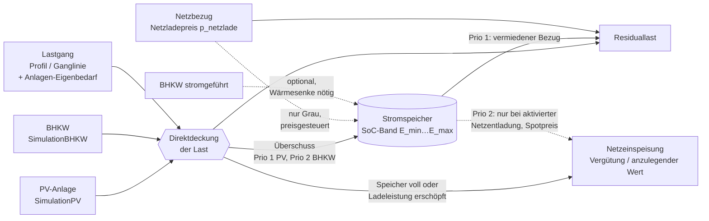

# Fach- und Umsetzungskonzept: Stromspeicher-Modul EPOS-Plan

Stand: 2026-08-16, Rev. 4 — Integrationspunkte am Code verifiziert; Peak-Shaving als separate Funktionalität ·
Auftraggeber: Philipp (INEKON) ·
Grundlagen: verifizierte Analyse der Excel-Referenz „Wirtschaftlichkeitsbetrachtung Batteriespeicher V7"
(`notes/verifikation.md`, `notes/vba.md`, `notes/struktur.md`, Portierungsreferenz `speicher_sim.py`), die
Vorarbeit „Lastgangauswertung" (Peak-Shaving, ebenfalls verifiziert) und die Code-Prüfung der Zielanwendung
(`notes/wpplan_code_befunde.md`).

> **Status der Integrationsaussagen.** Die Codebasis (Verzeichnis `WP_Plan/`, Projekt
> `WindowsFormsApplication1`) wurde geprüft; die Vorbehalte aus Rev. 1/2 sind aufgelöst — jede
> Integrationsaussage ist entweder am Quelltext bestätigt oder korrigiert. Nicht im Prüfmaterial enthalten
> waren `Allgemein/Simulation/*` (`SimulationControl`, `SimulationStrombedarf`, `SimulationPV`,
> `SimulationBHKW`, `SimulationSSP`), `ChartManager.cs`, `CsvExportClass.cs`, `CsvReader.cs`, `WizardCtrl`
> und die `*.Designer.cs`. Aussagen zu diesen Klassen sind aus verifizierten Aufrufstellen abgeleitet und
> im Text mit *(aus Aufrufstelle)* gekennzeichnet: Signaturen und Feldnamen stimmen, Einheiten sind teils
> erschlossen.

**Revalidierung (16.08.2026 abends).** Alle Integrationsaussagen wurden gegen den aktuellen
Repository-Stand geprüft (Klon `Documents\WP-Plan`, Commit `41e7bfd`; Delta-Bericht im Umsetzungskonzept,
Abschnitt 1.4). In dieser Fassung nachgeführt: Migrationsweg auf die versionierte `SchemaMigration` nach
ADR-001 umgestellt (5.6, 8.4), Lastdefinition präzisiert (3.1: Elektrokessel-Stromverbrauch), Grafik- und
Exporthinweise aktualisiert (7.2). Die SpeicherEngine samt bitgenauem Referenztest ist umgesetzt —
**Etappe 1 erledigt, Meilenstein M1 erreicht** (48 Tests grün).

**Änderungen gegenüber Rev. 3.** Peak-Shaving ist von der vierten Berechnungsart des Speichermoduls zur
**separaten Funktionalität** aufgewertet: eigener Einstieg mit eigener Maske, direkt auf dem Lastgang nutzbar,
ohne dass die PV/BHKW-Simulationskette konfiguriert sein muss; technisch unverändert als `PeakShaving`-Strategie
derselben SpeicherEngine (1, 6, 6.4, 8.3, Etappenplan Stufe 7, neuer offener Punkt 10). Alle übrigen
Festlegungen bleiben unverändert.

**Änderungen gegenüber Rev. 2.** Die in Rev. 2 gesetzten fachlichen Entscheidungen bleiben unverändert.
Neu eingearbeitet ist die Code-Prüfung: Anwendungsname **EPOS-Plan** (Verzeichnis bleibt `WP_Plan`);
Lastgangquellen auf die **zwei** belegten Wege korrigiert und um den Anlagen-Eigenbedarf ergänzt (3.1);
der Lastgang-Import **existiert bereits** und wird erweitert statt neu gebaut (3.2); PV- und BHKW-Quellen
richtig adressiert, Adapterschicht `float[8760] ↔ double[35040]` und BHKW-Überschussbildung ergänzt (3.3);
Kostenprofil-Vorlage von `TagV` auf `Form_Quellprofil` korrigiert (4.1); Aufschlagsblock an
`energy_project_settings` verankert (4.2); Parameterliste gegen den echten Feldbestand abgeglichen und um
die Migration der projektweiten Ladeparameter ergänzt (5.1, 5.6); neuer Abschnitt **Ablösung der drei
Speicher-Rudimente im Bestand** (8.2); Persistenzempfehlung relativiert — Eingangsreihen im Hausmuster,
Ergebnisreihen on-the-fly (8.4); Varianten an `Tab_Energieanlagen` angedockt (7.3); Engine-Randbedingungen,
Datentyp-, Kultur- und Freischaltungsregeln ergänzt (8.1, 8.5, 9).

---

## 1. Ziel und Einordnung

Ziel ist ein vollwertiges Stromspeicher-Modul in EPOS-Plan, das die bisher auf zwei Excel-Mappen verteilte
Speicherbetrachtung ablöst: Jahressimulation des Speicherbetriebs im 15-Minuten-Raster, monetäre Bewertung jedes
Intervalls, Wirtschaftlichkeitsrechnung (Annuität, Kapitalwert, Amortisation) und Auslegungsoptimierung über
Kapazität und Leistung. Der Eigenverbrauchs-Kern der V7-Mappe (`SpeicherSimulation_cont`) ist bitgenau
reimplementiert und gegen die gespeicherten Excel-Ergebnisse verifiziert (Ladezustand exakt, Geldwert bis auf 1 ULP
in 3 von 35.137 Zellen, Wirtschaftlichkeitsblock ≤ 1,6·10⁻¹⁵ relativ) — dieser Kern wird portiert, nicht neu
erfunden. Ebenfalls verifiziert vorliegend ist der Peak-Shaving-Algorithmus aus der Lastgangauswertung (Abweichung
0 über alle geprüften Intervalle); Peak-Shaving wird als **separate Funktionalität** mit eigenem Einstieg
bereitgestellt (6.4) und ist damit auch in Projekten nutzbar, die nur einen Lastgang und keine
PV/BHKW-Simulation führen. Die preisgesteuerte Arbitrage („Graustromspeicher") und die
Auslegungsoptimierung der V7-Mappe sind dagegen nachweislich defekt beziehungsweise veraltet und werden fachlich
neu konzipiert. Das Modul fügt sich in die bestehende Kette Stromganglinie → Stromverbraucher → PV/BHKW →
Simulation → Ergebnis ein; die dafür nötigen Anknüpfungspunkte sind in EPOS-Plan bereits angelegt (Tool 6
„Stromspeicher", `tabPage_Stromspeicher(_Parameter)`, `ErgebnisModel.Sim_Stromspeicher`) und teilweise mit
provisorischer Rechenlogik belegt, die abzulösen ist (8.2).

---

## 2. Betriebsarten und Energieflüsse

### 2.1 Quellen-Matrix (Anforderungen 1 und 2)

Die Betriebsart legt fest, aus welchen Quellen geladen werden darf. Sie ist eine Eigenschaft der
Speicherkonfiguration und schaltet Eingabefelder und Algorithmuszweige frei.

| Betriebsart | Untervariante | PV | BHKW-Überschuss | BHKW stromgeführt | Netzbezug |
|---|---|:--:|:--:|:--:|:--:|
| **Grünstromspeicher** | nur PV | ✔ | – | – | – |
| | nur BHKW | – | ✔ | ○ | – |
| | BHKW + PV | ✔ | ✔ | ○ | – |
| **Graustromspeicher** | (eine Variante) | ✔ | ✔ | ○ | ✔ |

✔ = fest · ○ = optional zuschaltbar · – = gesperrt

**Gesetzte Designentscheidungen:**

* **Netzentladung wählbar je Projekt** — entweder nur Eigenverbrauchsdeckung oder zusätzlich aktiver Verkauf ins
  Netz zu Marktpreisen. Unabhängig von der Betriebsart; auch ein Grünstromspeicher darf verkaufen.
* **BHKW-Laden:** Standard ist ausschließlich der **BHKW-Überschuss** — die wärmegeführte Fahrweise bleibt
  unangetastet, gespeichert wird nur, was ohnehin anfällt. Optional zuschaltbar ist **stromgeführtes Nachladen**;
  Randbedingung ist dann die Abnahme oder Pufferung der anfallenden Wärme.
* **Verluste energetisch** modelliert (5.2), zusätzlich ein „Excel-Kompatibilitätsmodus" für Referenztests.

**Anschluss an die vorhandene BHKW-Fahrweise (bestätigt).** EPOS-Plan kennt die Fahrweise bereits als
Projekteinstellung: `Tab_Einstellungen.Betriebsart` mit den Werten 0 = wärmegeführt, 1 = stromgeführt,
2 = ohne Stromeinspeisung, gepflegt über die Radiobuttons auf `Form_Simulation_Detail` und an die Engine
übergeben als `sim.modeBHKW`; ergänzend `Leistungsgrenze` und `Pendelspeicher`. Das Konzept setzt darauf auf,
statt eine zweite Fahrweisensteuerung einzuführen: Die Speicheroption „stromgeführtes Nachladen" ist nur
wählbar, wenn `Betriebsart = 1` gesetzt ist, andernfalls erscheint ein Hinweis mit Absprung in die
BHKW-Parameterseite. `Tab_Energieanlagen` führt zusätzlich je Anlagenzeile ein Feld `Betriebsart`, sodass
eine spätere anlagenscharfe Fahrweise ohne Schemaänderung möglich bleibt.

**Fachliche Randbedingung Grünstrom:** Vergütungsanspruch und Netzentgeltbefreiung hängen an der Ausschließlichkeit
der Beladung aus erneuerbaren Quellen — im Grünbetrieb ist deshalb keine Netzladung möglich; die rechtliche
Würdigung bleibt beim Anwender (Hinweistext im Formular).

### 2.2 Merit-Order

**Laden** — nach Grenzkosten je eingespeicherter kWh:

1. **PV-Überschuss** — Grenzkosten = entgangene Einspeisevergütung (typisch 5 ct/kWh bzw. anzulegender Wert);
   günstigste Quelle.
2. **BHKW-Überschuss** — Grenzkosten = entgangener Einspeise-/KWK-Erlös des BHKW; fällt wärmegeführt ohnehin an,
   ist aber wegen des meist höheren Einspeiseerlöses geringfügig teurer als PV. Im Modus „ohne Stromeinspeisung"
   (`Betriebsart = 2`) sind die Grenzkosten null, weil der Überschuss sonst abgeregelt würde — dort ist die
   Speicherladung besonders wertvoll.
3. **BHKW stromgeführt** (optional) — Grenzkosten = Brennstoffkosten/η_el abzüglich Wärmegutschrift.
4. **Netzbezug** (nur Grau) — Grenzkosten = Netzladepreis des Intervalls (4.4); nur bei erfüllter
   Rentabilitätsbedingung (6.5).

Konvention für die Aufteilung des Überschusses: **das BHKW deckt die Last vorrangig**, der verbleibende PV-Ertrag
ist ladefähig. Für die Energiebilanz ist die Aufteilung neutral, für die Quellenbeschränkung des Grünspeichers
entscheidend; PV soll als günstigere Ladequelle übrig bleiben. Diese Konvention ist zugleich die Definition, aus
der der im Bestand fehlende BHKW-Überschuss gebildet wird (3.3).

**Entladen** — nach Wert je ausgespeicherter kWh:

1. **Deckung der Residuallast** — Wert = vermiedener Bezugspreis inklusive Netzentgelt, Umlagen und Steuern
   (Größenordnung 20 ct/kWh).
2. **Netzeinspeisung** (nur bei aktivierter Netzentladung) — Wert = Spotpreis bzw. Vergütung, meist deutlich
   niedriger.

Priorität 1 vor 2, weil der vermiedene Bezugspreis den Einspeiseerlös praktisch immer übersteigt. Ausnahme sind
Spotpreisspitzen — genau dafür existiert die Preissteuerung in 6.5, die die Reihenfolge intervallweise umkehren darf.

### 2.3 Energieflussdiagramm



---

## 3. Datenquellen Lastgang und Erzeugung (Anforderung 3)

### 3.1 Lastgangquellen im Bestand

Die Code-Prüfung belegt **zwei** eigenständige Quellen für den Strom-Lastgang, nicht drei — plus die intern
gerechneten Anlagen-Eigenverbräuche, die im Strompfad aufaddiert werden:

| Weg | Datenhaltung | Auflösung | Erzeugung |
|---|---|---|---|
| **(a) Synthetisches Profil** | `Tab_Stromverbraucher(_STAMM)` mit `Monat_1…Monat_12` [kWh] × `Tab_Stromverbrauchertyp(_STAMM)` mit 168 Stundenspalten `[1]…[168]` (7 Tage × 24 h), Verknüpfung namensbasiert über `Typ`/`Typname`; Projektzuordnung `Z_Projekt_Stromverbraucher` mit Jahressummen-Override `Summe` | 8.760 h | `WPPlan.Core.BhkwPlan.StromWocheToJahr(wo[168], monat[12], out[8760], …)`, danach monatsweise Normierung (×1.000) — Monatswerte werden in **MWh** gepflegt (`Form_EingDBStromverbraucher`), **Ausgabe damit kWh je Stunde (kW)**, konsistent zum Ganglinienpfad |
| **(b) Importierte Ganglinie** | `Tab_Stromganglinie(_STAMM)` (Kopf: `Bezeichner`, `Zeitinterval`) + `Tab_StromganglinieDaten(_STAMM)` (eine Zeile je Intervall, **kein Zeitstempelfeld**, Reihenfolge = ID-Reihenfolge); Projektzuordnung `Z_ProjektStromganglinie` | `Zeitinterval` = 1 (Stunden), 4 (Viertelstunden), 60 (Minuten) | Datei-Import, s. 3.2 |

Der Einstieg in beide Wege ist `SimulationStrombedarf.Stromprofil_Strombedarf_berechnen(List<string>)`
*(aus Aufrufstelle)*; `Allgemein/StromTestClass.cs` enthält mit `MyTestProfil` und `MyTestLastgang` bereits
lauffähige Beispielaufrufe für genau diese beiden Wege — samt der Abfrage `Abfrage_ProjektStromGanglinie` und
den Feldern `m_szStromspeicher`/`m_ID_Projekt`. Diese Klasse ist der Startpunkt der Engine-Anbindung.

**Korrektur zur Annahme „Tagesverteilung TagV".** `TagVCtrl`/`TagVModel`/`TagVDatenModel` bedienen
`Tab_DBTagV(_STAMM)` und gehören zum **Wärme**pfad: Die Verknüpfung läuft über den Gebäudetyp, die Verteilung
wird per `BhkwPlan.StdWerte(...)` auf den Wärmebedarf angewandt. Für den Strom-Lastgang ist `TagV` irrelevant.
Ein Standardlastprofil-Verfahren (VDI 4655, BDEW-SLP) existiert im Bestand nicht.

**Definition der Last.** Der Strom-Lastgang setzt sich im Bestand aus dem Profil beziehungsweise der Ganglinie
**plus den gerechneten Anlagen-Eigenverbräuchen** zusammen (Wärmepumpe, Heizstab, Kesselstrom — Letzterer ist
der volle Stromverbrauch eines **Elektrokessels** und nur bei `Brennstoff_Art = 13` belegt
(`SimulationSPK.cs:265-272`), für andere Brennstoffe ein Nullvektor). Das Konzept übernimmt diese Definition:

```
P_last[i] = P_profil_oder_ganglinie[i] + P_wp[i] + P_heizstab[i] + P_kesselstrom[i]
```

Die Wahl zwischen (a) und (b) betrifft nur den ersten Summanden. Das ist wichtig für das Peak-Shaving (6.4):
Die zu kappende Spitze ist die **Netzbezugsspitze** und muss die Anlagen-Eigenverbräuche enthalten.

### 3.2 Lastgang-Import: vorhandenen Weg erweitern

Ein Import **existiert bereits** (`Views/Stromverbraucher/Form_Stromganglinie_Admin.btn_Einlesen_Click` →
`StromganglinieStammCtrl.ImportGanglinie`), die 15-Minuten-Fähigkeit ist vorhanden (`Zeitinterval = 4`,
35.040 Werte). Der Konzeptpunkt lautet daher **erweitern, nicht neu bauen**:

| Vorhanden | Zu ergänzen |
|---|---|
| `.txt`, ein Wert je Zeile, keine Kopfzeile | CSV und Excel, Trennzeichen, Kopfzeilenerkennung |
| Parsing mit `double.Parse(s, CultureInfo.InvariantCulture)` | Dezimalkomma-Variante für deutsche Exportdateien |
| Raster 1 / 4 / 60 Werte je Stunde | Zeitstempelspalte und -konvention (Intervallanfang/-ende) |
| Harte Anzahlprüfung 8.760 / 35.040 / 525.600 | **Schaltjahr 8.784 / 35.136 — heute hart abgelehnt** |
| Ablage `Tab_StromganglinieDaten`, Projektkopie über `ApplyGanglinieToProjekt` | Einheitenwahl kW / kWh je Intervall, Lücken- und Dublettenprüfung, Sommerzeit, Plausibilität, Validierungsprotokoll |

**Minutenwerte (525.600).** Der Bestand unterstützt sie, das Konzept sah sie nicht vor. Vorschlag: beim Import
auf das 15-Minuten-Raster mitteln (arithmetisch über je 15 Werte) und die Originalauflösung nicht in die Engine
durchreichen — die Rechenzeit der Optimierung würde sich sonst um den Faktor 15 erhöhen, ohne Erkenntnisgewinn.

### 3.3 Erzeugungsreihen und Adapterschicht

**PV — Quelle korrigiert.** Weder `Allgemein/SolarPVGISCalculator.cs` (liefert PVGIS-TMY-Wetterdaten,
8.760 h, W/m², Ablage in `Tab_Klimadaten`/`Tab_Solar`) noch `Controller/PhotovoltaikCtrl.cs` (Modulstammdaten)
liefern eine Erzeugungszeitreihe. Diese kommt aus **`SimulationPV`** *(aus Aufrufstelle)*:

| Member | Länge | Einheit |
|---|---:|---|
| `Stromproduktion` | 8.760 | kWh/h |
| `Stromproduktion_viertelstunde` | 35.040 | kW |
| `Ueberschuss` / `Ueberschuss_viertelstunde` | 8.760 / 35.040 | wie oben |
| `Strombedarf` / `Strombedarf_stuendlich` | 35.040 / 8.760 | kW / kWh/h |
| `Speicherfuellstand` / `_viertelstunde` | 8.760 / 35.040 | kWh — **abzulösen, s. 8.2** |

PV liefert also nativ **beide** Raster; für den Speicher wird `Stromproduktion_viertelstunde` verwendet.

**BHKW — Quelle korrigiert und Überschuss neu zu bilden.** `Allgemein/BhkwPlan.cs` ist der C#-Port des nativen
Rechenkerns `BHKWPLAN.DLL` (Namespace `WPPlan.Core`, Vektor-/Physik-Primitive, `Hours = 8760`), kein
BHKW-Anlagenmodell. Die elektrische Erzeugung liefert **`SimulationBHKW.stromproduktion`, ausschließlich
stündlich (8.760)** *(aus Aufrufstelle)*; die Anzeige spreizt sie über
`SimulationControl.Stundenwerte_zu_viertelstunden` auf 35.040. **Ein elektrischer BHKW-Überschuss existiert
nirgends als Reihe** — `ErgebnisBHKWModel` kennt nur `Waermeueberschuss` (thermisch). Er wird im
Vorverarbeitungsschritt nach der Merit-Order-Konvention aus 2.2 gebildet:

```
P_bhkw[i]       = expand(SimulationBHKW.stromproduktion)[i]        # 8760 -> 35040, kW
E_bhkw_frei     = max(0, E_bhkw − E_last)                          # ladefähiger Überschuss
```

**Expansionsregel.** Stundenwerte werden als über die Stunde konstante Leistung auf vier Viertelstunden
gelegt (`Stundenwerte_zu_viertelstunden`-Semantik, Wertwiederholung ohne Interpolation). Das ist für BHKW
sachgerecht (träges, quasistationäres Verhalten), unterschätzt aber Lastspitzen — beim Peak-Shaving ist das im
Ergebnisprotokoll zu vermerken, wenn die BHKW-Reihe beteiligt ist.

**Adapterschicht (neu gegenüber Rev. 2).** EPOS-Plan führt beide Raster parallel und verwendet durchgängig
`float[]`: 8.760 Werte im Physik-/BHKW-Kernel, 35.040 Werte im Strompfad und in den Charts. Die Engine rechnet
intern in `double[35040]` (8.1). Dazwischen liegt eine schmale, testbare Adapterschicht:

```
double[] ZuViertelstundenDouble(float[] reihe)      # 8760 -> 35040, Wertwiederholung; 35040 -> 1:1
float[]  ZuFloat(double[] reihe)                    # nur für Charts und CSV-Export
```

Einheiten sind dabei explizit zu führen: Leistungsreihen in **kW**; `BhkwPlan.StromWocheToJahr` normiert mit
Faktor 1.000, die Monatswerte werden in **MWh** gepflegt (`Form_EingDBStromverbraucher`), die Ausgabe ist
damit **kWh je Stunde (kW)** und konsistent zum Ganglinienpfad (Vollprüfung, Umsetzungskonzept 1.2 f);
Aggregate in **MWh**. Die in Rev. 3 offene Unstimmigkeit ist geklärt: `Stromprofil_Strombedarf_berechnen`
liefert **8.760** Stundenwerte (`SimulationStrombedarf.cs:125-201`), die Expansion auf 35.040 erfolgt per
Wertwiederholung in `SimulationStrombedarf.Berechnung`; der 8760-in-35040-Kopierweg in
`Form_Stromverbraucher` ist eine Altlast des Formulars und wird bei der Umsetzung bereinigt.

**Interne Repräsentation der Engine.** Alle Zeitreihen einheitlich `double[]`, 15-Minuten-Raster,
n = 35.040 (Normaljahr) bzw. 35.136 (Schaltjahr), Einheit kW, Index 0 = erstes Intervall des Jahres. Damit
entfallen die Eigenheiten der V7-Mappe (`lastRow = 35138` hart codiert, übersprungenes erstes Intervall, zwei
Geisterzeilen); sie werden nur im Kompatibilitätsmodus für den Referenztest nachgebildet.

---

## 4. Strompreis- und Vergütungsmodell (Anforderungen 4 und 5)

### 4.1 Einheitliche interne Preiszeitreihe

Kern ist eine **Bezugspreis-Zeitreihe** `p_bezug[i]` in ct/kWh je 15-Minuten-Intervall. Alle drei Quellen münden in
diese Repräsentation; der Simulationskern kennt nur sie.

| Quelle | Eingabe | Bestand | Erzeugung der Zeitreihe |
|---|---|---|---|
| **(a) Spotmarktpreis-Datei** | CSV wie „Spotmarktpreise 2024.csv": Semikolon, Dezimalkomma, Spalten `Datum;von;Zeitzone von;bis;Zeitzone bis;Spotmarktpreis in ct/kWh`, 8.784 Stundenwerte, negative Preise | neu | Stunde → 4 Viertelstunden; Zeitzonenspalten CET/CEST auswerten (März 23 h, Oktober 25 h) |
| **(b) Kostenprofil** | 12 Monatswerte + 7 × 24 Wochenwerte | neu, **UI-Vorlage vorhanden** | Jahresprofil analog `WaermequelleClass.ProfilAusMonatsUndWochenwerten` |
| **(c) Fixpreis** | ein Wert [ct/kWh] | **Bestandsfall** | konstante Reihe |

**Fixpreis ist der Bestandsfall (bestätigt).** Strom läuft im Kostenmodul als `energy_carrier` mit
`pricing_model = 'ELECTRICITY'`; wegen `HasHi = false` gilt „Direktabrechnung nach kWh", der Arbeitspreis ist
ein Skalar in €/kWh, versioniert über `energy_price.valid_from`/`valid_to`. Die Konzeptaussage „Fixpreis ist
die konstante Reihe" passt eins zu eins auf den Bestand.

**Kostenprofil-Vorlage korrigiert.** Die in Rev. 2 genannte Verankerung an `TagVCtrl`/`TagVModel` war falsch
(Wärmepfad, s. 3.1). Die tragfähige Vorlage ist **`Views/Simulation/Form_Quellprofil.cs`**: Reiter
„Monatswerte" (12 Werte), „Wochenwerte" (7 × 24 mit Tag kopieren/einfügen/auf alle Tage übertragen) und
„Grafik" (8.760-h-Vorschau), Persistenz als zwei `";"`-separierte Zeichenketten mit `InvariantCulture`,
vollständig programmatisch ohne Designer. Das Kostenprofil wird nach diesem Muster gebaut; die Monats- und
Wochenwerte tragen dann ct/kWh statt einer Quelltemperatur. Ein Tages- beziehungsweise HT/NT-Profil ergibt
sich als Spezialfall der 7 × 24-Matrix.

**Preisversionierung (neu).** Der Bestand kennt Preisversionen. Damit Ergebnisse reproduzierbar bleiben, legt
das Konzept fest: Eine Simulation zieht die zum **Stichtag des Simulationsjahres** gültige Preisversion
(`valid_from ≤ Stichtag < valid_to`); ist keine gültig, die jüngste ältere. Die verwendete Version wird im
Ergebnisdatensatz mitgeführt und im Kennzahlenblock angezeigt.

Der Spotimport der V7-Mappe erfolgte per `XLOOKUP` mit „nächstkleinerem Treffer" und ignorierte die
Zeitzonenspalten; die Prüfung ergab 99,986 % Übereinstimmung mit der CSV, die fünf Abweichungen liegen
ausschließlich an den Umstellungsterminen. Im Neubau wird die Umstellung explizit behandelt.

### 4.2 Aufschlagskomponenten

Auf den Energiepreis (Quelle a oder b) wird ein Aufschlag addiert. Quelle (c) ist per Default ein Vollpreis; je
Quelle existiert deshalb das Flag „Aufschlag anwenden". Felder Editierbar/Änderbar
Umlagen als Summenwert darstellen, details informativ.

| Komponente | Vorschlagswert [ct/kWh] | aktiv |
|---|---:|:--:|
| Netzentgelt Arbeit | 6,440 | ✔ |
| Umlagen (0,446 + 1,559 + 0,941) | 2,946 | ✔ |
| **Stromsteuer** | **2,050 (Regelfall) / 0,050 (reduziert)** | ✔ |
| Konzessionsabgabe | 0,110 | ✔ |
| Vertrieb | 0,200 | ✔ |
| **Summe (Regelfall / reduziert)** | **11,746 / 9,746** | |


**Verankerung im Bestand (neu).** Im Kostenmodul existieren ausschließlich `grundpreis`, `arbeitspreis` und
`leistungspreis` (plus Heizwert, Einheit, Emissionen). Netzentgelt, Umlagen, Stromsteuer, Konzessionsabgabe und
Vertrieb gibt es weder als Feld noch als Tabelle — der Aufschlagsblock ist **vollständig neu**. Er wird als
Erweiterung von **`energy_project_settings`** je (`ID_Projekt`, Strom-Carrier) spezifiziert, mit je Komponente
einem Wert- und einem Aktiv-Feld plus Override-Wert; die Preishistorie bleibt in `energy_price`. Damit gilt
`p_bezug[i]` = Arbeitspreis (oder Profil-/Spotwert) + Summe der aktiven Aufschläge.

**Stromsteuer (Entscheidung).** Änderbares Feld mit zwei Voreinstellungen: **2,05 ct/kWh im Regelfall** und
**0,05 ct/kWh für energieintensive Unternehmen mit Stromsteuerreduktion**. Damit ist der Widerspruch der
V7-Mappe erklärt: Der Parameterblock führte 0,05 ct/kWh, die Variantenblätter derselben Mappe 2,05 ct/kWh — es
handelt sich nicht um einen Tippfehler, sondern um zwei unterschiedliche steuerliche Fälle in einer Datei.

**Auflösung der Summen-Inkonsistenz.** Die Komponentensumme trifft den in der V7-Mappe verwendeten
Gesamtaufschlag von 20 ct/kWh auch im Regelfall nicht (11,746 ct/kWh). Zwei Modi lösen das:

* **„aufgeschlüsselt" (Standard):** Aufschlag = Summe der aktiven Komponenten, Flags und Werte frei setzbar,
  Summe live angezeigt.
* **„Gesamtwert (Override)":** Der Anwender trägt einen Gesamtaufschlag ein; die Komponentenliste bleibt sichtbar
  und informativ, die Differenz wird als **„nicht aufgeschlüsselter Rest"** ausgewiesen (bei 20 ct/kWh:
  8,254 ct/kWh im Regelfall, 10,254 ct/kWh im reduzierten Fall).

### 4.3 Vergütung

Für jede eingespeiste kWh wird ein Erlös `v[i]` [ct/kWh] angesetzt, ebenfalls als Zeitreihe (Standard konstant).
Zwei Regime:

* **Feste Einspeisevergütung** (Vorschlag 5 ct/kWh): `v[i]` konstant, unabhängig vom Spotpreis — der in der
  V7-Mappe verwendete Fall.
* **Direktvermarktung / anzulegender Wert** (Vorschlag 2 ct/kWh): Erlös = Spotpreis + Marktprämie, Marktprämie =
  max(0, anzulegender Wert − Monatsmarktwert). Bei negativen Spotpreisen greift optional die Förderungsaussetzung.

Der gültige `v[i]` ist zugleich der **Opportunitätswert der Ladung** aus Eigenerzeugung. Jede Ladung aus PV/BHKW
wird mit `−E_ch · v[i]/100` bewertet — exakt die Logik der verifizierten Spalte F. PV und BHKW können
unterschiedliche Sätze haben, das Modell führt `v_pv[i]` und `v_bhkw[i]` getrennt.

### 4.4 Netzladepreis und Leistungspreis

Für Strom, der aus dem Netz **in den Speicher** geht, gilt eine eigene Preisreihe:

```
p_netzlade[i] = p_energie[i] + a_netzlade          # ct/kWh
```

mit dem **Parameter `a_netzlade` [ct/kWh], Default 0**. Der Default bildet die Netzentgeltbefreiung für
Stromspeicher bei Zwischenspeicherung und Wiedereinspeisung ab; für Speicher ohne Befreiungstatbestand ist der
Wert vom Anwender zu setzen (in der Regel der volle Aufschlag aus 4.2). Hinweistext im Formular: *„Default 0
unterstellt Netzentgeltbefreiung für den Speicher. Liegt keine Befreiung vor, hier den vollen Aufschlag
eintragen — davon hängt die Wirtschaftlichkeit der Netzladung entscheidend ab."* Für den Eigenverbrauch bleibt
`p_bezug[i]` maßgeblich, weil dort der vermiedene Vollpreis den Nutzen bestimmt.

**Leistungspreis L_P — eigenes Feld (Entscheidung, gestützt durch die Code-Prüfung).** Ein Leistungspreis
existiert bereits (`energy_price.leistungspreis`, `energy_project_settings.custom_price_power`, Schalter
`pricing_model.has_powerprice`, Default aus `Tab_Brennstoff_Stamm.Standard_Leistungspreis`) — **aber mit
unklarer Einheit**: Das UI-Label wird als `€/{ToUnitCode}` gesetzt, für Strom also „€/kWh", während die
Auslese-Eigenschaft `LeistungspreisEurYear` heißt. Faktisch ist es ein freies Zahlenfeld ohne durchgesetzte
Einheitensemantik. Das Konzept deutet dieses Feld **nicht** um, sondern führt `L_P` als eigenes, explizit in
**€/(kW·a)** deklariertes Feld ein, das aus dem Kostenmodul lediglich vorbelegt werden kann.

---

## 5. Speicherkonfiguration (Anforderung 6)

### 5.1 Parameterliste mit Abgleich gegen den Feldbestand

`Model/StromspeicherModel.cs` und `Tab_Stromspeicher(_STAMM)` haben **exakt acht** Felder: `ID`, `Bezeichner`,
`Typ`, `Leistung`, `Energie`, `Degradation`, `Ladezustand`, `Modulkosten` (plus `ReadOnly` bzw. `ID_Projekt`).

| Parameter | Symbol | Einheit | Default | Bestand |
|---|---|---|---:|---|
| Nutzbare Kapazität (nominal) | C_nom | kWh | 5.000 | **vorhanden** (`Energie`, Einheit nicht deklariert) |
| Speicherleistung (AC, Laden = Entladen) | P | kW | 2.500 | **vorhanden** (`Leistung`) — genau ein Feld, stützt die Entscheidung |
| Min. Ladezustand | — | % bzw. kWh | 10 % = 500 | **projektweit** in `Tab_Einstellungen.Ladefuellstand_Min` → migrieren (5.6) |
| Max. Ladezustand | — | % bzw. kWh | 90 % = 4.500 | **projektweit** in `Tab_Einstellungen.Ladefuellstand_Max` → migrieren |
| Verlustfaktor (Round-Trip) | 1−η_RT | % | 10 | fehlt |
| Wirkungsgrad Laden / Entladen | η_ch, η_dis | – | je √0,9 = 0,9487 | fehlt, abgeleitet |
| Zugesicherte Volladezyklen | N_zyk | – | 10.000 | fehlt |
| Degradation p. a. | d | %/a | 0,10 | **vorhanden** (`Degradation`, Einheit nicht deklariert) |
| Zyklus-Verschleißkosten | c_ver | €/(kWh·Zyklus) | 0,025 | fehlt |
| Investition Kapazitätsanteil | c_cap | €/kWh | 250 | **Kandidat** `Modulkosten` (Einheit unklar, s. u.) |
| Investition Leistungsanteil | c_pow | €/kW | 0 | fehlt |
| Investition Festanteil | I_fix | € | 0 | fehlt |
| Leistungspreis Netz (Peak-Shaving) | L_P | €/(kW·a) | offen (Frage 3) | fehlt hier, Vorbelegung aus Kostenmodul (4.4) |
| Aufschlag Netzladestrom | a_netzlade | ct/kWh | 0 | fehlt |
| Kapitalzins | i_z | %/a | 3 | fehlt |
| Nutzungsdauer | N | a | 20 | fehlt |
| Standby-/Eigenverbrauch | — | W bzw. %/Monat | 0 | fehlt, optional |
| Betriebskosten (sonstige) | — | €/a oder % Invest | 0 | fehlt, optional |
| Betriebsart, Quellen-Flags, Netzentladung | — | – | – | fehlt |
| Berechnungsart, Preisquelle, Kompatibilitätsmodus | — | – | – | fehlt |
| Variantenschlüssel + „aktiv" | — | – | – | Instanzmuster in `Tab_Energieanlagen` (7.3) |

**Zwei Migrationsaufgaben aus dem Bestand:**

* **`Modulkosten` → c_cap — entschieden (16.08.2026).** Die Altwerte sind bereits **spezifische Kosten in
  €/kWh** und werden ohne Umrechnung als c_cap übernommen; keine Division durch `Energie`. Die Einheit wird
  künftig am Label geführt und die Validierung von `checkInt` auf Dezimalwerte umgestellt.
* **`Ladezustand` — entschieden (16.08.2026): Start-SoC in %.** Das Feld wird auf den neuen Parameter
  „Start-Ladezustand" abgebildet (Anzeige in `FormMain.SetSPControl` bleibt). Produktivstandard für den
  Simulationsstart ist SoC_min (Frage 8); ein abweichender Start-SoC bleibt je Variante einstellbar.

**Eine gemeinsame Lade- und Entladeleistung (Entscheidung, durch den Bestand gestützt):** `Tab_Stromspeicher`
führt genau ein Leistungsfeld. Getrennte Felder entfallen; das hält die Optimierungsdimension bei zwei.

**Investition getrennt (Entscheidung).**

```
I = c_cap · C_nom + c_pow · P + I_fix          # [€]
```

Mit den Defaults ergibt sich I = 250 €/kWh · 5.000 kWh = **1.250.000 €** — exakt der Wert der V7-Mappe. Damit
ist das Modul referenzkompatibel. **Dokumentierter Labelfehler der Mappe:** Die Zelle trug die Einheit „€/kW",
wurde aber mit der Kapazität in kWh multipliziert; faktisch war der Wert €/kWh. Im Modul ist die Einheit
korrekt €/kWh; ein zweites, sauber benanntes Feld c_pow [€/kW] übernimmt den Leistungsanteil.

**Hinweis zum Default c_pow = 0:** Solange c_pow = 0 gesetzt ist, verursacht eine höhere C-Rate keine Kosten;
die C-Rate-Achse der Optimierung ist dann weitgehend indifferent — genau der Effekt, der in der V7-Heatmap ab
C-Rate 1,5 zu identischen Spalten führte. Das Modul zeigt dann den Hinweis *„C-Rate-Achse kostenneutral: für
eine aussagekräftige Leistungsoptimierung c_pow > 0 setzen"*.

### 5.2 Verlustmodell

Der Round-Trip-Wirkungsgrad η_RT = 1 − Verlustfaktor (Standard 0,90) wird symmetrisch aufgeteilt:
η_ch = η_dis = √η_RT ≈ 0,9487. Die Leistungsgrenzen gelten **AC-seitig** (Klemme Wechselrichter):

```
Laden:    SoC ← SoC + E_ac_ch · η_ch      mit  E_ac_ch  ≤ (SoC_max − SoC) / η_ch
Entladen: SoC ← SoC − E_ac_dis / η_dis    mit  E_ac_dis ≤ (SoC − SoC_min) · η_dis
```

Der Ladezustandsverlauf ist damit physikalisch realistisch, und die Verluste erscheinen in der Energiebilanz statt
nur als Abschlag auf den Geldbetrag. Die V7-Mappe rechnete den Eigenverbrauchskern verlustfrei und zog den
Verlustfaktor pauschal von der Euro-Summe ab, während das Arbitragemodul denselben Faktor zweimal je Vorgang
ansetzte (Round-Trip 0,81) — zwei unvereinbare Verlustmodelle in einer Datei. Auch die vorhandene
Dashboard-Rechnung in EPOS-Plan arbeitet verlustfrei bis auf einen festen Wechselrichterfaktor 0,95 (8.2). Der
Neubau setzt η_RT = 0,90 an; 0,81 wäre für heutige Systeme inklusive Wechselrichter zu pessimistisch.

**Excel-Kompatibilitätsmodus** (schaltbar, nur für Referenztests): η_ch = η_dis = 1, Bewertung über
Σ F · (1 − Verlustfaktor), Start-SoC = 0, Reihenfolge der Begrenzungen exakt wie im VBA (erst Leistungsgrenze,
dann SoC-Grenze, dann Kappung auf ≥ 0), erstes Intervall übersprungen, keine Degradation, c_ver = 0.

### 5.3 Degradation (Entscheidung: wird mitgerechnet)

Gerechnet wird mit **einer** Jahressimulation bei Nennkapazität C_nom; die Alterung geht ausschließlich in die
Wirtschaftlichkeitsprojektion ein. N Vollsimulationen wären in der Rastersuche (120 Rasterpunkte × 20 Jahre =
2.400 Jahresläufe) unverhältnismäßig und brächten kaum Zusatzgenauigkeit.

Gewählt wird die **jahresscharfe Barwertsummation in geschlossener Form**:

```
q       = (1 − d) / (1 + i_z)
RBF_deg = (1/(1 + i_z)) · (1 − q^N) / (1 − q)          # degradierter Rentenbarwertfaktor
NPV     = E_a,1 · RBF_deg − I                          # E_a,1 = Ertrag des Referenzjahres
E_a,äq  = E_a,1 · RBF_deg · a(i_z, N)                  # degradationsäquivalenter Jahresertrag
ΔJ      = E_a,äq − A
```

Für i_z = 0 gilt der Grenzfall RBF_deg = (1 − (1−d)^N)/d, für d = 0 fällt RBF_deg auf den gewöhnlichen
Rentenbarwertfaktor zurück. Mit den Defaults (d = 0,1 %/a, i_z = 3 %, N = 20 a) ergibt sich RBF_deg = 14,751
gegen 14,877 ohne Degradation, also ein Abschlag von **rund 0,85 %**. Alle nachgelagerten Kennzahlen verwenden
konsistent E_a,äq; der unskalierte Referenzjahresertrag E_a,1 wird zusätzlich ausgewiesen, damit der Vergleich
mit der V7-Mappe möglich bleibt.

### 5.4 Zyklus-Verschleißkosten c_ver (Entscheidung: expliziter Parameter)

`c_ver` ist ein **eigenes Eingabefeld** in €/(kWh Nennkapazität · Vollzyklus), Default 0,025 — der Wert aus dem
Wirtschaftlichkeitsblock der V7-Mappe. Dort war er eine abgeleitete Größe:

```
c_ver = I / (N_zyk · C_nom) = 1.250.000 € / (10.000 · 5.000 kWh) = 0,025 €/(kWh·Zyklus)
```

Diese Herleitung bleibt als **Vorschlagsrechnung** hinter einer Schaltfläche „aus Investition berechnen"; der
Wert ist danach frei überschreibbar. Abgeleitete Größen:

```
Kosten eines Vollzyklus:            c_ver · C_nom                             = 125 €
Verschleiß je ausgespeicherter kWh: k_ver = c_ver · C_nom / (C_nutz · η_dis) ≈ 3,29 ct/kWh
   mit C_nutz = SoC_max − SoC_min = 4.000 kWh
Äquivalente Vollzyklen p. a.:       n_zyk = Σ E_dc,entnommen / C_nutz
Jahres-Verschleißkosten:            K_ver = n_zyk · C_nom · c_ver
```

**Drei definierte Verwendungen:**

1. **Steuergröße in der Arbitrage-Spread-Bedingung (immer aktiv, 6.5).** Ohne c_ver fährt der Dispatch den
   Speicher für Cent-Spreads leer. Hier nicht optional.
2. **Ausweis als Betriebskostenzeile (immer, alle Strategien, 7.1).**
3. **Einbeziehung in die Zielfunktion ΔJ — wählbare Option, Default AUS.** Annuität und Verschleißkosten
   bepreisen **denselben** Sachverhalt, den Verzehr der bezahlten Speicherlebensdauer. Solange c_ver aus der
   Investition abgeleitet ist (Default), führt die Aktivierung zu einer echten Doppelzählung. Die Option ist nur
   sinnvoll, wenn der Anwender c_ver bewusst **unabhängig** von der Investition setzt (Beispiel: Annuität deckt
   die Erstinvestition, c_ver den zyklenabhängigen Modultausch). Bei Aktivierung erscheint eine Warnung, die
   Ergebnisdarstellung kennzeichnet die Variante.

Physikalisch komplementär bleibt die **Zyklenbudget-Prüfung**: Überschreiten die hochgerechneten Zyklen über die
Nutzungsdauer die zugesicherten N_zyk, erscheint eine Warnung — unabhängig von der Zielfunktionsoption.

### 5.5 Anzeige und Absprung (am Code bestätigt und korrigiert)

Die Übersichtsanzeige **existiert bereits** und liegt nicht, wie in Rev. 2 vermutet, in `NavigatorStrom` oder
`DashboardForm`, sondern in **`FormMain.listView_SP`** (gespeist aus `FormMain.SetSPControl`, das je Projekt alle
`Tab_Energieanlagen`-Zeilen mit `ID_Type IN (SP_TYP, REF_SP_TYP)` durchläuft und zu jeder über `ID_SP` den
`Tab_Stromspeicher`-Satz liest). Vorhandene Spalten: Name, Typ, Leistung [kW], Energie, Degradation,
Ladezustand. **Zu ergänzen sind die Spalten Ertrag [€/a] und Amortisation [a] der letzten Rechnung** sowie eine
Kennzeichnung der aktiven Variante.

Kontextmenü und Absprung folgen dem Hausmuster: `SpKontextMenuCtrl` (Datei `StromspeicherKontextMenuCtrl.cs` —
Klassenname weicht vom Dateinamen ab) unterscheidet `listView_SP_REF` (→ `REF_SP_TYP`) von `listView_SP`
(→ `SP_TYP`) und öffnet `Form_Stromspeicher` bzw. `Form_AdminStromspeicher`. Das Aktualisierungsmuster nach
`DialogResult.OK` ist überall gleich: Zuordnungen löschen und neu schreiben →
`ProjektCtrl.m_Aenderungsdatum = DateTime.Now; Update()` → `Program.mainfrm.SetSPControl(...)`.

Innerhalb der Simulation sind die Seiten bereits angelegt: `tabPage_Stromspeicher` und
`tabPage_Stromspeicher_Parameter` in `Form_Simulation_Detail`, Navigationseintrag „Stromspeicher" über
`BefuelleQuellenListe()` bei `Tool_6 == "Stromspeicher"`, Icon-Fall „Batterie" in `ZeichneGewerkIcon`,
Kopplung ListView ↔ TabControl über `TabListMapper`.

### 5.6 Migration der projektweiten Ladeparameter

SoC-Band und Ladeleistung liegen heute **projektweit** in `Tab_Einstellungen` (`Ladefuellstand_Min`,
`Ladefuellstand_Max`, `Ladeleistung_Max`, jeweils mit einem Einheiten-Auswahlfeld `*_Auswahl`, sowie
`Ladeschwellwert`), gepflegt auf `tabPage_Stromspeicher_Parameter` mit Sofortspeicherung bei `Leave`. Das
kollidiert mit dem Varianten-Konzept (7.3), weil dort jede Speichervariante ein eigenes SoC-Band braucht.

**Migrationsweg:**

1. Die vier Felder werden auf die Variantenebene übernommen (neue Tabelle `Tab_StromspeicherVariante`, 7.3).
2. Beim ersten Öffnen eines Altprojekts werden die projektweiten Werte als Vorgabe in die vorhandenen
   Speichervarianten kopiert (einmalige Übernahme, protokolliert).
3. Die Felder in `Tab_Einstellungen` bleiben zunächst bestehen und werden zu **Vorgabewerten für neue
   Varianten** umdeklariert; die Eingabefelder auf `tabPage_Stromspeicher_Parameter` werden auf die aktive
   Variante umgehängt. `Ladeschwellwert` wird auf den Preissteuerungs-Schwellwert der Arbitrage (6.5)
   abgebildet oder als deprecated markiert.

**Schemaerweiterungen von `Tab_Einstellungen` (nach Revalidierung präzisiert):** `KonfigurationCtrl.ReadSingle`
liest die 23 Bestandsspalten über **Positionsindizes `row[0] … row[22]`** — diese Ordinalkette wird bewusst
**nicht verlängert**. Neue Spalten folgen dem inzwischen etablierten Hausmuster (`Kaskade_Zweikanalig`,
`Extrapolation_erlaubt`): **namensbasiert lesen** über `dt.Columns.Contains(...)`
(`KonfigurationCtrl.cs:82-85`) und über eigene, zielgenaue UPDATEs schreiben (`:398-409`) — so bleibt das
Speichern auch auf einer noch nicht migrierten Datenbank funktionsfähig. Das gilt für jede Erweiterung im
Rahmen dieses Moduls.

---

## 6. Berechnungsarten (Anforderung 7)

Die Berechnungsarten (a) bis (c) und die Arbitrage (6.5) teilen denselben Vorverarbeitungsschritt je Intervall i
(dt = 0,25 h, Energien in kWh); das Peak-Shaving (6.4) ist davon ausgenommen — es arbeitet als separate
Funktionalität direkt auf dem Lastgang P_last und benötigt die PV/BHKW-Vorverarbeitung nicht:

```
E_last     = P_last[i]·dt ;  E_pv = P_pv[i]·dt ;  E_bhkw = P_bhkw[i]·dt
                                 # P_last nach 3.1 inkl. Anlagen-Eigenbedarf,
                                 # P_bhkw nach 3.3 auf 15 min expandiert
E_restlast = max(0, E_last − E_bhkw)                    # BHKW deckt vorrangig
E_pv_frei  = max(0, E_pv    − E_restlast)               # ladefähiger PV-Überschuss
E_bhkw_frei= max(0, E_bhkw  − E_last)                   # ladefähiger BHKW-Überschuss (neu zu bilden)
E_defizit  = max(0, E_last − E_pv − E_bhkw)             # Residuallast
E_quelle   = (PV zulässig ? E_pv_frei : 0) + (BHKW zulässig ? E_bhkw_frei : 0)
```

Überschuss und Defizit schließen sich konstruktionsbedingt aus; Laden und Entladen im selben Intervall ist damit
ausgeschlossen (bei Round-Trip-Verlusten ohnehin nie vorteilhaft).

### 6.1 (a) Start Nachtnutzung

**Zweck:** Der Speicher soll für die Nutzung nach Sonnenuntergang nicht geleert sein.
**Regel (gesetzte Entscheidung):** Entladen ausschließlich, wenn die PV-Erzeugung null ist; solange PV erzeugt,
wird nur geladen. Kein Klimadaten- oder Sonnenstandsbezug nötig.

```
für jedes Intervall i:
    E_ac_ch = 0 ; E_ac_dis = 0
    if P_pv[i] > eps:                                   # Tag: nur laden
        E_ac_ch = min( E_quelle, P·dt, (SoC_max − SoC)/η_ch )
    else:                                               # PV = 0: entladen erlaubt
        E_ac_dis = min( E_defizit, P·dt, (SoC − SoC_min)·η_dis )
        if E_quelle > 0:                                # BHKW-Überschuss nachts
            E_ac_ch = min( E_quelle, P·dt, (SoC_max − SoC)/η_ch )
    SoC += E_ac_ch·η_ch − E_ac_dis/η_dis
    bewerte(i, E_ac_ch, E_ac_dis)
```

**Einordnung:** Die V7-Mappe hinterlegte für den Button „Start Nachtnutzung" nur eine Altversion, deren
Entladezweig bei PV = 0 die volle Last statt der Residuallast ansetzte — bei PV = 0 rechnerisch dasselbe, weshalb
sich ihre Trigger-Bedingung zufällig mit der hier gesetzten Regel deckt. Als Dauernutzungssimulation war sie
gleichwohl unbrauchbar, Laden aus BHKW oder Netz fehlte vollständig. Die hier beschriebene Fassung ist eine
**Neudefinition, kein Port**; sie ist nicht gegen Excel-Werte verifizierbar und braucht eigene Tests. Optionale
Erweiterung (nicht Stufe 1): ein Ziel-Ladezustand bis Sonnenuntergang, den der Speicher bei unzureichendem
PV-Überschuss aus BHKW (Grün) oder Netz (Grau) auffüllt.

### 6.2 (b) Dauernutzung

**Zweck:** Klassische Be- und Entladung nach Ladezustand und Residuallast — der verifizierte Kern der V7-Mappe,
erweitert um Quellenmatrix, energetische Verluste und optionale Netzpfade.

```
SoC = SoC_start                                          # Standard SoC_min; Kompatibilitätsmodus 0
für jedes Intervall i:
    E_ac_ch = 0 ; E_ac_dis = 0
    if E_quelle > 0:                                     # Überschuss → laden
        E_ac_ch = E_quelle
        E_ac_ch = min(E_ac_ch, P·dt)                     # Leistungsgrenze
        E_ac_ch = min(E_ac_ch, (SoC_max − SoC)/η_ch)     # SoC-Kopf
        E_ac_ch = max(E_ac_ch, 0)
    else:                                                # Defizit → entladen
        E_ac_dis = E_defizit
        E_ac_dis = min(E_ac_dis, P·dt)
        E_ac_dis = min(E_ac_dis, (SoC − SoC_min)·η_dis)
        E_ac_dis = max(E_ac_dis, 0)

    # Erweiterung Netzladung (nur Grau, nur bei aktiver Preissteuerung)
    if Grau and E_ac_ch == 0 and E_ac_dis == 0 and ladefenster(i):
        E_ch_netz = min(P·dt, (SoC_max − SoC)/η_ch) ; E_ac_ch += E_ch_netz

    # Erweiterung Netzentladung (nur bei aktivierter Option)
    if netzentladung and E_ac_dis == 0 and verkaufsfenster(i):
        E_verk = min(P·dt, (SoC − SoC_min)·η_dis) ; E_ac_dis += E_verk

    SoC += E_ac_ch·η_ch − E_ac_dis/η_dis
    F[i] = + E_dis_last·p_bezug[i]/100                        # vermiedener Netzbezug
           − E_ch_pv·v_pv[i]/100 − E_ch_bhkw·v_bhkw[i]/100    # entgangene Vergütung
           − E_ch_netz·p_netzlade[i]/100 + E_verk·erloes[i]/100
```

**Verifikationsanker:** In der Konstellation Grün/nur PV + Kompatibilitätsmodus + Fixpreis 20 ct/kWh + Vergütung
5 ct/kWh + Start-SoC 0 + keine Netzpfade + Degradation und c_ver aus muss die Engine mit den Eingangsdaten aus
`notes/psim_daten.csv` exakt Σ F = 60.616,562388122424 € und den bitgenauen SoC-Verlauf der Spalte E liefern.

**Wirtschaftlichkeit** (Formeln gegen die Mappe verifiziert, ergänzt um Degradation nach 5.3):

```
I       = c_cap·C_nom + c_pow·P + I_fix         # Investition [€]
a       = i_z / (1 − (1 + i_z)^(−N))            # Annuitätsfaktor
A       = I · a                                 # Annuität [€/a]
E_a,1   = Σ F                                   # Ertrag Referenzjahr [€/a]
E_a,äq  = E_a,1 · RBF_deg · a                   # degradationsäquivalent [€/a]
K_ver   = n_zyk · C_nom · c_ver                 # Verschleiß [€/a], Ausweis; optional in ΔJ
ΔJ      = E_a,äq − A  (− K_ver, falls Option)   # Jahresüberschuss [€/a]
T_stat  = I / E_a,äq                            # statische Amortisation [a]
NPV     = E_a,1 · RBF_deg − I                   # Kapitalwert [€]
```

Grenzfälle bei i_z = 0: A = I/N und NPV = E_a,1 · (1−(1−d)^N)/d − I. Summen werden sequenziell in `double`
gebildet; das reproduziert Excels `SUM()` bitgenau, während kompensierte Verfahren um rund 10⁻¹⁰ € abweichen.

**Richtigstellung zur Zelle J31 der V7-Mappe.** J31 („Eingesparte Kosten", 31.536 €/a) ist **nicht** die
Zykluskostenrechnung — die steht in N2 (0,025 €/(kWh·Zyklus), Label „Kosten pro Volladezyklus und kWh") und ist
der Ursprung des Parameters c_ver. J31 gehört zu einem separaten, mit „Modellannahmen" überschriebenen Block und
ist eine **pauschale Ertragsschätzung** für den Arbitragenutzen:

```
J30 = 365 · J28                        = 365 · 0,8               = 292 Vollzyklen/a
J31 = J30 · (J7 − J6) · (1 − J5) · J29 = 292 · 4.000 · 0,9 · 0,03 = 31.536 €/a
```

also 292 angenommene Zyklen mal nutzbarer Kapazität mal Verlustfaktor mal einem unterstellten Preisspread von
3 ct/kWh — eine Ertragsgröße, keine Kostengröße, und ein Konkurrenzverfahren zu genau dem Nutzen, den die
Simulation intervallgenau ermittelt. Das Optimierungsmakro addierte J31 zusätzlich zum simulierten Ertrag und
optimierte damit `N13 + J31`, während das Blatt N13 anzeigte. **J31 wird nicht übernommen**; c_ver (aus N2) und
J31 sind getrennt zu halten.

### 6.3 (c) Optimierter Speicher

**Suchraum:** Raster über Kapazität C ∈ [C_min, C_max] (Vorschlag 500 … 5.000 kWh, 10 Stützstellen) × C-Rate
r ∈ [r_min, r_max] (Vorschlag 0,5 … 3,0 C in 0,5er-Schritten, 6 Stützstellen), Leistung P = r · C. Zweistufig:
Grobraster, dann Feinraster um das Optimum.

**Zielfunktion — eindeutig festgelegt:**

```
max  ΔJ(C, P) = E_a,äq(C, P) − [ c_cap·C + c_pow·P + I_fix ] · a(i_z, N)  [ − K_ver(C,P) ]
```

also der **Jahresüberschuss nach Kapitaldienst** in €/a, degradationsbereinigt; der Verschleißterm K_ver ist die
wählbare Option aus 5.4 (Default aus). Begründung der Eindeutigkeit: In der V7-Mappe waren drei Zielgrößen im
Umlauf, Ergebnisse waren dadurch nicht interpretierbar. Die Amortisationszeit wird **nicht** als Zielfunktion
verwendet, weil sie die Nutzungsdauer ignoriert und systematisch zu kleine Speicher liefert; sie erscheint als
Sekundärkennzahl.

**Sekundärkennzahlen je Rasterpunkt:** statische und dynamische Amortisation, Kapitalwert, äquivalente Vollzyklen
pro Jahr, Zyklen über die Nutzungsdauer im Verhältnis zu N_zyk, Verschleißkosten K_ver, Eigenverbrauchsquote,
Autarkiegrad.

**Ausgabe:** Heatmap Kapazität × C-Rate mit Dreifarbskala und markiertem Optimum, dazu die Schnittkurve ΔJ(C) bei
der besten C-Rate. Liegt das Optimum auf dem Rand des Suchbereichs, erscheint die Warnung „Optimum am Rand —
Suchbereich erweitern". Das ist keine Kosmetik: die gespeicherte Excel-Heatmap zeigte eine reine Randlösung bei
5.000 kWh, während dieselbe Zielfunktion mit den heutigen Daten ein inneres Maximum bei rund 1.500 bis 2.500 kWh
liefert.

**Aufwand und Ausführung.** 2 · 10 · 6 = 120 Jahresläufe à 35.040 Intervalle ≈ 4,2 Mio. Schleifendurchläufe; in
C# unter einer Sekunde. Die Rasterpunkte sind unabhängig und über `Parallel.For` verteilbar — Voraussetzung ist
die Zustandsfreiheit der Engine (8.1). **Wichtig:** Die gesamte Simulationskette in EPOS-Plan läuft heute
**synchron im UI-Thread** (kein `Task`, kein `BackgroundWorker`, nur `Cursor.WaitCursor` und
`Application.DoEvents()` als Notbehelf). Die Rastersuche ist deshalb in einem Hintergrund-Task mit
Fortschrittsanzeige und Abbruchmöglichkeit auszuführen; die Engine selbst bleibt synchron und frei von
UI-Bezügen, die Nebenläufigkeit liegt allein in der aufrufenden Formularschicht.

### 6.4 (d) Peak-Shaving — separate Funktionalität

**Zweck:** Kappung der Netzbezugsspitze zur Senkung des Leistungspreises. Der Algorithmus liegt aus der
Lastgangauswertung **verifiziert** vor (Python-Reimplementierung gegen die Excel-Ergebnisse, maximale Abweichung 0)
und wird portiert, nicht neu entworfen.

**Eingaben:** Lastgang nach 3.1 (bevorzugt importiert, inklusive Anlagen-Eigenbedarf), Speicherleistung P,
SoC-Band, Schwelle P_ziel [kW], Adaptiv-Flag, Leistungspreis L_P [€/(kW·a)].

```
P_ziel = adaptiv ? 0 : P_ziel_vorgabe
SoC    = SoC_start
für jedes Intervall i:
    dMax = min( P, (SoC − SoC_min)·η_dis/dt )                  # max. Entladeleistung [kW]
    if adaptiv and (P_last[i] − dMax) > P_ziel:
        P_ziel = P_last[i] − dMax                              # Schwelle nachziehen
    if P_last[i] > P_ziel:                                     # entladen
        pd        = min( dMax, P_last[i] − P_ziel )
        P_neu[i]  = P_last[i] − pd ;  SoC −= pd·dt/η_dis
    else:                                                      # laden, ohne die Schwelle zu reißen
        pc        = min( P, P_ziel − P_last[i], (SoC_max − SoC)/(η_ch·dt) )
        P_neu[i]  = P_last[i] + pc ;  SoC += pc·dt·η_ch
P_neu_max = max(P_neu)                                          # Kontrolle
```

Gegenüber der verifizierten Vorlage sind zwei Anpassungen an die Modulkonventionen vorgenommen: das SoC-Band
(SoC_min/SoC_max statt 0/E_max) und die energetischen Wirkungsgrade. Der Kompatibilitätsmodus (5.2) stellt die
Originalfassung her (η = 1, SoC_min = 0, Start-SoC = 0) und dient als Regressionstest gegen die Referenz —
umgesetzt und bestanden: **bitgenau gegen die Kauffmann-Mappe** (20.444 Intervalle, Spitzen 738,4 → 687,2 kW).
Im festen Modus ist zu prüfen, ob P_neu_max > P_ziel bleibt — dann ist der Speicher für die Zielschwelle zu
klein. **Korrektur (AP7-Befund):** Der adaptive Modus liefert die nachgezogene Schwelle der Referenzfassung,
aber **nicht** die minimal erreichbare Spitze — am Referenzlastgang hält dieselbe Konfiguration
(200 kW / 300 kWh) adaptiv nur 687,2 kW, als feste Schwelle jedoch 565,76 kW. Ursache: Die bei 0 startende
adaptive Schwelle drosselt die Ladung in der Anlaufphase, und eine einmal nachgezogene Schwelle fällt nie
wieder. Die minimal haltbare Schwelle ermittelt deshalb die **verifizierende Bisektion** `MinimaleSchwelleKw`
(jeder Kandidat wird durch einen vollständigen Lauf bestätigt); der adaptive Modus bleibt als
Referenz-/Vergleichsmodus erhalten.

**Monetarisierung:**

```
Ertrag_PS = (P_alt_max − P_neu_max) · L_P  −  (E_lade − E_entlade) · p_bezug,mittel/100
```

Der erste Term ist die Leistungspreisersparnis über den Parameter **L_P [€/(kW·a)]** (4.4), der zweite bewertet
die Umwandlungsverluste, weil Peak-Shaving Energie nur verschiebt und dabei verliert. Beide Terme fließen als
E_a,1 in die Wirtschaftlichkeitsrechnung aus 6.2.

**Abgrenzung (Rev. 4): Peak-Shaving ist eine separate Funktionalität, nicht nur eine Berechnungsart.** Es
erhält einen eigenen Einstieg mit eigener Maske: Eingang ist der Lastgang nach 3.1 (bevorzugt importiert,
inklusive Anlagen-Eigenbedarf), dazu direkt an der Maske die Speicherparameter (P, SoC-Band, η,
Schwelle/Adaptiv-Flag, L_P) — die PV/BHKW-Simulationskette muss dafür nicht konfiguriert sein. Technisch bleibt
es die `PeakShaving`-Strategie derselben SpeicherEngine mit eigenem Kennzahlenblock (7.1); die UI-Verankerung
des Einstiegs ist als offener Punkt 10 geführt. Fachlich begründet die Trennung auch der Anwendungsfall: Die
Leistungspreisersparnis ist bei industriellen Lastgängen oft der größte Einzelnutzen eines Speichers — in der
V7-Mappe kam sie überhaupt nicht vor — und sie ist gerade für Projekte ohne Eigenerzeugung relevant. Die
Steuergröße ist die Lastschwelle, nicht die Residuallast; beide Strategien konkurrieren um denselben
Ladezustand, die Kombination mit Eigenverbrauch beziehungsweise Arbitrage bleibt Ausbaustufe (Abschnitt 9).

### 6.5 Preissteuerung und Arbitrage (Neukonzeption)

Die Arbitragelogik der V7-Mappe wird **nicht portiert**: Sie war zur Laufzeit nicht ausführbar (las Textzellen als
Zahlen), ihre gespeicherten Ergebnisse waren mit keinem Datenstand reproduzierbar, und zwei Konstruktionsfehler
legten den Planer nach dem ersten Tag still — der Fenster-Ladezustand wurde nie um die geplante Entladung
reduziert, und der Commit-Schritt verwarf systematisch die Abend-Entladeslots.

**Neuer Ansatz:** Rolling-Horizon-Greedy über 24-Stunden-Fenster mit Day-Ahead-Preisvoraussicht. Die Voraussicht
ist zulässig, weil Day-Ahead-Preise am Vortag bekannt sind; das Fenster wird **vollständig** übernommen, nicht nur
ein Viertel. Je Fenster werden Lade- und Entladeslots gepaart, wobei nach jeder Paarung der gesamte
Ladezustandspfad auf Zulässigkeit geprüft wird (kein stilles Klemmen auf die Grenzen). Rentabilitätsbedingung eines
Paares, bezogen auf eine ausgespeiste kWh AC:

```
Erlös(t_e) − p_netzlade(t_l)/η_RT − k_ver > 0
k_ver = c_ver · C_nom / (C_nutz · η_dis) ≈ 3,29 ct/kWh          # aus 5.4
```

Erlös ist der vermiedene Bezugspreis `p_bezug` (Eigenverbrauch) oder der Spoterlös (Netzentladung); die Ladeseite
wird mit `p_netzlade` aus 4.4 bewertet, also im Default ohne Netzentgelt. Das Zyklenbudget begrenzt die kumulierte
Entladeenergie. Der Verschleißterm ist hier **nicht** abschaltbar.

Eine exakte Alternative wäre ein lineares Programm über das 24-Stunden-Fenster — mathematisch sauberer, bringt
aber eine Solver-Abhängigkeit. Die im Projekt referenzierte Bibliothek `MathNet.Numerics` 5.0.0 enthält
**keinen LP-Solver**; die Empfehlung „Greedy mit Pfadprüfung zuerst, LP nur bei nachgewiesenem Bedarf" bleibt
damit auch technisch begründet.

---

## 7. Ergebnisse und Visualisierung (Anforderung 8)

### 7.1 Kennzahlenblock

*Energie:* Lade- und Entladeenergie [kWh/a] je Quelle und Senke, Speicherverluste [kWh/a], Netzbezug und
Einspeisung jeweils mit und ohne Speicher, Eigenverbrauchsquote, Autarkiegrad; bei Peak-Shaving zusätzlich
Lastspitze vor und nach Kappung [kW] und die erreichte Schwelle. *Speicher:* äquivalente Vollzyklen pro Jahr
n_zyk, minimaler, mittlerer und maximaler Ladezustand, Zeitanteil an Unter- und Obergrenze, hochgerechnete Zyklen
über die Nutzungsdauer gegenüber N_zyk mit Ampelbewertung, Restkapazität am Ende der Nutzungsdauer.
*Wirtschaft:* Ertrag [€/a] aufgeschlüsselt nach vermiedenem Bezug, entgangener Vergütung, Netzerlös, Ladekosten
und — bei Peak-Shaving — Leistungspreisersparnis; **Verschleißkosten K_ver als eigene Betriebskostenzeile in
allen Strategien**, mit Kennzeichnung, ob sie in ΔJ eingerechnet sind; Investition, Annuität, Jahresüberschuss ΔJ,
statische und dynamische Amortisation, Kapitalwert. Zusätzlich ausgewiesen: der unskalierte Referenzjahresertrag
E_a,1 neben E_a,äq sowie die verwendete Preisversion (4.1).

Persistiert werden diese Kennzahlen in einem neuen `ErgebnisStromspeicherModel` mit der Tabelle
`Tab_ErgebnisStromspeicher` (bei Varianten zusätzlich eine Modulliste, exakt nach dem Muster
`Tab_ErgebnisPhotovoltaik(+Modul)`). Das Flag `Sim_Stromspeicher` in `Tab_Ergebnis` **existiert bereits** und
wird schon geschrieben; Detailmodell und -tabelle fehlen und sind zu ergänzen.

### 7.2 Grafiken

Produktiv ist **`ChartManager`** (Wrapper um `WinForms.DataVisualization` 1.10.2). `ChartManagerNeu.cs` ist per
`<Compile Remove>` vom Build ausgeschlossen und darf nicht verwendet werden. **Die Klasse ist `internal`** —
aus der SpeicherEngine-Assembly nicht erreichbar; sämtlicher Anzeigecode bleibt daher im Hauptprojekt (deckt
sich mit der UI-Freiheit der Engine). Die belegte API deckt den Bedarf: `Init()`, `AddSeries(string, Color,
float[])`, `MitViertelStunde`, `MaxXVALUE`, `XAxisAsNumber`, `YAxisTitle`, `toolTipUnit`, `MitLegende`,
`AreaLine`; für 35.040 Punkte sind **`MaxXVALUE` und `MitViertelStunde` gemeinsam** zu setzen (Vorbild
`NavigatorStrom`), sonst kappt `AddSeries` auf 8.760 Punkte. Als fertige Vorlage für den Ladezustandsverlauf
dient die vorhandene Serie „Speicherfüllstand" auf der **Sekundärachse „Speicher [kWh]"** in
`Form_Simulation_Detail` (ein-/ausschaltbar über `checkBox_Speicherzustand`; das Sekundärachsen-Muster wird am
rohen `Chart` gesetzt); für die Energieflussbilanz das gestapelte Monatsdiagramm aus `DashboardForm` und die
vorhandene `GanglinienDarstellung` (Stapel/Dauerlinie).

**Technische Entscheidung (Frage 6) — teilbeantwortet mit AP8:** Zusätzlich ist **ScottPlot.WinForms 5.1.57**
referenziert, im geprüften Code aber nirgends verwendet. Für den 35.040-Punkte-Jahresgang mit Zoom ist ScottPlot
die technisch bessere Wahl; `ChartManager` ist dafür auf Verdichtung auf Tages- oder Stundenmittel angewiesen.
**Gesetzter Default (AP8, 17.08.2026):** Die Heatmap und die Schnittkurve der Auslegungsoptimierung
(`Form_SpeicherOptimierung`) sind die **erste ScottPlot-Nutzung** des Projekts. Begründung: `ChartManager` ist
`internal` und kennt überhaupt keine Heatmap — für ein 2D-Feld gäbe es dort keinen Weg außer einer
DataGridView-Farbmatrix; die Maske ist isoliertes Neuland und damit der risikoärmste Einstieg; die Bibliothek ist
ohnehin referenziert. **Nicht entschieden bleibt der SoC-Jahresgang** auf der Ergebnisseite: Er läuft weiter über
den `ChartManager` (Hausstandard, kein Bestandsdiagramm angefasst). Erfahrung aus AP8: Die ScottPlot-5-API trug im
WinForms-Host ohne Hürden (`Plot.Add.Heatmap`, `Colormaps.CustomInterpolated` für die Dreifarbskala,
`Panels.ColorBar`, `TickGenerators.NumericManual`, `Plot.GetCoordinates` für die Zellanzeige); ein Fallback auf
eine DataGridView-Farbmatrix war nicht nötig.

**Zyklendefinition:** äquivalenter Vollzyklus (aus dem Speicher entnommene Energie bezogen auf C_nutz).

**Export (entschieden).** `Microsoft.Office.Interop.Excel` ist zwar eingebunden, wird aber in `ToolsClass.ReadExcel`
zellweise mit `Application.DoEvents()` je Zeile betrieben und ist für 35.040 Zeilen praktisch unbrauchbar. Das
etablierte, viertelstundenfähige Exportmuster ist **`CsvExportClass.Export(dateiname, float[] temperatur,
List<CsvSpalte> spalten, bool)`** (in `NavigatorStrom` bereits mit 35.040 Werten je Spalte im Einsatz, Buttons
über `InitCsvExportButtons()`). Festlegung: Kennzahlen und Variantenvergleich als CSV (optional zusätzlich
Excel über eine einfache CSV-Öffnung), **Intervallzeitreihen ausschließlich als CSV**. Der in Rev. 2 offene
Punkt „Excel-Export-Umfang" ist damit entschieden.

### 7.3 Variantenvergleich

Mehrere Speicher je Projekt sind strukturell **bereits möglich**: `Tab_Energieanlagen` führt je Anlageninstanz
eine Zeile mit `ID_Type = SP_TYP` beziehungsweise `REF_SP_TYP`; die Anwendung kennt damit schon eine
Referenz-/Planvarianten-Trennung, und `FormMain.SetSPControl` listet alle Zeilen beider Typen. Der
Variantenvergleich setzt darauf auf — die Formulierung aus Rev. 2 („`Tab_Stromspeicher` um einen
Variantenschlüssel erweitern") wird ersetzt, weil sie mit der Dublettenprüfung von `CopyFromStamm` auf
(`Bezeichner`, `ID_Projekt`) kollidiert hätte.

**Systemkonformer Ablauf je Variante:**

1. `StromspeicherCtrl.CopyFromStamm(bezeichner, idProjekt)` → Projektdatensatz in `Tab_Stromspeicher` mit den
   technischen Basisdaten (C_nom, P, Typ, Degradation, Modulkosten).
2. Eine Zeile in `Tab_Energieanlagen` mit `ID_Type = SP_TYP` (bzw. `REF_SP_TYP` für die Referenzvariante),
   `ID_SP` = Projekt-ID aus Schritt 1, `Bezeichner` = Variantenname.
3. Variantenspezifische Parameter (Betriebsart, Quellen-Flags, SoC-Band, η, N_zyk, c_ver, c_cap, c_pow, i_z, N,
   Berechnungsart, Preisquelle, „aktiv") in einer **neuen 1:1-Tabelle `Tab_StromspeicherVariante`** mit
   `ID_Energieanlage` als Schlüssel. Bewusst nicht als weitere Spalten in `Tab_Energieanlagen`, das bereits
   29 Spalten hat und von allen Gewerken geteilt wird.

Die **Vergleichstabelle** stellt die Varianten nebeneinander: Bezeichnung, Betriebsart, Berechnungsart,
Kapazität, Leistung, Investition, Ertrag E_a,äq, ΔJ, Amortisation, NPV, Vollzyklen p. a.; die beste Variante
nach ΔJ wird hervorgehoben, die als „aktiv" markierte speist Übersichtsanzeige (5.5) und Gesamtsimulation.

**Simultaner Mehrspeicherbetrieb** ist letzte Ausbaustufe (Abschnitt 9). Skizze der Aufteilungslogik: Die Engine
erhält statt eines Speicherobjekts eine geordnete Liste; die je Intervall verfügbare Lade- beziehungsweise
Entladeenergie wird nach einer Rangfolge verteilt (Grün vor Grau, innerhalb dessen der niedrigere
Verschleißkostensatz zuerst), bei Gleichrang proportional zur freien Kapazität beziehungsweise verfügbaren
Leistung. Jeder Speicher führt eigenen Ladezustand, eigene Zyklenzählung und eigene Wirtschaftlichkeit.

---

## 8. Integration in EPOS-Plan

### 8.1 SpeicherEngine — UI-freie Klassenbibliothek

Struktur: `SpeicherParameter`, `PreisZeitreihe`, `SpeicherEingang`, `SpeicherErgebnis`, `ISpeicherStrategie` mit
den Implementierungen `Dauernutzung`, `Nachtnutzung`, `PeakShaving`, `Arbitrage`, dazu `SpeicherOptimierer` und
`Wirtschaftlichkeit`.

**Harte Randbedingungen (aus der Code-Prüfung):**

* **Kein `DataRepository`.** Die Klasse meldet Fehler per `MessageBox.Show` und öffnet je Aufruf eine neue
  Verbindung — beides ist in einer UI-freien, parallelisierbaren Engine unzulässig. Datenzugriff erfolgt
  ausschließlich in der aufrufenden Controller-Schicht, die Engine bekommt fertige Arrays.
* **Keine `Program.*`-Statics** (prozessweit veränderlich) und **kein `WPPlan.Core.BhkwPlan`**
  (`TaeglHeizlastWG` hält globalen Zustand `_prevRoomTemp`, nicht thread-sicher). Das ist die Voraussetzung für
  `Parallel.For` in der Rastersuche (6.3).
* **Datentyp.** Der Hausdatentyp ist `float[]`; die Engine rechnet intern **`double`**, weil die bitgenauen
  Referenztests (Σ F = 60.616,562388122424 €) in `float` nicht erreichbar wären. Konvertiert wird ausschließlich
  an den Rändern über die Adapterschicht aus 3.3.
* **Projektstruktur.** Es gibt keine `.sln`; ein zweites `.csproj` müsste manuell referenziert werden.
  Pragmatischer und ausreichend ist ein eigener Ordner/Namespace innerhalb von `WindowsFormsApplication1` ohne
  `System.Windows.Forms`-Referenzen, durchgesetzt per Review. Zielframework `net8.0-windows`, `PlatformTarget
  x86` (ACE OLEDB) — `Parallel.For` und moderne Sprachfeatures stehen zur Verfügung.

Startpunkt der Anbindung ist **`Allgemein/StromTestClass.cs`**, eine offenkundig als Vorarbeit angelegte
Beispielklasse mit `MyTestProfil`, `MyTestLastgang`, `StromspeicherDaten()` und den Feldern `m_szStromspeicher`
und `m_ID_Projekt`.

### 8.2 Ablösung der vorhandenen Speicherlogik

In EPOS-Plan existieren bereits **drei** voneinander unabhängige Speicher-Rudimente. Ohne geplante Ablösung
liefen nach der Umsetzung vier Speichermodelle mit unterschiedlichen Ergebnissen im selben Programm.

| # | Fundstelle | Ist-Zustand | Vorgehen |
|---|---|---|---|
| 1 | `SimulationSSP`, Flag `sim.bSimulationSSP` → `ErgebnisModel.Sim_Stromspeicher` | Quellcode lag nicht vor; Flag wird gesetzt und gespeichert | Quelltext einsehen, Funktionsumfang feststellen, dann durch die Engine ersetzen; Flag und Ergebnisfeld bleiben und werden von der Engine bedient |
| 2 | `SimulationPV.Speicherfuellstand[_viertelstunde]` samt Chart-Serie „Speicherfüllstand" und `checkBox_Speicherzustand` | SoC hängt am PV-Objekt statt an einem Speicherobjekt | Reihe künftig aus `SpeicherErgebnis` befüllen; Chart-Serie und Checkbox bleiben unverändert bestehen (gleiche Achse, gleiches Verhalten), nur die Datenquelle wechselt |
| 3 | `DashboardForm.UpdateSimulationData()` / `FillMonthlyChart()` | zweite, unabhängige Rechnung: stündlich, verlustfrei bis auf festen Wechselrichterfaktor 0,95, **nur Kapazität**, keine Leistungsgrenze, kein SoC-Band, keine Degradation, Monatsauswertung mit 730-h-Pseudomonaten | ersatzlos entfernen und durch die Engine-Ergebnisse speisen; Autarkiegrad, „Speichernutzen [kWh/a]", CO₂-Ersparnis und das gestapelte Monatsdiagramm bleiben als Darstellung erhalten |

Die Ablösung ist als eigener Arbeitspunkt in Stufe 2 des Etappenplans geführt, weil sonst Nummer 3 stillschweigend
abweichende Autarkiegrade neben dem neuen Modul anzeigt.

### 8.3 Andockpunkte (am Code belegt)

| Bereich | Konkreter Andockpunkt |
|---|---|
| Lastgang | `StromganglinieStammCtrl` / `StromganglinieDatenCtrl` / `Z_ProjektStromganglinieCtrl`, Abfrage `Abfrage_ProjektStromGanglinie`; Vorlage `StromTestClass.MyTestLastgang` |
| Profil | `SimulationStrombedarf.Stromprofil_Strombedarf_berechnen`; Vorlage `StromTestClass.MyTestProfil` |
| PV / BHKW | `SimulationPV` (`Stromproduktion_viertelstunde`), `SimulationBHKW` (`stromproduktion`, 8.760) |
| Preise | `ucFuelSettings` und die `energy_*`-Tabellen; Aufschläge als Erweiterung von `energy_project_settings` |
| Kostenprofil-UI | `Views/Simulation/Form_Quellprofil.cs` als Vorlage |
| Parameter-UI | `tabPage_Stromspeicher_Parameter` in `Form_Simulation_Detail`; Auswahl der Berechnungsart nach dem Vorbild `radioButton_Waermegefuehrt/_Stromgefuehrt/_OhneStromEinspeisung` mit `Tag`-Wert und `SpeichereKonfigurationsAenderung(...)` |
| Rechenaufruf | **eigener Button auf der Speicherseite**, nicht in `SimulationControl.Do_Simulation()` einreihen — sonst liefe die Speicherrechnung nur zusammen mit der Wärmesimulation, was für die 120 Rasterläufe der Optimierung untragbar ist |
| Peak-Shaving-Einstieg | **separater Zugang mit eigener Maske** (6.4): nutzt Lastgangimport (3.2) und Engine direkt, ohne die PV/BHKW-Kette; UI-Verankerung offen (Punkt 10) |
| Anzeige | `tabPage_Stromspeicher`, Navigation über `listViewQuellen` / `TabListMapper`; Übersicht `FormMain.listView_SP` |
| Kennzahlen | `ErgebnisCtrl` / `ErgebnisModel` (Flag `Sim_Stromspeicher` vorhanden), neues `ErgebnisStromspeicherModel` |
| Charts / Export | `ChartManager`; `CsvExportClass.Export` mit `CsvSpalte` |

### 8.4 Persistenz

**Zugriffsmuster.** Backend ist MS Access (`Kenndaten.accdb`) über ACE OLEDB 12.0, x86-Pflicht, Pfad aus
`Properties.Settings.Default.DBPath` sonst `%ProgramData%\EPOS_PLAN\`. IDs werden fast überall explizit als
`MAX(ID)+1` vergeben, nicht per AutoWert — das ist das verbindliche Muster auch für neue Tabellen.
**Binärfelder werden nirgends verwendet**, `DataRepository` bietet keine BLOB-Unterstützung.

**Zeitreihen — Empfehlung gegenüber Rev. 2 relativiert.** Die pauschale Warnung „keine 35.040 Zeilen in Access"
ist durch den Code nicht gedeckt: Genau das ist das Hausmuster (`Tab_StromganglinieDaten`,
`Tab_SolarganglinieDaten`, `Tab_WaermebedarfDaten`, `Tab_Klimadaten`, `Tab_Solar`), inklusive
15-Minuten-Import und projektweiser Kopie in der Migration. Differenziert gilt:

* **Eingangs-Lastgang:** die vorhandene Struktur `Tab_Stromganglinie(Daten)` + `Z_ProjektStromganglinie`
  **wiederverwenden**. Keine neue Ablage, kein BLOB — das wäre ein Bruch mit dem Hausmuster und bräuchte eine
  eigene Zugriffsschicht.
* **Ergebnisreihen (SoC-Gang, €/Intervall, Netzbezug vor/nach):** **nicht persistieren, sondern bei Bedarf neu
  rechnen.** Begründung: Für Ergebniszeitreihen existiert **kein** Bestandsmuster (`Tab_Ergebnis*` speichert
  ausschließlich Skalare); das ID-Schema der Migration (`(ID_Projekt+OFFSET)·1000000 + alte ID`) begrenzt auf
  unter 10⁶ Zeilen je Projekt; und bei Varianten × Berechnungsarten vervielfacht sich das Volumen. Ein
  Jahreslauf dauert im Millisekundenbereich — Neurechnung ist billiger als Speicherung. Persistiert werden nur
  die **Kennzahlen** in `Tab_ErgebnisStromspeicher`; wer die Reihen dauerhaft braucht, exportiert sie als CSV
  (7.2). Von Philipp bestätigt (16.08.2026, Frage 2).
* **Spotpreisreihe:** wie der Lastgang als Eingangsreihe behandeln, Ablage analog `Tab_StromganglinieDaten` in
  einer neuen Tabelle `Tab_Preisreihe(Daten)`.

**Schemaänderungen.** Neue Spalten in `Tab_Stromspeicher(_STAMM)` für die technischen Parameter, neue Tabelle
`Tab_StromspeicherVariante` (7.3), Erweiterung von `energy_project_settings` um die Aufschlagskomponenten (4.2),
neue Tabelle `Tab_ErgebnisStromspeicher` (7.1). **Ausrollweg (nach Revalidierung): die versionierte
`SchemaMigration`** nach `ADR-001_Schema-Ausrollung.md` — Katalogeinträge in
`Allgemein/Update/SchemaKatalog.cs`, neuer Migrationsschritt mit `ZIEL_VERSION`-Anhebung in
`SchemaMigration.cs` (`ALTER TABLE … ADD COLUMN` mit `Columns.Contains`-Vorabprüfung, Versionsmarker
`Tab_Applikation.SchemaVersion`); auf diesem Weg wurden bereits die 27 neuen `Tab_Energieanlagen`-Spalten
ausgerollt. `migration.manuell.sql` ist reine Alt-DB-Datenübernahme und ausdrücklich **kein** Ausrollpfad;
`UpdateDatabaseFromScript` existiert nicht mehr. Für `Tab_Einstellungen` gilt das namensbasierte Muster aus
5.6 statt einer Verlängerung der Positionsindizes.

### 8.5 Kulturen, Lokalisierung, Freischaltung

**Kulturregel (präzisiert).** Der Bestand ist an dieser Stelle uneinheitlich: `Program.checkDouble`/`checkInt`
parsen kulturabhängig, `Program.convertTxt2Double` invariant, `Form_AdminStromspeicher` ganz ohne Kulturangabe,
die Ganglinien- und Profil-Serialisierung invariant. Die Registry-Einstellung `Language` setzt nur
`CurrentUICulture`, nicht `CurrentCulture` — die Zahlformatierung folgt also der Windows-Einstellung des
Anwenders. Verbindliche Regel für das Modul: **UI-Eingabefelder mit `CultureInfo.CurrentCulture`** (der deutsche
Anwender tippt „0,25"), **Datei- und Datenbank-Ein-/Ausgabe mit `CultureInfo.InvariantCulture`**. Die Engine
selbst ist kulturinvariant und nimmt ausschließlich Zahlen entgegen, keine Zeichenketten.

**Lokalisierung.** Sichtbare Texte laufen über `MyResource.Resource.*` (plus `Resource.en-US`), Formulartexte
über `X.de-DE.resx` / `X.en-US.resx`. `KONFIG_STROMSPEICHER` existiert bereits; jeder neue Label-Text ist
zweisprachig zu pflegen.

**Freischaltung.** Das Modul hängt an zwei Schaltern, die beide zu bedienen sind, sonst bleiben die neuen Seiten
unsichtbar: der Bitmaske `Program.startfrm.status & 0x4` (Kostenmodul-Komponente „Stromspeicher",
`KomponentenID = 5`) und `Tab_Einstellungen.Tool_6 == "Stromspeicher"` (gesetzt über `Form_Simulation_Config`).
Zusätzlich greift die Lizenzprüfung (Ed25519 über BouncyCastle, DPAPI).

### 8.6 Abnahmekriterien

1. **Referenztest Dauernutzung** gegen `notes/psim_daten.csv` (Spalten B, C, D als Eingang; E, F als Soll):
   Ladezustand exakt identisch, Geldwert je Intervall ≤ 10⁻¹² €, Jahressumme ≤ 10⁻⁹ €,
   Wirtschaftlichkeitsblock relativ ≤ 10⁻¹² gegenüber `notes/psim_param.csv`.
2. **Referenztest Peak-Shaving** gegen die Python-Reimplementierung der Lastgangauswertung: Abweichung 0 in
   Lastgang und Ladezustand.
3. **Adaptertest:** `ZuViertelstundenDouble` reproduziert `SimulationControl.Stundenwerte_zu_viertelstunden`
   wertgleich; Rückkonvertierung nach `float` verliert keine Chart-Aussage.
4. **Kulturtest:** Import identischer Dateien unter de-DE und en-US liefert identische Zeitreihen.

Beide Referenztests laufen im Excel-Kompatibilitätsmodus (5.2) und sind als automatisierte Tests gegen die
Engine zu führen, nicht über die Oberfläche.

---

## 9. Etappenplan

Jede Stufe endet mit einem lauffähigen, vorführbaren Zwischenstand.

1. **Kern und Referenztest.** `SpeicherEngine` als eigener Namespace ohne UI-Bezüge, Dauernutzung, Fixpreis,
   Excel-Kompatibilitätsmodus, Wirtschaftlichkeitsrechnung; Referenztest gegen `psim_daten.csv` grün.
   Aufruf zunächst über einen Testbutton, Ausgabe als Kennzahlenblock. Parallel: Freischaltung prüfen
   (`status & 0x4`, `Tool_6`) und `StromTestClass` als Anbindungsgerüst ausbauen. *Die V7-Mappe ist ersetzt.*
2. **Energiefluss, Quellen und Ablösung des Bestands.** Adapterschicht `float[8760] ↔ double[35040]`,
   energetisches Verlustmodell, Quellenmatrix Grau/Grün, BHKW-Überschussbildung, Degradation,
   Verschleißkostenausweis, Anbindung von Lastgang, PV und BHKW; **Ablösung der drei Speicher-Rudimente nach
   8.2**; SoC-Grafik über die vorhandene Chart-Serie. *Reale Projektdaten rechenbar, keine Doppelmodelle mehr.*
3. **Parameter und Migration.** Neue Felder in `Tab_Stromspeicher`, Tabelle `Tab_StromspeicherVariante`,
   Migration der projektweiten Ladeparameter nach 5.6, Klärung von `Modulkosten` und `Ladezustand`,
   Parameter-UI auf `tabPage_Stromspeicher_Parameter`, Ergebnistabelle `Tab_ErgebnisStromspeicher`.
4. **Preis- und Vergütungsmodell.** Kostenprofil nach Vorbild `Form_Quellprofil`, Spotpreisimport mit
   Zeitzonenbehandlung, Aufschlagskomponenten in `energy_project_settings`, Stromsteuer-Voreinstellungen,
   Override, Vergütungsregime, Netzladepreis, Preisversionierung. *Anforderungen 4 und 5 vollständig.*
5. **Lastgangimport erweitern** (CSV/Excel, Dezimalkomma, Zeitstempel, Einheiten, Schaltjahr, Validierungs-
   protokoll) auf Basis des vorhandenen Imports. *Anforderung 3 vollständig.*
6. **Nachtnutzung** als zweite Berechnungsart, mit Vergleichsdarstellung gegen die Dauernutzung.
7. **Peak-Shaving als separate Funktionalität**: eigener Einstieg mit eigener Maske (direkt auf dem
   importierten Lastgang, ohne PV/BHKW-Kette nutzbar), `PeakShaving`-Strategie der gemeinsamen Engine samt
   Leistungspreis-Monetarisierung; Regressionstest gegen die verifizierte Python-Referenz. Setzt Stufe 5 voraus.
8. **Optimierung.** Rastersuche Kapazität × C-Rate im Hintergrund-Task mit Fortschritt und Abbruch, Heatmap,
   Randlösungswarnung, Sekundärkennzahlen. *Anforderung 7c vollständig.*
9. **Variantenvergleich** über `Tab_Energieanlagen` (`SP_TYP`/`REF_SP_TYP`), Vergleichstabelle, aktive Variante,
   zusätzliche Spalten in `FormMain.listView_SP`.
10. **Netzentladung und Arbitrage.** Preisgesteuertes Laden aus dem Netz, Verkauf ins Netz,
    Rolling-Horizon-Dispatch mit Zyklenbudget. Bewusst spät — ohne belastbare Referenz und mit dem höchsten
    Klärungsbedarf.
11. **Ausbaustufen.** Mehrzielbetrieb (Peak-Shaving kombiniert mit Eigenverbrauch/Arbitrage, reservierte
    Spitzenkapazität); **simultaner Mehrspeicherbetrieb** nach der Aufteilungslogik aus 7.3.

---

## 10. Verbleibende offene Punkte

Die Entscheidungsfragen aus Rev. 1 und 2 sind beantwortet und eingearbeitet; der Excel-Export-Umfang ist durch
die Code-Prüfung entschieden (CSV, 7.2); die Punkte 2, 5 und 8 wurden am 16.08.2026 entschieden und sind
unten entsprechend markiert. Die Punkte im Einzelnen:

1. **Dritte Stromprofil-Option.** Belegt sind zwei Wege — synthetisches Profil aus Stromverbraucher ×
   Typprofil und importierte Stromganglinie (3.1). Welche dritte Option ist gemeint? Denkbar wären ein geplantes
   Standardlastprofil-Verfahren (BDEW-SLP / VDI 4655, im Bestand nicht vorhanden), die Unterscheidung
   Stamm- gegenüber Projektganglinie oder der Anlagen-Eigenbedarf als eigenständiger dritter Beitrag.
2. **Ergebnisreihen — beantwortet (16.08.2026): nicht persistieren.** SoC-Gang und Geldwertreihe werden bei
   Bedarf neu gerechnet; persistiert werden nur die Kennzahlen in `Tab_ErgebnisStromspeicher`, Reihen auf
   Wunsch als CSV-Export (8.4).
3. **Höhe des Leistungspreises L_P** [€/(kW·a)] für das Peak-Shaving. Erfahrungswert als Default hinterlegen
   oder aus dem Kostenmodul vorbelegen (dort vorhanden, aber mit unklarer Einheit, 4.4)?
4. **Bezugsgröße der Lastspitze beim Peak-Shaving.** Vorschlag: Jahresmaximum der Viertelstundenleistung als
   Default, monatliche Auswertung als Option — bestätigen oder korrigieren.
5. **Beantwortet (16.08.2026):** `Ladezustand` ist der **Start-SoC in %** und wird auf den Parameter
   „Start-Ladezustand" abgebildet; die Altwerte von `Modulkosten` sind bereits **€/kWh** und werden ohne
   Umrechnung als c_cap übernommen (5.1).
6. **Chart-Bibliothek für den SoC-Jahresgang:** beim Hausstandard `ChartManager` mit Verdichtung bleiben oder
   den bereits referenzierten, bisher ungenutzten ScottPlot 5.1.57 für 35.040 Punkte mit Zoom einführen (7.2)?
7. **Minutenwerte (525.600)** aus dem vorhandenen Import: auf 15 Minuten mitteln (Vorschlag) oder bewusst
   ausschließen (3.2)?
8. **Beantwortet (16.08.2026): SoC_min ist der Produktivstandard.** Die V7-Mappe startete bei 0; dieses
   Verhalten bildet weiterhin der Excel-Kompatibilitätsmodus ab.
9. **Vergütungssatz für BHKW-Strom** `v_bhkw` (4.3): fester Wert, KWK-Zuschlag plus Marktwert, oder Verweis auf
   das BHKW-Modul?
10. **UI-Verankerung des separaten Peak-Shaving-Einstiegs** (neu mit Rev. 4). Vorschlag: eigener
    Navigationseintrag neben „Stromspeicher" (analog der Tool-Mechanik aus `Form_Simulation_Config`) oder
    Absprung von der Stromganglinien-Seite. Zu entscheiden ist auch, ob Peak-Shaving-Kennzahlen in
    `Tab_ErgebnisStromspeicher` mitgeführt oder in einer eigenen Ergebnisstruktur gehalten werden.
