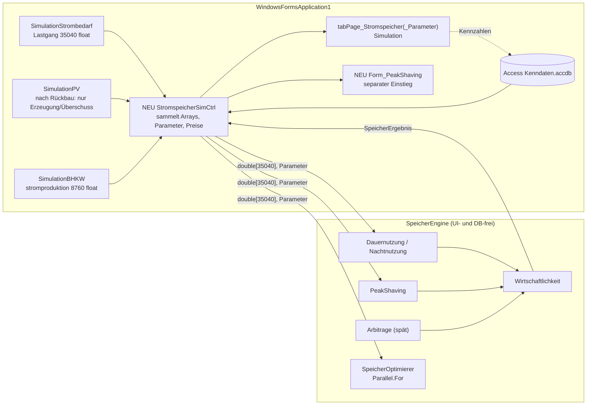

# Umsetzungskonzept: Stromspeicher-Modul EPOS-Plan

Stand: 2026-08-16, **V1.1** — revalidiert gegen den aktuellen Repository-Stand (Klon `Documents\WP-Plan`,
Commit `41e7bfd`; Delta in Abschnitt 1.4) · ergänzt das Fachkonzept `Konzept_Stromspeicher_EPOS-Plan.md`
(Rev. 4) · Grundlage: Vollprüfung der Codebasis (`WindowsFormsApplication1`) **einschließlich** der bisher
nicht eingesehenen Simulationsklassen (`Allgemein\Simulation\*`) sowie Designer-Dateien, `.sln` und
`.csproj`; Erstprüfung (1.1–1.3) an einer Arbeitskopie vom ~27.07.2026, Abgleich mit der Gegenwart in 1.4.

> **Verhältnis der Dokumente.** Das Fachkonzept (Rev. 4) definiert *was* gebaut wird — Betriebsarten,
> Algorithmen, Preismodell, Parameter, Etappen. Dieses Umsetzungskonzept dokumentiert (A) den **verifizierten
> Ist-Stand der App** nach Schließung aller Prüflücken, (B) die daraus folgenden **Korrekturen und
> Präzisierungen** am Fachkonzept und (C) den **konkreten Bauplan**: Arbeitspakete mit Dateien, Schema-
> Änderungen, Tests und Abhängigkeiten. Peak-Shaving ist gemäß Rev. 4 eine **separate Funktionalität**
> mit eigenem Einstieg.

---

## 1. Ergebnis der Umsetzungsprüfung

### 1.1 Umsetzungsstand des Konzepts: nicht begonnen

Eine Volltextsuche über das gesamte Projekt (`*.cs`, `*.sql`, `*.csproj`) nach den Konzeptbegriffen
(`SpeicherEngine`, `ISpeicherStrategie`, `Tab_StromspeicherVariante`, `Tab_ErgebnisStromspeicher`,
`Tab_Preisreihe`, `Spotpreis`, `Netzlade`, `PeakShaving`, `Arbitrage`, `Stromsteuer`, `Netzentgelt`) trifft
ausschließlich die beiden Konzeptdokumente selbst. `Model\StromspeicherModel.cs` hat unverändert die acht
Bestandsfelder (`ID`, `Bezeichner`, `Typ`, `Leistung`, `Energie`, `Degradation`, `Ladezustand`,
`Modulkosten`); `migration.manuell.sql` enthält keine Stromspeicher-Neuerungen. **Vom Fachkonzept ist nichts
umgesetzt; es existieren nur die bekannten Bestandsrudimente (1.2).**

### 1.2 Der Simulationskern — Befunde aus den erstmals eingesehenen Klassen

Die Aussagen des Fachkonzepts zu `Allgemein\Simulation\*` waren aus Aufrufstellen abgeleitet. Die direkte
Einsicht bestätigt sie im Wesentlichen und liefert folgende neue, umsetzungsrelevante Fakten:

**(a) `SimulationSSP` ist ein Stub ohne Rechenlogik.** `Berechnung(int ID_Projekt)`
(`SimulationSSP.cs:15-49`) liest alle `SP_TYP`-Anlagen des Projekts, summiert deren `Energie` und setzt
kurioserweise `MaxLadeLeistungKW = SpeicherKapazitaetKWh` (`:37`, Kapazität als „Leistung"). Die
anschließende „Simulation" (`:41-47`) schreibt ausschließlich **Nullen** in `Stromgespeichert[35040]` und
gibt dieses Nullen-Array zurück. `SimulationControl.Do_Simulation` zieht es vom Reststrom ab
(`SimulationControl.cs:199-204`) — **wirkungslos** — und setzt dennoch `bSimulationSSP = true` (`:203`),
das als `Tab_Ergebnis.Sim_Stromspeicher` persistiert wird (`Form_Simulation_Detail.cs:980`).
Das Flag bedeutet heute also nur „Tool 6 war aktiv", nicht „Speicher wurde gerechnet".
*Konsequenz: Die Ablösung von Rudiment 1 (Fachkonzept 8.2) ist trivial; es gibt keine Fachlogik zu erhalten.*

**(b) Die reale Batterielogik steckt in `SimulationPV.Berechnung` (`SimulationPV.cs:142-187`).**
Eigenschaften: stündliches Raster (8.760), **verlustfrei** (kein η beim Laden/Entladen), Start-SoC 0,
SoC-Band 0…Kapazität (kein Min/Max-Band), „Leistungsgrenze" = aufsummierte Kapazität in kWh/h (`:85`,
faktisch wirkungslos), Wechselrichterfaktor 0,95 nur auf die PV-Erzeugung (`:128`). Kapazität wird wie in
(a) allein aus `Tab_Stromspeicher.Energie` gelesen (`:74-86`) — `Leistung`, `Ladezustand`, `Degradation`
und sämtliche `Tab_Einstellungen`-Ladeparameter fließen **nicht** ein. Die Entladung wirkt gegen die
Gesamt-Restlast; **`Stromproduktion[i] = Direktverbrauch + Speicherentnahme`** (`:183`) — der heutige
PV-Ertragsausweis enthält also die Speicherwirkung. Getrennt vorhanden: `Stromproduktion_OhneSpeicher`
(`:184`). Der SoC wird für die Anzeige **interpoliert** auf Viertelstunden gespreizt
(`Stundenwerte_zu_viertelstunden_Interpoliert`, `:199`, `:216`).
*Konsequenz: Beim Rückbau (AP2) wird `SimulationPV` wieder reine PV-Rechnung; als PV-Ausweis dient
`Stromproduktion_OhneSpeicher`-Semantik. Autarkie- und Ertragskennzahlen ändern sich dadurch sichtbar —
gegenüber Anwendern zu kommunizieren.*

**(c) Ablauf `Do_Simulation` verifiziert** (`SimulationControl.cs:112-213`): Basis-Strombedarf
(`Strombedarf_viertelStundenwerte`, direkte Referenz ohne Clone, `:115`) → **plus** WP- und
Heizstab-Strombedarf (`:141-144`) → **plus** Kessel-Hilfsstrom (`:155-156`) → **minus** BHKW-Erzeugung
(`:180-184`) → **minus** PV inklusive Batterie (`:190-196`) → **minus** SSP-Stub (`:199-204`) →
`Reststrom = Sum/4000` [MWh] (`:211`). Die De-facto-Merit-Order „BHKW deckt die Last vor PV" entspricht
exakt der Konzeptkonvention 2.2 — die Kontinuität ist gesichert.

**(d) `Stundenwerte_zu_viertelstunden` = Wertwiederholung, bestätigt** — identisch implementiert in
`SimulationControl.cs:408`, `SimulationPV.cs:206-214`, `SimulationStrombedarf.cs:256`. Die Adapterschicht
des Fachkonzepts (3.3) kann dagegen exakt testen.

**(e) Die 8.760/35.040-Unstimmigkeit ist geklärt.** `Stromprofil_Strombedarf_berechnen` liefert
**`float[8760]`** (`SimulationStrombedarf.cs:125-201`, Puffer `:130`); die Expansion auf 35.040 passiert
erst in `Berechnung` (`:73`), danach wird die Projektganglinie addiert (`:106-107`, bei `Zeitinterval = 1`
zuvor expandiert `:104`). Der Befund „`Form_Stromverbraucher` kopiert ein 8760er-Ergebnis in ein
35.040er-Array und rechnet mit Stunden-Monatsgrenzen" ist damit eine **Altlast des Formulars**, nicht der
Simulation.

**(f) Einheiten im Lastpfad — geklärt (AP0).** `BhkwPlan.StromWocheToJahr` normiert mit Faktor ×1.000
(`BhkwPlan.cs:193`); die Monatswerte der Stromverbraucher werden in **MWh** eingegeben (alle zwölf
Monatsfelder in `Form_EingDBStromverbraucher` tragen das Label „MWh", ebenso die Ergebnisanzeige). Die
Profilausgabe ist damit **kWh je Stunde (kW)** und **konsistent** zum in kW addierten Ganglinienpfad
(`SimulationStrombedarf.cs:106-115`); die `/4000`-Summen ergeben korrekt MWh. Kein Bestandsfehler; ein
laufender Gegen-Test mit Testprojekt bleibt optional.

**(g) Die projektweiten Ladeparameter sind heute wirkungslos.** `Ladefuellstand_Min/_Max`,
`Ladeleistung_Max`, `Ladeschwellwert` werden ausschließlich in `KonfigurationModel`/`KonfigurationCtrl`
und der Parameter-UI verwendet — **kein einziger Simulationszugriff**. Die Migration nach Fachkonzept 5.6
ist damit ohne Verhaltensrisiko; `Ladeschwellwert` kann bedenkenlos auf die Arbitrage-Schwelle abgebildet
werden.

**(h) Die Ergebnisseite ist leer.** `tabPage_Stromspeicher` enthält im Designer **kein einziges Control**
(`Form_Simulation_Detail.Designer.cs:2739-2743`) — es gibt heute keinerlei Speicher-Ergebnisanzeige. Die
Parameterseite trägt die vier wirkungslosen Felder aus (g). `FormMain.listView_SP` zeigt sechs Spalten
(Name, Typ, Leistung, Energie, Degradation, Ladezustand; `FormMain.cs:266-302`).

**(i) Konstanten und Verdrahtung:** `SP_TYP = 4`, `REF_SP_TYP = 6` (`WizardItemClass.cs:29,31`);
`WizardCtrl.Add_SP` hartcodiert `@type = 4` (`WizardCtrl.cs:331`). `Form_Stromspeicher.cs:108` schreibt
zunächst die **STAMM**-ID in `ID_SP`, `WizardCtrl.cs:159-160` ersetzt sie beim Persistieren durch die
Projekt-ID (`CopyFromStamm`) — funktional korrekt, aber fragil. Bei Nicht-Speicher-Zeilen ist `ID_SP`
NULL in der DB und 0 im Model; `SimulationSSP.cs:31`/`SimulationPV.cs:79` bauen daraus `WHERE ID=0`.

**(j) Bestandsbugs mit Modulbezug** (Fix-Empfehlung in AP0):
`WErzeugerCtrl.ReadAllFilter:165` verwendet `&` statt `&&` (Azimut-Spalte → `ArgumentException`-Risiko);
`ReadAllFilter:146` liest `Rücklauf` (mit Umlaut), `ReadSingle:191` `Ruecklauf` — eine der beiden Stellen
lädt still nichts; `Form_Stromspeicher` fügt dasselbe `model`-Objekt mehrfach in die Auswahlliste ein
(`:11`, `:113`); durchgängige SQL-String-Konkatenation über `RecordSet`.

**(k) Vier statt drei Speicher-Rudimente.** Zur Ablösetabelle des Fachkonzepts (8.2) kommt der leere
Ergebnis-Tab (h) als vierte Stelle hinzu, die das neue Modul bespielen muss:
(1) SSP-Stub, (2) `SimulationPV`-Batterie samt SoC-Chartserie, (3) unabhängige `DashboardForm`-Rechnung,
(4) leerer `tabPage_Stromspeicher`.

### 1.3 Infrastruktur-Korrekturen

| Punkt | Bisherige Annahme | Verifizierter Stand | Konsequenz |
|---|---|---|---|
| Solution | „keine `.sln`" (CLAUDE.md, Befunde Rev. 2) | **`WP-Plan.sln` existiert** im Root, referenziert `WindowsFormsApplication1.csproj`, Konfigurationen Debug/Release × x86/x64 | Die SpeicherEngine kann als **eigenes Klassenbibliotheks-Projekt** in die Solution — sauberer als der Ordner/Namespace-Kompromiss aus Fachkonzept 8.1 |
| Plattform | „x86-Pflicht" | `PlatformTarget` je Konfiguration: x86 **und** x64/AnyCPU vorhanden (`.csproj:22,41,44`) | Engine als AnyCPU-Library; das Hauptprojekt lädt sie in jeder Konfiguration |
| Pakete | ScottPlot 5.1.57 / MathNet 5.0.0 / BouncyCastle 2.7.0 referenziert | bestätigt (`.csproj:66-96`); zusätzlich `Mscc.GenerativeAI` 3.1.0 (Gemini-Anbindung, Ordner `Allgemein\KI`) | ScottPlot-Entscheidung (Frage 6) bleibt offen; kein LP-Solver — Greedy-Ansatz bestätigt |
| CSV | „`CsvReader.cs` existiert, ungenutzt" | Eingebettete **NReco.Csv**-Bibliothek (MIT): freies Trennzeichen, Quote-Handling, TrimFields, 32-kB-Puffer | Taugliche Basis für den erweiterten Lastgang- und Spotpreis-Import (AP5/AP4) — kein neuer Parser nötig |
| Referenztest-Assets | `notes/psim_daten.csv` | liegen unter `Documents\Stromspeicher\Claude_Analyse_V7\referenzdaten\` (`psim_daten.csv`, `psim_param.csv`), VBA-Quelltexte unter `vba_quelltext\`, Portierungsreferenz `speicher_sim.py` | werden in das Testprojekt kopiert (AP1) |

### 1.4 Revalidierung gegen den aktuellen Repository-Stand (V1.1)

Die Abschnitte 1.1–1.3 wurden an einer veralteten Arbeitskopie (~27.07.2026) erhoben. Nach dem Umzug auf
den frischen Klon (`Documents\WP-Plan`, Commit `41e7bfd` vom 16.08.2026 — 100 Commits neuer) wurden alle
betroffenen Aussagen gegen den echten Stand geprüft. Die Kerndateien `SimulationSSP.cs`, `SimulationPV.cs`,
`StromspeicherModel.cs`, `WizardItemClass.cs`, `BhkwPlan.cs`, `StromTestClass.cs` sind **byteidentisch** —
die Befunde 1.2 (a), (b), (e), (f) gelten unverändert. Das Delta:

| Thema | Stand nach Revalidierung |
|---|---|
| Simulationskette | fachlich unverändert, aber verschoben: SSP-Stub-Aufruf jetzt `SimulationControl.cs:464-470`, PV `:455-462`, Reststrom `:477`; `Do_Simulation` heißt `Do_Simulation_Intern` (`:244`). **Neu: zweiter Rechenweg** hinter dem Feature-Flag `Tab_Einstellungen.Kaskade_Zweikanalig` (`:379-453`, `Kaskade_Zweikanalig():527-708`) — PV- und Speicherblock liegen gemeinsam **hinter** der Verzweigung, der Strombedarfsvektor entsteht davor aber auf zwei Wegen; das Speichermodul muss beide bedienen |
| „Kessel-Hilfsstrom" | präzisiert: `simulation_spk.Stromverbrauch_stuendlich` ist der volle Stromverbrauch eines **Elektrokessels** (nur bei `Brennstoff_Art == 13`, `SimulationSPK.cs:265-272`), für alle anderen Brennstoffe Nullvektor |
| Alt-Bugs (1.2 j) | (a) `&`-Guard und (b) `Rücklauf`-Inkonsistenz sind im aktuellen Stand **bereits behoben** (eine gemeinsame Leseabbildung `WErzeugerCtrl.AusZeile:174-243`, Guard `Belegt:246-249`); **(c) besteht fort:** geteiltes `model`-Objekt in `Form_Stromspeicher.cs:11/:113`. Die AP0-Fixes am Altstand sind damit obsolet und wurden bewusst nicht übertragen |
| ID_SP-Kette (1.2 i) | **repariert:** `WizardCtrl.Add_WP_Waermeerzeuger:381-385` schreibt vor dem INSERT die Projekt-ID (`StromspeicherCtrl.CopyFromStamm:194-251`, idempotent); Leseseite (`SimulationSSP.cs:31` u. a.) passt. Restrisiko nur bei Altdatensätzen, die nie neu gespeichert wurden |
| Ladeparameter (1.2 g) | weiterhin ohne jeden Simulationszugriff; `KonfigurationCtrl.ReadSingle` unverändert `row[0..22]` (`:45-67`). **Neu: etabliertes Erweiterungsmuster** — jüngere `Tab_Einstellungen`-Spalten (`Kaskade_Zweikanalig`, `Extrapolation_erlaubt`) werden **namensbasiert** gelesen (`:82-85`, `:108-112`) und über eigene, zielgenaue UPDATEs geschrieben (`:398-409`); die Ordinalkette wird bewusst nicht mehr verlängert |
| **Migration** | **Der maßgebliche Ausrollweg ist die versionierte `SchemaMigration`** nach `Allgemein\Simulation\ADR-001_Schema-Ausrollung.md`: `Allgemein\Update\SchemaMigration.cs` (`ZIEL_VERSION = 10`, `:49`; Schrittregister `:204-257`; DDL `ALTER TABLE … ADD COLUMN` mit `Columns.Contains`-Vorabprüfung `:804-806`) + `SchemaKatalog.cs` (Katalogarrays, z. B. `Schritt1_Energieanlagen:89-111`); Versionsmarker `Tab_Applikation.SchemaVersion`; stille Rückfallebene `WaermequelleClass.SchemaSicherstellen()`. So wurden die 27 neuen `Tab_Energieanlagen`-Spalten ausgerollt. `migration.manuell.sql` ist reine Alt-DB-Datenübernahme (kein einziges ALTER TABLE) und laut ADR-001 ausdrücklich **kein Ausrollpfad**; `UpdateDatabaseFromScript` existiert im aktiven Projekt nicht mehr |
| `Tab_Energieanlagen` | jetzt **57 Spalten** (29 Bestand + 27 neue Quellen-/Senken-Parameter `WQ_*`/`WS_*`, u. a. `WS_Ladeprio`, `WS_Ladegrenze`; NULL-Semantik: FK-Spalten NULL statt 0, 0 = „nach Vorgabe" — `WErzeugerModel.cs:62-173`); einheitlicher Insert über `WizardCtrl.SQL_ANLAGE_INSERT:153-168` |
| Speicher-UI | `tabPage_Stromspeicher` weiterhin **leer** (`Designer.cs:2739-2743`), erscheint aber in der Navigation samt Batterie-Icon (`Form_Simulation_Detail.cs:1431-1437`, `:1655-1666`); Ladeparameter-Felder unverändert (`Designer.cs:1602-1617`; Lesen `:3625-3631`, Schreiben `:3680-3713`). **Neu: KonfigUI-Kartenansicht** (`Form_Simulation_Config.Karten.cs`, `ErzeugerKarte.cs`, `SpeicherKarte.cs`, Schema-Ansicht) — die „Speicherkarten" zeigen ausschließlich **Wärme-Pufferspeicher**; der Stromspeicher ist dort nur eine Erzeuger-Gruppenkarte, die `Tool_6` setzt (`Karten.cs:584-585`). Die geplante AP3-Parameter-UI kollidiert nicht |
| Ergebnis-Flag | `Sim_Stromspeicher` wird jetzt in **`SimulationRunner.cs:217`** aus `bSimulationSSP` gesetzt und über `ErgebnisCtrl.cs:136/151` persistiert — der Lauf „behauptet" also weiterhin eine Speicherrechnung trotz Stub |
| Dashboard | Rechnung unverändert (Bild aus 1.2/2.3 gilt); zusätzlich dokumentiert: Speichergröße aus hart verdrahtetem **Projekt 15** (`TabNavigationManager.cs:139`, Rückfall 5 kWh `:151`) und fehlender 0,95-Faktor im Monatsdiagramm (`DashboardForm.cs:281` vs. `:204`) — Kachel und Balken rechnen unterschiedlich |
| Infrastruktur | `DataRepository` ist Hausstandard (98 Dateien; `RecordSet` = Altbestand mit stillen Fehlern und `EOF()`-Vorlese-Falle) und hat einen neuen **`EngineModus()`** für headless Läufe (`DataRepository.cs:68-86`; prozessweit, **nicht threadgebunden** — Datenzugriff daher vollständig vor die `Parallel.For`-Rastersuche legen, wie ohnehin vorgesehen). `ChartManager` ist **`internal`** (`:10`) — Anzeigecode bleibt im Hauptprojekt; für 35.040 Punkte `MaxXVALUE` **und** `MitViertelStunde` setzen (Vorbild `NavigatorStrom.cs:170-171`); Sekundärachse nur als Copy-Muster (`Form_Simulation_Detail.cs:3362-3392`). **`CsvExportClass` existiert inzwischen** (seit 27.07.; `Export`-Signatur `:97`, eingebaute Rasterumrechnung 8760↔35040 `:235-259`) — aber dialoggebunden (SaveFileDialog + MessageBoxen); für Peak-Shaving-/Batch-Export ist eine headless Variante zu ergänzen. Zwei neue `CLAUDE.md` (Root + Projekt) mit verbindlichen Konventionen: Drei-Schichten-Regel (`DbWerte`/Schlüssel/`MyResource`), `DataRepository`-Pflicht für neuen Code, 93 Nicht-UTF-8-Dateien, kein Testprojekt im Bestand (`SpeicherEngine.Tests` ist das erste) |
| Kostenmodul | `energy_project_settings` unverändert — der AP4-Andockpunkt gilt. **Neu daneben:** komplettes Wirtschaftlichkeitsmodul `Allgemein\Wirtschaftlichkeit\` (`WirtschaftlichkeitCtrl` mit 6 lazy per `CREATE TABLE` angelegten Tabellen, `:37-42`, `:72-190`) — die Speicher-Wirtschaftlichkeitsausweise (Fachkonzept 7.1) sollen dort andocken statt parallel zu existieren (AP3/AP4) |

---

## 2. Zielarchitektur

### 2.1 Projektstruktur

```
WP-Plan.sln
├── WindowsFormsApplication1\            (Bestand, UI + Controller + Simulation)
├── SpeicherEngine\SpeicherEngine.csproj (NEU: classlib, net8.0, AnyCPU,
│                                         keine Referenz auf WinForms, DB oder WPPlan.Core)
└── SpeicherEngine.Tests\                (NEU: xunit, net8.0; TestData\psim_daten.csv, psim_param.csv)
```

Engine-Klassen gemäß Fachkonzept 8.1: `SpeicherParameter`, `PreisZeitreihe`, `SpeicherEingang`,
`SpeicherErgebnis`, `ISpeicherStrategie` (`Dauernutzung`, `Nachtnutzung`, `PeakShaving`, `Arbitrage`),
`SpeicherOptimierer`, `Wirtschaftlichkeit`. Intern `double[]`, 35.040/35.136 Intervalle, kW/kWh/ct-Konventionen
aus Fachkonzept 3.3/8.1. Portierungsvorlage ist `speicher_sim.py` — die Schleifenreihenfolge der Begrenzungen
und die sequenzielle Summation sind für die Bitgenauigkeit zu übernehmen.

### 2.2 Aufruf- und Datenfluss



Zwei Aufrufwege auf dieselbe Engine:

1. **Speichermodul in der Simulation** — Rechenaufruf per eigenem Button auf der Speicherseite (Fachkonzept
   8.3); zusätzlich ersetzt in der Simulationskette ein Engine-Aufruf (Dauernutzung, aktive Variante) den
   SSP-Stub an `SimulationControl.cs:464-470` — die Stelle liegt hinter **beiden** Rechenwegen (1.4), sodass
   der Reststrom der Gesamtsimulation den Speichereffekt in jedem Fall korrekt enthält. Ein Jahreslauf liegt
   im Millisekundenbereich und verlängert die Kette nicht spürbar.
2. **Peak-Shaving separat (Rev. 4)** — eigene Maske (`Form_PeakShaving`, Arbeitstitel): Auswahl einer
   Projektganglinie (oder Direktimport), Ad-hoc-Speicherparameter (P, SoC-Band, η, Schwelle/adaptiv, L_P),
   Aufruf der `PeakShaving`-Strategie, Ergebnis als Kennzahlenblock, Lastgang-Vorher/Nachher-Chart und
   CSV-Export. Kein Zwang zur PV/BHKW-Kette. UI-Verankerung des Einstiegs = offener Punkt 10 des
   Fachkonzepts (Vorschlag: eigener Navigationseintrag; alternativ Button auf der Ganglinien-Seite).

### 2.3 Rückbau des Bestands (präzisiert Fachkonzept 8.2)

| # | Stelle | Maßnahme |
|---|---|---|
| 1 | `SimulationSSP` | Klasse entfernen oder als dünnen Engine-Wrapper neu füllen; Aufruf `SimulationControl.cs:464-470` ersetzt durch `StromspeicherSimCtrl` → Engine (Dauernutzung, aktive Variante); `bSimulationSSP` (bzw. `Sim_Stromspeicher` via `SimulationRunner.cs:217`) erst nach erfolgreichem Engine-Lauf setzen |
| 2 | `SimulationPV.cs:142-187` | Batterie-Block entfernen; `Ueberschuss = Erzeugung − Direktverbrauch`, `Stromproduktion` = Direktverbrauch (heutige `_OhneSpeicher`-Semantik); `Speicherfuellstand(_viertelstunde)` entfällt am PV-Objekt — die Chart-Serie „Speicherfüllstand" (`Form_Simulation_Detail.cs:1664`, Sekundärachsen-Logik `:2098-2170`) wird aus `SpeicherErgebnis` gespeist (Interpolationsvariante beibehalten) |
| 3 | `DashboardForm.UpdateSimulationData/FillMonthlyChart` | eigene Speicherrechnung entfernen; Autarkiegrad, „Speichernutzen", CO₂ und Monatsdiagramm aus Engine-Ergebnissen speisen |
| 4 | `tabPage_Stromspeicher` (leer) | Ergebnisseite neu aufbauen: Kennzahlenblock (Fachkonzept 7.1), SoC-Chart, Export-Buttons (`InitCsvExportButtons`-Muster) |

---

## 3. Arbeitspakete

Größenklassen: **S** ≈ Tage, **M** ≈ 1–2 Wochen, **L** ≈ 2–4 Wochen (eine Person, inkl. Test). Reihenfolge
folgt dem Etappenplan des Fachkonzepts (Abschnitt 9), konkretisiert um Dateien und Abnahmekriterien.

### AP0 — Klärung und Sicherung (S) · vor allem anderen

| Inhalt | Detail |
|---|---|
| DB-Sicherung | **✔ erledigt (16.08.2026):** `C:\ProgramData\EPOS_PLAN\Kenndaten.accdb` → `DB-Backup\Kenndaten-16.08.2026-vor-Stromspeicher.accdb` |
| **Einheiten-Test Lastpfad** (Befund 1.2 f) | **✔ statisch geklärt:** Monatseingabe in MWh → Profilausgabe kWh/h (kW), konsistent zum Ganglinienpfad; kein Bestandsfix nötig. Optionaler Lauf-Gegen-Test: ein Verbraucher (Profil) gegen eine Ganglinie gleicher Energiemenge → gleicher `Strombedarf_gesamt` |
| Entscheidungsfragen | **✔ beantwortet (16.08.2026):** Frage 2 = nicht persistieren; Frage 5 = Start-SoC in % / Modulkosten €/kWh; Frage 8 = SoC_min. Offen: 1, 3, 4, 6, 7, 9, 10 |
| Bugfix-Minipaket (empfohlen) | **✔ erledigt am Altstand — von der Revalidierung überholt (1.4):** (a) `&`→`&&` und (b) `Rücklauf`-Inkonsistenz sind im aktuellen Repository-Stand bereits anderweitig behoben (`WErzeugerCtrl.AusZeile:174-249`); die Altstand-Fixes wurden nicht übertragen. Offen bleibt nur (c) geteiltes `model`-Objekt (`Form_Stromspeicher.cs:11/:113`) — als Kleinstfix in AP2/AP9 mitnehmen |

### AP1 — SpeicherEngine + Referenztest (M) · Etappe 1

> **✔ Erledigt (16.08.2026) — Meilenstein M1 erreicht.** Umsetzung im Klon `Documents\WP-Plan`:
> `SpeicherEngine` (10 Klassen, net8.0, AnyCPU, referenzfrei) + `SpeicherEngine.Tests` (xunit, net9.0,
> **48 Tests, alle grün**) in `WP-Plan.sln` aufgenommen, ProjectReference im Hauptprojekt gesetzt.
> Referenzergebnis: SoC in allen 35.137 Intervallen **bitgenau** (0 Abweichungen), Σ F =
> 60.616,562388122424 € **bitgleich**, Wirtschaftlichkeitsblock relativ ~10⁻¹⁵ (gefordert ≤ 10⁻¹²),
> RBF_deg(0,001; 0,03; 20) = 14,7514. Testdaten liegen md5-identisch unter `SpeicherEngine.Tests\TestData\`.
> Bewusste Detailentscheidungen: ULP-Toleranzen (1e-12 €) statt stiller Klemm-Logik am SoC-Band.
> **Noch nicht committet** — das Syncen macht der Anwender über `GitHub_Sync.bat`.

* Projekte `SpeicherEngine` + `SpeicherEngine.Tests` anlegen, in `WP-Plan.sln` aufnehmen,
  Referenz vom Hauptprojekt setzen. Toolchain-Hinweis (AP0-Befund): Das Hauptprojekt baut wegen seiner
  COM-Referenzen (Excel-Interop/VBIDE, MSB4803) nur unter Visual Studio/Full-MSBuild; die COM-freien
  Engine- und Testprojekte bauen und testen dagegen auch mit `dotnet build`/`dotnet test` — damit CI-fähig.
* Port von `speicher_sim.py`: `Dauernutzung` (energetisches Verlustmodell **und**
  Excel-Kompatibilitätsmodus), `Wirtschaftlichkeit` (Annuität, NPV, Amortisationen, `RBF_deg` nach
  Fachkonzept 5.3), sequenzielle `double`-Summation.
* Referenzdaten nach `SpeicherEngine.Tests\TestData\` kopieren
  (aus `Documents\Stromspeicher\Claude_Analyse_V7\referenzdaten\`). CSV-Einlesen im Test mit
  `double.Parse(s, InvariantCulture)` — kein „schneller" Parser (Rundungsfalle aus der
  Python-Verifikation).
* **Abnahme:** SoC-Verlauf exakt identisch; Σ F = 60.616,562388122424 € (Toleranz ≤ 10⁻⁹ €);
  Wirtschaftlichkeitsblock relativ ≤ 10⁻¹² gegen `psim_param.csv`. Freischaltungsprüfung
  (`status & 0x4`, `Tool_6`) dokumentiert. *Damit ist die V7-Mappe ersetzt.*

### AP2 — Anbindung, Verlustmodell, Ablösung des Bestands (L) · Etappe 2

> **Teilstatus (V1.1):** AP2 wurde in zwei Schritte geteilt. **AP2a ✔ erledigt (16.08.2026):**
> `RasterAdapter` (bitgleich zur Bestands-Wertwiederholung), `Vorverarbeitung` (Formeln aus Fachkonzept 6),
> Quellenmatrix Grün/Grau mit Merit-Order PV vor BHKW, `SpeicherKennzahlen` (Quellenanteile, n_zyk, K_ver
> als reiner Ausweis), dünner `StromspeicherSimCtrl` im Hauptprojekt (Aggregation aller `SP_TYP`-Anlagen,
> Start-SoC aus `Ladezustand` % ins Band geklemmt, PV-Quelle `Stromproduktion_Theoretisch` — bewusst nicht
> die speicherbehaftete `Stromproduktion`; vorläufige Preiskonstanten mit TODO auf AP3/AP4).
> **48 → 102 Tests, alle grün**; V7-Referenz bitgenau unberührt; energetischer Modus ohne BHKW-Reihe
> bitgleich zur AP1-Schleife (Äquivalenzanker über volle Jahresläufe, η_RT = 0,81/0,90/1,00).
> Schaltjahr-Eingänge (35.136) lehnt die Engine bis AP5 bewusst per ArgumentException ab.
>
> **AP2b ✔ erledigt (16.08.2026 spätabends):** Engine-Einbau in die Kette (`SimulationControl.cs:509-534`,
> Engine-Aufruf `:3215-3272`; abgezogen wird nur die **Entladung** — statisch bewiesen, dass die Subtraktion
> nie geklemmt wird; beide Rechenwege verifiziert). Engine additiv um die Intervallreihen
> `LadungAcKwh`/`EntladungAcKwh` erweitert (**102 → 111 Tests, alle grün**). `SimulationPV` auf reine
> PV-Rechnung zurückgebaut — alle PV-Ausweise jetzt ohne Speicherwirkung (Frage 12 umgesetzt; zehn
> Anzeigestellen konsistent, SoC-Chartserie nativ in 35.040 aus dem `SpeicherErgebnis`). `SimulationSSP`
> **gelöscht**; `Sim_Stromspeicher` wird nur noch bei erfolgreichem Engine-Lauf gesetzt. `DashboardForm` auf
> die Engine umgestellt, dabei zwei Bestandsfehler behoben (Projekt-15-Hardcode in
> `TabNavigationManager.cs:139`, 0,95-Doppelzählung Kachel vs. Monatsdiagramm). Kleinstfix geteiltes
> `model`-Objekt erledigt. Prüfbuild 0 Fehler, keine neuen Warnungen; Encoding/Zeilenenden aller 15
> geänderten Dateien nachgewiesen. Offen → AP3: Speicher-Segment im Strom-Donut
> (`NavigatorUebersicht.cs:278-300`), echte Parameter statt Platzhalterkonstanten im Controller,
> App-Lauf gegen ein reales Speicherprojekt als Abnahme.

* Adapterschicht `ZuViertelstundenDouble` / `ZuFloat`; Unit-Test: wertgleich zu
  `Stundenwerte_zu_viertelstunden` (Wertwiederholung, 1.2 d).
* Neuer Controller `StromspeicherSimCtrl` (Hauptprojekt): beschafft Lastgang
  (`SimulationStrombedarf` inkl. Anlagen-Eigenbedarf gemäß `Do_Simulation`-Kette), PV-Reihen
  (`SimulationPV`), BHKW-Reihe (expandiert), Parameter und Preise; übergibt reine Arrays an die Engine.
  `StromTestClass` dient als Wegwerf-Gerüst und wird danach entfernt.
* Quellenmatrix Grün/Grau, BHKW-Überschussbildung, energetisches Verlustmodell, Degradation,
  Verschleißkosten-Ausweis (Fachkonzept 2, 5.2–5.4).
* **Rückbau nach 2.3** (Stub, PV-Batterie, Dashboard, SoC-Chartquelle) inklusive Umstellung des
  PV-Ausweises auf „ohne Speicherwirkung" — Änderungshinweis für Anwender in die Release-Notes.
* **Neu nach Revalidierung (1.4):** Der Engine-Ersatz des SSP-Stubs erfolgt an
  `SimulationControl.cs:464-470` und liegt hinter **beiden** Rechenwegen — bei aktivem
  `Kaskade_Zweikanalig`-Flag entsteht der Lastvektor jedoch anders (`:379-453`): beide Wege testen.
  Für DB-Zugriffe im Rechenpfad `DataRepository.EngineModus()` verwenden (MessageBox-Unterdrückung;
  prozessweit, daher Datenzugriff vor jeder Parallelisierung abschließen). Das Ergebnis-Flag
  `Sim_Stromspeicher` wird in `SimulationRunner.cs:217` gesetzt und dort auf „echter Engine-Lauf"
  umgestellt.
* **Abnahme:** reales Projekt rechenbar; Energiebilanz je Intervall schließt
  (Last = Direkt + Entladung + Netzbezug; Erzeugung = Direkt + Ladung + Einspeisung); keine zwei
  Speichermodelle mehr im Programm; beide Rechenwege (Flag an/aus) liefern konsistente Speicherwirkung.

### AP3 — Schema, Parameter-UI, Ergebnisanzeige (M) · Etappe 3

> **Teilstatus (V1.1):** AP3 läuft in zwei Schritten. **AP3a ✔ erledigt (16.08.2026 spätabends):**
> Migrationsschritt 11 mit vier Teilen — Gerätespalten `Wirkungsgrad_RT`, `Zyklen_Zugesichert`,
> `Verschleisskosten`, `Leistungskosten`, `Investition_Fix`, `Standby_Verbrauch` in
> `Tab_Stromspeicher(_STAMM)`; neue Tabellen `Tab_StromspeicherVariante` (18 Spalten, FK auf
> `Tab_Energieanlagen` mit ON DELETE CASCADE) und `Tab_ErgebnisStromspeicher` (40 Kennzahl-Skalare);
> idempotente DML-Übernahme (je SP-/REF-Anlage eine Variantenzeile, erste je Projekt aktiv);
> `ZIEL_VERSION = 11`. **DDL/DML-Trockentest gegen eine DB-Kopie vollständig grün** — CASCADE-Löschweitergabe
> verifiziert, Wiederholungslauf ohne Duplikate; Befund: in allen 14 Projekten der Produktiv-DB stehen die
> Alt-Ladeparameter auf 0, es greift überall die 10/90-%-Vorgabe. Dazu `StromspeicherVarianteModel/Ctrl`,
> `ErgebnisStromspeicherModel` + `ErgebnisCtrl`-Save/Load nach dem PV-Muster (an `Sim_Stromspeicher`
> gekoppelt), `Form_AdminStromspeicher` um die Gerätetechnik-Spalte erweitert (zweisprachig). Prüfbuild
> 0 Fehler, Encoding nachgewiesen. **Realer Migrationslauf = nächster App-Start unter x86 (Abnahmepunkt).**
> **AP3b ✔ erledigt (17.08.2026 früh):** Parameter-UI je Variante (Altfelder auf
> `Tab_StromspeicherVariante` umgehängt, Ladeleistung als schreibgeschütztes Gerätedatum; neue Eingaben
> Betriebsart, Quellen-Schalter, Kompatibilitätsmodus, Kapitalzins, Nutzungsdauer, L_P, a_netzlade —
> Ausbaustufen-Schalter ausgegraut). Ergebnisseite `tabPage_Stromspeicher` erstmals aufgebaut
> (Kennzahlen-ListView mit 33 Zeilen inkl. Zyklen-Ampel, SoC-Jahresgang-Chart mit `MaxXVALUE` **und**
> `MitViertelStunde`, CSV-Export; Bildschirm und `Tab_ErgebnisStromspeicher` nutzen dieselbe
> Mapping-Methode `StromspeicherSimCtrl.AlsErgebnismodell`). Controller liest echte Geräte- und
> Variantenparameter (kapazitäts- bzw. leistungsgewichtete Aggregation, dokumentierte Rückfälle mit
> Protokollhinweisen; Bezugspreis/Vergütung bleiben bis AP4 Fixpreis-Platzhalter). Strom-Donut um das
> Segment „Speicherentladung" ergänzt, `FormMain.listView_SP` um Ertrag/Amortisation + Aktiv-Marker.
> 111/111 Engine-Tests grün; Prüfbuild via Full-MSBuild (VS 2022): 0 Fehler, keine neuen Warnungen;
> 92 neue Ressourcenschlüssel de/en synchron. **Offen:** Sichttest der neuen Layouts und der
> Migrationslauf (Schema V11) beim ersten App-Start; neuer Bestandsbefund Donut-Einheitenmix → Frage 16.

* Schema: neue Spalten `Tab_Stromspeicher(_STAMM)` (Parameterliste Fachkonzept 5.1), neue Tabellen
  `Tab_StromspeicherVariante` (1:1 zu `Tab_Energieanlagen.ID`) und `Tab_ErgebnisStromspeicher`.
  **Ausrollweg (V1.1, ersetzt die frühere Vorgabe):** versionierte `SchemaMigration` nach ADR-001 —
  Katalogeinträge in `SchemaKatalog.cs` (Muster `Schritt8_Energietraeger:200-233`; STAMM- und
  Projekttabelle im selben Eintrag), `ZIEL_VERSION` 10 → 11 (`SchemaMigration.cs:49`), Migrationsschritt
  als Einzeiler über `SpaltenAnlegen` (`:545-548`) plus `CREATE TABLE`-Schritt für die neuen Tabellen,
  Registereintrag (`:204-257`). `Tab_Stromspeicher` wird nirgends ordinal gelesen (durchgängig
  `Columns.Contains`) — Spaltenanbau ist gefahrlos; nachzuziehen sind `StromspeicherModel`,
  `StromspeicherCtrl.ReadAll/ReadSingle/CopyFromStamm:220-234`, `StromspeicherStammCtrl.Insert:78-92` /
  `Update:110-124` und `Views\Stromspeicher\*`. **`Tab_Einstellungen`: die Ordinalkette
  `ReadSingle` (`row[0..22]`) NICHT verlängern** — neue Spalten namensbasiert lesen und per zielgenauem
  UPDATE schreiben (Hausmuster `KonfigurationCtrl.cs:82-85` / `:398-409`). IDs nach Hausmuster
  `MAX(ID)+1`; `migration.manuell.sql` bleibt unberührt (reine Alt-DB-Übernahme, kein Ausrollpfad).
* Migration der vier projektweiten Ladeparameter auf die Variante (risikofrei, Befund 1.2 g);
  `Modulkosten`→`c_cap`- und `Ladezustand`-Entscheid aus AP0 umsetzen.
* `ErgebnisStromspeicherModel` + `ErgebnisCtrl`-Erweiterung nach dem Muster
  `Tab_ErgebnisPhotovoltaik(+Modul)`; `Sim_Stromspeicher`-Flag künftig nur bei echtem Engine-Lauf.
* UI: Parameterseite (`tabPage_Stromspeicher_Parameter`) mit vollständiger Parameterliste,
  Kultur-Regel „UI `CurrentCulture`, DB/Datei `InvariantCulture`"; **Ergebnisseite
  `tabPage_Stromspeicher` erstmals aufbauen** (1.2 h); `FormMain.listView_SP` um Ertrag [€/a] und
  Amortisation [a] ergänzen; Labels zweisprachig (`MyResource`).
* **Abnahme:** Altprojekt öffnet fehlerfrei (Migrationsprotokoll), Parameter persistieren je Variante,
  Kennzahlen erscheinen auf der Ergebnisseite und in der Übersicht.

### AP4 — Preis- und Vergütungsmodell (M) · Etappe 4

> **✔ Erledigt (17.08.2026):** Migrationsschritt 12 (`ZIEL_VERSION = 12`): 17 Spalten — Aufschlagskomponenten
> mit Fachkonzept-Vorbelegung (6,44 / 2,946 / 2,05 / 0,11 / 0,20 ct/kWh, Stromsteuer-Schnellwahl 2,05/0,05),
> Vergütungen `v_pv`/`v_bhkw`, Reihen-/Profilverweise je Variante; neue Tabellen `Tab_Preisreihe(Daten)`
> (CASCADE) und `Tab_Kostenprofil`; Trockentest gegen DB-Kopie idempotent grün. Engine-`PreisModell` additiv
> (+41 Tests; Profil-Kalenderausrichtung bewusst deterministisch statt datumsabhängig wie die Wärme-Vorlage).
> **Spotimport mit der echten „Spotmarktpreise 2024.csv" End-zu-End verifiziert:** 8.784 Zeilen → 8.760
> Werte; 29.02. ausgelassen, März-Fehlstunde als Nachbarmittel ergänzt (6,5845 ct/kWh), Oktober-Doppelstunde
> gemittelt (8,133); Spannweite −13,545…209,681, 457 negative Stunden. UI: Aufschlagsblock am Strom-Carrier
> (`ucStromAufschlaege`), Kostenprofil-Editor, Spotimport-Dialog (zweistufig mit Protokoll), Gruppe
> „Preisbeschaffung" auf der Parameterseite mit Live-Bezugspreiszeile. Controller: neuer `StromPreisCtrl`
> mit fünfstufiger protokollierter Rückfallkette; **Preisversion** (`valid_from` + Preis) füllt das
> Ergebnisfeld. Andockanalyse Wirtschaftlichkeitsmodul: „kein zweites Rechenwerk" — Andockpunkt
> `WirtschaftlichkeitCtrl.BaueEingabe`/`KostenEmissionRechner` (Vier-Punkte-Empfehlung im AP4-Bericht).
> 207/207 Tests grün, Prüfbuild 0 Fehler, Encoding gewahrt (auch Nebenfund: NReco-`BufferSize`-Falle im
> neuen Aufrufer abgesichert). **Offen:** Sichttests der Masken; Migrationslauf 11+12 beim App-Start;
> „Simulationsjahr"-Feld → Frage 18; `ProjektDuplizierenCtrl`-Nachtrag für projektbezogene
> Preisreihen/Kostenprofile; `ID_Ergebnis`-Kopplung für die Aktualitätsprüfung des Wirtschaftlichkeitsmoduls.

`energy_project_settings` um Aufschlagskomponenten + Aktiv-Flags + Override erweitern (Fachkonzept 4.2);
Kostenprofil-Editor nach dem Muster `Form_Quellprofil` (12 + 7×24, `";"`-Serialisierung invariant);
Spotpreisimport auf NReco-`CsvReader`-Basis mit expliziter CET/CEST-Behandlung, Ablage
`Tab_Preisreihe(Daten)` nach Ganglinienmuster; Vergütungsregime `v_pv`/`v_bhkw`; `a_netzlade`;
Preisversionierung (Stichtagsregel) im Ergebnis ausgewiesen.
**Neu (1.4):** Für die Wirtschaftlichkeits-Ausweise an das inzwischen vorhandene Modul
`Allgemein\Wirtschaftlichkeit\` andocken (`WirtschaftlichkeitCtrl`, Tabellen `Tab_ProjektWirtschaftlichkeit`
u. a.) statt paralleler Strukturen; zu Paketbeginn prüfen, welche Kennzahlen dort bereits gerechnet werden.
**Abnahme:** „Spotmarktpreise 2024.csv" importiert 8.784 Stunden korrekt (März 23 h / Oktober 25 h),
`p_bezug`-Reihe = Arbeitspreis/Profil/Spot + aktive Aufschläge, Referenzfall Fixpreis 20 ct unverändert grün.

### AP5 — Lastgangimport erweitern (M) · Etappe 5

> **✔ Erledigt (17.08.2026):** Dreischichtige Import-Kette — testbare `GanglinienPruefung` in der Engine
> (Raster/Einheit/Schaltjahr/Sommerzeit/Plausibilität, sprachneutrale Protokollcodes), NReco-Leseschicht
> `GanglinienDatei` (CSV/TXT/Excel-Bulk-Read, Trennzeichen-/Dezimaltrenner-/Kopf-/Spaltenerkennung),
> Options-/Vorschaudialog + Validierungsprotokoll statt Abbruch-MessageBox. **111 → 166 Engine-Tests
> grün**; 13 End-zu-End-Fälle gegen eine DB-Kopie bestanden (35.136 → 35.040 datumsgenau, 8.784 → 8.760,
> Minuten-Mittelung 525.600 → 35.040, Sommerzeit-Lücke aufgefüllt/Doppelstunde gemittelt, kWh→kW, Excel,
> echte Lücke blockiert; Kultur- und Dezimaltrenner-Läufe bitgleich). Sicherheitsnetz in
> `SimulationStrombedarf` (Abbruch bei Raster-Mismatch nach dem Paket-8-Muster „kein Ergebnis, das
> vollständig aussieht"). Encoding inkl. der Windows-1252-Bestandsdateien erhalten; Prüfbuild 0 Fehler.
> **Offen:** Sichttest der zwei neuen Dialoge beim App-Start; native 35.136-Engine-Läufe bewusst nicht
> freigegeben (der Import normalisiert — Aufwandsliste für echte 366-Tage-Läufe im AP5-Bericht);
> zwei Datenbefunde in der Produktiv-DB → **Frage 17**.

`Form_Stromganglinie_Admin` + `StromganglinieStammCtrl.ImportGanglinie` erweitern: CSV/Excel,
Trennzeichen- und Dezimalkomma-Erkennung (NReco-`CsvReader`), Zeitstempelspalte + Intervallkonvention,
Einheitenwahl kW/kWh je Intervall, **Schaltjahr 8.784/35.136**, Minutenwerte → 15-min-Mittelung,
Lücken-/Dubletten-/Sommerzeitprüfung, Validierungsprotokoll.
**Abnahme:** Kulturtest (identische Datei unter de-DE und en-US → identische Reihe); Schaltjahresdatei
importierbar; defekte Dateien erzeugen Protokoll statt Abbruch-MessageBox.

### AP6 — Nachtnutzung (S) · Etappe 6

> **✔ Erledigt (17.08.2026):** Engine-Strategie `Nachtnutzung` (additiv; Entladen nur bei PV = 0, nachts
> BHKW-Überschussladung erlaubt; Excel-Kompatibilitätsmodus bewusst nicht angeboten — es gibt keine
> brauchbare Referenz). **207 → 237 Tests grün**, darunter der **bitgenaue Äquivalenzanker** „ohne PV
> identisch zur Dauernutzung" (6 Konstellationen, volle Jahresläufe) und die jahresweite Kerneigenschaft
> „keine Entladung solange PV erzeugt" — auch auf den 35.137 echten V7-Referenzreihen, jeweils mit
> Gegenprobe. Controller wählt die Strategie nach `Berechnungsart` (unbekannte Werte fallen protokolliert
> auf Dauernutzung zurück); bei abweichender Berechnungsart läuft automatisch ein energetischer
> **Dauernutzungs-Vergleichslauf** mit, den die Ergebnisseite als eigene Spalte zeigt (dieselbe
> Mapping-Methode wie die Hauptspalte; persistiert wird unverändert nur der gewählte Lauf). Der
> Kompatibilitätsschalter ist UI-seitig nur noch für die Dauernutzung wählbar. Prüfbuild 0 Fehler, keine
> neuen Warnungen; Encoding inkl. der LF-Konvention der `.resx` gewahrt. Offen: Sichttest beim App-Start.

Zweite Strategie nach Fachkonzept 6.1 (Neudefinition, eigene Tests — nicht Excel-verifizierbar),
Vergleichsdarstellung gegen Dauernutzung.

### AP7 — Peak-Shaving als separate Funktionalität (M) · Etappe 7 · **Rev.-4-Zuschnitt**

> **✔ Erledigt (17.08.2026) — Meilenstein M4.** Engine-`PeakShaving` zeichengetreu nach 6.4 (fest/adaptiv,
> Kompatibilitätsmodus) plus verifizierende Bisektion `MinimaleSchwelleKw` und Monatsspitzen-Auswertung.
> **Regressionstest gegen die Kauffmann-Mappe bestanden: Abweichung 0** — Solldaten per Excel-Bulk-Read
> extrahiert (Blatt „Daten", 20.444 Viertelstunden 01.01.–01.08.2023), Spitzen 738,4 → 687,2 kW sowie alle
> `P_neu`- und SoC-Werte bitgenau; Referenz-CSV liegt in `SpeicherEngine.Tests\TestData\`. **Fachlicher
> Befund: adaptiv ≠ minimal** (687,2 kW adaptiv vs. 565,76 kW minimal haltbar — Fachkonzept 6.4
> entsprechend korrigiert; die Maske bietet „Minimale haltbare Schwelle ermitteln"). Eigenständige Maske
> `Form_PeakShaving`: Ganglinien-Auswahl (Projekt + Stamm) oder Direktimport über die AP5-Kette ohne
> DB-Ablage, Parameter mit Geräte-/Variantenvorbelegung, Kennzahlen inkl. Wirtschaftlichkeitsblock,
> Vorher/Nachher-Chart mit SoC-Sekundärachse, Monatsspitzen-Tabelle, CSV-Export; Menüpunkt
> „Lastspitzenkappung" direkt hinter dem Stromspeicher-Eintrag, ohne Projektzwang. Gesetzte Defaults
> ausgewiesen: Jahresmaximum als Bezugsgröße (Frage 4), keine DB-Persistenz der Ergebnisse (Frage 10);
> L_P bewusst ohne erfundenen Vorgabewert (Frage 3 bleibt offen). **237 → 267 Tests grün**, Prüfbuild
> 0 Fehler, Encoding gewahrt. Offen: Sichttest beim App-Start; ein Referenzlauf über ein volles Jahr
> existiert nicht (die Mappe deckt sieben Monate).

* `PeakShaving`-Strategie in der Engine (Port der verifizierten Lastgangauswertung; SoC-Band und η nach
  Modulkonvention, Kompatibilitätsmodus für den Regressionstest).
* **Eigene Maske `Form_PeakShaving`** mit eigenem Einstieg (Entscheid offener Punkt 10):
  Ganglinien-Auswahl aus dem Projekt oder Direktimport (nutzt AP5), Ad-hoc-Parameter
  (P, SoC-Band, η, `P_ziel`/adaptiv, L_P), Ergebnis: gekappter Lastgang als Chart (vorher/nachher),
  Kennzahlen (Spitze alt/neu, Leistungspreisersparnis, Verlustkosten, ΔJ), CSV-Export.
  Funktioniert ohne konfigurierte PV/BHKW-Simulationskette.
* Monetarisierung über `L_P` [€/(kW·a)] als eigenes Feld (Vorbelegung aus Kostenmodul möglich,
  Einheit dort ungesichert — Fachkonzept 4.4).
* **Abnahme:** Regressionstest gegen die Python-Referenz der Lastgangauswertung (Abweichung 0 im
  Kompatibilitätsmodus); Maske liefert für den Kauffmann-Referenzlastgang plausible Kappung.

### AP8 — Auslegungsoptimierung (M) · Etappe 8

> **✔ Erledigt (17.08.2026):** Engine-`SpeicherOptimierer` (additiv, drei neue Dateien) mit der
> eindeutigen Zielfunktion aus 6.3 — `max ΔJ = E_a,äq − I·a(i_z,N)`, K_ver als Option mit Default
> AUS. Zweistufig zeichengetreu nach `speicher_sim.py:optimiere_speicher` (±1 Größenschritt, auf den
> Suchraum geklemmt, Mindestbreite 1 kWh; verfeinert wird nur die Kapazitätsachse), `Parallel.For`
> über die Rasterpunkte, `CancellationToken` kooperativ je Punkt, Fortschrittsmeldung je
> abgeschlossenem Punkt. **Bestpunkt wird erst nach dem Lauf in fester Reihenfolge bestimmt** —
> deshalb ist das Ergebnis von der Parallelität unabhängig: **267 → 303 Tests grün**, darunter
> Determinismus und **Parallel ≡ Seriell bitgleich** (`MaxDegreeOfParallelism = 1` gegen Default,
> Dauer- und Nachtnutzung), Zielfunktion gegen eine vollständige Handrechnung, Feinraster-Bereichslogik,
> Randwarnung unten/oben/C-Rate, Abbruch vor und während des Laufs, c_pow-Hinweis.
> **Laufzeit 120 Punkte × 35.040 Intervalle: 52 ms** (Vorgabe „deutlich unter 10 s").
> Controller: `RechneVariante(sim, idProjekt, idEnergieanlage)` neben `RechneAktiveVariante` über
> einen gemeinsamen Kern (für AP9), `LeseParameter(idProjekt, idEnergieanlage)`, sowie
> `BereiteOptimierungVor` (UI-Thread, **einziger** DB-Zugriff) / `FuehreOptimierungAus`
> (Hintergrund-Task, DB-frei) — die Trennung ist damit durch die Signatur erzwungen, nicht nur
> dokumentiert. Maske `Form_SpeicherOptimierung` mit `Task.Run` + `IProgress<T>` +
> `CancellationToken`; **gesetzter Default zu Frage 6: ScottPlot 5.1.57** für Heatmap (Dreifarbskala,
> markiertes Optimum, Zellanzeige) und Schnittkurve — `ChartManager` ist `internal` und kennt keine
> Heatmap. Randlösungs- und c_pow-Warnbanner, Kennzahlenblock des Bestpunkts, CSV-Export der
> Rastermatrix (eigener Schreiber, `CsvExportClass` ist zeitreihengebunden), Übernahme des Bestpunkts
> in die Gerätedaten nach Rückfrage und nur bei genau einer Speicheranlage. Prüfbuild 0 Fehler, keine
> neuen Warnungen; Encoding gewahrt. Offen: Sichttest beim App-Start.

Rastersuche Kapazität × C-Rate (zweistufig, `Parallel.For` — Engine ist zustandsfrei); **erste
Async-Nutzung im Projekt**: `Task.Run` + `IProgress<T>` + `CancellationToken` in der Formularschicht,
Engine bleibt synchron; Heatmap (Entscheidung Frage 6: ScottPlot vs. `ChartManager` mit Verdichtung),
Randlösungswarnung, Sekundärkennzahlen, Hinweis bei `c_pow = 0`.

### AP9 — Variantenvergleich (M) · Etappe 9

> **✔ Erledigt inkl. Konsolidierung AP9b (17.08.2026).** Variantenverwaltung im Kontextmenü der
> Speicher-Übersicht (Anlegen/Duplizieren/Aktiv setzen/Löschen nach dem 7.3-Ablauf; Referenzzeilen
> gesperrt; Übersicht zeigt jetzt den Anlagen- statt des Gerätenamens) und Vergleichsform
> `Form_SpeicherVariantenVergleich` (Einstieg von der Ergebnisseite nach einem Lauf; On-the-fly-Läufe
> aller Varianten über `RechneVariante`, dieselbe Kennzahlen-Abbildung wie Ergebnisseite/DB;
> ΔJ-Bestwert hervorgehoben, Aktiv-Umschaltung, CSV). **35/35 Verwaltungs- und 39/39
> Konsolidierungs-Prüfungen im DB-Trockentest bestanden.** AP9b schloss die beiden M5-Voraussetzungen:
> (1) Gesamtsimulation/Optimierung rechnen die **aktive Variante** (Fachkonzept 7.3; protokollierter
> Aggregations-Rückfall für Altprojekte ohne Variantenzeilen, Ergebnis trägt den Variantennamen);
> (2) Variantenparameter **überleben den geteilten Del+Add-Speicherweg** — zentrale Sicherung/
> Wiederherstellung in `WizardCtrl` (10 Aufrufstellen-Paare analysiert, projektgebundene Sicherung,
> kompensierendes Zurücknehmen bei Fehlschlag). 303/303 Tests grün, Prüfbuild 0 Fehler, Encoding
> gewahrt. Nebenbefunde → Fragen 19/20; Kleinstfix „Löschen ohne Aktiv-Nachwahl" an AP10 übergeben.
> Alt-Befund 1.2 j (c) ist im aktuellen Stand erledigt.

Varianten über `Tab_Energieanlagen` (`SP_TYP`/`REF_SP_TYP`) + `Tab_StromspeicherVariante`;
Vergleichstabelle, aktive Variante speist Übersicht und Gesamtsimulation; `ID_SP`-Kette dabei härten
(Befund 1.2 i: STAMM- vs. Projekt-ID, `WHERE ID=0`-Fälle).

### AP10 — Netzentladung und Arbitrage (L) · Etappe 10

> **✔ Erledigt (17.08.2026).** `ArbitragePlaner` + Strategie `Arbitrage` (additiv): 24-h-Fenster mit
> vollständiger Übernahme, Bestpaar-Suche mit Spread-Bedingung nach 6.5 (k_ver nicht abschaltbar), nach
> jeder Paarung vollständige SoC-Pfadprüfung mit deterministischer zweistufiger Reduktionsregel — **kein
> stilles Klemmen** (Anti-G3-Test; `AbweichungVomPlanKwh` = 0 in allen Läufen). Eigenverbrauch hat
> Fenster-Vorrang; Grünstrom lädt nie aus dem Netz, Verkauf nach konservativer Regel. Gesetzte Defaults
> gekennzeichnet: Jahres-Zyklenbudget `N_zyk·C_nutz/N`, Reservepuffer 0, `Ladeschwellwert` als zusätzliche
> Ladeschranke (5.6-Bedeutung). **303 → 332 Tests grün**, Äquivalenzanker „ohne Netzpfade ≡ Dauernutzung"
> bitgleich über 35.137 Intervalle; E2E-Läufe mit geschlossener Intervallbilanz (Δ = 0) und belegtem
> Vorrangverhalten. UI: dritte Berechnungsart „Preissteuerung/Arbitrage", Netzentladung-Schalter
> freigeschaltet, Budget-Auslastung mit Warnfärbung, CSV um Netzpfade erweitert; die letzten
> AP3b-Platzhalter (`Ladung_Netz`, `Ertrag_Netzerloes`, `Kosten_Ladung`) sind gefüllt —
> `Tab_ErgebnisStromspeicher` wird vollständig geschrieben. Kleinstfix aus AP9b (Aktiv-Nachwahl nach
> „Löschen") erledigt. Prüfbuild 0 Fehler, Encoding gewahrt. **Bewusst offen → AP11:** Arbitrage im
> Auslegungsoptimierer (365 Planungsläufe je Rasterpunkt), stromgeführtes BHKW-Nachladen, Mehrziel- und
> Mehrspeicherbetrieb, Standby-Verbrauch im Rechenweg, L_P außerhalb der Peak-Shaving-Maske;
> Cross-Window-Effekt ist dem Rolling-Horizon-Verfahren inhärent (6.5).

Rolling-Horizon-Greedy mit Pfadprüfung und Zyklenbudget (Fachkonzept 6.5), Netzladepreis, Verkauf;
bewusst spät, höchster Klärungsbedarf.

### AP11 — Ausbaustufen

Mehrzielbetrieb (Peak-Shaving + Eigenverbrauch mit reservierter Spitzenkappungs-Kapazität),
simultaner Mehrspeicherbetrieb (Fachkonzept 7.3).

### Meilensteine

| Meilenstein | nach | Ergebnis |
|---|---|---|
| M1 | AP1 | **✔ erreicht (16.08.2026):** Engine referenzverifiziert (48 Tests grün, SoC bitgenau) — V7-Mappe ersetzt |
| M2 | AP2+AP3 | **✔ code-seitig erreicht (17.08.2026):** ein Speichermodell statt vier, Parameter + Ergebnisse in DB und UI. Formale Abnahme = erster App-Start (Migrationslauf V11, Sichttest der neuen Seiten, Lauf gegen reales Speicherprojekt) |
| M3 | AP4+AP5 | **✔ code-seitig erreicht (17.08.2026):** Preismodell und Import vollständig (Anforderungen 3–5). Abnahme: App-Start (Migrationen 11+12, Sichttests der neuen Masken und Dialoge) |
| M4 | AP7 | **✔ code-seitig erreicht (17.08.2026):** Peak-Shaving separat produktiv — eigene Maske + Menüeintrag, auch ohne PV/BHKW-Projekte nutzbar; Regressionstest bitgenau gegen die Kauffmann-Mappe. Abnahme: Sichttest beim App-Start |
| M5 | AP8+AP9 | **✔ code-seitig erreicht (17.08.2026, inkl. AP9b):** Optimierung + Varianten vollständig (Anforderung 7); Gesamtsimulation folgt der aktiven Variante, Variantenparameter überleben den Bestands-Speicherweg. Abnahme: erster App-Start (Migrationslauf 11+12 samt Protokoll 11d, Variantenvergleich, Aktiv-Umschaltung, Speichern über Karte/Kontextmenü mit Parameterkontrolle) |
| M6 | AP10 | **✔ code-seitig erreicht (17.08.2026):** Arbitrage/Netzpfade mit Planer, Zyklenbudget und vollständiger Ergebnispersistenz. **Gesamtabnahme aller Meilensteine = erster App-Start unter x86:** Migrationslauf auf Schema 12 (Protokoll 11d prüfen), Sichttests der neuen Seiten/Masken/Dialoge, Lauf gegen ein reales Speicherprojekt mit Bilanzkontrolle |

Abhängigkeiten: AP1 → AP2 → AP3; AP4 und AP5 parallel nach AP1; AP6/AP7 nach AP5 (AP7 nur wegen
Importerweiterung, die Engine-Strategie selbst kommt aus AP1); AP8 nach AP2; AP9 nach AP3; AP10 nach AP4.

### Abnahme am laufenden Programm — Runde 1 (17.08.2026) ✔

Erster App-Start erfolgt; Migrationen 11+12 sind auf der Produktiv-DB gelaufen (`Tab_StromspeicherVariante`
mit Daten). Drei Befunde Philipps behoben (**332 → 337 Tests grün**, Prüfbuild 0 Fehler):

1. **Kapazität:** Einheitenlabels korrigiert („Energie (Kapazität) [kWh]" statt „[kW]"; „Modulkosten
   [€/kWh]" statt „[€]" — via `MyResource`-Hausmuster, Designer-Dateien unangetastet); neues
   schreibgeschütztes Feld „Kapazität [kWh]" auf der Parameterseite plus kWh-Äquivalente neben den
   SoC-Prozentfeldern. Substanz-Nebenkorrektur: Die Leistungs-/Kapazitätsanzeige folgt jetzt der
   **aktiven Variante** statt der Summe aller Anlagen (Projekt 1011: 11,04 statt 43,9 kW).
2. **„Kopplung PV/Strombedarf":** Ursache reproduziert — PV war nicht im Toolsatz des Laufs
   (`bSimulationPV = false`), `BauePvReihe` lieferte **stillschweigend** einen Nullvektor; die EV-Quote
   ist bei Erzeugung 0 definitionsgemäß 0. Fix = Transparenz: Protokollhinweis bei fehlendem
   Erzeugungseingang, vier Eingangszeilen auf der Ergebnisseite, „–" + rote Warnzeile statt „0,0 %".
   **Fachlich korrekt und unverändert:** Projekt 1026 hat 6.713 kWh/a PV gegen 4.814.473 kWh/a Last
   (0,14 %; PV übersteigt die Last in 3 von 35.040 Intervallen) — ein 10,2-kWh-Speicher lädt dort
   praktisch nie; mit aktivierter PV rechnet die Kette EV-Quote 100,0 %, Autarkie 0,14 %.
3. **Kartenansicht:** PV- und Speicherkarte sind jetzt aufklappbar (Gerätedaten + aktive Variante bzw.
   Modul/Anzahl/Ausrichtung), exakt im Muster der Wärme-Erzeugerkarten.

Neue Befunde daraus: **Projekt 1011 stürzt beim Rechnen ab** (`SimulationControl.cs:424/431` castet
`ID_Carrier` hart auf `int`, NULL → `InvalidCastException`; Aufgaben-Chip liegt bereit) → Frage 21;
Mojibake „raumluftabh�ngig" ist ein U+FFFD **im Datenbestand** (`Tab_Heizkessel_STAMM` ID 251 + 6
Projektkopien + 3 Anlagen-Bezeichner; Fix = je Zeile ein UPDATE nach Freigabe) → Frage 22. Der
gewerkeübergreifende Speicherweg-Datenverlust (Frage 19) wird parallel in einer separaten Sitzung
behoben. Ausstehend: zweiter App-Start als Gegenprobe der drei Fixes.

---

## 4. Teststrategie

| Testart | Inhalt | Paket |
|---|---|---|
| Referenztest Eigenverbrauch | `psim_daten.csv`/`psim_param.csv`, Kompatibilitätsmodus, bitgenaue Toleranzen (Fachkonzept 8.6) | AP1 |
| Referenztest Peak-Shaving | Python-Referenz der Lastgangauswertung, Abweichung 0 | AP7 |
| Adaptertest | `ZuViertelstundenDouble` ≡ `Stundenwerte_zu_viertelstunden`; `float`-Rückweg chartverlustfrei | AP2 |
| Bilanztest | Intervallbilanz schließt für Grün/Grau, mit/ohne Netzpfade | AP2 |
| Wirtschaftlichkeits-Grenzfälle | `i_z = 0`, `d = 0`, `ΔJ`-Optionen, Zyklenbudget-Warnung | AP1/AP3 |
| Kulturtest | Import/Export identisch unter de-DE und en-US; UI-Eingabe „0,25" | AP3/AP5 |
| Einheiten-Konsistenztest | Profilpfad vs. Ganglinienpfad, gleicher Jahreswert (Befund 1.2 f) | AP0 |
| Migrationstest | Altprojekt öffnen: Ladeparameter-Übernahme, `row[]`-Indizes, Protokoll | AP3 |

Alle Engine-Tests laufen headless gegen die Klassenbibliothek (kein UI-Durchstich) — das erzwingt die
UI-Freiheit der Engine nebenbei mit.

---

## 5. Entscheidungsbedarf (konsolidiert)

Am 16.08.2026 entschieden (Philipp): **Frage 2** — Ergebnisreihen werden nicht persistiert (on-the-fly, nur
Kennzahlen in `Tab_ErgebnisStromspeicher`); **Frage 5** — `Ladezustand` = Start-SoC in %, die
`Modulkosten`-Altwerte sind bereits €/kWh (direkte Übernahme als c_cap, keine Umrechnung); **Frage 8** —
Produktivstandard Start-SoC = SoC_min. Offen bleiben die Fragen 1, 3, 4, 6, 7, 9 und 10 des Fachkonzepts.
Aus dieser Prüfung:

| # | Frage | Empfehlung |
|---|---|---|
| 11 | Einheiten Profilpfad ×1000 (Befund 1.2 f) | **Beantwortet (AP0): MWh-Konvention, kein Bestandsfehler** — Monatseingabe MWh, Profilausgabe kWh/h (kW), Pfade konsistent |
| 12 | PV-Kennzahlen ändern sich durch den Rückbau (Speicherwirkung raus) — Freigabe der neuen Ausweislogik | `Stromproduktion` = nur Direktverbrauch; Speichernutzen separat ausweisen |
| 13 | Bugfix-Minipaket vorab (1.2 j) | **Überholt (V1.1):** (a)/(b) sind im aktuellen Stand bereits behoben; offen nur (c) `Form_Stromspeicher.cs:11/:113` — Kleinstfix in AP2/AP9. Toolchain-Befund bleibt gültig: Hauptprojekt baut nur unter Visual Studio (COM/MSB4803); Engine + Tests sind `dotnet`-fähig |
| 14 | Engine als eigenes Projekt in der `.sln` (statt Ordner im Hauptprojekt) | **Umgesetzt (AP1):** beide Projekte in `WP-Plan.sln`; erzwingt UI-Freiheit technisch |
| 15 | AP3-Parameter-UI: klassisch auf `tabPage_Stromspeicher_Parameter` oder ins neue Kartenmuster (`Form_Simulation_Config.Karten.cs`)? | Empfehlung: Parameter je Variante auf der Parameterseite (wie geplant) — die Karten steuern nur die Aktivierung (`Tool_6`) und kollidieren nicht (1.4); optische Angleichung ans Kartenmuster als Option. **So in AP3b umgesetzt** |
| 16 | **Bestandsbefund (AP3b):** `NavigatorUebersicht.cs:295` addiert MWh (`Strombedarf_gesamt`) mit kWh (`WP_Strombedarf_gesamt`, `Heizstab_gesamt`) — die Bezugsgröße des Strom-Donuts und damit alle dortigen Deckungsgrade sind verzerrt | Korrektur als eigener Kleinstfix empfohlen; ändert sichtbare Prozentwerte in der Übersicht — Freigabe durch Philipp |
| 17 | **Datenbefunde Produktiv-DB (AP5, nur gelesen):** (a) Projekt 1008 hat die Ganglinie 1008016 **doppelt** in `Z_ProjektStromganglinie` (Zeilen 10018 und 10026) — der Lastgang wird zweimal addiert, alle Ergebnisse dieses Projekts sind verzerrt; (b) verwaiste Ganglinie ID 22 (`Zeitinterval = 0`, ein Wert, keine Projektzuordnung) | (a) Duplikat-Zuordnung löschen — dringend vor dem nächsten Rechenlauf von Projekt 1008; (b) Altlast entfernen. Beides je ein Handgriff, nach Freigabe durch Philipp |
| 18 | **Preisstichtag (AP4):** Es gibt kein Feld „Simulationsjahr" — der Stichtag der Preisversionierung ist derzeit das Jahr der gewählten Spotreihe, ersatzweise das laufende Kalenderjahr | Empfehlung: kleines Projektfeld „Simulationsjahr" ergänzen (klarer Stichtag, auch für Schaltjahrfragen nützlich); alternativ Regel belassen |
| 19 | **Bestandsbefund (AP9b, gewerkeübergreifend):** Das Wärmepumpen-Kontextmenü (`WPKontextMenuCtrl.cs:216-217`) löscht beim Speichern **alle** Anlagen des Projekts und schreibt nur die Wärmepumpen zurück — stiller Datenverlust für Speicher, PV, Kessel, BHKW und Puffer bei jedem Speichern über diesen Weg (die AP9b-Variantenrettung mildert nur den Speicherteil) | Separater Fix außerhalb des Stromspeicher-Zuschnitts; Aufgaben-Chip liegt bereit — Priorität hoch, betrifft den Bestand schon heute |
| 20 | **Befund (AP9b):** `REF_SP_TYP` (ID_Type 6) ist in der Produktiv-DB nicht anlegbar — `Tab_Typ_Energieanlagen` führt nur die Typen 1, 2, 3, 4, 10, 11, 12 unter erzwungener Beziehung; es existiert keine einzige Referenzzeile, die Referenzliste ist reine UI | Klären: Typ 6 im Typkatalog nachtragen (Migrationsschritt) oder das Referenz-Konzept für Speicher aufgeben |
| 21 | **Bestandsbefund (Abnahme R1):** Projekt 1011 ist nicht rechenbar — `SimulationControl.cs:424/431` castet `ID_Carrier` hart auf `int`; bei NULL fliegt eine unbehandelte `InvalidCastException` bis in den Absturzdialog | Kleinstfix (NULL-Guard + Protokollmeldung); Aufgaben-Chip liegt bereit |
| 22 | **Datenbefund (Abnahme R1):** „raumluftabh�ngig" = U+FFFD-Ersatzzeichen im Datenbestand — `Tab_Heizkessel_STAMM.Bezeichner` ID 251 (Katalogquelle), 6 Projektkopien (`Tab_Heizkessel` 1018251-53/55, 1018324-25), 3 Anlagen-Bezeichner (`Tab_Energieanlagen` 10369/11275/11269); vermutlich alter VDI-3805-Import mit falscher Kodierung | Je Zeile ein UPDATE „�"→„ä" nach Freigabe durch Philipp |

---

## 6. Fundstellenverzeichnis (Auswahl)

| Thema | Fundstelle |
|---|---|
| SSP-Stub | `Allgemein\Simulation\SimulationSSP.cs:15-49` |
| PV-Batterielogik | `Allgemein\Simulation\SimulationPV.cs:74-86, 142-187, 194-199, 206-223` |
| Simulationskette (aktueller Stand) | `Allgemein\Simulation\SimulationControl.cs:338-477` (Speicher `:464-470`, PV `:455-462`, Reststrom `:477`; zweiter Rechenweg `:379-453`/`:527-708`), Wertwiederholung `:3057-3068` |
| Lastprofil 8760 | `Allgemein\Simulation\SimulationStrombedarf.cs:40-123 (Expansion :73), :125-201` |
| BHKW-Reihe | `Allgemein\Simulation\SimulationBHKW.cs:15` (8760, kW; Befüllung `:344-481`) |
| Ladeparameter ohne Wirkung | `Model\KonfigurationModel.cs:18-24`, `Controller\KonfigurationCtrl.cs:45-67` (namensbasierte Neuspalten `:82-112`, UPDATE-Muster `:398-409`), UI `Form_Simulation_Detail.cs:3625-3713` |
| Leerer Ergebnis-Tab | `Views\Simulation\Form_Simulation_Detail.Designer.cs:2739-2743` |
| SoC-Chart/Sekundärachse | `Views\Simulation\Form_Simulation_Detail.cs:1664-1671, 2098-2170` |
| Speicher-Übersicht | `Views\Hauptformular\FormMain.cs:266-302` |
| Typ-Konstanten | `Allgemein\WizardItemClass.cs:26-37`; `Controller\WizardCtrl.cs:159-160, 211, 331` |
| Bestandsbugs | offen nur noch geteiltes Objekt `Views\Stromspeicher\Form_Stromspeicher.cs:11, 113`; (a)/(b) behoben in `Controller\WErzeugerCtrl.cs` (`AusZeile:174-243`, `Belegt:246-249`) |
| Ergebnis-Persistenz | `Model\ErgebnisModel.cs:29-37`; `Controller\ErgebnisCtrl.cs:20-31, 136, 151, 533`; Flag gesetzt in `Allgemein\Simulation\SimulationRunner.cs:217` |
| SchemaMigration (Ausrollweg) | `Allgemein\Update\SchemaMigration.cs:49, 204-257, 545-548, 804-806`; `SchemaKatalog.cs:89-111, 200-233`; `Allgemein\Simulation\ADR-001_Schema-Ausrollung.md` |
| Wirtschaftlichkeitsmodul | `Allgemein\Wirtschaftlichkeit\WirtschaftlichkeitCtrl.cs:37-42, 72-190` |
| KonfigUI-Karten | `Views\Simulation\Form_Simulation_Config.Karten.cs:584-585, 1097-1141`; `SpeicherKarte.cs`; `ErzeugerKatalog.cs:73` |
| Solution/Pakete | `WP-Plan.sln`; `WindowsFormsApplication1.csproj:5, 22, 41, 44, 66-96` |
| CSV-Basis | `Allgemein\Import\CsvReader.cs` (NReco.Csv, MIT) |
| Referenz-Assets | `Documents\Stromspeicher\Claude_Analyse_V7\{referenzdaten, vba_quelltext, speicher_sim.py}` |
